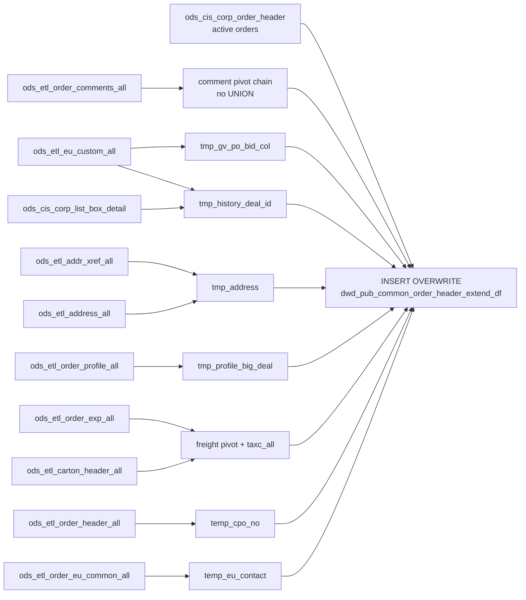

# DWD: Active Order Header Extended — Daily Snapshot (`dwd_pub_common_order_header_extend_df`)

- artifact_type: etl_table
- artifact_id: dw_us.dwd_pub_common_order_header_extend_df
- domain: order
- one_line_purpose: This job is the **active-order counterpart** to `dwd_pub_common_history_header_extend_df`. It produces a daily enriched snapshot of all currently **active/open order headers** (orders that have not yet been archived to history) from `ods_ci...
- layer_type: DWD
- source_kind: etl_sql
- evidence_source: source/etl/sql/order/source/etl/flows/public_order_tools/ingest/public_order_dw/script/dwd_pub_common_order_header_extend_df.sql

---

## L1 Data Foundation

### Identity and physical mapping
- **Table:** `dw_us.dwd_pub_common_order_header_extend_df`
- **Layer type:** DWD
- **Canonical / derived:** Derived / ETL-loaded (see L3)
- **Owner team:** not registered in metadata catalog

### Grain, scope, exclusions
- **Grain:** one row per `(order_type, order_no)` — a unique active order.
- **Scope:** See L2 business purpose / L3 filters
- **Partition:** `date_flag = '${date_flag}'` — literal run date; full partition overwrite. - resolved from pipeline (see L4)
- **Natural key:** `order_type`, `order_no`.
- **Exclusions:** Not documented in repository

#### Grain detail (preserved)

- **Grain:** one row per `(order_type, order_no)` — a unique active order.
- **Partition:** `date_flag = '${date_flag}'` — literal run date; full partition overwrite.
- **Natural key:** `order_type`, `order_no`.

---

### Cross-engine presence
| Engine | Present | Canonical FQN | Notes |
|--------|---------|---------------|-------|
| Hive | yes | `dwd_pub_common_order_header_extend_df` | ETL target / intermediate per evidence script |
| Vertica | pending | `dwd_pub_common_order_header_extend_df` | Confirm via hive2vertica flow evidence / MCP |

### Physical schema reference

Pointer block only - full column catalog lives in WKB L1 storage JSON.

| Field | Value |
|-------|-------|
| **Authoritative catalog** | WKB L1 storage seed (not duplicated in this file) |
| **entity_id** | `dw_us.dwd_pub_common_order_header_extend_df` |
| **l1_catalog_seed** | `target/storage/wkb/snapshots/_snapshot_id_template/l1_catalog/{engine}_{schema}_{table}.json` |
| **column_count** | pending (run ddl_seed_writer) |
| **partition_keys** | `date_flag = '${date_flag}'` |
| **ddl_source** | pending Bitbucket DDL / Vertica metadata ingest |
| **retrieval** | `python -m tools.wkb.indexing.run_query --query "order dwd_pub_common_order_header_extend_df schema" --intent find_table_schema` |

### Lineage
| Object | Role |
|--------|------|
| `ods_${country_code}.ods_cis_corp_order_header` | **Primary source** — active (open) order headers |
| `ods_${country_code}.ods_etl_order_header_all` | CPO chain and MSO chain for active orders |
| (all other enrichment sources) | Same as `dwd_pub_common_history_header_extend_df` using active ODS equivalents |
| `dw_${country_code}.dwd_pub_common_order_header_extend_df` | **Target** — daily snapshot of enriched active order headers |

---

### Freshness and load path
| Item | Value |
|------|-------|
| Load pattern | See L3 end-to-end / INSERT pattern in evidence script |
| Schedule | Not documented in repository |
| Parameters | `country_code`, `date_flag` |


---

## L2 Declarative Knowledge

### Business purpose
This job is the **active-order counterpart** to `dwd_pub_common_history_header_extend_df`. It produces a daily enriched snapshot of all currently **active/open order headers** (orders that have not yet been archived to history) from `ods_cis_corp_order_header`, applying the same comprehensive enrichment: GV entity data, soldto details, sold-to address, order entry person name, comment fields, EU entity contact, deal IDs, big deal number, CPO number, freight expense pivots, tracking numbers, and EU reseller contact. The result is a rich, single-row-per-order view of the entire active order book for real-time pipeline management and operational reporting.

---

### Audience and use cases
| Audience | How they benefit |
|----------|-----------------|
| **Sales / pipeline management** | Complete active order header view with sold-to, GV entity, big deal, CPO number for live pipeline visibility. |
| **Finance / operations** | Freight charges (`frt`, `fds`, `fadd`, `mof`, `cod`, `tax`, `taxc_all`), financial totals, and tracking numbers for in-flight order management. |
| **Channel / compliance** | `from_ref_type`, `sales_model`, `lol_reseller_no`, `big_deal_no`, `cpo_no`, `synnex_po_no`, `mso_no`, `GV_PO_BID_No`. |
| **GV / government-education** | `gv_user_type`, `gv_user_type_desc`, GV entity address and contact for GV program tracking on open orders. |
| **EU / end-user tracking** | Full EU entity block, `eu_deal_id`, EU reseller contact for open orders with EU attachment. |

---

### Fact key resolution
- Natural key: `order_type`, `order_no`.
- FK / label-on attributes: see L3 dimension join patterns and step-by-step logic.
- Negative assertion: do not treat descriptive labels as grain keys unless listed under natural key.

### Time field semantics
- **date_flag / partition columns:** `date_flag = '${date_flag}'` — literal run date; full partition overwrite.
- Primary reporting filter should use the partition column(s) documented in L1; resolve values via L4.


### Metrics served

| Category | Column | Logical metric | Business reading |
|----------|--------|----------------|------------------|
| Measures | — | — | No measure columns mapped for this table. |

### Metric serving map

**Formula authority:** [`source/contracts/order/metric-index.md`](../../source/contracts/order/metric-index.md)

N/A — no measure columns mapped for this table.

### etl_metrics

No governed logical metrics from `source/contracts/order/metric-index.md` are mapped on this table.

---

### Metric serving map
N/A - not a `*_comb_mtd` / multi-period wide serving table (or map not present in legacy doc).


### Data products and column groups (preserved)

All output columns are identical to `dwd_pub_common_history_header_extend_df` with two exceptions:

1. **`data_source`** = hard-coded literal `'ods_cis_corp_order_header'` (not a column from the source table).
2. **Source is active orders** (`ods_cis_corp_order_header`) — orders that have not yet shipped or been archived to history.

See `dwd_pub_common_history_header_extend_df.md` for the complete column reference.

Key fields include: all standard header fields, GV entity block (`gv_user_type/desc/name/addr/contract/contact`), soldto block (`sold_to_cust_no/name/street_address`), comments (`work_load`, `general_comment`, `intel_ipd`, `RS_Contact`, `ship_to_contactname`, `ship_to_contact_email`), EU entity block, deal identifiers (`eu_deal_id`, `GV_PO_BID_No`, `big_deal_no`, `cpo_no`, `synnex_po_no`, `mso_no`), freight pivot (`frt`, `fds`, `fadd`, `mof`, `cod`, `tax`, `taxc_all`, `track_no`), and EU reseller contact (`eu_res_contact`, `eu_res_contact_phone`, `eu_res_contact_email`).

---

### etl_metrics

#### `synnex_po_no`
- **Source:** [metric-index.md](../../source/contracts/order/metric-index.md#synnex_po_no)
- **Business definition:** Internal Synnex PO number for drop-ship type-1 orders.
```sql
CASE WHEN order_type=1 AND from_loc_no=98 AND from_inv_type IN(100,200) THEN int_ref_no ELSE NULL END
```

#### `mso_no`
- **Source:** [metric-index.md](../../source/contracts/order/metric-index.md#mso_no)
- **Business definition:** MSO number from the PO header linked to this SO.
```sql
h2.int_ref_no` via `ods_etl_order_header_all` self-join
```

#### `cpo_no`
- **Source:** [metric-index.md](../../source/contracts/order/metric-index.md#cpo_no)
- **Business definition:** CPO number: from linked SO `ext_ref` for CM orders; otherwise `ext_ref`.
```sql
CASE WHEN order_type IN(1,14) AND int_ref_type=1 THEN cn.cpo_no ELSE h.ext_ref END
```

#### `lol_reseller_no`
- **Source:** [metric-index.md](../../source/contracts/order/metric-index.md#lol_reseller_no)
- **Business definition:** LOL reseller number for agency/LOL sales models only.
```sql
CASE WHEN sales_model IN(1,3) THEN reseller_cust_no ELSE NULL END
```

#### `big_deal_no`
- **Source:** [metric-index.md](../../source/contracts/order/metric-index.md#big_deal_no)
- **Business definition:** Soldto big deal, or SPA_REF_NO profile fallback.
```sql
nvl(s.big_deal_no, tpb.profile_c)
```


---

## L3 Procedural Knowledge

### Query and routing rules
**Business filters:** Use partition / date keys from L1 grain for reporting scope.
**Technical predicates (load only):** See Key filters and step-by-step logic below.

### Dimension join patterns
| Dimension FQN | Join keys | Purpose | Evidence |
|---------------|-----------|---------|----------|
| See step-by-step / base tables | See L3 steps | Dimension enrichment | `source/etl/sql/order/source/etl/flows/public_order_tools/ingest/public_order_dw/script/dwd_pub_common_order_header_extend_df.sql` |

### Key filters and ETL business logic
### Comment pivot — simpler UNION structure

`tmp_order_comments_contact` is built as a simple `MAX` over `tmp_order_comments_col` only — **no UNION with a direct EM/SA query** (unlike the history header script which unions with `ods_etl_order_comments_all`). This means `ship_to_contactname` and `ship_to_contact_email` come from the already-pivoted temp table only.

### CPO number (`temp_cpo_no`) — uses `ods_etl_order_header_all`

For CM/CM-return orders (types 14, 114 with `int_ref_type=1`), the CPO number is resolved by self-joining `ods_etl_order_header_all` (active) rather than `dwd_pub_shipped_order_header`. The chain: `a.int_ref_no = b.order_no AND b.order_type = 1` → `cpo_no = b.ext_ref`.

### MSO number — uses `ods_etl_order_header_all`

The MSO join (`h2`) reads from `ods_etl_order_header_all` (active) where `order_type=2 AND int_ref_type=1`, not from `dwd_pub_shipped_order_header` as in the history script.

### `data_source` — hard-coded literal

`'ods_cis_corp_order_header'` is always written as the `data_source` value — it does not come from the source table itself.

### Key derived columns (same logic as history header)

| Column | Formula | Plain language |
|--------|---------|----------------|
| `synnex_po_no` | `CASE WHEN order_type=1 AND from_loc_no=98 AND from_inv_type IN(100,200) THEN int_ref_no ELSE NULL END` | Internal Synnex PO number for drop-ship type-1 orders. |
| `mso_no` | `h2.int_ref_no` via `ods_etl_order_header_all` self-join | MSO number from th...

### Standard time-filter SQL
```sql
-- relative period filter using resolved partition value (see L4)
SELECT *
FROM dwd_pub_common_order_header_extend_df
WHERE /* partition predicate */ date_flag = '${partition_value}';
```

### End-to-end flow
**Runtime parameters:** `country_code`, `date_flag`
**Target table:** `dw_${country_code}.dwd_pub_common_order_header_extend_df`, partitioned by **`date_flag = '${date_flag}'`**.

1. Build comment pivot: `tmp_order_comments` → `tmp_order_comments_col` → `tmp_order_comments_contact` (simple MAX, no UNION).
2. Build `tmp_gv_po_bid_col` — GV PO BID via EU custom map (PBID).
3. Build `tmp_history_deal_id` — deal ID via EU custom map (CEDM/DEAL ID).
4. Build `tmp_address` — sold-to street address from addr_xref + address.
5. Build `tmp_profile_big_deal` — SPA_REF_NO order-level profile.
6. Build freight pivot: `tmp_extended_exp` + `tmp_extended_exp_taxc_all` + `tmp_etl_carton_header_all` → `tmp_ext_exp_track_no`.
7. Build `temp_cpo_no` — CPO number for types 14/114 via `ods_etl_order_header_all` self-join.
8. Build `temp_eu_contact` — EU reseller contact from `ods_etl_order_eu_common_all`.
9. **INSERT OVERWRITE** from `ods_cis_corp_order_header` (active) with 15 LEFT JOINs.



---


#### High-level stages (preserved)

| Stage | Business meaning |
|-------|-----------------|
| **Comment pivot** | Reads comment types WL, GE, II, EM, L1, SA from `ods_etl_order_comments_all`; pivots into `work_load`, `general_comment`, `intel_ipd`, `RS_Contact`, `ship_to_contactname`, `ship_to_contact_email` per order. |
| **GV PO BID number** | Extracts GV PO BID numbers from EU custom fields (`map_data_desc='PBID'`). |
| **Deal ID** | Resolves EU deal ID from EU custom fields via the `CEDM` list box (`code_desc='DEAL ID'`). |
| **Sold-to address** | Builds `sold_to_street_address` by concatenating `address1a` and `address1b` from the active ADDR_CUST cross-reference. |
| **Big deal number** | Reads active SPA_REF_NO order-level profile as fallback for `big_deal_no`. |
| **Freight expense pivot** | Pivots FRT, FADD, COD, FDS, MOF, TAX expenses per order, plus `taxc_all` (all TAXC-category expenses). |
| **Tracking numbers** | Concatenates all tracking numbers per order with `*` separator. |
| **CPO number** | For CM/CM-return orders (types 14/114 with int_ref_type=1), resolves CPO number from the linked SO's `ext_ref` in `ods_etl_order_header_all`. |
| **EU reseller contact** | Aggregates EU reseller contact details from `ods_etl_order_eu_common_all`. |
| **Final assembly** | Joins `ods_cis_corp_order_header` (active) to all enrichment tables. |

**Parameters:** `country_code`, `date_flag`

---


### Base tables register
| Object | Role in this job |
|--------|-----------------|
| `ods_${country_code}.ods_cis_corp_order_header` | **Primary source.** Active (non-archived) order headers. All orders that have not yet been moved to history. |
| `ods_${country_code}.ods_etl_order_comments_all` | Order comments — types WL/GE/II/EM/L1/SA for comment pivot. |
| `ods_${country_code}.ods_etl_eu_custom_all` | EU custom field values — GV PO BID (PBID) and deal ID (CEDM) lookups. |
| `ods_${country_code}.ods_cis_corp_eu_custom_map` | EU custom map — field-to-description mapping. |
| `ods_${country_code}.ods_cis_corp_list_box_detail` | CEDM list box for deal ID lookup. |
| `dim_${country_code}.dim_pub_list_box_detail` | TAXC code list for `taxc_all` expense sum. |
| `ods_${country_code}.ods_etl_addr_xref_all` | Address cross-reference — resolves sold-to street address. |
| `ods_${country_code}.ods_etl_address_all` | Address detail — `address1a`, `address1b`. |
| `ods_${country_code}.ods_etl_order_profile_all` | Order profiles — SPA_REF_NO at order level for big deal fallback. |
| `ods_${country_code}.ods_etl_order_exp_all` | Order expenses — freight pivot (FRT/FADD/COD/FDS/MOF/TAX) and TAXC total. |
| `ods_${country_code}.ods_etl_carton_header_all` | Carton headers — tracking numbers concatenated per order. |
| `ods_${country_code}.ods_etl_order_header_all` | Two roles: (1) MSO chain (`h2`) for drop-ship SO→PO; (2) CPO chain in `temp_cpo_no` for CM/CM-return orders. |
| `ods_${country_code}.ods_cis_corp_history_gv` | GV record — `gv_user_type`, `gv_contract_no`. |
| `ods_${country_code}.ods_cis_corp_gv_user_type` | GV user type description. |
| `ods_${country_code}.ods_etl_order_soldto_all` | Soldto — `to_acct_no`, `sales_model`, `reseller_cust_no`, `big_deal_no`, `from_ref_type`, `ship_to_phone`, etc. |
| `ods_${country_code}.ods_etl_customer_header_all` | Sold-to customer name. |
| `ods_${country_code}.ods_cis_corp_manager` | Manager name for `order_entry_name`. |
| `ods_${country_code}.ods_etl_order_eu_common_all` | EU common — EU company/address/contact at `order_line_no=0`; also EU reseller contact aggregate. |

---

### Step-by-step logic
### Comment pivot — simpler UNION structure

`tmp_order_comments_contact` is built as a simple `MAX` over `tmp_order_comments_col` only — **no UNION with a direct EM/SA query** (unlike the history header script which unions with `ods_etl_order_comments_all`). This means `ship_to_contactname` and `ship_to_contact_email` come from the already-pivoted temp table only.

### CPO number (`temp_cpo_no`) — uses `ods_etl_order_header_all`

For CM/CM-return orders (types 14, 114 with `int_ref_type=1`), the CPO number is resolved by self-joining `ods_etl_order_header_all` (active) rather than `dwd_pub_shipped_order_header`. The chain: `a.int_ref_no = b.order_no AND b.order_type = 1` → `cpo_no = b.ext_ref`.

### MSO number — uses `ods_etl_order_header_all`

The MSO join (`h2`) reads from `ods_etl_order_header_all` (active) where `order_type=2 AND int_ref_type=1`, not from `dwd_pub_shipped_order_header` as in the history script.

### `data_source` — hard-coded literal

`'ods_cis_corp_order_header'` is always written as the `data_source` value — it does not come from the source table itself.

### Key derived columns (same logic as history header)

| Column | Formula | Plain language |
|--------|---------|----------------|
| `synnex_po_no` | `CASE WHEN order_type=1 AND from_loc_no=98 AND from_inv_type IN(100,200) THEN int_ref_no ELSE NULL END` | Internal Synnex PO number for drop-ship type-1 orders. |
| `mso_no` | `h2.int_ref_no` via `ods_etl_order_header_all` self-join | MSO number from the PO header linked to this SO. |
| `cpo_no` | `CASE WHEN order_type IN(1,14) AND int_ref_type=1 THEN cn.cpo_no ELSE h.ext_ref END` | CPO number: from linked SO `ext_ref` for CM orders; otherwise `ext_ref`. |
| `lol_reseller_no` | `CASE WHEN sales_model IN(1,3) THEN reseller_cust_no ELSE NULL END` | LOL reseller number for agency/LOL sales models only. |
| `big_deal_no` | `nvl(s.big_deal_no, tpb.profile_c)` | Soldto big deal, or SPA_REF_NO profile fallback. |
| `order_entry_name` | `concat(mgr.firstname, ' ', mgr.lastname)` | Full name of the person who entered the order. |
| `entry_year` | `year(h.entry_datetime)` | Calendar year the order was entered. |
| `data_source` | Literal `'ods_cis_corp_order_header'` | Identifies this snapshot as sourced from the active order table. |

---

### Relationship map (embedded)

| from_fqn | to_fqn | cardinality | join_keys | provenance |
|----------|--------|-------------|-----------|------------|
| `ods_${country_code}.ods_etl_order_header_all` | `ods_${country_code}.ods_cis_corp_eu_custom_map` | many:1 | `a.eu_map_id` = `b.eu_map_id`; `a.eu_map_line_no` = `b.eu_map_line_no` | etl_sql (`source/etl/sql/order/public_order_scripts/public_order_dw/script/dwd_pub_common_order_header_extend_df.sql:47`) |
| `ods_${country_code}.ods_etl_eu_custom_all` | `ods_${country_code}.ods_cis_corp_eu_custom_map` | many:1 | `ec.eu_map_id` = `ecm.eu_map_id`; `ec.eu_map_line_no` = `ecm.eu_map_line_no` | etl_sql (`source/etl/sql/order/public_order_scripts/public_order_dw/script/dwd_pub_common_order_header_extend_df.sql:62`) |
| `ods_${country_code}.ods_cis_corp_eu_custom_map` | `ods_${country_code}.ods_cis_corp_list_box_detail` | many:1 | `lbd.code_value` = `ecm.map_data_desc` | etl_sql (`source/etl/sql/order/public_order_scripts/public_order_dw/script/dwd_pub_common_order_header_extend_df.sql:66`) |
| `ods_${country_code}.ods_etl_addr_xref_all` | `ods_${country_code}.ods_etl_address_all` | many:1 | `ax.addr_no` = `addr.addr_no` | etl_sql (`source/etl/sql/order/public_order_scripts/public_order_dw/script/dwd_pub_common_order_header_extend_df.sql:84`) |
| `ods_${country_code}.ods_etl_order_header_all` | `tmp_extended_exp_taxc_all` | many:1 (LEFT) | `a.order_type` = `b.order_type`; `a.order_no` = `b.order_no` | etl_sql (`source/etl/sql/order/public_order_scripts/public_order_dw/script/dwd_pub_common_order_header_extend_df.sql:156`) |
| `ods_${country_code}.ods_etl_order_header_all` | `tmp_etl_carton_header_all` | many:1 (LEFT) | `a.order_type` = `c.order_type`; `a.order_no` = `c.order_no` | etl_sql (`source/etl/sql/order/public_order_scripts/public_order_dw/script/dwd_pub_common_order_header_extend_df.sql:159`) |
| `ods_${country_code}.ods_etl_order_header_all` | `ods_${country_code}.ods_etl_order_header_all` | many:1 (LEFT) | `a.int_ref_no` = `b.order_no`; `a.int_ref_type` = `b.order_type` | etl_sql (`source/etl/sql/order/public_order_scripts/public_order_dw/script/dwd_pub_common_order_header_extend_df.sql:170`) |
| `ods_${country_code}.ods_cis_corp_order_header` | `ods_${country_code}.ods_cis_corp_history_gv` | many:1 (LEFT) | `h.order_no` = `g.order_no`; `h.order_type` = `g.order_type` | etl_sql (`source/etl/sql/order/public_order_scripts/public_order_dw/script/dwd_pub_common_order_header_extend_df.sql:347`) |
| `ods_${country_code}.ods_cis_corp_order_header` | `tmp_gv_po_bid_col` | many:1 (LEFT) | `h.order_no` = `gpb.order_no`; `h.order_type` = `gpb.order_type` | etl_sql (`source/etl/sql/order/public_order_scripts/public_order_dw/script/dwd_pub_common_order_header_extend_df.sql:351`) |
| `ods_${country_code}.ods_cis_corp_history_gv` | `ods_${country_code}.ods_cis_corp_gv_user_type` | many:1 (LEFT) | `gut.gv_user_type` = `g.gv_user_type` | etl_sql (`source/etl/sql/order/public_order_scripts/public_order_dw/script/dwd_pub_common_order_header_extend_df.sql:355`) |
| `ods_${country_code}.ods_cis_corp_order_header` | `ods_${country_code}.ods_etl_order_soldto_all` | many:1 (LEFT) | `h.order_no` = `s.order_no`; `h.order_type` = `s.order_type` | etl_sql (`source/etl/sql/order/public_order_scripts/public_order_dw/script/dwd_pub_common_order_header_extend_df.sql:358`) |
| `ods_${country_code}.ods_etl_order_soldto_all` | `ods_${country_code}.ods_etl_customer_header_all` | many:1 (LEFT) | `s.to_acct_no` = `ch.cust_no` | etl_sql (`source/etl/sql/order/public_order_scripts/public_order_dw/script/dwd_pub_common_order_header_extend_df.sql:362`) |
| `ods_${country_code}.ods_etl_order_soldto_all` | `tmp_address` | many:1 (LEFT) | `s.to_acct_no` = `addr.xref_no`; `s.to_loc_no` = `addr.xref_seq` | etl_sql (`source/etl/sql/order/public_order_scripts/public_order_dw/script/dwd_pub_common_order_header_extend_df.sql:365`) |
| `ods_${country_code}.ods_cis_corp_order_header` | `ods_${country_code}.ods_cis_corp_manager` | many:1 (LEFT) | `mgr.userid` = `h.entry_id` | etl_sql (`source/etl/sql/order/public_order_scripts/public_order_dw/script/dwd_pub_common_order_header_extend_df.sql:368`) |
| `ods_${country_code}.ods_cis_corp_order_header` | `tmp_order_comments_col` | many:1 (LEFT) | `h.order_no` = `hc.order_no`; `h.order_type` = `hc.order_type` | etl_sql (`source/etl/sql/order/public_order_scripts/public_order_dw/script/dwd_pub_common_order_header_extend_df.sql:371`) |
| `ods_${country_code}.ods_cis_corp_order_header` | `tmp_order_comments_contact` | many:1 (LEFT) | `h.order_no` = `ohc.order_no`; `h.order_type` = `ohc.order_type` | etl_sql (`source/etl/sql/order/public_order_scripts/public_order_dw/script/dwd_pub_common_order_header_extend_df.sql:375`) |
| `ods_${country_code}.ods_etl_order_comments_all` | `ods_${country_code}.ods_etl_order_header_all` | many:1 (LEFT) | h2.order_no = (case when h.order_type = 1 and h.from_loc_no = 98 and h.from_inv_type in (100, 200) then h.int_ref_no else null end) and h2.order_type = 2 and... | etl_sql (`source/etl/sql/order/public_order_scripts/public_order_dw/script/dwd_pub_common_order_header_extend_df.sql:379`) |
| `ods_${country_code}.ods_cis_corp_order_header` | `ods_${country_code}.ods_etl_order_eu_common_all` | many:1 (LEFT) | `h.order_no` = `hec.order_no`; `h.order_type` = `hec.order_type` | etl_sql (`source/etl/sql/order/public_order_scripts/public_order_dw/script/dwd_pub_common_order_header_extend_df.sql:390`) |
| `ods_${country_code}.ods_cis_corp_order_header` | `tmp_history_deal_id` | many:1 (LEFT) | `h.order_no` = `hdi.order_no`; `h.order_type` = `hdi.order_type` | etl_sql (`source/etl/sql/order/public_order_scripts/public_order_dw/script/dwd_pub_common_order_header_extend_df.sql:395`) |
| `ods_${country_code}.ods_cis_corp_order_header` | `tmp_profile_big_deal` | many:1 (LEFT) | `h.order_no` = `tpb.order_no`; `h.order_type` = `tpb.order_type` | etl_sql (`source/etl/sql/order/public_order_scripts/public_order_dw/script/dwd_pub_common_order_header_extend_df.sql:399`) |
| `ods_${country_code}.ods_cis_corp_order_header` | `tmp_ext_exp_track_no` | many:1 (LEFT) | `h.order_type` = `exp.order_type`; `h.order_no` = `exp.order_no` | etl_sql (`source/etl/sql/order/public_order_scripts/public_order_dw/script/dwd_pub_common_order_header_extend_df.sql:402`) |
| `ods_${country_code}.ods_cis_corp_order_header` | `temp_cpo_no` | many:1 (LEFT) | `h.order_no` = `cn.order_no`; `h.order_type` = `cn.order_type` | etl_sql (`source/etl/sql/order/public_order_scripts/public_order_dw/script/dwd_pub_common_order_header_extend_df.sql:405`) |
| `ods_${country_code}.ods_cis_corp_order_header` | `temp_eu_contact` | many:1 (LEFT) | `h.order_no` = `tec.order_no`; `h.order_type` = `tec.order_type` | etl_sql (`source/etl/sql/order/public_order_scripts/public_order_dw/script/dwd_pub_common_order_header_extend_df.sql:408`) |

### Special logic (embedded)

Not documented in repository

### Column / field derivations (from ETL SQL)

| target_column | expression_sql | upstream_columns | upstream_tables | transform_kind | evidence |
|---------------|----------------|------------------|-----------------|----------------|----------|
| `order_type` | `h.order_type` | `order_type` | `ods_${country_code}.ods_cis_corp_order_header`, `ods_${country_code}.ods_cis_corp_history_gv`, `tmp_gv_po_bid_col`, `ods_${country_code}.ods_cis_corp_gv_user_type`, `ods_${country_code}.ods_etl_order_soldto_all`, `ods_${country_code}.ods_etl_customer_header_all`, `tmp_address`, `ods_${country_code}.ods_cis_corp_manager`, `tmp_order_comments_col`, `tmp_order_comments_contact`, `ods_${country_code}.ods_etl_order_header_all`, `ods_${country_code}.ods_etl_order_eu_common_all` | passthrough | `source/etl/sql/order/public_order_scripts/public_order_dw/script/dwd_pub_common_order_header_extend_df.sql:192` |
| `order_no` | `h.order_no` | `order_no` | `ods_${country_code}.ods_cis_corp_order_header`, `ods_${country_code}.ods_cis_corp_history_gv`, `tmp_gv_po_bid_col`, `ods_${country_code}.ods_cis_corp_gv_user_type`, `ods_${country_code}.ods_etl_order_soldto_all`, `ods_${country_code}.ods_etl_customer_header_all`, `tmp_address`, `ods_${country_code}.ods_cis_corp_manager`, `tmp_order_comments_col`, `tmp_order_comments_contact`, `ods_${country_code}.ods_etl_order_header_all`, `ods_${country_code}.ods_etl_order_eu_common_all` | passthrough | `source/etl/sql/order/public_order_scripts/public_order_dw/script/dwd_pub_common_order_header_extend_df.sql:193` |
| `from_acct_no` | `h.from_acct_no` | `from_acct_no` | `ods_${country_code}.ods_cis_corp_order_header`, `ods_${country_code}.ods_cis_corp_history_gv`, `tmp_gv_po_bid_col`, `ods_${country_code}.ods_cis_corp_gv_user_type`, `ods_${country_code}.ods_etl_order_soldto_all`, `ods_${country_code}.ods_etl_customer_header_all`, `tmp_address`, `ods_${country_code}.ods_cis_corp_manager`, `tmp_order_comments_col`, `tmp_order_comments_contact`, `ods_${country_code}.ods_etl_order_header_all`, `ods_${country_code}.ods_etl_order_eu_common_all` | passthrough | `source/etl/sql/order/public_order_scripts/public_order_dw/script/dwd_pub_common_order_header_extend_df.sql:194` |
| `from_loc_no` | `h.from_loc_no` | `from_loc_no` | `ods_${country_code}.ods_cis_corp_order_header`, `ods_${country_code}.ods_cis_corp_history_gv`, `tmp_gv_po_bid_col`, `ods_${country_code}.ods_cis_corp_gv_user_type`, `ods_${country_code}.ods_etl_order_soldto_all`, `ods_${country_code}.ods_etl_customer_header_all`, `tmp_address`, `ods_${country_code}.ods_cis_corp_manager`, `tmp_order_comments_col`, `tmp_order_comments_contact`, `ods_${country_code}.ods_etl_order_header_all`, `ods_${country_code}.ods_etl_order_eu_common_all` | passthrough | `source/etl/sql/order/public_order_scripts/public_order_dw/script/dwd_pub_common_order_header_extend_df.sql:195` |
| `from_contact_no` | `h.from_contact_no` | `from_contact_no` | `ods_${country_code}.ods_cis_corp_order_header`, `ods_${country_code}.ods_cis_corp_history_gv`, `tmp_gv_po_bid_col`, `ods_${country_code}.ods_cis_corp_gv_user_type`, `ods_${country_code}.ods_etl_order_soldto_all`, `ods_${country_code}.ods_etl_customer_header_all`, `tmp_address`, `ods_${country_code}.ods_cis_corp_manager`, `tmp_order_comments_col`, `tmp_order_comments_contact`, `ods_${country_code}.ods_etl_order_header_all`, `ods_${country_code}.ods_etl_order_eu_common_all` | passthrough | `source/etl/sql/order/public_order_scripts/public_order_dw/script/dwd_pub_common_order_header_extend_df.sql:196` |
| `from_dept_no` | `h.from_dept_no` | `from_dept_no` | `ods_${country_code}.ods_cis_corp_order_header`, `ods_${country_code}.ods_cis_corp_history_gv`, `tmp_gv_po_bid_col`, `ods_${country_code}.ods_cis_corp_gv_user_type`, `ods_${country_code}.ods_etl_order_soldto_all`, `ods_${country_code}.ods_etl_customer_header_all`, `tmp_address`, `ods_${country_code}.ods_cis_corp_manager`, `tmp_order_comments_col`, `tmp_order_comments_contact`, `ods_${country_code}.ods_etl_order_header_all`, `ods_${country_code}.ods_etl_order_eu_common_all` | passthrough | `source/etl/sql/order/public_order_scripts/public_order_dw/script/dwd_pub_common_order_header_extend_df.sql:197` |
| `from_inv_type` | `h.from_inv_type` | `from_inv_type` | `ods_${country_code}.ods_cis_corp_order_header`, `ods_${country_code}.ods_cis_corp_history_gv`, `tmp_gv_po_bid_col`, `ods_${country_code}.ods_cis_corp_gv_user_type`, `ods_${country_code}.ods_etl_order_soldto_all`, `ods_${country_code}.ods_etl_customer_header_all`, `tmp_address`, `ods_${country_code}.ods_cis_corp_manager`, `tmp_order_comments_col`, `tmp_order_comments_contact`, `ods_${country_code}.ods_etl_order_header_all`, `ods_${country_code}.ods_etl_order_eu_common_all` | passthrough | `source/etl/sql/order/public_order_scripts/public_order_dw/script/dwd_pub_common_order_header_extend_df.sql:198` |
| `to_acct_no` | `h.to_acct_no` | `to_acct_no` | `ods_${country_code}.ods_cis_corp_order_header`, `ods_${country_code}.ods_cis_corp_history_gv`, `tmp_gv_po_bid_col`, `ods_${country_code}.ods_cis_corp_gv_user_type`, `ods_${country_code}.ods_etl_order_soldto_all`, `ods_${country_code}.ods_etl_customer_header_all`, `tmp_address`, `ods_${country_code}.ods_cis_corp_manager`, `tmp_order_comments_col`, `tmp_order_comments_contact`, `ods_${country_code}.ods_etl_order_header_all`, `ods_${country_code}.ods_etl_order_eu_common_all` | passthrough | `source/etl/sql/order/public_order_scripts/public_order_dw/script/dwd_pub_common_order_header_extend_df.sql:199` |
| `to_loc_no` | `h.to_loc_no` | `to_loc_no` | `ods_${country_code}.ods_cis_corp_order_header`, `ods_${country_code}.ods_cis_corp_history_gv`, `tmp_gv_po_bid_col`, `ods_${country_code}.ods_cis_corp_gv_user_type`, `ods_${country_code}.ods_etl_order_soldto_all`, `ods_${country_code}.ods_etl_customer_header_all`, `tmp_address`, `ods_${country_code}.ods_cis_corp_manager`, `tmp_order_comments_col`, `tmp_order_comments_contact`, `ods_${country_code}.ods_etl_order_header_all`, `ods_${country_code}.ods_etl_order_eu_common_all` | passthrough | `source/etl/sql/order/public_order_scripts/public_order_dw/script/dwd_pub_common_order_header_extend_df.sql:200` |
| `to_contact_no` | `h.to_contact_no` | `to_contact_no` | `ods_${country_code}.ods_cis_corp_order_header`, `ods_${country_code}.ods_cis_corp_history_gv`, `tmp_gv_po_bid_col`, `ods_${country_code}.ods_cis_corp_gv_user_type`, `ods_${country_code}.ods_etl_order_soldto_all`, `ods_${country_code}.ods_etl_customer_header_all`, `tmp_address`, `ods_${country_code}.ods_cis_corp_manager`, `tmp_order_comments_col`, `tmp_order_comments_contact`, `ods_${country_code}.ods_etl_order_header_all`, `ods_${country_code}.ods_etl_order_eu_common_all` | passthrough | `source/etl/sql/order/public_order_scripts/public_order_dw/script/dwd_pub_common_order_header_extend_df.sql:201` |
| `to_dept_no` | `h.to_dept_no` | `to_dept_no` | `ods_${country_code}.ods_cis_corp_order_header`, `ods_${country_code}.ods_cis_corp_history_gv`, `tmp_gv_po_bid_col`, `ods_${country_code}.ods_cis_corp_gv_user_type`, `ods_${country_code}.ods_etl_order_soldto_all`, `ods_${country_code}.ods_etl_customer_header_all`, `tmp_address`, `ods_${country_code}.ods_cis_corp_manager`, `tmp_order_comments_col`, `tmp_order_comments_contact`, `ods_${country_code}.ods_etl_order_header_all`, `ods_${country_code}.ods_etl_order_eu_common_all` | passthrough | `source/etl/sql/order/public_order_scripts/public_order_dw/script/dwd_pub_common_order_header_extend_df.sql:202` |
| `to_inv_type` | `h.to_inv_type` | `to_inv_type` | `ods_${country_code}.ods_cis_corp_order_header`, `ods_${country_code}.ods_cis_corp_history_gv`, `tmp_gv_po_bid_col`, `ods_${country_code}.ods_cis_corp_gv_user_type`, `ods_${country_code}.ods_etl_order_soldto_all`, `ods_${country_code}.ods_etl_customer_header_all`, `tmp_address`, `ods_${country_code}.ods_cis_corp_manager`, `tmp_order_comments_col`, `tmp_order_comments_contact`, `ods_${country_code}.ods_etl_order_header_all`, `ods_${country_code}.ods_etl_order_eu_common_all` | passthrough | `source/etl/sql/order/public_order_scripts/public_order_dw/script/dwd_pub_common_order_header_extend_df.sql:203` |
| `ship_to_name` | `h.ship_to_name` | `ship_to_name` | `ods_${country_code}.ods_cis_corp_order_header`, `ods_${country_code}.ods_cis_corp_history_gv`, `tmp_gv_po_bid_col`, `ods_${country_code}.ods_cis_corp_gv_user_type`, `ods_${country_code}.ods_etl_order_soldto_all`, `ods_${country_code}.ods_etl_customer_header_all`, `tmp_address`, `ods_${country_code}.ods_cis_corp_manager`, `tmp_order_comments_col`, `tmp_order_comments_contact`, `ods_${country_code}.ods_etl_order_header_all`, `ods_${country_code}.ods_etl_order_eu_common_all` | passthrough | `source/etl/sql/order/public_order_scripts/public_order_dw/script/dwd_pub_common_order_header_extend_df.sql:204` |
| `ship_to_addr` | `h.ship_to_addr` | `ship_to_addr` | `ods_${country_code}.ods_cis_corp_order_header`, `ods_${country_code}.ods_cis_corp_history_gv`, `tmp_gv_po_bid_col`, `ods_${country_code}.ods_cis_corp_gv_user_type`, `ods_${country_code}.ods_etl_order_soldto_all`, `ods_${country_code}.ods_etl_customer_header_all`, `tmp_address`, `ods_${country_code}.ods_cis_corp_manager`, `tmp_order_comments_col`, `tmp_order_comments_contact`, `ods_${country_code}.ods_etl_order_header_all`, `ods_${country_code}.ods_etl_order_eu_common_all` | passthrough | `source/etl/sql/order/public_order_scripts/public_order_dw/script/dwd_pub_common_order_header_extend_df.sql:205` |
| `ship_to_po_box` | `h.ship_to_po_box` | `ship_to_po_box` | `ods_${country_code}.ods_cis_corp_order_header`, `ods_${country_code}.ods_cis_corp_history_gv`, `tmp_gv_po_bid_col`, `ods_${country_code}.ods_cis_corp_gv_user_type`, `ods_${country_code}.ods_etl_order_soldto_all`, `ods_${country_code}.ods_etl_customer_header_all`, `tmp_address`, `ods_${country_code}.ods_cis_corp_manager`, `tmp_order_comments_col`, `tmp_order_comments_contact`, `ods_${country_code}.ods_etl_order_header_all`, `ods_${country_code}.ods_etl_order_eu_common_all` | passthrough | `source/etl/sql/order/public_order_scripts/public_order_dw/script/dwd_pub_common_order_header_extend_df.sql:206` |
| `ship_to_city` | `h.ship_to_city` | `ship_to_city` | `ods_${country_code}.ods_cis_corp_order_header`, `ods_${country_code}.ods_cis_corp_history_gv`, `tmp_gv_po_bid_col`, `ods_${country_code}.ods_cis_corp_gv_user_type`, `ods_${country_code}.ods_etl_order_soldto_all`, `ods_${country_code}.ods_etl_customer_header_all`, `tmp_address`, `ods_${country_code}.ods_cis_corp_manager`, `tmp_order_comments_col`, `tmp_order_comments_contact`, `ods_${country_code}.ods_etl_order_header_all`, `ods_${country_code}.ods_etl_order_eu_common_all` | passthrough | `source/etl/sql/order/public_order_scripts/public_order_dw/script/dwd_pub_common_order_header_extend_df.sql:207` |
| `ship_to_state` | `h.ship_to_state` | `ship_to_state` | `ods_${country_code}.ods_cis_corp_order_header`, `ods_${country_code}.ods_cis_corp_history_gv`, `tmp_gv_po_bid_col`, `ods_${country_code}.ods_cis_corp_gv_user_type`, `ods_${country_code}.ods_etl_order_soldto_all`, `ods_${country_code}.ods_etl_customer_header_all`, `tmp_address`, `ods_${country_code}.ods_cis_corp_manager`, `tmp_order_comments_col`, `tmp_order_comments_contact`, `ods_${country_code}.ods_etl_order_header_all`, `ods_${country_code}.ods_etl_order_eu_common_all` | passthrough | `source/etl/sql/order/public_order_scripts/public_order_dw/script/dwd_pub_common_order_header_extend_df.sql:208` |
| `ship_to_country` | `h.ship_to_country` | `ship_to_country` | `ods_${country_code}.ods_cis_corp_order_header`, `ods_${country_code}.ods_cis_corp_history_gv`, `tmp_gv_po_bid_col`, `ods_${country_code}.ods_cis_corp_gv_user_type`, `ods_${country_code}.ods_etl_order_soldto_all`, `ods_${country_code}.ods_etl_customer_header_all`, `tmp_address`, `ods_${country_code}.ods_cis_corp_manager`, `tmp_order_comments_col`, `tmp_order_comments_contact`, `ods_${country_code}.ods_etl_order_header_all`, `ods_${country_code}.ods_etl_order_eu_common_all` | passthrough | `source/etl/sql/order/public_order_scripts/public_order_dw/script/dwd_pub_common_order_header_extend_df.sql:209` |
| `ship_to_zip` | `h.ship_to_zip` | `ship_to_zip` | `ods_${country_code}.ods_cis_corp_order_header`, `ods_${country_code}.ods_cis_corp_history_gv`, `tmp_gv_po_bid_col`, `ods_${country_code}.ods_cis_corp_gv_user_type`, `ods_${country_code}.ods_etl_order_soldto_all`, `ods_${country_code}.ods_etl_customer_header_all`, `tmp_address`, `ods_${country_code}.ods_cis_corp_manager`, `tmp_order_comments_col`, `tmp_order_comments_contact`, `ods_${country_code}.ods_etl_order_header_all`, `ods_${country_code}.ods_etl_order_eu_common_all` | passthrough | `source/etl/sql/order/public_order_scripts/public_order_dw/script/dwd_pub_common_order_header_extend_df.sql:210` |
| `account_rep` | `h.account_rep` | `account_rep` | `ods_${country_code}.ods_cis_corp_order_header`, `ods_${country_code}.ods_cis_corp_history_gv`, `tmp_gv_po_bid_col`, `ods_${country_code}.ods_cis_corp_gv_user_type`, `ods_${country_code}.ods_etl_order_soldto_all`, `ods_${country_code}.ods_etl_customer_header_all`, `tmp_address`, `ods_${country_code}.ods_cis_corp_manager`, `tmp_order_comments_col`, `tmp_order_comments_contact`, `ods_${country_code}.ods_etl_order_header_all`, `ods_${country_code}.ods_etl_order_eu_common_all` | passthrough | `source/etl/sql/order/public_order_scripts/public_order_dw/script/dwd_pub_common_order_header_extend_df.sql:211` |
| `mt_expense_code` | `trim(h.mt_expense_code)` | `mt_expense_code` | `ods_${country_code}.ods_cis_corp_order_header`, `ods_${country_code}.ods_cis_corp_history_gv`, `tmp_gv_po_bid_col`, `ods_${country_code}.ods_cis_corp_gv_user_type`, `ods_${country_code}.ods_etl_order_soldto_all`, `ods_${country_code}.ods_etl_customer_header_all`, `tmp_address`, `ods_${country_code}.ods_cis_corp_manager`, `tmp_order_comments_col`, `tmp_order_comments_contact`, `ods_${country_code}.ods_etl_order_header_all`, `ods_${country_code}.ods_etl_order_eu_common_all` | udf | `source/etl/sql/order/public_order_scripts/public_order_dw/script/dwd_pub_common_order_header_extend_df.sql:212` |
| `int_ref_no` | `h.int_ref_no` | `int_ref_no` | `ods_${country_code}.ods_cis_corp_order_header`, `ods_${country_code}.ods_cis_corp_history_gv`, `tmp_gv_po_bid_col`, `ods_${country_code}.ods_cis_corp_gv_user_type`, `ods_${country_code}.ods_etl_order_soldto_all`, `ods_${country_code}.ods_etl_customer_header_all`, `tmp_address`, `ods_${country_code}.ods_cis_corp_manager`, `tmp_order_comments_col`, `tmp_order_comments_contact`, `ods_${country_code}.ods_etl_order_header_all`, `ods_${country_code}.ods_etl_order_eu_common_all` | passthrough | `source/etl/sql/order/public_order_scripts/public_order_dw/script/dwd_pub_common_order_header_extend_df.sql:213` |
| `int_ref_type` | `h.int_ref_type` | `int_ref_type` | `ods_${country_code}.ods_cis_corp_order_header`, `ods_${country_code}.ods_cis_corp_history_gv`, `tmp_gv_po_bid_col`, `ods_${country_code}.ods_cis_corp_gv_user_type`, `ods_${country_code}.ods_etl_order_soldto_all`, `ods_${country_code}.ods_etl_customer_header_all`, `tmp_address`, `ods_${country_code}.ods_cis_corp_manager`, `tmp_order_comments_col`, `tmp_order_comments_contact`, `ods_${country_code}.ods_etl_order_header_all`, `ods_${country_code}.ods_etl_order_eu_common_all` | passthrough | `source/etl/sql/order/public_order_scripts/public_order_dw/script/dwd_pub_common_order_header_extend_df.sql:214` |
| `ext_ref` | `h.ext_ref` | `ext_ref` | `ods_${country_code}.ods_cis_corp_order_header`, `ods_${country_code}.ods_cis_corp_history_gv`, `tmp_gv_po_bid_col`, `ods_${country_code}.ods_cis_corp_gv_user_type`, `ods_${country_code}.ods_etl_order_soldto_all`, `ods_${country_code}.ods_etl_customer_header_all`, `tmp_address`, `ods_${country_code}.ods_cis_corp_manager`, `tmp_order_comments_col`, `tmp_order_comments_contact`, `ods_${country_code}.ods_etl_order_header_all`, `ods_${country_code}.ods_etl_order_eu_common_all` | passthrough | `source/etl/sql/order/public_order_scripts/public_order_dw/script/dwd_pub_common_order_header_extend_df.sql:215` |
| `issue_date` | `h.issue_date` | `issue_date` | `ods_${country_code}.ods_cis_corp_order_header`, `ods_${country_code}.ods_cis_corp_history_gv`, `tmp_gv_po_bid_col`, `ods_${country_code}.ods_cis_corp_gv_user_type`, `ods_${country_code}.ods_etl_order_soldto_all`, `ods_${country_code}.ods_etl_customer_header_all`, `tmp_address`, `ods_${country_code}.ods_cis_corp_manager`, `tmp_order_comments_col`, `tmp_order_comments_contact`, `ods_${country_code}.ods_etl_order_header_all`, `ods_${country_code}.ods_etl_order_eu_common_all` | passthrough | `source/etl/sql/order/public_order_scripts/public_order_dw/script/dwd_pub_common_order_header_extend_df.sql:216` |
| `credit_rel_date` | `h.credit_rel_date` | `credit_rel_date` | `ods_${country_code}.ods_cis_corp_order_header`, `ods_${country_code}.ods_cis_corp_history_gv`, `tmp_gv_po_bid_col`, `ods_${country_code}.ods_cis_corp_gv_user_type`, `ods_${country_code}.ods_etl_order_soldto_all`, `ods_${country_code}.ods_etl_customer_header_all`, `tmp_address`, `ods_${country_code}.ods_cis_corp_manager`, `tmp_order_comments_col`, `tmp_order_comments_contact`, `ods_${country_code}.ods_etl_order_header_all`, `ods_${country_code}.ods_etl_order_eu_common_all` | passthrough | `source/etl/sql/order/public_order_scripts/public_order_dw/script/dwd_pub_common_order_header_extend_df.sql:217` |
| `pick_date` | `h.pick_date` | `pick_date` | `ods_${country_code}.ods_cis_corp_order_header`, `ods_${country_code}.ods_cis_corp_history_gv`, `tmp_gv_po_bid_col`, `ods_${country_code}.ods_cis_corp_gv_user_type`, `ods_${country_code}.ods_etl_order_soldto_all`, `ods_${country_code}.ods_etl_customer_header_all`, `tmp_address`, `ods_${country_code}.ods_cis_corp_manager`, `tmp_order_comments_col`, `tmp_order_comments_contact`, `ods_${country_code}.ods_etl_order_header_all`, `ods_${country_code}.ods_etl_order_eu_common_all` | passthrough | `source/etl/sql/order/public_order_scripts/public_order_dw/script/dwd_pub_common_order_header_extend_df.sql:218` |
| `manifest_date` | `h.manifest_date` | `manifest_date` | `ods_${country_code}.ods_cis_corp_order_header`, `ods_${country_code}.ods_cis_corp_history_gv`, `tmp_gv_po_bid_col`, `ods_${country_code}.ods_cis_corp_gv_user_type`, `ods_${country_code}.ods_etl_order_soldto_all`, `ods_${country_code}.ods_etl_customer_header_all`, `tmp_address`, `ods_${country_code}.ods_cis_corp_manager`, `tmp_order_comments_col`, `tmp_order_comments_contact`, `ods_${country_code}.ods_etl_order_header_all`, `ods_${country_code}.ods_etl_order_eu_common_all` | passthrough | `source/etl/sql/order/public_order_scripts/public_order_dw/script/dwd_pub_common_order_header_extend_df.sql:219` |
| `ship_date` | `h.ship_date` | `ship_date` | `ods_${country_code}.ods_cis_corp_order_header`, `ods_${country_code}.ods_cis_corp_history_gv`, `tmp_gv_po_bid_col`, `ods_${country_code}.ods_cis_corp_gv_user_type`, `ods_${country_code}.ods_etl_order_soldto_all`, `ods_${country_code}.ods_etl_customer_header_all`, `tmp_address`, `ods_${country_code}.ods_cis_corp_manager`, `tmp_order_comments_col`, `tmp_order_comments_contact`, `ods_${country_code}.ods_etl_order_header_all`, `ods_${country_code}.ods_etl_order_eu_common_all` | passthrough | `source/etl/sql/order/public_order_scripts/public_order_dw/script/dwd_pub_common_order_header_extend_df.sql:220` |
| `invoice_date` | `h.invoice_date` | `invoice_date` | `ods_${country_code}.ods_cis_corp_order_header`, `ods_${country_code}.ods_cis_corp_history_gv`, `tmp_gv_po_bid_col`, `ods_${country_code}.ods_cis_corp_gv_user_type`, `ods_${country_code}.ods_etl_order_soldto_all`, `ods_${country_code}.ods_etl_customer_header_all`, `tmp_address`, `ods_${country_code}.ods_cis_corp_manager`, `tmp_order_comments_col`, `tmp_order_comments_contact`, `ods_${country_code}.ods_etl_order_header_all`, `ods_${country_code}.ods_etl_order_eu_common_all` | passthrough | `source/etl/sql/order/public_order_scripts/public_order_dw/script/dwd_pub_common_order_header_extend_df.sql:221` |
| `posting_date` | `h.posting_date` | `posting_date` | `ods_${country_code}.ods_cis_corp_order_header`, `ods_${country_code}.ods_cis_corp_history_gv`, `tmp_gv_po_bid_col`, `ods_${country_code}.ods_cis_corp_gv_user_type`, `ods_${country_code}.ods_etl_order_soldto_all`, `ods_${country_code}.ods_etl_customer_header_all`, `tmp_address`, `ods_${country_code}.ods_cis_corp_manager`, `tmp_order_comments_col`, `tmp_order_comments_contact`, `ods_${country_code}.ods_etl_order_header_all`, `ods_${country_code}.ods_etl_order_eu_common_all` | passthrough | `source/etl/sql/order/public_order_scripts/public_order_dw/script/dwd_pub_common_order_header_extend_df.sql:222` |
| `expected_date` | `h.expected_date` | `expected_date` | `ods_${country_code}.ods_cis_corp_order_header`, `ods_${country_code}.ods_cis_corp_history_gv`, `tmp_gv_po_bid_col`, `ods_${country_code}.ods_cis_corp_gv_user_type`, `ods_${country_code}.ods_etl_order_soldto_all`, `ods_${country_code}.ods_etl_customer_header_all`, `tmp_address`, `ods_${country_code}.ods_cis_corp_manager`, `tmp_order_comments_col`, `tmp_order_comments_contact`, `ods_${country_code}.ods_etl_order_header_all`, `ods_${country_code}.ods_etl_order_eu_common_all` | passthrough | `source/etl/sql/order/public_order_scripts/public_order_dw/script/dwd_pub_common_order_header_extend_df.sql:223` |
| `receiving_date` | `h.receiving_date` | `receiving_date` | `ods_${country_code}.ods_cis_corp_order_header`, `ods_${country_code}.ods_cis_corp_history_gv`, `tmp_gv_po_bid_col`, `ods_${country_code}.ods_cis_corp_gv_user_type`, `ods_${country_code}.ods_etl_order_soldto_all`, `ods_${country_code}.ods_etl_customer_header_all`, `tmp_address`, `ods_${country_code}.ods_cis_corp_manager`, `tmp_order_comments_col`, `tmp_order_comments_contact`, `ods_${country_code}.ods_etl_order_header_all`, `ods_${country_code}.ods_etl_order_eu_common_all` | passthrough | `source/etl/sql/order/public_order_scripts/public_order_dw/script/dwd_pub_common_order_header_extend_df.sql:224` |
| `closed_date` | `h.closed_date` | `closed_date` | `ods_${country_code}.ods_cis_corp_order_header`, `ods_${country_code}.ods_cis_corp_history_gv`, `tmp_gv_po_bid_col`, `ods_${country_code}.ods_cis_corp_gv_user_type`, `ods_${country_code}.ods_etl_order_soldto_all`, `ods_${country_code}.ods_etl_customer_header_all`, `tmp_address`, `ods_${country_code}.ods_cis_corp_manager`, `tmp_order_comments_col`, `tmp_order_comments_contact`, `ods_${country_code}.ods_etl_order_header_all`, `ods_${country_code}.ods_etl_order_eu_common_all` | passthrough | `source/etl/sql/order/public_order_scripts/public_order_dw/script/dwd_pub_common_order_header_extend_df.sql:225` |
| `printed_date` | `h.printed_date` | `printed_date` | `ods_${country_code}.ods_cis_corp_order_header`, `ods_${country_code}.ods_cis_corp_history_gv`, `tmp_gv_po_bid_col`, `ods_${country_code}.ods_cis_corp_gv_user_type`, `ods_${country_code}.ods_etl_order_soldto_all`, `ods_${country_code}.ods_etl_customer_header_all`, `tmp_address`, `ods_${country_code}.ods_cis_corp_manager`, `tmp_order_comments_col`, `tmp_order_comments_contact`, `ods_${country_code}.ods_etl_order_header_all`, `ods_${country_code}.ods_etl_order_eu_common_all` | passthrough | `source/etl/sql/order/public_order_scripts/public_order_dw/script/dwd_pub_common_order_header_extend_df.sql:226` |
| `delete_date` | `h.delete_date` | `delete_date` | `ods_${country_code}.ods_cis_corp_order_header`, `ods_${country_code}.ods_cis_corp_history_gv`, `tmp_gv_po_bid_col`, `ods_${country_code}.ods_cis_corp_gv_user_type`, `ods_${country_code}.ods_etl_order_soldto_all`, `ods_${country_code}.ods_etl_customer_header_all`, `tmp_address`, `ods_${country_code}.ods_cis_corp_manager`, `tmp_order_comments_col`, `tmp_order_comments_contact`, `ods_${country_code}.ods_etl_order_header_all`, `ods_${country_code}.ods_etl_order_eu_common_all` | passthrough | `source/etl/sql/order/public_order_scripts/public_order_dw/script/dwd_pub_common_order_header_extend_df.sql:227` |
| `terms_no` | `trim(h.terms_no)` | `terms_no` | `ods_${country_code}.ods_cis_corp_order_header`, `ods_${country_code}.ods_cis_corp_history_gv`, `tmp_gv_po_bid_col`, `ods_${country_code}.ods_cis_corp_gv_user_type`, `ods_${country_code}.ods_etl_order_soldto_all`, `ods_${country_code}.ods_etl_customer_header_all`, `tmp_address`, `ods_${country_code}.ods_cis_corp_manager`, `tmp_order_comments_col`, `tmp_order_comments_contact`, `ods_${country_code}.ods_etl_order_header_all`, `ods_${country_code}.ods_etl_order_eu_common_all` | udf | `source/etl/sql/order/public_order_scripts/public_order_dw/script/dwd_pub_common_order_header_extend_df.sql:228` |
| `carrier_no` | `h.carrier_no` | `carrier_no` | `ods_${country_code}.ods_cis_corp_order_header`, `ods_${country_code}.ods_cis_corp_history_gv`, `tmp_gv_po_bid_col`, `ods_${country_code}.ods_cis_corp_gv_user_type`, `ods_${country_code}.ods_etl_order_soldto_all`, `ods_${country_code}.ods_etl_customer_header_all`, `tmp_address`, `ods_${country_code}.ods_cis_corp_manager`, `tmp_order_comments_col`, `tmp_order_comments_contact`, `ods_${country_code}.ods_etl_order_header_all`, `ods_${country_code}.ods_etl_order_eu_common_all` | passthrough | `source/etl/sql/order/public_order_scripts/public_order_dw/script/dwd_pub_common_order_header_extend_df.sql:229` |
| `ship_method` | `trim(h.ship_method)` | `ship_method` | `ods_${country_code}.ods_cis_corp_order_header`, `ods_${country_code}.ods_cis_corp_history_gv`, `tmp_gv_po_bid_col`, `ods_${country_code}.ods_cis_corp_gv_user_type`, `ods_${country_code}.ods_etl_order_soldto_all`, `ods_${country_code}.ods_etl_customer_header_all`, `tmp_address`, `ods_${country_code}.ods_cis_corp_manager`, `tmp_order_comments_col`, `tmp_order_comments_contact`, `ods_${country_code}.ods_etl_order_header_all`, `ods_${country_code}.ods_etl_order_eu_common_all` | udf | `source/etl/sql/order/public_order_scripts/public_order_dw/script/dwd_pub_common_order_header_extend_df.sql:230` |
| `freight` | `h.freight` | `freight` | `ods_${country_code}.ods_cis_corp_order_header`, `ods_${country_code}.ods_cis_corp_history_gv`, `tmp_gv_po_bid_col`, `ods_${country_code}.ods_cis_corp_gv_user_type`, `ods_${country_code}.ods_etl_order_soldto_all`, `ods_${country_code}.ods_etl_customer_header_all`, `tmp_address`, `ods_${country_code}.ods_cis_corp_manager`, `tmp_order_comments_col`, `tmp_order_comments_contact`, `ods_${country_code}.ods_etl_order_header_all`, `ods_${country_code}.ods_etl_order_eu_common_all` | passthrough | `source/etl/sql/order/public_order_scripts/public_order_dw/script/dwd_pub_common_order_header_extend_df.sql:231` |
| `resale` | `h.resale` | `resale` | `ods_${country_code}.ods_cis_corp_order_header`, `ods_${country_code}.ods_cis_corp_history_gv`, `tmp_gv_po_bid_col`, `ods_${country_code}.ods_cis_corp_gv_user_type`, `ods_${country_code}.ods_etl_order_soldto_all`, `ods_${country_code}.ods_etl_customer_header_all`, `tmp_address`, `ods_${country_code}.ods_cis_corp_manager`, `tmp_order_comments_col`, `tmp_order_comments_contact`, `ods_${country_code}.ods_etl_order_header_all`, `ods_${country_code}.ods_etl_order_eu_common_all` | passthrough | `source/etl/sql/order/public_order_scripts/public_order_dw/script/dwd_pub_common_order_header_extend_df.sql:232` |
| `sales_terr` | `h.sales_terr` | `sales_terr` | `ods_${country_code}.ods_cis_corp_order_header`, `ods_${country_code}.ods_cis_corp_history_gv`, `tmp_gv_po_bid_col`, `ods_${country_code}.ods_cis_corp_gv_user_type`, `ods_${country_code}.ods_etl_order_soldto_all`, `ods_${country_code}.ods_etl_customer_header_all`, `tmp_address`, `ods_${country_code}.ods_cis_corp_manager`, `tmp_order_comments_col`, `tmp_order_comments_contact`, `ods_${country_code}.ods_etl_order_header_all`, `ods_${country_code}.ods_etl_order_eu_common_all` | passthrough | `source/etl/sql/order/public_order_scripts/public_order_dw/script/dwd_pub_common_order_header_extend_df.sql:233` |
| `credit_rel_code` | `h.credit_rel_code` | `credit_rel_code` | `ods_${country_code}.ods_cis_corp_order_header`, `ods_${country_code}.ods_cis_corp_history_gv`, `tmp_gv_po_bid_col`, `ods_${country_code}.ods_cis_corp_gv_user_type`, `ods_${country_code}.ods_etl_order_soldto_all`, `ods_${country_code}.ods_etl_customer_header_all`, `tmp_address`, `ods_${country_code}.ods_cis_corp_manager`, `tmp_order_comments_col`, `tmp_order_comments_contact`, `ods_${country_code}.ods_etl_order_header_all`, `ods_${country_code}.ods_etl_order_eu_common_all` | passthrough | `source/etl/sql/order/public_order_scripts/public_order_dw/script/dwd_pub_common_order_header_extend_df.sql:234` |
| `it_cost_code` | `h.it_cost_code` | `it_cost_code` | `ods_${country_code}.ods_cis_corp_order_header`, `ods_${country_code}.ods_cis_corp_history_gv`, `tmp_gv_po_bid_col`, `ods_${country_code}.ods_cis_corp_gv_user_type`, `ods_${country_code}.ods_etl_order_soldto_all`, `ods_${country_code}.ods_etl_customer_header_all`, `tmp_address`, `ods_${country_code}.ods_cis_corp_manager`, `tmp_order_comments_col`, `tmp_order_comments_contact`, `ods_${country_code}.ods_etl_order_header_all`, `ods_${country_code}.ods_etl_order_eu_common_all` | passthrough | `source/etl/sql/order/public_order_scripts/public_order_dw/script/dwd_pub_common_order_header_extend_df.sql:235` |
| `sales_tax` | `h.sales_tax` | `sales_tax` | `ods_${country_code}.ods_cis_corp_order_header`, `ods_${country_code}.ods_cis_corp_history_gv`, `tmp_gv_po_bid_col`, `ods_${country_code}.ods_cis_corp_gv_user_type`, `ods_${country_code}.ods_etl_order_soldto_all`, `ods_${country_code}.ods_etl_customer_header_all`, `tmp_address`, `ods_${country_code}.ods_cis_corp_manager`, `tmp_order_comments_col`, `tmp_order_comments_contact`, `ods_${country_code}.ods_etl_order_header_all`, `ods_${country_code}.ods_etl_order_eu_common_all` | passthrough | `source/etl/sql/order/public_order_scripts/public_order_dw/script/dwd_pub_common_order_header_extend_df.sql:236` |
| `entry_datetime` | `h.entry_datetime` | `entry_datetime` | `ods_${country_code}.ods_cis_corp_order_header`, `ods_${country_code}.ods_cis_corp_history_gv`, `tmp_gv_po_bid_col`, `ods_${country_code}.ods_cis_corp_gv_user_type`, `ods_${country_code}.ods_etl_order_soldto_all`, `ods_${country_code}.ods_etl_customer_header_all`, `tmp_address`, `ods_${country_code}.ods_cis_corp_manager`, `tmp_order_comments_col`, `tmp_order_comments_contact`, `ods_${country_code}.ods_etl_order_header_all`, `ods_${country_code}.ods_etl_order_eu_common_all` | passthrough | `source/etl/sql/order/public_order_scripts/public_order_dw/script/dwd_pub_common_order_header_extend_df.sql:237` |
| `entry_id` | `h.entry_id` | `entry_id` | `ods_${country_code}.ods_cis_corp_order_header`, `ods_${country_code}.ods_cis_corp_history_gv`, `tmp_gv_po_bid_col`, `ods_${country_code}.ods_cis_corp_gv_user_type`, `ods_${country_code}.ods_etl_order_soldto_all`, `ods_${country_code}.ods_etl_customer_header_all`, `tmp_address`, `ods_${country_code}.ods_cis_corp_manager`, `tmp_order_comments_col`, `tmp_order_comments_contact`, `ods_${country_code}.ods_etl_order_header_all`, `ods_${country_code}.ods_etl_order_eu_common_all` | passthrough | `source/etl/sql/order/public_order_scripts/public_order_dw/script/dwd_pub_common_order_header_extend_df.sql:238` |
| `total_order` | `h.total_order` | `total_order` | `ods_${country_code}.ods_cis_corp_order_header`, `ods_${country_code}.ods_cis_corp_history_gv`, `tmp_gv_po_bid_col`, `ods_${country_code}.ods_cis_corp_gv_user_type`, `ods_${country_code}.ods_etl_order_soldto_all`, `ods_${country_code}.ods_etl_customer_header_all`, `tmp_address`, `ods_${country_code}.ods_cis_corp_manager`, `tmp_order_comments_col`, `tmp_order_comments_contact`, `ods_${country_code}.ods_etl_order_header_all`, `ods_${country_code}.ods_etl_order_eu_common_all` | passthrough | `source/etl/sql/order/public_order_scripts/public_order_dw/script/dwd_pub_common_order_header_extend_df.sql:239` |
| `total_cost` | `h.total_cost` | `total_cost` | `ods_${country_code}.ods_cis_corp_order_header`, `ods_${country_code}.ods_cis_corp_history_gv`, `tmp_gv_po_bid_col`, `ods_${country_code}.ods_cis_corp_gv_user_type`, `ods_${country_code}.ods_etl_order_soldto_all`, `ods_${country_code}.ods_etl_customer_header_all`, `tmp_address`, `ods_${country_code}.ods_cis_corp_manager`, `tmp_order_comments_col`, `tmp_order_comments_contact`, `ods_${country_code}.ods_etl_order_header_all`, `ods_${country_code}.ods_etl_order_eu_common_all` | passthrough | `source/etl/sql/order/public_order_scripts/public_order_dw/script/dwd_pub_common_order_header_extend_df.sql:240` |
| `sales_total` | `h.sales_total` | `sales_total` | `ods_${country_code}.ods_cis_corp_order_header`, `ods_${country_code}.ods_cis_corp_history_gv`, `tmp_gv_po_bid_col`, `ods_${country_code}.ods_cis_corp_gv_user_type`, `ods_${country_code}.ods_etl_order_soldto_all`, `ods_${country_code}.ods_etl_customer_header_all`, `tmp_address`, `ods_${country_code}.ods_cis_corp_manager`, `tmp_order_comments_col`, `tmp_order_comments_contact`, `ods_${country_code}.ods_etl_order_header_all`, `ods_${country_code}.ods_etl_order_eu_common_all` | passthrough | `source/etl/sql/order/public_order_scripts/public_order_dw/script/dwd_pub_common_order_header_extend_df.sql:241` |
| `head_exp_total` | `h.head_exp_total` | `head_exp_total` | `ods_${country_code}.ods_cis_corp_order_header`, `ods_${country_code}.ods_cis_corp_history_gv`, `tmp_gv_po_bid_col`, `ods_${country_code}.ods_cis_corp_gv_user_type`, `ods_${country_code}.ods_etl_order_soldto_all`, `ods_${country_code}.ods_etl_customer_header_all`, `tmp_address`, `ods_${country_code}.ods_cis_corp_manager`, `tmp_order_comments_col`, `tmp_order_comments_contact`, `ods_${country_code}.ods_etl_order_header_all`, `ods_${country_code}.ods_etl_order_eu_common_all` | passthrough | `source/etl/sql/order/public_order_scripts/public_order_dw/script/dwd_pub_common_order_header_extend_df.sql:242` |
| `sales_rel_date` | `h.sales_rel_date` | `sales_rel_date` | `ods_${country_code}.ods_cis_corp_order_header`, `ods_${country_code}.ods_cis_corp_history_gv`, `tmp_gv_po_bid_col`, `ods_${country_code}.ods_cis_corp_gv_user_type`, `ods_${country_code}.ods_etl_order_soldto_all`, `ods_${country_code}.ods_etl_customer_header_all`, `tmp_address`, `ods_${country_code}.ods_cis_corp_manager`, `tmp_order_comments_col`, `tmp_order_comments_contact`, `ods_${country_code}.ods_etl_order_header_all`, `ods_${country_code}.ods_etl_order_eu_common_all` | passthrough | `source/etl/sql/order/public_order_scripts/public_order_dw/script/dwd_pub_common_order_header_extend_df.sql:243` |
| `delete_id` | `h.delete_id` | `delete_id` | `ods_${country_code}.ods_cis_corp_order_header`, `ods_${country_code}.ods_cis_corp_history_gv`, `tmp_gv_po_bid_col`, `ods_${country_code}.ods_cis_corp_gv_user_type`, `ods_${country_code}.ods_etl_order_soldto_all`, `ods_${country_code}.ods_etl_customer_header_all`, `tmp_address`, `ods_${country_code}.ods_cis_corp_manager`, `tmp_order_comments_col`, `tmp_order_comments_contact`, `ods_${country_code}.ods_etl_order_header_all`, `ods_${country_code}.ods_etl_order_eu_common_all` | passthrough | `source/etl/sql/order/public_order_scripts/public_order_dw/script/dwd_pub_common_order_header_extend_df.sql:244` |
| `detail_exp_total` | `h.detail_exp_total` | `detail_exp_total` | `ods_${country_code}.ods_cis_corp_order_header`, `ods_${country_code}.ods_cis_corp_history_gv`, `tmp_gv_po_bid_col`, `ods_${country_code}.ods_cis_corp_gv_user_type`, `ods_${country_code}.ods_etl_order_soldto_all`, `ods_${country_code}.ods_etl_customer_header_all`, `tmp_address`, `ods_${country_code}.ods_cis_corp_manager`, `tmp_order_comments_col`, `tmp_order_comments_contact`, `ods_${country_code}.ods_etl_order_header_all`, `ods_${country_code}.ods_etl_order_eu_common_all` | passthrough | `source/etl/sql/order/public_order_scripts/public_order_dw/script/dwd_pub_common_order_header_extend_df.sql:245` |
| `rma_disp_type` | `h.rma_disp_type` | `rma_disp_type` | `ods_${country_code}.ods_cis_corp_order_header`, `ods_${country_code}.ods_cis_corp_history_gv`, `tmp_gv_po_bid_col`, `ods_${country_code}.ods_cis_corp_gv_user_type`, `ods_${country_code}.ods_etl_order_soldto_all`, `ods_${country_code}.ods_etl_customer_header_all`, `tmp_address`, `ods_${country_code}.ods_cis_corp_manager`, `tmp_order_comments_col`, `tmp_order_comments_contact`, `ods_${country_code}.ods_etl_order_header_all`, `ods_${country_code}.ods_etl_order_eu_common_all` | passthrough | `source/etl/sql/order/public_order_scripts/public_order_dw/script/dwd_pub_common_order_header_extend_df.sql:246` |
| `repick_id` | `h.repick_id` | `repick_id` | `ods_${country_code}.ods_cis_corp_order_header`, `ods_${country_code}.ods_cis_corp_history_gv`, `tmp_gv_po_bid_col`, `ods_${country_code}.ods_cis_corp_gv_user_type`, `ods_${country_code}.ods_etl_order_soldto_all`, `ods_${country_code}.ods_etl_customer_header_all`, `tmp_address`, `ods_${country_code}.ods_cis_corp_manager`, `tmp_order_comments_col`, `tmp_order_comments_contact`, `ods_${country_code}.ods_etl_order_header_all`, `ods_${country_code}.ods_etl_order_eu_common_all` | passthrough | `source/etl/sql/order/public_order_scripts/public_order_dw/script/dwd_pub_common_order_header_extend_df.sql:247` |
| `repick_counter` | `h.repick_counter` | `repick_counter` | `ods_${country_code}.ods_cis_corp_order_header`, `ods_${country_code}.ods_cis_corp_history_gv`, `tmp_gv_po_bid_col`, `ods_${country_code}.ods_cis_corp_gv_user_type`, `ods_${country_code}.ods_etl_order_soldto_all`, `ods_${country_code}.ods_etl_customer_header_all`, `tmp_address`, `ods_${country_code}.ods_cis_corp_manager`, `tmp_order_comments_col`, `tmp_order_comments_contact`, `ods_${country_code}.ods_etl_order_header_all`, `ods_${country_code}.ods_etl_order_eu_common_all` | passthrough | `source/etl/sql/order/public_order_scripts/public_order_dw/script/dwd_pub_common_order_header_extend_df.sql:248` |
| `invoice_id` | `h.invoice_id` | `invoice_id` | `ods_${country_code}.ods_cis_corp_order_header`, `ods_${country_code}.ods_cis_corp_history_gv`, `tmp_gv_po_bid_col`, `ods_${country_code}.ods_cis_corp_gv_user_type`, `ods_${country_code}.ods_etl_order_soldto_all`, `ods_${country_code}.ods_etl_customer_header_all`, `tmp_address`, `ods_${country_code}.ods_cis_corp_manager`, `tmp_order_comments_col`, `tmp_order_comments_contact`, `ods_${country_code}.ods_etl_order_header_all`, `ods_${country_code}.ods_etl_order_eu_common_all` | passthrough | `source/etl/sql/order/public_order_scripts/public_order_dw/script/dwd_pub_common_order_header_extend_df.sql:249` |
| `invoice_counter` | `h.invoice_counter` | `invoice_counter` | `ods_${country_code}.ods_cis_corp_order_header`, `ods_${country_code}.ods_cis_corp_history_gv`, `tmp_gv_po_bid_col`, `ods_${country_code}.ods_cis_corp_gv_user_type`, `ods_${country_code}.ods_etl_order_soldto_all`, `ods_${country_code}.ods_etl_customer_header_all`, `tmp_address`, `ods_${country_code}.ods_cis_corp_manager`, `tmp_order_comments_col`, `tmp_order_comments_contact`, `ods_${country_code}.ods_etl_order_header_all`, `ods_${country_code}.ods_etl_order_eu_common_all` | passthrough | `source/etl/sql/order/public_order_scripts/public_order_dw/script/dwd_pub_common_order_header_extend_df.sql:250` |
| `total_weight` | `h.total_weight` | `total_weight` | `ods_${country_code}.ods_cis_corp_order_header`, `ods_${country_code}.ods_cis_corp_history_gv`, `tmp_gv_po_bid_col`, `ods_${country_code}.ods_cis_corp_gv_user_type`, `ods_${country_code}.ods_etl_order_soldto_all`, `ods_${country_code}.ods_etl_customer_header_all`, `tmp_address`, `ods_${country_code}.ods_cis_corp_manager`, `tmp_order_comments_col`, `tmp_order_comments_contact`, `ods_${country_code}.ods_etl_order_header_all`, `ods_${country_code}.ods_etl_order_eu_common_all` | passthrough | `source/etl/sql/order/public_order_scripts/public_order_dw/script/dwd_pub_common_order_header_extend_df.sql:251` |
| `hold_date` | `h.hold_date` | `hold_date` | `ods_${country_code}.ods_cis_corp_order_header`, `ods_${country_code}.ods_cis_corp_history_gv`, `tmp_gv_po_bid_col`, `ods_${country_code}.ods_cis_corp_gv_user_type`, `ods_${country_code}.ods_etl_order_soldto_all`, `ods_${country_code}.ods_etl_customer_header_all`, `tmp_address`, `ods_${country_code}.ods_cis_corp_manager`, `tmp_order_comments_col`, `tmp_order_comments_contact`, `ods_${country_code}.ods_etl_order_header_all`, `ods_${country_code}.ods_etl_order_eu_common_all` | passthrough | `source/etl/sql/order/public_order_scripts/public_order_dw/script/dwd_pub_common_order_header_extend_df.sql:252` |
| `hold_id` | `h.hold_id` | `hold_id` | `ods_${country_code}.ods_cis_corp_order_header`, `ods_${country_code}.ods_cis_corp_history_gv`, `tmp_gv_po_bid_col`, `ods_${country_code}.ods_cis_corp_gv_user_type`, `ods_${country_code}.ods_etl_order_soldto_all`, `ods_${country_code}.ods_etl_customer_header_all`, `tmp_address`, `ods_${country_code}.ods_cis_corp_manager`, `tmp_order_comments_col`, `tmp_order_comments_contact`, `ods_${country_code}.ods_etl_order_header_all`, `ods_${country_code}.ods_etl_order_eu_common_all` | passthrough | `source/etl/sql/order/public_order_scripts/public_order_dw/script/dwd_pub_common_order_header_extend_df.sql:253` |
| `drop_ship` | `trim(h.drop_ship)` | `drop_ship` | `ods_${country_code}.ods_cis_corp_order_header`, `ods_${country_code}.ods_cis_corp_history_gv`, `tmp_gv_po_bid_col`, `ods_${country_code}.ods_cis_corp_gv_user_type`, `ods_${country_code}.ods_etl_order_soldto_all`, `ods_${country_code}.ods_etl_customer_header_all`, `tmp_address`, `ods_${country_code}.ods_cis_corp_manager`, `tmp_order_comments_col`, `tmp_order_comments_contact`, `ods_${country_code}.ods_etl_order_header_all`, `ods_${country_code}.ods_etl_order_eu_common_all` | udf | `source/etl/sql/order/public_order_scripts/public_order_dw/script/dwd_pub_common_order_header_extend_df.sql:254` |
| `detail_price_total` | `h.detail_price_total` | `detail_price_total` | `ods_${country_code}.ods_cis_corp_order_header`, `ods_${country_code}.ods_cis_corp_history_gv`, `tmp_gv_po_bid_col`, `ods_${country_code}.ods_cis_corp_gv_user_type`, `ods_${country_code}.ods_etl_order_soldto_all`, `ods_${country_code}.ods_etl_customer_header_all`, `tmp_address`, `ods_${country_code}.ods_cis_corp_manager`, `tmp_order_comments_col`, `tmp_order_comments_contact`, `ods_${country_code}.ods_etl_order_header_all`, `ods_${country_code}.ods_etl_order_eu_common_all` | passthrough | `source/etl/sql/order/public_order_scripts/public_order_dw/script/dwd_pub_common_order_header_extend_df.sql:255` |
| `ship_to_loc` | `h.ship_to_loc` | `ship_to_loc` | `ods_${country_code}.ods_cis_corp_order_header`, `ods_${country_code}.ods_cis_corp_history_gv`, `tmp_gv_po_bid_col`, `ods_${country_code}.ods_cis_corp_gv_user_type`, `ods_${country_code}.ods_etl_order_soldto_all`, `ods_${country_code}.ods_etl_customer_header_all`, `tmp_address`, `ods_${country_code}.ods_cis_corp_manager`, `tmp_order_comments_col`, `tmp_order_comments_contact`, `ods_${country_code}.ods_etl_order_header_all`, `ods_${country_code}.ods_etl_order_eu_common_all` | passthrough | `source/etl/sql/order/public_order_scripts/public_order_dw/script/dwd_pub_common_order_header_extend_df.sql:256` |
| `ship_to_loc_change` | `h.ship_to_loc_change` | `ship_to_loc_change` | `ods_${country_code}.ods_cis_corp_order_header`, `ods_${country_code}.ods_cis_corp_history_gv`, `tmp_gv_po_bid_col`, `ods_${country_code}.ods_cis_corp_gv_user_type`, `ods_${country_code}.ods_etl_order_soldto_all`, `ods_${country_code}.ods_etl_customer_header_all`, `tmp_address`, `ods_${country_code}.ods_cis_corp_manager`, `tmp_order_comments_col`, `tmp_order_comments_contact`, `ods_${country_code}.ods_etl_order_header_all`, `ods_${country_code}.ods_etl_order_eu_common_all` | passthrough | `source/etl/sql/order/public_order_scripts/public_order_dw/script/dwd_pub_common_order_header_extend_df.sql:257` |
| `q_userid` | `h.q_userid` | `q_userid` | `ods_${country_code}.ods_cis_corp_order_header`, `ods_${country_code}.ods_cis_corp_history_gv`, `tmp_gv_po_bid_col`, `ods_${country_code}.ods_cis_corp_gv_user_type`, `ods_${country_code}.ods_etl_order_soldto_all`, `ods_${country_code}.ods_etl_customer_header_all`, `tmp_address`, `ods_${country_code}.ods_cis_corp_manager`, `tmp_order_comments_col`, `tmp_order_comments_contact`, `ods_${country_code}.ods_etl_order_header_all`, `ods_${country_code}.ods_etl_order_eu_common_all` | passthrough | `source/etl/sql/order/public_order_scripts/public_order_dw/script/dwd_pub_common_order_header_extend_df.sql:258` |
| `label_printed` | `trim(h.label_printed)` | `label_printed` | `ods_${country_code}.ods_cis_corp_order_header`, `ods_${country_code}.ods_cis_corp_history_gv`, `tmp_gv_po_bid_col`, `ods_${country_code}.ods_cis_corp_gv_user_type`, `ods_${country_code}.ods_etl_order_soldto_all`, `ods_${country_code}.ods_etl_customer_header_all`, `tmp_address`, `ods_${country_code}.ods_cis_corp_manager`, `tmp_order_comments_col`, `tmp_order_comments_contact`, `ods_${country_code}.ods_etl_order_header_all`, `ods_${country_code}.ods_etl_order_eu_common_all` | udf | `source/etl/sql/order/public_order_scripts/public_order_dw/script/dwd_pub_common_order_header_extend_df.sql:259` |
| `label_date` | `h.label_date` | `label_date` | `ods_${country_code}.ods_cis_corp_order_header`, `ods_${country_code}.ods_cis_corp_history_gv`, `tmp_gv_po_bid_col`, `ods_${country_code}.ods_cis_corp_gv_user_type`, `ods_${country_code}.ods_etl_order_soldto_all`, `ods_${country_code}.ods_etl_customer_header_all`, `tmp_address`, `ods_${country_code}.ods_cis_corp_manager`, `tmp_order_comments_col`, `tmp_order_comments_contact`, `ods_${country_code}.ods_etl_order_header_all`, `ods_${country_code}.ods_etl_order_eu_common_all` | passthrough | `source/etl/sql/order/public_order_scripts/public_order_dw/script/dwd_pub_common_order_header_extend_df.sql:260` |
| `dist_exp_date` | `h.dist_exp_date` | `dist_exp_date` | `ods_${country_code}.ods_cis_corp_order_header`, `ods_${country_code}.ods_cis_corp_history_gv`, `tmp_gv_po_bid_col`, `ods_${country_code}.ods_cis_corp_gv_user_type`, `ods_${country_code}.ods_etl_order_soldto_all`, `ods_${country_code}.ods_etl_customer_header_all`, `tmp_address`, `ods_${country_code}.ods_cis_corp_manager`, `tmp_order_comments_col`, `tmp_order_comments_contact`, `ods_${country_code}.ods_etl_order_header_all`, `ods_${country_code}.ods_etl_order_eu_common_all` | passthrough | `source/etl/sql/order/public_order_scripts/public_order_dw/script/dwd_pub_common_order_header_extend_df.sql:261` |
| `prod_exp_date` | `h.prod_exp_date` | `prod_exp_date` | `ods_${country_code}.ods_cis_corp_order_header`, `ods_${country_code}.ods_cis_corp_history_gv`, `tmp_gv_po_bid_col`, `ods_${country_code}.ods_cis_corp_gv_user_type`, `ods_${country_code}.ods_etl_order_soldto_all`, `ods_${country_code}.ods_etl_customer_header_all`, `tmp_address`, `ods_${country_code}.ods_cis_corp_manager`, `tmp_order_comments_col`, `tmp_order_comments_contact`, `ods_${country_code}.ods_etl_order_header_all`, `ods_${country_code}.ods_etl_order_eu_common_all` | passthrough | `source/etl/sql/order/public_order_scripts/public_order_dw/script/dwd_pub_common_order_header_extend_df.sql:262` |
| `bol_date` | `h.bol_date` | `bol_date` | `ods_${country_code}.ods_cis_corp_order_header`, `ods_${country_code}.ods_cis_corp_history_gv`, `tmp_gv_po_bid_col`, `ods_${country_code}.ods_cis_corp_gv_user_type`, `ods_${country_code}.ods_etl_order_soldto_all`, `ods_${country_code}.ods_etl_customer_header_all`, `tmp_address`, `ods_${country_code}.ods_cis_corp_manager`, `tmp_order_comments_col`, `tmp_order_comments_contact`, `ods_${country_code}.ods_etl_order_header_all`, `ods_${country_code}.ods_etl_order_eu_common_all` | passthrough | `source/etl/sql/order/public_order_scripts/public_order_dw/script/dwd_pub_common_order_header_extend_df.sql:263` |
| `bol_printed` | `trim(h.bol_printed)` | `bol_printed` | `ods_${country_code}.ods_cis_corp_order_header`, `ods_${country_code}.ods_cis_corp_history_gv`, `tmp_gv_po_bid_col`, `ods_${country_code}.ods_cis_corp_gv_user_type`, `ods_${country_code}.ods_etl_order_soldto_all`, `ods_${country_code}.ods_etl_customer_header_all`, `tmp_address`, `ods_${country_code}.ods_cis_corp_manager`, `tmp_order_comments_col`, `tmp_order_comments_contact`, `ods_${country_code}.ods_etl_order_header_all`, `ods_${country_code}.ods_etl_order_eu_common_all` | udf | `source/etl/sql/order/public_order_scripts/public_order_dw/script/dwd_pub_common_order_header_extend_df.sql:264` |
| `qc_date` | `h.qc_date` | `qc_date` | `ods_${country_code}.ods_cis_corp_order_header`, `ods_${country_code}.ods_cis_corp_history_gv`, `tmp_gv_po_bid_col`, `ods_${country_code}.ods_cis_corp_gv_user_type`, `ods_${country_code}.ods_etl_order_soldto_all`, `ods_${country_code}.ods_etl_customer_header_all`, `tmp_address`, `ods_${country_code}.ods_cis_corp_manager`, `tmp_order_comments_col`, `tmp_order_comments_contact`, `ods_${country_code}.ods_etl_order_header_all`, `ods_${country_code}.ods_etl_order_eu_common_all` | passthrough | `source/etl/sql/order/public_order_scripts/public_order_dw/script/dwd_pub_common_order_header_extend_df.sql:265` |
| `schedule_date` | `h.schedule_date` | `schedule_date` | `ods_${country_code}.ods_cis_corp_order_header`, `ods_${country_code}.ods_cis_corp_history_gv`, `tmp_gv_po_bid_col`, `ods_${country_code}.ods_cis_corp_gv_user_type`, `ods_${country_code}.ods_etl_order_soldto_all`, `ods_${country_code}.ods_etl_customer_header_all`, `tmp_address`, `ods_${country_code}.ods_cis_corp_manager`, `tmp_order_comments_col`, `tmp_order_comments_contact`, `ods_${country_code}.ods_etl_order_header_all`, `ods_${country_code}.ods_etl_order_eu_common_all` | passthrough | `source/etl/sql/order/public_order_scripts/public_order_dw/script/dwd_pub_common_order_header_extend_df.sql:266` |
| `approval` | `h.approval` | `approval` | `ods_${country_code}.ods_cis_corp_order_header`, `ods_${country_code}.ods_cis_corp_history_gv`, `tmp_gv_po_bid_col`, `ods_${country_code}.ods_cis_corp_gv_user_type`, `ods_${country_code}.ods_etl_order_soldto_all`, `ods_${country_code}.ods_etl_customer_header_all`, `tmp_address`, `ods_${country_code}.ods_cis_corp_manager`, `tmp_order_comments_col`, `tmp_order_comments_contact`, `ods_${country_code}.ods_etl_order_header_all`, `ods_${country_code}.ods_etl_order_eu_common_all` | passthrough | `source/etl/sql/order/public_order_scripts/public_order_dw/script/dwd_pub_common_order_header_extend_df.sql:267` |
| `fx_total_order` | `h.fx_total_order` | `fx_total_order` | `ods_${country_code}.ods_cis_corp_order_header`, `ods_${country_code}.ods_cis_corp_history_gv`, `tmp_gv_po_bid_col`, `ods_${country_code}.ods_cis_corp_gv_user_type`, `ods_${country_code}.ods_etl_order_soldto_all`, `ods_${country_code}.ods_etl_customer_header_all`, `tmp_address`, `ods_${country_code}.ods_cis_corp_manager`, `tmp_order_comments_col`, `tmp_order_comments_contact`, `ods_${country_code}.ods_etl_order_header_all`, `ods_${country_code}.ods_etl_order_eu_common_all` | passthrough | `source/etl/sql/order/public_order_scripts/public_order_dw/script/dwd_pub_common_order_header_extend_df.sql:268` |
| `fx_total_cost` | `h.fx_total_cost` | `fx_total_cost` | `ods_${country_code}.ods_cis_corp_order_header`, `ods_${country_code}.ods_cis_corp_history_gv`, `tmp_gv_po_bid_col`, `ods_${country_code}.ods_cis_corp_gv_user_type`, `ods_${country_code}.ods_etl_order_soldto_all`, `ods_${country_code}.ods_etl_customer_header_all`, `tmp_address`, `ods_${country_code}.ods_cis_corp_manager`, `tmp_order_comments_col`, `tmp_order_comments_contact`, `ods_${country_code}.ods_etl_order_header_all`, `ods_${country_code}.ods_etl_order_eu_common_all` | passthrough | `source/etl/sql/order/public_order_scripts/public_order_dw/script/dwd_pub_common_order_header_extend_df.sql:269` |
| `fx_sales_total` | `h.fx_sales_total` | `fx_sales_total` | `ods_${country_code}.ods_cis_corp_order_header`, `ods_${country_code}.ods_cis_corp_history_gv`, `tmp_gv_po_bid_col`, `ods_${country_code}.ods_cis_corp_gv_user_type`, `ods_${country_code}.ods_etl_order_soldto_all`, `ods_${country_code}.ods_etl_customer_header_all`, `tmp_address`, `ods_${country_code}.ods_cis_corp_manager`, `tmp_order_comments_col`, `tmp_order_comments_contact`, `ods_${country_code}.ods_etl_order_header_all`, `ods_${country_code}.ods_etl_order_eu_common_all` | passthrough | `source/etl/sql/order/public_order_scripts/public_order_dw/script/dwd_pub_common_order_header_extend_df.sql:270` |
| `fx_head_exp_total` | `h.fx_head_exp_total` | `fx_head_exp_total` | `ods_${country_code}.ods_cis_corp_order_header`, `ods_${country_code}.ods_cis_corp_history_gv`, `tmp_gv_po_bid_col`, `ods_${country_code}.ods_cis_corp_gv_user_type`, `ods_${country_code}.ods_etl_order_soldto_all`, `ods_${country_code}.ods_etl_customer_header_all`, `tmp_address`, `ods_${country_code}.ods_cis_corp_manager`, `tmp_order_comments_col`, `tmp_order_comments_contact`, `ods_${country_code}.ods_etl_order_header_all`, `ods_${country_code}.ods_etl_order_eu_common_all` | passthrough | `source/etl/sql/order/public_order_scripts/public_order_dw/script/dwd_pub_common_order_header_extend_df.sql:271` |

_Additional 64 columns parsed; see `python -m tools.ingest.sql_column_derivation` for full list._

### Sentinel and code values
Same as `dwd_pub_common_history_header_extend_df.md` — comment types, EU custom map codes, profile types, expense codes, and sales model values are identical. See that document for the full sentinel table.

---

---

## L4 Validation

### Resolved partition value
| Step | Source | How partition / date scope is determined |
|------|--------|------------------------------------------|
| 1 | evidence script / flow | See parameters in L1 Freshness and L3 filters - `source/etl/sql/order/source/etl/flows/public_order_tools/ingest/public_order_dw/script/dwd_pub_common_order_header_extend_df.sql` |

**Plain language:** Partition and date scope follow Azkaban/bootstrap parameters documented in the source script and orchestrating flow; do not hardcode calendar literals.

### Data quality checks
- Prefer row-count-by-partition, metric sums, and grain duplicate checks (see Validation SQL).
- Additional checks from legacy caveats / operational notes when present.

### Validation SQL
```sql
-- 1) Row count by partition
SELECT ${partition_col}, COUNT(*) AS row_cnt
FROM dw_${country_code}.dwd_pub_common_order_header_extend_df
WHERE ${partition_col} = '${partition_value}'
GROUP BY ${partition_col};

-- 2) Metric sum by business dimension (top deltas)
SELECT ${dim_key}, SUM(${metric}) AS metric_sum
FROM dw_${country_code}.dwd_pub_common_order_header_extend_df
WHERE ${partition_col} = '${partition_value}'
GROUP BY ${dim_key}
ORDER BY ABS(SUM(${metric})) DESC
LIMIT 20;

-- 3) Grain duplicate check
SELECT ${grain_key_1}, ${grain_key_2}, ${grain_key_3}, ${partition_col}, COUNT(*) AS cnt
FROM dw_${country_code}.dwd_pub_common_order_header_extend_df
WHERE ${partition_col} = '${partition_value}'
GROUP BY ${grain_key_1}, ${grain_key_2}, ${grain_key_3}, ${partition_col}
HAVING COUNT(*) > 1;
```

Replace placeholders from this file's Grain and keys / Data you can fetch sections, and use the resolved partition value from run scope.

### Caveats for interpretation
- **Active orders only** — this table contains orders that have not yet been archived to history. Once an order ships and is settled, it will no longer appear here and will instead appear in `dwd_pub_common_history_header_extend_df`.
- **Full partition overwrite** — `date_flag` is the run date, not the order date or ship date.
- **Comment `ship_to_contactname/email` is from a single source** — unlike the history variant, there is no UNION step to supplement EM/SA contact data from a secondary query. Coverage may differ from the history header table for the same orders.
- **Freight columns use 0 not NULL** — same as the history variant; `nvl(extended_exp, 0)` ensures 0 for missing expense codes, not NULL.
- **`data_source` is hard-coded** — always `'ods_cis_corp_order_header'`; cannot be used to distinguish between active sub-sources.

---

### Conflicts and open questions
- Schedule, owner, SLA: Not documented in repository (unless preserved schedule evidence above).
- Vertica MCP verification: pending unless confirmed in L5.


#### Key differences from `dwd_pub_common_history_header_extend_df` (preserved from legacy doc)

| Aspect | History header (`_history_`) | Active order header (`_order_`) |
|--------|------------------------------|--------------------------------|
| Primary source | `dwd_pub_shipped_order_header` (unified active+history DWD) | `ods_cis_corp_order_header` (active ODS only) |
| Order state | Settled/shipped orders | Open/active, not yet archived |
| CPO chain source | `dwd_pub_shipped_order_header` (self-join) | `ods_etl_order_header_all` (self-join) |
| MSO chain source | `dwd_pub_shipped_order_header` | `ods_etl_order_header_all` |
| Comment UNION | Yes — history comments also UNIONed for EM/SA | No — only from `tmp_order_comments_col` |
| `data_source` column | From source table's `data_source` column | Hard-coded `'ods_cis_corp_order_header'` |

---

---

## L5 Runtime View

### Query path and engine preference
| Role | Hive object | Vertica object | Sync mode | Evidence | MCP verified |
|------|-------------|----------------|-----------|----------|--------------|
| **Query for reporting** | *See script lineage* | `dw_${country_code}.dwd_pub_common_order_header_extend_df` | *Verify from flow* | *Add flow file:line* | pending |
| **Hive alternative** | `*` | `dw_${country_code}.dwd_pub_common_order_header_extend_df` | - | *See dependencies* | - |
| **ETL internal** | staging/temp tables | *Not synced to Vertica* | - | *See step-by-step logic* | - |

Business users should query `dw_${country_code}.dwd_pub_common_order_header_extend_df` in Vertica once MCP verification is completed for this document.

### Access constraints
- Country / company schema parameters may apply (`literal_country`, `company_no`, etc.).
- Hive-only staging objects are not reporting surfaces unless synced.

### Query risk profile
| Field | Value |
|-------|-------|
| requires_date_predicate | yes |
| scan_risk_tier | high |

---

## L6 Access and Consumption

### Primary consumers and use cases
| Audience | How they benefit |
|----------|-----------------|
| **Sales / pipeline management** | Complete active order header view with sold-to, GV entity, big deal, CPO number for live pipeline visibility. |
| **Finance / operations** | Freight charges (`frt`, `fds`, `fadd`, `mof`, `cod`, `tax`, `taxc_all`), financial totals, and tracking numbers for in-flight order management. |
| **Channel / compliance** | `from_ref_type`, `sales_model`, `lol_reseller_no`, `big_deal_no`, `cpo_no`, `synnex_po_no`, `mso_no`, `GV_PO_BID_No`. |
| **GV / government-education** | `gv_user_type`, `gv_user_type_desc`, GV entity address and contact for GV program tracking on open orders. |
| **EU / end-user tracking** | Full EU entity block, `eu_deal_id`, EU reseller contact for open orders with EU attachment. |

---

### Representative query patterns
```sql
-- certified / illustrative lookup - replace predicates from L1/L4
SELECT *
FROM dwd_pub_common_order_header_extend_df
WHERE date_flag = '${partition_value}'
LIMIT 100;
```

### Dependencies and notes
### Upstream objects (verified)

| Object | Usage | Evidence |
|--------|-------|----------|
| `ods_${country_code}.ods_cis_corp_order_header` | Primary source — active orders | `dwd_pub_common_order_header_extend_df.sql:346` |
| `ods_${country_code}.ods_etl_order_comments_all` | Comment pivot (WL/GE/II/EM/L1/SA) | `dwd_pub_common_order_header_extend_df.sql:10` |
| `ods_${country_code}.ods_etl_order_header_all` | MSO chain (h2) and CPO chain (temp_cpo_no) | `dwd_pub_common_order_header_extend_df.sql:170,379` |
| `ods_${country_code}.ods_etl_eu_custom_all` | GV PO BID and deal ID | `dwd_pub_common_order_header_extend_df.sql:47,61` |
| `ods_${country_code}.ods_etl_order_exp_all` | Freight pivot and TAXC | `dwd_pub_common_order_header_extend_df.sql:112,125` |
| `ods_${country_code}.ods_etl_carton_header_all` | Tracking numbers | `dwd_pub_common_order_header_extend_df.sql:138` |
| `ods_${country_code}.ods_etl_order_eu_common_all` | EU common fields and EU reseller contact | `dwd_pub_common_order_header_extend_df.sql:185,390` |

### Downstream consumers (verified)

| Object / script | Evidence |
|-----------------|----------|
| None identified in repository. | — |

### Operational detail (verified)

- Partition overwrite: `INSERT OVERWRITE TABLE dw_${country_code}.dwd_pub_common_order_header_extend_df PARTITION (date_flag='${date_flag}')` — `dwd_pub_common_order_header_extend_df.sql:190`

### Not documented in repository

- Schedule, owner, SLA — not in scripts or configs

### Related scripts (verified)

- `dwd_pub_common_history_header_extend_df.sql` — companion script for settled/shipped orders; identical enrichment logic using `dwd_pub_shipped_order_header` as the primary source — `source/etl/sql/order/source/etl/flows/public_order_tools/ingest/public_order_dw/script/dwd_pub_common_history_header_extend_df.sql`

---

*Document generated from `source/etl/sql/order/source/etl/flows/public_order_tools/ingest/public_order_dw/script/dwd_pub_common_order_header_extend_df.sql`.*

#### Not documented in repository
- Owner, SLA (unless schedule evidence preserved above)
- Any dependency without `file:line` evidence in this document

---

*Document migrated to L1-L6 from legacy Knowledgebase content. Evidence: `source/etl/sql/order/source/etl/flows/public_order_tools/ingest/public_order_dw/script/dwd_pub_common_order_header_extend_df.sql`.*
