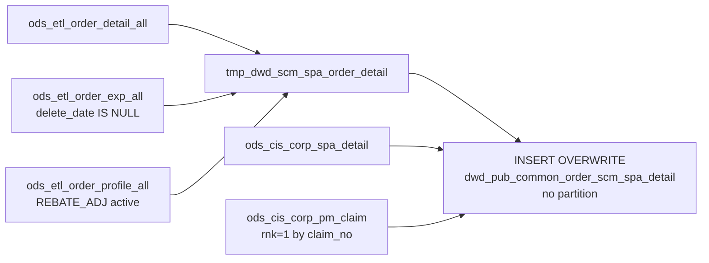

# DWD: Active Order SCM/SPA Detail — Full Snapshot (`dwd_pub_common_order_scm_spa_detail`)

- artifact_type: etl_table
- artifact_id: dw_us.dwd_pub_common_order_scm_spa_detail
- domain: order
- one_line_purpose: This job builds the **SCM and SPA detail table for all currently active orders** by joining expense lines to their REBATE_ADJ profiles and enriching with SPA approved costs, rebate amounts, and PM claim approval references. The result is a ...
- layer_type: DWD
- source_kind: etl_sql
- evidence_source: source/etl/sql/order/source/etl/flows/public_order_tools/ingest/public_order_dw/script/dwd_pub_common_order_scm_spa_detail.sql

---

## L1 Data Foundation

### Identity and physical mapping
- **Table:** `dw_us.dwd_pub_common_order_scm_spa_detail`
- **Layer type:** DWD
- **Canonical / derived:** Derived / ETL-loaded (see L3)
- **Owner team:** not registered in metadata catalog

### Grain, scope, exclusions
- **Grain:** one row per `(order_type, order_no, order_line_no, expense_line)` — a unique expense record on an active order line with its SPA/SCM context.
- **Scope:** See L2 business purpose / L3 filters
- **Partition:** none — full table overwrite on each run. - resolved from pipeline (see L4)
- **Natural key:** `order_type`, `order_no`, `order_line_no` + expense identity.
- **Exclusions:** Not documented in repository

#### Grain detail (preserved)

- **Grain:** one row per `(order_type, order_no, order_line_no, expense_line)` — a unique expense record on an active order line with its SPA/SCM context.
- **Partition:** none — full table overwrite on each run.
- **Natural key:** `order_type`, `order_no`, `order_line_no` + expense identity.

---

### Cross-engine presence
| Engine | Present | Canonical FQN | Notes |
|--------|---------|---------------|-------|
| Hive | yes | `dwd_pub_common_order_scm_spa_detail` | ETL target / intermediate per evidence script |
| Vertica | pending | `dwd_pub_common_order_scm_spa_detail` | Confirm via hive2vertica flow evidence / MCP |

### Physical schema reference

Pointer block only - full column catalog lives in WKB L1 storage JSON.

| Field | Value |
|-------|-------|
| **Authoritative catalog** | WKB L1 storage seed (not duplicated in this file) |
| **entity_id** | `dw_us.dwd_pub_common_order_scm_spa_detail` |
| **l1_catalog_seed** | `target/storage/wkb/snapshots/_snapshot_id_template/l1_catalog/{engine}_{schema}_{table}.json` |
| **column_count** | pending (run ddl_seed_writer) |
| **partition_keys** | `none — full table overwrite on each run.` |
| **ddl_source** | pending Bitbucket DDL / Vertica metadata ingest |
| **retrieval** | `python -m tools.wkb.indexing.run_query --query "order dwd_pub_common_order_scm_spa_detail schema" --intent find_table_schema` |

### Lineage
| Object | Role |
|--------|------|
| `ods_${country_code}.ods_etl_order_detail_all` | Order detail (sku_no) |
| `ods_${country_code}.ods_etl_order_exp_all` | Expense lines |
| `ods_${country_code}.ods_etl_order_profile_all` | REBATE_ADJ profiles |
| `ods_${country_code}.ods_cis_corp_spa_detail` | SPA approved cost and rebate |
| `ods_${country_code}.ods_cis_corp_pm_claim` | PM claim |
| `dw_${country_code}.dwd_pub_common_order_scm_spa_detail` | **Target** — active order SCM/SPA detail |

---

### Freshness and load path
| Item | Value |
|------|-------|
| Load pattern | See L3 end-to-end / INSERT pattern in evidence script |
| Schedule | Not documented in repository |
| Parameters | `country_code` |


---

## L2 Declarative Knowledge

### Business purpose
This job builds the **SCM and SPA detail table for all currently active orders** by joining expense lines to their REBATE_ADJ profiles and enriching with SPA approved costs, rebate amounts, and PM claim approval references. The result is a non-partitioned, full-overwrite table that always reflects the latest state of SPA attachments on open orders — serving as the upstream feed for the shipped order SPA detail pipeline and as a standalone reference for live SPA program analysis on the open order book.

---

### Audience and use cases
| Audience | How they benefit |
|----------|-----------------|
| **SCM / SPA program managers** | Complete SPA attachment snapshot for all open orders — `spa_no`, `spa_ref_no`, `scm_no`, `approved_cost`, `rebate_amt` per active expense line. |
| **Vendor management** | `vendor_appr_ref_no` (claim_type=37) — vendor approval references on active PM claims. |
| **Finance / AP** | `unit_exp`, `extended_exp`, `rebate_amt` — expected rebate exposure on open orders. |
| **ETL pipelines** | This table feeds `dwd_pub_common_shipped_order_scm_spa_detail_di` — once an order ships, its rows are picked up by the shipped SPA detail job. |

---

### Fact key resolution
- Natural key: `order_type`, `order_no`, `order_line_no` + expense identity.
- FK / label-on attributes: see L3 dimension join patterns and step-by-step logic.
- Negative assertion: do not treat descriptive labels as grain keys unless listed under natural key.

### Time field semantics
- **date_flag / partition columns:** none — full table overwrite on each run.
- Primary reporting filter should use the partition column(s) documented in L1; resolve values via L4.


### Metrics served

| Category | Column | Logical metric | Business reading |
|----------|--------|----------------|------------------|
| Measures | — | — | No measure columns mapped for this table. |

### Metric serving map

**Formula authority:** [`source/contracts/order/metric-index.md`](../../source/contracts/order/metric-index.md)

N/A — no measure columns mapped for this table.

### etl_metrics

No governed logical metrics from `source/contracts/order/metric-index.md` are mapped on this table.

---

### Metric serving map
N/A - not a `*_comb_mtd` / multi-period wide serving table (or map not present in legacy doc).


### Data products and column groups (preserved)

### Order identifiers

- `order_type`, `order_no`, `order_line_no`

### SPA / SCM attributes

- `scm_no` — SCM project number (from expense `project_no`)
- `spa_no` — SPA number (from REBATE_ADJ profile `profile_i`)
- `spa_ref_no` — SPA reference number (from REBATE_ADJ profile `profile_c`)
- `exp_code` — expense code
- `unit_exp` — per-unit expense amount
- `extended_exp` — total extended expense amount
- `approved_cost` — vendor-approved SPA cost (from SPA detail by spa_no + sku_no)
- `rebate_amt` — rebate amount from SPA detail

### PM claim attributes

- `claim_type` — PM claim type
- `vendor_appr_ref_no` — vendor approval reference (`pri_approv_ref_no` when `claim_type = 37`)
- `pm_claim_delete_date` — soft-delete date of the PM claim record

---

### etl_metrics

#### `vendor_appr_ref_no`
- **Source:** [metric-index.md](../../source/contracts/order/metric-index.md#vendor_appr_ref_no)
- **Business definition:** Vendor approval reference — only for PM claim type 37.
```sql
CASE WHEN claim_type = 37 THEN pri_approv_ref_no ELSE NULL END
```


---

## L3 Procedural Knowledge

### Query and routing rules
**Business filters:** Use partition / date keys from L1 grain for reporting scope.
**Technical predicates (load only):** See Key filters and step-by-step logic below.

### Dimension join patterns
| Dimension FQN | Join keys | Purpose | Evidence |
|---------------|-----------|---------|----------|
| See step-by-step / base tables | See L3 steps | Dimension enrichment | `source/etl/sql/order/source/etl/flows/public_order_tools/ingest/public_order_dw/script/dwd_pub_common_order_scm_spa_detail.sql` |

### Key filters and ETL business logic
### Step 1 — `tmp_dwd_scm_spa_order_detail` (view)

**Source:** `ods_etl_order_detail_all` (t) INNER JOIN `ods_etl_order_exp_all` (he) LEFT JOIN `ods_etl_order_profile_all` (hp)

**Join keys (expense→order):** `he.order_type/no/line_no = t.order_type/no/line_no`

**Join keys (profile→expense):** `hp.order_no/type/line_no = he.*` AND `hp.order_expense_line_no = he.order_expense_line_no` AND `hp.profile_type = 'REBATE_ADJ'` AND `hp.active = 'Y'`

**Filter:** `he.delete_date IS NULL` — only non-deleted expense lines.

---

### Step 2 — Final `INSERT OVERWRITE`

**Left joins:**

| Join | Keys | Purpose |
|------|------|---------|
| `ods_cis_corp_spa_detail` (b) | `a.spa_no = b.spa_no AND a.sku_no = b.sku_no` | Adds `approved_cost`, `rebate_amt` |
| `ods_cis_corp_pm_claim` (c) subquery | `a.scm_no = c.project_no AND c.rnk = 1` | Adds `claim_type`, `pri_approv_ref_no`, `delete_date` |

**Derived columns:**

| Column | Formula | Plain language |
|--------|---------|----------------|
| `vendor_appr_ref_no` | `CASE WHEN claim_type = 37 THEN pri_approv_ref_no ELSE NULL END` | Vendor approval reference — only for PM claim type 37. |
| `pm_claim_delete_date` | `c.delete_date` | Soft-delete date on the PM claim record. |

---

### Standard time-filter SQL
```sql
-- relative period filter using resolved partition value (see L4)
SELECT *
FROM dwd_pub_common_order_scm_spa_detail
WHERE /* partition predicate */ date_flag = '${partition_value}';
```

### End-to-end flow
**Runtime parameters:** `country_code`
**Target table:** `dw_${country_code}.dwd_pub_common_order_scm_spa_detail` — **full overwrite, no partition**.

1. Build `tmp_dwd_scm_spa_order_detail`: join `ods_etl_order_detail_all` + `ods_etl_order_exp_all` (non-deleted) + `ods_etl_order_profile_all` (REBATE_ADJ, active).
2. **INSERT OVERWRITE** enriching with SPA detail and PM claim (rnk=1 by claim_no).



---


#### High-level stages (preserved)

| Stage | Business meaning |
|-------|-----------------|
| **Expense + REBATE_ADJ join** | Reads all non-deleted expense lines from the active order expense table. LEFT JOINs to active REBATE_ADJ profiles matched by expense line number — resolves SPA number, SPA reference, and SCM project number per expense line. Also pulls the SKU from order detail for SPA detail lookups. |
| **SPA detail enrichment** | LEFT JOINs to `ods_cis_corp_spa_detail` on SPA number + SKU — adds approved cost and rebate amount. |
| **PM claim lookup** | LEFT JOINs to `ods_cis_corp_pm_claim`, de-duplicated to the first claim per SCM project by `claim_no`. Derives `vendor_appr_ref_no` when `claim_type = 37`. |
| **Full overwrite** | Replaces the entire target table on each run — no partition, no date filter. |

**Parameters:** `country_code`

---


### Base tables register
| Object | Role in this job |
|--------|-----------------|
| `ods_${country_code}.ods_etl_order_detail_all` | Provides `sku_no` per order line — required for SPA detail lookup (spa_no + sku_no). INNER JOIN driving table. |
| `ods_${country_code}.ods_etl_order_exp_all` | Expense lines — `project_no` (→ scm_no), `unit_exp`, `extended_exp`, `exp_code`. Filtered to `delete_date IS NULL`. |
| `ods_${country_code}.ods_etl_order_profile_all` | REBATE_ADJ profiles — `profile_i` (→ spa_no), `profile_c` (→ spa_ref_no). Matched by `order_expense_line_no = profile_no`, `profile_type='REBATE_ADJ'`, `active='Y'`. |
| `ods_${country_code}.ods_cis_corp_spa_detail` | SPA approved cost and rebate amount per (spa_no + sku_no). |
| `ods_${country_code}.ods_cis_corp_pm_claim` | PM claims — deduped to first claim per SCM project (`ROW_NUMBER() OVER (PARTITION BY project_no ORDER BY claim_no) = 1`). |

---

### Step-by-step logic
### Step 1 — `tmp_dwd_scm_spa_order_detail` (view)

**Source:** `ods_etl_order_detail_all` (t) INNER JOIN `ods_etl_order_exp_all` (he) LEFT JOIN `ods_etl_order_profile_all` (hp)

**Join keys (expense→order):** `he.order_type/no/line_no = t.order_type/no/line_no`

**Join keys (profile→expense):** `hp.order_no/type/line_no = he.*` AND `hp.order_expense_line_no = he.order_expense_line_no` AND `hp.profile_type = 'REBATE_ADJ'` AND `hp.active = 'Y'`

**Filter:** `he.delete_date IS NULL` — only non-deleted expense lines.

---

### Step 2 — Final `INSERT OVERWRITE`

**Left joins:**

| Join | Keys | Purpose |
|------|------|---------|
| `ods_cis_corp_spa_detail` (b) | `a.spa_no = b.spa_no AND a.sku_no = b.sku_no` | Adds `approved_cost`, `rebate_amt` |
| `ods_cis_corp_pm_claim` (c) subquery | `a.scm_no = c.project_no AND c.rnk = 1` | Adds `claim_type`, `pri_approv_ref_no`, `delete_date` |

**Derived columns:**

| Column | Formula | Plain language |
|--------|---------|----------------|
| `vendor_appr_ref_no` | `CASE WHEN claim_type = 37 THEN pri_approv_ref_no ELSE NULL END` | Vendor approval reference — only for PM claim type 37. |
| `pm_claim_delete_date` | `c.delete_date` | Soft-delete date on the PM claim record. |

---

### Relationship map (embedded)

| from_fqn | to_fqn | cardinality | join_keys | provenance |
|----------|--------|-------------|-----------|------------|
| `ods_${country_code}.ods_etl_order_detail_all` | `ods_${country_code}.ods_etl_order_exp_all` | many:1 | `he.order_type` = `t.order_type`; `he.order_no` = `t.order_no`; `he.order_line_no` = `t.order_line_no` | etl_sql (`source/etl/sql/order/public_order_scripts/public_order_dw/script/dwd_pub_common_order_scm_spa_detail.sql:15`) |
| `ods_${country_code}.ods_etl_order_exp_all` | `ods_${country_code}.ods_etl_order_profile_all` | many:1 (LEFT) | `he.order_no` = `hp.order_no`; `he.order_type` = `hp.order_type`; `he.order_line_no` = `hp.order_line_no`; `he.order_expense_line_no` = `hp.profile_no` | etl_sql (`source/etl/sql/order/public_order_scripts/public_order_dw/script/dwd_pub_common_order_scm_spa_detail.sql:19`) |
| `a` | `ods_${country_code}.ods_cis_corp_spa_detail` | many:1 (LEFT) | `a.spa_no` = `b.spa_no`; `a.sku_no` = `b.sku_no` | etl_sql (`source/etl/sql/order/public_order_scripts/public_order_dw/script/dwd_pub_common_order_scm_spa_detail.sql:46`) |

### Special logic (embedded)

Not documented in repository

### Column / field derivations (from ETL SQL)

| target_column | expression_sql | upstream_columns | upstream_tables | transform_kind | evidence |
|---------------|----------------|------------------|-----------------|----------------|----------|
| `order_type` | `a.order_type` | `order_type` | `tmp_dwd_scm_spa_order_detail`, `ods_${country_code}.ods_cis_corp_spa_detail`, `ods_${country_code}.ods_cis_corp_pm_claim` | passthrough | `source/etl/sql/order/public_order_scripts/public_order_dw/script/dwd_pub_common_order_scm_spa_detail.sql:31` |
| `order_no` | `a.order_no` | `order_no` | `tmp_dwd_scm_spa_order_detail`, `ods_${country_code}.ods_cis_corp_spa_detail`, `ods_${country_code}.ods_cis_corp_pm_claim` | passthrough | `source/etl/sql/order/public_order_scripts/public_order_dw/script/dwd_pub_common_order_scm_spa_detail.sql:32` |
| `order_line_no` | `a.order_line_no` | `order_line_no` | `tmp_dwd_scm_spa_order_detail`, `ods_${country_code}.ods_cis_corp_spa_detail`, `ods_${country_code}.ods_cis_corp_pm_claim` | passthrough | `source/etl/sql/order/public_order_scripts/public_order_dw/script/dwd_pub_common_order_scm_spa_detail.sql:33` |
| `scm_no` | `a.scm_no` | `scm_no` | `tmp_dwd_scm_spa_order_detail`, `ods_${country_code}.ods_cis_corp_spa_detail`, `ods_${country_code}.ods_cis_corp_pm_claim` | passthrough | `source/etl/sql/order/public_order_scripts/public_order_dw/script/dwd_pub_common_order_scm_spa_detail.sql:34` |
| `spa_no` | `a.spa_no` | `spa_no` | `tmp_dwd_scm_spa_order_detail`, `ods_${country_code}.ods_cis_corp_spa_detail`, `ods_${country_code}.ods_cis_corp_pm_claim` | passthrough | `source/etl/sql/order/public_order_scripts/public_order_dw/script/dwd_pub_common_order_scm_spa_detail.sql:35` |
| `spa_ref_no` | `a.spa_ref_no` | `spa_ref_no` | `tmp_dwd_scm_spa_order_detail`, `ods_${country_code}.ods_cis_corp_spa_detail`, `ods_${country_code}.ods_cis_corp_pm_claim` | passthrough | `source/etl/sql/order/public_order_scripts/public_order_dw/script/dwd_pub_common_order_scm_spa_detail.sql:36` |
| `exp_code` | `a.exp_code` | `exp_code` | `tmp_dwd_scm_spa_order_detail`, `ods_${country_code}.ods_cis_corp_spa_detail`, `ods_${country_code}.ods_cis_corp_pm_claim` | passthrough | `source/etl/sql/order/public_order_scripts/public_order_dw/script/dwd_pub_common_order_scm_spa_detail.sql:37` |
| `unit_exp` | `a.unit_exp` | `unit_exp` | `tmp_dwd_scm_spa_order_detail`, `ods_${country_code}.ods_cis_corp_spa_detail`, `ods_${country_code}.ods_cis_corp_pm_claim` | passthrough | `source/etl/sql/order/public_order_scripts/public_order_dw/script/dwd_pub_common_order_scm_spa_detail.sql:38` |
| `extended_exp` | `a.extended_exp` | `extended_exp` | `tmp_dwd_scm_spa_order_detail`, `ods_${country_code}.ods_cis_corp_spa_detail`, `ods_${country_code}.ods_cis_corp_pm_claim` | passthrough | `source/etl/sql/order/public_order_scripts/public_order_dw/script/dwd_pub_common_order_scm_spa_detail.sql:39` |
| `claim_type` | `c.claim_type` | `claim_type` | `tmp_dwd_scm_spa_order_detail`, `ods_${country_code}.ods_cis_corp_spa_detail`, `ods_${country_code}.ods_cis_corp_pm_claim` | passthrough | `source/etl/sql/order/public_order_scripts/public_order_dw/script/dwd_pub_common_order_scm_spa_detail.sql:40` |
| `approved_cost` | `b.approved_cost` | `approved_cost` | `tmp_dwd_scm_spa_order_detail`, `ods_${country_code}.ods_cis_corp_spa_detail`, `ods_${country_code}.ods_cis_corp_pm_claim` | passthrough | `source/etl/sql/order/public_order_scripts/public_order_dw/script/dwd_pub_common_order_scm_spa_detail.sql:41` |
| `rebate_amt` | `b.rebate_amt` | `rebate_amt` | `tmp_dwd_scm_spa_order_detail`, `ods_${country_code}.ods_cis_corp_spa_detail`, `ods_${country_code}.ods_cis_corp_pm_claim` | passthrough | `source/etl/sql/order/public_order_scripts/public_order_dw/script/dwd_pub_common_order_scm_spa_detail.sql:42` |
| `vendor_appr_ref_no` | `case when c.claim_type = 37 then c.pri_approv_ref_no else null end` | `claim_type`, `pri_approv_ref_no` | `tmp_dwd_scm_spa_order_detail`, `ods_${country_code}.ods_cis_corp_spa_detail`, `ods_${country_code}.ods_cis_corp_pm_claim` | case | `source/etl/sql/order/public_order_scripts/public_order_dw/script/dwd_pub_common_order_scm_spa_detail.sql:43` |
| `pm_claim_delete_date` | `c.delete_date` | `delete_date` | `tmp_dwd_scm_spa_order_detail`, `ods_${country_code}.ods_cis_corp_spa_detail`, `ods_${country_code}.ods_cis_corp_pm_claim` | rename | `source/etl/sql/order/public_order_scripts/public_order_dw/script/dwd_pub_common_order_scm_spa_detail.sql:44` |

### Sentinel and code values
| Value | Meaning |
|-------|---------|
| `profile_type = 'REBATE_ADJ'` AND `active = 'Y'` | Active rebate adjustment profile — SPA linkage for this expense line. |
| `delete_date IS NULL` (expense) | Only active expense records included. |
| `rnk = 1` (PM claim) | First/earliest claim per SCM project — deduplication by `claim_no`. |
| `claim_type = 37` | PM claim type that produces a `vendor_appr_ref_no`. |

---

---

## L4 Validation

### Resolved partition value
| Step | Source | How partition / date scope is determined |
|------|--------|------------------------------------------|
| 1 | evidence script / flow | See parameters in L1 Freshness and L3 filters - `source/etl/sql/order/source/etl/flows/public_order_tools/ingest/public_order_dw/script/dwd_pub_common_order_scm_spa_detail.sql` |

**Plain language:** Partition and date scope follow Azkaban/bootstrap parameters documented in the source script and orchestrating flow; do not hardcode calendar literals.

### Data quality checks
- Prefer row-count-by-partition, metric sums, and grain duplicate checks (see Validation SQL).
- Additional checks from legacy caveats / operational notes when present.

### Validation SQL
```sql
-- 1) Row count by partition
SELECT ${partition_col}, COUNT(*) AS row_cnt
FROM dw_${country_code}.dwd_pub_common_order_scm_spa_detail
WHERE ${partition_col} = '${partition_value}'
GROUP BY ${partition_col};

-- 2) Metric sum by business dimension (top deltas)
SELECT ${dim_key}, SUM(${metric}) AS metric_sum
FROM dw_${country_code}.dwd_pub_common_order_scm_spa_detail
WHERE ${partition_col} = '${partition_value}'
GROUP BY ${dim_key}
ORDER BY ABS(SUM(${metric})) DESC
LIMIT 20;

-- 3) Grain duplicate check
SELECT ${grain_key_1}, ${grain_key_2}, ${grain_key_3}, ${partition_col}, COUNT(*) AS cnt
FROM dw_${country_code}.dwd_pub_common_order_scm_spa_detail
WHERE ${partition_col} = '${partition_value}'
GROUP BY ${grain_key_1}, ${grain_key_2}, ${grain_key_3}, ${partition_col}
HAVING COUNT(*) > 1;
```

Replace placeholders from this file's Grain and keys / Data you can fetch sections, and use the resolved partition value from run scope.

### Caveats for interpretation
- **Full overwrite, no date filter** — the entire table is replaced on every run. All active orders with expense records are included regardless of order date.
- **Downstream dependency:** `dwd_pub_common_shipped_order_scm_spa_detail_di.sql` reads this table and filters to recently shipped orders. This table must be current before that job runs.
- **Column name note:** the INSERT writes column `extended_exp`; the shipped order SPA detail script reads it as `extend_exp`. Verify the physical table DDL when consuming downstream.

---

### Conflicts and open questions
- Schedule, owner, SLA: Not documented in repository (unless preserved schedule evidence above).
- Vertica MCP verification: pending unless confirmed in L5.


---

## L5 Runtime View

### Query path and engine preference
| Role | Hive object | Vertica object | Sync mode | Evidence | MCP verified |
|------|-------------|----------------|-----------|----------|--------------|
| **Query for reporting** | *See script lineage* | `dw_${country_code}.dwd_pub_common_order_scm_spa_detail` | *Verify from flow* | *Add flow file:line* | pending |
| **Hive alternative** | `*` | `dw_${country_code}.dwd_pub_common_order_scm_spa_detail` | - | *See dependencies* | - |
| **ETL internal** | staging/temp tables | *Not synced to Vertica* | - | *See step-by-step logic* | - |

Business users should query `dw_${country_code}.dwd_pub_common_order_scm_spa_detail` in Vertica once MCP verification is completed for this document.

### Access constraints
- Country / company schema parameters may apply (`literal_country`, `company_no`, etc.).
- Hive-only staging objects are not reporting surfaces unless synced.

### Query risk profile
| Field | Value |
|-------|-------|
| requires_date_predicate | unknown |
| scan_risk_tier | high |

---

## L6 Access and Consumption

### Primary consumers and use cases
| Audience | How they benefit |
|----------|-----------------|
| **SCM / SPA program managers** | Complete SPA attachment snapshot for all open orders — `spa_no`, `spa_ref_no`, `scm_no`, `approved_cost`, `rebate_amt` per active expense line. |
| **Vendor management** | `vendor_appr_ref_no` (claim_type=37) — vendor approval references on active PM claims. |
| **Finance / AP** | `unit_exp`, `extended_exp`, `rebate_amt` — expected rebate exposure on open orders. |
| **ETL pipelines** | This table feeds `dwd_pub_common_shipped_order_scm_spa_detail_di` — once an order ships, its rows are picked up by the shipped SPA detail job. |

---

### Representative query patterns
```sql
-- certified / illustrative lookup - replace predicates from L1/L4
SELECT *
FROM dwd_pub_common_order_scm_spa_detail
WHERE date_flag = '${partition_value}'
LIMIT 100;
```

### Dependencies and notes
### Upstream objects (verified)

| Object | Usage | Evidence |
|--------|-------|----------|
| `ods_${country_code}.ods_etl_order_detail_all` | sku_no per order line | `dwd_pub_common_order_scm_spa_detail.sql:14` |
| `ods_${country_code}.ods_etl_order_exp_all` | Expense lines; `delete_date IS NULL` | `dwd_pub_common_order_scm_spa_detail.sql:15-16` |
| `ods_${country_code}.ods_etl_order_profile_all` | REBATE_ADJ profiles | `dwd_pub_common_order_scm_spa_detail.sql:19-25` |
| `ods_${country_code}.ods_cis_corp_spa_detail` | SPA approved cost/rebate | `dwd_pub_common_order_scm_spa_detail.sql:46-48` |
| `ods_${country_code}.ods_cis_corp_pm_claim` | PM claim dedup | `dwd_pub_common_order_scm_spa_detail.sql:50-52` |

### Downstream consumers (verified)

| Object / script | Evidence |
|-----------------|----------|
| `dwd_pub_common_shipped_order_scm_spa_detail_di.sql` — reads this table for shipped order SPA data | `dwd_pub_common_shipped_order_scm_spa_detail_di.sql:32` |

### Operational detail (verified)

- Full overwrite: `INSERT OVERWRITE TABLE dw_${country_code}.dwd_pub_common_order_scm_spa_detail` — no partition — `dwd_pub_common_order_scm_spa_detail.sql:29`

### Not documented in repository

- Schedule, owner, SLA — not in scripts or configs

---

*Document generated from `source/etl/sql/order/source/etl/flows/public_order_tools/ingest/public_order_dw/script/dwd_pub_common_order_scm_spa_detail.sql`.*

#### Not documented in repository
- Owner, SLA (unless schedule evidence preserved above)
- Any dependency without `file:line` evidence in this document

---

*Document migrated to L1-L6 from legacy Knowledgebase content. Evidence: `source/etl/sql/order/source/etl/flows/public_order_tools/ingest/public_order_dw/script/dwd_pub_common_order_scm_spa_detail.sql`.*
