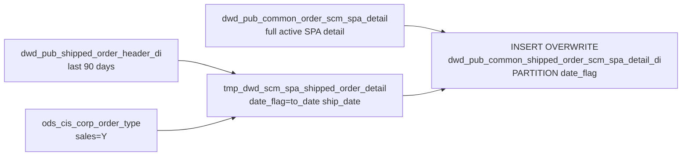

# DWD: Shipped Order SCM/SPA Detail — Daily (`dwd_pub_common_shipped_order_scm_spa_detail_di`)

- artifact_type: etl_table
- artifact_id: dw_us.dwd_pub_common_shipped_order_scm_spa_detail_di
- domain: order
- one_line_purpose: This job creates the **daily-partitioned SPA and SCM detail table for recently shipped sales orders** by joining the non-partitioned active order SPA detail table (`dwd_pub_common_order_scm_spa_detail`) to a filtered set of shipped orders f...
- layer_type: DWD
- source_kind: etl_sql
- evidence_source: source/etl/sql/order/source/etl/flows/public_order_tools/ingest/public_order_dw/script/dwd_pub_common_shipped_order_scm_spa_detail_di.sql

---

## L1 Data Foundation

### Identity and physical mapping
- **Table:** `dw_us.dwd_pub_common_shipped_order_scm_spa_detail_di`
- **Layer type:** DWD
- **Canonical / derived:** Derived / ETL-loaded (see L3)
- **Owner team:** not registered in metadata catalog

### Grain, scope, exclusions
- **Grain:** one row per `(order_type, order_no, order_line_no, expense_line, date_flag)` — a unique SPA/SCM expense record on a shipped sales order.
- **Scope:** See L2 business purpose / L3 filters
- **Partition:** `date_flag` — `to_date(ship_date)` from the shipped order header. - resolved from pipeline (see L4)
- **Natural key:** `order_type`, `order_no`, `order_line_no` + expense identity within a `date_flag` partition.
- **Exclusions:** Not documented in repository

#### Grain detail (preserved)

- **Grain:** one row per `(order_type, order_no, order_line_no, expense_line, date_flag)` — a unique SPA/SCM expense record on a shipped sales order.
- **Partition:** `date_flag` — `to_date(ship_date)` from the shipped order header.
- **Natural key:** `order_type`, `order_no`, `order_line_no` + expense identity within a `date_flag` partition.

---

### Cross-engine presence
| Engine | Present | Canonical FQN | Notes |
|--------|---------|---------------|-------|
| Hive | yes | `dwd_pub_common_shipped_order_scm_spa_detail_di` | ETL target / intermediate per evidence script |
| Vertica | pending | `dwd_pub_common_shipped_order_scm_spa_detail_di` | Confirm via hive2vertica flow evidence / MCP |

### Physical schema reference

Pointer block only - full column catalog lives in WKB L1 storage JSON.

| Field | Value |
|-------|-------|
| **Authoritative catalog** | WKB L1 storage seed (not duplicated in this file) |
| **entity_id** | `dw_us.dwd_pub_common_shipped_order_scm_spa_detail_di` |
| **l1_catalog_seed** | `target/storage/wkb/snapshots/_snapshot_id_template/l1_catalog/{engine}_{schema}_{table}.json` |
| **column_count** | pending (run ddl_seed_writer) |
| **partition_keys** | `date_flag, to_date(ship_date)` |
| **ddl_source** | pending Bitbucket DDL / Vertica metadata ingest |
| **retrieval** | `python -m tools.wkb.indexing.run_query --query "order dwd_pub_common_shipped_order_scm_spa_detail_di schema" --intent find_table_schema` |

### Lineage
| Object | Role |
|--------|------|
| `dw_${country_code}.dwd_pub_shipped_order_header_di` | Shipped order scope (90-day window) |
| `ods_${country_code}.ods_cis_corp_order_type` | Sales order type filter |
| `dw_${country_code}.dwd_pub_common_order_scm_spa_detail` | Active order SPA detail (upstream prerequisite) |
| `dw_${country_code}.dwd_pub_common_shipped_order_scm_spa_detail_di` | **Target** — shipped order SPA detail, partitioned by ship date |

---

### Freshness and load path
| Item | Value |
|------|-------|
| Load pattern | See L3 end-to-end / INSERT pattern in evidence script |
| Schedule | Not documented in repository |
| Parameters | `country_code`, `last_90_date`, `end_date` |


---

## L2 Declarative Knowledge

### Business purpose
This job creates the **daily-partitioned SPA and SCM detail table for recently shipped sales orders** by joining the non-partitioned active order SPA detail table (`dwd_pub_common_order_scm_spa_detail`) to a filtered set of shipped orders from the last 90 days. It bridges the gap between the open-order SPA detail (which covers all active orders) and a partitioned, date-stamped analytical view of SPA attachments on completed shipments — enabling post-shipment rebate reconciliation and SPA claim processing.

---

### Audience and use cases
| Audience | How they benefit |
|----------|-----------------|
| **SCM / SPA claims processing** | Date-stamped SPA detail for recently shipped orders — enables claims processing tied to actual ship date. |
| **Finance / AP** | `approved_cost`, `rebate_amt`, `unit_exp`, `extend_exp` on shipped orders with their ship date for accrual and billing alignment. |
| **Vendor management** | `vendor_appr_ref_no`, `spa_type`, `claim_type` on completed shipments for vendor program settlement. |

---

### Fact key resolution
- Natural key: `order_type`, `order_no`, `order_line_no` + expense identity within a `date_flag` partition.
- FK / label-on attributes: see L3 dimension join patterns and step-by-step logic.
- Negative assertion: do not treat descriptive labels as grain keys unless listed under natural key.

### Time field semantics
- **date_flag / partition columns:** `date_flag` — `to_date(ship_date)` from the shipped order header.
- Primary reporting filter should use the partition column(s) documented in L1; resolve values via L4.


### Metrics served

| Category | Column | Logical metric | Business reading |
|----------|--------|----------------|------------------|
| Measures | — | — | No measure columns mapped for this table. |

### Metric serving map

**Formula authority:** [`source/contracts/order/metric-index.md`](../../source/contracts/order/metric-index.md)

N/A — no measure columns mapped for this table.

### etl_metrics

No governed logical metrics from `source/contracts/order/metric-index.md` are mapped on this table.

---

### Metric serving map
N/A - not a `*_comb_mtd` / multi-period wide serving table (or map not present in legacy doc).


### Data products and column groups (preserved)

Same columns as `dwd_pub_common_order_scm_spa_detail` plus `date_flag`:

- `order_type`, `order_no`, `order_line_no`
- `scm_no`, `spa_no`, `spa_ref_no`
- `exp_code`, `unit_exp`, `extend_exp` (note: column named `extend_exp` here; see caveat)
- `claim_type`, `approved_cost`, `rebate_amt`
- `vendor_appr_ref_no` — only for `claim_type = 37`
- `pm_claim_delete_date`
- `date_flag` — ship date of the order

---

### etl_metrics

N/A - no calculable ETL formulas extracted from this document (passthrough / stored measures only, or formulas not documented).

---

## L3 Procedural Knowledge

### Query and routing rules
**Business filters:** Use partition / date keys from L1 grain for reporting scope.
**Technical predicates (load only):** See Key filters and step-by-step logic below.

### Dimension join patterns
| Dimension FQN | Join keys | Purpose | Evidence |
|---------------|-----------|---------|----------|
| See step-by-step / base tables | See L3 steps | Dimension enrichment | `source/etl/sql/order/source/etl/flows/public_order_tools/ingest/public_order_dw/script/dwd_pub_common_shipped_order_scm_spa_detail_di.sql` |

### Key filters and ETL business logic
### Step 1 — `tmp_dwd_scm_spa_shipped_order_detail`

**Source:** `dwd_pub_shipped_order_header_di` INNER JOIN `ods_cis_corp_order_type`

**Filter:** `date_flag >= '${last_90_date}' AND date_flag < '${end_date}'` AND `ot.sales = 'Y'`

**Derived column:** `date_flag = to_date(h.ship_date)` — ship date as date type, used as partition key.

**Output:** `(date_flag, order_type, order_no)` — eligible shipped sales orders.

---

### Step 2 — Final `INSERT OVERWRITE`

**From:** `dwd_pub_common_order_scm_spa_detail` (a) INNER JOIN `tmp_dwd_scm_spa_shipped_order_detail` (b)

**Join keys:** `a.order_type = b.order_type AND a.order_no = b.order_no`

**Output columns from `a`:** `order_type`, `order_no`, `order_line_no`, `scm_no`, `spa_no`, `spa_ref_no`, `exp_code`, `unit_exp`, `extend_exp`, `claim_type`, `approved_cost`, `rebate_amt`, `vendor_appr_ref_no`, `pm_claim_delete_date`

**Output column from `b`:** `date_flag`

---

### Standard time-filter SQL
```sql
-- relative period filter using resolved partition value (see L4)
SELECT *
FROM dwd_pub_common_shipped_order_scm_spa_detail_di
WHERE /* partition predicate */ date_flag = '${partition_value}';
```

### End-to-end flow
**Runtime parameters:** `country_code`, `last_90_date`, `end_date`
**Target table:** `dw_${country_code}.dwd_pub_common_shipped_order_scm_spa_detail_di`, partitioned by **`date_flag`**.

1. Build `tmp_dwd_scm_spa_shipped_order_detail`: read `dwd_pub_shipped_order_header_di` (90-day window), INNER JOIN `ods_cis_corp_order_type` where `sales='Y'`; derive `date_flag = to_date(ship_date)`.
2. **INSERT OVERWRITE**: INNER JOIN `dwd_pub_common_order_scm_spa_detail` (full active SPA detail) to the shipped order scope; write with `date_flag` from shipped header.



---


#### High-level stages (preserved)

| Stage | Business meaning |
|-------|-----------------|
| **Shipped order scope** | Reads `dwd_pub_shipped_order_header_di` for the last 90 days, filtered to sales-type orders only (via `ods_cis_corp_order_type.sales='Y'`). Derives `date_flag` as `to_date(ship_date)`. |
| **SPA detail join** | INNER JOINs the pre-built active order SPA detail table (`dwd_pub_common_order_scm_spa_detail`) to the shipped order set — carries all SPA/SCM fields forward and assigns the ship date as `date_flag`. |
| **Partitioned write** | Writes to a date-partitioned DWD table, placing each SPA line in the partition matching its order's ship date. |

**Parameters:** `country_code`, `last_90_date`, `end_date`

---


### Base tables register
| Object | Role in this job |
|--------|-----------------|
| `dw_${country_code}.dwd_pub_shipped_order_header_di` | **Shipped order scope.** Filtered to `date_flag >= last_90_date AND date_flag < end_date`. Provides `order_type`, `order_no`, `ship_date` (→ `date_flag`). |
| `ods_${country_code}.ods_cis_corp_order_type` | Sales order type filter — `sales = 'Y'`. Limits to revenue-generating order types only. |
| `dw_${country_code}.dwd_pub_common_order_scm_spa_detail` | **SPA detail source.** Full non-partitioned active order SPA detail. INNER JOINed to restrict to shipped orders in the window. |

**Temporary tables:** `tmp_dwd_scm_spa_shipped_order_detail`

---

### Step-by-step logic
### Step 1 — `tmp_dwd_scm_spa_shipped_order_detail`

**Source:** `dwd_pub_shipped_order_header_di` INNER JOIN `ods_cis_corp_order_type`

**Filter:** `date_flag >= '${last_90_date}' AND date_flag < '${end_date}'` AND `ot.sales = 'Y'`

**Derived column:** `date_flag = to_date(h.ship_date)` — ship date as date type, used as partition key.

**Output:** `(date_flag, order_type, order_no)` — eligible shipped sales orders.

---

### Step 2 — Final `INSERT OVERWRITE`

**From:** `dwd_pub_common_order_scm_spa_detail` (a) INNER JOIN `tmp_dwd_scm_spa_shipped_order_detail` (b)

**Join keys:** `a.order_type = b.order_type AND a.order_no = b.order_no`

**Output columns from `a`:** `order_type`, `order_no`, `order_line_no`, `scm_no`, `spa_no`, `spa_ref_no`, `exp_code`, `unit_exp`, `extend_exp`, `claim_type`, `approved_cost`, `rebate_amt`, `vendor_appr_ref_no`, `pm_claim_delete_date`

**Output column from `b`:** `date_flag`

---

### Relationship map (embedded)

| from_fqn | to_fqn | cardinality | join_keys | provenance |
|----------|--------|-------------|-----------|------------|
| `ods_${country_code}.ods_etl_order_header_all` | `ods_${country_code}.ods_cis_corp_order_type` | many:1 | `h.order_type` = `ot.order_type` | etl_sql (`source/etl/sql/order/public_order_scripts/public_order_dw/script/dwd_pub_common_shipped_order_scm_spa_detail_di.sql:7`) |
| `dw_${country_code}.dwd_pub_common_order_scm_spa_detail` | `tmp_dwd_scm_spa_shipped_order_detail` | many:1 | `a.order_type` = `b.order_type`; `a.order_no` = `b.order_no` | etl_sql (`source/etl/sql/order/public_order_scripts/public_order_dw/script/dwd_pub_common_shipped_order_scm_spa_detail_di.sql:33`) |

### Special logic (embedded)

Not documented in repository

### Column / field derivations (from ETL SQL)

| target_column | expression_sql | upstream_columns | upstream_tables | transform_kind | evidence |
|---------------|----------------|------------------|-----------------|----------------|----------|
| `order_type` | `a.order_type` | `order_type` | `dw_${country_code}.dwd_pub_common_order_scm_spa_detail`, `tmp_dwd_scm_spa_shipped_order_detail` | passthrough | `source/etl/sql/order/public_order_scripts/public_order_dw/script/dwd_pub_common_shipped_order_scm_spa_detail_di.sql:16` |
| `order_no` | `a.order_no` | `order_no` | `dw_${country_code}.dwd_pub_common_order_scm_spa_detail`, `tmp_dwd_scm_spa_shipped_order_detail` | passthrough | `source/etl/sql/order/public_order_scripts/public_order_dw/script/dwd_pub_common_shipped_order_scm_spa_detail_di.sql:17` |
| `order_line_no` | `a.order_line_no` | `order_line_no` | `dw_${country_code}.dwd_pub_common_order_scm_spa_detail`, `tmp_dwd_scm_spa_shipped_order_detail` | passthrough | `source/etl/sql/order/public_order_scripts/public_order_dw/script/dwd_pub_common_shipped_order_scm_spa_detail_di.sql:18` |
| `scm_no` | `a.scm_no` | `scm_no` | `dw_${country_code}.dwd_pub_common_order_scm_spa_detail`, `tmp_dwd_scm_spa_shipped_order_detail` | passthrough | `source/etl/sql/order/public_order_scripts/public_order_dw/script/dwd_pub_common_shipped_order_scm_spa_detail_di.sql:19` |
| `spa_no` | `a.spa_no` | `spa_no` | `dw_${country_code}.dwd_pub_common_order_scm_spa_detail`, `tmp_dwd_scm_spa_shipped_order_detail` | passthrough | `source/etl/sql/order/public_order_scripts/public_order_dw/script/dwd_pub_common_shipped_order_scm_spa_detail_di.sql:20` |
| `spa_ref_no` | `a.spa_ref_no` | `spa_ref_no` | `dw_${country_code}.dwd_pub_common_order_scm_spa_detail`, `tmp_dwd_scm_spa_shipped_order_detail` | passthrough | `source/etl/sql/order/public_order_scripts/public_order_dw/script/dwd_pub_common_shipped_order_scm_spa_detail_di.sql:21` |
| `exp_code` | `a.exp_code` | `exp_code` | `dw_${country_code}.dwd_pub_common_order_scm_spa_detail`, `tmp_dwd_scm_spa_shipped_order_detail` | passthrough | `source/etl/sql/order/public_order_scripts/public_order_dw/script/dwd_pub_common_shipped_order_scm_spa_detail_di.sql:22` |
| `unit_exp` | `a.unit_exp` | `unit_exp` | `dw_${country_code}.dwd_pub_common_order_scm_spa_detail`, `tmp_dwd_scm_spa_shipped_order_detail` | passthrough | `source/etl/sql/order/public_order_scripts/public_order_dw/script/dwd_pub_common_shipped_order_scm_spa_detail_di.sql:23` |
| `extend_exp` | `a.extend_exp` | `extend_exp` | `dw_${country_code}.dwd_pub_common_order_scm_spa_detail`, `tmp_dwd_scm_spa_shipped_order_detail` | passthrough | `source/etl/sql/order/public_order_scripts/public_order_dw/script/dwd_pub_common_shipped_order_scm_spa_detail_di.sql:24` |
| `claim_type` | `a.claim_type` | `claim_type` | `dw_${country_code}.dwd_pub_common_order_scm_spa_detail`, `tmp_dwd_scm_spa_shipped_order_detail` | passthrough | `source/etl/sql/order/public_order_scripts/public_order_dw/script/dwd_pub_common_shipped_order_scm_spa_detail_di.sql:25` |
| `approved_cost` | `a.approved_cost` | `approved_cost` | `dw_${country_code}.dwd_pub_common_order_scm_spa_detail`, `tmp_dwd_scm_spa_shipped_order_detail` | passthrough | `source/etl/sql/order/public_order_scripts/public_order_dw/script/dwd_pub_common_shipped_order_scm_spa_detail_di.sql:26` |
| `rebate_amt` | `a.rebate_amt` | `rebate_amt` | `dw_${country_code}.dwd_pub_common_order_scm_spa_detail`, `tmp_dwd_scm_spa_shipped_order_detail` | passthrough | `source/etl/sql/order/public_order_scripts/public_order_dw/script/dwd_pub_common_shipped_order_scm_spa_detail_di.sql:27` |
| `vendor_appr_ref_no` | `a.vendor_appr_ref_no` | `vendor_appr_ref_no` | `dw_${country_code}.dwd_pub_common_order_scm_spa_detail`, `tmp_dwd_scm_spa_shipped_order_detail` | passthrough | `source/etl/sql/order/public_order_scripts/public_order_dw/script/dwd_pub_common_shipped_order_scm_spa_detail_di.sql:28` |
| `pm_claim_delete_date` | `a.pm_claim_delete_date` | `pm_claim_delete_date` | `dw_${country_code}.dwd_pub_common_order_scm_spa_detail`, `tmp_dwd_scm_spa_shipped_order_detail` | passthrough | `source/etl/sql/order/public_order_scripts/public_order_dw/script/dwd_pub_common_shipped_order_scm_spa_detail_di.sql:29` |
| `date_flag` | `b.date_flag` | `date_flag` | `dw_${country_code}.dwd_pub_common_order_scm_spa_detail`, `tmp_dwd_scm_spa_shipped_order_detail` | passthrough | `source/etl/sql/order/public_order_scripts/public_order_dw/script/dwd_pub_common_shipped_order_scm_spa_detail_di.sql:30` |

### Sentinel and code values
| Value | Meaning |
|-------|---------|
| `ot.sales = 'Y'` | Only sales-type order types are included — non-sales orders (e.g. RMAs with `sales='N'`) are excluded. |
| `date_flag >= last_90_date` | Rolling 90-day lookback from the end date for shipped orders. |
| `claim_type = 37` | PM claim type with `vendor_appr_ref_no` — inherited from the upstream SPA detail table. |

---

---

## L4 Validation

### Resolved partition value
| Step | Source | How partition / date scope is determined |
|------|--------|------------------------------------------|
| 1 | evidence script / flow | See parameters in L1 Freshness and L3 filters - `source/etl/sql/order/source/etl/flows/public_order_tools/ingest/public_order_dw/script/dwd_pub_common_shipped_order_scm_spa_detail_di.sql` |

**Plain language:** Partition and date scope follow Azkaban/bootstrap parameters documented in the source script and orchestrating flow; do not hardcode calendar literals.

### Data quality checks
- Prefer row-count-by-partition, metric sums, and grain duplicate checks (see Validation SQL).
- Additional checks from legacy caveats / operational notes when present.

### Validation SQL
```sql
-- 1) Row count by partition
SELECT ${partition_col}, COUNT(*) AS row_cnt
FROM ods_cis_corp_order_type.sales
WHERE ${partition_col} = '${partition_value}'
GROUP BY ${partition_col};

-- 2) Metric sum by business dimension (top deltas)
SELECT ${dim_key}, SUM(${metric}) AS metric_sum
FROM ods_cis_corp_order_type.sales
WHERE ${partition_col} = '${partition_value}'
GROUP BY ${dim_key}
ORDER BY ABS(SUM(${metric})) DESC
LIMIT 20;

-- 3) Grain duplicate check
SELECT ${grain_key_1}, ${grain_key_2}, ${grain_key_3}, ${partition_col}, COUNT(*) AS cnt
FROM ods_cis_corp_order_type.sales
WHERE ${partition_col} = '${partition_value}'
GROUP BY ${grain_key_1}, ${grain_key_2}, ${grain_key_3}, ${partition_col}
HAVING COUNT(*) > 1;
```

Replace placeholders from this file's Grain and keys / Data you can fetch sections, and use the resolved partition value from run scope.

### Caveats for interpretation
- **`dwd_pub_common_order_scm_spa_detail` must be current** — this job reads all rows from the non-partitioned SPA detail table and then filters by INNER JOIN to shipped orders. If that table was not refreshed before this job, the SPA data will be stale.
- **`extend_exp` vs `extended_exp` column name:** The INSERT selects `a.extend_exp` from `dwd_pub_common_order_scm_spa_detail`, but that table's creation script writes the column as `extended_exp`. Verify the physical table DDL to confirm the actual column name.
- **INNER JOIN limits scope** — only orders that exist in both the SPA detail table AND the shipped order scope appear in the output. Orders without SPA/expense records are excluded.
- **90-day window is relative to `end_date`** — the `last_90_date` parameter controls lookback depth and is determined at runtime.

---

### Conflicts and open questions
- Schedule, owner, SLA: Not documented in repository (unless preserved schedule evidence above).
- Vertica MCP verification: pending unless confirmed in L5.


---

## L5 Runtime View

### Query path and engine preference
| Role | Hive object | Vertica object | Sync mode | Evidence | MCP verified |
|------|-------------|----------------|-----------|----------|--------------|
| **Query for reporting** | *See script lineage* | `ods_cis_corp_order_type.sales` | *Verify from flow* | *Add flow file:line* | pending |
| **Hive alternative** | `*` | `ods_cis_corp_order_type.sales` | - | *See dependencies* | - |
| **ETL internal** | staging/temp tables | *Not synced to Vertica* | - | *See step-by-step logic* | - |

Business users should query `ods_cis_corp_order_type.sales` in Vertica once MCP verification is completed for this document.

### Access constraints
- Country / company schema parameters may apply (`literal_country`, `company_no`, etc.).
- Hive-only staging objects are not reporting surfaces unless synced.

### Query risk profile
| Field | Value |
|-------|-------|
| requires_date_predicate | yes |
| scan_risk_tier | high |

---

## L6 Access and Consumption

### Primary consumers and use cases
| Audience | How they benefit |
|----------|-----------------|
| **SCM / SPA claims processing** | Date-stamped SPA detail for recently shipped orders — enables claims processing tied to actual ship date. |
| **Finance / AP** | `approved_cost`, `rebate_amt`, `unit_exp`, `extend_exp` on shipped orders with their ship date for accrual and billing alignment. |
| **Vendor management** | `vendor_appr_ref_no`, `spa_type`, `claim_type` on completed shipments for vendor program settlement. |

---

### Representative query patterns
```sql
-- certified / illustrative lookup - replace predicates from L1/L4
SELECT *
FROM dwd_pub_common_shipped_order_scm_spa_detail_di
WHERE date_flag = '${partition_value}'
LIMIT 100;
```

### Dependencies and notes
### Upstream objects (verified)

| Object | Usage | Evidence |
|--------|-------|----------|
| `dw_${country_code}.dwd_pub_shipped_order_header_di` | 90-day shipped order scope | `dwd_pub_common_shipped_order_scm_spa_detail_di.sql:5-6` |
| `ods_${country_code}.ods_cis_corp_order_type` | `sales='Y'` filter | `dwd_pub_common_shipped_order_scm_spa_detail_di.sql:7-9` |
| `dw_${country_code}.dwd_pub_common_order_scm_spa_detail` | Full active SPA detail | `dwd_pub_common_shipped_order_scm_spa_detail_di.sql:32` |

### Downstream consumers (verified)

| Object / script | Evidence |
|-----------------|----------|
| None identified in repository. | — |

### Operational detail (verified)

- Partition overwrite: `INSERT OVERWRITE TABLE dw_${country_code}.dwd_pub_common_shipped_order_scm_spa_detail_di PARTITION (date_flag)` — `dwd_pub_common_shipped_order_scm_spa_detail_di.sql:14`

### Not documented in repository

- Schedule, owner, SLA — not in scripts or configs

### Related scripts (verified)

- `dwd_pub_common_order_scm_spa_detail.sql` — prerequisite; produces the upstream SPA detail table this job reads — `source/etl/sql/order/source/etl/flows/public_order_tools/ingest/public_order_dw/script/dwd_pub_common_order_scm_spa_detail.sql`

---

*Document generated from `source/etl/sql/order/source/etl/flows/public_order_tools/ingest/public_order_dw/script/dwd_pub_common_shipped_order_scm_spa_detail_di.sql`.*

#### Not documented in repository
- Owner, SLA (unless schedule evidence preserved above)
- Any dependency without `file:line` evidence in this document

---

*Document migrated to L1-L6 from legacy Knowledgebase content. Evidence: `source/etl/sql/order/source/etl/flows/public_order_tools/ingest/public_order_dw/script/dwd_pub_common_shipped_order_scm_spa_detail_di.sql`.*
