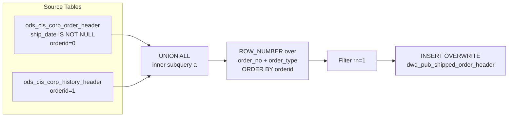

# DWD: Shipped Order Header — Full Unified Snapshot (`dwd_pub_shipped_order_header`)

- artifact_type: etl_table
- artifact_id: dw_us.dwd_pub_shipped_order_header
- domain: order
- one_line_purpose: This job builds a **complete, de-duplicated snapshot of all shipped order headers** by merging active (current) and historical order header records into a single non-partitioned DWD table. Active records take priority over history. The resu...
- layer_type: DWD
- source_kind: etl_sql
- evidence_source: source/etl/sql/order/source/etl/flows/public_order_tools/ingest/public_shipped_order_dw/script/dwd_pub_shipped_order_header.sql

---

## L1 Data Foundation

### Identity and physical mapping
- **Table:** `dw_us.dwd_pub_shipped_order_header`
- **Layer type:** DWD
- **Canonical / derived:** Derived / ETL-loaded (see L3)
- **Owner team:** not registered in metadata catalog

### Grain, scope, exclusions
- **Grain:** one row per `(order_no, order_type)` — a unique shipped order.
- **Scope:** See L2 business purpose / L3 filters
- **Partition:** none — full table overwrite on each run. - resolved from pipeline (see L4)
- **Natural key:** `order_no`, `order_type`.
- **Exclusions:** Not documented in repository

#### Grain detail (preserved)

- **Grain:** one row per `(order_no, order_type)` — a unique shipped order.
- **Partition:** none — full table overwrite on each run.
- **Natural key:** `order_no`, `order_type`.

---

### Cross-engine presence
| Engine | Present | Canonical FQN | Notes |
|--------|---------|---------------|-------|
| Hive | yes | `dwd_pub_shipped_order_header` | ETL target / intermediate per evidence script |
| Vertica | pending | `dwd_pub_shipped_order_header` | Confirm via hive2vertica flow evidence / MCP |

### Physical schema reference

Pointer block only - full column catalog lives in WKB L1 storage JSON.

| Field | Value |
|-------|-------|
| **Authoritative catalog** | WKB L1 storage seed (not duplicated in this file) |
| **entity_id** | `dw_us.dwd_pub_shipped_order_header` |
| **l1_catalog_seed** | `target/storage/wkb/snapshots/_snapshot_id_template/l1_catalog/{engine}_{schema}_{table}.json` |
| **column_count** | pending (run ddl_seed_writer) |
| **partition_keys** | `none — full table overwrite on each run.` |
| **ddl_source** | pending Bitbucket DDL / Vertica metadata ingest |
| **retrieval** | `python -m tools.wkb.indexing.run_query --query "order dwd_pub_shipped_order_header schema" --intent find_table_schema` |

### Lineage
| Object | Role |
|--------|------|
| `ods_${country_code}.ods_cis_corp_order_header` | Primary source — active shipped order headers |
| `ods_${country_code}.ods_cis_corp_history_header` | Fallback source — historical order headers |
| `dw_${country_code}.dwd_pub_shipped_order_header` | **Target** — full unified shipped order header snapshot |

---

### Freshness and load path
| Item | Value |
|------|-------|
| Load pattern | See L3 end-to-end / INSERT pattern in evidence script |
| Schedule | Not documented in repository |
| Parameters | `country_code` |


---

## L2 Declarative Knowledge

### Business purpose
This job builds a **complete, de-duplicated snapshot of all shipped order headers** by merging active (current) and historical order header records into a single non-partitioned DWD table. Active records take priority over history. The result is a single canonical row per order that can be used for full-history order analysis, joins to detail and expense data, and any query that needs shipped order context beyond the 3-month rolling window covered by the `_di` (daily partitioned) variant.

---

### Audience and use cases
| Audience | How they benefit |
|----------|-----------------|
| **Full-history analysts** | Access shipped order headers beyond the 3-month rolling window without hitting raw ODS tables. |
| **Finance / reconciliation** | Complete shipped order base for invoice totals (`total_order`, `sales_total`, `fx_sales_total`), freight, taxes, and credit release dates. |
| **Operations** | Ship dates, manifest dates, carrier/ship method, hold dates for fulfillment tracking and SLA analysis. |
| **ETL / data engineering** | Stable, de-duplicated header lookup for joins by any downstream process needing full-history coverage. |

---

### Fact key resolution
- Natural key: `order_no`, `order_type`.
- FK / label-on attributes: see L3 dimension join patterns and step-by-step logic.
- Negative assertion: do not treat descriptive labels as grain keys unless listed under natural key.

### Time field semantics
- **date_flag / partition columns:** none — full table overwrite on each run.
- Primary reporting filter should use the partition column(s) documented in L1; resolve values via L4.


### Metrics served

| Category | Column | Logical metric | Business reading |
|----------|--------|----------------|------------------|
| Measures | — | — | No measure columns mapped for this table. |

### Metric serving map

**Formula authority:** [`source/contracts/order/metric-index.md`](../../source/contracts/order/metric-index.md)

N/A — no measure columns mapped for this table.

### etl_metrics

No governed logical metrics from `source/contracts/order/metric-index.md` are mapped on this table.

---

### Metric serving map
N/A - not a `*_comb_mtd` / multi-period wide serving table (or map not present in legacy doc).


### Data products and column groups (preserved)

### Identifiers

- `order_type`, `order_no` — join keys to detail, expense, and profile tables
- `from_acct_no`, `from_loc_no` — source account and location
- `to_acct_no`, `to_loc_no` — destination account and location (customer)
- `company_no` — company identifier

### Ship-to address

- `ship_to_name`, `ship_to_addr`, `ship_to_po_box`, `ship_to_city`, `ship_to_state`, `ship_to_country`, `ship_to_zip`, `ship_to_loc`

### Key dates

- `ship_date` — actual ship date (guaranteed non-null in active path due to filter; may exist in history)
- `issue_date`, `invoice_date`, `posting_date`, `credit_rel_date`, `pick_date`, `manifest_date`, `expected_date`, `receiving_date`, `closed_date`, `hold_date`, `delete_date`, `printed_date`, `label_date`, `bol_date`, `qc_date`, `schedule_date`, `sales_rel_date`, `dist_exp_date`, `prod_exp_date`

### Financial totals

- `total_order`, `total_cost`, `sales_total`, `detail_price_total` — order-level financial aggregates
- `head_exp_total`, `detail_exp_total` — header and detail expense totals
- `freight`, `sales_tax` — freight and tax amounts
- `fx_total_order`, `fx_total_cost`, `fx_sales_total`, `fx_head_exp_total`, `fx_detail_exp_total`, `fx_detail_price_total` — FX equivalents
- `fx_currency` — currency code for FX columns

### Logistics and control

- `carrier_no`, `ship_method`, `terms_no`, `credit_rel_code`, `drop_ship` — shipping, terms, and credit control
- `sales_terr`, `account_rep` — sales assignment
- `profile_special_handle` — special handling code from the profile
- `invoice_id`, `invoice_counter`, `repick_id`, `repick_counter` — document control
- `total_weight` — shipment weight

### Provenance

- `data_source` — `'ods_cis_corp_order_header'` (active) or `'ods_cis_corp_history_header'` (history)
- `etl_timestamp` — when this ETL run loaded the record (Los Angeles time)

---

### etl_metrics

#### `etl_timestamp`
- **Source:** [metric-index.md](../../source/contracts/order/metric-index.md#etl_timestamp)
- **Business definition:** Run time in Los Angeles (Pacific) timezone.
```sql
from_utc_timestamp(current_timestamp(), 'America/Los_Angeles')
```


---

## L3 Procedural Knowledge

### Query and routing rules
**Business filters:** Use partition / date keys from L1 grain for reporting scope.
**Technical predicates (load only):** See Key filters and step-by-step logic below.

### Dimension join patterns
| Dimension FQN | Join keys | Purpose | Evidence |
|---------------|-----------|---------|----------|
| See step-by-step / base tables | See L3 steps | Dimension enrichment | `source/etl/sql/order/source/etl/flows/public_order_tools/ingest/public_shipped_order_dw/script/dwd_pub_shipped_order_header.sql` |

### Key filters and ETL business logic
### Step 1 — `temp_ship_order_all`

**Inner subquery `a` — UNION ALL:**
- Active: `SELECT *, 0 AS orderid, 'ods_cis_corp_order_header' AS data_source FROM ods_cis_corp_order_header WHERE ship_date IS NOT NULL`
- History: `SELECT *, 1 AS orderid, 'ods_cis_corp_history_header' AS data_source FROM ods_cis_corp_history_header`

**Outer subquery `aa` — ranking:**

| Column | Formula | Plain language |
|--------|---------|----------------|
| `rn` | `ROW_NUMBER() OVER (PARTITION BY order_no, order_type ORDER BY orderid ASC)` | Ranks rows per order. Active record (0) gets rank 1; history (1) gets rank 2 when both exist. |

**Filter:** `WHERE aa.rn = 1` — one row per `(order_no, order_type)`.

---

### Step 2 — Final `INSERT OVERWRITE` into `dwd_pub_shipped_order_header`

**From:** `temp_ship_order_all`

**Explicit column list written to target:** All standard order header columns (`order_type` through `company_no`) plus:

| Column | Formula | Plain language |
|--------|---------|----------------|
| `etl_timestamp` | `from_utc_timestamp(current_timestamp(), 'America/Los_Angeles')` | Run time in Los Angeles (Pacific) timezone. |
| `data_source` | From `temp_ship_order_all` | `'ods_cis_corp_order_header'` or `'ods_cis_corp_history_header'` — indicates record origin. |

---

### Standard time-filter SQL
```sql
-- relative period filter using resolved partition value (see L4)
SELECT *
FROM dwd_pub_shipped_order_header
WHERE /* partition predicate */ date_flag = '${partition_value}';
```

### End-to-end flow
**Runtime parameters:** `country_code`
**Target table:** `dw_${country_code}.dwd_pub_shipped_order_header` — full overwrite, no partitioning.

1. Read active shipped headers from `ods_cis_corp_order_header` (where `ship_date IS NOT NULL`); tag with `orderid = 0`.
2. UNION ALL with all rows from `ods_cis_corp_history_header`; tag with `orderid = 1`.
3. Apply `ROW_NUMBER() OVER (PARTITION BY order_no, order_type ORDER BY orderid)` — active wins.
4. Filter to `rn = 1` — one row per order.
5. **INSERT OVERWRITE** explicit column list plus `etl_timestamp` and `data_source`.



---


#### High-level stages (preserved)

| Stage | Business meaning |
|-------|-----------------|
| **Active shipped records** | Reads `ods_cis_corp_order_header` filtered to rows where `ship_date IS NOT NULL` — active orders that have shipped. Assigned priority `0`. |
| **Historical shipped records** | Reads all rows from `ods_cis_corp_history_header` (settled/closed orders). Assigned priority `1`. |
| **De-duplication** | Unions both sets. Applies `ROW_NUMBER()` over `(order_no, order_type)` ordered by priority — active record wins when both exist. Keeps `rn = 1` only. |
| **ETL metadata** | Stamps `etl_timestamp` (Los Angeles timezone) and `data_source` (source table name). |
| **Full overwrite** | Overwrites the entire `dwd_pub_shipped_order_header` table on each run. |

**Parameters:** `country_code`

---


### Base tables register
| Object | Role in this job |
|--------|-----------------|
| `ods_${country_code}.ods_cis_corp_order_header` | **Active source.** Current open/active order headers. Only rows where `ship_date IS NOT NULL` — confirms the order has shipped. Priority `orderid = 0`. |
| `ods_${country_code}.ods_cis_corp_history_header` | **History source.** Settled/archived order headers. All rows included (no ship_date filter needed — history implies shipment already occurred). Priority `orderid = 1`. |

**Temporary tables (inside the job only):**
`temp_ship_order_all` (inner subquery `a` → outer subquery `aa` → filter `rn=1`) → (final `INSERT OVERWRITE`)

---

### Step-by-step logic
### Step 1 — `temp_ship_order_all`

**Inner subquery `a` — UNION ALL:**
- Active: `SELECT *, 0 AS orderid, 'ods_cis_corp_order_header' AS data_source FROM ods_cis_corp_order_header WHERE ship_date IS NOT NULL`
- History: `SELECT *, 1 AS orderid, 'ods_cis_corp_history_header' AS data_source FROM ods_cis_corp_history_header`

**Outer subquery `aa` — ranking:**

| Column | Formula | Plain language |
|--------|---------|----------------|
| `rn` | `ROW_NUMBER() OVER (PARTITION BY order_no, order_type ORDER BY orderid ASC)` | Ranks rows per order. Active record (0) gets rank 1; history (1) gets rank 2 when both exist. |

**Filter:** `WHERE aa.rn = 1` — one row per `(order_no, order_type)`.

---

### Step 2 — Final `INSERT OVERWRITE` into `dwd_pub_shipped_order_header`

**From:** `temp_ship_order_all`

**Explicit column list written to target:** All standard order header columns (`order_type` through `company_no`) plus:

| Column | Formula | Plain language |
|--------|---------|----------------|
| `etl_timestamp` | `from_utc_timestamp(current_timestamp(), 'America/Los_Angeles')` | Run time in Los Angeles (Pacific) timezone. |
| `data_source` | From `temp_ship_order_all` | `'ods_cis_corp_order_header'` or `'ods_cis_corp_history_header'` — indicates record origin. |

---

### Relationship map (embedded)

| from_fqn | to_fqn | cardinality | join_keys | provenance |
|----------|--------|-------------|-----------|------------|
| `ods_${country_code}.ods_cis_corp_order_header` | `ods_${country_code}.ods_cis_corp_order_header` | 1:1 source scan | — (no JOIN; single FROM) | etl_sql (`source/etl/sql/order/public_order_scripts/public_shipped_order_dw/script/dwd_pub_shipped_order_header.sql:17`) |


### Special logic (embedded)

Not documented in repository

### Column / field derivations (from ETL SQL)

| target_column | expression_sql | upstream_columns | upstream_tables | transform_kind | evidence |
|---------------|----------------|------------------|-----------------|----------------|----------|
| `order_type` | `order_type` | `order_type` | `temp_ship_order_all` | passthrough | `source/etl/sql/order/public_order_scripts/public_shipped_order_dw/script/dwd_pub_shipped_order_header.sql:10` |
| `order_no` | `order_no` | `order_no` | `temp_ship_order_all` | passthrough | `source/etl/sql/order/public_order_scripts/public_shipped_order_dw/script/dwd_pub_shipped_order_header.sql:10` |
| `u_version` | `u_version` | `u_version` | `temp_ship_order_all` | passthrough | `source/etl/sql/order/public_order_scripts/public_shipped_order_dw/script/dwd_pub_shipped_order_header.sql:34` |
| `from_acct_no` | `from_acct_no` | `from_acct_no` | `temp_ship_order_all` | passthrough | `source/etl/sql/order/public_order_scripts/public_shipped_order_dw/script/dwd_pub_shipped_order_header.sql:35` |
| `from_loc_no` | `from_loc_no` | `from_loc_no` | `temp_ship_order_all` | passthrough | `source/etl/sql/order/public_order_scripts/public_shipped_order_dw/script/dwd_pub_shipped_order_header.sql:36` |
| `from_contact_no` | `from_contact_no` | `from_contact_no` | `temp_ship_order_all` | passthrough | `source/etl/sql/order/public_order_scripts/public_shipped_order_dw/script/dwd_pub_shipped_order_header.sql:37` |
| `from_dept_no` | `from_dept_no` | `from_dept_no` | `temp_ship_order_all` | passthrough | `source/etl/sql/order/public_order_scripts/public_shipped_order_dw/script/dwd_pub_shipped_order_header.sql:38` |
| `from_inv_type` | `from_inv_type` | `from_inv_type` | `temp_ship_order_all` | passthrough | `source/etl/sql/order/public_order_scripts/public_shipped_order_dw/script/dwd_pub_shipped_order_header.sql:39` |
| `to_acct_no` | `to_acct_no` | `to_acct_no` | `temp_ship_order_all` | passthrough | `source/etl/sql/order/public_order_scripts/public_shipped_order_dw/script/dwd_pub_shipped_order_header.sql:40` |
| `to_loc_no` | `to_loc_no` | `to_loc_no` | `temp_ship_order_all` | passthrough | `source/etl/sql/order/public_order_scripts/public_shipped_order_dw/script/dwd_pub_shipped_order_header.sql:41` |
| `to_contact_no` | `to_contact_no` | `to_contact_no` | `temp_ship_order_all` | passthrough | `source/etl/sql/order/public_order_scripts/public_shipped_order_dw/script/dwd_pub_shipped_order_header.sql:42` |
| `to_dept_no` | `to_dept_no` | `to_dept_no` | `temp_ship_order_all` | passthrough | `source/etl/sql/order/public_order_scripts/public_shipped_order_dw/script/dwd_pub_shipped_order_header.sql:43` |
| `to_inv_type` | `to_inv_type` | `to_inv_type` | `temp_ship_order_all` | passthrough | `source/etl/sql/order/public_order_scripts/public_shipped_order_dw/script/dwd_pub_shipped_order_header.sql:44` |
| `ship_to_name` | `ship_to_name` | `ship_to_name` | `temp_ship_order_all` | passthrough | `source/etl/sql/order/public_order_scripts/public_shipped_order_dw/script/dwd_pub_shipped_order_header.sql:45` |
| `ship_to_addr` | `ship_to_addr` | `ship_to_addr` | `temp_ship_order_all` | passthrough | `source/etl/sql/order/public_order_scripts/public_shipped_order_dw/script/dwd_pub_shipped_order_header.sql:46` |
| `ship_to_po_box` | `ship_to_po_box` | `ship_to_po_box` | `temp_ship_order_all` | passthrough | `source/etl/sql/order/public_order_scripts/public_shipped_order_dw/script/dwd_pub_shipped_order_header.sql:47` |
| `ship_to_city` | `ship_to_city` | `ship_to_city` | `temp_ship_order_all` | passthrough | `source/etl/sql/order/public_order_scripts/public_shipped_order_dw/script/dwd_pub_shipped_order_header.sql:48` |
| `ship_to_state` | `ship_to_state` | `ship_to_state` | `temp_ship_order_all` | passthrough | `source/etl/sql/order/public_order_scripts/public_shipped_order_dw/script/dwd_pub_shipped_order_header.sql:49` |
| `ship_to_country` | `ship_to_country` | `ship_to_country` | `temp_ship_order_all` | passthrough | `source/etl/sql/order/public_order_scripts/public_shipped_order_dw/script/dwd_pub_shipped_order_header.sql:50` |
| `ship_to_zip` | `ship_to_zip` | `ship_to_zip` | `temp_ship_order_all` | passthrough | `source/etl/sql/order/public_order_scripts/public_shipped_order_dw/script/dwd_pub_shipped_order_header.sql:51` |
| `account_rep` | `account_rep` | `account_rep` | `temp_ship_order_all` | passthrough | `source/etl/sql/order/public_order_scripts/public_shipped_order_dw/script/dwd_pub_shipped_order_header.sql:52` |
| `mt_expense_code` | `mt_expense_code` | `mt_expense_code` | `temp_ship_order_all` | passthrough | `source/etl/sql/order/public_order_scripts/public_shipped_order_dw/script/dwd_pub_shipped_order_header.sql:53` |
| `int_ref_no` | `int_ref_no` | `int_ref_no` | `temp_ship_order_all` | passthrough | `source/etl/sql/order/public_order_scripts/public_shipped_order_dw/script/dwd_pub_shipped_order_header.sql:54` |
| `int_ref_type` | `int_ref_type` | `int_ref_type` | `temp_ship_order_all` | passthrough | `source/etl/sql/order/public_order_scripts/public_shipped_order_dw/script/dwd_pub_shipped_order_header.sql:55` |
| `ext_ref` | `ext_ref` | `ext_ref` | `temp_ship_order_all` | passthrough | `source/etl/sql/order/public_order_scripts/public_shipped_order_dw/script/dwd_pub_shipped_order_header.sql:56` |
| `issue_date` | `issue_date` | `issue_date` | `temp_ship_order_all` | passthrough | `source/etl/sql/order/public_order_scripts/public_shipped_order_dw/script/dwd_pub_shipped_order_header.sql:57` |
| `credit_rel_date` | `credit_rel_date` | `credit_rel_date` | `temp_ship_order_all` | passthrough | `source/etl/sql/order/public_order_scripts/public_shipped_order_dw/script/dwd_pub_shipped_order_header.sql:58` |
| `pick_date` | `pick_date` | `pick_date` | `temp_ship_order_all` | passthrough | `source/etl/sql/order/public_order_scripts/public_shipped_order_dw/script/dwd_pub_shipped_order_header.sql:59` |
| `manifest_date` | `manifest_date` | `manifest_date` | `temp_ship_order_all` | passthrough | `source/etl/sql/order/public_order_scripts/public_shipped_order_dw/script/dwd_pub_shipped_order_header.sql:60` |
| `ship_date` | `ship_date` | `ship_date` | `temp_ship_order_all` | passthrough | `source/etl/sql/order/public_order_scripts/public_shipped_order_dw/script/dwd_pub_shipped_order_header.sql:1` |
| `invoice_date` | `invoice_date` | `invoice_date` | `temp_ship_order_all` | passthrough | `source/etl/sql/order/public_order_scripts/public_shipped_order_dw/script/dwd_pub_shipped_order_header.sql:62` |
| `posting_date` | `posting_date` | `posting_date` | `temp_ship_order_all` | passthrough | `source/etl/sql/order/public_order_scripts/public_shipped_order_dw/script/dwd_pub_shipped_order_header.sql:63` |
| `expected_date` | `expected_date` | `expected_date` | `temp_ship_order_all` | passthrough | `source/etl/sql/order/public_order_scripts/public_shipped_order_dw/script/dwd_pub_shipped_order_header.sql:64` |
| `receiving_date` | `receiving_date` | `receiving_date` | `temp_ship_order_all` | passthrough | `source/etl/sql/order/public_order_scripts/public_shipped_order_dw/script/dwd_pub_shipped_order_header.sql:65` |
| `closed_date` | `closed_date` | `closed_date` | `temp_ship_order_all` | passthrough | `source/etl/sql/order/public_order_scripts/public_shipped_order_dw/script/dwd_pub_shipped_order_header.sql:66` |
| `printed_date` | `printed_date` | `printed_date` | `temp_ship_order_all` | passthrough | `source/etl/sql/order/public_order_scripts/public_shipped_order_dw/script/dwd_pub_shipped_order_header.sql:67` |
| `delete_date` | `delete_date` | `delete_date` | `temp_ship_order_all` | passthrough | `source/etl/sql/order/public_order_scripts/public_shipped_order_dw/script/dwd_pub_shipped_order_header.sql:68` |
| `terms_no` | `terms_no` | `terms_no` | `temp_ship_order_all` | passthrough | `source/etl/sql/order/public_order_scripts/public_shipped_order_dw/script/dwd_pub_shipped_order_header.sql:69` |
| `carrier_no` | `carrier_no` | `carrier_no` | `temp_ship_order_all` | passthrough | `source/etl/sql/order/public_order_scripts/public_shipped_order_dw/script/dwd_pub_shipped_order_header.sql:70` |
| `ship_method` | `ship_method` | `ship_method` | `temp_ship_order_all` | passthrough | `source/etl/sql/order/public_order_scripts/public_shipped_order_dw/script/dwd_pub_shipped_order_header.sql:71` |
| `freight` | `freight` | `freight` | `temp_ship_order_all` | passthrough | `source/etl/sql/order/public_order_scripts/public_shipped_order_dw/script/dwd_pub_shipped_order_header.sql:72` |
| `resale` | `resale` | `resale` | `temp_ship_order_all` | passthrough | `source/etl/sql/order/public_order_scripts/public_shipped_order_dw/script/dwd_pub_shipped_order_header.sql:73` |
| `sales_terr` | `sales_terr` | `sales_terr` | `temp_ship_order_all` | passthrough | `source/etl/sql/order/public_order_scripts/public_shipped_order_dw/script/dwd_pub_shipped_order_header.sql:74` |
| `credit_rel_code` | `credit_rel_code` | `credit_rel_code` | `temp_ship_order_all` | passthrough | `source/etl/sql/order/public_order_scripts/public_shipped_order_dw/script/dwd_pub_shipped_order_header.sql:75` |
| `it_cost_code` | `it_cost_code` | `it_cost_code` | `temp_ship_order_all` | passthrough | `source/etl/sql/order/public_order_scripts/public_shipped_order_dw/script/dwd_pub_shipped_order_header.sql:76` |
| `sales_tax` | `sales_tax` | `sales_tax` | `temp_ship_order_all` | passthrough | `source/etl/sql/order/public_order_scripts/public_shipped_order_dw/script/dwd_pub_shipped_order_header.sql:77` |
| `entry_datetime` | `entry_datetime` | `entry_datetime` | `temp_ship_order_all` | passthrough | `source/etl/sql/order/public_order_scripts/public_shipped_order_dw/script/dwd_pub_shipped_order_header.sql:78` |
| `entry_id` | `entry_id` | `entry_id` | `temp_ship_order_all` | passthrough | `source/etl/sql/order/public_order_scripts/public_shipped_order_dw/script/dwd_pub_shipped_order_header.sql:79` |
| `total_order` | `total_order` | `total_order` | `temp_ship_order_all` | passthrough | `source/etl/sql/order/public_order_scripts/public_shipped_order_dw/script/dwd_pub_shipped_order_header.sql:80` |
| `total_cost` | `total_cost` | `total_cost` | `temp_ship_order_all` | passthrough | `source/etl/sql/order/public_order_scripts/public_shipped_order_dw/script/dwd_pub_shipped_order_header.sql:81` |
| `sales_total` | `sales_total` | `sales_total` | `temp_ship_order_all` | passthrough | `source/etl/sql/order/public_order_scripts/public_shipped_order_dw/script/dwd_pub_shipped_order_header.sql:82` |
| `head_exp_total` | `head_exp_total` | `head_exp_total` | `temp_ship_order_all` | passthrough | `source/etl/sql/order/public_order_scripts/public_shipped_order_dw/script/dwd_pub_shipped_order_header.sql:83` |
| `sales_rel_date` | `sales_rel_date` | `sales_rel_date` | `temp_ship_order_all` | passthrough | `source/etl/sql/order/public_order_scripts/public_shipped_order_dw/script/dwd_pub_shipped_order_header.sql:84` |
| `delete_id` | `delete_id` | `delete_id` | `temp_ship_order_all` | passthrough | `source/etl/sql/order/public_order_scripts/public_shipped_order_dw/script/dwd_pub_shipped_order_header.sql:85` |
| `detail_exp_total` | `detail_exp_total` | `detail_exp_total` | `temp_ship_order_all` | passthrough | `source/etl/sql/order/public_order_scripts/public_shipped_order_dw/script/dwd_pub_shipped_order_header.sql:86` |
| `rma_disp_type` | `rma_disp_type` | `rma_disp_type` | `temp_ship_order_all` | passthrough | `source/etl/sql/order/public_order_scripts/public_shipped_order_dw/script/dwd_pub_shipped_order_header.sql:87` |
| `repick_id` | `repick_id` | `repick_id` | `temp_ship_order_all` | passthrough | `source/etl/sql/order/public_order_scripts/public_shipped_order_dw/script/dwd_pub_shipped_order_header.sql:88` |
| `repick_counter` | `repick_counter` | `repick_counter` | `temp_ship_order_all` | passthrough | `source/etl/sql/order/public_order_scripts/public_shipped_order_dw/script/dwd_pub_shipped_order_header.sql:89` |
| `invoice_id` | `invoice_id` | `invoice_id` | `temp_ship_order_all` | passthrough | `source/etl/sql/order/public_order_scripts/public_shipped_order_dw/script/dwd_pub_shipped_order_header.sql:90` |
| `invoice_counter` | `invoice_counter` | `invoice_counter` | `temp_ship_order_all` | passthrough | `source/etl/sql/order/public_order_scripts/public_shipped_order_dw/script/dwd_pub_shipped_order_header.sql:91` |
| `total_weight` | `total_weight` | `total_weight` | `temp_ship_order_all` | passthrough | `source/etl/sql/order/public_order_scripts/public_shipped_order_dw/script/dwd_pub_shipped_order_header.sql:92` |
| `hold_date` | `hold_date` | `hold_date` | `temp_ship_order_all` | passthrough | `source/etl/sql/order/public_order_scripts/public_shipped_order_dw/script/dwd_pub_shipped_order_header.sql:93` |
| `hold_id` | `hold_id` | `hold_id` | `temp_ship_order_all` | passthrough | `source/etl/sql/order/public_order_scripts/public_shipped_order_dw/script/dwd_pub_shipped_order_header.sql:94` |
| `drop_ship` | `drop_ship` | `drop_ship` | `temp_ship_order_all` | passthrough | `source/etl/sql/order/public_order_scripts/public_shipped_order_dw/script/dwd_pub_shipped_order_header.sql:95` |
| `detail_price_total` | `detail_price_total` | `detail_price_total` | `temp_ship_order_all` | passthrough | `source/etl/sql/order/public_order_scripts/public_shipped_order_dw/script/dwd_pub_shipped_order_header.sql:96` |
| `ship_to_loc` | `ship_to_loc` | `ship_to_loc` | `temp_ship_order_all` | passthrough | `source/etl/sql/order/public_order_scripts/public_shipped_order_dw/script/dwd_pub_shipped_order_header.sql:97` |
| `ship_to_loc_change` | `ship_to_loc_change` | `ship_to_loc_change` | `temp_ship_order_all` | passthrough | `source/etl/sql/order/public_order_scripts/public_shipped_order_dw/script/dwd_pub_shipped_order_header.sql:98` |
| `q_userid` | `q_userid` | `q_userid` | `temp_ship_order_all` | passthrough | `source/etl/sql/order/public_order_scripts/public_shipped_order_dw/script/dwd_pub_shipped_order_header.sql:99` |
| `label_printed` | `label_printed` | `label_printed` | `temp_ship_order_all` | passthrough | `source/etl/sql/order/public_order_scripts/public_shipped_order_dw/script/dwd_pub_shipped_order_header.sql:100` |
| `label_date` | `label_date` | `label_date` | `temp_ship_order_all` | passthrough | `source/etl/sql/order/public_order_scripts/public_shipped_order_dw/script/dwd_pub_shipped_order_header.sql:101` |
| `dist_exp_date` | `dist_exp_date` | `dist_exp_date` | `temp_ship_order_all` | passthrough | `source/etl/sql/order/public_order_scripts/public_shipped_order_dw/script/dwd_pub_shipped_order_header.sql:102` |
| `prod_exp_date` | `prod_exp_date` | `prod_exp_date` | `temp_ship_order_all` | passthrough | `source/etl/sql/order/public_order_scripts/public_shipped_order_dw/script/dwd_pub_shipped_order_header.sql:103` |
| `bol_date` | `bol_date` | `bol_date` | `temp_ship_order_all` | passthrough | `source/etl/sql/order/public_order_scripts/public_shipped_order_dw/script/dwd_pub_shipped_order_header.sql:104` |
| `bol_printed` | `bol_printed` | `bol_printed` | `temp_ship_order_all` | passthrough | `source/etl/sql/order/public_order_scripts/public_shipped_order_dw/script/dwd_pub_shipped_order_header.sql:105` |
| `qc_date` | `qc_date` | `qc_date` | `temp_ship_order_all` | passthrough | `source/etl/sql/order/public_order_scripts/public_shipped_order_dw/script/dwd_pub_shipped_order_header.sql:106` |
| `schedule_date` | `schedule_date` | `schedule_date` | `temp_ship_order_all` | passthrough | `source/etl/sql/order/public_order_scripts/public_shipped_order_dw/script/dwd_pub_shipped_order_header.sql:107` |
| `approval` | `approval` | `approval` | `temp_ship_order_all` | passthrough | `source/etl/sql/order/public_order_scripts/public_shipped_order_dw/script/dwd_pub_shipped_order_header.sql:108` |
| `fx_total_order` | `fx_total_order` | `fx_total_order` | `temp_ship_order_all` | passthrough | `source/etl/sql/order/public_order_scripts/public_shipped_order_dw/script/dwd_pub_shipped_order_header.sql:109` |
| `fx_total_cost` | `fx_total_cost` | `fx_total_cost` | `temp_ship_order_all` | passthrough | `source/etl/sql/order/public_order_scripts/public_shipped_order_dw/script/dwd_pub_shipped_order_header.sql:110` |
| `fx_sales_total` | `fx_sales_total` | `fx_sales_total` | `temp_ship_order_all` | passthrough | `source/etl/sql/order/public_order_scripts/public_shipped_order_dw/script/dwd_pub_shipped_order_header.sql:111` |

_Additional 9 columns parsed; see `python -m tools.ingest.sql_column_derivation` for full list._

### Sentinel and code values
| Value | Meaning |
|-------|---------|
| `ship_date IS NOT NULL` (active filter) | Only active orders that have actually shipped are read from the current order table. |
| `orderid = 0` | Active/current record — takes priority in the de-duplication ranking. |
| `orderid = 1` | Historical record — used only when no active record exists for the same `(order_no, order_type)`. |
| `data_source = 'ods_cis_corp_order_header'` | Row originated from the active order header table. |
| `data_source = 'ods_cis_corp_history_header'` | Row originated from the history header table. |

---

---

## L4 Validation

### Resolved partition value
| Step | Source | How partition / date scope is determined |
|------|--------|------------------------------------------|
| 1 | evidence script / flow | See parameters in L1 Freshness and L3 filters - `source/etl/sql/order/source/etl/flows/public_order_tools/ingest/public_shipped_order_dw/script/dwd_pub_shipped_order_header.sql` |

**Plain language:** Partition and date scope follow Azkaban/bootstrap parameters documented in the source script and orchestrating flow; do not hardcode calendar literals.

### Data quality checks
- Prefer row-count-by-partition, metric sums, and grain duplicate checks (see Validation SQL).
- Additional checks from legacy caveats / operational notes when present.

### Validation SQL
```sql
-- 1) Row count by partition
SELECT ${partition_col}, COUNT(*) AS row_cnt
FROM dw_${country_code}.dwd_pub_shipped_order_header
WHERE ${partition_col} = '${partition_value}'
GROUP BY ${partition_col};

-- 2) Metric sum by business dimension (top deltas)
SELECT ${dim_key}, SUM(${metric}) AS metric_sum
FROM dw_${country_code}.dwd_pub_shipped_order_header
WHERE ${partition_col} = '${partition_value}'
GROUP BY ${dim_key}
ORDER BY ABS(SUM(${metric})) DESC
LIMIT 20;

-- 3) Grain duplicate check
SELECT ${grain_key_1}, ${grain_key_2}, ${grain_key_3}, ${partition_col}, COUNT(*) AS cnt
FROM dw_${country_code}.dwd_pub_shipped_order_header
WHERE ${partition_col} = '${partition_value}'
GROUP BY ${grain_key_1}, ${grain_key_2}, ${grain_key_3}, ${partition_col}
HAVING COUNT(*) > 1;
```

Replace placeholders from this file's Grain and keys / Data you can fetch sections, and use the resolved partition value from run scope.

### Caveats for interpretation
- **Full overwrite on every run** — no incremental or partition logic. The entire table is replaced each time.
- **Active record always wins** — if both active and history have a row for the same `(order_no, order_type)`, the active one is kept regardless of version or date differences.
- **History has no `ship_date` filter** — all history rows are included. The assumption is that any order in the history table has already shipped.
- **`SELECT *` from both sources** — schema changes in either source table propagate automatically to the UNION; the explicit column list in the INSERT protects the target schema from unexpected additions.
- **Difference from `dwd_pub_shipped_order_header_di`:** The `_di` (daily partitioned) version covers only the last 3 months; this non-partitioned table covers all shipped orders across the full history.

---

### Conflicts and open questions
- Schedule, owner, SLA: Not documented in repository (unless preserved schedule evidence above).
- Vertica MCP verification: pending unless confirmed in L5.


---

## L5 Runtime View

### Query path and engine preference
| Role | Hive object | Vertica object | Sync mode | Evidence | MCP verified |
|------|-------------|----------------|-----------|----------|--------------|
| **Query for reporting** | *See script lineage* | `dw_${country_code}.dwd_pub_shipped_order_header` | *Verify from flow* | *Add flow file:line* | pending |
| **Hive alternative** | `*` | `dw_${country_code}.dwd_pub_shipped_order_header` | - | *See dependencies* | - |
| **ETL internal** | staging/temp tables | *Not synced to Vertica* | - | *See step-by-step logic* | - |

Business users should query `dw_${country_code}.dwd_pub_shipped_order_header` in Vertica once MCP verification is completed for this document.

### Access constraints
- Country / company schema parameters may apply (`literal_country`, `company_no`, etc.).
- Hive-only staging objects are not reporting surfaces unless synced.

### Query risk profile
| Field | Value |
|-------|-------|
| requires_date_predicate | unknown |
| scan_risk_tier | high |

---

## L6 Access and Consumption

### Primary consumers and use cases
| Audience | How they benefit |
|----------|-----------------|
| **Full-history analysts** | Access shipped order headers beyond the 3-month rolling window without hitting raw ODS tables. |
| **Finance / reconciliation** | Complete shipped order base for invoice totals (`total_order`, `sales_total`, `fx_sales_total`), freight, taxes, and credit release dates. |
| **Operations** | Ship dates, manifest dates, carrier/ship method, hold dates for fulfillment tracking and SLA analysis. |
| **ETL / data engineering** | Stable, de-duplicated header lookup for joins by any downstream process needing full-history coverage. |

---

### Representative query patterns
```sql
-- certified / illustrative lookup - replace predicates from L1/L4
SELECT *
FROM dwd_pub_shipped_order_header
WHERE date_flag = '${partition_value}'
LIMIT 100;
```

### Dependencies and notes
### Upstream objects (verified)

| Object | Usage | Evidence |
|--------|-------|----------|
| `ods_${country_code}.ods_cis_corp_order_header` | Active shipped headers (`ship_date IS NOT NULL`) | `source/etl/sql/order/source/etl/flows/public_order_tools/ingest/public_shipped_order_dw/script/dwd_pub_shipped_order_header.sql:18-19` |
| `ods_${country_code}.ods_cis_corp_history_header` | All historical shipped headers | `source/etl/sql/order/source/etl/flows/public_order_tools/ingest/public_shipped_order_dw/script/dwd_pub_shipped_order_header.sql:25-27` |

### Downstream consumers (verified)

| Object / script | Evidence |
|-----------------|----------|
| None identified in repository. | — |

### Operational detail (verified)

- Full overwrite: `INSERT OVERWRITE TABLE dw_${country_code}.dwd_pub_shipped_order_header` — no partition clause — `dwd_pub_shipped_order_header.sql:30`

### Not documented in repository

- Schedule, owner, SLA — not in scripts or configs

### Related scripts (verified)

- `dwd_pub_shipped_order_header_di.sql` — the daily-partitioned 3-month rolling variant of this table; uses `ods_etl_order_header_all` (merged) rather than raw active/history sources — `source/etl/sql/order/source/etl/flows/public_order_tools/ingest/public_shipped_order_dw/script/dwd_pub_shipped_order_header_di.sql`

---

*Document generated from `source/etl/sql/order/source/etl/flows/public_order_tools/ingest/public_shipped_order_dw/script/dwd_pub_shipped_order_header.sql`.*

#### Not documented in repository
- Owner, SLA (unless schedule evidence preserved above)
- Any dependency without `file:line` evidence in this document

---

*Document migrated to L1-L6 from legacy Knowledgebase content. Evidence: `source/etl/sql/order/source/etl/flows/public_order_tools/ingest/public_shipped_order_dw/script/dwd_pub_shipped_order_header.sql`.*
