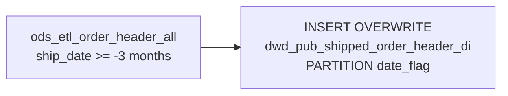

# DWD: Shipped Order Header — Daily Partition (`dwd_pub_shipped_order_header_di`)

- artifact_type: etl_table
- artifact_id: dw_us.dwd_pub_shipped_order_header_di
- domain: order
- one_line_purpose: This job loads a **rolling 3-month window of shipped order headers** from the unified ODS ETL order header table into a daily-partitioned DWD table. It serves as the **anchor table** for the shipped order DWD layer — the detail, expense, an...
- layer_type: DWD
- source_kind: etl_sql
- evidence_source: source/etl/sql/order/source/etl/flows/public_order_tools/ingest/public_shipped_order_dw/script/dwd_pub_shipped_order_header_di.sql

---

## L1 Data Foundation

### Identity and physical mapping
- **Table:** `dw_us.dwd_pub_shipped_order_header_di`
- **Layer type:** DWD
- **Canonical / derived:** Derived / ETL-loaded (see L3)
- **Owner team:** not registered in metadata catalog

### Grain, scope, exclusions
- **Grain:** one row per `(order_type, order_no)` — a unique shipped order within the rolling 3-month window.
- **Scope:** See L2 business purpose / L3 filters
- **Partition:** `date_flag` — the ship date of the order (`nvl(date(ship_date), '2099-01-01')`). - resolved from pipeline (see L4)
- **Natural key:** `order_type`, `order_no` within a `date_flag` partition.
- **Exclusions:** Not documented in repository

#### Grain detail (preserved)

- **Grain:** one row per `(order_type, order_no)` — a unique shipped order within the rolling 3-month window.
- **Partition:** `date_flag` — the ship date of the order (`nvl(date(ship_date), '2099-01-01')`).
- **Natural key:** `order_type`, `order_no` within a `date_flag` partition.

---

### Cross-engine presence
| Engine | Present | Canonical FQN | Notes |
|--------|---------|---------------|-------|
| Hive | yes | `dwd_pub_shipped_order_header_di` | ETL target / intermediate per evidence script |
| Vertica | pending | `dwd_pub_shipped_order_header_di` | Confirm via hive2vertica flow evidence / MCP |

### Physical schema reference

Pointer block only - full column catalog lives in WKB L1 storage JSON.

| Field | Value |
|-------|-------|
| **Authoritative catalog** | WKB L1 storage seed (not duplicated in this file) |
| **entity_id** | `dw_us.dwd_pub_shipped_order_header_di` |
| **l1_catalog_seed** | `target/storage/wkb/snapshots/_snapshot_id_template/l1_catalog/{engine}_{schema}_{table}.json` |
| **column_count** | pending (run ddl_seed_writer) |
| **partition_keys** | `date_flag, nvl(date(ship_date), '2099-01-01')` |
| **ddl_source** | pending Bitbucket DDL / Vertica metadata ingest |
| **retrieval** | `python -m tools.wkb.indexing.run_query --query "order dwd_pub_shipped_order_header_di schema" --intent find_table_schema` |

### Lineage
| Object | Role |
|--------|------|
| `ods_${country_code}.ods_etl_order_header_all` | Sole source — unified shipped order headers (active + history merged upstream) |
| `dw_${country_code}.dwd_pub_shipped_order_header_di` | **Target** — rolling 3-month shipped order header, partitioned by ship date |

---

### Freshness and load path
| Item | Value |
|------|-------|
| Load pattern | See L3 end-to-end / INSERT pattern in evidence script |
| Schedule | Not documented in repository |
| Parameters | `country_code` |


---

## L2 Declarative Knowledge

### Business purpose
This job loads a **rolling 3-month window of shipped order headers** from the unified ODS ETL order header table into a daily-partitioned DWD table. It serves as the **anchor table** for the shipped order DWD layer — the detail, expense, and profile companion tables all join to this table to inherit their `date_flag` partition value. Only headers with a ship date within the last 3 months are kept, making this a near-term operational dataset rather than a full historical archive.

---

### Audience and use cases
| Audience | How they benefit |
|----------|-----------------|
| **ETL pipelines** | Downstream scripts (`dwd_pub_shipped_order_detail_di`, `dwd_pub_shipped_order_exp_di`, `dwd_pub_shipped_order_profile_di`) join this table to get `date_flag` for their own partitioning. |
| **Operations / fulfillment** | Provides a fast, pre-filtered view of all recently shipped orders for daily operational queries without scanning the full ODS. |
| **Finance / reporting** | Rolling 3-month shipped header data for revenue recognition, invoicing, and shipment reconciliation. |

---

### Fact key resolution
- Natural key: `order_type`, `order_no` within a `date_flag` partition.
- FK / label-on attributes: see L3 dimension join patterns and step-by-step logic.
- Negative assertion: do not treat descriptive labels as grain keys unless listed under natural key.

### Time field semantics
- **date_flag / partition columns:** `date_flag` — the ship date of the order (`nvl(date(ship_date), '2099-01-01')`).
- Primary reporting filter should use the partition column(s) documented in L1; resolve values via L4.


### Metrics served

| Category | Column | Logical metric | Business reading |
|----------|--------|----------------|------------------|
| Measures | — | — | No measure columns mapped for this table. |

### Metric serving map

**Formula authority:** [`source/contracts/order/metric-index.md`](../../source/contracts/order/metric-index.md)

N/A — no measure columns mapped for this table.

### etl_metrics

No governed logical metrics from `source/contracts/order/metric-index.md` are mapped on this table.

---

### Metric serving map
N/A - not a `*_comb_mtd` / multi-period wide serving table (or map not present in legacy doc).


### Data products and column groups (preserved)

### Identifiers

- All columns from `ods_etl_order_header_all` (via `SELECT *`) — includes `order_type`, `order_no`, `ship_date`, and all header attributes.
- `date_flag` — derived partition key; used as the join/partition key by all companion DWD tables.

### Key derived column

- `date_flag` — `nvl(date(ship_date), '2099-01-01')` — the ship date as a date type. Headers with a null `ship_date` are assigned `2099-01-01` to keep them accessible without causing null-partition issues.

---

### etl_metrics

#### `date_flag`
- **Source:** [metric-index.md](../../source/contracts/order/metric-index.md#date_flag)
- **Business definition:** The ship date cast to a date. Null ship dates receive the far-future sentinel `2099-01-01` to avoid null partition errors and remain queryable.
```sql
nvl(date(ship_date), '2099-01-01')
```


---

## L3 Procedural Knowledge

### Query and routing rules
**Business filters:** Use partition / date keys from L1 grain for reporting scope.
**Technical predicates (load only):** See Key filters and step-by-step logic below.

### Dimension join patterns
| Dimension FQN | Join keys | Purpose | Evidence |
|---------------|-----------|---------|----------|
| See step-by-step / base tables | See L3 steps | Dimension enrichment | `source/etl/sql/order/source/etl/flows/public_order_tools/ingest/public_shipped_order_dw/script/dwd_pub_shipped_order_header_di.sql` |

### Key filters and ETL business logic
### Step 1 — Final `INSERT OVERWRITE` into `dwd_pub_shipped_order_header_di`

**From:** `ods_${country_code}.ods_etl_order_header_all`

**Filter (natural language):**
- `date(ship_date) >= add_months(CURRENT_DATE(), -3)` — keeps only orders shipped in the last 3 calendar months from the run date.

**Pass-through columns:** `SELECT *` — all columns from `ods_etl_order_header_all`.

**Derived columns:**

| Column | Formula | Plain language |
|--------|---------|----------------|
| `date_flag` | `nvl(date(ship_date), '2099-01-01')` | The ship date cast to a date. Null ship dates receive the far-future sentinel `2099-01-01` to avoid null partition errors and remain queryable. |

---

### Standard time-filter SQL
```sql
-- relative period filter using resolved partition value (see L4)
SELECT *
FROM dwd_pub_shipped_order_header_di
WHERE /* partition predicate */ date_flag = '${partition_value}';
```

### End-to-end flow
**Runtime parameters:** `country_code`
**Target table:** `dw_${country_code}.dwd_pub_shipped_order_header_di`, partitioned by **`date_flag`**.

1. Read from `ods_etl_order_header_all` filtered to `date(ship_date) >= add_months(CURRENT_DATE(), -3)`.
2. Derive `date_flag = nvl(date(ship_date), '2099-01-01')`.
3. **INSERT OVERWRITE** into `dwd_pub_shipped_order_header_di` partitioned by `date_flag`.



---


#### High-level stages (preserved)

| Stage | Business meaning |
|-------|-----------------|
| **Rolling window filter** | Reads from `ods_etl_order_header_all` and keeps only orders whose ship date falls within the last 3 months (`>= add_months(CURRENT_DATE(), -3)`). |
| **Partition key derivation** | Derives `date_flag` from `ship_date` — null ship dates receive the sentinel value `2099-01-01` to avoid partition failures. |
| **Partitioned overwrite** | Writes to `dwd_pub_shipped_order_header_di` partitioned by `date_flag`. |

**Parameters:** `country_code`

---


### Base tables register
| Object | Role in this job |
|--------|-----------------|
| `ods_${country_code}.ods_etl_order_header_all` | **Sole source.** Unified order header ODS ETL table (merges active and history). Filtered to last 3 months by ship date. All columns selected. |

**Temporary tables (inside the job only):** None.

---

### Step-by-step logic
### Step 1 — Final `INSERT OVERWRITE` into `dwd_pub_shipped_order_header_di`

**From:** `ods_${country_code}.ods_etl_order_header_all`

**Filter (natural language):**
- `date(ship_date) >= add_months(CURRENT_DATE(), -3)` — keeps only orders shipped in the last 3 calendar months from the run date.

**Pass-through columns:** `SELECT *` — all columns from `ods_etl_order_header_all`.

**Derived columns:**

| Column | Formula | Plain language |
|--------|---------|----------------|
| `date_flag` | `nvl(date(ship_date), '2099-01-01')` | The ship date cast to a date. Null ship dates receive the far-future sentinel `2099-01-01` to avoid null partition errors and remain queryable. |

---

### Relationship map (embedded)

| from_fqn | to_fqn | cardinality | join_keys | provenance |
|----------|--------|-------------|-----------|------------|
| `ods_${country_code}.ods_etl_order_header_all` | `ods_${country_code}.ods_etl_order_header_all` | 1:1 source scan | — (no JOIN; single FROM) | etl_sql (`source/etl/sql/order/public_order_scripts/public_shipped_order_dw/script/dwd_pub_shipped_order_header_di.sql:5`) |


### Special logic (embedded)

Not documented in repository

### Column / field derivations (from ETL SQL)

| target_column | expression_sql | upstream_columns | upstream_tables | transform_kind | evidence |
|---------------|----------------|------------------|-----------------|----------------|----------|
| `*` | `*` | — | — | partial | `source/etl/sql/order/public_order_scripts/public_shipped_order_dw/script/dwd_pub_shipped_order_header_di.sql:2` |
| `date_flag` | `nvl(date(ship_date), '2099-01-01')` | `ship_date` | `ods_${country_code}.ods_etl_order_header_all` | coalesce | `source/etl/sql/order/public_order_scripts/public_shipped_order_dw/script/dwd_pub_shipped_order_header_di.sql:4` |

### Sentinel and code values
| Value | Meaning |
|-------|---------|
| `date_flag = '2099-01-01'` | Order header where `ship_date` is NULL — assigned to a far-future partition to avoid null-partition failures. |
| `add_months(CURRENT_DATE(), -3)` | Dynamic rolling window boundary — the filter moves forward each day the job runs. |

---

---

## L4 Validation

### Resolved partition value
| Step | Source | How partition / date scope is determined |
|------|--------|------------------------------------------|
| 1 | evidence script / flow | See parameters in L1 Freshness and L3 filters - `source/etl/sql/order/source/etl/flows/public_order_tools/ingest/public_shipped_order_dw/script/dwd_pub_shipped_order_header_di.sql` |

**Plain language:** Partition and date scope follow Azkaban/bootstrap parameters documented in the source script and orchestrating flow; do not hardcode calendar literals.

### Data quality checks
- Prefer row-count-by-partition, metric sums, and grain duplicate checks (see Validation SQL).
- Additional checks from legacy caveats / operational notes when present.

### Validation SQL
```sql
-- 1) Row count by partition
SELECT ${partition_col}, COUNT(*) AS row_cnt
FROM dw_${country_code}.dwd_pub_shipped_order_header_di
WHERE ${partition_col} = '${partition_value}'
GROUP BY ${partition_col};

-- 2) Metric sum by business dimension (top deltas)
SELECT ${dim_key}, SUM(${metric}) AS metric_sum
FROM dw_${country_code}.dwd_pub_shipped_order_header_di
WHERE ${partition_col} = '${partition_value}'
GROUP BY ${dim_key}
ORDER BY ABS(SUM(${metric})) DESC
LIMIT 20;

-- 3) Grain duplicate check
SELECT ${grain_key_1}, ${grain_key_2}, ${grain_key_3}, ${partition_col}, COUNT(*) AS cnt
FROM dw_${country_code}.dwd_pub_shipped_order_header_di
WHERE ${partition_col} = '${partition_value}'
GROUP BY ${grain_key_1}, ${grain_key_2}, ${grain_key_3}, ${partition_col}
HAVING COUNT(*) > 1;
```

Replace placeholders from this file's Grain and keys / Data you can fetch sections, and use the resolved partition value from run scope.

### Caveats for interpretation
- **Rolling window — not a full history:** Only the last 3 months of shipped orders are present. Any query requiring earlier data must read `ods_etl_order_header_all` or `dwd_pub_shipped_order_header` (the non-partitioned version) directly.
- **`date_flag = '2099-01-01'` rows are real orders** with a missing ship date, not placeholder rows.
- **This table is a prerequisite for three companion scripts:** `dwd_pub_shipped_order_detail_di`, `dwd_pub_shipped_order_exp_di`, and `dwd_pub_shipped_order_profile_di` all inner-join to this table to derive their `date_flag`. If this job fails or is incomplete, those tables will be stale or missing partitions.
- **`SELECT *` means schema-dependent:** Any column added to or removed from `ods_etl_order_header_all` will automatically appear in or disappear from this table on the next run.

---

### Conflicts and open questions
- Schedule, owner, SLA: Not documented in repository (unless preserved schedule evidence above).
- Vertica MCP verification: pending unless confirmed in L5.


---

## L5 Runtime View

### Query path and engine preference
| Role | Hive object | Vertica object | Sync mode | Evidence | MCP verified |
|------|-------------|----------------|-----------|----------|--------------|
| **Query for reporting** | *See script lineage* | `dw_${country_code}.dwd_pub_shipped_order_header_di` | *Verify from flow* | *Add flow file:line* | pending |
| **Hive alternative** | `*` | `dw_${country_code}.dwd_pub_shipped_order_header_di` | - | *See dependencies* | - |
| **ETL internal** | staging/temp tables | *Not synced to Vertica* | - | *See step-by-step logic* | - |

Business users should query `dw_${country_code}.dwd_pub_shipped_order_header_di` in Vertica once MCP verification is completed for this document.

### Access constraints
- Country / company schema parameters may apply (`literal_country`, `company_no`, etc.).
- Hive-only staging objects are not reporting surfaces unless synced.

### Query risk profile
| Field | Value |
|-------|-------|
| requires_date_predicate | yes |
| scan_risk_tier | high |

---

## L6 Access and Consumption

### Primary consumers and use cases
| Audience | How they benefit |
|----------|-----------------|
| **ETL pipelines** | Downstream scripts (`dwd_pub_shipped_order_detail_di`, `dwd_pub_shipped_order_exp_di`, `dwd_pub_shipped_order_profile_di`) join this table to get `date_flag` for their own partitioning. |
| **Operations / fulfillment** | Provides a fast, pre-filtered view of all recently shipped orders for daily operational queries without scanning the full ODS. |
| **Finance / reporting** | Rolling 3-month shipped header data for revenue recognition, invoicing, and shipment reconciliation. |

---

### Representative query patterns
```sql
-- certified / illustrative lookup - replace predicates from L1/L4
SELECT *
FROM dwd_pub_shipped_order_header_di
WHERE date_flag = '${partition_value}'
LIMIT 100;
```

### Dependencies and notes
### Upstream objects (verified)

| Object | Usage | Evidence |
|--------|-------|----------|
| `ods_${country_code}.ods_etl_order_header_all` | All columns, filtered to last 3 months by ship_date | `source/etl/sql/order/source/etl/flows/public_order_tools/ingest/public_shipped_order_dw/script/dwd_pub_shipped_order_header_di.sql:5-6` |

### Downstream consumers (verified)

| Object / script | Evidence |
|-----------------|----------|
| `dwd_pub_shipped_order_detail_di.sql` — inner joins this table for date_flag | `source/etl/sql/order/source/etl/flows/public_order_tools/ingest/public_shipped_order_dw/script/dwd_pub_shipped_order_detail_di.sql:3` |
| `dwd_pub_shipped_order_exp_di.sql` — inner joins this table for date_flag | `source/etl/sql/order/source/etl/flows/public_order_tools/ingest/public_shipped_order_dw/script/dwd_pub_shipped_order_exp_di.sql:3` |
| `dwd_pub_shipped_order_profile_di.sql` — inner joins this table for date_flag | `source/etl/sql/order/source/etl/flows/public_order_tools/ingest/public_shipped_order_dw/script/dwd_pub_shipped_order_profile_di.sql:3` |

### Operational detail (verified)

- Partition overwrite: `INSERT OVERWRITE TABLE dw_${country_code}.dwd_pub_shipped_order_header_di PARTITION (date_flag)` — `dwd_pub_shipped_order_header_di.sql:1`

### Not documented in repository

- Schedule, owner, SLA — not in scripts or configs
- The 3-month window is dynamic (relative to `CURRENT_DATE()`) — older partitions are not deleted by this script; only the partitions for dates within the window are refreshed.

---

*Document generated from `source/etl/sql/order/source/etl/flows/public_order_tools/ingest/public_shipped_order_dw/script/dwd_pub_shipped_order_header_di.sql`.*

#### Not documented in repository
- Owner, SLA (unless schedule evidence preserved above)
- Any dependency without `file:line` evidence in this document

---

*Document migrated to L1-L6 from legacy Knowledgebase content. Evidence: `source/etl/sql/order/source/etl/flows/public_order_tools/ingest/public_shipped_order_dw/script/dwd_pub_shipped_order_header_di.sql`.*
