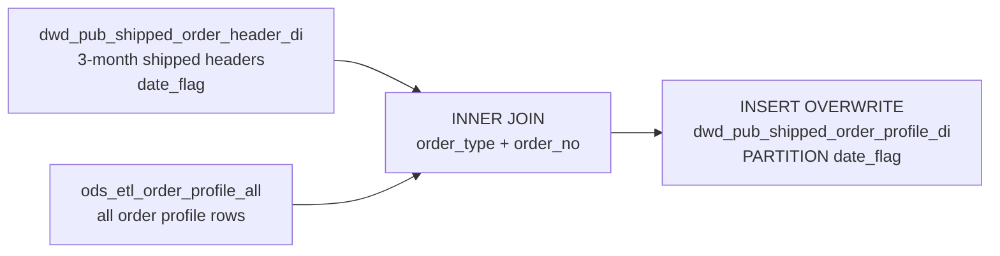

# DWD: Shipped Order Profile — Daily Partition (`dwd_pub_shipped_order_profile_di`)

- artifact_type: etl_table
- artifact_id: dw_us.dwd_pub_shipped_order_profile_di
- domain: order
- one_line_purpose: This job loads **shipped order profile data** for the rolling 3-month window by joining the ODS unified order profile table to the shipped order header partition table. Order profile records carry supplementary attributes attached to an ord...
- layer_type: DWD
- source_kind: etl_sql
- evidence_source: source/etl/sql/order/source/etl/flows/public_order_tools/ingest/public_shipped_order_dw/script/dwd_pub_shipped_order_profile_di.sql

---

## L1 Data Foundation

### Identity and physical mapping
- **Table:** `dw_us.dwd_pub_shipped_order_profile_di`
- **Layer type:** DWD
- **Canonical / derived:** Derived / ETL-loaded (see L3)
- **Owner team:** not registered in metadata catalog

### Grain, scope, exclusions
- **Grain:** one row per the natural grain of `ods_etl_order_profile_all` for shipped orders in the 3-month window — typically `(order_type, order_no, profile_type)` or similar.
- **Scope:** See L2 business purpose / L3 filters
- **Partition:** `date_flag` — the ship date inherited from `dwd_pub_shipped_order_header_di`. - resolved from pipeline (see L4)
- **Natural key:** determined by the schema of `ods_etl_order_profile_all` (not explicitly defined in this script).
- **Exclusions:** Not documented in repository

#### Grain detail (preserved)

- **Grain:** one row per the natural grain of `ods_etl_order_profile_all` for shipped orders in the 3-month window — typically `(order_type, order_no, profile_type)` or similar.
- **Partition:** `date_flag` — the ship date inherited from `dwd_pub_shipped_order_header_di`.
- **Natural key:** determined by the schema of `ods_etl_order_profile_all` (not explicitly defined in this script).

---

### Cross-engine presence
| Engine | Present | Canonical FQN | Notes |
|--------|---------|---------------|-------|
| Hive | yes | `dwd_pub_shipped_order_profile_di` | ETL target / intermediate per evidence script |
| Vertica | pending | `dwd_pub_shipped_order_profile_di` | Confirm via hive2vertica flow evidence / MCP |

### Physical schema reference

Pointer block only - full column catalog lives in WKB L1 storage JSON.

| Field | Value |
|-------|-------|
| **Authoritative catalog** | WKB L1 storage seed (not duplicated in this file) |
| **entity_id** | `dw_us.dwd_pub_shipped_order_profile_di` |
| **l1_catalog_seed** | `target/storage/wkb/snapshots/_snapshot_id_template/l1_catalog/{engine}_{schema}_{table}.json` |
| **column_count** | pending (run ddl_seed_writer) |
| **partition_keys** | `date_flag, dwd_pub_shipped_order_header_di` |
| **ddl_source** | pending Bitbucket DDL / Vertica metadata ingest |
| **retrieval** | `python -m tools.wkb.indexing.run_query --query "order dwd_pub_shipped_order_profile_di schema" --intent find_table_schema` |

### Lineage
| Object | Role |
|--------|------|
| `ods_${country_code}.ods_etl_order_profile_all` | Source — all order profile columns |
| `dw_${country_code}.dwd_pub_shipped_order_header_di` | Header anchor — provides date_flag and filters to shipped orders |
| `dw_${country_code}.dwd_pub_shipped_order_profile_di` | **Target** — shipped order profiles, partitioned by ship date |

---

### Freshness and load path
| Item | Value |
|------|-------|
| Load pattern | See L3 end-to-end / INSERT pattern in evidence script |
| Schedule | Not documented in repository |
| Parameters | `country_code` |


---

## L2 Declarative Knowledge

### Business purpose
This job loads **shipped order profile data** for the rolling 3-month window by joining the ODS unified order profile table to the shipped order header partition table. Order profile records carry supplementary attributes attached to an order — such as special handling codes, routing instructions, or extended reference data — that are not in the standard header or detail. Inheriting `date_flag` from the header ensures profile rows sit in the correct ship-date partition alongside their companion tables.

---

### Audience and use cases
| Audience | How they benefit |
|----------|-----------------|
| **Operations / fulfillment** | Special handling codes and routing/profile attributes for recently shipped orders — supports exception management and special-order tracking. |
| **ETL pipelines** | Profile data enriches downstream datasets that need supplementary order attributes not available in the standard header or detail. |

---

### Fact key resolution
- Natural key: determined by the schema of `ods_etl_order_profile_all` (not explicitly defined in this script).
- FK / label-on attributes: see L3 dimension join patterns and step-by-step logic.
- Negative assertion: do not treat descriptive labels as grain keys unless listed under natural key.

### Time field semantics
- **date_flag / partition columns:** `date_flag` — the ship date inherited from `dwd_pub_shipped_order_header_di`.
- Primary reporting filter should use the partition column(s) documented in L1; resolve values via L4.


### Metrics served

| Category | Column | Logical metric | Business reading |
|----------|--------|----------------|------------------|
| Measures | — | — | No measure columns mapped for this table. |

### Metric serving map

**Formula authority:** [`source/contracts/order/metric-index.md`](../../source/contracts/order/metric-index.md)

N/A — no measure columns mapped for this table.

### etl_metrics

No governed logical metrics from `source/contracts/order/metric-index.md` are mapped on this table.

---

### Metric serving map
N/A - not a `*_comb_mtd` / multi-period wide serving table (or map not present in legacy doc).


### Data products and column groups (preserved)

### Identifiers

- All columns from `ods_etl_order_profile_all` (via `a.*`) — includes `order_type`, `order_no`, and all profile-specific attributes.
- `date_flag` — ship date partition inherited from the header join.

---

### etl_metrics

N/A - no calculable ETL formulas extracted from this document (passthrough / stored measures only, or formulas not documented).

---

## L3 Procedural Knowledge

### Query and routing rules
**Business filters:** Use partition / date keys from L1 grain for reporting scope.
**Technical predicates (load only):** See Key filters and step-by-step logic below.

### Dimension join patterns
| Dimension FQN | Join keys | Purpose | Evidence |
|---------------|-----------|---------|----------|
| See step-by-step / base tables | See L3 steps | Dimension enrichment | `source/etl/sql/order/source/etl/flows/public_order_tools/ingest/public_shipped_order_dw/script/dwd_pub_shipped_order_profile_di.sql` |

### Key filters and ETL business logic
### Step 1 — Final `INSERT OVERWRITE` into `dwd_pub_shipped_order_profile_di`

**From:** `ods_etl_order_profile_all` (`a`) INNER JOIN `dwd_pub_shipped_order_header_di` (`b`)

**Join keys:** `a.order_type = b.order_type AND a.order_no = b.order_no`

**Filter:** Implicit — only profiles whose `(order_type, order_no)` exists in the shipped header set are included.

**Pass-through columns:** `a.*` — all columns from `ods_etl_order_profile_all`.

**Derived columns:**

| Column | Source | Plain language |
|--------|--------|----------------|
| `date_flag` | `b.date_flag` | Ship date partition key from the header join. |

---

### Standard time-filter SQL
```sql
-- relative period filter using resolved partition value (see L4)
SELECT *
FROM dwd_pub_shipped_order_profile_di
WHERE /* partition predicate */ date_flag = '${partition_value}';
```

### End-to-end flow
**Runtime parameters:** `country_code`
**Target table:** `dw_${country_code}.dwd_pub_shipped_order_profile_di`, partitioned by **`date_flag`**.

1. Read `ods_etl_order_profile_all` (all order profile rows).
2. INNER JOIN to `dwd_pub_shipped_order_header_di` on `order_type + order_no` — keeps only profiles for shipped orders in the 3-month window.
3. Select all profile columns (`a.*`) plus `b.date_flag` from the header.
4. **INSERT OVERWRITE** into target partitioned by `date_flag`.



---


#### High-level stages (preserved)

| Stage | Business meaning |
|-------|-----------------|
| **Header join** | Inner-joins `ods_etl_order_profile_all` (all order profile rows) to `dwd_pub_shipped_order_header_di` (rolling 3-month shipped headers) on `order_type + order_no`. Only profiles for shipped orders in the window are included. |
| **Partition key inheritance** | Takes `date_flag` from the header table — each profile row is placed in the same partition as its order's ship date. |
| **Partitioned overwrite** | Writes to `dwd_pub_shipped_order_profile_di` partitioned by `date_flag`. |

**Parameters:** `country_code`

---


### Base tables register
| Object | Role in this job |
|--------|-----------------|
| `ods_${country_code}.ods_etl_order_profile_all` | **Profile source.** All order profile columns. Filtered implicitly to shipped orders via the inner join. |
| `dw_${country_code}.dwd_pub_shipped_order_header_di` | **Header anchor.** Provides `date_flag` and filters to the 3-month shipped order set. Must be current before this job runs. |

**Temporary tables (inside the job only):** None.

---

### Step-by-step logic
### Step 1 — Final `INSERT OVERWRITE` into `dwd_pub_shipped_order_profile_di`

**From:** `ods_etl_order_profile_all` (`a`) INNER JOIN `dwd_pub_shipped_order_header_di` (`b`)

**Join keys:** `a.order_type = b.order_type AND a.order_no = b.order_no`

**Filter:** Implicit — only profiles whose `(order_type, order_no)` exists in the shipped header set are included.

**Pass-through columns:** `a.*` — all columns from `ods_etl_order_profile_all`.

**Derived columns:**

| Column | Source | Plain language |
|--------|--------|----------------|
| `date_flag` | `b.date_flag` | Ship date partition key from the header join. |

---

### Relationship map (embedded)

| from_fqn | to_fqn | cardinality | join_keys | provenance |
|----------|--------|-------------|-----------|------------|
| `dw_${country_code}.dwd_pub_shipped_order_header_di` | `ods_${country_code}.ods_etl_order_profile_all` | many:1 | `a.order_type` = `b.order_type`; `a.order_no` = `b.order_no` | etl_sql (`source/etl/sql/order/public_order_scripts/public_shipped_order_dw/script/dwd_pub_shipped_order_profile_di.sql:4`) |

### Special logic (embedded)

Not documented in repository

### Column / field derivations (from ETL SQL)

| target_column | expression_sql | upstream_columns | upstream_tables | transform_kind | evidence |
|---------------|----------------|------------------|-----------------|----------------|----------|
| `a` | `a.*` | `a` | `dw_${country_code}.dwd_pub_shipped_order_header_di`, `ods_${country_code}.ods_etl_order_profile_all` | arithmetic | `source/etl/sql/order/public_order_scripts/public_shipped_order_dw/script/dwd_pub_shipped_order_profile_di.sql:2` |
| `date_flag` | `b.date_flag` | `date_flag` | `dw_${country_code}.dwd_pub_shipped_order_header_di`, `ods_${country_code}.ods_etl_order_profile_all` | passthrough | `source/etl/sql/order/public_order_scripts/public_shipped_order_dw/script/dwd_pub_shipped_order_profile_di.sql:2` |

### Sentinel and code values
| Value | Meaning |
|-------|---------|
| Inner join to `dwd_pub_shipped_order_header_di` | Profile rows for orders outside the 3-month shipped set are excluded. |
| `date_flag = '2099-01-01'` | Profile rows whose parent header had a null `ship_date` — inherited from the header sentinel. |

---

---

## L4 Validation

### Resolved partition value
| Step | Source | How partition / date scope is determined |
|------|--------|------------------------------------------|
| 1 | evidence script / flow | See parameters in L1 Freshness and L3 filters - `source/etl/sql/order/source/etl/flows/public_order_tools/ingest/public_shipped_order_dw/script/dwd_pub_shipped_order_profile_di.sql` |

**Plain language:** Partition and date scope follow Azkaban/bootstrap parameters documented in the source script and orchestrating flow; do not hardcode calendar literals.

### Data quality checks
- Prefer row-count-by-partition, metric sums, and grain duplicate checks (see Validation SQL).
- Additional checks from legacy caveats / operational notes when present.

### Validation SQL
```sql
-- 1) Row count by partition
SELECT ${partition_col}, COUNT(*) AS row_cnt
FROM dw_${country_code}.dwd_pub_shipped_order_profile_di
WHERE ${partition_col} = '${partition_value}'
GROUP BY ${partition_col};

-- 2) Metric sum by business dimension (top deltas)
SELECT ${dim_key}, SUM(${metric}) AS metric_sum
FROM dw_${country_code}.dwd_pub_shipped_order_profile_di
WHERE ${partition_col} = '${partition_value}'
GROUP BY ${dim_key}
ORDER BY ABS(SUM(${metric})) DESC
LIMIT 20;

-- 3) Grain duplicate check
SELECT ${grain_key_1}, ${grain_key_2}, ${grain_key_3}, ${partition_col}, COUNT(*) AS cnt
FROM dw_${country_code}.dwd_pub_shipped_order_profile_di
WHERE ${partition_col} = '${partition_value}'
GROUP BY ${grain_key_1}, ${grain_key_2}, ${grain_key_3}, ${partition_col}
HAVING COUNT(*) > 1;
```

Replace placeholders from this file's Grain and keys / Data you can fetch sections, and use the resolved partition value from run scope.

### Caveats for interpretation
- **Depends on `dwd_pub_shipped_order_header_di` being current.** If the header job has not run, this table will be stale or missing partitions.
- **3-month window is inherited from the header.** The coverage matches the header exactly.
- **`SELECT a.*`** — schema changes in `ods_etl_order_profile_all` propagate automatically.
- **Not all shipped orders have a profile row** — the inner join means orders without a profile record in `ods_etl_order_profile_all` will not appear in this table.

---

### Conflicts and open questions
- Schedule, owner, SLA: Not documented in repository (unless preserved schedule evidence above).
- Vertica MCP verification: pending unless confirmed in L5.


---

## L5 Runtime View

### Query path and engine preference
| Role | Hive object | Vertica object | Sync mode | Evidence | MCP verified |
|------|-------------|----------------|-----------|----------|--------------|
| **Query for reporting** | *See script lineage* | `dw_${country_code}.dwd_pub_shipped_order_profile_di` | *Verify from flow* | *Add flow file:line* | pending |
| **Hive alternative** | `*` | `dw_${country_code}.dwd_pub_shipped_order_profile_di` | - | *See dependencies* | - |
| **ETL internal** | staging/temp tables | *Not synced to Vertica* | - | *See step-by-step logic* | - |

Business users should query `dw_${country_code}.dwd_pub_shipped_order_profile_di` in Vertica once MCP verification is completed for this document.

### Access constraints
- Country / company schema parameters may apply (`literal_country`, `company_no`, etc.).
- Hive-only staging objects are not reporting surfaces unless synced.

### Query risk profile
| Field | Value |
|-------|-------|
| requires_date_predicate | yes |
| scan_risk_tier | high |

---

## L6 Access and Consumption

### Primary consumers and use cases
| Audience | How they benefit |
|----------|-----------------|
| **Operations / fulfillment** | Special handling codes and routing/profile attributes for recently shipped orders — supports exception management and special-order tracking. |
| **ETL pipelines** | Profile data enriches downstream datasets that need supplementary order attributes not available in the standard header or detail. |

---

### Representative query patterns
```sql
-- certified / illustrative lookup - replace predicates from L1/L4
SELECT *
FROM dwd_pub_shipped_order_profile_di
WHERE date_flag = '${partition_value}'
LIMIT 100;
```

### Dependencies and notes
### Upstream objects (verified)

| Object | Usage | Evidence |
|--------|-------|----------|
| `dw_${country_code}.dwd_pub_shipped_order_header_di` | Inner join — filter to shipped orders + provides date_flag | `source/etl/sql/order/source/etl/flows/public_order_tools/ingest/public_shipped_order_dw/script/dwd_pub_shipped_order_profile_di.sql:3-6` |
| `ods_${country_code}.ods_etl_order_profile_all` | All order profile columns | `source/etl/sql/order/source/etl/flows/public_order_tools/ingest/public_shipped_order_dw/script/dwd_pub_shipped_order_profile_di.sql:4` |

### Downstream consumers (verified)

| Object / script | Evidence |
|-----------------|----------|
| None identified in repository. | — |

### Operational detail (verified)

- Partition overwrite: `INSERT OVERWRITE TABLE dw_${country_code}.dwd_pub_shipped_order_profile_di PARTITION (date_flag)` — `dwd_pub_shipped_order_profile_di.sql:1`

### Not documented in repository

- Schedule, owner, SLA — not in scripts or configs

### Related scripts (verified)

- `dwd_pub_shipped_order_header_di.sql` — must run first — `source/etl/sql/order/source/etl/flows/public_order_tools/ingest/public_shipped_order_dw/script/dwd_pub_shipped_order_header_di.sql`

---

*Document generated from `source/etl/sql/order/source/etl/flows/public_order_tools/ingest/public_shipped_order_dw/script/dwd_pub_shipped_order_profile_di.sql`.*

#### Not documented in repository
- Owner, SLA (unless schedule evidence preserved above)
- Any dependency without `file:line` evidence in this document

---

*Document migrated to L1-L6 from legacy Knowledgebase content. Evidence: `source/etl/sql/order/source/etl/flows/public_order_tools/ingest/public_shipped_order_dw/script/dwd_pub_shipped_order_profile_di.sql`.*
