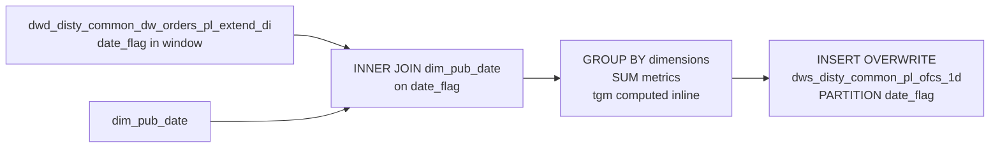

# DWS: PL Order Financial Components — Daily Summary (`dws_disty_common_pl_ofcs_1d`)

- artifact_type: etl_table
- artifact_id: dw_us.dws_disty_common_pl_ofcs_1d
- domain: order
- one_line_purpose: This job produces a **daily-partitioned DWS-layer P&L summary** by aggregating all profitability metric components from the PL-extended order table (`dwd_disty_common_dw_orders_pl_extend_di`) to a multi-dimensional grain. It preserves every...
- layer_type: DWS
- source_kind: etl_sql
- evidence_source: source/etl/sql/order/source/etl/flows/public_order_tools/ingest/public_order_dw/script/dws_disty_common_pl_ofcs_1d.sql

---

## L1 Data Foundation

### Identity and physical mapping
- **Table:** `dw_us.dws_disty_common_pl_ofcs_1d`
- **Layer type:** DWS
- **Canonical / derived:** Derived / ETL-loaded (see L3)
- **Owner team:** not registered in metadata catalog

### Grain, scope, exclusions
- **Grain:** one row per `(order_type, from_loc_no, drop_ship_flag, cust_no, sku_no, kit_sku_no, vend_no, pm_code, dim_vpl_no, dim_vend_no, dim_master_xref, dim_pm_code, dim_key_manager, dim_pm_header, dim_product_group, dim_group_id, dim_seg_code, dim_division, dim_director, cust_terr, cust_type, date_flag)` — the unique combination of all GROUP BY dimensions.
- **Scope:** See L2 business purpose / L3 filters
- **Partition:** `date_flag` — the PL order's date flag. - resolved from pipeline (see L4)
- **Natural key:** Not documented in repository
- **Exclusions:** Not documented in repository

#### Grain detail (preserved)

- **Grain:** one row per `(order_type, from_loc_no, drop_ship_flag, cust_no, sku_no, kit_sku_no, vend_no, pm_code, dim_vpl_no, dim_vend_no, dim_master_xref, dim_pm_code, dim_key_manager, dim_pm_header, dim_product_group, dim_group_id, dim_seg_code, dim_division, dim_director, cust_terr, cust_type, date_flag)` — the unique combination of all GROUP BY dimensions.
- **Partition:** `date_flag` — the PL order's date flag.
- **Note:** The same `date_flag` as the source `dwd_disty_common_dw_orders_pl_extend_di`, enriched with `year`, `month`, `fyear`, `qtr`, `fqtr` from `dim_pub_date`.

---

### Cross-engine presence
| Engine | Present | Canonical FQN | Notes |
|--------|---------|---------------|-------|
| Hive | yes | `dws_disty_common_pl_ofcs_1d` | ETL target / intermediate per evidence script |
| Vertica | pending | `dws_disty_common_pl_ofcs_1d` | Confirm via hive2vertica flow evidence / MCP |

### Physical schema reference

Pointer block only - full column catalog lives in WKB L1 storage JSON.

| Field | Value |
|-------|-------|
| **Authoritative catalog** | WKB L1 storage seed (not duplicated in this file) |
| **entity_id** | `dw_us.dws_disty_common_pl_ofcs_1d` |
| **l1_catalog_seed** | `target/storage/wkb/snapshots/_snapshot_id_template/l1_catalog/{engine}_{schema}_{table}.json` |
| **column_count** | pending (run ddl_seed_writer) |
| **partition_keys** | `date_flag` |
| **ddl_source** | pending Bitbucket DDL / Vertica metadata ingest |
| **retrieval** | `python -m tools.wkb.indexing.run_query --query "order dws_disty_common_pl_ofcs_1d schema" --intent find_table_schema` |

### Lineage
| Object | Role |
|--------|------|
| `dw_${country_code}.dwd_disty_common_dw_orders_pl_extend_di` | Primary source |
| `dim_${country_code}.dim_pub_date` | Calendar/fiscal date attributes |
| `dw_${country_code}.dws_disty_common_pl_ofcs_1d` | **Target** — DWS P&L component daily summary |

---

### Freshness and load path
| Item | Value |
|------|-------|
| Load pattern | See L3 end-to-end / INSERT pattern in evidence script |
| Schedule | Not documented in repository |
| Parameters | `country_code`, `start_date`, `end_date` |


---

## L2 Declarative Knowledge

### Business purpose
This job produces a **daily-partitioned DWS-layer P&L summary** by aggregating all profitability metric components from the PL-extended order table (`dwd_disty_common_dw_orders_pl_extend_di`) to a multi-dimensional grain. It preserves every individual P&L component column (BTL, freight, rebates, marketing, NGM, OPLGM, TGM, etc.) summed by order type, fulfilment location, drop-ship flag, customer, SKU, vendor, PM/VPL dimensions, and date — enriched with fiscal calendar context from the date dimension. This is the primary pre-aggregated source for P&L reporting dashboards and margin bridge analysis.

---

### Audience and use cases
| Audience | How they benefit |
|----------|-----------------|
| **Finance / FP&A** | Pre-aggregated full P&L component breakdown — every BTL, freight, rebate, marketing, NGM, OPLGM, and TGM column ready for bridge analysis without scanning raw order lines. |
| **Vendor / PM management** | `dim_vpl_no`, `dim_vend_no`, `dim_pm_code`, `dim_key_manager`, `dim_pm_header`, `dim_director` — pre-resolved dimension keys for PM org hierarchy roll-ups. |
| **Sales / territory management** | `cust_terr`, `cust_type`, `cust_no` — customer and territory-level P&L aggregation. |
| **BI / dashboards** | Fiscal calendar columns (`fyear`, `fqtr`, `qtr`) allow alignment to both calendar and fiscal reporting periods. |

---

### Fact key resolution
- Natural key: Not documented in repository
- FK / label-on attributes: see L3 dimension join patterns and step-by-step logic.
- Negative assertion: do not treat descriptive labels as grain keys unless listed under natural key.

### Time field semantics
- **date_flag / partition columns:** `date_flag` — the PL order's date flag.
- Primary reporting filter should use the partition column(s) documented in L1; resolve values via L4.


### Metrics served

| Category | Column | Logical metric | Business reading |
|----------|--------|----------------|------------------|
| Measures | — | — | No measure columns mapped for this table. |

### Metric serving map

**Formula authority:** [`source/contracts/order/metric-index.md`](../../source/contracts/order/metric-index.md)

N/A — no measure columns mapped for this table.

### etl_metrics

No governed logical metrics from `source/contracts/order/metric-index.md` are mapped on this table.

---

### Metric serving map
N/A - not a `*_comb_mtd` / multi-period wide serving table (or map not present in legacy doc).


### Data products and column groups (preserved)

### Fiscal / calendar dimensions

- `year`, `month` — calendar year and month
- `fyear`, `qtr`, `fqtr` — fiscal year, calendar quarter, fiscal quarter (from `dim_pub_date`)

### Order / fulfilment dimensions

- `order_type`, `from_loc_no`, `drop_ship_flag`
- `cust_no`, `sku_no`, `kit_sku_no`, `vend_no`
- `vpl_no` (= `pm_code`) — product line / VPL code
- `cust_terr`, `cust_type`

### Pre-computed dimension keys

- `dim_vpl_no`, `dim_vend_no`, `dim_master_xref`
- `dim_pm_code`, `dim_key_manager`, `dim_pm_header`, `dim_director`
- `dim_product_group`, `dim_group_id`, `dim_seg_code`, `dim_division`

### Volume and revenue metrics

- `real_ship_qty`, `ship_qty`, `net_sales`, `net_cost`
- `u_price`, `u_cost`, `u_sum_expense`, `l_weight`, `sales_cost`, `base_cost`

### P&L component columns (all summed)

| Column group | Columns |
|-------------|---------|
| **BTL / BTL variants** | `btl`, `btl_sales`, `trans_btl`, `trans_btl_sales`, `one_time_btl`, `hbtl`, `btl_backout` |
| **SCM** | `scm_disc`, `scm_ndisc`, `scm_cost`, `scm_risk`, `scm_profit_adj` |
| **Freight** | `frt_in`, `frt_out_load`, `frt_out_exp`, `frt_ob_recovery`, `frt_ib_recovery` |
| **Customer** | `cust_rebate`, `cust_pmt_disc`, `cust_finance`, `cust_finance_sales` |
| **Marketing / overhead** | `mof`, `pdt`, `pdt_sales`, `marketing`, `corporate`, `coop`, `order_overhead`, `sfs`, `infrastructure`, `infra_funding`, `others`, `others_sales`, `extra_u_exp` |
| **Finance / cost** | `ap_finance`, `ap_adj`, `ar_fin_recovery`, `cr_risk_cterm`, `flr_synnex`, `flr_vendor`, `hc_pm`, `hc_sales`, `hc_bd` |
| **Inventory / other** | `whoh_pack`, `inv_cost`, `inv_reserve`, `rma`, `direct_credit`, `mfg_oh`, `margin_share`, `csgn_edi_fee`, `cvr_rm` |
| **P&L totals** | `gm_amt`, `tgm`, `oplgm_amt`, `oplgm_plus_amt`, `ngm_amt`, `csc_amt`, `ppc_amt` |

### Derived metric

| Column | Formula | Plain language |
|--------|---------|----------------|
| `tgm` | `(u_price − nvl(sales_cost, u_cost)) × ship_qty + btl + one_time_btl + hbtl + scm_profit_adj + btl_backout + pdt + inv_reserve + mof + marketing + frt_out_load + frt_out_exp + frt_ob_recovery + frt_ib_recovery + cust_pmt_disc + cust_rebate + cvr_rm + margin_share + ap_adj + (nvl(sales_cost, u_cost) − u_cost) × ship_qty` | Total Gross Margin — GM plus all major P&L adjustments plus FX/sales-cost delta. |

---

### etl_metrics

#### `tgm`
- **Source:** [metric-index.md](../../source/contracts/order/metric-index.md#tgm)
- **Business definition:** Total Gross Margin — GM plus all major P&L adjustments plus FX/sales-cost delta.
```sql
(u_price − nvl(sales_cost, u_cost)) × ship_qty + btl + one_time_btl + hbtl + scm_profit_adj + btl_backout + pdt + inv_reserve + mof + marketing + frt_out_load + frt_out_exp + frt_ob_recovery + frt_ib_recovery + cust_pmt_disc + cust_rebate + cvr_rm + margin_share + ap_adj + (nvl(sales_cost, u_cost) − u_cost) × ship_qty
```


---

## L3 Procedural Knowledge

### Query and routing rules
**Business filters:** Use partition / date keys from L1 grain for reporting scope.
**Technical predicates (load only):** See Key filters and step-by-step logic below.

### Dimension join patterns
| Dimension FQN | Join keys | Purpose | Evidence |
|---------------|-----------|---------|----------|
| See step-by-step / base tables | See L3 steps | Dimension enrichment | `source/etl/sql/order/source/etl/flows/public_order_tools/ingest/public_order_dw/script/dws_disty_common_pl_ofcs_1d.sql` |

### Key filters and ETL business logic
See step-by-step logic

### Standard time-filter SQL
```sql
-- relative period filter using resolved partition value (see L4)
SELECT *
FROM dws_disty_common_pl_ofcs_1d
WHERE /* partition predicate */ date_flag = '${partition_value}';
```

### End-to-end flow
**Runtime parameters:** `country_code`, `start_date`, `end_date`
**Target table:** `dw_${country_code}.dws_disty_common_pl_ofcs_1d`, partitioned by **`date_flag`**.

1. Read `dwd_disty_common_dw_orders_pl_extend_di` filtered to the date window.
2. INNER JOIN `dim_pub_date` to add fiscal/calendar attributes.
3. GROUP BY all dimensions + date_flag; SUM all P&L metric columns; compute `tgm` inline.
4. **INSERT OVERWRITE** into target.



---


#### High-level stages (preserved)

| Stage | Business meaning |
|-------|-----------------|
| **Date dimension join** | INNER JOINs `dwd_disty_common_dw_orders_pl_extend_di` to `dim_pub_date` to attach calendar year, month, fiscal year, quarter, and fiscal quarter to each order line. |
| **Date window filter** | Restricts to `date_flag >= start_date AND date_flag < end_date`. |
| **Aggregation** | Groups by all business dimensions (order type, location, drop-ship, customer, SKU, vendor, PM code, pre-computed dim_ columns, territory, customer type, date) and SUMs all P&L component columns. |
| **TGM computation** | Calculates `tgm` inline: GM + all BTL/freight/rebate/marketing P&L adjustment components + FX/sales-cost delta. |

**Parameters:** `country_code`, `start_date`, `end_date`

---


### Base tables register
| Object | Role in this job |
|--------|-----------------|
| `dw_${country_code}.dwd_disty_common_dw_orders_pl_extend_di` | **Primary source.** PL-extended order lines with all profitability component columns, pre-computed dimension keys, and date_flag. |
| `dim_${country_code}.dim_pub_date` | Date dimension — adds `year`, `month`, `fyear`, `qtr`, `fqtr` to each date_flag. INNER JOIN so only date_flags present in the dimension are included. |

**Temporary tables (inside the job only):** None — single direct INSERT.

---

### Step-by-step logic
None identified in repository

### Relationship map (embedded)

| from_fqn | to_fqn | cardinality | join_keys | provenance |
|----------|--------|-------------|-----------|------------|
| `dw_${country_code}.dwd_disty_common_dw_orders_pl_extend_di` | `dim_${country_code}.dim_pub_date` | many:1 | `o.date_flag` = `d.date_flag` | etl_sql (`source/etl/sql/order/public_order_scripts/public_order_dw/script/dws_disty_common_pl_ofcs_1d.sql:106`) |

### Special logic (embedded)

Not documented in repository

### Column / field derivations (from ETL SQL)

| target_column | expression_sql | upstream_columns | upstream_tables | transform_kind | evidence |
|---------------|----------------|------------------|-----------------|----------------|----------|
| `year` | `d.year` | `year` | `dw_${country_code}.dwd_disty_common_dw_orders_pl_extend_di`, `dim_${country_code}.dim_pub_date` | passthrough | `source/etl/sql/order/public_order_scripts/public_order_dw/script/dws_disty_common_pl_ofcs_1d.sql:3` |
| `month` | `d.month` | `month` | `dw_${country_code}.dwd_disty_common_dw_orders_pl_extend_di`, `dim_${country_code}.dim_pub_date` | passthrough | `source/etl/sql/order/public_order_scripts/public_order_dw/script/dws_disty_common_pl_ofcs_1d.sql:4` |
| `fyear` | `d.fyear` | `fyear` | `dw_${country_code}.dwd_disty_common_dw_orders_pl_extend_di`, `dim_${country_code}.dim_pub_date` | passthrough | `source/etl/sql/order/public_order_scripts/public_order_dw/script/dws_disty_common_pl_ofcs_1d.sql:5` |
| `qtr` | `d.qtr` | `qtr` | `dw_${country_code}.dwd_disty_common_dw_orders_pl_extend_di`, `dim_${country_code}.dim_pub_date` | passthrough | `source/etl/sql/order/public_order_scripts/public_order_dw/script/dws_disty_common_pl_ofcs_1d.sql:6` |
| `fqtr` | `d.fqtr` | `fqtr` | `dw_${country_code}.dwd_disty_common_dw_orders_pl_extend_di`, `dim_${country_code}.dim_pub_date` | passthrough | `source/etl/sql/order/public_order_scripts/public_order_dw/script/dws_disty_common_pl_ofcs_1d.sql:7` |
| `order_type` | `order_type` | `order_type` | `dw_${country_code}.dwd_disty_common_dw_orders_pl_extend_di`, `dim_${country_code}.dim_pub_date` | passthrough | `source/etl/sql/order/public_order_scripts/public_order_dw/script/dws_disty_common_pl_ofcs_1d.sql:8` |
| `from_loc_no` | `from_loc_no` | `from_loc_no` | `dw_${country_code}.dwd_disty_common_dw_orders_pl_extend_di`, `dim_${country_code}.dim_pub_date` | passthrough | `source/etl/sql/order/public_order_scripts/public_order_dw/script/dws_disty_common_pl_ofcs_1d.sql:9` |
| `drop_ship_flag` | `drop_ship_flag` | `drop_ship_flag` | `dw_${country_code}.dwd_disty_common_dw_orders_pl_extend_di`, `dim_${country_code}.dim_pub_date` | passthrough | `source/etl/sql/order/public_order_scripts/public_order_dw/script/dws_disty_common_pl_ofcs_1d.sql:10` |
| `cust_no` | `cust_no` | `cust_no` | `dw_${country_code}.dwd_disty_common_dw_orders_pl_extend_di`, `dim_${country_code}.dim_pub_date` | passthrough | `source/etl/sql/order/public_order_scripts/public_order_dw/script/dws_disty_common_pl_ofcs_1d.sql:11` |
| `sku_no` | `sku_no` | `sku_no` | `dw_${country_code}.dwd_disty_common_dw_orders_pl_extend_di`, `dim_${country_code}.dim_pub_date` | passthrough | `source/etl/sql/order/public_order_scripts/public_order_dw/script/dws_disty_common_pl_ofcs_1d.sql:12` |
| `kit_sku_no` | `kit_sku_no` | `kit_sku_no` | `dw_${country_code}.dwd_disty_common_dw_orders_pl_extend_di`, `dim_${country_code}.dim_pub_date` | passthrough | `source/etl/sql/order/public_order_scripts/public_order_dw/script/dws_disty_common_pl_ofcs_1d.sql:13` |
| `vend_no` | `vend_no` | `vend_no` | `dw_${country_code}.dwd_disty_common_dw_orders_pl_extend_di`, `dim_${country_code}.dim_pub_date` | passthrough | `source/etl/sql/order/public_order_scripts/public_order_dw/script/dws_disty_common_pl_ofcs_1d.sql:14` |
| `vpl_no` | `pm_code` | `pm_code` | `dw_${country_code}.dwd_disty_common_dw_orders_pl_extend_di`, `dim_${country_code}.dim_pub_date` | rename | `source/etl/sql/order/public_order_scripts/public_order_dw/script/dws_disty_common_pl_ofcs_1d.sql:15` |
| `real_ship_qty` | `sum(real_ship_qty)` | `real_ship_qty` | `dw_${country_code}.dwd_disty_common_dw_orders_pl_extend_di`, `dim_${country_code}.dim_pub_date` | agg | `source/etl/sql/order/public_order_scripts/public_order_dw/script/dws_disty_common_pl_ofcs_1d.sql:16` |
| `net_sales` | `sum(net_sales)` | `net_sales` | `dw_${country_code}.dwd_disty_common_dw_orders_pl_extend_di`, `dim_${country_code}.dim_pub_date` | agg | `source/etl/sql/order/public_order_scripts/public_order_dw/script/dws_disty_common_pl_ofcs_1d.sql:17` |
| `net_cost` | `sum(net_cost)` | `net_cost` | `dw_${country_code}.dwd_disty_common_dw_orders_pl_extend_di`, `dim_${country_code}.dim_pub_date` | agg | `source/etl/sql/order/public_order_scripts/public_order_dw/script/dws_disty_common_pl_ofcs_1d.sql:18` |
| `gm_amt` | `sum(gm_amt)` | `gm_amt` | `dw_${country_code}.dwd_disty_common_dw_orders_pl_extend_di`, `dim_${country_code}.dim_pub_date` | agg | `source/etl/sql/order/public_order_scripts/public_order_dw/script/dws_disty_common_pl_ofcs_1d.sql:19` |
| `ship_qty` | `sum(ship_qty)` | `ship_qty` | `dw_${country_code}.dwd_disty_common_dw_orders_pl_extend_di`, `dim_${country_code}.dim_pub_date` | agg | `source/etl/sql/order/public_order_scripts/public_order_dw/script/dws_disty_common_pl_ofcs_1d.sql:20` |
| `u_price` | `sum(u_price)` | `u_price` | `dw_${country_code}.dwd_disty_common_dw_orders_pl_extend_di`, `dim_${country_code}.dim_pub_date` | agg | `source/etl/sql/order/public_order_scripts/public_order_dw/script/dws_disty_common_pl_ofcs_1d.sql:21` |
| `u_cost` | `sum(u_cost)` | `u_cost` | `dw_${country_code}.dwd_disty_common_dw_orders_pl_extend_di`, `dim_${country_code}.dim_pub_date` | agg | `source/etl/sql/order/public_order_scripts/public_order_dw/script/dws_disty_common_pl_ofcs_1d.sql:22` |
| `u_sum_expense` | `sum(u_sum_expense)` | `u_sum_expense` | `dw_${country_code}.dwd_disty_common_dw_orders_pl_extend_di`, `dim_${country_code}.dim_pub_date` | agg | `source/etl/sql/order/public_order_scripts/public_order_dw/script/dws_disty_common_pl_ofcs_1d.sql:23` |
| `l_weight` | `sum(l_weight)` | `l_weight` | `dw_${country_code}.dwd_disty_common_dw_orders_pl_extend_di`, `dim_${country_code}.dim_pub_date` | agg | `source/etl/sql/order/public_order_scripts/public_order_dw/script/dws_disty_common_pl_ofcs_1d.sql:24` |
| `btl` | `sum(btl)` | `btl` | `dw_${country_code}.dwd_disty_common_dw_orders_pl_extend_di`, `dim_${country_code}.dim_pub_date` | agg | `source/etl/sql/order/public_order_scripts/public_order_dw/script/dws_disty_common_pl_ofcs_1d.sql:25` |
| `btl_sales` | `sum(btl_sales)` | `btl_sales` | `dw_${country_code}.dwd_disty_common_dw_orders_pl_extend_di`, `dim_${country_code}.dim_pub_date` | agg | `source/etl/sql/order/public_order_scripts/public_order_dw/script/dws_disty_common_pl_ofcs_1d.sql:26` |
| `scm_disc` | `sum(scm_disc)` | `scm_disc` | `dw_${country_code}.dwd_disty_common_dw_orders_pl_extend_di`, `dim_${country_code}.dim_pub_date` | agg | `source/etl/sql/order/public_order_scripts/public_order_dw/script/dws_disty_common_pl_ofcs_1d.sql:27` |
| `scm_ndisc` | `sum(scm_ndisc)` | `scm_ndisc` | `dw_${country_code}.dwd_disty_common_dw_orders_pl_extend_di`, `dim_${country_code}.dim_pub_date` | agg | `source/etl/sql/order/public_order_scripts/public_order_dw/script/dws_disty_common_pl_ofcs_1d.sql:28` |
| `mof` | `sum(mof)` | `mof` | `dw_${country_code}.dwd_disty_common_dw_orders_pl_extend_di`, `dim_${country_code}.dim_pub_date` | agg | `source/etl/sql/order/public_order_scripts/public_order_dw/script/dws_disty_common_pl_ofcs_1d.sql:29` |
| `pdt` | `sum(pdt)` | `pdt` | `dw_${country_code}.dwd_disty_common_dw_orders_pl_extend_di`, `dim_${country_code}.dim_pub_date` | agg | `source/etl/sql/order/public_order_scripts/public_order_dw/script/dws_disty_common_pl_ofcs_1d.sql:30` |
| `pdt_sales` | `sum(pdt_sales)` | `pdt_sales` | `dw_${country_code}.dwd_disty_common_dw_orders_pl_extend_di`, `dim_${country_code}.dim_pub_date` | agg | `source/etl/sql/order/public_order_scripts/public_order_dw/script/dws_disty_common_pl_ofcs_1d.sql:31` |
| `frt_in` | `sum(frt_in)` | `frt_in` | `dw_${country_code}.dwd_disty_common_dw_orders_pl_extend_di`, `dim_${country_code}.dim_pub_date` | agg | `source/etl/sql/order/public_order_scripts/public_order_dw/script/dws_disty_common_pl_ofcs_1d.sql:32` |
| `cust_rebate` | `sum(cust_rebate)` | `cust_rebate` | `dw_${country_code}.dwd_disty_common_dw_orders_pl_extend_di`, `dim_${country_code}.dim_pub_date` | agg | `source/etl/sql/order/public_order_scripts/public_order_dw/script/dws_disty_common_pl_ofcs_1d.sql:33` |
| `btl_backout` | `sum(btl_backout)` | `btl_backout` | `dw_${country_code}.dwd_disty_common_dw_orders_pl_extend_di`, `dim_${country_code}.dim_pub_date` | agg | `source/etl/sql/order/public_order_scripts/public_order_dw/script/dws_disty_common_pl_ofcs_1d.sql:34` |
| `frt_out_load` | `sum(frt_out_load)` | `frt_out_load` | `dw_${country_code}.dwd_disty_common_dw_orders_pl_extend_di`, `dim_${country_code}.dim_pub_date` | agg | `source/etl/sql/order/public_order_scripts/public_order_dw/script/dws_disty_common_pl_ofcs_1d.sql:35` |
| `frt_out_exp` | `sum(frt_out_exp)` | `frt_out_exp` | `dw_${country_code}.dwd_disty_common_dw_orders_pl_extend_di`, `dim_${country_code}.dim_pub_date` | agg | `source/etl/sql/order/public_order_scripts/public_order_dw/script/dws_disty_common_pl_ofcs_1d.sql:36` |
| `whoh_pack` | `sum(whoh_pack)` | `whoh_pack` | `dw_${country_code}.dwd_disty_common_dw_orders_pl_extend_di`, `dim_${country_code}.dim_pub_date` | agg | `source/etl/sql/order/public_order_scripts/public_order_dw/script/dws_disty_common_pl_ofcs_1d.sql:37` |
| `inv_cost` | `sum(inv_cost)` | `inv_cost` | `dw_${country_code}.dwd_disty_common_dw_orders_pl_extend_di`, `dim_${country_code}.dim_pub_date` | agg | `source/etl/sql/order/public_order_scripts/public_order_dw/script/dws_disty_common_pl_ofcs_1d.sql:38` |
| `inv_reserve` | `sum(inv_reserve)` | `inv_reserve` | `dw_${country_code}.dwd_disty_common_dw_orders_pl_extend_di`, `dim_${country_code}.dim_pub_date` | agg | `source/etl/sql/order/public_order_scripts/public_order_dw/script/dws_disty_common_pl_ofcs_1d.sql:39` |
| `ap_finance` | `sum(ap_finance)` | `ap_finance` | `dw_${country_code}.dwd_disty_common_dw_orders_pl_extend_di`, `dim_${country_code}.dim_pub_date` | agg | `source/etl/sql/order/public_order_scripts/public_order_dw/script/dws_disty_common_pl_ofcs_1d.sql:40` |
| `cust_pmt_disc` | `sum(cust_pmt_disc)` | `cust_pmt_disc` | `dw_${country_code}.dwd_disty_common_dw_orders_pl_extend_di`, `dim_${country_code}.dim_pub_date` | agg | `source/etl/sql/order/public_order_scripts/public_order_dw/script/dws_disty_common_pl_ofcs_1d.sql:41` |
| `cust_finance` | `sum(cust_finance)` | `cust_finance` | `dw_${country_code}.dwd_disty_common_dw_orders_pl_extend_di`, `dim_${country_code}.dim_pub_date` | agg | `source/etl/sql/order/public_order_scripts/public_order_dw/script/dws_disty_common_pl_ofcs_1d.sql:42` |
| `cr_risk_cterm` | `sum(cr_risk_cterm)` | `cr_risk_cterm` | `dw_${country_code}.dwd_disty_common_dw_orders_pl_extend_di`, `dim_${country_code}.dim_pub_date` | agg | `source/etl/sql/order/public_order_scripts/public_order_dw/script/dws_disty_common_pl_ofcs_1d.sql:43` |
| `flr_synnex` | `sum(flr_synnex)` | `flr_synnex` | `dw_${country_code}.dwd_disty_common_dw_orders_pl_extend_di`, `dim_${country_code}.dim_pub_date` | agg | `source/etl/sql/order/public_order_scripts/public_order_dw/script/dws_disty_common_pl_ofcs_1d.sql:44` |
| `scm_cost` | `sum(scm_cost)` | `scm_cost` | `dw_${country_code}.dwd_disty_common_dw_orders_pl_extend_di`, `dim_${country_code}.dim_pub_date` | agg | `source/etl/sql/order/public_order_scripts/public_order_dw/script/dws_disty_common_pl_ofcs_1d.sql:45` |
| `scm_risk` | `sum(scm_risk)` | `scm_risk` | `dw_${country_code}.dwd_disty_common_dw_orders_pl_extend_di`, `dim_${country_code}.dim_pub_date` | agg | `source/etl/sql/order/public_order_scripts/public_order_dw/script/dws_disty_common_pl_ofcs_1d.sql:46` |
| `rma` | `sum(rma)` | `rma` | `dw_${country_code}.dwd_disty_common_dw_orders_pl_extend_di`, `dim_${country_code}.dim_pub_date` | agg | `source/etl/sql/order/public_order_scripts/public_order_dw/script/dws_disty_common_pl_ofcs_1d.sql:47` |
| `infrastructure` | `sum(infrastructure)` | `infrastructure` | `dw_${country_code}.dwd_disty_common_dw_orders_pl_extend_di`, `dim_${country_code}.dim_pub_date` | agg | `source/etl/sql/order/public_order_scripts/public_order_dw/script/dws_disty_common_pl_ofcs_1d.sql:48` |
| `one_time_btl` | `sum(one_time_btl)` | `one_time_btl` | `dw_${country_code}.dwd_disty_common_dw_orders_pl_extend_di`, `dim_${country_code}.dim_pub_date` | agg | `source/etl/sql/order/public_order_scripts/public_order_dw/script/dws_disty_common_pl_ofcs_1d.sql:49` |
| `direct_credit` | `sum(direct_credit)` | `direct_credit` | `dw_${country_code}.dwd_disty_common_dw_orders_pl_extend_di`, `dim_${country_code}.dim_pub_date` | agg | `source/etl/sql/order/public_order_scripts/public_order_dw/script/dws_disty_common_pl_ofcs_1d.sql:50` |
| `marketing` | `sum(marketing)` | `marketing` | `dw_${country_code}.dwd_disty_common_dw_orders_pl_extend_di`, `dim_${country_code}.dim_pub_date` | agg | `source/etl/sql/order/public_order_scripts/public_order_dw/script/dws_disty_common_pl_ofcs_1d.sql:51` |
| `flr_vendor` | `sum(flr_vendor)` | `flr_vendor` | `dw_${country_code}.dwd_disty_common_dw_orders_pl_extend_di`, `dim_${country_code}.dim_pub_date` | agg | `source/etl/sql/order/public_order_scripts/public_order_dw/script/dws_disty_common_pl_ofcs_1d.sql:52` |
| `hc_pm` | `sum(hc_pm)` | `hc_pm` | `dw_${country_code}.dwd_disty_common_dw_orders_pl_extend_di`, `dim_${country_code}.dim_pub_date` | agg | `source/etl/sql/order/public_order_scripts/public_order_dw/script/dws_disty_common_pl_ofcs_1d.sql:53` |
| `hc_sales` | `sum(hc_sales)` | `hc_sales` | `dw_${country_code}.dwd_disty_common_dw_orders_pl_extend_di`, `dim_${country_code}.dim_pub_date` | agg | `source/etl/sql/order/public_order_scripts/public_order_dw/script/dws_disty_common_pl_ofcs_1d.sql:54` |
| `frt_ob_recovery` | `sum(frt_ob_recovery)` | `frt_ob_recovery` | `dw_${country_code}.dwd_disty_common_dw_orders_pl_extend_di`, `dim_${country_code}.dim_pub_date` | agg | `source/etl/sql/order/public_order_scripts/public_order_dw/script/dws_disty_common_pl_ofcs_1d.sql:55` |
| `frt_ib_recovery` | `sum(frt_ib_recovery)` | `frt_ib_recovery` | `dw_${country_code}.dwd_disty_common_dw_orders_pl_extend_di`, `dim_${country_code}.dim_pub_date` | agg | `source/etl/sql/order/public_order_scripts/public_order_dw/script/dws_disty_common_pl_ofcs_1d.sql:56` |
| `csgn_edi_fee` | `sum(csgn_edi_fee)` | `csgn_edi_fee` | `dw_${country_code}.dwd_disty_common_dw_orders_pl_extend_di`, `dim_${country_code}.dim_pub_date` | agg | `source/etl/sql/order/public_order_scripts/public_order_dw/script/dws_disty_common_pl_ofcs_1d.sql:57` |
| `cvr_rm` | `sum(cvr_rm)` | `cvr_rm` | `dw_${country_code}.dwd_disty_common_dw_orders_pl_extend_di`, `dim_${country_code}.dim_pub_date` | agg | `source/etl/sql/order/public_order_scripts/public_order_dw/script/dws_disty_common_pl_ofcs_1d.sql:58` |
| `ar_fin_recovery` | `sum(ar_fin_recovery)` | `ar_fin_recovery` | `dw_${country_code}.dwd_disty_common_dw_orders_pl_extend_di`, `dim_${country_code}.dim_pub_date` | agg | `source/etl/sql/order/public_order_scripts/public_order_dw/script/dws_disty_common_pl_ofcs_1d.sql:59` |
| `infra_funding` | `sum(infra_funding)` | `infra_funding` | `dw_${country_code}.dwd_disty_common_dw_orders_pl_extend_di`, `dim_${country_code}.dim_pub_date` | agg | `source/etl/sql/order/public_order_scripts/public_order_dw/script/dws_disty_common_pl_ofcs_1d.sql:60` |
| `margin_share` | `sum(margin_share)` | `margin_share` | `dw_${country_code}.dwd_disty_common_dw_orders_pl_extend_di`, `dim_${country_code}.dim_pub_date` | agg | `source/etl/sql/order/public_order_scripts/public_order_dw/script/dws_disty_common_pl_ofcs_1d.sql:61` |
| `others` | `sum(others)` | `others` | `dw_${country_code}.dwd_disty_common_dw_orders_pl_extend_di`, `dim_${country_code}.dim_pub_date` | agg | `source/etl/sql/order/public_order_scripts/public_order_dw/script/dws_disty_common_pl_ofcs_1d.sql:62` |
| `oplgm_amt` | `sum(oplgm_amt)` | `oplgm_amt` | `dw_${country_code}.dwd_disty_common_dw_orders_pl_extend_di`, `dim_${country_code}.dim_pub_date` | agg | `source/etl/sql/order/public_order_scripts/public_order_dw/script/dws_disty_common_pl_ofcs_1d.sql:63` |
| `ngm_amt` | `sum(ngm_amt)` | `ngm_amt` | `dw_${country_code}.dwd_disty_common_dw_orders_pl_extend_di`, `dim_${country_code}.dim_pub_date` | agg | `source/etl/sql/order/public_order_scripts/public_order_dw/script/dws_disty_common_pl_ofcs_1d.sql:64` |
| `csc_amt` | `sum(csc_amt)` | `csc_amt` | `dw_${country_code}.dwd_disty_common_dw_orders_pl_extend_di`, `dim_${country_code}.dim_pub_date` | agg | `source/etl/sql/order/public_order_scripts/public_order_dw/script/dws_disty_common_pl_ofcs_1d.sql:65` |
| `ppc_amt` | `sum(ppc_amt)` | `ppc_amt` | `dw_${country_code}.dwd_disty_common_dw_orders_pl_extend_di`, `dim_${country_code}.dim_pub_date` | agg | `source/etl/sql/order/public_order_scripts/public_order_dw/script/dws_disty_common_pl_ofcs_1d.sql:66` |
| `sales_cost` | `sum(sales_cost)` | `sales_cost` | `dw_${country_code}.dwd_disty_common_dw_orders_pl_extend_di`, `dim_${country_code}.dim_pub_date` | agg | `source/etl/sql/order/public_order_scripts/public_order_dw/script/dws_disty_common_pl_ofcs_1d.sql:67` |
| `hbtl` | `sum(hbtl)` | `hbtl` | `dw_${country_code}.dwd_disty_common_dw_orders_pl_extend_di`, `dim_${country_code}.dim_pub_date` | agg | `source/etl/sql/order/public_order_scripts/public_order_dw/script/dws_disty_common_pl_ofcs_1d.sql:68` |
| `hc_bd` | `sum(hc_bd)` | `hc_bd` | `dw_${country_code}.dwd_disty_common_dw_orders_pl_extend_di`, `dim_${country_code}.dim_pub_date` | agg | `source/etl/sql/order/public_order_scripts/public_order_dw/script/dws_disty_common_pl_ofcs_1d.sql:69` |
| `ap_adj` | `sum(ap_adj)` | `ap_adj` | `dw_${country_code}.dwd_disty_common_dw_orders_pl_extend_di`, `dim_${country_code}.dim_pub_date` | agg | `source/etl/sql/order/public_order_scripts/public_order_dw/script/dws_disty_common_pl_ofcs_1d.sql:70` |
| `scm_profit_adj` | `sum(scm_profit_adj)` | `scm_profit_adj` | `dw_${country_code}.dwd_disty_common_dw_orders_pl_extend_di`, `dim_${country_code}.dim_pub_date` | agg | `source/etl/sql/order/public_order_scripts/public_order_dw/script/dws_disty_common_pl_ofcs_1d.sql:71` |
| `corporate` | `sum(corporate)` | `corporate` | `dw_${country_code}.dwd_disty_common_dw_orders_pl_extend_di`, `dim_${country_code}.dim_pub_date` | agg | `source/etl/sql/order/public_order_scripts/public_order_dw/script/dws_disty_common_pl_ofcs_1d.sql:72` |
| `coop` | `sum(coop)` | `coop` | `dw_${country_code}.dwd_disty_common_dw_orders_pl_extend_di`, `dim_${country_code}.dim_pub_date` | agg | `source/etl/sql/order/public_order_scripts/public_order_dw/script/dws_disty_common_pl_ofcs_1d.sql:73` |
| `order_overhead` | `sum(order_overhead)` | `order_overhead` | `dw_${country_code}.dwd_disty_common_dw_orders_pl_extend_di`, `dim_${country_code}.dim_pub_date` | agg | `source/etl/sql/order/public_order_scripts/public_order_dw/script/dws_disty_common_pl_ofcs_1d.sql:74` |
| `sfs` | `sum(sfs)` | `sfs` | `dw_${country_code}.dwd_disty_common_dw_orders_pl_extend_di`, `dim_${country_code}.dim_pub_date` | agg | `source/etl/sql/order/public_order_scripts/public_order_dw/script/dws_disty_common_pl_ofcs_1d.sql:75` |
| `others_sales` | `sum(others_sales)` | `others_sales` | `dw_${country_code}.dwd_disty_common_dw_orders_pl_extend_di`, `dim_${country_code}.dim_pub_date` | agg | `source/etl/sql/order/public_order_scripts/public_order_dw/script/dws_disty_common_pl_ofcs_1d.sql:76` |
| `extra_u_exp` | `sum(extra_u_exp)` | `extra_u_exp` | `dw_${country_code}.dwd_disty_common_dw_orders_pl_extend_di`, `dim_${country_code}.dim_pub_date` | agg | `source/etl/sql/order/public_order_scripts/public_order_dw/script/dws_disty_common_pl_ofcs_1d.sql:77` |
| `base_cost` | `sum(base_cost)` | `base_cost` | `dw_${country_code}.dwd_disty_common_dw_orders_pl_extend_di`, `dim_${country_code}.dim_pub_date` | agg | `source/etl/sql/order/public_order_scripts/public_order_dw/script/dws_disty_common_pl_ofcs_1d.sql:78` |
| `cust_finance_sales` | `sum(cust_finance_sales)` | `cust_finance_sales` | `dw_${country_code}.dwd_disty_common_dw_orders_pl_extend_di`, `dim_${country_code}.dim_pub_date` | agg | `source/etl/sql/order/public_order_scripts/public_order_dw/script/dws_disty_common_pl_ofcs_1d.sql:79` |
| `mfg_oh` | `sum(mfg_oh)` | `mfg_oh` | `dw_${country_code}.dwd_disty_common_dw_orders_pl_extend_di`, `dim_${country_code}.dim_pub_date` | agg | `source/etl/sql/order/public_order_scripts/public_order_dw/script/dws_disty_common_pl_ofcs_1d.sql:80` |
| `trans_btl` | `sum(trans_btl)` | `trans_btl` | `dw_${country_code}.dwd_disty_common_dw_orders_pl_extend_di`, `dim_${country_code}.dim_pub_date` | agg | `source/etl/sql/order/public_order_scripts/public_order_dw/script/dws_disty_common_pl_ofcs_1d.sql:81` |
| `trans_btl_sales` | `sum(trans_btl_sales)` | `trans_btl_sales` | `dw_${country_code}.dwd_disty_common_dw_orders_pl_extend_di`, `dim_${country_code}.dim_pub_date` | agg | `source/etl/sql/order/public_order_scripts/public_order_dw/script/dws_disty_common_pl_ofcs_1d.sql:82` |

_Additional 16 columns parsed; see `python -m tools.ingest.sql_column_derivation` for full list._

### Sentinel and code values
| Value | Meaning |
|-------|---------|
| `vpl_no = pm_code` | The `pm_code` column from the source is output as `vpl_no` — same value, renamed for reporting alignment. |
| INNER JOIN to `dim_pub_date` | Date_flags not present in the date dimension will produce no output rows — ensures fiscal calendar completeness. |

---

---

## L4 Validation

### Resolved partition value
| Step | Source | How partition / date scope is determined |
|------|--------|------------------------------------------|
| 1 | evidence script / flow | See parameters in L1 Freshness and L3 filters - `source/etl/sql/order/source/etl/flows/public_order_tools/ingest/public_order_dw/script/dws_disty_common_pl_ofcs_1d.sql` |

**Plain language:** Partition and date scope follow Azkaban/bootstrap parameters documented in the source script and orchestrating flow; do not hardcode calendar literals.

### Data quality checks
- Prefer row-count-by-partition, metric sums, and grain duplicate checks (see Validation SQL).
- Additional checks from legacy caveats / operational notes when present.

### Validation SQL
```sql
-- 1) Row count by partition
SELECT ${partition_col}, COUNT(*) AS row_cnt
FROM dw_${country_code}.dws_disty_common_pl_ofcs_1d
WHERE ${partition_col} = '${partition_value}'
GROUP BY ${partition_col};

-- 2) Metric sum by business dimension (top deltas)
SELECT ${dim_key}, SUM(${metric}) AS metric_sum
FROM dw_${country_code}.dws_disty_common_pl_ofcs_1d
WHERE ${partition_col} = '${partition_value}'
GROUP BY ${dim_key}
ORDER BY ABS(SUM(${metric})) DESC
LIMIT 20;

-- 3) Grain duplicate check
SELECT ${grain_key_1}, ${grain_key_2}, ${grain_key_3}, ${partition_col}, COUNT(*) AS cnt
FROM dw_${country_code}.dws_disty_common_pl_ofcs_1d
WHERE ${partition_col} = '${partition_value}'
GROUP BY ${grain_key_1}, ${grain_key_2}, ${grain_key_3}, ${partition_col}
HAVING COUNT(*) > 1;
```

Replace placeholders from this file's Grain and keys / Data you can fetch sections, and use the resolved partition value from run scope.

### Caveats for interpretation
- **Pre-aggregated grain** — all P&L component columns are summed; individual order lines are not recoverable from this table.
- **`tgm` is computed inline** at aggregation time, not passed from the source. Its formula includes the FX/sales-cost delta: `(nvl(sales_cost, u_cost) − u_cost) × ship_qty`.
- **INNER JOIN to `dim_pub_date`** — date_flags not in the dimension are excluded. This is intentional to ensure valid fiscal calendar alignment.
- **All P&L component columns use `nvl(col, 0)` at the source level** — the sums should not produce unexpected NULLs, but consumers should still handle edge cases.

---

### Conflicts and open questions
- Schedule, owner, SLA: Not documented in repository (unless preserved schedule evidence above).
- Vertica MCP verification: pending unless confirmed in L5.


---

## L5 Runtime View

### Query path and engine preference
| Role | Hive object | Vertica object | Sync mode | Evidence | MCP verified |
|------|-------------|----------------|-----------|----------|--------------|
| **Query for reporting** | *See script lineage* | `dw_${country_code}.dws_disty_common_pl_ofcs_1d` | *Verify from flow* | *Add flow file:line* | pending |
| **Hive alternative** | `*` | `dw_${country_code}.dws_disty_common_pl_ofcs_1d` | - | *See dependencies* | - |
| **ETL internal** | staging/temp tables | *Not synced to Vertica* | - | *See step-by-step logic* | - |

Business users should query `dw_${country_code}.dws_disty_common_pl_ofcs_1d` in Vertica once MCP verification is completed for this document.

### Access constraints
- Country / company schema parameters may apply (`literal_country`, `company_no`, etc.).
- Hive-only staging objects are not reporting surfaces unless synced.

### Query risk profile
| Field | Value |
|-------|-------|
| requires_date_predicate | yes |
| scan_risk_tier | high |

---

## L6 Access and Consumption

### Primary consumers and use cases
| Audience | How they benefit |
|----------|-----------------|
| **Finance / FP&A** | Pre-aggregated full P&L component breakdown — every BTL, freight, rebate, marketing, NGM, OPLGM, and TGM column ready for bridge analysis without scanning raw order lines. |
| **Vendor / PM management** | `dim_vpl_no`, `dim_vend_no`, `dim_pm_code`, `dim_key_manager`, `dim_pm_header`, `dim_director` — pre-resolved dimension keys for PM org hierarchy roll-ups. |
| **Sales / territory management** | `cust_terr`, `cust_type`, `cust_no` — customer and territory-level P&L aggregation. |
| **BI / dashboards** | Fiscal calendar columns (`fyear`, `fqtr`, `qtr`) allow alignment to both calendar and fiscal reporting periods. |

---

### Representative query patterns
```sql
-- certified / illustrative lookup - replace predicates from L1/L4
SELECT *
FROM dws_disty_common_pl_ofcs_1d
WHERE date_flag = '${partition_value}'
LIMIT 100;
```

### Dependencies and notes
### Upstream objects (verified)

| Object | Usage | Evidence |
|--------|-------|----------|
| `dw_${country_code}.dwd_disty_common_dw_orders_pl_extend_di` | All P&L columns; date filter | `dws_disty_common_pl_ofcs_1d.sql:105,108-109` |
| `dim_${country_code}.dim_pub_date` | Fiscal/calendar date attributes | `dws_disty_common_pl_ofcs_1d.sql:106-107` |

### Downstream consumers (verified)

| Object / script | Evidence |
|-----------------|----------|
| None identified in repository. | — |

### Operational detail (verified)

- Partition overwrite: `INSERT OVERWRITE TABLE dw_${country_code}.dws_disty_common_pl_ofcs_1d PARTITION (date_flag)` — `dws_disty_common_pl_ofcs_1d.sql:1`

### Not documented in repository

- Schedule, owner, SLA — not in scripts or configs

---

*Document generated from `source/etl/sql/order/source/etl/flows/public_order_tools/ingest/public_order_dw/script/dws_disty_common_pl_ofcs_1d.sql`.*

#### Not documented in repository
- Owner, SLA (unless schedule evidence preserved above)
- Any dependency without `file:line` evidence in this document

---

*Document migrated to L1-L6 from legacy Knowledgebase content. Evidence: `source/etl/sql/order/source/etl/flows/public_order_tools/ingest/public_order_dw/script/dws_disty_common_pl_ofcs_1d.sql`.*
