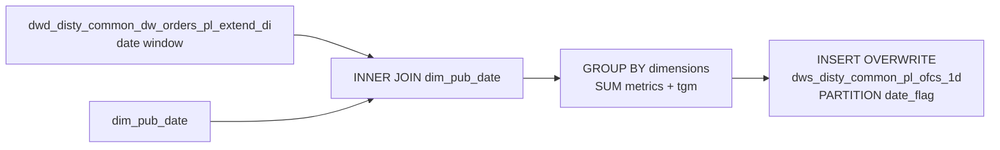

# DWS: PL Order Financial Components — HYVE Daily (`dws_disty_common_pl_ofcs_1d_hyve`)

- artifact_type: etl_table
- artifact_id: dw_hyus.dws_disty_common_pl_ofcs_1d
- domain: order
- one_line_purpose: HYVE-region DWS daily P&L component summary aggregating `dwd_disty_common_dw_orders_pl_extend_di` with fiscal calendar attributes and inline `tgm`.
- layer_type: DWS
- source_kind: etl_sql
- evidence_source: source/etl/sql/order/public_order_scripts/public_order_dw/script/dws_disty_common_pl_ofcs_1d_hyve.sql

---

## L1 Data Foundation

### Identity and physical mapping
- **Table:** `dw_${country_code}.dws_disty_common_pl_ofcs_1d` (same physical target as non-HYVE `dws_disty_common_pl_ofcs_1d.sql`)
- **Layer type:** DWS
- **Canonical / derived:** Derived / ETL-loaded (HYVE script variant)
- **Owner team:** not registered in metadata catalog
- **Script variant note:** Invoked by HYVE country level3 / monthly flows as job `dws_disty_common_pl_ofcs_1d` with this `_hyve.sql` path.

### Grain, scope, exclusions
- **Grain:** one row per GROUP BY key set: `(order_type, from_loc_no, drop_ship_flag, cust_no, sku_no, kit_sku_no, vend_no, pm_code/vpl_no, dim_* keys, cust_terr, cust_type, date_flag)` plus calendar attrs from `dim_pub_date`.
- **Scope:** PL-extended order lines in `${start_date}` … `${end_date}` that INNER JOIN successfully to `dim_pub_date`.
- **Partition:** `date_flag` — from source PL extend table.
- **Natural key:** Not documented in repository (composite GROUP BY set above).
- **Exclusions:** `date_flag` values absent from `dim_pub_date` (INNER JOIN).

### Cross-engine presence
| Engine | Present | Canonical FQN | Notes |
|--------|---------|---------------|-------|
| Hive | yes | `dw_${country_code}.dws_disty_common_pl_ofcs_1d` | ETL target |
| Vertica | yes | same FQN | hive2vertica overwrite after load |

### Physical schema reference

| Field | Value |
|-------|-------|
| **Authoritative catalog** | WKB L1 storage seed (not duplicated in this file) |
| **entity_id** | `dw_hyus.dws_disty_common_pl_ofcs_1d` |
| **l1_catalog_seed** | `target/storage/wkb/snapshots/_snapshot_id_template/l1_catalog/{engine}_{schema}_{table}.json` |
| **column_count** | pending (run ddl_seed_writer) |
| **partition_keys** | `date_flag` |
| **ddl_source** | pending Bitbucket DDL / Vertica metadata ingest |
| **retrieval** | `python -m tools.wkb.indexing.run_query --query "order dws_disty_common_pl_ofcs_1d schema" --intent find_table_schema` |

### Lineage
- **upstream:** `dw_${country_code}.dwd_disty_common_dw_orders_pl_extend_di` — all P&L component measures + dims — `dws_disty_common_pl_ofcs_1d_hyve.sql:104`
- **upstream:** `dim_${country_code}.dim_pub_date` — `year`, `month`, `fyear`, `qtr`, `fqtr` — `dws_disty_common_pl_ofcs_1d_hyve.sql:105-106`
- **downstream:** Vertica sync `hive2vertica-overwrite-dws_disty_common_pl_ofcs_1d` — `public_order_dw_hyus_level3.flow:287-296`

### Freshness and load path
| Item | Value |
|------|-------|
| Load pattern | `INSERT OVERWRITE` dynamic partition `date_flag` |
| Schedule | Not documented in repository |
| Parameters | `country_code`, `start_date`, `end_date` |
| Orchestration | HYVE `public_order_dw_*_level3.flow` / `*_m_00.flow` / `hyww_m.flow` |
| Parameter note | HYUS level3 maps flow `${start_date_mtd}` into SQL parameter `start_date` — `public_order_dw_hyus_level3.flow:241` |

---

## L2 Declarative Knowledge

### Business purpose
HYVE-region job that builds a **daily DWS P&L component summary**: aggregates profitability columns from `dwd_disty_common_dw_orders_pl_extend_di` to a multi-dimensional grain, attaches fiscal/calendar attributes from `dim_pub_date`, and computes **`tgm`** inline. Used for HYVE P&L dashboards and margin bridges without scanning raw order lines.

### Audience and use cases
| Audience | How they benefit |
|----------|-----------------|
| **Finance / FP&A** | Pre-aggregated P&L components (BTL, freight, rebates, NGM, OPLGM, TGM). |
| **PM / vendor mgmt** | Pre-resolved `dim_vpl_no`, `dim_vend_no`, `dim_pm_*`, `dim_director`. |
| **Sales / territory** | `cust_terr`, `cust_type`, `cust_no` roll-ups. |

### Fact key resolution
- Natural key: Not documented in repository — use full GROUP BY dimension set.
- Negative assertion: do not treat measure columns as grain keys.

### Time field semantics
- **date_flag:** partition / primary filter from PL extend source.
- **Calendar:** `year`, `month`, `fyear`, `qtr`, `fqtr` from `dim_pub_date`.

### Metrics served
| Category | Columns | Business reading |
|----------|---------|------------------|
| Volume / revenue | `real_ship_qty`, `ship_qty`, `net_sales`, `net_cost`, `u_price`, `u_cost`, … | SUM from PL extend |
| P&L components | `btl`, `mof`, `pdt`, freight, rebate, marketing, … | SUM from PL extend |
| Totals | `gm_amt`, `oplgm_amt`, `ngm_amt`, `tgm`, … | SUM / computed `tgm` |

### Metric serving map
- `net_sales` → `net_sales`
- `gm_amt` → `gm_amt`
- `ngm_amt` → `ngm_amt`
- `oplgm_amt` → `oplgm_amt`
- `tgm` → `tgm` (computed inline)

### etl_metrics

#### `tgm`
- **Source:** [metric-index.md](../../../source/contracts/order/metric-index.md#tgm)
- **Business definition:** Total Gross Margin — GM plus all major P&L adjustments plus FX/sales-cost delta.
```sql
(u_price − nvl(sales_cost, u_cost)) * ship_qty + btl + one_time_btl + hbtl + scm_profit_adj + btl_backout + pdt + inv_reserve + mof + marketing + frt_out_load + frt_out_exp + frt_ob_recovery + frt_ib_recovery + cust_pmt_disc + cust_rebate + cvr_rm + margin_share + ap_adj + (nvl(sales_cost, u_cost) − u_cost) * ship_qty
```

#### `net_sales`
- **Source:** [metric-index.md](../../../source/contracts/order/metric-index.md#net_sales)
- **Business definition:** Revenue including summarized unit expenses (index formula). This ETL stores `SUM(net_sales)` from PL extend, not a recompute.
```sql
ship_qty * (u_price + u_sum_expense)
```

---

## L3 Procedural Knowledge

### Query and routing rules
**Business filters:** Date window on PL extend joined to date dimension.
**Technical predicates (load only):** `o.date_flag >= '${start_date}' AND o.date_flag < '${end_date}'` (flow may inject MTD start).

### Dimension join patterns
| Dimension FQN | Join keys | Purpose | Evidence |
|---------------|-----------|---------|----------|
| `dim_${country_code}.dim_pub_date` | `o.date_flag = d.date_flag` | Fiscal/calendar attributes | `dws_disty_common_pl_ofcs_1d_hyve.sql:105-106` |

### Key filters and ETL business logic
- Date window — `o.date_flag >= '${start_date}' AND o.date_flag < '${end_date}'` — `dws_disty_common_pl_ofcs_1d_hyve.sql:107-108`
- Date dim INNER JOIN — `o.date_flag = d.date_flag` — `dws_disty_common_pl_ofcs_1d_hyve.sql:106`
- **Special logic applied in this ETL:** `vpl_no` renamed from `pm_code`; `tgm` computed as SUM of multi-term expression with nested `nvl` — `dws_disty_common_pl_ofcs_1d_hyve.sql:15,96-102`
- **Technical (load only):** dynamic `PARTITION (date_flag)` — `dws_disty_common_pl_ofcs_1d_hyve.sql:1`

### Special logic (embedded)
Not documented in repository (`source/ref/order/special_logic.txt` not present).

### Standard time-filter SQL
```sql
SELECT *
FROM dw_${country_code}.dws_disty_common_pl_ofcs_1d
WHERE date_flag >= '${start_date}'
  AND date_flag < '${end_date}'
;
```

### End-to-end flow
1. Read `dwd_disty_common_dw_orders_pl_extend_di` in date window.
2. INNER JOIN `dim_pub_date` on `date_flag`.
3. GROUP BY dimensions + `date_flag`; SUM P&L columns; compute `tgm`.
4. INSERT OVERWRITE partitioned by `date_flag`.



### Base tables register
| Object | Role in this job |
|--------|-----------------|
| `dw_${country_code}.dwd_disty_common_dw_orders_pl_extend_di` | Primary PL-extended order source |
| `dim_${country_code}.dim_pub_date` | Calendar / fiscal attributes |
| `dw_${country_code}.dws_disty_common_pl_ofcs_1d` | Target |

### Relationship map (embedded)
| from_fqn | to_fqn | cardinality | join_keys | provenance |
|----------|--------|-------------|-----------|------------|
| `dw_${country_code}.dwd_disty_common_dw_orders_pl_extend_di` | `dim_${country_code}.dim_pub_date` | many:1 | `date_flag` | etl_sql |
| `dw_${country_code}.dwd_disty_common_dw_orders_pl_extend_di` | `dw_${country_code}.dws_disty_common_pl_ofcs_1d` | many:1 (agg) | GROUP BY dimension set + `date_flag` | etl_sql |

### Step-by-step logic
#### Step 1 — Final INSERT
**Source:** `dwd_disty_common_dw_orders_pl_extend_di` `o` INNER JOIN `dim_pub_date` `d`.
**Filter:** date window on `o.date_flag`.
**GROUP BY:** calendar attrs + order/fulfil dims + dim_* keys + `cust_terr` + `cust_type` + `date_flag`.

### Column / field derivations (from ETL SQL)

| target_column | expression_sql | upstream_columns | upstream_tables | transform_kind | evidence |
|---------------|----------------|------------------|-----------------|----------------|----------|
| `year` | `d.year` | `year` | `dim_pub_date` | passthrough | `dws_disty_common_pl_ofcs_1d_hyve.sql:3` |
| `month` | `d.month` | `month` | `dim_pub_date` | passthrough | `dws_disty_common_pl_ofcs_1d_hyve.sql:4` |
| `fyear` | `d.fyear` | `fyear` | `dim_pub_date` | passthrough | `dws_disty_common_pl_ofcs_1d_hyve.sql:5` |
| `qtr` | `d.qtr` | `qtr` | `dim_pub_date` | passthrough | `dws_disty_common_pl_ofcs_1d_hyve.sql:6` |
| `fqtr` | `d.fqtr` | `fqtr` | `dim_pub_date` | passthrough | `dws_disty_common_pl_ofcs_1d_hyve.sql:7` |
| `vpl_no` | `pm_code AS vpl_no` | `pm_code` | `dwd_disty_common_dw_orders_pl_extend_di` | rename | `dws_disty_common_pl_ofcs_1d_hyve.sql:15` |
| `net_sales` | `sum(net_sales)` | `net_sales` | `dwd_disty_common_dw_orders_pl_extend_di` | agg | `dws_disty_common_pl_ofcs_1d_hyve.sql:17` |
| `gm_amt` | `sum(gm_amt)` | `gm_amt` | `dwd_disty_common_dw_orders_pl_extend_di` | agg | `dws_disty_common_pl_ofcs_1d_hyve.sql:19` |
| `ngm_amt` | `sum(ngm_amt)` | `ngm_amt` | `dwd_disty_common_dw_orders_pl_extend_di` | agg | `dws_disty_common_pl_ofcs_1d_hyve.sql:64` |
| `oplgm_amt` | `sum(oplgm_amt)` | `oplgm_amt` | `dwd_disty_common_dw_orders_pl_extend_di` | agg | `dws_disty_common_pl_ofcs_1d_hyve.sql:63` |
| `tgm` | `sum((nvl(o.u_price,0)-nvl(nvl(o.sales_cost,o.u_cost),0))*nvl(o.ship_qty,0) + nvl(btl,0) + nvl(one_time_btl,0) + nvl(hbtl,0) + nvl(scm_profit_adj,0) + nvl(btl_backout,0) + nvl(pdt,0) + nvl(inv_reserve,0) + nvl(mof,0) + nvl(marketing,0) + nvl(frt_out_load,0) + nvl(frt_out_exp,0) + nvl(frt_ob_recovery,0) + nvl(frt_ib_recovery,0) + nvl(cust_pmt_disc,0) + nvl(cust_rebate,0)+ nvl(cvr_rm,0) + nvl(margin_share,0) + nvl(ap_adj,0) + (nvl(nvl(o.sales_cost,o.u_cost),0)-nvl(o.u_cost,0))*nvl(o.ship_qty,0))` | `u_price`, `sales_cost`, `u_cost`, `ship_qty`, P&L adj cols | `dwd_disty_common_dw_orders_pl_extend_di` | arithmetic+agg | `dws_disty_common_pl_ofcs_1d_hyve.sql:96-102` |
| `date_flag` | `o.date_flag` | `date_flag` | `dwd_disty_common_dw_orders_pl_extend_di` | passthrough | `dws_disty_common_pl_ofcs_1d_hyve.sql:103` |

Remaining measure columns (`real_ship_qty`, `btl`, `mof`, freight/rebate/marketing components, dim_* keys, etc.) are either `sum(<col>)` aggregations or GROUP BY passthroughs from `o` — see SQL lines 16–95 and GROUP BY 109–136.

### Sentinel and code values
| Value | Type | Meaning |
|-------|------|---------|
| `vpl_no = pm_code` | rename | Reporting alias for product line / VPL |
| INNER JOIN `dim_pub_date` | business_filter | Drops date_flags missing from date dimension |

---

## L4 Validation

### Resolved partition value
| Step | Source | How `[date_flag]` is determined |
|------|--------|---------------------------------|
| 1 | Azkaban | HYUS level3 sets `start_date` ← `${start_date_mtd}`, `end_date` ← `${end_date}` — `public_order_dw_hyus_level3.flow:229-241` |
| 2 | ETL filter | `o.date_flag` in window — `dws_disty_common_pl_ofcs_1d_hyve.sql:107-108` |
| 3 | INSERT | Dynamic `PARTITION (date_flag)` — `dws_disty_common_pl_ofcs_1d_hyve.sql:1` |

**Plain language:** Partitions written equal source `date_flag` values inside the (often MTD) window passed by the flow.

### Data quality checks
- Row count / metric sums by `date_flag`.
- Grain duplicate check on full GROUP BY key set.
- Reconcile `SUM(tgm)` vs recomputed formula sample.

### Validation SQL
```sql
-- 1) row count by partition
SELECT date_flag, COUNT(*) AS row_cnt
FROM dw_${country_code}.dws_disty_common_pl_ofcs_1d
WHERE date_flag >= '${start_date}' AND date_flag < '${end_date}'
GROUP BY date_flag
;

-- 2) metric sum by vendor dim
SELECT dim_vend_no, SUM(net_sales) AS ns, SUM(tgm) AS tgm_sum, SUM(ngm_amt) AS ngm_sum
FROM dw_${country_code}.dws_disty_common_pl_ofcs_1d
WHERE date_flag >= '${start_date}' AND date_flag < '${end_date}'
GROUP BY dim_vend_no
ORDER BY ABS(SUM(net_sales)) DESC
LIMIT 20
;

-- 3) grain duplicate check (subset of keys — expand as needed)
SELECT order_type, cust_no, sku_no, vend_no, vpl_no, date_flag, COUNT(*) AS cnt
FROM dw_${country_code}.dws_disty_common_pl_ofcs_1d
WHERE date_flag >= '${start_date}' AND date_flag < '${end_date}'
GROUP BY order_type, cust_no, sku_no, vend_no, vpl_no, date_flag
HAVING COUNT(*) > 1
;
```

### Caveats for interpretation
- Pre-aggregated — order lines not recoverable.
- `tgm` computed at aggregation time, not copied from source.
- INNER JOIN to `dim_pub_date` can drop orphan `date_flag`s.
- Flow may pass MTD start into SQL `start_date` parameter.

### Conflicts and open questions
- Same target FQN as non-HYVE script; HYVE flows use `_hyve.sql` path — confirmed.
- Sibling non-HYVE KB lists `oplgm_plus_amt` in column groups; this SQL SELECT list does **not** include `oplgm_plus_amt` — do not invent that column for this script.
- Schedule, owner, SLA: Not documented in repository.

---

## L5 Runtime View

### Query path and engine preference
| Role | Hive object | Vertica object | Sync mode | Evidence | MCP verified |
|------|-------------|----------------|-----------|----------|--------------|
| Reporting | `dw_${country_code}.dws_disty_common_pl_ofcs_1d` | same | overwrite | `public_order_dw_hyus_level3.flow:287-296` | pending |
| ETL (HYVE) | same | — | INSERT OVERWRITE | `_hyve.sql:1` | — |

### Access constraints
- HYVE country schemas when this script is the loader.
- Always filter `date_flag`.

### Query risk profile
| Field | Value |
|-------|-------|
| requires_date_predicate | yes |
| scan_risk_tier | high |

---

## L6 Access and Consumption

### Primary consumers and use cases
| Audience | How they benefit |
|----------|-----------------|
| **Finance / FP&A** | HYVE daily P&L component summary |
| **PM / vendor** | Dimension-keyed margin roll-ups |
| **BI** | Fiscal calendar columns for reporting periods |

### Representative query patterns
```sql
SELECT date_flag, dim_vend_no, SUM(net_sales) AS ns, SUM(tgm) AS tgm, SUM(ngm_amt) AS ngm
FROM dw_${country_code}.dws_disty_common_pl_ofcs_1d
WHERE date_flag >= '${start_date}' AND date_flag < '${end_date}'
GROUP BY date_flag, dim_vend_no
LIMIT 100
;
```

### Dependencies and notes
### Upstream objects (verified)

| Object | Usage | Evidence |
|--------|-------|----------|
| `dw_${country_code}.dwd_disty_common_dw_orders_pl_extend_di` | P&L measures + dims | `dws_disty_common_pl_ofcs_1d_hyve.sql:104,107-108` |
| `dim_${country_code}.dim_pub_date` | Fiscal/calendar attrs | `dws_disty_common_pl_ofcs_1d_hyve.sql:105-106` |

### Downstream consumers (verified)

| Object / script | Evidence |
|-----------------|----------|
| Vertica sync `hive2vertica-overwrite-dws_disty_common_pl_ofcs_1d` | `public_order_dw_hyus_level3.flow:287-296` |
| Other Hive SQL consumers | None identified in repository |

### Operational detail (verified)
- HYVE level3 script path: `./public_order_dw/script/dws_disty_common_pl_ofcs_1d_hyve.sql` — `public_order_dw_hyus_level3.flow:235`
- Also in `hyuk|hycn|hyww` level3 and HYVE monthly flows

### Not documented in repository
- Schedule, owner, SLA
