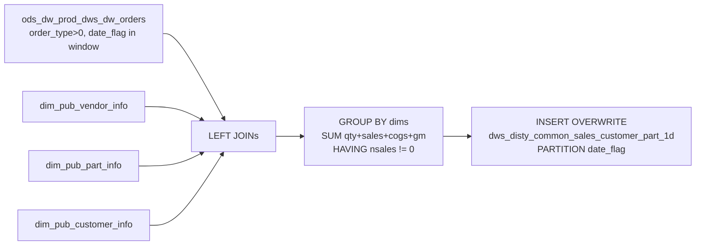

# DWS: Sales by Customer and Part — Daily Summary (`dws_disty_common_sales_customer_part_1d`)

- artifact_type: etl_table
- artifact_id: dw_us.dws_disty_common_sales_customer_part_1d
- domain: order
- one_line_purpose: This job produces a **daily-partitioned DWS-layer sales summary at the customer-SKU grain**, aggregating shipped order quantities, net sales, net cost, and gross margin by customer, vendor, and product within a date window. It enriches the ...
- layer_type: DWS
- source_kind: etl_sql
- evidence_source: source/etl/sql/order/source/etl/flows/public_order_tools/ingest/public_order_dw/script/dws_disty_common_sales_customer_part_1d.sql

---

## L1 Data Foundation

### Identity and physical mapping
- **Table:** `dw_us.dws_disty_common_sales_customer_part_1d`
- **Layer type:** DWS
- **Canonical / derived:** Derived / ETL-loaded (see L3)
- **Owner team:** not registered in metadata catalog

### Grain, scope, exclusions
- **Grain:** one row per `(vend_no, vend_name, universal_vend_no, universal_vend_name, sku_no, part_no, mfg_partno, short_desc, weight, po_cost, family, category, cust_no, cust_name, bill_to_cust_addr, mcust_no, mcust_name, date_flag)` — unique customer-vendor-SKU-attribute combination with non-zero net sales.
- **Scope:** See L2 business purpose / L3 filters
- **Partition:** `date_flag` — order date from `ods_dw_prod_dws_dw_orders`. - resolved from pipeline (see L4)
- **Natural key:** Not documented in repository
- **Exclusions:** Not documented in repository

#### Grain detail (preserved)

- **Grain:** one row per `(vend_no, vend_name, universal_vend_no, universal_vend_name, sku_no, part_no, mfg_partno, short_desc, weight, po_cost, family, category, cust_no, cust_name, bill_to_cust_addr, mcust_no, mcust_name, date_flag)` — unique customer-vendor-SKU-attribute combination with non-zero net sales.
- **Partition:** `date_flag` — order date from `ods_dw_prod_dws_dw_orders`.
- **Note:** Dimension attribute columns (part_no, weight, etc.) are in the GROUP BY, so schema changes in dimension tables can affect grain cardinality.

---

### Cross-engine presence
| Engine | Present | Canonical FQN | Notes |
|--------|---------|---------------|-------|
| Hive | yes | `dws_disty_common_sales_customer_part_1d` | ETL target / intermediate per evidence script |
| Vertica | pending | `dws_disty_common_sales_customer_part_1d` | Confirm via hive2vertica flow evidence / MCP |

### Physical schema reference

Pointer block only - full column catalog lives in WKB L1 storage JSON.

| Field | Value |
|-------|-------|
| **Authoritative catalog** | WKB L1 storage seed (not duplicated in this file) |
| **entity_id** | `dw_us.dws_disty_common_sales_customer_part_1d` |
| **l1_catalog_seed** | `target/storage/wkb/snapshots/_snapshot_id_template/l1_catalog/{engine}_{schema}_{table}.json` |
| **column_count** | pending (run ddl_seed_writer) |
| **partition_keys** | `date_flag, ods_dw_prod_dws_dw_orders` |
| **ddl_source** | pending Bitbucket DDL / Vertica metadata ingest |
| **retrieval** | `python -m tools.wkb.indexing.run_query --query "order dws_disty_common_sales_customer_part_1d schema" --intent find_table_schema` |

### Lineage
| Object | Role |
|--------|------|
| `ods_${country_code}.ods_dw_prod_dws_dw_orders` | Primary source — order data |
| `dim_${country_code}.dim_pub_vendor_info` | Vendor name |
| `dim_${country_code}.dim_pub_part_info` | Part attributes and catalogue base cost |
| `dim_${country_code}.dim_pub_customer_info` | Customer name, address, master hierarchy |
| `dw_${country_code}.dws_disty_common_sales_customer_part_1d` | **Target** — customer-part daily sales summary |

---

### Freshness and load path
| Item | Value |
|------|-------|
| Load pattern | See L3 end-to-end / INSERT pattern in evidence script |
| Schedule | Not documented in repository |
| Parameters | `country_code`, `start_date`, `end_date` |


---

## L2 Declarative Knowledge

### Business purpose
This job produces a **daily-partitioned DWS-layer sales summary at the customer-SKU grain**, aggregating shipped order quantities, net sales, net cost, and gross margin by customer, vendor, and product within a date window. It enriches the order data with vendor name, universal vendor identifiers, product attributes (part number, MFG part number, description, weight, catalogue base cost, family, category), and customer attributes (name, billing address, master customer hierarchy). The result eliminates zero-revenue records and provides a clean, ready-to-use sales summary for customer and product analytics.

---

### Audience and use cases
| Audience | How they benefit |
|----------|-----------------|
| **Sales / account management** | `cust_no`, `cust_name`, `master_cust_no`, `master_cust_name`, `address` — customer-level sales summary with master hierarchy for account roll-ups. |
| **Product / vendor management** | `universal_vend_no`, `universal_vend_name`, `family`, `category`, `mfg_partno`, `product_desc` — product-level sales analysis enriched with catalogue attributes. |
| **Finance / FP&A** | `nsales`, `ncogs`, `gm_amt` — revenue, cost, and gross margin by customer and SKU per day. |
| **Pricing** | `base_cost` (= `po_cost` from part info) for comparison against actual cost (`ncogs`). |

---

### Fact key resolution
- Natural key: Not documented in repository
- FK / label-on attributes: see L3 dimension join patterns and step-by-step logic.
- Negative assertion: do not treat descriptive labels as grain keys unless listed under natural key.

### Time field semantics
- **date_flag / partition columns:** `date_flag` — order date from `ods_dw_prod_dws_dw_orders`.
- Primary reporting filter should use the partition column(s) documented in L1; resolve values via L4.


### Metrics served

| Category | Column | Logical metric | Business reading |
|----------|--------|----------------|------------------|
| Measures | — | — | No measure columns mapped for this table. |

### Metric serving map

**Formula authority:** [`source/contracts/order/metric-index.md`](../../source/contracts/order/metric-index.md)

N/A — no measure columns mapped for this table.

### etl_metrics

No governed logical metrics from `source/contracts/order/metric-index.md` are mapped on this table.

---

### Metric serving map
N/A - not a `*_comb_mtd` / multi-period wide serving table (or map not present in legacy doc).


### Data products and column groups (preserved)

### Vendor

- `vend_no`, `vend_name` — vendor number and name
- `universal_vend_no`, `universal_vend_name` — universal/parent vendor identifiers

### Product

- `sku_no`, `part_no`, `mfg_partno` — SKU and manufacturer part numbers
- `product_desc` — product short description (= `short_desc` from part info)
- `weight` — unit weight
- `base_cost` — catalogue PO cost (= `po_cost` from `dim_pub_part_info`)
- `family`, `category` — product family and category

### Customer

- `cust_no`, `cust_name` — customer number and name
- `address` — billing address (= `bill_to_cust_addr` from customer info)
- `master_cust_no`, `master_cust_name` — master customer hierarchy identifiers

### Sales metrics

| Column | Formula | Business reading |
|--------|---------|-----------------|
| `ship_qty` | `SUM(ship_qty)` | Total units shipped. |
| `nsales` | `SUM(ship_qty × (u_price + u_sum_expense))` | Net sales — unit price plus expenses times quantity. |
| `ncogs` | `SUM(ship_qty × (u_cost + u_sum_expense))` | Net cost of goods sold — unit cost plus expenses times quantity. |
| `gm_amt` | `SUM(ship_qty × (u_price − u_cost))` | Gross margin — price minus cost times quantity. Note: does not include `u_sum_expense` in the margin calculation. |

---

### etl_metrics

#### `ship_qty`
- **Source:** [metric-index.md](../../source/contracts/order/metric-index.md#ship_qty)
- **Business definition:** Total units shipped.
```sql
SUM(ship_qty)
```

#### `nsales`
- **Source:** [metric-index.md](../../source/contracts/order/metric-index.md#nsales)
- **Business definition:** Net sales — unit price plus expenses times quantity.
```sql
SUM(ship_qty × (u_price + u_sum_expense))
```

#### `ncogs`
- **Source:** [metric-index.md](../../source/contracts/order/metric-index.md#ncogs)
- **Business definition:** Net cost of goods sold — unit cost plus expenses times quantity.
```sql
SUM(ship_qty × (u_cost + u_sum_expense))
```

#### `gm_amt`
- **Source:** [metric-index.md](../../source/contracts/order/metric-index.md#gm_amt)
- **Business definition:** Gross margin — price minus cost times quantity. Note: does not include `u_sum_expense` in the margin calculation.
```sql
SUM(ship_qty × (u_price − u_cost))
```


---

## L3 Procedural Knowledge

### Query and routing rules
**Business filters:** Use partition / date keys from L1 grain for reporting scope.
**Technical predicates (load only):** See Key filters and step-by-step logic below.

### Dimension join patterns
| Dimension FQN | Join keys | Purpose | Evidence |
|---------------|-----------|---------|----------|
| See step-by-step / base tables | See L3 steps | Dimension enrichment | `source/etl/sql/order/source/etl/flows/public_order_tools/ingest/public_order_dw/script/dws_disty_common_sales_customer_part_1d.sql` |

### Key filters and ETL business logic
### Step 1 — Final `INSERT OVERWRITE`

**Filter:** `a.date_flag >= '${start_date}' AND a.date_flag < '${end_date}'` AND `a.order_type > 0`

**All joins are LEFT JOINs** — missing dimension data produces NULLs in the corresponding columns but does not drop order rows.

**HAVING:** `SUM(ship_qty × (u_price + u_sum_expense)) <> 0` — removes groups with net-zero revenue.

**Key column derivations:**

| Output column | Source | Notes |
|---------------|--------|-------|
| `product_desc` | `c.short_desc` | Short description from part dimension |
| `base_cost` | `c.po_cost` | Catalogue PO cost — not the order-level `u_cost` |
| `address` | `d.bill_to_cust_addr` | Customer billing address |
| `master_cust_no` | `d.mcust_no` | Master customer number |
| `master_cust_name` | `d.mcust_name` | Master customer name |
| `nsales` | `SUM(ship_qty × (u_price + u_sum_expense))` | Net sales including expenses |
| `ncogs` | `SUM(ship_qty × (u_cost + u_sum_expense))` | Net cost including expenses |
| `gm_amt` | `SUM(ship_qty × (u_price − u_cost))` | Gross margin excluding expenses |

---

### Standard time-filter SQL
```sql
-- relative period filter using resolved partition value (see L4)
SELECT *
FROM dws_disty_common_sales_customer_part_1d
WHERE /* partition predicate */ date_flag = '${partition_value}';
```

### End-to-end flow
**Runtime parameters:** `country_code`, `start_date`, `end_date`
**Target table:** `dw_${country_code}.dws_disty_common_sales_customer_part_1d`, partitioned by **`date_flag`**.

1. Read `ods_dw_prod_dws_dw_orders` filtered to `order_type > 0` and date window.
2. LEFT JOIN `dim_pub_vendor_info`, `dim_pub_part_info`, `dim_pub_customer_info`.
3. GROUP BY all vendor/product/customer dimension attributes + date_flag; SUM metrics.
4. HAVING: exclude groups where `SUM(nsales) = 0`.
5. **INSERT OVERWRITE** into target.



---


#### High-level stages (preserved)

| Stage | Business meaning |
|-------|-----------------|
| **Order data read** | Reads `ods_dw_prod_dws_dw_orders` filtered to `order_type > 0` and the date window. |
| **Dimension enrichment** | LEFT JOINs vendor info, part info, and customer info dimensions. |
| **Aggregation** | Groups by all vendor/product/customer attributes plus date_flag; SUMs quantity, net sales, net cost, and gross margin. |
| **Zero-revenue filter** | HAVING clause removes groups where `sum(nsales) = 0` — excludes offset/zero-value lines from reporting. |

**Parameters:** `country_code`, `start_date`, `end_date`

---


### Base tables register
| Object | Role in this job |
|--------|-----------------|
| `ods_${country_code}.ods_dw_prod_dws_dw_orders` | **Primary source.** Orders ODS/DWS table providing `vend_no`, `sku_no`, `cust_no`, `ship_qty`, `u_price`, `u_cost`, `u_sum_expense`, `order_type`, `date_flag`. Filtered to `order_type > 0` and date window. |
| `dim_${country_code}.dim_pub_vendor_info` | Vendor name. |
| `dim_${country_code}.dim_pub_part_info` | Part attributes — `universal_vend_no/name`, `part_no`, `mfg_partno`, `short_desc` (→ `product_desc`), `weight`, `po_cost` (→ `base_cost`), `family`, `category`. |
| `dim_${country_code}.dim_pub_customer_info` | Customer attributes — `cust_name`, `bill_to_cust_addr` (→ `address`), `mcust_no` (→ `master_cust_no`), `mcust_name` (→ `master_cust_name`). |

**Temporary tables (inside the job only):** None — single direct INSERT.

---

### Step-by-step logic
### Step 1 — Final `INSERT OVERWRITE`

**Filter:** `a.date_flag >= '${start_date}' AND a.date_flag < '${end_date}'` AND `a.order_type > 0`

**All joins are LEFT JOINs** — missing dimension data produces NULLs in the corresponding columns but does not drop order rows.

**HAVING:** `SUM(ship_qty × (u_price + u_sum_expense)) <> 0` — removes groups with net-zero revenue.

**Key column derivations:**

| Output column | Source | Notes |
|---------------|--------|-------|
| `product_desc` | `c.short_desc` | Short description from part dimension |
| `base_cost` | `c.po_cost` | Catalogue PO cost — not the order-level `u_cost` |
| `address` | `d.bill_to_cust_addr` | Customer billing address |
| `master_cust_no` | `d.mcust_no` | Master customer number |
| `master_cust_name` | `d.mcust_name` | Master customer name |
| `nsales` | `SUM(ship_qty × (u_price + u_sum_expense))` | Net sales including expenses |
| `ncogs` | `SUM(ship_qty × (u_cost + u_sum_expense))` | Net cost including expenses |
| `gm_amt` | `SUM(ship_qty × (u_price − u_cost))` | Gross margin excluding expenses |

---

### Relationship map (embedded)

| from_fqn | to_fqn | cardinality | join_keys | provenance |
|----------|--------|-------------|-----------|------------|
| `ods_${country_code}.ods_dw_prod_dws_dw_orders` | `dim_${country_code}.dim_pub_vendor_info` | many:1 (LEFT) | `a.vend_no` = `b.vend_no` | etl_sql (`source/etl/sql/order/public_order_scripts/public_order_dw/script/dws_disty_common_sales_customer_part_1d.sql:25`) |
| `ods_${country_code}.ods_dw_prod_dws_dw_orders` | `dim_${country_code}.dim_pub_part_info` | many:1 (LEFT) | `a.sku_no` = `c.sku_no` | etl_sql (`source/etl/sql/order/public_order_scripts/public_order_dw/script/dws_disty_common_sales_customer_part_1d.sql:26`) |
| `ods_${country_code}.ods_dw_prod_dws_dw_orders` | `dim_${country_code}.dim_pub_customer_info` | many:1 (LEFT) | `a.cust_no` = `d.cust_no` | etl_sql (`source/etl/sql/order/public_order_scripts/public_order_dw/script/dws_disty_common_sales_customer_part_1d.sql:27`) |

### Special logic (embedded)

Not documented in repository

### Column / field derivations (from ETL SQL)

| target_column | expression_sql | upstream_columns | upstream_tables | transform_kind | evidence |
|---------------|----------------|------------------|-----------------|----------------|----------|
| `vend_no` | `a.vend_no` | `vend_no` | `ods_${country_code}.ods_dw_prod_dws_dw_orders`, `dim_${country_code}.dim_pub_vendor_info`, `dim_${country_code}.dim_pub_part_info`, `dim_${country_code}.dim_pub_customer_info` | passthrough | `source/etl/sql/order/public_order_scripts/public_order_dw/script/dws_disty_common_sales_customer_part_1d.sql:2` |
| `vend_name` | `b.vend_name` | `vend_name` | `ods_${country_code}.ods_dw_prod_dws_dw_orders`, `dim_${country_code}.dim_pub_vendor_info`, `dim_${country_code}.dim_pub_part_info`, `dim_${country_code}.dim_pub_customer_info` | passthrough | `source/etl/sql/order/public_order_scripts/public_order_dw/script/dws_disty_common_sales_customer_part_1d.sql:3` |
| `universal_vend_no` | `c.universal_vend_no` | `universal_vend_no` | `ods_${country_code}.ods_dw_prod_dws_dw_orders`, `dim_${country_code}.dim_pub_vendor_info`, `dim_${country_code}.dim_pub_part_info`, `dim_${country_code}.dim_pub_customer_info` | passthrough | `source/etl/sql/order/public_order_scripts/public_order_dw/script/dws_disty_common_sales_customer_part_1d.sql:4` |
| `universal_vend_name` | `c.universal_vend_name` | `universal_vend_name` | `ods_${country_code}.ods_dw_prod_dws_dw_orders`, `dim_${country_code}.dim_pub_vendor_info`, `dim_${country_code}.dim_pub_part_info`, `dim_${country_code}.dim_pub_customer_info` | passthrough | `source/etl/sql/order/public_order_scripts/public_order_dw/script/dws_disty_common_sales_customer_part_1d.sql:5` |
| `sku_no` | `a.sku_no` | `sku_no` | `ods_${country_code}.ods_dw_prod_dws_dw_orders`, `dim_${country_code}.dim_pub_vendor_info`, `dim_${country_code}.dim_pub_part_info`, `dim_${country_code}.dim_pub_customer_info` | passthrough | `source/etl/sql/order/public_order_scripts/public_order_dw/script/dws_disty_common_sales_customer_part_1d.sql:6` |
| `part_no` | `c.part_no` | `part_no` | `ods_${country_code}.ods_dw_prod_dws_dw_orders`, `dim_${country_code}.dim_pub_vendor_info`, `dim_${country_code}.dim_pub_part_info`, `dim_${country_code}.dim_pub_customer_info` | passthrough | `source/etl/sql/order/public_order_scripts/public_order_dw/script/dws_disty_common_sales_customer_part_1d.sql:7` |
| `mfg_partno` | `c.mfg_partno` | `mfg_partno` | `ods_${country_code}.ods_dw_prod_dws_dw_orders`, `dim_${country_code}.dim_pub_vendor_info`, `dim_${country_code}.dim_pub_part_info`, `dim_${country_code}.dim_pub_customer_info` | passthrough | `source/etl/sql/order/public_order_scripts/public_order_dw/script/dws_disty_common_sales_customer_part_1d.sql:8` |
| `product_desc` | `c.short_desc` | `short_desc` | `ods_${country_code}.ods_dw_prod_dws_dw_orders`, `dim_${country_code}.dim_pub_vendor_info`, `dim_${country_code}.dim_pub_part_info`, `dim_${country_code}.dim_pub_customer_info` | rename | `source/etl/sql/order/public_order_scripts/public_order_dw/script/dws_disty_common_sales_customer_part_1d.sql:9` |
| `weight` | `c.weight` | `weight` | `ods_${country_code}.ods_dw_prod_dws_dw_orders`, `dim_${country_code}.dim_pub_vendor_info`, `dim_${country_code}.dim_pub_part_info`, `dim_${country_code}.dim_pub_customer_info` | passthrough | `source/etl/sql/order/public_order_scripts/public_order_dw/script/dws_disty_common_sales_customer_part_1d.sql:10` |
| `base_cost` | `c.po_cost` | `po_cost` | `ods_${country_code}.ods_dw_prod_dws_dw_orders`, `dim_${country_code}.dim_pub_vendor_info`, `dim_${country_code}.dim_pub_part_info`, `dim_${country_code}.dim_pub_customer_info` | rename | `source/etl/sql/order/public_order_scripts/public_order_dw/script/dws_disty_common_sales_customer_part_1d.sql:11` |
| `family` | `c.family` | `family` | `ods_${country_code}.ods_dw_prod_dws_dw_orders`, `dim_${country_code}.dim_pub_vendor_info`, `dim_${country_code}.dim_pub_part_info`, `dim_${country_code}.dim_pub_customer_info` | passthrough | `source/etl/sql/order/public_order_scripts/public_order_dw/script/dws_disty_common_sales_customer_part_1d.sql:12` |
| `category` | `c.category` | `category` | `ods_${country_code}.ods_dw_prod_dws_dw_orders`, `dim_${country_code}.dim_pub_vendor_info`, `dim_${country_code}.dim_pub_part_info`, `dim_${country_code}.dim_pub_customer_info` | passthrough | `source/etl/sql/order/public_order_scripts/public_order_dw/script/dws_disty_common_sales_customer_part_1d.sql:13` |
| `cust_no` | `a.cust_no` | `cust_no` | `ods_${country_code}.ods_dw_prod_dws_dw_orders`, `dim_${country_code}.dim_pub_vendor_info`, `dim_${country_code}.dim_pub_part_info`, `dim_${country_code}.dim_pub_customer_info` | passthrough | `source/etl/sql/order/public_order_scripts/public_order_dw/script/dws_disty_common_sales_customer_part_1d.sql:14` |
| `cust_name` | `d.cust_name` | `cust_name` | `ods_${country_code}.ods_dw_prod_dws_dw_orders`, `dim_${country_code}.dim_pub_vendor_info`, `dim_${country_code}.dim_pub_part_info`, `dim_${country_code}.dim_pub_customer_info` | passthrough | `source/etl/sql/order/public_order_scripts/public_order_dw/script/dws_disty_common_sales_customer_part_1d.sql:15` |
| `address` | `d.bill_to_cust_addr` | `bill_to_cust_addr` | `ods_${country_code}.ods_dw_prod_dws_dw_orders`, `dim_${country_code}.dim_pub_vendor_info`, `dim_${country_code}.dim_pub_part_info`, `dim_${country_code}.dim_pub_customer_info` | rename | `source/etl/sql/order/public_order_scripts/public_order_dw/script/dws_disty_common_sales_customer_part_1d.sql:16` |
| `master_cust_no` | `d.mcust_no` | `mcust_no` | `ods_${country_code}.ods_dw_prod_dws_dw_orders`, `dim_${country_code}.dim_pub_vendor_info`, `dim_${country_code}.dim_pub_part_info`, `dim_${country_code}.dim_pub_customer_info` | rename | `source/etl/sql/order/public_order_scripts/public_order_dw/script/dws_disty_common_sales_customer_part_1d.sql:17` |
| `master_cust_name` | `d.mcust_name` | `mcust_name` | `ods_${country_code}.ods_dw_prod_dws_dw_orders`, `dim_${country_code}.dim_pub_vendor_info`, `dim_${country_code}.dim_pub_part_info`, `dim_${country_code}.dim_pub_customer_info` | rename | `source/etl/sql/order/public_order_scripts/public_order_dw/script/dws_disty_common_sales_customer_part_1d.sql:18` |
| `ship_qty` | `sum(ship_qty)` | `ship_qty` | `ods_${country_code}.ods_dw_prod_dws_dw_orders`, `dim_${country_code}.dim_pub_vendor_info`, `dim_${country_code}.dim_pub_part_info`, `dim_${country_code}.dim_pub_customer_info` | agg | `source/etl/sql/order/public_order_scripts/public_order_dw/script/dws_disty_common_sales_customer_part_1d.sql:19` |
| `nsales` | `sum(ship_qty*(u_price+u_sum_expense))` | `ship_qty`, `u_price`, `u_sum_expense` | `ods_${country_code}.ods_dw_prod_dws_dw_orders`, `dim_${country_code}.dim_pub_vendor_info`, `dim_${country_code}.dim_pub_part_info`, `dim_${country_code}.dim_pub_customer_info` | agg | `source/etl/sql/order/public_order_scripts/public_order_dw/script/dws_disty_common_sales_customer_part_1d.sql:20` |
| `ncogs` | `sum(ship_qty*(u_cost+u_sum_expense))` | `ship_qty`, `u_cost`, `u_sum_expense` | `ods_${country_code}.ods_dw_prod_dws_dw_orders`, `dim_${country_code}.dim_pub_vendor_info`, `dim_${country_code}.dim_pub_part_info`, `dim_${country_code}.dim_pub_customer_info` | agg | `source/etl/sql/order/public_order_scripts/public_order_dw/script/dws_disty_common_sales_customer_part_1d.sql:21` |
| `gm_amt` | `sum(ship_qty*(u_price - u_cost))` | `ship_qty`, `u_price`, `u_cost` | `ods_${country_code}.ods_dw_prod_dws_dw_orders`, `dim_${country_code}.dim_pub_vendor_info`, `dim_${country_code}.dim_pub_part_info`, `dim_${country_code}.dim_pub_customer_info` | agg | `source/etl/sql/order/public_order_scripts/public_order_dw/script/dws_disty_common_sales_customer_part_1d.sql:22` |
| `date_flag` | `a.date_flag` | `date_flag` | `ods_${country_code}.ods_dw_prod_dws_dw_orders`, `dim_${country_code}.dim_pub_vendor_info`, `dim_${country_code}.dim_pub_part_info`, `dim_${country_code}.dim_pub_customer_info` | passthrough | `source/etl/sql/order/public_order_scripts/public_order_dw/script/dws_disty_common_sales_customer_part_1d.sql:23` |

### Sentinel and code values
| Value | Meaning |
|-------|---------|
| `order_type > 0` | Excludes order type 0 (placeholder/non-standard). |
| `HAVING SUM(nsales) <> 0` | Removes zero-net-sales groups — offsetting orders that net to zero are excluded from the summary. |
| `base_cost = po_cost` from part info | Catalogue base cost — not the order-level unit cost. These can differ from actual order costs. |

---

---

## L4 Validation

### Resolved partition value
| Step | Source | How partition / date scope is determined |
|------|--------|------------------------------------------|
| 1 | evidence script / flow | See parameters in L1 Freshness and L3 filters - `source/etl/sql/order/source/etl/flows/public_order_tools/ingest/public_order_dw/script/dws_disty_common_sales_customer_part_1d.sql` |

**Plain language:** Partition and date scope follow Azkaban/bootstrap parameters documented in the source script and orchestrating flow; do not hardcode calendar literals.

### Data quality checks
- Prefer row-count-by-partition, metric sums, and grain duplicate checks (see Validation SQL).
- Additional checks from legacy caveats / operational notes when present.

### Validation SQL
```sql
-- 1) Row count by partition
SELECT ${partition_col}, COUNT(*) AS row_cnt
FROM dw_${country_code}.dws_disty_common_sales_customer_part_1d
WHERE ${partition_col} = '${partition_value}'
GROUP BY ${partition_col};

-- 2) Metric sum by business dimension (top deltas)
SELECT ${dim_key}, SUM(${metric}) AS metric_sum
FROM dw_${country_code}.dws_disty_common_sales_customer_part_1d
WHERE ${partition_col} = '${partition_value}'
GROUP BY ${dim_key}
ORDER BY ABS(SUM(${metric})) DESC
LIMIT 20;

-- 3) Grain duplicate check
SELECT ${grain_key_1}, ${grain_key_2}, ${grain_key_3}, ${partition_col}, COUNT(*) AS cnt
FROM dw_${country_code}.dws_disty_common_sales_customer_part_1d
WHERE ${partition_col} = '${partition_value}'
GROUP BY ${grain_key_1}, ${grain_key_2}, ${grain_key_3}, ${partition_col}
HAVING COUNT(*) > 1;
```

Replace placeholders from this file's Grain and keys / Data you can fetch sections, and use the resolved partition value from run scope.

### Caveats for interpretation
- **`base_cost` is from the part dimension, not the order** — `po_cost` from `dim_pub_part_info` is the catalogue cost. Actual order cost is captured in `ncogs` via `u_cost`. These can differ.
- **`gm_amt` excludes expenses** — `SUM(ship_qty × (u_price − u_cost))` does not factor in `u_sum_expense`. `ncogs` does include expenses but `gm_amt` does not, so `nsales − ncogs ≠ gm_amt` in general.
- **HAVING removes zero-revenue groups** — this is intentional but means offset orders (returns netting to zero) will not appear.
- **Dimension attribute columns are in the GROUP BY** — if `dim_pub_part_info.weight` or similar attributes change for a SKU, historical GROUP BY keys can differ from current lookups.
- **All joins are LEFT** — orders with no matching vendor/part/customer dimension record will have NULL dimension attributes but will still appear in the output.

---

### Conflicts and open questions
- Schedule, owner, SLA: Not documented in repository (unless preserved schedule evidence above).
- Vertica MCP verification: pending unless confirmed in L5.


---

## L5 Runtime View

### Query path and engine preference
| Role | Hive object | Vertica object | Sync mode | Evidence | MCP verified |
|------|-------------|----------------|-----------|----------|--------------|
| **Query for reporting** | *See script lineage* | `dw_${country_code}.dws_disty_common_sales_customer_part_1d` | *Verify from flow* | *Add flow file:line* | pending |
| **Hive alternative** | `*` | `dw_${country_code}.dws_disty_common_sales_customer_part_1d` | - | *See dependencies* | - |
| **ETL internal** | staging/temp tables | *Not synced to Vertica* | - | *See step-by-step logic* | - |

Business users should query `dw_${country_code}.dws_disty_common_sales_customer_part_1d` in Vertica once MCP verification is completed for this document.

### Access constraints
- Country / company schema parameters may apply (`literal_country`, `company_no`, etc.).
- Hive-only staging objects are not reporting surfaces unless synced.

### Query risk profile
| Field | Value |
|-------|-------|
| requires_date_predicate | yes |
| scan_risk_tier | high |

---

## L6 Access and Consumption

### Primary consumers and use cases
| Audience | How they benefit |
|----------|-----------------|
| **Sales / account management** | `cust_no`, `cust_name`, `master_cust_no`, `master_cust_name`, `address` — customer-level sales summary with master hierarchy for account roll-ups. |
| **Product / vendor management** | `universal_vend_no`, `universal_vend_name`, `family`, `category`, `mfg_partno`, `product_desc` — product-level sales analysis enriched with catalogue attributes. |
| **Finance / FP&A** | `nsales`, `ncogs`, `gm_amt` — revenue, cost, and gross margin by customer and SKU per day. |
| **Pricing** | `base_cost` (= `po_cost` from part info) for comparison against actual cost (`ncogs`). |

---

### Representative query patterns
```sql
-- certified / illustrative lookup - replace predicates from L1/L4
SELECT *
FROM dws_disty_common_sales_customer_part_1d
WHERE date_flag = '${partition_value}'
LIMIT 100;
```

### Dependencies and notes
### Upstream objects (verified)

| Object | Usage | Evidence |
|--------|-------|----------|
| `ods_${country_code}.ods_dw_prod_dws_dw_orders` | Order data; `order_type>0`, date filter | `dws_disty_common_sales_customer_part_1d.sql:24,28-30` |
| `dim_${country_code}.dim_pub_vendor_info` | vend_name | `dws_disty_common_sales_customer_part_1d.sql:25` |
| `dim_${country_code}.dim_pub_part_info` | Part attributes, po_cost as base_cost | `dws_disty_common_sales_customer_part_1d.sql:26` |
| `dim_${country_code}.dim_pub_customer_info` | cust_name, address, master customer | `dws_disty_common_sales_customer_part_1d.sql:27` |

### Downstream consumers (verified)

| Object / script | Evidence |
|-----------------|----------|
| None identified in repository. | — |

### Operational detail (verified)

- Partition overwrite: `INSERT OVERWRITE TABLE dw_${country_code}.dws_disty_common_sales_customer_part_1d PARTITION (date_flag)` — `dws_disty_common_sales_customer_part_1d.sql:1`

### Not documented in repository

- Schedule, owner, SLA — not in scripts or configs

---

*Document generated from `source/etl/sql/order/source/etl/flows/public_order_tools/ingest/public_order_dw/script/dws_disty_common_sales_customer_part_1d.sql`.*

#### Not documented in repository
- Owner, SLA (unless schedule evidence preserved above)
- Any dependency without `file:line` evidence in this document

---

*Document migrated to L1-L6 from legacy Knowledgebase content. Evidence: `source/etl/sql/order/source/etl/flows/public_order_tools/ingest/public_order_dw/script/dws_disty_common_sales_customer_part_1d.sql`.*
