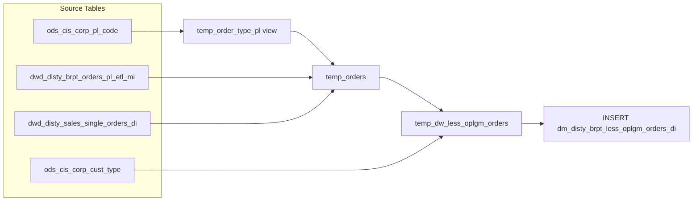

# DM: BRPT Low-OPLGM Orders Daily (`dm_disty_brpt_less_oplgm_orders_di`)

- artifact_type: etl_table
- artifact_id: dm_us.dm_disty_brpt_less_oplgm_orders_di
- domain: order
- one_line_purpose: This job identifies and loads every order where the **OPLGM% (Operating Profit as a Percentage of Net Sales) is below 2%** — including negative-margin orders — into a daily reporting mart. It also loads a companion count of total territory-...
- layer_type: DM
- source_kind: etl_sql
- evidence_source: source/etl/sql/order/data_service/brpt_patch/python/load_dm_disty_brpt_less_oplgm_orders_di.py

---

## L1 Data Foundation

### Identity and physical mapping
- **Table:** `dm_us.dm_disty_brpt_less_oplgm_orders_di`
- **Layer type:** DM
- **Canonical / derived:** Derived / ETL-loaded (see L3)
- **Owner team:** not registered in metadata catalog

### Grain, scope, exclusions
- **Grain:** one row per `(date_flag, division, cust_type, cust_terr, cust_no, order_no)` for the low-OPLGM set; plus one summary row per `(date_flag, cust_type, cust_terr)` from the total-order-count UNION branch (those rows have `cust_no = 0`, `order_no = 0`).
- **Scope:** See L2 business purpose / L3 filters
- **Partition:** `date_flag` — the daily business date of the profitability snapshot. - resolved from pipeline (see L4)
- **Natural key:** `date_flag`, `order_no`, `cust_no`, `cust_type`, `cust_terr` (within a partition).
- **Exclusions:** Not documented in repository

#### Grain detail (preserved)

- **Grain:** one row per `(date_flag, division, cust_type, cust_terr, cust_no, order_no)` for the low-OPLGM set; plus one summary row per `(date_flag, cust_type, cust_terr)` from the total-order-count UNION branch (those rows have `cust_no = 0`, `order_no = 0`).
- **Partition:** `date_flag` — the daily business date of the profitability snapshot.
- **Natural key:** `date_flag`, `order_no`, `cust_no`, `cust_type`, `cust_terr` (within a partition).

---

### Cross-engine presence
| Engine | Present | Canonical FQN | Notes |
|--------|---------|---------------|-------|
| Hive | yes | `dm_disty_brpt_less_oplgm_orders_di` | ETL target / intermediate per evidence script |
| Vertica | pending | `dm_disty_brpt_less_oplgm_orders_di` | Confirm via hive2vertica flow evidence / MCP |

### Physical schema reference

Pointer block only - full column catalog lives in WKB L1 storage JSON.

| Field | Value |
|-------|-------|
| **Authoritative catalog** | WKB L1 storage seed (not duplicated in this file) |
| **entity_id** | `dm_us.dm_disty_brpt_less_oplgm_orders_di` |
| **l1_catalog_seed** | `target/storage/wkb/snapshots/_snapshot_id_template/l1_catalog/{engine}_{schema}_{table}.json` |
| **column_count** | pending (run ddl_seed_writer) |
| **partition_keys** | `date_flag` |
| **ddl_source** | pending Bitbucket DDL / Vertica metadata ingest |
| **retrieval** | `python -m tools.wkb.indexing.run_query --query "order load_dm_disty_brpt_less_oplgm_orders_di schema" --intent find_table_schema` |

### Lineage
| Object | Role |
|--------|------|
| `ods_${country_no}.ods_cis_corp_pl_code` | Order type reference — provides valid `ORDR/TYPE` codes. |
| `dw_${country_no}.dwd_disty_brpt_orders_pl_etl_mi` | Primary source — BRPT profitability DWD. |
| `dw_${country_no}.dwd_disty_sales_single_orders_di` | Total order count context per territory. |
| `ods_${country_no}.ods_cis_corp_cust_type` | Dimension — maps `cust_type` to `division`. |
| `dm_${country_no}.dm_disty_brpt_less_oplgm_orders_di` | **Target** — DM-layer daily mart for low-OPLGM orders. |

---

### Freshness and load path
| Item | Value |
|------|-------|
| Load pattern | See L3 end-to-end / INSERT pattern in evidence script |
| Schedule | Not documented in repository |
| Parameters | `country_no`, `dt_month`, `m_begin`, `date_flag` |


---

## L2 Declarative Knowledge

### Business purpose
This job identifies and loads every order where the **OPLGM% (Operating Profit as a Percentage of Net Sales) is below 2%** — including negative-margin orders — into a daily reporting mart. It also loads a companion count of total territory-level orders so finance and sales leadership can compare low-margin volume against total shipped volume. The output is used to monitor, escalate, and act on below-threshold profitability events on any given business day.

---

### Audience and use cases
| Audience | How they benefit |
|----------|-----------------|
| **Finance / FP&A** | Spots orders dragging OPLGM below the 2% threshold; supports daily margin management and escalation workflows. |
| **Sales leadership** | Reviews which territories and customer types are generating below-threshold margin; informs coaching and deal-desk actions. |
| **Operations / pricing** | Tracks low-margin orders alongside total order counts to understand proportion of at-risk volume. |

---

### Fact key resolution
- Natural key: `date_flag`, `order_no`, `cust_no`, `cust_type`, `cust_terr` (within a partition).
- FK / label-on attributes: see L3 dimension join patterns and step-by-step logic.
- Negative assertion: do not treat descriptive labels as grain keys unless listed under natural key.

### Time field semantics
- **date_flag / partition columns:** `date_flag` — the daily business date of the profitability snapshot.
- Primary reporting filter should use the partition column(s) documented in L1; resolve values via L4.


### Metrics served

| Category | Column | Logical metric | Business reading |
|----------|--------|----------------|------------------|
| Measures | — | — | No measure columns mapped for this table. |

### Metric serving map

**Formula authority:** [`source/contracts/order/metric-index.md`](../../source/contracts/order/metric-index.md)

N/A — no measure columns mapped for this table.

### etl_metrics

No governed logical metrics from `source/contracts/order/metric-index.md` are mapped on this table.

---

### Metric serving map
N/A - not a `*_comb_mtd` / multi-period wide serving table (or map not present in legacy doc).


### Data products and column groups (preserved)

### Identifiers and relationships

- **Order:** `order_no`
- **Customer:** `cust_no`, `cust_type`, `cust_terr`
- **Segment / hierarchy:** `division` (resolved from customer type lookup)

### Core derived metrics

| Column | Formula | Business reading |
|--------|---------|-----------------|
| `nsales` | `SUM((u_price + nvl(u_sum_expense, 0)) * ship_qty)` | Net sales for the order on this date. |
| `gm` | `sign(gross_margin_amt) * min(abs(gm% * 100), 99.99)` — signed, capped at ±99.99 | Gross margin percentage for the order, signed, capped to avoid divide-by-zero distortion. |
| `oplgm` | For low-OPLGM rows: signed OPLGM% (< 2), capped at ±99.99. For total-count rows: `COUNT(DISTINCT order_no)`. | Operating profit margin % (or total order count in the summary rows). |
| `seq` | `ROW_NUMBER() OVER (PARTITION BY date_flag ORDER BY date_flag)` | Sequential row number within the day's partition; used for ordering / deduplication downstream. |

> **Note:** The `oplgm` column serves a dual role — a percentage value for the low-margin detail rows and a count for the territory-summary rows. Consumers should filter on `order_no > 0` to isolate actual order rows.

---

### etl_metrics

#### `nsales`
- **Source:** [metric-index.md](../../source/contracts/order/metric-index.md#nsales)
- **Business definition:** Net sales for the order on this date.
```sql
SUM((u_price + nvl(u_sum_expense, 0)) * ship_qty)
```

#### `gm`
- **Source:** [metric-index.md](../../source/contracts/order/metric-index.md#gm)
- **Business definition:** Gross margin percentage for the order, signed, capped to avoid divide-by-zero distortion.
```sql
sign(gross_margin_amt) * min(abs(gm% * 100), 99.99)` — signed, capped at ±99.99
```

#### `oplgm`
- **Source:** [metric-index.md](../../source/contracts/order/metric-index.md#oplgm)
- **Business definition:** Operating profit margin % (or total order count in the summary rows).
```sql
For low-OPLGM rows: signed OPLGM% (< 2), capped at ±99.99. For total-count rows: `COUNT(DISTINCT order_no)`.
```


---

## L3 Procedural Knowledge

### Query and routing rules
**Business filters:** Use partition / date keys from L1 grain for reporting scope.
**Technical predicates (load only):** See Key filters and step-by-step logic below.

### Dimension join patterns
| Dimension FQN | Join keys | Purpose | Evidence |
|---------------|-----------|---------|----------|
| See step-by-step / base tables | See L3 steps | Dimension enrichment | `source/etl/sql/order/data_service/brpt_patch/python/load_dm_disty_brpt_less_oplgm_orders_di.py` |

### Key filters and ETL business logic
### Step 1 — `temp_order_type_pl` (temporary view)

**Source:** `ods_${country_no}.ods_cis_corp_pl_code`

**Filter (natural language):**
- Keep rows where `code_type = 'ORDR'` and `ccode = 'TYPE'` and `icode != 1` — these are the valid sales order type codes from the PL configuration table.
- UNION ALL with a hard-coded row for `order_type = 1` to ensure type 1 is always included regardless of its configuration record.

**Output:** A single column `order_type` containing all valid sales order types.

---

### Step 2 — `temp_orders`

**Source (Part 1 — low-OPLGM orders):** `dw_${country_no}.dwd_disty_brpt_orders_pl_etl_mi` INNER JOIN `temp_order_type_pl`

**Filter (natural language):**
- `dt_month = '${dt_month}'` — partition pruning on the BRPT table.
- `date_flag BETWEEN '${m_begin}' AND '${date_flag}'` — day-level range within the month.
- `adjust_group = 'normal'` — excludes adjustment/correction rows; keeps only normal business transactions.
- HAVING: `SUM(net_sales) > 0` — only orders with positive revenue.
- HAVING: computed `oplgm < 2` — only orders where OPLGM% is below 2% (the screening threshold).

**Derived columns in this step:**

| Column | Formula | Plain language |
|--------|---------|----------------|
| `nsales` | `nvl(sum((u_price + nvl(u_sum_expense, 0)) * ship_qty), 0)` | Net sales — unit price plus per-unit expense, extended by quantity. |
| `gm` | `sign(sum_gm_amt) * min(abs(sum_gm_amt * 100 / nullif(sum(u_price * ship_qty), 0)), 99.99)` cast as `decimal(...

### Standard time-filter SQL
```sql
-- relative period filter using resolved partition value (see L4)
SELECT *
FROM dm_disty_brpt_less_oplgm_orders_di
WHERE /* partition predicate */ date_flag = '${partition_value}';
```

### End-to-end flow
**Runtime parameters:** `country_no`, `dt_month`, `m_begin`, `date_flag`
**Target table:** `dm_${country_no}.dm_disty_brpt_less_oplgm_orders_di`, partitioned by **`date_flag`**.

1. Build `temp_order_type_pl` view: load all valid sales order type codes from the PL code table; always include type 1 via UNION ALL.
2. Build `temp_orders`: aggregate net sales, GM%, and OPLGM% from the BRPT PL table per order. Keep rows with positive net sales and OPLGM% < 2. UNION ALL with a territory-level order count from the single orders DWD table.
3. Build `temp_dw_less_oplgm_orders`: enrich with `division` by left-joining to the customer type dimension.
4. **INSERT** into target with `ROW_NUMBER()` as `seq`, partitioned by `date_flag`.



---


#### High-level stages (preserved)

| Stage | Business meaning |
|-------|-----------------|
| **Valid order types** | Builds a reference list of all sales-type order codes (`code_type = 'ORDR'`, `ccode = 'TYPE'`), always including type 1. Used to filter the profitability source to relevant order types only. |
| **Low-OPLGM order aggregation** | Reads the BRPT profitability table for the target month/date window. Aggregates net sales, gross margin %, and OPLGM% per order. Retains only orders with positive net sales where OPLGM% < 2%. |
| **Total order count (context)** | Adds a row per customer type / territory from the single-orders DWD table showing count of all shipped orders for the day. Gives denominator context for the low-margin rows. |
| **Division enrichment** | Left-joins customer type to the `ods_cis_corp_cust_type` lookup to resolve the customer's `division`. |
| **Final INSERT** | Writes all enriched rows into the DM target table with a `seq` row number per `date_flag` partition. |

**Parameters:** `country_no`, `dt_month`, `m_begin`, `date_flag`

---


### Base tables register
| Object | Role in this job |
|--------|-----------------|
| `ods_${country_no}.ods_cis_corp_pl_code` | Provides valid sales order type codes (`code_type = 'ORDR'`, `ccode = 'TYPE'`, `icode != 1`) for the order type filter. |
| `dw_${country_no}.dwd_disty_brpt_orders_pl_etl_mi` | **Primary source.** BRPT profitability DWD table. Provides `u_price`, `u_cost`, `u_sum_expense`, `ship_qty`, `sales_cost`, `OPLGM_amt`, `adjust_group`, `date_flag`, `dt_month`, `cust_type`, `cust_terr`, `cust_no`, `order_no`, `order_type`. |
| `dw_${country_no}.dwd_disty_sales_single_orders_di` | Provides total distinct order count per `(cust_type, cust_terr)` for the day (`terr_status = 'n'`). |
| `ods_${country_no}.ods_cis_corp_cust_type` | Dimension lookup — maps `cust_type` to `division`. |

**Temporary tables (inside the job only):**
`temp_order_type_pl` (view) → `temp_orders` → `temp_dw_less_oplgm_orders` → (final `INSERT`)

---

### Step-by-step logic
### Step 1 — `temp_order_type_pl` (temporary view)

**Source:** `ods_${country_no}.ods_cis_corp_pl_code`

**Filter (natural language):**
- Keep rows where `code_type = 'ORDR'` and `ccode = 'TYPE'` and `icode != 1` — these are the valid sales order type codes from the PL configuration table.
- UNION ALL with a hard-coded row for `order_type = 1` to ensure type 1 is always included regardless of its configuration record.

**Output:** A single column `order_type` containing all valid sales order types.

---

### Step 2 — `temp_orders`

**Source (Part 1 — low-OPLGM orders):** `dw_${country_no}.dwd_disty_brpt_orders_pl_etl_mi` INNER JOIN `temp_order_type_pl`

**Filter (natural language):**
- `dt_month = '${dt_month}'` — partition pruning on the BRPT table.
- `date_flag BETWEEN '${m_begin}' AND '${date_flag}'` — day-level range within the month.
- `adjust_group = 'normal'` — excludes adjustment/correction rows; keeps only normal business transactions.
- HAVING: `SUM(net_sales) > 0` — only orders with positive revenue.
- HAVING: computed `oplgm < 2` — only orders where OPLGM% is below 2% (the screening threshold).

**Derived columns in this step:**

| Column | Formula | Plain language |
|--------|---------|----------------|
| `nsales` | `nvl(sum((u_price + nvl(u_sum_expense, 0)) * ship_qty), 0)` | Net sales — unit price plus per-unit expense, extended by quantity. |
| `gm` | `sign(sum_gm_amt) * min(abs(sum_gm_amt * 100 / nullif(sum(u_price * ship_qty), 0)), 99.99)` cast as `decimal(20,8)` | Gross margin % with sign preserved; capped at 99.99 to handle near-zero sales denominators. |
| `oplgm` | `sign(sum_OPLGM_amt) * min(abs(sum_OPLGM_amt * 100 / nullif(nsales, 0)), 99.99)` cast as `decimal(20,8)` | OPLGM% with sign; capped at 99.99; only rows with this value < 2 survive the HAVING clause. |

**Source (Part 2 — territory totals):** `dw_${country_no}.dwd_disty_sales_single_orders_di`

**Filter:** `date_flag = '${date_flag}'` and `terr_status = 'n'`

**Derived columns in Part 2:**
- `date_flag` = literal `'${date_flag}'`
- `cust_no = 0`, `order_no = 0`, `nsales = 0`, `gm = 0` — placeholder zeroes
- `oplgm = COUNT(DISTINCT order_no)` — total shipped orders per territory/type (context denominator)

---

### Step 3 — `temp_dw_less_oplgm_orders`

**Source:** `temp_orders` LEFT JOIN `ods_${country_no}.ods_cis_corp_cust_type`

**Join key:** `temp_orders.cust_type = ods_cis_corp_cust_type.cust_type`

**What happens to columns:**
- `division` — `nvl(dgt.division, -3)`: uses looked-up division; -3 if no match.
- `cust_type` — `nvl(o.cust_type, -3)`: -3 if null.
- `cust_terr` — `nvl(o.cust_terr, -3)`: -3 if null.
- `seq` — set to `0` (placeholder; final value assigned at INSERT).
- All other columns pass through from `temp_orders`.

---

### Step 4 — Final `INSERT` into `dm_disty_brpt_less_oplgm_orders_di`

**From:** `temp_dw_less_oplgm_orders`

**Derived columns computed at INSERT:**

| Column | Formula | Plain language |
|--------|---------|----------------|
| `seq` | `ROW_NUMBER() OVER (PARTITION BY date_flag ORDER BY date_flag)` | Sequential row number within each day's partition. |

**Pass-through columns:** `division`, `cust_type`, `cust_terr`, `order_no`, `oplgm`, `cust_no`, `nsales`, `gm`, `date_flag`

---

### Relationship map (embedded)

| from_fqn | to_fqn | cardinality | join_keys | provenance |
|----------|--------|-------------|-----------|------------|
| `dw_${country_no}.dwd_disty_brpt_orders_pl_etl_mi` | `temp_order_type_pl` | many:1 | `o.order_type` = `t.order_type` | etl_sql (`source/etl/sql/order/data_service/brpt_patch/python/load_dm_disty_brpt_less_oplgm_orders_di.py:36`) |
| `dw_${country_no}.dwd_disty_brpt_orders_pl_etl_mi` | `ods_${country_no}.ods_cis_corp_cust_type` | many:1 (LEFT) | `o.cust_type` = `dgt.cust_type` | etl_sql (`source/etl/sql/order/data_service/brpt_patch/python/load_dm_disty_brpt_less_oplgm_orders_di.py:85`) |

### Special logic (embedded)

Not documented in repository

### Column / field derivations (from ETL SQL)

| target_column | expression_sql | upstream_columns | upstream_tables | transform_kind | evidence |
|---------------|----------------|------------------|-----------------|----------------|----------|
| `division` | `division` | `division` | `temp_dw_less_oplgm_orders` | passthrough | `source/etl/sql/order/data_service/brpt_patch/python/load_dm_disty_brpt_less_oplgm_orders_di.py:78` |
| `cust_type` | `cust_type` | `cust_type` | `temp_dw_less_oplgm_orders` | passthrough | `source/etl/sql/order/data_service/brpt_patch/python/load_dm_disty_brpt_less_oplgm_orders_di.py:19` |
| `cust_terr` | `cust_terr` | `cust_terr` | `temp_dw_less_oplgm_orders` | passthrough | `source/etl/sql/order/data_service/brpt_patch/python/load_dm_disty_brpt_less_oplgm_orders_di.py:20` |
| `order_no` | `order_no` | `order_no` | `temp_dw_less_oplgm_orders` | passthrough | `source/etl/sql/order/data_service/brpt_patch/python/load_dm_disty_brpt_less_oplgm_orders_di.py:22` |
| `oplgm` | `oplgm` | `oplgm` | `temp_dw_less_oplgm_orders` | passthrough | `source/etl/sql/order/data_service/brpt_patch/python/load_dm_disty_brpt_less_oplgm_orders_di.py:17` |
| `cust_no` | `cust_no` | `cust_no` | `temp_dw_less_oplgm_orders` | passthrough | `source/etl/sql/order/data_service/brpt_patch/python/load_dm_disty_brpt_less_oplgm_orders_di.py:21` |
| `nsales` | `nsales` | `nsales` | `temp_dw_less_oplgm_orders` | passthrough | `source/etl/sql/order/data_service/brpt_patch/python/load_dm_disty_brpt_less_oplgm_orders_di.py:23` |
| `gm` | `gm` | `gm` | `temp_dw_less_oplgm_orders` | passthrough | `source/etl/sql/order/data_service/brpt_patch/python/load_dm_disty_brpt_less_oplgm_orders_di.py:17` |
| `seq` | `ROW_NUMBER() OVER (PARTITION BY date_flag ORDER BY date_flag)` | `date_flag` | `temp_dw_less_oplgm_orders` | window | `source/etl/sql/order/data_service/brpt_patch/python/load_dm_disty_brpt_less_oplgm_orders_di.py:102` |
| `date_flag` | `date_flag` | `date_flag` | `temp_dw_less_oplgm_orders` | passthrough | `source/etl/sql/order/data_service/brpt_patch/python/load_dm_disty_brpt_less_oplgm_orders_di.py:18` |

### Sentinel and code values
| Value | Meaning |
|-------|---------|
| `adjust_group = 'normal'` | Only normal business transactions; adjustment/correction lines excluded. |
| `oplgm < 2` (HAVING) | The 2% OPLGM threshold — the defining filter for inclusion in this table. |
| `cust_no = 0`, `order_no = 0` | Marker for territory-summary rows (total order count); not an actual order. |
| `division = -3`, `cust_type = -3`, `cust_terr = -3` | Unknown / unresolvable dimension values; sentinel for NULL inputs. |
| `icode != 1` in `temp_order_type_pl` | Order type 1 is added back separately via UNION ALL to guarantee inclusion regardless of config. |

---

---

## L4 Validation

### Resolved partition value
| Step | Source | How partition / date scope is determined |
|------|--------|------------------------------------------|
| 1 | evidence script / flow | See parameters in L1 Freshness and L3 filters - `source/etl/sql/order/data_service/brpt_patch/python/load_dm_disty_brpt_less_oplgm_orders_di.py` |

**Plain language:** Partition and date scope follow Azkaban/bootstrap parameters documented in the source script and orchestrating flow; do not hardcode calendar literals.

### Data quality checks
- Prefer row-count-by-partition, metric sums, and grain duplicate checks (see Validation SQL).
- Additional checks from legacy caveats / operational notes when present.

### Validation SQL
```sql
-- 1) Row count by partition
SELECT ${partition_col}, COUNT(*) AS row_cnt
FROM dm_${country_no}.dm_disty_brpt_less_oplgm_orders_di
WHERE ${partition_col} = '${partition_value}'
GROUP BY ${partition_col};

-- 2) Metric sum by business dimension (top deltas)
SELECT ${dim_key}, SUM(${metric}) AS metric_sum
FROM dm_${country_no}.dm_disty_brpt_less_oplgm_orders_di
WHERE ${partition_col} = '${partition_value}'
GROUP BY ${dim_key}
ORDER BY ABS(SUM(${metric})) DESC
LIMIT 20;

-- 3) Grain duplicate check
SELECT ${grain_key_1}, ${grain_key_2}, ${grain_key_3}, ${partition_col}, COUNT(*) AS cnt
FROM dm_${country_no}.dm_disty_brpt_less_oplgm_orders_di
WHERE ${partition_col} = '${partition_value}'
GROUP BY ${grain_key_1}, ${grain_key_2}, ${grain_key_3}, ${partition_col}
HAVING COUNT(*) > 1;
```

Replace placeholders from this file's Grain and keys / Data you can fetch sections, and use the resolved partition value from run scope.

### Caveats for interpretation
- **Dual meaning of `oplgm`:** For detail rows (`order_no > 0`), `oplgm` is a signed percentage capped at ±99.99. For territory-summary rows (`order_no = 0`), `oplgm` holds the count of distinct orders shipped that day. These two types must not be aggregated together.
- **`adjust_group = 'normal'` filter:** Adjustment or reversal rows in the BRPT table are excluded. The low-margin threshold only applies to normal trade.
- **`gm` and `oplgm` are capped at 99.99:** Prevents extreme percentage values when net sales or gross sales are very small. Consumers should treat 99.99 as "effectively 100%" not as a precise figure.
- **The BRPT source is a pre-enriched DWD table:** `OPLGM_amt` and dimension columns come from upstream enrichment. Changes in upstream BRPT logic affect what this table loads.
- **Month vs day filter:** `dt_month` drives partition pruning; `date_flag BETWEEN m_begin AND date_flag` drives exact day-level filtering within the month. Both are needed for performance.

---

### Conflicts and open questions
- Schedule, owner, SLA: Not documented in repository (unless preserved schedule evidence above).
- Vertica MCP verification: pending unless confirmed in L5.


---

## L5 Runtime View

### Query path and engine preference
| Role | Hive object | Vertica object | Sync mode | Evidence | MCP verified |
|------|-------------|----------------|-----------|----------|--------------|
| **Query for reporting** | *See script lineage* | `dm_${country_no}.dm_disty_brpt_less_oplgm_orders_di` | *Verify from flow* | *Add flow file:line* | pending |
| **Hive alternative** | `*` | `dm_${country_no}.dm_disty_brpt_less_oplgm_orders_di` | - | *See dependencies* | - |
| **ETL internal** | staging/temp tables | *Not synced to Vertica* | - | *See step-by-step logic* | - |

Business users should query `dm_${country_no}.dm_disty_brpt_less_oplgm_orders_di` in Vertica once MCP verification is completed for this document.

### Access constraints
- Country / company schema parameters may apply (`literal_country`, `company_no`, etc.).
- Hive-only staging objects are not reporting surfaces unless synced.

### Query risk profile
| Field | Value |
|-------|-------|
| requires_date_predicate | yes |
| scan_risk_tier | medium |

---

## L6 Access and Consumption

### Primary consumers and use cases
| Audience | How they benefit |
|----------|-----------------|
| **Finance / FP&A** | Spots orders dragging OPLGM below the 2% threshold; supports daily margin management and escalation workflows. |
| **Sales leadership** | Reviews which territories and customer types are generating below-threshold margin; informs coaching and deal-desk actions. |
| **Operations / pricing** | Tracks low-margin orders alongside total order counts to understand proportion of at-risk volume. |

---

### Representative query patterns
```sql
-- certified / illustrative lookup - replace predicates from L1/L4
SELECT *
FROM dm_disty_brpt_less_oplgm_orders_di
WHERE date_flag = '${partition_value}'
LIMIT 100;
```

### Dependencies and notes
### Upstream objects (verified)

| Object | Usage | Evidence |
|--------|-------|----------|
| `ods_${country_no}.ods_cis_corp_pl_code` | Order type filter (`code_type='ORDR'`, `ccode='TYPE'`) | `load_dm_disty_brpt_less_oplgm_orders_di.py:6-9` |
| `dw_${country_no}.dwd_disty_brpt_orders_pl_etl_mi` | Primary source — PL metrics, `OPLGM_amt`, `adjust_group` | `load_dm_disty_brpt_less_oplgm_orders_di.py:38-43` |
| `dw_${country_no}.dwd_disty_sales_single_orders_di` | Territory-level order count | `load_dm_disty_brpt_less_oplgm_orders_di.py:68-71` |
| `ods_${country_no}.ods_cis_corp_cust_type` | `division` lookup | `load_dm_disty_brpt_less_oplgm_orders_di.py:88-90` |

### Downstream consumers (verified)

| Object / script | Evidence |
|-----------------|----------|
| None identified in repository. | — |

### Operational detail (verified)

- Target table is overwritten per partition: `INSERT OVERWRITE TABLE dm_${country_no}.dm_disty_brpt_less_oplgm_orders_di PARTITION (date_flag)` — `load_dm_disty_brpt_less_oplgm_orders_di.py:93`

### Not documented in repository

- Schedule, owner, SLA — not in scripts or configs
- Azkaban / Livy job name and flow file — not present in `source/etl/sql/order/data_service/brpt_patch/`

---

*Document generated from `source/etl/sql/order/data_service/brpt_patch/python/load_dm_disty_brpt_less_oplgm_orders_di.py`.*

#### Not documented in repository
- Owner, SLA (unless schedule evidence preserved above)
- Any dependency without `file:line` evidence in this document

---

*Document migrated to L1-L6 from legacy Knowledgebase content. Evidence: `source/etl/sql/order/data_service/brpt_patch/python/load_dm_disty_brpt_less_oplgm_orders_di.py`.*
