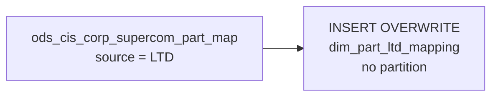

# DIM: LTD Part Number Cross-Reference Mapping (`dim_part_ltd_mapping`)

- artifact_type: etl_table
- artifact_id: dim_us.dim_part_ltd_mapping
- domain: part_sku
- one_line_purpose: This job loads a **cross-reference mapping between Synnex (CIS/SNX) part numbers and third-party system identifiers** for products sourced through LTD (Limited Technology Distribution). It provides the correspondence between internal Synnex...
- layer_type: DIM
- source_kind: etl_sql
- evidence_source: source/etl/sql/part_sku/source/etl/flows/public_order_tools/ingest/public_part_dimension/script/dim_part_ltd_mapping.sql

---

## L1 Data Foundation

### Identity and physical mapping
- **Table:** `dim_us.dim_part_ltd_mapping`
- **Layer type:** DIM
- **Canonical / derived:** Derived / ETL-loaded (see L3)
- **Owner team:** not registered in metadata catalog

### Grain, scope, exclusions
- **Grain:** one row per `snx_sku_no` — a unique Synnex SKU mapped to an LTD source.
- **Scope:** See L2 business purpose / L3 filters
- **Partition:** none — full overwrite on each run. - resolved from pipeline (see L4)
- **Natural key:** `snx_sku_no`.
- **Exclusions:** Not documented in repository

#### Grain detail (preserved)

- **Grain:** one row per `snx_sku_no` — a unique Synnex SKU mapped to an LTD source.
- **Partition:** none — full overwrite on each run.
- **Natural key:** `snx_sku_no`.

---

### Cross-engine presence
| Engine | Present | Canonical FQN | Notes |
|--------|---------|---------------|-------|
| Hive | yes | `dim_part_ltd_mapping` | ETL target / intermediate per evidence script |
| Vertica | pending | `dim_part_ltd_mapping` | Confirm via hive2vertica flow evidence / MCP |

### Physical schema reference

Pointer block only - full column catalog lives in WKB L1 storage JSON.

| Field | Value |
|-------|-------|
| **Authoritative catalog** | WKB L1 storage seed (not duplicated in this file) |
| **entity_id** | `dim_us.dim_part_ltd_mapping` |
| **l1_catalog_seed** | `target/storage/wkb/snapshots/_snapshot_id_template/l1_catalog/{engine}_{schema}_{table}.json` |
| **column_count** | pending (run ddl_seed_writer) |
| **partition_keys** | `none — full overwrite on each run.` |
| **ddl_source** | pending Bitbucket DDL / Vertica metadata ingest |
| **retrieval** | `python -m tools.wkb.indexing.run_query --query "part_sku dim_part_ltd_mapping schema" --intent find_table_schema` |

### Lineage
| Object | Role |
|--------|------|
| `ods_${country_code}.ods_cis_corp_supercom_part_map` | Sole source — supercom LTD part mappings |
| `dim_${country_code}.dim_part_ltd_mapping` | **Target** — LTD part cross-reference dimension |

---

### Freshness and load path
| Item | Value |
|------|-------|
| Load pattern | See L3 end-to-end / INSERT pattern in evidence script |
| Schedule | Not documented in repository |
| Parameters | `country_code` |


---

## L2 Declarative Knowledge

### Business purpose
This job loads a **cross-reference mapping between Synnex (CIS/SNX) part numbers and third-party system identifiers** for products sourced through LTD (Limited Technology Distribution). It provides the correspondence between internal Synnex SKU numbers, SAP SKU numbers, WCC SKU numbers, and the original source part numbers — enabling inventory, procurement, and finance systems to reconcile product identities across platforms.

---

### Audience and use cases
| Audience | How they benefit |
|----------|-----------------|
| **Procurement / purchasing** | `snx_sku_no` ↔ `sap_sku_no` (= `wcc_appli_key`) cross-reference for purchase order alignment between Synnex and SAP systems. |
| **Product / inventory management** | `snx_mfg_partno`, `source_mfg_partno`, `source_partno_ext`, `sc_part_no` — reconciles manufacturer part numbers across source systems. |
| **Finance / accounting** | `snx_ave_cost` — average cost for LTD-sourced products from the Synnex system. |

---

### Identifier search profile
- Primary lookup keys: see natural key under L1 Grain.
- Use latest snapshot / active flags when documented in L3 filters.

### Time field semantics
- **date_flag / partition columns:** none — full overwrite on each run.
- Primary reporting filter should use the partition column(s) documented in L1; resolve values via L4.


### Metrics served

| Category | Column | Logical metric | Business reading |
|----------|--------|----------------|------------------|
| Measures | — | — | No measure columns mapped for this table. |

### Metric serving map

**Formula authority:** [`source/contracts/part_sku/metric-index.md`](../../source/contracts/part_sku/metric-index.md)

N/A — no measure columns mapped for this table.

### etl_metrics

No governed logical metrics from `source/contracts/part_sku/metric-index.md` are mapped on this table.

---

### Metric serving map
N/A - not a `*_comb_mtd` / multi-period wide serving table (or map not present in legacy doc).


### Data products and column groups (preserved)

### SKU cross-references

- `snx_sku_no` — Synnex internal SKU number
- `sap_sku_no` (= `wcc_appli_key`) — SAP application key / SKU
- `wcc_sku_no` — WCC SKU number
- `snx_exist_sku_no` — Synnex existing SKU reference

### Part number cross-references

- `snx_part_no` — Synnex part number
- `snx_mfg_partno` — Synnex manufacturer part number
- `sc_part_no` — SC (system connector) part number
- `source_mfg_partno` — manufacturer part number in the source system
- `source_partno_ext` — source system's extended part number
- `wcc_original_part` — WCC original part number

### Vendor and product attributes

- `snx_vend_no` — Synnex vendor number
- `source_vend_no` — source system's vendor number
- `prod_type` — product type classification
- `company_no` — company number

### Provenance

- `source` — always `'LTD'` for all rows in this table
- `upd_datetime` — last update timestamp in the source system

### Financial

- `snx_ave_cost` — Synnex average cost for this SKU

---

### etl_metrics

N/A - no calculable ETL formulas extracted from this document (passthrough / stored measures only, or formulas not documented).

---

## L3 Procedural Knowledge

### Query and routing rules
**Business filters:** Use partition / date keys from L1 grain for reporting scope.
**Technical predicates (load only):** See Key filters and step-by-step logic below.

### Dimension join patterns
| Dimension FQN | Join keys | Purpose | Evidence |
|---------------|-----------|---------|----------|
| See step-by-step / base tables | See L3 steps | Dimension enrichment | `source/etl/sql/part_sku/source/etl/flows/public_order_tools/ingest/public_part_dimension/script/dim_part_ltd_mapping.sql` |

### Key filters and ETL business logic
### Step 1 — Final `INSERT OVERWRITE`

**From:** `ods_${country_code}.ods_cis_corp_supercom_part_map`

**Filter:** `source = 'LTD'`

**Explicit column list with rename:**
- `wcc_appli_key` is selected as `sap_sku_no` — the WCC application key maps to the SAP SKU identifier.
- All other columns pass through by name.

---

### Standard time-filter SQL
```sql
-- relative period filter using resolved partition value (see L4)
SELECT *
FROM dim_part_ltd_mapping
WHERE /* partition predicate */ date_flag = '${partition_value}';
```

### End-to-end flow
**Runtime parameters:** `country_code`
**Target table:** `dim_${country_code}.dim_part_ltd_mapping` — **full overwrite, no partitioning**.

1. Read `ods_cis_corp_supercom_part_map` filtered to `source = 'LTD'`.
2. **INSERT OVERWRITE** with explicit column list (renaming `wcc_appli_key` → `sap_sku_no`).



---


#### High-level stages (preserved)

| Stage | Business meaning |
|-------|-----------------|
| **Filter to LTD source** | Reads `ods_cis_corp_supercom_part_map` filtering to rows where `source = 'LTD'` only — excludes other supercom source types. |
| **Full overwrite** | Replaces the entire `dim_part_ltd_mapping` table with the current LTD mappings. |

**Parameters:** `country_code`

---


### Base tables register
| Object | Role in this job |
|--------|-----------------|
| `ods_${country_code}.ods_cis_corp_supercom_part_map` | **Sole source.** Supercom part mapping table. Filtered to `source = 'LTD'`. |

**Temporary tables (inside the job only):** None.

---

### Step-by-step logic
### Step 1 — Final `INSERT OVERWRITE`

**From:** `ods_${country_code}.ods_cis_corp_supercom_part_map`

**Filter:** `source = 'LTD'`

**Explicit column list with rename:**
- `wcc_appli_key` is selected as `sap_sku_no` — the WCC application key maps to the SAP SKU identifier.
- All other columns pass through by name.

---

### Relationship map (embedded)

| from_fqn | to_fqn | cardinality | join_keys | provenance |
|----------|--------|-------------|-----------|------------|
| — | — | — | — | Not documented in repository |

`source/ref/part_sku/table relationship.txt`: Not documented in repository.

### Special logic (embedded)

Not documented in repository

### Column / field derivations (from ETL SQL)

| target_column | expression_sql | upstream_columns | upstream_tables | transform_kind | evidence |
|---------------|----------------|------------------|-----------------|----------------|----------|
| `snx_sku_no` | `snx_sku_no` | `snx_sku_no` | `ods_${country_code}.ods_cis_corp_supercom_part_map` | passthrough | `source/etl/sql/part_sku/public_order_scripts/public_part_dimension/script/dim_part_ltd_mapping.sql:2` |
| `sap_sku_no` | `wcc_appli_key` | `wcc_appli_key` | `ods_${country_code}.ods_cis_corp_supercom_part_map` | rename | `source/etl/sql/part_sku/public_order_scripts/public_part_dimension/script/dim_part_ltd_mapping.sql:2` |
| `sc_part_no` | `sc_part_no` | `sc_part_no` | `ods_${country_code}.ods_cis_corp_supercom_part_map` | passthrough | `source/etl/sql/part_sku/public_order_scripts/public_part_dimension/script/dim_part_ltd_mapping.sql:2` |
| `snx_part_no` | `snx_part_no` | `snx_part_no` | `ods_${country_code}.ods_cis_corp_supercom_part_map` | passthrough | `source/etl/sql/part_sku/public_order_scripts/public_part_dimension/script/dim_part_ltd_mapping.sql:2` |
| `snx_mfg_partno` | `snx_mfg_partno` | `snx_mfg_partno` | `ods_${country_code}.ods_cis_corp_supercom_part_map` | passthrough | `source/etl/sql/part_sku/public_order_scripts/public_part_dimension/script/dim_part_ltd_mapping.sql:2` |
| `snx_vend_no` | `snx_vend_no` | `snx_vend_no` | `ods_${country_code}.ods_cis_corp_supercom_part_map` | passthrough | `source/etl/sql/part_sku/public_order_scripts/public_part_dimension/script/dim_part_ltd_mapping.sql:2` |
| `snx_ave_cost` | `snx_ave_cost` | `snx_ave_cost` | `ods_${country_code}.ods_cis_corp_supercom_part_map` | passthrough | `source/etl/sql/part_sku/public_order_scripts/public_part_dimension/script/dim_part_ltd_mapping.sql:2` |
| `snx_exist_sku_no` | `snx_exist_sku_no` | `snx_exist_sku_no` | `ods_${country_code}.ods_cis_corp_supercom_part_map` | passthrough | `source/etl/sql/part_sku/public_order_scripts/public_part_dimension/script/dim_part_ltd_mapping.sql:2` |
| `prod_type` | `prod_type` | `prod_type` | `ods_${country_code}.ods_cis_corp_supercom_part_map` | passthrough | `source/etl/sql/part_sku/public_order_scripts/public_part_dimension/script/dim_part_ltd_mapping.sql:2` |
| `source_mfg_partno` | `source_mfg_partno` | `source_mfg_partno` | `ods_${country_code}.ods_cis_corp_supercom_part_map` | passthrough | `source/etl/sql/part_sku/public_order_scripts/public_part_dimension/script/dim_part_ltd_mapping.sql:2` |
| `source` | `source` | `source` | `ods_${country_code}.ods_cis_corp_supercom_part_map` | passthrough | `source/etl/sql/part_sku/public_order_scripts/public_part_dimension/script/dim_part_ltd_mapping.sql:2` |
| `source_partno_ext` | `source_partno_ext` | `source_partno_ext` | `ods_${country_code}.ods_cis_corp_supercom_part_map` | passthrough | `source/etl/sql/part_sku/public_order_scripts/public_part_dimension/script/dim_part_ltd_mapping.sql:2` |
| `source_vend_no` | `source_vend_no` | `source_vend_no` | `ods_${country_code}.ods_cis_corp_supercom_part_map` | passthrough | `source/etl/sql/part_sku/public_order_scripts/public_part_dimension/script/dim_part_ltd_mapping.sql:2` |
| `company_no` | `company_no` | `company_no` | `ods_${country_code}.ods_cis_corp_supercom_part_map` | passthrough | `source/etl/sql/part_sku/public_order_scripts/public_part_dimension/script/dim_part_ltd_mapping.sql:2` |
| `wcc_sku_no` | `wcc_sku_no` | `wcc_sku_no` | `ods_${country_code}.ods_cis_corp_supercom_part_map` | passthrough | `source/etl/sql/part_sku/public_order_scripts/public_part_dimension/script/dim_part_ltd_mapping.sql:2` |
| `wcc_original_part` | `wcc_original_part` | `wcc_original_part` | `ods_${country_code}.ods_cis_corp_supercom_part_map` | passthrough | `source/etl/sql/part_sku/public_order_scripts/public_part_dimension/script/dim_part_ltd_mapping.sql:2` |
| `upd_datetime` | `upd_datetime` | `upd_datetime` | `ods_${country_code}.ods_cis_corp_supercom_part_map` | passthrough | `source/etl/sql/part_sku/public_order_scripts/public_part_dimension/script/dim_part_ltd_mapping.sql:2` |

### Sentinel and code values
| Value | Meaning |
|-------|---------|
| `source = 'LTD'` | LTD (Limited Technology Distribution) source only — other source types in the supercom part map table are excluded. |

---

---

## L4 Validation

### Resolved partition value
| Step | Source | How partition / date scope is determined |
|------|--------|------------------------------------------|
| 1 | evidence script / flow | See parameters in L1 Freshness and L3 filters - `source/etl/sql/part_sku/source/etl/flows/public_order_tools/ingest/public_part_dimension/script/dim_part_ltd_mapping.sql` |

**Plain language:** Partition and date scope follow Azkaban/bootstrap parameters documented in the source script and orchestrating flow; do not hardcode calendar literals.

### Data quality checks
- Prefer row-count-by-partition, metric sums, and grain duplicate checks (see Validation SQL).
- Additional checks from legacy caveats / operational notes when present.

### Validation SQL
```sql
-- 1) Row count by partition
SELECT ${partition_col}, COUNT(*) AS row_cnt
FROM dim_${country_code}.dim_part_ltd_mapping
WHERE ${partition_col} = '${partition_value}'
GROUP BY ${partition_col};

-- 2) Metric sum by business dimension (top deltas)
SELECT ${dim_key}, SUM(${metric}) AS metric_sum
FROM dim_${country_code}.dim_part_ltd_mapping
WHERE ${partition_col} = '${partition_value}'
GROUP BY ${dim_key}
ORDER BY ABS(SUM(${metric})) DESC
LIMIT 20;

-- 3) Grain duplicate check
SELECT ${grain_key_1}, ${grain_key_2}, ${grain_key_3}, ${partition_col}, COUNT(*) AS cnt
FROM dim_${country_code}.dim_part_ltd_mapping
WHERE ${partition_col} = '${partition_value}'
GROUP BY ${grain_key_1}, ${grain_key_2}, ${grain_key_3}, ${partition_col}
HAVING COUNT(*) > 1;
```

Replace placeholders from this file's Grain and keys / Data you can fetch sections, and use the resolved partition value from run scope.

### Caveats for interpretation
- **Full overwrite** — no incremental logic; the entire table is replaced on each run.
- **`sap_sku_no` = `wcc_appli_key`** — the column is renamed on load. The source field name is `wcc_appli_key`.
- **Only LTD-sourced mappings** — other source types from `ods_cis_corp_supercom_part_map` are not represented here.

---

### Conflicts and open questions
- Schedule, owner, SLA: Not documented in repository (unless preserved schedule evidence above).
- Vertica MCP verification: pending unless confirmed in L5.


---

## L5 Runtime View

### Query path and engine preference
| Role | Hive object | Vertica object | Sync mode | Evidence | MCP verified |
|------|-------------|----------------|-----------|----------|--------------|
| **Query for reporting** | *See script lineage* | `dim_${country_code}.dim_part_ltd_mapping` | *Verify from flow* | *Add flow file:line* | pending |
| **Hive alternative** | `*` | `dim_${country_code}.dim_part_ltd_mapping` | - | *See dependencies* | - |
| **ETL internal** | staging/temp tables | *Not synced to Vertica* | - | *See step-by-step logic* | - |

Business users should query `dim_${country_code}.dim_part_ltd_mapping` in Vertica once MCP verification is completed for this document.

### Access constraints
- Country / company schema parameters may apply (`literal_country`, `company_no`, etc.).
- Hive-only staging objects are not reporting surfaces unless synced.

### Query risk profile
| Field | Value |
|-------|-------|
| requires_date_predicate | unknown |
| scan_risk_tier | medium |

---

## L6 Access and Consumption

### Primary consumers and use cases
| Audience | How they benefit |
|----------|-----------------|
| **Procurement / purchasing** | `snx_sku_no` ↔ `sap_sku_no` (= `wcc_appli_key`) cross-reference for purchase order alignment between Synnex and SAP systems. |
| **Product / inventory management** | `snx_mfg_partno`, `source_mfg_partno`, `source_partno_ext`, `sc_part_no` — reconciles manufacturer part numbers across source systems. |
| **Finance / accounting** | `snx_ave_cost` — average cost for LTD-sourced products from the Synnex system. |

---

### Representative query patterns
```sql
-- certified / illustrative lookup - replace predicates from L1/L4
SELECT *
FROM dim_part_ltd_mapping
WHERE date_flag = '${partition_value}'
LIMIT 100;
```

### Dependencies and notes
### Upstream objects (verified)

| Object | Usage | Evidence |
|--------|-------|----------|
| `ods_${country_code}.ods_cis_corp_supercom_part_map` | LTD-filtered part mapping; `wcc_appli_key` renamed to `sap_sku_no` | `dim_part_ltd_mapping.sql:3-4` |

### Downstream consumers (verified)

| Object / script | Evidence |
|-----------------|----------|
| None identified in repository. | — |

### Operational detail (verified)

- Full overwrite: `INSERT OVERWRITE TABLE dim_${country_code}.dim_part_ltd_mapping` — no partition clause — `dim_part_ltd_mapping.sql:1`

### Not documented in repository

- Schedule, owner, SLA — not in scripts or configs

---

*Document generated from `source/etl/sql/part_sku/source/etl/flows/public_order_tools/ingest/public_part_dimension/script/dim_part_ltd_mapping.sql`.*

#### Not documented in repository
- Owner, SLA (unless schedule evidence preserved above)
- Any dependency without `file:line` evidence in this document

---

*Document migrated to L1-L6 from legacy Knowledgebase content. Evidence: `source/etl/sql/part_sku/source/etl/flows/public_order_tools/ingest/public_part_dimension/script/dim_part_ltd_mapping.sql`.*
