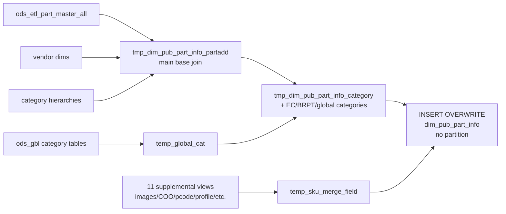

# DIM: Product / Part Master Dimension (`dim_pub_part_info`)

- artifact_type: etl_table
- artifact_id: dim_us.dim_pub_part_info
- domain: part_sku
- one_line_purpose: This job builds the **comprehensive product/part master dimension** — the single canonical reference for every SKU attribute needed across analytics, ordering, reporting, and compliance. It assembles a fully enriched row per SKU by combinin...
- layer_type: DIM
- source_kind: etl_sql
- evidence_source: source/etl/sql/part_sku/source/etl/flows/public_order_tools/ingest/public_part_dimension/script/dim_pub_part_info.sql

---

## L1 Data Foundation

### Identity and physical mapping
- **Table:** `dim_us.dim_pub_part_info`
- **Layer type:** DIM
- **Canonical / derived:** Derived / ETL-loaded (see L3)
- **Owner team:** not registered in metadata catalog

### Grain, scope, exclusions
- **Grain:** one row per `sku_no` — a unique product SKU.
- **Scope:** See L2 business purpose / L3 filters
- **Partition:** none — full overwrite on each run. - resolved from pipeline (see L4)
- **Natural key:** `sku_no`.
- **Exclusions:** Not documented in repository

#### Grain detail (preserved)

- **Grain:** one row per `sku_no` — a unique product SKU.
- **Partition:** none — full overwrite on each run.
- **Natural key:** `sku_no`.

---

### Cross-engine presence
| Engine | Present | Canonical FQN | Notes |
|--------|---------|---------------|-------|
| Hive | yes | `dim_pub_part_info` | ETL target / intermediate per evidence script |
| Vertica | pending | `dim_pub_part_info` | Confirm via hive2vertica flow evidence / MCP |

### Physical schema reference

Pointer block only - full column catalog lives in WKB L1 storage JSON.

| Field | Value |
|-------|-------|
| **Authoritative catalog** | WKB L1 storage seed (not duplicated in this file) |
| **entity_id** | `dim_us.dim_pub_part_info` |
| **l1_catalog_seed** | `target/storage/wkb/snapshots/_snapshot_id_template/l1_catalog/{engine}_{schema}_{table}.json` |
| **column_count** | pending (run ddl_seed_writer) |
| **partition_keys** | `none — full overwrite on each run.` |
| **ddl_source** | pending Bitbucket DDL / Vertica metadata ingest |
| **retrieval** | `python -m tools.wkb.indexing.run_query --query "part_sku dim_pub_part_info schema" --intent find_table_schema` |

### Lineage
| Object | Role |
|--------|------|
| `ods_${country_code}.ods_etl_part_master_all` | Primary source — all SKUs |
| (30+ additional sources) | See Base tables register above |
| `dim_${country_code}.dim_pub_part_prod_cat` | BRPT category hierarchy (prerequisite — must be loaded first) |
| `dim_${country_code}.dim_pub_part_info` | **Target** — product master dimension |

---

### Freshness and load path
| Item | Value |
|------|-------|
| Load pattern | See L3 end-to-end / INSERT pattern in evidence script |
| Schedule | Not documented in repository |
| Parameters | `country_code` |


---

## L2 Declarative Knowledge

### Business purpose
This job builds the **comprehensive product/part master dimension** — the single canonical reference for every SKU attribute needed across analytics, ordering, reporting, and compliance. It assembles a fully enriched row per SKU by combining basic part master attributes with five category hierarchies (CIS/standard, TC/product content, EC/e-commerce, BRPT, and global), vendor info, VPL/product line data, ARR and XAAS recurring revenue flags, image and content metadata, country of origin, pricing flags, sustainability codes (pcode), ASC606 revenue recognition, universal SKU linkage, forecast category, PP code, item type, and asset tag. The output is consumed by virtually every downstream analytics and reporting pipeline in the warehouse.

---

### Audience and use cases
| Audience | How they benefit |
|----------|-----------------|
| **All analytics / reporting** | Single-join SKU lookup with every attribute pre-resolved — category, vendor, pricing, content, compliance. |
| **Finance / BRPT** | `brpt_family`, `brpt_category`, `brpt_sub_category`, `pcode`, `asc606`, `renewal_flag` — product attributes for P&L and revenue recognition. |
| **Product / category management** | Five category hierarchies (standard, TC, EC, BRPT, global), `tc_fill_count`, `fill_count`, `image_count`, `categorizer`, `categorized_time`. |
| **Vendor management** | `vend_name`, `vend_segment`, `vend_seg_code`, `universal_vend_no/name`, `vend_currency`, `vend_consign_flag`. |
| **Sales / channel** | `arr_flag`, `xaas_flag`, `hwsw_comb`, `jv_business`, `sales_cost`, `std_whls_price`. |
| **Operations / compliance** | `coo`, `iqc_req`, `qc_flag`, `qc_status`, `dg_code`, `item_type`, `asset_tag`, `ser_no_flag`. |
| **Pricing** | `po_cost`, `ave_cost`, `std_cost`, `sug_retail_price`, `sku_map`, `msrp_flag`, `std_whls_price`. |

---

### Identifier search profile
- Primary lookup keys: see natural key under L1 Grain.
- Use latest snapshot / active flags when documented in L3 filters.

### Time field semantics
- **date_flag / partition columns:** none — full overwrite on each run.
- Primary reporting filter should use the partition column(s) documented in L1; resolve values via L4.


### Metrics served

| Category | Column | Logical metric | Business reading |
|----------|--------|----------------|------------------|
| P&L adjustment / measure | `ave_cost` | `ave_cost` | ave_cost at unspecified grain |
| P&L adjustment / measure | `fixed_price` | `fixed_price` | fixed_price at unspecified grain |
| P&L adjustment / measure | `po_cost` | `po_cost` | po_cost at unspecified grain |
| P&L adjustment / measure | `std_cost` | `std_cost` | std_cost at unspecified grain |
| Governed metric | `std_whls_price` | `std_whls_price` | std_whls_price at unspecified grain |
| P&L adjustment / measure | `sug_retail_price` | `sug_retail_price` | sug_retail_price at unspecified grain |

### Metric serving map

**Formula authority:** [`source/contracts/part_sku/metric-index.md`](../../source/contracts/part_sku/metric-index.md)

| Logical metric | Period scope | Physical column | Formula reference |
|----------------|--------------|-----------------|-------------------|
| `ave_cost` | unspecified | `ave_cost` | Not in metric-index.md |
| `fixed_price` | unspecified | `fixed_price` | Not in metric-index.md |
| `po_cost` | unspecified | `po_cost` | Not in metric-index.md |
| `std_cost` | unspecified | `std_cost` | Not in metric-index.md |
| `std_whls_price` | unspecified | `std_whls_price` | `source/contracts/part_sku/metric-index.md#std_whls_price` |
| `sug_retail_price` | unspecified | `sug_retail_price` | Not in metric-index.md |

### etl_metrics

Formulas below are sourced from [`source/contracts/part_sku/metric-index.md`](../../source/contracts/part_sku/metric-index.md) for logical metrics present on this table.
Index formulas are canonical: this enricher copies them into KB and never overwrites `final_effective_formula_sql` in the metric-index.

#### `std_whls_price`
- **Source:** [metric-index.md](../../source/contracts/part_sku/metric-index.md#std_whls_price)
- **Business definition:** Standard wholesale price index
```sql
WHLS_INDEX/PRIC
```

---

### Metric serving map
N/A - not a `*_comb_mtd` / multi-period wide serving table (or map not present in legacy doc).


### Data products and column groups (preserved)

### Core identifiers

- `sku_no`, `part_no`, `mfg_partno`, `upc_code`, `model`, `series_no`, `vpl_no`, `vend_no`, `group_id`, `prod_code`
- `uni_sku_no` — global universal SKU number; `global_load_date`
- `alt_vpl_no`, `comb_vend_no`, `alt_vend_no`, `vend_part_no`

### Descriptions

- `short_desc`, `long_desc`, `catalog_desc`, `series_desc`, `vpl_code`, `vpl_desc`, `alt_vpl_code`, `alt_vpl_desc`
- `tc_mkt_overview` — TC marketing overview text

### Product attributes

- `prod_type`, `abc_code`, `usage_type`, `category_id`, `bundle_kit`, `lifecycle_status`, `source_status`, `prod_lifecycle_code`
- `weight`, `cu_height`, `cu_width`, `cu_length`, `ser_no_flag`, `avail_to_sell`, `active_status`, `active_status_date`
- `accept_rma`, `master_flag`, `security`, `wms_profile`, `mult`, `min_poqty`, `package_qty`, `reorder_level`, `reorder_qty`
- `production_flag`, `fixed_price`, `shortage`, `pur_comment`, `mar_comment`
- `dg_code`, `item_type`, `item_type_desc`, `asset_tag`

### Category hierarchies

| Hierarchy | Columns |
|-----------|---------|
| **Standard (CIS)** | `family_id`, `family`, `cat_id`, `category`, `subcat_id`, `sub_category` |
| **TC (product content)** | `tc_family_id`, `tc_family`, `tc_cat_id`, `tc_category`, `tc_subcat_id`, `tc_sub_category` |
| **EC (e-commerce)** | `ec_family_id`, `ec_family`, `ec_cat_id`, `ec_category`, `ec_subcat_id`, `ec_sub_category` |
| **BRPT** | `brpt_family_id`, `brpt_family`, `brpt_cat_id`, `brpt_category`, `brpt_subcat_id`, `brpt_sub_category` |
| **Global** | `global_family_desc`, `global_cat_desc`, `global_sub_desc`, `global_cat_type` |
| **Universal** | `uni_group_id` |

### Vendor attributes

- `vend_name`, `vend_segment`, `vend_seg_code`, `universal_vend_no`, `universal_vend_name`
- `vend_currency`, `fx_flag`, `vend_consign_flag`, `part_consign_flag`, `company_no`

### Pricing and cost

- `po_cost`, `ave_cost`, `std_cost`, `cost_meth`, `sug_retail_price`, `std_whls_price`, `sku_map`
- `last_pur_date`, `pur_end_date`, `mar_end_date`

### Flags and classifications

- `arr_flag`, `xaas_flag` — recurring revenue / SaaS classification
- `asc606` — ASC606 revenue recognition type
- `renewal_flag` — `'Yes'` when `profile_i = 1` for ASC606 profile
- `msrp_flag`, `upc_flag` — pricing and UPC status
- `hwsw_comb` — hardware/software combination indicator
- `jv_business` — joint venture business classification
- `iqc_req` — IQC (Incoming Quality Control) requirement flag
- `qc_flag` — `'Y'` when `qc_status IN ('QC', 'UR')`; else `'N'`
- `qc_status` — raw QC status code
- `ec_flag` — EC (e-commerce) flag from VPL record

### Sustainability / classification codes

- `pcode`, `pcode_desc` — product sustainability/PSRC code (coalesced from SKU pcode, vendor pcode, global pcode, defaulting to `'P00'`/`'Unmapped'`)
- `forecast_cat` — product forecast category
- `pp_code`, `pp_data_no` — product program code

### Content / completeness

- `image_count`, `image_upload_date`, `first_image_name`, `multiimage`
- `fill_count` — TC technote count (content completeness)
- `tc_fill_count` — TC technical spec attribute count (distinct, noise-excluded)
- `accessory_cnt` — number of active accessory cross-references
- `coo` — country of origin (comma-delimited country names)

### Categorization audit

- `categorizer`, `categorized_time`, `modifier`, `last_modify_date`
- `entry_name`, `entry_datetime`, `entry_id`
- `data_source` — `'CIS'` (active), `'HIS'` (historical), or `''`
- `etl_timestamp`

---

### etl_metrics

#### `asc606`
- **Source:** [metric-index.md](../../source/contracts/part_sku/metric-index.md#asc606)
- **Business definition:** Revenue recognition type
```sql
ASC606/SKU`, active
```

#### `renewal_flag`
- **Source:** [metric-index.md](../../source/contracts/part_sku/metric-index.md#renewal_flag)
- **Business definition:** Renewal product indicator
```sql
ASC606/SKU`, active, `profile_i=1` → `'Yes'` else `'No'
```

#### `sku_map`
- **Source:** [metric-index.md](../../source/contracts/part_sku/metric-index.md#sku_map)
- **Business definition:** Minimum advertised price
```sql
MAP/PRIC`, active
```

#### `hwsw_comb`
- **Source:** [metric-index.md](../../source/contracts/part_sku/metric-index.md#hwsw_comb)
- **Business definition:** HW+SW combination code
```sql
HWSW-COMB/SKU`, active → `profile_c
```

#### `series_desc`
- **Source:** [metric-index.md](../../source/contracts/part_sku/metric-index.md#series_desc)
- **Business definition:** Series description substring
```sql
VPC_ALT1/VEND`, active → `SUBSTRING(profile_c, 7, 60)
```

#### `std_whls_price`
- **Source:** [metric-index.md](../../source/contracts/part_sku/metric-index.md#std_whls_price)
- **Business definition:** Standard wholesale price index
```sql
WHLS_INDEX/PRIC`, active → `profile_f
```

#### `iqc_req`
- **Source:** [metric-index.md](../../source/contracts/part_sku/metric-index.md#iqc_req)
- **Business definition:** IQC requirement flag
```sql
IQC_REQ/HYVE`, active, sku_no not null → `'Y'` else `'N'
```


---

## L3 Procedural Knowledge

### Query and routing rules
**Business filters:** Use partition / date keys from L1 grain for reporting scope.
**Technical predicates (load only):** See Key filters and step-by-step logic below.

### Dimension join patterns
| Dimension FQN | Join keys | Purpose | Evidence |
|---------------|-----------|---------|----------|
| See step-by-step / base tables | See L3 steps | Dimension enrichment | `source/etl/sql/part_sku/source/etl/flows/public_order_tools/ingest/public_part_dimension/script/dim_pub_part_info.sql` |

### Key filters and ETL business logic
### `temp_tc_faimly` — TC category via CIS group

Resolves TC hierarchy: `ods_etl_part_master_all.group_id` → `tc_cis_group_mapping.tc_group_id` → `tc_part_cat.(family_id, cat_id, subcat_id)` → `tc_pco_cat_id` descriptions (joined 3×).

### `temp_family` — Standard category hierarchy

Inner joins: `ods_cis_corp_part_cat` to `ods_cis_corp_pco_cat_id` (filtered `cat_type='FAM'`) for family → then inner joins for category and subcategory descriptions. Provides `family`, `category`, `sub_category` and their IDs.

### `temp_vend_profile` — Vendor profile pivot

Pivots `ods_cis_corp_vendor_profile` for:
- `vend_segment` (SEG/VC, active)
- `universal_vend_no` (UNI_VEND/CAT → `profile_i`)
- `universal_vend_name` (UNI_VEND/CAT → `profile_c`)
- `vend_consign_flag` (CSGN_VEND, active)
Left joins to `ods_cis_corp_vendor_segment` for `vend_seg_code`.

### `temp_part_sku_profile` — SKU profile pivot (11 profiles)

| Output column | Profile type | Notes |
|---------------|-------------|-------|
| `asc606` | `ASC606/SKU`, active | Revenue recognition type |
| `renewal_flag` | `ASC606/SKU`, active, `profile_i=1` → `'Yes'` else `'No'` | Renewal product indicator |
| `msrp_flag` | `RETAIL $` → `active` value | MSRP availability flag |
| `sku_map` | `MAP/PRIC`, active | Minimum advertised price |
| `upc_flag` | `UPC_CODE`, active → `active` value | UPC presence indicator |
| `part_cust_no` | `CUST_SKU`, active → `profile_i` | Customer SKU assignment |
| `hwsw_comb` | `HWSW-COMB/SKU`, active → `p...

### Standard time-filter SQL
```sql
-- relative period filter using resolved partition value (see L4)
SELECT *
FROM dim_pub_part_info
WHERE /* partition predicate */ date_flag = '${partition_value}';
```

### End-to-end flow
**Runtime parameters:** `country_code`
**Target table:** `dim_${country_code}.dim_pub_part_info` — **full overwrite, no partitioning**.

1. Build vendor, category, ARR/XAAS, family hierarchy, vendor profile, vendor currency temp views.
2. Build `tmp_dim_pub_part_info_partadd` — main base join (part master + 9 dimension joins).
3. Build global category temp view.
4. Build `tmp_dim_pub_part_info_category` — adds EC, BRPT, global categories + categorizer info.
5. Build 11 supplemental SKU attribute views/tables (images, accessories, fill count, COO, pcodes, profiles, TC fill, universal SKU, universal group, vendor pcode, forecast cat, PP code, SKU extension, item type desc).
6. Build `tmp_sku_no_merge` — UNION of all supplemental SKU sets.
7. Build `temp_sku_merge_field` — LEFT JOIN all supplemental views into one row per SKU.
8. Build `temp_sku_asset_tag` — asset tag per SKU.
9. **INSERT OVERWRITE** from `tmp_dim_pub_part_info_category` + 10 final LEFT JOINs.



---


#### High-level stages (preserved)

| Stage | Business meaning |
|-------|-----------------|
| **Vendor company number** | Resolves `vend_name` and `company_no` per vendor from vend_master. |
| **TC category hierarchy** | Maps each SKU's `group_id` through the TC CIS group mapping → TC part cat → PCO category IDs to produce `tc_family`, `tc_category`, `tc_sub_category`. |
| **ARR / XAAS flags** | Pivots `RecurringRevenueCode` and `XAAS` profiles from MDM SKU profile — identifies subscription/recurring revenue products. |
| **Standard category hierarchy** | Builds family/category/subcategory from `ods_cis_corp_part_cat` via PCO cat IDs (filter `cat_type='FAM'`). |
| **Vendor profile** | Resolves vendor segment code, vendor segment name, universal vendor number/name, and consign flag from vendor profile table. |
| **Vendor FX info** | Resolves vendor currency and FX flag. |
| **Base part view** | Main join of part master + all category hierarchies + VPL + vendor info + TC group mapping + ARR/XAAS. Also resolves `vpl_code`, `vpl_desc`, `alt_vpl_no/code/desc`, `ec_flag`, `comb_vend_no` via `ods_cis_corp_dw_vend_pl`. Resolves `entry_name` from manager table. |
| **Global category** | Loads global (multi-country) product category hierarchy from `ods_gbl` tables (English, `iso_lang='en_US'`). |
| **EC + BRPT categories** | Adds EC (e-commerce) category from `ods_cis_corp_ec_category_name` and BRPT category from `dim_pub_part_prod_cat`. Adds categorizer and modifier names. |
| **Image metadata** | Counts images, records first upload date, first image name, and whether multiple images exist. |
| **Accessory count** | Counts active ACCESSORY-type SKU xrefs. |
| **Fill count** | Counts TC technote records per SKU (content completeness indicator). |
| **Country of origin (COO)** | Collects all COO country codes per SKU and resolves to country names (comma-delimited). |
| **P1 pcode** | Resolves product-level pcode from MDM SKU profile (`PCODE/SKU`). |
| **SKU profile pivot** | Pivots 11 profile types into columns: ASC606, renewal_flag, msrp_flag, sku_map (MAP), upc_flag, part_cust_no, hwsw_comb, series_desc, std_whls_price, jv_business, iqc_req. |
| **Universal SKU** | Links to global universal SKU number and global load date. |
| **TC fill count** | Counts distinct TC technical spec attributes (distinct attribute_id, excluding known noise IDs). |
| **Universal group** | Resolves global universal group ID. |
| **Vendor pcode** | Resolves vendor-level pcode from vendor MDM profile (`V_PCODE/VEND`). |
| **Forecast category** | Reads forecast_cat from PDSS product profile. |
| **PP code** | Resolves PP code and data_no from product code detail + part product detail. |
| **SKU extension** | Resolves DG code and item_type from SKU extension. |
| **Item type description** | Resolves human-readable item_type_desc from MDM attribute option values. |
| **SKU merge field assembly** | UNION of all supplemental SKU sets; LEFT JOINs all supplemental attributes into a single row per SKU. |
| **Asset tag** | MAX asset_tag per SKU from MDM SKU master. |
| **Final INSERT** | Joins the category-enriched base view with QC status, TC marketing overview text, CWS consign flag, vendor part number, global pcode, universal SKU, universal group, vendor pcode, merged supplemental fields, and asset tag. |

**Parameters:** `country_code`

---


### Base tables register
| Object | Role in this job |
|--------|-----------------|
| `ods_${country_code}.ods_etl_part_master_all` | **Primary source.** Merged active and history part master — all base SKU attributes. |
| `ods_${country_code}.ods_cis_corp_vend_master` | Vendor name and company_no. |
| `ods_${country_code}.ods_cis_corp_tc_cis_group_mapping` | Maps CIS `group_id` to TC `tc_group_id`. |
| `ods_${country_code}.ods_cis_corp_tc_part_cat` | TC category: `family_id`, `cat_id`, `subcat_id` per TC group. |
| `ods_${country_code}.ods_cis_corp_tc_pco_cat_id` | TC category descriptions (joined 3× for family, category, subcategory). |
| `ods_${country_code}.ods_part_mymdm_content_sku_profile` | MDM SKU profile — ARR/XAAS flags and pcode. |
| `ods_${country_code}.ods_cis_corp_part_cat` | Standard part category → `group_id` to `family_id/cat_id/subcat_id`. |
| `ods_${country_code}.ods_cis_corp_pco_cat_id` | Standard PCO category descriptions. |
| `ods_${country_code}.ods_cis_corp_vendor_profile` | Vendor segment, universal vendor, consign flag. |
| `ods_${country_code}.ods_cis_corp_vendor_segment` | Vendor segment code lookup. |
| `ods_${country_code}.ods_cis_corp_v_vend_currency` | Vendor FX flag and currency. |
| `ods_${country_code}.ods_cis_corp_dw_vend_pl` | VPL code/desc, alt VPL, alt vendor, EC flag — joined on `vpl_no`. |
| `ods_${country_code}.ods_cis_corp_manager` | Entry person name resolution. |
| `ods_gbl.ods_cis_mygbl_global_part_cat` | Global product category hierarchy. |
| `ods_gbl.ods_cis_mygbl_global_pco_cat_id` | Global category descriptions (English, `iso_lang='en_US'`). |
| `ods_${country_code}.ods_cis_corp_tc_part_prod_cat` | TC product categorization metadata (categorizer, modifier, dates). |
| `ods_${country_code}.ods_cis_corp_ec_category_name` | EC (e-commerce) category names per `group_id`. |
| `dim_${country_code}.dim_pub_part_prod_cat` | BRPT category hierarchy (joins on `group_id`). |
| `ods_${country_code}.ods_cis_corp_tc_images` | Product images — count, upload date, first image name, multiimage. |
| `ods_${country_code}.ods_etl_sku_xref_all` | ACCESSORY xrefs (count) and COO xrefs (country of origin). |
| `ods_${country_code}.ods_cis_corp_country_code` | Country name from country code (for COO resolution). |
| `ods_${country_code}.ods_etl_tc_part_technotes_en_all` | TC technotes for fill count. |
| `ods_${country_code}.ods_cis_corp_tc_part_technotes_en` | TC technical spec attributes for tc_fill_count. |
| `ods_gbl.ods_cis_mygbl_pcode_list` | Global pcode name lookup. |
| `ods_${country_code}.ods_etl_sku_profile_all` | SKU profile pivot (ASC606, MAP, WHLS_INDEX, CUST_SKU, etc.). |
| `ods_gbl.ods_cis_mygbl_prodcat_cis_sku` | Universal SKU mapping (company-filtered). |
| `ods_${country_code}.ods_cis_corp_app_config` | Company number config for universal SKU filter. |
| `ods_gbl.ods_cis_mygbl_prodcat_uni_sku` | Universal group ID per universal SKU. |
| `ods_${country_code}.ods_vendor_mymdm_content_vendor_profile` | Vendor-level MDM pcode. |
| `ods_${country_code}.ods_cis_corp_pdss_prod_profile` | Forecast category. |
| `ods_${country_code}.ods_cis_corp_prod_code_detail` | PP code data_value. |
| `ods_${country_code}.ods_cis_corp_part_prod_detail` | PP code to SKU mapping. |
| `ods_${country_code}.ods_cis_corp_sku_extension` | DG code and item_type. |
| `ods_${country_code}.ods_part_mymdm_sku_attr_option_values` | Item type description from MDM attribute values. |
| `ods_${country_code}.ods_cis_corp_tc_mkt_en` | TC marketing overview text. |
| `ods_${country_code}.ods_cis_corp_part_qc_status` | QC status per SKU. |
| `ods_${country_code}.ods_etl_cws_part_all` | CWS consign flag (`consign_flag` → `part_consign_flag`). |
| `ods_${country_code}.ods_etl_vend_part_no_all` | Vendor part number. |
| `ods_${country_code}.ods_part_mymdm_sku_master` | Asset tag per SKU. |

---

### Step-by-step logic
### `temp_tc_faimly` — TC category via CIS group

Resolves TC hierarchy: `ods_etl_part_master_all.group_id` → `tc_cis_group_mapping.tc_group_id` → `tc_part_cat.(family_id, cat_id, subcat_id)` → `tc_pco_cat_id` descriptions (joined 3×).

### `temp_family` — Standard category hierarchy

Inner joins: `ods_cis_corp_part_cat` to `ods_cis_corp_pco_cat_id` (filtered `cat_type='FAM'`) for family → then inner joins for category and subcategory descriptions. Provides `family`, `category`, `sub_category` and their IDs.

### `temp_vend_profile` — Vendor profile pivot

Pivots `ods_cis_corp_vendor_profile` for:
- `vend_segment` (SEG/VC, active)
- `universal_vend_no` (UNI_VEND/CAT → `profile_i`)
- `universal_vend_name` (UNI_VEND/CAT → `profile_c`)
- `vend_consign_flag` (CSGN_VEND, active)
Left joins to `ods_cis_corp_vendor_segment` for `vend_seg_code`.

### `temp_part_sku_profile` — SKU profile pivot (11 profiles)

| Output column | Profile type | Notes |
|---------------|-------------|-------|
| `asc606` | `ASC606/SKU`, active | Revenue recognition type |
| `renewal_flag` | `ASC606/SKU`, active, `profile_i=1` → `'Yes'` else `'No'` | Renewal product indicator |
| `msrp_flag` | `RETAIL $` → `active` value | MSRP availability flag |
| `sku_map` | `MAP/PRIC`, active | Minimum advertised price |
| `upc_flag` | `UPC_CODE`, active → `active` value | UPC presence indicator |
| `part_cust_no` | `CUST_SKU`, active → `profile_i` | Customer SKU assignment |
| `hwsw_comb` | `HWSW-COMB/SKU`, active → `profile_c` | HW+SW combination code |
| `series_desc` | `VPC_ALT1/VEND`, active → `SUBSTRING(profile_c, 7, 60)` | Series description substring |
| `std_whls_price` | `WHLS_INDEX/PRIC`, active → `profile_f` | Standard wholesale price index |
| `jv_business` | `JVBZ` → `profile_c` | JV business code |
| `iqc_req` | `IQC_REQ/HYVE`, active, sku_no not null → `'Y'` else `'N'` | IQC requirement flag |

### `pcode` resolution (coalesce chain)

Final pcode = `COALESCE(tsm.p1_pcode, tvp.pcode, pl.pcode, 'P00')` — SKU-level MDM pcode first, then vendor MDM pcode, then global part_cat pcode, then default `'P00'`.

### `qc_flag` derivation

`CASE WHEN qc_status IN ('QC', 'UR') THEN 'Y' ELSE 'N' END` — QC or Under Review statuses produce `'Y'`.

### `data_source` mapping

`CASE WHEN data_source = 'ods_cis_corp_part_master' THEN 'CIS' WHEN 'ods_his_corp_part_master' THEN 'HIS' ELSE '' END` — classifies which system the part record came from.

---

### Relationship map (embedded)

| from_fqn | to_fqn | cardinality | join_keys | provenance |
|----------|--------|-------------|-----------|------------|
| `ods_${country_code}.ods_etl_part_master_all` | `ods_${country_code}.ods_cis_corp_tc_cis_group_mapping` | many:1 | `a.group_id = b.cis_group_id` | etl_sql (source/etl/sql/part_sku/public_order_scripts/public_part_dimension/script/dim_pub_part_info.sql:1) |
| `ods_${country_code}.ods_cis_corp_tc_cis_group_mapping` | `ods_${country_code}.ods_cis_corp_tc_part_cat` | many:1 | `b.tc_group_id = c.group_id` | etl_sql (source/etl/sql/part_sku/public_order_scripts/public_part_dimension/script/dim_pub_part_info.sql:1) |
| `ods_${country_code}.ods_cis_corp_tc_part_cat` | `ods_${country_code}.ods_cis_corp_tc_pco_cat_id` | many:1 | `c.family_id = d.cat_id` | etl_sql (source/etl/sql/part_sku/public_order_scripts/public_part_dimension/script/dim_pub_part_info.sql:1) |
| `ods_${country_code}.ods_cis_corp_tc_part_cat` | `ods_${country_code}.ods_cis_corp_tc_pco_cat_id` | many:1 | `c.cat_id = e.cat_id` | etl_sql (source/etl/sql/part_sku/public_order_scripts/public_part_dimension/script/dim_pub_part_info.sql:1) |
| `ods_${country_code}.ods_cis_corp_tc_part_cat` | `ods_${country_code}.ods_cis_corp_tc_pco_cat_id` | many:1 | `c.subcat_id = f.cat_id; --get arr_flag、xaas_flag create or replace temporary view temp_arr_xaas as` | etl_sql (source/etl/sql/part_sku/public_order_scripts/public_part_dimension/script/dim_pub_part_info.sql:1) |
| `ods_gbl.ods_cis_mygbl_global_part_cat` | `ods_${country_code}.ods_cis_corp_pco_cat_id` | many:1 | `gpc.family_id = fam.cat_id` | etl_sql (source/etl/sql/part_sku/public_order_scripts/public_part_dimension/script/dim_pub_part_info.sql:1) |
| `ods_${country_code}.ods_cis_corp_vend_master` | `ods_${country_code}.ods_cis_corp_pco_cat_id` | many:1 | `t.cat_id = cat.cat_id` | etl_sql (source/etl/sql/part_sku/public_order_scripts/public_part_dimension/script/dim_pub_part_info.sql:1) |
| `ods_${country_code}.ods_cis_corp_vend_master` | `ods_${country_code}.ods_cis_corp_pco_cat_id` | many:1 | `t.subcat_id = scat.cat_id; --get vend_segment、vend_seg_code、universal_vend_no create or replace temporary view temp_vend_profile as` | etl_sql (source/etl/sql/part_sku/public_order_scripts/public_part_dimension/script/dim_pub_part_info.sql:1) |
| `ods_${country_code}.ods_cis_corp_vendor_profile` | `ods_${country_code}.ods_cis_corp_vendor_segment` | many:1 | `cast(vp.profile_c as varchar(3)) = vs.seg_code` | etl_sql (source/etl/sql/part_sku/public_order_scripts/public_part_dimension/script/dim_pub_part_info.sql:1) |
| `ods_${country_code}.ods_etl_part_master_all` | `ods_${country_code}.ods_cis_corp_part_cat` | many:1 | `a.group_id=gpc.group_id` | etl_sql (source/etl/sql/part_sku/public_order_scripts/public_part_dimension/script/dim_pub_part_info.sql:1) |
| `ods_${country_code}.ods_etl_part_master_all` | `temp_family` | many:1 | `a.group_id=tf.group_id --` | etl_sql (source/etl/sql/part_sku/public_order_scripts/public_part_dimension/script/dim_pub_part_info.sql:1) |
| `ods_${country_code}.ods_cis_corp_vend_master` | `ods_${country_code}.ods_cis_corp_tc_part_prod_cat` | many:1 | `Not documented in repository` | etl_sql (source/etl/sql/part_sku/public_order_scripts/public_part_dimension/script/dim_pub_part_info.sql:1) |
| `ods_${country_code}.ods_etl_part_master_all` | `ods_${country_code}.ods_cis_corp_tc_cis_group_mapping` | many:1 | `a.group_id = tcgm.cis_group_id` | etl_sql (source/etl/sql/part_sku/public_order_scripts/public_part_dimension/script/dim_pub_part_info.sql:1) |
| `ods_${country_code}.ods_etl_part_master_all` | `temp_tc_faimly` | many:1 | `a.sku_no=tc.sku_no` | etl_sql (source/etl/sql/part_sku/public_order_scripts/public_part_dimension/script/dim_pub_part_info.sql:1) |
| `ods_${country_code}.ods_etl_part_master_all` | `ods_${country_code}.ods_cis_corp_dw_vend_pl` | many:1 | `a.vpl_no= dvl.vpl_no` | etl_sql (source/etl/sql/part_sku/public_order_scripts/public_part_dimension/script/dim_pub_part_info.sql:1) |
| `ods_${country_code}.ods_etl_part_master_all` | `temp_vend_company_no` | many:1 | `a.vend_no = vm.vend_no` | etl_sql (source/etl/sql/part_sku/public_order_scripts/public_part_dimension/script/dim_pub_part_info.sql:1) |
| `ods_${country_code}.ods_etl_part_master_all` | `tmp_v_vend_currency` | many:1 | `a.vend_no= vvc.vend_no` | etl_sql (source/etl/sql/part_sku/public_order_scripts/public_part_dimension/script/dim_pub_part_info.sql:1) |
| `ods_${country_code}.ods_etl_part_master_all` | `temp_vend_profile` | many:1 | `a.vend_no=vp.vend_no` | etl_sql (source/etl/sql/part_sku/public_order_scripts/public_part_dimension/script/dim_pub_part_info.sql:1) |
| `temp_vend_company_no` | `ods_${country_code}.ods_cis_corp_dw_vend_pl` | many:1 | `dvl.alt_vpl_no= advl.vpl_no` | etl_sql (source/etl/sql/part_sku/public_order_scripts/public_part_dimension/script/dim_pub_part_info.sql:1) |
| `ods_${country_code}.ods_etl_part_master_all` | `ods_${country_code}.ods_cis_corp_manager` | many:1 | `a.entry_id = cbm.userid` | etl_sql (source/etl/sql/part_sku/public_order_scripts/public_part_dimension/script/dim_pub_part_info.sql:1) |
| `ods_${country_code}.ods_etl_part_master_all` | `temp_arr_xaas` | many:1 | `a.sku_no = ax.sku_no; -- get global category CREATE or replace temporary view temp_global_cat as` | etl_sql (source/etl/sql/part_sku/public_order_scripts/public_part_dimension/script/dim_pub_part_info.sql:1) |
| `ods_${country_code}.ods_cis_corp_part_cat` | `ods_gbl.ods_cis_mygbl_global_pco_cat_id` | many:1 | `gpc.family_id = gpci.cat_id and gpci.iso_lang = 'en_US'` | etl_sql (source/etl/sql/part_sku/public_order_scripts/public_part_dimension/script/dim_pub_part_info.sql:1) |
| `ods_${country_code}.ods_cis_corp_part_cat` | `ods_gbl.ods_cis_mygbl_global_pco_cat_id` | many:1 | `gpc.cat_id = cat.cat_id and gpci.iso_lang = 'en_US'` | etl_sql (source/etl/sql/part_sku/public_order_scripts/public_part_dimension/script/dim_pub_part_info.sql:1) |
| `ods_${country_code}.ods_cis_corp_part_cat` | `ods_gbl.ods_cis_mygbl_global_pco_cat_id` | many:1 | `gpc.subcat_id = scat.cat_id and gpci.iso_lang = 'en_US'` | etl_sql (source/etl/sql/part_sku/public_order_scripts/public_part_dimension/script/dim_pub_part_info.sql:1) |
| `tmp_dim_pub_part_info_partadd` | `ods_${country_code}.ods_cis_corp_tc_part_prod_cat` | many:1 | `pa.sku_no = ppc.sku_no` | etl_sql (source/etl/sql/part_sku/public_order_scripts/public_part_dimension/script/dim_pub_part_info.sql:1) |
| `ods_${country_code}.ods_cis_corp_tc_part_prod_cat` | `ods_${country_code}.ods_cis_corp_manager` | many:1 | `cater.userid=ppc.entry_id` | etl_sql (source/etl/sql/part_sku/public_order_scripts/public_part_dimension/script/dim_pub_part_info.sql:1) |
| `ods_${country_code}.ods_cis_corp_tc_part_prod_cat` | `ods_${country_code}.ods_cis_corp_manager` | many:1 | `moder.userid=ppc.last_modifier` | etl_sql (source/etl/sql/part_sku/public_order_scripts/public_part_dimension/script/dim_pub_part_info.sql:1) |
| `tmp_dim_pub_part_info_partadd` | `ods_${country_code}.ods_cis_corp_ec_category_name` | many:1 | `pa.group_id = ecn.group_id` | etl_sql (source/etl/sql/part_sku/public_order_scripts/public_part_dimension/script/dim_pub_part_info.sql:1) |
| `tmp_dim_pub_part_info_partadd` | `ods_gbl.ods_cis_mygbl_global_part_cat` | many:1 | `pa.group_id=gpc.group_id` | etl_sql (source/etl/sql/part_sku/public_order_scripts/public_part_dimension/script/dim_pub_part_info.sql:1) |
| `tmp_dim_pub_part_info_partadd` | `dim_${country_code}.dim_pub_part_prod_cat` | many:1 | `pa.group_id=dppc.group_id` | etl_sql (source/etl/sql/part_sku/public_order_scripts/public_part_dimension/script/dim_pub_part_info.sql:1) |
| `tmp_dim_pub_part_info_partadd` | `temp_global_cat` | many:1 | `pa.group_id=tgc.group_id; --3 for the field such as image_count、image_upload_date CREATE or replace temporary view tmp_dim_pub_part_info_profile_image as` | etl_sql (source/etl/sql/part_sku/public_order_scripts/public_part_dimension/script/dim_pub_part_info.sql:1) |
| `ods_${country_code}.ods_etl_sku_xref_all` | `ods_${country_code}.ods_cis_corp_country_code` | many:1 | `ct.xref = cc.country_code` | etl_sql (source/etl/sql/part_sku/public_order_scripts/public_part_dimension/script/dim_pub_part_info.sql:1) |
| `ods_${country_code}.ods_part_mymdm_content_sku_profile` | `ods_gbl.ods_cis_mygbl_pcode_list` | many:1 | `csp.profile_c=pl.pcode` | etl_sql (source/etl/sql/part_sku/public_order_scripts/public_part_dimension/script/dim_pub_part_info.sql:1) |
| `temp_uni_sku_no` | `ods_gbl.ods_cis_mygbl_prodcat_uni_sku` | many:1 | `usn.uni_sku_no=pus.uni_sku_no; CREATE or replace temporary view temp_vendor_pcode as` | etl_sql (source/etl/sql/part_sku/public_order_scripts/public_part_dimension/script/dim_pub_part_info.sql:1) |
| `ods_${country_code}.ods_vendor_mymdm_content_vendor_profile` | `ods_gbl.ods_cis_mygbl_pcode_list` | many:1 | `cvp.profile_c=pl.pcode` | etl_sql (source/etl/sql/part_sku/public_order_scripts/public_part_dimension/script/dim_pub_part_info.sql:1) |
| `ods_${country_code}.ods_cis_corp_prod_code_detail` | `ods_${country_code}.ods_cis_corp_part_prod_detail` | many:1 | `ppd.data_no = pcd.data_no AND pcd.prod_code = ppd.prod_code AND pcd.col_no = ppd.col_no` | etl_sql (source/etl/sql/part_sku/public_order_scripts/public_part_dimension/script/dim_pub_part_info.sql:1) |
| `temp_sku_extension` | `ods_${country_code}.ods_part_mymdm_sku_attr_option_values` | many:1 | `se.item_type=mdm_sku.attr_value and attr_code = 'TAX_ITEM_TYPE'` | etl_sql (source/etl/sql/part_sku/public_order_scripts/public_part_dimension/script/dim_pub_part_info.sql:1) |
| `tmp_sku_no_merge` | `tmp_dim_pub_part_info_profile_image` | many:1 | `tsn.sku_no = pro.sku_no` | etl_sql (source/etl/sql/part_sku/public_order_scripts/public_part_dimension/script/dim_pub_part_info.sql:1) |
| `tmp_sku_no_merge` | `tmp_dim_pub_part_info_profile_accessory` | many:1 | `tsn.sku_no = pa.sku_no` | etl_sql (source/etl/sql/part_sku/public_order_scripts/public_part_dimension/script/dim_pub_part_info.sql:1) |
| `tmp_sku_no_merge` | `tmp_dim_pub_part_info_profile_fill` | many:1 | `tsn.sku_no = pf.sku_no` | etl_sql (source/etl/sql/part_sku/public_order_scripts/public_part_dimension/script/dim_pub_part_info.sql:1) |
| `tmp_sku_no_merge` | `temp_sku_pcode` | many:1 | `tsn.sku_no = tsp.sku_no` | etl_sql (source/etl/sql/part_sku/public_order_scripts/public_part_dimension/script/dim_pub_part_info.sql:1) |
| `tmp_sku_no_merge` | `temp_part_sku_profile` | many:1 | `tsn.sku_no = psp.sku_no` | etl_sql (source/etl/sql/part_sku/public_order_scripts/public_part_dimension/script/dim_pub_part_info.sql:1) |
| `tmp_sku_no_merge` | `temp_tc_fill_count` | many:1 | `tsn.sku_no = fc.sku_no` | etl_sql (source/etl/sql/part_sku/public_order_scripts/public_part_dimension/script/dim_pub_part_info.sql:1) |
| `tmp_sku_no_merge` | `temp_forecast_cat` | many:1 | `tsn.sku_no = tfc.sku_no` | etl_sql (source/etl/sql/part_sku/public_order_scripts/public_part_dimension/script/dim_pub_part_info.sql:1) |
| `tmp_sku_no_merge` | `temp_pp_code_data_no` | many:1 | `tsn.sku_no = pcd.sku_no` | etl_sql (source/etl/sql/part_sku/public_order_scripts/public_part_dimension/script/dim_pub_part_info.sql:1) |
| `tmp_sku_no_merge` | `temp_sku_extension` | many:1 | `tsn.sku_no = tse.sku_no` | etl_sql (source/etl/sql/part_sku/public_order_scripts/public_part_dimension/script/dim_pub_part_info.sql:1) |
| `tmp_dim_pub_part_info_category` | `ods_${country_code}.ods_cis_corp_tc_mkt_en` | many:1 | `pic.sku_no = tme.sku_no` | etl_sql (source/etl/sql/part_sku/public_order_scripts/public_part_dimension/script/dim_pub_part_info.sql:1) |
| `tmp_dim_pub_part_info_category` | `ods_${country_code}.ods_cis_corp_part_qc_status` | many:1 | `pic.sku_no = pqs.sku_no` | etl_sql (source/etl/sql/part_sku/public_order_scripts/public_part_dimension/script/dim_pub_part_info.sql:1) |
| `tmp_dim_pub_part_info_category` | `ods_${country_code}.ods_cis_corp_tc_images` | many:1 | `pic.sku_no = ti.sku_no AND ti.sequence = 1` | etl_sql (source/etl/sql/part_sku/public_order_scripts/public_part_dimension/script/dim_pub_part_info.sql:1) |
| `tmp_dim_pub_part_info_category` | `ods_${country_code}.ods_etl_cws_part_all` | many:1 | `pic.sku_no=cccp.sku_no` | etl_sql (source/etl/sql/part_sku/public_order_scripts/public_part_dimension/script/dim_pub_part_info.sql:1) |
| `tmp_dim_pub_part_info_category` | `ods_${country_code}.ods_etl_vend_part_no_all` | many:1 | `pic.sku_no=vpn.sku_no` | etl_sql (source/etl/sql/part_sku/public_order_scripts/public_part_dimension/script/dim_pub_part_info.sql:1) |
| `tmp_dim_pub_part_info_category` | `ods_gbl.ods_cis_mygbl_global_part_cat` | many:1 | `pic.group_id=gpc.group_id` | etl_sql (source/etl/sql/part_sku/public_order_scripts/public_part_dimension/script/dim_pub_part_info.sql:1) |
| `tmp_dim_pub_part_info_category` | `temp_sku_pcode` | many:1 | `pic.sku_no=tsp.sku_no` | etl_sql (source/etl/sql/part_sku/public_order_scripts/public_part_dimension/script/dim_pub_part_info.sql:1) |
| `ods_gbl.ods_cis_mygbl_global_part_cat` | `ods_gbl.ods_cis_mygbl_pcode_list` | many:1 | `gpc.pcode =pl.pcode` | etl_sql (source/etl/sql/part_sku/public_order_scripts/public_part_dimension/script/dim_pub_part_info.sql:1) |
| `tmp_dim_pub_part_info_category` | `temp_uni_sku_no` | many:1 | `pic.sku_no=usn.sku_no` | etl_sql (source/etl/sql/part_sku/public_order_scripts/public_part_dimension/script/dim_pub_part_info.sql:1) |
| `tmp_dim_pub_part_info_category` | `temp_uni_group` | many:1 | `pic.sku_no=tcg.sku_no` | etl_sql (source/etl/sql/part_sku/public_order_scripts/public_part_dimension/script/dim_pub_part_info.sql:1) |
| `tmp_dim_pub_part_info_category` | `temp_vendor_pcode` | many:1 | `pic.vend_no=tvp.vend_no` | etl_sql (source/etl/sql/part_sku/public_order_scripts/public_part_dimension/script/dim_pub_part_info.sql:1) |
| `tmp_dim_pub_part_info_category` | `temp_sku_merge_field` | many:1 | `pic.sku_no=tsm.sku_no` | etl_sql (source/etl/sql/part_sku/public_order_scripts/public_part_dimension/script/dim_pub_part_info.sql:1) |
| `tmp_dim_pub_part_info_category` | `temp_sku_asset_tag` | many:1 | `pic.sku_no=sat.sku_no;` | etl_sql (source/etl/sql/part_sku/public_order_scripts/public_part_dimension/script/dim_pub_part_info.sql:1) |

`source/ref/part_sku/table relationship.txt`: Not documented in repository.

### Special logic (embedded)

Not documented in repository

### Column / field derivations (from ETL SQL)

| target_column | expression_sql | upstream_columns | upstream_tables | transform_kind | evidence |
|---------------|----------------|------------------|-----------------|----------------|----------|
| `sku_no` | `pic.sku_no` | `sku_no` | `tmp_dim_pub_part_info_category`, `ods_${country_code}.ods_cis_corp_tc_mkt_en`, `ods_${country_code}.ods_cis_corp_part_qc_status`, `ods_${country_code}.ods_cis_corp_tc_images`, `ods_${country_code}.ods_etl_cws_part_all`, `ods_${country_code}.ods_etl_vend_part_no_all`, `ods_gbl.ods_cis_mygbl_global_part_cat`, `temp_sku_pcode`, `ods_gbl.ods_cis_mygbl_pcode_list`, `temp_uni_sku_no`, `temp_uni_group`, `temp_vendor_pcode` | passthrough | `source/etl/sql/part_sku/public_order_scripts/public_part_dimension/script/dim_pub_part_info.sql:567` |
| `part_no` | `pic.part_no` | `part_no` | `tmp_dim_pub_part_info_category`, `ods_${country_code}.ods_cis_corp_tc_mkt_en`, `ods_${country_code}.ods_cis_corp_part_qc_status`, `ods_${country_code}.ods_cis_corp_tc_images`, `ods_${country_code}.ods_etl_cws_part_all`, `ods_${country_code}.ods_etl_vend_part_no_all`, `ods_gbl.ods_cis_mygbl_global_part_cat`, `temp_sku_pcode`, `ods_gbl.ods_cis_mygbl_pcode_list`, `temp_uni_sku_no`, `temp_uni_group`, `temp_vendor_pcode` | passthrough | `source/etl/sql/part_sku/public_order_scripts/public_part_dimension/script/dim_pub_part_info.sql:568` |
| `short_desc` | `pic.short_desc` | `short_desc` | `tmp_dim_pub_part_info_category`, `ods_${country_code}.ods_cis_corp_tc_mkt_en`, `ods_${country_code}.ods_cis_corp_part_qc_status`, `ods_${country_code}.ods_cis_corp_tc_images`, `ods_${country_code}.ods_etl_cws_part_all`, `ods_${country_code}.ods_etl_vend_part_no_all`, `ods_gbl.ods_cis_mygbl_global_part_cat`, `temp_sku_pcode`, `ods_gbl.ods_cis_mygbl_pcode_list`, `temp_uni_sku_no`, `temp_uni_group`, `temp_vendor_pcode` | passthrough | `source/etl/sql/part_sku/public_order_scripts/public_part_dimension/script/dim_pub_part_info.sql:569` |
| `long_desc` | `pic.long_desc` | `long_desc` | `tmp_dim_pub_part_info_category`, `ods_${country_code}.ods_cis_corp_tc_mkt_en`, `ods_${country_code}.ods_cis_corp_part_qc_status`, `ods_${country_code}.ods_cis_corp_tc_images`, `ods_${country_code}.ods_etl_cws_part_all`, `ods_${country_code}.ods_etl_vend_part_no_all`, `ods_gbl.ods_cis_mygbl_global_part_cat`, `temp_sku_pcode`, `ods_gbl.ods_cis_mygbl_pcode_list`, `temp_uni_sku_no`, `temp_uni_group`, `temp_vendor_pcode` | passthrough | `source/etl/sql/part_sku/public_order_scripts/public_part_dimension/script/dim_pub_part_info.sql:570` |
| `abc_code` | `pic.abc_code` | `abc_code` | `tmp_dim_pub_part_info_category`, `ods_${country_code}.ods_cis_corp_tc_mkt_en`, `ods_${country_code}.ods_cis_corp_part_qc_status`, `ods_${country_code}.ods_cis_corp_tc_images`, `ods_${country_code}.ods_etl_cws_part_all`, `ods_${country_code}.ods_etl_vend_part_no_all`, `ods_gbl.ods_cis_mygbl_global_part_cat`, `temp_sku_pcode`, `ods_gbl.ods_cis_mygbl_pcode_list`, `temp_uni_sku_no`, `temp_uni_group`, `temp_vendor_pcode` | passthrough | `source/etl/sql/part_sku/public_order_scripts/public_part_dimension/script/dim_pub_part_info.sql:571` |
| `prod_code` | `pic.prod_code` | `prod_code` | `tmp_dim_pub_part_info_category`, `ods_${country_code}.ods_cis_corp_tc_mkt_en`, `ods_${country_code}.ods_cis_corp_part_qc_status`, `ods_${country_code}.ods_cis_corp_tc_images`, `ods_${country_code}.ods_etl_cws_part_all`, `ods_${country_code}.ods_etl_vend_part_no_all`, `ods_gbl.ods_cis_mygbl_global_part_cat`, `temp_sku_pcode`, `ods_gbl.ods_cis_mygbl_pcode_list`, `temp_uni_sku_no`, `temp_uni_group`, `temp_vendor_pcode` | passthrough | `source/etl/sql/part_sku/public_order_scripts/public_part_dimension/script/dim_pub_part_info.sql:572` |
| `prod_type` | `pic.prod_type` | `prod_type` | `tmp_dim_pub_part_info_category`, `ods_${country_code}.ods_cis_corp_tc_mkt_en`, `ods_${country_code}.ods_cis_corp_part_qc_status`, `ods_${country_code}.ods_cis_corp_tc_images`, `ods_${country_code}.ods_etl_cws_part_all`, `ods_${country_code}.ods_etl_vend_part_no_all`, `ods_gbl.ods_cis_mygbl_global_part_cat`, `temp_sku_pcode`, `ods_gbl.ods_cis_mygbl_pcode_list`, `temp_uni_sku_no`, `temp_uni_group`, `temp_vendor_pcode` | passthrough | `source/etl/sql/part_sku/public_order_scripts/public_part_dimension/script/dim_pub_part_info.sql:573` |
| `weight` | `pic.weight` | `weight` | `tmp_dim_pub_part_info_category`, `ods_${country_code}.ods_cis_corp_tc_mkt_en`, `ods_${country_code}.ods_cis_corp_part_qc_status`, `ods_${country_code}.ods_cis_corp_tc_images`, `ods_${country_code}.ods_etl_cws_part_all`, `ods_${country_code}.ods_etl_vend_part_no_all`, `ods_gbl.ods_cis_mygbl_global_part_cat`, `temp_sku_pcode`, `ods_gbl.ods_cis_mygbl_pcode_list`, `temp_uni_sku_no`, `temp_uni_group`, `temp_vendor_pcode` | passthrough | `source/etl/sql/part_sku/public_order_scripts/public_part_dimension/script/dim_pub_part_info.sql:574` |
| `cu_height` | `pic.cu_height` | `cu_height` | `tmp_dim_pub_part_info_category`, `ods_${country_code}.ods_cis_corp_tc_mkt_en`, `ods_${country_code}.ods_cis_corp_part_qc_status`, `ods_${country_code}.ods_cis_corp_tc_images`, `ods_${country_code}.ods_etl_cws_part_all`, `ods_${country_code}.ods_etl_vend_part_no_all`, `ods_gbl.ods_cis_mygbl_global_part_cat`, `temp_sku_pcode`, `ods_gbl.ods_cis_mygbl_pcode_list`, `temp_uni_sku_no`, `temp_uni_group`, `temp_vendor_pcode` | passthrough | `source/etl/sql/part_sku/public_order_scripts/public_part_dimension/script/dim_pub_part_info.sql:575` |
| `cu_width` | `pic.cu_width` | `cu_width` | `tmp_dim_pub_part_info_category`, `ods_${country_code}.ods_cis_corp_tc_mkt_en`, `ods_${country_code}.ods_cis_corp_part_qc_status`, `ods_${country_code}.ods_cis_corp_tc_images`, `ods_${country_code}.ods_etl_cws_part_all`, `ods_${country_code}.ods_etl_vend_part_no_all`, `ods_gbl.ods_cis_mygbl_global_part_cat`, `temp_sku_pcode`, `ods_gbl.ods_cis_mygbl_pcode_list`, `temp_uni_sku_no`, `temp_uni_group`, `temp_vendor_pcode` | passthrough | `source/etl/sql/part_sku/public_order_scripts/public_part_dimension/script/dim_pub_part_info.sql:576` |
| `cu_length` | `pic.cu_length` | `cu_length` | `tmp_dim_pub_part_info_category`, `ods_${country_code}.ods_cis_corp_tc_mkt_en`, `ods_${country_code}.ods_cis_corp_part_qc_status`, `ods_${country_code}.ods_cis_corp_tc_images`, `ods_${country_code}.ods_etl_cws_part_all`, `ods_${country_code}.ods_etl_vend_part_no_all`, `ods_gbl.ods_cis_mygbl_global_part_cat`, `temp_sku_pcode`, `ods_gbl.ods_cis_mygbl_pcode_list`, `temp_uni_sku_no`, `temp_uni_group`, `temp_vendor_pcode` | passthrough | `source/etl/sql/part_sku/public_order_scripts/public_part_dimension/script/dim_pub_part_info.sql:577` |
| `ser_no_flag` | `pic.ser_no_flag` | `ser_no_flag` | `tmp_dim_pub_part_info_category`, `ods_${country_code}.ods_cis_corp_tc_mkt_en`, `ods_${country_code}.ods_cis_corp_part_qc_status`, `ods_${country_code}.ods_cis_corp_tc_images`, `ods_${country_code}.ods_etl_cws_part_all`, `ods_${country_code}.ods_etl_vend_part_no_all`, `ods_gbl.ods_cis_mygbl_global_part_cat`, `temp_sku_pcode`, `ods_gbl.ods_cis_mygbl_pcode_list`, `temp_uni_sku_no`, `temp_uni_group`, `temp_vendor_pcode` | passthrough | `source/etl/sql/part_sku/public_order_scripts/public_part_dimension/script/dim_pub_part_info.sql:578` |
| `avail_to_sell` | `pic.avail_to_sell` | `avail_to_sell` | `tmp_dim_pub_part_info_category`, `ods_${country_code}.ods_cis_corp_tc_mkt_en`, `ods_${country_code}.ods_cis_corp_part_qc_status`, `ods_${country_code}.ods_cis_corp_tc_images`, `ods_${country_code}.ods_etl_cws_part_all`, `ods_${country_code}.ods_etl_vend_part_no_all`, `ods_gbl.ods_cis_mygbl_global_part_cat`, `temp_sku_pcode`, `ods_gbl.ods_cis_mygbl_pcode_list`, `temp_uni_sku_no`, `temp_uni_group`, `temp_vendor_pcode` | passthrough | `source/etl/sql/part_sku/public_order_scripts/public_part_dimension/script/dim_pub_part_info.sql:579` |
| `active_status` | `pic.active_status` | `active_status` | `tmp_dim_pub_part_info_category`, `ods_${country_code}.ods_cis_corp_tc_mkt_en`, `ods_${country_code}.ods_cis_corp_part_qc_status`, `ods_${country_code}.ods_cis_corp_tc_images`, `ods_${country_code}.ods_etl_cws_part_all`, `ods_${country_code}.ods_etl_vend_part_no_all`, `ods_gbl.ods_cis_mygbl_global_part_cat`, `temp_sku_pcode`, `ods_gbl.ods_cis_mygbl_pcode_list`, `temp_uni_sku_no`, `temp_uni_group`, `temp_vendor_pcode` | passthrough | `source/etl/sql/part_sku/public_order_scripts/public_part_dimension/script/dim_pub_part_info.sql:580` |
| `po_cost` | `pic.po_cost` | `po_cost` | `tmp_dim_pub_part_info_category`, `ods_${country_code}.ods_cis_corp_tc_mkt_en`, `ods_${country_code}.ods_cis_corp_part_qc_status`, `ods_${country_code}.ods_cis_corp_tc_images`, `ods_${country_code}.ods_etl_cws_part_all`, `ods_${country_code}.ods_etl_vend_part_no_all`, `ods_gbl.ods_cis_mygbl_global_part_cat`, `temp_sku_pcode`, `ods_gbl.ods_cis_mygbl_pcode_list`, `temp_uni_sku_no`, `temp_uni_group`, `temp_vendor_pcode` | passthrough | `source/etl/sql/part_sku/public_order_scripts/public_part_dimension/script/dim_pub_part_info.sql:581` |
| `vend_no` | `pic.vend_no` | `vend_no` | `tmp_dim_pub_part_info_category`, `ods_${country_code}.ods_cis_corp_tc_mkt_en`, `ods_${country_code}.ods_cis_corp_part_qc_status`, `ods_${country_code}.ods_cis_corp_tc_images`, `ods_${country_code}.ods_etl_cws_part_all`, `ods_${country_code}.ods_etl_vend_part_no_all`, `ods_gbl.ods_cis_mygbl_global_part_cat`, `temp_sku_pcode`, `ods_gbl.ods_cis_mygbl_pcode_list`, `temp_uni_sku_no`, `temp_uni_group`, `temp_vendor_pcode` | passthrough | `source/etl/sql/part_sku/public_order_scripts/public_part_dimension/script/dim_pub_part_info.sql:582` |
| `upc_code` | `pic.upc_code` | `upc_code` | `tmp_dim_pub_part_info_category`, `ods_${country_code}.ods_cis_corp_tc_mkt_en`, `ods_${country_code}.ods_cis_corp_part_qc_status`, `ods_${country_code}.ods_cis_corp_tc_images`, `ods_${country_code}.ods_etl_cws_part_all`, `ods_${country_code}.ods_etl_vend_part_no_all`, `ods_gbl.ods_cis_mygbl_global_part_cat`, `temp_sku_pcode`, `ods_gbl.ods_cis_mygbl_pcode_list`, `temp_uni_sku_no`, `temp_uni_group`, `temp_vendor_pcode` | passthrough | `source/etl/sql/part_sku/public_order_scripts/public_part_dimension/script/dim_pub_part_info.sql:583` |
| `sug_retail_price` | `pic.sug_retail_price` | `sug_retail_price` | `tmp_dim_pub_part_info_category`, `ods_${country_code}.ods_cis_corp_tc_mkt_en`, `ods_${country_code}.ods_cis_corp_part_qc_status`, `ods_${country_code}.ods_cis_corp_tc_images`, `ods_${country_code}.ods_etl_cws_part_all`, `ods_${country_code}.ods_etl_vend_part_no_all`, `ods_gbl.ods_cis_mygbl_global_part_cat`, `temp_sku_pcode`, `ods_gbl.ods_cis_mygbl_pcode_list`, `temp_uni_sku_no`, `temp_uni_group`, `temp_vendor_pcode` | passthrough | `source/etl/sql/part_sku/public_order_scripts/public_part_dimension/script/dim_pub_part_info.sql:584` |
| `mfg_partno` | `pic.mfg_partno` | `mfg_partno` | `tmp_dim_pub_part_info_category`, `ods_${country_code}.ods_cis_corp_tc_mkt_en`, `ods_${country_code}.ods_cis_corp_part_qc_status`, `ods_${country_code}.ods_cis_corp_tc_images`, `ods_${country_code}.ods_etl_cws_part_all`, `ods_${country_code}.ods_etl_vend_part_no_all`, `ods_gbl.ods_cis_mygbl_global_part_cat`, `temp_sku_pcode`, `ods_gbl.ods_cis_mygbl_pcode_list`, `temp_uni_sku_no`, `temp_uni_group`, `temp_vendor_pcode` | passthrough | `source/etl/sql/part_sku/public_order_scripts/public_part_dimension/script/dim_pub_part_info.sql:585` |
| `master_flag` | `pic.master_flag` | `master_flag` | `tmp_dim_pub_part_info_category`, `ods_${country_code}.ods_cis_corp_tc_mkt_en`, `ods_${country_code}.ods_cis_corp_part_qc_status`, `ods_${country_code}.ods_cis_corp_tc_images`, `ods_${country_code}.ods_etl_cws_part_all`, `ods_${country_code}.ods_etl_vend_part_no_all`, `ods_gbl.ods_cis_mygbl_global_part_cat`, `temp_sku_pcode`, `ods_gbl.ods_cis_mygbl_pcode_list`, `temp_uni_sku_no`, `temp_uni_group`, `temp_vendor_pcode` | passthrough | `source/etl/sql/part_sku/public_order_scripts/public_part_dimension/script/dim_pub_part_info.sql:586` |
| `model` | `pic.model` | `model` | `tmp_dim_pub_part_info_category`, `ods_${country_code}.ods_cis_corp_tc_mkt_en`, `ods_${country_code}.ods_cis_corp_part_qc_status`, `ods_${country_code}.ods_cis_corp_tc_images`, `ods_${country_code}.ods_etl_cws_part_all`, `ods_${country_code}.ods_etl_vend_part_no_all`, `ods_gbl.ods_cis_mygbl_global_part_cat`, `temp_sku_pcode`, `ods_gbl.ods_cis_mygbl_pcode_list`, `temp_uni_sku_no`, `temp_uni_group`, `temp_vendor_pcode` | passthrough | `source/etl/sql/part_sku/public_order_scripts/public_part_dimension/script/dim_pub_part_info.sql:587` |
| `vpl_no` | `pic.vpl_no` | `vpl_no` | `tmp_dim_pub_part_info_category`, `ods_${country_code}.ods_cis_corp_tc_mkt_en`, `ods_${country_code}.ods_cis_corp_part_qc_status`, `ods_${country_code}.ods_cis_corp_tc_images`, `ods_${country_code}.ods_etl_cws_part_all`, `ods_${country_code}.ods_etl_vend_part_no_all`, `ods_gbl.ods_cis_mygbl_global_part_cat`, `temp_sku_pcode`, `ods_gbl.ods_cis_mygbl_pcode_list`, `temp_uni_sku_no`, `temp_uni_group`, `temp_vendor_pcode` | passthrough | `source/etl/sql/part_sku/public_order_scripts/public_part_dimension/script/dim_pub_part_info.sql:588` |
| `usage_type` | `pic.usage_type` | `usage_type` | `tmp_dim_pub_part_info_category`, `ods_${country_code}.ods_cis_corp_tc_mkt_en`, `ods_${country_code}.ods_cis_corp_part_qc_status`, `ods_${country_code}.ods_cis_corp_tc_images`, `ods_${country_code}.ods_etl_cws_part_all`, `ods_${country_code}.ods_etl_vend_part_no_all`, `ods_gbl.ods_cis_mygbl_global_part_cat`, `temp_sku_pcode`, `ods_gbl.ods_cis_mygbl_pcode_list`, `temp_uni_sku_no`, `temp_uni_group`, `temp_vendor_pcode` | passthrough | `source/etl/sql/part_sku/public_order_scripts/public_part_dimension/script/dim_pub_part_info.sql:589` |
| `category_id` | `pic.category_id` | `category_id` | `tmp_dim_pub_part_info_category`, `ods_${country_code}.ods_cis_corp_tc_mkt_en`, `ods_${country_code}.ods_cis_corp_part_qc_status`, `ods_${country_code}.ods_cis_corp_tc_images`, `ods_${country_code}.ods_etl_cws_part_all`, `ods_${country_code}.ods_etl_vend_part_no_all`, `ods_gbl.ods_cis_mygbl_global_part_cat`, `temp_sku_pcode`, `ods_gbl.ods_cis_mygbl_pcode_list`, `temp_uni_sku_no`, `temp_uni_group`, `temp_vendor_pcode` | passthrough | `source/etl/sql/part_sku/public_order_scripts/public_part_dimension/script/dim_pub_part_info.sql:590` |
| `series_no` | `pic.series_no` | `series_no` | `tmp_dim_pub_part_info_category`, `ods_${country_code}.ods_cis_corp_tc_mkt_en`, `ods_${country_code}.ods_cis_corp_part_qc_status`, `ods_${country_code}.ods_cis_corp_tc_images`, `ods_${country_code}.ods_etl_cws_part_all`, `ods_${country_code}.ods_etl_vend_part_no_all`, `ods_gbl.ods_cis_mygbl_global_part_cat`, `temp_sku_pcode`, `ods_gbl.ods_cis_mygbl_pcode_list`, `temp_uni_sku_no`, `temp_uni_group`, `temp_vendor_pcode` | passthrough | `source/etl/sql/part_sku/public_order_scripts/public_part_dimension/script/dim_pub_part_info.sql:591` |
| `accept_rma` | `pic.accept_rma` | `accept_rma` | `tmp_dim_pub_part_info_category`, `ods_${country_code}.ods_cis_corp_tc_mkt_en`, `ods_${country_code}.ods_cis_corp_part_qc_status`, `ods_${country_code}.ods_cis_corp_tc_images`, `ods_${country_code}.ods_etl_cws_part_all`, `ods_${country_code}.ods_etl_vend_part_no_all`, `ods_gbl.ods_cis_mygbl_global_part_cat`, `temp_sku_pcode`, `ods_gbl.ods_cis_mygbl_pcode_list`, `temp_uni_sku_no`, `temp_uni_group`, `temp_vendor_pcode` | passthrough | `source/etl/sql/part_sku/public_order_scripts/public_part_dimension/script/dim_pub_part_info.sql:592` |
| `group_id` | `pic.group_id` | `group_id` | `tmp_dim_pub_part_info_category`, `ods_${country_code}.ods_cis_corp_tc_mkt_en`, `ods_${country_code}.ods_cis_corp_part_qc_status`, `ods_${country_code}.ods_cis_corp_tc_images`, `ods_${country_code}.ods_etl_cws_part_all`, `ods_${country_code}.ods_etl_vend_part_no_all`, `ods_gbl.ods_cis_mygbl_global_part_cat`, `temp_sku_pcode`, `ods_gbl.ods_cis_mygbl_pcode_list`, `temp_uni_sku_no`, `temp_uni_group`, `temp_vendor_pcode` | passthrough | `source/etl/sql/part_sku/public_order_scripts/public_part_dimension/script/dim_pub_part_info.sql:593` |
| `uni_group_id` | `tcg.uni_group_id` | `uni_group_id` | `tmp_dim_pub_part_info_category`, `ods_${country_code}.ods_cis_corp_tc_mkt_en`, `ods_${country_code}.ods_cis_corp_part_qc_status`, `ods_${country_code}.ods_cis_corp_tc_images`, `ods_${country_code}.ods_etl_cws_part_all`, `ods_${country_code}.ods_etl_vend_part_no_all`, `ods_gbl.ods_cis_mygbl_global_part_cat`, `temp_sku_pcode`, `ods_gbl.ods_cis_mygbl_pcode_list`, `temp_uni_sku_no`, `temp_uni_group`, `temp_vendor_pcode` | passthrough | `source/etl/sql/part_sku/public_order_scripts/public_part_dimension/script/dim_pub_part_info.sql:594` |
| `family_id` | `pic.family_id` | `family_id` | `tmp_dim_pub_part_info_category`, `ods_${country_code}.ods_cis_corp_tc_mkt_en`, `ods_${country_code}.ods_cis_corp_part_qc_status`, `ods_${country_code}.ods_cis_corp_tc_images`, `ods_${country_code}.ods_etl_cws_part_all`, `ods_${country_code}.ods_etl_vend_part_no_all`, `ods_gbl.ods_cis_mygbl_global_part_cat`, `temp_sku_pcode`, `ods_gbl.ods_cis_mygbl_pcode_list`, `temp_uni_sku_no`, `temp_uni_group`, `temp_vendor_pcode` | passthrough | `source/etl/sql/part_sku/public_order_scripts/public_part_dimension/script/dim_pub_part_info.sql:595` |
| `family` | `pic.family` | `family` | `tmp_dim_pub_part_info_category`, `ods_${country_code}.ods_cis_corp_tc_mkt_en`, `ods_${country_code}.ods_cis_corp_part_qc_status`, `ods_${country_code}.ods_cis_corp_tc_images`, `ods_${country_code}.ods_etl_cws_part_all`, `ods_${country_code}.ods_etl_vend_part_no_all`, `ods_gbl.ods_cis_mygbl_global_part_cat`, `temp_sku_pcode`, `ods_gbl.ods_cis_mygbl_pcode_list`, `temp_uni_sku_no`, `temp_uni_group`, `temp_vendor_pcode` | passthrough | `source/etl/sql/part_sku/public_order_scripts/public_part_dimension/script/dim_pub_part_info.sql:595` |
| `cat_id` | `pic.cat_id` | `cat_id` | `tmp_dim_pub_part_info_category`, `ods_${country_code}.ods_cis_corp_tc_mkt_en`, `ods_${country_code}.ods_cis_corp_part_qc_status`, `ods_${country_code}.ods_cis_corp_tc_images`, `ods_${country_code}.ods_etl_cws_part_all`, `ods_${country_code}.ods_etl_vend_part_no_all`, `ods_gbl.ods_cis_mygbl_global_part_cat`, `temp_sku_pcode`, `ods_gbl.ods_cis_mygbl_pcode_list`, `temp_uni_sku_no`, `temp_uni_group`, `temp_vendor_pcode` | passthrough | `source/etl/sql/part_sku/public_order_scripts/public_part_dimension/script/dim_pub_part_info.sql:597` |
| `category` | `pic.category` | `category` | `tmp_dim_pub_part_info_category`, `ods_${country_code}.ods_cis_corp_tc_mkt_en`, `ods_${country_code}.ods_cis_corp_part_qc_status`, `ods_${country_code}.ods_cis_corp_tc_images`, `ods_${country_code}.ods_etl_cws_part_all`, `ods_${country_code}.ods_etl_vend_part_no_all`, `ods_gbl.ods_cis_mygbl_global_part_cat`, `temp_sku_pcode`, `ods_gbl.ods_cis_mygbl_pcode_list`, `temp_uni_sku_no`, `temp_uni_group`, `temp_vendor_pcode` | passthrough | `source/etl/sql/part_sku/public_order_scripts/public_part_dimension/script/dim_pub_part_info.sql:590` |
| `subcat_id` | `pic.subcat_id` | `subcat_id` | `tmp_dim_pub_part_info_category`, `ods_${country_code}.ods_cis_corp_tc_mkt_en`, `ods_${country_code}.ods_cis_corp_part_qc_status`, `ods_${country_code}.ods_cis_corp_tc_images`, `ods_${country_code}.ods_etl_cws_part_all`, `ods_${country_code}.ods_etl_vend_part_no_all`, `ods_gbl.ods_cis_mygbl_global_part_cat`, `temp_sku_pcode`, `ods_gbl.ods_cis_mygbl_pcode_list`, `temp_uni_sku_no`, `temp_uni_group`, `temp_vendor_pcode` | passthrough | `source/etl/sql/part_sku/public_order_scripts/public_part_dimension/script/dim_pub_part_info.sql:599` |
| `sub_category` | `pic.sub_category` | `sub_category` | `tmp_dim_pub_part_info_category`, `ods_${country_code}.ods_cis_corp_tc_mkt_en`, `ods_${country_code}.ods_cis_corp_part_qc_status`, `ods_${country_code}.ods_cis_corp_tc_images`, `ods_${country_code}.ods_etl_cws_part_all`, `ods_${country_code}.ods_etl_vend_part_no_all`, `ods_gbl.ods_cis_mygbl_global_part_cat`, `temp_sku_pcode`, `ods_gbl.ods_cis_mygbl_pcode_list`, `temp_uni_sku_no`, `temp_uni_group`, `temp_vendor_pcode` | passthrough | `source/etl/sql/part_sku/public_order_scripts/public_part_dimension/script/dim_pub_part_info.sql:600` |
| `tc_family_id` | `pic.tc_family_id` | `tc_family_id` | `tmp_dim_pub_part_info_category`, `ods_${country_code}.ods_cis_corp_tc_mkt_en`, `ods_${country_code}.ods_cis_corp_part_qc_status`, `ods_${country_code}.ods_cis_corp_tc_images`, `ods_${country_code}.ods_etl_cws_part_all`, `ods_${country_code}.ods_etl_vend_part_no_all`, `ods_gbl.ods_cis_mygbl_global_part_cat`, `temp_sku_pcode`, `ods_gbl.ods_cis_mygbl_pcode_list`, `temp_uni_sku_no`, `temp_uni_group`, `temp_vendor_pcode` | passthrough | `source/etl/sql/part_sku/public_order_scripts/public_part_dimension/script/dim_pub_part_info.sql:601` |
| `tc_family` | `pic.tc_family` | `tc_family` | `tmp_dim_pub_part_info_category`, `ods_${country_code}.ods_cis_corp_tc_mkt_en`, `ods_${country_code}.ods_cis_corp_part_qc_status`, `ods_${country_code}.ods_cis_corp_tc_images`, `ods_${country_code}.ods_etl_cws_part_all`, `ods_${country_code}.ods_etl_vend_part_no_all`, `ods_gbl.ods_cis_mygbl_global_part_cat`, `temp_sku_pcode`, `ods_gbl.ods_cis_mygbl_pcode_list`, `temp_uni_sku_no`, `temp_uni_group`, `temp_vendor_pcode` | passthrough | `source/etl/sql/part_sku/public_order_scripts/public_part_dimension/script/dim_pub_part_info.sql:601` |
| `tc_cat_id` | `pic.tc_cat_id` | `tc_cat_id` | `tmp_dim_pub_part_info_category`, `ods_${country_code}.ods_cis_corp_tc_mkt_en`, `ods_${country_code}.ods_cis_corp_part_qc_status`, `ods_${country_code}.ods_cis_corp_tc_images`, `ods_${country_code}.ods_etl_cws_part_all`, `ods_${country_code}.ods_etl_vend_part_no_all`, `ods_gbl.ods_cis_mygbl_global_part_cat`, `temp_sku_pcode`, `ods_gbl.ods_cis_mygbl_pcode_list`, `temp_uni_sku_no`, `temp_uni_group`, `temp_vendor_pcode` | passthrough | `source/etl/sql/part_sku/public_order_scripts/public_part_dimension/script/dim_pub_part_info.sql:603` |
| `tc_category` | `pic.tc_category` | `tc_category` | `tmp_dim_pub_part_info_category`, `ods_${country_code}.ods_cis_corp_tc_mkt_en`, `ods_${country_code}.ods_cis_corp_part_qc_status`, `ods_${country_code}.ods_cis_corp_tc_images`, `ods_${country_code}.ods_etl_cws_part_all`, `ods_${country_code}.ods_etl_vend_part_no_all`, `ods_gbl.ods_cis_mygbl_global_part_cat`, `temp_sku_pcode`, `ods_gbl.ods_cis_mygbl_pcode_list`, `temp_uni_sku_no`, `temp_uni_group`, `temp_vendor_pcode` | passthrough | `source/etl/sql/part_sku/public_order_scripts/public_part_dimension/script/dim_pub_part_info.sql:604` |
| `tc_subcat_id` | `pic.tc_subcat_id` | `tc_subcat_id` | `tmp_dim_pub_part_info_category`, `ods_${country_code}.ods_cis_corp_tc_mkt_en`, `ods_${country_code}.ods_cis_corp_part_qc_status`, `ods_${country_code}.ods_cis_corp_tc_images`, `ods_${country_code}.ods_etl_cws_part_all`, `ods_${country_code}.ods_etl_vend_part_no_all`, `ods_gbl.ods_cis_mygbl_global_part_cat`, `temp_sku_pcode`, `ods_gbl.ods_cis_mygbl_pcode_list`, `temp_uni_sku_no`, `temp_uni_group`, `temp_vendor_pcode` | passthrough | `source/etl/sql/part_sku/public_order_scripts/public_part_dimension/script/dim_pub_part_info.sql:605` |
| `tc_sub_category` | `pic.tc_sub_category` | `tc_sub_category` | `tmp_dim_pub_part_info_category`, `ods_${country_code}.ods_cis_corp_tc_mkt_en`, `ods_${country_code}.ods_cis_corp_part_qc_status`, `ods_${country_code}.ods_cis_corp_tc_images`, `ods_${country_code}.ods_etl_cws_part_all`, `ods_${country_code}.ods_etl_vend_part_no_all`, `ods_gbl.ods_cis_mygbl_global_part_cat`, `temp_sku_pcode`, `ods_gbl.ods_cis_mygbl_pcode_list`, `temp_uni_sku_no`, `temp_uni_group`, `temp_vendor_pcode` | passthrough | `source/etl/sql/part_sku/public_order_scripts/public_part_dimension/script/dim_pub_part_info.sql:606` |
| `vpl_code` | `pic.vpl_code` | `vpl_code` | `tmp_dim_pub_part_info_category`, `ods_${country_code}.ods_cis_corp_tc_mkt_en`, `ods_${country_code}.ods_cis_corp_part_qc_status`, `ods_${country_code}.ods_cis_corp_tc_images`, `ods_${country_code}.ods_etl_cws_part_all`, `ods_${country_code}.ods_etl_vend_part_no_all`, `ods_gbl.ods_cis_mygbl_global_part_cat`, `temp_sku_pcode`, `ods_gbl.ods_cis_mygbl_pcode_list`, `temp_uni_sku_no`, `temp_uni_group`, `temp_vendor_pcode` | passthrough | `source/etl/sql/part_sku/public_order_scripts/public_part_dimension/script/dim_pub_part_info.sql:607` |
| `vpl_desc` | `pic.vpl_desc` | `vpl_desc` | `tmp_dim_pub_part_info_category`, `ods_${country_code}.ods_cis_corp_tc_mkt_en`, `ods_${country_code}.ods_cis_corp_part_qc_status`, `ods_${country_code}.ods_cis_corp_tc_images`, `ods_${country_code}.ods_etl_cws_part_all`, `ods_${country_code}.ods_etl_vend_part_no_all`, `ods_gbl.ods_cis_mygbl_global_part_cat`, `temp_sku_pcode`, `ods_gbl.ods_cis_mygbl_pcode_list`, `temp_uni_sku_no`, `temp_uni_group`, `temp_vendor_pcode` | passthrough | `source/etl/sql/part_sku/public_order_scripts/public_part_dimension/script/dim_pub_part_info.sql:608` |
| `vend_name` | `pic.vend_name` | `vend_name` | `tmp_dim_pub_part_info_category`, `ods_${country_code}.ods_cis_corp_tc_mkt_en`, `ods_${country_code}.ods_cis_corp_part_qc_status`, `ods_${country_code}.ods_cis_corp_tc_images`, `ods_${country_code}.ods_etl_cws_part_all`, `ods_${country_code}.ods_etl_vend_part_no_all`, `ods_gbl.ods_cis_mygbl_global_part_cat`, `temp_sku_pcode`, `ods_gbl.ods_cis_mygbl_pcode_list`, `temp_uni_sku_no`, `temp_uni_group`, `temp_vendor_pcode` | passthrough | `source/etl/sql/part_sku/public_order_scripts/public_part_dimension/script/dim_pub_part_info.sql:609` |
| `vend_currency` | `pic.vend_currency` | `vend_currency` | `tmp_dim_pub_part_info_category`, `ods_${country_code}.ods_cis_corp_tc_mkt_en`, `ods_${country_code}.ods_cis_corp_part_qc_status`, `ods_${country_code}.ods_cis_corp_tc_images`, `ods_${country_code}.ods_etl_cws_part_all`, `ods_${country_code}.ods_etl_vend_part_no_all`, `ods_gbl.ods_cis_mygbl_global_part_cat`, `temp_sku_pcode`, `ods_gbl.ods_cis_mygbl_pcode_list`, `temp_uni_sku_no`, `temp_uni_group`, `temp_vendor_pcode` | passthrough | `source/etl/sql/part_sku/public_order_scripts/public_part_dimension/script/dim_pub_part_info.sql:610` |
| `vend_segment` | `pic.vend_segment` | `vend_segment` | `tmp_dim_pub_part_info_category`, `ods_${country_code}.ods_cis_corp_tc_mkt_en`, `ods_${country_code}.ods_cis_corp_part_qc_status`, `ods_${country_code}.ods_cis_corp_tc_images`, `ods_${country_code}.ods_etl_cws_part_all`, `ods_${country_code}.ods_etl_vend_part_no_all`, `ods_gbl.ods_cis_mygbl_global_part_cat`, `temp_sku_pcode`, `ods_gbl.ods_cis_mygbl_pcode_list`, `temp_uni_sku_no`, `temp_uni_group`, `temp_vendor_pcode` | passthrough | `source/etl/sql/part_sku/public_order_scripts/public_part_dimension/script/dim_pub_part_info.sql:611` |
| `alt_vpl_no` | `pic.alt_vpl_no` | `alt_vpl_no` | `tmp_dim_pub_part_info_category`, `ods_${country_code}.ods_cis_corp_tc_mkt_en`, `ods_${country_code}.ods_cis_corp_part_qc_status`, `ods_${country_code}.ods_cis_corp_tc_images`, `ods_${country_code}.ods_etl_cws_part_all`, `ods_${country_code}.ods_etl_vend_part_no_all`, `ods_gbl.ods_cis_mygbl_global_part_cat`, `temp_sku_pcode`, `ods_gbl.ods_cis_mygbl_pcode_list`, `temp_uni_sku_no`, `temp_uni_group`, `temp_vendor_pcode` | passthrough | `source/etl/sql/part_sku/public_order_scripts/public_part_dimension/script/dim_pub_part_info.sql:612` |
| `alt_vpl_code` | `pic.alt_vpl_code` | `alt_vpl_code` | `tmp_dim_pub_part_info_category`, `ods_${country_code}.ods_cis_corp_tc_mkt_en`, `ods_${country_code}.ods_cis_corp_part_qc_status`, `ods_${country_code}.ods_cis_corp_tc_images`, `ods_${country_code}.ods_etl_cws_part_all`, `ods_${country_code}.ods_etl_vend_part_no_all`, `ods_gbl.ods_cis_mygbl_global_part_cat`, `temp_sku_pcode`, `ods_gbl.ods_cis_mygbl_pcode_list`, `temp_uni_sku_no`, `temp_uni_group`, `temp_vendor_pcode` | passthrough | `source/etl/sql/part_sku/public_order_scripts/public_part_dimension/script/dim_pub_part_info.sql:613` |
| `alt_vpl_desc` | `pic.alt_vpl_desc` | `alt_vpl_desc` | `tmp_dim_pub_part_info_category`, `ods_${country_code}.ods_cis_corp_tc_mkt_en`, `ods_${country_code}.ods_cis_corp_part_qc_status`, `ods_${country_code}.ods_cis_corp_tc_images`, `ods_${country_code}.ods_etl_cws_part_all`, `ods_${country_code}.ods_etl_vend_part_no_all`, `ods_gbl.ods_cis_mygbl_global_part_cat`, `temp_sku_pcode`, `ods_gbl.ods_cis_mygbl_pcode_list`, `temp_uni_sku_no`, `temp_uni_group`, `temp_vendor_pcode` | passthrough | `source/etl/sql/part_sku/public_order_scripts/public_part_dimension/script/dim_pub_part_info.sql:614` |
| `universal_vend_no` | `pic.universal_vend_no` | `universal_vend_no` | `tmp_dim_pub_part_info_category`, `ods_${country_code}.ods_cis_corp_tc_mkt_en`, `ods_${country_code}.ods_cis_corp_part_qc_status`, `ods_${country_code}.ods_cis_corp_tc_images`, `ods_${country_code}.ods_etl_cws_part_all`, `ods_${country_code}.ods_etl_vend_part_no_all`, `ods_gbl.ods_cis_mygbl_global_part_cat`, `temp_sku_pcode`, `ods_gbl.ods_cis_mygbl_pcode_list`, `temp_uni_sku_no`, `temp_uni_group`, `temp_vendor_pcode` | passthrough | `source/etl/sql/part_sku/public_order_scripts/public_part_dimension/script/dim_pub_part_info.sql:615` |
| `universal_vend_name` | `pic.universal_vend_name` | `universal_vend_name` | `tmp_dim_pub_part_info_category`, `ods_${country_code}.ods_cis_corp_tc_mkt_en`, `ods_${country_code}.ods_cis_corp_part_qc_status`, `ods_${country_code}.ods_cis_corp_tc_images`, `ods_${country_code}.ods_etl_cws_part_all`, `ods_${country_code}.ods_etl_vend_part_no_all`, `ods_gbl.ods_cis_mygbl_global_part_cat`, `temp_sku_pcode`, `ods_gbl.ods_cis_mygbl_pcode_list`, `temp_uni_sku_no`, `temp_uni_group`, `temp_vendor_pcode` | passthrough | `source/etl/sql/part_sku/public_order_scripts/public_part_dimension/script/dim_pub_part_info.sql:616` |
| `pur_end_date` | `pic.pur_end_date` | `pur_end_date` | `tmp_dim_pub_part_info_category`, `ods_${country_code}.ods_cis_corp_tc_mkt_en`, `ods_${country_code}.ods_cis_corp_part_qc_status`, `ods_${country_code}.ods_cis_corp_tc_images`, `ods_${country_code}.ods_etl_cws_part_all`, `ods_${country_code}.ods_etl_vend_part_no_all`, `ods_gbl.ods_cis_mygbl_global_part_cat`, `temp_sku_pcode`, `ods_gbl.ods_cis_mygbl_pcode_list`, `temp_uni_sku_no`, `temp_uni_group`, `temp_vendor_pcode` | passthrough | `source/etl/sql/part_sku/public_order_scripts/public_part_dimension/script/dim_pub_part_info.sql:617` |
| `catalog_desc` | `pic.catalog_desc` | `catalog_desc` | `tmp_dim_pub_part_info_category`, `ods_${country_code}.ods_cis_corp_tc_mkt_en`, `ods_${country_code}.ods_cis_corp_part_qc_status`, `ods_${country_code}.ods_cis_corp_tc_images`, `ods_${country_code}.ods_etl_cws_part_all`, `ods_${country_code}.ods_etl_vend_part_no_all`, `ods_gbl.ods_cis_mygbl_global_part_cat`, `temp_sku_pcode`, `ods_gbl.ods_cis_mygbl_pcode_list`, `temp_uni_sku_no`, `temp_uni_group`, `temp_vendor_pcode` | passthrough | `source/etl/sql/part_sku/public_order_scripts/public_part_dimension/script/dim_pub_part_info.sql:618` |
| `ave_cost` | `pic.ave_cost` | `ave_cost` | `tmp_dim_pub_part_info_category`, `ods_${country_code}.ods_cis_corp_tc_mkt_en`, `ods_${country_code}.ods_cis_corp_part_qc_status`, `ods_${country_code}.ods_cis_corp_tc_images`, `ods_${country_code}.ods_etl_cws_part_all`, `ods_${country_code}.ods_etl_vend_part_no_all`, `ods_gbl.ods_cis_mygbl_global_part_cat`, `temp_sku_pcode`, `ods_gbl.ods_cis_mygbl_pcode_list`, `temp_uni_sku_no`, `temp_uni_group`, `temp_vendor_pcode` | passthrough | `source/etl/sql/part_sku/public_order_scripts/public_part_dimension/script/dim_pub_part_info.sql:619` |
| `std_cost` | `pic.std_cost` | `std_cost` | `tmp_dim_pub_part_info_category`, `ods_${country_code}.ods_cis_corp_tc_mkt_en`, `ods_${country_code}.ods_cis_corp_part_qc_status`, `ods_${country_code}.ods_cis_corp_tc_images`, `ods_${country_code}.ods_etl_cws_part_all`, `ods_${country_code}.ods_etl_vend_part_no_all`, `ods_gbl.ods_cis_mygbl_global_part_cat`, `temp_sku_pcode`, `ods_gbl.ods_cis_mygbl_pcode_list`, `temp_uni_sku_no`, `temp_uni_group`, `temp_vendor_pcode` | passthrough | `source/etl/sql/part_sku/public_order_scripts/public_part_dimension/script/dim_pub_part_info.sql:620` |
| `cost_meth` | `pic.cost_meth` | `cost_meth` | `tmp_dim_pub_part_info_category`, `ods_${country_code}.ods_cis_corp_tc_mkt_en`, `ods_${country_code}.ods_cis_corp_part_qc_status`, `ods_${country_code}.ods_cis_corp_tc_images`, `ods_${country_code}.ods_etl_cws_part_all`, `ods_${country_code}.ods_etl_vend_part_no_all`, `ods_gbl.ods_cis_mygbl_global_part_cat`, `temp_sku_pcode`, `ods_gbl.ods_cis_mygbl_pcode_list`, `temp_uni_sku_no`, `temp_uni_group`, `temp_vendor_pcode` | passthrough | `source/etl/sql/part_sku/public_order_scripts/public_part_dimension/script/dim_pub_part_info.sql:621` |
| `entry_datetime` | `pic.entry_datetime` | `entry_datetime` | `tmp_dim_pub_part_info_category`, `ods_${country_code}.ods_cis_corp_tc_mkt_en`, `ods_${country_code}.ods_cis_corp_part_qc_status`, `ods_${country_code}.ods_cis_corp_tc_images`, `ods_${country_code}.ods_etl_cws_part_all`, `ods_${country_code}.ods_etl_vend_part_no_all`, `ods_gbl.ods_cis_mygbl_global_part_cat`, `temp_sku_pcode`, `ods_gbl.ods_cis_mygbl_pcode_list`, `temp_uni_sku_no`, `temp_uni_group`, `temp_vendor_pcode` | passthrough | `source/etl/sql/part_sku/public_order_scripts/public_part_dimension/script/dim_pub_part_info.sql:622` |
| `entry_id` | `pic.entry_id` | `entry_id` | `tmp_dim_pub_part_info_category`, `ods_${country_code}.ods_cis_corp_tc_mkt_en`, `ods_${country_code}.ods_cis_corp_part_qc_status`, `ods_${country_code}.ods_cis_corp_tc_images`, `ods_${country_code}.ods_etl_cws_part_all`, `ods_${country_code}.ods_etl_vend_part_no_all`, `ods_gbl.ods_cis_mygbl_global_part_cat`, `temp_sku_pcode`, `ods_gbl.ods_cis_mygbl_pcode_list`, `temp_uni_sku_no`, `temp_uni_group`, `temp_vendor_pcode` | passthrough | `source/etl/sql/part_sku/public_order_scripts/public_part_dimension/script/dim_pub_part_info.sql:623` |
| `entry_name` | `pic.entry_name` | `entry_name` | `tmp_dim_pub_part_info_category`, `ods_${country_code}.ods_cis_corp_tc_mkt_en`, `ods_${country_code}.ods_cis_corp_part_qc_status`, `ods_${country_code}.ods_cis_corp_tc_images`, `ods_${country_code}.ods_etl_cws_part_all`, `ods_${country_code}.ods_etl_vend_part_no_all`, `ods_gbl.ods_cis_mygbl_global_part_cat`, `temp_sku_pcode`, `ods_gbl.ods_cis_mygbl_pcode_list`, `temp_uni_sku_no`, `temp_uni_group`, `temp_vendor_pcode` | passthrough | `source/etl/sql/part_sku/public_order_scripts/public_part_dimension/script/dim_pub_part_info.sql:624` |
| `production_flag` | `pic.production_flag` | `production_flag` | `tmp_dim_pub_part_info_category`, `ods_${country_code}.ods_cis_corp_tc_mkt_en`, `ods_${country_code}.ods_cis_corp_part_qc_status`, `ods_${country_code}.ods_cis_corp_tc_images`, `ods_${country_code}.ods_etl_cws_part_all`, `ods_${country_code}.ods_etl_vend_part_no_all`, `ods_gbl.ods_cis_mygbl_global_part_cat`, `temp_sku_pcode`, `ods_gbl.ods_cis_mygbl_pcode_list`, `temp_uni_sku_no`, `temp_uni_group`, `temp_vendor_pcode` | passthrough | `source/etl/sql/part_sku/public_order_scripts/public_part_dimension/script/dim_pub_part_info.sql:625` |
| `pur_comment` | `pic.pur_comment` | `pur_comment` | `tmp_dim_pub_part_info_category`, `ods_${country_code}.ods_cis_corp_tc_mkt_en`, `ods_${country_code}.ods_cis_corp_part_qc_status`, `ods_${country_code}.ods_cis_corp_tc_images`, `ods_${country_code}.ods_etl_cws_part_all`, `ods_${country_code}.ods_etl_vend_part_no_all`, `ods_gbl.ods_cis_mygbl_global_part_cat`, `temp_sku_pcode`, `ods_gbl.ods_cis_mygbl_pcode_list`, `temp_uni_sku_no`, `temp_uni_group`, `temp_vendor_pcode` | passthrough | `source/etl/sql/part_sku/public_order_scripts/public_part_dimension/script/dim_pub_part_info.sql:626` |
| `mar_comment` | `pic.mar_comment` | `mar_comment` | `tmp_dim_pub_part_info_category`, `ods_${country_code}.ods_cis_corp_tc_mkt_en`, `ods_${country_code}.ods_cis_corp_part_qc_status`, `ods_${country_code}.ods_cis_corp_tc_images`, `ods_${country_code}.ods_etl_cws_part_all`, `ods_${country_code}.ods_etl_vend_part_no_all`, `ods_gbl.ods_cis_mygbl_global_part_cat`, `temp_sku_pcode`, `ods_gbl.ods_cis_mygbl_pcode_list`, `temp_uni_sku_no`, `temp_uni_group`, `temp_vendor_pcode` | passthrough | `source/etl/sql/part_sku/public_order_scripts/public_part_dimension/script/dim_pub_part_info.sql:627` |
| `mar_end_date` | `pic.mar_end_date` | `mar_end_date` | `tmp_dim_pub_part_info_category`, `ods_${country_code}.ods_cis_corp_tc_mkt_en`, `ods_${country_code}.ods_cis_corp_part_qc_status`, `ods_${country_code}.ods_cis_corp_tc_images`, `ods_${country_code}.ods_etl_cws_part_all`, `ods_${country_code}.ods_etl_vend_part_no_all`, `ods_gbl.ods_cis_mygbl_global_part_cat`, `temp_sku_pcode`, `ods_gbl.ods_cis_mygbl_pcode_list`, `temp_uni_sku_no`, `temp_uni_group`, `temp_vendor_pcode` | passthrough | `source/etl/sql/part_sku/public_order_scripts/public_part_dimension/script/dim_pub_part_info.sql:628` |
| `shortage` | `pic.shortage` | `shortage` | `tmp_dim_pub_part_info_category`, `ods_${country_code}.ods_cis_corp_tc_mkt_en`, `ods_${country_code}.ods_cis_corp_part_qc_status`, `ods_${country_code}.ods_cis_corp_tc_images`, `ods_${country_code}.ods_etl_cws_part_all`, `ods_${country_code}.ods_etl_vend_part_no_all`, `ods_gbl.ods_cis_mygbl_global_part_cat`, `temp_sku_pcode`, `ods_gbl.ods_cis_mygbl_pcode_list`, `temp_uni_sku_no`, `temp_uni_group`, `temp_vendor_pcode` | passthrough | `source/etl/sql/part_sku/public_order_scripts/public_part_dimension/script/dim_pub_part_info.sql:629` |
| `fixed_price` | `pic.fixed_price` | `fixed_price` | `tmp_dim_pub_part_info_category`, `ods_${country_code}.ods_cis_corp_tc_mkt_en`, `ods_${country_code}.ods_cis_corp_part_qc_status`, `ods_${country_code}.ods_cis_corp_tc_images`, `ods_${country_code}.ods_etl_cws_part_all`, `ods_${country_code}.ods_etl_vend_part_no_all`, `ods_gbl.ods_cis_mygbl_global_part_cat`, `temp_sku_pcode`, `ods_gbl.ods_cis_mygbl_pcode_list`, `temp_uni_sku_no`, `temp_uni_group`, `temp_vendor_pcode` | passthrough | `source/etl/sql/part_sku/public_order_scripts/public_part_dimension/script/dim_pub_part_info.sql:630` |
| `reorder_level` | `pic.reorder_level` | `reorder_level` | `tmp_dim_pub_part_info_category`, `ods_${country_code}.ods_cis_corp_tc_mkt_en`, `ods_${country_code}.ods_cis_corp_part_qc_status`, `ods_${country_code}.ods_cis_corp_tc_images`, `ods_${country_code}.ods_etl_cws_part_all`, `ods_${country_code}.ods_etl_vend_part_no_all`, `ods_gbl.ods_cis_mygbl_global_part_cat`, `temp_sku_pcode`, `ods_gbl.ods_cis_mygbl_pcode_list`, `temp_uni_sku_no`, `temp_uni_group`, `temp_vendor_pcode` | passthrough | `source/etl/sql/part_sku/public_order_scripts/public_part_dimension/script/dim_pub_part_info.sql:631` |
| `reorder_qty` | `pic.reorder_qty` | `reorder_qty` | `tmp_dim_pub_part_info_category`, `ods_${country_code}.ods_cis_corp_tc_mkt_en`, `ods_${country_code}.ods_cis_corp_part_qc_status`, `ods_${country_code}.ods_cis_corp_tc_images`, `ods_${country_code}.ods_etl_cws_part_all`, `ods_${country_code}.ods_etl_vend_part_no_all`, `ods_gbl.ods_cis_mygbl_global_part_cat`, `temp_sku_pcode`, `ods_gbl.ods_cis_mygbl_pcode_list`, `temp_uni_sku_no`, `temp_uni_group`, `temp_vendor_pcode` | passthrough | `source/etl/sql/part_sku/public_order_scripts/public_part_dimension/script/dim_pub_part_info.sql:632` |
| `package_qty` | `pic.package_qty` | `package_qty` | `tmp_dim_pub_part_info_category`, `ods_${country_code}.ods_cis_corp_tc_mkt_en`, `ods_${country_code}.ods_cis_corp_part_qc_status`, `ods_${country_code}.ods_cis_corp_tc_images`, `ods_${country_code}.ods_etl_cws_part_all`, `ods_${country_code}.ods_etl_vend_part_no_all`, `ods_gbl.ods_cis_mygbl_global_part_cat`, `temp_sku_pcode`, `ods_gbl.ods_cis_mygbl_pcode_list`, `temp_uni_sku_no`, `temp_uni_group`, `temp_vendor_pcode` | passthrough | `source/etl/sql/part_sku/public_order_scripts/public_part_dimension/script/dim_pub_part_info.sql:633` |
| `wgt_chk_date` | `pic.wgt_chk_date` | `wgt_chk_date` | `tmp_dim_pub_part_info_category`, `ods_${country_code}.ods_cis_corp_tc_mkt_en`, `ods_${country_code}.ods_cis_corp_part_qc_status`, `ods_${country_code}.ods_cis_corp_tc_images`, `ods_${country_code}.ods_etl_cws_part_all`, `ods_${country_code}.ods_etl_vend_part_no_all`, `ods_gbl.ods_cis_mygbl_global_part_cat`, `temp_sku_pcode`, `ods_gbl.ods_cis_mygbl_pcode_list`, `temp_uni_sku_no`, `temp_uni_group`, `temp_vendor_pcode` | passthrough | `source/etl/sql/part_sku/public_order_scripts/public_part_dimension/script/dim_pub_part_info.sql:634` |
| `mrp_date` | `pic.mrp_date` | `mrp_date` | `tmp_dim_pub_part_info_category`, `ods_${country_code}.ods_cis_corp_tc_mkt_en`, `ods_${country_code}.ods_cis_corp_part_qc_status`, `ods_${country_code}.ods_cis_corp_tc_images`, `ods_${country_code}.ods_etl_cws_part_all`, `ods_${country_code}.ods_etl_vend_part_no_all`, `ods_gbl.ods_cis_mygbl_global_part_cat`, `temp_sku_pcode`, `ods_gbl.ods_cis_mygbl_pcode_list`, `temp_uni_sku_no`, `temp_uni_group`, `temp_vendor_pcode` | passthrough | `source/etl/sql/part_sku/public_order_scripts/public_part_dimension/script/dim_pub_part_info.sql:635` |
| `security` | `pic.security` | `security` | `tmp_dim_pub_part_info_category`, `ods_${country_code}.ods_cis_corp_tc_mkt_en`, `ods_${country_code}.ods_cis_corp_part_qc_status`, `ods_${country_code}.ods_cis_corp_tc_images`, `ods_${country_code}.ods_etl_cws_part_all`, `ods_${country_code}.ods_etl_vend_part_no_all`, `ods_gbl.ods_cis_mygbl_global_part_cat`, `temp_sku_pcode`, `ods_gbl.ods_cis_mygbl_pcode_list`, `temp_uni_sku_no`, `temp_uni_group`, `temp_vendor_pcode` | passthrough | `source/etl/sql/part_sku/public_order_scripts/public_part_dimension/script/dim_pub_part_info.sql:636` |
| `wms_profile` | `pic.wms_profile` | `wms_profile` | `tmp_dim_pub_part_info_category`, `ods_${country_code}.ods_cis_corp_tc_mkt_en`, `ods_${country_code}.ods_cis_corp_part_qc_status`, `ods_${country_code}.ods_cis_corp_tc_images`, `ods_${country_code}.ods_etl_cws_part_all`, `ods_${country_code}.ods_etl_vend_part_no_all`, `ods_gbl.ods_cis_mygbl_global_part_cat`, `temp_sku_pcode`, `ods_gbl.ods_cis_mygbl_pcode_list`, `temp_uni_sku_no`, `temp_uni_group`, `temp_vendor_pcode` | passthrough | `source/etl/sql/part_sku/public_order_scripts/public_part_dimension/script/dim_pub_part_info.sql:637` |
| `lifecycle_status` | `pic.lifecycle_status` | `lifecycle_status` | `tmp_dim_pub_part_info_category`, `ods_${country_code}.ods_cis_corp_tc_mkt_en`, `ods_${country_code}.ods_cis_corp_part_qc_status`, `ods_${country_code}.ods_cis_corp_tc_images`, `ods_${country_code}.ods_etl_cws_part_all`, `ods_${country_code}.ods_etl_vend_part_no_all`, `ods_gbl.ods_cis_mygbl_global_part_cat`, `temp_sku_pcode`, `ods_gbl.ods_cis_mygbl_pcode_list`, `temp_uni_sku_no`, `temp_uni_group`, `temp_vendor_pcode` | passthrough | `source/etl/sql/part_sku/public_order_scripts/public_part_dimension/script/dim_pub_part_info.sql:638` |
| `source_status` | `pic.source_status` | `source_status` | `tmp_dim_pub_part_info_category`, `ods_${country_code}.ods_cis_corp_tc_mkt_en`, `ods_${country_code}.ods_cis_corp_part_qc_status`, `ods_${country_code}.ods_cis_corp_tc_images`, `ods_${country_code}.ods_etl_cws_part_all`, `ods_${country_code}.ods_etl_vend_part_no_all`, `ods_gbl.ods_cis_mygbl_global_part_cat`, `temp_sku_pcode`, `ods_gbl.ods_cis_mygbl_pcode_list`, `temp_uni_sku_no`, `temp_uni_group`, `temp_vendor_pcode` | passthrough | `source/etl/sql/part_sku/public_order_scripts/public_part_dimension/script/dim_pub_part_info.sql:639` |
| `mult` | `pic.mult` | `mult` | `tmp_dim_pub_part_info_category`, `ods_${country_code}.ods_cis_corp_tc_mkt_en`, `ods_${country_code}.ods_cis_corp_part_qc_status`, `ods_${country_code}.ods_cis_corp_tc_images`, `ods_${country_code}.ods_etl_cws_part_all`, `ods_${country_code}.ods_etl_vend_part_no_all`, `ods_gbl.ods_cis_mygbl_global_part_cat`, `temp_sku_pcode`, `ods_gbl.ods_cis_mygbl_pcode_list`, `temp_uni_sku_no`, `temp_uni_group`, `temp_vendor_pcode` | passthrough | `source/etl/sql/part_sku/public_order_scripts/public_part_dimension/script/dim_pub_part_info.sql:640` |
| `min_poqty` | `pic.min_poqty` | `min_poqty` | `tmp_dim_pub_part_info_category`, `ods_${country_code}.ods_cis_corp_tc_mkt_en`, `ods_${country_code}.ods_cis_corp_part_qc_status`, `ods_${country_code}.ods_cis_corp_tc_images`, `ods_${country_code}.ods_etl_cws_part_all`, `ods_${country_code}.ods_etl_vend_part_no_all`, `ods_gbl.ods_cis_mygbl_global_part_cat`, `temp_sku_pcode`, `ods_gbl.ods_cis_mygbl_pcode_list`, `temp_uni_sku_no`, `temp_uni_group`, `temp_vendor_pcode` | passthrough | `source/etl/sql/part_sku/public_order_scripts/public_part_dimension/script/dim_pub_part_info.sql:641` |
| `active_status_date` | `pic.active_status_date` | `active_status_date` | `tmp_dim_pub_part_info_category`, `ods_${country_code}.ods_cis_corp_tc_mkt_en`, `ods_${country_code}.ods_cis_corp_part_qc_status`, `ods_${country_code}.ods_cis_corp_tc_images`, `ods_${country_code}.ods_etl_cws_part_all`, `ods_${country_code}.ods_etl_vend_part_no_all`, `ods_gbl.ods_cis_mygbl_global_part_cat`, `temp_sku_pcode`, `ods_gbl.ods_cis_mygbl_pcode_list`, `temp_uni_sku_no`, `temp_uni_group`, `temp_vendor_pcode` | passthrough | `source/etl/sql/part_sku/public_order_scripts/public_part_dimension/script/dim_pub_part_info.sql:642` |
| `last_pur_date` | `pic.last_pur_date` | `last_pur_date` | `tmp_dim_pub_part_info_category`, `ods_${country_code}.ods_cis_corp_tc_mkt_en`, `ods_${country_code}.ods_cis_corp_part_qc_status`, `ods_${country_code}.ods_cis_corp_tc_images`, `ods_${country_code}.ods_etl_cws_part_all`, `ods_${country_code}.ods_etl_vend_part_no_all`, `ods_gbl.ods_cis_mygbl_global_part_cat`, `temp_sku_pcode`, `ods_gbl.ods_cis_mygbl_pcode_list`, `temp_uni_sku_no`, `temp_uni_group`, `temp_vendor_pcode` | passthrough | `source/etl/sql/part_sku/public_order_scripts/public_part_dimension/script/dim_pub_part_info.sql:643` |
| `prod_lifecycle_code` | `pic.prod_lifecycle_code` | `prod_lifecycle_code` | `tmp_dim_pub_part_info_category`, `ods_${country_code}.ods_cis_corp_tc_mkt_en`, `ods_${country_code}.ods_cis_corp_part_qc_status`, `ods_${country_code}.ods_cis_corp_tc_images`, `ods_${country_code}.ods_etl_cws_part_all`, `ods_${country_code}.ods_etl_vend_part_no_all`, `ods_gbl.ods_cis_mygbl_global_part_cat`, `temp_sku_pcode`, `ods_gbl.ods_cis_mygbl_pcode_list`, `temp_uni_sku_no`, `temp_uni_group`, `temp_vendor_pcode` | passthrough | `source/etl/sql/part_sku/public_order_scripts/public_part_dimension/script/dim_pub_part_info.sql:644` |
| `bundle_kit` | `pic.bundle_kit` | `bundle_kit` | `tmp_dim_pub_part_info_category`, `ods_${country_code}.ods_cis_corp_tc_mkt_en`, `ods_${country_code}.ods_cis_corp_part_qc_status`, `ods_${country_code}.ods_cis_corp_tc_images`, `ods_${country_code}.ods_etl_cws_part_all`, `ods_${country_code}.ods_etl_vend_part_no_all`, `ods_gbl.ods_cis_mygbl_global_part_cat`, `temp_sku_pcode`, `ods_gbl.ods_cis_mygbl_pcode_list`, `temp_uni_sku_no`, `temp_uni_group`, `temp_vendor_pcode` | passthrough | `source/etl/sql/part_sku/public_order_scripts/public_part_dimension/script/dim_pub_part_info.sql:645` |
| `vend_seg_code` | `pic.vend_seg_code` | `vend_seg_code` | `tmp_dim_pub_part_info_category`, `ods_${country_code}.ods_cis_corp_tc_mkt_en`, `ods_${country_code}.ods_cis_corp_part_qc_status`, `ods_${country_code}.ods_cis_corp_tc_images`, `ods_${country_code}.ods_etl_cws_part_all`, `ods_${country_code}.ods_etl_vend_part_no_all`, `ods_gbl.ods_cis_mygbl_global_part_cat`, `temp_sku_pcode`, `ods_gbl.ods_cis_mygbl_pcode_list`, `temp_uni_sku_no`, `temp_uni_group`, `temp_vendor_pcode` | passthrough | `source/etl/sql/part_sku/public_order_scripts/public_part_dimension/script/dim_pub_part_info.sql:646` |
| `ec_family_id` | `pic.ec_family_id` | `ec_family_id` | `tmp_dim_pub_part_info_category`, `ods_${country_code}.ods_cis_corp_tc_mkt_en`, `ods_${country_code}.ods_cis_corp_part_qc_status`, `ods_${country_code}.ods_cis_corp_tc_images`, `ods_${country_code}.ods_etl_cws_part_all`, `ods_${country_code}.ods_etl_vend_part_no_all`, `ods_gbl.ods_cis_mygbl_global_part_cat`, `temp_sku_pcode`, `ods_gbl.ods_cis_mygbl_pcode_list`, `temp_uni_sku_no`, `temp_uni_group`, `temp_vendor_pcode` | passthrough | `source/etl/sql/part_sku/public_order_scripts/public_part_dimension/script/dim_pub_part_info.sql:647` |
| `ec_family` | `pic.ec_family` | `ec_family` | `tmp_dim_pub_part_info_category`, `ods_${country_code}.ods_cis_corp_tc_mkt_en`, `ods_${country_code}.ods_cis_corp_part_qc_status`, `ods_${country_code}.ods_cis_corp_tc_images`, `ods_${country_code}.ods_etl_cws_part_all`, `ods_${country_code}.ods_etl_vend_part_no_all`, `ods_gbl.ods_cis_mygbl_global_part_cat`, `temp_sku_pcode`, `ods_gbl.ods_cis_mygbl_pcode_list`, `temp_uni_sku_no`, `temp_uni_group`, `temp_vendor_pcode` | passthrough | `source/etl/sql/part_sku/public_order_scripts/public_part_dimension/script/dim_pub_part_info.sql:647` |
| `ec_cat_id` | `pic.ec_cat_id` | `ec_cat_id` | `tmp_dim_pub_part_info_category`, `ods_${country_code}.ods_cis_corp_tc_mkt_en`, `ods_${country_code}.ods_cis_corp_part_qc_status`, `ods_${country_code}.ods_cis_corp_tc_images`, `ods_${country_code}.ods_etl_cws_part_all`, `ods_${country_code}.ods_etl_vend_part_no_all`, `ods_gbl.ods_cis_mygbl_global_part_cat`, `temp_sku_pcode`, `ods_gbl.ods_cis_mygbl_pcode_list`, `temp_uni_sku_no`, `temp_uni_group`, `temp_vendor_pcode` | passthrough | `source/etl/sql/part_sku/public_order_scripts/public_part_dimension/script/dim_pub_part_info.sql:649` |
| `ec_category` | `pic.ec_category` | `ec_category` | `tmp_dim_pub_part_info_category`, `ods_${country_code}.ods_cis_corp_tc_mkt_en`, `ods_${country_code}.ods_cis_corp_part_qc_status`, `ods_${country_code}.ods_cis_corp_tc_images`, `ods_${country_code}.ods_etl_cws_part_all`, `ods_${country_code}.ods_etl_vend_part_no_all`, `ods_gbl.ods_cis_mygbl_global_part_cat`, `temp_sku_pcode`, `ods_gbl.ods_cis_mygbl_pcode_list`, `temp_uni_sku_no`, `temp_uni_group`, `temp_vendor_pcode` | passthrough | `source/etl/sql/part_sku/public_order_scripts/public_part_dimension/script/dim_pub_part_info.sql:650` |
| `ec_subcat_id` | `pic.ec_subcat_id` | `ec_subcat_id` | `tmp_dim_pub_part_info_category`, `ods_${country_code}.ods_cis_corp_tc_mkt_en`, `ods_${country_code}.ods_cis_corp_part_qc_status`, `ods_${country_code}.ods_cis_corp_tc_images`, `ods_${country_code}.ods_etl_cws_part_all`, `ods_${country_code}.ods_etl_vend_part_no_all`, `ods_gbl.ods_cis_mygbl_global_part_cat`, `temp_sku_pcode`, `ods_gbl.ods_cis_mygbl_pcode_list`, `temp_uni_sku_no`, `temp_uni_group`, `temp_vendor_pcode` | passthrough | `source/etl/sql/part_sku/public_order_scripts/public_part_dimension/script/dim_pub_part_info.sql:651` |
| `ec_sub_category` | `pic.ec_sub_category` | `ec_sub_category` | `tmp_dim_pub_part_info_category`, `ods_${country_code}.ods_cis_corp_tc_mkt_en`, `ods_${country_code}.ods_cis_corp_part_qc_status`, `ods_${country_code}.ods_cis_corp_tc_images`, `ods_${country_code}.ods_etl_cws_part_all`, `ods_${country_code}.ods_etl_vend_part_no_all`, `ods_gbl.ods_cis_mygbl_global_part_cat`, `temp_sku_pcode`, `ods_gbl.ods_cis_mygbl_pcode_list`, `temp_uni_sku_no`, `temp_uni_group`, `temp_vendor_pcode` | passthrough | `source/etl/sql/part_sku/public_order_scripts/public_part_dimension/script/dim_pub_part_info.sql:652` |
| `brpt_family_id` | `pic.brpt_family_id` | `brpt_family_id` | `tmp_dim_pub_part_info_category`, `ods_${country_code}.ods_cis_corp_tc_mkt_en`, `ods_${country_code}.ods_cis_corp_part_qc_status`, `ods_${country_code}.ods_cis_corp_tc_images`, `ods_${country_code}.ods_etl_cws_part_all`, `ods_${country_code}.ods_etl_vend_part_no_all`, `ods_gbl.ods_cis_mygbl_global_part_cat`, `temp_sku_pcode`, `ods_gbl.ods_cis_mygbl_pcode_list`, `temp_uni_sku_no`, `temp_uni_group`, `temp_vendor_pcode` | passthrough | `source/etl/sql/part_sku/public_order_scripts/public_part_dimension/script/dim_pub_part_info.sql:653` |
| `brpt_family` | `pic.brpt_family` | `brpt_family` | `tmp_dim_pub_part_info_category`, `ods_${country_code}.ods_cis_corp_tc_mkt_en`, `ods_${country_code}.ods_cis_corp_part_qc_status`, `ods_${country_code}.ods_cis_corp_tc_images`, `ods_${country_code}.ods_etl_cws_part_all`, `ods_${country_code}.ods_etl_vend_part_no_all`, `ods_gbl.ods_cis_mygbl_global_part_cat`, `temp_sku_pcode`, `ods_gbl.ods_cis_mygbl_pcode_list`, `temp_uni_sku_no`, `temp_uni_group`, `temp_vendor_pcode` | passthrough | `source/etl/sql/part_sku/public_order_scripts/public_part_dimension/script/dim_pub_part_info.sql:653` |
| `brpt_cat_id` | `pic.brpt_cat_id` | `brpt_cat_id` | `tmp_dim_pub_part_info_category`, `ods_${country_code}.ods_cis_corp_tc_mkt_en`, `ods_${country_code}.ods_cis_corp_part_qc_status`, `ods_${country_code}.ods_cis_corp_tc_images`, `ods_${country_code}.ods_etl_cws_part_all`, `ods_${country_code}.ods_etl_vend_part_no_all`, `ods_gbl.ods_cis_mygbl_global_part_cat`, `temp_sku_pcode`, `ods_gbl.ods_cis_mygbl_pcode_list`, `temp_uni_sku_no`, `temp_uni_group`, `temp_vendor_pcode` | passthrough | `source/etl/sql/part_sku/public_order_scripts/public_part_dimension/script/dim_pub_part_info.sql:655` |
| `brpt_category` | `pic.brpt_category` | `brpt_category` | `tmp_dim_pub_part_info_category`, `ods_${country_code}.ods_cis_corp_tc_mkt_en`, `ods_${country_code}.ods_cis_corp_part_qc_status`, `ods_${country_code}.ods_cis_corp_tc_images`, `ods_${country_code}.ods_etl_cws_part_all`, `ods_${country_code}.ods_etl_vend_part_no_all`, `ods_gbl.ods_cis_mygbl_global_part_cat`, `temp_sku_pcode`, `ods_gbl.ods_cis_mygbl_pcode_list`, `temp_uni_sku_no`, `temp_uni_group`, `temp_vendor_pcode` | passthrough | `source/etl/sql/part_sku/public_order_scripts/public_part_dimension/script/dim_pub_part_info.sql:656` |
| `brpt_subcat_id` | `pic.brpt_subcat_id` | `brpt_subcat_id` | `tmp_dim_pub_part_info_category`, `ods_${country_code}.ods_cis_corp_tc_mkt_en`, `ods_${country_code}.ods_cis_corp_part_qc_status`, `ods_${country_code}.ods_cis_corp_tc_images`, `ods_${country_code}.ods_etl_cws_part_all`, `ods_${country_code}.ods_etl_vend_part_no_all`, `ods_gbl.ods_cis_mygbl_global_part_cat`, `temp_sku_pcode`, `ods_gbl.ods_cis_mygbl_pcode_list`, `temp_uni_sku_no`, `temp_uni_group`, `temp_vendor_pcode` | passthrough | `source/etl/sql/part_sku/public_order_scripts/public_part_dimension/script/dim_pub_part_info.sql:657` |
| `brpt_sub_category` | `pic.brpt_sub_category` | `brpt_sub_category` | `tmp_dim_pub_part_info_category`, `ods_${country_code}.ods_cis_corp_tc_mkt_en`, `ods_${country_code}.ods_cis_corp_part_qc_status`, `ods_${country_code}.ods_cis_corp_tc_images`, `ods_${country_code}.ods_etl_cws_part_all`, `ods_${country_code}.ods_etl_vend_part_no_all`, `ods_gbl.ods_cis_mygbl_global_part_cat`, `temp_sku_pcode`, `ods_gbl.ods_cis_mygbl_pcode_list`, `temp_uni_sku_no`, `temp_uni_group`, `temp_vendor_pcode` | passthrough | `source/etl/sql/part_sku/public_order_scripts/public_part_dimension/script/dim_pub_part_info.sql:658` |
| `global_cat_type` | `pic.global_cat_type` | `global_cat_type` | `tmp_dim_pub_part_info_category`, `ods_${country_code}.ods_cis_corp_tc_mkt_en`, `ods_${country_code}.ods_cis_corp_part_qc_status`, `ods_${country_code}.ods_cis_corp_tc_images`, `ods_${country_code}.ods_etl_cws_part_all`, `ods_${country_code}.ods_etl_vend_part_no_all`, `ods_gbl.ods_cis_mygbl_global_part_cat`, `temp_sku_pcode`, `ods_gbl.ods_cis_mygbl_pcode_list`, `temp_uni_sku_no`, `temp_uni_group`, `temp_vendor_pcode` | passthrough | `source/etl/sql/part_sku/public_order_scripts/public_part_dimension/script/dim_pub_part_info.sql:659` |
| `categorizer` | `pic.categorizer` | `categorizer` | `tmp_dim_pub_part_info_category`, `ods_${country_code}.ods_cis_corp_tc_mkt_en`, `ods_${country_code}.ods_cis_corp_part_qc_status`, `ods_${country_code}.ods_cis_corp_tc_images`, `ods_${country_code}.ods_etl_cws_part_all`, `ods_${country_code}.ods_etl_vend_part_no_all`, `ods_gbl.ods_cis_mygbl_global_part_cat`, `temp_sku_pcode`, `ods_gbl.ods_cis_mygbl_pcode_list`, `temp_uni_sku_no`, `temp_uni_group`, `temp_vendor_pcode` | passthrough | `source/etl/sql/part_sku/public_order_scripts/public_part_dimension/script/dim_pub_part_info.sql:660` |
| `categorized_time` | `pic.categorized_time` | `categorized_time` | `tmp_dim_pub_part_info_category`, `ods_${country_code}.ods_cis_corp_tc_mkt_en`, `ods_${country_code}.ods_cis_corp_part_qc_status`, `ods_${country_code}.ods_cis_corp_tc_images`, `ods_${country_code}.ods_etl_cws_part_all`, `ods_${country_code}.ods_etl_vend_part_no_all`, `ods_gbl.ods_cis_mygbl_global_part_cat`, `temp_sku_pcode`, `ods_gbl.ods_cis_mygbl_pcode_list`, `temp_uni_sku_no`, `temp_uni_group`, `temp_vendor_pcode` | passthrough | `source/etl/sql/part_sku/public_order_scripts/public_part_dimension/script/dim_pub_part_info.sql:661` |
| `modifier` | `pic.modifier` | `modifier` | `tmp_dim_pub_part_info_category`, `ods_${country_code}.ods_cis_corp_tc_mkt_en`, `ods_${country_code}.ods_cis_corp_part_qc_status`, `ods_${country_code}.ods_cis_corp_tc_images`, `ods_${country_code}.ods_etl_cws_part_all`, `ods_${country_code}.ods_etl_vend_part_no_all`, `ods_gbl.ods_cis_mygbl_global_part_cat`, `temp_sku_pcode`, `ods_gbl.ods_cis_mygbl_pcode_list`, `temp_uni_sku_no`, `temp_uni_group`, `temp_vendor_pcode` | passthrough | `source/etl/sql/part_sku/public_order_scripts/public_part_dimension/script/dim_pub_part_info.sql:662` |
| `last_modify_date` | `pic.last_modify_date` | `last_modify_date` | `tmp_dim_pub_part_info_category`, `ods_${country_code}.ods_cis_corp_tc_mkt_en`, `ods_${country_code}.ods_cis_corp_part_qc_status`, `ods_${country_code}.ods_cis_corp_tc_images`, `ods_${country_code}.ods_etl_cws_part_all`, `ods_${country_code}.ods_etl_vend_part_no_all`, `ods_gbl.ods_cis_mygbl_global_part_cat`, `temp_sku_pcode`, `ods_gbl.ods_cis_mygbl_pcode_list`, `temp_uni_sku_no`, `temp_uni_group`, `temp_vendor_pcode` | passthrough | `source/etl/sql/part_sku/public_order_scripts/public_part_dimension/script/dim_pub_part_info.sql:663` |
| `asc606` | `tsm.asc606` | `asc606` | `tmp_dim_pub_part_info_category`, `ods_${country_code}.ods_cis_corp_tc_mkt_en`, `ods_${country_code}.ods_cis_corp_part_qc_status`, `ods_${country_code}.ods_cis_corp_tc_images`, `ods_${country_code}.ods_etl_cws_part_all`, `ods_${country_code}.ods_etl_vend_part_no_all`, `ods_gbl.ods_cis_mygbl_global_part_cat`, `temp_sku_pcode`, `ods_gbl.ods_cis_mygbl_pcode_list`, `temp_uni_sku_no`, `temp_uni_group`, `temp_vendor_pcode` | passthrough | `source/etl/sql/part_sku/public_order_scripts/public_part_dimension/script/dim_pub_part_info.sql:664` |
| `renewal_flag` | `tsm.renewal_flag` | `renewal_flag` | `tmp_dim_pub_part_info_category`, `ods_${country_code}.ods_cis_corp_tc_mkt_en`, `ods_${country_code}.ods_cis_corp_part_qc_status`, `ods_${country_code}.ods_cis_corp_tc_images`, `ods_${country_code}.ods_etl_cws_part_all`, `ods_${country_code}.ods_etl_vend_part_no_all`, `ods_gbl.ods_cis_mygbl_global_part_cat`, `temp_sku_pcode`, `ods_gbl.ods_cis_mygbl_pcode_list`, `temp_uni_sku_no`, `temp_uni_group`, `temp_vendor_pcode` | passthrough | `source/etl/sql/part_sku/public_order_scripts/public_part_dimension/script/dim_pub_part_info.sql:665` |
| `image_count` | `nvl(tsm.image_count,0)` | `image_count` | `tmp_dim_pub_part_info_category`, `ods_${country_code}.ods_cis_corp_tc_mkt_en`, `ods_${country_code}.ods_cis_corp_part_qc_status`, `ods_${country_code}.ods_cis_corp_tc_images`, `ods_${country_code}.ods_etl_cws_part_all`, `ods_${country_code}.ods_etl_vend_part_no_all`, `ods_gbl.ods_cis_mygbl_global_part_cat`, `temp_sku_pcode`, `ods_gbl.ods_cis_mygbl_pcode_list`, `temp_uni_sku_no`, `temp_uni_group`, `temp_vendor_pcode` | coalesce | `source/etl/sql/part_sku/public_order_scripts/public_part_dimension/script/dim_pub_part_info.sql:666` |
| `image_upload_date` | `tsm.image_upload_date` | `image_upload_date` | `tmp_dim_pub_part_info_category`, `ods_${country_code}.ods_cis_corp_tc_mkt_en`, `ods_${country_code}.ods_cis_corp_part_qc_status`, `ods_${country_code}.ods_cis_corp_tc_images`, `ods_${country_code}.ods_etl_cws_part_all`, `ods_${country_code}.ods_etl_vend_part_no_all`, `ods_gbl.ods_cis_mygbl_global_part_cat`, `temp_sku_pcode`, `ods_gbl.ods_cis_mygbl_pcode_list`, `temp_uni_sku_no`, `temp_uni_group`, `temp_vendor_pcode` | passthrough | `source/etl/sql/part_sku/public_order_scripts/public_part_dimension/script/dim_pub_part_info.sql:667` |
| `fill_count` | `nvl(tsm.fill_count,0)` | `fill_count` | `tmp_dim_pub_part_info_category`, `ods_${country_code}.ods_cis_corp_tc_mkt_en`, `ods_${country_code}.ods_cis_corp_part_qc_status`, `ods_${country_code}.ods_cis_corp_tc_images`, `ods_${country_code}.ods_etl_cws_part_all`, `ods_${country_code}.ods_etl_vend_part_no_all`, `ods_gbl.ods_cis_mygbl_global_part_cat`, `temp_sku_pcode`, `ods_gbl.ods_cis_mygbl_pcode_list`, `temp_uni_sku_no`, `temp_uni_group`, `temp_vendor_pcode` | coalesce | `source/etl/sql/part_sku/public_order_scripts/public_part_dimension/script/dim_pub_part_info.sql:668` |
| `multiimage` | `tsm.multiimage` | `multiimage` | `tmp_dim_pub_part_info_category`, `ods_${country_code}.ods_cis_corp_tc_mkt_en`, `ods_${country_code}.ods_cis_corp_part_qc_status`, `ods_${country_code}.ods_cis_corp_tc_images`, `ods_${country_code}.ods_etl_cws_part_all`, `ods_${country_code}.ods_etl_vend_part_no_all`, `ods_gbl.ods_cis_mygbl_global_part_cat`, `temp_sku_pcode`, `ods_gbl.ods_cis_mygbl_pcode_list`, `temp_uni_sku_no`, `temp_uni_group`, `temp_vendor_pcode` | passthrough | `source/etl/sql/part_sku/public_order_scripts/public_part_dimension/script/dim_pub_part_info.sql:669` |
| `msrp_flag` | `tsm.msrp_flag` | `msrp_flag` | `tmp_dim_pub_part_info_category`, `ods_${country_code}.ods_cis_corp_tc_mkt_en`, `ods_${country_code}.ods_cis_corp_part_qc_status`, `ods_${country_code}.ods_cis_corp_tc_images`, `ods_${country_code}.ods_etl_cws_part_all`, `ods_${country_code}.ods_etl_vend_part_no_all`, `ods_gbl.ods_cis_mygbl_global_part_cat`, `temp_sku_pcode`, `ods_gbl.ods_cis_mygbl_pcode_list`, `temp_uni_sku_no`, `temp_uni_group`, `temp_vendor_pcode` | passthrough | `source/etl/sql/part_sku/public_order_scripts/public_part_dimension/script/dim_pub_part_info.sql:670` |
| `sku_map` | `tsm.sku_map` | `sku_map` | `tmp_dim_pub_part_info_category`, `ods_${country_code}.ods_cis_corp_tc_mkt_en`, `ods_${country_code}.ods_cis_corp_part_qc_status`, `ods_${country_code}.ods_cis_corp_tc_images`, `ods_${country_code}.ods_etl_cws_part_all`, `ods_${country_code}.ods_etl_vend_part_no_all`, `ods_gbl.ods_cis_mygbl_global_part_cat`, `temp_sku_pcode`, `ods_gbl.ods_cis_mygbl_pcode_list`, `temp_uni_sku_no`, `temp_uni_group`, `temp_vendor_pcode` | passthrough | `source/etl/sql/part_sku/public_order_scripts/public_part_dimension/script/dim_pub_part_info.sql:671` |
| `coo` | `tsm.coo` | `coo` | `tmp_dim_pub_part_info_category`, `ods_${country_code}.ods_cis_corp_tc_mkt_en`, `ods_${country_code}.ods_cis_corp_part_qc_status`, `ods_${country_code}.ods_cis_corp_tc_images`, `ods_${country_code}.ods_etl_cws_part_all`, `ods_${country_code}.ods_etl_vend_part_no_all`, `ods_gbl.ods_cis_mygbl_global_part_cat`, `temp_sku_pcode`, `ods_gbl.ods_cis_mygbl_pcode_list`, `temp_uni_sku_no`, `temp_uni_group`, `temp_vendor_pcode` | passthrough | `source/etl/sql/part_sku/public_order_scripts/public_part_dimension/script/dim_pub_part_info.sql:672` |
| `tc_mkt_overview` | `tme.content` | `content` | `tmp_dim_pub_part_info_category`, `ods_${country_code}.ods_cis_corp_tc_mkt_en`, `ods_${country_code}.ods_cis_corp_part_qc_status`, `ods_${country_code}.ods_cis_corp_tc_images`, `ods_${country_code}.ods_etl_cws_part_all`, `ods_${country_code}.ods_etl_vend_part_no_all`, `ods_gbl.ods_cis_mygbl_global_part_cat`, `temp_sku_pcode`, `ods_gbl.ods_cis_mygbl_pcode_list`, `temp_uni_sku_no`, `temp_uni_group`, `temp_vendor_pcode` | rename | `source/etl/sql/part_sku/public_order_scripts/public_part_dimension/script/dim_pub_part_info.sql:673` |
| `ec_flag` | `pic.ec_flag` | `ec_flag` | `tmp_dim_pub_part_info_category`, `ods_${country_code}.ods_cis_corp_tc_mkt_en`, `ods_${country_code}.ods_cis_corp_part_qc_status`, `ods_${country_code}.ods_cis_corp_tc_images`, `ods_${country_code}.ods_etl_cws_part_all`, `ods_${country_code}.ods_etl_vend_part_no_all`, `ods_gbl.ods_cis_mygbl_global_part_cat`, `temp_sku_pcode`, `ods_gbl.ods_cis_mygbl_pcode_list`, `temp_uni_sku_no`, `temp_uni_group`, `temp_vendor_pcode` | passthrough | `source/etl/sql/part_sku/public_order_scripts/public_part_dimension/script/dim_pub_part_info.sql:674` |
| `accessory_cnt` | `nvl(tsm.accessory_cnt,0)` | `accessory_cnt` | `tmp_dim_pub_part_info_category`, `ods_${country_code}.ods_cis_corp_tc_mkt_en`, `ods_${country_code}.ods_cis_corp_part_qc_status`, `ods_${country_code}.ods_cis_corp_tc_images`, `ods_${country_code}.ods_etl_cws_part_all`, `ods_${country_code}.ods_etl_vend_part_no_all`, `ods_gbl.ods_cis_mygbl_global_part_cat`, `temp_sku_pcode`, `ods_gbl.ods_cis_mygbl_pcode_list`, `temp_uni_sku_no`, `temp_uni_group`, `temp_vendor_pcode` | coalesce | `source/etl/sql/part_sku/public_order_scripts/public_part_dimension/script/dim_pub_part_info.sql:675` |
| `qc_status` | `pqs.qc_status` | `qc_status` | `tmp_dim_pub_part_info_category`, `ods_${country_code}.ods_cis_corp_tc_mkt_en`, `ods_${country_code}.ods_cis_corp_part_qc_status`, `ods_${country_code}.ods_cis_corp_tc_images`, `ods_${country_code}.ods_etl_cws_part_all`, `ods_${country_code}.ods_etl_vend_part_no_all`, `ods_gbl.ods_cis_mygbl_global_part_cat`, `temp_sku_pcode`, `ods_gbl.ods_cis_mygbl_pcode_list`, `temp_uni_sku_no`, `temp_uni_group`, `temp_vendor_pcode` | passthrough | `source/etl/sql/part_sku/public_order_scripts/public_part_dimension/script/dim_pub_part_info.sql:676` |
| `qc_flag` | `case when pqs.qc_status in ('QC', 'UR') then 'Y' else 'N' end` | `qc_status`, `QC`, `UR`, `Y`, `N` | `tmp_dim_pub_part_info_category`, `ods_${country_code}.ods_cis_corp_tc_mkt_en`, `ods_${country_code}.ods_cis_corp_part_qc_status`, `ods_${country_code}.ods_cis_corp_tc_images`, `ods_${country_code}.ods_etl_cws_part_all`, `ods_${country_code}.ods_etl_vend_part_no_all`, `ods_gbl.ods_cis_mygbl_global_part_cat`, `temp_sku_pcode`, `ods_gbl.ods_cis_mygbl_pcode_list`, `temp_uni_sku_no`, `temp_uni_group`, `temp_vendor_pcode` | case | `source/etl/sql/part_sku/public_order_scripts/public_part_dimension/script/dim_pub_part_info.sql:539` |
| `upc_flag` | `tsm.upc_flag` | `upc_flag` | `tmp_dim_pub_part_info_category`, `ods_${country_code}.ods_cis_corp_tc_mkt_en`, `ods_${country_code}.ods_cis_corp_part_qc_status`, `ods_${country_code}.ods_cis_corp_tc_images`, `ods_${country_code}.ods_etl_cws_part_all`, `ods_${country_code}.ods_etl_vend_part_no_all`, `ods_gbl.ods_cis_mygbl_global_part_cat`, `temp_sku_pcode`, `ods_gbl.ods_cis_mygbl_pcode_list`, `temp_uni_sku_no`, `temp_uni_group`, `temp_vendor_pcode` | passthrough | `source/etl/sql/part_sku/public_order_scripts/public_part_dimension/script/dim_pub_part_info.sql:681` |
| `part_cust_no` | `tsm.part_cust_no` | `part_cust_no` | `tmp_dim_pub_part_info_category`, `ods_${country_code}.ods_cis_corp_tc_mkt_en`, `ods_${country_code}.ods_cis_corp_part_qc_status`, `ods_${country_code}.ods_cis_corp_tc_images`, `ods_${country_code}.ods_etl_cws_part_all`, `ods_${country_code}.ods_etl_vend_part_no_all`, `ods_gbl.ods_cis_mygbl_global_part_cat`, `temp_sku_pcode`, `ods_gbl.ods_cis_mygbl_pcode_list`, `temp_uni_sku_no`, `temp_uni_group`, `temp_vendor_pcode` | passthrough | `source/etl/sql/part_sku/public_order_scripts/public_part_dimension/script/dim_pub_part_info.sql:682` |
| `hwsw_comb` | `tsm.hwsw_comb` | `hwsw_comb` | `tmp_dim_pub_part_info_category`, `ods_${country_code}.ods_cis_corp_tc_mkt_en`, `ods_${country_code}.ods_cis_corp_part_qc_status`, `ods_${country_code}.ods_cis_corp_tc_images`, `ods_${country_code}.ods_etl_cws_part_all`, `ods_${country_code}.ods_etl_vend_part_no_all`, `ods_gbl.ods_cis_mygbl_global_part_cat`, `temp_sku_pcode`, `ods_gbl.ods_cis_mygbl_pcode_list`, `temp_uni_sku_no`, `temp_uni_group`, `temp_vendor_pcode` | passthrough | `source/etl/sql/part_sku/public_order_scripts/public_part_dimension/script/dim_pub_part_info.sql:683` |
| `etl_timestamp` | `from_utc_timestamp(current_timestamp(), 'America/Los_Angeles')` | `from_utc_timestamp`, `current_timestamp`, `America`, `Los_Angeles` | `tmp_dim_pub_part_info_category`, `ods_${country_code}.ods_cis_corp_tc_mkt_en`, `ods_${country_code}.ods_cis_corp_part_qc_status`, `ods_${country_code}.ods_cis_corp_tc_images`, `ods_${country_code}.ods_etl_cws_part_all`, `ods_${country_code}.ods_etl_vend_part_no_all`, `ods_gbl.ods_cis_mygbl_global_part_cat`, `temp_sku_pcode`, `ods_gbl.ods_cis_mygbl_pcode_list`, `temp_uni_sku_no`, `temp_uni_group`, `temp_vendor_pcode` | arithmetic | `source/etl/sql/part_sku/public_order_scripts/public_part_dimension/script/dim_pub_part_info.sql:684` |
| `vend_consign_flag` | `pic.vend_consign_flag` | `vend_consign_flag` | `tmp_dim_pub_part_info_category`, `ods_${country_code}.ods_cis_corp_tc_mkt_en`, `ods_${country_code}.ods_cis_corp_part_qc_status`, `ods_${country_code}.ods_cis_corp_tc_images`, `ods_${country_code}.ods_etl_cws_part_all`, `ods_${country_code}.ods_etl_vend_part_no_all`, `ods_gbl.ods_cis_mygbl_global_part_cat`, `temp_sku_pcode`, `ods_gbl.ods_cis_mygbl_pcode_list`, `temp_uni_sku_no`, `temp_uni_group`, `temp_vendor_pcode` | passthrough | `source/etl/sql/part_sku/public_order_scripts/public_part_dimension/script/dim_pub_part_info.sql:685` |
| `part_consign_flag` | `cccp.consign_flag` | `consign_flag` | `tmp_dim_pub_part_info_category`, `ods_${country_code}.ods_cis_corp_tc_mkt_en`, `ods_${country_code}.ods_cis_corp_part_qc_status`, `ods_${country_code}.ods_cis_corp_tc_images`, `ods_${country_code}.ods_etl_cws_part_all`, `ods_${country_code}.ods_etl_vend_part_no_all`, `ods_gbl.ods_cis_mygbl_global_part_cat`, `temp_sku_pcode`, `ods_gbl.ods_cis_mygbl_pcode_list`, `temp_uni_sku_no`, `temp_uni_group`, `temp_vendor_pcode` | rename | `source/etl/sql/part_sku/public_order_scripts/public_part_dimension/script/dim_pub_part_info.sql:686` |
| `vend_part_no` | `vpn.vend_part_no` | `vend_part_no` | `tmp_dim_pub_part_info_category`, `ods_${country_code}.ods_cis_corp_tc_mkt_en`, `ods_${country_code}.ods_cis_corp_part_qc_status`, `ods_${country_code}.ods_cis_corp_tc_images`, `ods_${country_code}.ods_etl_cws_part_all`, `ods_${country_code}.ods_etl_vend_part_no_all`, `ods_gbl.ods_cis_mygbl_global_part_cat`, `temp_sku_pcode`, `ods_gbl.ods_cis_mygbl_pcode_list`, `temp_uni_sku_no`, `temp_uni_group`, `temp_vendor_pcode` | passthrough | `source/etl/sql/part_sku/public_order_scripts/public_part_dimension/script/dim_pub_part_info.sql:687` |
| `global_family_desc` | `pic.global_family_desc` | `global_family_desc` | `tmp_dim_pub_part_info_category`, `ods_${country_code}.ods_cis_corp_tc_mkt_en`, `ods_${country_code}.ods_cis_corp_part_qc_status`, `ods_${country_code}.ods_cis_corp_tc_images`, `ods_${country_code}.ods_etl_cws_part_all`, `ods_${country_code}.ods_etl_vend_part_no_all`, `ods_gbl.ods_cis_mygbl_global_part_cat`, `temp_sku_pcode`, `ods_gbl.ods_cis_mygbl_pcode_list`, `temp_uni_sku_no`, `temp_uni_group`, `temp_vendor_pcode` | passthrough | `source/etl/sql/part_sku/public_order_scripts/public_part_dimension/script/dim_pub_part_info.sql:688` |
| `global_cat_desc` | `pic.global_cat_desc` | `global_cat_desc` | `tmp_dim_pub_part_info_category`, `ods_${country_code}.ods_cis_corp_tc_mkt_en`, `ods_${country_code}.ods_cis_corp_part_qc_status`, `ods_${country_code}.ods_cis_corp_tc_images`, `ods_${country_code}.ods_etl_cws_part_all`, `ods_${country_code}.ods_etl_vend_part_no_all`, `ods_gbl.ods_cis_mygbl_global_part_cat`, `temp_sku_pcode`, `ods_gbl.ods_cis_mygbl_pcode_list`, `temp_uni_sku_no`, `temp_uni_group`, `temp_vendor_pcode` | passthrough | `source/etl/sql/part_sku/public_order_scripts/public_part_dimension/script/dim_pub_part_info.sql:689` |
| `global_sub_desc` | `pic.global_sub_desc` | `global_sub_desc` | `tmp_dim_pub_part_info_category`, `ods_${country_code}.ods_cis_corp_tc_mkt_en`, `ods_${country_code}.ods_cis_corp_part_qc_status`, `ods_${country_code}.ods_cis_corp_tc_images`, `ods_${country_code}.ods_etl_cws_part_all`, `ods_${country_code}.ods_etl_vend_part_no_all`, `ods_gbl.ods_cis_mygbl_global_part_cat`, `temp_sku_pcode`, `ods_gbl.ods_cis_mygbl_pcode_list`, `temp_uni_sku_no`, `temp_uni_group`, `temp_vendor_pcode` | passthrough | `source/etl/sql/part_sku/public_order_scripts/public_part_dimension/script/dim_pub_part_info.sql:690` |
| `pcode` | `coalesce(tsm.p1_pcode,tvp.pcode,pl.pcode,'P00')` | `p1_pcode`, `pcode`, `P00` | `tmp_dim_pub_part_info_category`, `ods_${country_code}.ods_cis_corp_tc_mkt_en`, `ods_${country_code}.ods_cis_corp_part_qc_status`, `ods_${country_code}.ods_cis_corp_tc_images`, `ods_${country_code}.ods_etl_cws_part_all`, `ods_${country_code}.ods_etl_vend_part_no_all`, `ods_gbl.ods_cis_mygbl_global_part_cat`, `temp_sku_pcode`, `ods_gbl.ods_cis_mygbl_pcode_list`, `temp_uni_sku_no`, `temp_uni_group`, `temp_vendor_pcode` | coalesce | `source/etl/sql/part_sku/public_order_scripts/public_part_dimension/script/dim_pub_part_info.sql:691` |
| `pcode_desc` | `coalesce(tsm.p1_pcode_desc,tvp.pcode_desc,pl.pcode_name,'Unmapped')` | `p1_pcode_desc`, `pcode_desc`, `pcode_name`, `Unmapped` | `tmp_dim_pub_part_info_category`, `ods_${country_code}.ods_cis_corp_tc_mkt_en`, `ods_${country_code}.ods_cis_corp_part_qc_status`, `ods_${country_code}.ods_cis_corp_tc_images`, `ods_${country_code}.ods_etl_cws_part_all`, `ods_${country_code}.ods_etl_vend_part_no_all`, `ods_gbl.ods_cis_mygbl_global_part_cat`, `temp_sku_pcode`, `ods_gbl.ods_cis_mygbl_pcode_list`, `temp_uni_sku_no`, `temp_uni_group`, `temp_vendor_pcode` | coalesce | `source/etl/sql/part_sku/public_order_scripts/public_part_dimension/script/dim_pub_part_info.sql:692` |
| `series_desc` | `tsm.series_desc` | `series_desc` | `tmp_dim_pub_part_info_category`, `ods_${country_code}.ods_cis_corp_tc_mkt_en`, `ods_${country_code}.ods_cis_corp_part_qc_status`, `ods_${country_code}.ods_cis_corp_tc_images`, `ods_${country_code}.ods_etl_cws_part_all`, `ods_${country_code}.ods_etl_vend_part_no_all`, `ods_gbl.ods_cis_mygbl_global_part_cat`, `temp_sku_pcode`, `ods_gbl.ods_cis_mygbl_pcode_list`, `temp_uni_sku_no`, `temp_uni_group`, `temp_vendor_pcode` | passthrough | `source/etl/sql/part_sku/public_order_scripts/public_part_dimension/script/dim_pub_part_info.sql:693` |
| `std_whls_price` | `tsm.std_whls_price` | `std_whls_price` | `tmp_dim_pub_part_info_category`, `ods_${country_code}.ods_cis_corp_tc_mkt_en`, `ods_${country_code}.ods_cis_corp_part_qc_status`, `ods_${country_code}.ods_cis_corp_tc_images`, `ods_${country_code}.ods_etl_cws_part_all`, `ods_${country_code}.ods_etl_vend_part_no_all`, `ods_gbl.ods_cis_mygbl_global_part_cat`, `temp_sku_pcode`, `ods_gbl.ods_cis_mygbl_pcode_list`, `temp_uni_sku_no`, `temp_uni_group`, `temp_vendor_pcode` | passthrough | `source/etl/sql/part_sku/public_order_scripts/public_part_dimension/script/dim_pub_part_info.sql:694` |
| `jv_business` | `tsm.jv_business` | `jv_business` | `tmp_dim_pub_part_info_category`, `ods_${country_code}.ods_cis_corp_tc_mkt_en`, `ods_${country_code}.ods_cis_corp_part_qc_status`, `ods_${country_code}.ods_cis_corp_tc_images`, `ods_${country_code}.ods_etl_cws_part_all`, `ods_${country_code}.ods_etl_vend_part_no_all`, `ods_gbl.ods_cis_mygbl_global_part_cat`, `temp_sku_pcode`, `ods_gbl.ods_cis_mygbl_pcode_list`, `temp_uni_sku_no`, `temp_uni_group`, `temp_vendor_pcode` | passthrough | `source/etl/sql/part_sku/public_order_scripts/public_part_dimension/script/dim_pub_part_info.sql:695` |
| `data_source` | `pic.data_source` | `data_source` | `tmp_dim_pub_part_info_category`, `ods_${country_code}.ods_cis_corp_tc_mkt_en`, `ods_${country_code}.ods_cis_corp_part_qc_status`, `ods_${country_code}.ods_cis_corp_tc_images`, `ods_${country_code}.ods_etl_cws_part_all`, `ods_${country_code}.ods_etl_vend_part_no_all`, `ods_gbl.ods_cis_mygbl_global_part_cat`, `temp_sku_pcode`, `ods_gbl.ods_cis_mygbl_pcode_list`, `temp_uni_sku_no`, `temp_uni_group`, `temp_vendor_pcode` | passthrough | `source/etl/sql/part_sku/public_order_scripts/public_part_dimension/script/dim_pub_part_info.sql:696` |
| `uni_sku_no` | `usn.uni_sku_no` | `uni_sku_no` | `tmp_dim_pub_part_info_category`, `ods_${country_code}.ods_cis_corp_tc_mkt_en`, `ods_${country_code}.ods_cis_corp_part_qc_status`, `ods_${country_code}.ods_cis_corp_tc_images`, `ods_${country_code}.ods_etl_cws_part_all`, `ods_${country_code}.ods_etl_vend_part_no_all`, `ods_gbl.ods_cis_mygbl_global_part_cat`, `temp_sku_pcode`, `ods_gbl.ods_cis_mygbl_pcode_list`, `temp_uni_sku_no`, `temp_uni_group`, `temp_vendor_pcode` | passthrough | `source/etl/sql/part_sku/public_order_scripts/public_part_dimension/script/dim_pub_part_info.sql:421` |
| `dg_code` | `tsm.dg_code` | `dg_code` | `tmp_dim_pub_part_info_category`, `ods_${country_code}.ods_cis_corp_tc_mkt_en`, `ods_${country_code}.ods_cis_corp_part_qc_status`, `ods_${country_code}.ods_cis_corp_tc_images`, `ods_${country_code}.ods_etl_cws_part_all`, `ods_${country_code}.ods_etl_vend_part_no_all`, `ods_gbl.ods_cis_mygbl_global_part_cat`, `temp_sku_pcode`, `ods_gbl.ods_cis_mygbl_pcode_list`, `temp_uni_sku_no`, `temp_uni_group`, `temp_vendor_pcode` | passthrough | `source/etl/sql/part_sku/public_order_scripts/public_part_dimension/script/dim_pub_part_info.sql:698` |
| `tc_fill_count` | `tsm.tc_fill_count` | `tc_fill_count` | `tmp_dim_pub_part_info_category`, `ods_${country_code}.ods_cis_corp_tc_mkt_en`, `ods_${country_code}.ods_cis_corp_part_qc_status`, `ods_${country_code}.ods_cis_corp_tc_images`, `ods_${country_code}.ods_etl_cws_part_all`, `ods_${country_code}.ods_etl_vend_part_no_all`, `ods_gbl.ods_cis_mygbl_global_part_cat`, `temp_sku_pcode`, `ods_gbl.ods_cis_mygbl_pcode_list`, `temp_uni_sku_no`, `temp_uni_group`, `temp_vendor_pcode` | passthrough | `source/etl/sql/part_sku/public_order_scripts/public_part_dimension/script/dim_pub_part_info.sql:699` |
| `company_no` | `pic.company_no` | `company_no` | `tmp_dim_pub_part_info_category`, `ods_${country_code}.ods_cis_corp_tc_mkt_en`, `ods_${country_code}.ods_cis_corp_part_qc_status`, `ods_${country_code}.ods_cis_corp_tc_images`, `ods_${country_code}.ods_etl_cws_part_all`, `ods_${country_code}.ods_etl_vend_part_no_all`, `ods_gbl.ods_cis_mygbl_global_part_cat`, `temp_sku_pcode`, `ods_gbl.ods_cis_mygbl_pcode_list`, `temp_uni_sku_no`, `temp_uni_group`, `temp_vendor_pcode` | passthrough | `source/etl/sql/part_sku/public_order_scripts/public_part_dimension/script/dim_pub_part_info.sql:700` |
| `first_image_name` | `tsm.first_image_name` | `first_image_name` | `tmp_dim_pub_part_info_category`, `ods_${country_code}.ods_cis_corp_tc_mkt_en`, `ods_${country_code}.ods_cis_corp_part_qc_status`, `ods_${country_code}.ods_cis_corp_tc_images`, `ods_${country_code}.ods_etl_cws_part_all`, `ods_${country_code}.ods_etl_vend_part_no_all`, `ods_gbl.ods_cis_mygbl_global_part_cat`, `temp_sku_pcode`, `ods_gbl.ods_cis_mygbl_pcode_list`, `temp_uni_sku_no`, `temp_uni_group`, `temp_vendor_pcode` | passthrough | `source/etl/sql/part_sku/public_order_scripts/public_part_dimension/script/dim_pub_part_info.sql:701` |
| `global_load_date` | `usn.global_load_date` | `global_load_date` | `tmp_dim_pub_part_info_category`, `ods_${country_code}.ods_cis_corp_tc_mkt_en`, `ods_${country_code}.ods_cis_corp_part_qc_status`, `ods_${country_code}.ods_cis_corp_tc_images`, `ods_${country_code}.ods_etl_cws_part_all`, `ods_${country_code}.ods_etl_vend_part_no_all`, `ods_gbl.ods_cis_mygbl_global_part_cat`, `temp_sku_pcode`, `ods_gbl.ods_cis_mygbl_pcode_list`, `temp_uni_sku_no`, `temp_uni_group`, `temp_vendor_pcode` | passthrough | `source/etl/sql/part_sku/public_order_scripts/public_part_dimension/script/dim_pub_part_info.sql:702` |
| `fx_flag` | `pic.fx_flag` | `fx_flag` | `tmp_dim_pub_part_info_category`, `ods_${country_code}.ods_cis_corp_tc_mkt_en`, `ods_${country_code}.ods_cis_corp_part_qc_status`, `ods_${country_code}.ods_cis_corp_tc_images`, `ods_${country_code}.ods_etl_cws_part_all`, `ods_${country_code}.ods_etl_vend_part_no_all`, `ods_gbl.ods_cis_mygbl_global_part_cat`, `temp_sku_pcode`, `ods_gbl.ods_cis_mygbl_pcode_list`, `temp_uni_sku_no`, `temp_uni_group`, `temp_vendor_pcode` | passthrough | `source/etl/sql/part_sku/public_order_scripts/public_part_dimension/script/dim_pub_part_info.sql:703` |
| `forecast_cat` | `tsm.forecast_cat` | `forecast_cat` | `tmp_dim_pub_part_info_category`, `ods_${country_code}.ods_cis_corp_tc_mkt_en`, `ods_${country_code}.ods_cis_corp_part_qc_status`, `ods_${country_code}.ods_cis_corp_tc_images`, `ods_${country_code}.ods_etl_cws_part_all`, `ods_${country_code}.ods_etl_vend_part_no_all`, `ods_gbl.ods_cis_mygbl_global_part_cat`, `temp_sku_pcode`, `ods_gbl.ods_cis_mygbl_pcode_list`, `temp_uni_sku_no`, `temp_uni_group`, `temp_vendor_pcode` | passthrough | `source/etl/sql/part_sku/public_order_scripts/public_part_dimension/script/dim_pub_part_info.sql:704` |
| `pp_code` | `tsm.pp_code` | `pp_code` | `tmp_dim_pub_part_info_category`, `ods_${country_code}.ods_cis_corp_tc_mkt_en`, `ods_${country_code}.ods_cis_corp_part_qc_status`, `ods_${country_code}.ods_cis_corp_tc_images`, `ods_${country_code}.ods_etl_cws_part_all`, `ods_${country_code}.ods_etl_vend_part_no_all`, `ods_gbl.ods_cis_mygbl_global_part_cat`, `temp_sku_pcode`, `ods_gbl.ods_cis_mygbl_pcode_list`, `temp_uni_sku_no`, `temp_uni_group`, `temp_vendor_pcode` | passthrough | `source/etl/sql/part_sku/public_order_scripts/public_part_dimension/script/dim_pub_part_info.sql:705` |
| `pp_data_no` | `tsm.pp_data_no` | `pp_data_no` | `tmp_dim_pub_part_info_category`, `ods_${country_code}.ods_cis_corp_tc_mkt_en`, `ods_${country_code}.ods_cis_corp_part_qc_status`, `ods_${country_code}.ods_cis_corp_tc_images`, `ods_${country_code}.ods_etl_cws_part_all`, `ods_${country_code}.ods_etl_vend_part_no_all`, `ods_gbl.ods_cis_mygbl_global_part_cat`, `temp_sku_pcode`, `ods_gbl.ods_cis_mygbl_pcode_list`, `temp_uni_sku_no`, `temp_uni_group`, `temp_vendor_pcode` | passthrough | `source/etl/sql/part_sku/public_order_scripts/public_part_dimension/script/dim_pub_part_info.sql:706` |
| `ARR_flag` | `pic.ARR_flag` | `ARR_flag` | `tmp_dim_pub_part_info_category`, `ods_${country_code}.ods_cis_corp_tc_mkt_en`, `ods_${country_code}.ods_cis_corp_part_qc_status`, `ods_${country_code}.ods_cis_corp_tc_images`, `ods_${country_code}.ods_etl_cws_part_all`, `ods_${country_code}.ods_etl_vend_part_no_all`, `ods_gbl.ods_cis_mygbl_global_part_cat`, `temp_sku_pcode`, `ods_gbl.ods_cis_mygbl_pcode_list`, `temp_uni_sku_no`, `temp_uni_group`, `temp_vendor_pcode` | passthrough | `source/etl/sql/part_sku/public_order_scripts/public_part_dimension/script/dim_pub_part_info.sql:707` |
| `ARR_entry_id` | `pic.ARR_entry_id` | `ARR_entry_id` | `tmp_dim_pub_part_info_category`, `ods_${country_code}.ods_cis_corp_tc_mkt_en`, `ods_${country_code}.ods_cis_corp_part_qc_status`, `ods_${country_code}.ods_cis_corp_tc_images`, `ods_${country_code}.ods_etl_cws_part_all`, `ods_${country_code}.ods_etl_vend_part_no_all`, `ods_gbl.ods_cis_mygbl_global_part_cat`, `temp_sku_pcode`, `ods_gbl.ods_cis_mygbl_pcode_list`, `temp_uni_sku_no`, `temp_uni_group`, `temp_vendor_pcode` | passthrough | `source/etl/sql/part_sku/public_order_scripts/public_part_dimension/script/dim_pub_part_info.sql:708` |
| `Xaas_flag` | `pic.Xaas_flag` | `Xaas_flag` | `tmp_dim_pub_part_info_category`, `ods_${country_code}.ods_cis_corp_tc_mkt_en`, `ods_${country_code}.ods_cis_corp_part_qc_status`, `ods_${country_code}.ods_cis_corp_tc_images`, `ods_${country_code}.ods_etl_cws_part_all`, `ods_${country_code}.ods_etl_vend_part_no_all`, `ods_gbl.ods_cis_mygbl_global_part_cat`, `temp_sku_pcode`, `ods_gbl.ods_cis_mygbl_pcode_list`, `temp_uni_sku_no`, `temp_uni_group`, `temp_vendor_pcode` | passthrough | `source/etl/sql/part_sku/public_order_scripts/public_part_dimension/script/dim_pub_part_info.sql:709` |
| `Xaas_entry_id` | `pic.Xaas_entry_id` | `Xaas_entry_id` | `tmp_dim_pub_part_info_category`, `ods_${country_code}.ods_cis_corp_tc_mkt_en`, `ods_${country_code}.ods_cis_corp_part_qc_status`, `ods_${country_code}.ods_cis_corp_tc_images`, `ods_${country_code}.ods_etl_cws_part_all`, `ods_${country_code}.ods_etl_vend_part_no_all`, `ods_gbl.ods_cis_mygbl_global_part_cat`, `temp_sku_pcode`, `ods_gbl.ods_cis_mygbl_pcode_list`, `temp_uni_sku_no`, `temp_uni_group`, `temp_vendor_pcode` | passthrough | `source/etl/sql/part_sku/public_order_scripts/public_part_dimension/script/dim_pub_part_info.sql:710` |
| `iqc_req` | `tsm.iqc_req` | `iqc_req` | `tmp_dim_pub_part_info_category`, `ods_${country_code}.ods_cis_corp_tc_mkt_en`, `ods_${country_code}.ods_cis_corp_part_qc_status`, `ods_${country_code}.ods_cis_corp_tc_images`, `ods_${country_code}.ods_etl_cws_part_all`, `ods_${country_code}.ods_etl_vend_part_no_all`, `ods_gbl.ods_cis_mygbl_global_part_cat`, `temp_sku_pcode`, `ods_gbl.ods_cis_mygbl_pcode_list`, `temp_uni_sku_no`, `temp_uni_group`, `temp_vendor_pcode` | passthrough | `source/etl/sql/part_sku/public_order_scripts/public_part_dimension/script/dim_pub_part_info.sql:711` |
| `comb_vend_no` | `pic.comb_vend_no` | `comb_vend_no` | `tmp_dim_pub_part_info_category`, `ods_${country_code}.ods_cis_corp_tc_mkt_en`, `ods_${country_code}.ods_cis_corp_part_qc_status`, `ods_${country_code}.ods_cis_corp_tc_images`, `ods_${country_code}.ods_etl_cws_part_all`, `ods_${country_code}.ods_etl_vend_part_no_all`, `ods_gbl.ods_cis_mygbl_global_part_cat`, `temp_sku_pcode`, `ods_gbl.ods_cis_mygbl_pcode_list`, `temp_uni_sku_no`, `temp_uni_group`, `temp_vendor_pcode` | passthrough | `source/etl/sql/part_sku/public_order_scripts/public_part_dimension/script/dim_pub_part_info.sql:712` |
| `alt_vend_no` | `pic.alt_vend_no` | `alt_vend_no` | `tmp_dim_pub_part_info_category`, `ods_${country_code}.ods_cis_corp_tc_mkt_en`, `ods_${country_code}.ods_cis_corp_part_qc_status`, `ods_${country_code}.ods_cis_corp_tc_images`, `ods_${country_code}.ods_etl_cws_part_all`, `ods_${country_code}.ods_etl_vend_part_no_all`, `ods_gbl.ods_cis_mygbl_global_part_cat`, `temp_sku_pcode`, `ods_gbl.ods_cis_mygbl_pcode_list`, `temp_uni_sku_no`, `temp_uni_group`, `temp_vendor_pcode` | passthrough | `source/etl/sql/part_sku/public_order_scripts/public_part_dimension/script/dim_pub_part_info.sql:713` |
| `item_type` | `tsm.item_type` | `item_type` | `tmp_dim_pub_part_info_category`, `ods_${country_code}.ods_cis_corp_tc_mkt_en`, `ods_${country_code}.ods_cis_corp_part_qc_status`, `ods_${country_code}.ods_cis_corp_tc_images`, `ods_${country_code}.ods_etl_cws_part_all`, `ods_${country_code}.ods_etl_vend_part_no_all`, `ods_gbl.ods_cis_mygbl_global_part_cat`, `temp_sku_pcode`, `ods_gbl.ods_cis_mygbl_pcode_list`, `temp_uni_sku_no`, `temp_uni_group`, `temp_vendor_pcode` | passthrough | `source/etl/sql/part_sku/public_order_scripts/public_part_dimension/script/dim_pub_part_info.sql:714` |
| `item_type_desc` | `tsm.item_type_desc` | `item_type_desc` | `tmp_dim_pub_part_info_category`, `ods_${country_code}.ods_cis_corp_tc_mkt_en`, `ods_${country_code}.ods_cis_corp_part_qc_status`, `ods_${country_code}.ods_cis_corp_tc_images`, `ods_${country_code}.ods_etl_cws_part_all`, `ods_${country_code}.ods_etl_vend_part_no_all`, `ods_gbl.ods_cis_mygbl_global_part_cat`, `temp_sku_pcode`, `ods_gbl.ods_cis_mygbl_pcode_list`, `temp_uni_sku_no`, `temp_uni_group`, `temp_vendor_pcode` | passthrough | `source/etl/sql/part_sku/public_order_scripts/public_part_dimension/script/dim_pub_part_info.sql:715` |
| `asset_tag` | `sat.asset_tag` | `asset_tag` | `tmp_dim_pub_part_info_category`, `ods_${country_code}.ods_cis_corp_tc_mkt_en`, `ods_${country_code}.ods_cis_corp_part_qc_status`, `ods_${country_code}.ods_cis_corp_tc_images`, `ods_${country_code}.ods_etl_cws_part_all`, `ods_${country_code}.ods_etl_vend_part_no_all`, `ods_gbl.ods_cis_mygbl_global_part_cat`, `temp_sku_pcode`, `ods_gbl.ods_cis_mygbl_pcode_list`, `temp_uni_sku_no`, `temp_uni_group`, `temp_vendor_pcode` | passthrough | `source/etl/sql/part_sku/public_order_scripts/public_part_dimension/script/dim_pub_part_info.sql:716` |

### Sentinel and code values
| Value | Meaning |
|-------|---------|
| `cat_type = 'FAM'` | Filters PCO cat IDs to family-level only in `temp_family`. |
| `iso_lang = 'en_US'` | English-only global category descriptions. |
| `xref_type = 'ACCESSORY'` AND `active = 'Y'` | Active accessory cross-references for accessory count. |
| `xref_type = 'COO'` AND `active = 'Y'` | Country-of-origin cross-references. |
| `profile_type = 'UNI_VEND'`, `profile_cat = 'CAT'` | Universal vendor profile type. |
| `profile_type = 'SEG'`, `profile_cat = 'VC'` | Vendor segment profile type. |
| `pcode = 'P00'` | Default pcode when no pcode is found — maps to `pcode_desc = 'Unmapped'`. |
| `qc_status IN ('QC', 'UR')` | QC-required statuses → `qc_flag = 'Y'`. |
| `ti.sequence = 1` | Secondary image check (multiimage indicator join). |
| `sequence = 0` | First image record (for `first_image_name`). |
| `prod_code = 0`, `col_no = 1` | PP code identification filter in `part_prod_detail`. |
| `attribute_id NOT IN (list)` AND `section_id <> '0'` | TC fill count excludes known noise/administrative attribute IDs. |

---

---

## L4 Validation

### Resolved partition value
| Step | Source | How partition / date scope is determined |
|------|--------|------------------------------------------|
| 1 | evidence script / flow | See parameters in L1 Freshness and L3 filters - `source/etl/sql/part_sku/source/etl/flows/public_order_tools/ingest/public_part_dimension/script/dim_pub_part_info.sql` |

**Plain language:** Partition and date scope follow Azkaban/bootstrap parameters documented in the source script and orchestrating flow; do not hardcode calendar literals.

### Data quality checks
- Prefer row-count-by-partition, metric sums, and grain duplicate checks (see Validation SQL).
- Additional checks from legacy caveats / operational notes when present.

### Validation SQL
```sql
-- 1) Row count by partition
SELECT ${partition_col}, COUNT(*) AS row_cnt
FROM dim_${country_code}.dim_pub_part_info
WHERE ${partition_col} = '${partition_value}'
GROUP BY ${partition_col};

-- 2) Metric sum by business dimension (top deltas)
SELECT ${dim_key}, SUM(${metric}) AS metric_sum
FROM dim_${country_code}.dim_pub_part_info
WHERE ${partition_col} = '${partition_value}'
GROUP BY ${dim_key}
ORDER BY ABS(SUM(${metric})) DESC
LIMIT 20;

-- 3) Grain duplicate check
SELECT ${grain_key_1}, ${grain_key_2}, ${grain_key_3}, ${partition_col}, COUNT(*) AS cnt
FROM dim_${country_code}.dim_pub_part_info
WHERE ${partition_col} = '${partition_value}'
GROUP BY ${grain_key_1}, ${grain_key_2}, ${grain_key_3}, ${partition_col}
HAVING COUNT(*) > 1;
```

Replace placeholders from this file's Grain and keys / Data you can fetch sections, and use the resolved partition value from run scope.

### Caveats for interpretation
- **`dim_pub_part_prod_cat` must be loaded before this job** — the final category join reads that dimension directly.
- **Multiple category systems coexist** — standard, TC, EC, BRPT, and global hierarchies can disagree for the same SKU. `group_id` is the shared join key across all five systems.
- **`pcode` priority chain** — SKU-level pcode takes priority over vendor-level, then global part catalog pcode, then `'P00'`. Always check which source contributed the pcode when investigating missing or incorrect values.
- **`entry_name`** is resolved from `ods_cis_corp_manager` — names at update time are captured; if the manager record changes, the historical name is overwritten on the next run.
- **`tc_fill_count`** excludes a hardcoded list of noise attribute IDs — the exclusion list is embedded in the SQL and may need updating as the TC taxonomy evolves.
- **Universal SKU (`uni_sku_no`)** is filtered by `ods_cis_corp_app_config` to the current company — this means the universal SKU may differ or be absent for non-primary company deployments.

---

### Conflicts and open questions
- Schedule, owner, SLA: Not documented in repository (unless preserved schedule evidence above).
- Vertica MCP verification: pending unless confirmed in L5.


---

## L5 Runtime View

### Query path and engine preference
| Role | Hive object | Vertica object | Sync mode | Evidence | MCP verified |
|------|-------------|----------------|-----------|----------|--------------|
| **Query for reporting** | *See script lineage* | `dim_${country_code}.dim_pub_part_info` | *Verify from flow* | *Add flow file:line* | pending |
| **Hive alternative** | `*` | `dim_${country_code}.dim_pub_part_info` | - | *See dependencies* | - |
| **ETL internal** | staging/temp tables | *Not synced to Vertica* | - | *See step-by-step logic* | - |

Business users should query `dim_${country_code}.dim_pub_part_info` in Vertica once MCP verification is completed for this document.

### Access constraints
- Country / company schema parameters may apply (`literal_country`, `company_no`, etc.).
- Hive-only staging objects are not reporting surfaces unless synced.

### Query risk profile
| Field | Value |
|-------|-------|
| requires_date_predicate | unknown |
| scan_risk_tier | medium |

---

## L6 Access and Consumption

### Primary consumers and use cases
| Audience | How they benefit |
|----------|-----------------|
| **All analytics / reporting** | Single-join SKU lookup with every attribute pre-resolved — category, vendor, pricing, content, compliance. |
| **Finance / BRPT** | `brpt_family`, `brpt_category`, `brpt_sub_category`, `pcode`, `asc606`, `renewal_flag` — product attributes for P&L and revenue recognition. |
| **Product / category management** | Five category hierarchies (standard, TC, EC, BRPT, global), `tc_fill_count`, `fill_count`, `image_count`, `categorizer`, `categorized_time`. |
| **Vendor management** | `vend_name`, `vend_segment`, `vend_seg_code`, `universal_vend_no/name`, `vend_currency`, `vend_consign_flag`. |
| **Sales / channel** | `arr_flag`, `xaas_flag`, `hwsw_comb`, `jv_business`, `sales_cost`, `std_whls_price`. |
| **Operations / compliance** | `coo`, `iqc_req`, `qc_flag`, `qc_status`, `dg_code`, `item_type`, `asset_tag`, `ser_no_flag`. |
| **Pricing** | `po_cost`, `ave_cost`, `std_cost`, `sug_retail_price`, `sku_map`, `msrp_flag`, `std_whls_price`. |

---

### Representative query patterns
```sql
-- certified / illustrative lookup - replace predicates from L1/L4
SELECT *
FROM dim_pub_part_info
WHERE date_flag = '${partition_value}'
LIMIT 100;
```

### Dependencies and notes
### Upstream objects (verified)

| Object | Usage | Evidence |
|--------|-------|----------|
| `ods_${country_code}.ods_etl_part_master_all` | Primary part master source | `dim_pub_part_info.sql:217` |
| `ods_${country_code}.ods_part_mymdm_content_sku_profile` | ARR/XAAS flags and pcode | `dim_pub_part_info.sql:45,344` |
| `dim_${country_code}.dim_pub_part_prod_cat` | BRPT category fields | `dim_pub_part_info.sql:298` |
| `ods_gbl.ods_cis_mygbl_global_part_cat` | Global category hierarchy | `dim_pub_part_info.sql:251` |
| `ods_${country_code}.ods_cis_corp_tc_images` | Image metadata | `dim_pub_part_info.sql:303,727` |
| `ods_${country_code}.ods_etl_sku_profile_all` | SKU profile pivot | `dim_pub_part_info.sql:383` |
| `ods_${country_code}.ods_part_mymdm_sku_master` | Asset tag | `dim_pub_part_info.sql:560` |

### Downstream consumers (verified)

| Object / script | Evidence |
|-----------------|----------|
| None identified in repository by cross-reference. Multiple tables reference `dim_pub_part_info` as a lookup (e.g. `dwd_disty_common_sales_detail_di.sql`, `dwd_disty_pub_dw_orders_extend_di.sql`). | — |

### Operational detail (verified)

- Full overwrite: `INSERT OVERWRITE TABLE dim_${country_code}.dim_pub_part_info` — no partition clause — `dim_pub_part_info.sql:565`

### Not documented in repository

- Schedule, owner, SLA — not in scripts or configs
- Order dependency between `dim_pub_part_prod_cat` (prerequisite) and this job — not specified in a FLOW file present in this folder

---

*Document generated from `source/etl/sql/part_sku/source/etl/flows/public_order_tools/ingest/public_part_dimension/script/dim_pub_part_info.sql`.*

#### Not documented in repository
- Owner, SLA (unless schedule evidence preserved above)
- Any dependency without `file:line` evidence in this document

---

*Document migrated to L1-L6 from legacy Knowledgebase content. Evidence: `source/etl/sql/part_sku/source/etl/flows/public_order_tools/ingest/public_part_dimension/script/dim_pub_part_info.sql`.*
