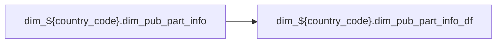

# DIM: `dim_pub_part_info_df`

- artifact_type: etl_table
- artifact_id: dim_${country_code}.dim_pub_part_info_df
- domain: part_sku
- one_line_purpose: ETL script `source/etl/sql/part_sku/public_order_scripts/public_part_dimension/script/dim_pub_part_info_df.sql` loads `dim_${country_code}.dim_pub_part_info_df` (layer `DIM`). Purpose inferred from SQL only.
- layer_type: DIM
- source_kind: etl_sql
- evidence_source: source/etl/sql/part_sku/public_order_scripts/public_part_dimension/script/dim_pub_part_info_df.sql

---

## L1 Data Foundation

### Identity and physical mapping
- **Table:** `dim_${country_code}.dim_pub_part_info_df`
- **Layer type:** DIM
- **Canonical / derived:** Derived / ETL-loaded (see L3)
- **Owner team:** Not documented in repository

### Grain, scope, exclusions
- **Grain:** Not documented in repository (see SELECT/GROUP BY in `source/etl/sql/part_sku/public_order_scripts/public_part_dimension/script/dim_pub_part_info_df.sql`)
- **Partition:** `date_flag=${date_flag}`
- **Exclusions:** See L3 Key filters

### Cross-engine presence
| Engine | Present | Canonical FQN | Notes |
|--------|---------|---------------|-------|
| Hive | yes | `dim_${country_code}.dim_pub_part_info_df` | ETL target |
| Vertica | Not documented in repository | — | Confirm via hive2vertica flow |

### Physical schema reference

Pointer block only - full column catalog lives in WKB L1 storage JSON.

| Field | Value |
|-------|-------|
| **Authoritative catalog** | WKB L1 storage seed (not duplicated in this file) |
| **entity_id** | `dim_${country_code}.dim_pub_part_info_df` |
| **l1_catalog_seed** | `target/storage/wkb/snapshots/_snapshot_id_template/l1_catalog/{engine}_{schema}_{table}.json` |
| **column_count** | pending (run ddl_seed_writer) |
| **partition_keys** | `date_flag=${date_flag}` |
| **ddl_source** | pending Bitbucket DDL / Vertica metadata ingest |
| **retrieval** | `python -m tools.wkb.indexing.run_query --query "part_sku dim_pub_part_info_df schema" --intent find_table_schema` |

### Lineage
| Object | Role |
|--------|------|
| `dim_${country_code}.dim_pub_part_info` | upstream (ETL FROM/JOIN) |
| `dim_${country_code}.dim_pub_part_info_df` | **Target** |

### Freshness and load path
| Item | Value |
|------|-------|
| Load pattern | See L3 INSERT / OVERWRITE in evidence script |
| Schedule | Not documented in repository |
| Parameters | Parsed from ETL literals / `${...}` in `source/etl/sql/part_sku/public_order_scripts/public_part_dimension/script/dim_pub_part_info_df.sql` |

## L2 Declarative Knowledge

### Business purpose
ETL script `source/etl/sql/part_sku/public_order_scripts/public_part_dimension/script/dim_pub_part_info_df.sql` loads `dim_${country_code}.dim_pub_part_info_df` (layer `DIM`). Purpose inferred from SQL only.

### Audience and use cases
| Audience | How they benefit |
|----------|-----------------|
| Data / BI consumers | Use target table produced by this ETL |
| Data Engineering | Maintain load logic in evidence script |

### Fact key resolution
- Keys follow target INSERT column list / GROUP BY in evidence SQL.

### Time field semantics
- Partition / date fields: `date_flag=${date_flag}`

### Metrics served
- See L3 column derivations for measure expressions when present.

### Metric serving map
N/A — not a multi-period wide serving table (or not documented).

### etl_metrics
No calculable business metrics registered in metric-index for this create run.

## L3 Procedural Knowledge

### Query and routing rules
- Prefer querying the target `dim_${country_code}.dim_pub_part_info_df` after successful ETL load.

### Dimension join patterns
- See Relationship map and Base tables register.

### Key filters and ETL business logic

| Predicate | Kind | Evidence |
|-----------|------|----------|
| — | — | No WHERE clause parsed from `source/etl/sql/part_sku/public_order_scripts/public_part_dimension/script/dim_pub_part_info_df.sql` |

### Standard time-filter SQL
```sql
-- See partition / date predicates in source/etl/sql/part_sku/public_order_scripts/public_part_dimension/script/dim_pub_part_info_df.sql
```

### End-to-end flow



### Base tables register

| Object | Role |
|--------|------|
| `dim_${country_code}.dim_pub_part_info` | source / temp (from ETL FROM/JOIN) |

### Step-by-step logic
1. Read sources listed in Base tables register (`source/etl/sql/part_sku/public_order_scripts/public_part_dimension/script/dim_pub_part_info_df.sql`).
2. Apply filters documented under Key filters.
3. INSERT OVERWRITE / write target `dim_${country_code}.dim_pub_part_info_df`.

### Relationship map (embedded)

| from_fqn | to_fqn | cardinality | join_keys | provenance |
|----------|--------|-------------|-----------|------------|
| — | — | — | — | Not documented in repository |

`source/ref/part_sku/table relationship.txt`: Not documented in repository.

### Special logic (embedded)

Not documented in repository

### Column / field derivations (from ETL SQL)

| target_column | expression_sql | upstream_columns | upstream_tables | transform_kind | evidence |
|---------------|----------------|------------------|-----------------|----------------|----------|
| `sku_no` | `sku_no` | `sku_no` | `dim_${country_code}.dim_pub_part_info` | passthrough | `source/etl/sql/part_sku/public_order_scripts/public_part_dimension/script/dim_pub_part_info_df.sql:3` |
| `part_no` | `part_no` | `part_no` | `dim_${country_code}.dim_pub_part_info` | passthrough | `source/etl/sql/part_sku/public_order_scripts/public_part_dimension/script/dim_pub_part_info_df.sql:4` |
| `short_desc` | `short_desc` | `short_desc` | `dim_${country_code}.dim_pub_part_info` | passthrough | `source/etl/sql/part_sku/public_order_scripts/public_part_dimension/script/dim_pub_part_info_df.sql:5` |
| `long_desc` | `long_desc` | `long_desc` | `dim_${country_code}.dim_pub_part_info` | passthrough | `source/etl/sql/part_sku/public_order_scripts/public_part_dimension/script/dim_pub_part_info_df.sql:6` |
| `abc_code` | `abc_code` | `abc_code` | `dim_${country_code}.dim_pub_part_info` | passthrough | `source/etl/sql/part_sku/public_order_scripts/public_part_dimension/script/dim_pub_part_info_df.sql:7` |
| `prod_code` | `prod_code` | `prod_code` | `dim_${country_code}.dim_pub_part_info` | passthrough | `source/etl/sql/part_sku/public_order_scripts/public_part_dimension/script/dim_pub_part_info_df.sql:8` |
| `prod_type` | `prod_type` | `prod_type` | `dim_${country_code}.dim_pub_part_info` | passthrough | `source/etl/sql/part_sku/public_order_scripts/public_part_dimension/script/dim_pub_part_info_df.sql:9` |
| `weight` | `weight` | `weight` | `dim_${country_code}.dim_pub_part_info` | passthrough | `source/etl/sql/part_sku/public_order_scripts/public_part_dimension/script/dim_pub_part_info_df.sql:10` |
| `cu_height` | `cu_height` | `cu_height` | `dim_${country_code}.dim_pub_part_info` | passthrough | `source/etl/sql/part_sku/public_order_scripts/public_part_dimension/script/dim_pub_part_info_df.sql:11` |
| `cu_width` | `cu_width` | `cu_width` | `dim_${country_code}.dim_pub_part_info` | passthrough | `source/etl/sql/part_sku/public_order_scripts/public_part_dimension/script/dim_pub_part_info_df.sql:12` |
| `cu_length` | `cu_length` | `cu_length` | `dim_${country_code}.dim_pub_part_info` | passthrough | `source/etl/sql/part_sku/public_order_scripts/public_part_dimension/script/dim_pub_part_info_df.sql:13` |
| `ser_no_flag` | `ser_no_flag` | `ser_no_flag` | `dim_${country_code}.dim_pub_part_info` | passthrough | `source/etl/sql/part_sku/public_order_scripts/public_part_dimension/script/dim_pub_part_info_df.sql:14` |
| `avail_to_sell` | `avail_to_sell` | `avail_to_sell` | `dim_${country_code}.dim_pub_part_info` | passthrough | `source/etl/sql/part_sku/public_order_scripts/public_part_dimension/script/dim_pub_part_info_df.sql:15` |
| `active_status` | `active_status` | `active_status` | `dim_${country_code}.dim_pub_part_info` | passthrough | `source/etl/sql/part_sku/public_order_scripts/public_part_dimension/script/dim_pub_part_info_df.sql:16` |
| `po_cost` | `po_cost` | `po_cost` | `dim_${country_code}.dim_pub_part_info` | passthrough | `source/etl/sql/part_sku/public_order_scripts/public_part_dimension/script/dim_pub_part_info_df.sql:17` |
| `vend_no` | `vend_no` | `vend_no` | `dim_${country_code}.dim_pub_part_info` | passthrough | `source/etl/sql/part_sku/public_order_scripts/public_part_dimension/script/dim_pub_part_info_df.sql:18` |
| `upc_code` | `upc_code` | `upc_code` | `dim_${country_code}.dim_pub_part_info` | passthrough | `source/etl/sql/part_sku/public_order_scripts/public_part_dimension/script/dim_pub_part_info_df.sql:19` |
| `sug_retail_price` | `sug_retail_price` | `sug_retail_price` | `dim_${country_code}.dim_pub_part_info` | passthrough | `source/etl/sql/part_sku/public_order_scripts/public_part_dimension/script/dim_pub_part_info_df.sql:20` |
| `mfg_partno` | `mfg_partno` | `mfg_partno` | `dim_${country_code}.dim_pub_part_info` | passthrough | `source/etl/sql/part_sku/public_order_scripts/public_part_dimension/script/dim_pub_part_info_df.sql:21` |
| `master_flag` | `master_flag` | `master_flag` | `dim_${country_code}.dim_pub_part_info` | passthrough | `source/etl/sql/part_sku/public_order_scripts/public_part_dimension/script/dim_pub_part_info_df.sql:22` |
| `model` | `model` | `model` | `dim_${country_code}.dim_pub_part_info` | passthrough | `source/etl/sql/part_sku/public_order_scripts/public_part_dimension/script/dim_pub_part_info_df.sql:23` |
| `vpl_no` | `vpl_no` | `vpl_no` | `dim_${country_code}.dim_pub_part_info` | passthrough | `source/etl/sql/part_sku/public_order_scripts/public_part_dimension/script/dim_pub_part_info_df.sql:24` |
| `usage_type` | `usage_type` | `usage_type` | `dim_${country_code}.dim_pub_part_info` | passthrough | `source/etl/sql/part_sku/public_order_scripts/public_part_dimension/script/dim_pub_part_info_df.sql:25` |
| `category_id` | `category_id` | `category_id` | `dim_${country_code}.dim_pub_part_info` | passthrough | `source/etl/sql/part_sku/public_order_scripts/public_part_dimension/script/dim_pub_part_info_df.sql:26` |
| `series_no` | `series_no` | `series_no` | `dim_${country_code}.dim_pub_part_info` | passthrough | `source/etl/sql/part_sku/public_order_scripts/public_part_dimension/script/dim_pub_part_info_df.sql:27` |
| `accept_rma` | `accept_rma` | `accept_rma` | `dim_${country_code}.dim_pub_part_info` | passthrough | `source/etl/sql/part_sku/public_order_scripts/public_part_dimension/script/dim_pub_part_info_df.sql:28` |
| `group_id` | `group_id` | `group_id` | `dim_${country_code}.dim_pub_part_info` | passthrough | `source/etl/sql/part_sku/public_order_scripts/public_part_dimension/script/dim_pub_part_info_df.sql:29` |
| `uni_group_id` | `uni_group_id` | `uni_group_id` | `dim_${country_code}.dim_pub_part_info` | passthrough | `source/etl/sql/part_sku/public_order_scripts/public_part_dimension/script/dim_pub_part_info_df.sql:30` |
| `family_id` | `family_id` | `family_id` | `dim_${country_code}.dim_pub_part_info` | passthrough | `source/etl/sql/part_sku/public_order_scripts/public_part_dimension/script/dim_pub_part_info_df.sql:31` |
| `family` | `family` | `family` | `dim_${country_code}.dim_pub_part_info` | passthrough | `source/etl/sql/part_sku/public_order_scripts/public_part_dimension/script/dim_pub_part_info_df.sql:31` |
| `cat_id` | `cat_id` | `cat_id` | `dim_${country_code}.dim_pub_part_info` | passthrough | `source/etl/sql/part_sku/public_order_scripts/public_part_dimension/script/dim_pub_part_info_df.sql:33` |
| `category` | `category` | `category` | `dim_${country_code}.dim_pub_part_info` | passthrough | `source/etl/sql/part_sku/public_order_scripts/public_part_dimension/script/dim_pub_part_info_df.sql:26` |
| `subcat_id` | `subcat_id` | `subcat_id` | `dim_${country_code}.dim_pub_part_info` | passthrough | `source/etl/sql/part_sku/public_order_scripts/public_part_dimension/script/dim_pub_part_info_df.sql:35` |
| `sub_category` | `sub_category` | `sub_category` | `dim_${country_code}.dim_pub_part_info` | passthrough | `source/etl/sql/part_sku/public_order_scripts/public_part_dimension/script/dim_pub_part_info_df.sql:36` |
| `tc_family_id` | `tc_family_id` | `tc_family_id` | `dim_${country_code}.dim_pub_part_info` | passthrough | `source/etl/sql/part_sku/public_order_scripts/public_part_dimension/script/dim_pub_part_info_df.sql:37` |
| `tc_family` | `tc_family` | `tc_family` | `dim_${country_code}.dim_pub_part_info` | passthrough | `source/etl/sql/part_sku/public_order_scripts/public_part_dimension/script/dim_pub_part_info_df.sql:37` |
| `tc_cat_id` | `tc_cat_id` | `tc_cat_id` | `dim_${country_code}.dim_pub_part_info` | passthrough | `source/etl/sql/part_sku/public_order_scripts/public_part_dimension/script/dim_pub_part_info_df.sql:39` |
| `tc_category` | `tc_category` | `tc_category` | `dim_${country_code}.dim_pub_part_info` | passthrough | `source/etl/sql/part_sku/public_order_scripts/public_part_dimension/script/dim_pub_part_info_df.sql:40` |
| `tc_subcat_id` | `tc_subcat_id` | `tc_subcat_id` | `dim_${country_code}.dim_pub_part_info` | passthrough | `source/etl/sql/part_sku/public_order_scripts/public_part_dimension/script/dim_pub_part_info_df.sql:41` |
| `tc_sub_category` | `tc_sub_category` | `tc_sub_category` | `dim_${country_code}.dim_pub_part_info` | passthrough | `source/etl/sql/part_sku/public_order_scripts/public_part_dimension/script/dim_pub_part_info_df.sql:42` |
| `vpl_code` | `vpl_code` | `vpl_code` | `dim_${country_code}.dim_pub_part_info` | passthrough | `source/etl/sql/part_sku/public_order_scripts/public_part_dimension/script/dim_pub_part_info_df.sql:43` |
| `vpl_desc` | `vpl_desc` | `vpl_desc` | `dim_${country_code}.dim_pub_part_info` | passthrough | `source/etl/sql/part_sku/public_order_scripts/public_part_dimension/script/dim_pub_part_info_df.sql:44` |
| `vend_name` | `vend_name` | `vend_name` | `dim_${country_code}.dim_pub_part_info` | passthrough | `source/etl/sql/part_sku/public_order_scripts/public_part_dimension/script/dim_pub_part_info_df.sql:45` |
| `vend_currency` | `vend_currency` | `vend_currency` | `dim_${country_code}.dim_pub_part_info` | passthrough | `source/etl/sql/part_sku/public_order_scripts/public_part_dimension/script/dim_pub_part_info_df.sql:46` |
| `vend_segment` | `vend_segment` | `vend_segment` | `dim_${country_code}.dim_pub_part_info` | passthrough | `source/etl/sql/part_sku/public_order_scripts/public_part_dimension/script/dim_pub_part_info_df.sql:47` |
| `alt_vpl_no` | `alt_vpl_no` | `alt_vpl_no` | `dim_${country_code}.dim_pub_part_info` | passthrough | `source/etl/sql/part_sku/public_order_scripts/public_part_dimension/script/dim_pub_part_info_df.sql:48` |
| `alt_vpl_code` | `alt_vpl_code` | `alt_vpl_code` | `dim_${country_code}.dim_pub_part_info` | passthrough | `source/etl/sql/part_sku/public_order_scripts/public_part_dimension/script/dim_pub_part_info_df.sql:49` |
| `alt_vpl_desc` | `alt_vpl_desc` | `alt_vpl_desc` | `dim_${country_code}.dim_pub_part_info` | passthrough | `source/etl/sql/part_sku/public_order_scripts/public_part_dimension/script/dim_pub_part_info_df.sql:50` |
| `universal_vend_no` | `universal_vend_no` | `universal_vend_no` | `dim_${country_code}.dim_pub_part_info` | passthrough | `source/etl/sql/part_sku/public_order_scripts/public_part_dimension/script/dim_pub_part_info_df.sql:51` |
| `universal_vend_name` | `universal_vend_name` | `universal_vend_name` | `dim_${country_code}.dim_pub_part_info` | passthrough | `source/etl/sql/part_sku/public_order_scripts/public_part_dimension/script/dim_pub_part_info_df.sql:52` |
| `pur_end_date` | `pur_end_date` | `pur_end_date` | `dim_${country_code}.dim_pub_part_info` | passthrough | `source/etl/sql/part_sku/public_order_scripts/public_part_dimension/script/dim_pub_part_info_df.sql:53` |
| `catalog_desc` | `catalog_desc` | `catalog_desc` | `dim_${country_code}.dim_pub_part_info` | passthrough | `source/etl/sql/part_sku/public_order_scripts/public_part_dimension/script/dim_pub_part_info_df.sql:54` |
| `ave_cost` | `ave_cost` | `ave_cost` | `dim_${country_code}.dim_pub_part_info` | passthrough | `source/etl/sql/part_sku/public_order_scripts/public_part_dimension/script/dim_pub_part_info_df.sql:55` |
| `std_cost` | `std_cost` | `std_cost` | `dim_${country_code}.dim_pub_part_info` | passthrough | `source/etl/sql/part_sku/public_order_scripts/public_part_dimension/script/dim_pub_part_info_df.sql:56` |
| `cost_meth` | `cost_meth` | `cost_meth` | `dim_${country_code}.dim_pub_part_info` | passthrough | `source/etl/sql/part_sku/public_order_scripts/public_part_dimension/script/dim_pub_part_info_df.sql:57` |
| `entry_datetime` | `entry_datetime` | `entry_datetime` | `dim_${country_code}.dim_pub_part_info` | passthrough | `source/etl/sql/part_sku/public_order_scripts/public_part_dimension/script/dim_pub_part_info_df.sql:58` |
| `entry_id` | `entry_id` | `entry_id` | `dim_${country_code}.dim_pub_part_info` | passthrough | `source/etl/sql/part_sku/public_order_scripts/public_part_dimension/script/dim_pub_part_info_df.sql:59` |
| `entry_name` | `entry_name` | `entry_name` | `dim_${country_code}.dim_pub_part_info` | passthrough | `source/etl/sql/part_sku/public_order_scripts/public_part_dimension/script/dim_pub_part_info_df.sql:60` |
| `production_flag` | `production_flag` | `production_flag` | `dim_${country_code}.dim_pub_part_info` | passthrough | `source/etl/sql/part_sku/public_order_scripts/public_part_dimension/script/dim_pub_part_info_df.sql:61` |
| `pur_comment` | `pur_comment` | `pur_comment` | `dim_${country_code}.dim_pub_part_info` | passthrough | `source/etl/sql/part_sku/public_order_scripts/public_part_dimension/script/dim_pub_part_info_df.sql:62` |
| `mar_comment` | `mar_comment` | `mar_comment` | `dim_${country_code}.dim_pub_part_info` | passthrough | `source/etl/sql/part_sku/public_order_scripts/public_part_dimension/script/dim_pub_part_info_df.sql:63` |
| `mar_end_date` | `mar_end_date` | `mar_end_date` | `dim_${country_code}.dim_pub_part_info` | passthrough | `source/etl/sql/part_sku/public_order_scripts/public_part_dimension/script/dim_pub_part_info_df.sql:64` |
| `shortage` | `shortage` | `shortage` | `dim_${country_code}.dim_pub_part_info` | passthrough | `source/etl/sql/part_sku/public_order_scripts/public_part_dimension/script/dim_pub_part_info_df.sql:65` |
| `fixed_price` | `fixed_price` | `fixed_price` | `dim_${country_code}.dim_pub_part_info` | passthrough | `source/etl/sql/part_sku/public_order_scripts/public_part_dimension/script/dim_pub_part_info_df.sql:66` |
| `reorder_level` | `reorder_level` | `reorder_level` | `dim_${country_code}.dim_pub_part_info` | passthrough | `source/etl/sql/part_sku/public_order_scripts/public_part_dimension/script/dim_pub_part_info_df.sql:67` |
| `reorder_qty` | `reorder_qty` | `reorder_qty` | `dim_${country_code}.dim_pub_part_info` | passthrough | `source/etl/sql/part_sku/public_order_scripts/public_part_dimension/script/dim_pub_part_info_df.sql:68` |
| `package_qty` | `package_qty` | `package_qty` | `dim_${country_code}.dim_pub_part_info` | passthrough | `source/etl/sql/part_sku/public_order_scripts/public_part_dimension/script/dim_pub_part_info_df.sql:69` |
| `wgt_chk_date` | `wgt_chk_date` | `wgt_chk_date` | `dim_${country_code}.dim_pub_part_info` | passthrough | `source/etl/sql/part_sku/public_order_scripts/public_part_dimension/script/dim_pub_part_info_df.sql:70` |
| `mrp_date` | `mrp_date` | `mrp_date` | `dim_${country_code}.dim_pub_part_info` | passthrough | `source/etl/sql/part_sku/public_order_scripts/public_part_dimension/script/dim_pub_part_info_df.sql:71` |
| `security` | `security` | `security` | `dim_${country_code}.dim_pub_part_info` | passthrough | `source/etl/sql/part_sku/public_order_scripts/public_part_dimension/script/dim_pub_part_info_df.sql:72` |
| `wms_profile` | `wms_profile` | `wms_profile` | `dim_${country_code}.dim_pub_part_info` | passthrough | `source/etl/sql/part_sku/public_order_scripts/public_part_dimension/script/dim_pub_part_info_df.sql:73` |
| `lifecycle_status` | `lifecycle_status` | `lifecycle_status` | `dim_${country_code}.dim_pub_part_info` | passthrough | `source/etl/sql/part_sku/public_order_scripts/public_part_dimension/script/dim_pub_part_info_df.sql:74` |
| `source_status` | `source_status` | `source_status` | `dim_${country_code}.dim_pub_part_info` | passthrough | `source/etl/sql/part_sku/public_order_scripts/public_part_dimension/script/dim_pub_part_info_df.sql:75` |
| `mult` | `mult` | `mult` | `dim_${country_code}.dim_pub_part_info` | passthrough | `source/etl/sql/part_sku/public_order_scripts/public_part_dimension/script/dim_pub_part_info_df.sql:76` |
| `min_poqty` | `min_poqty` | `min_poqty` | `dim_${country_code}.dim_pub_part_info` | passthrough | `source/etl/sql/part_sku/public_order_scripts/public_part_dimension/script/dim_pub_part_info_df.sql:77` |
| `active_status_date` | `active_status_date` | `active_status_date` | `dim_${country_code}.dim_pub_part_info` | passthrough | `source/etl/sql/part_sku/public_order_scripts/public_part_dimension/script/dim_pub_part_info_df.sql:78` |
| `last_pur_date` | `last_pur_date` | `last_pur_date` | `dim_${country_code}.dim_pub_part_info` | passthrough | `source/etl/sql/part_sku/public_order_scripts/public_part_dimension/script/dim_pub_part_info_df.sql:79` |
| `prod_lifecycle_code` | `prod_lifecycle_code` | `prod_lifecycle_code` | `dim_${country_code}.dim_pub_part_info` | passthrough | `source/etl/sql/part_sku/public_order_scripts/public_part_dimension/script/dim_pub_part_info_df.sql:80` |
| `bundle_kit` | `bundle_kit` | `bundle_kit` | `dim_${country_code}.dim_pub_part_info` | passthrough | `source/etl/sql/part_sku/public_order_scripts/public_part_dimension/script/dim_pub_part_info_df.sql:81` |
| `vend_seg_code` | `vend_seg_code` | `vend_seg_code` | `dim_${country_code}.dim_pub_part_info` | passthrough | `source/etl/sql/part_sku/public_order_scripts/public_part_dimension/script/dim_pub_part_info_df.sql:82` |
| `ec_family_id` | `ec_family_id` | `ec_family_id` | `dim_${country_code}.dim_pub_part_info` | passthrough | `source/etl/sql/part_sku/public_order_scripts/public_part_dimension/script/dim_pub_part_info_df.sql:83` |
| `ec_family` | `ec_family` | `ec_family` | `dim_${country_code}.dim_pub_part_info` | passthrough | `source/etl/sql/part_sku/public_order_scripts/public_part_dimension/script/dim_pub_part_info_df.sql:83` |
| `ec_cat_id` | `ec_cat_id` | `ec_cat_id` | `dim_${country_code}.dim_pub_part_info` | passthrough | `source/etl/sql/part_sku/public_order_scripts/public_part_dimension/script/dim_pub_part_info_df.sql:85` |
| `ec_category` | `ec_category` | `ec_category` | `dim_${country_code}.dim_pub_part_info` | passthrough | `source/etl/sql/part_sku/public_order_scripts/public_part_dimension/script/dim_pub_part_info_df.sql:86` |
| `ec_subcat_id` | `ec_subcat_id` | `ec_subcat_id` | `dim_${country_code}.dim_pub_part_info` | passthrough | `source/etl/sql/part_sku/public_order_scripts/public_part_dimension/script/dim_pub_part_info_df.sql:87` |
| `ec_sub_category` | `ec_sub_category` | `ec_sub_category` | `dim_${country_code}.dim_pub_part_info` | passthrough | `source/etl/sql/part_sku/public_order_scripts/public_part_dimension/script/dim_pub_part_info_df.sql:88` |
| `brpt_family_id` | `brpt_family_id` | `brpt_family_id` | `dim_${country_code}.dim_pub_part_info` | passthrough | `source/etl/sql/part_sku/public_order_scripts/public_part_dimension/script/dim_pub_part_info_df.sql:89` |
| `brpt_family` | `brpt_family` | `brpt_family` | `dim_${country_code}.dim_pub_part_info` | passthrough | `source/etl/sql/part_sku/public_order_scripts/public_part_dimension/script/dim_pub_part_info_df.sql:89` |
| `brpt_cat_id` | `brpt_cat_id` | `brpt_cat_id` | `dim_${country_code}.dim_pub_part_info` | passthrough | `source/etl/sql/part_sku/public_order_scripts/public_part_dimension/script/dim_pub_part_info_df.sql:91` |
| `brpt_category` | `brpt_category` | `brpt_category` | `dim_${country_code}.dim_pub_part_info` | passthrough | `source/etl/sql/part_sku/public_order_scripts/public_part_dimension/script/dim_pub_part_info_df.sql:92` |
| `brpt_subcat_id` | `brpt_subcat_id` | `brpt_subcat_id` | `dim_${country_code}.dim_pub_part_info` | passthrough | `source/etl/sql/part_sku/public_order_scripts/public_part_dimension/script/dim_pub_part_info_df.sql:93` |
| `brpt_sub_category` | `brpt_sub_category` | `brpt_sub_category` | `dim_${country_code}.dim_pub_part_info` | passthrough | `source/etl/sql/part_sku/public_order_scripts/public_part_dimension/script/dim_pub_part_info_df.sql:94` |
| `global_cat_type` | `global_cat_type` | `global_cat_type` | `dim_${country_code}.dim_pub_part_info` | passthrough | `source/etl/sql/part_sku/public_order_scripts/public_part_dimension/script/dim_pub_part_info_df.sql:95` |
| `categorizer` | `categorizer` | `categorizer` | `dim_${country_code}.dim_pub_part_info` | passthrough | `source/etl/sql/part_sku/public_order_scripts/public_part_dimension/script/dim_pub_part_info_df.sql:96` |
| `categorized_time` | `categorized_time` | `categorized_time` | `dim_${country_code}.dim_pub_part_info` | passthrough | `source/etl/sql/part_sku/public_order_scripts/public_part_dimension/script/dim_pub_part_info_df.sql:97` |
| `modifier` | `modifier` | `modifier` | `dim_${country_code}.dim_pub_part_info` | passthrough | `source/etl/sql/part_sku/public_order_scripts/public_part_dimension/script/dim_pub_part_info_df.sql:98` |
| `last_modify_date` | `last_modify_date` | `last_modify_date` | `dim_${country_code}.dim_pub_part_info` | passthrough | `source/etl/sql/part_sku/public_order_scripts/public_part_dimension/script/dim_pub_part_info_df.sql:99` |
| `asc606` | `asc606` | `asc606` | `dim_${country_code}.dim_pub_part_info` | passthrough | `source/etl/sql/part_sku/public_order_scripts/public_part_dimension/script/dim_pub_part_info_df.sql:100` |
| `renewal_flag` | `renewal_flag` | `renewal_flag` | `dim_${country_code}.dim_pub_part_info` | passthrough | `source/etl/sql/part_sku/public_order_scripts/public_part_dimension/script/dim_pub_part_info_df.sql:101` |
| `image_count` | `image_count` | `image_count` | `dim_${country_code}.dim_pub_part_info` | passthrough | `source/etl/sql/part_sku/public_order_scripts/public_part_dimension/script/dim_pub_part_info_df.sql:102` |
| `image_upload_date` | `image_upload_date` | `image_upload_date` | `dim_${country_code}.dim_pub_part_info` | passthrough | `source/etl/sql/part_sku/public_order_scripts/public_part_dimension/script/dim_pub_part_info_df.sql:103` |
| `fill_count` | `fill_count` | `fill_count` | `dim_${country_code}.dim_pub_part_info` | passthrough | `source/etl/sql/part_sku/public_order_scripts/public_part_dimension/script/dim_pub_part_info_df.sql:104` |
| `multiimage` | `multiimage` | `multiimage` | `dim_${country_code}.dim_pub_part_info` | passthrough | `source/etl/sql/part_sku/public_order_scripts/public_part_dimension/script/dim_pub_part_info_df.sql:105` |
| `msrp_flag` | `msrp_flag` | `msrp_flag` | `dim_${country_code}.dim_pub_part_info` | passthrough | `source/etl/sql/part_sku/public_order_scripts/public_part_dimension/script/dim_pub_part_info_df.sql:106` |
| `sku_map` | `sku_map` | `sku_map` | `dim_${country_code}.dim_pub_part_info` | passthrough | `source/etl/sql/part_sku/public_order_scripts/public_part_dimension/script/dim_pub_part_info_df.sql:107` |
| `coo` | `coo` | `coo` | `dim_${country_code}.dim_pub_part_info` | passthrough | `source/etl/sql/part_sku/public_order_scripts/public_part_dimension/script/dim_pub_part_info_df.sql:108` |
| `tc_mkt_overview` | `tc_mkt_overview` | `tc_mkt_overview` | `dim_${country_code}.dim_pub_part_info` | passthrough | `source/etl/sql/part_sku/public_order_scripts/public_part_dimension/script/dim_pub_part_info_df.sql:109` |
| `ec_flag` | `ec_flag` | `ec_flag` | `dim_${country_code}.dim_pub_part_info` | passthrough | `source/etl/sql/part_sku/public_order_scripts/public_part_dimension/script/dim_pub_part_info_df.sql:110` |
| `accessory_cnt` | `accessory_cnt` | `accessory_cnt` | `dim_${country_code}.dim_pub_part_info` | passthrough | `source/etl/sql/part_sku/public_order_scripts/public_part_dimension/script/dim_pub_part_info_df.sql:111` |
| `qc_status` | `qc_status` | `qc_status` | `dim_${country_code}.dim_pub_part_info` | passthrough | `source/etl/sql/part_sku/public_order_scripts/public_part_dimension/script/dim_pub_part_info_df.sql:112` |
| `qc_flag` | `qc_flag` | `qc_flag` | `dim_${country_code}.dim_pub_part_info` | passthrough | `source/etl/sql/part_sku/public_order_scripts/public_part_dimension/script/dim_pub_part_info_df.sql:113` |
| `upc_flag` | `upc_flag` | `upc_flag` | `dim_${country_code}.dim_pub_part_info` | passthrough | `source/etl/sql/part_sku/public_order_scripts/public_part_dimension/script/dim_pub_part_info_df.sql:114` |
| `part_cust_no` | `part_cust_no` | `part_cust_no` | `dim_${country_code}.dim_pub_part_info` | passthrough | `source/etl/sql/part_sku/public_order_scripts/public_part_dimension/script/dim_pub_part_info_df.sql:115` |
| `hwsw_comb` | `hwsw_comb` | `hwsw_comb` | `dim_${country_code}.dim_pub_part_info` | passthrough | `source/etl/sql/part_sku/public_order_scripts/public_part_dimension/script/dim_pub_part_info_df.sql:116` |
| `etl_timestamp` | `from_utc_timestamp(current_timestamp(), 'America/Los_Angeles')` | `from_utc_timestamp`, `current_timestamp`, `America`, `Los_Angeles` | `dim_${country_code}.dim_pub_part_info` | arithmetic | `source/etl/sql/part_sku/public_order_scripts/public_part_dimension/script/dim_pub_part_info_df.sql:117` |
| `vend_consign_flag` | `vend_consign_flag` | `vend_consign_flag` | `dim_${country_code}.dim_pub_part_info` | passthrough | `source/etl/sql/part_sku/public_order_scripts/public_part_dimension/script/dim_pub_part_info_df.sql:118` |
| `part_consign_flag` | `part_consign_flag` | `part_consign_flag` | `dim_${country_code}.dim_pub_part_info` | passthrough | `source/etl/sql/part_sku/public_order_scripts/public_part_dimension/script/dim_pub_part_info_df.sql:119` |
| `vend_part_no` | `vend_part_no` | `vend_part_no` | `dim_${country_code}.dim_pub_part_info` | passthrough | `source/etl/sql/part_sku/public_order_scripts/public_part_dimension/script/dim_pub_part_info_df.sql:120` |
| `global_family_desc` | `global_family_desc` | `global_family_desc` | `dim_${country_code}.dim_pub_part_info` | passthrough | `source/etl/sql/part_sku/public_order_scripts/public_part_dimension/script/dim_pub_part_info_df.sql:121` |
| `global_cat_desc` | `global_cat_desc` | `global_cat_desc` | `dim_${country_code}.dim_pub_part_info` | passthrough | `source/etl/sql/part_sku/public_order_scripts/public_part_dimension/script/dim_pub_part_info_df.sql:122` |
| `global_sub_desc` | `global_sub_desc` | `global_sub_desc` | `dim_${country_code}.dim_pub_part_info` | passthrough | `source/etl/sql/part_sku/public_order_scripts/public_part_dimension/script/dim_pub_part_info_df.sql:123` |
| `pcode` | `pcode` | `pcode` | `dim_${country_code}.dim_pub_part_info` | passthrough | `source/etl/sql/part_sku/public_order_scripts/public_part_dimension/script/dim_pub_part_info_df.sql:124` |
| `pcode_desc` | `pcode_desc` | `pcode_desc` | `dim_${country_code}.dim_pub_part_info` | passthrough | `source/etl/sql/part_sku/public_order_scripts/public_part_dimension/script/dim_pub_part_info_df.sql:125` |
| `series_desc` | `series_desc` | `series_desc` | `dim_${country_code}.dim_pub_part_info` | passthrough | `source/etl/sql/part_sku/public_order_scripts/public_part_dimension/script/dim_pub_part_info_df.sql:126` |
| `std_whls_price` | `std_whls_price` | `std_whls_price` | `dim_${country_code}.dim_pub_part_info` | passthrough | `source/etl/sql/part_sku/public_order_scripts/public_part_dimension/script/dim_pub_part_info_df.sql:127` |
| `jv_business` | `jv_business` | `jv_business` | `dim_${country_code}.dim_pub_part_info` | passthrough | `source/etl/sql/part_sku/public_order_scripts/public_part_dimension/script/dim_pub_part_info_df.sql:128` |
| `data_source` | `data_source` | `data_source` | `dim_${country_code}.dim_pub_part_info` | passthrough | `source/etl/sql/part_sku/public_order_scripts/public_part_dimension/script/dim_pub_part_info_df.sql:129` |
| `uni_sku_no` | `uni_sku_no` | `uni_sku_no` | `dim_${country_code}.dim_pub_part_info` | passthrough | `source/etl/sql/part_sku/public_order_scripts/public_part_dimension/script/dim_pub_part_info_df.sql:130` |
| `dg_code` | `dg_code` | `dg_code` | `dim_${country_code}.dim_pub_part_info` | passthrough | `source/etl/sql/part_sku/public_order_scripts/public_part_dimension/script/dim_pub_part_info_df.sql:131` |
| `tc_fill_count` | `tc_fill_count` | `tc_fill_count` | `dim_${country_code}.dim_pub_part_info` | passthrough | `source/etl/sql/part_sku/public_order_scripts/public_part_dimension/script/dim_pub_part_info_df.sql:132` |
| `company_no` | `company_no` | `company_no` | `dim_${country_code}.dim_pub_part_info` | passthrough | `source/etl/sql/part_sku/public_order_scripts/public_part_dimension/script/dim_pub_part_info_df.sql:133` |
| `first_image_name` | `first_image_name` | `first_image_name` | `dim_${country_code}.dim_pub_part_info` | passthrough | `source/etl/sql/part_sku/public_order_scripts/public_part_dimension/script/dim_pub_part_info_df.sql:134` |
| `global_load_date` | `global_load_date` | `global_load_date` | `dim_${country_code}.dim_pub_part_info` | passthrough | `source/etl/sql/part_sku/public_order_scripts/public_part_dimension/script/dim_pub_part_info_df.sql:135` |
| `fx_flag` | `fx_flag` | `fx_flag` | `dim_${country_code}.dim_pub_part_info` | passthrough | `source/etl/sql/part_sku/public_order_scripts/public_part_dimension/script/dim_pub_part_info_df.sql:136` |
| `forecast_cat` | `forecast_cat` | `forecast_cat` | `dim_${country_code}.dim_pub_part_info` | passthrough | `source/etl/sql/part_sku/public_order_scripts/public_part_dimension/script/dim_pub_part_info_df.sql:137` |
| `pp_code` | `pp_code` | `pp_code` | `dim_${country_code}.dim_pub_part_info` | passthrough | `source/etl/sql/part_sku/public_order_scripts/public_part_dimension/script/dim_pub_part_info_df.sql:138` |
| `pp_data_no` | `pp_data_no` | `pp_data_no` | `dim_${country_code}.dim_pub_part_info` | passthrough | `source/etl/sql/part_sku/public_order_scripts/public_part_dimension/script/dim_pub_part_info_df.sql:139` |
| `arr_flag` | `arr_flag` | `arr_flag` | `dim_${country_code}.dim_pub_part_info` | passthrough | `source/etl/sql/part_sku/public_order_scripts/public_part_dimension/script/dim_pub_part_info_df.sql:140` |
| `arr_entry_ID` | `arr_entry_ID` | `arr_entry_ID` | `dim_${country_code}.dim_pub_part_info` | passthrough | `source/etl/sql/part_sku/public_order_scripts/public_part_dimension/script/dim_pub_part_info_df.sql:141` |
| `xaas_flag` | `xaas_flag` | `xaas_flag` | `dim_${country_code}.dim_pub_part_info` | passthrough | `source/etl/sql/part_sku/public_order_scripts/public_part_dimension/script/dim_pub_part_info_df.sql:142` |
| `xaas_entry_ID` | `xaas_entry_ID` | `xaas_entry_ID` | `dim_${country_code}.dim_pub_part_info` | passthrough | `source/etl/sql/part_sku/public_order_scripts/public_part_dimension/script/dim_pub_part_info_df.sql:143` |
| `iqc_req` | `iqc_req` | `iqc_req` | `dim_${country_code}.dim_pub_part_info` | passthrough | `source/etl/sql/part_sku/public_order_scripts/public_part_dimension/script/dim_pub_part_info_df.sql:144` |
| `comb_vend_no` | `comb_vend_no` | `comb_vend_no` | `dim_${country_code}.dim_pub_part_info` | passthrough | `source/etl/sql/part_sku/public_order_scripts/public_part_dimension/script/dim_pub_part_info_df.sql:145` |
| `alt_vend_no` | `alt_vend_no` | `alt_vend_no` | `dim_${country_code}.dim_pub_part_info` | passthrough | `source/etl/sql/part_sku/public_order_scripts/public_part_dimension/script/dim_pub_part_info_df.sql:146` |
| `item_type` | `item_type` | `item_type` | `dim_${country_code}.dim_pub_part_info` | passthrough | `source/etl/sql/part_sku/public_order_scripts/public_part_dimension/script/dim_pub_part_info_df.sql:147` |
| `item_type_desc` | `item_type_desc` | `item_type_desc` | `dim_${country_code}.dim_pub_part_info` | passthrough | `source/etl/sql/part_sku/public_order_scripts/public_part_dimension/script/dim_pub_part_info_df.sql:148` |
| `asset_tag` | `asset_tag` | `asset_tag` | `dim_${country_code}.dim_pub_part_info` | passthrough | `source/etl/sql/part_sku/public_order_scripts/public_part_dimension/script/dim_pub_part_info_df.sql:149` |

### Sentinel and code values
Not documented in repository beyond CASE/exp_code predicates in ETL SQL.

## L4 Validation

### Resolved partition value
- Partition expression from ETL: `date_flag=${date_flag}`
- Runtime values: Not documented in repository (resolve via Azkaban params when flow evidence exists).

### Data quality checks
Not documented in repository

### Validation SQL
N/A — Vertica MCP not executed during documentation (Vertica no-run policy).

### Caveats for interpretation
- Generated from ETL SQL evidence only; business definitions may need `source/ref` enrichment.

### Conflicts and open questions
None identified in repository

## L5 Runtime View

### Query path and engine preference
| Path | Engine | Evidence |
|------|--------|----------|
| ETL load | Hive/Spark | `source/etl/sql/part_sku/public_order_scripts/public_part_dimension/script/dim_pub_part_info_df.sql` |
| Serving | Vertica (when synced) | Not documented in repository |

### Access constraints
Not documented in repository

### Query risk profile
- Scan risk depends on partition pruning; always filter partition keys when present.

## L6 Access and Consumption

### Primary consumers and use cases
Not documented in repository

### Representative query patterns
Not documented in repository

### Dependencies and notes

#### Upstream objects (verified)
| Object | Usage | Evidence |
|--------|-------|----------|
| `dim_${country_code}.dim_pub_part_info` | FROM/JOIN | `source/etl/sql/part_sku/public_order_scripts/public_part_dimension/script/dim_pub_part_info_df.sql` |

#### Downstream consumers (verified)
| Object / script | Evidence |
|-----------------|----------|
| Not documented in repository | — |

#### Operational detail (verified)
- Partition clause: `date_flag=${date_flag}`

#### Not documented in repository
- Schedule, owner, SLA
