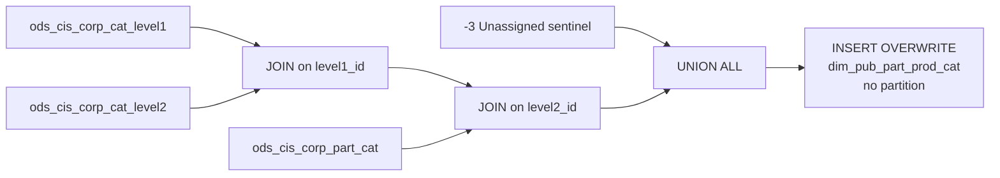

# DIM: Product Category Hierarchy (`dim_pub_part_prod_cat`)

- artifact_type: etl_table
- artifact_id: dim_us.dim_pub_part_prod_cat
- domain: part_sku
- one_line_purpose: This job builds the **BRPT-aligned product category hierarchy dimension**, mapping product groups to a three-level category structure (S1/family → Level 1 → Level 2) used in profitability and inventory reporting. It provides human-readable ...
- layer_type: DIM
- source_kind: etl_sql
- evidence_source: source/etl/sql/part_sku/source/etl/flows/public_order_tools/ingest/public_part_dimension/script/dim_pub_part_prod_cat.sql

---

## L1 Data Foundation

### Identity and physical mapping
- **Table:** `dim_us.dim_pub_part_prod_cat`
- **Layer type:** DIM
- **Canonical / derived:** Derived / ETL-loaded (see L3)
- **Owner team:** not registered in metadata catalog

### Grain, scope, exclusions
- **Grain:** one row per `group_id` — a unique product group with its full three-level category path.
- **Scope:** See L2 business purpose / L3 filters
- **Partition:** none — full overwrite on each run. - resolved from pipeline (see L4)
- **Natural key:** `group_id`.
- **Exclusions:** Not documented in repository

#### Grain detail (preserved)

- **Grain:** one row per `group_id` — a unique product group with its full three-level category path.
- **Partition:** none — full overwrite on each run.
- **Natural key:** `group_id`.
- **Note:** Includes a sentinel row for `group_id = -3` (Unassigned).

---

### Cross-engine presence
| Engine | Present | Canonical FQN | Notes |
|--------|---------|---------------|-------|
| Hive | yes | `dim_pub_part_prod_cat` | ETL target / intermediate per evidence script |
| Vertica | pending | `dim_pub_part_prod_cat` | Confirm via hive2vertica flow evidence / MCP |

### Physical schema reference

Pointer block only - full column catalog lives in WKB L1 storage JSON.

| Field | Value |
|-------|-------|
| **Authoritative catalog** | WKB L1 storage seed (not duplicated in this file) |
| **entity_id** | `dim_us.dim_pub_part_prod_cat` |
| **l1_catalog_seed** | `target/storage/wkb/snapshots/_snapshot_id_template/l1_catalog/{engine}_{schema}_{table}.json` |
| **column_count** | pending (run ddl_seed_writer) |
| **partition_keys** | `none — full overwrite on each run.` |
| **ddl_source** | pending Bitbucket DDL / Vertica metadata ingest |
| **retrieval** | `python -m tools.wkb.indexing.run_query --query "part_sku dim_pub_part_prod_cat schema" --intent find_table_schema` |

### Lineage
| Object | Role |
|--------|------|
| `ods_${country_code}.ods_cis_corp_cat_level1` | Level-1 category descriptions and sequences |
| `ods_${country_code}.ods_cis_corp_cat_level2` | Level-2 sub-category descriptions, sequences, and S1/family codes |
| `ods_${country_code}.ods_cis_corp_part_cat` | Product group to level-2 category mapping |
| `dim_${country_code}.dim_pub_part_prod_cat` | **Target** — product category hierarchy dimension |

---

### Freshness and load path
| Item | Value |
|------|-------|
| Load pattern | See L3 end-to-end / INSERT pattern in evidence script |
| Schedule | Not documented in repository |
| Parameters | `country_code` |


---

## L2 Declarative Knowledge

### Business purpose
This job builds the **BRPT-aligned product category hierarchy dimension**, mapping product groups to a three-level category structure (S1/family → Level 1 → Level 2) used in profitability and inventory reporting. It provides human-readable descriptions and sort sequences for each level, plus a sentinel `-3` row for unassigned categories. Downstream tables — including `dim_pub_part_info` — join to this dimension for the `brpt_family`, `brpt_category`, and `brpt_sub_category` fields.

---

### Audience and use cases
| Audience | How they benefit |
|----------|-----------------|
| **Finance / BRPT reporting** | `brpt_family`, `brpt_category`, `brpt_sub_category` fields in BRPT P&L reporting are resolved from this dimension. |
| **Product management** | Three-level product hierarchy with sort sequences for navigation and filtering in product reports. |
| **ETL pipelines** | `dim_pub_part_info` joins this dimension on `group_id` to populate the `brpt_*` category fields. |

---

### Identifier search profile
- Primary lookup keys: see natural key under L1 Grain.
- Use latest snapshot / active flags when documented in L3 filters.

### Time field semantics
- **date_flag / partition columns:** none — full overwrite on each run.
- Primary reporting filter should use the partition column(s) documented in L1; resolve values via L4.


### Metrics served

| Category | Column | Logical metric | Business reading |
|----------|--------|----------------|------------------|
| Measures | — | — | No measure columns mapped for this table. |

### Metric serving map

**Formula authority:** [`source/contracts/part_sku/metric-index.md`](../../source/contracts/part_sku/metric-index.md)

N/A — no measure columns mapped for this table.

### etl_metrics

No governed logical metrics from `source/contracts/part_sku/metric-index.md` are mapped on this table.

---

### Metric serving map
N/A - not a `*_comb_mtd` / multi-period wide serving table (or map not present in legacy doc).


### Data products and column groups (preserved)

### Category hierarchy

| Column | Level | Description |
|--------|-------|-------------|
| `group_id` | — | Product group identifier (joins to `ods_cis_corp_part_cat`) |
| `s1_id` | L0 / Family | S1 / family code (= `level2.s1_id`) |
| `s1_seq` | L0 | Sort sequence for the family |
| `level1_id` | L1 | Level-1 category ID |
| `level1_desc` | L1 | Level-1 category description (= `brpt_category` in `dim_pub_part_info`) |
| `level1_seq` | L1 | Sort sequence for level-1 |
| `level2_id` | L2 | Level-2 sub-category ID |
| `level2_desc` | L2 | Level-2 sub-category description (= `brpt_sub_category` in `dim_pub_part_info`) |
| `level2_seq` | L2 | Sort sequence for level-2 |

---

### etl_metrics

#### `s1_id`
- **Source:** [metric-index.md](../../source/contracts/part_sku/metric-index.md#s1_id)
- **Business definition:** S1 / family code (= `level2.s1_id`)
```sql
L0 / Family
```


---

## L3 Procedural Knowledge

### Query and routing rules
**Business filters:** Use partition / date keys from L1 grain for reporting scope.
**Technical predicates (load only):** See Key filters and step-by-step logic below.

### Dimension join patterns
| Dimension FQN | Join keys | Purpose | Evidence |
|---------------|-----------|---------|----------|
| See step-by-step / base tables | See L3 steps | Dimension enrichment | `source/etl/sql/part_sku/source/etl/flows/public_order_tools/ingest/public_part_dimension/script/dim_pub_part_prod_cat.sql` |

### Key filters and ETL business logic
### Step 1 — Final `INSERT OVERWRITE`

**Part 1 — Sentinel row:** Fixed values `(-3, 'Unassigned', 9999, -3, NULL, 9999, -3, null, 9999)` — provides a catch-all for unassigned product groups.

**Part 2 — Category hierarchy:**

| Join | Keys | Purpose |
|------|------|---------|
| `ods_cis_corp_cat_level1` (`level1`) INNER JOIN `ods_cis_corp_cat_level2` (`level2`) | `level2.level1_id = level1.level1_id` | Links level-1 and level-2 category descriptions. |
| `ods_cis_corp_cat_level2` INNER JOIN `ods_cis_corp_part_cat` (`cat`) | `cat.level2_id = level2.level2_id` | Resolves which `group_id` belongs to which level-2 category. |

**Output columns from UNION part 2:** `cat.group_id`, `level2.s1_id` (→ `brpt_family` in dim_pub_part_info), `level2.s1_seq`, `level2.level1_id`, `level1.level1_desc` (→ `brpt_category`), `level1.sequence` as `level1_seq`, `level2.level2_id`, `level2.level2_desc` (→ `brpt_sub_category`), `level2.sequence` as `level2_seq`.

---

### Standard time-filter SQL
```sql
-- relative period filter using resolved partition value (see L4)
SELECT *
FROM dim_pub_part_prod_cat
WHERE /* partition predicate */ date_flag = '${partition_value}';
```

### End-to-end flow
**Runtime parameters:** `country_code`
**Target table:** `dim_${country_code}.dim_pub_part_prod_cat` — **full overwrite, no partitioning**.

1. UNION ALL: sentinel row `(-3, 'Unassigned', 9999, -3, NULL, 9999, -3, null, 9999)`.
2. JOIN `ods_cis_corp_cat_level1` → `ods_cis_corp_cat_level2` (on `level1_id`) → `ods_cis_corp_part_cat` (on `level2_id`) to build product group → category path rows.
3. **INSERT OVERWRITE** into target.



---


#### High-level stages (preserved)

| Stage | Business meaning |
|-------|-----------------|
| **Sentinel row** | Inserts a fixed `group_id = -3` placeholder row with label `'Unassigned'` and sequence `9999` — acts as the default category for SKUs with no valid category assignment. |
| **Category hierarchy join** | Joins `ods_cis_corp_cat_level1` → `ods_cis_corp_cat_level2` → `ods_cis_corp_part_cat` to produce a row per `(group_id, level1, level2)` combination with all descriptions and sequences. |
| **Full overwrite** | Replaces the entire target table on each run. |

**Parameters:** `country_code`

---


### Base tables register
| Object | Role in this job |
|--------|-----------------|
| `ods_${country_code}.ods_cis_corp_cat_level1` | Level-1 category records — `level1_id`, `level1_desc`, `sequence` (level1_seq). |
| `ods_${country_code}.ods_cis_corp_cat_level2` | Level-2 category records — `level2_id`, `level2_desc`, `sequence` (level2_seq), `level1_id` (join key), `s1_id`, `s1_seq`. |
| `ods_${country_code}.ods_cis_corp_part_cat` | Product group-to-category mapping — `group_id`, `level2_id` (join key). |

**Temporary tables (inside the job only):** None.

---

### Step-by-step logic
### Step 1 — Final `INSERT OVERWRITE`

**Part 1 — Sentinel row:** Fixed values `(-3, 'Unassigned', 9999, -3, NULL, 9999, -3, null, 9999)` — provides a catch-all for unassigned product groups.

**Part 2 — Category hierarchy:**

| Join | Keys | Purpose |
|------|------|---------|
| `ods_cis_corp_cat_level1` (`level1`) INNER JOIN `ods_cis_corp_cat_level2` (`level2`) | `level2.level1_id = level1.level1_id` | Links level-1 and level-2 category descriptions. |
| `ods_cis_corp_cat_level2` INNER JOIN `ods_cis_corp_part_cat` (`cat`) | `cat.level2_id = level2.level2_id` | Resolves which `group_id` belongs to which level-2 category. |

**Output columns from UNION part 2:** `cat.group_id`, `level2.s1_id` (→ `brpt_family` in dim_pub_part_info), `level2.s1_seq`, `level2.level1_id`, `level1.level1_desc` (→ `brpt_category`), `level1.sequence` as `level1_seq`, `level2.level2_id`, `level2.level2_desc` (→ `brpt_sub_category`), `level2.sequence` as `level2_seq`.

---

### Relationship map (embedded)

| from_fqn | to_fqn | cardinality | join_keys | provenance |
|----------|--------|-------------|-----------|------------|
| `ods_${country_code}.ods_cis_corp_cat_level1` | `ods_${country_code}.ods_cis_corp_cat_level2` | many:1 | `level2.level1_id = level1.level1_id` | etl_sql (source/etl/sql/part_sku/public_order_scripts/public_part_dimension/script/dim_pub_part_prod_cat.sql:1) |
| `ods_${country_code}.ods_cis_corp_cat_level2` | `ods_${country_code}.ods_cis_corp_part_cat` | many:1 | `cat.level2_id = level2.level2_id;` | etl_sql (source/etl/sql/part_sku/public_order_scripts/public_part_dimension/script/dim_pub_part_prod_cat.sql:1) |

`source/ref/part_sku/table relationship.txt`: Not documented in repository.

### Special logic (embedded)

Not documented in repository

### Column / field derivations (from ETL SQL)

| target_column | expression_sql | upstream_columns | upstream_tables | transform_kind | evidence |
|---------------|----------------|------------------|-----------------|----------------|----------|
| `3` | `-3` | — | `ods_${country_code}.ods_cis_corp_cat_level1`, `ods_${country_code}.ods_cis_corp_cat_level2`, `ods_${country_code}.ods_cis_corp_part_cat` | arithmetic | `source/etl/sql/part_sku/public_order_scripts/public_part_dimension/script/dim_pub_part_prod_cat.sql:2` |
| `Unassigned` | `'Unassigned'` | `Unassigned` | `ods_${country_code}.ods_cis_corp_cat_level1`, `ods_${country_code}.ods_cis_corp_cat_level2`, `ods_${country_code}.ods_cis_corp_part_cat` | literal | `source/etl/sql/part_sku/public_order_scripts/public_part_dimension/script/dim_pub_part_prod_cat.sql:2` |
| `9999` | `9999` | — | `ods_${country_code}.ods_cis_corp_cat_level1`, `ods_${country_code}.ods_cis_corp_cat_level2`, `ods_${country_code}.ods_cis_corp_part_cat` | passthrough | `source/etl/sql/part_sku/public_order_scripts/public_part_dimension/script/dim_pub_part_prod_cat.sql:2` |
| `3` | `-3` | — | `ods_${country_code}.ods_cis_corp_cat_level1`, `ods_${country_code}.ods_cis_corp_cat_level2`, `ods_${country_code}.ods_cis_corp_part_cat` | arithmetic | `source/etl/sql/part_sku/public_order_scripts/public_part_dimension/script/dim_pub_part_prod_cat.sql:2` |
| `NULL` | `NULL` | — | `ods_${country_code}.ods_cis_corp_cat_level1`, `ods_${country_code}.ods_cis_corp_cat_level2`, `ods_${country_code}.ods_cis_corp_part_cat` | passthrough | `source/etl/sql/part_sku/public_order_scripts/public_part_dimension/script/dim_pub_part_prod_cat.sql:2` |
| `9999` | `9999` | — | `ods_${country_code}.ods_cis_corp_cat_level1`, `ods_${country_code}.ods_cis_corp_cat_level2`, `ods_${country_code}.ods_cis_corp_part_cat` | passthrough | `source/etl/sql/part_sku/public_order_scripts/public_part_dimension/script/dim_pub_part_prod_cat.sql:2` |
| `3` | `-3` | — | `ods_${country_code}.ods_cis_corp_cat_level1`, `ods_${country_code}.ods_cis_corp_cat_level2`, `ods_${country_code}.ods_cis_corp_part_cat` | arithmetic | `source/etl/sql/part_sku/public_order_scripts/public_part_dimension/script/dim_pub_part_prod_cat.sql:2` |
| `null` | `null` | — | `ods_${country_code}.ods_cis_corp_cat_level1`, `ods_${country_code}.ods_cis_corp_cat_level2`, `ods_${country_code}.ods_cis_corp_part_cat` | passthrough | `source/etl/sql/part_sku/public_order_scripts/public_part_dimension/script/dim_pub_part_prod_cat.sql:2` |
| `group_id` | `9999 union select cat.group_id` | `union`, `group_id` | `ods_${country_code}.ods_cis_corp_cat_level1`, `ods_${country_code}.ods_cis_corp_cat_level2`, `ods_${country_code}.ods_cis_corp_part_cat` | partial | `source/etl/sql/part_sku/public_order_scripts/public_part_dimension/script/dim_pub_part_prod_cat.sql:2` |
| `s1_id` | `level2.s1_id` | `s1_id` | `ods_${country_code}.ods_cis_corp_cat_level1`, `ods_${country_code}.ods_cis_corp_cat_level2`, `ods_${country_code}.ods_cis_corp_part_cat` | passthrough | `source/etl/sql/part_sku/public_order_scripts/public_part_dimension/script/dim_pub_part_prod_cat.sql:6` |
| `s1_seq` | `level2.s1_seq` | `s1_seq` | `ods_${country_code}.ods_cis_corp_cat_level1`, `ods_${country_code}.ods_cis_corp_cat_level2`, `ods_${country_code}.ods_cis_corp_part_cat` | passthrough | `source/etl/sql/part_sku/public_order_scripts/public_part_dimension/script/dim_pub_part_prod_cat.sql:7` |
| `level1_id` | `level2.level1_id` | `level1_id` | `ods_${country_code}.ods_cis_corp_cat_level1`, `ods_${country_code}.ods_cis_corp_cat_level2`, `ods_${country_code}.ods_cis_corp_part_cat` | passthrough | `source/etl/sql/part_sku/public_order_scripts/public_part_dimension/script/dim_pub_part_prod_cat.sql:8` |
| `level1_desc` | `level1.level1_desc` | `level1_desc` | `ods_${country_code}.ods_cis_corp_cat_level1`, `ods_${country_code}.ods_cis_corp_cat_level2`, `ods_${country_code}.ods_cis_corp_part_cat` | passthrough | `source/etl/sql/part_sku/public_order_scripts/public_part_dimension/script/dim_pub_part_prod_cat.sql:9` |
| `level1_seq` | `level1.sequence level1_seq` | `sequence`, `level1_seq` | `ods_${country_code}.ods_cis_corp_cat_level1`, `ods_${country_code}.ods_cis_corp_cat_level2`, `ods_${country_code}.ods_cis_corp_part_cat` | partial | `source/etl/sql/part_sku/public_order_scripts/public_part_dimension/script/dim_pub_part_prod_cat.sql:10` |
| `level2_id` | `level2.level2_id` | `level2_id` | `ods_${country_code}.ods_cis_corp_cat_level1`, `ods_${country_code}.ods_cis_corp_cat_level2`, `ods_${country_code}.ods_cis_corp_part_cat` | passthrough | `source/etl/sql/part_sku/public_order_scripts/public_part_dimension/script/dim_pub_part_prod_cat.sql:11` |
| `level2_desc` | `level2.level2_desc` | `level2_desc` | `ods_${country_code}.ods_cis_corp_cat_level1`, `ods_${country_code}.ods_cis_corp_cat_level2`, `ods_${country_code}.ods_cis_corp_part_cat` | passthrough | `source/etl/sql/part_sku/public_order_scripts/public_part_dimension/script/dim_pub_part_prod_cat.sql:12` |
| `level2_seq` | `level2.sequence level2_seq` | `sequence`, `level2_seq` | `ods_${country_code}.ods_cis_corp_cat_level1`, `ods_${country_code}.ods_cis_corp_cat_level2`, `ods_${country_code}.ods_cis_corp_part_cat` | partial | `source/etl/sql/part_sku/public_order_scripts/public_part_dimension/script/dim_pub_part_prod_cat.sql:13` |

### Sentinel and code values
| Value | Meaning |
|-------|---------|
| `group_id = -3` | Sentinel row for product groups with no category assignment; used as a default JOIN result. |
| `s1_seq = 9999`, `level1_seq = 9999`, `level2_seq = 9999` | Sentinel sort sequences — sorts to the end of any ordered list. |

---

---

## L4 Validation

### Resolved partition value
| Step | Source | How partition / date scope is determined |
|------|--------|------------------------------------------|
| 1 | evidence script / flow | See parameters in L1 Freshness and L3 filters - `source/etl/sql/part_sku/source/etl/flows/public_order_tools/ingest/public_part_dimension/script/dim_pub_part_prod_cat.sql` |

**Plain language:** Partition and date scope follow Azkaban/bootstrap parameters documented in the source script and orchestrating flow; do not hardcode calendar literals.

### Data quality checks
- Prefer row-count-by-partition, metric sums, and grain duplicate checks (see Validation SQL).
- Additional checks from legacy caveats / operational notes when present.

### Validation SQL
```sql
-- 1) Row count by partition
SELECT ${partition_col}, COUNT(*) AS row_cnt
FROM dim_${country_code}.dim_pub_part_prod_cat
WHERE ${partition_col} = '${partition_value}'
GROUP BY ${partition_col};

-- 2) Metric sum by business dimension (top deltas)
SELECT ${dim_key}, SUM(${metric}) AS metric_sum
FROM dim_${country_code}.dim_pub_part_prod_cat
WHERE ${partition_col} = '${partition_value}'
GROUP BY ${dim_key}
ORDER BY ABS(SUM(${metric})) DESC
LIMIT 20;

-- 3) Grain duplicate check
SELECT ${grain_key_1}, ${grain_key_2}, ${grain_key_3}, ${partition_col}, COUNT(*) AS cnt
FROM dim_${country_code}.dim_pub_part_prod_cat
WHERE ${partition_col} = '${partition_value}'
GROUP BY ${grain_key_1}, ${grain_key_2}, ${grain_key_3}, ${partition_col}
HAVING COUNT(*) > 1;
```

Replace placeholders from this file's Grain and keys / Data you can fetch sections, and use the resolved partition value from run scope.

### Caveats for interpretation
- **Full overwrite** — no incremental logic; the entire table is replaced on each run.
- **Three INNER JOINs** — `group_id` values with no `level2_id` match in `ods_cis_corp_part_cat` will not appear (except via the sentinel row). Unmatched groups get the `-3` sentinel when joined from `dim_pub_part_info`.
- **`s1_id` is the BRPT "family" level** — it maps to `brpt_family` in `dim_pub_part_info`, not `family_id` from the standard `ods_cis_corp_pco_cat_id` hierarchy.

---

### Conflicts and open questions
- Schedule, owner, SLA: Not documented in repository (unless preserved schedule evidence above).
- Vertica MCP verification: pending unless confirmed in L5.


---

## L5 Runtime View

### Query path and engine preference
| Role | Hive object | Vertica object | Sync mode | Evidence | MCP verified |
|------|-------------|----------------|-----------|----------|--------------|
| **Query for reporting** | *See script lineage* | `dim_${country_code}.dim_pub_part_prod_cat` | *Verify from flow* | *Add flow file:line* | pending |
| **Hive alternative** | `*` | `dim_${country_code}.dim_pub_part_prod_cat` | - | *See dependencies* | - |
| **ETL internal** | staging/temp tables | *Not synced to Vertica* | - | *See step-by-step logic* | - |

Business users should query `dim_${country_code}.dim_pub_part_prod_cat` in Vertica once MCP verification is completed for this document.

### Access constraints
- Country / company schema parameters may apply (`literal_country`, `company_no`, etc.).
- Hive-only staging objects are not reporting surfaces unless synced.

### Query risk profile
| Field | Value |
|-------|-------|
| requires_date_predicate | unknown |
| scan_risk_tier | medium |

---

## L6 Access and Consumption

### Primary consumers and use cases
| Audience | How they benefit |
|----------|-----------------|
| **Finance / BRPT reporting** | `brpt_family`, `brpt_category`, `brpt_sub_category` fields in BRPT P&L reporting are resolved from this dimension. |
| **Product management** | Three-level product hierarchy with sort sequences for navigation and filtering in product reports. |
| **ETL pipelines** | `dim_pub_part_info` joins this dimension on `group_id` to populate the `brpt_*` category fields. |

---

### Representative query patterns
```sql
-- certified / illustrative lookup - replace predicates from L1/L4
SELECT *
FROM dim_pub_part_prod_cat
WHERE date_flag = '${partition_value}'
LIMIT 100;
```

### Dependencies and notes
### Upstream objects (verified)

| Object | Usage | Evidence |
|--------|-------|----------|
| `ods_${country_code}.ods_cis_corp_cat_level1` | Level-1 descriptions and sequences | `dim_pub_part_prod_cat.sql:15` |
| `ods_${country_code}.ods_cis_corp_cat_level2` | Level-2 descriptions, s1_id, join key | `dim_pub_part_prod_cat.sql:16` |
| `ods_${country_code}.ods_cis_corp_part_cat` | group_id to level2_id mapping | `dim_pub_part_prod_cat.sql:17` |

### Downstream consumers (verified)

| Object / script | Evidence |
|-----------------|----------|
| `dim_pub_part_info.sql` — joins `dim_pub_part_prod_cat` on `group_id` for `brpt_*` category fields | `dim_pub_part_info.sql:298` |

### Operational detail (verified)

- Full overwrite: `INSERT OVERWRITE TABLE dim_${country_code}.dim_pub_part_prod_cat` — no partition clause — `dim_pub_part_prod_cat.sql:1`

### Not documented in repository

- Schedule, owner, SLA — not in scripts or configs

---

*Document generated from `source/etl/sql/part_sku/source/etl/flows/public_order_tools/ingest/public_part_dimension/script/dim_pub_part_prod_cat.sql`.*

#### Not documented in repository
- Owner, SLA (unless schedule evidence preserved above)
- Any dependency without `file:line` evidence in this document

---

*Document migrated to L1-L6 from legacy Knowledgebase content. Evidence: `source/etl/sql/part_sku/source/etl/flows/public_order_tools/ingest/public_part_dimension/script/dim_pub_part_prod_cat.sql`.*
