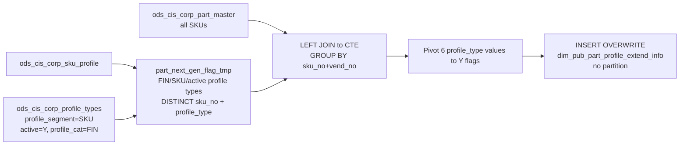

# DIM: Part Next-Generation Technology Profile Flags (`dim_pub_part_profile_extend_info`)

- artifact_type: etl_table
- artifact_id: dim_us.dim_pub_part_profile_extend_info
- domain: part_sku
- one_line_purpose: This job builds a **next-generation technology classification dimension** for every SKU in the product master. It scans active FIN-category profile types attached to each SKU and produces six binary (`'Y'` / NULL) flags identifying whether ...
- layer_type: DIM
- source_kind: etl_sql
- evidence_source: source/etl/sql/part_sku/source/etl/flows/public_order_tools/ingest/public_part_dimension/script/dim_pub_part_profile_extend_info.sql

---

## L1 Data Foundation

### Identity and physical mapping
- **Table:** `dim_us.dim_pub_part_profile_extend_info`
- **Layer type:** DIM
- **Canonical / derived:** Derived / ETL-loaded (see L3)
- **Owner team:** not registered in metadata catalog

### Grain, scope, exclusions
- **Grain:** one row per `(sku_no, vend_no)` — a unique SKU with its associated vendor.
- **Scope:** See L2 business purpose / L3 filters
- **Partition:** none — full overwrite on each run. - resolved from pipeline (see L4)
- **Natural key:** `sku_no`.
- **Exclusions:** Not documented in repository

#### Grain detail (preserved)

- **Grain:** one row per `(sku_no, vend_no)` — a unique SKU with its associated vendor.
- **Partition:** none — full overwrite on each run.
- **Natural key:** `sku_no`.

---

### Cross-engine presence
| Engine | Present | Canonical FQN | Notes |
|--------|---------|---------------|-------|
| Hive | yes | `dim_pub_part_profile_extend_info` | ETL target / intermediate per evidence script |
| Vertica | pending | `dim_pub_part_profile_extend_info` | Confirm via hive2vertica flow evidence / MCP |

### Physical schema reference

Pointer block only - full column catalog lives in WKB L1 storage JSON.

| Field | Value |
|-------|-------|
| **Authoritative catalog** | WKB L1 storage seed (not duplicated in this file) |
| **entity_id** | `dim_us.dim_pub_part_profile_extend_info` |
| **l1_catalog_seed** | `target/storage/wkb/snapshots/_snapshot_id_template/l1_catalog/{engine}_{schema}_{table}.json` |
| **column_count** | pending (run ddl_seed_writer) |
| **partition_keys** | `none — full overwrite on each run.` |
| **ddl_source** | pending Bitbucket DDL / Vertica metadata ingest |
| **retrieval** | `python -m tools.wkb.indexing.run_query --query "part_sku dim_pub_part_profile_extend_info schema" --intent find_table_schema` |

### Lineage
| Object | Role |
|--------|------|
| `ods_${country_code}.ods_cis_corp_part_master` | Driving table — all SKUs |
| `ods_${country_code}.ods_cis_corp_sku_profile` | Next-gen flag profiles |
| `ods_${country_code}.ods_cis_corp_profile_types` | FIN profile type filter |
| `dim_${country_code}.dim_pub_part_profile_extend_info` | **Target** — next-gen technology flag dimension |

---

### Freshness and load path
| Item | Value |
|------|-------|
| Load pattern | See L3 end-to-end / INSERT pattern in evidence script |
| Schedule | Not documented in repository |
| Parameters | `country_code` |


---

## L2 Declarative Knowledge

### Business purpose
This job builds a **next-generation technology classification dimension** for every SKU in the product master. It scans active FIN-category profile types attached to each SKU and produces six binary (`'Y'` / NULL) flags identifying whether the product belongs to key technology growth categories — Cloud, DaaS Device, Data, IoT, Security, and PCODE. These flags enable product segmentation, next-gen technology revenue reporting, and vendor program eligibility analysis.

---

### Audience and use cases
| Audience | How they benefit |
|----------|-----------------|
| **Sales / channel strategy** | Filter by `cloud = 'Y'`, `iot = 'Y'`, etc. to identify next-gen technology portfolio size and revenue contribution. |
| **Product management** | Segment the product catalogue by technology growth area for vendor program reporting and product line reviews. |
| **Finance / FP&A** | `pcode = 'Y'` identifies products with a PCODE financial classification for P&L segmentation. |
| **Operations / compliance** | `daadevice = 'Y'`, `security = 'Y'` for DaaS and security product program eligibility checks. |

---

### Identifier search profile
- Primary lookup keys: see natural key under L1 Grain.
- Use latest snapshot / active flags when documented in L3 filters.

### Time field semantics
- **date_flag / partition columns:** none — full overwrite on each run.
- Primary reporting filter should use the partition column(s) documented in L1; resolve values via L4.


### Metrics served

| Category | Column | Logical metric | Business reading |
|----------|--------|----------------|------------------|
| Measures | — | — | No measure columns mapped for this table. |

### Metric serving map

**Formula authority:** [`source/contracts/part_sku/metric-index.md`](../../source/contracts/part_sku/metric-index.md)

N/A — no measure columns mapped for this table.

### etl_metrics

No governed logical metrics from `source/contracts/part_sku/metric-index.md` are mapped on this table.

---

### Metric serving map
N/A - not a `*_comb_mtd` / multi-period wide serving table (or map not present in legacy doc).


### Data products and column groups (preserved)

### Identifiers

- `sku_no` — product SKU number
- `vend_no` — vendor number (from `ods_cis_corp_part_master`)

### Technology classification flags

| Column | Profile type | Meaning |
|--------|-------------|---------|
| `cloud` | `'Cloud'` | SKU is classified as a Cloud technology product |
| `daadevice` | `'DAASDEVICE'` | SKU is classified as a Device-as-a-Service (DaaS) device |
| `data` | `'Data'` | SKU is classified as a Data technology product |
| `iot` | `'IOT'` | SKU is classified as an Internet of Things product |
| `pcode` | `'PCODE'` | SKU has a PCODE financial profile type flag |
| `security` | `'Security'` | SKU is classified as a Security technology product |

> **Note:** All flags are `'Y'` when the corresponding profile type exists for the SKU, or **NULL** when absent. There is no `'N'` value — consumers should use `IS NOT NULL` or `COALESCE(col, 'N')` when a binary result is needed.

---

### etl_metrics

N/A - no calculable ETL formulas extracted from this document (passthrough / stored measures only, or formulas not documented).

---

## L3 Procedural Knowledge

### Query and routing rules
**Business filters:** Use partition / date keys from L1 grain for reporting scope.
**Technical predicates (load only):** See Key filters and step-by-step logic below.

### Dimension join patterns
| Dimension FQN | Join keys | Purpose | Evidence |
|---------------|-----------|---------|----------|
| See step-by-step / base tables | See L3 steps | Dimension enrichment | `source/etl/sql/part_sku/source/etl/flows/public_order_tools/ingest/public_part_dimension/script/dim_pub_part_profile_extend_info.sql` |

### Key filters and ETL business logic
### Step 1 — CTE `part_next_gen_flag_tmp`

**Source:** `ods_cis_corp_sku_profile` (`a`) INNER JOIN `ods_cis_corp_profile_types` (`b`)

**Join keys:** `a.profile_type = b.profile_type`

**Filter:** `b.profile_segment = 'SKU'` AND `b.active = 'Y'` AND `b.profile_cat = 'FIN'`

**Output:** DISTINCT `(sku_no, profile_type)` — only FIN-category, active, SKU-segment profile types.

---

### Step 2 — Final `INSERT OVERWRITE`

**From:** `ods_cis_corp_part_master` (`part`) LEFT JOIN `part_next_gen_flag_tmp` (`tmp`) on `part.sku_no = tmp.sku_no`

**GROUP BY:** `part.sku_no`, `part.vend_no`

**Derived columns (flag pivot):**

| Column | Formula | Plain language |
|--------|---------|----------------|
| `cloud` | `MAX(CASE WHEN next_gen_flag = 'Cloud' THEN 'Y' END)` | `'Y'` if any FIN profile of type 'Cloud' exists for the SKU; NULL otherwise. |
| `daadevice` | `MAX(CASE WHEN next_gen_flag = 'DAASDEVICE' THEN 'Y' END)` | `'Y'` if DaaS Device profile exists; NULL otherwise. |
| `data` | `MAX(CASE WHEN next_gen_flag = 'Data' THEN 'Y' END)` | `'Y'` if Data technology profile exists; NULL otherwise. |
| `iot` | `MAX(CASE WHEN next_gen_flag = 'IOT' THEN 'Y' END)` | `'Y'` if IoT profile exists; NULL otherwise. |
| `pcode` | `MAX(CASE WHEN next_gen_flag = 'PCODE' THEN 'Y' END)` | `'Y'` if PCODE financial profile exists; NULL otherwise. |
| `security` | `MAX(CASE WHEN next_gen_flag = 'Security' THEN 'Y' END)` | `'Y'` if Security technology profile exists; NULL otherwise. |

---

### Standard time-filter SQL
```sql
-- relative period filter using resolved partition value (see L4)
SELECT *
FROM dim_pub_part_profile_extend_info
WHERE /* partition predicate */ date_flag = '${partition_value}';
```

### End-to-end flow
**Runtime parameters:** `country_code`
**Target table:** `dim_${country_code}.dim_pub_part_profile_extend_info` — **full overwrite, no partitioning**.

1. CTE `part_next_gen_flag_tmp`: join `ods_cis_corp_sku_profile` to `ods_cis_corp_profile_types` (FIN category, active, SKU segment). Produce DISTINCT `(sku_no, profile_type)`.
2. LEFT JOIN `ods_cis_corp_part_master` to the CTE. GROUP BY `(sku_no, vend_no)`. Pivot 6 profile types into `'Y'` flags.
3. **INSERT OVERWRITE** into target.



---


#### High-level stages (preserved)

| Stage | Business meaning |
|-------|-----------------|
| **FIN profile type extraction** | Reads `ods_cis_corp_sku_profile` joined to `ods_cis_corp_profile_types` — keeps only profile types classified as FIN (finance/strategic) category (`profile_segment='SKU'`, `profile_cat='FIN'`, `active='Y'`). Produces distinct `(sku_no, profile_type)` pairs. |
| **Flag pivot** | LEFT JOINs `ods_cis_corp_part_master` (all SKUs) to the profile list. Groups by `(sku_no, vend_no)` and pivots 6 specific profile type values into individual `'Y'` flags. |
| **Full overwrite** | Replaces the entire target table on each run. |

**Parameters:** `country_code`

---


### Base tables register
| Object | Role in this job |
|--------|-----------------|
| `ods_${country_code}.ods_cis_corp_sku_profile` | SKU profile records — provides `profile_type` per `sku_no`. Filtered via join to profile types. |
| `ods_${country_code}.ods_cis_corp_profile_types` | Profile type metadata — filters to `profile_segment='SKU'`, `active='Y'`, `profile_cat='FIN'`. Validates which profile types are active financial categories. |
| `ods_${country_code}.ods_cis_corp_part_master` | **Driving table.** All SKUs with their `vend_no`. LEFT JOIN ensures every SKU appears in the output even if it has no FIN profile types. |

**Temporary tables (inside the job only):** CTE `part_next_gen_flag_tmp` (inline).

---

### Step-by-step logic
### Step 1 — CTE `part_next_gen_flag_tmp`

**Source:** `ods_cis_corp_sku_profile` (`a`) INNER JOIN `ods_cis_corp_profile_types` (`b`)

**Join keys:** `a.profile_type = b.profile_type`

**Filter:** `b.profile_segment = 'SKU'` AND `b.active = 'Y'` AND `b.profile_cat = 'FIN'`

**Output:** DISTINCT `(sku_no, profile_type)` — only FIN-category, active, SKU-segment profile types.

---

### Step 2 — Final `INSERT OVERWRITE`

**From:** `ods_cis_corp_part_master` (`part`) LEFT JOIN `part_next_gen_flag_tmp` (`tmp`) on `part.sku_no = tmp.sku_no`

**GROUP BY:** `part.sku_no`, `part.vend_no`

**Derived columns (flag pivot):**

| Column | Formula | Plain language |
|--------|---------|----------------|
| `cloud` | `MAX(CASE WHEN next_gen_flag = 'Cloud' THEN 'Y' END)` | `'Y'` if any FIN profile of type 'Cloud' exists for the SKU; NULL otherwise. |
| `daadevice` | `MAX(CASE WHEN next_gen_flag = 'DAASDEVICE' THEN 'Y' END)` | `'Y'` if DaaS Device profile exists; NULL otherwise. |
| `data` | `MAX(CASE WHEN next_gen_flag = 'Data' THEN 'Y' END)` | `'Y'` if Data technology profile exists; NULL otherwise. |
| `iot` | `MAX(CASE WHEN next_gen_flag = 'IOT' THEN 'Y' END)` | `'Y'` if IoT profile exists; NULL otherwise. |
| `pcode` | `MAX(CASE WHEN next_gen_flag = 'PCODE' THEN 'Y' END)` | `'Y'` if PCODE financial profile exists; NULL otherwise. |
| `security` | `MAX(CASE WHEN next_gen_flag = 'Security' THEN 'Y' END)` | `'Y'` if Security technology profile exists; NULL otherwise. |

---

### Relationship map (embedded)

| from_fqn | to_fqn | cardinality | join_keys | provenance |
|----------|--------|-------------|-----------|------------|
| `ods_${country_code}.ods_cis_corp_sku_profile` | `ods_${country_code}.ods_cis_corp_profile_types` | many:1 | `a.profile_type = b.profile_type and b.profile_segment='SKU' and b.active ='Y' and b.profile_cat ='FIN'` | etl_sql (source/etl/sql/part_sku/public_order_scripts/public_part_dimension/script/dim_pub_part_profile_extend_info.sql:1) |

`source/ref/part_sku/table relationship.txt`: Not documented in repository.

### Special logic (embedded)

Not documented in repository

### Column / field derivations (from ETL SQL)

| target_column | expression_sql | upstream_columns | upstream_tables | transform_kind | evidence |
|---------------|----------------|------------------|-----------------|----------------|----------|
| `sku_no` | `part.sku_no` | `sku_no` | `ods_${country_code}.ods_cis_corp_part_master`, `part_next_gen_flag_tmp` | passthrough | `source/etl/sql/part_sku/public_order_scripts/public_part_dimension/script/dim_pub_part_profile_extend_info.sql:18` |
| `cloud` | `max(case when next_gen_flag = 'Cloud' then 'Y' end)` | `next_gen_flag`, `Cloud`, `Y` | `ods_${country_code}.ods_cis_corp_part_master`, `part_next_gen_flag_tmp` | case | `source/etl/sql/part_sku/public_order_scripts/public_part_dimension/script/dim_pub_part_profile_extend_info.sql:19` |
| `daadevice` | `max(case when next_gen_flag = 'DAASDEVICE' then 'Y' end)` | `next_gen_flag`, `DAASDEVICE`, `Y` | `ods_${country_code}.ods_cis_corp_part_master`, `part_next_gen_flag_tmp` | case | `source/etl/sql/part_sku/public_order_scripts/public_part_dimension/script/dim_pub_part_profile_extend_info.sql:20` |
| `data` | `max(case when next_gen_flag = 'Data' then 'Y' end)` | `next_gen_flag`, `Data`, `Y` | `ods_${country_code}.ods_cis_corp_part_master`, `part_next_gen_flag_tmp` | case | `source/etl/sql/part_sku/public_order_scripts/public_part_dimension/script/dim_pub_part_profile_extend_info.sql:21` |
| `iot` | `max(case when next_gen_flag = 'IOT' then 'Y' end)` | `next_gen_flag`, `IOT`, `Y` | `ods_${country_code}.ods_cis_corp_part_master`, `part_next_gen_flag_tmp` | case | `source/etl/sql/part_sku/public_order_scripts/public_part_dimension/script/dim_pub_part_profile_extend_info.sql:22` |
| `pcode` | `max(case when next_gen_flag = 'PCODE' then 'Y' end)` | `next_gen_flag`, `PCODE`, `Y` | `ods_${country_code}.ods_cis_corp_part_master`, `part_next_gen_flag_tmp` | case | `source/etl/sql/part_sku/public_order_scripts/public_part_dimension/script/dim_pub_part_profile_extend_info.sql:23` |
| `security` | `max(case when next_gen_flag = 'Security' then 'Y'end )` | `next_gen_flag`, `Security`, `Y` | `ods_${country_code}.ods_cis_corp_part_master`, `part_next_gen_flag_tmp` | case | `source/etl/sql/part_sku/public_order_scripts/public_part_dimension/script/dim_pub_part_profile_extend_info.sql:24` |
| `vend_no` | `part.vend_no` | `vend_no` | `ods_${country_code}.ods_cis_corp_part_master`, `part_next_gen_flag_tmp` | passthrough | `source/etl/sql/part_sku/public_order_scripts/public_part_dimension/script/dim_pub_part_profile_extend_info.sql:25` |

### Sentinel and code values
| Value | Meaning |
|-------|---------|
| `profile_segment = 'SKU'` | Only SKU-level profile types — excludes vendor or other segment types. |
| `profile_cat = 'FIN'` | Financial/strategic category profile types only — the filter that restricts to next-gen flags. |
| `active = 'Y'` | Only currently active profile type definitions. |
| Flag = NULL | The corresponding profile type was not found for the SKU — equivalent to "not classified" in this dimension. |
| Flag = `'Y'` | The SKU is actively classified under this technology category. |

---

---

## L4 Validation

### Resolved partition value
| Step | Source | How partition / date scope is determined |
|------|--------|------------------------------------------|
| 1 | evidence script / flow | See parameters in L1 Freshness and L3 filters - `source/etl/sql/part_sku/source/etl/flows/public_order_tools/ingest/public_part_dimension/script/dim_pub_part_profile_extend_info.sql` |

**Plain language:** Partition and date scope follow Azkaban/bootstrap parameters documented in the source script and orchestrating flow; do not hardcode calendar literals.

### Data quality checks
- Prefer row-count-by-partition, metric sums, and grain duplicate checks (see Validation SQL).
- Additional checks from legacy caveats / operational notes when present.

### Validation SQL
```sql
-- 1) Row count by partition
SELECT ${partition_col}, COUNT(*) AS row_cnt
FROM dim_${country_code}.dim_pub_part_profile_extend_info
WHERE ${partition_col} = '${partition_value}'
GROUP BY ${partition_col};

-- 2) Metric sum by business dimension (top deltas)
SELECT ${dim_key}, SUM(${metric}) AS metric_sum
FROM dim_${country_code}.dim_pub_part_profile_extend_info
WHERE ${partition_col} = '${partition_value}'
GROUP BY ${dim_key}
ORDER BY ABS(SUM(${metric})) DESC
LIMIT 20;

-- 3) Grain duplicate check
SELECT ${grain_key_1}, ${grain_key_2}, ${grain_key_3}, ${partition_col}, COUNT(*) AS cnt
FROM dim_${country_code}.dim_pub_part_profile_extend_info
WHERE ${partition_col} = '${partition_value}'
GROUP BY ${grain_key_1}, ${grain_key_2}, ${grain_key_3}, ${partition_col}
HAVING COUNT(*) > 1;
```

Replace placeholders from this file's Grain and keys / Data you can fetch sections, and use the resolved partition value from run scope.

### Caveats for interpretation
- **Flags are NULL, not `'N'`** — when a technology flag is not set, the column is NULL. Consumers must handle NULLs explicitly (e.g. `COALESCE(cloud, 'N')`) when a true/false view is needed.
- **Only FIN-category profile types are included** — profile types from other categories (e.g. pricing, logistics) that may share the same type codes are excluded by the `profile_cat='FIN'` filter.
- **LEFT JOIN from part_master** — every SKU in `ods_cis_corp_part_master` gets a row, including those with no FIN profiles (all flags NULL).
- **Full overwrite** — no incremental logic; the entire table is replaced on each run.

---

### Conflicts and open questions
- Schedule, owner, SLA: Not documented in repository (unless preserved schedule evidence above).
- Vertica MCP verification: pending unless confirmed in L5.


---

## L5 Runtime View

### Query path and engine preference
| Role | Hive object | Vertica object | Sync mode | Evidence | MCP verified |
|------|-------------|----------------|-----------|----------|--------------|
| **Query for reporting** | *See script lineage* | `dim_${country_code}.dim_pub_part_profile_extend_info` | *Verify from flow* | *Add flow file:line* | pending |
| **Hive alternative** | `*` | `dim_${country_code}.dim_pub_part_profile_extend_info` | - | *See dependencies* | - |
| **ETL internal** | staging/temp tables | *Not synced to Vertica* | - | *See step-by-step logic* | - |

Business users should query `dim_${country_code}.dim_pub_part_profile_extend_info` in Vertica once MCP verification is completed for this document.

### Access constraints
- Country / company schema parameters may apply (`literal_country`, `company_no`, etc.).
- Hive-only staging objects are not reporting surfaces unless synced.

### Query risk profile
| Field | Value |
|-------|-------|
| requires_date_predicate | unknown |
| scan_risk_tier | medium |

---

## L6 Access and Consumption

### Primary consumers and use cases
| Audience | How they benefit |
|----------|-----------------|
| **Sales / channel strategy** | Filter by `cloud = 'Y'`, `iot = 'Y'`, etc. to identify next-gen technology portfolio size and revenue contribution. |
| **Product management** | Segment the product catalogue by technology growth area for vendor program reporting and product line reviews. |
| **Finance / FP&A** | `pcode = 'Y'` identifies products with a PCODE financial classification for P&L segmentation. |
| **Operations / compliance** | `daadevice = 'Y'`, `security = 'Y'` for DaaS and security product program eligibility checks. |

---

### Representative query patterns
```sql
-- certified / illustrative lookup - replace predicates from L1/L4
SELECT *
FROM dim_pub_part_profile_extend_info
WHERE date_flag = '${partition_value}'
LIMIT 100;
```

### Dependencies and notes
### Upstream objects (verified)

| Object | Usage | Evidence |
|--------|-------|----------|
| `ods_${country_code}.ods_cis_corp_sku_profile` | FIN profile types per SKU | `dim_pub_part_profile_extend_info.sql:7-8` |
| `ods_${country_code}.ods_cis_corp_profile_types` | Filter: FIN/SKU/active | `dim_pub_part_profile_extend_info.sql:8-12` |
| `ods_${country_code}.ods_cis_corp_part_master` | All SKUs; vend_no | `dim_pub_part_profile_extend_info.sql:27` |

### Downstream consumers (verified)

| Object / script | Evidence |
|-----------------|----------|
| None identified in repository. | — |

### Operational detail (verified)

- Full overwrite: `INSERT OVERWRITE TABLE dim_${country_code}.dim_pub_part_profile_extend_info` — no partition clause — `dim_pub_part_profile_extend_info.sql:16`

### Not documented in repository

- Schedule, owner, SLA — not in scripts or configs

---

*Document generated from `source/etl/sql/part_sku/source/etl/flows/public_order_tools/ingest/public_part_dimension/script/dim_pub_part_profile_extend_info.sql`.*

#### Not documented in repository
- Owner, SLA (unless schedule evidence preserved above)
- Any dependency without `file:line` evidence in this document

---

*Document migrated to L1-L6 from legacy Knowledgebase content. Evidence: `source/etl/sql/part_sku/source/etl/flows/public_order_tools/ingest/public_part_dimension/script/dim_pub_part_profile_extend_info.sql`.*
