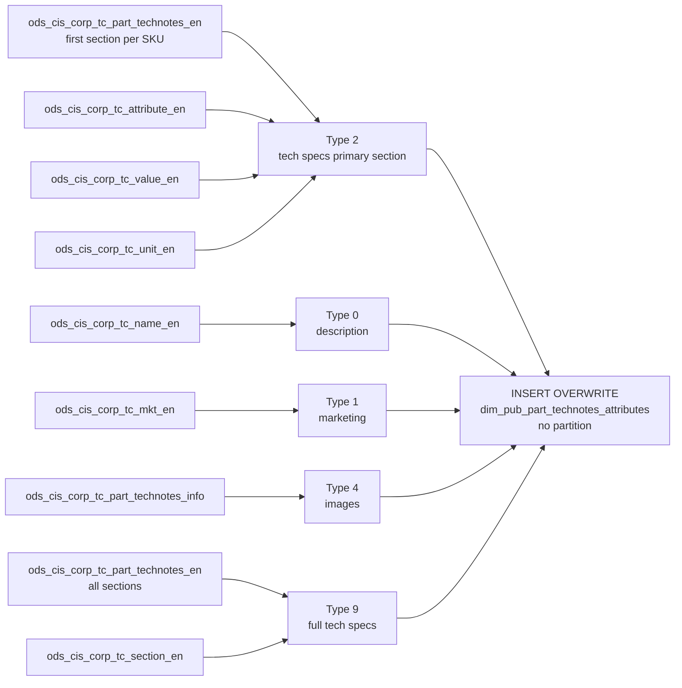

# DIM: Part Technical Notes and Attributes (`dim_pub_part_technotes_attributes`)

- artifact_type: etl_table
- artifact_id: dim_us.dim_pub_part_technotes_attributes
- domain: part_sku
- one_line_purpose: This job consolidates **all product content types** — technical specifications, product descriptions, marketing text, and product images — into a single unified attribute table. Each row represents one content element for a SKU, classified ...
- layer_type: DIM
- source_kind: etl_sql
- evidence_source: source/etl/sql/part_sku/source/etl/flows/public_order_tools/ingest/public_part_dimension/script/dim_pub_part_technotes_attributes.sql

---

## L1 Data Foundation

### Identity and physical mapping
- **Table:** `dim_us.dim_pub_part_technotes_attributes`
- **Layer type:** DIM
- **Canonical / derived:** Derived / ETL-loaded (see L3)
- **Owner team:** not registered in metadata catalog

### Grain, scope, exclusions
- **Grain:** one row per `(sku_no, type, attribute_id, value_id, section_id)` — a unique content element of a given type for a SKU. A single SKU will have many rows (one per attribute, description, image, etc.).
- **Scope:** See L2 business purpose / L3 filters
- **Partition:** none — full overwrite on each run. - resolved from pipeline (see L4)
- **Natural key:** Not documented in repository
- **Exclusions:** Not documented in repository

#### Grain detail (preserved)

- **Grain:** one row per `(sku_no, type, attribute_id, value_id, section_id)` — a unique content element of a given type for a SKU. A single SKU will have many rows (one per attribute, description, image, etc.).
- **Partition:** none — full overwrite on each run.
- **Note:** Type 0 (description) and Type 1 (marketing) produce at most one row per SKU. Type 2 is limited to the first section only. Type 9 covers all sections. Type 4 produces one row per image.

---

### Cross-engine presence
| Engine | Present | Canonical FQN | Notes |
|--------|---------|---------------|-------|
| Hive | yes | `dim_pub_part_technotes_attributes` | ETL target / intermediate per evidence script |
| Vertica | pending | `dim_pub_part_technotes_attributes` | Confirm via hive2vertica flow evidence / MCP |

### Physical schema reference

Pointer block only - full column catalog lives in WKB L1 storage JSON.

| Field | Value |
|-------|-------|
| **Authoritative catalog** | WKB L1 storage seed (not duplicated in this file) |
| **entity_id** | `dim_us.dim_pub_part_technotes_attributes` |
| **l1_catalog_seed** | `target/storage/wkb/snapshots/_snapshot_id_template/l1_catalog/{engine}_{schema}_{table}.json` |
| **column_count** | pending (run ddl_seed_writer) |
| **partition_keys** | `none — full overwrite on each run.` |
| **ddl_source** | pending Bitbucket DDL / Vertica metadata ingest |
| **retrieval** | `python -m tools.wkb.indexing.run_query --query "part_sku dim_pub_part_technotes_attributes schema" --intent find_table_schema` |

### Lineage
| Object | Role |
|--------|------|
| `ods_${country_code}.ods_cis_corp_tc_part_technotes_en` | Primary tech spec data (types 2 and 9) |
| `ods_${country_code}.ods_cis_corp_tc_attribute_en` | Attribute name lookup |
| `ods_${country_code}.ods_cis_corp_tc_value_en` | Value content lookup |
| `ods_${country_code}.ods_cis_corp_tc_unit_en` | Unit label lookup (used twice in type 9) |
| `ods_${country_code}.ods_cis_corp_tc_section_en` | Section label (type 9 12th column) |
| `ods_${country_code}.ods_cis_corp_tc_name_en` | Product description (type 0) |
| `ods_${country_code}.ods_cis_corp_tc_mkt_en` | Marketing text (type 1) |
| `ods_${country_code}.ods_cis_corp_tc_part_technotes_info` | Image names (type 4) |
| `dim_${country_code}.dim_pub_part_technotes_attributes` | **Target** — unified product content/attributes table |

---

### Freshness and load path
| Item | Value |
|------|-------|
| Load pattern | See L3 end-to-end / INSERT pattern in evidence script |
| Schedule | Not documented in repository |
| Parameters | `country_code` |


---

## L2 Declarative Knowledge

### Business purpose
This job consolidates **all product content types** — technical specifications, product descriptions, marketing text, and product images — into a single unified attribute table. Each row represents one content element for a SKU, classified by `type` code. This flat, flexible structure supports e-commerce product pages, category-based content exports, and technical specification comparison tools without needing to join multiple content source tables.

---

### Audience and use cases
| Audience | How they benefit |
|----------|-----------------|
| **E-commerce / product content teams** | All content types in one table: specs, descriptions, marketing copy, images — enables complete product page assembly from a single source. |
| **Product management** | Technical attribute completeness auditing — which SKUs have specs, descriptions, images. |
| **Search / discovery** | Flat attribute structure enables full-text search indexing across all product content types. |
| **Data quality** | Centralized view of product content allows systematic quality checks on spec coverage and image availability. |

---

### Identifier search profile
- Primary lookup keys: see natural key under L1 Grain.
- Use latest snapshot / active flags when documented in L3 filters.

### Time field semantics
- **date_flag / partition columns:** none — full overwrite on each run.
- Primary reporting filter should use the partition column(s) documented in L1; resolve values via L4.


### Metrics served

| Category | Column | Logical metric | Business reading |
|----------|--------|----------------|------------------|
| Measures | — | — | No measure columns mapped for this table. |

### Metric serving map

**Formula authority:** [`source/contracts/part_sku/metric-index.md`](../../source/contracts/part_sku/metric-index.md)

N/A — no measure columns mapped for this table.

### etl_metrics

No governed logical metrics from `source/contracts/part_sku/metric-index.md` are mapped on this table.

---

### Metric serving map
N/A - not a `*_comb_mtd` / multi-period wide serving table (or map not present in legacy doc).


### Data products and column groups (preserved)

### Identifiers

- `sku_no` — product SKU number
- `type` — content type code (see table below)
- `attribute_id` — TC attribute identifier (NULL for types 0, 1, 4)
- `value_id` — TC value identifier (NULL for types 0, 1, 4)
- `unit_id` — TC unit identifier (NULL for types 0, 1, 4)
- `section_id` — TC section identifier (NULL for types 0, 1, 4)

### Type codes

| `type` | Source | Content category |
|--------|--------|-----------------|
| `'0'` | `ods_cis_corp_tc_name_en` | Product description / name |
| `'1'` | `ods_cis_corp_tc_mkt_en` | Marketing overview text |
| `'2'` | `ods_cis_corp_tc_part_technotes_en` (first section) | Technical specifications — primary section only |
| `'4'` | `ods_cis_corp_tc_part_technotes_info` | Product image names |
| `'9'` | `ods_cis_corp_tc_part_technotes_en` (all sections) | Full technical specifications — all sections |

### Content columns

- `name` — attribute name (from `ods_cis_corp_tc_attribute_en`) or literal `'description'`, `'content'`, `'image_name'`
- `value` — the content value (attribute value + unit, or description text, or image name)
- `section_display_order` — display ordering within the section
- `attribute_display_order` — display ordering of the attribute within its section

---

### etl_metrics

N/A - no calculable ETL formulas extracted from this document (passthrough / stored measures only, or formulas not documented).

---

## L3 Procedural Knowledge

### Query and routing rules
**Business filters:** Use partition / date keys from L1 grain for reporting scope.
**Technical predicates (load only):** See Key filters and step-by-step logic below.

### Dimension join patterns
| Dimension FQN | Join keys | Purpose | Evidence |
|---------------|-----------|---------|----------|
| See step-by-step / base tables | See L3 steps | Dimension enrichment | `source/etl/sql/part_sku/source/etl/flows/public_order_tools/ingest/public_part_dimension/script/dim_pub_part_technotes_attributes.sql` |

### Key filters and ETL business logic
### Type 2 — Technical specs (first section per SKU)

**Source:** `ods_cis_corp_tc_part_technotes_en` (`a`)

**Deduplication:** INNER JOIN to a subquery that computes `MIN(CAST(section_id AS INT)) per sku_no` — keeps only attributes from the first (lowest-numbered) section of each SKU. Prevents duplication of attributes that appear in multiple sections.

**Joins:**
- INNER JOIN `ods_cis_corp_tc_attribute_en` (b) on `attribute_id` → attribute `name`
- LEFT JOIN `ods_cis_corp_tc_value_en` (c) on `value_id` → value `content`
- LEFT JOIN `ods_cis_corp_tc_unit_en` (d) on `unit_id` → unit `content`

**Filter:** `convert_value IS NOT NULL OR c.id IS NOT NULL` — excludes rows where neither a converted value nor a standard value exists.

**Value column:** `CONCAT(COALESCE(a.convert_value, c.content), ' ', COALESCE(d.content, ''))` — uses converted value if set, falls back to standard value content; appends unit.

**10th column:** `c.content` (standard value text)
**12th column:** `d.content` (unit text)

---

### Type 0 — Product description

**Source:** `ods_cis_corp_tc_name_en`

**Output:** `sku_no`, `type='0'`, `name='description'`, `value=description`. All metadata columns (section_id, attribute_id, etc.) are NULL.

---

### Type 1 — Marketing content

**Source:** `ods_cis_corp_tc_mkt_en`

**Output:** `sku_no`, `type='1'`, `name='content'`, `value=content`. All metadata columns NULL.

---

### Type 4 — Product images

**Source:** `ods_cis_corp_tc_part_technotes_info`

**Output:** ...

### Standard time-filter SQL
```sql
-- relative period filter using resolved partition value (see L4)
SELECT *
FROM dim_pub_part_technotes_attributes
WHERE /* partition predicate */ date_flag = '${partition_value}';
```

### End-to-end flow
**Runtime parameters:** `country_code`
**Target table:** `dim_${country_code}.dim_pub_part_technotes_attributes` — **full overwrite, no partitioning**.

4-part UNION ALL:
1. Type 2: technotes (first section per SKU) + attribute name + value + unit.
2. Type 0: TC product name/description.
3. Type 1: TC marketing content.
4. Type 4: TC image names.
5. Type 9: technotes (all sections) + attribute name + section label + converted/standard value + unit.

→ **INSERT OVERWRITE** all 5 parts combined.



---


#### High-level stages (preserved)

| Stage | Business meaning |
|-------|-----------------|
| **Type 2 — Technical specs (first section only)** | Reads TC technical note attributes for each SKU, limited to the first (lowest) section per SKU. Resolves attribute name, converted/standard value, and unit. Excludes rows with no value. |
| **Type 0 — Product description** | Reads TC product name/description text. One row per SKU with `name='description'`. |
| **Type 1 — Marketing content** | Reads TC marketing overview text. One row per SKU with `name='content'`. |
| **Type 4 — Product images** | Reads TC product image names from the technotes info table. One row per image with `name='image_name'`. |
| **Type 9 — Full technical specs (all sections)** | Reads TC technical note attributes across all sections (no section filter). Resolves attribute name, converted/standard value, and unit/section label. Excludes attribute ID 103129. |
| **Full overwrite** | Replaces the entire target table on each run — no partition. |

**Parameters:** `country_code`

---


### Base tables register
| Object | Role in this job |
|--------|-----------------|
| `ods_${country_code}.ods_cis_corp_tc_part_technotes_en` | **Primary tech spec source.** Used in types 2 and 9. Provides `section_id`, `attribute_id`, `value_id`, `unit_id`, `convert_value`, `convert_unit_id`, section/attribute/value display orders. |
| `ods_${country_code}.ods_cis_corp_tc_attribute_en` | Attribute name lookup — maps `attribute_id` to `content` (attribute label). |
| `ods_${country_code}.ods_cis_corp_tc_value_en` | Value content lookup — maps `value_id` to `content` (value text). |
| `ods_${country_code}.ods_cis_corp_tc_unit_en` | Unit label lookup — maps `unit_id` or `convert_unit_id` to `content` (unit text). Used twice in type 9. |
| `ods_${country_code}.ods_cis_corp_tc_section_en` | Section label lookup — maps `section_id` to `content` (section name). Used in type 9 output as the 12th column. |
| `ods_${country_code}.ods_cis_corp_tc_name_en` | Product name/description text. Source for type 0. |
| `ods_${country_code}.ods_cis_corp_tc_mkt_en` | TC marketing overview text. Source for type 1. |
| `ods_${country_code}.ods_cis_corp_tc_part_technotes_info` | Product image information. Source for type 4 — provides `image_name`. |

---

### Step-by-step logic
### Type 2 — Technical specs (first section per SKU)

**Source:** `ods_cis_corp_tc_part_technotes_en` (`a`)

**Deduplication:** INNER JOIN to a subquery that computes `MIN(CAST(section_id AS INT)) per sku_no` — keeps only attributes from the first (lowest-numbered) section of each SKU. Prevents duplication of attributes that appear in multiple sections.

**Joins:**
- INNER JOIN `ods_cis_corp_tc_attribute_en` (b) on `attribute_id` → attribute `name`
- LEFT JOIN `ods_cis_corp_tc_value_en` (c) on `value_id` → value `content`
- LEFT JOIN `ods_cis_corp_tc_unit_en` (d) on `unit_id` → unit `content`

**Filter:** `convert_value IS NOT NULL OR c.id IS NOT NULL` — excludes rows where neither a converted value nor a standard value exists.

**Value column:** `CONCAT(COALESCE(a.convert_value, c.content), ' ', COALESCE(d.content, ''))` — uses converted value if set, falls back to standard value content; appends unit.

**10th column:** `c.content` (standard value text)
**12th column:** `d.content` (unit text)

---

### Type 0 — Product description

**Source:** `ods_cis_corp_tc_name_en`

**Output:** `sku_no`, `type='0'`, `name='description'`, `value=description`. All metadata columns (section_id, attribute_id, etc.) are NULL.

---

### Type 1 — Marketing content

**Source:** `ods_cis_corp_tc_mkt_en`

**Output:** `sku_no`, `type='1'`, `name='content'`, `value=content`. All metadata columns NULL.

---

### Type 4 — Product images

**Source:** `ods_cis_corp_tc_part_technotes_info`

**Output:** `sku_no`, `type='4'`, `name='image_name'`, `value=NVL(image_name,'')`. All metadata columns NULL.

---

### Type 9 — Full technical specs (all sections)

**Source:** `ods_cis_corp_tc_part_technotes_en` (`a`) — **no section filter** (all sections included)

**Joins:**
- INNER JOIN `ods_cis_corp_tc_attribute_en` (b) on `attribute_id` → `attr_name`
- INNER JOIN `ods_cis_corp_tc_section_en` (d) on `section_id` → section label (written to **12th column** position)
- LEFT JOIN `ods_cis_corp_tc_unit_en` (e) on `convert_unit_id` → converted unit label
- LEFT JOIN `ods_cis_corp_tc_unit_en` (g) on `unit_id` → standard unit label
- LEFT JOIN `ods_cis_corp_tc_value_en` (f) on `value_id` → standard value content

**Filter:** `attribute_id <> '103129'` — excludes a specific noise attribute.

**Value column (`attr_value`):**
```
CONCAT(
  if(rtrim(convert_value) is null or rtrim(convert_value)='', f.content, rtrim(convert_value)),
  ' ',
  CASE WHEN convert_value IS NOT NULL
       THEN if(e.content is null or e.content='','', e.content)   -- converted unit
       ELSE if(g.content is null or g.content='','', g.content)   -- standard unit
  END
)
```
Uses `convert_value` if set (with its converted unit `e`); falls back to standard value from `value_en` (`f.content`) with standard unit (`g`).

**10th column:** `null` (no raw value_content for type 9)
**12th column:** `d.content` — section label from `ods_cis_corp_tc_section_en` (not a unit)

---

### Relationship map (embedded)

| from_fqn | to_fqn | cardinality | join_keys | provenance |
|----------|--------|-------------|-----------|------------|
| `ods_${country_code}.ods_cis_corp_tc_part_technotes_en` | `ods_${country_code}.ods_cis_corp_tc_attribute_en` | many:1 | `a.attribute_id = b.id` | etl_sql (source/etl/sql/part_sku/public_order_scripts/public_part_dimension/script/dim_pub_part_technotes_attributes.sql:1) |
| `ods_${country_code}.ods_cis_corp_tc_part_technotes_en` | `ods_${country_code}.ods_cis_corp_tc_value_en` | many:1 | `a.value_id = c.id` | etl_sql (source/etl/sql/part_sku/public_order_scripts/public_part_dimension/script/dim_pub_part_technotes_attributes.sql:1) |
| `ods_${country_code}.ods_cis_corp_tc_part_technotes_en` | `ods_${country_code}.ods_cis_corp_tc_unit_en` | many:1 | `a.unit_id = d.id` | etl_sql (source/etl/sql/part_sku/public_order_scripts/public_part_dimension/script/dim_pub_part_technotes_attributes.sql:1) |
| `ods_${country_code}.ods_cis_corp_tc_part_technotes_en` | `ods_${country_code}.ods_cis_corp_tc_attribute_en` | many:1 | `b.id = a.attribute_id` | etl_sql (source/etl/sql/part_sku/public_order_scripts/public_part_dimension/script/dim_pub_part_technotes_attributes.sql:1) |
| `ods_${country_code}.ods_cis_corp_tc_part_technotes_en` | `ods_${country_code}.ods_cis_corp_tc_section_en` | many:1 | `d.id = a.section_id` | etl_sql (source/etl/sql/part_sku/public_order_scripts/public_part_dimension/script/dim_pub_part_technotes_attributes.sql:1) |
| `ods_${country_code}.ods_cis_corp_tc_part_technotes_en` | `ods_${country_code}.ods_cis_corp_tc_unit_en` | many:1 | `a.convert_unit_id = e.id` | etl_sql (source/etl/sql/part_sku/public_order_scripts/public_part_dimension/script/dim_pub_part_technotes_attributes.sql:1) |
| `ods_${country_code}.ods_cis_corp_tc_part_technotes_en` | `ods_${country_code}.ods_cis_corp_tc_unit_en` | many:1 | `a.unit_id = g.id` | etl_sql (source/etl/sql/part_sku/public_order_scripts/public_part_dimension/script/dim_pub_part_technotes_attributes.sql:1) |
| `ods_${country_code}.ods_cis_corp_tc_part_technotes_en` | `ods_${country_code}.ods_cis_corp_tc_value_en` | many:1 | `a.value_id = f.id` | etl_sql (source/etl/sql/part_sku/public_order_scripts/public_part_dimension/script/dim_pub_part_technotes_attributes.sql:1) |

`source/ref/part_sku/table relationship.txt`: Not documented in repository.

### Special logic (embedded)

Not documented in repository

### Column / field derivations (from ETL SQL)

| target_column | expression_sql | upstream_columns | upstream_tables | transform_kind | evidence |
|---------------|----------------|------------------|-----------------|----------------|----------|
| `sku_no` | `a.sku_no` | `sku_no` | `ods_${country_code}.ods_cis_corp_tc_part_technotes_en`, `ods_${country_code}.ods_cis_corp_tc_attribute_en`, `ods_${country_code}.ods_cis_corp_tc_value_en`, `ods_${country_code}.ods_cis_corp_tc_unit_en`, `ods_${country_code}.ods_cis_corp_tc_name_en`, `ods_${country_code}.ods_cis_corp_tc_mkt_en`, `ods_${country_code}.ods_cis_corp_tc_part_technotes_info`, `ods_${country_code}.ods_cis_corp_tc_section_en` | passthrough | `source/etl/sql/part_sku/public_order_scripts/public_part_dimension/script/dim_pub_part_technotes_attributes.sql:3` |
| `type` | `'2'` | — | `ods_${country_code}.ods_cis_corp_tc_part_technotes_en`, `ods_${country_code}.ods_cis_corp_tc_attribute_en`, `ods_${country_code}.ods_cis_corp_tc_value_en`, `ods_${country_code}.ods_cis_corp_tc_unit_en`, `ods_${country_code}.ods_cis_corp_tc_name_en`, `ods_${country_code}.ods_cis_corp_tc_mkt_en`, `ods_${country_code}.ods_cis_corp_tc_part_technotes_info`, `ods_${country_code}.ods_cis_corp_tc_section_en` | literal | `source/etl/sql/part_sku/public_order_scripts/public_part_dimension/script/dim_pub_part_technotes_attributes.sql:3` |
| `name` | `b.content` | `content` | `ods_${country_code}.ods_cis_corp_tc_part_technotes_en`, `ods_${country_code}.ods_cis_corp_tc_attribute_en`, `ods_${country_code}.ods_cis_corp_tc_value_en`, `ods_${country_code}.ods_cis_corp_tc_unit_en`, `ods_${country_code}.ods_cis_corp_tc_name_en`, `ods_${country_code}.ods_cis_corp_tc_mkt_en`, `ods_${country_code}.ods_cis_corp_tc_part_technotes_info`, `ods_${country_code}.ods_cis_corp_tc_section_en` | rename | `source/etl/sql/part_sku/public_order_scripts/public_part_dimension/script/dim_pub_part_technotes_attributes.sql:3` |
| `value` | `concat(nvl(a.convert_value,c.content), ' ',nvl(d.content,''))` | `convert_value`, `content` | `ods_${country_code}.ods_cis_corp_tc_part_technotes_en`, `ods_${country_code}.ods_cis_corp_tc_attribute_en`, `ods_${country_code}.ods_cis_corp_tc_value_en`, `ods_${country_code}.ods_cis_corp_tc_unit_en`, `ods_${country_code}.ods_cis_corp_tc_name_en`, `ods_${country_code}.ods_cis_corp_tc_mkt_en`, `ods_${country_code}.ods_cis_corp_tc_part_technotes_info`, `ods_${country_code}.ods_cis_corp_tc_section_en` | coalesce | `source/etl/sql/part_sku/public_order_scripts/public_part_dimension/script/dim_pub_part_technotes_attributes.sql:4` |
| `section_id` | `a.section_id` | `section_id` | `ods_${country_code}.ods_cis_corp_tc_part_technotes_en`, `ods_${country_code}.ods_cis_corp_tc_attribute_en`, `ods_${country_code}.ods_cis_corp_tc_value_en`, `ods_${country_code}.ods_cis_corp_tc_unit_en`, `ods_${country_code}.ods_cis_corp_tc_name_en`, `ods_${country_code}.ods_cis_corp_tc_mkt_en`, `ods_${country_code}.ods_cis_corp_tc_part_technotes_info`, `ods_${country_code}.ods_cis_corp_tc_section_en` | passthrough | `source/etl/sql/part_sku/public_order_scripts/public_part_dimension/script/dim_pub_part_technotes_attributes.sql:5` |
| `section_display_order` | `a.section_display_order` | `section_display_order` | `ods_${country_code}.ods_cis_corp_tc_part_technotes_en`, `ods_${country_code}.ods_cis_corp_tc_attribute_en`, `ods_${country_code}.ods_cis_corp_tc_value_en`, `ods_${country_code}.ods_cis_corp_tc_unit_en`, `ods_${country_code}.ods_cis_corp_tc_name_en`, `ods_${country_code}.ods_cis_corp_tc_mkt_en`, `ods_${country_code}.ods_cis_corp_tc_part_technotes_info`, `ods_${country_code}.ods_cis_corp_tc_section_en` | passthrough | `source/etl/sql/part_sku/public_order_scripts/public_part_dimension/script/dim_pub_part_technotes_attributes.sql:5` |
| `attribute_id` | `a.attribute_id` | `attribute_id` | `ods_${country_code}.ods_cis_corp_tc_part_technotes_en`, `ods_${country_code}.ods_cis_corp_tc_attribute_en`, `ods_${country_code}.ods_cis_corp_tc_value_en`, `ods_${country_code}.ods_cis_corp_tc_unit_en`, `ods_${country_code}.ods_cis_corp_tc_name_en`, `ods_${country_code}.ods_cis_corp_tc_mkt_en`, `ods_${country_code}.ods_cis_corp_tc_part_technotes_info`, `ods_${country_code}.ods_cis_corp_tc_section_en` | passthrough | `source/etl/sql/part_sku/public_order_scripts/public_part_dimension/script/dim_pub_part_technotes_attributes.sql:5` |
| `attribute_display_order` | `a.attribute_display_order` | `attribute_display_order` | `ods_${country_code}.ods_cis_corp_tc_part_technotes_en`, `ods_${country_code}.ods_cis_corp_tc_attribute_en`, `ods_${country_code}.ods_cis_corp_tc_value_en`, `ods_${country_code}.ods_cis_corp_tc_unit_en`, `ods_${country_code}.ods_cis_corp_tc_name_en`, `ods_${country_code}.ods_cis_corp_tc_mkt_en`, `ods_${country_code}.ods_cis_corp_tc_part_technotes_info`, `ods_${country_code}.ods_cis_corp_tc_section_en` | passthrough | `source/etl/sql/part_sku/public_order_scripts/public_part_dimension/script/dim_pub_part_technotes_attributes.sql:5` |
| `value_id` | `a.value_id` | `value_id` | `ods_${country_code}.ods_cis_corp_tc_part_technotes_en`, `ods_${country_code}.ods_cis_corp_tc_attribute_en`, `ods_${country_code}.ods_cis_corp_tc_value_en`, `ods_${country_code}.ods_cis_corp_tc_unit_en`, `ods_${country_code}.ods_cis_corp_tc_name_en`, `ods_${country_code}.ods_cis_corp_tc_mkt_en`, `ods_${country_code}.ods_cis_corp_tc_part_technotes_info`, `ods_${country_code}.ods_cis_corp_tc_section_en` | passthrough | `source/etl/sql/part_sku/public_order_scripts/public_part_dimension/script/dim_pub_part_technotes_attributes.sql:6` |
| `content` | `c.content` | `content` | `ods_${country_code}.ods_cis_corp_tc_part_technotes_en`, `ods_${country_code}.ods_cis_corp_tc_attribute_en`, `ods_${country_code}.ods_cis_corp_tc_value_en`, `ods_${country_code}.ods_cis_corp_tc_unit_en`, `ods_${country_code}.ods_cis_corp_tc_name_en`, `ods_${country_code}.ods_cis_corp_tc_mkt_en`, `ods_${country_code}.ods_cis_corp_tc_part_technotes_info`, `ods_${country_code}.ods_cis_corp_tc_section_en` | passthrough | `source/etl/sql/part_sku/public_order_scripts/public_part_dimension/script/dim_pub_part_technotes_attributes.sql:4` |
| `unit_id` | `a.unit_id` | `unit_id` | `ods_${country_code}.ods_cis_corp_tc_part_technotes_en`, `ods_${country_code}.ods_cis_corp_tc_attribute_en`, `ods_${country_code}.ods_cis_corp_tc_value_en`, `ods_${country_code}.ods_cis_corp_tc_unit_en`, `ods_${country_code}.ods_cis_corp_tc_name_en`, `ods_${country_code}.ods_cis_corp_tc_mkt_en`, `ods_${country_code}.ods_cis_corp_tc_part_technotes_info`, `ods_${country_code}.ods_cis_corp_tc_section_en` | passthrough | `source/etl/sql/part_sku/public_order_scripts/public_part_dimension/script/dim_pub_part_technotes_attributes.sql:6` |
| `content` | `d.content` | `content` | `ods_${country_code}.ods_cis_corp_tc_part_technotes_en`, `ods_${country_code}.ods_cis_corp_tc_attribute_en`, `ods_${country_code}.ods_cis_corp_tc_value_en`, `ods_${country_code}.ods_cis_corp_tc_unit_en`, `ods_${country_code}.ods_cis_corp_tc_name_en`, `ods_${country_code}.ods_cis_corp_tc_mkt_en`, `ods_${country_code}.ods_cis_corp_tc_part_technotes_info`, `ods_${country_code}.ods_cis_corp_tc_section_en` | passthrough | `source/etl/sql/part_sku/public_order_scripts/public_part_dimension/script/dim_pub_part_technotes_attributes.sql:4` |

### Sentinel and code values
| Value | Meaning |
|-------|---------|
| `type = '0'` | Product description row |
| `type = '1'` | Marketing content row |
| `type = '2'` | Technical spec row — first section only |
| `type = '4'` | Product image name row |
| `type = '9'` | Technical spec row — all sections |
| `attribute_id = '103129'` | Noise attribute excluded from type 9 output |
| First section (MIN `section_id`) | Type 2 deduplication strategy — only primary tech specs retained |
| `convert_value IS NOT NULL` | Converted/normalized spec value takes priority over raw `value_en` content in type 9 |

---

---

## L4 Validation

### Resolved partition value
| Step | Source | How partition / date scope is determined |
|------|--------|------------------------------------------|
| 1 | evidence script / flow | See parameters in L1 Freshness and L3 filters - `source/etl/sql/part_sku/source/etl/flows/public_order_tools/ingest/public_part_dimension/script/dim_pub_part_technotes_attributes.sql` |

**Plain language:** Partition and date scope follow Azkaban/bootstrap parameters documented in the source script and orchestrating flow; do not hardcode calendar literals.

### Data quality checks
- Prefer row-count-by-partition, metric sums, and grain duplicate checks (see Validation SQL).
- Additional checks from legacy caveats / operational notes when present.

### Validation SQL
```sql
-- 1) Row count by partition
SELECT ${partition_col}, COUNT(*) AS row_cnt
FROM dim_${country_code}.dim_pub_part_technotes_attributes
WHERE ${partition_col} = '${partition_value}'
GROUP BY ${partition_col};

-- 2) Metric sum by business dimension (top deltas)
SELECT ${dim_key}, SUM(${metric}) AS metric_sum
FROM dim_${country_code}.dim_pub_part_technotes_attributes
WHERE ${partition_col} = '${partition_value}'
GROUP BY ${dim_key}
ORDER BY ABS(SUM(${metric})) DESC
LIMIT 20;

-- 3) Grain duplicate check
SELECT ${grain_key_1}, ${grain_key_2}, ${grain_key_3}, ${partition_col}, COUNT(*) AS cnt
FROM dim_${country_code}.dim_pub_part_technotes_attributes
WHERE ${partition_col} = '${partition_value}'
GROUP BY ${grain_key_1}, ${grain_key_2}, ${grain_key_3}, ${partition_col}
HAVING COUNT(*) > 1;
```

Replace placeholders from this file's Grain and keys / Data you can fetch sections, and use the resolved partition value from run scope.

### Caveats for interpretation
- **Type 2 vs type 9:** Type 2 is limited to the first section per SKU (deduplication); type 9 covers all sections. For complete spec data, use type 9. Type 2 is a convenience subset for primary specs only.
- **12th column semantics differ between type 2 and type 9:** In type 2, the 12th column is unit content (`ods_cis_corp_tc_unit_en`). In type 9, it is section content (`ods_cis_corp_tc_section_en`). Consumers querying across types must be aware of this column's dual meaning.
- **`value` column construction varies by type:** Type 2 concatenates `COALESCE(convert_value, c.content) + ' ' + unit`; type 9 has more complex fallback logic using `rtrim` and conditional unit selection.
- **`attribute_id = '103129'` is hardcoded exclusion** in type 9 — this noise exclusion is embedded in the SQL and may need review as the TC taxonomy evolves.
- **Full overwrite** — all rows are replaced each run; no incremental logic.

---

### Conflicts and open questions
- Schedule, owner, SLA: Not documented in repository (unless preserved schedule evidence above).
- Vertica MCP verification: pending unless confirmed in L5.


---

## L5 Runtime View

### Query path and engine preference
| Role | Hive object | Vertica object | Sync mode | Evidence | MCP verified |
|------|-------------|----------------|-----------|----------|--------------|
| **Query for reporting** | *See script lineage* | `dim_${country_code}.dim_pub_part_technotes_attributes` | *Verify from flow* | *Add flow file:line* | pending |
| **Hive alternative** | `*` | `dim_${country_code}.dim_pub_part_technotes_attributes` | - | *See dependencies* | - |
| **ETL internal** | staging/temp tables | *Not synced to Vertica* | - | *See step-by-step logic* | - |

Business users should query `dim_${country_code}.dim_pub_part_technotes_attributes` in Vertica once MCP verification is completed for this document.

### Access constraints
- Country / company schema parameters may apply (`literal_country`, `company_no`, etc.).
- Hive-only staging objects are not reporting surfaces unless synced.

### Query risk profile
| Field | Value |
|-------|-------|
| requires_date_predicate | unknown |
| scan_risk_tier | medium |

---

## L6 Access and Consumption

### Primary consumers and use cases
| Audience | How they benefit |
|----------|-----------------|
| **E-commerce / product content teams** | All content types in one table: specs, descriptions, marketing copy, images — enables complete product page assembly from a single source. |
| **Product management** | Technical attribute completeness auditing — which SKUs have specs, descriptions, images. |
| **Search / discovery** | Flat attribute structure enables full-text search indexing across all product content types. |
| **Data quality** | Centralized view of product content allows systematic quality checks on spec coverage and image availability. |

---

### Representative query patterns
```sql
-- certified / illustrative lookup - replace predicates from L1/L4
SELECT *
FROM dim_pub_part_technotes_attributes
WHERE date_flag = '${partition_value}'
LIMIT 100;
```

### Dependencies and notes
### Upstream objects (verified)

| Object | Usage | Evidence |
|--------|-------|----------|
| `ods_${country_code}.ods_cis_corp_tc_part_technotes_en` | Tech specs (types 2 and 9); section deduplication; `attribute_id <> '103129'` filter | `dim_pub_part_technotes_attributes.sql:7,47` |
| `ods_${country_code}.ods_cis_corp_tc_attribute_en` | Attribute name | `dim_pub_part_technotes_attributes.sql:15,48` |
| `ods_${country_code}.ods_cis_corp_tc_value_en` | Value content | `dim_pub_part_technotes_attributes.sql:17,52` |
| `ods_${country_code}.ods_cis_corp_tc_unit_en` | Unit label (type 2) and converted/standard unit (type 9) | `dim_pub_part_technotes_attributes.sql:19,50,51` |
| `ods_${country_code}.ods_cis_corp_tc_section_en` | Section label (type 9) | `dim_pub_part_technotes_attributes.sql:49` |
| `ods_${country_code}.ods_cis_corp_tc_name_en` | Product description (type 0) | `dim_pub_part_technotes_attributes.sql:26` |
| `ods_${country_code}.ods_cis_corp_tc_mkt_en` | Marketing content (type 1) | `dim_pub_part_technotes_attributes.sql:31` |
| `ods_${country_code}.ods_cis_corp_tc_part_technotes_info` | Image names (type 4) | `dim_pub_part_technotes_attributes.sql:36` |

### Downstream consumers (verified)

| Object / script | Evidence |
|-----------------|----------|
| None identified in repository. | — |

### Operational detail (verified)

- Full overwrite: `INSERT OVERWRITE TABLE dim_${country_code}.dim_pub_part_technotes_attributes` — no partition clause — `dim_pub_part_technotes_attributes.sql:1`

### Not documented in repository

- Schedule, owner, SLA — not in scripts or configs

---

*Document generated from `source/etl/sql/part_sku/source/etl/flows/public_order_tools/ingest/public_part_dimension/script/dim_pub_part_technotes_attributes.sql`.*

#### Not documented in repository
- Owner, SLA (unless schedule evidence preserved above)
- Any dependency without `file:line` evidence in this document

---

*Document migrated to L1-L6 from legacy Knowledgebase content. Evidence: `source/etl/sql/part_sku/source/etl/flows/public_order_tools/ingest/public_part_dimension/script/dim_pub_part_technotes_attributes.sql`.*
