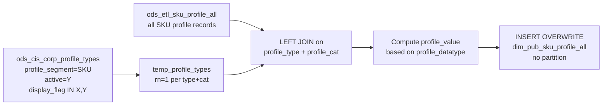

# DIM: SKU Profile — All Active Profiles (`dim_pub_sku_profile_all`)

- artifact_type: etl_table
- artifact_id: dim_us.dim_pub_sku_profile_all
- domain: part_sku
- one_line_purpose: This job builds a **comprehensive flat view of all active, displayable SKU profile attributes** by joining every SKU profile record to its profile type metadata. It normalises the raw multi-type profile value fields (character, integer, flo...
- layer_type: DIM
- source_kind: etl_sql
- evidence_source: source/etl/sql/part_sku/source/etl/flows/public_order_tools/ingest/public_part_dimension/script/dim_pub_sku_profile_all.sql

---

## L1 Data Foundation

### Identity and physical mapping
- **Table:** `dim_us.dim_pub_sku_profile_all`
- **Layer type:** DIM
- **Canonical / derived:** Derived / ETL-loaded (see L3)
- **Owner team:** not registered in metadata catalog

### Grain, scope, exclusions
- **Grain:** one row per `(sku_no, profile_type, profile_cat)` — a unique profile attribute for a SKU, scoped by its type and category.
- **Scope:** See L2 business purpose / L3 filters
- **Partition:** none — full overwrite on each run. - resolved from pipeline (see L4)
- **Natural key:** `sku_no`, `profile_type`, `profile_cat`.
- **Exclusions:** Not documented in repository

#### Grain detail (preserved)

- **Grain:** one row per `(sku_no, profile_type, profile_cat)` — a unique profile attribute for a SKU, scoped by its type and category.
- **Partition:** none — full overwrite on each run.
- **Natural key:** `sku_no`, `profile_type`, `profile_cat`.

---

### Cross-engine presence
| Engine | Present | Canonical FQN | Notes |
|--------|---------|---------------|-------|
| Hive | yes | `dim_pub_sku_profile_all` | ETL target / intermediate per evidence script |
| Vertica | pending | `dim_pub_sku_profile_all` | Confirm via hive2vertica flow evidence / MCP |

### Physical schema reference

Pointer block only - full column catalog lives in WKB L1 storage JSON.

| Field | Value |
|-------|-------|
| **Authoritative catalog** | WKB L1 storage seed (not duplicated in this file) |
| **entity_id** | `dim_us.dim_pub_sku_profile_all` |
| **l1_catalog_seed** | `target/storage/wkb/snapshots/_snapshot_id_template/l1_catalog/{engine}_{schema}_{table}.json` |
| **column_count** | pending (run ddl_seed_writer) |
| **partition_keys** | `none — full overwrite on each run.` |
| **ddl_source** | pending Bitbucket DDL / Vertica metadata ingest |
| **retrieval** | `python -m tools.wkb.indexing.run_query --query "part_sku dim_pub_sku_profile_all schema" --intent find_table_schema` |

### Lineage
| Object | Role |
|--------|------|
| `ods_${country_code}.ods_etl_sku_profile_all` | Primary source — all SKU profiles |
| `ods_${country_code}.ods_cis_corp_profile_types` | Profile type filter and metadata |
| `dim_${country_code}.dim_pub_sku_profile_all` | **Target** — all displayable SKU profile attributes with unified value |

---

### Freshness and load path
| Item | Value |
|------|-------|
| Load pattern | See L3 end-to-end / INSERT pattern in evidence script |
| Schedule | Not documented in repository |
| Parameters | `country_code` |


---

## L2 Declarative Knowledge

### Business purpose
This job builds a **comprehensive flat view of all active, displayable SKU profile attributes** by joining every SKU profile record to its profile type metadata. It normalises the raw multi-type profile value fields (character, integer, float, date) into a single `profile_value` string column, making the full profile catalogue queryable without needing to know which raw column (`profile_c`, `profile_i`, `profile_f`, or `profile_d`) each profile type uses. The result is a one-stop source for any downstream system that needs to look up arbitrary profile attributes for a SKU without hardcoding individual profile types.

---

### Audience and use cases
| Audience | How they benefit |
|----------|-----------------|
| **Product / data engineers** | Single table to query any SKU profile attribute by `profile_type` — no need to join multiple profile tables or know which data type column to use. |
| **E-commerce / PIM teams** | All displayable product attributes in one queryable view for product page rendering and attribute export. |
| **Analytics / reporting** | `profile_value` provides a ready-to-use string representation of any SKU attribute without per-type branching logic. |
| **Data quality teams** | `active`, `entry_datetime`, `data_source` enable completeness and freshness auditing across all SKU profile types. |

---

### Identifier search profile
- Primary lookup keys: see natural key under L1 Grain.
- Use latest snapshot / active flags when documented in L3 filters.

### Time field semantics
- **date_flag / partition columns:** none — full overwrite on each run.
- Primary reporting filter should use the partition column(s) documented in L1; resolve values via L4.


### Metrics served

| Category | Column | Logical metric | Business reading |
|----------|--------|----------------|------------------|
| Measures | — | — | No measure columns mapped for this table. |

### Metric serving map

**Formula authority:** [`source/contracts/part_sku/metric-index.md`](../../source/contracts/part_sku/metric-index.md)

N/A — no measure columns mapped for this table.

### etl_metrics

No governed logical metrics from `source/contracts/part_sku/metric-index.md` are mapped on this table.

---

### Metric serving map
N/A - not a `*_comb_mtd` / multi-period wide serving table (or map not present in legacy doc).


### Data products and column groups (preserved)

### Identifiers

- `sku_no` — product SKU
- `profile_type` — profile type code (e.g. `'MAP'`, `'WHLS_INDEX'`, `'GAME_PKG'`)
- `profile_cat` — profile category qualifier (e.g. `'PRIC'`, `'SKU'`, `'VEND'`)

### Profile type metadata (from profile types table)

- `profile_datatype` — data type of the profile value: `'C'` (char), `'A'` (alt char), `'I'` (integer), `'F'` (float), `'D'` (date)
- `profile_desc` — human-readable description of the profile type

### Normalised and raw values

- `profile_value` — unified string representation of the profile value, derived from the appropriate raw field based on `profile_datatype`
- `profile_c` — raw character value field
- `profile_i` — raw integer value field
- `profile_f` — raw float value field
- `profile_d` — raw date value field

### Control and audit

- `u_version` — record version
- `active` — whether this specific profile record is active
- `entry_datetime`, `entry_id` — creation metadata
- `data_source` — which ODS table the record came from (active vs history)

---

### etl_metrics

#### `i`
- **Source:** [metric-index.md](../../source/contracts/part_sku/metric-index.md#i)
- **Business definition:** Integer cast to string; empty string if null.
```sql
COALESCE(CAST(a.profile_i AS STRING), '')
```

#### `f`
- **Source:** [metric-index.md](../../source/contracts/part_sku/metric-index.md#f)
- **Business definition:** Float rounded to 4 decimal places, cast to string; empty string if null.
```sql
COALESCE(CAST(ROUND(a.profile_f, 4) AS STRING), '')
```

#### `d`
- **Source:** [metric-index.md](../../source/contracts/part_sku/metric-index.md#d)
- **Business definition:** Date cast to string; empty string if null.
```sql
COALESCE(CAST(a.profile_d AS STRING), '')
```


---

## L3 Procedural Knowledge

### Query and routing rules
**Business filters:** Use partition / date keys from L1 grain for reporting scope.
**Technical predicates (load only):** See Key filters and step-by-step logic below.

### Dimension join patterns
| Dimension FQN | Join keys | Purpose | Evidence |
|---------------|-----------|---------|----------|
| See step-by-step / base tables | See L3 steps | Dimension enrichment | `source/etl/sql/part_sku/source/etl/flows/public_order_tools/ingest/public_part_dimension/script/dim_pub_sku_profile_all.sql` |

### Key filters and ETL business logic
### Step 1 — `temp_profile_types` (view)

**Source:** `ods_cis_corp_profile_types`

**Filter:** `profile_segment = 'SKU'` AND `display_flag IN ('X', 'Y')` AND `active = 'Y'`

**De-duplication:** `ROW_NUMBER() OVER (PARTITION BY profile_type, profile_cat ORDER BY profile_datatype) = 1` — keeps one row per `(profile_type, profile_cat)` when multiple datatype entries exist, selecting by the first alphabetically by `profile_datatype`.

**Output:** `profile_type`, `profile_cat`, `profile_datatype`, `profile_desc`

---

### Step 2 — Final `INSERT OVERWRITE`

**From:** `ods_etl_sku_profile_all` (`a`) LEFT JOIN `temp_profile_types` (`b`) on `a.profile_type = b.profile_type AND a.profile_cat = b.profile_cat`

**Derived column — `profile_value`:**

| `profile_datatype` | Formula | Plain language |
|-------------------|---------|----------------|
| `'C'` or `'A'` | `COALESCE(a.profile_c, '')` | Character or alt-character value; empty string if null. |
| `'I'` | `COALESCE(CAST(a.profile_i AS STRING), '')` | Integer cast to string; empty string if null. |
| `'F'` | `COALESCE(CAST(ROUND(a.profile_f, 4) AS STRING), '')` | Float rounded to 4 decimal places, cast to string; empty string if null. |
| `'D'` | `COALESCE(CAST(a.profile_d AS STRING), '')` | Date cast to string; empty string if null. |
| Anything else (or NULL when LEFT JOIN finds no match) | `''` | No matching profile type metadata — empty string. |

**Pass-through columns:** `a.sku_no`, `a.profile_type`, `a.profile_cat`, `b.profi...

### Standard time-filter SQL
```sql
-- relative period filter using resolved partition value (see L4)
SELECT *
FROM dim_pub_sku_profile_all
WHERE /* partition predicate */ date_flag = '${partition_value}';
```

### End-to-end flow
**Runtime parameters:** `country_code`
**Target table:** `dim_${country_code}.dim_pub_sku_profile_all` — **full overwrite, no partitioning**.

1. Build `temp_profile_types`: filter `ods_cis_corp_profile_types` to `profile_segment='SKU'`, `active='Y'`, `display_flag IN ('X','Y')`. De-duplicate to `rn=1` per `(profile_type, profile_cat)` ordered by `profile_datatype`.
2. LEFT JOIN `ods_etl_sku_profile_all` to `temp_profile_types` on `profile_type + profile_cat`. Compute `profile_value`.
3. **INSERT OVERWRITE** into target.



---


#### High-level stages (preserved)

| Stage | Business meaning |
|-------|-----------------|
| **Profile type filter** | Reads `ods_cis_corp_profile_types` for SKU-segment profile types that are active and displayable (`display_flag IN ('X','Y')`). De-duplicates to one row per `(profile_type, profile_cat)` combination. |
| **Full profile join** | LEFT JOINs all SKU profile records from `ods_etl_sku_profile_all` to the filtered profile type metadata — enriches each record with its datatype and description. |
| **Value normalisation** | Computes `profile_value` by selecting the appropriate raw field based on `profile_datatype` and casting to a uniform string type. |
| **Full overwrite** | Replaces the entire target table on each run. |

**Parameters:** `country_code`

---


### Base tables register
| Object | Role in this job |
|--------|-----------------|
| `ods_${country_code}.ods_cis_corp_profile_types` | **Profile type metadata.** Filtered to SKU-segment, active, displayable types. Provides `profile_datatype` and `profile_desc` per `(profile_type, profile_cat)`. De-duplicated to one row. |
| `ods_${country_code}.ods_etl_sku_profile_all` | **Primary source.** All SKU profile records (merged active and history). Provides all profile values and audit fields. |

**Temporary tables (inside the job only):** `temp_profile_types` (view).

---

### Step-by-step logic
### Step 1 — `temp_profile_types` (view)

**Source:** `ods_cis_corp_profile_types`

**Filter:** `profile_segment = 'SKU'` AND `display_flag IN ('X', 'Y')` AND `active = 'Y'`

**De-duplication:** `ROW_NUMBER() OVER (PARTITION BY profile_type, profile_cat ORDER BY profile_datatype) = 1` — keeps one row per `(profile_type, profile_cat)` when multiple datatype entries exist, selecting by the first alphabetically by `profile_datatype`.

**Output:** `profile_type`, `profile_cat`, `profile_datatype`, `profile_desc`

---

### Step 2 — Final `INSERT OVERWRITE`

**From:** `ods_etl_sku_profile_all` (`a`) LEFT JOIN `temp_profile_types` (`b`) on `a.profile_type = b.profile_type AND a.profile_cat = b.profile_cat`

**Derived column — `profile_value`:**

| `profile_datatype` | Formula | Plain language |
|-------------------|---------|----------------|
| `'C'` or `'A'` | `COALESCE(a.profile_c, '')` | Character or alt-character value; empty string if null. |
| `'I'` | `COALESCE(CAST(a.profile_i AS STRING), '')` | Integer cast to string; empty string if null. |
| `'F'` | `COALESCE(CAST(ROUND(a.profile_f, 4) AS STRING), '')` | Float rounded to 4 decimal places, cast to string; empty string if null. |
| `'D'` | `COALESCE(CAST(a.profile_d AS STRING), '')` | Date cast to string; empty string if null. |
| Anything else (or NULL when LEFT JOIN finds no match) | `''` | No matching profile type metadata — empty string. |

**Pass-through columns:** `a.sku_no`, `a.profile_type`, `a.profile_cat`, `b.profile_datatype`, `b.profile_desc`, `a.u_version`, `a.profile_c`, `a.profile_i`, `a.profile_f`, `a.profile_d`, `a.active`, `a.entry_datetime`, `a.entry_id`, `a.data_source`

---

### Relationship map (embedded)

| from_fqn | to_fqn | cardinality | join_keys | provenance |
|----------|--------|-------------|-----------|------------|
| `ods_${country_code}.ods_etl_sku_profile_all` | `temp_profile_types` | many:1 | `a.profile_type = b.profile_type AND a.profile_cat = b.profile_cat ;` | etl_sql (source/etl/sql/part_sku/public_order_scripts/public_part_dimension/script/dim_pub_sku_profile_all.sql:1) |

`source/ref/part_sku/table relationship.txt`: Not documented in repository.

### Special logic (embedded)

Not documented in repository

### Column / field derivations (from ETL SQL)

| target_column | expression_sql | upstream_columns | upstream_tables | transform_kind | evidence |
|---------------|----------------|------------------|-----------------|----------------|----------|
| `sku_no` | `a.sku_no` | `sku_no` | `ods_${country_code}.ods_etl_sku_profile_all`, `temp_profile_types` | passthrough | `source/etl/sql/part_sku/public_order_scripts/public_part_dimension/script/dim_pub_sku_profile_all.sql:25` |
| `profile_type` | `a.profile_type` | `profile_type` | `ods_${country_code}.ods_etl_sku_profile_all`, `temp_profile_types` | passthrough | `source/etl/sql/part_sku/public_order_scripts/public_part_dimension/script/dim_pub_sku_profile_all.sql:26` |
| `profile_cat` | `a.profile_cat` | `profile_cat` | `ods_${country_code}.ods_etl_sku_profile_all`, `temp_profile_types` | passthrough | `source/etl/sql/part_sku/public_order_scripts/public_part_dimension/script/dim_pub_sku_profile_all.sql:27` |
| `profile_datatype` | `b.profile_datatype` | `profile_datatype` | `ods_${country_code}.ods_etl_sku_profile_all`, `temp_profile_types` | passthrough | `source/etl/sql/part_sku/public_order_scripts/public_part_dimension/script/dim_pub_sku_profile_all.sql:28` |
| `profile_desc` | `b.profile_desc` | `profile_desc` | `ods_${country_code}.ods_etl_sku_profile_all`, `temp_profile_types` | passthrough | `source/etl/sql/part_sku/public_order_scripts/public_part_dimension/script/dim_pub_sku_profile_all.sql:29` |
| `profile_value` | `CASE WHEN b.profile_datatype = 'C' THEN COALESCE(a.profile_c, '') WHEN b.profile_datatype = 'A' THEN COALESCE(a.profi...` | `profile_datatype`, `C`, `profile_c`, `A`, `I`, `profile_i`, `F`, `profile_f`, `D`, `profile_d` | `ods_${country_code}.ods_etl_sku_profile_all`, `temp_profile_types` | case | `source/etl/sql/part_sku/public_order_scripts/public_part_dimension/script/dim_pub_sku_profile_all.sql:24` |
| `u_version` | `a.u_version` | `u_version` | `ods_${country_code}.ods_etl_sku_profile_all`, `temp_profile_types` | passthrough | `source/etl/sql/part_sku/public_order_scripts/public_part_dimension/script/dim_pub_sku_profile_all.sql:42` |
| `profile_c` | `a.profile_c` | `profile_c` | `ods_${country_code}.ods_etl_sku_profile_all`, `temp_profile_types` | passthrough | `source/etl/sql/part_sku/public_order_scripts/public_part_dimension/script/dim_pub_sku_profile_all.sql:27` |
| `profile_i` | `a.profile_i` | `profile_i` | `ods_${country_code}.ods_etl_sku_profile_all`, `temp_profile_types` | passthrough | `source/etl/sql/part_sku/public_order_scripts/public_part_dimension/script/dim_pub_sku_profile_all.sql:36` |
| `profile_f` | `a.profile_f` | `profile_f` | `ods_${country_code}.ods_etl_sku_profile_all`, `temp_profile_types` | passthrough | `source/etl/sql/part_sku/public_order_scripts/public_part_dimension/script/dim_pub_sku_profile_all.sql:38` |
| `profile_d` | `a.profile_d` | `profile_d` | `ods_${country_code}.ods_etl_sku_profile_all`, `temp_profile_types` | passthrough | `source/etl/sql/part_sku/public_order_scripts/public_part_dimension/script/dim_pub_sku_profile_all.sql:40` |
| `active` | `a.active` | `active` | `ods_${country_code}.ods_etl_sku_profile_all`, `temp_profile_types` | passthrough | `source/etl/sql/part_sku/public_order_scripts/public_part_dimension/script/dim_pub_sku_profile_all.sql:47` |
| `entry_datetime` | `a.entry_datetime` | `entry_datetime` | `ods_${country_code}.ods_etl_sku_profile_all`, `temp_profile_types` | passthrough | `source/etl/sql/part_sku/public_order_scripts/public_part_dimension/script/dim_pub_sku_profile_all.sql:48` |
| `entry_id` | `a.entry_id` | `entry_id` | `ods_${country_code}.ods_etl_sku_profile_all`, `temp_profile_types` | passthrough | `source/etl/sql/part_sku/public_order_scripts/public_part_dimension/script/dim_pub_sku_profile_all.sql:49` |
| `data_source` | `a.data_source` | `data_source` | `ods_${country_code}.ods_etl_sku_profile_all`, `temp_profile_types` | passthrough | `source/etl/sql/part_sku/public_order_scripts/public_part_dimension/script/dim_pub_sku_profile_all.sql:50` |

### Sentinel and code values
| Value | Meaning |
|-------|---------|
| `profile_segment = 'SKU'` | Only SKU-level profile types — vendor or other segments excluded. |
| `display_flag IN ('X', 'Y')` | Only user-displayable profile types — internal or hidden types are excluded. |
| `active = 'Y'` (profile_types) | Only active profile type definitions. |
| `profile_value = ''` | The profile type has no value in the corresponding raw field, or no matching profile type metadata was found. |
| LEFT JOIN (no filter on `b`) | All SKU profile records are included, even those whose `(profile_type, profile_cat)` pair has no entry in `ods_cis_corp_profile_types` — those rows will have NULL `profile_datatype/desc` and `profile_value = ''`. |

---

---

## L4 Validation

### Resolved partition value
| Step | Source | How partition / date scope is determined |
|------|--------|------------------------------------------|
| 1 | evidence script / flow | See parameters in L1 Freshness and L3 filters - `source/etl/sql/part_sku/source/etl/flows/public_order_tools/ingest/public_part_dimension/script/dim_pub_sku_profile_all.sql` |

**Plain language:** Partition and date scope follow Azkaban/bootstrap parameters documented in the source script and orchestrating flow; do not hardcode calendar literals.

### Data quality checks
- Prefer row-count-by-partition, metric sums, and grain duplicate checks (see Validation SQL).
- Additional checks from legacy caveats / operational notes when present.

### Validation SQL
```sql
-- 1) Row count by partition
SELECT ${partition_col}, COUNT(*) AS row_cnt
FROM dim_${country_code}.dim_pub_sku_profile_all
WHERE ${partition_col} = '${partition_value}'
GROUP BY ${partition_col};

-- 2) Metric sum by business dimension (top deltas)
SELECT ${dim_key}, SUM(${metric}) AS metric_sum
FROM dim_${country_code}.dim_pub_sku_profile_all
WHERE ${partition_col} = '${partition_value}'
GROUP BY ${dim_key}
ORDER BY ABS(SUM(${metric})) DESC
LIMIT 20;

-- 3) Grain duplicate check
SELECT ${grain_key_1}, ${grain_key_2}, ${grain_key_3}, ${partition_col}, COUNT(*) AS cnt
FROM dim_${country_code}.dim_pub_sku_profile_all
WHERE ${partition_col} = '${partition_value}'
GROUP BY ${grain_key_1}, ${grain_key_2}, ${grain_key_3}, ${partition_col}
HAVING COUNT(*) > 1;
```

Replace placeholders from this file's Grain and keys / Data you can fetch sections, and use the resolved partition value from run scope.

### Caveats for interpretation
- **`profile_value` is always a string** — consumers must cast back to the appropriate type for numeric or date comparisons. Use `profile_f` directly for float arithmetic.
- **LEFT JOIN means unmatched profile types are included** — rows where `profile_type + profile_cat` has no entry in `ods_cis_corp_profile_types` (either filtered out or not present) will have NULL `profile_datatype` and empty `profile_value`. These are still in the output.
- **De-duplication in `temp_profile_types` selects by `profile_datatype` order** — if a `(profile_type, profile_cat)` pair has multiple datatype rows (which shouldn't occur normally), the first alphabetically by `profile_datatype` wins.
- **Full overwrite** — all profile records are replaced on each run, including both active and inactive (`active='N'`) profile records from `ods_etl_sku_profile_all`.

---

### Conflicts and open questions
- Schedule, owner, SLA: Not documented in repository (unless preserved schedule evidence above).
- Vertica MCP verification: pending unless confirmed in L5.


---

## L5 Runtime View

### Query path and engine preference
| Role | Hive object | Vertica object | Sync mode | Evidence | MCP verified |
|------|-------------|----------------|-----------|----------|--------------|
| **Query for reporting** | *See script lineage* | `dim_${country_code}.dim_pub_sku_profile_all` | *Verify from flow* | *Add flow file:line* | pending |
| **Hive alternative** | `*` | `dim_${country_code}.dim_pub_sku_profile_all` | - | *See dependencies* | - |
| **ETL internal** | staging/temp tables | *Not synced to Vertica* | - | *See step-by-step logic* | - |

Business users should query `dim_${country_code}.dim_pub_sku_profile_all` in Vertica once MCP verification is completed for this document.

### Access constraints
- Country / company schema parameters may apply (`literal_country`, `company_no`, etc.).
- Hive-only staging objects are not reporting surfaces unless synced.

### Query risk profile
| Field | Value |
|-------|-------|
| requires_date_predicate | unknown |
| scan_risk_tier | medium |

---

## L6 Access and Consumption

### Primary consumers and use cases
| Audience | How they benefit |
|----------|-----------------|
| **Product / data engineers** | Single table to query any SKU profile attribute by `profile_type` — no need to join multiple profile tables or know which data type column to use. |
| **E-commerce / PIM teams** | All displayable product attributes in one queryable view for product page rendering and attribute export. |
| **Analytics / reporting** | `profile_value` provides a ready-to-use string representation of any SKU attribute without per-type branching logic. |
| **Data quality teams** | `active`, `entry_datetime`, `data_source` enable completeness and freshness auditing across all SKU profile types. |

---

### Representative query patterns
```sql
-- certified / illustrative lookup - replace predicates from L1/L4
SELECT *
FROM dim_pub_sku_profile_all
WHERE date_flag = '${partition_value}'
LIMIT 100;
```

### Dependencies and notes
### Upstream objects (verified)

| Object | Usage | Evidence |
|--------|-------|----------|
| `ods_${country_code}.ods_cis_corp_profile_types` | Profile type metadata; filter: profile_segment='SKU', active='Y', display_flag IN ('X','Y') | `dim_pub_sku_profile_all.sql:16-20` |
| `ods_${country_code}.ods_etl_sku_profile_all` | All SKU profile records | `dim_pub_sku_profile_all.sql:51` |

### Downstream consumers (verified)

| Object / script | Evidence |
|-----------------|----------|
| None identified in repository. | — |

### Operational detail (verified)

- Full overwrite: `INSERT OVERWRITE TABLE dim_${country_code}.dim_pub_sku_profile_all` — no partition clause — `dim_pub_sku_profile_all.sql:23`

### Not documented in repository

- Schedule, owner, SLA — not in scripts or configs

---

*Document generated from `source/etl/sql/part_sku/source/etl/flows/public_order_tools/ingest/public_part_dimension/script/dim_pub_sku_profile_all.sql`.*

#### Not documented in repository
- Owner, SLA (unless schedule evidence preserved above)
- Any dependency without `file:line` evidence in this document

---

*Document migrated to L1-L6 from legacy Knowledgebase content. Evidence: `source/etl/sql/part_sku/source/etl/flows/public_order_tools/ingest/public_part_dimension/script/dim_pub_sku_profile_all.sql`.*
