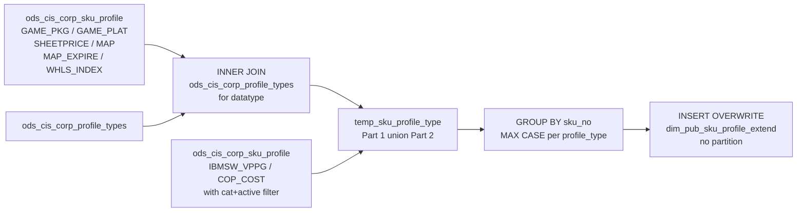

# DIM: SKU Pricing Profile — Extended (`dim_pub_sku_profile_extend`)

- artifact_type: etl_table
- artifact_id: dim_us.dim_pub_sku_profile_extend
- domain: part_sku
- one_line_purpose: This job builds a **pivoted SKU pricing and special-program profile dimension** by selecting eight specific SKU profile types and flattening them into named columns — one row per SKU. It covers gaming platform/package classifications, sheet...
- layer_type: DIM
- source_kind: etl_sql
- evidence_source: source/etl/sql/part_sku/source/etl/flows/public_order_tools/ingest/public_part_dimension/script/dim_pub_sku_profile_extend.sql

---

## L1 Data Foundation

### Identity and physical mapping
- **Table:** `dim_us.dim_pub_sku_profile_extend`
- **Layer type:** DIM
- **Canonical / derived:** Derived / ETL-loaded (see L3)
- **Owner team:** not registered in metadata catalog

### Grain, scope, exclusions
- **Grain:** one row per `sku_no` — a unique product SKU with all 8 profile attributes flattened into columns.
- **Scope:** See L2 business purpose / L3 filters
- **Partition:** none — full overwrite on each run. - resolved from pipeline (see L4)
- **Natural key:** `sku_no`.
- **Exclusions:** Not documented in repository

#### Grain detail (preserved)

- **Grain:** one row per `sku_no` — a unique product SKU with all 8 profile attributes flattened into columns.
- **Partition:** none — full overwrite on each run.
- **Natural key:** `sku_no`.

---

### Cross-engine presence
| Engine | Present | Canonical FQN | Notes |
|--------|---------|---------------|-------|
| Hive | yes | `dim_pub_sku_profile_extend` | ETL target / intermediate per evidence script |
| Vertica | pending | `dim_pub_sku_profile_extend` | Confirm via hive2vertica flow evidence / MCP |

### Physical schema reference

Pointer block only - full column catalog lives in WKB L1 storage JSON.

| Field | Value |
|-------|-------|
| **Authoritative catalog** | WKB L1 storage seed (not duplicated in this file) |
| **entity_id** | `dim_us.dim_pub_sku_profile_extend` |
| **l1_catalog_seed** | `target/storage/wkb/snapshots/_snapshot_id_template/l1_catalog/{engine}_{schema}_{table}.json` |
| **column_count** | pending (run ddl_seed_writer) |
| **partition_keys** | `none — full overwrite on each run.` |
| **ddl_source** | pending Bitbucket DDL / Vertica metadata ingest |
| **retrieval** | `python -m tools.wkb.indexing.run_query --query "part_sku dim_pub_sku_profile_extend schema" --intent find_table_schema` |

### Lineage
| Object | Role |
|--------|------|
| `ods_${country_code}.ods_cis_corp_sku_profile` | Primary source — all 8 profile types |
| `ods_${country_code}.ods_cis_corp_profile_types` | Datatype metadata for Part 1 profile types |
| `dim_${country_code}.dim_pub_sku_profile_extend` | **Target** — pivoted SKU pricing profile dimension |

---

### Freshness and load path
| Item | Value |
|------|-------|
| Load pattern | See L3 end-to-end / INSERT pattern in evidence script |
| Schedule | Not documented in repository |
| Parameters | `country_code` |


---

## L2 Declarative Knowledge

### Business purpose
This job builds a **pivoted SKU pricing and special-program profile dimension** by selecting eight specific SKU profile types and flattening them into named columns — one row per SKU. It covers gaming platform/package classifications, sheet pricing, minimum advertised price (MAP) and its expiry, standard wholesale price index, IBM software VPP group, and COP (Cost of Product) cost. The result eliminates the need to filter and pivot the raw profile table in every downstream query that needs these pricing attributes.

---

### Audience and use cases
| Audience | How they benefit |
|----------|-----------------|
| **Pricing teams** | `min_adv_price` (MAP), `map_expire`, `whls_index` (WHLS_INDEX) — pre-resolved MAP and wholesale pricing attributes per SKU without raw profile table queries. |
| **Gaming / channel management** | `game_pkg`, `game_plat` — gaming package and platform codes for gaming category reporting and channel eligibility. |
| **Vendor programs** | `ibmsw_vppg` — IBM Software VPP group assignment; `cop_cost` — COP (Cost of Product) cost for special vendor program pricing. |
| **Finance / purchasing** | `sheetprice` — sheet price code for pricing sheet lookups. |

---

### Identifier search profile
- Primary lookup keys: see natural key under L1 Grain.
- Use latest snapshot / active flags when documented in L3 filters.

### Time field semantics
- **date_flag / partition columns:** none — full overwrite on each run.
- Primary reporting filter should use the partition column(s) documented in L1; resolve values via L4.


### Metrics served

| Category | Column | Logical metric | Business reading |
|----------|--------|----------------|------------------|
| Measures | — | — | No measure columns mapped for this table. |

### Metric serving map

**Formula authority:** [`source/contracts/part_sku/metric-index.md`](../../source/contracts/part_sku/metric-index.md)

N/A — no measure columns mapped for this table.

### etl_metrics

No governed logical metrics from `source/contracts/part_sku/metric-index.md` are mapped on this table.

---

### Metric serving map
N/A - not a `*_comb_mtd` / multi-period wide serving table (or map not present in legacy doc).


### Data products and column groups (preserved)

### Identifiers

- `sku_no` — product SKU

### Pivoted profile columns

| Column | Profile type | Profile cat filter | Data type | Default when absent |
|--------|-------------|-------------------|-----------|---------------------|
| `game_pkg` | `GAME_PKG` | — | String (from datatype) | `''` (empty string) |
| `game_plat` | `GAME_PLAT` | — | String (from datatype) | `''` (empty string) |
| `sheetprice` | `SHEETPRICE` | — | String (from datatype) | `''` (empty string) |
| `min_adv_price` | `MAP` | — | String (from datatype) | NULL |
| `map_expire` | `MAP_EXPIRE` | — | String (from datatype) | NULL |
| `whls_index` | `WHLS_INDEX` | — | String (from datatype) | NULL |
| `ibmsw_vppg` | `IBMSW_VPPG` | `profile_cat = 'SKU'` | String (`profile_c`) | NULL |
| `cop_cost` | `COP_COST` | `profile_cat = 'SKU'`, `active = 'Y'` | `DECIMAL(20,8)` (from `profile_f`) | NULL |

### Audit

- `etl_timestamp` — ETL run time (Los Angeles timezone)

---

### etl_metrics

#### `c`
- **Source:** [metric-index.md](../../source/contracts/part_sku/metric-index.md#c)
- **Business definition:** Character value; empty if null.
```sql
COALESCE(sp.profile_c, '')
```

#### `i`
- **Source:** [metric-index.md](../../source/contracts/part_sku/metric-index.md#i)
- **Business definition:** Integer cast to string.
```sql
COALESCE(CAST(sp.profile_i AS STRING), '')
```

#### `f`
- **Source:** [metric-index.md](../../source/contracts/part_sku/metric-index.md#f)
- **Business definition:** Float rounded to 2 decimals, cast to string.
```sql
COALESCE(CAST(ROUND(sp.profile_f, 2) AS STRING), '')
```

#### `d`
- **Source:** [metric-index.md](../../source/contracts/part_sku/metric-index.md#d)
- **Business definition:** Date cast to string.
```sql
COALESCE(CAST(sp.profile_d AS STRING), '')
```

#### `etl_timestamp`
- **Source:** [metric-index.md](../../source/contracts/part_sku/metric-index.md#etl_timestamp)
- **Business definition:** ETL run time.
```sql
from_utc_timestamp(current_timestamp(), 'America/Los_Angeles')
```


---

## L3 Procedural Knowledge

### Query and routing rules
**Business filters:** Use partition / date keys from L1 grain for reporting scope.
**Technical predicates (load only):** See Key filters and step-by-step logic below.

### Dimension join patterns
| Dimension FQN | Join keys | Purpose | Evidence |
|---------------|-----------|---------|----------|
| See step-by-step / base tables | See L3 steps | Dimension enrichment | `source/etl/sql/part_sku/source/etl/flows/public_order_tools/ingest/public_part_dimension/script/dim_pub_sku_profile_extend.sql` |

### Key filters and ETL business logic
### Step 1 — `temp_sku_profile_type` (view)

**Part 1 — Six profile types with datatype normalisation:**

**Source:** `ods_cis_corp_sku_profile` (`sp`) INNER JOIN `ods_cis_corp_profile_types` (`pt`) on `sp.profile_type = pt.profile_type`

**Filter:** `sp.profile_type IN ('GAME_PKG','GAME_PLAT','SHEETPRICE','MAP','MAP_EXPIRE','WHLS_INDEX')` AND `pt.profile_datatype IN ('C','I','F','D')`

**`profile_data` normalisation:**

| `profile_datatype` | Formula | Plain language |
|-------------------|---------|----------------|
| `'C'` | `COALESCE(sp.profile_c, '')` | Character value; empty if null. |
| `'I'` | `COALESCE(CAST(sp.profile_i AS STRING), '')` | Integer cast to string. |
| `'F'` | `COALESCE(CAST(ROUND(sp.profile_f, 2) AS STRING), '')` | Float rounded to 2 decimals, cast to string. |
| `'D'` | `COALESCE(CAST(sp.profile_d AS STRING), '')` | Date cast to string. |
| else | `''` | No known datatype. |

---

**Part 2 — Two profile types with direct filters:**

**Source:** `ods_cis_corp_sku_profile` (`sp`) — no join to profile types

**Filter and mapping:**

| Profile type | Additional filter | `profile_data` formula |
|-------------|-------------------|----------------------|
| `IBMSW_VPPG` | `profile_cat = 'SKU'` | `COALESCE(sp.profile_c, '')` |
| `COP_COST` | `profile_cat = 'SKU'` AND `active = 'Y'` | `COALESCE(CAST(sp.profile_f AS STRING), '')` |
| Other (ELSE) | — | `''` |

---

### Step 2 — Final `INSERT OVERWRITE`

**From:** `temp_sku_profile_type` (`spt`), GROUP BY `spt.s...

### Standard time-filter SQL
```sql
-- relative period filter using resolved partition value (see L4)
SELECT *
FROM dim_pub_sku_profile_extend
WHERE /* partition predicate */ date_flag = '${partition_value}';
```

### End-to-end flow
**Runtime parameters:** `country_code`
**Target table:** `dim_${country_code}.dim_pub_sku_profile_extend` — **full overwrite, no partitioning**.

1. Build `temp_sku_profile_type` view:
   - **Part 1:** `ods_cis_corp_sku_profile` INNER JOIN `ods_cis_corp_profile_types` for 6 profile types; normalise `profile_data` string based on `profile_datatype`.
   - **Part 2:** `ods_cis_corp_sku_profile` for IBMSW_VPPG and COP_COST with category/active filters; normalise `profile_data` string.
   - UNION ALL both parts.
2. **INSERT OVERWRITE**: GROUP BY `sku_no`; pivot 8 profile types into named columns using `MAX(CASE WHEN ...)`.



---


#### High-level stages (preserved)

| Stage | Business meaning |
|-------|-----------------|
| **Profile type read (Part 1)** | Reads six profile types (GAME_PKG, GAME_PLAT, SHEETPRICE, MAP, MAP_EXPIRE, WHLS_INDEX) from `ods_cis_corp_sku_profile`, joined to `ods_cis_corp_profile_types` to get the declared datatype. Normalises the raw value to a string based on datatype. |
| **Profile type read (Part 2)** | Reads IBMSW_VPPG (`profile_cat='SKU'`) and COP_COST (`profile_cat='SKU'`, `active='Y'`) directly from `ods_cis_corp_sku_profile` without the profile types join — uses profile_c and profile_f respectively. |
| **Pivot** | Groups by `sku_no`; applies `MAX(CASE WHEN ...)` to produce one named column per profile type. |
| **Full overwrite** | Replaces the entire target table on each run. |

**Parameters:** `country_code`

---


### Base tables register
| Object | Role in this job |
|--------|-----------------|
| `ods_${country_code}.ods_cis_corp_sku_profile` | **Primary source.** SKU profile records. Used in both Part 1 (with profile_types join) and Part 2 (direct filter). |
| `ods_${country_code}.ods_cis_corp_profile_types` | Profile type metadata — provides `profile_datatype` for the 6 types in Part 1 only. |

**Temporary tables (inside the job only):** `temp_sku_profile_type` (view).

---

### Step-by-step logic
### Step 1 — `temp_sku_profile_type` (view)

**Part 1 — Six profile types with datatype normalisation:**

**Source:** `ods_cis_corp_sku_profile` (`sp`) INNER JOIN `ods_cis_corp_profile_types` (`pt`) on `sp.profile_type = pt.profile_type`

**Filter:** `sp.profile_type IN ('GAME_PKG','GAME_PLAT','SHEETPRICE','MAP','MAP_EXPIRE','WHLS_INDEX')` AND `pt.profile_datatype IN ('C','I','F','D')`

**`profile_data` normalisation:**

| `profile_datatype` | Formula | Plain language |
|-------------------|---------|----------------|
| `'C'` | `COALESCE(sp.profile_c, '')` | Character value; empty if null. |
| `'I'` | `COALESCE(CAST(sp.profile_i AS STRING), '')` | Integer cast to string. |
| `'F'` | `COALESCE(CAST(ROUND(sp.profile_f, 2) AS STRING), '')` | Float rounded to 2 decimals, cast to string. |
| `'D'` | `COALESCE(CAST(sp.profile_d AS STRING), '')` | Date cast to string. |
| else | `''` | No known datatype. |

---

**Part 2 — Two profile types with direct filters:**

**Source:** `ods_cis_corp_sku_profile` (`sp`) — no join to profile types

**Filter and mapping:**

| Profile type | Additional filter | `profile_data` formula |
|-------------|-------------------|----------------------|
| `IBMSW_VPPG` | `profile_cat = 'SKU'` | `COALESCE(sp.profile_c, '')` |
| `COP_COST` | `profile_cat = 'SKU'` AND `active = 'Y'` | `COALESCE(CAST(sp.profile_f AS STRING), '')` |
| Other (ELSE) | — | `''` |

---

### Step 2 — Final `INSERT OVERWRITE`

**From:** `temp_sku_profile_type` (`spt`), GROUP BY `spt.sku_no`

**Derived columns:**

| Column | Formula | Notes |
|--------|---------|-------|
| `game_pkg` | `MAX(CASE WHEN profile_type='GAME_PKG' THEN profile_data ELSE '' END)` | Empty string default. |
| `game_plat` | `MAX(CASE WHEN profile_type='GAME_PLAT' THEN profile_data ELSE '' END)` | Empty string default. |
| `sheetprice` | `MAX(CASE WHEN profile_type='SHEETPRICE' THEN profile_data ELSE '' END)` | Empty string default. |
| `min_adv_price` | `MAX(CASE WHEN profile_type='MAP' THEN profile_data ELSE NULL END)` | NULL default. |
| `map_expire` | `MAX(CASE WHEN profile_type='MAP_EXPIRE' THEN profile_data ELSE NULL END)` | NULL default. |
| `whls_index` | `MAX(CASE WHEN profile_type='WHLS_INDEX' THEN profile_data ELSE NULL END)` | NULL default. |
| `ibmsw_vppg` | `MAX(CASE WHEN profile_type='IBMSW_VPPG' THEN profile_data ELSE NULL END)` | NULL default. |
| `cop_cost` | `MAX(CASE WHEN profile_type='COP_COST' THEN CAST(profile_data AS DECIMAL(20,8)) ELSE NULL END)` | Cast to DECIMAL(20,8); NULL default. |
| `etl_timestamp` | `from_utc_timestamp(current_timestamp(), 'America/Los_Angeles')` | ETL run time. |

---

### Relationship map (embedded)

| from_fqn | to_fqn | cardinality | join_keys | provenance |
|----------|--------|-------------|-----------|------------|
| `ods_${country_code}.ods_cis_corp_sku_profile` | `ods_${country_code}.ods_cis_corp_profile_types` | many:1 | `sp.profile_type=pt.profile_type` | etl_sql (source/etl/sql/part_sku/public_order_scripts/public_part_dimension/script/dim_pub_sku_profile_extend.sql:1) |

`source/ref/part_sku/table relationship.txt`: Not documented in repository.

### Special logic (embedded)

Not documented in repository

### Column / field derivations (from ETL SQL)

| target_column | expression_sql | upstream_columns | upstream_tables | transform_kind | evidence |
|---------------|----------------|------------------|-----------------|----------------|----------|
| `sku_no` | `spt.sku_no` | `sku_no` | `temp_sku_profile_type` | passthrough | `source/etl/sql/part_sku/public_order_scripts/public_part_dimension/script/dim_pub_sku_profile_extend.sql:37` |
| `game_pkg` | `max(case when spt.profile_type = 'GAME_PKG' then profile_data else '' end)` | `profile_type`, `GAME_PKG`, `profile_data` | `temp_sku_profile_type` | case | `source/etl/sql/part_sku/public_order_scripts/public_part_dimension/script/dim_pub_sku_profile_extend.sql:38` |
| `game_plat` | `max(case when spt.profile_type = 'GAME_PLAT' then profile_data else '' end)` | `profile_type`, `GAME_PLAT`, `profile_data` | `temp_sku_profile_type` | case | `source/etl/sql/part_sku/public_order_scripts/public_part_dimension/script/dim_pub_sku_profile_extend.sql:38` |
| `sheetprice` | `max(case when spt.profile_type = 'SHEETPRICE' then profile_data else ''end)` | `profile_type`, `SHEETPRICE`, `profile_data` | `temp_sku_profile_type` | case | `source/etl/sql/part_sku/public_order_scripts/public_part_dimension/script/dim_pub_sku_profile_extend.sql:42` |
| `min_adv_price` | `max(case when spt.profile_type = 'MAP' then profile_data else null end)` | `profile_type`, `MAP`, `profile_data` | `temp_sku_profile_type` | case | `source/etl/sql/part_sku/public_order_scripts/public_part_dimension/script/dim_pub_sku_profile_extend.sql:36` |
| `map_expire` | `max(case when spt.profile_type = 'MAP_EXPIRE' then profile_data else null end)` | `profile_type`, `MAP_EXPIRE`, `profile_data` | `temp_sku_profile_type` | case | `source/etl/sql/part_sku/public_order_scripts/public_part_dimension/script/dim_pub_sku_profile_extend.sql:46` |
| `whls_index` | `max(case when spt.profile_type = 'WHLS_INDEX' then profile_data else null end)` | `profile_type`, `WHLS_INDEX`, `profile_data` | `temp_sku_profile_type` | case | `source/etl/sql/part_sku/public_order_scripts/public_part_dimension/script/dim_pub_sku_profile_extend.sql:48` |
| `etl_timestamp` | `from_utc_timestamp(current_timestamp(), 'America/Los_Angeles')` | `from_utc_timestamp`, `current_timestamp`, `America`, `Los_Angeles` | `temp_sku_profile_type` | arithmetic | `source/etl/sql/part_sku/public_order_scripts/public_part_dimension/script/dim_pub_sku_profile_extend.sql:50` |
| `ibmsw_vppg` | `max(case when spt.profile_type = 'IBMSW_VPPG' then profile_data else null end)` | `profile_type`, `IBMSW_VPPG`, `profile_data` | `temp_sku_profile_type` | case | `source/etl/sql/part_sku/public_order_scripts/public_part_dimension/script/dim_pub_sku_profile_extend.sql:51` |
| `cop_cost` | `max(case when spt.profile_type = 'COP_COST' then cast(profile_data as decimal(20,8)) else null end)` | `profile_type`, `COP_COST`, `profile_data` | `temp_sku_profile_type` | case | `source/etl/sql/part_sku/public_order_scripts/public_part_dimension/script/dim_pub_sku_profile_extend.sql:53` |

### Sentinel and code values
| Value | Meaning |
|-------|---------|
| `game_pkg = ''` | No GAME_PKG profile set for the SKU (empty string, not NULL). |
| `game_plat = ''` | No GAME_PLAT profile set. |
| `sheetprice = ''` | No SHEETPRICE profile set. |
| `min_adv_price = NULL` | No MAP profile set for the SKU. |
| `map_expire = NULL` | No MAP expiry set. |
| `whls_index = NULL` | No standard wholesale price index set. |
| `ibmsw_vppg = NULL` | SKU is not in an IBM Software VPP group. |
| `cop_cost = NULL` | No active COP cost defined for the SKU. |
| `profile_cat = 'SKU'` (Part 2) | Category filter ensuring only SKU-level profiles are selected for IBMSW_VPPG and COP_COST. |
| `active = 'Y'` (COP_COST only) | Only active COP_COST profiles are selected — inactive COP costs are excluded. |

---

---

## L4 Validation

### Resolved partition value
| Step | Source | How partition / date scope is determined |
|------|--------|------------------------------------------|
| 1 | evidence script / flow | See parameters in L1 Freshness and L3 filters - `source/etl/sql/part_sku/source/etl/flows/public_order_tools/ingest/public_part_dimension/script/dim_pub_sku_profile_extend.sql` |

**Plain language:** Partition and date scope follow Azkaban/bootstrap parameters documented in the source script and orchestrating flow; do not hardcode calendar literals.

### Data quality checks
- Prefer row-count-by-partition, metric sums, and grain duplicate checks (see Validation SQL).
- Additional checks from legacy caveats / operational notes when present.

### Validation SQL
```sql
-- 1) Row count by partition
SELECT ${partition_col}, COUNT(*) AS row_cnt
FROM dim_${country_code}.dim_pub_sku_profile_extend
WHERE ${partition_col} = '${partition_value}'
GROUP BY ${partition_col};

-- 2) Metric sum by business dimension (top deltas)
SELECT ${dim_key}, SUM(${metric}) AS metric_sum
FROM dim_${country_code}.dim_pub_sku_profile_extend
WHERE ${partition_col} = '${partition_value}'
GROUP BY ${dim_key}
ORDER BY ABS(SUM(${metric})) DESC
LIMIT 20;

-- 3) Grain duplicate check
SELECT ${grain_key_1}, ${grain_key_2}, ${grain_key_3}, ${partition_col}, COUNT(*) AS cnt
FROM dim_${country_code}.dim_pub_sku_profile_extend
WHERE ${partition_col} = '${partition_value}'
GROUP BY ${grain_key_1}, ${grain_key_2}, ${grain_key_3}, ${partition_col}
HAVING COUNT(*) > 1;
```

Replace placeholders from this file's Grain and keys / Data you can fetch sections, and use the resolved partition value from run scope.

### Caveats for interpretation
- **Three columns use empty string as default, five use NULL** — this inconsistency means `IS NULL` and `= ''` filters produce different result sets for "absent" values. See the sentinel table above.
- **`cop_cost` is the only numeric column** (`DECIMAL(20,8)`) — all other pivoted columns are strings. Do not use string comparisons for `cop_cost` ranges.
- **`whls_index` is a string** — even though the underlying `profile_f` is a float, it is rounded to 2 decimals and stored as string. Cast before numeric comparisons.
- **COP_COST has an `active='Y'` filter** that IBMSW_VPPG does not — inactive COP costs are excluded while inactive IBMSW_VPPG records may appear.
- **Part 1 uses INNER JOIN** to `ods_cis_corp_profile_types` — SKUs with profile types not present in the profile types table for the 6 Part 1 types will produce no Part 1 rows. However, since this is a profile_type list filter, this should not normally drop valid profiles.
- **Full overwrite** — all rows replaced on each run.

---

### Conflicts and open questions
- Schedule, owner, SLA: Not documented in repository (unless preserved schedule evidence above).
- Vertica MCP verification: pending unless confirmed in L5.


#### Key differences between `game_pkg`/`game_plat`/`sheetprice` vs other columns (preserved from legacy doc)

The first three columns default to **empty string (`''`)** when absent; all remaining columns default to **NULL**. Consumers must handle both cases when filtering for "not set" values.

---

---

## L5 Runtime View

### Query path and engine preference
| Role | Hive object | Vertica object | Sync mode | Evidence | MCP verified |
|------|-------------|----------------|-----------|----------|--------------|
| **Query for reporting** | *See script lineage* | `dim_${country_code}.dim_pub_sku_profile_extend` | *Verify from flow* | *Add flow file:line* | pending |
| **Hive alternative** | `*` | `dim_${country_code}.dim_pub_sku_profile_extend` | - | *See dependencies* | - |
| **ETL internal** | staging/temp tables | *Not synced to Vertica* | - | *See step-by-step logic* | - |

Business users should query `dim_${country_code}.dim_pub_sku_profile_extend` in Vertica once MCP verification is completed for this document.

### Access constraints
- Country / company schema parameters may apply (`literal_country`, `company_no`, etc.).
- Hive-only staging objects are not reporting surfaces unless synced.

### Query risk profile
| Field | Value |
|-------|-------|
| requires_date_predicate | unknown |
| scan_risk_tier | medium |

---

## L6 Access and Consumption

### Primary consumers and use cases
| Audience | How they benefit |
|----------|-----------------|
| **Pricing teams** | `min_adv_price` (MAP), `map_expire`, `whls_index` (WHLS_INDEX) — pre-resolved MAP and wholesale pricing attributes per SKU without raw profile table queries. |
| **Gaming / channel management** | `game_pkg`, `game_plat` — gaming package and platform codes for gaming category reporting and channel eligibility. |
| **Vendor programs** | `ibmsw_vppg` — IBM Software VPP group assignment; `cop_cost` — COP (Cost of Product) cost for special vendor program pricing. |
| **Finance / purchasing** | `sheetprice` — sheet price code for pricing sheet lookups. |

---

### Representative query patterns
```sql
-- certified / illustrative lookup - replace predicates from L1/L4
SELECT *
FROM dim_pub_sku_profile_extend
WHERE date_flag = '${partition_value}'
LIMIT 100;
```

### Dependencies and notes
### Upstream objects (verified)

| Object | Usage | Evidence |
|--------|-------|----------|
| `ods_${country_code}.ods_cis_corp_sku_profile` | All 8 profile types; active filter for COP_COST | `dim_pub_sku_profile_extend.sql:16,23` |
| `ods_${country_code}.ods_cis_corp_profile_types` | `profile_datatype` for 6 Part 1 types | `dim_pub_sku_profile_extend.sql:17-18` |

### Downstream consumers (verified)

| Object / script | Evidence |
|-----------------|----------|
| None identified in repository. | — |

### Operational detail (verified)

- Full overwrite: `INSERT OVERWRITE TABLE dim_${country_code}.dim_pub_sku_profile_extend` — no partition clause — `dim_pub_sku_profile_extend.sql:35`

### Not documented in repository

- Schedule, owner, SLA — not in scripts or configs

---

*Document generated from `source/etl/sql/part_sku/source/etl/flows/public_order_tools/ingest/public_part_dimension/script/dim_pub_sku_profile_extend.sql`.*

#### Not documented in repository
- Owner, SLA (unless schedule evidence preserved above)
- Any dependency without `file:line` evidence in this document

---

*Document migrated to L1-L6 from legacy Knowledgebase content. Evidence: `source/etl/sql/part_sku/source/etl/flows/public_order_tools/ingest/public_part_dimension/script/dim_pub_sku_profile_extend.sql`.*
