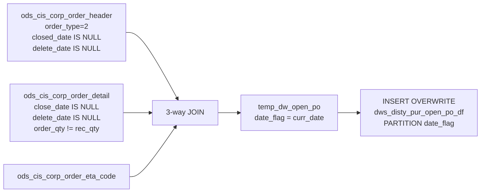

# DWS: Open Purchase Order — Daily Snapshot (`dws_disty_pur_open_po_df`)

- artifact_type: etl_table
- artifact_id: ${target_db}.dws_disty_pur_open_po_df
- domain: po
- one_line_purpose: This job creates a **daily snapshot of all outstanding purchase order lines** — POs that have been placed with vendors (order type 2) but not yet fully received. It identifies every open PO line where the received quantity is less than the ...
- layer_type: DWS
- source_kind: etl_sql
- evidence_source: source/etl/sql/po/data_service/open_po/python/load_disty_pur_open_po_df.py

---

## L1 Data Foundation

### Identity and physical mapping
- **Table:** `${target_db}.dws_disty_pur_open_po_df`
- **Layer type:** DWS
- **Canonical / derived:** Derived / ETL-loaded (see L3)
- **Owner team:** not registered in metadata catalog

### Grain, scope, exclusions
- **Grain:** one row per `(order_type, order_no, order_line_no, date_flag)` — a unique open PO line as of the snapshot date.
- **Scope:** See L2 business purpose / L3 filters
- **Partition:** `date_flag` — the literal `curr_date` parameter (cast as date); the entire partition is replaced on each run. - resolved from pipeline (see L4)
- **Natural key:** `order_no`, `order_line_no` within a `date_flag` partition (all rows have `order_type = 2`).
- **Exclusions:** Not documented in repository

#### Grain detail (preserved)

- **Grain:** one row per `(order_type, order_no, order_line_no, date_flag)` — a unique open PO line as of the snapshot date.
- **Partition:** `date_flag` — the literal `curr_date` parameter (cast as date); the entire partition is replaced on each run.
- **Natural key:** `order_no`, `order_line_no` within a `date_flag` partition (all rows have `order_type = 2`).

---

### Cross-engine presence
| Engine | Present | Canonical FQN | Notes |
|--------|---------|---------------|-------|
| Hive | yes | `${target_db}.dws_disty_pur_open_po_df` | ETL target / intermediate per evidence script |
| Vertica | pending | `${target_db}.dws_disty_pur_open_po_df` | Confirm via hive2vertica flow evidence / MCP |

### Physical schema reference

Pointer block only - full column catalog lives in WKB L1 storage JSON.

| Field | Value |
|-------|-------|
| **Authoritative catalog** | WKB L1 storage seed (not duplicated in this file) |
| **entity_id** | `${target_db}.dws_disty_pur_open_po_df` |
| **l1_catalog_seed** | `target/storage/wkb/snapshots/_snapshot_id_template/l1_catalog/{engine}_{schema}_{table}.json` |
| **column_count** | pending (run ddl_seed_writer) |
| **partition_keys** | `date_flag, curr_date` |
| **ddl_source** | pending Bitbucket DDL / Vertica metadata ingest |
| **retrieval** | `python -m tools.wkb.indexing.run_query --query "po load_disty_pur_open_po_df schema" --intent find_table_schema` |

### Lineage
| Object | Role |
|--------|------|
| `${source_db}.ods_cis_corp_order_header` | PO headers — type, account, location, dates |
| `${source_db}.ods_cis_corp_order_detail` | PO lines — SKU, quantities, cost, expected date |
| `${source_db}.ods_cis_corp_order_eta_code` | ETA code per PO line |
| `${target_db}.dws_disty_pur_open_po_df` | **Target** — daily open PO snapshot |

---

### Freshness and load path
| Item | Value |
|------|-------|
| Load pattern | See L3 end-to-end / INSERT pattern in evidence script |
| Schedule | Not documented in repository |
| Parameters | `curr_date`, `target_db`, `source_db`, `etl_timestamp` |


---

## L2 Declarative Knowledge

### Business purpose
This job creates a **daily snapshot of all outstanding purchase order lines** — POs that have been placed with vendors (order type 2) but not yet fully received. It identifies every open PO line where the received quantity is less than the ordered quantity, capturing ETA code, expected delivery date, unit cost, and destination warehouse as of the run date. The result supports open PO tracking, receiving discrepancy analysis, inventory replenishment visibility, and vendor delivery performance reporting.

---

### Audience and use cases
| Audience | How they benefit |
|----------|-----------------|
| **Purchasing / procurement** | Complete open PO line listing with outstanding quantities — tracks which POs are still awaiting full receipt. |
| **Inventory / warehouse management** | `to_loc_no`, `sku_no`, `order_qty`, `rec_qty`, `expected_date` — inbound inventory planning and receiving schedule. |
| **Finance / AP** | `unit_cost`, `order_qty`, `rec_qty` — open PO liability and accrual calculation (`(order_qty - rec_qty) × unit_cost`). |
| **Vendor management** | `from_acct_no`, `eta_code`, `expected_date` — vendor delivery performance and ETA accuracy tracking. |

---

### Fact key resolution
- Natural key: `order_no`, `order_line_no` within a `date_flag` partition (all rows have `order_type = 2`).
- FK / label-on attributes: see L3 dimension join patterns and step-by-step logic.
- Negative assertion: do not treat descriptive labels as grain keys unless listed under natural key.

### Time field semantics
- **date_flag / partition columns:** `date_flag` — the literal `curr_date` parameter (cast as date); the entire partition is replaced on each run.
- Primary reporting filter should use the partition column(s) documented in L1; resolve values via L4.


### Metrics served

| Category | Column | Logical metric | Business reading |
|----------|--------|----------------|------------------|
| Measures | — | — | No measure columns mapped for this table. |

### Metric serving map

**Formula authority:** [`source/contracts/po/metric-index.md`](../../source/contracts/po/metric-index.md)

N/A — no measure columns mapped for this table.

### etl_metrics

No governed logical metrics from `source/contracts/po/metric-index.md` are mapped on this table.

---

### Metric serving map
N/A - not a `*_comb_mtd` / multi-period wide serving table (or map not present in legacy doc).


### Data products and column groups (preserved)

### Order identifiers

- `order_type` — always `2` (Purchase Order) for all rows in this table
- `order_no` — PO number
- `order_line_no` — PO line number

### Vendor and routing

- `from_acct_no` — vendor/supplier account number (from PO header)
- `to_loc_no` — destination warehouse or location number (from PO header)

### Product and quantity

- `sku_no` — SKU being ordered
- `inv_type` — inventory type
- `order_qty` — total ordered quantity on the line
- `rec_qty` — quantity received to date (`0` if null)

### Pricing

- `unit_cost` — unit cost on the PO line

### Dates

- `entry_datetime` — when the PO was originally entered
- `expected_date` — expected delivery date for this line
- `date_flag` — the snapshot date (= `curr_date`)

### ETA

- `eta_code` — ETA classification code from `ods_cis_corp_order_eta_code`

---

### etl_metrics

#### `rec_qty`
- **Source:** [metric-index.md](../../source/contracts/po/metric-index.md#rec_qty)
- **Business definition:** Received quantity; defaults to 0 if null (no receipts yet).
```sql
NVL(od.rec_qty, 0)
```

#### `date_flag`
- **Source:** [metric-index.md](../../source/contracts/po/metric-index.md#date_flag)
- **Business definition:** Snapshot date — the run date parameter cast as a proper date type.
```sql
CAST('${curr_date}' AS DATE)
```


---

## L3 Procedural Knowledge

### Query and routing rules
**Business filters:** Use partition / date keys from L1 grain for reporting scope.
**Technical predicates (load only):** See Key filters and step-by-step logic below.

### Dimension join patterns
| Dimension FQN | Join keys | Purpose | Evidence |
|---------------|-----------|---------|----------|
| See step-by-step / base tables | See L3 steps | Dimension enrichment | `source/etl/sql/po/data_service/open_po/python/load_disty_pur_open_po_df.py` |

### Key filters and ETL business logic
### Step 1 — `temp_dw_open_po`

**Source:** `ods_cis_corp_order_detail` (`od`), `ods_cis_corp_order_header` (`oh`), `ods_cis_corp_order_eta_code` (`oec`) — comma-separated FROM (implicit cross-join restricted by WHERE predicates)

**Join conditions:**
- `od.order_no = oh.order_no AND od.order_type = oh.order_type` — links line to its header
- `od.order_line_no = oec.order_line_no AND od.order_no = oec.order_no AND od.order_type = oec.order_type` — links line to its ETA code

**Filter (natural language):**
- `oh.order_type = 2` — Purchase Orders only
- `oh.closed_date IS NULL` — PO header has not been closed
- `oh.delete_date IS NULL` — PO header has not been deleted
- `od.close_date IS NULL` — PO line has not been closed
- `od.delete_date IS NULL` — PO line has not been deleted
- `od.order_qty != rec_qty` — line has outstanding quantity (partially or fully unreceived)

**Derived columns:**

| Column | Formula | Plain language |
|--------|---------|----------------|
| `rec_qty` | `NVL(od.rec_qty, 0)` | Received quantity; defaults to 0 if null (no receipts yet). |
| `date_flag` | `CAST('${curr_date}' AS DATE)` | Snapshot date — the run date parameter cast as a proper date type. |

---

### Step 2 — Final `INSERT OVERWRITE`

**From:** `temp_dw_open_po` — all columns selected (`a.*`).

**Partition:** `date_flag` — the single literal `curr_date` value; the corresponding partition is fully replaced on each run.

---

### Standard time-filter SQL
```sql
-- relative period filter using resolved partition value (see L4)
SELECT *
FROM ${target_db}.dws_disty_pur_open_po_df
WHERE /* partition predicate */ date_flag = '${partition_value}';
```

### End-to-end flow
**Runtime parameters:** `curr_date`, `target_db`, `source_db`, `etl_timestamp`
**Target table:** `${target_db}.dws_disty_pur_open_po_df`, partitioned by **`date_flag`** (= literal `curr_date`).

1. Build `temp_dw_open_po`: join PO header + detail + ETA code. Filter to open, non-deleted POs (order type 2) with outstanding quantity. Assign `date_flag = curr_date`.
2. **INSERT OVERWRITE** into target partition.



---


#### High-level stages (preserved)

| Stage | Business meaning |
|-------|-----------------|
| **Open PO identification** | Joins PO headers and detail lines, filtering to order type 2 (Purchase Order), non-closed, non-deleted headers and lines where outstanding quantity exists (`order_qty != rec_qty`). |
| **ETA enrichment** | Joins `ods_cis_corp_order_eta_code` to add the ETA code per open PO line. |
| **Daily snapshot write** | Overwrites the `date_flag = curr_date` partition with the complete current open PO book as of the run date. |

**Parameters:** `curr_date`, `target_db`, `source_db`, `etl_timestamp`

---


### Base tables register
| Object | Role in this job |
|--------|-----------------|
| `${source_db}.ods_cis_corp_order_header` | **PO header source.** Provides `order_type`, `order_no`, `from_acct_no`, `to_loc_no`, `entry_datetime`. Filtered to `order_type = 2`, `closed_date IS NULL`, `delete_date IS NULL`. |
| `${source_db}.ods_cis_corp_order_detail` | **PO line detail source.** Provides `order_line_no`, `inv_type`, `sku_no`, `order_qty`, `rec_qty`, `unit_cost`, `expected_date`. Filtered to `close_date IS NULL`, `delete_date IS NULL`, `order_qty != rec_qty`. |
| `${source_db}.ods_cis_corp_order_eta_code` | **ETA code per PO line.** Joined on `order_type + order_no + order_line_no`. Provides `eta_code`. |

**Temporary tables (inside the job only):** `temp_dw_open_po`

---

### Step-by-step logic
### Step 1 — `temp_dw_open_po`

**Source:** `ods_cis_corp_order_detail` (`od`), `ods_cis_corp_order_header` (`oh`), `ods_cis_corp_order_eta_code` (`oec`) — comma-separated FROM (implicit cross-join restricted by WHERE predicates)

**Join conditions:**
- `od.order_no = oh.order_no AND od.order_type = oh.order_type` — links line to its header
- `od.order_line_no = oec.order_line_no AND od.order_no = oec.order_no AND od.order_type = oec.order_type` — links line to its ETA code

**Filter (natural language):**
- `oh.order_type = 2` — Purchase Orders only
- `oh.closed_date IS NULL` — PO header has not been closed
- `oh.delete_date IS NULL` — PO header has not been deleted
- `od.close_date IS NULL` — PO line has not been closed
- `od.delete_date IS NULL` — PO line has not been deleted
- `od.order_qty != rec_qty` — line has outstanding quantity (partially or fully unreceived)

**Derived columns:**

| Column | Formula | Plain language |
|--------|---------|----------------|
| `rec_qty` | `NVL(od.rec_qty, 0)` | Received quantity; defaults to 0 if null (no receipts yet). |
| `date_flag` | `CAST('${curr_date}' AS DATE)` | Snapshot date — the run date parameter cast as a proper date type. |

---

### Step 2 — Final `INSERT OVERWRITE`

**From:** `temp_dw_open_po` — all columns selected (`a.*`).

**Partition:** `date_flag` — the single literal `curr_date` value; the corresponding partition is fully replaced on each run.

---

### Relationship map (embedded)

| from_fqn | to_fqn | cardinality | join_keys | provenance |
|----------|--------|-------------|-----------|------------|
| — | — | — | — | Not documented in repository |

`source/ref/po/table relationship.txt`: Not documented in repository.

### Special logic (embedded)

Not documented in repository

### Column / field derivations (from ETL SQL)

| target_column | expression_sql | upstream_columns | upstream_tables | transform_kind | evidence |
|---------------|----------------|------------------|-----------------|----------------|----------|
| `a` | `a.*` | `a` | `temp_dw_open_po` | arithmetic | `source/etl/sql/po/data_service/open_po/python/load_disty_pur_open_po_df.py:54` |

### Sentinel and code values
| Value | Meaning |
|-------|---------|
| `order_type = 2` | Purchase Orders — PO order type in the system. All rows in this table have this value. |
| `closed_date IS NULL` (header) | PO header is still open/active. |
| `delete_date IS NULL` (header and detail) | Neither the PO nor the line has been soft-deleted. |
| `close_date IS NULL` (detail) | The individual PO line has not been closed. |
| `order_qty != rec_qty` | The defining open-order filter — the line still has quantity to be received. |
| `rec_qty = 0` | NVL default — no receipt has been posted for this line yet. |

---

---

## L4 Validation

### Resolved partition value
| Step | Source | How partition / date scope is determined |
|------|--------|------------------------------------------|
| 1 | evidence script / flow | See parameters in L1 Freshness and L3 filters - `source/etl/sql/po/data_service/open_po/python/load_disty_pur_open_po_df.py` |

**Plain language:** Partition and date scope follow Azkaban/bootstrap parameters documented in the source script and orchestrating flow; do not hardcode calendar literals.

### Data quality checks
- Prefer row-count-by-partition, metric sums, and grain duplicate checks (see Validation SQL).
- Additional checks from legacy caveats / operational notes when present.

### Validation SQL
```sql
-- 1) row count by partition
-- SELECT partition_col, COUNT(*) FROM ${target_db}.dws_disty_pur_open_po_df WHERE partition_col = '${partition_value}' GROUP BY 1;
-- 2) metric sum by dimension (top N) - replace metric/dim from L2
-- 3) grain duplicate check on natural keys
```


### Caveats for interpretation
- **`order_qty != rec_qty` is the open-order filter** — this includes both partially received lines (some quantity received but not all) and fully unreceived lines. Lines where `rec_qty > order_qty` (over-receipt) are also included.
- **Full partition overwrite** — the `date_flag = curr_date` partition is completely replaced on each run. Previous snapshots for other `date_flag` values are unaffected.
- **`rec_qty = 0` when null** — lines with no receipt record will have `rec_qty = 0`, making `order_qty − rec_qty = order_qty` (fully outstanding).
- **ETA code is a required join** — the implicit join to `ods_cis_corp_order_eta_code` means PO lines without an ETA code record will not appear in the output. If ETA codes are not always populated for every open PO line, those lines are excluded.
- **`etl_timestamp` is read from config but not written to the target** — the parameter is loaded but not included in the SELECT or INSERT.

---

### Conflicts and open questions
- Schedule, owner, SLA: Not documented in repository (unless preserved schedule evidence above).
- Vertica MCP verification: pending unless confirmed in L5.


---

## L5 Runtime View

### Query path and engine preference
| Role | Hive object | Vertica object | Sync mode | Evidence | MCP verified |
|------|-------------|----------------|-----------|----------|--------------|
| **Not in Vertica** | *See script lineage* | *No Vertica mapping identified in repository* | - | *Add flow evidence when found* | no |

No queryable Vertica table has been confirmed for this script from current repository evidence.

### Access constraints
- Country / company schema parameters may apply (`literal_country`, `company_no`, etc.).
- Hive-only staging objects are not reporting surfaces unless synced.

### Query risk profile
| Field | Value |
|-------|-------|
| requires_date_predicate | yes |
| scan_risk_tier | high |

---

## L6 Access and Consumption

### Primary consumers and use cases
| Audience | How they benefit |
|----------|-----------------|
| **Purchasing / procurement** | Complete open PO line listing with outstanding quantities — tracks which POs are still awaiting full receipt. |
| **Inventory / warehouse management** | `to_loc_no`, `sku_no`, `order_qty`, `rec_qty`, `expected_date` — inbound inventory planning and receiving schedule. |
| **Finance / AP** | `unit_cost`, `order_qty`, `rec_qty` — open PO liability and accrual calculation (`(order_qty - rec_qty) × unit_cost`). |
| **Vendor management** | `from_acct_no`, `eta_code`, `expected_date` — vendor delivery performance and ETA accuracy tracking. |

---

### Representative query patterns
```sql
-- certified / illustrative lookup - replace predicates from L1/L4
SELECT *
FROM ${target_db}.dws_disty_pur_open_po_df
WHERE date_flag = '${partition_value}'
LIMIT 100;
```

### Dependencies and notes
### Upstream objects (verified)

| Object | Usage | Evidence |
|--------|-------|----------|
| `${source_db}.ods_cis_corp_order_header` | PO headers; `order_type=2`, `closed_date IS NULL`, `delete_date IS NULL` | `load_disty_pur_open_po_df.py:37,39-42` |
| `${source_db}.ods_cis_corp_order_detail` | PO line detail; `close_date IS NULL`, `delete_date IS NULL`, `order_qty != rec_qty` | `load_disty_pur_open_po_df.py:36,42-49` |
| `${source_db}.ods_cis_corp_order_eta_code` | ETA code per line | `load_disty_pur_open_po_df.py:38,44-46` |

### Downstream consumers (verified)

| Object / script | Evidence |
|-----------------|----------|
| None identified in repository. | — |

### Operational detail (verified)

- Partition overwrite: `INSERT OVERWRITE TABLE ${target_db}.dws_disty_pur_open_po_df PARTITION (date_flag)` — `load_disty_pur_open_po_df.py:53`
- `date_flag` = `CAST('${curr_date}' AS DATE)` — literal run date parameter — `load_disty_pur_open_po_df.py:35`

### Not documented in repository

- Schedule, owner, SLA — not in scripts or configs
- `etl_timestamp` parameter is loaded but not used in any SQL statement in this script

---

*Document generated from `source/etl/sql/po/data_service/open_po/python/load_disty_pur_open_po_df.py`.*

#### Not documented in repository
- Owner, SLA (unless schedule evidence preserved above)
- Any dependency without `file:line` evidence in this document

---

*Document migrated to L1-L6 from legacy Knowledgebase content. Evidence: `source/etl/sql/po/data_service/open_po/python/load_disty_pur_open_po_df.py`.*
