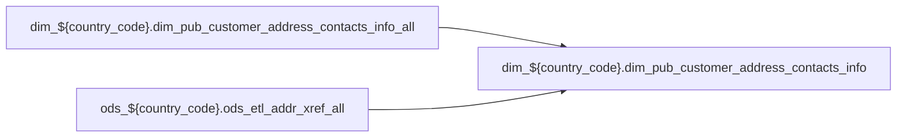

# DIM: `dim_pub_customer_address_contacts_info`

- artifact_type: etl_table
- artifact_id: dim_${country_code}.dim_pub_customer_address_contacts_info
- domain: pos
- one_line_purpose: ETL script `source/contracts/pos/bitbucket-etl/dim_pub_customer_address_contacts_info/dim_pub_customer_address_contacts_info.sql` loads `dim_${country_code}.dim_pub_customer_address_contacts_info` (layer `DIM`). Purpose inferred from SQL only.
- layer_type: DIM
- source_kind: etl_sql
- evidence_source: source/contracts/pos/bitbucket-etl/dim_pub_customer_address_contacts_info/dim_pub_customer_address_contacts_info.sql
- bitbucket_etl_bundle: source/contracts/pos/bitbucket-etl/dim_pub_customer_address_contacts_info/

---

## L1 Data Foundation

### Identity and physical mapping
- **Table:** `dim_${country_code}.dim_pub_customer_address_contacts_info`
- **Layer type:** DIM
- **Canonical / derived:** Derived / ETL-loaded (see L3)
- **Owner team:** Not documented in repository

### Grain, scope, exclusions
- **Grain:** Not documented in repository (see SELECT/GROUP BY in `source/contracts/pos/bitbucket-etl/dim_pub_customer_address_contacts_info/dim_pub_customer_address_contacts_info.sql`)
- **Partition:** `See L4 / ETL partition clause`
- **Exclusions:** See L3 Key filters

### Cross-engine presence
| Engine | Present | Canonical FQN | Notes |
|--------|---------|---------------|-------|
| Hive | yes | `dim_${country_code}.dim_pub_customer_address_contacts_info` | ETL target |
| Vertica | Not documented in repository | — | Confirm via hive2vertica flow |

### Physical schema reference

Pointer block only - full column catalog lives in WKB L1 storage JSON.

| Field | Value |
|-------|-------|
| **Authoritative catalog** | WKB L1 storage seed (not duplicated in this file) |
| **entity_id** | `dim_${country_code}.dim_pub_customer_address_contacts_info` |
| **l1_catalog_seed** | `target/storage/wkb/snapshots/_snapshot_id_template/l1_catalog/{engine}_{schema}_{table}.json` |
| **column_count** | pending (run ddl_seed_writer) |
| **partition_keys** | `See L4 / ETL partition clause` |
| **ddl_source** | pending Bitbucket DDL / Vertica metadata ingest |
| **retrieval** | `python -m tools.wkb.indexing.run_query --query "pos dim_pub_customer_address_contacts_info schema" --intent find_table_schema` |

### Lineage

- **Primary load:** `source/contracts/pos/bitbucket-etl/dim_pub_customer_address_contacts_info/dim_pub_customer_address_contacts_info.sql`
- **upstream:** `dim_${country_code}.dim_pub_customer_address_contacts_info_all` — FROM/JOIN — `source/contracts/pos/bitbucket-etl/dim_pub_customer_address_contacts_info/dim_pub_customer_address_contacts_info.sql`
- **upstream:** `ods_${country_code}.ods_etl_addr_xref_all` — FROM/JOIN — `source/contracts/pos/bitbucket-etl/dim_pub_customer_address_contacts_info/dim_pub_customer_address_contacts_info.sql`
- **downstream:** see L6 Downstream consumers
### Freshness and load path
| Item | Value |
|------|-------|
| Load pattern | See L3 INSERT / OVERWRITE in evidence script |
| Schedule | Not documented in repository |
| Parameters | Parsed from ETL literals / `${...}` in `source/contracts/pos/bitbucket-etl/dim_pub_customer_address_contacts_info/dim_pub_customer_address_contacts_info.sql` |

## L2 Declarative Knowledge

### Business purpose
ETL script `source/contracts/pos/bitbucket-etl/dim_pub_customer_address_contacts_info/dim_pub_customer_address_contacts_info.sql` loads `dim_${country_code}.dim_pub_customer_address_contacts_info` (layer `DIM`). Purpose inferred from SQL only.

### Audience and use cases
| Audience | How they benefit |
|----------|-----------------|
| Data / BI consumers | Use target table produced by this ETL |
| Data Engineering | Maintain load logic in evidence script |

### Fact key resolution
- Keys follow target INSERT column list / GROUP BY in evidence SQL.

### Time field semantics
- Partition / date fields: `See L4 / ETL partition clause`

### Metrics served
- See L3 column derivations for measure expressions when present.

### Metric serving map
N/A — not a multi-period wide serving table (or not documented).

### etl_metrics
No calculable business metrics registered in metric-index for this create run.

## L3 Procedural Knowledge

### Query and routing rules
- Prefer querying the target `dim_${country_code}.dim_pub_customer_address_contacts_info` after successful ETL load.

### Dimension join patterns
- See Relationship map and Base tables register.

### Key filters and ETL business logic

| Predicate | Kind | Evidence |
|-----------|------|----------|
| — | — | No WHERE clause parsed from `source/contracts/pos/bitbucket-etl/dim_pub_customer_address_contacts_info/dim_pub_customer_address_contacts_info.sql` |

### Standard time-filter SQL
```sql
-- See partition / date predicates in source/contracts/pos/bitbucket-etl/dim_pub_customer_address_contacts_info/dim_pub_customer_address_contacts_info.sql
```

### End-to-end flow



### Base tables register

| Object | Role |
|--------|------|
| `dim_${country_code}.dim_pub_customer_address_contacts_info_all` | source / temp (from ETL FROM/JOIN) |
| `ods_${country_code}.ods_etl_addr_xref_all` | source / temp (from ETL FROM/JOIN) |

### Step-by-step logic
1. Read sources listed in Base tables register (`source/contracts/pos/bitbucket-etl/dim_pub_customer_address_contacts_info/dim_pub_customer_address_contacts_info.sql`).
2. Apply filters documented under Key filters.
3. INSERT OVERWRITE / write target `dim_${country_code}.dim_pub_customer_address_contacts_info`.

### Relationship map (embedded)

| from_fqn | to_fqn | cardinality | join_keys | provenance |
|----------|--------|-------------|-----------|------------|
| `dim_${country_code}.dim_pub_customer_address_contacts_info_all` | `ods_${country_code}.ods_etl_addr_xref_all` | many:1 (LEFT) | `cac.cust_no` = `ax.xref_no`; `cac.addr_no` = `ax.addr_no` | etl_sql (`source/contracts/pos/bitbucket-etl/dim_pub_customer_address_contacts_info/dim_pub_customer_address_contacts_info.sql:63`) |

### Special logic (embedded)

`source/ref/pos/special_logic.txt` exists but no rule naming this FQN/stem (`dim_${country_code}.dim_pub_customer_address_contacts_info`).

Not documented in repository


### Column / field derivations (from ETL SQL)

| target_column | expression_sql | upstream_columns | upstream_tables | transform_kind | evidence |
|---------------|----------------|------------------|-----------------|----------------|----------|
| `cust_no` | `cac.cust_no` | `cust_no` | `dim_${country_code}.dim_pub_customer_address_contacts_info_all`, `ods_${country_code}.ods_etl_addr_xref_all` | passthrough | `source/contracts/pos/bitbucket-etl/dim_pub_customer_address_contacts_info/dim_pub_customer_address_contacts_info.sql:3` |
| `cust_name` | `cac.cust_name` | `cust_name` | `dim_${country_code}.dim_pub_customer_address_contacts_info_all`, `ods_${country_code}.ods_etl_addr_xref_all` | passthrough | `source/contracts/pos/bitbucket-etl/dim_pub_customer_address_contacts_info/dim_pub_customer_address_contacts_info.sql:4` |
| `addr_xref_seq` | `cac.addr_xref_seq` | `addr_xref_seq` | `dim_${country_code}.dim_pub_customer_address_contacts_info_all`, `ods_${country_code}.ods_etl_addr_xref_all` | passthrough | `source/contracts/pos/bitbucket-etl/dim_pub_customer_address_contacts_info/dim_pub_customer_address_contacts_info.sql:5` |
| `addr_no` | `cac.addr_no` | `addr_no` | `dim_${country_code}.dim_pub_customer_address_contacts_info_all`, `ods_${country_code}.ods_etl_addr_xref_all` | passthrough | `source/contracts/pos/bitbucket-etl/dim_pub_customer_address_contacts_info/dim_pub_customer_address_contacts_info.sql:6` |
| `address1a` | `cac.address1a` | `address1a` | `dim_${country_code}.dim_pub_customer_address_contacts_info_all`, `ods_${country_code}.ods_etl_addr_xref_all` | passthrough | `source/contracts/pos/bitbucket-etl/dim_pub_customer_address_contacts_info/dim_pub_customer_address_contacts_info.sql:7` |
| `address1b` | `cac.address1b` | `address1b` | `dim_${country_code}.dim_pub_customer_address_contacts_info_all`, `ods_${country_code}.ods_etl_addr_xref_all` | passthrough | `source/contracts/pos/bitbucket-etl/dim_pub_customer_address_contacts_info/dim_pub_customer_address_contacts_info.sql:8` |
| `address1` | `cac.address1` | `address1` | `dim_${country_code}.dim_pub_customer_address_contacts_info_all`, `ods_${country_code}.ods_etl_addr_xref_all` | passthrough | `source/contracts/pos/bitbucket-etl/dim_pub_customer_address_contacts_info/dim_pub_customer_address_contacts_info.sql:7` |
| `address2` | `cac.address2` | `address2` | `dim_${country_code}.dim_pub_customer_address_contacts_info_all`, `ods_${country_code}.ods_etl_addr_xref_all` | passthrough | `source/contracts/pos/bitbucket-etl/dim_pub_customer_address_contacts_info/dim_pub_customer_address_contacts_info.sql:10` |
| `address3a` | `cac.address3a` | `address3a` | `dim_${country_code}.dim_pub_customer_address_contacts_info_all`, `ods_${country_code}.ods_etl_addr_xref_all` | passthrough | `source/contracts/pos/bitbucket-etl/dim_pub_customer_address_contacts_info/dim_pub_customer_address_contacts_info.sql:11` |
| `address3b` | `cac.address3b` | `address3b` | `dim_${country_code}.dim_pub_customer_address_contacts_info_all`, `ods_${country_code}.ods_etl_addr_xref_all` | passthrough | `source/contracts/pos/bitbucket-etl/dim_pub_customer_address_contacts_info/dim_pub_customer_address_contacts_info.sql:12` |
| `city1a` | `cac.city1a` | `city1a` | `dim_${country_code}.dim_pub_customer_address_contacts_info_all`, `ods_${country_code}.ods_etl_addr_xref_all` | passthrough | `source/contracts/pos/bitbucket-etl/dim_pub_customer_address_contacts_info/dim_pub_customer_address_contacts_info.sql:13` |
| `city1b` | `cac.city1b` | `city1b` | `dim_${country_code}.dim_pub_customer_address_contacts_info_all`, `ods_${country_code}.ods_etl_addr_xref_all` | passthrough | `source/contracts/pos/bitbucket-etl/dim_pub_customer_address_contacts_info/dim_pub_customer_address_contacts_info.sql:14` |
| `STATE` | `cac.STATE` | `STATE` | `dim_${country_code}.dim_pub_customer_address_contacts_info_all`, `ods_${country_code}.ods_etl_addr_xref_all` | passthrough | `source/contracts/pos/bitbucket-etl/dim_pub_customer_address_contacts_info/dim_pub_customer_address_contacts_info.sql:15` |
| `country` | `cac.country` | `country` | `dim_${country_code}.dim_pub_customer_address_contacts_info_all`, `ods_${country_code}.ods_etl_addr_xref_all` | passthrough | `source/contracts/pos/bitbucket-etl/dim_pub_customer_address_contacts_info/dim_pub_customer_address_contacts_info.sql:16` |
| `zip_code` | `cac.zip_code` | `zip_code` | `dim_${country_code}.dim_pub_customer_address_contacts_info_all`, `ods_${country_code}.ods_etl_addr_xref_all` | passthrough | `source/contracts/pos/bitbucket-etl/dim_pub_customer_address_contacts_info/dim_pub_customer_address_contacts_info.sql:17` |
| `drop_ship` | `cac.drop_ship` | `drop_ship` | `dim_${country_code}.dim_pub_customer_address_contacts_info_all`, `ods_${country_code}.ods_etl_addr_xref_all` | passthrough | `source/contracts/pos/bitbucket-etl/dim_pub_customer_address_contacts_info/dim_pub_customer_address_contacts_info.sql:18` |
| `store_no` | `cac.store_no` | `store_no` | `dim_${country_code}.dim_pub_customer_address_contacts_info_all`, `ods_${country_code}.ods_etl_addr_xref_all` | passthrough | `source/contracts/pos/bitbucket-etl/dim_pub_customer_address_contacts_info/dim_pub_customer_address_contacts_info.sql:19` |
| `contact_xref_seq` | `cac.contact_xref_seq` | `contact_xref_seq` | `dim_${country_code}.dim_pub_customer_address_contacts_info_all`, `ods_${country_code}.ods_etl_addr_xref_all` | passthrough | `source/contracts/pos/bitbucket-etl/dim_pub_customer_address_contacts_info/dim_pub_customer_address_contacts_info.sql:20` |
| `contact_no` | `cac.contact_no` | `contact_no` | `dim_${country_code}.dim_pub_customer_address_contacts_info_all`, `ods_${country_code}.ods_etl_addr_xref_all` | passthrough | `source/contracts/pos/bitbucket-etl/dim_pub_customer_address_contacts_info/dim_pub_customer_address_contacts_info.sql:21` |
| `contact_name` | `cac.contact_name` | `contact_name` | `dim_${country_code}.dim_pub_customer_address_contacts_info_all`, `ods_${country_code}.ods_etl_addr_xref_all` | passthrough | `source/contracts/pos/bitbucket-etl/dim_pub_customer_address_contacts_info/dim_pub_customer_address_contacts_info.sql:22` |
| `title` | `cac.title` | `title` | `dim_${country_code}.dim_pub_customer_address_contacts_info_all`, `ods_${country_code}.ods_etl_addr_xref_all` | passthrough | `source/contracts/pos/bitbucket-etl/dim_pub_customer_address_contacts_info/dim_pub_customer_address_contacts_info.sql:23` |
| `phone_no` | `cac.phone_no` | `phone_no` | `dim_${country_code}.dim_pub_customer_address_contacts_info_all`, `ods_${country_code}.ods_etl_addr_xref_all` | passthrough | `source/contracts/pos/bitbucket-etl/dim_pub_customer_address_contacts_info/dim_pub_customer_address_contacts_info.sql:24` |
| `fax_no` | `cac.fax_no` | `fax_no` | `dim_${country_code}.dim_pub_customer_address_contacts_info_all`, `ods_${country_code}.ods_etl_addr_xref_all` | passthrough | `source/contracts/pos/bitbucket-etl/dim_pub_customer_address_contacts_info/dim_pub_customer_address_contacts_info.sql:25` |
| `email_address` | `cac.email_address` | `email_address` | `dim_${country_code}.dim_pub_customer_address_contacts_info_all`, `ods_${country_code}.ods_etl_addr_xref_all` | passthrough | `source/contracts/pos/bitbucket-etl/dim_pub_customer_address_contacts_info/dim_pub_customer_address_contacts_info.sql:26` |
| `stop_email` | `cac.stop_email` | `stop_email` | `dim_${country_code}.dim_pub_customer_address_contacts_info_all`, `ods_${country_code}.ods_etl_addr_xref_all` | passthrough | `source/contracts/pos/bitbucket-etl/dim_pub_customer_address_contacts_info/dim_pub_customer_address_contacts_info.sql:27` |
| `cell_no` | `cac.cell_no` | `cell_no` | `dim_${country_code}.dim_pub_customer_address_contacts_info_all`, `ods_${country_code}.ods_etl_addr_xref_all` | passthrough | `source/contracts/pos/bitbucket-etl/dim_pub_customer_address_contacts_info/dim_pub_customer_address_contacts_info.sql:28` |
| `bad_email` | `cac.bad_email` | `bad_email` | `dim_${country_code}.dim_pub_customer_address_contacts_info_all`, `ods_${country_code}.ods_etl_addr_xref_all` | passthrough | `source/contracts/pos/bitbucket-etl/dim_pub_customer_address_contacts_info/dim_pub_customer_address_contacts_info.sql:29` |
| `bad_email_desc` | `cac.bad_email_desc` | `bad_email_desc` | `dim_${country_code}.dim_pub_customer_address_contacts_info_all`, `ods_${country_code}.ods_etl_addr_xref_all` | passthrough | `source/contracts/pos/bitbucket-etl/dim_pub_customer_address_contacts_info/dim_pub_customer_address_contacts_info.sql:30` |
| `ext_no` | `cac.ext_no` | `ext_no` | `dim_${country_code}.dim_pub_customer_address_contacts_info_all`, `ods_${country_code}.ods_etl_addr_xref_all` | passthrough | `source/contracts/pos/bitbucket-etl/dim_pub_customer_address_contacts_info/dim_pub_customer_address_contacts_info.sql:31` |
| `stop_call` | `cac.stop_call` | `stop_call` | `dim_${country_code}.dim_pub_customer_address_contacts_info_all`, `ods_${country_code}.ods_etl_addr_xref_all` | passthrough | `source/contracts/pos/bitbucket-etl/dim_pub_customer_address_contacts_info/dim_pub_customer_address_contacts_info.sql:32` |
| `phone_no2` | `cac.phone_no2` | `phone_no2` | `dim_${country_code}.dim_pub_customer_address_contacts_info_all`, `ods_${country_code}.ods_etl_addr_xref_all` | passthrough | `source/contracts/pos/bitbucket-etl/dim_pub_customer_address_contacts_info/dim_pub_customer_address_contacts_info.sql:33` |
| `ext_no2` | `cac.ext_no2` | `ext_no2` | `dim_${country_code}.dim_pub_customer_address_contacts_info_all`, `ods_${country_code}.ods_etl_addr_xref_all` | passthrough | `source/contracts/pos/bitbucket-etl/dim_pub_customer_address_contacts_info/dim_pub_customer_address_contacts_info.sql:34` |
| `comments` | `cac.comments` | `comments` | `dim_${country_code}.dim_pub_customer_address_contacts_info_all`, `ods_${country_code}.ods_etl_addr_xref_all` | passthrough | `source/contracts/pos/bitbucket-etl/dim_pub_customer_address_contacts_info/dim_pub_customer_address_contacts_info.sql:35` |
| `prefer_lang` | `cac.prefer_lang` | `prefer_lang` | `dim_${country_code}.dim_pub_customer_address_contacts_info_all`, `ods_${country_code}.ods_etl_addr_xref_all` | passthrough | `source/contracts/pos/bitbucket-etl/dim_pub_customer_address_contacts_info/dim_pub_customer_address_contacts_info.sql:36` |
| `etl_timestamp` | `cac.etl_timestamp` | `etl_timestamp` | `dim_${country_code}.dim_pub_customer_address_contacts_info_all`, `ods_${country_code}.ods_etl_addr_xref_all` | passthrough | `source/contracts/pos/bitbucket-etl/dim_pub_customer_address_contacts_info/dim_pub_customer_address_contacts_info.sql:37` |
| `format_phone_no` | `cac.format_phone_no` | `format_phone_no` | `dim_${country_code}.dim_pub_customer_address_contacts_info_all`, `ods_${country_code}.ods_etl_addr_xref_all` | passthrough | `source/contracts/pos/bitbucket-etl/dim_pub_customer_address_contacts_info/dim_pub_customer_address_contacts_info.sql:38` |
| `format_phone_no2` | `cac.format_phone_no2` | `format_phone_no2` | `dim_${country_code}.dim_pub_customer_address_contacts_info_all`, `ods_${country_code}.ods_etl_addr_xref_all` | passthrough | `source/contracts/pos/bitbucket-etl/dim_pub_customer_address_contacts_info/dim_pub_customer_address_contacts_info.sql:39` |
| `format_cell_no` | `cac.format_cell_no` | `format_cell_no` | `dim_${country_code}.dim_pub_customer_address_contacts_info_all`, `ods_${country_code}.ods_etl_addr_xref_all` | passthrough | `source/contracts/pos/bitbucket-etl/dim_pub_customer_address_contacts_info/dim_pub_customer_address_contacts_info.sql:40` |
| `xref_no` | `cac.xref_no` | `xref_no` | `dim_${country_code}.dim_pub_customer_address_contacts_info_all`, `ods_${country_code}.ods_etl_addr_xref_all` | passthrough | `source/contracts/pos/bitbucket-etl/dim_pub_customer_address_contacts_info/dim_pub_customer_address_contacts_info.sql:41` |
| `xref_seq` | `cac.xref_seq` | `xref_seq` | `dim_${country_code}.dim_pub_customer_address_contacts_info_all`, `ods_${country_code}.ods_etl_addr_xref_all` | passthrough | `source/contracts/pos/bitbucket-etl/dim_pub_customer_address_contacts_info/dim_pub_customer_address_contacts_info.sql:42` |
| `website_address` | `cac.website_address` | `website_address` | `dim_${country_code}.dim_pub_customer_address_contacts_info_all`, `ods_${country_code}.ods_etl_addr_xref_all` | passthrough | `source/contracts/pos/bitbucket-etl/dim_pub_customer_address_contacts_info/dim_pub_customer_address_contacts_info.sql:43` |
| `addr_name1a` | `cac.addr_name1a` | `addr_name1a` | `dim_${country_code}.dim_pub_customer_address_contacts_info_all`, `ods_${country_code}.ods_etl_addr_xref_all` | passthrough | `source/contracts/pos/bitbucket-etl/dim_pub_customer_address_contacts_info/dim_pub_customer_address_contacts_info.sql:44` |
| `addr_name1b` | `cac.addr_name1b` | `addr_name1b` | `dim_${country_code}.dim_pub_customer_address_contacts_info_all`, `ods_${country_code}.ods_etl_addr_xref_all` | passthrough | `source/contracts/pos/bitbucket-etl/dim_pub_customer_address_contacts_info/dim_pub_customer_address_contacts_info.sql:45` |
| `addr_name2a` | `cac.addr_name2a` | `addr_name2a` | `dim_${country_code}.dim_pub_customer_address_contacts_info_all`, `ods_${country_code}.ods_etl_addr_xref_all` | passthrough | `source/contracts/pos/bitbucket-etl/dim_pub_customer_address_contacts_info/dim_pub_customer_address_contacts_info.sql:46` |
| `addr_name2b` | `cac.addr_name2b` | `addr_name2b` | `dim_${country_code}.dim_pub_customer_address_contacts_info_all`, `ods_${country_code}.ods_etl_addr_xref_all` | passthrough | `source/contracts/pos/bitbucket-etl/dim_pub_customer_address_contacts_info/dim_pub_customer_address_contacts_info.sql:47` |
| `xref1` | `cac.xref1` | `xref1` | `dim_${country_code}.dim_pub_customer_address_contacts_info_all`, `ods_${country_code}.ods_etl_addr_xref_all` | passthrough | `source/contracts/pos/bitbucket-etl/dim_pub_customer_address_contacts_info/dim_pub_customer_address_contacts_info.sql:48` |
| `store_id` | `ax.xref` | `xref` | `dim_${country_code}.dim_pub_customer_address_contacts_info_all`, `ods_${country_code}.ods_etl_addr_xref_all` | rename | `source/contracts/pos/bitbucket-etl/dim_pub_customer_address_contacts_info/dim_pub_customer_address_contacts_info.sql:49` |
| `xref_type_addr` | `cac.xref_type_addr` | `xref_type_addr` | `dim_${country_code}.dim_pub_customer_address_contacts_info_all`, `ods_${country_code}.ods_etl_addr_xref_all` | passthrough | `source/contracts/pos/bitbucket-etl/dim_pub_customer_address_contacts_info/dim_pub_customer_address_contacts_info.sql:50` |
| `xref_type_store` | `ax.xref_type` | `xref_type` | `dim_${country_code}.dim_pub_customer_address_contacts_info_all`, `ods_${country_code}.ods_etl_addr_xref_all` | rename | `source/contracts/pos/bitbucket-etl/dim_pub_customer_address_contacts_info/dim_pub_customer_address_contacts_info.sql:51` |
| `xref_type_contact` | `cac.xref_type_contact` | `xref_type_contact` | `dim_${country_code}.dim_pub_customer_address_contacts_info_all`, `ods_${country_code}.ods_etl_addr_xref_all` | passthrough | `source/contracts/pos/bitbucket-etl/dim_pub_customer_address_contacts_info/dim_pub_customer_address_contacts_info.sql:52` |
| `active_flag_addr` | `cac.active_flag_addr` | `active_flag_addr` | `dim_${country_code}.dim_pub_customer_address_contacts_info_all`, `ods_${country_code}.ods_etl_addr_xref_all` | passthrough | `source/contracts/pos/bitbucket-etl/dim_pub_customer_address_contacts_info/dim_pub_customer_address_contacts_info.sql:53` |
| `active_flag_contact` | `cac.active_flag_contact` | `active_flag_contact` | `dim_${country_code}.dim_pub_customer_address_contacts_info_all`, `ods_${country_code}.ods_etl_addr_xref_all` | passthrough | `source/contracts/pos/bitbucket-etl/dim_pub_customer_address_contacts_info/dim_pub_customer_address_contacts_info.sql:54` |
| `entry_datetime_contact` | `cac.entry_datetime_contact` | `entry_datetime_contact` | `dim_${country_code}.dim_pub_customer_address_contacts_info_all`, `ods_${country_code}.ods_etl_addr_xref_all` | passthrough | `source/contracts/pos/bitbucket-etl/dim_pub_customer_address_contacts_info/dim_pub_customer_address_contacts_info.sql:55` |
| `update_datetime_contact` | `cac.update_datetime_contact` | `update_datetime_contact` | `dim_${country_code}.dim_pub_customer_address_contacts_info_all`, `ods_${country_code}.ods_etl_addr_xref_all` | passthrough | `source/contracts/pos/bitbucket-etl/dim_pub_customer_address_contacts_info/dim_pub_customer_address_contacts_info.sql:56` |
| `delete_datetime_contact` | `cac.delete_datetime_contact` | `delete_datetime_contact` | `dim_${country_code}.dim_pub_customer_address_contacts_info_all`, `ods_${country_code}.ods_etl_addr_xref_all` | passthrough | `source/contracts/pos/bitbucket-etl/dim_pub_customer_address_contacts_info/dim_pub_customer_address_contacts_info.sql:57` |
| `contact_type` | `cac.contact_type` | `contact_type` | `dim_${country_code}.dim_pub_customer_address_contacts_info_all`, `ods_${country_code}.ods_etl_addr_xref_all` | passthrough | `source/contracts/pos/bitbucket-etl/dim_pub_customer_address_contacts_info/dim_pub_customer_address_contacts_info.sql:58` |
| `bill_to_flag` | `cac.bill_to_flag` | `bill_to_flag` | `dim_${country_code}.dim_pub_customer_address_contacts_info_all`, `ods_${country_code}.ods_etl_addr_xref_all` | passthrough | `source/contracts/pos/bitbucket-etl/dim_pub_customer_address_contacts_info/dim_pub_customer_address_contacts_info.sql:59` |
| `primary_contact_flag` | `cac.primary_contact_flag` | `primary_contact_flag` | `dim_${country_code}.dim_pub_customer_address_contacts_info_all`, `ods_${country_code}.ods_etl_addr_xref_all` | passthrough | `source/contracts/pos/bitbucket-etl/dim_pub_customer_address_contacts_info/dim_pub_customer_address_contacts_info.sql:60` |
| `ei_flag` | `cac.ei_flag` | `ei_flag` | `dim_${country_code}.dim_pub_customer_address_contacts_info_all`, `ods_${country_code}.ods_etl_addr_xref_all` | passthrough | `source/contracts/pos/bitbucket-etl/dim_pub_customer_address_contacts_info/dim_pub_customer_address_contacts_info.sql:61` |

### Sentinel and code values
Not documented in repository beyond CASE/exp_code predicates in ETL SQL.

## L4 Validation

### Resolved partition value
- Partition expression from ETL: `See L4 / ETL partition clause`
- Runtime values: Not documented in repository (resolve via Azkaban params when flow evidence exists).

### Data quality checks
Not documented in repository

### Validation SQL
N/A — Vertica MCP not executed during documentation (Vertica no-run policy).

### Caveats for interpretation
- Generated from ETL SQL evidence only; business definitions may need `source/ref` enrichment.

### Conflicts and open questions
None identified in repository

## L5 Runtime View

### Query path and engine preference
| Path | Engine | Evidence |
|------|--------|----------|
| ETL load | Hive/Spark | `source/contracts/pos/bitbucket-etl/dim_pub_customer_address_contacts_info/dim_pub_customer_address_contacts_info.sql` |
| Serving | Vertica (when synced) | Not documented in repository |

### Access constraints
Not documented in repository

### Query risk profile
- Scan risk depends on partition pruning; always filter partition keys when present.

## L6 Access and Consumption

### Primary consumers and use cases
Not documented in repository

### Representative query patterns
Not documented in repository

### Dependencies and notes

#### Upstream objects (verified)
| Object | Usage | Evidence |
|--------|-------|----------|
| `dim_${country_code}.dim_pub_customer_address_contacts_info_all` | FROM/JOIN | `source/contracts/pos/bitbucket-etl/dim_pub_customer_address_contacts_info/dim_pub_customer_address_contacts_info.sql` |
| `ods_${country_code}.ods_etl_addr_xref_all` | FROM/JOIN | `source/contracts/pos/bitbucket-etl/dim_pub_customer_address_contacts_info/dim_pub_customer_address_contacts_info.sql` |

#### Downstream consumers (verified)

| Object / script | Evidence |
|-----------------|----------|
| KB / contract ref: `source/contracts/pos/bitbucket-etl/MANIFEST.md` | `source/contracts/pos/bitbucket-etl/MANIFEST.md:28` |
| ETL/script ref: `source/contracts/pos/bitbucket-etl/dim_pub_customer_info/dim_pub_customer_info.sql` | `source/contracts/pos/bitbucket-etl/dim_pub_customer_info/dim_pub_customer_info.sql:59` |
| ETL/script ref: `source/contracts/pos/bitbucket-etl/dim_pub_customer_info_rt/dim_pub_customer_info_rt.sql` | `source/contracts/pos/bitbucket-etl/dim_pub_customer_info_rt/dim_pub_customer_info_rt.sql:59` |
| KB / contract ref: `source/contracts/pos/tables/dim_pub_customer_address_contacts_info.md` | `source/contracts/pos/tables/dim_pub_customer_address_contacts_info.md:5` |
| ETL/script ref: `source/contracts/rds/vertica_ar/etl/ar_open_aging_customer_activity_credit_limit_rds_11417.sql` | `source/contracts/rds/vertica_ar/etl/ar_open_aging_customer_activity_credit_limit_rds_11417.sql:210` |
| ETL/script ref: `source/contracts/rds/vertica_cpo/etl/cpo_open_emailquote_cart_inventory_rds_14943.sql` | `source/contracts/rds/vertica_cpo/etl/cpo_open_emailquote_cart_inventory_rds_14943.sql:68` |
| ETL/script ref: `source/contracts/rds/vertica_vpo/etl/vpo_pos_doc_fallback_cedm_serial_rds_610.sql` | `source/contracts/rds/vertica_vpo/etl/vpo_pos_doc_fallback_cedm_serial_rds_610.sql:114` |
| FLOW ref: `source/etl/flows/public_order_scripts/public_customer_dimension/public_customer_dimension_br.flow` | `source/etl/flows/public_order_scripts/public_customer_dimension/public_customer_dimension_br.flow:199` |
| FLOW ref: `source/etl/flows/public_order_scripts/public_customer_dimension/public_customer_dimension_br_hourly.flow` | `source/etl/flows/public_order_scripts/public_customer_dimension/public_customer_dimension_br_hourly.flow:25` |
| FLOW ref: `source/etl/flows/public_order_scripts/public_customer_dimension/public_customer_dimension_ca.flow` | `source/etl/flows/public_order_scripts/public_customer_dimension/public_customer_dimension_ca.flow:199` |
| FLOW ref: `source/etl/flows/public_order_scripts/public_customer_dimension/public_customer_dimension_ca_hourly.flow` | `source/etl/flows/public_order_scripts/public_customer_dimension/public_customer_dimension_ca_hourly.flow:25` |
| FLOW ref: `source/etl/flows/public_order_scripts/public_customer_dimension/public_customer_dimension_gbl.flow` | `source/etl/flows/public_order_scripts/public_customer_dimension/public_customer_dimension_gbl.flow:40` |
| FLOW ref: `source/etl/flows/public_order_scripts/public_customer_dimension/public_customer_dimension_hycn.flow` | `source/etl/flows/public_order_scripts/public_customer_dimension/public_customer_dimension_hycn.flow:179` |
| FLOW ref: `source/etl/flows/public_order_scripts/public_customer_dimension/public_customer_dimension_hycn_hourly.flow` | `source/etl/flows/public_order_scripts/public_customer_dimension/public_customer_dimension_hycn_hourly.flow:25` |
| FLOW ref: `source/etl/flows/public_order_scripts/public_customer_dimension/public_customer_dimension_hyuk.flow` | `source/etl/flows/public_order_scripts/public_customer_dimension/public_customer_dimension_hyuk.flow:181` |
| FLOW ref: `source/etl/flows/public_order_scripts/public_customer_dimension/public_customer_dimension_hyuk_hourly.flow` | `source/etl/flows/public_order_scripts/public_customer_dimension/public_customer_dimension_hyuk_hourly.flow:25` |
| FLOW ref: `source/etl/flows/public_order_scripts/public_customer_dimension/public_customer_dimension_hyus.flow` | `source/etl/flows/public_order_scripts/public_customer_dimension/public_customer_dimension_hyus.flow:181` |
| FLOW ref: `source/etl/flows/public_order_scripts/public_customer_dimension/public_customer_dimension_hyus_hourly.flow` | `source/etl/flows/public_order_scripts/public_customer_dimension/public_customer_dimension_hyus_hourly.flow:24` |
| FLOW ref: `source/etl/flows/public_order_scripts/public_customer_dimension/public_customer_dimension_hyww.flow` | `source/etl/flows/public_order_scripts/public_customer_dimension/public_customer_dimension_hyww.flow:181` |
| FLOW ref: `source/etl/flows/public_order_scripts/public_customer_dimension/public_customer_dimension_hyww_hourly.flow` | `source/etl/flows/public_order_scripts/public_customer_dimension/public_customer_dimension_hyww_hourly.flow:25` |
| FLOW ref: `source/etl/flows/public_order_scripts/public_customer_dimension/public_customer_dimension_us.flow` | `source/etl/flows/public_order_scripts/public_customer_dimension/public_customer_dimension_us.flow:214` |
| FLOW ref: `source/etl/flows/public_order_scripts/public_customer_dimension/public_customer_dimension_us_hourly.flow` | `source/etl/flows/public_order_scripts/public_customer_dimension/public_customer_dimension_us_hourly.flow:24` |
| FLOW ref: `source/etl/flows/public_order_scripts/public_customer_dimension/public_customer_dimension_wcla.flow` | `source/etl/flows/public_order_scripts/public_customer_dimension/public_customer_dimension_wcla.flow:197` |
| FLOW ref: `source/etl/flows/public_order_scripts/public_customer_dimension/public_customer_dimension_wcla_hourly.flow` | `source/etl/flows/public_order_scripts/public_customer_dimension/public_customer_dimension_wcla_hourly.flow:26` |
| ETL/script ref: `source/etl/sql/customer/public_order_scripts/public_customer_dimension/script/dim_pub_customer_address_contacts_info.sql` | `source/etl/sql/customer/public_order_scripts/public_customer_dimension/script/dim_pub_customer_address_contacts_info.sql:2` |
| ETL/script ref: `source/etl/sql/customer/public_order_scripts/public_customer_dimension/script/dim_pub_customer_info.sql` | `source/etl/sql/customer/public_order_scripts/public_customer_dimension/script/dim_pub_customer_info.sql:59` |
| KB / contract ref: `target/knowledgebase/RDS/vertica_ar/ar_open_aging_customer_activity_credit_limit_rds_11417.md` | `target/knowledgebase/RDS/vertica_ar/ar_open_aging_customer_activity_credit_limit_rds_11417.md:60` |
| KB / contract ref: `target/knowledgebase/RDS/vertica_cpo/cpo_open_emailquote_cart_inventory_rds_14943.md` | `target/knowledgebase/RDS/vertica_cpo/cpo_open_emailquote_cart_inventory_rds_14943.md:58` |
| KB / contract ref: `target/knowledgebase/RDS/vertica_vpo/vpo_pos_doc_fallback_cedm_serial_rds_610.md` | `target/knowledgebase/RDS/vertica_vpo/vpo_pos_doc_fallback_cedm_serial_rds_610.md:52` |
| KB / contract ref: `target/knowledgebase/customer/dim_pub_customer_address_contacts_info.md` | `target/knowledgebase/customer/dim_pub_customer_address_contacts_info.md:1` |
| KB / contract ref: `target/knowledgebase/customer/dim_pub_customer_address_contacts_info_all.md` | `target/knowledgebase/customer/dim_pub_customer_address_contacts_info_all.md:1` |
| KB / contract ref: `target/knowledgebase/customer/dim_pub_customer_info.md` | `target/knowledgebase/customer/dim_pub_customer_info.md:62` |
| KB / contract ref: `target/knowledgebase/pos/dim_pub_customer_info.md` | `target/knowledgebase/pos/dim_pub_customer_info.md:52` |
| KB / contract ref: `target/knowledgebase/pos/dim_pub_customer_info_rt.md` | `target/knowledgebase/pos/dim_pub_customer_info_rt.md:50` |
| KB / contract ref: `target/knowledgebase/pos/readme.md` | `target/knowledgebase/pos/readme.md:91` |

#### Operational detail (verified)
- Partition clause: `See L4 / ETL partition clause`

#### Not documented in repository
- Schedule, owner, SLA
