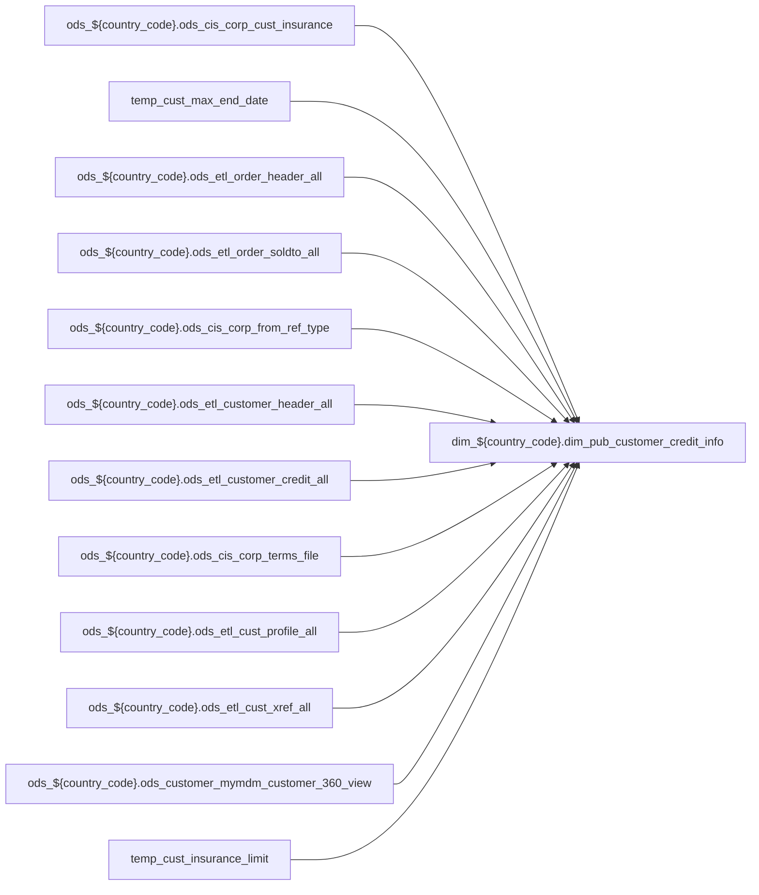

# DIM: `dim_pub_customer_credit_info`

- artifact_type: etl_table
- artifact_id: dim_${country_code}.dim_pub_customer_credit_info
- domain: pos
- one_line_purpose: ETL script `source/contracts/pos/bitbucket-etl/dim_pub_customer_credit_info/dim_pub_customer_credit_info.sql` loads `dim_${country_code}.dim_pub_customer_credit_info` (layer `DIM`). Purpose inferred from SQL only.
- layer_type: DIM
- source_kind: etl_sql
- evidence_source: source/contracts/pos/bitbucket-etl/dim_pub_customer_credit_info/dim_pub_customer_credit_info.sql
- bitbucket_etl_bundle: source/contracts/pos/bitbucket-etl/dim_pub_customer_credit_info/

---

## L1 Data Foundation

### Identity and physical mapping
- **Table:** `dim_${country_code}.dim_pub_customer_credit_info`
- **Layer type:** DIM
- **Canonical / derived:** Derived / ETL-loaded (see L3)
- **Owner team:** Not documented in repository

### Grain, scope, exclusions
- **Grain:** Not documented in repository (see SELECT/GROUP BY in `source/contracts/pos/bitbucket-etl/dim_pub_customer_credit_info/dim_pub_customer_credit_info.sql`)
- **Partition:** `See L4 / ETL partition clause`
- **Exclusions:** See L3 Key filters

### Cross-engine presence
| Engine | Present | Canonical FQN | Notes |
|--------|---------|---------------|-------|
| Hive | yes | `dim_${country_code}.dim_pub_customer_credit_info` | ETL target |
| Vertica | Not documented in repository | — | Confirm via hive2vertica flow |

### Physical schema reference

Pointer block only - full column catalog lives in WKB L1 storage JSON.

| Field | Value |
|-------|-------|
| **Authoritative catalog** | WKB L1 storage seed (not duplicated in this file) |
| **entity_id** | `dim_${country_code}.dim_pub_customer_credit_info` |
| **l1_catalog_seed** | `target/storage/wkb/snapshots/_snapshot_id_template/l1_catalog/{engine}_{schema}_{table}.json` |
| **column_count** | pending (run ddl_seed_writer) |
| **partition_keys** | `See L4 / ETL partition clause` |
| **ddl_source** | pending Bitbucket DDL / Vertica metadata ingest |
| **retrieval** | `python -m tools.wkb.indexing.run_query --query "pos dim_pub_customer_credit_info schema" --intent find_table_schema` |

### Lineage

- **Primary load:** `source/contracts/pos/bitbucket-etl/dim_pub_customer_credit_info/dim_pub_customer_credit_info.sql`
- **upstream:** `ods_${country_code}.ods_cis_corp_cust_insurance` — FROM/JOIN — `source/contracts/pos/bitbucket-etl/dim_pub_customer_credit_info/dim_pub_customer_credit_info.sql`
- **upstream:** `temp_cust_max_end_date` — FROM/JOIN — `source/contracts/pos/bitbucket-etl/dim_pub_customer_credit_info/dim_pub_customer_credit_info.sql`
- **upstream:** `ods_${country_code}.ods_etl_order_header_all` — FROM/JOIN — `source/contracts/pos/bitbucket-etl/dim_pub_customer_credit_info/dim_pub_customer_credit_info.sql`
- **upstream:** `ods_${country_code}.ods_etl_order_soldto_all` — FROM/JOIN — `source/contracts/pos/bitbucket-etl/dim_pub_customer_credit_info/dim_pub_customer_credit_info.sql`
- **upstream:** `ods_${country_code}.ods_cis_corp_from_ref_type` — FROM/JOIN — `source/contracts/pos/bitbucket-etl/dim_pub_customer_credit_info/dim_pub_customer_credit_info.sql`
- **upstream:** `ods_${country_code}.ods_etl_customer_header_all` — FROM/JOIN — `source/contracts/pos/bitbucket-etl/dim_pub_customer_credit_info/dim_pub_customer_credit_info.sql`
- **upstream:** `ods_${country_code}.ods_etl_customer_credit_all` — FROM/JOIN — `source/contracts/pos/bitbucket-etl/dim_pub_customer_credit_info/dim_pub_customer_credit_info.sql`
- **upstream:** `ods_${country_code}.ods_cis_corp_terms_file` — FROM/JOIN — `source/contracts/pos/bitbucket-etl/dim_pub_customer_credit_info/dim_pub_customer_credit_info.sql`
- **upstream:** `ods_${country_code}.ods_etl_cust_profile_all` — FROM/JOIN — `source/contracts/pos/bitbucket-etl/dim_pub_customer_credit_info/dim_pub_customer_credit_info.sql`
- **upstream:** `ods_${country_code}.ods_etl_cust_xref_all` — FROM/JOIN — `source/contracts/pos/bitbucket-etl/dim_pub_customer_credit_info/dim_pub_customer_credit_info.sql`
- **upstream:** `ods_${country_code}.ods_customer_mymdm_customer_360_view` — FROM/JOIN — `source/contracts/pos/bitbucket-etl/dim_pub_customer_credit_info/dim_pub_customer_credit_info.sql`
- **upstream:** `temp_cust_insurance_limit` — FROM/JOIN — `source/contracts/pos/bitbucket-etl/dim_pub_customer_credit_info/dim_pub_customer_credit_info.sql`
- **upstream:** `temp_cust_edi_ec_date` — FROM/JOIN — `source/contracts/pos/bitbucket-etl/dim_pub_customer_credit_info/dim_pub_customer_credit_info.sql`
- **upstream:** `temp_final_insurance_limit` — FROM/JOIN — `source/contracts/pos/bitbucket-etl/dim_pub_customer_credit_info/dim_pub_customer_credit_info.sql`
- **downstream:** see L6 Downstream consumers
### Freshness and load path
| Item | Value |
|------|-------|
| Load pattern | See L3 INSERT / OVERWRITE in evidence script |
| Schedule | Not documented in repository |
| Parameters | Parsed from ETL literals / `${...}` in `source/contracts/pos/bitbucket-etl/dim_pub_customer_credit_info/dim_pub_customer_credit_info.sql` |

## L2 Declarative Knowledge

### Business purpose
ETL script `source/contracts/pos/bitbucket-etl/dim_pub_customer_credit_info/dim_pub_customer_credit_info.sql` loads `dim_${country_code}.dim_pub_customer_credit_info` (layer `DIM`). Purpose inferred from SQL only.

### Audience and use cases
| Audience | How they benefit |
|----------|-----------------|
| Data / BI consumers | Use target table produced by this ETL |
| Data Engineering | Maintain load logic in evidence script |

### Fact key resolution
- Keys follow target INSERT column list / GROUP BY in evidence SQL.

### Time field semantics
- Partition / date fields: `See L4 / ETL partition clause`

### Metrics served
- See L3 column derivations for measure expressions when present.

### Metric serving map
N/A — not a multi-period wide serving table (or not documented).

### etl_metrics
No calculable business metrics registered in metric-index for this create run.

## L3 Procedural Knowledge

### Query and routing rules
- Prefer querying the target `dim_${country_code}.dim_pub_customer_credit_info` after successful ETL load.

### Dimension join patterns
- See Relationship map and Base tables register.

### Key filters and ETL business logic

| Predicate | Kind | Evidence |
|-----------|------|----------|
| `delete_date is null and delete_id is null` | Business | `source/contracts/pos/bitbucket-etl/dim_pub_customer_credit_info/dim_pub_customer_credit_info.sql` |
| `b.system_type in ('EDI','XML','EC EXPRESS') AND a.ship_date is not null` | Business | `source/contracts/pos/bitbucket-etl/dim_pub_customer_credit_info/dim_pub_customer_credit_info.sql` |

### Standard time-filter SQL
```sql
-- See partition / date predicates in source/contracts/pos/bitbucket-etl/dim_pub_customer_credit_info/dim_pub_customer_credit_info.sql
```

### End-to-end flow



### Base tables register

| Object | Role |
|--------|------|
| `ods_${country_code}.ods_cis_corp_cust_insurance` | source / temp (from ETL FROM/JOIN) |
| `temp_cust_max_end_date` | source / temp (from ETL FROM/JOIN) |
| `ods_${country_code}.ods_etl_order_header_all` | source / temp (from ETL FROM/JOIN) |
| `ods_${country_code}.ods_etl_order_soldto_all` | source / temp (from ETL FROM/JOIN) |
| `ods_${country_code}.ods_cis_corp_from_ref_type` | source / temp (from ETL FROM/JOIN) |
| `ods_${country_code}.ods_etl_customer_header_all` | source / temp (from ETL FROM/JOIN) |
| `ods_${country_code}.ods_etl_customer_credit_all` | source / temp (from ETL FROM/JOIN) |
| `ods_${country_code}.ods_cis_corp_terms_file` | source / temp (from ETL FROM/JOIN) |
| `ods_${country_code}.ods_etl_cust_profile_all` | source / temp (from ETL FROM/JOIN) |
| `ods_${country_code}.ods_etl_cust_xref_all` | source / temp (from ETL FROM/JOIN) |
| `ods_${country_code}.ods_customer_mymdm_customer_360_view` | source / temp (from ETL FROM/JOIN) |
| `temp_cust_insurance_limit` | source / temp (from ETL FROM/JOIN) |
| `temp_cust_edi_ec_date` | source / temp (from ETL FROM/JOIN) |
| `temp_final_insurance_limit` | source / temp (from ETL FROM/JOIN) |

### Step-by-step logic
1. Read sources listed in Base tables register (`source/contracts/pos/bitbucket-etl/dim_pub_customer_credit_info/dim_pub_customer_credit_info.sql`).
2. Apply filters documented under Key filters.
3. INSERT OVERWRITE / write target `dim_${country_code}.dim_pub_customer_credit_info`.

### Relationship map (embedded)

| from_fqn | to_fqn | cardinality | join_keys | provenance |
|----------|--------|-------------|-----------|------------|
| `ods_${country_code}.ods_cis_corp_cust_insurance` | `temp_cust_max_end_date` | many:1 | `ci.cust_no` = `ed.cust_no`; `ci.end_date` = `ed.end_date` | etl_sql (`source/contracts/pos/bitbucket-etl/dim_pub_customer_credit_info/dim_pub_customer_credit_info.sql:25`) |
| `ods_${country_code}.ods_etl_order_header_all` | `ods_${country_code}.ods_etl_order_soldto_all` | many:1 | `a.order_no` = `c.order_no`; `a.order_type` = `c.order_type` | etl_sql (`source/contracts/pos/bitbucket-etl/dim_pub_customer_credit_info/dim_pub_customer_credit_info.sql:38`) |
| `ods_${country_code}.ods_etl_order_soldto_all` | `ods_${country_code}.ods_cis_corp_from_ref_type` | many:1 | `c.from_ref_type` = `b.from_ref_type` | etl_sql (`source/contracts/pos/bitbucket-etl/dim_pub_customer_credit_info/dim_pub_customer_credit_info.sql:40`) |
| `ods_${country_code}.ods_etl_customer_header_all` | `ods_${country_code}.ods_etl_customer_credit_all` | many:1 | `ch.cust_no` = `cc.cust_no` | etl_sql (`source/contracts/pos/bitbucket-etl/dim_pub_customer_credit_info/dim_pub_customer_credit_info.sql:82`) |
| `ods_${country_code}.ods_cis_corp_cust_insurance` | `ods_${country_code}.ods_cis_corp_terms_file` | many:1 | trim(cc.terms) = trim(tf.doc_terms) | etl_sql (`source/contracts/pos/bitbucket-etl/dim_pub_customer_credit_info/dim_pub_customer_credit_info.sql:84`) |
| `ods_${country_code}.ods_etl_customer_header_all` | `ods_${country_code}.ods_etl_cust_profile_all` | many:1 (LEFT) | `ch.cust_no` = `cp.cust_no` | etl_sql (`source/contracts/pos/bitbucket-etl/dim_pub_customer_credit_info/dim_pub_customer_credit_info.sql:86`) |
| `ods_${country_code}.ods_etl_customer_header_all` | `ods_${country_code}.ods_etl_cust_xref_all` | many:1 (LEFT) | `ch.cust_no` = `cx.cust_no` | etl_sql (`source/contracts/pos/bitbucket-etl/dim_pub_customer_credit_info/dim_pub_customer_credit_info.sql:90`) |
| `ods_${country_code}.ods_etl_customer_credit_all` | `ods_${country_code}.ods_etl_customer_credit_all` | many:1 (LEFT) | `cc.terms` = `mcc.terms`; `cc.terms` = `mcc.terms` | etl_sql (`source/contracts/pos/bitbucket-etl/dim_pub_customer_credit_info/dim_pub_customer_credit_info.sql:94`) |
| `ods_${country_code}.ods_etl_customer_header_all` | `ods_${country_code}.ods_customer_mymdm_customer_360_view` | many:1 (LEFT) | `ch.cust_no` = `cm.cust_no` | etl_sql (`source/contracts/pos/bitbucket-etl/dim_pub_customer_credit_info/dim_pub_customer_credit_info.sql:97`) |
| `ods_${country_code}.ods_etl_customer_header_all` | `temp_cust_insurance_limit` | many:1 (LEFT) | `ch.cust_no` = `cit.cust_no` | etl_sql (`source/contracts/pos/bitbucket-etl/dim_pub_customer_credit_info/dim_pub_customer_credit_info.sql:99`) |
| `ods_${country_code}.ods_etl_customer_header_all` | `temp_cust_edi_ec_date` | many:1 (LEFT) | `ch.cust_no` = `ced.cust_no` | etl_sql (`source/contracts/pos/bitbucket-etl/dim_pub_customer_credit_info/dim_pub_customer_credit_info.sql:101`) |
| `ods_${country_code}.ods_etl_customer_header_all` | `temp_final_insurance_limit` | many:1 (LEFT) | `ch.cust_no` = `fi.cust_no` | etl_sql (`source/contracts/pos/bitbucket-etl/dim_pub_customer_credit_info/dim_pub_customer_credit_info.sql:103`) |

### Special logic (embedded)

`source/ref/pos/special_logic.txt` exists but no rule naming this FQN/stem (`dim_${country_code}.dim_pub_customer_credit_info`).

Not documented in repository


### Column / field derivations (from ETL SQL)

| target_column | expression_sql | upstream_columns | upstream_tables | transform_kind | evidence |
|---------------|----------------|------------------|-----------------|----------------|----------|
| `cust_no` | `ch.cust_no cust_no` | `cust_no` | `ods_${country_code}.ods_etl_customer_header_all`, `ods_${country_code}.ods_etl_customer_credit_all`, `ods_${country_code}.ods_cis_corp_terms_file`, `ods_${country_code}.ods_etl_cust_profile_all`, `ods_${country_code}.ods_etl_cust_xref_all`, `ods_${country_code}.ods_customer_mymdm_customer_360_view`, `temp_cust_insurance_limit`, `temp_cust_edi_ec_date`, `temp_final_insurance_limit` | partial | `source/contracts/pos/bitbucket-etl/dim_pub_customer_credit_info/dim_pub_customer_credit_info.sql:48` |
| `credit_limit` | `cc.credit_limit` | `credit_limit` | `ods_${country_code}.ods_etl_customer_header_all`, `ods_${country_code}.ods_etl_customer_credit_all`, `ods_${country_code}.ods_cis_corp_terms_file`, `ods_${country_code}.ods_etl_cust_profile_all`, `ods_${country_code}.ods_etl_cust_xref_all`, `ods_${country_code}.ods_customer_mymdm_customer_360_view`, `temp_cust_insurance_limit`, `temp_cust_edi_ec_date`, `temp_final_insurance_limit` | passthrough | `source/contracts/pos/bitbucket-etl/dim_pub_customer_credit_info/dim_pub_customer_credit_info.sql:49` |
| `mcust_no` | `if(cx.xref_no is null, ch.cust_no, cx.xref_no)` | `xref_no`, `cust_no` | `ods_${country_code}.ods_etl_customer_header_all`, `ods_${country_code}.ods_etl_customer_credit_all`, `ods_${country_code}.ods_cis_corp_terms_file`, `ods_${country_code}.ods_etl_cust_profile_all`, `ods_${country_code}.ods_etl_cust_xref_all`, `ods_${country_code}.ods_customer_mymdm_customer_360_view`, `temp_cust_insurance_limit`, `temp_cust_edi_ec_date`, `temp_final_insurance_limit` | udf | `source/contracts/pos/bitbucket-etl/dim_pub_customer_credit_info/dim_pub_customer_credit_info.sql:46` |
| `mcust_credit_limit` | `mcc.credit_limit` | `credit_limit` | `ods_${country_code}.ods_etl_customer_header_all`, `ods_${country_code}.ods_etl_customer_credit_all`, `ods_${country_code}.ods_cis_corp_terms_file`, `ods_${country_code}.ods_etl_cust_profile_all`, `ods_${country_code}.ods_etl_cust_xref_all`, `ods_${country_code}.ods_customer_mymdm_customer_360_view`, `temp_cust_insurance_limit`, `temp_cust_edi_ec_date`, `temp_final_insurance_limit` | rename | `source/contracts/pos/bitbucket-etl/dim_pub_customer_credit_info/dim_pub_customer_credit_info.sql:51` |
| `terms` | `cc.terms terms` | `terms` | `ods_${country_code}.ods_etl_customer_header_all`, `ods_${country_code}.ods_etl_customer_credit_all`, `ods_${country_code}.ods_cis_corp_terms_file`, `ods_${country_code}.ods_etl_cust_profile_all`, `ods_${country_code}.ods_etl_cust_xref_all`, `ods_${country_code}.ods_customer_mymdm_customer_360_view`, `temp_cust_insurance_limit`, `temp_cust_edi_ec_date`, `temp_final_insurance_limit` | partial | `source/contracts/pos/bitbucket-etl/dim_pub_customer_credit_info/dim_pub_customer_credit_info.sql:52` |
| `terms_desc` | `tf.terms_desc terms_desc` | `terms_desc` | `ods_${country_code}.ods_etl_customer_header_all`, `ods_${country_code}.ods_etl_customer_credit_all`, `ods_${country_code}.ods_cis_corp_terms_file`, `ods_${country_code}.ods_etl_cust_profile_all`, `ods_${country_code}.ods_etl_cust_xref_all`, `ods_${country_code}.ods_customer_mymdm_customer_360_view`, `temp_cust_insurance_limit`, `temp_cust_edi_ec_date`, `temp_final_insurance_limit` | partial | `source/contracts/pos/bitbucket-etl/dim_pub_customer_credit_info/dim_pub_customer_credit_info.sql:53` |
| `terms_days` | `tf.terms_days terms_days` | `terms_days` | `ods_${country_code}.ods_etl_customer_header_all`, `ods_${country_code}.ods_etl_customer_credit_all`, `ods_${country_code}.ods_cis_corp_terms_file`, `ods_${country_code}.ods_etl_cust_profile_all`, `ods_${country_code}.ods_etl_cust_xref_all`, `ods_${country_code}.ods_customer_mymdm_customer_360_view`, `temp_cust_insurance_limit`, `temp_cust_edi_ec_date`, `temp_final_insurance_limit` | partial | `source/contracts/pos/bitbucket-etl/dim_pub_customer_credit_info/dim_pub_customer_credit_info.sql:54` |
| `disc_percent` | `tf.disc_percent disc_percent` | `disc_percent` | `ods_${country_code}.ods_etl_customer_header_all`, `ods_${country_code}.ods_etl_customer_credit_all`, `ods_${country_code}.ods_cis_corp_terms_file`, `ods_${country_code}.ods_etl_cust_profile_all`, `ods_${country_code}.ods_etl_cust_xref_all`, `ods_${country_code}.ods_customer_mymdm_customer_360_view`, `temp_cust_insurance_limit`, `temp_cust_edi_ec_date`, `temp_final_insurance_limit` | partial | `source/contracts/pos/bitbucket-etl/dim_pub_customer_credit_info/dim_pub_customer_credit_info.sql:55` |
| `disc_days` | `tf.disc_days disc_days` | `disc_days` | `ods_${country_code}.ods_etl_customer_header_all`, `ods_${country_code}.ods_etl_customer_credit_all`, `ods_${country_code}.ods_cis_corp_terms_file`, `ods_${country_code}.ods_etl_cust_profile_all`, `ods_${country_code}.ods_etl_cust_xref_all`, `ods_${country_code}.ods_customer_mymdm_customer_360_view`, `temp_cust_insurance_limit`, `temp_cust_edi_ec_date`, `temp_final_insurance_limit` | partial | `source/contracts/pos/bitbucket-etl/dim_pub_customer_credit_info/dim_pub_customer_credit_info.sql:56` |
| `terms_group` | `tf.terms_group terms_group` | `terms_group` | `ods_${country_code}.ods_etl_customer_header_all`, `ods_${country_code}.ods_etl_customer_credit_all`, `ods_${country_code}.ods_cis_corp_terms_file`, `ods_${country_code}.ods_etl_cust_profile_all`, `ods_${country_code}.ods_etl_cust_xref_all`, `ods_${country_code}.ods_customer_mymdm_customer_360_view`, `temp_cust_insurance_limit`, `temp_cust_edi_ec_date`, `temp_final_insurance_limit` | partial | `source/contracts/pos/bitbucket-etl/dim_pub_customer_credit_info/dim_pub_customer_credit_info.sql:57` |
| `flooring` | `tf.flooring flooring` | `flooring` | `ods_${country_code}.ods_etl_customer_header_all`, `ods_${country_code}.ods_etl_customer_credit_all`, `ods_${country_code}.ods_cis_corp_terms_file`, `ods_${country_code}.ods_etl_cust_profile_all`, `ods_${country_code}.ods_etl_cust_xref_all`, `ods_${country_code}.ods_customer_mymdm_customer_360_view`, `temp_cust_insurance_limit`, `temp_cust_edi_ec_date`, `temp_final_insurance_limit` | partial | `source/contracts/pos/bitbucket-etl/dim_pub_customer_credit_info/dim_pub_customer_credit_info.sql:58` |
| `curr_bal` | `cc.curr_bal curr_bal` | `curr_bal` | `ods_${country_code}.ods_etl_customer_header_all`, `ods_${country_code}.ods_etl_customer_credit_all`, `ods_${country_code}.ods_cis_corp_terms_file`, `ods_${country_code}.ods_etl_cust_profile_all`, `ods_${country_code}.ods_etl_cust_xref_all`, `ods_${country_code}.ods_customer_mymdm_customer_360_view`, `temp_cust_insurance_limit`, `temp_cust_edi_ec_date`, `temp_final_insurance_limit` | partial | `source/contracts/pos/bitbucket-etl/dim_pub_customer_credit_info/dim_pub_customer_credit_info.sql:59` |
| `curr_pymts` | `cc.curr_pymts curr_pymts` | `curr_pymts` | `ods_${country_code}.ods_etl_customer_header_all`, `ods_${country_code}.ods_etl_customer_credit_all`, `ods_${country_code}.ods_cis_corp_terms_file`, `ods_${country_code}.ods_etl_cust_profile_all`, `ods_${country_code}.ods_etl_cust_xref_all`, `ods_${country_code}.ods_customer_mymdm_customer_360_view`, `temp_cust_insurance_limit`, `temp_cust_edi_ec_date`, `temp_final_insurance_limit` | partial | `source/contracts/pos/bitbucket-etl/dim_pub_customer_credit_info/dim_pub_customer_credit_info.sql:60` |
| `last_pay_date` | `cc.last_pay_date last_pay_date` | `last_pay_date` | `ods_${country_code}.ods_etl_customer_header_all`, `ods_${country_code}.ods_etl_customer_credit_all`, `ods_${country_code}.ods_cis_corp_terms_file`, `ods_${country_code}.ods_etl_cust_profile_all`, `ods_${country_code}.ods_etl_cust_xref_all`, `ods_${country_code}.ods_customer_mymdm_customer_360_view`, `temp_cust_insurance_limit`, `temp_cust_edi_ec_date`, `temp_final_insurance_limit` | partial | `source/contracts/pos/bitbucket-etl/dim_pub_customer_credit_info/dim_pub_customer_credit_info.sql:61` |
| `sold_since` | `cc.sold_since sold_since` | `sold_since` | `ods_${country_code}.ods_etl_customer_header_all`, `ods_${country_code}.ods_etl_customer_credit_all`, `ods_${country_code}.ods_cis_corp_terms_file`, `ods_${country_code}.ods_etl_cust_profile_all`, `ods_${country_code}.ods_etl_cust_xref_all`, `ods_${country_code}.ods_customer_mymdm_customer_360_view`, `temp_cust_insurance_limit`, `temp_cust_edi_ec_date`, `temp_final_insurance_limit` | partial | `source/contracts/pos/bitbucket-etl/dim_pub_customer_credit_info/dim_pub_customer_credit_info.sql:62` |
| `pending_amt` | `cc.pending_amt pending_amt` | `pending_amt` | `ods_${country_code}.ods_etl_customer_header_all`, `ods_${country_code}.ods_etl_customer_credit_all`, `ods_${country_code}.ods_cis_corp_terms_file`, `ods_${country_code}.ods_etl_cust_profile_all`, `ods_${country_code}.ods_etl_cust_xref_all`, `ods_${country_code}.ods_customer_mymdm_customer_360_view`, `temp_cust_insurance_limit`, `temp_cust_edi_ec_date`, `temp_final_insurance_limit` | partial | `source/contracts/pos/bitbucket-etl/dim_pub_customer_credit_info/dim_pub_customer_credit_info.sql:63` |
| `last_purchase` | `cc.last_purchase last_purchase` | `last_purchase` | `ods_${country_code}.ods_etl_customer_header_all`, `ods_${country_code}.ods_etl_customer_credit_all`, `ods_${country_code}.ods_cis_corp_terms_file`, `ods_${country_code}.ods_etl_cust_profile_all`, `ods_${country_code}.ods_etl_cust_xref_all`, `ods_${country_code}.ods_customer_mymdm_customer_360_view`, `temp_cust_insurance_limit`, `temp_cust_edi_ec_date`, `temp_final_insurance_limit` | partial | `source/contracts/pos/bitbucket-etl/dim_pub_customer_credit_info/dim_pub_customer_credit_info.sql:64` |
| `past_due_date` | `cc.past_due_date past_due_date` | `past_due_date` | `ods_${country_code}.ods_etl_customer_header_all`, `ods_${country_code}.ods_etl_customer_credit_all`, `ods_${country_code}.ods_cis_corp_terms_file`, `ods_${country_code}.ods_etl_cust_profile_all`, `ods_${country_code}.ods_etl_cust_xref_all`, `ods_${country_code}.ods_customer_mymdm_customer_360_view`, `temp_cust_insurance_limit`, `temp_cust_edi_ec_date`, `temp_final_insurance_limit` | partial | `source/contracts/pos/bitbucket-etl/dim_pub_customer_credit_info/dim_pub_customer_credit_info.sql:65` |
| `credit_review_frequency` | `CONCAT(ch.last_review, '~', ch.next_review)` | `last_review`, `next_review` | `ods_${country_code}.ods_etl_customer_header_all`, `ods_${country_code}.ods_etl_customer_credit_all`, `ods_${country_code}.ods_cis_corp_terms_file`, `ods_${country_code}.ods_etl_cust_profile_all`, `ods_${country_code}.ods_etl_cust_xref_all`, `ods_${country_code}.ods_customer_mymdm_customer_360_view`, `temp_cust_insurance_limit`, `temp_cust_edi_ec_date`, `temp_final_insurance_limit` | udf | `source/contracts/pos/bitbucket-etl/dim_pub_customer_credit_info/dim_pub_customer_credit_info.sql:66` |
| `etl_timestamp` | `from_utc_timestamp(current_timestamp(), 'America/Los_Angeles')` | `from_utc_timestamp`, `current_timestamp`, `America`, `Los_Angeles` | `ods_${country_code}.ods_etl_customer_header_all`, `ods_${country_code}.ods_etl_customer_credit_all`, `ods_${country_code}.ods_cis_corp_terms_file`, `ods_${country_code}.ods_etl_cust_profile_all`, `ods_${country_code}.ods_etl_cust_xref_all`, `ods_${country_code}.ods_customer_mymdm_customer_360_view`, `temp_cust_insurance_limit`, `temp_cust_edi_ec_date`, `temp_final_insurance_limit` | arithmetic | `source/contracts/pos/bitbucket-etl/dim_pub_customer_credit_info/dim_pub_customer_credit_info.sql:67` |
| `credit_data_source` | `cc.data_source` | `data_source` | `ods_${country_code}.ods_etl_customer_header_all`, `ods_${country_code}.ods_etl_customer_credit_all`, `ods_${country_code}.ods_cis_corp_terms_file`, `ods_${country_code}.ods_etl_cust_profile_all`, `ods_${country_code}.ods_etl_cust_xref_all`, `ods_${country_code}.ods_customer_mymdm_customer_360_view`, `temp_cust_insurance_limit`, `temp_cust_edi_ec_date`, `temp_final_insurance_limit` | rename | `source/contracts/pos/bitbucket-etl/dim_pub_customer_credit_info/dim_pub_customer_credit_info.sql:68` |
| `share_credit_limit_flag` | `cm.share_credit_limit_flag` | `share_credit_limit_flag` | `ods_${country_code}.ods_etl_customer_header_all`, `ods_${country_code}.ods_etl_customer_credit_all`, `ods_${country_code}.ods_cis_corp_terms_file`, `ods_${country_code}.ods_etl_cust_profile_all`, `ods_${country_code}.ods_etl_cust_xref_all`, `ods_${country_code}.ods_customer_mymdm_customer_360_view`, `temp_cust_insurance_limit`, `temp_cust_edi_ec_date`, `temp_final_insurance_limit` | passthrough | `source/contracts/pos/bitbucket-etl/dim_pub_customer_credit_info/dim_pub_customer_credit_info.sql:69` |
| `bill_to_addr` | `cc.bill_to_addr` | `bill_to_addr` | `ods_${country_code}.ods_etl_customer_header_all`, `ods_${country_code}.ods_etl_customer_credit_all`, `ods_${country_code}.ods_cis_corp_terms_file`, `ods_${country_code}.ods_etl_cust_profile_all`, `ods_${country_code}.ods_etl_cust_xref_all`, `ods_${country_code}.ods_customer_mymdm_customer_360_view`, `temp_cust_insurance_limit`, `temp_cust_edi_ec_date`, `temp_final_insurance_limit` | passthrough | `source/contracts/pos/bitbucket-etl/dim_pub_customer_credit_info/dim_pub_customer_credit_info.sql:70` |
| `sequence_no` | `cc.sequence_no` | `sequence_no` | `ods_${country_code}.ods_etl_customer_header_all`, `ods_${country_code}.ods_etl_customer_credit_all`, `ods_${country_code}.ods_cis_corp_terms_file`, `ods_${country_code}.ods_etl_cust_profile_all`, `ods_${country_code}.ods_etl_cust_xref_all`, `ods_${country_code}.ods_customer_mymdm_customer_360_view`, `temp_cust_insurance_limit`, `temp_cust_edi_ec_date`, `temp_final_insurance_limit` | passthrough | `source/contracts/pos/bitbucket-etl/dim_pub_customer_credit_info/dim_pub_customer_credit_info.sql:71` |
| `past_due_amt` | `cc.past_due_amt` | `past_due_amt` | `ods_${country_code}.ods_etl_customer_header_all`, `ods_${country_code}.ods_etl_customer_credit_all`, `ods_${country_code}.ods_cis_corp_terms_file`, `ods_${country_code}.ods_etl_cust_profile_all`, `ods_${country_code}.ods_etl_cust_xref_all`, `ods_${country_code}.ods_customer_mymdm_customer_360_view`, `temp_cust_insurance_limit`, `temp_cust_edi_ec_date`, `temp_final_insurance_limit` | passthrough | `source/contracts/pos/bitbucket-etl/dim_pub_customer_credit_info/dim_pub_customer_credit_info.sql:72` |
| `insurance_limit` | `cit.insurance_limit` | `insurance_limit` | `ods_${country_code}.ods_etl_customer_header_all`, `ods_${country_code}.ods_etl_customer_credit_all`, `ods_${country_code}.ods_cis_corp_terms_file`, `ods_${country_code}.ods_etl_cust_profile_all`, `ods_${country_code}.ods_etl_cust_xref_all`, `ods_${country_code}.ods_customer_mymdm_customer_360_view`, `temp_cust_insurance_limit`, `temp_cust_edi_ec_date`, `temp_final_insurance_limit` | passthrough | `source/contracts/pos/bitbucket-etl/dim_pub_customer_credit_info/dim_pub_customer_credit_info.sql:73` |
| `last_edi_or_xml_date` | `ced.last_edi_or_xml_date` | `last_edi_or_xml_date` | `ods_${country_code}.ods_etl_customer_header_all`, `ods_${country_code}.ods_etl_customer_credit_all`, `ods_${country_code}.ods_cis_corp_terms_file`, `ods_${country_code}.ods_etl_cust_profile_all`, `ods_${country_code}.ods_etl_cust_xref_all`, `ods_${country_code}.ods_customer_mymdm_customer_360_view`, `temp_cust_insurance_limit`, `temp_cust_edi_ec_date`, `temp_final_insurance_limit` | passthrough | `source/contracts/pos/bitbucket-etl/dim_pub_customer_credit_info/dim_pub_customer_credit_info.sql:74` |
| `last_ec_order_date` | `ced.last_ec_order_date` | `last_ec_order_date` | `ods_${country_code}.ods_etl_customer_header_all`, `ods_${country_code}.ods_etl_customer_credit_all`, `ods_${country_code}.ods_cis_corp_terms_file`, `ods_${country_code}.ods_etl_cust_profile_all`, `ods_${country_code}.ods_etl_cust_xref_all`, `ods_${country_code}.ods_customer_mymdm_customer_360_view`, `temp_cust_insurance_limit`, `temp_cust_edi_ec_date`, `temp_final_insurance_limit` | passthrough | `source/contracts/pos/bitbucket-etl/dim_pub_customer_credit_info/dim_pub_customer_credit_info.sql:75` |
| `delete_id` | `cc.delete_id` | `delete_id` | `ods_${country_code}.ods_etl_customer_header_all`, `ods_${country_code}.ods_etl_customer_credit_all`, `ods_${country_code}.ods_cis_corp_terms_file`, `ods_${country_code}.ods_etl_cust_profile_all`, `ods_${country_code}.ods_etl_cust_xref_all`, `ods_${country_code}.ods_customer_mymdm_customer_360_view`, `temp_cust_insurance_limit`, `temp_cust_edi_ec_date`, `temp_final_insurance_limit` | passthrough | `source/contracts/pos/bitbucket-etl/dim_pub_customer_credit_info/dim_pub_customer_credit_info.sql:76` |
| `delete_datetime` | `cc.delete_datetime` | `delete_datetime` | `ods_${country_code}.ods_etl_customer_header_all`, `ods_${country_code}.ods_etl_customer_credit_all`, `ods_${country_code}.ods_cis_corp_terms_file`, `ods_${country_code}.ods_etl_cust_profile_all`, `ods_${country_code}.ods_etl_cust_xref_all`, `ods_${country_code}.ods_customer_mymdm_customer_360_view`, `temp_cust_insurance_limit`, `temp_cust_edi_ec_date`, `temp_final_insurance_limit` | passthrough | `source/contracts/pos/bitbucket-etl/dim_pub_customer_credit_info/dim_pub_customer_credit_info.sql:77` |
| `final_insurance_limit` | `fi.final_insurance_limit` | `final_insurance_limit` | `ods_${country_code}.ods_etl_customer_header_all`, `ods_${country_code}.ods_etl_customer_credit_all`, `ods_${country_code}.ods_cis_corp_terms_file`, `ods_${country_code}.ods_etl_cust_profile_all`, `ods_${country_code}.ods_etl_cust_xref_all`, `ods_${country_code}.ods_customer_mymdm_customer_360_view`, `temp_cust_insurance_limit`, `temp_cust_edi_ec_date`, `temp_final_insurance_limit` | passthrough | `source/contracts/pos/bitbucket-etl/dim_pub_customer_credit_info/dim_pub_customer_credit_info.sql:78` |
| `end_date` | `fi.end_date` | `end_date` | `ods_${country_code}.ods_etl_customer_header_all`, `ods_${country_code}.ods_etl_customer_credit_all`, `ods_${country_code}.ods_cis_corp_terms_file`, `ods_${country_code}.ods_etl_cust_profile_all`, `ods_${country_code}.ods_etl_cust_xref_all`, `ods_${country_code}.ods_customer_mymdm_customer_360_view`, `temp_cust_insurance_limit`, `temp_cust_edi_ec_date`, `temp_final_insurance_limit` | passthrough | `source/contracts/pos/bitbucket-etl/dim_pub_customer_credit_info/dim_pub_customer_credit_info.sql:79` |
| `entry_datetime` | `cc.entry_datetime` | `entry_datetime` | `ods_${country_code}.ods_etl_customer_header_all`, `ods_${country_code}.ods_etl_customer_credit_all`, `ods_${country_code}.ods_cis_corp_terms_file`, `ods_${country_code}.ods_etl_cust_profile_all`, `ods_${country_code}.ods_etl_cust_xref_all`, `ods_${country_code}.ods_customer_mymdm_customer_360_view`, `temp_cust_insurance_limit`, `temp_cust_edi_ec_date`, `temp_final_insurance_limit` | passthrough | `source/contracts/pos/bitbucket-etl/dim_pub_customer_credit_info/dim_pub_customer_credit_info.sql:80` |

### Sentinel and code values
Not documented in repository beyond CASE/exp_code predicates in ETL SQL.

## L4 Validation

### Resolved partition value
- Partition expression from ETL: `See L4 / ETL partition clause`
- Runtime values: Not documented in repository (resolve via Azkaban params when flow evidence exists).

### Data quality checks
Not documented in repository

### Validation SQL
N/A — Vertica MCP not executed during documentation (Vertica no-run policy).

### Caveats for interpretation
- Generated from ETL SQL evidence only; business definitions may need `source/ref` enrichment.

### Conflicts and open questions
None identified in repository

## L5 Runtime View

### Query path and engine preference
| Path | Engine | Evidence |
|------|--------|----------|
| ETL load | Hive/Spark | `source/contracts/pos/bitbucket-etl/dim_pub_customer_credit_info/dim_pub_customer_credit_info.sql` |
| Serving | Vertica (when synced) | Not documented in repository |

### Access constraints
Not documented in repository

### Query risk profile
- Scan risk depends on partition pruning; always filter partition keys when present.

## L6 Access and Consumption

### Primary consumers and use cases
Not documented in repository

### Representative query patterns
Not documented in repository

### Dependencies and notes

#### Upstream objects (verified)
| Object | Usage | Evidence |
|--------|-------|----------|
| `ods_${country_code}.ods_cis_corp_cust_insurance` | FROM/JOIN | `source/contracts/pos/bitbucket-etl/dim_pub_customer_credit_info/dim_pub_customer_credit_info.sql` |
| `temp_cust_max_end_date` | FROM/JOIN | `source/contracts/pos/bitbucket-etl/dim_pub_customer_credit_info/dim_pub_customer_credit_info.sql` |
| `ods_${country_code}.ods_etl_order_header_all` | FROM/JOIN | `source/contracts/pos/bitbucket-etl/dim_pub_customer_credit_info/dim_pub_customer_credit_info.sql` |
| `ods_${country_code}.ods_etl_order_soldto_all` | FROM/JOIN | `source/contracts/pos/bitbucket-etl/dim_pub_customer_credit_info/dim_pub_customer_credit_info.sql` |
| `ods_${country_code}.ods_cis_corp_from_ref_type` | FROM/JOIN | `source/contracts/pos/bitbucket-etl/dim_pub_customer_credit_info/dim_pub_customer_credit_info.sql` |
| `ods_${country_code}.ods_etl_customer_header_all` | FROM/JOIN | `source/contracts/pos/bitbucket-etl/dim_pub_customer_credit_info/dim_pub_customer_credit_info.sql` |
| `ods_${country_code}.ods_etl_customer_credit_all` | FROM/JOIN | `source/contracts/pos/bitbucket-etl/dim_pub_customer_credit_info/dim_pub_customer_credit_info.sql` |
| `ods_${country_code}.ods_cis_corp_terms_file` | FROM/JOIN | `source/contracts/pos/bitbucket-etl/dim_pub_customer_credit_info/dim_pub_customer_credit_info.sql` |
| `ods_${country_code}.ods_etl_cust_profile_all` | FROM/JOIN | `source/contracts/pos/bitbucket-etl/dim_pub_customer_credit_info/dim_pub_customer_credit_info.sql` |
| `ods_${country_code}.ods_etl_cust_xref_all` | FROM/JOIN | `source/contracts/pos/bitbucket-etl/dim_pub_customer_credit_info/dim_pub_customer_credit_info.sql` |
| `ods_${country_code}.ods_customer_mymdm_customer_360_view` | FROM/JOIN | `source/contracts/pos/bitbucket-etl/dim_pub_customer_credit_info/dim_pub_customer_credit_info.sql` |
| `temp_cust_insurance_limit` | FROM/JOIN | `source/contracts/pos/bitbucket-etl/dim_pub_customer_credit_info/dim_pub_customer_credit_info.sql` |
| `temp_cust_edi_ec_date` | FROM/JOIN | `source/contracts/pos/bitbucket-etl/dim_pub_customer_credit_info/dim_pub_customer_credit_info.sql` |
| `temp_final_insurance_limit` | FROM/JOIN | `source/contracts/pos/bitbucket-etl/dim_pub_customer_credit_info/dim_pub_customer_credit_info.sql` |

#### Downstream consumers (verified)

| Object / script | Evidence |
|-----------------|----------|
| KB / contract ref: `source/contracts/pos/bitbucket-etl/MANIFEST.md` | `source/contracts/pos/bitbucket-etl/MANIFEST.md:37` |
| KB / contract ref: `source/contracts/pos/tables/dim_pub_customer_credit_info.md` | `source/contracts/pos/tables/dim_pub_customer_credit_info.md:5` |
| FLOW ref: `source/etl/flows/public_order_scripts/public_customer_dimension/public_customer_dimension_br.flow` | `source/etl/flows/public_order_scripts/public_customer_dimension/public_customer_dimension_br.flow:171` |
| FLOW ref: `source/etl/flows/public_order_scripts/public_customer_dimension/public_customer_dimension_ca.flow` | `source/etl/flows/public_order_scripts/public_customer_dimension/public_customer_dimension_ca.flow:171` |
| FLOW ref: `source/etl/flows/public_order_scripts/public_customer_dimension/public_customer_dimension_hycn.flow` | `source/etl/flows/public_order_scripts/public_customer_dimension/public_customer_dimension_hycn.flow:152` |
| FLOW ref: `source/etl/flows/public_order_scripts/public_customer_dimension/public_customer_dimension_hyuk.flow` | `source/etl/flows/public_order_scripts/public_customer_dimension/public_customer_dimension_hyuk.flow:154` |
| FLOW ref: `source/etl/flows/public_order_scripts/public_customer_dimension/public_customer_dimension_hyus.flow` | `source/etl/flows/public_order_scripts/public_customer_dimension/public_customer_dimension_hyus.flow:154` |
| FLOW ref: `source/etl/flows/public_order_scripts/public_customer_dimension/public_customer_dimension_hyww.flow` | `source/etl/flows/public_order_scripts/public_customer_dimension/public_customer_dimension_hyww.flow:154` |
| FLOW ref: `source/etl/flows/public_order_scripts/public_customer_dimension/public_customer_dimension_us.flow` | `source/etl/flows/public_order_scripts/public_customer_dimension/public_customer_dimension_us.flow:186` |
| FLOW ref: `source/etl/flows/public_order_scripts/public_customer_dimension/public_customer_dimension_wcla.flow` | `source/etl/flows/public_order_scripts/public_customer_dimension/public_customer_dimension_wcla.flow:169` |
| ETL/script ref: `source/etl/sql/customer/public_order_scripts/public_customer_dimension/script/dim_pub_customer_credit_info.sql` | `source/etl/sql/customer/public_order_scripts/public_customer_dimension/script/dim_pub_customer_credit_info.sql:46` |
| KB / contract ref: `target/knowledgebase/customer/dim_pub_customer_credit_info.md` | `target/knowledgebase/customer/dim_pub_customer_credit_info.md:1` |
| KB / contract ref: `target/knowledgebase/pos/readme.md` | `target/knowledgebase/pos/readme.md:92` |

#### Operational detail (verified)
- Partition clause: `See L4 / ETL partition clause`

#### Not documented in repository
- Schedule, owner, SLA
