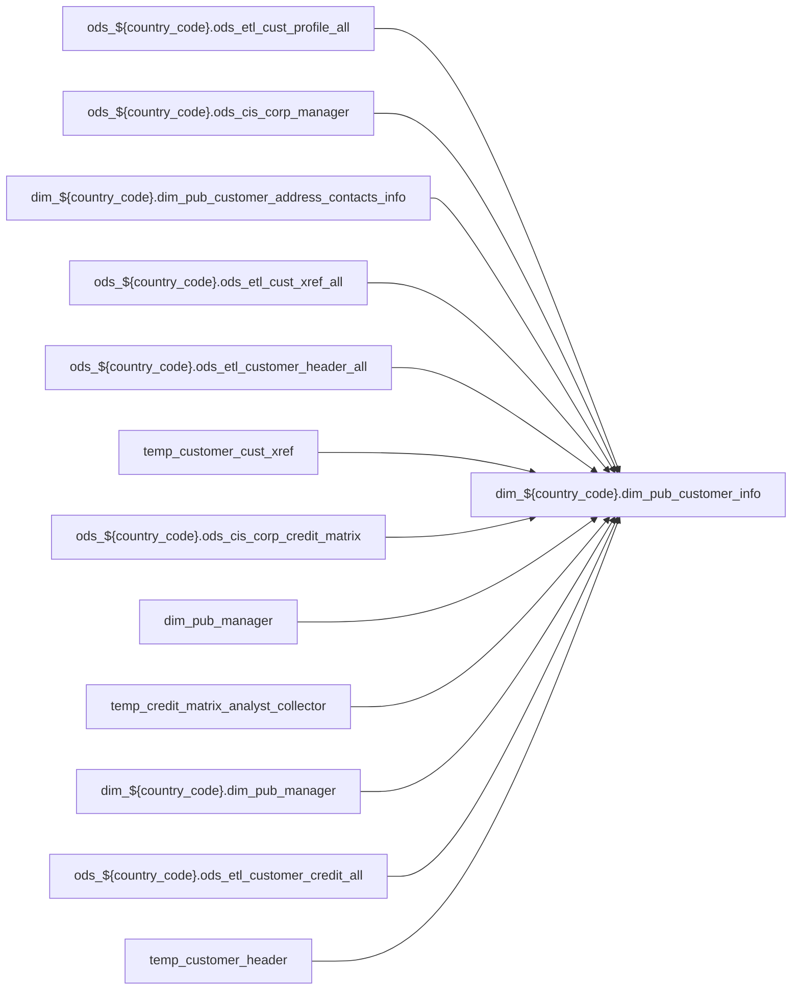

# DIM: `dim_pub_customer_info`

- artifact_type: etl_table
- artifact_id: dim_${country_code}.dim_pub_customer_info
- domain: pos
- one_line_purpose: ETL script `source/contracts/pos/bitbucket-etl/dim_pub_customer_info/dim_pub_customer_info.sql` loads `dim_${country_code}.dim_pub_customer_info` (layer `DIM`). Purpose inferred from SQL only.
- layer_type: DIM
- source_kind: etl_sql
- evidence_source: source/contracts/pos/bitbucket-etl/dim_pub_customer_info/dim_pub_customer_info.sql
- bitbucket_etl_bundle: source/contracts/pos/bitbucket-etl/dim_pub_customer_info/

---

## L1 Data Foundation

### Identity and physical mapping
- **Table:** `dim_${country_code}.dim_pub_customer_info`
- **Layer type:** DIM
- **Canonical / derived:** Derived / ETL-loaded (see L3)
- **Owner team:** Not documented in repository

### Grain, scope, exclusions
- **Grain:** Not documented in repository (see SELECT/GROUP BY in `source/contracts/pos/bitbucket-etl/dim_pub_customer_info/dim_pub_customer_info.sql`)
- **Partition:** `See L4 / ETL partition clause`
- **Exclusions:** See L3 Key filters

### Cross-engine presence
| Engine | Present | Canonical FQN | Notes |
|--------|---------|---------------|-------|
| Hive | yes | `dim_${country_code}.dim_pub_customer_info` | ETL target |
| Vertica | Not documented in repository | — | Confirm via hive2vertica flow |

### Physical schema reference

Pointer block only - full column catalog lives in WKB L1 storage JSON.

| Field | Value |
|-------|-------|
| **Authoritative catalog** | WKB L1 storage seed (not duplicated in this file) |
| **entity_id** | `dim_${country_code}.dim_pub_customer_info` |
| **l1_catalog_seed** | `target/storage/wkb/snapshots/_snapshot_id_template/l1_catalog/{engine}_{schema}_{table}.json` |
| **column_count** | pending (run ddl_seed_writer) |
| **partition_keys** | `See L4 / ETL partition clause` |
| **ddl_source** | pending Bitbucket DDL / Vertica metadata ingest |
| **retrieval** | `python -m tools.wkb.indexing.run_query --query "pos dim_pub_customer_info schema" --intent find_table_schema` |

### Lineage

- **Primary load:** `source/contracts/pos/bitbucket-etl/dim_pub_customer_info/dim_pub_customer_info.sql`
- **upstream:** `ods_${country_code}.ods_etl_cust_profile_all` — FROM/JOIN — `source/contracts/pos/bitbucket-etl/dim_pub_customer_info/dim_pub_customer_info.sql`
- **upstream:** `ods_${country_code}.ods_cis_corp_manager` — FROM/JOIN — `source/contracts/pos/bitbucket-etl/dim_pub_customer_info/dim_pub_customer_info.sql`
- **upstream:** `dim_${country_code}.dim_pub_customer_address_contacts_info` — FROM/JOIN — `source/contracts/pos/bitbucket-etl/dim_pub_customer_info/dim_pub_customer_info.sql`
- **upstream:** `ods_${country_code}.ods_etl_cust_xref_all` — FROM/JOIN — `source/contracts/pos/bitbucket-etl/dim_pub_customer_info/dim_pub_customer_info.sql`
- **upstream:** `ods_${country_code}.ods_etl_customer_header_all` — FROM/JOIN — `source/contracts/pos/bitbucket-etl/dim_pub_customer_info/dim_pub_customer_info.sql`
- **upstream:** `temp_customer_cust_xref` — FROM/JOIN — `source/contracts/pos/bitbucket-etl/dim_pub_customer_info/dim_pub_customer_info.sql`
- **upstream:** `ods_${country_code}.ods_cis_corp_credit_matrix` — FROM/JOIN — `source/contracts/pos/bitbucket-etl/dim_pub_customer_info/dim_pub_customer_info.sql`
- **upstream:** `dim_pub_manager` — FROM/JOIN — `source/contracts/pos/bitbucket-etl/dim_pub_customer_info/dim_pub_customer_info.sql`
- **upstream:** `temp_credit_matrix_analyst_collector` — FROM/JOIN — `source/contracts/pos/bitbucket-etl/dim_pub_customer_info/dim_pub_customer_info.sql`
- **upstream:** `dim_${country_code}.dim_pub_manager` — FROM/JOIN — `source/contracts/pos/bitbucket-etl/dim_pub_customer_info/dim_pub_customer_info.sql`
- **upstream:** `ods_${country_code}.ods_etl_customer_credit_all` — FROM/JOIN — `source/contracts/pos/bitbucket-etl/dim_pub_customer_info/dim_pub_customer_info.sql`
- **upstream:** `temp_customer_header` — FROM/JOIN — `source/contracts/pos/bitbucket-etl/dim_pub_customer_info/dim_pub_customer_info.sql`
- **upstream:** `ods_${country_code}.ods_cis_corp_territory` — FROM/JOIN — `source/contracts/pos/bitbucket-etl/dim_pub_customer_info/dim_pub_customer_info.sql`
- **upstream:** `ods_${country_code}.ods_cis_corp_territory_group` — FROM/JOIN — `source/contracts/pos/bitbucket-etl/dim_pub_customer_info/dim_pub_customer_info.sql`
- **upstream:** `ods_${country_code}.ods_cis_corp_cust_type` — FROM/JOIN — `source/contracts/pos/bitbucket-etl/dim_pub_customer_info/dim_pub_customer_info.sql`
- **upstream:** `ods_${country_code}.ods_cis_corp_division` — FROM/JOIN — `source/contracts/pos/bitbucket-etl/dim_pub_customer_info/dim_pub_customer_info.sql`
- **upstream:** `ods_${country_code}.ods_cis_corp_cust_segment` — FROM/JOIN — `source/contracts/pos/bitbucket-etl/dim_pub_customer_info/dim_pub_customer_info.sql`
- **upstream:** `tmp_outside_sales_rep` — FROM/JOIN — `source/contracts/pos/bitbucket-etl/dim_pub_customer_info/dim_pub_customer_info.sql`
- **upstream:** `temp_contact` — FROM/JOIN — `source/contracts/pos/bitbucket-etl/dim_pub_customer_info/dim_pub_customer_info.sql`
- **upstream:** `temp_cust_profile` — FROM/JOIN — `source/contracts/pos/bitbucket-etl/dim_pub_customer_info/dim_pub_customer_info.sql`
- **downstream:** see L6 Downstream consumers
### Freshness and load path
| Item | Value |
|------|-------|
| Load pattern | See L3 INSERT / OVERWRITE in evidence script |
| Schedule | Not documented in repository |
| Parameters | Parsed from ETL literals / `${...}` in `source/contracts/pos/bitbucket-etl/dim_pub_customer_info/dim_pub_customer_info.sql` |

## L2 Declarative Knowledge

### Business purpose
ETL script `source/contracts/pos/bitbucket-etl/dim_pub_customer_info/dim_pub_customer_info.sql` loads `dim_${country_code}.dim_pub_customer_info` (layer `DIM`). Purpose inferred from SQL only.

### Audience and use cases
| Audience | How they benefit |
|----------|-----------------|
| Data / BI consumers | Use target table produced by this ETL |
| Data Engineering | Maintain load logic in evidence script |

### Fact key resolution
- Keys follow target INSERT column list / GROUP BY in evidence SQL.

### Time field semantics
- Partition / date fields: `See L4 / ETL partition clause`

### Metrics served
- See L3 column derivations for measure expressions when present.

### Metric serving map
N/A — not a multi-period wide serving table (or not documented).

### etl_metrics
No calculable business metrics registered in metric-index for this create run.

## L3 Procedural Knowledge

### Query and routing rules
- Prefer querying the target `dim_${country_code}.dim_pub_customer_info` after successful ETL load.

### Dimension join patterns
- See Relationship map and Base tables register.

### Key filters and ETL business logic

| Predicate | Kind | Evidence |
|-----------|------|----------|
| `cp.profile_type = 'S' AND cp.profile_cat = 'OTHE' -- AND cp.cust_no = fact.bill_to_cust_no AND cp.active = 'Y'` | Business | `source/contracts/pos/bitbucket-etl/dim_pub_customer_info/dim_pub_customer_info.sql` |
| `t.rn = 1; --3 temp table for cust_profile such as profile_c、currency、cust_channel、varnex_members CREATE OR REPLACE TEMPORARY VIEW temp_cust_profile as select cust_no, max(case when trim(cp.profile_...` | Business | `source/contracts/pos/bitbucket-etl/dim_pub_customer_info/dim_pub_customer_info.sql` |
| `cx.xref_type in ('MASTER_SUB', 'CUST_PROG', 'CUST_CSREP', 'FINAN_SUB','BUY_SUB') AND cx.active = 'Y'` | Business | `source/contracts/pos/bitbucket-etl/dim_pub_customer_info/dim_pub_customer_info.sql` |
| `cm.mycis_role in ('C','A'); --6 get manager_name、director_name etc join dim_pub_manager create TEMPORARY TABLE temp_credit_matrix_analyst_collector_name as select cmac.mycis_role, cmac.userid, cmac...` | Business | `source/contracts/pos/bitbucket-etl/dim_pub_customer_info/dim_pub_customer_info.sql` |
| `rn =1; CREATE OR REPLACE TEMPORARY VIEW temp_customer_analyst_collector as select ch.mcust_no, ch.mcust_name, ch.cust_no, ch.cust_name, t.cust_type, c.cust_type_descr, ch.cust_acct_type, ch.is_rest...` | Business | `source/contracts/pos/bitbucket-etl/dim_pub_customer_info/dim_pub_customer_info.sql` |

### Standard time-filter SQL
```sql
-- See partition / date predicates in source/contracts/pos/bitbucket-etl/dim_pub_customer_info/dim_pub_customer_info.sql
```

### End-to-end flow



### Base tables register

| Object | Role |
|--------|------|
| `ods_${country_code}.ods_etl_cust_profile_all` | source / temp (from ETL FROM/JOIN) |
| `ods_${country_code}.ods_cis_corp_manager` | source / temp (from ETL FROM/JOIN) |
| `dim_${country_code}.dim_pub_customer_address_contacts_info` | source / temp (from ETL FROM/JOIN) |
| `ods_${country_code}.ods_etl_cust_xref_all` | source / temp (from ETL FROM/JOIN) |
| `ods_${country_code}.ods_etl_customer_header_all` | source / temp (from ETL FROM/JOIN) |
| `temp_customer_cust_xref` | source / temp (from ETL FROM/JOIN) |
| `ods_${country_code}.ods_cis_corp_credit_matrix` | source / temp (from ETL FROM/JOIN) |
| `dim_pub_manager` | source / temp (from ETL FROM/JOIN) |
| `temp_credit_matrix_analyst_collector` | source / temp (from ETL FROM/JOIN) |
| `dim_${country_code}.dim_pub_manager` | source / temp (from ETL FROM/JOIN) |
| `ods_${country_code}.ods_etl_customer_credit_all` | source / temp (from ETL FROM/JOIN) |
| `temp_customer_header` | source / temp (from ETL FROM/JOIN) |
| `ods_${country_code}.ods_cis_corp_territory` | source / temp (from ETL FROM/JOIN) |
| `ods_${country_code}.ods_cis_corp_territory_group` | source / temp (from ETL FROM/JOIN) |
| `ods_${country_code}.ods_cis_corp_cust_type` | source / temp (from ETL FROM/JOIN) |
| `ods_${country_code}.ods_cis_corp_division` | source / temp (from ETL FROM/JOIN) |
| `ods_${country_code}.ods_cis_corp_cust_segment` | source / temp (from ETL FROM/JOIN) |
| `tmp_outside_sales_rep` | source / temp (from ETL FROM/JOIN) |
| `temp_contact` | source / temp (from ETL FROM/JOIN) |
| `temp_cust_profile` | source / temp (from ETL FROM/JOIN) |
| `credit_all` | source / temp (from ETL FROM/JOIN) |
| `temp_credit_matrix_analyst_collector_name` | source / temp (from ETL FROM/JOIN) |
| `ods_${country_code}.ods_cis_corp_company_info` | source / temp (from ETL FROM/JOIN) |
| `dim_${country_code}.dim_pub_ec_contact_info` | source / temp (from ETL FROM/JOIN) |
| `cust_xref` | source / temp (from ETL FROM/JOIN) |
| `company_profile` | source / temp (from ETL FROM/JOIN) |
| `ods_${country_code}.ods_cis_corp_company_profile` | source / temp (from ETL FROM/JOIN) |
| `ods_${country_code}.ods_etl_addr_xref_all` | source / temp (from ETL FROM/JOIN) |
| `ods_${country_code}.ods_etl_address_all` | source / temp (from ETL FROM/JOIN) |
| `ods_${country_code}.ods_cis_corp_addr_profile` | source / temp (from ETL FROM/JOIN) |
| `ods_${country_code}.ods_etl_contact_xref_all` | source / temp (from ETL FROM/JOIN) |
| `ods_${country_code}.ods_etl_contacts_all` | source / temp (from ETL FROM/JOIN) |
| `temp_primary_contact_info` | source / temp (from ETL FROM/JOIN) |
| `temp_addr_contact_xref` | source / temp (from ETL FROM/JOIN) |
| `tmp_seq` | source / temp (from ETL FROM/JOIN) |
| `ods_${country_code}.ods_cis_corp_terms_file` | source / temp (from ETL FROM/JOIN) |
| `ods_${country_code}.ods_cis_corp_no_ctrl` | source / temp (from ETL FROM/JOIN) |
| `ods_gbl.ods_dw_engage_mygblengage_cust_loc_enrich` | source / temp (from ETL FROM/JOIN) |
| `ods_gbl.ods_cis_mygbl_prm_cust_ext` | source / temp (from ETL FROM/JOIN) |
| `ods_${country_code}.ods_customer_mymdm_cust_profile` | source / temp (from ETL FROM/JOIN) |
| `ods_${country_code}.ods_customer_mymdm_cust_xref` | source / temp (from ETL FROM/JOIN) |
| `temp_customer_analyst_collector` | source / temp (from ETL FROM/JOIN) |
| `temp_ec_contacts_info` | source / temp (from ETL FROM/JOIN) |
| `temp_customer_alias_name` | source / temp (from ETL FROM/JOIN) |
| `temp_currency_profile` | source / temp (from ETL FROM/JOIN) |
| `temp_primary_contact_info_final` | source / temp (from ETL FROM/JOIN) |
| `terms_group_v1` | source / temp (from ETL FROM/JOIN) |
| `sales_year_v1` | source / temp (from ETL FROM/JOIN) |
| `ods_${country_code}.ods_userinfo_mymdm_territory` | source / temp (from ETL FROM/JOIN) |
| `loc_enrich` | source / temp (from ETL FROM/JOIN) |
| `cust_ext` | source / temp (from ETL FROM/JOIN) |
| `community_info_1` | source / temp (from ETL FROM/JOIN) |
| `community_info` | source / temp (from ETL FROM/JOIN) |

### Step-by-step logic
1. Read sources listed in Base tables register (`source/contracts/pos/bitbucket-etl/dim_pub_customer_info/dim_pub_customer_info.sql`).
2. Apply filters documented under Key filters.
3. INSERT OVERWRITE / write target `dim_${country_code}.dim_pub_customer_info`.

### Relationship map (embedded)

| from_fqn | to_fqn | cardinality | join_keys | provenance |
|----------|--------|-------------|-----------|------------|
| `ods_${country_code}.ods_etl_customer_header_all` | `temp_customer_cust_xref` | many:1 (LEFT) | `ch.cust_no` = `cx.cust_no` | etl_sql (`source/contracts/pos/bitbucket-etl/dim_pub_customer_info/dim_pub_customer_info.sql:153`) |
| `ods_${country_code}.ods_etl_cust_profile_all` | `ods_${country_code}.ods_etl_customer_header_all` | many:1 (LEFT) | if(cx.m_xref_no is null, ch.cust_no, cx.m_xref_no) = mch.cust_no; --5 create temp table for credit or credit_analyst id CREATE OR REPLACE TEMPORARY VIEW temp... | etl_sql (`source/contracts/pos/bitbucket-etl/dim_pub_customer_info/dim_pub_customer_info.sql:155`) |
| `ods_${country_code}.ods_etl_cust_profile_all` | `dim_pub_manager` | many:1 | — | etl_sql (`source/contracts/pos/bitbucket-etl/dim_pub_customer_info/dim_pub_customer_info.sql:200`) |
| `cmac` | `dim_${country_code}.dim_pub_manager` | many:1 (LEFT) | `cmac.supervisor_id` = `dpm1.userid` | etl_sql (`source/contracts/pos/bitbucket-etl/dim_pub_customer_info/dim_pub_customer_info.sql:221`) |
| `cmac` | `dim_${country_code}.dim_pub_manager` | many:1 (LEFT) | `cmac.manager_id` = `dpm2.userid` | etl_sql (`source/contracts/pos/bitbucket-etl/dim_pub_customer_info/dim_pub_customer_info.sql:223`) |
| `cmac` | `dim_${country_code}.dim_pub_manager` | many:1 (LEFT) | `cmac.senior_manager_id` = `dpm3.userid` | etl_sql (`source/contracts/pos/bitbucket-etl/dim_pub_customer_info/dim_pub_customer_info.sql:225`) |
| `cmac` | `dim_${country_code}.dim_pub_manager` | many:1 (LEFT) | `cmac.director_id` = `dpm4.userid` | etl_sql (`source/contracts/pos/bitbucket-etl/dim_pub_customer_info/dim_pub_customer_info.sql:227`) |
| `cmac` | `dim_${country_code}.dim_pub_manager` | many:1 (LEFT) | `cmac.vp_id` = `dpm5.userid` | etl_sql (`source/contracts/pos/bitbucket-etl/dim_pub_customer_info/dim_pub_customer_info.sql:229`) |
| `cmac` | `dim_${country_code}.dim_pub_manager` | many:1 (LEFT) | `cmac.svp_id` = `dpm6.userid` | etl_sql (`source/contracts/pos/bitbucket-etl/dim_pub_customer_info/dim_pub_customer_info.sql:231`) |
| `cmac` | `dim_${country_code}.dim_pub_manager` | many:1 (LEFT) | `cmac.userid` = `dpm7.userid` | etl_sql (`source/contracts/pos/bitbucket-etl/dim_pub_customer_info/dim_pub_customer_info.sql:233`) |
| `ods_${country_code}.ods_etl_customer_header_all` | `ods_${country_code}.ods_cis_corp_territory` | many:1 (LEFT) | `ch.sales_terr` = `t.sales_terr` | etl_sql (`source/contracts/pos/bitbucket-etl/dim_pub_customer_info/dim_pub_customer_info.sql:345`) |
| `ods_${country_code}.ods_cis_corp_territory` | `ods_${country_code}.ods_cis_corp_territory_group` | many:1 (LEFT) | `t.group_id` = `b.group_id` | etl_sql (`source/contracts/pos/bitbucket-etl/dim_pub_customer_info/dim_pub_customer_info.sql:348`) |
| `ods_${country_code}.ods_cis_corp_territory_group` | `ods_${country_code}.ods_cis_corp_cust_type` | many:1 (LEFT) | `b.cust_type` = `c.cust_type` | etl_sql (`source/contracts/pos/bitbucket-etl/dim_pub_customer_info/dim_pub_customer_info.sql:351`) |
| `ods_${country_code}.ods_cis_corp_cust_type` | `ods_${country_code}.ods_cis_corp_division` | many:1 (LEFT) | `c.division` = `d.division` | etl_sql (`source/contracts/pos/bitbucket-etl/dim_pub_customer_info/dim_pub_customer_info.sql:354`) |
| `ods_${country_code}.ods_etl_customer_header_all` | `ods_${country_code}.ods_cis_corp_cust_segment` | many:1 (LEFT) | `ch.cust_seg_id` = `s.cust_seg_id` | etl_sql (`source/contracts/pos/bitbucket-etl/dim_pub_customer_info/dim_pub_customer_info.sql:357`) |
| `ods_${country_code}.ods_etl_customer_header_all` | `tmp_outside_sales_rep` | many:1 (LEFT) | `ch.cust_no` = `tosr.cust_no` | etl_sql (`source/contracts/pos/bitbucket-etl/dim_pub_customer_info/dim_pub_customer_info.sql:360`) |
| `ods_${country_code}.ods_etl_customer_header_all` | `temp_contact` | many:1 (LEFT) | `ch.cust_no` = `ctt.cust_no` | etl_sql (`source/contracts/pos/bitbucket-etl/dim_pub_customer_info/dim_pub_customer_info.sql:363`) |
| `ods_${country_code}.ods_etl_customer_header_all` | `temp_cust_profile` | many:1 (LEFT) | `ch.cust_no` = `cp.cust_no` | etl_sql (`source/contracts/pos/bitbucket-etl/dim_pub_customer_info/dim_pub_customer_info.sql:366`) |
| `ods_${country_code}.ods_etl_customer_header_all` | `temp_customer_cust_xref` | many:1 (LEFT) | `ch.cust_no` = `ccx.cust_no` | etl_sql (`source/contracts/pos/bitbucket-etl/dim_pub_customer_info/dim_pub_customer_info.sql:369`) |
| `temp_customer_cust_xref` | `dim_${country_code}.dim_pub_manager` | many:1 (LEFT) | `ccx.s_xref` = `dpm.userid` | etl_sql (`source/contracts/pos/bitbucket-etl/dim_pub_customer_info/dim_pub_customer_info.sql:372`) |
| `temp_customer_cust_xref` | `dim_${country_code}.dim_pub_manager` | many:1 (LEFT) | `ccx.p_xref` = `dpm1.userid` | etl_sql (`source/contracts/pos/bitbucket-etl/dim_pub_customer_info/dim_pub_customer_info.sql:375`) |
| `ods_${country_code}.ods_etl_cust_profile_all` | `dim_${country_code}.dim_pub_manager` | many:1 (LEFT) | nvl(ch.reviewer,t.reviewer) = dpm2.userid -- | etl_sql (`source/contracts/pos/bitbucket-etl/dim_pub_customer_info/dim_pub_customer_info.sql:378`) |
| `ods_${country_code}.ods_etl_cust_profile_all` | `ods_${country_code}.ods_etl_customer_credit_all` | many:1 (LEFT) | — | etl_sql (`source/contracts/pos/bitbucket-etl/dim_pub_customer_info/dim_pub_customer_info.sql:381`) |
| `ods_${country_code}.ods_etl_customer_header_all` | `credit_all` | many:1 (LEFT) | `ch.cust_no` = `crt.cust_no`; `ch.default_terms` = `crt.terms` | etl_sql (`source/contracts/pos/bitbucket-etl/dim_pub_customer_info/dim_pub_customer_info.sql:382`) |
| `ods_${country_code}.ods_etl_cust_profile_all` | `temp_credit_matrix_analyst_collector_name` | many:1 (LEFT) | nvl(ch.reviewer,t.reviewer)=cm.userid and cm.mycis_role='C' | etl_sql (`source/contracts/pos/bitbucket-etl/dim_pub_customer_info/dim_pub_customer_info.sql:386`) |
| `ods_${country_code}.ods_etl_cust_profile_all` | `temp_credit_matrix_analyst_collector_name` | many:1 (LEFT) | nvl(ch.cred_analyst,t.cred_analyst)=cm1.userid and cm1.mycis_role='A' | etl_sql (`source/contracts/pos/bitbucket-etl/dim_pub_customer_info/dim_pub_customer_info.sql:389`) |
| `ods_${country_code}.ods_etl_customer_header_all` | `ods_${country_code}.ods_cis_corp_company_info` | many:1 (LEFT) | `ch.company_no` = `ci.company_no` | etl_sql (`source/contracts/pos/bitbucket-etl/dim_pub_customer_info/dim_pub_customer_info.sql:392`) |
| `ods_${country_code}.ods_etl_customer_header_all` | `ods_${country_code}.ods_cis_corp_company_profile` | many:1 (LEFT) | `h.company_no` = `p.company_no` | etl_sql (`source/contracts/pos/bitbucket-etl/dim_pub_customer_info/dim_pub_customer_info.sql:442`) |
| `ods_${country_code}.ods_etl_addr_xref_all` | `ods_${country_code}.ods_etl_address_all` | many:1 | `address1_.addr_no` = `addrxref0_.addr_no` | etl_sql (`source/contracts/pos/bitbucket-etl/dim_pub_customer_info/dim_pub_customer_info.sql:462`) |
| `ods_${country_code}.ods_etl_address_all` | `ods_${country_code}.ods_cis_corp_addr_profile` | many:1 | `address1_.addr_no` = `addrprofil2_.addr_no` | etl_sql (`source/contracts/pos/bitbucket-etl/dim_pub_customer_info/dim_pub_customer_info.sql:467`) |
| `ods_${country_code}.ods_etl_address_all` | `ods_${country_code}.ods_cis_corp_addr_profile` | many:1 (LEFT) | `address1_.addr_no` = `addrprofil4_.addr_no` | etl_sql (`source/contracts/pos/bitbucket-etl/dim_pub_customer_info/dim_pub_customer_info.sql:472`) |
| `ods_${country_code}.ods_cis_corp_addr_profile` | `ods_${country_code}.ods_etl_contact_xref_all` | many:1 (LEFT) | `contactxre5_.xref_no` = `addrprofil4_.addr_no`; `addrprofil4_.profile_i` = `contactxre5_.xref_seq` | etl_sql (`source/contracts/pos/bitbucket-etl/dim_pub_customer_info/dim_pub_customer_info.sql:480`) |
| `ods_${country_code}.ods_etl_contact_xref_all` | `ods_${country_code}.ods_etl_contacts_all` | many:1 | `contactxre0_.contact_no` = `contacts1_.contact_no` | etl_sql (`source/contracts/pos/bitbucket-etl/dim_pub_customer_info/dim_pub_customer_info.sql:507`) |
| `ods_${country_code}.ods_etl_contact_xref_all` | `temp_primary_contact_info` | many:1 | `contactxre0_.xref_no` = `tc.addr_no` | etl_sql (`source/contracts/pos/bitbucket-etl/dim_pub_customer_info/dim_pub_customer_info.sql:508`) |
| `tmp1` | `temp_addr_contact_xref` | many:1 (LEFT) | `tmp1.addr_no` = `tmp2.addrNo` | etl_sql (`source/contracts/pos/bitbucket-etl/dim_pub_customer_info/dim_pub_customer_info.sql:528`) |
| `ods_${country_code}.ods_etl_cust_profile_all` | `ods_${country_code}.ods_etl_contacts_all` | many:1 (LEFT) | contacts_.contact_no = nvl(tmp1.contact_no,tmp2.contact_no) ) | etl_sql (`source/contracts/pos/bitbucket-etl/dim_pub_customer_info/dim_pub_customer_info.sql:530`) |
| `tcac` | `ods_${country_code}.ods_etl_customer_header_all` | many:1 (LEFT) | `tcac.finance_master` = `ch.cust_no` | etl_sql (`source/contracts/pos/bitbucket-etl/dim_pub_customer_info/dim_pub_customer_info.sql:780`) |
| `tcac` | `temp_ec_contacts_info` | many:1 (LEFT) | `tcac.cust_no` = `ec.cust_no` | etl_sql (`source/contracts/pos/bitbucket-etl/dim_pub_customer_info/dim_pub_customer_info.sql:782`) |
| `tcac` | `temp_customer_alias_name` | many:1 (LEFT) | `tcac.cust_no` = `cn.cust_no` | etl_sql (`source/contracts/pos/bitbucket-etl/dim_pub_customer_info/dim_pub_customer_info.sql:784`) |
| `tcac` | `temp_currency_profile` | many:1 (LEFT) | `tcac.cust_no` = `cp.cust_no` | etl_sql (`source/contracts/pos/bitbucket-etl/dim_pub_customer_info/dim_pub_customer_info.sql:786`) |
| `tcac` | `temp_primary_contact_info_final` | many:1 (LEFT) | `tcac.cust_no` = `pc.cust_no` | etl_sql (`source/contracts/pos/bitbucket-etl/dim_pub_customer_info/dim_pub_customer_info.sql:788`) |
| `tcac` | `terms_group_v1` | many:1 (LEFT) | `tcac.default_terms` = `tg.doc_terms` | etl_sql (`source/contracts/pos/bitbucket-etl/dim_pub_customer_info/dim_pub_customer_info.sql:790`) |
| `tcac` | `sales_year_v1` | many:1 (LEFT) | `tcac.sales_terr` = `sy.doc_year` | etl_sql (`source/contracts/pos/bitbucket-etl/dim_pub_customer_info/dim_pub_customer_info.sql:792`) |
| `tcac` | `ods_${country_code}.ods_userinfo_mymdm_territory` | many:1 (LEFT) | `tcac.sales_terr` = `terr.sales_terr` | etl_sql (`source/contracts/pos/bitbucket-etl/dim_pub_customer_info/dim_pub_customer_info.sql:794`) |
| `tcac` | `loc_enrich` | many:1 (LEFT) | `tcac.cust_no` = `loc.cust_loc_id`; `tcac.company_no` = `loc.cis_server` | etl_sql (`source/contracts/pos/bitbucket-etl/dim_pub_customer_info/dim_pub_customer_info.sql:796`) |
| `tcac` | `cust_ext` | many:1 (LEFT) | `tcac.cust_no` = `prm.cust_no` | etl_sql (`source/contracts/pos/bitbucket-etl/dim_pub_customer_info/dim_pub_customer_info.sql:799`) |
| `tcac` | `community_info_1` | many:1 (LEFT) | `tcac.cust_no` = `cii.cust_no` | etl_sql (`source/contracts/pos/bitbucket-etl/dim_pub_customer_info/dim_pub_customer_info.sql:801`) |
| `tcac` | `community_info` | many:1 (LEFT) | `tcac.cust_no` = `ci.cust_no` | etl_sql (`source/contracts/pos/bitbucket-etl/dim_pub_customer_info/dim_pub_customer_info.sql:803`) |

### Special logic (embedded)

`source/ref/pos/special_logic.txt` exists but no rule naming this FQN/stem (`dim_${country_code}.dim_pub_customer_info`).

Not documented in repository


### Column / field derivations (from ETL SQL)

| target_column | expression_sql | upstream_columns | upstream_tables | transform_kind | evidence |
|---------------|----------------|------------------|-----------------|----------------|----------|
| `mcust_no` | `tcac.mcust_no` | `mcust_no` | `temp_customer_analyst_collector`, `ods_${country_code}.ods_etl_customer_header_all`, `temp_ec_contacts_info`, `temp_customer_alias_name`, `temp_currency_profile`, `temp_primary_contact_info_final`, `terms_group_v1`, `sales_year_v1`, `ods_${country_code}.ods_userinfo_mymdm_territory`, `loc_enrich`, `cust_ext`, `community_info_1` | passthrough | `source/contracts/pos/bitbucket-etl/dim_pub_customer_info/dim_pub_customer_info.sql:672` |
| `mcust_name` | `tcac.mcust_name` | `mcust_name` | `temp_customer_analyst_collector`, `ods_${country_code}.ods_etl_customer_header_all`, `temp_ec_contacts_info`, `temp_customer_alias_name`, `temp_currency_profile`, `temp_primary_contact_info_final`, `terms_group_v1`, `sales_year_v1`, `ods_${country_code}.ods_userinfo_mymdm_territory`, `loc_enrich`, `cust_ext`, `community_info_1` | passthrough | `source/contracts/pos/bitbucket-etl/dim_pub_customer_info/dim_pub_customer_info.sql:673` |
| `cust_no` | `tcac.cust_no` | `cust_no` | `temp_customer_analyst_collector`, `ods_${country_code}.ods_etl_customer_header_all`, `temp_ec_contacts_info`, `temp_customer_alias_name`, `temp_currency_profile`, `temp_primary_contact_info_final`, `terms_group_v1`, `sales_year_v1`, `ods_${country_code}.ods_userinfo_mymdm_territory`, `loc_enrich`, `cust_ext`, `community_info_1` | passthrough | `source/contracts/pos/bitbucket-etl/dim_pub_customer_info/dim_pub_customer_info.sql:674` |
| `cust_name` | `tcac.cust_name` | `cust_name` | `temp_customer_analyst_collector`, `ods_${country_code}.ods_etl_customer_header_all`, `temp_ec_contacts_info`, `temp_customer_alias_name`, `temp_currency_profile`, `temp_primary_contact_info_final`, `terms_group_v1`, `sales_year_v1`, `ods_${country_code}.ods_userinfo_mymdm_territory`, `loc_enrich`, `cust_ext`, `community_info_1` | passthrough | `source/contracts/pos/bitbucket-etl/dim_pub_customer_info/dim_pub_customer_info.sql:675` |
| `cust_type` | `tcac.cust_type` | `cust_type` | `temp_customer_analyst_collector`, `ods_${country_code}.ods_etl_customer_header_all`, `temp_ec_contacts_info`, `temp_customer_alias_name`, `temp_currency_profile`, `temp_primary_contact_info_final`, `terms_group_v1`, `sales_year_v1`, `ods_${country_code}.ods_userinfo_mymdm_territory`, `loc_enrich`, `cust_ext`, `community_info_1` | passthrough | `source/contracts/pos/bitbucket-etl/dim_pub_customer_info/dim_pub_customer_info.sql:676` |
| `cust_type_descr` | `tcac.cust_type_descr` | `cust_type_descr` | `temp_customer_analyst_collector`, `ods_${country_code}.ods_etl_customer_header_all`, `temp_ec_contacts_info`, `temp_customer_alias_name`, `temp_currency_profile`, `temp_primary_contact_info_final`, `terms_group_v1`, `sales_year_v1`, `ods_${country_code}.ods_userinfo_mymdm_territory`, `loc_enrich`, `cust_ext`, `community_info_1` | passthrough | `source/contracts/pos/bitbucket-etl/dim_pub_customer_info/dim_pub_customer_info.sql:677` |
| `cust_acct_type` | `tcac.cust_acct_type` | `cust_acct_type` | `temp_customer_analyst_collector`, `ods_${country_code}.ods_etl_customer_header_all`, `temp_ec_contacts_info`, `temp_customer_alias_name`, `temp_currency_profile`, `temp_primary_contact_info_final`, `terms_group_v1`, `sales_year_v1`, `ods_${country_code}.ods_userinfo_mymdm_territory`, `loc_enrich`, `cust_ext`, `community_info_1` | passthrough | `source/contracts/pos/bitbucket-etl/dim_pub_customer_info/dim_pub_customer_info.sql:678` |
| `is_restricted` | `tcac.is_restricted` | `is_restricted` | `temp_customer_analyst_collector`, `ods_${country_code}.ods_etl_customer_header_all`, `temp_ec_contacts_info`, `temp_customer_alias_name`, `temp_currency_profile`, `temp_primary_contact_info_final`, `terms_group_v1`, `sales_year_v1`, `ods_${country_code}.ods_userinfo_mymdm_territory`, `loc_enrich`, `cust_ext`, `community_info_1` | passthrough | `source/contracts/pos/bitbucket-etl/dim_pub_customer_info/dim_pub_customer_info.sql:679` |
| `is_discontinued` | `tcac.is_discontinued` | `is_discontinued` | `temp_customer_analyst_collector`, `ods_${country_code}.ods_etl_customer_header_all`, `temp_ec_contacts_info`, `temp_customer_alias_name`, `temp_currency_profile`, `temp_primary_contact_info_final`, `terms_group_v1`, `sales_year_v1`, `ods_${country_code}.ods_userinfo_mymdm_territory`, `loc_enrich`, `cust_ext`, `community_info_1` | passthrough | `source/contracts/pos/bitbucket-etl/dim_pub_customer_info/dim_pub_customer_info.sql:680` |
| `sales_terr` | `tcac.sales_terr` | `sales_terr` | `temp_customer_analyst_collector`, `ods_${country_code}.ods_etl_customer_header_all`, `temp_ec_contacts_info`, `temp_customer_alias_name`, `temp_currency_profile`, `temp_primary_contact_info_final`, `terms_group_v1`, `sales_year_v1`, `ods_${country_code}.ods_userinfo_mymdm_territory`, `loc_enrich`, `cust_ext`, `community_info_1` | passthrough | `source/contracts/pos/bitbucket-etl/dim_pub_customer_info/dim_pub_customer_info.sql:681` |
| `sales_terr_name` | `tcac.sales_terr_name` | `sales_terr_name` | `temp_customer_analyst_collector`, `ods_${country_code}.ods_etl_customer_header_all`, `temp_ec_contacts_info`, `temp_customer_alias_name`, `temp_currency_profile`, `temp_primary_contact_info_final`, `terms_group_v1`, `sales_year_v1`, `ods_${country_code}.ods_userinfo_mymdm_territory`, `loc_enrich`, `cust_ext`, `community_info_1` | passthrough | `source/contracts/pos/bitbucket-etl/dim_pub_customer_info/dim_pub_customer_info.sql:682` |
| `sales_segment` | `tcac.sales_segment` | `sales_segment` | `temp_customer_analyst_collector`, `ods_${country_code}.ods_etl_customer_header_all`, `temp_ec_contacts_info`, `temp_customer_alias_name`, `temp_currency_profile`, `temp_primary_contact_info_final`, `terms_group_v1`, `sales_year_v1`, `ods_${country_code}.ods_userinfo_mymdm_territory`, `loc_enrich`, `cust_ext`, `community_info_1` | passthrough | `source/contracts/pos/bitbucket-etl/dim_pub_customer_info/dim_pub_customer_info.sql:683` |
| `division_desc` | `tcac.division_desc` | `division_desc` | `temp_customer_analyst_collector`, `ods_${country_code}.ods_etl_customer_header_all`, `temp_ec_contacts_info`, `temp_customer_alias_name`, `temp_currency_profile`, `temp_primary_contact_info_final`, `terms_group_v1`, `sales_year_v1`, `ods_${country_code}.ods_userinfo_mymdm_territory`, `loc_enrich`, `cust_ext`, `community_info_1` | passthrough | `source/contracts/pos/bitbucket-etl/dim_pub_customer_info/dim_pub_customer_info.sql:684` |
| `lead_id` | `tcac.lead_id` | `lead_id` | `temp_customer_analyst_collector`, `ods_${country_code}.ods_etl_customer_header_all`, `temp_ec_contacts_info`, `temp_customer_alias_name`, `temp_currency_profile`, `temp_primary_contact_info_final`, `terms_group_v1`, `sales_year_v1`, `ods_${country_code}.ods_userinfo_mymdm_territory`, `loc_enrich`, `cust_ext`, `community_info_1` | passthrough | `source/contracts/pos/bitbucket-etl/dim_pub_customer_info/dim_pub_customer_info.sql:685` |
| `profile_c` | `tcac.profile_c` | `profile_c` | `temp_customer_analyst_collector`, `ods_${country_code}.ods_etl_customer_header_all`, `temp_ec_contacts_info`, `temp_customer_alias_name`, `temp_currency_profile`, `temp_primary_contact_info_final`, `terms_group_v1`, `sales_year_v1`, `ods_${country_code}.ods_userinfo_mymdm_territory`, `loc_enrich`, `cust_ext`, `community_info_1` | passthrough | `source/contracts/pos/bitbucket-etl/dim_pub_customer_info/dim_pub_customer_info.sql:686` |
| `outside_sales_rep` | `tcac.outside_sales_rep` | `outside_sales_rep` | `temp_customer_analyst_collector`, `ods_${country_code}.ods_etl_customer_header_all`, `temp_ec_contacts_info`, `temp_customer_alias_name`, `temp_currency_profile`, `temp_primary_contact_info_final`, `terms_group_v1`, `sales_year_v1`, `ods_${country_code}.ods_userinfo_mymdm_territory`, `loc_enrich`, `cust_ext`, `community_info_1` | passthrough | `source/contracts/pos/bitbucket-etl/dim_pub_customer_info/dim_pub_customer_info.sql:687` |
| `outside_sales_rep_name` | `tcac.outside_sales_rep_name` | `outside_sales_rep_name` | `temp_customer_analyst_collector`, `ods_${country_code}.ods_etl_customer_header_all`, `temp_ec_contacts_info`, `temp_customer_alias_name`, `temp_currency_profile`, `temp_primary_contact_info_final`, `terms_group_v1`, `sales_year_v1`, `ods_${country_code}.ods_userinfo_mymdm_territory`, `loc_enrich`, `cust_ext`, `community_info_1` | passthrough | `source/contracts/pos/bitbucket-etl/dim_pub_customer_info/dim_pub_customer_info.sql:688` |
| `bill_to_cust_addr` | `tcac.bill_to_cust_addr` | `bill_to_cust_addr` | `temp_customer_analyst_collector`, `ods_${country_code}.ods_etl_customer_header_all`, `temp_ec_contacts_info`, `temp_customer_alias_name`, `temp_currency_profile`, `temp_primary_contact_info_final`, `terms_group_v1`, `sales_year_v1`, `ods_${country_code}.ods_userinfo_mymdm_territory`, `loc_enrich`, `cust_ext`, `community_info_1` | passthrough | `source/contracts/pos/bitbucket-etl/dim_pub_customer_info/dim_pub_customer_info.sql:689` |
| `bill_to_cust_zip` | `tcac.bill_to_cust_zip` | `bill_to_cust_zip` | `temp_customer_analyst_collector`, `ods_${country_code}.ods_etl_customer_header_all`, `temp_ec_contacts_info`, `temp_customer_alias_name`, `temp_currency_profile`, `temp_primary_contact_info_final`, `terms_group_v1`, `sales_year_v1`, `ods_${country_code}.ods_userinfo_mymdm_territory`, `loc_enrich`, `cust_ext`, `community_info_1` | passthrough | `source/contracts/pos/bitbucket-etl/dim_pub_customer_info/dim_pub_customer_info.sql:690` |
| `bill_to_cust_city` | `tcac.bill_to_cust_city` | `bill_to_cust_city` | `temp_customer_analyst_collector`, `ods_${country_code}.ods_etl_customer_header_all`, `temp_ec_contacts_info`, `temp_customer_alias_name`, `temp_currency_profile`, `temp_primary_contact_info_final`, `terms_group_v1`, `sales_year_v1`, `ods_${country_code}.ods_userinfo_mymdm_territory`, `loc_enrich`, `cust_ext`, `community_info_1` | passthrough | `source/contracts/pos/bitbucket-etl/dim_pub_customer_info/dim_pub_customer_info.sql:691` |
| `bill_to_cust_state` | `tcac.bill_to_cust_state` | `bill_to_cust_state` | `temp_customer_analyst_collector`, `ods_${country_code}.ods_etl_customer_header_all`, `temp_ec_contacts_info`, `temp_customer_alias_name`, `temp_currency_profile`, `temp_primary_contact_info_final`, `terms_group_v1`, `sales_year_v1`, `ods_${country_code}.ods_userinfo_mymdm_territory`, `loc_enrich`, `cust_ext`, `community_info_1` | passthrough | `source/contracts/pos/bitbucket-etl/dim_pub_customer_info/dim_pub_customer_info.sql:692` |
| `bill_to_cust_country` | `tcac.bill_to_cust_country` | `bill_to_cust_country` | `temp_customer_analyst_collector`, `ods_${country_code}.ods_etl_customer_header_all`, `temp_ec_contacts_info`, `temp_customer_alias_name`, `temp_currency_profile`, `temp_primary_contact_info_final`, `terms_group_v1`, `sales_year_v1`, `ods_${country_code}.ods_userinfo_mymdm_territory`, `loc_enrich`, `cust_ext`, `community_info_1` | passthrough | `source/contracts/pos/bitbucket-etl/dim_pub_customer_info/dim_pub_customer_info.sql:693` |
| `bill_to_contact_name` | `tcac.bill_to_contact_name` | `bill_to_contact_name` | `temp_customer_analyst_collector`, `ods_${country_code}.ods_etl_customer_header_all`, `temp_ec_contacts_info`, `temp_customer_alias_name`, `temp_currency_profile`, `temp_primary_contact_info_final`, `terms_group_v1`, `sales_year_v1`, `ods_${country_code}.ods_userinfo_mymdm_territory`, `loc_enrich`, `cust_ext`, `community_info_1` | passthrough | `source/contracts/pos/bitbucket-etl/dim_pub_customer_info/dim_pub_customer_info.sql:694` |
| `bill_to_contact_email` | `tcac.bill_to_contact_email` | `bill_to_contact_email` | `temp_customer_analyst_collector`, `ods_${country_code}.ods_etl_customer_header_all`, `temp_ec_contacts_info`, `temp_customer_alias_name`, `temp_currency_profile`, `temp_primary_contact_info_final`, `terms_group_v1`, `sales_year_v1`, `ods_${country_code}.ods_userinfo_mymdm_territory`, `loc_enrich`, `cust_ext`, `community_info_1` | passthrough | `source/contracts/pos/bitbucket-etl/dim_pub_customer_info/dim_pub_customer_info.sql:695` |
| `bill_to_contact_phone` | `tcac.bill_to_contact_phone` | `bill_to_contact_phone` | `temp_customer_analyst_collector`, `ods_${country_code}.ods_etl_customer_header_all`, `temp_ec_contacts_info`, `temp_customer_alias_name`, `temp_currency_profile`, `temp_primary_contact_info_final`, `terms_group_v1`, `sales_year_v1`, `ods_${country_code}.ods_userinfo_mymdm_territory`, `loc_enrich`, `cust_ext`, `community_info_1` | passthrough | `source/contracts/pos/bitbucket-etl/dim_pub_customer_info/dim_pub_customer_info.sql:696` |
| `bill_to_contact_title` | `tcac.bill_to_contact_title` | `bill_to_contact_title` | `temp_customer_analyst_collector`, `ods_${country_code}.ods_etl_customer_header_all`, `temp_ec_contacts_info`, `temp_customer_alias_name`, `temp_currency_profile`, `temp_primary_contact_info_final`, `terms_group_v1`, `sales_year_v1`, `ods_${country_code}.ods_userinfo_mymdm_territory`, `loc_enrich`, `cust_ext`, `community_info_1` | passthrough | `source/contracts/pos/bitbucket-etl/dim_pub_customer_info/dim_pub_customer_info.sql:697` |
| `resale_no` | `tcac.resale_no` | `resale_no` | `temp_customer_analyst_collector`, `ods_${country_code}.ods_etl_customer_header_all`, `temp_ec_contacts_info`, `temp_customer_alias_name`, `temp_currency_profile`, `temp_primary_contact_info_final`, `terms_group_v1`, `sales_year_v1`, `ods_${country_code}.ods_userinfo_mymdm_territory`, `loc_enrich`, `cust_ext`, `community_info_1` | passthrough | `source/contracts/pos/bitbucket-etl/dim_pub_customer_info/dim_pub_customer_info.sql:698` |
| `store_no` | `tcac.store_no` | `store_no` | `temp_customer_analyst_collector`, `ods_${country_code}.ods_etl_customer_header_all`, `temp_ec_contacts_info`, `temp_customer_alias_name`, `temp_currency_profile`, `temp_primary_contact_info_final`, `terms_group_v1`, `sales_year_v1`, `ods_${country_code}.ods_userinfo_mymdm_territory`, `loc_enrich`, `cust_ext`, `community_info_1` | passthrough | `source/contracts/pos/bitbucket-etl/dim_pub_customer_info/dim_pub_customer_info.sql:699` |
| `default_terms` | `tcac.default_terms` | `default_terms` | `temp_customer_analyst_collector`, `ods_${country_code}.ods_etl_customer_header_all`, `temp_ec_contacts_info`, `temp_customer_alias_name`, `temp_currency_profile`, `temp_primary_contact_info_final`, `terms_group_v1`, `sales_year_v1`, `ods_${country_code}.ods_userinfo_mymdm_territory`, `loc_enrich`, `cust_ext`, `community_info_1` | passthrough | `source/contracts/pos/bitbucket-etl/dim_pub_customer_info/dim_pub_customer_info.sql:700` |
| `currency` | `tcac.currency` | `currency` | `temp_customer_analyst_collector`, `ods_${country_code}.ods_etl_customer_header_all`, `temp_ec_contacts_info`, `temp_customer_alias_name`, `temp_currency_profile`, `temp_primary_contact_info_final`, `terms_group_v1`, `sales_year_v1`, `ods_${country_code}.ods_userinfo_mymdm_territory`, `loc_enrich`, `cust_ext`, `community_info_1` | passthrough | `source/contracts/pos/bitbucket-etl/dim_pub_customer_info/dim_pub_customer_info.sql:701` |
| `etl_timestamp` | `tcac.etl_timestamp` | `etl_timestamp` | `temp_customer_analyst_collector`, `ods_${country_code}.ods_etl_customer_header_all`, `temp_ec_contacts_info`, `temp_customer_alias_name`, `temp_currency_profile`, `temp_primary_contact_info_final`, `terms_group_v1`, `sales_year_v1`, `ods_${country_code}.ods_userinfo_mymdm_territory`, `loc_enrich`, `cust_ext`, `community_info_1` | passthrough | `source/contracts/pos/bitbucket-etl/dim_pub_customer_info/dim_pub_customer_info.sql:702` |
| `finance_master` | `tcac.finance_master` | `finance_master` | `temp_customer_analyst_collector`, `ods_${country_code}.ods_etl_customer_header_all`, `temp_ec_contacts_info`, `temp_customer_alias_name`, `temp_currency_profile`, `temp_primary_contact_info_final`, `terms_group_v1`, `sales_year_v1`, `ods_${country_code}.ods_userinfo_mymdm_territory`, `loc_enrich`, `cust_ext`, `community_info_1` | passthrough | `source/contracts/pos/bitbucket-etl/dim_pub_customer_info/dim_pub_customer_info.sql:703` |
| `division` | `tcac.division` | `division` | `temp_customer_analyst_collector`, `ods_${country_code}.ods_etl_customer_header_all`, `temp_ec_contacts_info`, `temp_customer_alias_name`, `temp_currency_profile`, `temp_primary_contact_info_final`, `terms_group_v1`, `sales_year_v1`, `ods_${country_code}.ods_userinfo_mymdm_territory`, `loc_enrich`, `cust_ext`, `community_info_1` | passthrough | `source/contracts/pos/bitbucket-etl/dim_pub_customer_info/dim_pub_customer_info.sql:684` |
| `region` | `tcac.region` | `region` | `temp_customer_analyst_collector`, `ods_${country_code}.ods_etl_customer_header_all`, `temp_ec_contacts_info`, `temp_customer_alias_name`, `temp_currency_profile`, `temp_primary_contact_info_final`, `terms_group_v1`, `sales_year_v1`, `ods_${country_code}.ods_userinfo_mymdm_territory`, `loc_enrich`, `cust_ext`, `community_info_1` | passthrough | `source/contracts/pos/bitbucket-etl/dim_pub_customer_info/dim_pub_customer_info.sql:705` |
| `credit_analyst` | `tcac.credit_analyst` | `credit_analyst` | `temp_customer_analyst_collector`, `ods_${country_code}.ods_etl_customer_header_all`, `temp_ec_contacts_info`, `temp_customer_alias_name`, `temp_currency_profile`, `temp_primary_contact_info_final`, `terms_group_v1`, `sales_year_v1`, `ods_${country_code}.ods_userinfo_mymdm_territory`, `loc_enrich`, `cust_ext`, `community_info_1` | passthrough | `source/contracts/pos/bitbucket-etl/dim_pub_customer_info/dim_pub_customer_info.sql:706` |
| `program_analyst` | `tcac.program_analyst` | `program_analyst` | `temp_customer_analyst_collector`, `ods_${country_code}.ods_etl_customer_header_all`, `temp_ec_contacts_info`, `temp_customer_alias_name`, `temp_currency_profile`, `temp_primary_contact_info_final`, `terms_group_v1`, `sales_year_v1`, `ods_${country_code}.ods_userinfo_mymdm_territory`, `loc_enrich`, `cust_ext`, `community_info_1` | passthrough | `source/contracts/pos/bitbucket-etl/dim_pub_customer_info/dim_pub_customer_info.sql:707` |
| `service_analyst` | `tcac.service_analyst` | `service_analyst` | `temp_customer_analyst_collector`, `ods_${country_code}.ods_etl_customer_header_all`, `temp_ec_contacts_info`, `temp_customer_alias_name`, `temp_currency_profile`, `temp_primary_contact_info_final`, `terms_group_v1`, `sales_year_v1`, `ods_${country_code}.ods_userinfo_mymdm_territory`, `loc_enrich`, `cust_ext`, `community_info_1` | passthrough | `source/contracts/pos/bitbucket-etl/dim_pub_customer_info/dim_pub_customer_info.sql:708` |
| `collector_id` | `tcac.collector_id` | `collector_id` | `temp_customer_analyst_collector`, `ods_${country_code}.ods_etl_customer_header_all`, `temp_ec_contacts_info`, `temp_customer_alias_name`, `temp_currency_profile`, `temp_primary_contact_info_final`, `terms_group_v1`, `sales_year_v1`, `ods_${country_code}.ods_userinfo_mymdm_territory`, `loc_enrich`, `cust_ext`, `community_info_1` | passthrough | `source/contracts/pos/bitbucket-etl/dim_pub_customer_info/dim_pub_customer_info.sql:709` |
| `collector_name` | `tcac.collector_name` | `collector_name` | `temp_customer_analyst_collector`, `ods_${country_code}.ods_etl_customer_header_all`, `temp_ec_contacts_info`, `temp_customer_alias_name`, `temp_currency_profile`, `temp_primary_contact_info_final`, `terms_group_v1`, `sales_year_v1`, `ods_${country_code}.ods_userinfo_mymdm_territory`, `loc_enrich`, `cust_ext`, `community_info_1` | passthrough | `source/contracts/pos/bitbucket-etl/dim_pub_customer_info/dim_pub_customer_info.sql:710` |
| `release_code` | `tcac.release_code` | `release_code` | `temp_customer_analyst_collector`, `ods_${country_code}.ods_etl_customer_header_all`, `temp_ec_contacts_info`, `temp_customer_alias_name`, `temp_currency_profile`, `temp_primary_contact_info_final`, `terms_group_v1`, `sales_year_v1`, `ods_${country_code}.ods_userinfo_mymdm_territory`, `loc_enrich`, `cust_ext`, `community_info_1` | passthrough | `source/contracts/pos/bitbucket-etl/dim_pub_customer_info/dim_pub_customer_info.sql:711` |
| `credit_limit` | `tcac.credit_limit` | `credit_limit` | `temp_customer_analyst_collector`, `ods_${country_code}.ods_etl_customer_header_all`, `temp_ec_contacts_info`, `temp_customer_alias_name`, `temp_currency_profile`, `temp_primary_contact_info_final`, `terms_group_v1`, `sales_year_v1`, `ods_${country_code}.ods_userinfo_mymdm_territory`, `loc_enrich`, `cust_ext`, `community_info_1` | passthrough | `source/contracts/pos/bitbucket-etl/dim_pub_customer_info/dim_pub_customer_info.sql:712` |
| `reviewer` | `tcac.reviewer` | `reviewer` | `temp_customer_analyst_collector`, `ods_${country_code}.ods_etl_customer_header_all`, `temp_ec_contacts_info`, `temp_customer_alias_name`, `temp_currency_profile`, `temp_primary_contact_info_final`, `terms_group_v1`, `sales_year_v1`, `ods_${country_code}.ods_userinfo_mymdm_territory`, `loc_enrich`, `cust_ext`, `community_info_1` | passthrough | `source/contracts/pos/bitbucket-etl/dim_pub_customer_info/dim_pub_customer_info.sql:713` |
| `next_review` | `tcac.next_review` | `next_review` | `temp_customer_analyst_collector`, `ods_${country_code}.ods_etl_customer_header_all`, `temp_ec_contacts_info`, `temp_customer_alias_name`, `temp_currency_profile`, `temp_primary_contact_info_final`, `terms_group_v1`, `sales_year_v1`, `ods_${country_code}.ods_userinfo_mymdm_territory`, `loc_enrich`, `cust_ext`, `community_info_1` | passthrough | `source/contracts/pos/bitbucket-etl/dim_pub_customer_info/dim_pub_customer_info.sql:714` |
| `pending_amt` | `tcac.pending_amt` | `pending_amt` | `temp_customer_analyst_collector`, `ods_${country_code}.ods_etl_customer_header_all`, `temp_ec_contacts_info`, `temp_customer_alias_name`, `temp_currency_profile`, `temp_primary_contact_info_final`, `terms_group_v1`, `sales_year_v1`, `ods_${country_code}.ods_userinfo_mymdm_territory`, `loc_enrich`, `cust_ext`, `community_info_1` | passthrough | `source/contracts/pos/bitbucket-etl/dim_pub_customer_info/dim_pub_customer_info.sql:715` |
| `cust_channel` | `tcac.cust_channel` | `cust_channel` | `temp_customer_analyst_collector`, `ods_${country_code}.ods_etl_customer_header_all`, `temp_ec_contacts_info`, `temp_customer_alias_name`, `temp_currency_profile`, `temp_primary_contact_info_final`, `terms_group_v1`, `sales_year_v1`, `ods_${country_code}.ods_userinfo_mymdm_territory`, `loc_enrich`, `cust_ext`, `community_info_1` | passthrough | `source/contracts/pos/bitbucket-etl/dim_pub_customer_info/dim_pub_customer_info.sql:716` |
| `varnex_members` | `tcac.varnex_members` | `varnex_members` | `temp_customer_analyst_collector`, `ods_${country_code}.ods_etl_customer_header_all`, `temp_ec_contacts_info`, `temp_customer_alias_name`, `temp_currency_profile`, `temp_primary_contact_info_final`, `terms_group_v1`, `sales_year_v1`, `ods_${country_code}.ods_userinfo_mymdm_territory`, `loc_enrich`, `cust_ext`, `community_info_1` | passthrough | `source/contracts/pos/bitbucket-etl/dim_pub_customer_info/dim_pub_customer_info.sql:717` |
| `customer_entry_datetime` | `tcac.customer_entry_datetime` | `customer_entry_datetime` | `temp_customer_analyst_collector`, `ods_${country_code}.ods_etl_customer_header_all`, `temp_ec_contacts_info`, `temp_customer_alias_name`, `temp_currency_profile`, `temp_primary_contact_info_final`, `terms_group_v1`, `sales_year_v1`, `ods_${country_code}.ods_userinfo_mymdm_territory`, `loc_enrich`, `cust_ext`, `community_info_1` | passthrough | `source/contracts/pos/bitbucket-etl/dim_pub_customer_info/dim_pub_customer_info.sql:718` |
| `program_analyst_id` | `tcac.program_analyst_id` | `program_analyst_id` | `temp_customer_analyst_collector`, `ods_${country_code}.ods_etl_customer_header_all`, `temp_ec_contacts_info`, `temp_customer_alias_name`, `temp_currency_profile`, `temp_primary_contact_info_final`, `terms_group_v1`, `sales_year_v1`, `ods_${country_code}.ods_userinfo_mymdm_territory`, `loc_enrich`, `cust_ext`, `community_info_1` | passthrough | `source/contracts/pos/bitbucket-etl/dim_pub_customer_info/dim_pub_customer_info.sql:719` |
| `service_analyst_id` | `tcac.service_analyst_id` | `service_analyst_id` | `temp_customer_analyst_collector`, `ods_${country_code}.ods_etl_customer_header_all`, `temp_ec_contacts_info`, `temp_customer_alias_name`, `temp_currency_profile`, `temp_primary_contact_info_final`, `terms_group_v1`, `sales_year_v1`, `ods_${country_code}.ods_userinfo_mymdm_territory`, `loc_enrich`, `cust_ext`, `community_info_1` | passthrough | `source/contracts/pos/bitbucket-etl/dim_pub_customer_info/dim_pub_customer_info.sql:720` |
| `collector_manager_id` | `tcac.collector_manager_id` | `collector_manager_id` | `temp_customer_analyst_collector`, `ods_${country_code}.ods_etl_customer_header_all`, `temp_ec_contacts_info`, `temp_customer_alias_name`, `temp_currency_profile`, `temp_primary_contact_info_final`, `terms_group_v1`, `sales_year_v1`, `ods_${country_code}.ods_userinfo_mymdm_territory`, `loc_enrich`, `cust_ext`, `community_info_1` | passthrough | `source/contracts/pos/bitbucket-etl/dim_pub_customer_info/dim_pub_customer_info.sql:721` |
| `collector_manager_name` | `tcac.collector_manager_name` | `collector_manager_name` | `temp_customer_analyst_collector`, `ods_${country_code}.ods_etl_customer_header_all`, `temp_ec_contacts_info`, `temp_customer_alias_name`, `temp_currency_profile`, `temp_primary_contact_info_final`, `terms_group_v1`, `sales_year_v1`, `ods_${country_code}.ods_userinfo_mymdm_territory`, `loc_enrich`, `cust_ext`, `community_info_1` | passthrough | `source/contracts/pos/bitbucket-etl/dim_pub_customer_info/dim_pub_customer_info.sql:722` |
| `collector_director_id` | `tcac.collector_director_id` | `collector_director_id` | `temp_customer_analyst_collector`, `ods_${country_code}.ods_etl_customer_header_all`, `temp_ec_contacts_info`, `temp_customer_alias_name`, `temp_currency_profile`, `temp_primary_contact_info_final`, `terms_group_v1`, `sales_year_v1`, `ods_${country_code}.ods_userinfo_mymdm_territory`, `loc_enrich`, `cust_ext`, `community_info_1` | passthrough | `source/contracts/pos/bitbucket-etl/dim_pub_customer_info/dim_pub_customer_info.sql:723` |
| `collector_director_name` | `tcac.collector_director_name` | `collector_director_name` | `temp_customer_analyst_collector`, `ods_${country_code}.ods_etl_customer_header_all`, `temp_ec_contacts_info`, `temp_customer_alias_name`, `temp_currency_profile`, `temp_primary_contact_info_final`, `terms_group_v1`, `sales_year_v1`, `ods_${country_code}.ods_userinfo_mymdm_territory`, `loc_enrich`, `cust_ext`, `community_info_1` | passthrough | `source/contracts/pos/bitbucket-etl/dim_pub_customer_info/dim_pub_customer_info.sql:724` |
| `collector_vp_id` | `tcac.collector_vp_id` | `collector_vp_id` | `temp_customer_analyst_collector`, `ods_${country_code}.ods_etl_customer_header_all`, `temp_ec_contacts_info`, `temp_customer_alias_name`, `temp_currency_profile`, `temp_primary_contact_info_final`, `terms_group_v1`, `sales_year_v1`, `ods_${country_code}.ods_userinfo_mymdm_territory`, `loc_enrich`, `cust_ext`, `community_info_1` | passthrough | `source/contracts/pos/bitbucket-etl/dim_pub_customer_info/dim_pub_customer_info.sql:725` |
| `collector_vp_name` | `tcac.collector_vp_name` | `collector_vp_name` | `temp_customer_analyst_collector`, `ods_${country_code}.ods_etl_customer_header_all`, `temp_ec_contacts_info`, `temp_customer_alias_name`, `temp_currency_profile`, `temp_primary_contact_info_final`, `terms_group_v1`, `sales_year_v1`, `ods_${country_code}.ods_userinfo_mymdm_territory`, `loc_enrich`, `cust_ext`, `community_info_1` | passthrough | `source/contracts/pos/bitbucket-etl/dim_pub_customer_info/dim_pub_customer_info.sql:726` |
| `credit_analyst_name` | `tcac.credit_analyst_name` | `credit_analyst_name` | `temp_customer_analyst_collector`, `ods_${country_code}.ods_etl_customer_header_all`, `temp_ec_contacts_info`, `temp_customer_alias_name`, `temp_currency_profile`, `temp_primary_contact_info_final`, `terms_group_v1`, `sales_year_v1`, `ods_${country_code}.ods_userinfo_mymdm_territory`, `loc_enrich`, `cust_ext`, `community_info_1` | passthrough | `source/contracts/pos/bitbucket-etl/dim_pub_customer_info/dim_pub_customer_info.sql:727` |
| `credit_analyst_manager_id` | `tcac.credit_analyst_manager_id` | `credit_analyst_manager_id` | `temp_customer_analyst_collector`, `ods_${country_code}.ods_etl_customer_header_all`, `temp_ec_contacts_info`, `temp_customer_alias_name`, `temp_currency_profile`, `temp_primary_contact_info_final`, `terms_group_v1`, `sales_year_v1`, `ods_${country_code}.ods_userinfo_mymdm_territory`, `loc_enrich`, `cust_ext`, `community_info_1` | passthrough | `source/contracts/pos/bitbucket-etl/dim_pub_customer_info/dim_pub_customer_info.sql:728` |
| `credit_analyst_manager_name` | `tcac.credit_analyst_manager_name` | `credit_analyst_manager_name` | `temp_customer_analyst_collector`, `ods_${country_code}.ods_etl_customer_header_all`, `temp_ec_contacts_info`, `temp_customer_alias_name`, `temp_currency_profile`, `temp_primary_contact_info_final`, `terms_group_v1`, `sales_year_v1`, `ods_${country_code}.ods_userinfo_mymdm_territory`, `loc_enrich`, `cust_ext`, `community_info_1` | passthrough | `source/contracts/pos/bitbucket-etl/dim_pub_customer_info/dim_pub_customer_info.sql:729` |
| `credit_analyst_director_id` | `tcac.credit_analyst_director_id` | `credit_analyst_director_id` | `temp_customer_analyst_collector`, `ods_${country_code}.ods_etl_customer_header_all`, `temp_ec_contacts_info`, `temp_customer_alias_name`, `temp_currency_profile`, `temp_primary_contact_info_final`, `terms_group_v1`, `sales_year_v1`, `ods_${country_code}.ods_userinfo_mymdm_territory`, `loc_enrich`, `cust_ext`, `community_info_1` | passthrough | `source/contracts/pos/bitbucket-etl/dim_pub_customer_info/dim_pub_customer_info.sql:730` |
| `credit_analyst_director_name` | `tcac.credit_analyst_director_name` | `credit_analyst_director_name` | `temp_customer_analyst_collector`, `ods_${country_code}.ods_etl_customer_header_all`, `temp_ec_contacts_info`, `temp_customer_alias_name`, `temp_currency_profile`, `temp_primary_contact_info_final`, `terms_group_v1`, `sales_year_v1`, `ods_${country_code}.ods_userinfo_mymdm_territory`, `loc_enrich`, `cust_ext`, `community_info_1` | passthrough | `source/contracts/pos/bitbucket-etl/dim_pub_customer_info/dim_pub_customer_info.sql:731` |
| `credit_analyst_vp_id` | `tcac.credit_analyst_vp_id` | `credit_analyst_vp_id` | `temp_customer_analyst_collector`, `ods_${country_code}.ods_etl_customer_header_all`, `temp_ec_contacts_info`, `temp_customer_alias_name`, `temp_currency_profile`, `temp_primary_contact_info_final`, `terms_group_v1`, `sales_year_v1`, `ods_${country_code}.ods_userinfo_mymdm_territory`, `loc_enrich`, `cust_ext`, `community_info_1` | passthrough | `source/contracts/pos/bitbucket-etl/dim_pub_customer_info/dim_pub_customer_info.sql:732` |
| `credit_analyst_vp_name` | `tcac.credit_analyst_vp_name` | `credit_analyst_vp_name` | `temp_customer_analyst_collector`, `ods_${country_code}.ods_etl_customer_header_all`, `temp_ec_contacts_info`, `temp_customer_alias_name`, `temp_currency_profile`, `temp_primary_contact_info_final`, `terms_group_v1`, `sales_year_v1`, `ods_${country_code}.ods_userinfo_mymdm_territory`, `loc_enrich`, `cust_ext`, `community_info_1` | passthrough | `source/contracts/pos/bitbucket-etl/dim_pub_customer_info/dim_pub_customer_info.sql:733` |
| `buying_group_no` | `tcac.buying_group_no` | `buying_group_no` | `temp_customer_analyst_collector`, `ods_${country_code}.ods_etl_customer_header_all`, `temp_ec_contacts_info`, `temp_customer_alias_name`, `temp_currency_profile`, `temp_primary_contact_info_final`, `terms_group_v1`, `sales_year_v1`, `ods_${country_code}.ods_userinfo_mymdm_territory`, `loc_enrich`, `cust_ext`, `community_info_1` | passthrough | `source/contracts/pos/bitbucket-etl/dim_pub_customer_info/dim_pub_customer_info.sql:734` |
| `price_grid` | `tcac.price_grid` | `price_grid` | `temp_customer_analyst_collector`, `ods_${country_code}.ods_etl_customer_header_all`, `temp_ec_contacts_info`, `temp_customer_alias_name`, `temp_currency_profile`, `temp_primary_contact_info_final`, `terms_group_v1`, `sales_year_v1`, `ods_${country_code}.ods_userinfo_mymdm_territory`, `loc_enrich`, `cust_ext`, `community_info_1` | passthrough | `source/contracts/pos/bitbucket-etl/dim_pub_customer_info/dim_pub_customer_info.sql:735` |
| `finance_cust_name` | `ch.cust_name` | `cust_name` | `temp_customer_analyst_collector`, `ods_${country_code}.ods_etl_customer_header_all`, `temp_ec_contacts_info`, `temp_customer_alias_name`, `temp_currency_profile`, `temp_primary_contact_info_final`, `terms_group_v1`, `sales_year_v1`, `ods_${country_code}.ods_userinfo_mymdm_territory`, `loc_enrich`, `cust_ext`, `community_info_1` | rename | `source/contracts/pos/bitbucket-etl/dim_pub_customer_info/dim_pub_customer_info.sql:119` |
| `ec_contact_no` | `ec.ec_contact_no` | `ec_contact_no` | `temp_customer_analyst_collector`, `ods_${country_code}.ods_etl_customer_header_all`, `temp_ec_contacts_info`, `temp_customer_alias_name`, `temp_currency_profile`, `temp_primary_contact_info_final`, `terms_group_v1`, `sales_year_v1`, `ods_${country_code}.ods_userinfo_mymdm_territory`, `loc_enrich`, `cust_ext`, `community_info_1` | passthrough | `source/contracts/pos/bitbucket-etl/dim_pub_customer_info/dim_pub_customer_info.sql:737` |
| `ec_contact_name` | `ec.ec_contact_name` | `ec_contact_name` | `temp_customer_analyst_collector`, `ods_${country_code}.ods_etl_customer_header_all`, `temp_ec_contacts_info`, `temp_customer_alias_name`, `temp_currency_profile`, `temp_primary_contact_info_final`, `terms_group_v1`, `sales_year_v1`, `ods_${country_code}.ods_userinfo_mymdm_territory`, `loc_enrich`, `cust_ext`, `community_info_1` | passthrough | `source/contracts/pos/bitbucket-etl/dim_pub_customer_info/dim_pub_customer_info.sql:738` |
| `ec_contact_phone_no` | `ec.ec_contact_phone_no` | `ec_contact_phone_no` | `temp_customer_analyst_collector`, `ods_${country_code}.ods_etl_customer_header_all`, `temp_ec_contacts_info`, `temp_customer_alias_name`, `temp_currency_profile`, `temp_primary_contact_info_final`, `terms_group_v1`, `sales_year_v1`, `ods_${country_code}.ods_userinfo_mymdm_territory`, `loc_enrich`, `cust_ext`, `community_info_1` | passthrough | `source/contracts/pos/bitbucket-etl/dim_pub_customer_info/dim_pub_customer_info.sql:739` |
| `ec_contact_email_address` | `ec.ec_contact_email_address` | `ec_contact_email_address` | `temp_customer_analyst_collector`, `ods_${country_code}.ods_etl_customer_header_all`, `temp_ec_contacts_info`, `temp_customer_alias_name`, `temp_currency_profile`, `temp_primary_contact_info_final`, `terms_group_v1`, `sales_year_v1`, `ods_${country_code}.ods_userinfo_mymdm_territory`, `loc_enrich`, `cust_ext`, `community_info_1` | passthrough | `source/contracts/pos/bitbucket-etl/dim_pub_customer_info/dim_pub_customer_info.sql:740` |
| `customer_delete_datetime` | `tcac.customer_delete_datetime` | `customer_delete_datetime` | `temp_customer_analyst_collector`, `ods_${country_code}.ods_etl_customer_header_all`, `temp_ec_contacts_info`, `temp_customer_alias_name`, `temp_currency_profile`, `temp_primary_contact_info_final`, `terms_group_v1`, `sales_year_v1`, `ods_${country_code}.ods_userinfo_mymdm_territory`, `loc_enrich`, `cust_ext`, `community_info_1` | passthrough | `source/contracts/pos/bitbucket-etl/dim_pub_customer_info/dim_pub_customer_info.sql:741` |
| `customer_update_datetime` | `tcac.customer_update_datetime` | `customer_update_datetime` | `temp_customer_analyst_collector`, `ods_${country_code}.ods_etl_customer_header_all`, `temp_ec_contacts_info`, `temp_customer_alias_name`, `temp_currency_profile`, `temp_primary_contact_info_final`, `terms_group_v1`, `sales_year_v1`, `ods_${country_code}.ods_userinfo_mymdm_territory`, `loc_enrich`, `cust_ext`, `community_info_1` | passthrough | `source/contracts/pos/bitbucket-etl/dim_pub_customer_info/dim_pub_customer_info.sql:742` |
| `collector_supervisor_id` | `tcac.collector_supervisor_id` | `collector_supervisor_id` | `temp_customer_analyst_collector`, `ods_${country_code}.ods_etl_customer_header_all`, `temp_ec_contacts_info`, `temp_customer_alias_name`, `temp_currency_profile`, `temp_primary_contact_info_final`, `terms_group_v1`, `sales_year_v1`, `ods_${country_code}.ods_userinfo_mymdm_territory`, `loc_enrich`, `cust_ext`, `community_info_1` | passthrough | `source/contracts/pos/bitbucket-etl/dim_pub_customer_info/dim_pub_customer_info.sql:743` |
| `collector_supervisor_name` | `tcac.collector_supervisor_name` | `collector_supervisor_name` | `temp_customer_analyst_collector`, `ods_${country_code}.ods_etl_customer_header_all`, `temp_ec_contacts_info`, `temp_customer_alias_name`, `temp_currency_profile`, `temp_primary_contact_info_final`, `terms_group_v1`, `sales_year_v1`, `ods_${country_code}.ods_userinfo_mymdm_territory`, `loc_enrich`, `cust_ext`, `community_info_1` | passthrough | `source/contracts/pos/bitbucket-etl/dim_pub_customer_info/dim_pub_customer_info.sql:744` |
| `collector_senior_manager_id` | `tcac.collector_senior_manager_id` | `collector_senior_manager_id` | `temp_customer_analyst_collector`, `ods_${country_code}.ods_etl_customer_header_all`, `temp_ec_contacts_info`, `temp_customer_alias_name`, `temp_currency_profile`, `temp_primary_contact_info_final`, `terms_group_v1`, `sales_year_v1`, `ods_${country_code}.ods_userinfo_mymdm_territory`, `loc_enrich`, `cust_ext`, `community_info_1` | passthrough | `source/contracts/pos/bitbucket-etl/dim_pub_customer_info/dim_pub_customer_info.sql:745` |
| `collector_senior_manager_name` | `tcac.collector_senior_manager_name` | `collector_senior_manager_name` | `temp_customer_analyst_collector`, `ods_${country_code}.ods_etl_customer_header_all`, `temp_ec_contacts_info`, `temp_customer_alias_name`, `temp_currency_profile`, `temp_primary_contact_info_final`, `terms_group_v1`, `sales_year_v1`, `ods_${country_code}.ods_userinfo_mymdm_territory`, `loc_enrich`, `cust_ext`, `community_info_1` | passthrough | `source/contracts/pos/bitbucket-etl/dim_pub_customer_info/dim_pub_customer_info.sql:746` |
| `collector_svp_id` | `tcac.collector_svp_id` | `collector_svp_id` | `temp_customer_analyst_collector`, `ods_${country_code}.ods_etl_customer_header_all`, `temp_ec_contacts_info`, `temp_customer_alias_name`, `temp_currency_profile`, `temp_primary_contact_info_final`, `terms_group_v1`, `sales_year_v1`, `ods_${country_code}.ods_userinfo_mymdm_territory`, `loc_enrich`, `cust_ext`, `community_info_1` | passthrough | `source/contracts/pos/bitbucket-etl/dim_pub_customer_info/dim_pub_customer_info.sql:747` |
| `collector_svp_name` | `tcac.collector_svp_name` | `collector_svp_name` | `temp_customer_analyst_collector`, `ods_${country_code}.ods_etl_customer_header_all`, `temp_ec_contacts_info`, `temp_customer_alias_name`, `temp_currency_profile`, `temp_primary_contact_info_final`, `terms_group_v1`, `sales_year_v1`, `ods_${country_code}.ods_userinfo_mymdm_territory`, `loc_enrich`, `cust_ext`, `community_info_1` | passthrough | `source/contracts/pos/bitbucket-etl/dim_pub_customer_info/dim_pub_customer_info.sql:748` |
| `credit_analyst_supervisor_id` | `tcac.credit_analyst_supervisor_id` | `credit_analyst_supervisor_id` | `temp_customer_analyst_collector`, `ods_${country_code}.ods_etl_customer_header_all`, `temp_ec_contacts_info`, `temp_customer_alias_name`, `temp_currency_profile`, `temp_primary_contact_info_final`, `terms_group_v1`, `sales_year_v1`, `ods_${country_code}.ods_userinfo_mymdm_territory`, `loc_enrich`, `cust_ext`, `community_info_1` | passthrough | `source/contracts/pos/bitbucket-etl/dim_pub_customer_info/dim_pub_customer_info.sql:749` |
| `credit_analyst_supervisor_name` | `tcac.credit_analyst_supervisor_name` | `credit_analyst_supervisor_name` | `temp_customer_analyst_collector`, `ods_${country_code}.ods_etl_customer_header_all`, `temp_ec_contacts_info`, `temp_customer_alias_name`, `temp_currency_profile`, `temp_primary_contact_info_final`, `terms_group_v1`, `sales_year_v1`, `ods_${country_code}.ods_userinfo_mymdm_territory`, `loc_enrich`, `cust_ext`, `community_info_1` | passthrough | `source/contracts/pos/bitbucket-etl/dim_pub_customer_info/dim_pub_customer_info.sql:750` |
| `credit_analyst_senior_manager_id` | `tcac.credit_analyst_senior_manager_id` | `credit_analyst_senior_manager_id` | `temp_customer_analyst_collector`, `ods_${country_code}.ods_etl_customer_header_all`, `temp_ec_contacts_info`, `temp_customer_alias_name`, `temp_currency_profile`, `temp_primary_contact_info_final`, `terms_group_v1`, `sales_year_v1`, `ods_${country_code}.ods_userinfo_mymdm_territory`, `loc_enrich`, `cust_ext`, `community_info_1` | passthrough | `source/contracts/pos/bitbucket-etl/dim_pub_customer_info/dim_pub_customer_info.sql:751` |

_Additional 23 columns parsed; see `python -m tools.ingest.sql_column_derivation` for full list._


### Sentinel and code values
Not documented in repository beyond CASE/exp_code predicates in ETL SQL.

## L4 Validation

### Resolved partition value
- Partition expression from ETL: `See L4 / ETL partition clause`
- Runtime values: Not documented in repository (resolve via Azkaban params when flow evidence exists).

### Data quality checks
Not documented in repository

### Validation SQL
N/A — Vertica MCP not executed during documentation (Vertica no-run policy).

### Caveats for interpretation
- Generated from ETL SQL evidence only; business definitions may need `source/ref` enrichment.

### Conflicts and open questions
None identified in repository

## L5 Runtime View

### Query path and engine preference
| Path | Engine | Evidence |
|------|--------|----------|
| ETL load | Hive/Spark | `source/contracts/pos/bitbucket-etl/dim_pub_customer_info/dim_pub_customer_info.sql` |
| Serving | Vertica (when synced) | Not documented in repository |

### Access constraints
Not documented in repository

### Query risk profile
- Scan risk depends on partition pruning; always filter partition keys when present.

## L6 Access and Consumption

### Primary consumers and use cases
Not documented in repository

### Representative query patterns
Not documented in repository

### Dependencies and notes

#### Upstream objects (verified)
| Object | Usage | Evidence |
|--------|-------|----------|
| `ods_${country_code}.ods_etl_cust_profile_all` | FROM/JOIN | `source/contracts/pos/bitbucket-etl/dim_pub_customer_info/dim_pub_customer_info.sql` |
| `ods_${country_code}.ods_cis_corp_manager` | FROM/JOIN | `source/contracts/pos/bitbucket-etl/dim_pub_customer_info/dim_pub_customer_info.sql` |
| `dim_${country_code}.dim_pub_customer_address_contacts_info` | FROM/JOIN | `source/contracts/pos/bitbucket-etl/dim_pub_customer_info/dim_pub_customer_info.sql` |
| `ods_${country_code}.ods_etl_cust_xref_all` | FROM/JOIN | `source/contracts/pos/bitbucket-etl/dim_pub_customer_info/dim_pub_customer_info.sql` |
| `ods_${country_code}.ods_etl_customer_header_all` | FROM/JOIN | `source/contracts/pos/bitbucket-etl/dim_pub_customer_info/dim_pub_customer_info.sql` |
| `temp_customer_cust_xref` | FROM/JOIN | `source/contracts/pos/bitbucket-etl/dim_pub_customer_info/dim_pub_customer_info.sql` |
| `ods_${country_code}.ods_cis_corp_credit_matrix` | FROM/JOIN | `source/contracts/pos/bitbucket-etl/dim_pub_customer_info/dim_pub_customer_info.sql` |
| `dim_pub_manager` | FROM/JOIN | `source/contracts/pos/bitbucket-etl/dim_pub_customer_info/dim_pub_customer_info.sql` |
| `temp_credit_matrix_analyst_collector` | FROM/JOIN | `source/contracts/pos/bitbucket-etl/dim_pub_customer_info/dim_pub_customer_info.sql` |
| `dim_${country_code}.dim_pub_manager` | FROM/JOIN | `source/contracts/pos/bitbucket-etl/dim_pub_customer_info/dim_pub_customer_info.sql` |
| `ods_${country_code}.ods_etl_customer_credit_all` | FROM/JOIN | `source/contracts/pos/bitbucket-etl/dim_pub_customer_info/dim_pub_customer_info.sql` |
| `temp_customer_header` | FROM/JOIN | `source/contracts/pos/bitbucket-etl/dim_pub_customer_info/dim_pub_customer_info.sql` |
| `ods_${country_code}.ods_cis_corp_territory` | FROM/JOIN | `source/contracts/pos/bitbucket-etl/dim_pub_customer_info/dim_pub_customer_info.sql` |
| `ods_${country_code}.ods_cis_corp_territory_group` | FROM/JOIN | `source/contracts/pos/bitbucket-etl/dim_pub_customer_info/dim_pub_customer_info.sql` |
| `ods_${country_code}.ods_cis_corp_cust_type` | FROM/JOIN | `source/contracts/pos/bitbucket-etl/dim_pub_customer_info/dim_pub_customer_info.sql` |
| `ods_${country_code}.ods_cis_corp_division` | FROM/JOIN | `source/contracts/pos/bitbucket-etl/dim_pub_customer_info/dim_pub_customer_info.sql` |
| `ods_${country_code}.ods_cis_corp_cust_segment` | FROM/JOIN | `source/contracts/pos/bitbucket-etl/dim_pub_customer_info/dim_pub_customer_info.sql` |
| `tmp_outside_sales_rep` | FROM/JOIN | `source/contracts/pos/bitbucket-etl/dim_pub_customer_info/dim_pub_customer_info.sql` |
| `temp_contact` | FROM/JOIN | `source/contracts/pos/bitbucket-etl/dim_pub_customer_info/dim_pub_customer_info.sql` |
| `temp_cust_profile` | FROM/JOIN | `source/contracts/pos/bitbucket-etl/dim_pub_customer_info/dim_pub_customer_info.sql` |

#### Downstream consumers (verified)

| Object / script | Evidence |
|-----------------|----------|
| ETL/script ref: `source/contracts/b-report-us/bitbicket_etl/dws_disty_brpt_pl_extend_1d/Common/python/dws_disty_brpt_pl_extend_1d.py` | `source/contracts/b-report-us/bitbicket_etl/dws_disty_brpt_pl_extend_1d/Common/python/dws_disty_brpt_pl_extend_1d.py:10` |
| ETL/script ref: `source/contracts/b-report-us/bitbicket_etl/dws_disty_brpt_pl_extend_mtd/Common/python/dws_disty_brpt_pl_extend_mtd.py` | `source/contracts/b-report-us/bitbicket_etl/dws_disty_brpt_pl_extend_mtd/Common/python/dws_disty_brpt_pl_extend_mtd.py:26` |
| KB / contract ref: `source/contracts/b-report-us/bitbicket_etl/readme.md` | `source/contracts/b-report-us/bitbicket_etl/readme.md:35` |
| KB / contract ref: `source/contracts/b-report-us/domain-knowledge.md` | `source/contracts/b-report-us/domain-knowledge.md:28` |
| KB / contract ref: `source/contracts/b-report-us/tables/dim_pub_customer_info.md` | `source/contracts/b-report-us/tables/dim_pub_customer_info.md:1` |
| KB / contract ref: `source/contracts/b-report-us/tables/dim_pub_sales_cust_type.md` | `source/contracts/b-report-us/tables/dim_pub_sales_cust_type.md:74` |
| KB / contract ref: `source/contracts/b-report-us/tables/dim_pub_sales_territory.md` | `source/contracts/b-report-us/tables/dim_pub_sales_territory.md:197` |
| KB / contract ref: `source/contracts/b-report-us/tables/dm_disty_brpt_bd_rep_1d.md` | `source/contracts/b-report-us/tables/dm_disty_brpt_bd_rep_1d.md:202` |
| KB / contract ref: `source/contracts/b-report-us/tables/dm_disty_brpt_bd_rep_comb_mtd.md` | `source/contracts/b-report-us/tables/dm_disty_brpt_bd_rep_comb_mtd.md:298` |
| KB / contract ref: `source/contracts/b-report-us/tables/dm_disty_brpt_bd_rep_mtd.md` | `source/contracts/b-report-us/tables/dm_disty_brpt_bd_rep_mtd.md:223` |
| KB / contract ref: `source/contracts/b-report-us/tables/dm_disty_brpt_bd_rep_wtd.md` | `source/contracts/b-report-us/tables/dm_disty_brpt_bd_rep_wtd.md:204` |
| KB / contract ref: `source/contracts/b-report-us/tables/dm_disty_brpt_buyer_1d.md` | `source/contracts/b-report-us/tables/dm_disty_brpt_buyer_1d.md:213` |
| KB / contract ref: `source/contracts/b-report-us/tables/dm_disty_brpt_buyer_comb_mtd.md` | `source/contracts/b-report-us/tables/dm_disty_brpt_buyer_comb_mtd.md:300` |
| KB / contract ref: `source/contracts/b-report-us/tables/dm_disty_brpt_buyer_mtd.md` | `source/contracts/b-report-us/tables/dm_disty_brpt_buyer_mtd.md:227` |
| KB / contract ref: `source/contracts/b-report-us/tables/dm_disty_brpt_buyer_wtd.md` | `source/contracts/b-report-us/tables/dm_disty_brpt_buyer_wtd.md:215` |
| KB / contract ref: `source/contracts/b-report-us/tables/dm_disty_brpt_pm_1d.md` | `source/contracts/b-report-us/tables/dm_disty_brpt_pm_1d.md:214` |
| KB / contract ref: `source/contracts/b-report-us/tables/dm_disty_brpt_pm_comb_mtd.md` | `source/contracts/b-report-us/tables/dm_disty_brpt_pm_comb_mtd.md:310` |
| KB / contract ref: `source/contracts/b-report-us/tables/dm_disty_brpt_pm_mtd.md` | `source/contracts/b-report-us/tables/dm_disty_brpt_pm_mtd.md:103` |
| KB / contract ref: `source/contracts/b-report-us/tables/dm_disty_brpt_pm_wtd.md` | `source/contracts/b-report-us/tables/dm_disty_brpt_pm_wtd.md:216` |
| KB / contract ref: `source/contracts/b-report-us/tables/dm_disty_brpt_sales_1d.md` | `source/contracts/b-report-us/tables/dm_disty_brpt_sales_1d.md:206` |
| KB / contract ref: `source/contracts/b-report-us/tables/dm_disty_brpt_sales_comb_mtd.md` | `source/contracts/b-report-us/tables/dm_disty_brpt_sales_comb_mtd.md:308` |
| KB / contract ref: `source/contracts/b-report-us/tables/dm_disty_brpt_sales_mtd.md` | `source/contracts/b-report-us/tables/dm_disty_brpt_sales_mtd.md:235` |
| KB / contract ref: `source/contracts/b-report-us/tables/dm_disty_brpt_sales_wtd.md` | `source/contracts/b-report-us/tables/dm_disty_brpt_sales_wtd.md:208` |
| KB / contract ref: `source/contracts/b-report-us/tables/dwd_disty_brpt_orders_pl_di.md` | `source/contracts/b-report-us/tables/dwd_disty_brpt_orders_pl_di.md:44` |
| KB / contract ref: `source/contracts/b-report-us/tables/dwd_disty_brpt_orders_pl_etl_mi.md` | `source/contracts/b-report-us/tables/dwd_disty_brpt_orders_pl_etl_mi.md:245` |
| KB / contract ref: `source/contracts/b-report-us/tables/dws_disty_brpt_bd_1d.md` | `source/contracts/b-report-us/tables/dws_disty_brpt_bd_1d.md:53` |
| KB / contract ref: `source/contracts/b-report-us/tables/dws_disty_brpt_bd_cust_1d.md` | `source/contracts/b-report-us/tables/dws_disty_brpt_bd_cust_1d.md:45` |
| KB / contract ref: `source/contracts/b-report-us/tables/dws_disty_brpt_bd_cust_comb_mtd.md` | `source/contracts/b-report-us/tables/dws_disty_brpt_bd_cust_comb_mtd.md:46` |
| KB / contract ref: `source/contracts/b-report-us/tables/dws_disty_brpt_bd_cust_mtd.md` | `source/contracts/b-report-us/tables/dws_disty_brpt_bd_cust_mtd.md:46` |
| KB / contract ref: `source/contracts/b-report-us/tables/dws_disty_brpt_bd_cust_wtd.md` | `source/contracts/b-report-us/tables/dws_disty_brpt_bd_cust_wtd.md:47` |
| KB / contract ref: `source/contracts/b-report-us/tables/dws_disty_brpt_bd_mtd.md` | `source/contracts/b-report-us/tables/dws_disty_brpt_bd_mtd.md:54` |
| KB / contract ref: `source/contracts/b-report-us/tables/dws_disty_brpt_bd_part_1d.md` | `source/contracts/b-report-us/tables/dws_disty_brpt_bd_part_1d.md:211` |
| KB / contract ref: `source/contracts/b-report-us/tables/dws_disty_brpt_bd_part_comb_mtd.md` | `source/contracts/b-report-us/tables/dws_disty_brpt_bd_part_comb_mtd.md:243` |
| KB / contract ref: `source/contracts/b-report-us/tables/dws_disty_brpt_bd_part_mtd.md` | `source/contracts/b-report-us/tables/dws_disty_brpt_bd_part_mtd.md:222` |
| KB / contract ref: `source/contracts/b-report-us/tables/dws_disty_brpt_bd_part_wtd.md` | `source/contracts/b-report-us/tables/dws_disty_brpt_bd_part_wtd.md:213` |
| KB / contract ref: `source/contracts/b-report-us/tables/dws_disty_brpt_bd_proj_task_1d.md` | `source/contracts/b-report-us/tables/dws_disty_brpt_bd_proj_task_1d.md:208` |
| KB / contract ref: `source/contracts/b-report-us/tables/dws_disty_brpt_bd_proj_task_comb_mtd.md` | `source/contracts/b-report-us/tables/dws_disty_brpt_bd_proj_task_comb_mtd.md:304` |
| KB / contract ref: `source/contracts/b-report-us/tables/dws_disty_brpt_bd_proj_task_mtd.md` | `source/contracts/b-report-us/tables/dws_disty_brpt_bd_proj_task_mtd.md:229` |
| KB / contract ref: `source/contracts/b-report-us/tables/dws_disty_brpt_bd_proj_task_wtd.md` | `source/contracts/b-report-us/tables/dws_disty_brpt_bd_proj_task_wtd.md:210` |
| KB / contract ref: `source/contracts/b-report-us/tables/dws_disty_brpt_bd_vend_1d.md` | `source/contracts/b-report-us/tables/dws_disty_brpt_bd_vend_1d.md:203` |

#### Operational detail (verified)
- Partition clause: `See L4 / ETL partition clause`

#### Not documented in repository
- Schedule, owner, SLA
