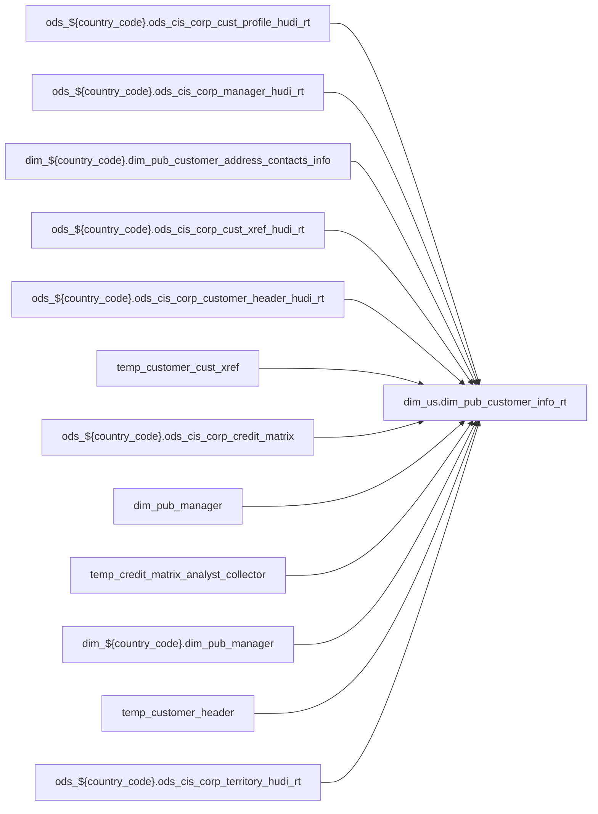

# DIM: Shared dimension for POS attribute enrichment (`dim_us.dim_pub_customer_info_rt`)

- artifact_type: etl_table
- artifact_id: dim_us.dim_pub_customer_info_rt
- domain: pos
- one_line_purpose: POS-domain table with load SQL under bitbucket-etl (see L3); prior contract narrative preserved below when present.
- layer_type: DIM
- source_kind: etl_sql
- evidence_source: source/contracts/pos/bitbucket-etl/dim_pub_customer_info_rt/dim_pub_customer_info_rt.sql
- bitbucket_etl_bundle: source/contracts/pos/bitbucket-etl/dim_pub_customer_info_rt/
- related_etl_scripts:
- None

---

## L1 Data Foundation

### Identity and physical mapping
- **Table:** `dim_us.dim_pub_customer_info_rt`
- **Layer type:** DIM
- **Canonical / derived:** Derived / ETL-loaded (see L3 from bitbucket-etl)
- **Owner team:** Not documented in repository

### Grain, scope, exclusions
- See preserved **Grain and keys** section below when present (POS contract narrative retained).
- Otherwise infer from SELECT / GROUP BY / INSERT column list in `source/contracts/pos/bitbucket-etl/dim_pub_customer_info_rt/dim_pub_customer_info_rt.sql`.

### Cross-engine presence
| Engine | Present | Notes |
|--------|---------|-------|
| Hive | yes | ETL load target |
| Vertica | yes when POS contract documents Vertica sync | See preserved Business query tables |

### Physical schema reference

| Field | Value |
|-------|-------|
| **entity_id** | `dim_us.dim_pub_customer_info_rt` |
| **l1_catalog_seed** | `target/storage/wkb/snapshots/_snapshot_id_template/l1_catalog/{engine}_{schema}_{table}.json` |
| **column_count** | pending (run ddl_seed_writer) |
| **partition_keys** | See preserved Grain / L4 / ETL PARTITION clause |
| **ddl_source** | pending |
| **retrieval** | `python -m tools.wkb.indexing.run_query --query "pos dim_pub_customer_info_rt schema" --intent find_table_schema` |

### Lineage

- **Primary load:** `source/contracts/pos/bitbucket-etl/dim_pub_customer_info_rt/dim_pub_customer_info_rt.sql`
- **upstream:** `ods_${country_code}.ods_cis_corp_cust_profile_hudi_rt` — FROM/JOIN — `source/contracts/pos/bitbucket-etl/dim_pub_customer_info_rt/dim_pub_customer_info_rt.sql`
- **upstream:** `ods_${country_code}.ods_cis_corp_manager_hudi_rt` — FROM/JOIN — `source/contracts/pos/bitbucket-etl/dim_pub_customer_info_rt/dim_pub_customer_info_rt.sql`
- **upstream:** `dim_${country_code}.dim_pub_customer_address_contacts_info` — FROM/JOIN — `source/contracts/pos/bitbucket-etl/dim_pub_customer_info_rt/dim_pub_customer_info_rt.sql`
- **upstream:** `ods_${country_code}.ods_cis_corp_cust_xref_hudi_rt` — FROM/JOIN — `source/contracts/pos/bitbucket-etl/dim_pub_customer_info_rt/dim_pub_customer_info_rt.sql`
- **upstream:** `ods_${country_code}.ods_cis_corp_customer_header_hudi_rt` — FROM/JOIN — `source/contracts/pos/bitbucket-etl/dim_pub_customer_info_rt/dim_pub_customer_info_rt.sql`
- **upstream:** `temp_customer_cust_xref` — FROM/JOIN — `source/contracts/pos/bitbucket-etl/dim_pub_customer_info_rt/dim_pub_customer_info_rt.sql`
- **upstream:** `ods_${country_code}.ods_cis_corp_credit_matrix` — FROM/JOIN — `source/contracts/pos/bitbucket-etl/dim_pub_customer_info_rt/dim_pub_customer_info_rt.sql`
- **upstream:** `dim_pub_manager` — FROM/JOIN — `source/contracts/pos/bitbucket-etl/dim_pub_customer_info_rt/dim_pub_customer_info_rt.sql`
- **upstream:** `temp_credit_matrix_analyst_collector` — FROM/JOIN — `source/contracts/pos/bitbucket-etl/dim_pub_customer_info_rt/dim_pub_customer_info_rt.sql`
- **upstream:** `dim_${country_code}.dim_pub_manager` — FROM/JOIN — `source/contracts/pos/bitbucket-etl/dim_pub_customer_info_rt/dim_pub_customer_info_rt.sql`
- **upstream:** `temp_customer_header` — FROM/JOIN — `source/contracts/pos/bitbucket-etl/dim_pub_customer_info_rt/dim_pub_customer_info_rt.sql`
- **upstream:** `ods_${country_code}.ods_cis_corp_territory_hudi_rt` — FROM/JOIN — `source/contracts/pos/bitbucket-etl/dim_pub_customer_info_rt/dim_pub_customer_info_rt.sql`
- **upstream:** `ods_${country_code}.ods_cis_corp_territory_group_hudi_rt` — FROM/JOIN — `source/contracts/pos/bitbucket-etl/dim_pub_customer_info_rt/dim_pub_customer_info_rt.sql`
- **upstream:** `ods_${country_code}.ods_cis_corp_cust_type_hudi_rt` — FROM/JOIN — `source/contracts/pos/bitbucket-etl/dim_pub_customer_info_rt/dim_pub_customer_info_rt.sql`
- **upstream:** `ods_${country_code}.ods_cis_corp_division_hudi_rt` — FROM/JOIN — `source/contracts/pos/bitbucket-etl/dim_pub_customer_info_rt/dim_pub_customer_info_rt.sql`
- **upstream:** `ods_${country_code}.ods_cis_corp_cust_segment` — FROM/JOIN — `source/contracts/pos/bitbucket-etl/dim_pub_customer_info_rt/dim_pub_customer_info_rt.sql`
- **upstream:** `tmp_outside_sales_rep` — FROM/JOIN — `source/contracts/pos/bitbucket-etl/dim_pub_customer_info_rt/dim_pub_customer_info_rt.sql`
- **upstream:** `temp_contact` — FROM/JOIN — `source/contracts/pos/bitbucket-etl/dim_pub_customer_info_rt/dim_pub_customer_info_rt.sql`
- **upstream:** `temp_cust_profile` — FROM/JOIN — `source/contracts/pos/bitbucket-etl/dim_pub_customer_info_rt/dim_pub_customer_info_rt.sql`
- **upstream:** `ods_${country_code}.ods_cis_corp_customer_credit` — FROM/JOIN — `source/contracts/pos/bitbucket-etl/dim_pub_customer_info_rt/dim_pub_customer_info_rt.sql`
- **downstream:** see L6 Downstream consumers
### Freshness and load path
- Parameters / date window: see ETL `${literal_*}` / `${date_flag}` / `${start_date}` in evidence script.
- Schedule: Not documented in repository

## L2 Declarative Knowledge

### Business purpose
See preserved **Business purpose** below when present (POS contract catalog + linked ETL).

### Audience and use cases
See preserved **Who it helps** section when present.

### Fact key resolution
See preserved **Grain and keys** when present.

### Time field semantics
- Prefer partition / `date_flag` filters documented in preserved sections and L3 Key filters from ETL.

### Metrics served
See preserved Metrics / column groups when present; otherwise L3 column derivations.

### Metric serving map
N/A unless multi-period wide table (see preserved content).

### etl_metrics
No new metric-index formulas appended in this bitbucket-etl upgrade pass.

## L3 Procedural Knowledge

### Query and routing rules
- Reporting: Vertica `dim_us.dim_pub_customer_info_rt` when synced (see preserved Business query tables).
- Load logic: bitbucket-etl evidence `source/contracts/pos/bitbucket-etl/dim_pub_customer_info_rt/dim_pub_customer_info_rt.sql`.

### Dimension join patterns
See Relationship map (ETL JOIN edges) and preserved contract join notes.

### Key filters and ETL business logic

| Predicate | Kind | Evidence |
|-----------|------|----------|
| `cp.profile_type = 'S' AND cp.profile_cat = 'OTHE' -- AND cp.cust_no = fact.bill_to_cust_no AND cp.active = 'Y'` | Business | `source/contracts/pos/bitbucket-etl/dim_pub_customer_info_rt/dim_pub_customer_info_rt.sql` |
| `t.rn = 1; --3 temp table for cust_profile such as profile_c、currency、cust_channel、varnex_members CREATE OR REPLACE TEMPORARY VIEW temp_cust_profile as select cust_no, max(case when trim(cp.profile_...` | Business | `source/contracts/pos/bitbucket-etl/dim_pub_customer_info_rt/dim_pub_customer_info_rt.sql` |
| `cx.xref_type in ('MASTER_SUB', 'CUST_PROG', 'CUST_CSREP', 'FINAN_SUB','BUY_SUB') AND cx.active = 'Y'` | Business | `source/contracts/pos/bitbucket-etl/dim_pub_customer_info_rt/dim_pub_customer_info_rt.sql` |
| `cm.mycis_role in ('C','A'); --6 get manager_name、director_name etc join dim_pub_manager create TEMPORARY TABLE temp_credit_matrix_analyst_collector_name stored as orc as select cmac.mycis_role, cma...` | Business | `source/contracts/pos/bitbucket-etl/dim_pub_customer_info_rt/dim_pub_customer_info_rt.sql` |
| `t.email_seq = 1; --9 get customer_alias_name from cust_xref CREATE OR REPLACE TEMPORARY VIEW temp_customer_alias_name AS SELECT cx.cust_no, max(xref) as customer_alias_name, max(greatest(cx.entry_d...` | Business | `source/contracts/pos/bitbucket-etl/dim_pub_customer_info_rt/dim_pub_customer_info_rt.sql` |

### Standard time-filter SQL
```sql
-- Prefer date_flag / literal_start_date / literal_end_date as used in source/contracts/pos/bitbucket-etl/dim_pub_customer_info_rt/dim_pub_customer_info_rt.sql
```

### End-to-end flow


### Base tables register
| Object | Role |
|--------|------|
| `ods_${country_code}.ods_cis_corp_cust_profile_hudi_rt` | source / temp (FROM/JOIN) |
| `ods_${country_code}.ods_cis_corp_manager_hudi_rt` | source / temp (FROM/JOIN) |
| `dim_${country_code}.dim_pub_customer_address_contacts_info` | source / temp (FROM/JOIN) |
| `ods_${country_code}.ods_cis_corp_cust_xref_hudi_rt` | source / temp (FROM/JOIN) |
| `ods_${country_code}.ods_cis_corp_customer_header_hudi_rt` | source / temp (FROM/JOIN) |
| `temp_customer_cust_xref` | source / temp (FROM/JOIN) |
| `ods_${country_code}.ods_cis_corp_credit_matrix` | source / temp (FROM/JOIN) |
| `dim_pub_manager` | source / temp (FROM/JOIN) |
| `temp_credit_matrix_analyst_collector` | source / temp (FROM/JOIN) |
| `dim_${country_code}.dim_pub_manager` | source / temp (FROM/JOIN) |
| `temp_customer_header` | source / temp (FROM/JOIN) |
| `ods_${country_code}.ods_cis_corp_territory_hudi_rt` | source / temp (FROM/JOIN) |
| `ods_${country_code}.ods_cis_corp_territory_group_hudi_rt` | source / temp (FROM/JOIN) |
| `ods_${country_code}.ods_cis_corp_cust_type_hudi_rt` | source / temp (FROM/JOIN) |
| `ods_${country_code}.ods_cis_corp_division_hudi_rt` | source / temp (FROM/JOIN) |
| `ods_${country_code}.ods_cis_corp_cust_segment` | source / temp (FROM/JOIN) |
| `tmp_outside_sales_rep` | source / temp (FROM/JOIN) |
| `temp_contact` | source / temp (FROM/JOIN) |
| `temp_cust_profile` | source / temp (FROM/JOIN) |
| `ods_${country_code}.ods_cis_corp_customer_credit` | source / temp (FROM/JOIN) |
| `temp_credit_matrix_analyst_collector_name` | source / temp (FROM/JOIN) |
| `ods_${country_code}.ods_cis_corp_company_info` | source / temp (FROM/JOIN) |
| `dim_${country_code}.dim_pub_ec_contact_info` | source / temp (FROM/JOIN) |
| `cust_xref` | source / temp (FROM/JOIN) |
| `company_profile` | source / temp (FROM/JOIN) |

### Step-by-step logic
1. Execute load SQL / python in `source/contracts/pos/bitbucket-etl/dim_pub_customer_info_rt/`.
2. Apply date / business filters from ETL (Key filters).
3. Write target `dim_us.dim_pub_customer_info_rt` (see INSERT/OVERWRITE in evidence).

### Relationship map (embedded)

| from_fqn | to_fqn | cardinality | join_keys | provenance |
|----------|--------|-------------|-----------|------------|
| `ods_${country_code}.ods_cis_corp_customer_header_hudi_rt` | `temp_customer_cust_xref` | many:1 (LEFT) | `ch.cust_no` = `cx.cust_no` | etl_sql (`source/contracts/pos/bitbucket-etl/dim_pub_customer_info_rt/dim_pub_customer_info_rt.sql:148`) |
| `ods_${country_code}.ods_cis_corp_cust_profile_hudi_rt` | `ods_${country_code}.ods_cis_corp_customer_header_hudi_rt` | many:1 (LEFT) | if(cx.m_xref_no is null, ch.cust_no, cx.m_xref_no) = mch.cust_no; --5 create temp table for credit or credit_analyst id CREATE OR REPLACE TEMPORARY VIEW temp... | etl_sql (`source/contracts/pos/bitbucket-etl/dim_pub_customer_info_rt/dim_pub_customer_info_rt.sql:150`) |
| `ods_${country_code}.ods_cis_corp_cust_profile_hudi_rt` | `dim_pub_manager` | many:1 | — | etl_sql (`source/contracts/pos/bitbucket-etl/dim_pub_customer_info_rt/dim_pub_customer_info_rt.sql:195`) |
| `cmac` | `dim_${country_code}.dim_pub_manager` | many:1 (LEFT) | `cmac.supervisor_id` = `dpm1.userid` | etl_sql (`source/contracts/pos/bitbucket-etl/dim_pub_customer_info_rt/dim_pub_customer_info_rt.sql:216`) |
| `cmac` | `dim_${country_code}.dim_pub_manager` | many:1 (LEFT) | `cmac.manager_id` = `dpm2.userid` | etl_sql (`source/contracts/pos/bitbucket-etl/dim_pub_customer_info_rt/dim_pub_customer_info_rt.sql:218`) |
| `cmac` | `dim_${country_code}.dim_pub_manager` | many:1 (LEFT) | `cmac.senior_manager_id` = `dpm3.userid` | etl_sql (`source/contracts/pos/bitbucket-etl/dim_pub_customer_info_rt/dim_pub_customer_info_rt.sql:220`) |
| `cmac` | `dim_${country_code}.dim_pub_manager` | many:1 (LEFT) | `cmac.director_id` = `dpm4.userid` | etl_sql (`source/contracts/pos/bitbucket-etl/dim_pub_customer_info_rt/dim_pub_customer_info_rt.sql:222`) |
| `cmac` | `dim_${country_code}.dim_pub_manager` | many:1 (LEFT) | `cmac.vp_id` = `dpm5.userid` | etl_sql (`source/contracts/pos/bitbucket-etl/dim_pub_customer_info_rt/dim_pub_customer_info_rt.sql:224`) |
| `cmac` | `dim_${country_code}.dim_pub_manager` | many:1 (LEFT) | `cmac.svp_id` = `dpm6.userid` | etl_sql (`source/contracts/pos/bitbucket-etl/dim_pub_customer_info_rt/dim_pub_customer_info_rt.sql:226`) |
| `cmac` | `dim_${country_code}.dim_pub_manager` | many:1 (LEFT) | `cmac.userid` = `dpm7.userid` | etl_sql (`source/contracts/pos/bitbucket-etl/dim_pub_customer_info_rt/dim_pub_customer_info_rt.sql:228`) |
| `ods_${country_code}.ods_cis_corp_customer_header_hudi_rt` | `ods_${country_code}.ods_cis_corp_territory_hudi_rt` | many:1 (LEFT) | `ch.sales_terr` = `t.sales_terr` | etl_sql (`source/contracts/pos/bitbucket-etl/dim_pub_customer_info_rt/dim_pub_customer_info_rt.sql:324`) |
| `ods_${country_code}.ods_cis_corp_territory_hudi_rt` | `ods_${country_code}.ods_cis_corp_territory_group_hudi_rt` | many:1 (LEFT) | `t.group_id` = `b.group_id` | etl_sql (`source/contracts/pos/bitbucket-etl/dim_pub_customer_info_rt/dim_pub_customer_info_rt.sql:327`) |
| `ods_${country_code}.ods_cis_corp_territory_group_hudi_rt` | `ods_${country_code}.ods_cis_corp_cust_type_hudi_rt` | many:1 (LEFT) | `b.cust_type` = `c.cust_type` | etl_sql (`source/contracts/pos/bitbucket-etl/dim_pub_customer_info_rt/dim_pub_customer_info_rt.sql:330`) |
| `ods_${country_code}.ods_cis_corp_cust_type_hudi_rt` | `ods_${country_code}.ods_cis_corp_division_hudi_rt` | many:1 (LEFT) | `c.division` = `d.division` | etl_sql (`source/contracts/pos/bitbucket-etl/dim_pub_customer_info_rt/dim_pub_customer_info_rt.sql:333`) |
| `ods_${country_code}.ods_cis_corp_cust_profile_hudi_rt` | `ods_${country_code}.ods_cis_corp_cust_segment` | many:1 (LEFT) | — | etl_sql (`source/contracts/pos/bitbucket-etl/dim_pub_customer_info_rt/dim_pub_customer_info_rt.sql:336`) |
| `ods_${country_code}.ods_cis_corp_customer_header_hudi_rt` | `tmp_outside_sales_rep` | many:1 (LEFT) | `ch.cust_no` = `tosr.cust_no` | etl_sql (`source/contracts/pos/bitbucket-etl/dim_pub_customer_info_rt/dim_pub_customer_info_rt.sql:339`) |
| `ods_${country_code}.ods_cis_corp_customer_header_hudi_rt` | `temp_contact` | many:1 (LEFT) | `ch.cust_no` = `ctt.cust_no` | etl_sql (`source/contracts/pos/bitbucket-etl/dim_pub_customer_info_rt/dim_pub_customer_info_rt.sql:342`) |
| `ods_${country_code}.ods_cis_corp_customer_header_hudi_rt` | `temp_cust_profile` | many:1 (LEFT) | `ch.cust_no` = `cp.cust_no` | etl_sql (`source/contracts/pos/bitbucket-etl/dim_pub_customer_info_rt/dim_pub_customer_info_rt.sql:345`) |
| `ods_${country_code}.ods_cis_corp_customer_header_hudi_rt` | `temp_customer_cust_xref` | many:1 (LEFT) | `ch.cust_no` = `ccx.cust_no` | etl_sql (`source/contracts/pos/bitbucket-etl/dim_pub_customer_info_rt/dim_pub_customer_info_rt.sql:348`) |
| `temp_customer_cust_xref` | `dim_${country_code}.dim_pub_manager` | many:1 (LEFT) | `ccx.s_xref` = `dpm.userid` | etl_sql (`source/contracts/pos/bitbucket-etl/dim_pub_customer_info_rt/dim_pub_customer_info_rt.sql:351`) |
| `temp_customer_cust_xref` | `dim_${country_code}.dim_pub_manager` | many:1 (LEFT) | `ccx.p_xref` = `dpm1.userid` | etl_sql (`source/contracts/pos/bitbucket-etl/dim_pub_customer_info_rt/dim_pub_customer_info_rt.sql:354`) |
| `ods_${country_code}.ods_cis_corp_cust_profile_hudi_rt` | `dim_${country_code}.dim_pub_manager` | many:1 (LEFT) | nvl(ch.reviewer,t.reviewer) = dpm2.userid | etl_sql (`source/contracts/pos/bitbucket-etl/dim_pub_customer_info_rt/dim_pub_customer_info_rt.sql:357`) |
| `ods_${country_code}.ods_cis_corp_customer_header_hudi_rt` | `ods_${country_code}.ods_cis_corp_customer_credit` | many:1 (LEFT) | `ch.cust_no` = `crt.cust_no`; `ch.default_terms` = `crt.terms` | etl_sql (`source/contracts/pos/bitbucket-etl/dim_pub_customer_info_rt/dim_pub_customer_info_rt.sql:360`) |
| `ods_${country_code}.ods_cis_corp_cust_profile_hudi_rt` | `temp_credit_matrix_analyst_collector_name` | many:1 (LEFT) | nvl(ch.reviewer,t.reviewer)=cm.userid and cm.mycis_role='C' | etl_sql (`source/contracts/pos/bitbucket-etl/dim_pub_customer_info_rt/dim_pub_customer_info_rt.sql:364`) |
| `ods_${country_code}.ods_cis_corp_cust_profile_hudi_rt` | `temp_credit_matrix_analyst_collector_name` | many:1 (LEFT) | nvl(ch.cred_analyst,t.cred_analyst)=cm1.userid and cm1.mycis_role='A' | etl_sql (`source/contracts/pos/bitbucket-etl/dim_pub_customer_info_rt/dim_pub_customer_info_rt.sql:367`) |
| `ods_${country_code}.ods_cis_corp_customer_header_hudi_rt` | `ods_${country_code}.ods_cis_corp_company_info` | many:1 (LEFT) | `ch.company_no` = `ci.company_no` | etl_sql (`source/contracts/pos/bitbucket-etl/dim_pub_customer_info_rt/dim_pub_customer_info_rt.sql:370`) |
| `ods_${country_code}.ods_cis_corp_cust_profile_hudi_rt` | `ods_${country_code}.ods_cis_corp_company_profile` | many:1 (LEFT) | — | etl_sql (`source/contracts/pos/bitbucket-etl/dim_pub_customer_info_rt/dim_pub_customer_info_rt.sql:420`) |
| `tcac` | `ods_${country_code}.ods_cis_corp_customer_header_hudi_rt` | many:1 (LEFT) | `tcac.finance_master` = `ch.cust_no` | etl_sql (`source/contracts/pos/bitbucket-etl/dim_pub_customer_info_rt/dim_pub_customer_info_rt.sql:524`) |
| `tcac` | `temp_ec_contacts_info` | many:1 (LEFT) | `tcac.cust_no` = `ec.cust_no` | etl_sql (`source/contracts/pos/bitbucket-etl/dim_pub_customer_info_rt/dim_pub_customer_info_rt.sql:526`) |
| `tcac` | `temp_customer_alias_name` | many:1 (LEFT) | `tcac.cust_no` = `cn.cust_no` | etl_sql (`source/contracts/pos/bitbucket-etl/dim_pub_customer_info_rt/dim_pub_customer_info_rt.sql:528`) |
| `tcac` | `temp_currency_profile` | many:1 (LEFT) | `tcac.cust_no` = `cp.cust_no` | etl_sql (`source/contracts/pos/bitbucket-etl/dim_pub_customer_info_rt/dim_pub_customer_info_rt.sql:530`) |

### Special logic (embedded)

`source/ref/pos/special_logic.txt` exists but no rule naming this FQN/stem (`dim_us.dim_pub_customer_info_rt`).

Not documented in repository


### Column / field derivations (from ETL SQL)

| target_column | expression_sql | upstream_columns | upstream_tables | transform_kind | evidence |
|---------------|----------------|------------------|-----------------|----------------|----------|
| `mcust_no` | `tcac.mcust_no` | `mcust_no` | `temp_customer_analyst_collector`, `ods_${country_code}.ods_cis_corp_customer_header_hudi_rt`, `temp_ec_contacts_info`, `temp_customer_alias_name`, `temp_currency_profile` | passthrough | `source/contracts/pos/bitbucket-etl/dim_pub_customer_info_rt/dim_pub_customer_info_rt.sql:430` |
| `mcust_name` | `tcac.mcust_name` | `mcust_name` | `temp_customer_analyst_collector`, `ods_${country_code}.ods_cis_corp_customer_header_hudi_rt`, `temp_ec_contacts_info`, `temp_customer_alias_name`, `temp_currency_profile` | passthrough | `source/contracts/pos/bitbucket-etl/dim_pub_customer_info_rt/dim_pub_customer_info_rt.sql:431` |
| `cust_no` | `tcac.cust_no` | `cust_no` | `temp_customer_analyst_collector`, `ods_${country_code}.ods_cis_corp_customer_header_hudi_rt`, `temp_ec_contacts_info`, `temp_customer_alias_name`, `temp_currency_profile` | passthrough | `source/contracts/pos/bitbucket-etl/dim_pub_customer_info_rt/dim_pub_customer_info_rt.sql:432` |
| `cust_name` | `tcac.cust_name` | `cust_name` | `temp_customer_analyst_collector`, `ods_${country_code}.ods_cis_corp_customer_header_hudi_rt`, `temp_ec_contacts_info`, `temp_customer_alias_name`, `temp_currency_profile` | passthrough | `source/contracts/pos/bitbucket-etl/dim_pub_customer_info_rt/dim_pub_customer_info_rt.sql:433` |
| `cust_type` | `tcac.cust_type` | `cust_type` | `temp_customer_analyst_collector`, `ods_${country_code}.ods_cis_corp_customer_header_hudi_rt`, `temp_ec_contacts_info`, `temp_customer_alias_name`, `temp_currency_profile` | passthrough | `source/contracts/pos/bitbucket-etl/dim_pub_customer_info_rt/dim_pub_customer_info_rt.sql:434` |
| `cust_type_descr` | `tcac.cust_type_descr` | `cust_type_descr` | `temp_customer_analyst_collector`, `ods_${country_code}.ods_cis_corp_customer_header_hudi_rt`, `temp_ec_contacts_info`, `temp_customer_alias_name`, `temp_currency_profile` | passthrough | `source/contracts/pos/bitbucket-etl/dim_pub_customer_info_rt/dim_pub_customer_info_rt.sql:435` |
| `cust_acct_type` | `tcac.cust_acct_type` | `cust_acct_type` | `temp_customer_analyst_collector`, `ods_${country_code}.ods_cis_corp_customer_header_hudi_rt`, `temp_ec_contacts_info`, `temp_customer_alias_name`, `temp_currency_profile` | passthrough | `source/contracts/pos/bitbucket-etl/dim_pub_customer_info_rt/dim_pub_customer_info_rt.sql:436` |
| `is_restricted` | `tcac.is_restricted` | `is_restricted` | `temp_customer_analyst_collector`, `ods_${country_code}.ods_cis_corp_customer_header_hudi_rt`, `temp_ec_contacts_info`, `temp_customer_alias_name`, `temp_currency_profile` | passthrough | `source/contracts/pos/bitbucket-etl/dim_pub_customer_info_rt/dim_pub_customer_info_rt.sql:437` |
| `is_discontinued` | `tcac.is_discontinued` | `is_discontinued` | `temp_customer_analyst_collector`, `ods_${country_code}.ods_cis_corp_customer_header_hudi_rt`, `temp_ec_contacts_info`, `temp_customer_alias_name`, `temp_currency_profile` | passthrough | `source/contracts/pos/bitbucket-etl/dim_pub_customer_info_rt/dim_pub_customer_info_rt.sql:438` |
| `sales_terr` | `tcac.sales_terr` | `sales_terr` | `temp_customer_analyst_collector`, `ods_${country_code}.ods_cis_corp_customer_header_hudi_rt`, `temp_ec_contacts_info`, `temp_customer_alias_name`, `temp_currency_profile` | passthrough | `source/contracts/pos/bitbucket-etl/dim_pub_customer_info_rt/dim_pub_customer_info_rt.sql:439` |
| `sales_terr_name` | `tcac.sales_terr_name` | `sales_terr_name` | `temp_customer_analyst_collector`, `ods_${country_code}.ods_cis_corp_customer_header_hudi_rt`, `temp_ec_contacts_info`, `temp_customer_alias_name`, `temp_currency_profile` | passthrough | `source/contracts/pos/bitbucket-etl/dim_pub_customer_info_rt/dim_pub_customer_info_rt.sql:440` |
| `sales_segment` | `tcac.sales_segment` | `sales_segment` | `temp_customer_analyst_collector`, `ods_${country_code}.ods_cis_corp_customer_header_hudi_rt`, `temp_ec_contacts_info`, `temp_customer_alias_name`, `temp_currency_profile` | passthrough | `source/contracts/pos/bitbucket-etl/dim_pub_customer_info_rt/dim_pub_customer_info_rt.sql:441` |
| `division_desc` | `tcac.division_desc` | `division_desc` | `temp_customer_analyst_collector`, `ods_${country_code}.ods_cis_corp_customer_header_hudi_rt`, `temp_ec_contacts_info`, `temp_customer_alias_name`, `temp_currency_profile` | passthrough | `source/contracts/pos/bitbucket-etl/dim_pub_customer_info_rt/dim_pub_customer_info_rt.sql:442` |
| `lead_id` | `tcac.lead_id` | `lead_id` | `temp_customer_analyst_collector`, `ods_${country_code}.ods_cis_corp_customer_header_hudi_rt`, `temp_ec_contacts_info`, `temp_customer_alias_name`, `temp_currency_profile` | passthrough | `source/contracts/pos/bitbucket-etl/dim_pub_customer_info_rt/dim_pub_customer_info_rt.sql:443` |
| `profile_c` | `tcac.profile_c` | `profile_c` | `temp_customer_analyst_collector`, `ods_${country_code}.ods_cis_corp_customer_header_hudi_rt`, `temp_ec_contacts_info`, `temp_customer_alias_name`, `temp_currency_profile` | passthrough | `source/contracts/pos/bitbucket-etl/dim_pub_customer_info_rt/dim_pub_customer_info_rt.sql:444` |
| `outside_sales_rep` | `tcac.outside_sales_rep` | `outside_sales_rep` | `temp_customer_analyst_collector`, `ods_${country_code}.ods_cis_corp_customer_header_hudi_rt`, `temp_ec_contacts_info`, `temp_customer_alias_name`, `temp_currency_profile` | passthrough | `source/contracts/pos/bitbucket-etl/dim_pub_customer_info_rt/dim_pub_customer_info_rt.sql:445` |
| `outside_sales_rep_name` | `tcac.outside_sales_rep_name` | `outside_sales_rep_name` | `temp_customer_analyst_collector`, `ods_${country_code}.ods_cis_corp_customer_header_hudi_rt`, `temp_ec_contacts_info`, `temp_customer_alias_name`, `temp_currency_profile` | passthrough | `source/contracts/pos/bitbucket-etl/dim_pub_customer_info_rt/dim_pub_customer_info_rt.sql:446` |
| `bill_to_cust_addr` | `tcac.bill_to_cust_addr` | `bill_to_cust_addr` | `temp_customer_analyst_collector`, `ods_${country_code}.ods_cis_corp_customer_header_hudi_rt`, `temp_ec_contacts_info`, `temp_customer_alias_name`, `temp_currency_profile` | passthrough | `source/contracts/pos/bitbucket-etl/dim_pub_customer_info_rt/dim_pub_customer_info_rt.sql:447` |
| `bill_to_cust_zip` | `tcac.bill_to_cust_zip` | `bill_to_cust_zip` | `temp_customer_analyst_collector`, `ods_${country_code}.ods_cis_corp_customer_header_hudi_rt`, `temp_ec_contacts_info`, `temp_customer_alias_name`, `temp_currency_profile` | passthrough | `source/contracts/pos/bitbucket-etl/dim_pub_customer_info_rt/dim_pub_customer_info_rt.sql:448` |
| `bill_to_cust_city` | `tcac.bill_to_cust_city` | `bill_to_cust_city` | `temp_customer_analyst_collector`, `ods_${country_code}.ods_cis_corp_customer_header_hudi_rt`, `temp_ec_contacts_info`, `temp_customer_alias_name`, `temp_currency_profile` | passthrough | `source/contracts/pos/bitbucket-etl/dim_pub_customer_info_rt/dim_pub_customer_info_rt.sql:449` |
| `bill_to_cust_state` | `tcac.bill_to_cust_state` | `bill_to_cust_state` | `temp_customer_analyst_collector`, `ods_${country_code}.ods_cis_corp_customer_header_hudi_rt`, `temp_ec_contacts_info`, `temp_customer_alias_name`, `temp_currency_profile` | passthrough | `source/contracts/pos/bitbucket-etl/dim_pub_customer_info_rt/dim_pub_customer_info_rt.sql:450` |
| `bill_to_cust_country` | `tcac.bill_to_cust_country` | `bill_to_cust_country` | `temp_customer_analyst_collector`, `ods_${country_code}.ods_cis_corp_customer_header_hudi_rt`, `temp_ec_contacts_info`, `temp_customer_alias_name`, `temp_currency_profile` | passthrough | `source/contracts/pos/bitbucket-etl/dim_pub_customer_info_rt/dim_pub_customer_info_rt.sql:451` |
| `bill_to_contact_name` | `tcac.bill_to_contact_name` | `bill_to_contact_name` | `temp_customer_analyst_collector`, `ods_${country_code}.ods_cis_corp_customer_header_hudi_rt`, `temp_ec_contacts_info`, `temp_customer_alias_name`, `temp_currency_profile` | passthrough | `source/contracts/pos/bitbucket-etl/dim_pub_customer_info_rt/dim_pub_customer_info_rt.sql:452` |
| `bill_to_contact_email` | `tcac.bill_to_contact_email` | `bill_to_contact_email` | `temp_customer_analyst_collector`, `ods_${country_code}.ods_cis_corp_customer_header_hudi_rt`, `temp_ec_contacts_info`, `temp_customer_alias_name`, `temp_currency_profile` | passthrough | `source/contracts/pos/bitbucket-etl/dim_pub_customer_info_rt/dim_pub_customer_info_rt.sql:453` |
| `bill_to_contact_phone` | `tcac.bill_to_contact_phone` | `bill_to_contact_phone` | `temp_customer_analyst_collector`, `ods_${country_code}.ods_cis_corp_customer_header_hudi_rt`, `temp_ec_contacts_info`, `temp_customer_alias_name`, `temp_currency_profile` | passthrough | `source/contracts/pos/bitbucket-etl/dim_pub_customer_info_rt/dim_pub_customer_info_rt.sql:454` |
| `bill_to_contact_title` | `tcac.bill_to_contact_title` | `bill_to_contact_title` | `temp_customer_analyst_collector`, `ods_${country_code}.ods_cis_corp_customer_header_hudi_rt`, `temp_ec_contacts_info`, `temp_customer_alias_name`, `temp_currency_profile` | passthrough | `source/contracts/pos/bitbucket-etl/dim_pub_customer_info_rt/dim_pub_customer_info_rt.sql:455` |
| `resale_no` | `tcac.resale_no` | `resale_no` | `temp_customer_analyst_collector`, `ods_${country_code}.ods_cis_corp_customer_header_hudi_rt`, `temp_ec_contacts_info`, `temp_customer_alias_name`, `temp_currency_profile` | passthrough | `source/contracts/pos/bitbucket-etl/dim_pub_customer_info_rt/dim_pub_customer_info_rt.sql:456` |
| `store_no` | `tcac.store_no` | `store_no` | `temp_customer_analyst_collector`, `ods_${country_code}.ods_cis_corp_customer_header_hudi_rt`, `temp_ec_contacts_info`, `temp_customer_alias_name`, `temp_currency_profile` | passthrough | `source/contracts/pos/bitbucket-etl/dim_pub_customer_info_rt/dim_pub_customer_info_rt.sql:457` |
| `default_terms` | `tcac.default_terms` | `default_terms` | `temp_customer_analyst_collector`, `ods_${country_code}.ods_cis_corp_customer_header_hudi_rt`, `temp_ec_contacts_info`, `temp_customer_alias_name`, `temp_currency_profile` | passthrough | `source/contracts/pos/bitbucket-etl/dim_pub_customer_info_rt/dim_pub_customer_info_rt.sql:458` |
| `currency` | `tcac.currency` | `currency` | `temp_customer_analyst_collector`, `ods_${country_code}.ods_cis_corp_customer_header_hudi_rt`, `temp_ec_contacts_info`, `temp_customer_alias_name`, `temp_currency_profile` | passthrough | `source/contracts/pos/bitbucket-etl/dim_pub_customer_info_rt/dim_pub_customer_info_rt.sql:459` |
| `etl_timestamp` | `tcac.etl_timestamp` | `etl_timestamp` | `temp_customer_analyst_collector`, `ods_${country_code}.ods_cis_corp_customer_header_hudi_rt`, `temp_ec_contacts_info`, `temp_customer_alias_name`, `temp_currency_profile` | passthrough | `source/contracts/pos/bitbucket-etl/dim_pub_customer_info_rt/dim_pub_customer_info_rt.sql:460` |
| `finance_master` | `tcac.finance_master` | `finance_master` | `temp_customer_analyst_collector`, `ods_${country_code}.ods_cis_corp_customer_header_hudi_rt`, `temp_ec_contacts_info`, `temp_customer_alias_name`, `temp_currency_profile` | passthrough | `source/contracts/pos/bitbucket-etl/dim_pub_customer_info_rt/dim_pub_customer_info_rt.sql:461` |
| `division` | `tcac.division` | `division` | `temp_customer_analyst_collector`, `ods_${country_code}.ods_cis_corp_customer_header_hudi_rt`, `temp_ec_contacts_info`, `temp_customer_alias_name`, `temp_currency_profile` | passthrough | `source/contracts/pos/bitbucket-etl/dim_pub_customer_info_rt/dim_pub_customer_info_rt.sql:442` |
| `region` | `tcac.region` | `region` | `temp_customer_analyst_collector`, `ods_${country_code}.ods_cis_corp_customer_header_hudi_rt`, `temp_ec_contacts_info`, `temp_customer_alias_name`, `temp_currency_profile` | passthrough | `source/contracts/pos/bitbucket-etl/dim_pub_customer_info_rt/dim_pub_customer_info_rt.sql:463` |
| `credit_analyst` | `tcac.credit_analyst` | `credit_analyst` | `temp_customer_analyst_collector`, `ods_${country_code}.ods_cis_corp_customer_header_hudi_rt`, `temp_ec_contacts_info`, `temp_customer_alias_name`, `temp_currency_profile` | passthrough | `source/contracts/pos/bitbucket-etl/dim_pub_customer_info_rt/dim_pub_customer_info_rt.sql:464` |
| `program_analyst` | `tcac.program_analyst` | `program_analyst` | `temp_customer_analyst_collector`, `ods_${country_code}.ods_cis_corp_customer_header_hudi_rt`, `temp_ec_contacts_info`, `temp_customer_alias_name`, `temp_currency_profile` | passthrough | `source/contracts/pos/bitbucket-etl/dim_pub_customer_info_rt/dim_pub_customer_info_rt.sql:465` |
| `service_analyst` | `tcac.service_analyst` | `service_analyst` | `temp_customer_analyst_collector`, `ods_${country_code}.ods_cis_corp_customer_header_hudi_rt`, `temp_ec_contacts_info`, `temp_customer_alias_name`, `temp_currency_profile` | passthrough | `source/contracts/pos/bitbucket-etl/dim_pub_customer_info_rt/dim_pub_customer_info_rt.sql:466` |
| `collector_id` | `tcac.collector_id` | `collector_id` | `temp_customer_analyst_collector`, `ods_${country_code}.ods_cis_corp_customer_header_hudi_rt`, `temp_ec_contacts_info`, `temp_customer_alias_name`, `temp_currency_profile` | passthrough | `source/contracts/pos/bitbucket-etl/dim_pub_customer_info_rt/dim_pub_customer_info_rt.sql:467` |
| `collector_name` | `tcac.collector_name` | `collector_name` | `temp_customer_analyst_collector`, `ods_${country_code}.ods_cis_corp_customer_header_hudi_rt`, `temp_ec_contacts_info`, `temp_customer_alias_name`, `temp_currency_profile` | passthrough | `source/contracts/pos/bitbucket-etl/dim_pub_customer_info_rt/dim_pub_customer_info_rt.sql:468` |
| `release_code` | `tcac.release_code` | `release_code` | `temp_customer_analyst_collector`, `ods_${country_code}.ods_cis_corp_customer_header_hudi_rt`, `temp_ec_contacts_info`, `temp_customer_alias_name`, `temp_currency_profile` | passthrough | `source/contracts/pos/bitbucket-etl/dim_pub_customer_info_rt/dim_pub_customer_info_rt.sql:469` |
| `credit_limit` | `tcac.credit_limit` | `credit_limit` | `temp_customer_analyst_collector`, `ods_${country_code}.ods_cis_corp_customer_header_hudi_rt`, `temp_ec_contacts_info`, `temp_customer_alias_name`, `temp_currency_profile` | passthrough | `source/contracts/pos/bitbucket-etl/dim_pub_customer_info_rt/dim_pub_customer_info_rt.sql:470` |
| `reviewer` | `tcac.reviewer` | `reviewer` | `temp_customer_analyst_collector`, `ods_${country_code}.ods_cis_corp_customer_header_hudi_rt`, `temp_ec_contacts_info`, `temp_customer_alias_name`, `temp_currency_profile` | passthrough | `source/contracts/pos/bitbucket-etl/dim_pub_customer_info_rt/dim_pub_customer_info_rt.sql:471` |
| `next_review` | `tcac.next_review` | `next_review` | `temp_customer_analyst_collector`, `ods_${country_code}.ods_cis_corp_customer_header_hudi_rt`, `temp_ec_contacts_info`, `temp_customer_alias_name`, `temp_currency_profile` | passthrough | `source/contracts/pos/bitbucket-etl/dim_pub_customer_info_rt/dim_pub_customer_info_rt.sql:472` |
| `pending_amt` | `tcac.pending_amt` | `pending_amt` | `temp_customer_analyst_collector`, `ods_${country_code}.ods_cis_corp_customer_header_hudi_rt`, `temp_ec_contacts_info`, `temp_customer_alias_name`, `temp_currency_profile` | passthrough | `source/contracts/pos/bitbucket-etl/dim_pub_customer_info_rt/dim_pub_customer_info_rt.sql:473` |
| `cust_channel` | `tcac.cust_channel` | `cust_channel` | `temp_customer_analyst_collector`, `ods_${country_code}.ods_cis_corp_customer_header_hudi_rt`, `temp_ec_contacts_info`, `temp_customer_alias_name`, `temp_currency_profile` | passthrough | `source/contracts/pos/bitbucket-etl/dim_pub_customer_info_rt/dim_pub_customer_info_rt.sql:474` |
| `varnex_members` | `tcac.varnex_members` | `varnex_members` | `temp_customer_analyst_collector`, `ods_${country_code}.ods_cis_corp_customer_header_hudi_rt`, `temp_ec_contacts_info`, `temp_customer_alias_name`, `temp_currency_profile` | passthrough | `source/contracts/pos/bitbucket-etl/dim_pub_customer_info_rt/dim_pub_customer_info_rt.sql:475` |
| `customer_entry_datetime` | `tcac.customer_entry_datetime` | `customer_entry_datetime` | `temp_customer_analyst_collector`, `ods_${country_code}.ods_cis_corp_customer_header_hudi_rt`, `temp_ec_contacts_info`, `temp_customer_alias_name`, `temp_currency_profile` | passthrough | `source/contracts/pos/bitbucket-etl/dim_pub_customer_info_rt/dim_pub_customer_info_rt.sql:476` |
| `program_analyst_id` | `tcac.program_analyst_id` | `program_analyst_id` | `temp_customer_analyst_collector`, `ods_${country_code}.ods_cis_corp_customer_header_hudi_rt`, `temp_ec_contacts_info`, `temp_customer_alias_name`, `temp_currency_profile` | passthrough | `source/contracts/pos/bitbucket-etl/dim_pub_customer_info_rt/dim_pub_customer_info_rt.sql:477` |
| `service_analyst_id` | `tcac.service_analyst_id` | `service_analyst_id` | `temp_customer_analyst_collector`, `ods_${country_code}.ods_cis_corp_customer_header_hudi_rt`, `temp_ec_contacts_info`, `temp_customer_alias_name`, `temp_currency_profile` | passthrough | `source/contracts/pos/bitbucket-etl/dim_pub_customer_info_rt/dim_pub_customer_info_rt.sql:478` |
| `collector_manager_id` | `tcac.collector_manager_id` | `collector_manager_id` | `temp_customer_analyst_collector`, `ods_${country_code}.ods_cis_corp_customer_header_hudi_rt`, `temp_ec_contacts_info`, `temp_customer_alias_name`, `temp_currency_profile` | passthrough | `source/contracts/pos/bitbucket-etl/dim_pub_customer_info_rt/dim_pub_customer_info_rt.sql:479` |
| `collector_manager_name` | `tcac.collector_manager_name` | `collector_manager_name` | `temp_customer_analyst_collector`, `ods_${country_code}.ods_cis_corp_customer_header_hudi_rt`, `temp_ec_contacts_info`, `temp_customer_alias_name`, `temp_currency_profile` | passthrough | `source/contracts/pos/bitbucket-etl/dim_pub_customer_info_rt/dim_pub_customer_info_rt.sql:480` |
| `collector_director_id` | `tcac.collector_director_id` | `collector_director_id` | `temp_customer_analyst_collector`, `ods_${country_code}.ods_cis_corp_customer_header_hudi_rt`, `temp_ec_contacts_info`, `temp_customer_alias_name`, `temp_currency_profile` | passthrough | `source/contracts/pos/bitbucket-etl/dim_pub_customer_info_rt/dim_pub_customer_info_rt.sql:481` |
| `collector_director_name` | `tcac.collector_director_name` | `collector_director_name` | `temp_customer_analyst_collector`, `ods_${country_code}.ods_cis_corp_customer_header_hudi_rt`, `temp_ec_contacts_info`, `temp_customer_alias_name`, `temp_currency_profile` | passthrough | `source/contracts/pos/bitbucket-etl/dim_pub_customer_info_rt/dim_pub_customer_info_rt.sql:482` |
| `collector_vp_id` | `tcac.collector_vp_id` | `collector_vp_id` | `temp_customer_analyst_collector`, `ods_${country_code}.ods_cis_corp_customer_header_hudi_rt`, `temp_ec_contacts_info`, `temp_customer_alias_name`, `temp_currency_profile` | passthrough | `source/contracts/pos/bitbucket-etl/dim_pub_customer_info_rt/dim_pub_customer_info_rt.sql:483` |
| `collector_vp_name` | `tcac.collector_vp_name` | `collector_vp_name` | `temp_customer_analyst_collector`, `ods_${country_code}.ods_cis_corp_customer_header_hudi_rt`, `temp_ec_contacts_info`, `temp_customer_alias_name`, `temp_currency_profile` | passthrough | `source/contracts/pos/bitbucket-etl/dim_pub_customer_info_rt/dim_pub_customer_info_rt.sql:484` |
| `credit_analyst_name` | `tcac.credit_analyst_name` | `credit_analyst_name` | `temp_customer_analyst_collector`, `ods_${country_code}.ods_cis_corp_customer_header_hudi_rt`, `temp_ec_contacts_info`, `temp_customer_alias_name`, `temp_currency_profile` | passthrough | `source/contracts/pos/bitbucket-etl/dim_pub_customer_info_rt/dim_pub_customer_info_rt.sql:485` |
| `credit_analyst_manager_id` | `tcac.credit_analyst_manager_id` | `credit_analyst_manager_id` | `temp_customer_analyst_collector`, `ods_${country_code}.ods_cis_corp_customer_header_hudi_rt`, `temp_ec_contacts_info`, `temp_customer_alias_name`, `temp_currency_profile` | passthrough | `source/contracts/pos/bitbucket-etl/dim_pub_customer_info_rt/dim_pub_customer_info_rt.sql:486` |
| `credit_analyst_manager_name` | `tcac.credit_analyst_manager_name` | `credit_analyst_manager_name` | `temp_customer_analyst_collector`, `ods_${country_code}.ods_cis_corp_customer_header_hudi_rt`, `temp_ec_contacts_info`, `temp_customer_alias_name`, `temp_currency_profile` | passthrough | `source/contracts/pos/bitbucket-etl/dim_pub_customer_info_rt/dim_pub_customer_info_rt.sql:487` |
| `credit_analyst_director_id` | `tcac.credit_analyst_director_id` | `credit_analyst_director_id` | `temp_customer_analyst_collector`, `ods_${country_code}.ods_cis_corp_customer_header_hudi_rt`, `temp_ec_contacts_info`, `temp_customer_alias_name`, `temp_currency_profile` | passthrough | `source/contracts/pos/bitbucket-etl/dim_pub_customer_info_rt/dim_pub_customer_info_rt.sql:488` |
| `credit_analyst_director_name` | `tcac.credit_analyst_director_name` | `credit_analyst_director_name` | `temp_customer_analyst_collector`, `ods_${country_code}.ods_cis_corp_customer_header_hudi_rt`, `temp_ec_contacts_info`, `temp_customer_alias_name`, `temp_currency_profile` | passthrough | `source/contracts/pos/bitbucket-etl/dim_pub_customer_info_rt/dim_pub_customer_info_rt.sql:489` |
| `credit_analyst_vp_id` | `tcac.credit_analyst_vp_id` | `credit_analyst_vp_id` | `temp_customer_analyst_collector`, `ods_${country_code}.ods_cis_corp_customer_header_hudi_rt`, `temp_ec_contacts_info`, `temp_customer_alias_name`, `temp_currency_profile` | passthrough | `source/contracts/pos/bitbucket-etl/dim_pub_customer_info_rt/dim_pub_customer_info_rt.sql:490` |
| `credit_analyst_vp_name` | `tcac.credit_analyst_vp_name` | `credit_analyst_vp_name` | `temp_customer_analyst_collector`, `ods_${country_code}.ods_cis_corp_customer_header_hudi_rt`, `temp_ec_contacts_info`, `temp_customer_alias_name`, `temp_currency_profile` | passthrough | `source/contracts/pos/bitbucket-etl/dim_pub_customer_info_rt/dim_pub_customer_info_rt.sql:491` |
| `buying_group_no` | `tcac.buying_group_no` | `buying_group_no` | `temp_customer_analyst_collector`, `ods_${country_code}.ods_cis_corp_customer_header_hudi_rt`, `temp_ec_contacts_info`, `temp_customer_alias_name`, `temp_currency_profile` | passthrough | `source/contracts/pos/bitbucket-etl/dim_pub_customer_info_rt/dim_pub_customer_info_rt.sql:492` |
| `price_grid` | `tcac.price_grid` | `price_grid` | `temp_customer_analyst_collector`, `ods_${country_code}.ods_cis_corp_customer_header_hudi_rt`, `temp_ec_contacts_info`, `temp_customer_alias_name`, `temp_currency_profile` | passthrough | `source/contracts/pos/bitbucket-etl/dim_pub_customer_info_rt/dim_pub_customer_info_rt.sql:493` |
| `finance_cust_name` | `ch.cust_name` | `cust_name` | `temp_customer_analyst_collector`, `ods_${country_code}.ods_cis_corp_customer_header_hudi_rt`, `temp_ec_contacts_info`, `temp_customer_alias_name`, `temp_currency_profile` | rename | `source/contracts/pos/bitbucket-etl/dim_pub_customer_info_rt/dim_pub_customer_info_rt.sql:119` |
| `ec_contact_no` | `ec.ec_contact_no` | `ec_contact_no` | `temp_customer_analyst_collector`, `ods_${country_code}.ods_cis_corp_customer_header_hudi_rt`, `temp_ec_contacts_info`, `temp_customer_alias_name`, `temp_currency_profile` | passthrough | `source/contracts/pos/bitbucket-etl/dim_pub_customer_info_rt/dim_pub_customer_info_rt.sql:495` |
| `ec_contact_name` | `ec.ec_contact_name` | `ec_contact_name` | `temp_customer_analyst_collector`, `ods_${country_code}.ods_cis_corp_customer_header_hudi_rt`, `temp_ec_contacts_info`, `temp_customer_alias_name`, `temp_currency_profile` | passthrough | `source/contracts/pos/bitbucket-etl/dim_pub_customer_info_rt/dim_pub_customer_info_rt.sql:496` |
| `ec_contact_phone_no` | `ec.ec_contact_phone_no` | `ec_contact_phone_no` | `temp_customer_analyst_collector`, `ods_${country_code}.ods_cis_corp_customer_header_hudi_rt`, `temp_ec_contacts_info`, `temp_customer_alias_name`, `temp_currency_profile` | passthrough | `source/contracts/pos/bitbucket-etl/dim_pub_customer_info_rt/dim_pub_customer_info_rt.sql:497` |
| `ec_contact_email_address` | `ec.ec_contact_email_address` | `ec_contact_email_address` | `temp_customer_analyst_collector`, `ods_${country_code}.ods_cis_corp_customer_header_hudi_rt`, `temp_ec_contacts_info`, `temp_customer_alias_name`, `temp_currency_profile` | passthrough | `source/contracts/pos/bitbucket-etl/dim_pub_customer_info_rt/dim_pub_customer_info_rt.sql:498` |
| `customer_delete_datetime` | `tcac.customer_delete_datetime` | `customer_delete_datetime` | `temp_customer_analyst_collector`, `ods_${country_code}.ods_cis_corp_customer_header_hudi_rt`, `temp_ec_contacts_info`, `temp_customer_alias_name`, `temp_currency_profile` | passthrough | `source/contracts/pos/bitbucket-etl/dim_pub_customer_info_rt/dim_pub_customer_info_rt.sql:499` |
| `customer_update_datetime` | `tcac.customer_update_datetime` | `customer_update_datetime` | `temp_customer_analyst_collector`, `ods_${country_code}.ods_cis_corp_customer_header_hudi_rt`, `temp_ec_contacts_info`, `temp_customer_alias_name`, `temp_currency_profile` | passthrough | `source/contracts/pos/bitbucket-etl/dim_pub_customer_info_rt/dim_pub_customer_info_rt.sql:500` |
| `collector_supervisor_id` | `tcac.collector_supervisor_id` | `collector_supervisor_id` | `temp_customer_analyst_collector`, `ods_${country_code}.ods_cis_corp_customer_header_hudi_rt`, `temp_ec_contacts_info`, `temp_customer_alias_name`, `temp_currency_profile` | passthrough | `source/contracts/pos/bitbucket-etl/dim_pub_customer_info_rt/dim_pub_customer_info_rt.sql:501` |
| `collector_supervisor_name` | `tcac.collector_supervisor_name` | `collector_supervisor_name` | `temp_customer_analyst_collector`, `ods_${country_code}.ods_cis_corp_customer_header_hudi_rt`, `temp_ec_contacts_info`, `temp_customer_alias_name`, `temp_currency_profile` | passthrough | `source/contracts/pos/bitbucket-etl/dim_pub_customer_info_rt/dim_pub_customer_info_rt.sql:502` |
| `collector_senior_manager_id` | `tcac.collector_senior_manager_id` | `collector_senior_manager_id` | `temp_customer_analyst_collector`, `ods_${country_code}.ods_cis_corp_customer_header_hudi_rt`, `temp_ec_contacts_info`, `temp_customer_alias_name`, `temp_currency_profile` | passthrough | `source/contracts/pos/bitbucket-etl/dim_pub_customer_info_rt/dim_pub_customer_info_rt.sql:503` |
| `collector_senior_manager_name` | `tcac.collector_senior_manager_name` | `collector_senior_manager_name` | `temp_customer_analyst_collector`, `ods_${country_code}.ods_cis_corp_customer_header_hudi_rt`, `temp_ec_contacts_info`, `temp_customer_alias_name`, `temp_currency_profile` | passthrough | `source/contracts/pos/bitbucket-etl/dim_pub_customer_info_rt/dim_pub_customer_info_rt.sql:504` |
| `collector_svp_id` | `tcac.collector_svp_id` | `collector_svp_id` | `temp_customer_analyst_collector`, `ods_${country_code}.ods_cis_corp_customer_header_hudi_rt`, `temp_ec_contacts_info`, `temp_customer_alias_name`, `temp_currency_profile` | passthrough | `source/contracts/pos/bitbucket-etl/dim_pub_customer_info_rt/dim_pub_customer_info_rt.sql:505` |
| `collector_svp_name` | `tcac.collector_svp_name` | `collector_svp_name` | `temp_customer_analyst_collector`, `ods_${country_code}.ods_cis_corp_customer_header_hudi_rt`, `temp_ec_contacts_info`, `temp_customer_alias_name`, `temp_currency_profile` | passthrough | `source/contracts/pos/bitbucket-etl/dim_pub_customer_info_rt/dim_pub_customer_info_rt.sql:506` |
| `credit_analyst_supervisor_id` | `tcac.credit_analyst_supervisor_id` | `credit_analyst_supervisor_id` | `temp_customer_analyst_collector`, `ods_${country_code}.ods_cis_corp_customer_header_hudi_rt`, `temp_ec_contacts_info`, `temp_customer_alias_name`, `temp_currency_profile` | passthrough | `source/contracts/pos/bitbucket-etl/dim_pub_customer_info_rt/dim_pub_customer_info_rt.sql:507` |
| `credit_analyst_supervisor_name` | `tcac.credit_analyst_supervisor_name` | `credit_analyst_supervisor_name` | `temp_customer_analyst_collector`, `ods_${country_code}.ods_cis_corp_customer_header_hudi_rt`, `temp_ec_contacts_info`, `temp_customer_alias_name`, `temp_currency_profile` | passthrough | `source/contracts/pos/bitbucket-etl/dim_pub_customer_info_rt/dim_pub_customer_info_rt.sql:508` |
| `credit_analyst_senior_manager_id` | `tcac.credit_analyst_senior_manager_id` | `credit_analyst_senior_manager_id` | `temp_customer_analyst_collector`, `ods_${country_code}.ods_cis_corp_customer_header_hudi_rt`, `temp_ec_contacts_info`, `temp_customer_alias_name`, `temp_currency_profile` | passthrough | `source/contracts/pos/bitbucket-etl/dim_pub_customer_info_rt/dim_pub_customer_info_rt.sql:509` |

_Additional 12 columns parsed; see `python -m tools.ingest.sql_column_derivation` for full list._


### Sentinel and code values
See preserved content and ETL CASE expressions in column derivations.

## L4 Validation

### Resolved partition value
- Partition / date parameters from ETL literals — concrete calendar values Not documented in repository (resolve via Azkaban when flow evidence exists).

### Data quality checks
See preserved Validation SQL when present.

### Validation SQL
Prefer preserved Vertica validation bundle when present; MCP business SQL not re-run during documentation.

### Caveats for interpretation
- Document upgraded additively from POS **contract** MD + **bitbucket-etl** SQL. Prior contract text is under **Preserved pre-L1-L6 content** when present.

### Conflicts and open questions
- Companion loader scripts may also appear under other domain KB folders; see `target/knowledgebase/pos/readme.md` cross-links.

## L5 Runtime View

### Query path and engine preference
| Path | Engine | Evidence |
|------|--------|----------|
| Load | Hive/Spark | `source/contracts/pos/bitbucket-etl/dim_pub_customer_info_rt/dim_pub_customer_info_rt.sql` |
| Report | Vertica | preserved POS contract when present |

### Access constraints
Not documented in repository

### Query risk profile
- Always filter `date_flag` / documented partition keys before wide scans.

## L6 Access and Consumption

### Primary consumers and use cases
See preserved audience / POS report consumers when present.

### Representative query patterns
See preserved Validation SQL / contract examples when present.

### Dependencies and notes

#### Upstream objects (verified)
| Object | Usage | Evidence |
|--------|-------|----------|
| `ods_${country_code}.ods_cis_corp_cust_profile_hudi_rt` | FROM/JOIN | `source/contracts/pos/bitbucket-etl/dim_pub_customer_info_rt/dim_pub_customer_info_rt.sql` |
| `ods_${country_code}.ods_cis_corp_manager_hudi_rt` | FROM/JOIN | `source/contracts/pos/bitbucket-etl/dim_pub_customer_info_rt/dim_pub_customer_info_rt.sql` |
| `dim_${country_code}.dim_pub_customer_address_contacts_info` | FROM/JOIN | `source/contracts/pos/bitbucket-etl/dim_pub_customer_info_rt/dim_pub_customer_info_rt.sql` |
| `ods_${country_code}.ods_cis_corp_cust_xref_hudi_rt` | FROM/JOIN | `source/contracts/pos/bitbucket-etl/dim_pub_customer_info_rt/dim_pub_customer_info_rt.sql` |
| `ods_${country_code}.ods_cis_corp_customer_header_hudi_rt` | FROM/JOIN | `source/contracts/pos/bitbucket-etl/dim_pub_customer_info_rt/dim_pub_customer_info_rt.sql` |
| `temp_customer_cust_xref` | FROM/JOIN | `source/contracts/pos/bitbucket-etl/dim_pub_customer_info_rt/dim_pub_customer_info_rt.sql` |
| `ods_${country_code}.ods_cis_corp_credit_matrix` | FROM/JOIN | `source/contracts/pos/bitbucket-etl/dim_pub_customer_info_rt/dim_pub_customer_info_rt.sql` |
| `dim_pub_manager` | FROM/JOIN | `source/contracts/pos/bitbucket-etl/dim_pub_customer_info_rt/dim_pub_customer_info_rt.sql` |
| `temp_credit_matrix_analyst_collector` | FROM/JOIN | `source/contracts/pos/bitbucket-etl/dim_pub_customer_info_rt/dim_pub_customer_info_rt.sql` |
| `dim_${country_code}.dim_pub_manager` | FROM/JOIN | `source/contracts/pos/bitbucket-etl/dim_pub_customer_info_rt/dim_pub_customer_info_rt.sql` |
| `temp_customer_header` | FROM/JOIN | `source/contracts/pos/bitbucket-etl/dim_pub_customer_info_rt/dim_pub_customer_info_rt.sql` |
| `ods_${country_code}.ods_cis_corp_territory_hudi_rt` | FROM/JOIN | `source/contracts/pos/bitbucket-etl/dim_pub_customer_info_rt/dim_pub_customer_info_rt.sql` |
| `ods_${country_code}.ods_cis_corp_territory_group_hudi_rt` | FROM/JOIN | `source/contracts/pos/bitbucket-etl/dim_pub_customer_info_rt/dim_pub_customer_info_rt.sql` |
| `ods_${country_code}.ods_cis_corp_cust_type_hudi_rt` | FROM/JOIN | `source/contracts/pos/bitbucket-etl/dim_pub_customer_info_rt/dim_pub_customer_info_rt.sql` |
| `ods_${country_code}.ods_cis_corp_division_hudi_rt` | FROM/JOIN | `source/contracts/pos/bitbucket-etl/dim_pub_customer_info_rt/dim_pub_customer_info_rt.sql` |
| `ods_${country_code}.ods_cis_corp_cust_segment` | FROM/JOIN | `source/contracts/pos/bitbucket-etl/dim_pub_customer_info_rt/dim_pub_customer_info_rt.sql` |
| `tmp_outside_sales_rep` | FROM/JOIN | `source/contracts/pos/bitbucket-etl/dim_pub_customer_info_rt/dim_pub_customer_info_rt.sql` |
| `temp_contact` | FROM/JOIN | `source/contracts/pos/bitbucket-etl/dim_pub_customer_info_rt/dim_pub_customer_info_rt.sql` |
| `temp_cust_profile` | FROM/JOIN | `source/contracts/pos/bitbucket-etl/dim_pub_customer_info_rt/dim_pub_customer_info_rt.sql` |
| `ods_${country_code}.ods_cis_corp_customer_credit` | FROM/JOIN | `source/contracts/pos/bitbucket-etl/dim_pub_customer_info_rt/dim_pub_customer_info_rt.sql` |
| `temp_credit_matrix_analyst_collector_name` | FROM/JOIN | `source/contracts/pos/bitbucket-etl/dim_pub_customer_info_rt/dim_pub_customer_info_rt.sql` |
| `ods_${country_code}.ods_cis_corp_company_info` | FROM/JOIN | `source/contracts/pos/bitbucket-etl/dim_pub_customer_info_rt/dim_pub_customer_info_rt.sql` |
| `dim_${country_code}.dim_pub_ec_contact_info` | FROM/JOIN | `source/contracts/pos/bitbucket-etl/dim_pub_customer_info_rt/dim_pub_customer_info_rt.sql` |
| `cust_xref` | FROM/JOIN | `source/contracts/pos/bitbucket-etl/dim_pub_customer_info_rt/dim_pub_customer_info_rt.sql` |
| `company_profile` | FROM/JOIN | `source/contracts/pos/bitbucket-etl/dim_pub_customer_info_rt/dim_pub_customer_info_rt.sql` |

#### Downstream consumers (verified)

| Object / script | Evidence |
|-----------------|----------|
| POS / RDS reports (contract) | preserved sections when present |
| Related loaders | see related_etl_scripts header |
| KB / contract ref: `source/contracts/pos/bitbucket-etl/MANIFEST.md` | `source/contracts/pos/bitbucket-etl/MANIFEST.md:51` |
| ETL/script ref: `source/contracts/pos/bitbucket-etl/dm_disty_sales_open_cpo/dwd_disty_sales_open_cpo_header_extend_rt.sql` | `source/contracts/pos/bitbucket-etl/dm_disty_sales_open_cpo/dwd_disty_sales_open_cpo_header_extend_rt.sql:217` |
| ETL/script ref: `source/contracts/pos/bitbucket-etl/dwd_disty_sales_open_cpo_header_extend/dwd_disty_sales_open_cpo_header_extend_rt.sql` | `source/contracts/pos/bitbucket-etl/dwd_disty_sales_open_cpo_header_extend/dwd_disty_sales_open_cpo_header_extend_rt.sql:217` |
| KB / contract ref: `source/contracts/pos/tables/dim_pub_customer_info_rt.md` | `source/contracts/pos/tables/dim_pub_customer_info_rt.md:5` |
| ETL/script ref: `source/contracts/rds/vertica_ar/etl/ar_discount_payment_timing_rds_19383.sql` | `source/contracts/rds/vertica_ar/etl/ar_discount_payment_timing_rds_19383.sql:67` |
| FLOW ref: `source/etl/flows/public_order_scripts/public_customer_dimension/public_customer_dimension_br_hourly.flow` | `source/etl/flows/public_order_scripts/public_customer_dimension/public_customer_dimension_br_hourly.flow:52` |
| FLOW ref: `source/etl/flows/public_order_scripts/public_customer_dimension/public_customer_dimension_ca_hourly.flow` | `source/etl/flows/public_order_scripts/public_customer_dimension/public_customer_dimension_ca_hourly.flow:52` |
| FLOW ref: `source/etl/flows/public_order_scripts/public_customer_dimension/public_customer_dimension_hycn_hourly.flow` | `source/etl/flows/public_order_scripts/public_customer_dimension/public_customer_dimension_hycn_hourly.flow:52` |
| FLOW ref: `source/etl/flows/public_order_scripts/public_customer_dimension/public_customer_dimension_hyuk_hourly.flow` | `source/etl/flows/public_order_scripts/public_customer_dimension/public_customer_dimension_hyuk_hourly.flow:52` |
| FLOW ref: `source/etl/flows/public_order_scripts/public_customer_dimension/public_customer_dimension_hyus_hourly.flow` | `source/etl/flows/public_order_scripts/public_customer_dimension/public_customer_dimension_hyus_hourly.flow:51` |
| FLOW ref: `source/etl/flows/public_order_scripts/public_customer_dimension/public_customer_dimension_hyww_hourly.flow` | `source/etl/flows/public_order_scripts/public_customer_dimension/public_customer_dimension_hyww_hourly.flow:52` |
| FLOW ref: `source/etl/flows/public_order_scripts/public_customer_dimension/public_customer_dimension_us_hourly.flow` | `source/etl/flows/public_order_scripts/public_customer_dimension/public_customer_dimension_us_hourly.flow:51` |
| FLOW ref: `source/etl/flows/public_order_scripts/public_customer_dimension/public_customer_dimension_wcla_hourly.flow` | `source/etl/flows/public_order_scripts/public_customer_dimension/public_customer_dimension_wcla_hourly.flow:53` |
| ETL/script ref: `source/etl/sql/cpo/public_order_scripts/public_cpo_dw/script/dwd_disty_sales_open_cpo_header_extend_rt.sql` | `source/etl/sql/cpo/public_order_scripts/public_cpo_dw/script/dwd_disty_sales_open_cpo_header_extend_rt.sql:217` |
| KB / contract ref: `target/knowledgebase/RDS/vertica_ar/ar_discount_payment_timing_rds_19383.md` | `target/knowledgebase/RDS/vertica_ar/ar_discount_payment_timing_rds_19383.md:54` |
| KB / contract ref: `target/knowledgebase/cpo/dwd_disty_sales_open_cpo_header_extend_rt.md` | `target/knowledgebase/cpo/dwd_disty_sales_open_cpo_header_extend_rt.md:211` |
| KB / contract ref: `target/knowledgebase/pos/readme.md` | `target/knowledgebase/pos/readme.md:31` |

#### Operational detail (verified)
- Bundle: `source/contracts/pos/bitbucket-etl/dim_pub_customer_info_rt/`
- Manifest: `source/contracts/pos/bitbucket-etl/MANIFEST.md`

#### Not documented in repository
- Schedule, owner, SLA

---

## Preserved pre-L1-L6 content

> Retained verbatim from the prior POS contract knowledgebase document (nothing removed). ETL load evidence above supplements this catalog narrative.


**Domain:** pos  
**Source contract:** `C:\Users\T154858D.TDSNX\Desktop\git_repo_v1\data_analysis_agent_brpt\knowledge\POS\tables\dim_pub_customer_info_rt.md`  
**Knowledgebase path:** `target/knowledgebase/pos/dim_pub_customer_info_rt.md`

## Business purpose

Shared dimension for POS attribute enrichment

This document is derived from the POS table contract catalog. ETL script lineage for load jobs is **not documented in this repository** unless listed under verified dependencies below.

---

## What the process does (high level)

| Stage | Business meaning |
|-------|------------------|
| **Catalog object** | `dim_us.dim_pub_customer_info_rt` — DIM layer table used in US POS reporting (`US POS baseline`). |
| **Consumption** | Queried from Vertica for POS/RDS reports, exports, and enrichment joins. |

**Parameters:** Country schema pattern `dim_us` (US baseline documented as `dw_us` / `dim_us`).

---

## Who it helps and how

| Audience | How they benefit |
|----------|-----------------|
| **POS / RDS reporting** | Vertica RDS POS custom reports (499 scripts scanned: US 367, CA 124, MX 7, BR 1) |
| **Sales analytics** | Order, customer, product, and margin attributes at documented grain. |
| **Data engineering** | Stable table contract for joins to POS hub and downstream exports. |

---

## Business query tables (Vertica)

| Role | Hive object | Vertica object | Sync mode | Evidence | MCP verified |
|------|-------------|----------------|-----------|----------|--------------|
| **Query for reporting** | `dim_us.dim_pub_customer_info_rt` | `dim_us.dim_pub_customer_info_rt` | overwrite / incremental | POS contract `dim_pub_customer_info_rt.md:L1` | yes (POS contract v2 — Vertica verified in source catalog) |
| **Hive alternative** | `dim_us.dim_pub_customer_info_rt` | same as reporting table | - | POS contract cross-engine note | - |
| **ETL internal** | n/a | n/a | - | ETL not in wiki repo | - |

Business users should query **`dim_us.dim_pub_customer_info_rt`** in Vertica for POS-domain reporting aligned to this contract.

---

## Grain and keys

- **Grain:** See natural key columns from POS contract column catalog.
- **Partition:** None explicit — full-table dimension or non-partitioned object per POS contract.
- **Natural key:** `mcust_no`, `cust_no`, `lead_id`, `resale_no`, `store_no`, `collector_id`
- **Exclusions (reporting):** None documented in POS contract.

---

## Validation SQL (Vertica)

```sql
-- 1) Row count by partition
SELECT date_flag, COUNT(*) AS row_cnt
FROM dim_us.dim_pub_customer_info_rt
WHERE date_flag = '${partition_value}'
GROUP BY date_flag;

-- 2) Metric sum by business dimension (top N)
SELECT mcust_no, COUNT(*) AS row_cnt
FROM dim_us.dim_pub_customer_info_rt
WHERE date_flag = '${partition_value}'
GROUP BY mcust_no
ORDER BY COUNT(*) DESC
LIMIT 20;

-- 3) Grain duplicate check
SELECT mcust_no, cust_no, lead_id, date_flag, COUNT(*) AS cnt
FROM dim_us.dim_pub_customer_info_rt
WHERE date_flag = '${partition_value}'
GROUP BY mcust_no, cust_no, lead_id, date_flag
HAVING COUNT(*) > 1;
```

Replace `${partition_value}` with the resolved business date or period from the report scope.

---

## Data you can fetch and use downstream

### Core measures

- `pending_amt` — pending amt

### Dimension and key columns

- `mcust_no` — mcust no
- `mcust_name` — mcust name
- `cust_no` — cust no
- `cust_name` — cust name
- `cust_type` — cust type
- `cust_type_descr` — cust type descr
- `cust_acct_type` — cust acct type
- `is_restricted` — is restricted
- `is_discontinued` — is discontinued
- `sales_terr` — sales terr
- `sales_terr_name` — sales terr name
- `sales_segment` — sales segment
- `division_desc` — division desc
- `lead_id` — lead id
- `profile_c` — profile c
- `outside_sales_rep` — outside sales rep
- `outside_sales_rep_name` — outside sales rep name
- `bill_to_cust_addr` — bill to cust addr
- `bill_to_cust_zip` — bill to cust zip
- `bill_to_cust_city` — bill to cust city
- `bill_to_cust_state` — bill to cust state
- `bill_to_cust_country` — bill to cust country
- `bill_to_contact_name` — bill to contact name
- `bill_to_contact_email` — bill to contact email
- `bill_to_contact_phone` — bill to contact phone
- `bill_to_contact_title` — bill to contact title
- `resale_no` — resale no
- `store_no` — store no
- `default_terms` — default terms
- `currency` — currency

---

## Metrics business users typically care about

When exposing this table to the business, lead with measure and key columns from the POS contract catalog (see **Data you can fetch** above).

---

## End-to-end flow (summary)

**Target table:** `dim_us.dim_pub_customer_info_rt`  
**Load pattern:** Not documented in repository

1. Upstream: Curated DWD/DIM/ODS load jobs in disty common pipeline
2. Table available in Hive and Vertica for POS consumption.
3. Downstream: Vertica RDS POS report scripts (`rds_*_rtv`), ad-hoc POS exports


---

## Base tables register

| Object | Role in this job |
|--------|-----------------|
| `dim_us.dim_pub_customer_info_rt` | Primary catalog table documented from POS contract |

---

## Step-by-step logic

Not applicable — this Knowledgebase entry is a **table catalog** converted from POS contract v2. ETL step-by-step logic is not present in this wiki repository.

**Standard POS filters (from contract L3):**

- Standard POS filters inherited from domain-knowledge.md when joining to hub.

---

## Caveats for interpretation

- Derived from POS contract v2; ETL SQL and Azkaban flow names are not verified in this repository unless cited below.
- US schema `dim_us` documented as baseline; CA/MX/BR use same table names with regional scope.
- - Verify grain keys (`order_no`, `order_type`, `order_line_no`) not null for fact joins when applicable.
- For one-to-many partners (SPA/SCM, serial), validate row counts before joining to hub.
- Hub: `extend_net_price` should align with `(unit_net_price * ship_qty)` within rounding tolerance when both populated.
- Validate join cardinality to POS hub before production report use.

---

## Dependencies and notes (verified only)

### Upstream objects (verified)

| Object | Usage | Evidence |
|--------|-------|----------|
| POS contract source | Table metadata, grain, columns | `C:\Users\T154858D.TDSNX\Desktop\git_repo_v1\data_analysis_agent_brpt\knowledge\POS\tables\dim_pub_customer_info_rt.md` |

### Downstream consumers (verified)

| Object / script | Evidence |
|-----------------|----------|
| POS RDS / export consumers | `dim_pub_customer_info_rt.md:L6` — Vertica RDS POS report scripts (`rds_*_rtv`), ad-hoc POS exports |

### Operational detail (verified)

- Freshness: Not documented in repository
- Column count: 92 (POS contract catalog)

### Not documented in repository

- ETL SQL load script and Azkaban `.flow` for this table
- hive2vertica sync job file:line evidence
- Schedule, owner, SLA

### Related scripts (verified)

None identified in repository.

---

*Document generated from POS contract `C:\Users\T154858D.TDSNX\Desktop\git_repo_v1\data_analysis_agent_brpt\knowledge\POS\tables\dim_pub_customer_info_rt.md`.*