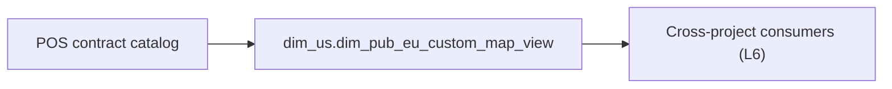

# Catalog object: `dim_us.dim_pub_eu_custom_map_view`

- artifact_type: etl_table
- artifact_id: dim_us.dim_pub_eu_custom_map_view
- domain: pos
- one_line_purpose: POS catalog object; load ETL not present under bitbucket-etl (contract narrative preserved). Cross-project references listed in L6 when found.
- layer_type: DIM
- source_kind: contract_v2
- evidence_source: Not documented in repository (no bitbucket-etl bundle for this stem)
- bitbucket_etl_bundle: Not documented in repository

---

## L1 Data Foundation

### Identity and physical mapping
- **Table:** `dim_us.dim_pub_eu_custom_map_view`
- **Layer type:** see header
- **Canonical / derived:** Catalog / contract (no local load SQL in `source/contracts/pos/bitbucket-etl/`)
- **Owner team:** Not documented in repository

### Grain, scope, exclusions
- See preserved **Grain and keys** below.

### Cross-engine presence
| Engine | Present | Notes |
|--------|---------|-------|
| Vertica | yes (per POS contract when documented) | See preserved Business query tables |
| Hive | Not documented in repository for this stem's load | No bitbucket-etl bundle |

### Physical schema reference

| Field | Value |
|-------|-------|
| **entity_id** | `dim_us.dim_pub_eu_custom_map_view` |
| **l1_catalog_seed** | `target/storage/wkb/snapshots/_snapshot_id_template/l1_catalog/{engine}_{schema}_{table}.json` |
| **column_count** | pending |
| **partition_keys** | See preserved Grain |
| **ddl_source** | pending |
| **retrieval** | `python -m tools.wkb.indexing.run_query --query "pos dim_pub_eu_custom_map_view schema" --intent find_table_schema` |

### Lineage
- **Load ETL in wiki repo:** Not documented in repository (`source/contracts/pos/bitbucket-etl/dim_pub_eu_custom_map_view/` absent)
- **Cross-project consumers:** see L6 (2 verified script hit(s))

### Freshness and load path
- Schedule / load pattern: Not documented in repository

## L2 Declarative Knowledge

### Business purpose
See preserved **Business purpose** below.

### Audience and use cases
See preserved **Who it helps** section.

### Fact key resolution
See preserved **Grain and keys**.

### Time field semantics
See preserved partition / date_flag notes.

### Metrics served
See preserved measure lists when present.

### Metric serving map
N/A unless documented in preserved content.

### etl_metrics
Not documented in repository for this contract-only upgrade.

## L3 Procedural Knowledge

### Query and routing rules
- Prefer Vertica `dim_us.dim_pub_eu_custom_map_view` for reporting when contract documents Vertica sync.

### Dimension join patterns
See preserved contract join notes.

### Key filters and ETL business logic
Not documented in repository (no local load SQL).

### Special logic (embedded)
Not documented in repository

### End-to-end flow


### Base tables register
| Object | Role |
|--------|------|
| — | Load sources Not documented in repository |

### Step-by-step logic
1. No bitbucket-etl bundle for `dim_pub_eu_custom_map_view` in this repository.
2. Consumers that reference `dim_pub_eu_custom_map_view` are listed under L6 when found by repo scan.

### Relationship map (embedded)

| from_fqn | to_fqn | cardinality | join_keys | provenance |
|----------|--------|-------------|-----------|------------|
| — | — | — | — | No JOIN edges (no local ETL) |

### Column / field derivations (from ETL SQL)

| target_column | expression_sql | upstream_columns | upstream_tables | transform_kind | evidence |
|---------------|----------------|------------------|-----------------|----------------|----------|
| — | — | — | — | — | No local ETL |

### Sentinel and code values
See preserved content.

## L4 Validation

### Resolved partition value
See preserved Validation SQL / Grain.

### Data quality checks
See preserved Validation SQL when present.

### Validation SQL
Prefer preserved Vertica validation bundle.

### Caveats for interpretation
- Contract-only documentation; ETL load scripts were not found under `source/contracts/pos/bitbucket-etl/`.

### Conflicts and open questions
- Manifest lists some stems under etl_scripts_missing — see `source/contracts/pos/bitbucket-etl/MANIFEST.md`.

## L5 Runtime View

### Query path and engine preference
| Path | Engine | Evidence |
|------|--------|----------|
| Report | Vertica | preserved POS contract |
| Load | Not documented in repository | no bitbucket-etl bundle |

### Access constraints
Not documented in repository

### Query risk profile
- Filter documented partition keys before wide scans.

## L6 Access and Consumption

### Primary consumers and use cases
See preserved audience.

### Representative query patterns
See preserved Validation SQL.

### Dependencies and notes

#### Upstream objects (verified)
| Object | Usage | Evidence |
|--------|-------|----------|
| Not documented in repository | — | no local ETL |

#### Downstream consumers (verified)
| Object / script | Evidence |
|-----------------|----------|
| ETL/script consumer | `source/contracts/rds/vertica_vpo/etl/vpo_pos_doc_fallback_cedm_serial_rds_610.sql:157` |
| ETL/script consumer | `source/contracts/rds/vertica_open_so_bo/etl/open_so_bo_cpo_vendor_quote_eu_custom_rds_19082.sql:34` |

#### Operational detail (verified)
- No `source/contracts/pos/bitbucket-etl/dim_pub_eu_custom_map_view/` bundle in this repository.

#### Not documented in repository
- Schedule, owner, SLA, load SQL path

---

## Preserved pre-L1-L6 content

> Retained verbatim from the prior POS contract knowledgebase document.


**Domain:** pos  
**Source contract:** `C:\Users\T154858D.TDSNX\Desktop\git_repo_v1\data_analysis_agent_brpt\knowledge\POS\tables\dim_pub_eu_custom_map_view.md`  
**Knowledgebase path:** `target/knowledgebase/pos/dim_pub_eu_custom_map_view.md`

## Business purpose

Shared dimension for POS attribute enrichment

This document is derived from the POS table contract catalog. ETL script lineage for load jobs is **not documented in this repository** unless listed under verified dependencies below.

---

## What the process does (high level)

| Stage | Business meaning |
|-------|------------------|
| **Catalog object** | `dim_us.dim_pub_eu_custom_map_view` — DIM layer table used in US POS reporting (`US POS baseline`). |
| **Consumption** | Queried from Vertica for POS/RDS reports, exports, and enrichment joins. |

**Parameters:** Country schema pattern `dim_us` (US baseline documented as `dw_us` / `dim_us`).

---

## Who it helps and how

| Audience | How they benefit |
|----------|-----------------|
| **POS / RDS reporting** | Vertica RDS POS custom reports (499 scripts scanned: US 367, CA 124, MX 7, BR 1) |
| **Sales analytics** | Order, customer, product, and margin attributes at documented grain. |
| **Data engineering** | Stable table contract for joins to POS hub and downstream exports. |

---

## Business query tables (Vertica)

| Role | Hive object | Vertica object | Sync mode | Evidence | MCP verified |
|------|-------------|----------------|-----------|----------|--------------|
| **Query for reporting** | `dim_us.dim_pub_eu_custom_map_view` | `dim_us.dim_pub_eu_custom_map_view` | overwrite / incremental | POS contract `dim_pub_eu_custom_map_view.md:L1` | yes (POS contract v2 — Vertica verified in source catalog) |
| **Hive alternative** | `dim_us.dim_pub_eu_custom_map_view` | same as reporting table | - | POS contract cross-engine note | - |
| **ETL internal** | n/a | n/a | - | ETL not in wiki repo | - |

Business users should query **`dim_us.dim_pub_eu_custom_map_view`** in Vertica for POS-domain reporting aligned to this contract.

---

## Grain and keys

- **Grain:** See natural key columns from POS contract column catalog.
- **Partition:** None explicit — full-table dimension or non-partitioned object per POS contract.
- **Natural key:** `eu_map_id`, `eu_map_line_no`, `delete_id`, `entry_id`, `input_id`
- **Exclusions (reporting):** None documented in POS contract.

---

## Validation SQL (Vertica)

```sql
-- 1) Row count by partition
SELECT date_flag, COUNT(*) AS row_cnt
FROM dim_us.dim_pub_eu_custom_map_view
WHERE date_flag = '${partition_value}'
GROUP BY date_flag;

-- 2) Metric sum by business dimension (top N)
SELECT eu_map_id, COUNT(*) AS row_cnt
FROM dim_us.dim_pub_eu_custom_map_view
WHERE date_flag = '${partition_value}'
GROUP BY eu_map_id
ORDER BY COUNT(*) DESC
LIMIT 20;

-- 3) Grain duplicate check
SELECT eu_map_id, eu_map_line_no, delete_id, date_flag, COUNT(*) AS cnt
FROM dim_us.dim_pub_eu_custom_map_view
WHERE date_flag = '${partition_value}'
GROUP BY eu_map_id, eu_map_line_no, delete_id, date_flag
HAVING COUNT(*) > 1;
```

Replace `${partition_value}` with the resolved business date or period from the report scope.

---

## Data you can fetch and use downstream

### Core measures

- No measure-role columns tagged in POS contract; table may be dimension-only.

### Dimension and key columns

- `eu_map_id` — eu map id
- `eu_map_line_no` — eu map line no
- `map_data_desc` — map data desc
- `data_type` — data type
- `required` — required
- `delete_date` — delete date
- `delete_id` — delete id
- `entry_datetime` — entry datetime
- `entry_id` — entry id
- `input_id` — input id
- `input_type` — input type
- `associated` — associated
- `options` — options
- `header` — header
- `print_vpo_pdf` — print vpo pdf
- `edi_file_position` — edi file position

---

## Metrics business users typically care about

When exposing this table to the business, lead with measure and key columns from the POS contract catalog (see **Data you can fetch** above).

---

## End-to-end flow (summary)

**Target table:** `dim_us.dim_pub_eu_custom_map_view`  
**Load pattern:** Not documented in repository

1. Upstream: Curated DWD/DIM/ODS load jobs in disty common pipeline
2. Table available in Hive and Vertica for POS consumption.
3. Downstream: Vertica RDS POS report scripts (`rds_*_rtv`), ad-hoc POS exports


---

## Base tables register

| Object | Role in this job |
|--------|-----------------|
| `dim_us.dim_pub_eu_custom_map_view` | Primary catalog table documented from POS contract |

---

## Step-by-step logic

Not applicable — this Knowledgebase entry is a **table catalog** converted from POS contract v2. ETL step-by-step logic is not present in this wiki repository.

**Standard POS filters (from contract L3):**

- Standard POS filters inherited from domain-knowledge.md when joining to hub.

---

## Caveats for interpretation

- Derived from POS contract v2; ETL SQL and Azkaban flow names are not verified in this repository unless cited below.
- US schema `dim_us` documented as baseline; CA/MX/BR use same table names with regional scope.
- - Verify grain keys (`order_no`, `order_type`, `order_line_no`) not null for fact joins when applicable.
- For one-to-many partners (SPA/SCM, serial), validate row counts before joining to hub.
- Hub: `extend_net_price` should align with `(unit_net_price * ship_qty)` within rounding tolerance when both populated.
- Validate join cardinality to POS hub before production report use.

---

## Dependencies and notes (verified only)

### Upstream objects (verified)

| Object | Usage | Evidence |
|--------|-------|----------|
| POS contract source | Table metadata, grain, columns | `C:\Users\T154858D.TDSNX\Desktop\git_repo_v1\data_analysis_agent_brpt\knowledge\POS\tables\dim_pub_eu_custom_map_view.md` |

### Downstream consumers (verified)

| Object / script | Evidence |
|-----------------|----------|
| POS RDS / export consumers | `dim_pub_eu_custom_map_view.md:L6` — Vertica RDS POS report scripts (`rds_*_rtv`), ad-hoc POS exports |

### Operational detail (verified)

- Freshness: Not documented in repository
- Column count: 16 (POS contract catalog)

### Not documented in repository

- ETL SQL load script and Azkaban `.flow` for this table
- hive2vertica sync job file:line evidence
- Schedule, owner, SLA

### Related scripts (verified)

None identified in repository.

---

*Document generated from POS contract `C:\Users\T154858D.TDSNX\Desktop\git_repo_v1\data_analysis_agent_brpt\knowledge\POS\tables\dim_pub_eu_custom_map_view.md`.*