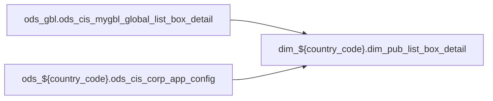

# DIM: `dim_pub_list_box_detail`

- artifact_type: etl_table
- artifact_id: dim_${country_code}.dim_pub_list_box_detail
- domain: pos
- one_line_purpose: ETL script `source/contracts/pos/bitbucket-etl/dim_pub_list_box_detail/dim_pub_list_box_detail.sql` loads `dim_${country_code}.dim_pub_list_box_detail` (layer `DIM`). Purpose inferred from SQL only.
- layer_type: DIM
- source_kind: etl_sql
- evidence_source: source/contracts/pos/bitbucket-etl/dim_pub_list_box_detail/dim_pub_list_box_detail.sql
- bitbucket_etl_bundle: source/contracts/pos/bitbucket-etl/dim_pub_list_box_detail/

---

## L1 Data Foundation

### Identity and physical mapping
- **Table:** `dim_${country_code}.dim_pub_list_box_detail`
- **Layer type:** DIM
- **Canonical / derived:** Derived / ETL-loaded (see L3)
- **Owner team:** Not documented in repository

### Grain, scope, exclusions
- **Grain:** Not documented in repository (see SELECT/GROUP BY in `source/contracts/pos/bitbucket-etl/dim_pub_list_box_detail/dim_pub_list_box_detail.sql`)
- **Partition:** `See L4 / ETL partition clause`
- **Exclusions:** See L3 Key filters

### Cross-engine presence
| Engine | Present | Canonical FQN | Notes |
|--------|---------|---------------|-------|
| Hive | yes | `dim_${country_code}.dim_pub_list_box_detail` | ETL target |
| Vertica | Not documented in repository | — | Confirm via hive2vertica flow |

### Physical schema reference

Pointer block only - full column catalog lives in WKB L1 storage JSON.

| Field | Value |
|-------|-------|
| **Authoritative catalog** | WKB L1 storage seed (not duplicated in this file) |
| **entity_id** | `dim_${country_code}.dim_pub_list_box_detail` |
| **l1_catalog_seed** | `target/storage/wkb/snapshots/_snapshot_id_template/l1_catalog/{engine}_{schema}_{table}.json` |
| **column_count** | pending (run ddl_seed_writer) |
| **partition_keys** | `See L4 / ETL partition clause` |
| **ddl_source** | pending Bitbucket DDL / Vertica metadata ingest |
| **retrieval** | `python -m tools.wkb.indexing.run_query --query "pos dim_pub_list_box_detail schema" --intent find_table_schema` |

### Lineage

- **Primary load:** `source/contracts/pos/bitbucket-etl/dim_pub_list_box_detail/dim_pub_list_box_detail.sql`
- **upstream:** `ods_gbl.ods_cis_mygbl_global_list_box_detail` — FROM/JOIN — `source/contracts/pos/bitbucket-etl/dim_pub_list_box_detail/dim_pub_list_box_detail.sql`
- **upstream:** `ods_${country_code}.ods_cis_corp_app_config` — FROM/JOIN — `source/contracts/pos/bitbucket-etl/dim_pub_list_box_detail/dim_pub_list_box_detail.sql`
- **downstream:** see L6 Downstream consumers
### Freshness and load path
| Item | Value |
|------|-------|
| Load pattern | See L3 INSERT / OVERWRITE in evidence script |
| Schedule | Not documented in repository |
| Parameters | Parsed from ETL literals / `${...}` in `source/contracts/pos/bitbucket-etl/dim_pub_list_box_detail/dim_pub_list_box_detail.sql` |

## L2 Declarative Knowledge

### Business purpose
ETL script `source/contracts/pos/bitbucket-etl/dim_pub_list_box_detail/dim_pub_list_box_detail.sql` loads `dim_${country_code}.dim_pub_list_box_detail` (layer `DIM`). Purpose inferred from SQL only.

### Audience and use cases
| Audience | How they benefit |
|----------|-----------------|
| Data / BI consumers | Use target table produced by this ETL |
| Data Engineering | Maintain load logic in evidence script |

### Fact key resolution
- Keys follow target INSERT column list / GROUP BY in evidence SQL.

### Time field semantics
- Partition / date fields: `See L4 / ETL partition clause`

### Metrics served
- See L3 column derivations for measure expressions when present.

### Metric serving map
N/A — not a multi-period wide serving table (or not documented).

### etl_metrics
No calculable business metrics registered in metric-index for this create run.

## L3 Procedural Knowledge

### Query and routing rules
- Prefer querying the target `dim_${country_code}.dim_pub_list_box_detail` after successful ETL load.

### Dimension join patterns
- See Relationship map and Base tables register.

### Key filters and ETL business logic

| Predicate | Kind | Evidence |
|-----------|------|----------|
| — | — | No WHERE clause parsed from `source/contracts/pos/bitbucket-etl/dim_pub_list_box_detail/dim_pub_list_box_detail.sql` |

### Standard time-filter SQL
```sql
-- See partition / date predicates in source/contracts/pos/bitbucket-etl/dim_pub_list_box_detail/dim_pub_list_box_detail.sql
```

### End-to-end flow



### Base tables register

| Object | Role |
|--------|------|
| `ods_gbl.ods_cis_mygbl_global_list_box_detail` | source / temp (from ETL FROM/JOIN) |
| `ods_${country_code}.ods_cis_corp_app_config` | source / temp (from ETL FROM/JOIN) |

### Step-by-step logic
1. Read sources listed in Base tables register (`source/contracts/pos/bitbucket-etl/dim_pub_list_box_detail/dim_pub_list_box_detail.sql`).
2. Apply filters documented under Key filters.
3. INSERT OVERWRITE / write target `dim_${country_code}.dim_pub_list_box_detail`.

### Relationship map (embedded)

| from_fqn | to_fqn | cardinality | join_keys | provenance |
|----------|--------|-------------|-----------|------------|
| `ods_gbl.ods_cis_mygbl_global_list_box_detail` | `ods_${country_code}.ods_cis_corp_app_config` | many:1 | `lbd.cisserver` = `app.config_value`; `lbd.cisserver` = `app.config_value` | etl_sql (`source/contracts/pos/bitbucket-etl/dim_pub_list_box_detail/dim_pub_list_box_detail.sql:21`) |

### Special logic (embedded)

`source/ref/pos/special_logic.txt` exists but no rule naming this FQN/stem (`dim_${country_code}.dim_pub_list_box_detail`).

Not documented in repository


### Column / field derivations (from ETL SQL)

| target_column | expression_sql | upstream_columns | upstream_tables | transform_kind | evidence |
|---------------|----------------|------------------|-----------------|----------------|----------|
| `cisserver` | `lbd.cisserver` | `cisserver` | `ods_gbl.ods_cis_mygbl_global_list_box_detail`, `ods_${country_code}.ods_cis_corp_app_config` | passthrough | `source/contracts/pos/bitbucket-etl/dim_pub_list_box_detail/dim_pub_list_box_detail.sql:3` |
| `list_box_code` | `lbd.list_box_code` | `list_box_code` | `ods_gbl.ods_cis_mygbl_global_list_box_detail`, `ods_${country_code}.ods_cis_corp_app_config` | passthrough | `source/contracts/pos/bitbucket-etl/dim_pub_list_box_detail/dim_pub_list_box_detail.sql:4` |
| `code_value` | `lbd.code_value` | `code_value` | `ods_gbl.ods_cis_mygbl_global_list_box_detail`, `ods_${country_code}.ods_cis_corp_app_config` | passthrough | `source/contracts/pos/bitbucket-etl/dim_pub_list_box_detail/dim_pub_list_box_detail.sql:5` |
| `code_desc` | `lbd.code_desc` | `code_desc` | `ods_gbl.ods_cis_mygbl_global_list_box_detail`, `ods_${country_code}.ods_cis_corp_app_config` | passthrough | `source/contracts/pos/bitbucket-etl/dim_pub_list_box_detail/dim_pub_list_box_detail.sql:6` |
| `activeflag` | `lbd.activeflag` | `activeflag` | `ods_gbl.ods_cis_mygbl_global_list_box_detail`, `ods_${country_code}.ods_cis_corp_app_config` | passthrough | `source/contracts/pos/bitbucket-etl/dim_pub_list_box_detail/dim_pub_list_box_detail.sql:7` |
| `sequence` | `lbd.sequence` | `sequence` | `ods_gbl.ods_cis_mygbl_global_list_box_detail`, `ods_${country_code}.ods_cis_corp_app_config` | passthrough | `source/contracts/pos/bitbucket-etl/dim_pub_list_box_detail/dim_pub_list_box_detail.sql:8` |
| `key1` | `lbd.key1` | `key1` | `ods_gbl.ods_cis_mygbl_global_list_box_detail`, `ods_${country_code}.ods_cis_corp_app_config` | passthrough | `source/contracts/pos/bitbucket-etl/dim_pub_list_box_detail/dim_pub_list_box_detail.sql:9` |
| `ref1` | `lbd.ref1` | `ref1` | `ods_gbl.ods_cis_mygbl_global_list_box_detail`, `ods_${country_code}.ods_cis_corp_app_config` | passthrough | `source/contracts/pos/bitbucket-etl/dim_pub_list_box_detail/dim_pub_list_box_detail.sql:10` |
| `ref2` | `lbd.ref2` | `ref2` | `ods_gbl.ods_cis_mygbl_global_list_box_detail`, `ods_${country_code}.ods_cis_corp_app_config` | passthrough | `source/contracts/pos/bitbucket-etl/dim_pub_list_box_detail/dim_pub_list_box_detail.sql:11` |
| `entry_datetime` | `lbd.entry_datetime` | `entry_datetime` | `ods_gbl.ods_cis_mygbl_global_list_box_detail`, `ods_${country_code}.ods_cis_corp_app_config` | passthrough | `source/contracts/pos/bitbucket-etl/dim_pub_list_box_detail/dim_pub_list_box_detail.sql:12` |
| `entry_id` | `lbd.entry_id` | `entry_id` | `ods_gbl.ods_cis_mygbl_global_list_box_detail`, `ods_${country_code}.ods_cis_corp_app_config` | passthrough | `source/contracts/pos/bitbucket-etl/dim_pub_list_box_detail/dim_pub_list_box_detail.sql:13` |
| `delete_datetime` | `lbd.delete_datetime` | `delete_datetime` | `ods_gbl.ods_cis_mygbl_global_list_box_detail`, `ods_${country_code}.ods_cis_corp_app_config` | passthrough | `source/contracts/pos/bitbucket-etl/dim_pub_list_box_detail/dim_pub_list_box_detail.sql:14` |
| `delete_id` | `lbd.delete_id` | `delete_id` | `ods_gbl.ods_cis_mygbl_global_list_box_detail`, `ods_${country_code}.ods_cis_corp_app_config` | passthrough | `source/contracts/pos/bitbucket-etl/dim_pub_list_box_detail/dim_pub_list_box_detail.sql:15` |
| `update_datetime` | `lbd.update_datetime` | `update_datetime` | `ods_gbl.ods_cis_mygbl_global_list_box_detail`, `ods_${country_code}.ods_cis_corp_app_config` | passthrough | `source/contracts/pos/bitbucket-etl/dim_pub_list_box_detail/dim_pub_list_box_detail.sql:16` |
| `h_version` | `lbd.h_version` | `h_version` | `ods_gbl.ods_cis_mygbl_global_list_box_detail`, `ods_${country_code}.ods_cis_corp_app_config` | passthrough | `source/contracts/pos/bitbucket-etl/dim_pub_list_box_detail/dim_pub_list_box_detail.sql:17` |
| `purgeflag` | `lbd.purgeflag` | `purgeflag` | `ods_gbl.ods_cis_mygbl_global_list_box_detail`, `ods_${country_code}.ods_cis_corp_app_config` | passthrough | `source/contracts/pos/bitbucket-etl/dim_pub_list_box_detail/dim_pub_list_box_detail.sql:18` |
| `schedule_date` | `lbd.schedule_date` | `schedule_date` | `ods_gbl.ods_cis_mygbl_global_list_box_detail`, `ods_${country_code}.ods_cis_corp_app_config` | passthrough | `source/contracts/pos/bitbucket-etl/dim_pub_list_box_detail/dim_pub_list_box_detail.sql:19` |

### Sentinel and code values
Not documented in repository beyond CASE/exp_code predicates in ETL SQL.

## L4 Validation

### Resolved partition value
- Partition expression from ETL: `See L4 / ETL partition clause`
- Runtime values: Not documented in repository (resolve via Azkaban params when flow evidence exists).

### Data quality checks
Not documented in repository

### Validation SQL
N/A — Vertica MCP not executed during documentation (Vertica no-run policy).

### Caveats for interpretation
- Generated from ETL SQL evidence only; business definitions may need `source/ref` enrichment.

### Conflicts and open questions
None identified in repository

## L5 Runtime View

### Query path and engine preference
| Path | Engine | Evidence |
|------|--------|----------|
| ETL load | Hive/Spark | `source/contracts/pos/bitbucket-etl/dim_pub_list_box_detail/dim_pub_list_box_detail.sql` |
| Serving | Vertica (when synced) | Not documented in repository |

### Access constraints
Not documented in repository

### Query risk profile
- Scan risk depends on partition pruning; always filter partition keys when present.

## L6 Access and Consumption

### Primary consumers and use cases
Not documented in repository

### Representative query patterns
Not documented in repository

### Dependencies and notes

#### Upstream objects (verified)
| Object | Usage | Evidence |
|--------|-------|----------|
| `ods_gbl.ods_cis_mygbl_global_list_box_detail` | FROM/JOIN | `source/contracts/pos/bitbucket-etl/dim_pub_list_box_detail/dim_pub_list_box_detail.sql` |
| `ods_${country_code}.ods_cis_corp_app_config` | FROM/JOIN | `source/contracts/pos/bitbucket-etl/dim_pub_list_box_detail/dim_pub_list_box_detail.sql` |

#### Downstream consumers (verified)

| Object / script | Evidence |
|-----------------|----------|
| KB / contract ref: `source/contracts/pos/bitbucket-etl/MANIFEST.md` | `source/contracts/pos/bitbucket-etl/MANIFEST.md:64` |
| ETL/script ref: `source/contracts/pos/bitbucket-etl/dim_pub_vendor_info/dim_pub_vendor_info.sql` | `source/contracts/pos/bitbucket-etl/dim_pub_vendor_info/dim_pub_vendor_info.sql:169` |
| ETL/script ref: `source/contracts/pos/bitbucket-etl/dim_pub_vendor_info/dim_pub_vendor_info_jp.sql` | `source/contracts/pos/bitbucket-etl/dim_pub_vendor_info/dim_pub_vendor_info_jp.sql:172` |
| ETL/script ref: `source/contracts/pos/bitbucket-etl/dim_pub_vendor_info/dim_pub_vendor_info_rt.sql` | `source/contracts/pos/bitbucket-etl/dim_pub_vendor_info/dim_pub_vendor_info_rt.sql:163` |
| ETL/script ref: `source/contracts/pos/bitbucket-etl/dim_pub_vendor_info_rt/dim_pub_vendor_info_rt.sql` | `source/contracts/pos/bitbucket-etl/dim_pub_vendor_info_rt/dim_pub_vendor_info_rt.sql:163` |
| ETL/script ref: `source/contracts/pos/bitbucket-etl/dm_disty_sales_close_cpo_di/loading_close_cpo.sql` | `source/contracts/pos/bitbucket-etl/dm_disty_sales_close_cpo_di/loading_close_cpo.sql:287` |
| ETL/script ref: `source/contracts/pos/bitbucket-etl/dm_disty_sales_open_cpo/loading_open_cpo.sql` | `source/contracts/pos/bitbucket-etl/dm_disty_sales_open_cpo/loading_open_cpo.sql:288` |
| ETL/script ref: `source/contracts/pos/bitbucket-etl/dwd_disty_sales_open_order_detail/loading_open_orders_data.sql` | `source/contracts/pos/bitbucket-etl/dwd_disty_sales_open_order_detail/loading_open_orders_data.sql:666` |
| ETL/script ref: `source/contracts/pos/bitbucket-etl/dwd_pub_common_history_header_extend/dwd_pub_common_history_header_extend_df.sql` | `source/contracts/pos/bitbucket-etl/dwd_pub_common_history_header_extend/dwd_pub_common_history_header_extend_df.sql:151` |
| ETL/script ref: `source/contracts/pos/bitbucket-etl/dwd_pub_common_order_header_extend/dwd_pub_common_order_header_extend_df.sql` | `source/contracts/pos/bitbucket-etl/dwd_pub_common_order_header_extend/dwd_pub_common_order_header_extend_df.sql:131` |
| KB / contract ref: `source/contracts/pos/tables/dim_pub_list_box_detail.md` | `source/contracts/pos/tables/dim_pub_list_box_detail.md:5` |
| KB / contract ref: `source/contracts/pos/tables/dim_pub_part_info.md` | `source/contracts/pos/tables/dim_pub_part_info.md:46` |
| KB / contract ref: `source/contracts/pos/tables/dim_pub_part_info_rt.md` | `source/contracts/pos/tables/dim_pub_part_info_rt.md:46` |
| KB / contract ref: `source/contracts/pos/tables/dm_disty_pur_purch_forecast461_rtv2.md` | `source/contracts/pos/tables/dm_disty_pur_purch_forecast461_rtv2.md:44` |
| KB / contract ref: `source/contracts/pos/tables/dwd_disty_brpt_bo_detail_df.md` | `source/contracts/pos/tables/dwd_disty_brpt_bo_detail_df.md:56` |
| KB / contract ref: `source/contracts/pos/tables/dwd_disty_brpt_orders_pl_etl_mi.md` | `source/contracts/pos/tables/dwd_disty_brpt_orders_pl_etl_mi.md:55` |
| KB / contract ref: `source/contracts/pos/tables/dwd_disty_common_dw_orders_pl_extend_di.md` | `source/contracts/pos/tables/dwd_disty_common_dw_orders_pl_extend_di.md:49` |
| KB / contract ref: `source/contracts/pos/tables/dwd_disty_common_po_basic.md` | `source/contracts/pos/tables/dwd_disty_common_po_basic.md:52` |
| KB / contract ref: `source/contracts/pos/tables/dwd_disty_common_pos_di.md` | `source/contracts/pos/tables/dwd_disty_common_pos_di.md:78` |
| KB / contract ref: `source/contracts/pos/tables/dwd_disty_inv_aging_df.md` | `source/contracts/pos/tables/dwd_disty_inv_aging_df.md:48` |
| KB / contract ref: `source/contracts/pos/tables/dwd_disty_pm_report_goal.md` | `source/contracts/pos/tables/dwd_disty_pm_report_goal.md:45` |
| KB / contract ref: `source/contracts/pos/tables/dwd_disty_sales_open_order_detail.md` | `source/contracts/pos/tables/dwd_disty_sales_open_order_detail.md:64` |
| KB / contract ref: `source/contracts/pos/tables/dwd_disty_scm_open_order_spa_df.md` | `source/contracts/pos/tables/dwd_disty_scm_open_order_spa_df.md:54` |
| KB / contract ref: `source/contracts/pos/tables/dwd_disty_scm_pm_claim.md` | `source/contracts/pos/tables/dwd_disty_scm_pm_claim.md:44` |
| KB / contract ref: `source/contracts/pos/tables/dwd_disty_scm_shipped_order_spa_di.md` | `source/contracts/pos/tables/dwd_disty_scm_shipped_order_spa_di.md:54` |
| KB / contract ref: `source/contracts/pos/tables/dwd_pub_common_shipped_order_scm_spa_detail_di.md` | `source/contracts/pos/tables/dwd_pub_common_shipped_order_scm_spa_detail_di.md:47` |
| KB / contract ref: `source/contracts/pos/tables/dws_disty_pur_ips_runrate_1w.md` | `source/contracts/pos/tables/dws_disty_pur_ips_runrate_1w.md:44` |
| ETL/script ref: `source/contracts/rds/starrocks_vpo/etl/vpo_current_history_open_po_vendor_so_rds_19401.sql` | `source/contracts/rds/starrocks_vpo/etl/vpo_current_history_open_po_vendor_so_rds_19401.sql:255` |
| ETL/script ref: `source/contracts/rds/starrocks_vpo/etl/vpo_open_po_vendor_so_quote_etasrc_rds_18013.sql` | `source/contracts/rds/starrocks_vpo/etl/vpo_open_po_vendor_so_quote_etasrc_rds_18013.sql:191` |
| ETL/script ref: `source/contracts/rds/vertica_ar/etl/ar_discount_payment_timing_rds_19383.sql` | `source/contracts/rds/vertica_ar/etl/ar_discount_payment_timing_rds_19383.sql:31` |
| ETL/script ref: `source/contracts/rds/vertica_b_report/etl/b_report_lightweight_orders_inventory_rio_rds_7500.sql` | `source/contracts/rds/vertica_b_report/etl/b_report_lightweight_orders_inventory_rio_rds_7500.sql:363` |
| ETL/script ref: `source/contracts/rds/vertica_inventory/etl/inv_rollover_witypestu_stock_rotation_rds_11722.sql` | `source/contracts/rds/vertica_inventory/etl/inv_rollover_witypestu_stock_rotation_rds_11722.sql:1219` |
| ETL/script ref: `source/contracts/rds/vertica_open_so_bo/etl/open_so_bo_cpo_vendor_quote_eu_custom_rds_19082.sql` | `source/contracts/rds/vertica_open_so_bo/etl/open_so_bo_cpo_vendor_quote_eu_custom_rds_19082.sql:35` |
| ETL/script ref: `source/contracts/rds/vertica_open_so_bo/etl/open_so_bo_inventory_rio_runrate_rds_7500.sql` | `source/contracts/rds/vertica_open_so_bo/etl/open_so_bo_inventory_rio_runrate_rds_7500.sql:363` |
| ETL/script ref: `source/contracts/rds/vertica_vpo/etl/vpo_pos_doc_fallback_cedm_serial_rds_610.sql` | `source/contracts/rds/vertica_vpo/etl/vpo_pos_doc_fallback_cedm_serial_rds_610.sql:161` |
| FLOW ref: `source/etl/flows/public_order_scripts/ods_etl/ods_data_load_ca_01.flow` | `source/etl/flows/public_order_scripts/ods_etl/ods_data_load_ca_01.flow:366` |
| FLOW ref: `source/etl/flows/public_order_scripts/ods_etl/ods_data_load_us_01.flow` | `source/etl/flows/public_order_scripts/ods_etl/ods_data_load_us_01.flow:316` |
| FLOW ref: `source/etl/flows/public_order_scripts/public_common_dimension/public_common_dimension_br.flow` | `source/etl/flows/public_order_scripts/public_common_dimension/public_common_dimension_br.flow:254` |
| FLOW ref: `source/etl/flows/public_order_scripts/public_common_dimension/public_common_dimension_ca.flow` | `source/etl/flows/public_order_scripts/public_common_dimension/public_common_dimension_ca.flow:205` |
| FLOW ref: `source/etl/flows/public_order_scripts/public_common_dimension/public_common_dimension_gbl.flow` | `source/etl/flows/public_order_scripts/public_common_dimension/public_common_dimension_gbl.flow:43` |

#### Operational detail (verified)
- Partition clause: `See L4 / ETL partition clause`

#### Not documented in repository
- Schedule, owner, SLA
