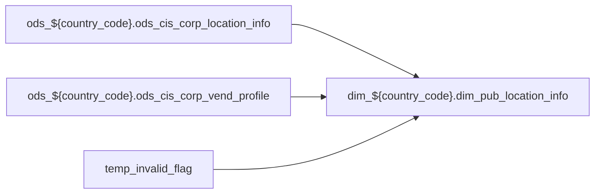

# DIM: `dim_pub_location_info`

- artifact_type: etl_table
- artifact_id: dim_${country_code}.dim_pub_location_info
- domain: pos
- one_line_purpose: ETL script `source/contracts/pos/bitbucket-etl/dim_pub_location_info/dim_pub_location_info.sql` loads `dim_${country_code}.dim_pub_location_info` (layer `DIM`). Purpose inferred from SQL only.
- layer_type: DIM
- source_kind: etl_sql
- evidence_source: source/contracts/pos/bitbucket-etl/dim_pub_location_info/dim_pub_location_info.sql
- bitbucket_etl_bundle: source/contracts/pos/bitbucket-etl/dim_pub_location_info/

---

## L1 Data Foundation

### Identity and physical mapping
- **Table:** `dim_${country_code}.dim_pub_location_info`
- **Layer type:** DIM
- **Canonical / derived:** Derived / ETL-loaded (see L3)
- **Owner team:** Not documented in repository

### Grain, scope, exclusions
- **Grain:** Not documented in repository (see SELECT/GROUP BY in `source/contracts/pos/bitbucket-etl/dim_pub_location_info/dim_pub_location_info.sql`)
- **Partition:** `See L4 / ETL partition clause`
- **Exclusions:** See L3 Key filters

### Cross-engine presence
| Engine | Present | Canonical FQN | Notes |
|--------|---------|---------------|-------|
| Hive | yes | `dim_${country_code}.dim_pub_location_info` | ETL target |
| Vertica | Not documented in repository | — | Confirm via hive2vertica flow |

### Physical schema reference

Pointer block only - full column catalog lives in WKB L1 storage JSON.

| Field | Value |
|-------|-------|
| **Authoritative catalog** | WKB L1 storage seed (not duplicated in this file) |
| **entity_id** | `dim_${country_code}.dim_pub_location_info` |
| **l1_catalog_seed** | `target/storage/wkb/snapshots/_snapshot_id_template/l1_catalog/{engine}_{schema}_{table}.json` |
| **column_count** | pending (run ddl_seed_writer) |
| **partition_keys** | `See L4 / ETL partition clause` |
| **ddl_source** | pending Bitbucket DDL / Vertica metadata ingest |
| **retrieval** | `python -m tools.wkb.indexing.run_query --query "pos dim_pub_location_info schema" --intent find_table_schema` |

### Lineage

- **Primary load:** `source/contracts/pos/bitbucket-etl/dim_pub_location_info/dim_pub_location_info.sql`
- **upstream:** `ods_${country_code}.ods_cis_corp_location_info` — FROM/JOIN — `source/contracts/pos/bitbucket-etl/dim_pub_location_info/dim_pub_location_info.sql`
- **upstream:** `ods_${country_code}.ods_cis_corp_vend_profile` — FROM/JOIN — `source/contracts/pos/bitbucket-etl/dim_pub_location_info/dim_pub_location_info.sql`
- **upstream:** `temp_invalid_flag` — FROM/JOIN — `source/contracts/pos/bitbucket-etl/dim_pub_location_info/dim_pub_location_info.sql`
- **downstream:** see L6 Downstream consumers
### Freshness and load path
| Item | Value |
|------|-------|
| Load pattern | See L3 INSERT / OVERWRITE in evidence script |
| Schedule | Not documented in repository |
| Parameters | Parsed from ETL literals / `${...}` in `source/contracts/pos/bitbucket-etl/dim_pub_location_info/dim_pub_location_info.sql` |

## L2 Declarative Knowledge

### Business purpose
ETL script `source/contracts/pos/bitbucket-etl/dim_pub_location_info/dim_pub_location_info.sql` loads `dim_${country_code}.dim_pub_location_info` (layer `DIM`). Purpose inferred from SQL only.

### Audience and use cases
| Audience | How they benefit |
|----------|-----------------|
| Data / BI consumers | Use target table produced by this ETL |
| Data Engineering | Maintain load logic in evidence script |

### Fact key resolution
- Keys follow target INSERT column list / GROUP BY in evidence SQL.

### Time field semantics
- Partition / date fields: `See L4 / ETL partition clause`

### Metrics served
- See L3 column derivations for measure expressions when present.

### Metric serving map
N/A — not a multi-period wide serving table (or not documented).

### etl_metrics
No calculable business metrics registered in metric-index for this create run.

## L3 Procedural Knowledge

### Query and routing rules
- Prefer querying the target `dim_${country_code}.dim_pub_location_info` after successful ETL load.

### Dimension join patterns
- See Relationship map and Base tables register.

### Key filters and ETL business logic

| Predicate | Kind | Evidence |
|-----------|------|----------|
| `vp.profile_type LIKE 'DSL%' AND vp.active = 'Y' AND li.loc_no!= 193 UNION SELECT loc_no FROM ods_${country_code}.ods_cis_corp_location_info li WHERE nvl(li.ext_type, 'C1') != 'C1'; insert OVERWRITE...` | Business | `source/contracts/pos/bitbucket-etl/dim_pub_location_info/dim_pub_location_info.sql` |

### Standard time-filter SQL
```sql
-- See partition / date predicates in source/contracts/pos/bitbucket-etl/dim_pub_location_info/dim_pub_location_info.sql
```

### End-to-end flow



### Base tables register

| Object | Role |
|--------|------|
| `ods_${country_code}.ods_cis_corp_location_info` | source / temp (from ETL FROM/JOIN) |
| `ods_${country_code}.ods_cis_corp_vend_profile` | source / temp (from ETL FROM/JOIN) |
| `temp_invalid_flag` | source / temp (from ETL FROM/JOIN) |

### Step-by-step logic
1. Read sources listed in Base tables register (`source/contracts/pos/bitbucket-etl/dim_pub_location_info/dim_pub_location_info.sql`).
2. Apply filters documented under Key filters.
3. INSERT OVERWRITE / write target `dim_${country_code}.dim_pub_location_info`.

### Relationship map (embedded)

| from_fqn | to_fqn | cardinality | join_keys | provenance |
|----------|--------|-------------|-----------|------------|
| `ods_${country_code}.ods_cis_corp_location_info` | `ods_${country_code}.ods_cis_corp_vend_profile` | many:1 | `li.loc_no` = `vp.value_no` | etl_sql (`source/contracts/pos/bitbucket-etl/dim_pub_location_info/dim_pub_location_info.sql:5`) |
| `ods_${country_code}.ods_cis_corp_location_info` | `temp_invalid_flag` | many:1 (LEFT) | `li.loc_no` = `ti.loc_no` | etl_sql (`source/contracts/pos/bitbucket-etl/dim_pub_location_info/dim_pub_location_info.sql:57`) |

### Special logic (embedded)

`source/ref/pos/special_logic.txt` exists but no rule naming this FQN/stem (`dim_${country_code}.dim_pub_location_info`).

Not documented in repository


### Column / field derivations (from ETL SQL)

| target_column | expression_sql | upstream_columns | upstream_tables | transform_kind | evidence |
|---------------|----------------|------------------|-----------------|----------------|----------|
| `loc_no` | `li.loc_no` | `loc_no` | `ods_${country_code}.ods_cis_corp_location_info`, `temp_invalid_flag` | passthrough | `source/contracts/pos/bitbucket-etl/dim_pub_location_info/dim_pub_location_info.sql:6` |
| `loc_name` | `li.loc_name` | `loc_name` | `ods_${country_code}.ods_cis_corp_location_info`, `temp_invalid_flag` | passthrough | `source/contracts/pos/bitbucket-etl/dim_pub_location_info/dim_pub_location_info.sql:19` |
| `loc_addr` | `li.loc_addr` | `loc_addr` | `ods_${country_code}.ods_cis_corp_location_info`, `temp_invalid_flag` | passthrough | `source/contracts/pos/bitbucket-etl/dim_pub_location_info/dim_pub_location_info.sql:20` |
| `loc_pobox` | `li.loc_pobox` | `loc_pobox` | `ods_${country_code}.ods_cis_corp_location_info`, `temp_invalid_flag` | passthrough | `source/contracts/pos/bitbucket-etl/dim_pub_location_info/dim_pub_location_info.sql:21` |
| `loc_city` | `li.loc_city` | `loc_city` | `ods_${country_code}.ods_cis_corp_location_info`, `temp_invalid_flag` | passthrough | `source/contracts/pos/bitbucket-etl/dim_pub_location_info/dim_pub_location_info.sql:22` |
| `loc_state` | `li.loc_state` | `loc_state` | `ods_${country_code}.ods_cis_corp_location_info`, `temp_invalid_flag` | passthrough | `source/contracts/pos/bitbucket-etl/dim_pub_location_info/dim_pub_location_info.sql:23` |
| `loc_zip_code` | `li.loc_zip_code` | `loc_zip_code` | `ods_${country_code}.ods_cis_corp_location_info`, `temp_invalid_flag` | passthrough | `source/contracts/pos/bitbucket-etl/dim_pub_location_info/dim_pub_location_info.sql:24` |
| `company_no` | `li.company_no` | `company_no` | `ods_${country_code}.ods_cis_corp_location_info`, `temp_invalid_flag` | passthrough | `source/contracts/pos/bitbucket-etl/dim_pub_location_info/dim_pub_location_info.sql:25` |
| `entry_datetime` | `li.entry_datetime` | `entry_datetime` | `ods_${country_code}.ods_cis_corp_location_info`, `temp_invalid_flag` | passthrough | `source/contracts/pos/bitbucket-etl/dim_pub_location_info/dim_pub_location_info.sql:26` |
| `entry_id` | `li.entry_id` | `entry_id` | `ods_${country_code}.ods_cis_corp_location_info`, `temp_invalid_flag` | passthrough | `source/contracts/pos/bitbucket-etl/dim_pub_location_info/dim_pub_location_info.sql:27` |
| `loc_char` | `li.loc_char` | `loc_char` | `ods_${country_code}.ods_cis_corp_location_info`, `temp_invalid_flag` | passthrough | `source/contracts/pos/bitbucket-etl/dim_pub_location_info/dim_pub_location_info.sql:28` |
| `whse_flag` | `li.whse_flag` | `whse_flag` | `ods_${country_code}.ods_cis_corp_location_info`, `temp_invalid_flag` | passthrough | `source/contracts/pos/bitbucket-etl/dim_pub_location_info/dim_pub_location_info.sql:29` |
| `atm_flag` | `li.atm_flag` | `atm_flag` | `ods_${country_code}.ods_cis_corp_location_info`, `temp_invalid_flag` | passthrough | `source/contracts/pos/bitbucket-etl/dim_pub_location_info/dim_pub_location_info.sql:30` |
| `hit` | `li.hit` | `hit` | `ods_${country_code}.ods_cis_corp_location_info`, `temp_invalid_flag` | passthrough | `source/contracts/pos/bitbucket-etl/dim_pub_location_info/dim_pub_location_info.sql:31` |
| `miss` | `li.miss` | `miss` | `ods_${country_code}.ods_cis_corp_location_info`, `temp_invalid_flag` | passthrough | `source/contracts/pos/bitbucket-etl/dim_pub_location_info/dim_pub_location_info.sql:32` |
| `priority` | `li.priority` | `priority` | `ods_${country_code}.ods_cis_corp_location_info`, `temp_invalid_flag` | passthrough | `source/contracts/pos/bitbucket-etl/dim_pub_location_info/dim_pub_location_info.sql:33` |
| `country_code` | `li.country_code` | `country_code` | `ods_${country_code}.ods_cis_corp_location_info`, `temp_invalid_flag` | passthrough | `source/contracts/pos/bitbucket-etl/dim_pub_location_info/dim_pub_location_info.sql:34` |
| `frt_loc_no` | `li.frt_loc_no` | `frt_loc_no` | `ods_${country_code}.ods_cis_corp_location_info`, `temp_invalid_flag` | passthrough | `source/contracts/pos/bitbucket-etl/dim_pub_location_info/dim_pub_location_info.sql:35` |
| `phy_distr_wh` | `li.phy_distr_wh` | `phy_distr_wh` | `ods_${country_code}.ods_cis_corp_location_info`, `temp_invalid_flag` | passthrough | `source/contracts/pos/bitbucket-etl/dim_pub_location_info/dim_pub_location_info.sql:36` |
| `agg_loc_no_vend` | `li.agg_loc_no_vend` | `agg_loc_no_vend` | `ods_${country_code}.ods_cis_corp_location_info`, `temp_invalid_flag` | passthrough | `source/contracts/pos/bitbucket-etl/dim_pub_location_info/dim_pub_location_info.sql:37` |
| `agg_loc_no_1src` | `li.agg_loc_no_1src` | `agg_loc_no_1src` | `ods_${country_code}.ods_cis_corp_location_info`, `temp_invalid_flag` | passthrough | `source/contracts/pos/bitbucket-etl/dim_pub_location_info/dim_pub_location_info.sql:38` |
| `geo_zone` | `li.geo_zone` | `geo_zone` | `ods_${country_code}.ods_cis_corp_location_info`, `temp_invalid_flag` | passthrough | `source/contracts/pos/bitbucket-etl/dim_pub_location_info/dim_pub_location_info.sql:39` |
| `cutoff_time` | `li.cutoff_time` | `cutoff_time` | `ods_${country_code}.ods_cis_corp_location_info`, `temp_invalid_flag` | passthrough | `source/contracts/pos/bitbucket-etl/dim_pub_location_info/dim_pub_location_info.sql:40` |
| `frt_account` | `li.frt_account` | `frt_account` | `ods_${country_code}.ods_cis_corp_location_info`, `temp_invalid_flag` | passthrough | `source/contracts/pos/bitbucket-etl/dim_pub_location_info/dim_pub_location_info.sql:41` |
| `frt_meter` | `li.frt_meter` | `frt_meter` | `ods_${country_code}.ods_cis_corp_location_info`, `temp_invalid_flag` | passthrough | `source/contracts/pos/bitbucket-etl/dim_pub_location_info/dim_pub_location_info.sql:42` |
| `flag` | `li.flag` | `flag` | `ods_${country_code}.ods_cis_corp_location_info`, `temp_invalid_flag` | passthrough | `source/contracts/pos/bitbucket-etl/dim_pub_location_info/dim_pub_location_info.sql:43` |
| `description` | `li.description` | `description` | `ods_${country_code}.ods_cis_corp_location_info`, `temp_invalid_flag` | passthrough | `source/contracts/pos/bitbucket-etl/dim_pub_location_info/dim_pub_location_info.sql:44` |
| `server_ip` | `li.server_ip` | `server_ip` | `ods_${country_code}.ods_cis_corp_location_info`, `temp_invalid_flag` | passthrough | `source/contracts/pos/bitbucket-etl/dim_pub_location_info/dim_pub_location_info.sql:45` |
| `master_meter` | `li.master_meter` | `master_meter` | `ods_${country_code}.ods_cis_corp_location_info`, `temp_invalid_flag` | passthrough | `source/contracts/pos/bitbucket-etl/dim_pub_location_info/dim_pub_location_info.sql:46` |
| `master_acct` | `li.master_acct` | `master_acct` | `ods_${country_code}.ods_cis_corp_location_info`, `temp_invalid_flag` | passthrough | `source/contracts/pos/bitbucket-etl/dim_pub_location_info/dim_pub_location_info.sql:47` |
| `ups_account` | `li.ups_account` | `ups_account` | `ods_${country_code}.ods_cis_corp_location_info`, `temp_invalid_flag` | passthrough | `source/contracts/pos/bitbucket-etl/dim_pub_location_info/dim_pub_location_info.sql:48` |
| `fdxgnd_account` | `li.fdxgnd_account` | `fdxgnd_account` | `ods_${country_code}.ods_cis_corp_location_info`, `temp_invalid_flag` | passthrough | `source/contracts/pos/bitbucket-etl/dim_pub_location_info/dim_pub_location_info.sql:49` |
| `ext_type` | `li.ext_type` | `ext_type` | `ods_${country_code}.ods_cis_corp_location_info`, `temp_invalid_flag` | passthrough | `source/contracts/pos/bitbucket-etl/dim_pub_location_info/dim_pub_location_info.sql:13` |
| `ext_no` | `li.ext_no` | `ext_no` | `ods_${country_code}.ods_cis_corp_location_info`, `temp_invalid_flag` | passthrough | `source/contracts/pos/bitbucket-etl/dim_pub_location_info/dim_pub_location_info.sql:51` |
| `ext_loc_no` | `li.ext_loc_no` | `ext_loc_no` | `ods_${country_code}.ods_cis_corp_location_info`, `temp_invalid_flag` | passthrough | `source/contracts/pos/bitbucket-etl/dim_pub_location_info/dim_pub_location_info.sql:52` |
| `loc_timezone` | `li.loc_timezone` | `loc_timezone` | `ods_${country_code}.ods_cis_corp_location_info`, `temp_invalid_flag` | passthrough | `source/contracts/pos/bitbucket-etl/dim_pub_location_info/dim_pub_location_info.sql:53` |
| `invalid_flag` | `case when ti.loc_no is not null then 'Y' else 'N' end` | `loc_no`, `Y`, `N` | `ods_${country_code}.ods_cis_corp_location_info`, `temp_invalid_flag` | case | `source/contracts/pos/bitbucket-etl/dim_pub_location_info/dim_pub_location_info.sql:54` |

### Sentinel and code values
Not documented in repository beyond CASE/exp_code predicates in ETL SQL.

## L4 Validation

### Resolved partition value
- Partition expression from ETL: `See L4 / ETL partition clause`
- Runtime values: Not documented in repository (resolve via Azkaban params when flow evidence exists).

### Data quality checks
Not documented in repository

### Validation SQL
N/A — Vertica MCP not executed during documentation (Vertica no-run policy).

### Caveats for interpretation
- Generated from ETL SQL evidence only; business definitions may need `source/ref` enrichment.

### Conflicts and open questions
None identified in repository

## L5 Runtime View

### Query path and engine preference
| Path | Engine | Evidence |
|------|--------|----------|
| ETL load | Hive/Spark | `source/contracts/pos/bitbucket-etl/dim_pub_location_info/dim_pub_location_info.sql` |
| Serving | Vertica (when synced) | Not documented in repository |

### Access constraints
Not documented in repository

### Query risk profile
- Scan risk depends on partition pruning; always filter partition keys when present.

## L6 Access and Consumption

### Primary consumers and use cases
Not documented in repository

### Representative query patterns
Not documented in repository

### Dependencies and notes

#### Upstream objects (verified)
| Object | Usage | Evidence |
|--------|-------|----------|
| `ods_${country_code}.ods_cis_corp_location_info` | FROM/JOIN | `source/contracts/pos/bitbucket-etl/dim_pub_location_info/dim_pub_location_info.sql` |
| `ods_${country_code}.ods_cis_corp_vend_profile` | FROM/JOIN | `source/contracts/pos/bitbucket-etl/dim_pub_location_info/dim_pub_location_info.sql` |
| `temp_invalid_flag` | FROM/JOIN | `source/contracts/pos/bitbucket-etl/dim_pub_location_info/dim_pub_location_info.sql` |

#### Downstream consumers (verified)

| Object / script | Evidence |
|-----------------|----------|
| KB / contract ref: `source/contracts/pos/bitbucket-etl/MANIFEST.md` | `source/contracts/pos/bitbucket-etl/MANIFEST.md:68` |
| ETL/script ref: `source/contracts/pos/bitbucket-etl/dm_disty_sales_close_cpo_di/loading_close_cpo.sql` | `source/contracts/pos/bitbucket-etl/dm_disty_sales_close_cpo_di/loading_close_cpo.sql:320` |
| ETL/script ref: `source/contracts/pos/bitbucket-etl/dm_disty_sales_open_cpo/loading_open_cpo.sql` | `source/contracts/pos/bitbucket-etl/dm_disty_sales_open_cpo/loading_open_cpo.sql:321` |
| ETL/script ref: `source/contracts/pos/bitbucket-etl/dwd_disty_common_po_basic/loading_po_basic.sql` | `source/contracts/pos/bitbucket-etl/dwd_disty_common_po_basic/loading_po_basic.sql:445` |
| ETL/script ref: `source/contracts/pos/bitbucket-etl/dwd_disty_common_pos_di/loading_pos_data.sql` | `source/contracts/pos/bitbucket-etl/dwd_disty_common_pos_di/loading_pos_data.sql:646` |
| ETL/script ref: `source/contracts/pos/bitbucket-etl/dwd_disty_common_pos_di/loading_pos_data_hyve.sql` | `source/contracts/pos/bitbucket-etl/dwd_disty_common_pos_di/loading_pos_data_hyve.sql:457` |
| ETL/script ref: `source/contracts/pos/bitbucket-etl/dwd_disty_sales_open_order_detail/loading_open_orders_data.sql` | `source/contracts/pos/bitbucket-etl/dwd_disty_sales_open_order_detail/loading_open_orders_data.sql:93` |
| KB / contract ref: `source/contracts/pos/tables/dim_pub_location_info.md` | `source/contracts/pos/tables/dim_pub_location_info.md:5` |
| KB / contract ref: `source/contracts/pos/tables/dim_pub_manager.md` | `source/contracts/pos/tables/dim_pub_manager.md:54` |
| KB / contract ref: `source/contracts/pos/tables/dim_pub_vendor_info.md` | `source/contracts/pos/tables/dim_pub_vendor_info.md:43` |
| KB / contract ref: `source/contracts/pos/tables/dim_pub_vendor_info_rt.md` | `source/contracts/pos/tables/dim_pub_vendor_info_rt.md:43` |
| KB / contract ref: `source/contracts/pos/tables/dm_disty_sales_rio_sku_inv_loc.md` | `source/contracts/pos/tables/dm_disty_sales_rio_sku_inv_loc.md:43` |
| KB / contract ref: `source/contracts/pos/tables/dm_pur_unieta_boso_detail_rt.md` | `source/contracts/pos/tables/dm_pur_unieta_boso_detail_rt.md:44` |
| KB / contract ref: `source/contracts/pos/tables/dwd_disty_ap_hold_df.md` | `source/contracts/pos/tables/dwd_disty_ap_hold_df.md:45` |
| KB / contract ref: `source/contracts/pos/tables/dwd_disty_ar_cust_doc_df.md` | `source/contracts/pos/tables/dwd_disty_ar_cust_doc_df.md:46` |
| KB / contract ref: `source/contracts/pos/tables/dwd_disty_ar_payment_cust_payment.md` | `source/contracts/pos/tables/dwd_disty_ar_payment_cust_payment.md:46` |
| KB / contract ref: `source/contracts/pos/tables/dwd_disty_brpt_bo_detail_df.md` | `source/contracts/pos/tables/dwd_disty_brpt_bo_detail_df.md:44` |
| KB / contract ref: `source/contracts/pos/tables/dwd_disty_brpt_orders_pl_etl_mi.md` | `source/contracts/pos/tables/dwd_disty_brpt_orders_pl_etl_mi.md:51` |
| KB / contract ref: `source/contracts/pos/tables/dwd_disty_common_cpo_header.md` | `source/contracts/pos/tables/dwd_disty_common_cpo_header.md:82` |
| KB / contract ref: `source/contracts/pos/tables/dwd_disty_common_dw_orders_pl_extend_di.md` | `source/contracts/pos/tables/dwd_disty_common_dw_orders_pl_extend_di.md:51` |
| KB / contract ref: `source/contracts/pos/tables/dwd_disty_common_po_basic.md` | `source/contracts/pos/tables/dwd_disty_common_po_basic.md:44` |
| KB / contract ref: `source/contracts/pos/tables/dwd_disty_common_pos_di.md` | `source/contracts/pos/tables/dwd_disty_common_pos_di.md:49` |
| KB / contract ref: `source/contracts/pos/tables/dwd_disty_inv_qty_df.md` | `source/contracts/pos/tables/dwd_disty_inv_qty_df.md:41` |
| KB / contract ref: `source/contracts/pos/tables/dwd_disty_inv_rio_request_header.md` | `source/contracts/pos/tables/dwd_disty_inv_rio_request_header.md:43` |
| KB / contract ref: `source/contracts/pos/tables/dwd_disty_sales_open_order_detail.md` | `source/contracts/pos/tables/dwd_disty_sales_open_order_detail.md:100` |
| KB / contract ref: `source/contracts/pos/tables/dwd_disty_sales_order_soldto_di.md` | `source/contracts/pos/tables/dwd_disty_sales_order_soldto_di.md:44` |
| KB / contract ref: `source/contracts/pos/tables/dwd_disty_scm_pm_claim.md` | `source/contracts/pos/tables/dwd_disty_scm_pm_claim.md:50` |
| KB / contract ref: `source/contracts/pos/tables/dwd_pub_common_history_header_extend.md` | `source/contracts/pos/tables/dwd_pub_common_history_header_extend.md:44` |
| KB / contract ref: `source/contracts/pos/tables/dwd_pub_common_order_header_extend.md` | `source/contracts/pos/tables/dwd_pub_common_order_header_extend.md:44` |
| KB / contract ref: `source/contracts/pos/tables/dws_disty_pur_ips_runrate_1w.md` | `source/contracts/pos/tables/dws_disty_pur_ips_runrate_1w.md:47` |
| ETL/script ref: `source/contracts/rds/vertica_cpo/etl/cpo_bto_special_handling_lab_rds_6481.sql` | `source/contracts/rds/vertica_cpo/etl/cpo_bto_special_handling_lab_rds_6481.sql:112` |
| ETL/script ref: `source/contracts/rds/vertica_cpo/etl/cpo_order_profile_expected_dates_rds_9676.sql` | `source/contracts/rds/vertica_cpo/etl/cpo_order_profile_expected_dates_rds_9676.sql:38` |
| ETL/script ref: `source/contracts/rds/vertica_inventory/etl/inv_qty_aging_runrate_rio_alloc_customer_rds_us13208.sql` | `source/contracts/rds/vertica_inventory/etl/inv_qty_aging_runrate_rio_alloc_customer_rds_us13208.sql:596` |
| ETL/script ref: `source/contracts/rds/vertica_inventory/etl/inv_rio_cws_location_rds_6800.sql` | `source/contracts/rds/vertica_inventory/etl/inv_rio_cws_location_rds_6800.sql:479` |
| ETL/script ref: `source/contracts/rds/vertica_open_so_bo/etl/open_so_bo_scm_spa_two_sheet_rds_8311.sql` | `source/contracts/rds/vertica_open_so_bo/etl/open_so_bo_scm_spa_two_sheet_rds_8311.sql:28` |
| ETL/script ref: `source/contracts/rds/vertica_rma/etl/rma_gfs_prophet_sitetran_repair_movement_rds_1214.sql` | `source/contracts/rds/vertica_rma/etl/rma_gfs_prophet_sitetran_repair_movement_rds_1214.sql:28` |
| FLOW ref: `source/etl/flows/public_order_scripts/public_inventory_dimension/public_inventory_dimension_br.flow` | `source/etl/flows/public_order_scripts/public_inventory_dimension/public_inventory_dimension_br.flow:34` |
| FLOW ref: `source/etl/flows/public_order_scripts/public_inventory_dimension/public_inventory_dimension_ca.flow` | `source/etl/flows/public_order_scripts/public_inventory_dimension/public_inventory_dimension_ca.flow:33` |
| FLOW ref: `source/etl/flows/public_order_scripts/public_inventory_dimension/public_inventory_dimension_hycn.flow` | `source/etl/flows/public_order_scripts/public_inventory_dimension/public_inventory_dimension_hycn.flow:37` |
| FLOW ref: `source/etl/flows/public_order_scripts/public_inventory_dimension/public_inventory_dimension_hyuk.flow` | `source/etl/flows/public_order_scripts/public_inventory_dimension/public_inventory_dimension_hyuk.flow:37` |

#### Operational detail (verified)
- Partition clause: `See L4 / ETL partition clause`

#### Not documented in repository
- Schedule, owner, SLA
