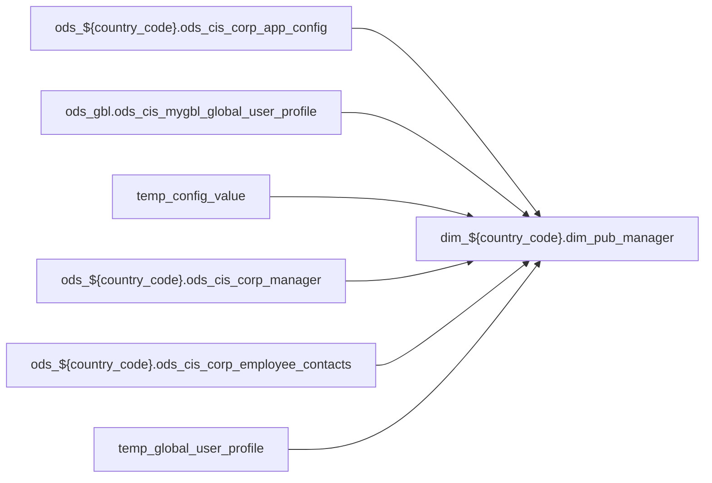

# DIM: `dim_pub_manager`

- artifact_type: etl_table
- artifact_id: dim_${country_code}.dim_pub_manager
- domain: pos
- one_line_purpose: ETL script `source/contracts/pos/bitbucket-etl/dim_pub_manager/dim_pub_manager.sql` loads `dim_${country_code}.dim_pub_manager` (layer `DIM`). Purpose inferred from SQL only.
- layer_type: DIM
- source_kind: etl_sql
- evidence_source: source/contracts/pos/bitbucket-etl/dim_pub_manager/dim_pub_manager.sql
- bitbucket_etl_bundle: source/contracts/pos/bitbucket-etl/dim_pub_manager/

---

## L1 Data Foundation

### Identity and physical mapping
- **Table:** `dim_${country_code}.dim_pub_manager`
- **Layer type:** DIM
- **Canonical / derived:** Derived / ETL-loaded (see L3)
- **Owner team:** Not documented in repository

### Grain, scope, exclusions
- **Grain:** Not documented in repository (see SELECT/GROUP BY in `source/contracts/pos/bitbucket-etl/dim_pub_manager/dim_pub_manager.sql`)
- **Partition:** `See L4 / ETL partition clause`
- **Exclusions:** See L3 Key filters

### Cross-engine presence
| Engine | Present | Canonical FQN | Notes |
|--------|---------|---------------|-------|
| Hive | yes | `dim_${country_code}.dim_pub_manager` | ETL target |
| Vertica | Not documented in repository | — | Confirm via hive2vertica flow |

### Physical schema reference

Pointer block only - full column catalog lives in WKB L1 storage JSON.

| Field | Value |
|-------|-------|
| **Authoritative catalog** | WKB L1 storage seed (not duplicated in this file) |
| **entity_id** | `dim_${country_code}.dim_pub_manager` |
| **l1_catalog_seed** | `target/storage/wkb/snapshots/_snapshot_id_template/l1_catalog/{engine}_{schema}_{table}.json` |
| **column_count** | pending (run ddl_seed_writer) |
| **partition_keys** | `See L4 / ETL partition clause` |
| **ddl_source** | pending Bitbucket DDL / Vertica metadata ingest |
| **retrieval** | `python -m tools.wkb.indexing.run_query --query "pos dim_pub_manager schema" --intent find_table_schema` |

### Lineage

- **Primary load:** `source/contracts/pos/bitbucket-etl/dim_pub_manager/dim_pub_manager.sql`
- **upstream:** `ods_${country_code}.ods_cis_corp_app_config` — FROM/JOIN — `source/contracts/pos/bitbucket-etl/dim_pub_manager/dim_pub_manager.sql`
- **upstream:** `ods_gbl.ods_cis_mygbl_global_user_profile` — FROM/JOIN — `source/contracts/pos/bitbucket-etl/dim_pub_manager/dim_pub_manager.sql`
- **upstream:** `temp_config_value` — FROM/JOIN — `source/contracts/pos/bitbucket-etl/dim_pub_manager/dim_pub_manager.sql`
- **upstream:** `ods_${country_code}.ods_cis_corp_manager` — FROM/JOIN — `source/contracts/pos/bitbucket-etl/dim_pub_manager/dim_pub_manager.sql`
- **upstream:** `ods_${country_code}.ods_cis_corp_employee_contacts` — FROM/JOIN — `source/contracts/pos/bitbucket-etl/dim_pub_manager/dim_pub_manager.sql`
- **upstream:** `temp_global_user_profile` — FROM/JOIN — `source/contracts/pos/bitbucket-etl/dim_pub_manager/dim_pub_manager.sql`
- **downstream:** see L6 Downstream consumers
### Freshness and load path
| Item | Value |
|------|-------|
| Load pattern | See L3 INSERT / OVERWRITE in evidence script |
| Schedule | Not documented in repository |
| Parameters | Parsed from ETL literals / `${...}` in `source/contracts/pos/bitbucket-etl/dim_pub_manager/dim_pub_manager.sql` |

## L2 Declarative Knowledge

### Business purpose
ETL script `source/contracts/pos/bitbucket-etl/dim_pub_manager/dim_pub_manager.sql` loads `dim_${country_code}.dim_pub_manager` (layer `DIM`). Purpose inferred from SQL only.

### Audience and use cases
| Audience | How they benefit |
|----------|-----------------|
| Data / BI consumers | Use target table produced by this ETL |
| Data Engineering | Maintain load logic in evidence script |

### Fact key resolution
- Keys follow target INSERT column list / GROUP BY in evidence SQL.

### Time field semantics
- Partition / date fields: `See L4 / ETL partition clause`

### Metrics served
- See L3 column derivations for measure expressions when present.

### Metric serving map
N/A — not a multi-period wide serving table (or not documented).

### etl_metrics
No calculable business metrics registered in metric-index for this create run.

## L3 Procedural Knowledge

### Query and routing rules
- Prefer querying the target `dim_${country_code}.dim_pub_manager` after successful ETL load.

### Dimension join patterns
- See Relationship map and Base tables register.

### Key filters and ETL business logic

| Predicate | Kind | Evidence |
|-----------|------|----------|
| `config_name = 'SYS_COMPANY_NO'; create or replace TEMPORARY view temp_global_user_profile as select gup.user_id, gup.profile_c from ods_gbl.ods_cis_mygbl_global_user_profile gup left semi join temp...` | Business | `source/contracts/pos/bitbucket-etl/dim_pub_manager/dim_pub_manager.sql` |

### Standard time-filter SQL
```sql
-- See partition / date predicates in source/contracts/pos/bitbucket-etl/dim_pub_manager/dim_pub_manager.sql
```

### End-to-end flow



### Base tables register

| Object | Role |
|--------|------|
| `ods_${country_code}.ods_cis_corp_app_config` | source / temp (from ETL FROM/JOIN) |
| `ods_gbl.ods_cis_mygbl_global_user_profile` | source / temp (from ETL FROM/JOIN) |
| `temp_config_value` | source / temp (from ETL FROM/JOIN) |
| `ods_${country_code}.ods_cis_corp_manager` | source / temp (from ETL FROM/JOIN) |
| `ods_${country_code}.ods_cis_corp_employee_contacts` | source / temp (from ETL FROM/JOIN) |
| `temp_global_user_profile` | source / temp (from ETL FROM/JOIN) |

### Step-by-step logic
1. Read sources listed in Base tables register (`source/contracts/pos/bitbucket-etl/dim_pub_manager/dim_pub_manager.sql`).
2. Apply filters documented under Key filters.
3. INSERT OVERWRITE / write target `dim_${country_code}.dim_pub_manager`.

### Relationship map (embedded)

| from_fqn | to_fqn | cardinality | join_keys | provenance |
|----------|--------|-------------|-----------|------------|
| `temp_global_user_profile` | `temp_config_value` | many:1 | `gup.local_company` = `tca.config_value` | etl_sql (`source/contracts/pos/bitbucket-etl/dim_pub_manager/dim_pub_manager.sql:13`) |
| `ods_${country_code}.ods_cis_corp_manager` | `ods_${country_code}.ods_cis_corp_employee_contacts` | many:1 (LEFT) | `mg.userid` = `ec.user_id` | etl_sql (`source/contracts/pos/bitbucket-etl/dim_pub_manager/dim_pub_manager.sql:57`) |
| `ods_${country_code}.ods_cis_corp_manager` | `temp_global_user_profile` | many:1 (LEFT) | `mg.userid` = `gup.user_id` | etl_sql (`source/contracts/pos/bitbucket-etl/dim_pub_manager/dim_pub_manager.sql:59`) |

### Special logic (embedded)

`source/ref/pos/special_logic.txt` exists but no rule naming this FQN/stem (`dim_${country_code}.dim_pub_manager`).

Not documented in repository


### Column / field derivations (from ETL SQL)

| target_column | expression_sql | upstream_columns | upstream_tables | transform_kind | evidence |
|---------------|----------------|------------------|-----------------|----------------|----------|
| `userid` | `mg.userid` | `userid` | `ods_${country_code}.ods_cis_corp_manager`, `ods_${country_code}.ods_cis_corp_employee_contacts`, `temp_global_user_profile` | passthrough | `source/contracts/pos/bitbucket-etl/dim_pub_manager/dim_pub_manager.sql:21` |
| `name` | `concat(if(mg.firstname is null, '', mg.firstname), ' ', if(mg.lastname is null, '', mg.lastname))` | `firstname`, `lastname` | `ods_${country_code}.ods_cis_corp_manager`, `ods_${country_code}.ods_cis_corp_employee_contacts`, `temp_global_user_profile` | udf | `source/contracts/pos/bitbucket-etl/dim_pub_manager/dim_pub_manager.sql:22` |
| `loginid` | `mg.loginid` | `loginid` | `ods_${country_code}.ods_cis_corp_manager`, `ods_${country_code}.ods_cis_corp_employee_contacts`, `temp_global_user_profile` | passthrough | `source/contracts/pos/bitbucket-etl/dim_pub_manager/dim_pub_manager.sql:23` |
| `lastname` | `mg.lastname` | `lastname` | `ods_${country_code}.ods_cis_corp_manager`, `ods_${country_code}.ods_cis_corp_employee_contacts`, `temp_global_user_profile` | passthrough | `source/contracts/pos/bitbucket-etl/dim_pub_manager/dim_pub_manager.sql:22` |
| `firstname` | `mg.firstname` | `firstname` | `ods_${country_code}.ods_cis_corp_manager`, `ods_${country_code}.ods_cis_corp_employee_contacts`, `temp_global_user_profile` | passthrough | `source/contracts/pos/bitbucket-etl/dim_pub_manager/dim_pub_manager.sql:22` |
| `mi` | `mg.mi` | `mi` | `ods_${country_code}.ods_cis_corp_manager`, `ods_${country_code}.ods_cis_corp_employee_contacts`, `temp_global_user_profile` | passthrough | `source/contracts/pos/bitbucket-etl/dim_pub_manager/dim_pub_manager.sql:26` |
| `title` | `mg.title` | `title` | `ods_${country_code}.ods_cis_corp_manager`, `ods_${country_code}.ods_cis_corp_employee_contacts`, `temp_global_user_profile` | passthrough | `source/contracts/pos/bitbucket-etl/dim_pub_manager/dim_pub_manager.sql:27` |
| `phone` | `mg.phone` | `phone` | `ods_${country_code}.ods_cis_corp_manager`, `ods_${country_code}.ods_cis_corp_employee_contacts`, `temp_global_user_profile` | passthrough | `source/contracts/pos/bitbucket-etl/dim_pub_manager/dim_pub_manager.sql:28` |
| `deptid` | `mg.deptid` | `deptid` | `ods_${country_code}.ods_cis_corp_manager`, `ods_${country_code}.ods_cis_corp_employee_contacts`, `temp_global_user_profile` | passthrough | `source/contracts/pos/bitbucket-etl/dim_pub_manager/dim_pub_manager.sql:29` |
| `managerid` | `mg.managerid` | `managerid` | `ods_${country_code}.ods_cis_corp_manager`, `ods_${country_code}.ods_cis_corp_employee_contacts`, `temp_global_user_profile` | passthrough | `source/contracts/pos/bitbucket-etl/dim_pub_manager/dim_pub_manager.sql:30` |
| `hiredate` | `mg.hiredate` | `hiredate` | `ods_${country_code}.ods_cis_corp_manager`, `ods_${country_code}.ods_cis_corp_employee_contacts`, `temp_global_user_profile` | passthrough | `source/contracts/pos/bitbucket-etl/dim_pub_manager/dim_pub_manager.sql:31` |
| `termdate` | `mg.termdate` | `termdate` | `ods_${country_code}.ods_cis_corp_manager`, `ods_${country_code}.ods_cis_corp_employee_contacts`, `temp_global_user_profile` | passthrough | `source/contracts/pos/bitbucket-etl/dim_pub_manager/dim_pub_manager.sql:32` |
| `levelid` | `mg.levelid` | `levelid` | `ods_${country_code}.ods_cis_corp_manager`, `ods_${country_code}.ods_cis_corp_employee_contacts`, `temp_global_user_profile` | passthrough | `source/contracts/pos/bitbucket-etl/dim_pub_manager/dim_pub_manager.sql:33` |
| `def_loc` | `mg.def_loc` | `def_loc` | `ods_${country_code}.ods_cis_corp_manager`, `ods_${country_code}.ods_cis_corp_employee_contacts`, `temp_global_user_profile` | passthrough | `source/contracts/pos/bitbucket-etl/dim_pub_manager/dim_pub_manager.sql:34` |
| `term_id` | `mg.term_id` | `term_id` | `ods_${country_code}.ods_cis_corp_manager`, `ods_${country_code}.ods_cis_corp_employee_contacts`, `temp_global_user_profile` | passthrough | `source/contracts/pos/bitbucket-etl/dim_pub_manager/dim_pub_manager.sql:35` |
| `last_login` | `mg.last_login` | `last_login` | `ods_${country_code}.ods_cis_corp_manager`, `ods_${country_code}.ods_cis_corp_employee_contacts`, `temp_global_user_profile` | passthrough | `source/contracts/pos/bitbucket-etl/dim_pub_manager/dim_pub_manager.sql:36` |
| `classid` | `mg.classid` | `classid` | `ods_${country_code}.ods_cis_corp_manager`, `ods_${country_code}.ods_cis_corp_employee_contacts`, `temp_global_user_profile` | passthrough | `source/contracts/pos/bitbucket-etl/dim_pub_manager/dim_pub_manager.sql:37` |
| `company_no` | `mg.company_no` | `company_no` | `ods_${country_code}.ods_cis_corp_manager`, `ods_${country_code}.ods_cis_corp_employee_contacts`, `temp_global_user_profile` | passthrough | `source/contracts/pos/bitbucket-etl/dim_pub_manager/dim_pub_manager.sql:38` |
| `tc_exempt` | `mg.tc_exempt` | `tc_exempt` | `ods_${country_code}.ods_cis_corp_manager`, `ods_${country_code}.ods_cis_corp_employee_contacts`, `temp_global_user_profile` | passthrough | `source/contracts/pos/bitbucket-etl/dim_pub_manager/dim_pub_manager.sql:39` |
| `cost_center` | `mg.cost_center` | `cost_center` | `ods_${country_code}.ods_cis_corp_manager`, `ods_${country_code}.ods_cis_corp_employee_contacts`, `temp_global_user_profile` | passthrough | `source/contracts/pos/bitbucket-etl/dim_pub_manager/dim_pub_manager.sql:40` |
| `user_loc` | `mg.user_loc` | `user_loc` | `ods_${country_code}.ods_cis_corp_manager`, `ods_${country_code}.ods_cis_corp_employee_contacts`, `temp_global_user_profile` | passthrough | `source/contracts/pos/bitbucket-etl/dim_pub_manager/dim_pub_manager.sql:41` |
| `payrollname` | `mg.payrollname` | `payrollname` | `ods_${country_code}.ods_cis_corp_manager`, `ods_${country_code}.ods_cis_corp_employee_contacts`, `temp_global_user_profile` | passthrough | `source/contracts/pos/bitbucket-etl/dim_pub_manager/dim_pub_manager.sql:42` |
| `available_status` | `mg.available_status` | `available_status` | `ods_${country_code}.ods_cis_corp_manager`, `ods_${country_code}.ods_cis_corp_employee_contacts`, `temp_global_user_profile` | passthrough | `source/contracts/pos/bitbucket-etl/dim_pub_manager/dim_pub_manager.sql:43` |
| `absence_start_date` | `mg.absence_start_date` | `absence_start_date` | `ods_${country_code}.ods_cis_corp_manager`, `ods_${country_code}.ods_cis_corp_employee_contacts`, `temp_global_user_profile` | passthrough | `source/contracts/pos/bitbucket-etl/dim_pub_manager/dim_pub_manager.sql:44` |
| `first_day_back_date` | `mg.first_day_back_date` | `first_day_back_date` | `ods_${country_code}.ods_cis_corp_manager`, `ods_${country_code}.ods_cis_corp_employee_contacts`, `temp_global_user_profile` | passthrough | `source/contracts/pos/bitbucket-etl/dim_pub_manager/dim_pub_manager.sql:45` |
| `blackout` | `mg.blackout` | `blackout` | `ods_${country_code}.ods_cis_corp_manager`, `ods_${country_code}.ods_cis_corp_employee_contacts`, `temp_global_user_profile` | passthrough | `source/contracts/pos/bitbucket-etl/dim_pub_manager/dim_pub_manager.sql:46` |
| `nickname` | `mg.nickname` | `nickname` | `ods_${country_code}.ods_cis_corp_manager`, `ods_${country_code}.ods_cis_corp_employee_contacts`, `temp_global_user_profile` | passthrough | `source/contracts/pos/bitbucket-etl/dim_pub_manager/dim_pub_manager.sql:47` |
| `job_code` | `mg.job_code` | `job_code` | `ods_${country_code}.ods_cis_corp_manager`, `ods_${country_code}.ods_cis_corp_employee_contacts`, `temp_global_user_profile` | passthrough | `source/contracts/pos/bitbucket-etl/dim_pub_manager/dim_pub_manager.sql:48` |
| `global_id` | `mg.global_id` | `global_id` | `ods_${country_code}.ods_cis_corp_manager`, `ods_${country_code}.ods_cis_corp_employee_contacts`, `temp_global_user_profile` | passthrough | `source/contracts/pos/bitbucket-etl/dim_pub_manager/dim_pub_manager.sql:49` |
| `support_company` | `mg.support_company` | `support_company` | `ods_${country_code}.ods_cis_corp_manager`, `ods_${country_code}.ods_cis_corp_employee_contacts`, `temp_global_user_profile` | passthrough | `source/contracts/pos/bitbucket-etl/dim_pub_manager/dim_pub_manager.sql:50` |
| `fusion_id` | `mg.fusion_id` | `fusion_id` | `ods_${country_code}.ods_cis_corp_manager`, `ods_${country_code}.ods_cis_corp_employee_contacts`, `temp_global_user_profile` | passthrough | `source/contracts/pos/bitbucket-etl/dim_pub_manager/dim_pub_manager.sql:51` |
| `email` | `ec.email` | `email` | `ods_${country_code}.ods_cis_corp_manager`, `ods_${country_code}.ods_cis_corp_employee_contacts`, `temp_global_user_profile` | passthrough | `source/contracts/pos/bitbucket-etl/dim_pub_manager/dim_pub_manager.sql:52` |
| `mobile_phone` | `ec.mobile_phone` | `mobile_phone` | `ods_${country_code}.ods_cis_corp_manager`, `ods_${country_code}.ods_cis_corp_employee_contacts`, `temp_global_user_profile` | passthrough | `source/contracts/pos/bitbucket-etl/dim_pub_manager/dim_pub_manager.sql:53` |
| `upn` | `gup.profile_c` | `profile_c` | `ods_${country_code}.ods_cis_corp_manager`, `ods_${country_code}.ods_cis_corp_employee_contacts`, `temp_global_user_profile` | rename | `source/contracts/pos/bitbucket-etl/dim_pub_manager/dim_pub_manager.sql:10` |

### Sentinel and code values
Not documented in repository beyond CASE/exp_code predicates in ETL SQL.

## L4 Validation

### Resolved partition value
- Partition expression from ETL: `See L4 / ETL partition clause`
- Runtime values: Not documented in repository (resolve via Azkaban params when flow evidence exists).

### Data quality checks
Not documented in repository

### Validation SQL
N/A — Vertica MCP not executed during documentation (Vertica no-run policy).

### Caveats for interpretation
- Generated from ETL SQL evidence only; business definitions may need `source/ref` enrichment.

### Conflicts and open questions
None identified in repository

## L5 Runtime View

### Query path and engine preference
| Path | Engine | Evidence |
|------|--------|----------|
| ETL load | Hive/Spark | `source/contracts/pos/bitbucket-etl/dim_pub_manager/dim_pub_manager.sql` |
| Serving | Vertica (when synced) | Not documented in repository |

### Access constraints
Not documented in repository

### Query risk profile
- Scan risk depends on partition pruning; always filter partition keys when present.

## L6 Access and Consumption

### Primary consumers and use cases
Not documented in repository

### Representative query patterns
Not documented in repository

### Dependencies and notes

#### Upstream objects (verified)
| Object | Usage | Evidence |
|--------|-------|----------|
| `ods_${country_code}.ods_cis_corp_app_config` | FROM/JOIN | `source/contracts/pos/bitbucket-etl/dim_pub_manager/dim_pub_manager.sql` |
| `ods_gbl.ods_cis_mygbl_global_user_profile` | FROM/JOIN | `source/contracts/pos/bitbucket-etl/dim_pub_manager/dim_pub_manager.sql` |
| `temp_config_value` | FROM/JOIN | `source/contracts/pos/bitbucket-etl/dim_pub_manager/dim_pub_manager.sql` |
| `ods_${country_code}.ods_cis_corp_manager` | FROM/JOIN | `source/contracts/pos/bitbucket-etl/dim_pub_manager/dim_pub_manager.sql` |
| `ods_${country_code}.ods_cis_corp_employee_contacts` | FROM/JOIN | `source/contracts/pos/bitbucket-etl/dim_pub_manager/dim_pub_manager.sql` |
| `temp_global_user_profile` | FROM/JOIN | `source/contracts/pos/bitbucket-etl/dim_pub_manager/dim_pub_manager.sql` |

#### Downstream consumers (verified)

| Object / script | Evidence |
|-----------------|----------|
| KB / contract ref: `source/contracts/b-report-us/tables/dim_pub_vpl_hierarchy_info.md` | `source/contracts/b-report-us/tables/dim_pub_vpl_hierarchy_info.md:162` |
| KB / contract ref: `source/contracts/pos/bitbucket-etl/MANIFEST.md` | `source/contracts/pos/bitbucket-etl/MANIFEST.md:70` |
| ETL/script ref: `source/contracts/pos/bitbucket-etl/dim_pub_customer_info/dim_pub_customer_info.sql` | `source/contracts/pos/bitbucket-etl/dim_pub_customer_info/dim_pub_customer_info.sql:200` |
| ETL/script ref: `source/contracts/pos/bitbucket-etl/dim_pub_customer_info_rt/dim_pub_customer_info_rt.sql` | `source/contracts/pos/bitbucket-etl/dim_pub_customer_info_rt/dim_pub_customer_info_rt.sql:195` |
| ETL/script ref: `source/contracts/pos/bitbucket-etl/dim_pub_pm_vpc_matrix/dim_pub_pm_vpc_matrix.sql` | `source/contracts/pos/bitbucket-etl/dim_pub_pm_vpc_matrix/dim_pub_pm_vpc_matrix.sql:41` |
| ETL/script ref: `source/contracts/pos/bitbucket-etl/dim_pub_vpl_hierarchy_info/dim_pub_vpl_hierarchy_info.sql` | `source/contracts/pos/bitbucket-etl/dim_pub_vpl_hierarchy_info/dim_pub_vpl_hierarchy_info.sql:1` |
| ETL/script ref: `source/contracts/pos/bitbucket-etl/dim_pub_vpl_pm_hierarchy_info/dim_pub_vpl_pm_hierarchy_info.sql` | `source/contracts/pos/bitbucket-etl/dim_pub_vpl_pm_hierarchy_info/dim_pub_vpl_pm_hierarchy_info.sql:43` |
| ETL/script ref: `source/contracts/pos/bitbucket-etl/dm_disty_sales_close_cpo_di/dwd_disty_sales_close_cpo_detail_extend_di.sql` | `source/contracts/pos/bitbucket-etl/dm_disty_sales_close_cpo_di/dwd_disty_sales_close_cpo_detail_extend_di.sql:643` |
| ETL/script ref: `source/contracts/pos/bitbucket-etl/dm_disty_sales_close_cpo_di/dwd_disty_sales_close_cpo_header_extend_di.sql` | `source/contracts/pos/bitbucket-etl/dm_disty_sales_close_cpo_di/dwd_disty_sales_close_cpo_header_extend_di.sql:215` |
| ETL/script ref: `source/contracts/pos/bitbucket-etl/dm_disty_sales_open_cpo/dwd_disty_sales_open_cpo_detail_extend_df.sql` | `source/contracts/pos/bitbucket-etl/dm_disty_sales_open_cpo/dwd_disty_sales_open_cpo_detail_extend_df.sql:631` |
| ETL/script ref: `source/contracts/pos/bitbucket-etl/dm_disty_sales_open_cpo/dwd_disty_sales_open_cpo_detail_extend_rt.sql` | `source/contracts/pos/bitbucket-etl/dm_disty_sales_open_cpo/dwd_disty_sales_open_cpo_detail_extend_rt.sql:84` |
| ETL/script ref: `source/contracts/pos/bitbucket-etl/dm_disty_sales_open_cpo/dwd_disty_sales_open_cpo_header_extend_df.sql` | `source/contracts/pos/bitbucket-etl/dm_disty_sales_open_cpo/dwd_disty_sales_open_cpo_header_extend_df.sql:219` |
| ETL/script ref: `source/contracts/pos/bitbucket-etl/dm_disty_sales_open_cpo/dwd_disty_sales_open_cpo_header_extend_rt.sql` | `source/contracts/pos/bitbucket-etl/dm_disty_sales_open_cpo/dwd_disty_sales_open_cpo_header_extend_rt.sql:219` |
| ETL/script ref: `source/contracts/pos/bitbucket-etl/dwd_disty_common_po_basic/loading_po_basic.sql` | `source/contracts/pos/bitbucket-etl/dwd_disty_common_po_basic/loading_po_basic.sql:449` |
| ETL/script ref: `source/contracts/pos/bitbucket-etl/dwd_disty_common_pos_di/loading_pos_data.sql` | `source/contracts/pos/bitbucket-etl/dwd_disty_common_pos_di/loading_pos_data.sql:645` |
| ETL/script ref: `source/contracts/pos/bitbucket-etl/dwd_disty_common_pos_di/loading_pos_data_hyve.sql` | `source/contracts/pos/bitbucket-etl/dwd_disty_common_pos_di/loading_pos_data_hyve.sql:456` |
| ETL/script ref: `source/contracts/pos/bitbucket-etl/dwd_disty_sales_open_cpo_detail_extend/dwd_disty_sales_open_cpo_detail_extend_df.sql` | `source/contracts/pos/bitbucket-etl/dwd_disty_sales_open_cpo_detail_extend/dwd_disty_sales_open_cpo_detail_extend_df.sql:631` |
| ETL/script ref: `source/contracts/pos/bitbucket-etl/dwd_disty_sales_open_cpo_detail_extend/dwd_disty_sales_open_cpo_detail_extend_rt.sql` | `source/contracts/pos/bitbucket-etl/dwd_disty_sales_open_cpo_detail_extend/dwd_disty_sales_open_cpo_detail_extend_rt.sql:84` |
| ETL/script ref: `source/contracts/pos/bitbucket-etl/dwd_disty_sales_open_cpo_header_extend/dwd_disty_sales_open_cpo_header_extend_df.sql` | `source/contracts/pos/bitbucket-etl/dwd_disty_sales_open_cpo_header_extend/dwd_disty_sales_open_cpo_header_extend_df.sql:219` |
| ETL/script ref: `source/contracts/pos/bitbucket-etl/dwd_disty_sales_open_cpo_header_extend/dwd_disty_sales_open_cpo_header_extend_rt.sql` | `source/contracts/pos/bitbucket-etl/dwd_disty_sales_open_cpo_header_extend/dwd_disty_sales_open_cpo_header_extend_rt.sql:219` |
| ETL/script ref: `source/contracts/pos/bitbucket-etl/dwd_disty_sales_open_order_detail/loading_open_orders_data.sql` | `source/contracts/pos/bitbucket-etl/dwd_disty_sales_open_order_detail/loading_open_orders_data.sql:170` |
| KB / contract ref: `source/contracts/pos/domain-knowledge.md` | `source/contracts/pos/domain-knowledge.md:57` |
| KB / contract ref: `source/contracts/pos/tables/dim_pub_cust_profile_all.md` | `source/contracts/pos/tables/dim_pub_cust_profile_all.md:51` |
| KB / contract ref: `source/contracts/pos/tables/dim_pub_cust_xref_all.md` | `source/contracts/pos/tables/dim_pub_cust_xref_all.md:48` |
| KB / contract ref: `source/contracts/pos/tables/dim_pub_customer_info.md` | `source/contracts/pos/tables/dim_pub_customer_info.md:54` |
| KB / contract ref: `source/contracts/pos/tables/dim_pub_customer_info_rt.md` | `source/contracts/pos/tables/dim_pub_customer_info_rt.md:54` |
| KB / contract ref: `source/contracts/pos/tables/dim_pub_eu_custom_map_view.md` | `source/contracts/pos/tables/dim_pub_eu_custom_map_view.md:47` |
| KB / contract ref: `source/contracts/pos/tables/dim_pub_exchange_rate.md` | `source/contracts/pos/tables/dim_pub_exchange_rate.md:47` |
| KB / contract ref: `source/contracts/pos/tables/dim_pub_inv_type_view.md` | `source/contracts/pos/tables/dim_pub_inv_type_view.md:46` |
| KB / contract ref: `source/contracts/pos/tables/dim_pub_list_box_detail.md` | `source/contracts/pos/tables/dim_pub_list_box_detail.md:51` |
| KB / contract ref: `source/contracts/pos/tables/dim_pub_location_info.md` | `source/contracts/pos/tables/dim_pub_location_info.md:50` |
| KB / contract ref: `source/contracts/pos/tables/dim_pub_manager.md` | `source/contracts/pos/tables/dim_pub_manager.md:5` |
| KB / contract ref: `source/contracts/pos/tables/dim_pub_order_type.md` | `source/contracts/pos/tables/dim_pub_order_type.md:45` |
| KB / contract ref: `source/contracts/pos/tables/dim_pub_part_info.md` | `source/contracts/pos/tables/dim_pub_part_info.md:97` |
| KB / contract ref: `source/contracts/pos/tables/dim_pub_part_info_rt.md` | `source/contracts/pos/tables/dim_pub_part_info_rt.md:97` |
| KB / contract ref: `source/contracts/pos/tables/dim_pub_pm_vpc_matrix.md` | `source/contracts/pos/tables/dim_pub_pm_vpc_matrix.md:43` |
| KB / contract ref: `source/contracts/pos/tables/dim_pub_project_info.md` | `source/contracts/pos/tables/dim_pub_project_info.md:48` |
| KB / contract ref: `source/contracts/pos/tables/dim_pub_sales_cust_type.md` | `source/contracts/pos/tables/dim_pub_sales_cust_type.md:44` |
| KB / contract ref: `source/contracts/pos/tables/dim_pub_sales_hierarchy_primary_role_by_terr_view.md` | `source/contracts/pos/tables/dim_pub_sales_hierarchy_primary_role_by_terr_view.md:52` |
| KB / contract ref: `source/contracts/pos/tables/dim_pub_ship_method.md` | `source/contracts/pos/tables/dim_pub_ship_method.md:46` |

#### Operational detail (verified)
- Partition clause: `See L4 / ETL partition clause`

#### Not documented in repository
- Schedule, owner, SLA
