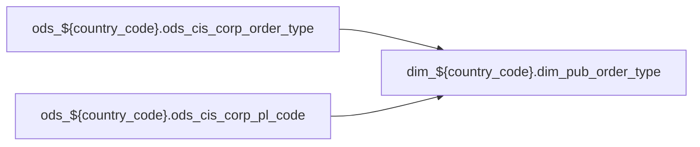

# DIM: `dim_pub_order_type`

- artifact_type: etl_table
- artifact_id: dim_${country_code}.dim_pub_order_type
- domain: pos
- one_line_purpose: ETL script `source/contracts/pos/bitbucket-etl/dim_pub_order_type/dim_pub_order_type.sql` loads `dim_${country_code}.dim_pub_order_type` (layer `DIM`). Purpose inferred from SQL only.
- layer_type: DIM
- source_kind: etl_sql
- evidence_source: source/contracts/pos/bitbucket-etl/dim_pub_order_type/dim_pub_order_type.sql
- bitbucket_etl_bundle: source/contracts/pos/bitbucket-etl/dim_pub_order_type/

---

## L1 Data Foundation

### Identity and physical mapping
- **Table:** `dim_${country_code}.dim_pub_order_type`
- **Layer type:** DIM
- **Canonical / derived:** Derived / ETL-loaded (see L3)
- **Owner team:** Not documented in repository

### Grain, scope, exclusions
- **Grain:** Not documented in repository (see SELECT/GROUP BY in `source/contracts/pos/bitbucket-etl/dim_pub_order_type/dim_pub_order_type.sql`)
- **Partition:** `See L4 / ETL partition clause`
- **Exclusions:** See L3 Key filters

### Cross-engine presence
| Engine | Present | Canonical FQN | Notes |
|--------|---------|---------------|-------|
| Hive | yes | `dim_${country_code}.dim_pub_order_type` | ETL target |
| Vertica | Not documented in repository | — | Confirm via hive2vertica flow |

### Physical schema reference

Pointer block only - full column catalog lives in WKB L1 storage JSON.

| Field | Value |
|-------|-------|
| **Authoritative catalog** | WKB L1 storage seed (not duplicated in this file) |
| **entity_id** | `dim_${country_code}.dim_pub_order_type` |
| **l1_catalog_seed** | `target/storage/wkb/snapshots/_snapshot_id_template/l1_catalog/{engine}_{schema}_{table}.json` |
| **column_count** | pending (run ddl_seed_writer) |
| **partition_keys** | `See L4 / ETL partition clause` |
| **ddl_source** | pending Bitbucket DDL / Vertica metadata ingest |
| **retrieval** | `python -m tools.wkb.indexing.run_query --query "pos dim_pub_order_type schema" --intent find_table_schema` |

### Lineage

- **Primary load:** `source/contracts/pos/bitbucket-etl/dim_pub_order_type/dim_pub_order_type.sql`
- **upstream:** `ods_${country_code}.ods_cis_corp_order_type` — FROM/JOIN — `source/contracts/pos/bitbucket-etl/dim_pub_order_type/dim_pub_order_type.sql`
- **upstream:** `ods_${country_code}.ods_cis_corp_pl_code` — FROM/JOIN — `source/contracts/pos/bitbucket-etl/dim_pub_order_type/dim_pub_order_type.sql`
- **downstream:** see L6 Downstream consumers
### Freshness and load path
| Item | Value |
|------|-------|
| Load pattern | See L3 INSERT / OVERWRITE in evidence script |
| Schedule | Not documented in repository |
| Parameters | Parsed from ETL literals / `${...}` in `source/contracts/pos/bitbucket-etl/dim_pub_order_type/dim_pub_order_type.sql` |

## L2 Declarative Knowledge

### Business purpose
ETL script `source/contracts/pos/bitbucket-etl/dim_pub_order_type/dim_pub_order_type.sql` loads `dim_${country_code}.dim_pub_order_type` (layer `DIM`). Purpose inferred from SQL only.

### Audience and use cases
| Audience | How they benefit |
|----------|-----------------|
| Data / BI consumers | Use target table produced by this ETL |
| Data Engineering | Maintain load logic in evidence script |

### Fact key resolution
- Keys follow target INSERT column list / GROUP BY in evidence SQL.

### Time field semantics
- Partition / date fields: `See L4 / ETL partition clause`

### Metrics served
- See L3 column derivations for measure expressions when present.

### Metric serving map
N/A — not a multi-period wide serving table (or not documented).

### etl_metrics
No calculable business metrics registered in metric-index for this create run.

## L3 Procedural Knowledge

### Query and routing rules
- Prefer querying the target `dim_${country_code}.dim_pub_order_type` after successful ETL load.

### Dimension join patterns
- See Relationship map and Base tables register.

### Key filters and ETL business logic

| Predicate | Kind | Evidence |
|-----------|------|----------|
| `code_type = 'ORDR' AND ccode = 'TYPE' AND usage = 'ORDR_TYPE_PL' ) b on (a.order_type =b.icode);` | Business | `source/contracts/pos/bitbucket-etl/dim_pub_order_type/dim_pub_order_type.sql` |

### Standard time-filter SQL
```sql
-- See partition / date predicates in source/contracts/pos/bitbucket-etl/dim_pub_order_type/dim_pub_order_type.sql
```

### End-to-end flow



### Base tables register

| Object | Role |
|--------|------|
| `ods_${country_code}.ods_cis_corp_order_type` | source / temp (from ETL FROM/JOIN) |
| `ods_${country_code}.ods_cis_corp_pl_code` | source / temp (from ETL FROM/JOIN) |

### Step-by-step logic
1. Read sources listed in Base tables register (`source/contracts/pos/bitbucket-etl/dim_pub_order_type/dim_pub_order_type.sql`).
2. Apply filters documented under Key filters.
3. INSERT OVERWRITE / write target `dim_${country_code}.dim_pub_order_type`.

### Relationship map (embedded)

| from_fqn | to_fqn | cardinality | join_keys | provenance |
|----------|--------|-------------|-----------|------------|
| — | — | — | — | No JOIN edges parsed from ETL (`source/contracts/pos/bitbucket-etl/dim_pub_order_type/dim_pub_order_type.sql`); see Base tables register / step-by-step |

### Special logic (embedded)

Provenance: `source/ref/pos/special_logic.txt`

#### Applicable rule excerpt 1

```
# POS special logic reference

# Scope
# - Derived from existing Vertica POS rds_xxx_rtv.sp scripts.
# - POS scripts were identified by dw_*/dwd_disty_common_pos_di usage.
# - Vertica scripts were identified by rdsetl.rds_tmp output usage.
# - Scan result used for this file: 499 scripts; regions: BR=1, CA=124, MX=7, US=367.
# - Use xx as the region placeholder, matching table list.txt and table relationship.txt.

# 1. Order line type is not always a simple Comp exclusion
# Default POS reports normally exclude component lines:
#   order_line_type <> 'Comp'
#
# Historical exception patterns:
# - Some vendor/customer sales reports include order_line_type IN ('Comp', 'Single').
# - Some kit-level reports include order_line_type IN ('Comp', 'Kit', 'Single').
# - Component inclusion is usually intentional when the report needs kit components, bundle economics, or vendor/manufacturer line detail.
#
# Rule:
# - Default to excluding Comp unless the request mentions kit components, component detail, bundle detail, or the historical report pattern explicitly includes Comp.
# - Never include Kit, Single, and Comp together unless the report grain and business request require all sold and com...
```

### Column / field derivations (from ETL SQL)

| target_column | expression_sql | upstream_columns | upstream_tables | transform_kind | evidence |
|---------------|----------------|------------------|-----------------|----------------|----------|
| `order_type` | `a.order_type` | `order_type` | `ods_${country_code}.ods_cis_corp_order_type`, `ods_${country_code}.ods_cis_corp_pl_code` | passthrough | `source/contracts/pos/bitbucket-etl/dim_pub_order_type/dim_pub_order_type.sql:3` |
| `order_type_descr` | `a.order_type_descr` | `order_type_descr` | `ods_${country_code}.ods_cis_corp_order_type`, `ods_${country_code}.ods_cis_corp_pl_code` | passthrough | `source/contracts/pos/bitbucket-etl/dim_pub_order_type/dim_pub_order_type.sql:4` |
| `order_source` | `a.order_source` | `order_source` | `ods_${country_code}.ods_cis_corp_order_type`, `ods_${country_code}.ods_cis_corp_pl_code` | passthrough | `source/contracts/pos/bitbucket-etl/dim_pub_order_type/dim_pub_order_type.sql:5` |
| `entry_datetime` | `a.entry_datetime` | `entry_datetime` | `ods_${country_code}.ods_cis_corp_order_type`, `ods_${country_code}.ods_cis_corp_pl_code` | passthrough | `source/contracts/pos/bitbucket-etl/dim_pub_order_type/dim_pub_order_type.sql:6` |
| `entry_id` | `a.entry_id` | `entry_id` | `ods_${country_code}.ods_cis_corp_order_type`, `ods_${country_code}.ods_cis_corp_pl_code` | passthrough | `source/contracts/pos/bitbucket-etl/dim_pub_order_type/dim_pub_order_type.sql:7` |
| `rec_tran_no` | `a.rec_tran_no` | `rec_tran_no` | `ods_${country_code}.ods_cis_corp_order_type`, `ods_${country_code}.ods_cis_corp_pl_code` | passthrough | `source/contracts/pos/bitbucket-etl/dim_pub_order_type/dim_pub_order_type.sql:8` |
| `rec_void_no` | `a.rec_void_no` | `rec_void_no` | `ods_${country_code}.ods_cis_corp_order_type`, `ods_${country_code}.ods_cis_corp_pl_code` | passthrough | `source/contracts/pos/bitbucket-etl/dim_pub_order_type/dim_pub_order_type.sql:9` |
| `ship_tran_no` | `a.ship_tran_no` | `ship_tran_no` | `ods_${country_code}.ods_cis_corp_order_type`, `ods_${country_code}.ods_cis_corp_pl_code` | passthrough | `source/contracts/pos/bitbucket-etl/dim_pub_order_type/dim_pub_order_type.sql:10` |
| `ship_void_no` | `a.ship_void_no` | `ship_void_no` | `ods_${country_code}.ods_cis_corp_order_type`, `ods_${country_code}.ods_cis_corp_pl_code` | passthrough | `source/contracts/pos/bitbucket-etl/dim_pub_order_type/dim_pub_order_type.sql:11` |
| `module` | `a.module` | `module` | `ods_${country_code}.ods_cis_corp_order_type`, `ods_${country_code}.ods_cis_corp_pl_code` | passthrough | `source/contracts/pos/bitbucket-etl/dim_pub_order_type/dim_pub_order_type.sql:12` |
| `issue_tran_no` | `a.issue_tran_no` | `issue_tran_no` | `ods_${country_code}.ods_cis_corp_order_type`, `ods_${country_code}.ods_cis_corp_pl_code` | passthrough | `source/contracts/pos/bitbucket-etl/dim_pub_order_type/dim_pub_order_type.sql:13` |
| `change_tran_no` | `a.change_tran_no` | `change_tran_no` | `ods_${country_code}.ods_cis_corp_order_type`, `ods_${country_code}.ods_cis_corp_pl_code` | passthrough | `source/contracts/pos/bitbucket-etl/dim_pub_order_type/dim_pub_order_type.sql:14` |
| `delete_tran_no` | `a.delete_tran_no` | `delete_tran_no` | `ods_${country_code}.ods_cis_corp_order_type`, `ods_${country_code}.ods_cis_corp_pl_code` | passthrough | `source/contracts/pos/bitbucket-etl/dim_pub_order_type/dim_pub_order_type.sql:15` |
| `sales` | `a.sales` | `sales` | `ods_${country_code}.ods_cis_corp_order_type`, `ods_${country_code}.ods_cis_corp_pl_code` | passthrough | `source/contracts/pos/bitbucket-etl/dim_pub_order_type/dim_pub_order_type.sql:16` |
| `autocred_type` | `a.autocred_type` | `autocred_type` | `ods_${country_code}.ods_cis_corp_order_type`, `ods_${country_code}.ods_cis_corp_pl_code` | passthrough | `source/contracts/pos/bitbucket-etl/dim_pub_order_type/dim_pub_order_type.sql:17` |
| `invoice_type` | `a.invoice_type` | `invoice_type` | `ods_${country_code}.ods_cis_corp_order_type`, `ods_${country_code}.ods_cis_corp_pl_code` | passthrough | `source/contracts/pos/bitbucket-etl/dim_pub_order_type/dim_pub_order_type.sql:18` |
| `order_type_descr_alt` | `a.order_type_descr_alt` | `order_type_descr_alt` | `ods_${country_code}.ods_cis_corp_order_type`, `ods_${country_code}.ods_cis_corp_pl_code` | passthrough | `source/contracts/pos/bitbucket-etl/dim_pub_order_type/dim_pub_order_type.sql:19` |
| `pl_flag` | `case when a.sales='Y' and (a.order_type =b.icode or a.order_type=1) then 'Y' else 'N' END` | `sales`, `Y`, `order_type`, `icode`, `N` | `ods_${country_code}.ods_cis_corp_order_type`, `ods_${country_code}.ods_cis_corp_pl_code` | case | `source/contracts/pos/bitbucket-etl/dim_pub_order_type/dim_pub_order_type.sql:2` |

### Sentinel and code values
Not documented in repository beyond CASE/exp_code predicates in ETL SQL.

## L4 Validation

### Resolved partition value
- Partition expression from ETL: `See L4 / ETL partition clause`
- Runtime values: Not documented in repository (resolve via Azkaban params when flow evidence exists).

### Data quality checks
Not documented in repository

### Validation SQL
N/A — Vertica MCP not executed during documentation (Vertica no-run policy).

### Caveats for interpretation
- Generated from ETL SQL evidence only; business definitions may need `source/ref` enrichment.

### Conflicts and open questions
None identified in repository

## L5 Runtime View

### Query path and engine preference
| Path | Engine | Evidence |
|------|--------|----------|
| ETL load | Hive/Spark | `source/contracts/pos/bitbucket-etl/dim_pub_order_type/dim_pub_order_type.sql` |
| Serving | Vertica (when synced) | Not documented in repository |

### Access constraints
Not documented in repository

### Query risk profile
- Scan risk depends on partition pruning; always filter partition keys when present.

## L6 Access and Consumption

### Primary consumers and use cases
Not documented in repository

### Representative query patterns
Not documented in repository

### Dependencies and notes

#### Upstream objects (verified)
| Object | Usage | Evidence |
|--------|-------|----------|
| `ods_${country_code}.ods_cis_corp_order_type` | FROM/JOIN | `source/contracts/pos/bitbucket-etl/dim_pub_order_type/dim_pub_order_type.sql` |
| `ods_${country_code}.ods_cis_corp_pl_code` | FROM/JOIN | `source/contracts/pos/bitbucket-etl/dim_pub_order_type/dim_pub_order_type.sql` |

#### Downstream consumers (verified)

| Object / script | Evidence |
|-----------------|----------|
| KB / contract ref: `source/contracts/b-report-us/A PL_ITEM_LOGIC 1.md` | `source/contracts/b-report-us/A PL_ITEM_LOGIC 1.md:608` |
| KB / contract ref: `source/contracts/b-report-us/bitbicket_etl/readme.md` | `source/contracts/b-report-us/bitbicket_etl/readme.md:37` |
| KB / contract ref: `source/contracts/b-report-us/domain-knowledge.md` | `source/contracts/b-report-us/domain-knowledge.md:107` |
| KB / contract ref: `source/contracts/b-report-us/order-type-pnl-adjustments.md` | `source/contracts/b-report-us/order-type-pnl-adjustments.md:7` |
| KB / contract ref: `source/contracts/b-report-us/tables/dim_disty_bd_project_user.md` | `source/contracts/b-report-us/tables/dim_disty_bd_project_user.md:140` |
| KB / contract ref: `source/contracts/b-report-us/tables/dim_pub_customer_info.md` | `source/contracts/b-report-us/tables/dim_pub_customer_info.md:312` |
| KB / contract ref: `source/contracts/b-report-us/tables/dim_pub_order_type.md` | `source/contracts/b-report-us/tables/dim_pub_order_type.md:1` |
| KB / contract ref: `source/contracts/b-report-us/tables/dim_pub_part_info.md` | `source/contracts/b-report-us/tables/dim_pub_part_info.md:326` |
| KB / contract ref: `source/contracts/b-report-us/tables/dim_pub_sales_cust_type.md` | `source/contracts/b-report-us/tables/dim_pub_sales_cust_type.md:135` |
| KB / contract ref: `source/contracts/b-report-us/tables/dim_pub_sales_division.md` | `source/contracts/b-report-us/tables/dim_pub_sales_division.md:128` |
| KB / contract ref: `source/contracts/b-report-us/tables/dim_pub_sales_hierarchy_primary_role_by_terr_view.md` | `source/contracts/b-report-us/tables/dim_pub_sales_hierarchy_primary_role_by_terr_view.md:165` |
| KB / contract ref: `source/contracts/b-report-us/tables/dim_pub_sales_territory.md` | `source/contracts/b-report-us/tables/dim_pub_sales_territory.md:204` |
| KB / contract ref: `source/contracts/b-report-us/tables/dim_pub_vendor_info.md` | `source/contracts/b-report-us/tables/dim_pub_vendor_info.md:228` |
| KB / contract ref: `source/contracts/b-report-us/tables/dim_pub_vendor_segment.md` | `source/contracts/b-report-us/tables/dim_pub_vendor_segment.md:142` |
| KB / contract ref: `source/contracts/b-report-us/tables/dim_pub_vpl_hierarchy_info.md` | `source/contracts/b-report-us/tables/dim_pub_vpl_hierarchy_info.md:275` |
| KB / contract ref: `source/contracts/b-report-us/tables/dim_pub_vpl_info.md` | `source/contracts/b-report-us/tables/dim_pub_vpl_info.md:191` |
| KB / contract ref: `source/contracts/b-report-us/tables/dm_disty_brpt_bd_rep_1d.md` | `source/contracts/b-report-us/tables/dm_disty_brpt_bd_rep_1d.md:243` |
| KB / contract ref: `source/contracts/b-report-us/tables/dm_disty_brpt_bd_rep_comb_mtd.md` | `source/contracts/b-report-us/tables/dm_disty_brpt_bd_rep_comb_mtd.md:381` |
| KB / contract ref: `source/contracts/b-report-us/tables/dm_disty_brpt_bd_rep_mtd.md` | `source/contracts/b-report-us/tables/dm_disty_brpt_bd_rep_mtd.md:264` |
| KB / contract ref: `source/contracts/b-report-us/tables/dm_disty_brpt_bd_rep_wtd.md` | `source/contracts/b-report-us/tables/dm_disty_brpt_bd_rep_wtd.md:245` |
| KB / contract ref: `source/contracts/b-report-us/tables/dm_disty_brpt_buyer_1d.md` | `source/contracts/b-report-us/tables/dm_disty_brpt_buyer_1d.md:254` |
| KB / contract ref: `source/contracts/b-report-us/tables/dm_disty_brpt_buyer_comb_mtd.md` | `source/contracts/b-report-us/tables/dm_disty_brpt_buyer_comb_mtd.md:383` |
| KB / contract ref: `source/contracts/b-report-us/tables/dm_disty_brpt_buyer_mtd.md` | `source/contracts/b-report-us/tables/dm_disty_brpt_buyer_mtd.md:268` |
| KB / contract ref: `source/contracts/b-report-us/tables/dm_disty_brpt_buyer_wtd.md` | `source/contracts/b-report-us/tables/dm_disty_brpt_buyer_wtd.md:256` |
| KB / contract ref: `source/contracts/b-report-us/tables/dm_disty_brpt_pm_1d.md` | `source/contracts/b-report-us/tables/dm_disty_brpt_pm_1d.md:255` |
| KB / contract ref: `source/contracts/b-report-us/tables/dm_disty_brpt_pm_comb_mtd.md` | `source/contracts/b-report-us/tables/dm_disty_brpt_pm_comb_mtd.md:393` |
| KB / contract ref: `source/contracts/b-report-us/tables/dm_disty_brpt_pm_mtd.md` | `source/contracts/b-report-us/tables/dm_disty_brpt_pm_mtd.md:144` |
| KB / contract ref: `source/contracts/b-report-us/tables/dm_disty_brpt_pm_wtd.md` | `source/contracts/b-report-us/tables/dm_disty_brpt_pm_wtd.md:257` |
| KB / contract ref: `source/contracts/b-report-us/tables/dm_disty_brpt_sales_1d.md` | `source/contracts/b-report-us/tables/dm_disty_brpt_sales_1d.md:247` |
| KB / contract ref: `source/contracts/b-report-us/tables/dm_disty_brpt_sales_comb_mtd.md` | `source/contracts/b-report-us/tables/dm_disty_brpt_sales_comb_mtd.md:391` |
| KB / contract ref: `source/contracts/b-report-us/tables/dm_disty_brpt_sales_mtd.md` | `source/contracts/b-report-us/tables/dm_disty_brpt_sales_mtd.md:276` |
| KB / contract ref: `source/contracts/b-report-us/tables/dm_disty_brpt_sales_wtd.md` | `source/contracts/b-report-us/tables/dm_disty_brpt_sales_wtd.md:249` |
| KB / contract ref: `source/contracts/b-report-us/tables/dwd_disty_brpt_orders_pl_di.md` | `source/contracts/b-report-us/tables/dwd_disty_brpt_orders_pl_di.md:41` |
| KB / contract ref: `source/contracts/b-report-us/tables/dwd_disty_brpt_orders_pl_etl_mi.md` | `source/contracts/b-report-us/tables/dwd_disty_brpt_orders_pl_etl_mi.md:221` |
| KB / contract ref: `source/contracts/b-report-us/tables/dws_disty_brpt_bd_1d.md` | `source/contracts/b-report-us/tables/dws_disty_brpt_bd_1d.md:274` |
| KB / contract ref: `source/contracts/b-report-us/tables/dws_disty_brpt_bd_cust_1d.md` | `source/contracts/b-report-us/tables/dws_disty_brpt_bd_cust_1d.md:253` |
| KB / contract ref: `source/contracts/b-report-us/tables/dws_disty_brpt_bd_cust_comb_mtd.md` | `source/contracts/b-report-us/tables/dws_disty_brpt_bd_cust_comb_mtd.md:327` |
| KB / contract ref: `source/contracts/b-report-us/tables/dws_disty_brpt_bd_cust_mtd.md` | `source/contracts/b-report-us/tables/dws_disty_brpt_bd_cust_mtd.md:264` |
| KB / contract ref: `source/contracts/b-report-us/tables/dws_disty_brpt_bd_cust_wtd.md` | `source/contracts/b-report-us/tables/dws_disty_brpt_bd_cust_wtd.md:255` |
| KB / contract ref: `source/contracts/b-report-us/tables/dws_disty_brpt_bd_mtd.md` | `source/contracts/b-report-us/tables/dws_disty_brpt_bd_mtd.md:288` |

#### Operational detail (verified)
- Partition clause: `See L4 / ETL partition clause`

#### Not documented in repository
- Schedule, owner, SLA
