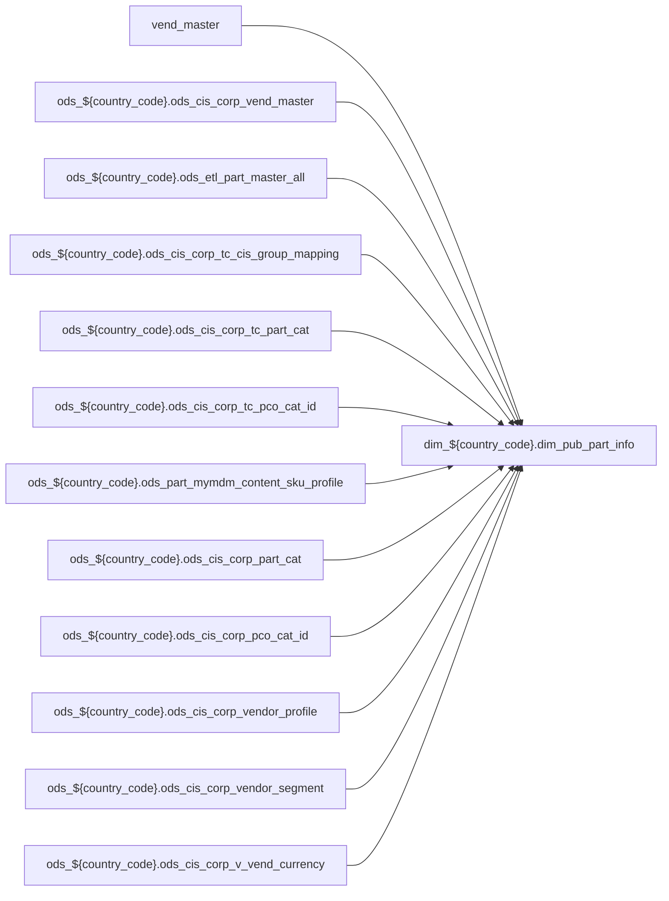

# DIM: `dim_pub_part_info`

- artifact_type: etl_table
- artifact_id: dim_${country_code}.dim_pub_part_info
- domain: pos
- one_line_purpose: ETL script `source/contracts/pos/bitbucket-etl/dim_pub_part_info/dim_pub_part_info.sql` loads `dim_${country_code}.dim_pub_part_info` (layer `DIM`). Purpose inferred from SQL only.
- layer_type: DIM
- source_kind: etl_sql
- evidence_source: source/contracts/pos/bitbucket-etl/dim_pub_part_info/dim_pub_part_info.sql
- bitbucket_etl_bundle: source/contracts/pos/bitbucket-etl/dim_pub_part_info/

---

## L1 Data Foundation

### Identity and physical mapping
- **Table:** `dim_${country_code}.dim_pub_part_info`
- **Layer type:** DIM
- **Canonical / derived:** Derived / ETL-loaded (see L3)
- **Owner team:** Not documented in repository

### Grain, scope, exclusions
- **Grain:** Not documented in repository (see SELECT/GROUP BY in `source/contracts/pos/bitbucket-etl/dim_pub_part_info/dim_pub_part_info.sql`)
- **Partition:** `See L4 / ETL partition clause`
- **Exclusions:** See L3 Key filters

### Cross-engine presence
| Engine | Present | Canonical FQN | Notes |
|--------|---------|---------------|-------|
| Hive | yes | `dim_${country_code}.dim_pub_part_info` | ETL target |
| Vertica | Not documented in repository | — | Confirm via hive2vertica flow |

### Physical schema reference

Pointer block only - full column catalog lives in WKB L1 storage JSON.

| Field | Value |
|-------|-------|
| **Authoritative catalog** | WKB L1 storage seed (not duplicated in this file) |
| **entity_id** | `dim_${country_code}.dim_pub_part_info` |
| **l1_catalog_seed** | `target/storage/wkb/snapshots/_snapshot_id_template/l1_catalog/{engine}_{schema}_{table}.json` |
| **column_count** | pending (run ddl_seed_writer) |
| **partition_keys** | `See L4 / ETL partition clause` |
| **ddl_source** | pending Bitbucket DDL / Vertica metadata ingest |
| **retrieval** | `python -m tools.wkb.indexing.run_query --query "pos dim_pub_part_info schema" --intent find_table_schema` |

### Lineage

- **Primary load:** `source/contracts/pos/bitbucket-etl/dim_pub_part_info/dim_pub_part_info.sql`
- **upstream:** `vend_master` — FROM/JOIN — `source/contracts/pos/bitbucket-etl/dim_pub_part_info/dim_pub_part_info.sql`
- **upstream:** `ods_${country_code}.ods_cis_corp_vend_master` — FROM/JOIN — `source/contracts/pos/bitbucket-etl/dim_pub_part_info/dim_pub_part_info.sql`
- **upstream:** `ods_${country_code}.ods_etl_part_master_all` — FROM/JOIN — `source/contracts/pos/bitbucket-etl/dim_pub_part_info/dim_pub_part_info.sql`
- **upstream:** `ods_${country_code}.ods_cis_corp_tc_cis_group_mapping` — FROM/JOIN — `source/contracts/pos/bitbucket-etl/dim_pub_part_info/dim_pub_part_info.sql`
- **upstream:** `ods_${country_code}.ods_cis_corp_tc_part_cat` — FROM/JOIN — `source/contracts/pos/bitbucket-etl/dim_pub_part_info/dim_pub_part_info.sql`
- **upstream:** `ods_${country_code}.ods_cis_corp_tc_pco_cat_id` — FROM/JOIN — `source/contracts/pos/bitbucket-etl/dim_pub_part_info/dim_pub_part_info.sql`
- **upstream:** `ods_${country_code}.ods_part_mymdm_content_sku_profile` — FROM/JOIN — `source/contracts/pos/bitbucket-etl/dim_pub_part_info/dim_pub_part_info.sql`
- **upstream:** `ods_${country_code}.ods_cis_corp_part_cat` — FROM/JOIN — `source/contracts/pos/bitbucket-etl/dim_pub_part_info/dim_pub_part_info.sql`
- **upstream:** `ods_${country_code}.ods_cis_corp_pco_cat_id` — FROM/JOIN — `source/contracts/pos/bitbucket-etl/dim_pub_part_info/dim_pub_part_info.sql`
- **upstream:** `ods_${country_code}.ods_cis_corp_vendor_profile` — FROM/JOIN — `source/contracts/pos/bitbucket-etl/dim_pub_part_info/dim_pub_part_info.sql`
- **upstream:** `ods_${country_code}.ods_cis_corp_vendor_segment` — FROM/JOIN — `source/contracts/pos/bitbucket-etl/dim_pub_part_info/dim_pub_part_info.sql`
- **upstream:** `ods_${country_code}.ods_cis_corp_v_vend_currency` — FROM/JOIN — `source/contracts/pos/bitbucket-etl/dim_pub_part_info/dim_pub_part_info.sql`
- **upstream:** `temp_family` — FROM/JOIN — `source/contracts/pos/bitbucket-etl/dim_pub_part_info/dim_pub_part_info.sql`
- **upstream:** `ods_${country_code}.ods_cis_corp_tc_part_prod_cat` — FROM/JOIN — `source/contracts/pos/bitbucket-etl/dim_pub_part_info/dim_pub_part_info.sql`
- **upstream:** `temp_tc_faimly` — FROM/JOIN — `source/contracts/pos/bitbucket-etl/dim_pub_part_info/dim_pub_part_info.sql`
- **upstream:** `ods_${country_code}.ods_cis_corp_dw_vend_pl` — FROM/JOIN — `source/contracts/pos/bitbucket-etl/dim_pub_part_info/dim_pub_part_info.sql`
- **upstream:** `temp_vend_company_no` — FROM/JOIN — `source/contracts/pos/bitbucket-etl/dim_pub_part_info/dim_pub_part_info.sql`
- **upstream:** `tmp_v_vend_currency` — FROM/JOIN — `source/contracts/pos/bitbucket-etl/dim_pub_part_info/dim_pub_part_info.sql`
- **upstream:** `temp_vend_profile` — FROM/JOIN — `source/contracts/pos/bitbucket-etl/dim_pub_part_info/dim_pub_part_info.sql`
- **upstream:** `ods_${country_code}.ods_cis_corp_manager` — FROM/JOIN — `source/contracts/pos/bitbucket-etl/dim_pub_part_info/dim_pub_part_info.sql`
- **downstream:** see L6 Downstream consumers
### Freshness and load path
| Item | Value |
|------|-------|
| Load pattern | See L3 INSERT / OVERWRITE in evidence script |
| Schedule | Not documented in repository |
| Parameters | Parsed from ETL literals / `${...}` in `source/contracts/pos/bitbucket-etl/dim_pub_part_info/dim_pub_part_info.sql` |

## L2 Declarative Knowledge

### Business purpose
ETL script `source/contracts/pos/bitbucket-etl/dim_pub_part_info/dim_pub_part_info.sql` loads `dim_${country_code}.dim_pub_part_info` (layer `DIM`). Purpose inferred from SQL only.

### Audience and use cases
| Audience | How they benefit |
|----------|-----------------|
| Data / BI consumers | Use target table produced by this ETL |
| Data Engineering | Maintain load logic in evidence script |

### Fact key resolution
- Keys follow target INSERT column list / GROUP BY in evidence SQL.

### Time field semantics
- Partition / date fields: `See L4 / ETL partition clause`

### Metrics served
- See L3 column derivations for measure expressions when present.

### Metric serving map
N/A — not a multi-period wide serving table (or not documented).

### etl_metrics
No calculable business metrics registered in metric-index for this create run.

## L3 Procedural Knowledge

### Query and routing rules
- Prefer querying the target `dim_${country_code}.dim_pub_part_info` after successful ETL load.

### Dimension join patterns
- See Relationship map and Base tables register.

### Key filters and ETL business logic

| Predicate | Kind | Evidence |
|-----------|------|----------|
| `fam.cat_type = 'FAM' )t inner join ods_${country_code}.ods_cis_corp_pco_cat_id cat on t.cat_id = cat.cat_id inner join ods_${country_code}.ods_cis_corp_pco_cat_id scat on t.subcat_id = scat.cat_id;...` | Business | `source/contracts/pos/bitbucket-etl/dim_pub_part_info/dim_pub_part_info.sql` |
| `length(trim(nvl(image_name,'')))>0` | Business | `source/contracts/pos/bitbucket-etl/dim_pub_part_info/dim_pub_part_info.sql` |
| `xref_type ='ACCESSORY' and active ='Y'` | Business | `source/contracts/pos/bitbucket-etl/dim_pub_part_info/dim_pub_part_info.sql` |
| `ct.xref_type = 'COO' and ct.active = 'Y'` | Business | `source/contracts/pos/bitbucket-etl/dim_pub_part_info/dim_pub_part_info.sql` |
| `csp.profile_type = 'PCODE' and csp.profile_cat ='SKU' and csp.active='Y'` | Business | `source/contracts/pos/bitbucket-etl/dim_pub_part_info/dim_pub_part_info.sql` |

### Standard time-filter SQL
```sql
-- See partition / date predicates in source/contracts/pos/bitbucket-etl/dim_pub_part_info/dim_pub_part_info.sql
```

### End-to-end flow



### Base tables register

| Object | Role |
|--------|------|
| `vend_master` | source / temp (from ETL FROM/JOIN) |
| `ods_${country_code}.ods_cis_corp_vend_master` | source / temp (from ETL FROM/JOIN) |
| `ods_${country_code}.ods_etl_part_master_all` | source / temp (from ETL FROM/JOIN) |
| `ods_${country_code}.ods_cis_corp_tc_cis_group_mapping` | source / temp (from ETL FROM/JOIN) |
| `ods_${country_code}.ods_cis_corp_tc_part_cat` | source / temp (from ETL FROM/JOIN) |
| `ods_${country_code}.ods_cis_corp_tc_pco_cat_id` | source / temp (from ETL FROM/JOIN) |
| `ods_${country_code}.ods_part_mymdm_content_sku_profile` | source / temp (from ETL FROM/JOIN) |
| `ods_${country_code}.ods_cis_corp_part_cat` | source / temp (from ETL FROM/JOIN) |
| `ods_${country_code}.ods_cis_corp_pco_cat_id` | source / temp (from ETL FROM/JOIN) |
| `ods_${country_code}.ods_cis_corp_vendor_profile` | source / temp (from ETL FROM/JOIN) |
| `ods_${country_code}.ods_cis_corp_vendor_segment` | source / temp (from ETL FROM/JOIN) |
| `ods_${country_code}.ods_cis_corp_v_vend_currency` | source / temp (from ETL FROM/JOIN) |
| `temp_family` | source / temp (from ETL FROM/JOIN) |
| `ods_${country_code}.ods_cis_corp_tc_part_prod_cat` | source / temp (from ETL FROM/JOIN) |
| `temp_tc_faimly` | source / temp (from ETL FROM/JOIN) |
| `ods_${country_code}.ods_cis_corp_dw_vend_pl` | source / temp (from ETL FROM/JOIN) |
| `temp_vend_company_no` | source / temp (from ETL FROM/JOIN) |
| `tmp_v_vend_currency` | source / temp (from ETL FROM/JOIN) |
| `temp_vend_profile` | source / temp (from ETL FROM/JOIN) |
| `ods_${country_code}.ods_cis_corp_manager` | source / temp (from ETL FROM/JOIN) |
| `temp_arr_xaas` | source / temp (from ETL FROM/JOIN) |
| `ods_gbl.ods_cis_mygbl_global_part_cat` | source / temp (from ETL FROM/JOIN) |
| `ods_gbl.ods_cis_mygbl_global_pco_cat_id` | source / temp (from ETL FROM/JOIN) |
| `tmp_dim_pub_part_info_partadd` | source / temp (from ETL FROM/JOIN) |
| `ods_${country_code}.ods_cis_corp_ec_category_name` | source / temp (from ETL FROM/JOIN) |
| `dim_${country_code}.dim_pub_part_prod_cat` | source / temp (from ETL FROM/JOIN) |
| `temp_global_cat` | source / temp (from ETL FROM/JOIN) |
| `ods_${country_code}.ods_cis_corp_tc_images` | source / temp (from ETL FROM/JOIN) |
| `ods_${country_code}.ods_etl_sku_xref_all` | source / temp (from ETL FROM/JOIN) |
| `ods_${country_code}.ods_etl_tc_part_technotes_en_all` | source / temp (from ETL FROM/JOIN) |
| `ods_${country_code}.ods_cis_corp_country_code` | source / temp (from ETL FROM/JOIN) |
| `ods_gbl.ods_cis_mygbl_pcode_list` | source / temp (from ETL FROM/JOIN) |
| `ods_${country_code}.ods_etl_sku_profile_all` | source / temp (from ETL FROM/JOIN) |
| `ods_gbl.ods_cis_mygbl_prodcat_cis_sku` | source / temp (from ETL FROM/JOIN) |
| `ods_${country_code}.ods_cis_corp_app_config` | source / temp (from ETL FROM/JOIN) |
| `ods_${country_code}.ods_cis_corp_tc_part_technotes_en` | source / temp (from ETL FROM/JOIN) |
| `temp_uni_sku_no` | source / temp (from ETL FROM/JOIN) |
| `ods_gbl.ods_cis_mygbl_prodcat_uni_sku` | source / temp (from ETL FROM/JOIN) |
| `ods_${country_code}.ods_vendor_mymdm_content_vendor_profile` | source / temp (from ETL FROM/JOIN) |
| `ods_cis_corp_pdss_prod_profile` | source / temp (from ETL FROM/JOIN) |
| `ods_${country_code}.ods_cis_corp_pdss_prod_profile` | source / temp (from ETL FROM/JOIN) |
| `prod_code_detail` | source / temp (from ETL FROM/JOIN) |
| `ods_${country_code}.ods_cis_corp_prod_code_detail` | source / temp (from ETL FROM/JOIN) |
| `ods_${country_code}.ods_cis_corp_part_prod_detail` | source / temp (from ETL FROM/JOIN) |
| `ods_${country_code}.ods_cis_corp_sku_extension` | source / temp (from ETL FROM/JOIN) |
| `temp_sku_extension` | source / temp (from ETL FROM/JOIN) |
| `ods_${country_code}.ods_part_mymdm_sku_attr_option_values` | source / temp (from ETL FROM/JOIN) |
| `tmp_dim_pub_part_info_profile_image` | source / temp (from ETL FROM/JOIN) |
| `tmp_dim_pub_part_info_profile_accessory` | source / temp (from ETL FROM/JOIN) |
| `tmp_dim_pub_part_info_profile_fill` | source / temp (from ETL FROM/JOIN) |
| `coo_tmp` | source / temp (from ETL FROM/JOIN) |
| `temp_sku_pcode` | source / temp (from ETL FROM/JOIN) |
| `temp_part_sku_profile` | source / temp (from ETL FROM/JOIN) |
| `temp_tc_fill_count` | source / temp (from ETL FROM/JOIN) |
| `temp_forecast_cat` | source / temp (from ETL FROM/JOIN) |
| `temp_pp_code_data_no` | source / temp (from ETL FROM/JOIN) |
| `tmpe_sku_item_desc` | source / temp (from ETL FROM/JOIN) |
| `tmp_sku_no_merge` | source / temp (from ETL FROM/JOIN) |
| `tmp_dim_pub_part_info_category` | source / temp (from ETL FROM/JOIN) |
| `ods_${country_code}.ods_cis_corp_tc_mkt_en` | source / temp (from ETL FROM/JOIN) |
| `ods_${country_code}.ods_cis_corp_part_qc_status` | source / temp (from ETL FROM/JOIN) |
| `ods_${country_code}.ods_etl_cws_part_all` | source / temp (from ETL FROM/JOIN) |
| `ods_${country_code}.ods_etl_vend_part_no_all` | source / temp (from ETL FROM/JOIN) |
| `temp_uni_group` | source / temp (from ETL FROM/JOIN) |
| `temp_vendor_pcode` | source / temp (from ETL FROM/JOIN) |
| `temp_sku_merge_field` | source / temp (from ETL FROM/JOIN) |

### Step-by-step logic
1. Read sources listed in Base tables register (`source/contracts/pos/bitbucket-etl/dim_pub_part_info/dim_pub_part_info.sql`).
2. Apply filters documented under Key filters.
3. INSERT OVERWRITE / write target `dim_${country_code}.dim_pub_part_info`.

### Relationship map (embedded)

| from_fqn | to_fqn | cardinality | join_keys | provenance |
|----------|--------|-------------|-----------|------------|
| `ods_${country_code}.ods_etl_part_master_all` | `ods_${country_code}.ods_cis_corp_tc_cis_group_mapping` | many:1 (LEFT) | `a.group_id` = `b.cis_group_id` | etl_sql (`source/contracts/pos/bitbucket-etl/dim_pub_part_info/dim_pub_part_info.sql:27`) |
| `ods_${country_code}.ods_cis_corp_tc_cis_group_mapping` | `ods_${country_code}.ods_cis_corp_tc_part_cat` | many:1 (LEFT) | `b.tc_group_id` = `c.group_id` | etl_sql (`source/contracts/pos/bitbucket-etl/dim_pub_part_info/dim_pub_part_info.sql:29`) |
| `ods_${country_code}.ods_cis_corp_tc_part_cat` | `ods_${country_code}.ods_cis_corp_tc_pco_cat_id` | many:1 (LEFT) | `c.family_id` = `d.cat_id` | etl_sql (`source/contracts/pos/bitbucket-etl/dim_pub_part_info/dim_pub_part_info.sql:31`) |
| `ods_${country_code}.ods_cis_corp_tc_part_cat` | `ods_${country_code}.ods_cis_corp_tc_pco_cat_id` | many:1 (LEFT) | `c.cat_id` = `e.cat_id` | etl_sql (`source/contracts/pos/bitbucket-etl/dim_pub_part_info/dim_pub_part_info.sql:33`) |
| `ods_${country_code}.ods_cis_corp_tc_part_cat` | `ods_${country_code}.ods_cis_corp_tc_pco_cat_id` | many:1 (LEFT) | `c.subcat_id` = `f.cat_id` | etl_sql (`source/contracts/pos/bitbucket-etl/dim_pub_part_info/dim_pub_part_info.sql:35`) |
| `ods_gbl.ods_cis_mygbl_global_part_cat` | `ods_${country_code}.ods_cis_corp_pco_cat_id` | many:1 | `gpc.family_id` = `fam.cat_id` | etl_sql (`source/contracts/pos/bitbucket-etl/dim_pub_part_info/dim_pub_part_info.sql:66`) |
| `t` | `ods_${country_code}.ods_cis_corp_pco_cat_id` | many:1 | `t.cat_id` = `cat.cat_id` | etl_sql (`source/contracts/pos/bitbucket-etl/dim_pub_part_info/dim_pub_part_info.sql:71`) |
| `t` | `ods_${country_code}.ods_cis_corp_pco_cat_id` | many:1 | `t.subcat_id` = `scat.cat_id` | etl_sql (`source/contracts/pos/bitbucket-etl/dim_pub_part_info/dim_pub_part_info.sql:73`) |
| `ods_${country_code}.ods_cis_corp_vend_master` | `ods_${country_code}.ods_cis_corp_vendor_segment` | many:1 (LEFT) | cast(vp.profile_c as varchar(3)) = vs.seg_code | etl_sql (`source/contracts/pos/bitbucket-etl/dim_pub_part_info/dim_pub_part_info.sql:101`) |
| `ods_${country_code}.ods_etl_part_master_all` | `ods_${country_code}.ods_cis_corp_part_cat` | many:1 (LEFT) | `a.group_id` = `gpc.group_id` | etl_sql (`source/contracts/pos/bitbucket-etl/dim_pub_part_info/dim_pub_part_info.sql:218`) |
| `ods_${country_code}.ods_etl_part_master_all` | `temp_family` | many:1 (LEFT) | `a.group_id` = `tf.group_id` | etl_sql (`source/contracts/pos/bitbucket-etl/dim_pub_part_info/dim_pub_part_info.sql:219`) |
| `ods_${country_code}.ods_cis_corp_vend_master` | `ods_${country_code}.ods_cis_corp_tc_part_prod_cat` | many:1 (LEFT) | — | etl_sql (`source/contracts/pos/bitbucket-etl/dim_pub_part_info/dim_pub_part_info.sql:221`) |
| `ods_${country_code}.ods_etl_part_master_all` | `ods_${country_code}.ods_cis_corp_tc_cis_group_mapping` | many:1 (LEFT) | `a.group_id` = `tcgm.cis_group_id` | etl_sql (`source/contracts/pos/bitbucket-etl/dim_pub_part_info/dim_pub_part_info.sql:223`) |
| `ods_${country_code}.ods_etl_part_master_all` | `temp_tc_faimly` | many:1 (LEFT) | `a.sku_no` = `tc.sku_no` | etl_sql (`source/contracts/pos/bitbucket-etl/dim_pub_part_info/dim_pub_part_info.sql:225`) |
| `ods_${country_code}.ods_etl_part_master_all` | `ods_${country_code}.ods_cis_corp_dw_vend_pl` | many:1 (LEFT) | `a.vpl_no` = `dvl.vpl_no` | etl_sql (`source/contracts/pos/bitbucket-etl/dim_pub_part_info/dim_pub_part_info.sql:227`) |
| `ods_${country_code}.ods_etl_part_master_all` | `temp_vend_company_no` | many:1 (LEFT) | `a.vend_no` = `vm.vend_no` | etl_sql (`source/contracts/pos/bitbucket-etl/dim_pub_part_info/dim_pub_part_info.sql:229`) |
| `ods_${country_code}.ods_etl_part_master_all` | `tmp_v_vend_currency` | many:1 (LEFT) | `a.vend_no` = `vvc.vend_no` | etl_sql (`source/contracts/pos/bitbucket-etl/dim_pub_part_info/dim_pub_part_info.sql:231`) |
| `ods_${country_code}.ods_etl_part_master_all` | `temp_vend_profile` | many:1 (LEFT) | `a.vend_no` = `vp.vend_no` | etl_sql (`source/contracts/pos/bitbucket-etl/dim_pub_part_info/dim_pub_part_info.sql:233`) |
| `ods_${country_code}.ods_cis_corp_dw_vend_pl` | `ods_${country_code}.ods_cis_corp_dw_vend_pl` | many:1 (LEFT) | `dvl.alt_vpl_no` = `advl.vpl_no` | etl_sql (`source/contracts/pos/bitbucket-etl/dim_pub_part_info/dim_pub_part_info.sql:235`) |
| `ods_${country_code}.ods_etl_part_master_all` | `ods_${country_code}.ods_cis_corp_manager` | many:1 (LEFT) | `a.entry_id` = `cbm.userid` | etl_sql (`source/contracts/pos/bitbucket-etl/dim_pub_part_info/dim_pub_part_info.sql:237`) |
| `ods_${country_code}.ods_etl_part_master_all` | `temp_arr_xaas` | many:1 (LEFT) | `a.sku_no` = `ax.sku_no` | etl_sql (`source/contracts/pos/bitbucket-etl/dim_pub_part_info/dim_pub_part_info.sql:240`) |
| `ods_gbl.ods_cis_mygbl_global_part_cat` | `ods_gbl.ods_cis_mygbl_global_pco_cat_id` | many:1 | `gpc.family_id` = `gpci.cat_id` | etl_sql (`source/contracts/pos/bitbucket-etl/dim_pub_part_info/dim_pub_part_info.sql:251`) |
| `ods_gbl.ods_cis_mygbl_global_part_cat` | `ods_gbl.ods_cis_mygbl_global_pco_cat_id` | many:1 | `gpc.cat_id` = `cat.cat_id` | etl_sql (`source/contracts/pos/bitbucket-etl/dim_pub_part_info/dim_pub_part_info.sql:254`) |
| `ods_gbl.ods_cis_mygbl_global_part_cat` | `ods_gbl.ods_cis_mygbl_global_pco_cat_id` | many:1 (LEFT) | `gpc.subcat_id` = `scat.cat_id` | etl_sql (`source/contracts/pos/bitbucket-etl/dim_pub_part_info/dim_pub_part_info.sql:257`) |
| `tmp_dim_pub_part_info_profile_accessory` | `ods_${country_code}.ods_cis_corp_tc_part_prod_cat` | many:1 (LEFT) | `pa.sku_no` = `ppc.sku_no` | etl_sql (`source/contracts/pos/bitbucket-etl/dim_pub_part_info/dim_pub_part_info.sql:287`) |
| `ods_${country_code}.ods_cis_corp_tc_part_prod_cat` | `ods_${country_code}.ods_cis_corp_manager` | many:1 (LEFT) | `cater.userid` = `ppc.entry_id` | etl_sql (`source/contracts/pos/bitbucket-etl/dim_pub_part_info/dim_pub_part_info.sql:289`) |
| `ods_${country_code}.ods_cis_corp_tc_part_prod_cat` | `ods_${country_code}.ods_cis_corp_manager` | many:1 (LEFT) | `moder.userid` = `ppc.last_modifier` | etl_sql (`source/contracts/pos/bitbucket-etl/dim_pub_part_info/dim_pub_part_info.sql:291`) |
| `tmp_dim_pub_part_info_profile_accessory` | `ods_${country_code}.ods_cis_corp_ec_category_name` | many:1 (LEFT) | `pa.group_id` = `ecn.group_id` | etl_sql (`source/contracts/pos/bitbucket-etl/dim_pub_part_info/dim_pub_part_info.sql:293`) |
| `tmp_dim_pub_part_info_profile_accessory` | `ods_gbl.ods_cis_mygbl_global_part_cat` | many:1 (LEFT) | `pa.group_id` = `gpc.group_id` | etl_sql (`source/contracts/pos/bitbucket-etl/dim_pub_part_info/dim_pub_part_info.sql:296`) |
| `tmp_dim_pub_part_info_profile_accessory` | `dim_${country_code}.dim_pub_part_prod_cat` | many:1 (LEFT) | `pa.group_id` = `dppc.group_id` | etl_sql (`source/contracts/pos/bitbucket-etl/dim_pub_part_info/dim_pub_part_info.sql:298`) |
| `tmp_dim_pub_part_info_profile_accessory` | `temp_global_cat` | many:1 (LEFT) | `pa.group_id` = `tgc.group_id` | etl_sql (`source/contracts/pos/bitbucket-etl/dim_pub_part_info/dim_pub_part_info.sql:300`) |
| `ods_${country_code}.ods_etl_sku_xref_all` | `ods_${country_code}.ods_cis_corp_country_code` | many:1 | `ct.xref` = `cc.country_code` | etl_sql (`source/contracts/pos/bitbucket-etl/dim_pub_part_info/dim_pub_part_info.sql:334`) |
| `ods_${country_code}.ods_part_mymdm_content_sku_profile` | `ods_gbl.ods_cis_mygbl_pcode_list` | many:1 (LEFT) | `csp.profile_c` = `pl.pcode` | etl_sql (`source/contracts/pos/bitbucket-etl/dim_pub_part_info/dim_pub_part_info.sql:346`) |
| `temp_uni_sku_no` | `ods_gbl.ods_cis_mygbl_prodcat_uni_sku` | many:1 (LEFT) | `usn.uni_sku_no` = `pus.uni_sku_no` | etl_sql (`source/contracts/pos/bitbucket-etl/dim_pub_part_info/dim_pub_part_info.sql:420`) |
| `ods_${country_code}.ods_vendor_mymdm_content_vendor_profile` | `ods_gbl.ods_cis_mygbl_pcode_list` | many:1 (LEFT) | `cvp.profile_c` = `pl.pcode` | etl_sql (`source/contracts/pos/bitbucket-etl/dim_pub_part_info/dim_pub_part_info.sql:430`) |
| `temp_pp_code_data_no` | `ods_${country_code}.ods_cis_corp_part_prod_detail` | many:1 | `ppd.data_no` = `pcd.data_no`; `pcd.prod_code` = `ppd.prod_code`; `pcd.col_no` = `ppd.col_no` | etl_sql (`source/contracts/pos/bitbucket-etl/dim_pub_part_info/dim_pub_part_info.sql:454`) |
| `se` | `ods_${country_code}.ods_part_mymdm_sku_attr_option_values` | many:1 | `se.item_type` = `mdm_sku.attr_value` | etl_sql (`source/contracts/pos/bitbucket-etl/dim_pub_part_info/dim_pub_part_info.sql:473`) |
| `tsn` | `tmp_dim_pub_part_info_profile_image` | many:1 (LEFT) | `tsn.sku_no` = `pro.sku_no` | etl_sql (`source/contracts/pos/bitbucket-etl/dim_pub_part_info/dim_pub_part_info.sql:535`) |
| `tsn` | `tmp_dim_pub_part_info_profile_accessory` | many:1 (LEFT) | `tsn.sku_no` = `pa.sku_no` | etl_sql (`source/contracts/pos/bitbucket-etl/dim_pub_part_info/dim_pub_part_info.sql:537`) |
| `tsn` | `tmp_dim_pub_part_info_profile_fill` | many:1 (LEFT) | `tsn.sku_no` = `pf.sku_no` | etl_sql (`source/contracts/pos/bitbucket-etl/dim_pub_part_info/dim_pub_part_info.sql:539`) |
| `tsn` | `coo_tmp` | many:1 (LEFT) | `tsn.sku_no` = `co.sku_no` | etl_sql (`source/contracts/pos/bitbucket-etl/dim_pub_part_info/dim_pub_part_info.sql:541`) |
| `tsn` | `temp_sku_pcode` | many:1 (LEFT) | `tsn.sku_no` = `tsp.sku_no` | etl_sql (`source/contracts/pos/bitbucket-etl/dim_pub_part_info/dim_pub_part_info.sql:543`) |
| `tsn` | `temp_part_sku_profile` | many:1 (LEFT) | `tsn.sku_no` = `psp.sku_no` | etl_sql (`source/contracts/pos/bitbucket-etl/dim_pub_part_info/dim_pub_part_info.sql:545`) |
| `tsn` | `temp_tc_fill_count` | many:1 (LEFT) | `tsn.sku_no` = `fc.sku_no` | etl_sql (`source/contracts/pos/bitbucket-etl/dim_pub_part_info/dim_pub_part_info.sql:547`) |
| `tsn` | `temp_forecast_cat` | many:1 (LEFT) | `tsn.sku_no` = `tfc.sku_no` | etl_sql (`source/contracts/pos/bitbucket-etl/dim_pub_part_info/dim_pub_part_info.sql:549`) |
| `tsn` | `temp_pp_code_data_no` | many:1 (LEFT) | `tsn.sku_no` = `pcd.sku_no` | etl_sql (`source/contracts/pos/bitbucket-etl/dim_pub_part_info/dim_pub_part_info.sql:551`) |
| `tsn` | `temp_sku_extension` | many:1 (LEFT) | `tsn.sku_no` = `tse.sku_no` | etl_sql (`source/contracts/pos/bitbucket-etl/dim_pub_part_info/dim_pub_part_info.sql:553`) |
| `tsn` | `tmpe_sku_item_desc` | many:1 (LEFT) | `tsn.sku_no` = `sid.sku_no` | etl_sql (`source/contracts/pos/bitbucket-etl/dim_pub_part_info/dim_pub_part_info.sql:555`) |
| `pic` | `ods_${country_code}.ods_cis_corp_tc_mkt_en` | many:1 (LEFT) | `pic.sku_no` = `tme.sku_no` | etl_sql (`source/contracts/pos/bitbucket-etl/dim_pub_part_info/dim_pub_part_info.sql:712`) |
| `pic` | `ods_${country_code}.ods_cis_corp_part_qc_status` | many:1 (LEFT) | `pic.sku_no` = `pqs.sku_no` | etl_sql (`source/contracts/pos/bitbucket-etl/dim_pub_part_info/dim_pub_part_info.sql:716`) |
| `pic` | `ods_${country_code}.ods_cis_corp_tc_images` | many:1 (LEFT) | `pic.sku_no` = `ti.sku_no` | etl_sql (`source/contracts/pos/bitbucket-etl/dim_pub_part_info/dim_pub_part_info.sql:720`) |
| `pic` | `ods_${country_code}.ods_etl_cws_part_all` | many:1 (LEFT) | `pic.sku_no` = `cccp.sku_no` | etl_sql (`source/contracts/pos/bitbucket-etl/dim_pub_part_info/dim_pub_part_info.sql:724`) |
| `pic` | `ods_${country_code}.ods_etl_vend_part_no_all` | many:1 (LEFT) | `pic.sku_no` = `vpn.sku_no` | etl_sql (`source/contracts/pos/bitbucket-etl/dim_pub_part_info/dim_pub_part_info.sql:726`) |
| `pic` | `ods_gbl.ods_cis_mygbl_global_part_cat` | many:1 (LEFT) | `pic.group_id` = `gpc.group_id` | etl_sql (`source/contracts/pos/bitbucket-etl/dim_pub_part_info/dim_pub_part_info.sql:728`) |
| `pic` | `temp_sku_pcode` | many:1 (LEFT) | `pic.sku_no` = `tsp.sku_no` | etl_sql (`source/contracts/pos/bitbucket-etl/dim_pub_part_info/dim_pub_part_info.sql:730`) |
| `ods_gbl.ods_cis_mygbl_global_part_cat` | `ods_gbl.ods_cis_mygbl_pcode_list` | many:1 (LEFT) | `gpc.pcode` = `pl.pcode` | etl_sql (`source/contracts/pos/bitbucket-etl/dim_pub_part_info/dim_pub_part_info.sql:732`) |
| `pic` | `temp_uni_sku_no` | many:1 (LEFT) | `pic.sku_no` = `usn.sku_no` | etl_sql (`source/contracts/pos/bitbucket-etl/dim_pub_part_info/dim_pub_part_info.sql:734`) |
| `pic` | `temp_uni_group` | many:1 (LEFT) | `pic.sku_no` = `tcg.sku_no` | etl_sql (`source/contracts/pos/bitbucket-etl/dim_pub_part_info/dim_pub_part_info.sql:736`) |
| `pic` | `temp_vendor_pcode` | many:1 (LEFT) | `pic.vend_no` = `tvp.vend_no` | etl_sql (`source/contracts/pos/bitbucket-etl/dim_pub_part_info/dim_pub_part_info.sql:738`) |
| `pic` | `temp_sku_merge_field` | many:1 (LEFT) | `pic.sku_no` = `tsm.sku_no` | etl_sql (`source/contracts/pos/bitbucket-etl/dim_pub_part_info/dim_pub_part_info.sql:740`) |

### Special logic (embedded)

`source/ref/pos/special_logic.txt` exists but no rule naming this FQN/stem (`dim_${country_code}.dim_pub_part_info`).

Not documented in repository


### Column / field derivations (from ETL SQL)

| target_column | expression_sql | upstream_columns | upstream_tables | transform_kind | evidence |
|---------------|----------------|------------------|-----------------|----------------|----------|
| `sku_no` | `pic.sku_no` | `sku_no` | `tmp_dim_pub_part_info_category`, `ods_${country_code}.ods_cis_corp_tc_mkt_en`, `ods_${country_code}.ods_cis_corp_part_qc_status`, `ods_${country_code}.ods_cis_corp_tc_images`, `ods_${country_code}.ods_etl_cws_part_all`, `ods_${country_code}.ods_etl_vend_part_no_all`, `ods_gbl.ods_cis_mygbl_global_part_cat`, `temp_sku_pcode`, `ods_gbl.ods_cis_mygbl_pcode_list`, `temp_uni_sku_no`, `temp_uni_group`, `temp_vendor_pcode` | passthrough | `source/contracts/pos/bitbucket-etl/dim_pub_part_info/dim_pub_part_info.sql:561` |
| `part_no` | `pic.part_no` | `part_no` | `tmp_dim_pub_part_info_category`, `ods_${country_code}.ods_cis_corp_tc_mkt_en`, `ods_${country_code}.ods_cis_corp_part_qc_status`, `ods_${country_code}.ods_cis_corp_tc_images`, `ods_${country_code}.ods_etl_cws_part_all`, `ods_${country_code}.ods_etl_vend_part_no_all`, `ods_gbl.ods_cis_mygbl_global_part_cat`, `temp_sku_pcode`, `ods_gbl.ods_cis_mygbl_pcode_list`, `temp_uni_sku_no`, `temp_uni_group`, `temp_vendor_pcode` | passthrough | `source/contracts/pos/bitbucket-etl/dim_pub_part_info/dim_pub_part_info.sql:562` |
| `short_desc` | `pic.short_desc` | `short_desc` | `tmp_dim_pub_part_info_category`, `ods_${country_code}.ods_cis_corp_tc_mkt_en`, `ods_${country_code}.ods_cis_corp_part_qc_status`, `ods_${country_code}.ods_cis_corp_tc_images`, `ods_${country_code}.ods_etl_cws_part_all`, `ods_${country_code}.ods_etl_vend_part_no_all`, `ods_gbl.ods_cis_mygbl_global_part_cat`, `temp_sku_pcode`, `ods_gbl.ods_cis_mygbl_pcode_list`, `temp_uni_sku_no`, `temp_uni_group`, `temp_vendor_pcode` | passthrough | `source/contracts/pos/bitbucket-etl/dim_pub_part_info/dim_pub_part_info.sql:563` |
| `long_desc` | `pic.long_desc` | `long_desc` | `tmp_dim_pub_part_info_category`, `ods_${country_code}.ods_cis_corp_tc_mkt_en`, `ods_${country_code}.ods_cis_corp_part_qc_status`, `ods_${country_code}.ods_cis_corp_tc_images`, `ods_${country_code}.ods_etl_cws_part_all`, `ods_${country_code}.ods_etl_vend_part_no_all`, `ods_gbl.ods_cis_mygbl_global_part_cat`, `temp_sku_pcode`, `ods_gbl.ods_cis_mygbl_pcode_list`, `temp_uni_sku_no`, `temp_uni_group`, `temp_vendor_pcode` | passthrough | `source/contracts/pos/bitbucket-etl/dim_pub_part_info/dim_pub_part_info.sql:564` |
| `abc_code` | `pic.abc_code` | `abc_code` | `tmp_dim_pub_part_info_category`, `ods_${country_code}.ods_cis_corp_tc_mkt_en`, `ods_${country_code}.ods_cis_corp_part_qc_status`, `ods_${country_code}.ods_cis_corp_tc_images`, `ods_${country_code}.ods_etl_cws_part_all`, `ods_${country_code}.ods_etl_vend_part_no_all`, `ods_gbl.ods_cis_mygbl_global_part_cat`, `temp_sku_pcode`, `ods_gbl.ods_cis_mygbl_pcode_list`, `temp_uni_sku_no`, `temp_uni_group`, `temp_vendor_pcode` | passthrough | `source/contracts/pos/bitbucket-etl/dim_pub_part_info/dim_pub_part_info.sql:565` |
| `prod_code` | `pic.prod_code` | `prod_code` | `tmp_dim_pub_part_info_category`, `ods_${country_code}.ods_cis_corp_tc_mkt_en`, `ods_${country_code}.ods_cis_corp_part_qc_status`, `ods_${country_code}.ods_cis_corp_tc_images`, `ods_${country_code}.ods_etl_cws_part_all`, `ods_${country_code}.ods_etl_vend_part_no_all`, `ods_gbl.ods_cis_mygbl_global_part_cat`, `temp_sku_pcode`, `ods_gbl.ods_cis_mygbl_pcode_list`, `temp_uni_sku_no`, `temp_uni_group`, `temp_vendor_pcode` | passthrough | `source/contracts/pos/bitbucket-etl/dim_pub_part_info/dim_pub_part_info.sql:566` |
| `prod_type` | `pic.prod_type` | `prod_type` | `tmp_dim_pub_part_info_category`, `ods_${country_code}.ods_cis_corp_tc_mkt_en`, `ods_${country_code}.ods_cis_corp_part_qc_status`, `ods_${country_code}.ods_cis_corp_tc_images`, `ods_${country_code}.ods_etl_cws_part_all`, `ods_${country_code}.ods_etl_vend_part_no_all`, `ods_gbl.ods_cis_mygbl_global_part_cat`, `temp_sku_pcode`, `ods_gbl.ods_cis_mygbl_pcode_list`, `temp_uni_sku_no`, `temp_uni_group`, `temp_vendor_pcode` | passthrough | `source/contracts/pos/bitbucket-etl/dim_pub_part_info/dim_pub_part_info.sql:567` |
| `weight` | `pic.weight` | `weight` | `tmp_dim_pub_part_info_category`, `ods_${country_code}.ods_cis_corp_tc_mkt_en`, `ods_${country_code}.ods_cis_corp_part_qc_status`, `ods_${country_code}.ods_cis_corp_tc_images`, `ods_${country_code}.ods_etl_cws_part_all`, `ods_${country_code}.ods_etl_vend_part_no_all`, `ods_gbl.ods_cis_mygbl_global_part_cat`, `temp_sku_pcode`, `ods_gbl.ods_cis_mygbl_pcode_list`, `temp_uni_sku_no`, `temp_uni_group`, `temp_vendor_pcode` | passthrough | `source/contracts/pos/bitbucket-etl/dim_pub_part_info/dim_pub_part_info.sql:568` |
| `cu_height` | `pic.cu_height` | `cu_height` | `tmp_dim_pub_part_info_category`, `ods_${country_code}.ods_cis_corp_tc_mkt_en`, `ods_${country_code}.ods_cis_corp_part_qc_status`, `ods_${country_code}.ods_cis_corp_tc_images`, `ods_${country_code}.ods_etl_cws_part_all`, `ods_${country_code}.ods_etl_vend_part_no_all`, `ods_gbl.ods_cis_mygbl_global_part_cat`, `temp_sku_pcode`, `ods_gbl.ods_cis_mygbl_pcode_list`, `temp_uni_sku_no`, `temp_uni_group`, `temp_vendor_pcode` | passthrough | `source/contracts/pos/bitbucket-etl/dim_pub_part_info/dim_pub_part_info.sql:569` |
| `cu_width` | `pic.cu_width` | `cu_width` | `tmp_dim_pub_part_info_category`, `ods_${country_code}.ods_cis_corp_tc_mkt_en`, `ods_${country_code}.ods_cis_corp_part_qc_status`, `ods_${country_code}.ods_cis_corp_tc_images`, `ods_${country_code}.ods_etl_cws_part_all`, `ods_${country_code}.ods_etl_vend_part_no_all`, `ods_gbl.ods_cis_mygbl_global_part_cat`, `temp_sku_pcode`, `ods_gbl.ods_cis_mygbl_pcode_list`, `temp_uni_sku_no`, `temp_uni_group`, `temp_vendor_pcode` | passthrough | `source/contracts/pos/bitbucket-etl/dim_pub_part_info/dim_pub_part_info.sql:570` |
| `cu_length` | `pic.cu_length` | `cu_length` | `tmp_dim_pub_part_info_category`, `ods_${country_code}.ods_cis_corp_tc_mkt_en`, `ods_${country_code}.ods_cis_corp_part_qc_status`, `ods_${country_code}.ods_cis_corp_tc_images`, `ods_${country_code}.ods_etl_cws_part_all`, `ods_${country_code}.ods_etl_vend_part_no_all`, `ods_gbl.ods_cis_mygbl_global_part_cat`, `temp_sku_pcode`, `ods_gbl.ods_cis_mygbl_pcode_list`, `temp_uni_sku_no`, `temp_uni_group`, `temp_vendor_pcode` | passthrough | `source/contracts/pos/bitbucket-etl/dim_pub_part_info/dim_pub_part_info.sql:571` |
| `ser_no_flag` | `pic.ser_no_flag` | `ser_no_flag` | `tmp_dim_pub_part_info_category`, `ods_${country_code}.ods_cis_corp_tc_mkt_en`, `ods_${country_code}.ods_cis_corp_part_qc_status`, `ods_${country_code}.ods_cis_corp_tc_images`, `ods_${country_code}.ods_etl_cws_part_all`, `ods_${country_code}.ods_etl_vend_part_no_all`, `ods_gbl.ods_cis_mygbl_global_part_cat`, `temp_sku_pcode`, `ods_gbl.ods_cis_mygbl_pcode_list`, `temp_uni_sku_no`, `temp_uni_group`, `temp_vendor_pcode` | passthrough | `source/contracts/pos/bitbucket-etl/dim_pub_part_info/dim_pub_part_info.sql:572` |
| `avail_to_sell` | `pic.avail_to_sell` | `avail_to_sell` | `tmp_dim_pub_part_info_category`, `ods_${country_code}.ods_cis_corp_tc_mkt_en`, `ods_${country_code}.ods_cis_corp_part_qc_status`, `ods_${country_code}.ods_cis_corp_tc_images`, `ods_${country_code}.ods_etl_cws_part_all`, `ods_${country_code}.ods_etl_vend_part_no_all`, `ods_gbl.ods_cis_mygbl_global_part_cat`, `temp_sku_pcode`, `ods_gbl.ods_cis_mygbl_pcode_list`, `temp_uni_sku_no`, `temp_uni_group`, `temp_vendor_pcode` | passthrough | `source/contracts/pos/bitbucket-etl/dim_pub_part_info/dim_pub_part_info.sql:573` |
| `active_status` | `pic.active_status` | `active_status` | `tmp_dim_pub_part_info_category`, `ods_${country_code}.ods_cis_corp_tc_mkt_en`, `ods_${country_code}.ods_cis_corp_part_qc_status`, `ods_${country_code}.ods_cis_corp_tc_images`, `ods_${country_code}.ods_etl_cws_part_all`, `ods_${country_code}.ods_etl_vend_part_no_all`, `ods_gbl.ods_cis_mygbl_global_part_cat`, `temp_sku_pcode`, `ods_gbl.ods_cis_mygbl_pcode_list`, `temp_uni_sku_no`, `temp_uni_group`, `temp_vendor_pcode` | passthrough | `source/contracts/pos/bitbucket-etl/dim_pub_part_info/dim_pub_part_info.sql:574` |
| `po_cost` | `pic.po_cost` | `po_cost` | `tmp_dim_pub_part_info_category`, `ods_${country_code}.ods_cis_corp_tc_mkt_en`, `ods_${country_code}.ods_cis_corp_part_qc_status`, `ods_${country_code}.ods_cis_corp_tc_images`, `ods_${country_code}.ods_etl_cws_part_all`, `ods_${country_code}.ods_etl_vend_part_no_all`, `ods_gbl.ods_cis_mygbl_global_part_cat`, `temp_sku_pcode`, `ods_gbl.ods_cis_mygbl_pcode_list`, `temp_uni_sku_no`, `temp_uni_group`, `temp_vendor_pcode` | passthrough | `source/contracts/pos/bitbucket-etl/dim_pub_part_info/dim_pub_part_info.sql:575` |
| `vend_no` | `pic.vend_no` | `vend_no` | `tmp_dim_pub_part_info_category`, `ods_${country_code}.ods_cis_corp_tc_mkt_en`, `ods_${country_code}.ods_cis_corp_part_qc_status`, `ods_${country_code}.ods_cis_corp_tc_images`, `ods_${country_code}.ods_etl_cws_part_all`, `ods_${country_code}.ods_etl_vend_part_no_all`, `ods_gbl.ods_cis_mygbl_global_part_cat`, `temp_sku_pcode`, `ods_gbl.ods_cis_mygbl_pcode_list`, `temp_uni_sku_no`, `temp_uni_group`, `temp_vendor_pcode` | passthrough | `source/contracts/pos/bitbucket-etl/dim_pub_part_info/dim_pub_part_info.sql:576` |
| `upc_code` | `pic.upc_code` | `upc_code` | `tmp_dim_pub_part_info_category`, `ods_${country_code}.ods_cis_corp_tc_mkt_en`, `ods_${country_code}.ods_cis_corp_part_qc_status`, `ods_${country_code}.ods_cis_corp_tc_images`, `ods_${country_code}.ods_etl_cws_part_all`, `ods_${country_code}.ods_etl_vend_part_no_all`, `ods_gbl.ods_cis_mygbl_global_part_cat`, `temp_sku_pcode`, `ods_gbl.ods_cis_mygbl_pcode_list`, `temp_uni_sku_no`, `temp_uni_group`, `temp_vendor_pcode` | passthrough | `source/contracts/pos/bitbucket-etl/dim_pub_part_info/dim_pub_part_info.sql:577` |
| `sug_retail_price` | `pic.sug_retail_price` | `sug_retail_price` | `tmp_dim_pub_part_info_category`, `ods_${country_code}.ods_cis_corp_tc_mkt_en`, `ods_${country_code}.ods_cis_corp_part_qc_status`, `ods_${country_code}.ods_cis_corp_tc_images`, `ods_${country_code}.ods_etl_cws_part_all`, `ods_${country_code}.ods_etl_vend_part_no_all`, `ods_gbl.ods_cis_mygbl_global_part_cat`, `temp_sku_pcode`, `ods_gbl.ods_cis_mygbl_pcode_list`, `temp_uni_sku_no`, `temp_uni_group`, `temp_vendor_pcode` | passthrough | `source/contracts/pos/bitbucket-etl/dim_pub_part_info/dim_pub_part_info.sql:578` |
| `mfg_partno` | `pic.mfg_partno` | `mfg_partno` | `tmp_dim_pub_part_info_category`, `ods_${country_code}.ods_cis_corp_tc_mkt_en`, `ods_${country_code}.ods_cis_corp_part_qc_status`, `ods_${country_code}.ods_cis_corp_tc_images`, `ods_${country_code}.ods_etl_cws_part_all`, `ods_${country_code}.ods_etl_vend_part_no_all`, `ods_gbl.ods_cis_mygbl_global_part_cat`, `temp_sku_pcode`, `ods_gbl.ods_cis_mygbl_pcode_list`, `temp_uni_sku_no`, `temp_uni_group`, `temp_vendor_pcode` | passthrough | `source/contracts/pos/bitbucket-etl/dim_pub_part_info/dim_pub_part_info.sql:579` |
| `master_flag` | `pic.master_flag` | `master_flag` | `tmp_dim_pub_part_info_category`, `ods_${country_code}.ods_cis_corp_tc_mkt_en`, `ods_${country_code}.ods_cis_corp_part_qc_status`, `ods_${country_code}.ods_cis_corp_tc_images`, `ods_${country_code}.ods_etl_cws_part_all`, `ods_${country_code}.ods_etl_vend_part_no_all`, `ods_gbl.ods_cis_mygbl_global_part_cat`, `temp_sku_pcode`, `ods_gbl.ods_cis_mygbl_pcode_list`, `temp_uni_sku_no`, `temp_uni_group`, `temp_vendor_pcode` | passthrough | `source/contracts/pos/bitbucket-etl/dim_pub_part_info/dim_pub_part_info.sql:580` |
| `model` | `pic.model` | `model` | `tmp_dim_pub_part_info_category`, `ods_${country_code}.ods_cis_corp_tc_mkt_en`, `ods_${country_code}.ods_cis_corp_part_qc_status`, `ods_${country_code}.ods_cis_corp_tc_images`, `ods_${country_code}.ods_etl_cws_part_all`, `ods_${country_code}.ods_etl_vend_part_no_all`, `ods_gbl.ods_cis_mygbl_global_part_cat`, `temp_sku_pcode`, `ods_gbl.ods_cis_mygbl_pcode_list`, `temp_uni_sku_no`, `temp_uni_group`, `temp_vendor_pcode` | passthrough | `source/contracts/pos/bitbucket-etl/dim_pub_part_info/dim_pub_part_info.sql:581` |
| `vpl_no` | `pic.vpl_no` | `vpl_no` | `tmp_dim_pub_part_info_category`, `ods_${country_code}.ods_cis_corp_tc_mkt_en`, `ods_${country_code}.ods_cis_corp_part_qc_status`, `ods_${country_code}.ods_cis_corp_tc_images`, `ods_${country_code}.ods_etl_cws_part_all`, `ods_${country_code}.ods_etl_vend_part_no_all`, `ods_gbl.ods_cis_mygbl_global_part_cat`, `temp_sku_pcode`, `ods_gbl.ods_cis_mygbl_pcode_list`, `temp_uni_sku_no`, `temp_uni_group`, `temp_vendor_pcode` | passthrough | `source/contracts/pos/bitbucket-etl/dim_pub_part_info/dim_pub_part_info.sql:582` |
| `usage_type` | `pic.usage_type` | `usage_type` | `tmp_dim_pub_part_info_category`, `ods_${country_code}.ods_cis_corp_tc_mkt_en`, `ods_${country_code}.ods_cis_corp_part_qc_status`, `ods_${country_code}.ods_cis_corp_tc_images`, `ods_${country_code}.ods_etl_cws_part_all`, `ods_${country_code}.ods_etl_vend_part_no_all`, `ods_gbl.ods_cis_mygbl_global_part_cat`, `temp_sku_pcode`, `ods_gbl.ods_cis_mygbl_pcode_list`, `temp_uni_sku_no`, `temp_uni_group`, `temp_vendor_pcode` | passthrough | `source/contracts/pos/bitbucket-etl/dim_pub_part_info/dim_pub_part_info.sql:583` |
| `category_id` | `pic.category_id` | `category_id` | `tmp_dim_pub_part_info_category`, `ods_${country_code}.ods_cis_corp_tc_mkt_en`, `ods_${country_code}.ods_cis_corp_part_qc_status`, `ods_${country_code}.ods_cis_corp_tc_images`, `ods_${country_code}.ods_etl_cws_part_all`, `ods_${country_code}.ods_etl_vend_part_no_all`, `ods_gbl.ods_cis_mygbl_global_part_cat`, `temp_sku_pcode`, `ods_gbl.ods_cis_mygbl_pcode_list`, `temp_uni_sku_no`, `temp_uni_group`, `temp_vendor_pcode` | passthrough | `source/contracts/pos/bitbucket-etl/dim_pub_part_info/dim_pub_part_info.sql:584` |
| `series_no` | `pic.series_no` | `series_no` | `tmp_dim_pub_part_info_category`, `ods_${country_code}.ods_cis_corp_tc_mkt_en`, `ods_${country_code}.ods_cis_corp_part_qc_status`, `ods_${country_code}.ods_cis_corp_tc_images`, `ods_${country_code}.ods_etl_cws_part_all`, `ods_${country_code}.ods_etl_vend_part_no_all`, `ods_gbl.ods_cis_mygbl_global_part_cat`, `temp_sku_pcode`, `ods_gbl.ods_cis_mygbl_pcode_list`, `temp_uni_sku_no`, `temp_uni_group`, `temp_vendor_pcode` | passthrough | `source/contracts/pos/bitbucket-etl/dim_pub_part_info/dim_pub_part_info.sql:585` |
| `accept_rma` | `pic.accept_rma` | `accept_rma` | `tmp_dim_pub_part_info_category`, `ods_${country_code}.ods_cis_corp_tc_mkt_en`, `ods_${country_code}.ods_cis_corp_part_qc_status`, `ods_${country_code}.ods_cis_corp_tc_images`, `ods_${country_code}.ods_etl_cws_part_all`, `ods_${country_code}.ods_etl_vend_part_no_all`, `ods_gbl.ods_cis_mygbl_global_part_cat`, `temp_sku_pcode`, `ods_gbl.ods_cis_mygbl_pcode_list`, `temp_uni_sku_no`, `temp_uni_group`, `temp_vendor_pcode` | passthrough | `source/contracts/pos/bitbucket-etl/dim_pub_part_info/dim_pub_part_info.sql:586` |
| `group_id` | `pic.group_id` | `group_id` | `tmp_dim_pub_part_info_category`, `ods_${country_code}.ods_cis_corp_tc_mkt_en`, `ods_${country_code}.ods_cis_corp_part_qc_status`, `ods_${country_code}.ods_cis_corp_tc_images`, `ods_${country_code}.ods_etl_cws_part_all`, `ods_${country_code}.ods_etl_vend_part_no_all`, `ods_gbl.ods_cis_mygbl_global_part_cat`, `temp_sku_pcode`, `ods_gbl.ods_cis_mygbl_pcode_list`, `temp_uni_sku_no`, `temp_uni_group`, `temp_vendor_pcode` | passthrough | `source/contracts/pos/bitbucket-etl/dim_pub_part_info/dim_pub_part_info.sql:587` |
| `uni_group_id` | `tcg.uni_group_id` | `uni_group_id` | `tmp_dim_pub_part_info_category`, `ods_${country_code}.ods_cis_corp_tc_mkt_en`, `ods_${country_code}.ods_cis_corp_part_qc_status`, `ods_${country_code}.ods_cis_corp_tc_images`, `ods_${country_code}.ods_etl_cws_part_all`, `ods_${country_code}.ods_etl_vend_part_no_all`, `ods_gbl.ods_cis_mygbl_global_part_cat`, `temp_sku_pcode`, `ods_gbl.ods_cis_mygbl_pcode_list`, `temp_uni_sku_no`, `temp_uni_group`, `temp_vendor_pcode` | passthrough | `source/contracts/pos/bitbucket-etl/dim_pub_part_info/dim_pub_part_info.sql:588` |
| `family_id` | `pic.family_id` | `family_id` | `tmp_dim_pub_part_info_category`, `ods_${country_code}.ods_cis_corp_tc_mkt_en`, `ods_${country_code}.ods_cis_corp_part_qc_status`, `ods_${country_code}.ods_cis_corp_tc_images`, `ods_${country_code}.ods_etl_cws_part_all`, `ods_${country_code}.ods_etl_vend_part_no_all`, `ods_gbl.ods_cis_mygbl_global_part_cat`, `temp_sku_pcode`, `ods_gbl.ods_cis_mygbl_pcode_list`, `temp_uni_sku_no`, `temp_uni_group`, `temp_vendor_pcode` | passthrough | `source/contracts/pos/bitbucket-etl/dim_pub_part_info/dim_pub_part_info.sql:589` |
| `family` | `pic.family` | `family` | `tmp_dim_pub_part_info_category`, `ods_${country_code}.ods_cis_corp_tc_mkt_en`, `ods_${country_code}.ods_cis_corp_part_qc_status`, `ods_${country_code}.ods_cis_corp_tc_images`, `ods_${country_code}.ods_etl_cws_part_all`, `ods_${country_code}.ods_etl_vend_part_no_all`, `ods_gbl.ods_cis_mygbl_global_part_cat`, `temp_sku_pcode`, `ods_gbl.ods_cis_mygbl_pcode_list`, `temp_uni_sku_no`, `temp_uni_group`, `temp_vendor_pcode` | passthrough | `source/contracts/pos/bitbucket-etl/dim_pub_part_info/dim_pub_part_info.sql:589` |
| `cat_id` | `pic.cat_id` | `cat_id` | `tmp_dim_pub_part_info_category`, `ods_${country_code}.ods_cis_corp_tc_mkt_en`, `ods_${country_code}.ods_cis_corp_part_qc_status`, `ods_${country_code}.ods_cis_corp_tc_images`, `ods_${country_code}.ods_etl_cws_part_all`, `ods_${country_code}.ods_etl_vend_part_no_all`, `ods_gbl.ods_cis_mygbl_global_part_cat`, `temp_sku_pcode`, `ods_gbl.ods_cis_mygbl_pcode_list`, `temp_uni_sku_no`, `temp_uni_group`, `temp_vendor_pcode` | passthrough | `source/contracts/pos/bitbucket-etl/dim_pub_part_info/dim_pub_part_info.sql:591` |
| `category` | `pic.category` | `category` | `tmp_dim_pub_part_info_category`, `ods_${country_code}.ods_cis_corp_tc_mkt_en`, `ods_${country_code}.ods_cis_corp_part_qc_status`, `ods_${country_code}.ods_cis_corp_tc_images`, `ods_${country_code}.ods_etl_cws_part_all`, `ods_${country_code}.ods_etl_vend_part_no_all`, `ods_gbl.ods_cis_mygbl_global_part_cat`, `temp_sku_pcode`, `ods_gbl.ods_cis_mygbl_pcode_list`, `temp_uni_sku_no`, `temp_uni_group`, `temp_vendor_pcode` | passthrough | `source/contracts/pos/bitbucket-etl/dim_pub_part_info/dim_pub_part_info.sql:584` |
| `subcat_id` | `pic.subcat_id` | `subcat_id` | `tmp_dim_pub_part_info_category`, `ods_${country_code}.ods_cis_corp_tc_mkt_en`, `ods_${country_code}.ods_cis_corp_part_qc_status`, `ods_${country_code}.ods_cis_corp_tc_images`, `ods_${country_code}.ods_etl_cws_part_all`, `ods_${country_code}.ods_etl_vend_part_no_all`, `ods_gbl.ods_cis_mygbl_global_part_cat`, `temp_sku_pcode`, `ods_gbl.ods_cis_mygbl_pcode_list`, `temp_uni_sku_no`, `temp_uni_group`, `temp_vendor_pcode` | passthrough | `source/contracts/pos/bitbucket-etl/dim_pub_part_info/dim_pub_part_info.sql:593` |
| `sub_category` | `pic.sub_category` | `sub_category` | `tmp_dim_pub_part_info_category`, `ods_${country_code}.ods_cis_corp_tc_mkt_en`, `ods_${country_code}.ods_cis_corp_part_qc_status`, `ods_${country_code}.ods_cis_corp_tc_images`, `ods_${country_code}.ods_etl_cws_part_all`, `ods_${country_code}.ods_etl_vend_part_no_all`, `ods_gbl.ods_cis_mygbl_global_part_cat`, `temp_sku_pcode`, `ods_gbl.ods_cis_mygbl_pcode_list`, `temp_uni_sku_no`, `temp_uni_group`, `temp_vendor_pcode` | passthrough | `source/contracts/pos/bitbucket-etl/dim_pub_part_info/dim_pub_part_info.sql:594` |
| `tc_family_id` | `pic.tc_family_id` | `tc_family_id` | `tmp_dim_pub_part_info_category`, `ods_${country_code}.ods_cis_corp_tc_mkt_en`, `ods_${country_code}.ods_cis_corp_part_qc_status`, `ods_${country_code}.ods_cis_corp_tc_images`, `ods_${country_code}.ods_etl_cws_part_all`, `ods_${country_code}.ods_etl_vend_part_no_all`, `ods_gbl.ods_cis_mygbl_global_part_cat`, `temp_sku_pcode`, `ods_gbl.ods_cis_mygbl_pcode_list`, `temp_uni_sku_no`, `temp_uni_group`, `temp_vendor_pcode` | passthrough | `source/contracts/pos/bitbucket-etl/dim_pub_part_info/dim_pub_part_info.sql:595` |
| `tc_family` | `pic.tc_family` | `tc_family` | `tmp_dim_pub_part_info_category`, `ods_${country_code}.ods_cis_corp_tc_mkt_en`, `ods_${country_code}.ods_cis_corp_part_qc_status`, `ods_${country_code}.ods_cis_corp_tc_images`, `ods_${country_code}.ods_etl_cws_part_all`, `ods_${country_code}.ods_etl_vend_part_no_all`, `ods_gbl.ods_cis_mygbl_global_part_cat`, `temp_sku_pcode`, `ods_gbl.ods_cis_mygbl_pcode_list`, `temp_uni_sku_no`, `temp_uni_group`, `temp_vendor_pcode` | passthrough | `source/contracts/pos/bitbucket-etl/dim_pub_part_info/dim_pub_part_info.sql:595` |
| `tc_cat_id` | `pic.tc_cat_id` | `tc_cat_id` | `tmp_dim_pub_part_info_category`, `ods_${country_code}.ods_cis_corp_tc_mkt_en`, `ods_${country_code}.ods_cis_corp_part_qc_status`, `ods_${country_code}.ods_cis_corp_tc_images`, `ods_${country_code}.ods_etl_cws_part_all`, `ods_${country_code}.ods_etl_vend_part_no_all`, `ods_gbl.ods_cis_mygbl_global_part_cat`, `temp_sku_pcode`, `ods_gbl.ods_cis_mygbl_pcode_list`, `temp_uni_sku_no`, `temp_uni_group`, `temp_vendor_pcode` | passthrough | `source/contracts/pos/bitbucket-etl/dim_pub_part_info/dim_pub_part_info.sql:597` |
| `tc_category` | `pic.tc_category` | `tc_category` | `tmp_dim_pub_part_info_category`, `ods_${country_code}.ods_cis_corp_tc_mkt_en`, `ods_${country_code}.ods_cis_corp_part_qc_status`, `ods_${country_code}.ods_cis_corp_tc_images`, `ods_${country_code}.ods_etl_cws_part_all`, `ods_${country_code}.ods_etl_vend_part_no_all`, `ods_gbl.ods_cis_mygbl_global_part_cat`, `temp_sku_pcode`, `ods_gbl.ods_cis_mygbl_pcode_list`, `temp_uni_sku_no`, `temp_uni_group`, `temp_vendor_pcode` | passthrough | `source/contracts/pos/bitbucket-etl/dim_pub_part_info/dim_pub_part_info.sql:598` |
| `tc_subcat_id` | `pic.tc_subcat_id` | `tc_subcat_id` | `tmp_dim_pub_part_info_category`, `ods_${country_code}.ods_cis_corp_tc_mkt_en`, `ods_${country_code}.ods_cis_corp_part_qc_status`, `ods_${country_code}.ods_cis_corp_tc_images`, `ods_${country_code}.ods_etl_cws_part_all`, `ods_${country_code}.ods_etl_vend_part_no_all`, `ods_gbl.ods_cis_mygbl_global_part_cat`, `temp_sku_pcode`, `ods_gbl.ods_cis_mygbl_pcode_list`, `temp_uni_sku_no`, `temp_uni_group`, `temp_vendor_pcode` | passthrough | `source/contracts/pos/bitbucket-etl/dim_pub_part_info/dim_pub_part_info.sql:599` |
| `tc_sub_category` | `pic.tc_sub_category` | `tc_sub_category` | `tmp_dim_pub_part_info_category`, `ods_${country_code}.ods_cis_corp_tc_mkt_en`, `ods_${country_code}.ods_cis_corp_part_qc_status`, `ods_${country_code}.ods_cis_corp_tc_images`, `ods_${country_code}.ods_etl_cws_part_all`, `ods_${country_code}.ods_etl_vend_part_no_all`, `ods_gbl.ods_cis_mygbl_global_part_cat`, `temp_sku_pcode`, `ods_gbl.ods_cis_mygbl_pcode_list`, `temp_uni_sku_no`, `temp_uni_group`, `temp_vendor_pcode` | passthrough | `source/contracts/pos/bitbucket-etl/dim_pub_part_info/dim_pub_part_info.sql:600` |
| `vpl_code` | `pic.vpl_code` | `vpl_code` | `tmp_dim_pub_part_info_category`, `ods_${country_code}.ods_cis_corp_tc_mkt_en`, `ods_${country_code}.ods_cis_corp_part_qc_status`, `ods_${country_code}.ods_cis_corp_tc_images`, `ods_${country_code}.ods_etl_cws_part_all`, `ods_${country_code}.ods_etl_vend_part_no_all`, `ods_gbl.ods_cis_mygbl_global_part_cat`, `temp_sku_pcode`, `ods_gbl.ods_cis_mygbl_pcode_list`, `temp_uni_sku_no`, `temp_uni_group`, `temp_vendor_pcode` | passthrough | `source/contracts/pos/bitbucket-etl/dim_pub_part_info/dim_pub_part_info.sql:601` |
| `vpl_desc` | `pic.vpl_desc` | `vpl_desc` | `tmp_dim_pub_part_info_category`, `ods_${country_code}.ods_cis_corp_tc_mkt_en`, `ods_${country_code}.ods_cis_corp_part_qc_status`, `ods_${country_code}.ods_cis_corp_tc_images`, `ods_${country_code}.ods_etl_cws_part_all`, `ods_${country_code}.ods_etl_vend_part_no_all`, `ods_gbl.ods_cis_mygbl_global_part_cat`, `temp_sku_pcode`, `ods_gbl.ods_cis_mygbl_pcode_list`, `temp_uni_sku_no`, `temp_uni_group`, `temp_vendor_pcode` | passthrough | `source/contracts/pos/bitbucket-etl/dim_pub_part_info/dim_pub_part_info.sql:602` |
| `vend_name` | `pic.vend_name` | `vend_name` | `tmp_dim_pub_part_info_category`, `ods_${country_code}.ods_cis_corp_tc_mkt_en`, `ods_${country_code}.ods_cis_corp_part_qc_status`, `ods_${country_code}.ods_cis_corp_tc_images`, `ods_${country_code}.ods_etl_cws_part_all`, `ods_${country_code}.ods_etl_vend_part_no_all`, `ods_gbl.ods_cis_mygbl_global_part_cat`, `temp_sku_pcode`, `ods_gbl.ods_cis_mygbl_pcode_list`, `temp_uni_sku_no`, `temp_uni_group`, `temp_vendor_pcode` | passthrough | `source/contracts/pos/bitbucket-etl/dim_pub_part_info/dim_pub_part_info.sql:603` |
| `vend_currency` | `pic.vend_currency` | `vend_currency` | `tmp_dim_pub_part_info_category`, `ods_${country_code}.ods_cis_corp_tc_mkt_en`, `ods_${country_code}.ods_cis_corp_part_qc_status`, `ods_${country_code}.ods_cis_corp_tc_images`, `ods_${country_code}.ods_etl_cws_part_all`, `ods_${country_code}.ods_etl_vend_part_no_all`, `ods_gbl.ods_cis_mygbl_global_part_cat`, `temp_sku_pcode`, `ods_gbl.ods_cis_mygbl_pcode_list`, `temp_uni_sku_no`, `temp_uni_group`, `temp_vendor_pcode` | passthrough | `source/contracts/pos/bitbucket-etl/dim_pub_part_info/dim_pub_part_info.sql:604` |
| `vend_segment` | `pic.vend_segment` | `vend_segment` | `tmp_dim_pub_part_info_category`, `ods_${country_code}.ods_cis_corp_tc_mkt_en`, `ods_${country_code}.ods_cis_corp_part_qc_status`, `ods_${country_code}.ods_cis_corp_tc_images`, `ods_${country_code}.ods_etl_cws_part_all`, `ods_${country_code}.ods_etl_vend_part_no_all`, `ods_gbl.ods_cis_mygbl_global_part_cat`, `temp_sku_pcode`, `ods_gbl.ods_cis_mygbl_pcode_list`, `temp_uni_sku_no`, `temp_uni_group`, `temp_vendor_pcode` | passthrough | `source/contracts/pos/bitbucket-etl/dim_pub_part_info/dim_pub_part_info.sql:605` |
| `alt_vpl_no` | `pic.alt_vpl_no` | `alt_vpl_no` | `tmp_dim_pub_part_info_category`, `ods_${country_code}.ods_cis_corp_tc_mkt_en`, `ods_${country_code}.ods_cis_corp_part_qc_status`, `ods_${country_code}.ods_cis_corp_tc_images`, `ods_${country_code}.ods_etl_cws_part_all`, `ods_${country_code}.ods_etl_vend_part_no_all`, `ods_gbl.ods_cis_mygbl_global_part_cat`, `temp_sku_pcode`, `ods_gbl.ods_cis_mygbl_pcode_list`, `temp_uni_sku_no`, `temp_uni_group`, `temp_vendor_pcode` | passthrough | `source/contracts/pos/bitbucket-etl/dim_pub_part_info/dim_pub_part_info.sql:606` |
| `alt_vpl_code` | `pic.alt_vpl_code` | `alt_vpl_code` | `tmp_dim_pub_part_info_category`, `ods_${country_code}.ods_cis_corp_tc_mkt_en`, `ods_${country_code}.ods_cis_corp_part_qc_status`, `ods_${country_code}.ods_cis_corp_tc_images`, `ods_${country_code}.ods_etl_cws_part_all`, `ods_${country_code}.ods_etl_vend_part_no_all`, `ods_gbl.ods_cis_mygbl_global_part_cat`, `temp_sku_pcode`, `ods_gbl.ods_cis_mygbl_pcode_list`, `temp_uni_sku_no`, `temp_uni_group`, `temp_vendor_pcode` | passthrough | `source/contracts/pos/bitbucket-etl/dim_pub_part_info/dim_pub_part_info.sql:607` |
| `alt_vpl_desc` | `pic.alt_vpl_desc` | `alt_vpl_desc` | `tmp_dim_pub_part_info_category`, `ods_${country_code}.ods_cis_corp_tc_mkt_en`, `ods_${country_code}.ods_cis_corp_part_qc_status`, `ods_${country_code}.ods_cis_corp_tc_images`, `ods_${country_code}.ods_etl_cws_part_all`, `ods_${country_code}.ods_etl_vend_part_no_all`, `ods_gbl.ods_cis_mygbl_global_part_cat`, `temp_sku_pcode`, `ods_gbl.ods_cis_mygbl_pcode_list`, `temp_uni_sku_no`, `temp_uni_group`, `temp_vendor_pcode` | passthrough | `source/contracts/pos/bitbucket-etl/dim_pub_part_info/dim_pub_part_info.sql:608` |
| `universal_vend_no` | `pic.universal_vend_no` | `universal_vend_no` | `tmp_dim_pub_part_info_category`, `ods_${country_code}.ods_cis_corp_tc_mkt_en`, `ods_${country_code}.ods_cis_corp_part_qc_status`, `ods_${country_code}.ods_cis_corp_tc_images`, `ods_${country_code}.ods_etl_cws_part_all`, `ods_${country_code}.ods_etl_vend_part_no_all`, `ods_gbl.ods_cis_mygbl_global_part_cat`, `temp_sku_pcode`, `ods_gbl.ods_cis_mygbl_pcode_list`, `temp_uni_sku_no`, `temp_uni_group`, `temp_vendor_pcode` | passthrough | `source/contracts/pos/bitbucket-etl/dim_pub_part_info/dim_pub_part_info.sql:609` |
| `universal_vend_name` | `pic.universal_vend_name` | `universal_vend_name` | `tmp_dim_pub_part_info_category`, `ods_${country_code}.ods_cis_corp_tc_mkt_en`, `ods_${country_code}.ods_cis_corp_part_qc_status`, `ods_${country_code}.ods_cis_corp_tc_images`, `ods_${country_code}.ods_etl_cws_part_all`, `ods_${country_code}.ods_etl_vend_part_no_all`, `ods_gbl.ods_cis_mygbl_global_part_cat`, `temp_sku_pcode`, `ods_gbl.ods_cis_mygbl_pcode_list`, `temp_uni_sku_no`, `temp_uni_group`, `temp_vendor_pcode` | passthrough | `source/contracts/pos/bitbucket-etl/dim_pub_part_info/dim_pub_part_info.sql:610` |
| `pur_end_date` | `pic.pur_end_date` | `pur_end_date` | `tmp_dim_pub_part_info_category`, `ods_${country_code}.ods_cis_corp_tc_mkt_en`, `ods_${country_code}.ods_cis_corp_part_qc_status`, `ods_${country_code}.ods_cis_corp_tc_images`, `ods_${country_code}.ods_etl_cws_part_all`, `ods_${country_code}.ods_etl_vend_part_no_all`, `ods_gbl.ods_cis_mygbl_global_part_cat`, `temp_sku_pcode`, `ods_gbl.ods_cis_mygbl_pcode_list`, `temp_uni_sku_no`, `temp_uni_group`, `temp_vendor_pcode` | passthrough | `source/contracts/pos/bitbucket-etl/dim_pub_part_info/dim_pub_part_info.sql:611` |
| `catalog_desc` | `pic.catalog_desc` | `catalog_desc` | `tmp_dim_pub_part_info_category`, `ods_${country_code}.ods_cis_corp_tc_mkt_en`, `ods_${country_code}.ods_cis_corp_part_qc_status`, `ods_${country_code}.ods_cis_corp_tc_images`, `ods_${country_code}.ods_etl_cws_part_all`, `ods_${country_code}.ods_etl_vend_part_no_all`, `ods_gbl.ods_cis_mygbl_global_part_cat`, `temp_sku_pcode`, `ods_gbl.ods_cis_mygbl_pcode_list`, `temp_uni_sku_no`, `temp_uni_group`, `temp_vendor_pcode` | passthrough | `source/contracts/pos/bitbucket-etl/dim_pub_part_info/dim_pub_part_info.sql:612` |
| `ave_cost` | `pic.ave_cost` | `ave_cost` | `tmp_dim_pub_part_info_category`, `ods_${country_code}.ods_cis_corp_tc_mkt_en`, `ods_${country_code}.ods_cis_corp_part_qc_status`, `ods_${country_code}.ods_cis_corp_tc_images`, `ods_${country_code}.ods_etl_cws_part_all`, `ods_${country_code}.ods_etl_vend_part_no_all`, `ods_gbl.ods_cis_mygbl_global_part_cat`, `temp_sku_pcode`, `ods_gbl.ods_cis_mygbl_pcode_list`, `temp_uni_sku_no`, `temp_uni_group`, `temp_vendor_pcode` | passthrough | `source/contracts/pos/bitbucket-etl/dim_pub_part_info/dim_pub_part_info.sql:613` |
| `std_cost` | `pic.std_cost` | `std_cost` | `tmp_dim_pub_part_info_category`, `ods_${country_code}.ods_cis_corp_tc_mkt_en`, `ods_${country_code}.ods_cis_corp_part_qc_status`, `ods_${country_code}.ods_cis_corp_tc_images`, `ods_${country_code}.ods_etl_cws_part_all`, `ods_${country_code}.ods_etl_vend_part_no_all`, `ods_gbl.ods_cis_mygbl_global_part_cat`, `temp_sku_pcode`, `ods_gbl.ods_cis_mygbl_pcode_list`, `temp_uni_sku_no`, `temp_uni_group`, `temp_vendor_pcode` | passthrough | `source/contracts/pos/bitbucket-etl/dim_pub_part_info/dim_pub_part_info.sql:614` |
| `cost_meth` | `pic.cost_meth` | `cost_meth` | `tmp_dim_pub_part_info_category`, `ods_${country_code}.ods_cis_corp_tc_mkt_en`, `ods_${country_code}.ods_cis_corp_part_qc_status`, `ods_${country_code}.ods_cis_corp_tc_images`, `ods_${country_code}.ods_etl_cws_part_all`, `ods_${country_code}.ods_etl_vend_part_no_all`, `ods_gbl.ods_cis_mygbl_global_part_cat`, `temp_sku_pcode`, `ods_gbl.ods_cis_mygbl_pcode_list`, `temp_uni_sku_no`, `temp_uni_group`, `temp_vendor_pcode` | passthrough | `source/contracts/pos/bitbucket-etl/dim_pub_part_info/dim_pub_part_info.sql:615` |
| `entry_datetime` | `pic.entry_datetime` | `entry_datetime` | `tmp_dim_pub_part_info_category`, `ods_${country_code}.ods_cis_corp_tc_mkt_en`, `ods_${country_code}.ods_cis_corp_part_qc_status`, `ods_${country_code}.ods_cis_corp_tc_images`, `ods_${country_code}.ods_etl_cws_part_all`, `ods_${country_code}.ods_etl_vend_part_no_all`, `ods_gbl.ods_cis_mygbl_global_part_cat`, `temp_sku_pcode`, `ods_gbl.ods_cis_mygbl_pcode_list`, `temp_uni_sku_no`, `temp_uni_group`, `temp_vendor_pcode` | passthrough | `source/contracts/pos/bitbucket-etl/dim_pub_part_info/dim_pub_part_info.sql:616` |
| `entry_id` | `pic.entry_id` | `entry_id` | `tmp_dim_pub_part_info_category`, `ods_${country_code}.ods_cis_corp_tc_mkt_en`, `ods_${country_code}.ods_cis_corp_part_qc_status`, `ods_${country_code}.ods_cis_corp_tc_images`, `ods_${country_code}.ods_etl_cws_part_all`, `ods_${country_code}.ods_etl_vend_part_no_all`, `ods_gbl.ods_cis_mygbl_global_part_cat`, `temp_sku_pcode`, `ods_gbl.ods_cis_mygbl_pcode_list`, `temp_uni_sku_no`, `temp_uni_group`, `temp_vendor_pcode` | passthrough | `source/contracts/pos/bitbucket-etl/dim_pub_part_info/dim_pub_part_info.sql:617` |
| `entry_name` | `pic.entry_name` | `entry_name` | `tmp_dim_pub_part_info_category`, `ods_${country_code}.ods_cis_corp_tc_mkt_en`, `ods_${country_code}.ods_cis_corp_part_qc_status`, `ods_${country_code}.ods_cis_corp_tc_images`, `ods_${country_code}.ods_etl_cws_part_all`, `ods_${country_code}.ods_etl_vend_part_no_all`, `ods_gbl.ods_cis_mygbl_global_part_cat`, `temp_sku_pcode`, `ods_gbl.ods_cis_mygbl_pcode_list`, `temp_uni_sku_no`, `temp_uni_group`, `temp_vendor_pcode` | passthrough | `source/contracts/pos/bitbucket-etl/dim_pub_part_info/dim_pub_part_info.sql:618` |
| `production_flag` | `pic.production_flag` | `production_flag` | `tmp_dim_pub_part_info_category`, `ods_${country_code}.ods_cis_corp_tc_mkt_en`, `ods_${country_code}.ods_cis_corp_part_qc_status`, `ods_${country_code}.ods_cis_corp_tc_images`, `ods_${country_code}.ods_etl_cws_part_all`, `ods_${country_code}.ods_etl_vend_part_no_all`, `ods_gbl.ods_cis_mygbl_global_part_cat`, `temp_sku_pcode`, `ods_gbl.ods_cis_mygbl_pcode_list`, `temp_uni_sku_no`, `temp_uni_group`, `temp_vendor_pcode` | passthrough | `source/contracts/pos/bitbucket-etl/dim_pub_part_info/dim_pub_part_info.sql:619` |
| `pur_comment` | `pic.pur_comment` | `pur_comment` | `tmp_dim_pub_part_info_category`, `ods_${country_code}.ods_cis_corp_tc_mkt_en`, `ods_${country_code}.ods_cis_corp_part_qc_status`, `ods_${country_code}.ods_cis_corp_tc_images`, `ods_${country_code}.ods_etl_cws_part_all`, `ods_${country_code}.ods_etl_vend_part_no_all`, `ods_gbl.ods_cis_mygbl_global_part_cat`, `temp_sku_pcode`, `ods_gbl.ods_cis_mygbl_pcode_list`, `temp_uni_sku_no`, `temp_uni_group`, `temp_vendor_pcode` | passthrough | `source/contracts/pos/bitbucket-etl/dim_pub_part_info/dim_pub_part_info.sql:620` |
| `mar_comment` | `pic.mar_comment` | `mar_comment` | `tmp_dim_pub_part_info_category`, `ods_${country_code}.ods_cis_corp_tc_mkt_en`, `ods_${country_code}.ods_cis_corp_part_qc_status`, `ods_${country_code}.ods_cis_corp_tc_images`, `ods_${country_code}.ods_etl_cws_part_all`, `ods_${country_code}.ods_etl_vend_part_no_all`, `ods_gbl.ods_cis_mygbl_global_part_cat`, `temp_sku_pcode`, `ods_gbl.ods_cis_mygbl_pcode_list`, `temp_uni_sku_no`, `temp_uni_group`, `temp_vendor_pcode` | passthrough | `source/contracts/pos/bitbucket-etl/dim_pub_part_info/dim_pub_part_info.sql:621` |
| `mar_end_date` | `pic.mar_end_date` | `mar_end_date` | `tmp_dim_pub_part_info_category`, `ods_${country_code}.ods_cis_corp_tc_mkt_en`, `ods_${country_code}.ods_cis_corp_part_qc_status`, `ods_${country_code}.ods_cis_corp_tc_images`, `ods_${country_code}.ods_etl_cws_part_all`, `ods_${country_code}.ods_etl_vend_part_no_all`, `ods_gbl.ods_cis_mygbl_global_part_cat`, `temp_sku_pcode`, `ods_gbl.ods_cis_mygbl_pcode_list`, `temp_uni_sku_no`, `temp_uni_group`, `temp_vendor_pcode` | passthrough | `source/contracts/pos/bitbucket-etl/dim_pub_part_info/dim_pub_part_info.sql:622` |
| `shortage` | `pic.shortage` | `shortage` | `tmp_dim_pub_part_info_category`, `ods_${country_code}.ods_cis_corp_tc_mkt_en`, `ods_${country_code}.ods_cis_corp_part_qc_status`, `ods_${country_code}.ods_cis_corp_tc_images`, `ods_${country_code}.ods_etl_cws_part_all`, `ods_${country_code}.ods_etl_vend_part_no_all`, `ods_gbl.ods_cis_mygbl_global_part_cat`, `temp_sku_pcode`, `ods_gbl.ods_cis_mygbl_pcode_list`, `temp_uni_sku_no`, `temp_uni_group`, `temp_vendor_pcode` | passthrough | `source/contracts/pos/bitbucket-etl/dim_pub_part_info/dim_pub_part_info.sql:623` |
| `fixed_price` | `pic.fixed_price` | `fixed_price` | `tmp_dim_pub_part_info_category`, `ods_${country_code}.ods_cis_corp_tc_mkt_en`, `ods_${country_code}.ods_cis_corp_part_qc_status`, `ods_${country_code}.ods_cis_corp_tc_images`, `ods_${country_code}.ods_etl_cws_part_all`, `ods_${country_code}.ods_etl_vend_part_no_all`, `ods_gbl.ods_cis_mygbl_global_part_cat`, `temp_sku_pcode`, `ods_gbl.ods_cis_mygbl_pcode_list`, `temp_uni_sku_no`, `temp_uni_group`, `temp_vendor_pcode` | passthrough | `source/contracts/pos/bitbucket-etl/dim_pub_part_info/dim_pub_part_info.sql:624` |
| `reorder_level` | `pic.reorder_level` | `reorder_level` | `tmp_dim_pub_part_info_category`, `ods_${country_code}.ods_cis_corp_tc_mkt_en`, `ods_${country_code}.ods_cis_corp_part_qc_status`, `ods_${country_code}.ods_cis_corp_tc_images`, `ods_${country_code}.ods_etl_cws_part_all`, `ods_${country_code}.ods_etl_vend_part_no_all`, `ods_gbl.ods_cis_mygbl_global_part_cat`, `temp_sku_pcode`, `ods_gbl.ods_cis_mygbl_pcode_list`, `temp_uni_sku_no`, `temp_uni_group`, `temp_vendor_pcode` | passthrough | `source/contracts/pos/bitbucket-etl/dim_pub_part_info/dim_pub_part_info.sql:625` |
| `reorder_qty` | `pic.reorder_qty` | `reorder_qty` | `tmp_dim_pub_part_info_category`, `ods_${country_code}.ods_cis_corp_tc_mkt_en`, `ods_${country_code}.ods_cis_corp_part_qc_status`, `ods_${country_code}.ods_cis_corp_tc_images`, `ods_${country_code}.ods_etl_cws_part_all`, `ods_${country_code}.ods_etl_vend_part_no_all`, `ods_gbl.ods_cis_mygbl_global_part_cat`, `temp_sku_pcode`, `ods_gbl.ods_cis_mygbl_pcode_list`, `temp_uni_sku_no`, `temp_uni_group`, `temp_vendor_pcode` | passthrough | `source/contracts/pos/bitbucket-etl/dim_pub_part_info/dim_pub_part_info.sql:626` |
| `package_qty` | `pic.package_qty` | `package_qty` | `tmp_dim_pub_part_info_category`, `ods_${country_code}.ods_cis_corp_tc_mkt_en`, `ods_${country_code}.ods_cis_corp_part_qc_status`, `ods_${country_code}.ods_cis_corp_tc_images`, `ods_${country_code}.ods_etl_cws_part_all`, `ods_${country_code}.ods_etl_vend_part_no_all`, `ods_gbl.ods_cis_mygbl_global_part_cat`, `temp_sku_pcode`, `ods_gbl.ods_cis_mygbl_pcode_list`, `temp_uni_sku_no`, `temp_uni_group`, `temp_vendor_pcode` | passthrough | `source/contracts/pos/bitbucket-etl/dim_pub_part_info/dim_pub_part_info.sql:627` |
| `wgt_chk_date` | `pic.wgt_chk_date` | `wgt_chk_date` | `tmp_dim_pub_part_info_category`, `ods_${country_code}.ods_cis_corp_tc_mkt_en`, `ods_${country_code}.ods_cis_corp_part_qc_status`, `ods_${country_code}.ods_cis_corp_tc_images`, `ods_${country_code}.ods_etl_cws_part_all`, `ods_${country_code}.ods_etl_vend_part_no_all`, `ods_gbl.ods_cis_mygbl_global_part_cat`, `temp_sku_pcode`, `ods_gbl.ods_cis_mygbl_pcode_list`, `temp_uni_sku_no`, `temp_uni_group`, `temp_vendor_pcode` | passthrough | `source/contracts/pos/bitbucket-etl/dim_pub_part_info/dim_pub_part_info.sql:628` |
| `mrp_date` | `pic.mrp_date` | `mrp_date` | `tmp_dim_pub_part_info_category`, `ods_${country_code}.ods_cis_corp_tc_mkt_en`, `ods_${country_code}.ods_cis_corp_part_qc_status`, `ods_${country_code}.ods_cis_corp_tc_images`, `ods_${country_code}.ods_etl_cws_part_all`, `ods_${country_code}.ods_etl_vend_part_no_all`, `ods_gbl.ods_cis_mygbl_global_part_cat`, `temp_sku_pcode`, `ods_gbl.ods_cis_mygbl_pcode_list`, `temp_uni_sku_no`, `temp_uni_group`, `temp_vendor_pcode` | passthrough | `source/contracts/pos/bitbucket-etl/dim_pub_part_info/dim_pub_part_info.sql:629` |
| `security` | `pic.security` | `security` | `tmp_dim_pub_part_info_category`, `ods_${country_code}.ods_cis_corp_tc_mkt_en`, `ods_${country_code}.ods_cis_corp_part_qc_status`, `ods_${country_code}.ods_cis_corp_tc_images`, `ods_${country_code}.ods_etl_cws_part_all`, `ods_${country_code}.ods_etl_vend_part_no_all`, `ods_gbl.ods_cis_mygbl_global_part_cat`, `temp_sku_pcode`, `ods_gbl.ods_cis_mygbl_pcode_list`, `temp_uni_sku_no`, `temp_uni_group`, `temp_vendor_pcode` | passthrough | `source/contracts/pos/bitbucket-etl/dim_pub_part_info/dim_pub_part_info.sql:630` |
| `wms_profile` | `pic.wms_profile` | `wms_profile` | `tmp_dim_pub_part_info_category`, `ods_${country_code}.ods_cis_corp_tc_mkt_en`, `ods_${country_code}.ods_cis_corp_part_qc_status`, `ods_${country_code}.ods_cis_corp_tc_images`, `ods_${country_code}.ods_etl_cws_part_all`, `ods_${country_code}.ods_etl_vend_part_no_all`, `ods_gbl.ods_cis_mygbl_global_part_cat`, `temp_sku_pcode`, `ods_gbl.ods_cis_mygbl_pcode_list`, `temp_uni_sku_no`, `temp_uni_group`, `temp_vendor_pcode` | passthrough | `source/contracts/pos/bitbucket-etl/dim_pub_part_info/dim_pub_part_info.sql:631` |
| `lifecycle_status` | `pic.lifecycle_status` | `lifecycle_status` | `tmp_dim_pub_part_info_category`, `ods_${country_code}.ods_cis_corp_tc_mkt_en`, `ods_${country_code}.ods_cis_corp_part_qc_status`, `ods_${country_code}.ods_cis_corp_tc_images`, `ods_${country_code}.ods_etl_cws_part_all`, `ods_${country_code}.ods_etl_vend_part_no_all`, `ods_gbl.ods_cis_mygbl_global_part_cat`, `temp_sku_pcode`, `ods_gbl.ods_cis_mygbl_pcode_list`, `temp_uni_sku_no`, `temp_uni_group`, `temp_vendor_pcode` | passthrough | `source/contracts/pos/bitbucket-etl/dim_pub_part_info/dim_pub_part_info.sql:632` |
| `source_status` | `pic.source_status` | `source_status` | `tmp_dim_pub_part_info_category`, `ods_${country_code}.ods_cis_corp_tc_mkt_en`, `ods_${country_code}.ods_cis_corp_part_qc_status`, `ods_${country_code}.ods_cis_corp_tc_images`, `ods_${country_code}.ods_etl_cws_part_all`, `ods_${country_code}.ods_etl_vend_part_no_all`, `ods_gbl.ods_cis_mygbl_global_part_cat`, `temp_sku_pcode`, `ods_gbl.ods_cis_mygbl_pcode_list`, `temp_uni_sku_no`, `temp_uni_group`, `temp_vendor_pcode` | passthrough | `source/contracts/pos/bitbucket-etl/dim_pub_part_info/dim_pub_part_info.sql:633` |
| `mult` | `pic.mult` | `mult` | `tmp_dim_pub_part_info_category`, `ods_${country_code}.ods_cis_corp_tc_mkt_en`, `ods_${country_code}.ods_cis_corp_part_qc_status`, `ods_${country_code}.ods_cis_corp_tc_images`, `ods_${country_code}.ods_etl_cws_part_all`, `ods_${country_code}.ods_etl_vend_part_no_all`, `ods_gbl.ods_cis_mygbl_global_part_cat`, `temp_sku_pcode`, `ods_gbl.ods_cis_mygbl_pcode_list`, `temp_uni_sku_no`, `temp_uni_group`, `temp_vendor_pcode` | passthrough | `source/contracts/pos/bitbucket-etl/dim_pub_part_info/dim_pub_part_info.sql:634` |
| `min_poqty` | `pic.min_poqty` | `min_poqty` | `tmp_dim_pub_part_info_category`, `ods_${country_code}.ods_cis_corp_tc_mkt_en`, `ods_${country_code}.ods_cis_corp_part_qc_status`, `ods_${country_code}.ods_cis_corp_tc_images`, `ods_${country_code}.ods_etl_cws_part_all`, `ods_${country_code}.ods_etl_vend_part_no_all`, `ods_gbl.ods_cis_mygbl_global_part_cat`, `temp_sku_pcode`, `ods_gbl.ods_cis_mygbl_pcode_list`, `temp_uni_sku_no`, `temp_uni_group`, `temp_vendor_pcode` | passthrough | `source/contracts/pos/bitbucket-etl/dim_pub_part_info/dim_pub_part_info.sql:635` |
| `active_status_date` | `pic.active_status_date` | `active_status_date` | `tmp_dim_pub_part_info_category`, `ods_${country_code}.ods_cis_corp_tc_mkt_en`, `ods_${country_code}.ods_cis_corp_part_qc_status`, `ods_${country_code}.ods_cis_corp_tc_images`, `ods_${country_code}.ods_etl_cws_part_all`, `ods_${country_code}.ods_etl_vend_part_no_all`, `ods_gbl.ods_cis_mygbl_global_part_cat`, `temp_sku_pcode`, `ods_gbl.ods_cis_mygbl_pcode_list`, `temp_uni_sku_no`, `temp_uni_group`, `temp_vendor_pcode` | passthrough | `source/contracts/pos/bitbucket-etl/dim_pub_part_info/dim_pub_part_info.sql:636` |
| `last_pur_date` | `pic.last_pur_date` | `last_pur_date` | `tmp_dim_pub_part_info_category`, `ods_${country_code}.ods_cis_corp_tc_mkt_en`, `ods_${country_code}.ods_cis_corp_part_qc_status`, `ods_${country_code}.ods_cis_corp_tc_images`, `ods_${country_code}.ods_etl_cws_part_all`, `ods_${country_code}.ods_etl_vend_part_no_all`, `ods_gbl.ods_cis_mygbl_global_part_cat`, `temp_sku_pcode`, `ods_gbl.ods_cis_mygbl_pcode_list`, `temp_uni_sku_no`, `temp_uni_group`, `temp_vendor_pcode` | passthrough | `source/contracts/pos/bitbucket-etl/dim_pub_part_info/dim_pub_part_info.sql:637` |
| `prod_lifecycle_code` | `pic.prod_lifecycle_code` | `prod_lifecycle_code` | `tmp_dim_pub_part_info_category`, `ods_${country_code}.ods_cis_corp_tc_mkt_en`, `ods_${country_code}.ods_cis_corp_part_qc_status`, `ods_${country_code}.ods_cis_corp_tc_images`, `ods_${country_code}.ods_etl_cws_part_all`, `ods_${country_code}.ods_etl_vend_part_no_all`, `ods_gbl.ods_cis_mygbl_global_part_cat`, `temp_sku_pcode`, `ods_gbl.ods_cis_mygbl_pcode_list`, `temp_uni_sku_no`, `temp_uni_group`, `temp_vendor_pcode` | passthrough | `source/contracts/pos/bitbucket-etl/dim_pub_part_info/dim_pub_part_info.sql:638` |
| `bundle_kit` | `pic.bundle_kit` | `bundle_kit` | `tmp_dim_pub_part_info_category`, `ods_${country_code}.ods_cis_corp_tc_mkt_en`, `ods_${country_code}.ods_cis_corp_part_qc_status`, `ods_${country_code}.ods_cis_corp_tc_images`, `ods_${country_code}.ods_etl_cws_part_all`, `ods_${country_code}.ods_etl_vend_part_no_all`, `ods_gbl.ods_cis_mygbl_global_part_cat`, `temp_sku_pcode`, `ods_gbl.ods_cis_mygbl_pcode_list`, `temp_uni_sku_no`, `temp_uni_group`, `temp_vendor_pcode` | passthrough | `source/contracts/pos/bitbucket-etl/dim_pub_part_info/dim_pub_part_info.sql:639` |
| `vend_seg_code` | `pic.vend_seg_code` | `vend_seg_code` | `tmp_dim_pub_part_info_category`, `ods_${country_code}.ods_cis_corp_tc_mkt_en`, `ods_${country_code}.ods_cis_corp_part_qc_status`, `ods_${country_code}.ods_cis_corp_tc_images`, `ods_${country_code}.ods_etl_cws_part_all`, `ods_${country_code}.ods_etl_vend_part_no_all`, `ods_gbl.ods_cis_mygbl_global_part_cat`, `temp_sku_pcode`, `ods_gbl.ods_cis_mygbl_pcode_list`, `temp_uni_sku_no`, `temp_uni_group`, `temp_vendor_pcode` | passthrough | `source/contracts/pos/bitbucket-etl/dim_pub_part_info/dim_pub_part_info.sql:640` |

_Additional 66 columns parsed; see `python -m tools.ingest.sql_column_derivation` for full list._


### Sentinel and code values
Not documented in repository beyond CASE/exp_code predicates in ETL SQL.

## L4 Validation

### Resolved partition value
- Partition expression from ETL: `See L4 / ETL partition clause`
- Runtime values: Not documented in repository (resolve via Azkaban params when flow evidence exists).

### Data quality checks
Not documented in repository

### Validation SQL
N/A — Vertica MCP not executed during documentation (Vertica no-run policy).

### Caveats for interpretation
- Generated from ETL SQL evidence only; business definitions may need `source/ref` enrichment.

### Conflicts and open questions
None identified in repository

## L5 Runtime View

### Query path and engine preference
| Path | Engine | Evidence |
|------|--------|----------|
| ETL load | Hive/Spark | `source/contracts/pos/bitbucket-etl/dim_pub_part_info/dim_pub_part_info.sql` |
| Serving | Vertica (when synced) | Not documented in repository |

### Access constraints
Not documented in repository

### Query risk profile
- Scan risk depends on partition pruning; always filter partition keys when present.

## L6 Access and Consumption

### Primary consumers and use cases
Not documented in repository

### Representative query patterns
Not documented in repository

### Dependencies and notes

#### Upstream objects (verified)
| Object | Usage | Evidence |
|--------|-------|----------|
| `vend_master` | FROM/JOIN | `source/contracts/pos/bitbucket-etl/dim_pub_part_info/dim_pub_part_info.sql` |
| `ods_${country_code}.ods_cis_corp_vend_master` | FROM/JOIN | `source/contracts/pos/bitbucket-etl/dim_pub_part_info/dim_pub_part_info.sql` |
| `ods_${country_code}.ods_etl_part_master_all` | FROM/JOIN | `source/contracts/pos/bitbucket-etl/dim_pub_part_info/dim_pub_part_info.sql` |
| `ods_${country_code}.ods_cis_corp_tc_cis_group_mapping` | FROM/JOIN | `source/contracts/pos/bitbucket-etl/dim_pub_part_info/dim_pub_part_info.sql` |
| `ods_${country_code}.ods_cis_corp_tc_part_cat` | FROM/JOIN | `source/contracts/pos/bitbucket-etl/dim_pub_part_info/dim_pub_part_info.sql` |
| `ods_${country_code}.ods_cis_corp_tc_pco_cat_id` | FROM/JOIN | `source/contracts/pos/bitbucket-etl/dim_pub_part_info/dim_pub_part_info.sql` |
| `ods_${country_code}.ods_part_mymdm_content_sku_profile` | FROM/JOIN | `source/contracts/pos/bitbucket-etl/dim_pub_part_info/dim_pub_part_info.sql` |
| `ods_${country_code}.ods_cis_corp_part_cat` | FROM/JOIN | `source/contracts/pos/bitbucket-etl/dim_pub_part_info/dim_pub_part_info.sql` |
| `ods_${country_code}.ods_cis_corp_pco_cat_id` | FROM/JOIN | `source/contracts/pos/bitbucket-etl/dim_pub_part_info/dim_pub_part_info.sql` |
| `ods_${country_code}.ods_cis_corp_vendor_profile` | FROM/JOIN | `source/contracts/pos/bitbucket-etl/dim_pub_part_info/dim_pub_part_info.sql` |
| `ods_${country_code}.ods_cis_corp_vendor_segment` | FROM/JOIN | `source/contracts/pos/bitbucket-etl/dim_pub_part_info/dim_pub_part_info.sql` |
| `ods_${country_code}.ods_cis_corp_v_vend_currency` | FROM/JOIN | `source/contracts/pos/bitbucket-etl/dim_pub_part_info/dim_pub_part_info.sql` |
| `temp_family` | FROM/JOIN | `source/contracts/pos/bitbucket-etl/dim_pub_part_info/dim_pub_part_info.sql` |
| `ods_${country_code}.ods_cis_corp_tc_part_prod_cat` | FROM/JOIN | `source/contracts/pos/bitbucket-etl/dim_pub_part_info/dim_pub_part_info.sql` |
| `temp_tc_faimly` | FROM/JOIN | `source/contracts/pos/bitbucket-etl/dim_pub_part_info/dim_pub_part_info.sql` |
| `ods_${country_code}.ods_cis_corp_dw_vend_pl` | FROM/JOIN | `source/contracts/pos/bitbucket-etl/dim_pub_part_info/dim_pub_part_info.sql` |
| `temp_vend_company_no` | FROM/JOIN | `source/contracts/pos/bitbucket-etl/dim_pub_part_info/dim_pub_part_info.sql` |
| `tmp_v_vend_currency` | FROM/JOIN | `source/contracts/pos/bitbucket-etl/dim_pub_part_info/dim_pub_part_info.sql` |
| `temp_vend_profile` | FROM/JOIN | `source/contracts/pos/bitbucket-etl/dim_pub_part_info/dim_pub_part_info.sql` |
| `ods_${country_code}.ods_cis_corp_manager` | FROM/JOIN | `source/contracts/pos/bitbucket-etl/dim_pub_part_info/dim_pub_part_info.sql` |

#### Downstream consumers (verified)

| Object / script | Evidence |
|-----------------|----------|
| KB / contract ref: `source/contracts/b-report-us/A Dependent dataset of P&L Item 1.md` | `source/contracts/b-report-us/A Dependent dataset of P&L Item 1.md:500` |
| ETL/script ref: `source/contracts/b-report-us/bitbicket_etl/dws_disty_brpt_pl_extend_1d/Common/python/dws_disty_brpt_pl_extend_1d.py` | `source/contracts/b-report-us/bitbicket_etl/dws_disty_brpt_pl_extend_1d/Common/python/dws_disty_brpt_pl_extend_1d.py:7` |
| ETL/script ref: `source/contracts/b-report-us/bitbicket_etl/dws_disty_brpt_pl_extend_mtd/Common/python/dws_disty_brpt_pl_extend_mtd.py` | `source/contracts/b-report-us/bitbicket_etl/dws_disty_brpt_pl_extend_mtd/Common/python/dws_disty_brpt_pl_extend_mtd.py:23` |
| KB / contract ref: `source/contracts/b-report-us/bitbicket_etl/readme.md` | `source/contracts/b-report-us/bitbicket_etl/readme.md:38` |
| KB / contract ref: `source/contracts/b-report-us/domain-knowledge.md` | `source/contracts/b-report-us/domain-knowledge.md:30` |
| KB / contract ref: `source/contracts/b-report-us/eval/golden_cases.md` | `source/contracts/b-report-us/eval/golden_cases.md:308` |
| KB / contract ref: `source/contracts/b-report-us/golden-questions.md` | `source/contracts/b-report-us/golden-questions.md:270` |
| KB / contract ref: `source/contracts/b-report-us/metric-index.md` | `source/contracts/b-report-us/metric-index.md:201` |
| KB / contract ref: `source/contracts/b-report-us/tables/dim_pub_part_info.md` | `source/contracts/b-report-us/tables/dim_pub_part_info.md:1` |
| KB / contract ref: `source/contracts/b-report-us/tables/dim_pub_vendor_info.md` | `source/contracts/b-report-us/tables/dim_pub_vendor_info.md:117` |
| KB / contract ref: `source/contracts/b-report-us/tables/dim_pub_vpl_info.md` | `source/contracts/b-report-us/tables/dim_pub_vpl_info.md:82` |
| KB / contract ref: `source/contracts/b-report-us/tables/dm_disty_brpt_bd_rep_1d.md` | `source/contracts/b-report-us/tables/dm_disty_brpt_bd_rep_1d.md:204` |
| KB / contract ref: `source/contracts/b-report-us/tables/dm_disty_brpt_bd_rep_comb_mtd.md` | `source/contracts/b-report-us/tables/dm_disty_brpt_bd_rep_comb_mtd.md:300` |
| KB / contract ref: `source/contracts/b-report-us/tables/dm_disty_brpt_bd_rep_mtd.md` | `source/contracts/b-report-us/tables/dm_disty_brpt_bd_rep_mtd.md:225` |
| KB / contract ref: `source/contracts/b-report-us/tables/dm_disty_brpt_bd_rep_wtd.md` | `source/contracts/b-report-us/tables/dm_disty_brpt_bd_rep_wtd.md:206` |
| KB / contract ref: `source/contracts/b-report-us/tables/dm_disty_brpt_buyer_1d.md` | `source/contracts/b-report-us/tables/dm_disty_brpt_buyer_1d.md:215` |
| KB / contract ref: `source/contracts/b-report-us/tables/dm_disty_brpt_buyer_comb_mtd.md` | `source/contracts/b-report-us/tables/dm_disty_brpt_buyer_comb_mtd.md:302` |
| KB / contract ref: `source/contracts/b-report-us/tables/dm_disty_brpt_buyer_mtd.md` | `source/contracts/b-report-us/tables/dm_disty_brpt_buyer_mtd.md:229` |
| KB / contract ref: `source/contracts/b-report-us/tables/dm_disty_brpt_buyer_wtd.md` | `source/contracts/b-report-us/tables/dm_disty_brpt_buyer_wtd.md:217` |
| KB / contract ref: `source/contracts/b-report-us/tables/dm_disty_brpt_pm_1d.md` | `source/contracts/b-report-us/tables/dm_disty_brpt_pm_1d.md:216` |
| KB / contract ref: `source/contracts/b-report-us/tables/dm_disty_brpt_pm_comb_mtd.md` | `source/contracts/b-report-us/tables/dm_disty_brpt_pm_comb_mtd.md:312` |
| KB / contract ref: `source/contracts/b-report-us/tables/dm_disty_brpt_pm_mtd.md` | `source/contracts/b-report-us/tables/dm_disty_brpt_pm_mtd.md:105` |
| KB / contract ref: `source/contracts/b-report-us/tables/dm_disty_brpt_pm_wtd.md` | `source/contracts/b-report-us/tables/dm_disty_brpt_pm_wtd.md:218` |
| KB / contract ref: `source/contracts/b-report-us/tables/dm_disty_brpt_sales_1d.md` | `source/contracts/b-report-us/tables/dm_disty_brpt_sales_1d.md:208` |
| KB / contract ref: `source/contracts/b-report-us/tables/dm_disty_brpt_sales_comb_mtd.md` | `source/contracts/b-report-us/tables/dm_disty_brpt_sales_comb_mtd.md:310` |
| KB / contract ref: `source/contracts/b-report-us/tables/dm_disty_brpt_sales_mtd.md` | `source/contracts/b-report-us/tables/dm_disty_brpt_sales_mtd.md:237` |
| KB / contract ref: `source/contracts/b-report-us/tables/dm_disty_brpt_sales_wtd.md` | `source/contracts/b-report-us/tables/dm_disty_brpt_sales_wtd.md:210` |
| KB / contract ref: `source/contracts/b-report-us/tables/dwd_disty_brpt_orders_pl_di.md` | `source/contracts/b-report-us/tables/dwd_disty_brpt_orders_pl_di.md:52` |
| KB / contract ref: `source/contracts/b-report-us/tables/dwd_disty_brpt_orders_pl_etl_mi.md` | `source/contracts/b-report-us/tables/dwd_disty_brpt_orders_pl_etl_mi.md:259` |
| KB / contract ref: `source/contracts/b-report-us/tables/dws_disty_brpt_bd_1d.md` | `source/contracts/b-report-us/tables/dws_disty_brpt_bd_1d.md:235` |
| KB / contract ref: `source/contracts/b-report-us/tables/dws_disty_brpt_bd_cust_1d.md` | `source/contracts/b-report-us/tables/dws_disty_brpt_bd_cust_1d.md:214` |
| KB / contract ref: `source/contracts/b-report-us/tables/dws_disty_brpt_bd_cust_comb_mtd.md` | `source/contracts/b-report-us/tables/dws_disty_brpt_bd_cust_comb_mtd.md:246` |
| KB / contract ref: `source/contracts/b-report-us/tables/dws_disty_brpt_bd_cust_mtd.md` | `source/contracts/b-report-us/tables/dws_disty_brpt_bd_cust_mtd.md:225` |
| KB / contract ref: `source/contracts/b-report-us/tables/dws_disty_brpt_bd_cust_wtd.md` | `source/contracts/b-report-us/tables/dws_disty_brpt_bd_cust_wtd.md:216` |
| KB / contract ref: `source/contracts/b-report-us/tables/dws_disty_brpt_bd_mtd.md` | `source/contracts/b-report-us/tables/dws_disty_brpt_bd_mtd.md:249` |
| KB / contract ref: `source/contracts/b-report-us/tables/dws_disty_brpt_bd_part_1d.md` | `source/contracts/b-report-us/tables/dws_disty_brpt_bd_part_1d.md:213` |
| KB / contract ref: `source/contracts/b-report-us/tables/dws_disty_brpt_bd_part_comb_mtd.md` | `source/contracts/b-report-us/tables/dws_disty_brpt_bd_part_comb_mtd.md:245` |
| KB / contract ref: `source/contracts/b-report-us/tables/dws_disty_brpt_bd_part_mtd.md` | `source/contracts/b-report-us/tables/dws_disty_brpt_bd_part_mtd.md:224` |
| KB / contract ref: `source/contracts/b-report-us/tables/dws_disty_brpt_bd_part_wtd.md` | `source/contracts/b-report-us/tables/dws_disty_brpt_bd_part_wtd.md:215` |
| KB / contract ref: `source/contracts/b-report-us/tables/dws_disty_brpt_bd_proj_task_1d.md` | `source/contracts/b-report-us/tables/dws_disty_brpt_bd_proj_task_1d.md:210` |

#### Operational detail (verified)
- Partition clause: `See L4 / ETL partition clause`

#### Not documented in repository
- Schedule, owner, SLA
