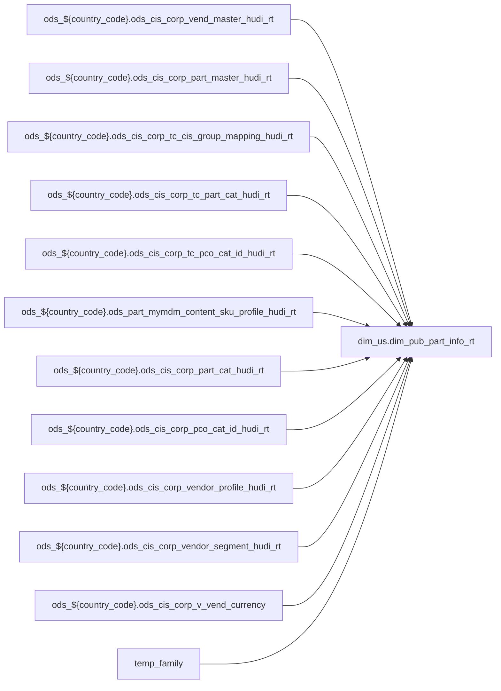

# DIM: Shared dimension for POS attribute enrichment (`dim_us.dim_pub_part_info_rt`)

- artifact_type: etl_table
- artifact_id: dim_us.dim_pub_part_info_rt
- domain: pos
- one_line_purpose: POS-domain table with load SQL under bitbucket-etl (see L3); prior contract narrative preserved below when present.
- layer_type: DIM
- source_kind: etl_sql
- evidence_source: source/contracts/pos/bitbucket-etl/dim_pub_part_info_rt/dim_pub_part_info_rt.sql
- bitbucket_etl_bundle: source/contracts/pos/bitbucket-etl/dim_pub_part_info_rt/
- related_etl_scripts:
- None

---

## L1 Data Foundation

### Identity and physical mapping
- **Table:** `dim_us.dim_pub_part_info_rt`
- **Layer type:** DIM
- **Canonical / derived:** Derived / ETL-loaded (see L3 from bitbucket-etl)
- **Owner team:** Not documented in repository

### Grain, scope, exclusions
- See preserved **Grain and keys** section below when present (POS contract narrative retained).
- Otherwise infer from SELECT / GROUP BY / INSERT column list in `source/contracts/pos/bitbucket-etl/dim_pub_part_info_rt/dim_pub_part_info_rt.sql`.

### Cross-engine presence
| Engine | Present | Notes |
|--------|---------|-------|
| Hive | yes | ETL load target |
| Vertica | yes when POS contract documents Vertica sync | See preserved Business query tables |

### Physical schema reference

| Field | Value |
|-------|-------|
| **entity_id** | `dim_us.dim_pub_part_info_rt` |
| **l1_catalog_seed** | `target/storage/wkb/snapshots/_snapshot_id_template/l1_catalog/{engine}_{schema}_{table}.json` |
| **column_count** | pending (run ddl_seed_writer) |
| **partition_keys** | See preserved Grain / L4 / ETL PARTITION clause |
| **ddl_source** | pending |
| **retrieval** | `python -m tools.wkb.indexing.run_query --query "pos dim_pub_part_info_rt schema" --intent find_table_schema` |

### Lineage

- **Primary load:** `source/contracts/pos/bitbucket-etl/dim_pub_part_info_rt/dim_pub_part_info_rt.sql`
- **upstream:** `ods_${country_code}.ods_cis_corp_vend_master_hudi_rt` — FROM/JOIN — `source/contracts/pos/bitbucket-etl/dim_pub_part_info_rt/dim_pub_part_info_rt.sql`
- **upstream:** `ods_${country_code}.ods_cis_corp_part_master_hudi_rt` — FROM/JOIN — `source/contracts/pos/bitbucket-etl/dim_pub_part_info_rt/dim_pub_part_info_rt.sql`
- **upstream:** `ods_${country_code}.ods_cis_corp_tc_cis_group_mapping_hudi_rt` — FROM/JOIN — `source/contracts/pos/bitbucket-etl/dim_pub_part_info_rt/dim_pub_part_info_rt.sql`
- **upstream:** `ods_${country_code}.ods_cis_corp_tc_part_cat_hudi_rt` — FROM/JOIN — `source/contracts/pos/bitbucket-etl/dim_pub_part_info_rt/dim_pub_part_info_rt.sql`
- **upstream:** `ods_${country_code}.ods_cis_corp_tc_pco_cat_id_hudi_rt` — FROM/JOIN — `source/contracts/pos/bitbucket-etl/dim_pub_part_info_rt/dim_pub_part_info_rt.sql`
- **upstream:** `ods_${country_code}.ods_part_mymdm_content_sku_profile_hudi_rt` — FROM/JOIN — `source/contracts/pos/bitbucket-etl/dim_pub_part_info_rt/dim_pub_part_info_rt.sql`
- **upstream:** `ods_${country_code}.ods_cis_corp_part_cat_hudi_rt` — FROM/JOIN — `source/contracts/pos/bitbucket-etl/dim_pub_part_info_rt/dim_pub_part_info_rt.sql`
- **upstream:** `ods_${country_code}.ods_cis_corp_pco_cat_id_hudi_rt` — FROM/JOIN — `source/contracts/pos/bitbucket-etl/dim_pub_part_info_rt/dim_pub_part_info_rt.sql`
- **upstream:** `ods_${country_code}.ods_cis_corp_vendor_profile_hudi_rt` — FROM/JOIN — `source/contracts/pos/bitbucket-etl/dim_pub_part_info_rt/dim_pub_part_info_rt.sql`
- **upstream:** `ods_${country_code}.ods_cis_corp_vendor_segment_hudi_rt` — FROM/JOIN — `source/contracts/pos/bitbucket-etl/dim_pub_part_info_rt/dim_pub_part_info_rt.sql`
- **upstream:** `ods_${country_code}.ods_cis_corp_v_vend_currency` — FROM/JOIN — `source/contracts/pos/bitbucket-etl/dim_pub_part_info_rt/dim_pub_part_info_rt.sql`
- **upstream:** `temp_family` — FROM/JOIN — `source/contracts/pos/bitbucket-etl/dim_pub_part_info_rt/dim_pub_part_info_rt.sql`
- **upstream:** `temp_tc_faimly` — FROM/JOIN — `source/contracts/pos/bitbucket-etl/dim_pub_part_info_rt/dim_pub_part_info_rt.sql`
- **upstream:** `ods_${country_code}.ods_cis_corp_dw_vend_pl_hudi_rt` — FROM/JOIN — `source/contracts/pos/bitbucket-etl/dim_pub_part_info_rt/dim_pub_part_info_rt.sql`
- **upstream:** `temp_vend_company_no` — FROM/JOIN — `source/contracts/pos/bitbucket-etl/dim_pub_part_info_rt/dim_pub_part_info_rt.sql`
- **upstream:** `tmp_v_vend_currency` — FROM/JOIN — `source/contracts/pos/bitbucket-etl/dim_pub_part_info_rt/dim_pub_part_info_rt.sql`
- **upstream:** `temp_vend_profile` — FROM/JOIN — `source/contracts/pos/bitbucket-etl/dim_pub_part_info_rt/dim_pub_part_info_rt.sql`
- **upstream:** `ods_${country_code}.ods_cis_corp_manager_hudi_rt` — FROM/JOIN — `source/contracts/pos/bitbucket-etl/dim_pub_part_info_rt/dim_pub_part_info_rt.sql`
- **upstream:** `ods_gbl.ods_cis_mygbl_global_part_cat` — FROM/JOIN — `source/contracts/pos/bitbucket-etl/dim_pub_part_info_rt/dim_pub_part_info_rt.sql`
- **upstream:** `ods_gbl.ods_cis_mygbl_global_pco_cat_id` — FROM/JOIN — `source/contracts/pos/bitbucket-etl/dim_pub_part_info_rt/dim_pub_part_info_rt.sql`
- **downstream:** see L6 Downstream consumers
### Freshness and load path
- Parameters / date window: see ETL `${literal_*}` / `${date_flag}` / `${start_date}` in evidence script.
- Schedule: Not documented in repository

## L2 Declarative Knowledge

### Business purpose
See preserved **Business purpose** below when present (POS contract catalog + linked ETL).

### Audience and use cases
See preserved **Who it helps** section when present.

### Fact key resolution
See preserved **Grain and keys** when present.

### Time field semantics
- Prefer partition / `date_flag` filters documented in preserved sections and L3 Key filters from ETL.

### Metrics served
See preserved Metrics / column groups when present; otherwise L3 column derivations.

### Metric serving map
N/A unless multi-period wide table (see preserved content).

### etl_metrics
No new metric-index formulas appended in this bitbucket-etl upgrade pass.

## L3 Procedural Knowledge

### Query and routing rules
- Reporting: Vertica `dim_us.dim_pub_part_info_rt` when synced (see preserved Business query tables).
- Load logic: bitbucket-etl evidence `source/contracts/pos/bitbucket-etl/dim_pub_part_info_rt/dim_pub_part_info_rt.sql`.

### Dimension join patterns
See Relationship map (ETL JOIN edges) and preserved contract join notes.

### Key filters and ETL business logic

| Predicate | Kind | Evidence |
|-----------|------|----------|
| `fam.cat_type = 'FAM' )t inner join ods_${country_code}.ods_cis_corp_pco_cat_id_hudi_rt cat on t.cat_id = cat.cat_id inner join ods_${country_code}.ods_cis_corp_pco_cat_id_hudi_rt scat on t.subcat_i...` | Business | `source/contracts/pos/bitbucket-etl/dim_pub_part_info_rt/dim_pub_part_info_rt.sql` |
| `length(trim(nvl(image_name,'')))>0` | Business | `source/contracts/pos/bitbucket-etl/dim_pub_part_info_rt/dim_pub_part_info_rt.sql` |
| `xref_type ='ACCESSORY' and active ='Y'` | Business | `source/contracts/pos/bitbucket-etl/dim_pub_part_info_rt/dim_pub_part_info_rt.sql` |
| `ct.xref_type = 'COO' and ct.active = 'Y'` | Business | `source/contracts/pos/bitbucket-etl/dim_pub_part_info_rt/dim_pub_part_info_rt.sql` |
| `profile_type ='JVBZ'` | Business | `source/contracts/pos/bitbucket-etl/dim_pub_part_info_rt/dim_pub_part_info_rt.sql` |

### Standard time-filter SQL
```sql
-- Prefer date_flag / literal_start_date / literal_end_date as used in source/contracts/pos/bitbucket-etl/dim_pub_part_info_rt/dim_pub_part_info_rt.sql
```

### End-to-end flow


### Base tables register
| Object | Role |
|--------|------|
| `ods_${country_code}.ods_cis_corp_vend_master_hudi_rt` | source / temp (FROM/JOIN) |
| `ods_${country_code}.ods_cis_corp_part_master_hudi_rt` | source / temp (FROM/JOIN) |
| `ods_${country_code}.ods_cis_corp_tc_cis_group_mapping_hudi_rt` | source / temp (FROM/JOIN) |
| `ods_${country_code}.ods_cis_corp_tc_part_cat_hudi_rt` | source / temp (FROM/JOIN) |
| `ods_${country_code}.ods_cis_corp_tc_pco_cat_id_hudi_rt` | source / temp (FROM/JOIN) |
| `ods_${country_code}.ods_part_mymdm_content_sku_profile_hudi_rt` | source / temp (FROM/JOIN) |
| `ods_${country_code}.ods_cis_corp_part_cat_hudi_rt` | source / temp (FROM/JOIN) |
| `ods_${country_code}.ods_cis_corp_pco_cat_id_hudi_rt` | source / temp (FROM/JOIN) |
| `ods_${country_code}.ods_cis_corp_vendor_profile_hudi_rt` | source / temp (FROM/JOIN) |
| `ods_${country_code}.ods_cis_corp_vendor_segment_hudi_rt` | source / temp (FROM/JOIN) |
| `ods_${country_code}.ods_cis_corp_v_vend_currency` | source / temp (FROM/JOIN) |
| `temp_family` | source / temp (FROM/JOIN) |
| `temp_tc_faimly` | source / temp (FROM/JOIN) |
| `ods_${country_code}.ods_cis_corp_dw_vend_pl_hudi_rt` | source / temp (FROM/JOIN) |
| `temp_vend_company_no` | source / temp (FROM/JOIN) |
| `tmp_v_vend_currency` | source / temp (FROM/JOIN) |
| `temp_vend_profile` | source / temp (FROM/JOIN) |
| `ods_${country_code}.ods_cis_corp_manager_hudi_rt` | source / temp (FROM/JOIN) |
| `ods_gbl.ods_cis_mygbl_global_part_cat` | source / temp (FROM/JOIN) |
| `ods_gbl.ods_cis_mygbl_global_pco_cat_id` | source / temp (FROM/JOIN) |
| `tmp_dim_pub_part_info_partadd` | source / temp (FROM/JOIN) |
| `ods_${country_code}.ods_cis_corp_tc_part_prod_cat_hudi_rt` | source / temp (FROM/JOIN) |
| `ods_${country_code}.ods_cis_corp_ec_category_name_hudi_rt` | source / temp (FROM/JOIN) |
| `dim_${country_code}.dim_pub_part_prod_cat` | source / temp (FROM/JOIN) |
| `temp_global_cat` | source / temp (FROM/JOIN) |

### Step-by-step logic
1. Execute load SQL / python in `source/contracts/pos/bitbucket-etl/dim_pub_part_info_rt/`.
2. Apply date / business filters from ETL (Key filters).
3. Write target `dim_us.dim_pub_part_info_rt` (see INSERT/OVERWRITE in evidence).

### Relationship map (embedded)

| from_fqn | to_fqn | cardinality | join_keys | provenance |
|----------|--------|-------------|-----------|------------|
| `ods_${country_code}.ods_cis_corp_part_master_hudi_rt` | `ods_${country_code}.ods_cis_corp_tc_cis_group_mapping_hudi_rt` | many:1 (LEFT) | `a.group_id` = `b.cis_group_id` | etl_sql (`source/contracts/pos/bitbucket-etl/dim_pub_part_info_rt/dim_pub_part_info_rt.sql:27`) |
| `ods_${country_code}.ods_cis_corp_tc_cis_group_mapping_hudi_rt` | `ods_${country_code}.ods_cis_corp_tc_part_cat_hudi_rt` | many:1 (LEFT) | `b.tc_group_id` = `c.group_id` | etl_sql (`source/contracts/pos/bitbucket-etl/dim_pub_part_info_rt/dim_pub_part_info_rt.sql:29`) |
| `ods_${country_code}.ods_cis_corp_tc_part_cat_hudi_rt` | `ods_${country_code}.ods_cis_corp_tc_pco_cat_id_hudi_rt` | many:1 (LEFT) | `c.family_id` = `d.cat_id` | etl_sql (`source/contracts/pos/bitbucket-etl/dim_pub_part_info_rt/dim_pub_part_info_rt.sql:31`) |
| `ods_${country_code}.ods_cis_corp_tc_part_cat_hudi_rt` | `ods_${country_code}.ods_cis_corp_tc_pco_cat_id_hudi_rt` | many:1 (LEFT) | `c.cat_id` = `e.cat_id` | etl_sql (`source/contracts/pos/bitbucket-etl/dim_pub_part_info_rt/dim_pub_part_info_rt.sql:33`) |
| `ods_${country_code}.ods_cis_corp_tc_part_cat_hudi_rt` | `ods_${country_code}.ods_cis_corp_tc_pco_cat_id_hudi_rt` | many:1 (LEFT) | `c.subcat_id` = `f.cat_id` | etl_sql (`source/contracts/pos/bitbucket-etl/dim_pub_part_info_rt/dim_pub_part_info_rt.sql:35`) |
| `ods_gbl.ods_cis_mygbl_global_part_cat` | `ods_${country_code}.ods_cis_corp_pco_cat_id_hudi_rt` | many:1 | `gpc.family_id` = `fam.cat_id` | etl_sql (`source/contracts/pos/bitbucket-etl/dim_pub_part_info_rt/dim_pub_part_info_rt.sql:66`) |
| `t` | `ods_${country_code}.ods_cis_corp_pco_cat_id_hudi_rt` | many:1 | `t.cat_id` = `cat.cat_id` | etl_sql (`source/contracts/pos/bitbucket-etl/dim_pub_part_info_rt/dim_pub_part_info_rt.sql:71`) |
| `t` | `ods_${country_code}.ods_cis_corp_pco_cat_id_hudi_rt` | many:1 | `t.subcat_id` = `scat.cat_id` | etl_sql (`source/contracts/pos/bitbucket-etl/dim_pub_part_info_rt/dim_pub_part_info_rt.sql:73`) |
| `ods_${country_code}.ods_cis_corp_vend_master_hudi_rt` | `ods_${country_code}.ods_cis_corp_vendor_segment_hudi_rt` | many:1 (LEFT) | cast(vp.profile_c as varchar(3)) = vs.seg_code | etl_sql (`source/contracts/pos/bitbucket-etl/dim_pub_part_info_rt/dim_pub_part_info_rt.sql:100`) |
| `ods_${country_code}.ods_cis_corp_part_master_hudi_rt` | `temp_family` | many:1 (LEFT) | `a.group_id` = `tf.group_id` | etl_sql (`source/contracts/pos/bitbucket-etl/dim_pub_part_info_rt/dim_pub_part_info_rt.sql:203`) |
| `ods_${country_code}.ods_cis_corp_part_master_hudi_rt` | `ods_${country_code}.ods_cis_corp_tc_cis_group_mapping_hudi_rt` | many:1 (LEFT) | `a.group_id` = `tcgm.cis_group_id` | etl_sql (`source/contracts/pos/bitbucket-etl/dim_pub_part_info_rt/dim_pub_part_info_rt.sql:205`) |
| `ods_${country_code}.ods_cis_corp_part_master_hudi_rt` | `temp_tc_faimly` | many:1 (LEFT) | `a.sku_no` = `tc.sku_no` | etl_sql (`source/contracts/pos/bitbucket-etl/dim_pub_part_info_rt/dim_pub_part_info_rt.sql:207`) |
| `ods_${country_code}.ods_cis_corp_part_master_hudi_rt` | `ods_${country_code}.ods_cis_corp_dw_vend_pl_hudi_rt` | many:1 (LEFT) | `a.vpl_no` = `dvl.vpl_no` | etl_sql (`source/contracts/pos/bitbucket-etl/dim_pub_part_info_rt/dim_pub_part_info_rt.sql:209`) |
| `ods_${country_code}.ods_cis_corp_part_master_hudi_rt` | `temp_vend_company_no` | many:1 (LEFT) | `a.vend_no` = `vm.vend_no` | etl_sql (`source/contracts/pos/bitbucket-etl/dim_pub_part_info_rt/dim_pub_part_info_rt.sql:211`) |
| `ods_${country_code}.ods_cis_corp_vend_master_hudi_rt` | `tmp_v_vend_currency` | many:1 (LEFT) | — | etl_sql (`source/contracts/pos/bitbucket-etl/dim_pub_part_info_rt/dim_pub_part_info_rt.sql:213`) |
| `ods_${country_code}.ods_cis_corp_dw_vend_pl_hudi_rt` | `ods_${country_code}.ods_cis_corp_dw_vend_pl_hudi_rt` | many:1 (LEFT) | `dvl.alt_vpl_no` = `advl.vpl_no` | etl_sql (`source/contracts/pos/bitbucket-etl/dim_pub_part_info_rt/dim_pub_part_info_rt.sql:215`) |
| `ods_${country_code}.ods_cis_corp_part_master_hudi_rt` | `temp_vend_profile` | many:1 (LEFT) | `a.vend_no` = `vp.vend_no` | etl_sql (`source/contracts/pos/bitbucket-etl/dim_pub_part_info_rt/dim_pub_part_info_rt.sql:217`) |
| `ods_${country_code}.ods_cis_corp_part_master_hudi_rt` | `ods_${country_code}.ods_cis_corp_manager_hudi_rt` | many:1 (LEFT) | `a.entry_id` = `cbm.userid` | etl_sql (`source/contracts/pos/bitbucket-etl/dim_pub_part_info_rt/dim_pub_part_info_rt.sql:219`) |
| `ods_${country_code}.ods_cis_corp_vend_master_hudi_rt` | `ods_gbl.ods_cis_mygbl_global_pco_cat_id` | many:1 | — | etl_sql (`source/contracts/pos/bitbucket-etl/dim_pub_part_info_rt/dim_pub_part_info_rt.sql:234`) |
| `pa` | `ods_${country_code}.ods_cis_corp_tc_part_prod_cat_hudi_rt` | many:1 (LEFT) | `pa.sku_no` = `ppc.sku_no` | etl_sql (`source/contracts/pos/bitbucket-etl/dim_pub_part_info_rt/dim_pub_part_info_rt.sql:271`) |
| `ods_${country_code}.ods_cis_corp_tc_part_prod_cat_hudi_rt` | `ods_${country_code}.ods_cis_corp_manager_hudi_rt` | many:1 (LEFT) | `cater.userid` = `ppc.entry_id` | etl_sql (`source/contracts/pos/bitbucket-etl/dim_pub_part_info_rt/dim_pub_part_info_rt.sql:273`) |
| `ods_${country_code}.ods_cis_corp_tc_part_prod_cat_hudi_rt` | `ods_${country_code}.ods_cis_corp_manager_hudi_rt` | many:1 (LEFT) | `moder.userid` = `ppc.last_modifier` | etl_sql (`source/contracts/pos/bitbucket-etl/dim_pub_part_info_rt/dim_pub_part_info_rt.sql:275`) |
| `pa` | `ods_${country_code}.ods_cis_corp_ec_category_name_hudi_rt` | many:1 (LEFT) | `pa.group_id` = `ecn.group_id` | etl_sql (`source/contracts/pos/bitbucket-etl/dim_pub_part_info_rt/dim_pub_part_info_rt.sql:277`) |
| `ods_${country_code}.ods_cis_corp_vend_master_hudi_rt` | `ods_gbl.ods_cis_mygbl_global_part_cat` | many:1 (LEFT) | — | etl_sql (`source/contracts/pos/bitbucket-etl/dim_pub_part_info_rt/dim_pub_part_info_rt.sql:280`) |
| `pa` | `dim_${country_code}.dim_pub_part_prod_cat` | many:1 (LEFT) | `pa.group_id` = `dppc.group_id` | etl_sql (`source/contracts/pos/bitbucket-etl/dim_pub_part_info_rt/dim_pub_part_info_rt.sql:282`) |
| `pa` | `temp_global_cat` | many:1 (LEFT) | `pa.group_id` = `tgc.group_id` | etl_sql (`source/contracts/pos/bitbucket-etl/dim_pub_part_info_rt/dim_pub_part_info_rt.sql:284`) |
| `ods_${country_code}.ods_cis_corp_sku_xref_hudi_rt` | `ods_${country_code}.ods_cis_corp_country_code_hudi_rt` | many:1 | `ct.xref` = `cc.country_code` | etl_sql (`source/contracts/pos/bitbucket-etl/dim_pub_part_info_rt/dim_pub_part_info_rt.sql:322`) |
| `ods_${country_code}.ods_cis_corp_vend_master_hudi_rt` | `ods_gbl.ods_cis_mygbl_pcode_list` | many:1 (LEFT) | — | etl_sql (`source/contracts/pos/bitbucket-etl/dim_pub_part_info_rt/dim_pub_part_info_rt.sql:343`) |
| `ods_${country_code}.ods_cis_corp_vend_master_hudi_rt` | `ods_gbl.ods_cis_mygbl_prodcat_uni_sku` | many:1 (LEFT) | — | etl_sql (`source/contracts/pos/bitbucket-etl/dim_pub_part_info_rt/dim_pub_part_info_rt.sql:411`) |
| `pic` | `temp_part_sku_profile` | many:1 (LEFT) | `pic.sku_no` = `psp.sku_no` | etl_sql (`source/contracts/pos/bitbucket-etl/dim_pub_part_info_rt/dim_pub_part_info_rt.sql:591`) |
| `pic` | `tmp_dim_pub_part_info_profile_fill` | many:1 (LEFT) | `pic.sku_no` = `pipf.sku_no` | etl_sql (`source/contracts/pos/bitbucket-etl/dim_pub_part_info_rt/dim_pub_part_info_rt.sql:593`) |
| `pic` | `ods_${country_code}.ods_cis_corp_tc_mkt_en_hudi_rt` | many:1 (LEFT) | `pic.sku_no` = `tme.sku_no` | etl_sql (`source/contracts/pos/bitbucket-etl/dim_pub_part_info_rt/dim_pub_part_info_rt.sql:596`) |
| `pic` | `ods_${country_code}.ods_cis_corp_dw_vend_pl_hudi_rt` | many:1 (LEFT) | `pic.vpl_no` = `dvp.vpl_no` | etl_sql (`source/contracts/pos/bitbucket-etl/dim_pub_part_info_rt/dim_pub_part_info_rt.sql:600`) |
| `pic` | `ods_${country_code}.ods_cis_corp_part_qc_status_hudi_rt` | many:1 (LEFT) | `pic.sku_no` = `pqs.sku_no` | etl_sql (`source/contracts/pos/bitbucket-etl/dim_pub_part_info_rt/dim_pub_part_info_rt.sql:603`) |
| `pic` | `ods_${country_code}.ods_cis_corp_tc_images_hudi_rt` | many:1 (LEFT) | `pic.sku_no` = `ti.sku_no` | etl_sql (`source/contracts/pos/bitbucket-etl/dim_pub_part_info_rt/dim_pub_part_info_rt.sql:607`) |
| `pic` | `coo_tmp` | many:1 (LEFT) | `pic.sku_no` = `ct.sku_no` | etl_sql (`source/contracts/pos/bitbucket-etl/dim_pub_part_info_rt/dim_pub_part_info_rt.sql:611`) |
| `pic` | `tmp_dim_pub_part_info_profile_image` | many:1 (LEFT) | `pic.sku_no` = `pi.sku_no` | etl_sql (`source/contracts/pos/bitbucket-etl/dim_pub_part_info_rt/dim_pub_part_info_rt.sql:613`) |
| `pic` | `tmp_dim_pub_part_info_profile_accessory` | many:1 (LEFT) | `pic.sku_no` = `pipa.sku_no` | etl_sql (`source/contracts/pos/bitbucket-etl/dim_pub_part_info_rt/dim_pub_part_info_rt.sql:616`) |
| `pic` | `ods_${country_code}.ods_cis_corp_cws_part_hudi_rt` | many:1 (LEFT) | `pic.sku_no` = `cccp.sku_no` | etl_sql (`source/contracts/pos/bitbucket-etl/dim_pub_part_info_rt/dim_pub_part_info_rt.sql:618`) |
| `pic` | `ods_${country_code}.ods_cis_corp_vend_part_no_hudi_rt` | many:1 (LEFT) | `pic.sku_no` = `vpn.sku_no` | etl_sql (`source/contracts/pos/bitbucket-etl/dim_pub_part_info_rt/dim_pub_part_info_rt.sql:620`) |
| `pic` | `temp_global_cat` | many:1 (LEFT) | `pic.group_id` = `tgc.group_id` | etl_sql (`source/contracts/pos/bitbucket-etl/dim_pub_part_info_rt/dim_pub_part_info_rt.sql:624`) |
| `pic` | `temp_sku_pcode` | many:1 (LEFT) | `pic.sku_no` = `tsp.sku_no` | etl_sql (`source/contracts/pos/bitbucket-etl/dim_pub_part_info_rt/dim_pub_part_info_rt.sql:626`) |
| `pic` | `jv_business_tmp` | many:1 (LEFT) | `pic.sku_no` = `jv.sku_no` | etl_sql (`source/contracts/pos/bitbucket-etl/dim_pub_part_info_rt/dim_pub_part_info_rt.sql:630`) |
| `pic` | `temp_uni_sku_no` | many:1 (LEFT) | `pic.sku_no` = `usn.sku_no` | etl_sql (`source/contracts/pos/bitbucket-etl/dim_pub_part_info_rt/dim_pub_part_info_rt.sql:632`) |
| `pic` | `temp_sku_extension` | many:1 (LEFT) | `pic.sku_no` = `ext.sku_no` | etl_sql (`source/contracts/pos/bitbucket-etl/dim_pub_part_info_rt/dim_pub_part_info_rt.sql:634`) |
| `pic` | `temp_tc_fill_count` | many:1 (LEFT) | `pic.sku_no` = `tcfc.sku_no` | etl_sql (`source/contracts/pos/bitbucket-etl/dim_pub_part_info_rt/dim_pub_part_info_rt.sql:636`) |
| `pic` | `temp_uni_group` | many:1 (LEFT) | `pic.sku_no` = `tcg.sku_no` | etl_sql (`source/contracts/pos/bitbucket-etl/dim_pub_part_info_rt/dim_pub_part_info_rt.sql:638`) |
| `pic` | `temp_vendor_pcode` | many:1 (LEFT) | `pic.vend_no` = `tvp.vend_no` | etl_sql (`source/contracts/pos/bitbucket-etl/dim_pub_part_info_rt/dim_pub_part_info_rt.sql:640`) |
| `pic` | `temp_arr_xaas` | many:1 (LEFT) | `pic.sku_no` = `tax.sku_no` | etl_sql (`source/contracts/pos/bitbucket-etl/dim_pub_part_info_rt/dim_pub_part_info_rt.sql:642`) |
| `pic` | `temp_forecast_cat` | many:1 (LEFT) | `pic.sku_no` = `tfc.sku_no` | etl_sql (`source/contracts/pos/bitbucket-etl/dim_pub_part_info_rt/dim_pub_part_info_rt.sql:644`) |

### Special logic (embedded)

`source/ref/pos/special_logic.txt` exists but no rule naming this FQN/stem (`dim_us.dim_pub_part_info_rt`).

Not documented in repository


### Column / field derivations (from ETL SQL)

| target_column | expression_sql | upstream_columns | upstream_tables | transform_kind | evidence |
|---------------|----------------|------------------|-----------------|----------------|----------|
| `sku_no` | `pic.sku_no` | `sku_no` | `tmp_dim_pub_part_info_category`, `temp_part_sku_profile`, `tmp_dim_pub_part_info_profile_fill`, `ods_${country_code}.ods_cis_corp_tc_mkt_en_hudi_rt`, `ods_${country_code}.ods_cis_corp_dw_vend_pl_hudi_rt`, `ods_${country_code}.ods_cis_corp_part_qc_status_hudi_rt`, `ods_${country_code}.ods_cis_corp_tc_images_hudi_rt`, `coo_tmp`, `tmp_dim_pub_part_info_profile_image`, `tmp_dim_pub_part_info_profile_accessory`, `ods_${country_code}.ods_cis_corp_cws_part_hudi_rt`, `ods_${country_code}.ods_cis_corp_vend_part_no_hudi_rt` | passthrough | `source/contracts/pos/bitbucket-etl/dim_pub_part_info_rt/dim_pub_part_info_rt.sql:448` |
| `part_no` | `pic.part_no` | `part_no` | `tmp_dim_pub_part_info_category`, `temp_part_sku_profile`, `tmp_dim_pub_part_info_profile_fill`, `ods_${country_code}.ods_cis_corp_tc_mkt_en_hudi_rt`, `ods_${country_code}.ods_cis_corp_dw_vend_pl_hudi_rt`, `ods_${country_code}.ods_cis_corp_part_qc_status_hudi_rt`, `ods_${country_code}.ods_cis_corp_tc_images_hudi_rt`, `coo_tmp`, `tmp_dim_pub_part_info_profile_image`, `tmp_dim_pub_part_info_profile_accessory`, `ods_${country_code}.ods_cis_corp_cws_part_hudi_rt`, `ods_${country_code}.ods_cis_corp_vend_part_no_hudi_rt` | passthrough | `source/contracts/pos/bitbucket-etl/dim_pub_part_info_rt/dim_pub_part_info_rt.sql:449` |
| `short_desc` | `pic.short_desc` | `short_desc` | `tmp_dim_pub_part_info_category`, `temp_part_sku_profile`, `tmp_dim_pub_part_info_profile_fill`, `ods_${country_code}.ods_cis_corp_tc_mkt_en_hudi_rt`, `ods_${country_code}.ods_cis_corp_dw_vend_pl_hudi_rt`, `ods_${country_code}.ods_cis_corp_part_qc_status_hudi_rt`, `ods_${country_code}.ods_cis_corp_tc_images_hudi_rt`, `coo_tmp`, `tmp_dim_pub_part_info_profile_image`, `tmp_dim_pub_part_info_profile_accessory`, `ods_${country_code}.ods_cis_corp_cws_part_hudi_rt`, `ods_${country_code}.ods_cis_corp_vend_part_no_hudi_rt` | passthrough | `source/contracts/pos/bitbucket-etl/dim_pub_part_info_rt/dim_pub_part_info_rt.sql:450` |
| `long_desc` | `pic.long_desc` | `long_desc` | `tmp_dim_pub_part_info_category`, `temp_part_sku_profile`, `tmp_dim_pub_part_info_profile_fill`, `ods_${country_code}.ods_cis_corp_tc_mkt_en_hudi_rt`, `ods_${country_code}.ods_cis_corp_dw_vend_pl_hudi_rt`, `ods_${country_code}.ods_cis_corp_part_qc_status_hudi_rt`, `ods_${country_code}.ods_cis_corp_tc_images_hudi_rt`, `coo_tmp`, `tmp_dim_pub_part_info_profile_image`, `tmp_dim_pub_part_info_profile_accessory`, `ods_${country_code}.ods_cis_corp_cws_part_hudi_rt`, `ods_${country_code}.ods_cis_corp_vend_part_no_hudi_rt` | passthrough | `source/contracts/pos/bitbucket-etl/dim_pub_part_info_rt/dim_pub_part_info_rt.sql:451` |
| `abc_code` | `pic.abc_code` | `abc_code` | `tmp_dim_pub_part_info_category`, `temp_part_sku_profile`, `tmp_dim_pub_part_info_profile_fill`, `ods_${country_code}.ods_cis_corp_tc_mkt_en_hudi_rt`, `ods_${country_code}.ods_cis_corp_dw_vend_pl_hudi_rt`, `ods_${country_code}.ods_cis_corp_part_qc_status_hudi_rt`, `ods_${country_code}.ods_cis_corp_tc_images_hudi_rt`, `coo_tmp`, `tmp_dim_pub_part_info_profile_image`, `tmp_dim_pub_part_info_profile_accessory`, `ods_${country_code}.ods_cis_corp_cws_part_hudi_rt`, `ods_${country_code}.ods_cis_corp_vend_part_no_hudi_rt` | passthrough | `source/contracts/pos/bitbucket-etl/dim_pub_part_info_rt/dim_pub_part_info_rt.sql:452` |
| `prod_code` | `pic.prod_code` | `prod_code` | `tmp_dim_pub_part_info_category`, `temp_part_sku_profile`, `tmp_dim_pub_part_info_profile_fill`, `ods_${country_code}.ods_cis_corp_tc_mkt_en_hudi_rt`, `ods_${country_code}.ods_cis_corp_dw_vend_pl_hudi_rt`, `ods_${country_code}.ods_cis_corp_part_qc_status_hudi_rt`, `ods_${country_code}.ods_cis_corp_tc_images_hudi_rt`, `coo_tmp`, `tmp_dim_pub_part_info_profile_image`, `tmp_dim_pub_part_info_profile_accessory`, `ods_${country_code}.ods_cis_corp_cws_part_hudi_rt`, `ods_${country_code}.ods_cis_corp_vend_part_no_hudi_rt` | passthrough | `source/contracts/pos/bitbucket-etl/dim_pub_part_info_rt/dim_pub_part_info_rt.sql:453` |
| `prod_type` | `pic.prod_type` | `prod_type` | `tmp_dim_pub_part_info_category`, `temp_part_sku_profile`, `tmp_dim_pub_part_info_profile_fill`, `ods_${country_code}.ods_cis_corp_tc_mkt_en_hudi_rt`, `ods_${country_code}.ods_cis_corp_dw_vend_pl_hudi_rt`, `ods_${country_code}.ods_cis_corp_part_qc_status_hudi_rt`, `ods_${country_code}.ods_cis_corp_tc_images_hudi_rt`, `coo_tmp`, `tmp_dim_pub_part_info_profile_image`, `tmp_dim_pub_part_info_profile_accessory`, `ods_${country_code}.ods_cis_corp_cws_part_hudi_rt`, `ods_${country_code}.ods_cis_corp_vend_part_no_hudi_rt` | passthrough | `source/contracts/pos/bitbucket-etl/dim_pub_part_info_rt/dim_pub_part_info_rt.sql:454` |
| `weight` | `pic.weight` | `weight` | `tmp_dim_pub_part_info_category`, `temp_part_sku_profile`, `tmp_dim_pub_part_info_profile_fill`, `ods_${country_code}.ods_cis_corp_tc_mkt_en_hudi_rt`, `ods_${country_code}.ods_cis_corp_dw_vend_pl_hudi_rt`, `ods_${country_code}.ods_cis_corp_part_qc_status_hudi_rt`, `ods_${country_code}.ods_cis_corp_tc_images_hudi_rt`, `coo_tmp`, `tmp_dim_pub_part_info_profile_image`, `tmp_dim_pub_part_info_profile_accessory`, `ods_${country_code}.ods_cis_corp_cws_part_hudi_rt`, `ods_${country_code}.ods_cis_corp_vend_part_no_hudi_rt` | passthrough | `source/contracts/pos/bitbucket-etl/dim_pub_part_info_rt/dim_pub_part_info_rt.sql:455` |
| `cu_height` | `pic.cu_height` | `cu_height` | `tmp_dim_pub_part_info_category`, `temp_part_sku_profile`, `tmp_dim_pub_part_info_profile_fill`, `ods_${country_code}.ods_cis_corp_tc_mkt_en_hudi_rt`, `ods_${country_code}.ods_cis_corp_dw_vend_pl_hudi_rt`, `ods_${country_code}.ods_cis_corp_part_qc_status_hudi_rt`, `ods_${country_code}.ods_cis_corp_tc_images_hudi_rt`, `coo_tmp`, `tmp_dim_pub_part_info_profile_image`, `tmp_dim_pub_part_info_profile_accessory`, `ods_${country_code}.ods_cis_corp_cws_part_hudi_rt`, `ods_${country_code}.ods_cis_corp_vend_part_no_hudi_rt` | passthrough | `source/contracts/pos/bitbucket-etl/dim_pub_part_info_rt/dim_pub_part_info_rt.sql:456` |
| `cu_width` | `pic.cu_width` | `cu_width` | `tmp_dim_pub_part_info_category`, `temp_part_sku_profile`, `tmp_dim_pub_part_info_profile_fill`, `ods_${country_code}.ods_cis_corp_tc_mkt_en_hudi_rt`, `ods_${country_code}.ods_cis_corp_dw_vend_pl_hudi_rt`, `ods_${country_code}.ods_cis_corp_part_qc_status_hudi_rt`, `ods_${country_code}.ods_cis_corp_tc_images_hudi_rt`, `coo_tmp`, `tmp_dim_pub_part_info_profile_image`, `tmp_dim_pub_part_info_profile_accessory`, `ods_${country_code}.ods_cis_corp_cws_part_hudi_rt`, `ods_${country_code}.ods_cis_corp_vend_part_no_hudi_rt` | passthrough | `source/contracts/pos/bitbucket-etl/dim_pub_part_info_rt/dim_pub_part_info_rt.sql:457` |
| `cu_length` | `pic.cu_length` | `cu_length` | `tmp_dim_pub_part_info_category`, `temp_part_sku_profile`, `tmp_dim_pub_part_info_profile_fill`, `ods_${country_code}.ods_cis_corp_tc_mkt_en_hudi_rt`, `ods_${country_code}.ods_cis_corp_dw_vend_pl_hudi_rt`, `ods_${country_code}.ods_cis_corp_part_qc_status_hudi_rt`, `ods_${country_code}.ods_cis_corp_tc_images_hudi_rt`, `coo_tmp`, `tmp_dim_pub_part_info_profile_image`, `tmp_dim_pub_part_info_profile_accessory`, `ods_${country_code}.ods_cis_corp_cws_part_hudi_rt`, `ods_${country_code}.ods_cis_corp_vend_part_no_hudi_rt` | passthrough | `source/contracts/pos/bitbucket-etl/dim_pub_part_info_rt/dim_pub_part_info_rt.sql:458` |
| `ser_no_flag` | `pic.ser_no_flag` | `ser_no_flag` | `tmp_dim_pub_part_info_category`, `temp_part_sku_profile`, `tmp_dim_pub_part_info_profile_fill`, `ods_${country_code}.ods_cis_corp_tc_mkt_en_hudi_rt`, `ods_${country_code}.ods_cis_corp_dw_vend_pl_hudi_rt`, `ods_${country_code}.ods_cis_corp_part_qc_status_hudi_rt`, `ods_${country_code}.ods_cis_corp_tc_images_hudi_rt`, `coo_tmp`, `tmp_dim_pub_part_info_profile_image`, `tmp_dim_pub_part_info_profile_accessory`, `ods_${country_code}.ods_cis_corp_cws_part_hudi_rt`, `ods_${country_code}.ods_cis_corp_vend_part_no_hudi_rt` | passthrough | `source/contracts/pos/bitbucket-etl/dim_pub_part_info_rt/dim_pub_part_info_rt.sql:459` |
| `avail_to_sell` | `pic.avail_to_sell` | `avail_to_sell` | `tmp_dim_pub_part_info_category`, `temp_part_sku_profile`, `tmp_dim_pub_part_info_profile_fill`, `ods_${country_code}.ods_cis_corp_tc_mkt_en_hudi_rt`, `ods_${country_code}.ods_cis_corp_dw_vend_pl_hudi_rt`, `ods_${country_code}.ods_cis_corp_part_qc_status_hudi_rt`, `ods_${country_code}.ods_cis_corp_tc_images_hudi_rt`, `coo_tmp`, `tmp_dim_pub_part_info_profile_image`, `tmp_dim_pub_part_info_profile_accessory`, `ods_${country_code}.ods_cis_corp_cws_part_hudi_rt`, `ods_${country_code}.ods_cis_corp_vend_part_no_hudi_rt` | passthrough | `source/contracts/pos/bitbucket-etl/dim_pub_part_info_rt/dim_pub_part_info_rt.sql:460` |
| `active_status` | `pic.active_status` | `active_status` | `tmp_dim_pub_part_info_category`, `temp_part_sku_profile`, `tmp_dim_pub_part_info_profile_fill`, `ods_${country_code}.ods_cis_corp_tc_mkt_en_hudi_rt`, `ods_${country_code}.ods_cis_corp_dw_vend_pl_hudi_rt`, `ods_${country_code}.ods_cis_corp_part_qc_status_hudi_rt`, `ods_${country_code}.ods_cis_corp_tc_images_hudi_rt`, `coo_tmp`, `tmp_dim_pub_part_info_profile_image`, `tmp_dim_pub_part_info_profile_accessory`, `ods_${country_code}.ods_cis_corp_cws_part_hudi_rt`, `ods_${country_code}.ods_cis_corp_vend_part_no_hudi_rt` | passthrough | `source/contracts/pos/bitbucket-etl/dim_pub_part_info_rt/dim_pub_part_info_rt.sql:461` |
| `po_cost` | `pic.po_cost` | `po_cost` | `tmp_dim_pub_part_info_category`, `temp_part_sku_profile`, `tmp_dim_pub_part_info_profile_fill`, `ods_${country_code}.ods_cis_corp_tc_mkt_en_hudi_rt`, `ods_${country_code}.ods_cis_corp_dw_vend_pl_hudi_rt`, `ods_${country_code}.ods_cis_corp_part_qc_status_hudi_rt`, `ods_${country_code}.ods_cis_corp_tc_images_hudi_rt`, `coo_tmp`, `tmp_dim_pub_part_info_profile_image`, `tmp_dim_pub_part_info_profile_accessory`, `ods_${country_code}.ods_cis_corp_cws_part_hudi_rt`, `ods_${country_code}.ods_cis_corp_vend_part_no_hudi_rt` | passthrough | `source/contracts/pos/bitbucket-etl/dim_pub_part_info_rt/dim_pub_part_info_rt.sql:462` |
| `vend_no` | `pic.vend_no` | `vend_no` | `tmp_dim_pub_part_info_category`, `temp_part_sku_profile`, `tmp_dim_pub_part_info_profile_fill`, `ods_${country_code}.ods_cis_corp_tc_mkt_en_hudi_rt`, `ods_${country_code}.ods_cis_corp_dw_vend_pl_hudi_rt`, `ods_${country_code}.ods_cis_corp_part_qc_status_hudi_rt`, `ods_${country_code}.ods_cis_corp_tc_images_hudi_rt`, `coo_tmp`, `tmp_dim_pub_part_info_profile_image`, `tmp_dim_pub_part_info_profile_accessory`, `ods_${country_code}.ods_cis_corp_cws_part_hudi_rt`, `ods_${country_code}.ods_cis_corp_vend_part_no_hudi_rt` | passthrough | `source/contracts/pos/bitbucket-etl/dim_pub_part_info_rt/dim_pub_part_info_rt.sql:463` |
| `upc_code` | `pic.upc_code` | `upc_code` | `tmp_dim_pub_part_info_category`, `temp_part_sku_profile`, `tmp_dim_pub_part_info_profile_fill`, `ods_${country_code}.ods_cis_corp_tc_mkt_en_hudi_rt`, `ods_${country_code}.ods_cis_corp_dw_vend_pl_hudi_rt`, `ods_${country_code}.ods_cis_corp_part_qc_status_hudi_rt`, `ods_${country_code}.ods_cis_corp_tc_images_hudi_rt`, `coo_tmp`, `tmp_dim_pub_part_info_profile_image`, `tmp_dim_pub_part_info_profile_accessory`, `ods_${country_code}.ods_cis_corp_cws_part_hudi_rt`, `ods_${country_code}.ods_cis_corp_vend_part_no_hudi_rt` | passthrough | `source/contracts/pos/bitbucket-etl/dim_pub_part_info_rt/dim_pub_part_info_rt.sql:464` |
| `sug_retail_price` | `pic.sug_retail_price` | `sug_retail_price` | `tmp_dim_pub_part_info_category`, `temp_part_sku_profile`, `tmp_dim_pub_part_info_profile_fill`, `ods_${country_code}.ods_cis_corp_tc_mkt_en_hudi_rt`, `ods_${country_code}.ods_cis_corp_dw_vend_pl_hudi_rt`, `ods_${country_code}.ods_cis_corp_part_qc_status_hudi_rt`, `ods_${country_code}.ods_cis_corp_tc_images_hudi_rt`, `coo_tmp`, `tmp_dim_pub_part_info_profile_image`, `tmp_dim_pub_part_info_profile_accessory`, `ods_${country_code}.ods_cis_corp_cws_part_hudi_rt`, `ods_${country_code}.ods_cis_corp_vend_part_no_hudi_rt` | passthrough | `source/contracts/pos/bitbucket-etl/dim_pub_part_info_rt/dim_pub_part_info_rt.sql:465` |
| `mfg_partno` | `pic.mfg_partno` | `mfg_partno` | `tmp_dim_pub_part_info_category`, `temp_part_sku_profile`, `tmp_dim_pub_part_info_profile_fill`, `ods_${country_code}.ods_cis_corp_tc_mkt_en_hudi_rt`, `ods_${country_code}.ods_cis_corp_dw_vend_pl_hudi_rt`, `ods_${country_code}.ods_cis_corp_part_qc_status_hudi_rt`, `ods_${country_code}.ods_cis_corp_tc_images_hudi_rt`, `coo_tmp`, `tmp_dim_pub_part_info_profile_image`, `tmp_dim_pub_part_info_profile_accessory`, `ods_${country_code}.ods_cis_corp_cws_part_hudi_rt`, `ods_${country_code}.ods_cis_corp_vend_part_no_hudi_rt` | passthrough | `source/contracts/pos/bitbucket-etl/dim_pub_part_info_rt/dim_pub_part_info_rt.sql:466` |
| `master_flag` | `pic.master_flag` | `master_flag` | `tmp_dim_pub_part_info_category`, `temp_part_sku_profile`, `tmp_dim_pub_part_info_profile_fill`, `ods_${country_code}.ods_cis_corp_tc_mkt_en_hudi_rt`, `ods_${country_code}.ods_cis_corp_dw_vend_pl_hudi_rt`, `ods_${country_code}.ods_cis_corp_part_qc_status_hudi_rt`, `ods_${country_code}.ods_cis_corp_tc_images_hudi_rt`, `coo_tmp`, `tmp_dim_pub_part_info_profile_image`, `tmp_dim_pub_part_info_profile_accessory`, `ods_${country_code}.ods_cis_corp_cws_part_hudi_rt`, `ods_${country_code}.ods_cis_corp_vend_part_no_hudi_rt` | passthrough | `source/contracts/pos/bitbucket-etl/dim_pub_part_info_rt/dim_pub_part_info_rt.sql:467` |
| `model` | `pic.model` | `model` | `tmp_dim_pub_part_info_category`, `temp_part_sku_profile`, `tmp_dim_pub_part_info_profile_fill`, `ods_${country_code}.ods_cis_corp_tc_mkt_en_hudi_rt`, `ods_${country_code}.ods_cis_corp_dw_vend_pl_hudi_rt`, `ods_${country_code}.ods_cis_corp_part_qc_status_hudi_rt`, `ods_${country_code}.ods_cis_corp_tc_images_hudi_rt`, `coo_tmp`, `tmp_dim_pub_part_info_profile_image`, `tmp_dim_pub_part_info_profile_accessory`, `ods_${country_code}.ods_cis_corp_cws_part_hudi_rt`, `ods_${country_code}.ods_cis_corp_vend_part_no_hudi_rt` | passthrough | `source/contracts/pos/bitbucket-etl/dim_pub_part_info_rt/dim_pub_part_info_rt.sql:468` |
| `vpl_no` | `pic.vpl_no` | `vpl_no` | `tmp_dim_pub_part_info_category`, `temp_part_sku_profile`, `tmp_dim_pub_part_info_profile_fill`, `ods_${country_code}.ods_cis_corp_tc_mkt_en_hudi_rt`, `ods_${country_code}.ods_cis_corp_dw_vend_pl_hudi_rt`, `ods_${country_code}.ods_cis_corp_part_qc_status_hudi_rt`, `ods_${country_code}.ods_cis_corp_tc_images_hudi_rt`, `coo_tmp`, `tmp_dim_pub_part_info_profile_image`, `tmp_dim_pub_part_info_profile_accessory`, `ods_${country_code}.ods_cis_corp_cws_part_hudi_rt`, `ods_${country_code}.ods_cis_corp_vend_part_no_hudi_rt` | passthrough | `source/contracts/pos/bitbucket-etl/dim_pub_part_info_rt/dim_pub_part_info_rt.sql:469` |
| `usage_type` | `pic.usage_type` | `usage_type` | `tmp_dim_pub_part_info_category`, `temp_part_sku_profile`, `tmp_dim_pub_part_info_profile_fill`, `ods_${country_code}.ods_cis_corp_tc_mkt_en_hudi_rt`, `ods_${country_code}.ods_cis_corp_dw_vend_pl_hudi_rt`, `ods_${country_code}.ods_cis_corp_part_qc_status_hudi_rt`, `ods_${country_code}.ods_cis_corp_tc_images_hudi_rt`, `coo_tmp`, `tmp_dim_pub_part_info_profile_image`, `tmp_dim_pub_part_info_profile_accessory`, `ods_${country_code}.ods_cis_corp_cws_part_hudi_rt`, `ods_${country_code}.ods_cis_corp_vend_part_no_hudi_rt` | passthrough | `source/contracts/pos/bitbucket-etl/dim_pub_part_info_rt/dim_pub_part_info_rt.sql:470` |
| `category_id` | `pic.category_id` | `category_id` | `tmp_dim_pub_part_info_category`, `temp_part_sku_profile`, `tmp_dim_pub_part_info_profile_fill`, `ods_${country_code}.ods_cis_corp_tc_mkt_en_hudi_rt`, `ods_${country_code}.ods_cis_corp_dw_vend_pl_hudi_rt`, `ods_${country_code}.ods_cis_corp_part_qc_status_hudi_rt`, `ods_${country_code}.ods_cis_corp_tc_images_hudi_rt`, `coo_tmp`, `tmp_dim_pub_part_info_profile_image`, `tmp_dim_pub_part_info_profile_accessory`, `ods_${country_code}.ods_cis_corp_cws_part_hudi_rt`, `ods_${country_code}.ods_cis_corp_vend_part_no_hudi_rt` | passthrough | `source/contracts/pos/bitbucket-etl/dim_pub_part_info_rt/dim_pub_part_info_rt.sql:471` |
| `series_no` | `pic.series_no` | `series_no` | `tmp_dim_pub_part_info_category`, `temp_part_sku_profile`, `tmp_dim_pub_part_info_profile_fill`, `ods_${country_code}.ods_cis_corp_tc_mkt_en_hudi_rt`, `ods_${country_code}.ods_cis_corp_dw_vend_pl_hudi_rt`, `ods_${country_code}.ods_cis_corp_part_qc_status_hudi_rt`, `ods_${country_code}.ods_cis_corp_tc_images_hudi_rt`, `coo_tmp`, `tmp_dim_pub_part_info_profile_image`, `tmp_dim_pub_part_info_profile_accessory`, `ods_${country_code}.ods_cis_corp_cws_part_hudi_rt`, `ods_${country_code}.ods_cis_corp_vend_part_no_hudi_rt` | passthrough | `source/contracts/pos/bitbucket-etl/dim_pub_part_info_rt/dim_pub_part_info_rt.sql:472` |
| `accept_rma` | `pic.accept_rma` | `accept_rma` | `tmp_dim_pub_part_info_category`, `temp_part_sku_profile`, `tmp_dim_pub_part_info_profile_fill`, `ods_${country_code}.ods_cis_corp_tc_mkt_en_hudi_rt`, `ods_${country_code}.ods_cis_corp_dw_vend_pl_hudi_rt`, `ods_${country_code}.ods_cis_corp_part_qc_status_hudi_rt`, `ods_${country_code}.ods_cis_corp_tc_images_hudi_rt`, `coo_tmp`, `tmp_dim_pub_part_info_profile_image`, `tmp_dim_pub_part_info_profile_accessory`, `ods_${country_code}.ods_cis_corp_cws_part_hudi_rt`, `ods_${country_code}.ods_cis_corp_vend_part_no_hudi_rt` | passthrough | `source/contracts/pos/bitbucket-etl/dim_pub_part_info_rt/dim_pub_part_info_rt.sql:473` |
| `group_id` | `pic.group_id` | `group_id` | `tmp_dim_pub_part_info_category`, `temp_part_sku_profile`, `tmp_dim_pub_part_info_profile_fill`, `ods_${country_code}.ods_cis_corp_tc_mkt_en_hudi_rt`, `ods_${country_code}.ods_cis_corp_dw_vend_pl_hudi_rt`, `ods_${country_code}.ods_cis_corp_part_qc_status_hudi_rt`, `ods_${country_code}.ods_cis_corp_tc_images_hudi_rt`, `coo_tmp`, `tmp_dim_pub_part_info_profile_image`, `tmp_dim_pub_part_info_profile_accessory`, `ods_${country_code}.ods_cis_corp_cws_part_hudi_rt`, `ods_${country_code}.ods_cis_corp_vend_part_no_hudi_rt` | passthrough | `source/contracts/pos/bitbucket-etl/dim_pub_part_info_rt/dim_pub_part_info_rt.sql:474` |
| `uni_group_id` | `tcg.uni_group_id` | `uni_group_id` | `tmp_dim_pub_part_info_category`, `temp_part_sku_profile`, `tmp_dim_pub_part_info_profile_fill`, `ods_${country_code}.ods_cis_corp_tc_mkt_en_hudi_rt`, `ods_${country_code}.ods_cis_corp_dw_vend_pl_hudi_rt`, `ods_${country_code}.ods_cis_corp_part_qc_status_hudi_rt`, `ods_${country_code}.ods_cis_corp_tc_images_hudi_rt`, `coo_tmp`, `tmp_dim_pub_part_info_profile_image`, `tmp_dim_pub_part_info_profile_accessory`, `ods_${country_code}.ods_cis_corp_cws_part_hudi_rt`, `ods_${country_code}.ods_cis_corp_vend_part_no_hudi_rt` | passthrough | `source/contracts/pos/bitbucket-etl/dim_pub_part_info_rt/dim_pub_part_info_rt.sql:475` |
| `family_id` | `pic.family_id` | `family_id` | `tmp_dim_pub_part_info_category`, `temp_part_sku_profile`, `tmp_dim_pub_part_info_profile_fill`, `ods_${country_code}.ods_cis_corp_tc_mkt_en_hudi_rt`, `ods_${country_code}.ods_cis_corp_dw_vend_pl_hudi_rt`, `ods_${country_code}.ods_cis_corp_part_qc_status_hudi_rt`, `ods_${country_code}.ods_cis_corp_tc_images_hudi_rt`, `coo_tmp`, `tmp_dim_pub_part_info_profile_image`, `tmp_dim_pub_part_info_profile_accessory`, `ods_${country_code}.ods_cis_corp_cws_part_hudi_rt`, `ods_${country_code}.ods_cis_corp_vend_part_no_hudi_rt` | passthrough | `source/contracts/pos/bitbucket-etl/dim_pub_part_info_rt/dim_pub_part_info_rt.sql:476` |
| `family` | `pic.family` | `family` | `tmp_dim_pub_part_info_category`, `temp_part_sku_profile`, `tmp_dim_pub_part_info_profile_fill`, `ods_${country_code}.ods_cis_corp_tc_mkt_en_hudi_rt`, `ods_${country_code}.ods_cis_corp_dw_vend_pl_hudi_rt`, `ods_${country_code}.ods_cis_corp_part_qc_status_hudi_rt`, `ods_${country_code}.ods_cis_corp_tc_images_hudi_rt`, `coo_tmp`, `tmp_dim_pub_part_info_profile_image`, `tmp_dim_pub_part_info_profile_accessory`, `ods_${country_code}.ods_cis_corp_cws_part_hudi_rt`, `ods_${country_code}.ods_cis_corp_vend_part_no_hudi_rt` | passthrough | `source/contracts/pos/bitbucket-etl/dim_pub_part_info_rt/dim_pub_part_info_rt.sql:476` |
| `cat_id` | `pic.cat_id` | `cat_id` | `tmp_dim_pub_part_info_category`, `temp_part_sku_profile`, `tmp_dim_pub_part_info_profile_fill`, `ods_${country_code}.ods_cis_corp_tc_mkt_en_hudi_rt`, `ods_${country_code}.ods_cis_corp_dw_vend_pl_hudi_rt`, `ods_${country_code}.ods_cis_corp_part_qc_status_hudi_rt`, `ods_${country_code}.ods_cis_corp_tc_images_hudi_rt`, `coo_tmp`, `tmp_dim_pub_part_info_profile_image`, `tmp_dim_pub_part_info_profile_accessory`, `ods_${country_code}.ods_cis_corp_cws_part_hudi_rt`, `ods_${country_code}.ods_cis_corp_vend_part_no_hudi_rt` | passthrough | `source/contracts/pos/bitbucket-etl/dim_pub_part_info_rt/dim_pub_part_info_rt.sql:478` |
| `category` | `pic.category` | `category` | `tmp_dim_pub_part_info_category`, `temp_part_sku_profile`, `tmp_dim_pub_part_info_profile_fill`, `ods_${country_code}.ods_cis_corp_tc_mkt_en_hudi_rt`, `ods_${country_code}.ods_cis_corp_dw_vend_pl_hudi_rt`, `ods_${country_code}.ods_cis_corp_part_qc_status_hudi_rt`, `ods_${country_code}.ods_cis_corp_tc_images_hudi_rt`, `coo_tmp`, `tmp_dim_pub_part_info_profile_image`, `tmp_dim_pub_part_info_profile_accessory`, `ods_${country_code}.ods_cis_corp_cws_part_hudi_rt`, `ods_${country_code}.ods_cis_corp_vend_part_no_hudi_rt` | passthrough | `source/contracts/pos/bitbucket-etl/dim_pub_part_info_rt/dim_pub_part_info_rt.sql:471` |
| `subcat_id` | `pic.subcat_id` | `subcat_id` | `tmp_dim_pub_part_info_category`, `temp_part_sku_profile`, `tmp_dim_pub_part_info_profile_fill`, `ods_${country_code}.ods_cis_corp_tc_mkt_en_hudi_rt`, `ods_${country_code}.ods_cis_corp_dw_vend_pl_hudi_rt`, `ods_${country_code}.ods_cis_corp_part_qc_status_hudi_rt`, `ods_${country_code}.ods_cis_corp_tc_images_hudi_rt`, `coo_tmp`, `tmp_dim_pub_part_info_profile_image`, `tmp_dim_pub_part_info_profile_accessory`, `ods_${country_code}.ods_cis_corp_cws_part_hudi_rt`, `ods_${country_code}.ods_cis_corp_vend_part_no_hudi_rt` | passthrough | `source/contracts/pos/bitbucket-etl/dim_pub_part_info_rt/dim_pub_part_info_rt.sql:480` |
| `sub_category` | `pic.sub_category` | `sub_category` | `tmp_dim_pub_part_info_category`, `temp_part_sku_profile`, `tmp_dim_pub_part_info_profile_fill`, `ods_${country_code}.ods_cis_corp_tc_mkt_en_hudi_rt`, `ods_${country_code}.ods_cis_corp_dw_vend_pl_hudi_rt`, `ods_${country_code}.ods_cis_corp_part_qc_status_hudi_rt`, `ods_${country_code}.ods_cis_corp_tc_images_hudi_rt`, `coo_tmp`, `tmp_dim_pub_part_info_profile_image`, `tmp_dim_pub_part_info_profile_accessory`, `ods_${country_code}.ods_cis_corp_cws_part_hudi_rt`, `ods_${country_code}.ods_cis_corp_vend_part_no_hudi_rt` | passthrough | `source/contracts/pos/bitbucket-etl/dim_pub_part_info_rt/dim_pub_part_info_rt.sql:481` |
| `tc_family_id` | `pic.tc_family_id` | `tc_family_id` | `tmp_dim_pub_part_info_category`, `temp_part_sku_profile`, `tmp_dim_pub_part_info_profile_fill`, `ods_${country_code}.ods_cis_corp_tc_mkt_en_hudi_rt`, `ods_${country_code}.ods_cis_corp_dw_vend_pl_hudi_rt`, `ods_${country_code}.ods_cis_corp_part_qc_status_hudi_rt`, `ods_${country_code}.ods_cis_corp_tc_images_hudi_rt`, `coo_tmp`, `tmp_dim_pub_part_info_profile_image`, `tmp_dim_pub_part_info_profile_accessory`, `ods_${country_code}.ods_cis_corp_cws_part_hudi_rt`, `ods_${country_code}.ods_cis_corp_vend_part_no_hudi_rt` | passthrough | `source/contracts/pos/bitbucket-etl/dim_pub_part_info_rt/dim_pub_part_info_rt.sql:482` |
| `tc_family` | `pic.tc_family` | `tc_family` | `tmp_dim_pub_part_info_category`, `temp_part_sku_profile`, `tmp_dim_pub_part_info_profile_fill`, `ods_${country_code}.ods_cis_corp_tc_mkt_en_hudi_rt`, `ods_${country_code}.ods_cis_corp_dw_vend_pl_hudi_rt`, `ods_${country_code}.ods_cis_corp_part_qc_status_hudi_rt`, `ods_${country_code}.ods_cis_corp_tc_images_hudi_rt`, `coo_tmp`, `tmp_dim_pub_part_info_profile_image`, `tmp_dim_pub_part_info_profile_accessory`, `ods_${country_code}.ods_cis_corp_cws_part_hudi_rt`, `ods_${country_code}.ods_cis_corp_vend_part_no_hudi_rt` | passthrough | `source/contracts/pos/bitbucket-etl/dim_pub_part_info_rt/dim_pub_part_info_rt.sql:482` |
| `tc_cat_id` | `pic.tc_cat_id` | `tc_cat_id` | `tmp_dim_pub_part_info_category`, `temp_part_sku_profile`, `tmp_dim_pub_part_info_profile_fill`, `ods_${country_code}.ods_cis_corp_tc_mkt_en_hudi_rt`, `ods_${country_code}.ods_cis_corp_dw_vend_pl_hudi_rt`, `ods_${country_code}.ods_cis_corp_part_qc_status_hudi_rt`, `ods_${country_code}.ods_cis_corp_tc_images_hudi_rt`, `coo_tmp`, `tmp_dim_pub_part_info_profile_image`, `tmp_dim_pub_part_info_profile_accessory`, `ods_${country_code}.ods_cis_corp_cws_part_hudi_rt`, `ods_${country_code}.ods_cis_corp_vend_part_no_hudi_rt` | passthrough | `source/contracts/pos/bitbucket-etl/dim_pub_part_info_rt/dim_pub_part_info_rt.sql:484` |
| `tc_category` | `pic.tc_category` | `tc_category` | `tmp_dim_pub_part_info_category`, `temp_part_sku_profile`, `tmp_dim_pub_part_info_profile_fill`, `ods_${country_code}.ods_cis_corp_tc_mkt_en_hudi_rt`, `ods_${country_code}.ods_cis_corp_dw_vend_pl_hudi_rt`, `ods_${country_code}.ods_cis_corp_part_qc_status_hudi_rt`, `ods_${country_code}.ods_cis_corp_tc_images_hudi_rt`, `coo_tmp`, `tmp_dim_pub_part_info_profile_image`, `tmp_dim_pub_part_info_profile_accessory`, `ods_${country_code}.ods_cis_corp_cws_part_hudi_rt`, `ods_${country_code}.ods_cis_corp_vend_part_no_hudi_rt` | passthrough | `source/contracts/pos/bitbucket-etl/dim_pub_part_info_rt/dim_pub_part_info_rt.sql:485` |
| `tc_subcat_id` | `pic.tc_subcat_id` | `tc_subcat_id` | `tmp_dim_pub_part_info_category`, `temp_part_sku_profile`, `tmp_dim_pub_part_info_profile_fill`, `ods_${country_code}.ods_cis_corp_tc_mkt_en_hudi_rt`, `ods_${country_code}.ods_cis_corp_dw_vend_pl_hudi_rt`, `ods_${country_code}.ods_cis_corp_part_qc_status_hudi_rt`, `ods_${country_code}.ods_cis_corp_tc_images_hudi_rt`, `coo_tmp`, `tmp_dim_pub_part_info_profile_image`, `tmp_dim_pub_part_info_profile_accessory`, `ods_${country_code}.ods_cis_corp_cws_part_hudi_rt`, `ods_${country_code}.ods_cis_corp_vend_part_no_hudi_rt` | passthrough | `source/contracts/pos/bitbucket-etl/dim_pub_part_info_rt/dim_pub_part_info_rt.sql:486` |
| `tc_sub_category` | `pic.tc_sub_category` | `tc_sub_category` | `tmp_dim_pub_part_info_category`, `temp_part_sku_profile`, `tmp_dim_pub_part_info_profile_fill`, `ods_${country_code}.ods_cis_corp_tc_mkt_en_hudi_rt`, `ods_${country_code}.ods_cis_corp_dw_vend_pl_hudi_rt`, `ods_${country_code}.ods_cis_corp_part_qc_status_hudi_rt`, `ods_${country_code}.ods_cis_corp_tc_images_hudi_rt`, `coo_tmp`, `tmp_dim_pub_part_info_profile_image`, `tmp_dim_pub_part_info_profile_accessory`, `ods_${country_code}.ods_cis_corp_cws_part_hudi_rt`, `ods_${country_code}.ods_cis_corp_vend_part_no_hudi_rt` | passthrough | `source/contracts/pos/bitbucket-etl/dim_pub_part_info_rt/dim_pub_part_info_rt.sql:487` |
| `vpl_code` | `pic.vpl_code` | `vpl_code` | `tmp_dim_pub_part_info_category`, `temp_part_sku_profile`, `tmp_dim_pub_part_info_profile_fill`, `ods_${country_code}.ods_cis_corp_tc_mkt_en_hudi_rt`, `ods_${country_code}.ods_cis_corp_dw_vend_pl_hudi_rt`, `ods_${country_code}.ods_cis_corp_part_qc_status_hudi_rt`, `ods_${country_code}.ods_cis_corp_tc_images_hudi_rt`, `coo_tmp`, `tmp_dim_pub_part_info_profile_image`, `tmp_dim_pub_part_info_profile_accessory`, `ods_${country_code}.ods_cis_corp_cws_part_hudi_rt`, `ods_${country_code}.ods_cis_corp_vend_part_no_hudi_rt` | passthrough | `source/contracts/pos/bitbucket-etl/dim_pub_part_info_rt/dim_pub_part_info_rt.sql:488` |
| `vpl_desc` | `pic.vpl_desc` | `vpl_desc` | `tmp_dim_pub_part_info_category`, `temp_part_sku_profile`, `tmp_dim_pub_part_info_profile_fill`, `ods_${country_code}.ods_cis_corp_tc_mkt_en_hudi_rt`, `ods_${country_code}.ods_cis_corp_dw_vend_pl_hudi_rt`, `ods_${country_code}.ods_cis_corp_part_qc_status_hudi_rt`, `ods_${country_code}.ods_cis_corp_tc_images_hudi_rt`, `coo_tmp`, `tmp_dim_pub_part_info_profile_image`, `tmp_dim_pub_part_info_profile_accessory`, `ods_${country_code}.ods_cis_corp_cws_part_hudi_rt`, `ods_${country_code}.ods_cis_corp_vend_part_no_hudi_rt` | passthrough | `source/contracts/pos/bitbucket-etl/dim_pub_part_info_rt/dim_pub_part_info_rt.sql:489` |
| `vend_name` | `pic.vend_name` | `vend_name` | `tmp_dim_pub_part_info_category`, `temp_part_sku_profile`, `tmp_dim_pub_part_info_profile_fill`, `ods_${country_code}.ods_cis_corp_tc_mkt_en_hudi_rt`, `ods_${country_code}.ods_cis_corp_dw_vend_pl_hudi_rt`, `ods_${country_code}.ods_cis_corp_part_qc_status_hudi_rt`, `ods_${country_code}.ods_cis_corp_tc_images_hudi_rt`, `coo_tmp`, `tmp_dim_pub_part_info_profile_image`, `tmp_dim_pub_part_info_profile_accessory`, `ods_${country_code}.ods_cis_corp_cws_part_hudi_rt`, `ods_${country_code}.ods_cis_corp_vend_part_no_hudi_rt` | passthrough | `source/contracts/pos/bitbucket-etl/dim_pub_part_info_rt/dim_pub_part_info_rt.sql:490` |
| `vend_currency` | `pic.vend_currency` | `vend_currency` | `tmp_dim_pub_part_info_category`, `temp_part_sku_profile`, `tmp_dim_pub_part_info_profile_fill`, `ods_${country_code}.ods_cis_corp_tc_mkt_en_hudi_rt`, `ods_${country_code}.ods_cis_corp_dw_vend_pl_hudi_rt`, `ods_${country_code}.ods_cis_corp_part_qc_status_hudi_rt`, `ods_${country_code}.ods_cis_corp_tc_images_hudi_rt`, `coo_tmp`, `tmp_dim_pub_part_info_profile_image`, `tmp_dim_pub_part_info_profile_accessory`, `ods_${country_code}.ods_cis_corp_cws_part_hudi_rt`, `ods_${country_code}.ods_cis_corp_vend_part_no_hudi_rt` | passthrough | `source/contracts/pos/bitbucket-etl/dim_pub_part_info_rt/dim_pub_part_info_rt.sql:491` |
| `vend_segment` | `pic.vend_segment` | `vend_segment` | `tmp_dim_pub_part_info_category`, `temp_part_sku_profile`, `tmp_dim_pub_part_info_profile_fill`, `ods_${country_code}.ods_cis_corp_tc_mkt_en_hudi_rt`, `ods_${country_code}.ods_cis_corp_dw_vend_pl_hudi_rt`, `ods_${country_code}.ods_cis_corp_part_qc_status_hudi_rt`, `ods_${country_code}.ods_cis_corp_tc_images_hudi_rt`, `coo_tmp`, `tmp_dim_pub_part_info_profile_image`, `tmp_dim_pub_part_info_profile_accessory`, `ods_${country_code}.ods_cis_corp_cws_part_hudi_rt`, `ods_${country_code}.ods_cis_corp_vend_part_no_hudi_rt` | passthrough | `source/contracts/pos/bitbucket-etl/dim_pub_part_info_rt/dim_pub_part_info_rt.sql:492` |
| `alt_vpl_no` | `pic.alt_vpl_no` | `alt_vpl_no` | `tmp_dim_pub_part_info_category`, `temp_part_sku_profile`, `tmp_dim_pub_part_info_profile_fill`, `ods_${country_code}.ods_cis_corp_tc_mkt_en_hudi_rt`, `ods_${country_code}.ods_cis_corp_dw_vend_pl_hudi_rt`, `ods_${country_code}.ods_cis_corp_part_qc_status_hudi_rt`, `ods_${country_code}.ods_cis_corp_tc_images_hudi_rt`, `coo_tmp`, `tmp_dim_pub_part_info_profile_image`, `tmp_dim_pub_part_info_profile_accessory`, `ods_${country_code}.ods_cis_corp_cws_part_hudi_rt`, `ods_${country_code}.ods_cis_corp_vend_part_no_hudi_rt` | passthrough | `source/contracts/pos/bitbucket-etl/dim_pub_part_info_rt/dim_pub_part_info_rt.sql:493` |
| `alt_vpl_code` | `pic.alt_vpl_code` | `alt_vpl_code` | `tmp_dim_pub_part_info_category`, `temp_part_sku_profile`, `tmp_dim_pub_part_info_profile_fill`, `ods_${country_code}.ods_cis_corp_tc_mkt_en_hudi_rt`, `ods_${country_code}.ods_cis_corp_dw_vend_pl_hudi_rt`, `ods_${country_code}.ods_cis_corp_part_qc_status_hudi_rt`, `ods_${country_code}.ods_cis_corp_tc_images_hudi_rt`, `coo_tmp`, `tmp_dim_pub_part_info_profile_image`, `tmp_dim_pub_part_info_profile_accessory`, `ods_${country_code}.ods_cis_corp_cws_part_hudi_rt`, `ods_${country_code}.ods_cis_corp_vend_part_no_hudi_rt` | passthrough | `source/contracts/pos/bitbucket-etl/dim_pub_part_info_rt/dim_pub_part_info_rt.sql:494` |
| `alt_vpl_desc` | `pic.alt_vpl_desc` | `alt_vpl_desc` | `tmp_dim_pub_part_info_category`, `temp_part_sku_profile`, `tmp_dim_pub_part_info_profile_fill`, `ods_${country_code}.ods_cis_corp_tc_mkt_en_hudi_rt`, `ods_${country_code}.ods_cis_corp_dw_vend_pl_hudi_rt`, `ods_${country_code}.ods_cis_corp_part_qc_status_hudi_rt`, `ods_${country_code}.ods_cis_corp_tc_images_hudi_rt`, `coo_tmp`, `tmp_dim_pub_part_info_profile_image`, `tmp_dim_pub_part_info_profile_accessory`, `ods_${country_code}.ods_cis_corp_cws_part_hudi_rt`, `ods_${country_code}.ods_cis_corp_vend_part_no_hudi_rt` | passthrough | `source/contracts/pos/bitbucket-etl/dim_pub_part_info_rt/dim_pub_part_info_rt.sql:495` |
| `universal_vend_no` | `pic.universal_vend_no` | `universal_vend_no` | `tmp_dim_pub_part_info_category`, `temp_part_sku_profile`, `tmp_dim_pub_part_info_profile_fill`, `ods_${country_code}.ods_cis_corp_tc_mkt_en_hudi_rt`, `ods_${country_code}.ods_cis_corp_dw_vend_pl_hudi_rt`, `ods_${country_code}.ods_cis_corp_part_qc_status_hudi_rt`, `ods_${country_code}.ods_cis_corp_tc_images_hudi_rt`, `coo_tmp`, `tmp_dim_pub_part_info_profile_image`, `tmp_dim_pub_part_info_profile_accessory`, `ods_${country_code}.ods_cis_corp_cws_part_hudi_rt`, `ods_${country_code}.ods_cis_corp_vend_part_no_hudi_rt` | passthrough | `source/contracts/pos/bitbucket-etl/dim_pub_part_info_rt/dim_pub_part_info_rt.sql:496` |
| `universal_vend_name` | `pic.universal_vend_name` | `universal_vend_name` | `tmp_dim_pub_part_info_category`, `temp_part_sku_profile`, `tmp_dim_pub_part_info_profile_fill`, `ods_${country_code}.ods_cis_corp_tc_mkt_en_hudi_rt`, `ods_${country_code}.ods_cis_corp_dw_vend_pl_hudi_rt`, `ods_${country_code}.ods_cis_corp_part_qc_status_hudi_rt`, `ods_${country_code}.ods_cis_corp_tc_images_hudi_rt`, `coo_tmp`, `tmp_dim_pub_part_info_profile_image`, `tmp_dim_pub_part_info_profile_accessory`, `ods_${country_code}.ods_cis_corp_cws_part_hudi_rt`, `ods_${country_code}.ods_cis_corp_vend_part_no_hudi_rt` | passthrough | `source/contracts/pos/bitbucket-etl/dim_pub_part_info_rt/dim_pub_part_info_rt.sql:497` |
| `pur_end_date` | `pic.pur_end_date` | `pur_end_date` | `tmp_dim_pub_part_info_category`, `temp_part_sku_profile`, `tmp_dim_pub_part_info_profile_fill`, `ods_${country_code}.ods_cis_corp_tc_mkt_en_hudi_rt`, `ods_${country_code}.ods_cis_corp_dw_vend_pl_hudi_rt`, `ods_${country_code}.ods_cis_corp_part_qc_status_hudi_rt`, `ods_${country_code}.ods_cis_corp_tc_images_hudi_rt`, `coo_tmp`, `tmp_dim_pub_part_info_profile_image`, `tmp_dim_pub_part_info_profile_accessory`, `ods_${country_code}.ods_cis_corp_cws_part_hudi_rt`, `ods_${country_code}.ods_cis_corp_vend_part_no_hudi_rt` | passthrough | `source/contracts/pos/bitbucket-etl/dim_pub_part_info_rt/dim_pub_part_info_rt.sql:498` |
| `catalog_desc` | `pic.catalog_desc` | `catalog_desc` | `tmp_dim_pub_part_info_category`, `temp_part_sku_profile`, `tmp_dim_pub_part_info_profile_fill`, `ods_${country_code}.ods_cis_corp_tc_mkt_en_hudi_rt`, `ods_${country_code}.ods_cis_corp_dw_vend_pl_hudi_rt`, `ods_${country_code}.ods_cis_corp_part_qc_status_hudi_rt`, `ods_${country_code}.ods_cis_corp_tc_images_hudi_rt`, `coo_tmp`, `tmp_dim_pub_part_info_profile_image`, `tmp_dim_pub_part_info_profile_accessory`, `ods_${country_code}.ods_cis_corp_cws_part_hudi_rt`, `ods_${country_code}.ods_cis_corp_vend_part_no_hudi_rt` | passthrough | `source/contracts/pos/bitbucket-etl/dim_pub_part_info_rt/dim_pub_part_info_rt.sql:499` |
| `ave_cost` | `pic.ave_cost` | `ave_cost` | `tmp_dim_pub_part_info_category`, `temp_part_sku_profile`, `tmp_dim_pub_part_info_profile_fill`, `ods_${country_code}.ods_cis_corp_tc_mkt_en_hudi_rt`, `ods_${country_code}.ods_cis_corp_dw_vend_pl_hudi_rt`, `ods_${country_code}.ods_cis_corp_part_qc_status_hudi_rt`, `ods_${country_code}.ods_cis_corp_tc_images_hudi_rt`, `coo_tmp`, `tmp_dim_pub_part_info_profile_image`, `tmp_dim_pub_part_info_profile_accessory`, `ods_${country_code}.ods_cis_corp_cws_part_hudi_rt`, `ods_${country_code}.ods_cis_corp_vend_part_no_hudi_rt` | passthrough | `source/contracts/pos/bitbucket-etl/dim_pub_part_info_rt/dim_pub_part_info_rt.sql:500` |
| `std_cost` | `pic.std_cost` | `std_cost` | `tmp_dim_pub_part_info_category`, `temp_part_sku_profile`, `tmp_dim_pub_part_info_profile_fill`, `ods_${country_code}.ods_cis_corp_tc_mkt_en_hudi_rt`, `ods_${country_code}.ods_cis_corp_dw_vend_pl_hudi_rt`, `ods_${country_code}.ods_cis_corp_part_qc_status_hudi_rt`, `ods_${country_code}.ods_cis_corp_tc_images_hudi_rt`, `coo_tmp`, `tmp_dim_pub_part_info_profile_image`, `tmp_dim_pub_part_info_profile_accessory`, `ods_${country_code}.ods_cis_corp_cws_part_hudi_rt`, `ods_${country_code}.ods_cis_corp_vend_part_no_hudi_rt` | passthrough | `source/contracts/pos/bitbucket-etl/dim_pub_part_info_rt/dim_pub_part_info_rt.sql:501` |
| `cost_meth` | `pic.cost_meth` | `cost_meth` | `tmp_dim_pub_part_info_category`, `temp_part_sku_profile`, `tmp_dim_pub_part_info_profile_fill`, `ods_${country_code}.ods_cis_corp_tc_mkt_en_hudi_rt`, `ods_${country_code}.ods_cis_corp_dw_vend_pl_hudi_rt`, `ods_${country_code}.ods_cis_corp_part_qc_status_hudi_rt`, `ods_${country_code}.ods_cis_corp_tc_images_hudi_rt`, `coo_tmp`, `tmp_dim_pub_part_info_profile_image`, `tmp_dim_pub_part_info_profile_accessory`, `ods_${country_code}.ods_cis_corp_cws_part_hudi_rt`, `ods_${country_code}.ods_cis_corp_vend_part_no_hudi_rt` | passthrough | `source/contracts/pos/bitbucket-etl/dim_pub_part_info_rt/dim_pub_part_info_rt.sql:502` |
| `entry_datetime` | `pic.entry_datetime` | `entry_datetime` | `tmp_dim_pub_part_info_category`, `temp_part_sku_profile`, `tmp_dim_pub_part_info_profile_fill`, `ods_${country_code}.ods_cis_corp_tc_mkt_en_hudi_rt`, `ods_${country_code}.ods_cis_corp_dw_vend_pl_hudi_rt`, `ods_${country_code}.ods_cis_corp_part_qc_status_hudi_rt`, `ods_${country_code}.ods_cis_corp_tc_images_hudi_rt`, `coo_tmp`, `tmp_dim_pub_part_info_profile_image`, `tmp_dim_pub_part_info_profile_accessory`, `ods_${country_code}.ods_cis_corp_cws_part_hudi_rt`, `ods_${country_code}.ods_cis_corp_vend_part_no_hudi_rt` | passthrough | `source/contracts/pos/bitbucket-etl/dim_pub_part_info_rt/dim_pub_part_info_rt.sql:503` |
| `entry_id` | `pic.entry_id` | `entry_id` | `tmp_dim_pub_part_info_category`, `temp_part_sku_profile`, `tmp_dim_pub_part_info_profile_fill`, `ods_${country_code}.ods_cis_corp_tc_mkt_en_hudi_rt`, `ods_${country_code}.ods_cis_corp_dw_vend_pl_hudi_rt`, `ods_${country_code}.ods_cis_corp_part_qc_status_hudi_rt`, `ods_${country_code}.ods_cis_corp_tc_images_hudi_rt`, `coo_tmp`, `tmp_dim_pub_part_info_profile_image`, `tmp_dim_pub_part_info_profile_accessory`, `ods_${country_code}.ods_cis_corp_cws_part_hudi_rt`, `ods_${country_code}.ods_cis_corp_vend_part_no_hudi_rt` | passthrough | `source/contracts/pos/bitbucket-etl/dim_pub_part_info_rt/dim_pub_part_info_rt.sql:504` |
| `entry_name` | `pic.entry_name` | `entry_name` | `tmp_dim_pub_part_info_category`, `temp_part_sku_profile`, `tmp_dim_pub_part_info_profile_fill`, `ods_${country_code}.ods_cis_corp_tc_mkt_en_hudi_rt`, `ods_${country_code}.ods_cis_corp_dw_vend_pl_hudi_rt`, `ods_${country_code}.ods_cis_corp_part_qc_status_hudi_rt`, `ods_${country_code}.ods_cis_corp_tc_images_hudi_rt`, `coo_tmp`, `tmp_dim_pub_part_info_profile_image`, `tmp_dim_pub_part_info_profile_accessory`, `ods_${country_code}.ods_cis_corp_cws_part_hudi_rt`, `ods_${country_code}.ods_cis_corp_vend_part_no_hudi_rt` | passthrough | `source/contracts/pos/bitbucket-etl/dim_pub_part_info_rt/dim_pub_part_info_rt.sql:505` |
| `production_flag` | `pic.production_flag` | `production_flag` | `tmp_dim_pub_part_info_category`, `temp_part_sku_profile`, `tmp_dim_pub_part_info_profile_fill`, `ods_${country_code}.ods_cis_corp_tc_mkt_en_hudi_rt`, `ods_${country_code}.ods_cis_corp_dw_vend_pl_hudi_rt`, `ods_${country_code}.ods_cis_corp_part_qc_status_hudi_rt`, `ods_${country_code}.ods_cis_corp_tc_images_hudi_rt`, `coo_tmp`, `tmp_dim_pub_part_info_profile_image`, `tmp_dim_pub_part_info_profile_accessory`, `ods_${country_code}.ods_cis_corp_cws_part_hudi_rt`, `ods_${country_code}.ods_cis_corp_vend_part_no_hudi_rt` | passthrough | `source/contracts/pos/bitbucket-etl/dim_pub_part_info_rt/dim_pub_part_info_rt.sql:506` |
| `pur_comment` | `pic.pur_comment` | `pur_comment` | `tmp_dim_pub_part_info_category`, `temp_part_sku_profile`, `tmp_dim_pub_part_info_profile_fill`, `ods_${country_code}.ods_cis_corp_tc_mkt_en_hudi_rt`, `ods_${country_code}.ods_cis_corp_dw_vend_pl_hudi_rt`, `ods_${country_code}.ods_cis_corp_part_qc_status_hudi_rt`, `ods_${country_code}.ods_cis_corp_tc_images_hudi_rt`, `coo_tmp`, `tmp_dim_pub_part_info_profile_image`, `tmp_dim_pub_part_info_profile_accessory`, `ods_${country_code}.ods_cis_corp_cws_part_hudi_rt`, `ods_${country_code}.ods_cis_corp_vend_part_no_hudi_rt` | passthrough | `source/contracts/pos/bitbucket-etl/dim_pub_part_info_rt/dim_pub_part_info_rt.sql:507` |
| `mar_comment` | `pic.mar_comment` | `mar_comment` | `tmp_dim_pub_part_info_category`, `temp_part_sku_profile`, `tmp_dim_pub_part_info_profile_fill`, `ods_${country_code}.ods_cis_corp_tc_mkt_en_hudi_rt`, `ods_${country_code}.ods_cis_corp_dw_vend_pl_hudi_rt`, `ods_${country_code}.ods_cis_corp_part_qc_status_hudi_rt`, `ods_${country_code}.ods_cis_corp_tc_images_hudi_rt`, `coo_tmp`, `tmp_dim_pub_part_info_profile_image`, `tmp_dim_pub_part_info_profile_accessory`, `ods_${country_code}.ods_cis_corp_cws_part_hudi_rt`, `ods_${country_code}.ods_cis_corp_vend_part_no_hudi_rt` | passthrough | `source/contracts/pos/bitbucket-etl/dim_pub_part_info_rt/dim_pub_part_info_rt.sql:508` |
| `mar_end_date` | `pic.mar_end_date` | `mar_end_date` | `tmp_dim_pub_part_info_category`, `temp_part_sku_profile`, `tmp_dim_pub_part_info_profile_fill`, `ods_${country_code}.ods_cis_corp_tc_mkt_en_hudi_rt`, `ods_${country_code}.ods_cis_corp_dw_vend_pl_hudi_rt`, `ods_${country_code}.ods_cis_corp_part_qc_status_hudi_rt`, `ods_${country_code}.ods_cis_corp_tc_images_hudi_rt`, `coo_tmp`, `tmp_dim_pub_part_info_profile_image`, `tmp_dim_pub_part_info_profile_accessory`, `ods_${country_code}.ods_cis_corp_cws_part_hudi_rt`, `ods_${country_code}.ods_cis_corp_vend_part_no_hudi_rt` | passthrough | `source/contracts/pos/bitbucket-etl/dim_pub_part_info_rt/dim_pub_part_info_rt.sql:509` |
| `shortage` | `pic.shortage` | `shortage` | `tmp_dim_pub_part_info_category`, `temp_part_sku_profile`, `tmp_dim_pub_part_info_profile_fill`, `ods_${country_code}.ods_cis_corp_tc_mkt_en_hudi_rt`, `ods_${country_code}.ods_cis_corp_dw_vend_pl_hudi_rt`, `ods_${country_code}.ods_cis_corp_part_qc_status_hudi_rt`, `ods_${country_code}.ods_cis_corp_tc_images_hudi_rt`, `coo_tmp`, `tmp_dim_pub_part_info_profile_image`, `tmp_dim_pub_part_info_profile_accessory`, `ods_${country_code}.ods_cis_corp_cws_part_hudi_rt`, `ods_${country_code}.ods_cis_corp_vend_part_no_hudi_rt` | passthrough | `source/contracts/pos/bitbucket-etl/dim_pub_part_info_rt/dim_pub_part_info_rt.sql:510` |
| `fixed_price` | `pic.fixed_price` | `fixed_price` | `tmp_dim_pub_part_info_category`, `temp_part_sku_profile`, `tmp_dim_pub_part_info_profile_fill`, `ods_${country_code}.ods_cis_corp_tc_mkt_en_hudi_rt`, `ods_${country_code}.ods_cis_corp_dw_vend_pl_hudi_rt`, `ods_${country_code}.ods_cis_corp_part_qc_status_hudi_rt`, `ods_${country_code}.ods_cis_corp_tc_images_hudi_rt`, `coo_tmp`, `tmp_dim_pub_part_info_profile_image`, `tmp_dim_pub_part_info_profile_accessory`, `ods_${country_code}.ods_cis_corp_cws_part_hudi_rt`, `ods_${country_code}.ods_cis_corp_vend_part_no_hudi_rt` | passthrough | `source/contracts/pos/bitbucket-etl/dim_pub_part_info_rt/dim_pub_part_info_rt.sql:511` |
| `reorder_level` | `pic.reorder_level` | `reorder_level` | `tmp_dim_pub_part_info_category`, `temp_part_sku_profile`, `tmp_dim_pub_part_info_profile_fill`, `ods_${country_code}.ods_cis_corp_tc_mkt_en_hudi_rt`, `ods_${country_code}.ods_cis_corp_dw_vend_pl_hudi_rt`, `ods_${country_code}.ods_cis_corp_part_qc_status_hudi_rt`, `ods_${country_code}.ods_cis_corp_tc_images_hudi_rt`, `coo_tmp`, `tmp_dim_pub_part_info_profile_image`, `tmp_dim_pub_part_info_profile_accessory`, `ods_${country_code}.ods_cis_corp_cws_part_hudi_rt`, `ods_${country_code}.ods_cis_corp_vend_part_no_hudi_rt` | passthrough | `source/contracts/pos/bitbucket-etl/dim_pub_part_info_rt/dim_pub_part_info_rt.sql:512` |
| `reorder_qty` | `pic.reorder_qty` | `reorder_qty` | `tmp_dim_pub_part_info_category`, `temp_part_sku_profile`, `tmp_dim_pub_part_info_profile_fill`, `ods_${country_code}.ods_cis_corp_tc_mkt_en_hudi_rt`, `ods_${country_code}.ods_cis_corp_dw_vend_pl_hudi_rt`, `ods_${country_code}.ods_cis_corp_part_qc_status_hudi_rt`, `ods_${country_code}.ods_cis_corp_tc_images_hudi_rt`, `coo_tmp`, `tmp_dim_pub_part_info_profile_image`, `tmp_dim_pub_part_info_profile_accessory`, `ods_${country_code}.ods_cis_corp_cws_part_hudi_rt`, `ods_${country_code}.ods_cis_corp_vend_part_no_hudi_rt` | passthrough | `source/contracts/pos/bitbucket-etl/dim_pub_part_info_rt/dim_pub_part_info_rt.sql:513` |
| `package_qty` | `pic.package_qty` | `package_qty` | `tmp_dim_pub_part_info_category`, `temp_part_sku_profile`, `tmp_dim_pub_part_info_profile_fill`, `ods_${country_code}.ods_cis_corp_tc_mkt_en_hudi_rt`, `ods_${country_code}.ods_cis_corp_dw_vend_pl_hudi_rt`, `ods_${country_code}.ods_cis_corp_part_qc_status_hudi_rt`, `ods_${country_code}.ods_cis_corp_tc_images_hudi_rt`, `coo_tmp`, `tmp_dim_pub_part_info_profile_image`, `tmp_dim_pub_part_info_profile_accessory`, `ods_${country_code}.ods_cis_corp_cws_part_hudi_rt`, `ods_${country_code}.ods_cis_corp_vend_part_no_hudi_rt` | passthrough | `source/contracts/pos/bitbucket-etl/dim_pub_part_info_rt/dim_pub_part_info_rt.sql:514` |
| `wgt_chk_date` | `pic.wgt_chk_date` | `wgt_chk_date` | `tmp_dim_pub_part_info_category`, `temp_part_sku_profile`, `tmp_dim_pub_part_info_profile_fill`, `ods_${country_code}.ods_cis_corp_tc_mkt_en_hudi_rt`, `ods_${country_code}.ods_cis_corp_dw_vend_pl_hudi_rt`, `ods_${country_code}.ods_cis_corp_part_qc_status_hudi_rt`, `ods_${country_code}.ods_cis_corp_tc_images_hudi_rt`, `coo_tmp`, `tmp_dim_pub_part_info_profile_image`, `tmp_dim_pub_part_info_profile_accessory`, `ods_${country_code}.ods_cis_corp_cws_part_hudi_rt`, `ods_${country_code}.ods_cis_corp_vend_part_no_hudi_rt` | passthrough | `source/contracts/pos/bitbucket-etl/dim_pub_part_info_rt/dim_pub_part_info_rt.sql:515` |
| `mrp_date` | `pic.mrp_date` | `mrp_date` | `tmp_dim_pub_part_info_category`, `temp_part_sku_profile`, `tmp_dim_pub_part_info_profile_fill`, `ods_${country_code}.ods_cis_corp_tc_mkt_en_hudi_rt`, `ods_${country_code}.ods_cis_corp_dw_vend_pl_hudi_rt`, `ods_${country_code}.ods_cis_corp_part_qc_status_hudi_rt`, `ods_${country_code}.ods_cis_corp_tc_images_hudi_rt`, `coo_tmp`, `tmp_dim_pub_part_info_profile_image`, `tmp_dim_pub_part_info_profile_accessory`, `ods_${country_code}.ods_cis_corp_cws_part_hudi_rt`, `ods_${country_code}.ods_cis_corp_vend_part_no_hudi_rt` | passthrough | `source/contracts/pos/bitbucket-etl/dim_pub_part_info_rt/dim_pub_part_info_rt.sql:516` |
| `security` | `pic.security` | `security` | `tmp_dim_pub_part_info_category`, `temp_part_sku_profile`, `tmp_dim_pub_part_info_profile_fill`, `ods_${country_code}.ods_cis_corp_tc_mkt_en_hudi_rt`, `ods_${country_code}.ods_cis_corp_dw_vend_pl_hudi_rt`, `ods_${country_code}.ods_cis_corp_part_qc_status_hudi_rt`, `ods_${country_code}.ods_cis_corp_tc_images_hudi_rt`, `coo_tmp`, `tmp_dim_pub_part_info_profile_image`, `tmp_dim_pub_part_info_profile_accessory`, `ods_${country_code}.ods_cis_corp_cws_part_hudi_rt`, `ods_${country_code}.ods_cis_corp_vend_part_no_hudi_rt` | passthrough | `source/contracts/pos/bitbucket-etl/dim_pub_part_info_rt/dim_pub_part_info_rt.sql:517` |
| `wms_profile` | `pic.wms_profile` | `wms_profile` | `tmp_dim_pub_part_info_category`, `temp_part_sku_profile`, `tmp_dim_pub_part_info_profile_fill`, `ods_${country_code}.ods_cis_corp_tc_mkt_en_hudi_rt`, `ods_${country_code}.ods_cis_corp_dw_vend_pl_hudi_rt`, `ods_${country_code}.ods_cis_corp_part_qc_status_hudi_rt`, `ods_${country_code}.ods_cis_corp_tc_images_hudi_rt`, `coo_tmp`, `tmp_dim_pub_part_info_profile_image`, `tmp_dim_pub_part_info_profile_accessory`, `ods_${country_code}.ods_cis_corp_cws_part_hudi_rt`, `ods_${country_code}.ods_cis_corp_vend_part_no_hudi_rt` | passthrough | `source/contracts/pos/bitbucket-etl/dim_pub_part_info_rt/dim_pub_part_info_rt.sql:518` |
| `lifecycle_status` | `pic.lifecycle_status` | `lifecycle_status` | `tmp_dim_pub_part_info_category`, `temp_part_sku_profile`, `tmp_dim_pub_part_info_profile_fill`, `ods_${country_code}.ods_cis_corp_tc_mkt_en_hudi_rt`, `ods_${country_code}.ods_cis_corp_dw_vend_pl_hudi_rt`, `ods_${country_code}.ods_cis_corp_part_qc_status_hudi_rt`, `ods_${country_code}.ods_cis_corp_tc_images_hudi_rt`, `coo_tmp`, `tmp_dim_pub_part_info_profile_image`, `tmp_dim_pub_part_info_profile_accessory`, `ods_${country_code}.ods_cis_corp_cws_part_hudi_rt`, `ods_${country_code}.ods_cis_corp_vend_part_no_hudi_rt` | passthrough | `source/contracts/pos/bitbucket-etl/dim_pub_part_info_rt/dim_pub_part_info_rt.sql:519` |
| `source_status` | `pic.source_status` | `source_status` | `tmp_dim_pub_part_info_category`, `temp_part_sku_profile`, `tmp_dim_pub_part_info_profile_fill`, `ods_${country_code}.ods_cis_corp_tc_mkt_en_hudi_rt`, `ods_${country_code}.ods_cis_corp_dw_vend_pl_hudi_rt`, `ods_${country_code}.ods_cis_corp_part_qc_status_hudi_rt`, `ods_${country_code}.ods_cis_corp_tc_images_hudi_rt`, `coo_tmp`, `tmp_dim_pub_part_info_profile_image`, `tmp_dim_pub_part_info_profile_accessory`, `ods_${country_code}.ods_cis_corp_cws_part_hudi_rt`, `ods_${country_code}.ods_cis_corp_vend_part_no_hudi_rt` | passthrough | `source/contracts/pos/bitbucket-etl/dim_pub_part_info_rt/dim_pub_part_info_rt.sql:520` |
| `mult` | `pic.mult` | `mult` | `tmp_dim_pub_part_info_category`, `temp_part_sku_profile`, `tmp_dim_pub_part_info_profile_fill`, `ods_${country_code}.ods_cis_corp_tc_mkt_en_hudi_rt`, `ods_${country_code}.ods_cis_corp_dw_vend_pl_hudi_rt`, `ods_${country_code}.ods_cis_corp_part_qc_status_hudi_rt`, `ods_${country_code}.ods_cis_corp_tc_images_hudi_rt`, `coo_tmp`, `tmp_dim_pub_part_info_profile_image`, `tmp_dim_pub_part_info_profile_accessory`, `ods_${country_code}.ods_cis_corp_cws_part_hudi_rt`, `ods_${country_code}.ods_cis_corp_vend_part_no_hudi_rt` | passthrough | `source/contracts/pos/bitbucket-etl/dim_pub_part_info_rt/dim_pub_part_info_rt.sql:521` |
| `min_poqty` | `pic.min_poqty` | `min_poqty` | `tmp_dim_pub_part_info_category`, `temp_part_sku_profile`, `tmp_dim_pub_part_info_profile_fill`, `ods_${country_code}.ods_cis_corp_tc_mkt_en_hudi_rt`, `ods_${country_code}.ods_cis_corp_dw_vend_pl_hudi_rt`, `ods_${country_code}.ods_cis_corp_part_qc_status_hudi_rt`, `ods_${country_code}.ods_cis_corp_tc_images_hudi_rt`, `coo_tmp`, `tmp_dim_pub_part_info_profile_image`, `tmp_dim_pub_part_info_profile_accessory`, `ods_${country_code}.ods_cis_corp_cws_part_hudi_rt`, `ods_${country_code}.ods_cis_corp_vend_part_no_hudi_rt` | passthrough | `source/contracts/pos/bitbucket-etl/dim_pub_part_info_rt/dim_pub_part_info_rt.sql:522` |
| `active_status_date` | `pic.active_status_date` | `active_status_date` | `tmp_dim_pub_part_info_category`, `temp_part_sku_profile`, `tmp_dim_pub_part_info_profile_fill`, `ods_${country_code}.ods_cis_corp_tc_mkt_en_hudi_rt`, `ods_${country_code}.ods_cis_corp_dw_vend_pl_hudi_rt`, `ods_${country_code}.ods_cis_corp_part_qc_status_hudi_rt`, `ods_${country_code}.ods_cis_corp_tc_images_hudi_rt`, `coo_tmp`, `tmp_dim_pub_part_info_profile_image`, `tmp_dim_pub_part_info_profile_accessory`, `ods_${country_code}.ods_cis_corp_cws_part_hudi_rt`, `ods_${country_code}.ods_cis_corp_vend_part_no_hudi_rt` | passthrough | `source/contracts/pos/bitbucket-etl/dim_pub_part_info_rt/dim_pub_part_info_rt.sql:523` |
| `last_pur_date` | `pic.last_pur_date` | `last_pur_date` | `tmp_dim_pub_part_info_category`, `temp_part_sku_profile`, `tmp_dim_pub_part_info_profile_fill`, `ods_${country_code}.ods_cis_corp_tc_mkt_en_hudi_rt`, `ods_${country_code}.ods_cis_corp_dw_vend_pl_hudi_rt`, `ods_${country_code}.ods_cis_corp_part_qc_status_hudi_rt`, `ods_${country_code}.ods_cis_corp_tc_images_hudi_rt`, `coo_tmp`, `tmp_dim_pub_part_info_profile_image`, `tmp_dim_pub_part_info_profile_accessory`, `ods_${country_code}.ods_cis_corp_cws_part_hudi_rt`, `ods_${country_code}.ods_cis_corp_vend_part_no_hudi_rt` | passthrough | `source/contracts/pos/bitbucket-etl/dim_pub_part_info_rt/dim_pub_part_info_rt.sql:524` |
| `prod_lifecycle_code` | `pic.prod_lifecycle_code` | `prod_lifecycle_code` | `tmp_dim_pub_part_info_category`, `temp_part_sku_profile`, `tmp_dim_pub_part_info_profile_fill`, `ods_${country_code}.ods_cis_corp_tc_mkt_en_hudi_rt`, `ods_${country_code}.ods_cis_corp_dw_vend_pl_hudi_rt`, `ods_${country_code}.ods_cis_corp_part_qc_status_hudi_rt`, `ods_${country_code}.ods_cis_corp_tc_images_hudi_rt`, `coo_tmp`, `tmp_dim_pub_part_info_profile_image`, `tmp_dim_pub_part_info_profile_accessory`, `ods_${country_code}.ods_cis_corp_cws_part_hudi_rt`, `ods_${country_code}.ods_cis_corp_vend_part_no_hudi_rt` | passthrough | `source/contracts/pos/bitbucket-etl/dim_pub_part_info_rt/dim_pub_part_info_rt.sql:525` |
| `bundle_kit` | `pic.bundle_kit` | `bundle_kit` | `tmp_dim_pub_part_info_category`, `temp_part_sku_profile`, `tmp_dim_pub_part_info_profile_fill`, `ods_${country_code}.ods_cis_corp_tc_mkt_en_hudi_rt`, `ods_${country_code}.ods_cis_corp_dw_vend_pl_hudi_rt`, `ods_${country_code}.ods_cis_corp_part_qc_status_hudi_rt`, `ods_${country_code}.ods_cis_corp_tc_images_hudi_rt`, `coo_tmp`, `tmp_dim_pub_part_info_profile_image`, `tmp_dim_pub_part_info_profile_accessory`, `ods_${country_code}.ods_cis_corp_cws_part_hudi_rt`, `ods_${country_code}.ods_cis_corp_vend_part_no_hudi_rt` | passthrough | `source/contracts/pos/bitbucket-etl/dim_pub_part_info_rt/dim_pub_part_info_rt.sql:526` |
| `vend_seg_code` | `pic.vend_seg_code` | `vend_seg_code` | `tmp_dim_pub_part_info_category`, `temp_part_sku_profile`, `tmp_dim_pub_part_info_profile_fill`, `ods_${country_code}.ods_cis_corp_tc_mkt_en_hudi_rt`, `ods_${country_code}.ods_cis_corp_dw_vend_pl_hudi_rt`, `ods_${country_code}.ods_cis_corp_part_qc_status_hudi_rt`, `ods_${country_code}.ods_cis_corp_tc_images_hudi_rt`, `coo_tmp`, `tmp_dim_pub_part_info_profile_image`, `tmp_dim_pub_part_info_profile_accessory`, `ods_${country_code}.ods_cis_corp_cws_part_hudi_rt`, `ods_${country_code}.ods_cis_corp_vend_part_no_hudi_rt` | passthrough | `source/contracts/pos/bitbucket-etl/dim_pub_part_info_rt/dim_pub_part_info_rt.sql:527` |

_Additional 58 columns parsed; see `python -m tools.ingest.sql_column_derivation` for full list._


### Sentinel and code values
See preserved content and ETL CASE expressions in column derivations.

## L4 Validation

### Resolved partition value
- Partition / date parameters from ETL literals — concrete calendar values Not documented in repository (resolve via Azkaban when flow evidence exists).

### Data quality checks
See preserved Validation SQL when present.

### Validation SQL
Prefer preserved Vertica validation bundle when present; MCP business SQL not re-run during documentation.

### Caveats for interpretation
- Document upgraded additively from POS **contract** MD + **bitbucket-etl** SQL. Prior contract text is under **Preserved pre-L1-L6 content** when present.

### Conflicts and open questions
- Companion loader scripts may also appear under other domain KB folders; see `target/knowledgebase/pos/readme.md` cross-links.

## L5 Runtime View

### Query path and engine preference
| Path | Engine | Evidence |
|------|--------|----------|
| Load | Hive/Spark | `source/contracts/pos/bitbucket-etl/dim_pub_part_info_rt/dim_pub_part_info_rt.sql` |
| Report | Vertica | preserved POS contract when present |

### Access constraints
Not documented in repository

### Query risk profile
- Always filter `date_flag` / documented partition keys before wide scans.

## L6 Access and Consumption

### Primary consumers and use cases
See preserved audience / POS report consumers when present.

### Representative query patterns
See preserved Validation SQL / contract examples when present.

### Dependencies and notes

#### Upstream objects (verified)
| Object | Usage | Evidence |
|--------|-------|----------|
| `ods_${country_code}.ods_cis_corp_vend_master_hudi_rt` | FROM/JOIN | `source/contracts/pos/bitbucket-etl/dim_pub_part_info_rt/dim_pub_part_info_rt.sql` |
| `ods_${country_code}.ods_cis_corp_part_master_hudi_rt` | FROM/JOIN | `source/contracts/pos/bitbucket-etl/dim_pub_part_info_rt/dim_pub_part_info_rt.sql` |
| `ods_${country_code}.ods_cis_corp_tc_cis_group_mapping_hudi_rt` | FROM/JOIN | `source/contracts/pos/bitbucket-etl/dim_pub_part_info_rt/dim_pub_part_info_rt.sql` |
| `ods_${country_code}.ods_cis_corp_tc_part_cat_hudi_rt` | FROM/JOIN | `source/contracts/pos/bitbucket-etl/dim_pub_part_info_rt/dim_pub_part_info_rt.sql` |
| `ods_${country_code}.ods_cis_corp_tc_pco_cat_id_hudi_rt` | FROM/JOIN | `source/contracts/pos/bitbucket-etl/dim_pub_part_info_rt/dim_pub_part_info_rt.sql` |
| `ods_${country_code}.ods_part_mymdm_content_sku_profile_hudi_rt` | FROM/JOIN | `source/contracts/pos/bitbucket-etl/dim_pub_part_info_rt/dim_pub_part_info_rt.sql` |
| `ods_${country_code}.ods_cis_corp_part_cat_hudi_rt` | FROM/JOIN | `source/contracts/pos/bitbucket-etl/dim_pub_part_info_rt/dim_pub_part_info_rt.sql` |
| `ods_${country_code}.ods_cis_corp_pco_cat_id_hudi_rt` | FROM/JOIN | `source/contracts/pos/bitbucket-etl/dim_pub_part_info_rt/dim_pub_part_info_rt.sql` |
| `ods_${country_code}.ods_cis_corp_vendor_profile_hudi_rt` | FROM/JOIN | `source/contracts/pos/bitbucket-etl/dim_pub_part_info_rt/dim_pub_part_info_rt.sql` |
| `ods_${country_code}.ods_cis_corp_vendor_segment_hudi_rt` | FROM/JOIN | `source/contracts/pos/bitbucket-etl/dim_pub_part_info_rt/dim_pub_part_info_rt.sql` |
| `ods_${country_code}.ods_cis_corp_v_vend_currency` | FROM/JOIN | `source/contracts/pos/bitbucket-etl/dim_pub_part_info_rt/dim_pub_part_info_rt.sql` |
| `temp_family` | FROM/JOIN | `source/contracts/pos/bitbucket-etl/dim_pub_part_info_rt/dim_pub_part_info_rt.sql` |
| `temp_tc_faimly` | FROM/JOIN | `source/contracts/pos/bitbucket-etl/dim_pub_part_info_rt/dim_pub_part_info_rt.sql` |
| `ods_${country_code}.ods_cis_corp_dw_vend_pl_hudi_rt` | FROM/JOIN | `source/contracts/pos/bitbucket-etl/dim_pub_part_info_rt/dim_pub_part_info_rt.sql` |
| `temp_vend_company_no` | FROM/JOIN | `source/contracts/pos/bitbucket-etl/dim_pub_part_info_rt/dim_pub_part_info_rt.sql` |
| `tmp_v_vend_currency` | FROM/JOIN | `source/contracts/pos/bitbucket-etl/dim_pub_part_info_rt/dim_pub_part_info_rt.sql` |
| `temp_vend_profile` | FROM/JOIN | `source/contracts/pos/bitbucket-etl/dim_pub_part_info_rt/dim_pub_part_info_rt.sql` |
| `ods_${country_code}.ods_cis_corp_manager_hudi_rt` | FROM/JOIN | `source/contracts/pos/bitbucket-etl/dim_pub_part_info_rt/dim_pub_part_info_rt.sql` |
| `ods_gbl.ods_cis_mygbl_global_part_cat` | FROM/JOIN | `source/contracts/pos/bitbucket-etl/dim_pub_part_info_rt/dim_pub_part_info_rt.sql` |
| `ods_gbl.ods_cis_mygbl_global_pco_cat_id` | FROM/JOIN | `source/contracts/pos/bitbucket-etl/dim_pub_part_info_rt/dim_pub_part_info_rt.sql` |
| `tmp_dim_pub_part_info_partadd` | FROM/JOIN | `source/contracts/pos/bitbucket-etl/dim_pub_part_info_rt/dim_pub_part_info_rt.sql` |
| `ods_${country_code}.ods_cis_corp_tc_part_prod_cat_hudi_rt` | FROM/JOIN | `source/contracts/pos/bitbucket-etl/dim_pub_part_info_rt/dim_pub_part_info_rt.sql` |
| `ods_${country_code}.ods_cis_corp_ec_category_name_hudi_rt` | FROM/JOIN | `source/contracts/pos/bitbucket-etl/dim_pub_part_info_rt/dim_pub_part_info_rt.sql` |
| `dim_${country_code}.dim_pub_part_prod_cat` | FROM/JOIN | `source/contracts/pos/bitbucket-etl/dim_pub_part_info_rt/dim_pub_part_info_rt.sql` |
| `temp_global_cat` | FROM/JOIN | `source/contracts/pos/bitbucket-etl/dim_pub_part_info_rt/dim_pub_part_info_rt.sql` |

#### Downstream consumers (verified)

| Object / script | Evidence |
|-----------------|----------|
| POS / RDS reports (contract) | preserved sections when present |
| Related loaders | see related_etl_scripts header |
| KB / contract ref: `source/contracts/pos/bitbucket-etl/MANIFEST.md` | `source/contracts/pos/bitbucket-etl/MANIFEST.md:80` |
| ETL/script ref: `source/contracts/pos/bitbucket-etl/dim_pub_part_info/dim_pub_part_info_rt.sql` | `source/contracts/pos/bitbucket-etl/dim_pub_part_info/dim_pub_part_info_rt.sql:446` |
| KB / contract ref: `source/contracts/pos/tables/dim_pub_part_info_rt.md` | `source/contracts/pos/tables/dim_pub_part_info_rt.md:5` |
| ETL/script ref: `source/contracts/rds/vertica_inventory/etl/inv_upc_part_aging_qty_rds_19269.sql` | `source/contracts/rds/vertica_inventory/etl/inv_upc_part_aging_qty_rds_19269.sql:7` |
| ETL/script ref: `source/contracts/rds/vertica_pos/etl/pos_spa_scm_horizontal_rds_18213.sql` | `source/contracts/rds/vertica_pos/etl/pos_spa_scm_horizontal_rds_18213.sql:44` |
| ETL/script ref: `source/contracts/rds/vertica_vpo/etl/vpo_inventory_open_dropship_pos_qty_rds_18517.sql` | `source/contracts/rds/vertica_vpo/etl/vpo_inventory_open_dropship_pos_qty_rds_18517.sql:11` |
| FLOW ref: `source/etl/flows/public_order_scripts/public_part_dimension/public_part_dimension_br_hourly.flow` | `source/etl/flows/public_order_scripts/public_part_dimension/public_part_dimension_br_hourly.flow:13` |
| FLOW ref: `source/etl/flows/public_order_scripts/public_part_dimension/public_part_dimension_ca_hourly.flow` | `source/etl/flows/public_order_scripts/public_part_dimension/public_part_dimension_ca_hourly.flow:13` |
| FLOW ref: `source/etl/flows/public_order_scripts/public_part_dimension/public_part_dimension_hycn_hourly.flow` | `source/etl/flows/public_order_scripts/public_part_dimension/public_part_dimension_hycn_hourly.flow:13` |
| FLOW ref: `source/etl/flows/public_order_scripts/public_part_dimension/public_part_dimension_hyuk_hourly.flow` | `source/etl/flows/public_order_scripts/public_part_dimension/public_part_dimension_hyuk_hourly.flow:13` |
| FLOW ref: `source/etl/flows/public_order_scripts/public_part_dimension/public_part_dimension_hyus_hourly.flow` | `source/etl/flows/public_order_scripts/public_part_dimension/public_part_dimension_hyus_hourly.flow:13` |
| FLOW ref: `source/etl/flows/public_order_scripts/public_part_dimension/public_part_dimension_hyww_hourly.flow` | `source/etl/flows/public_order_scripts/public_part_dimension/public_part_dimension_hyww_hourly.flow:13` |
| FLOW ref: `source/etl/flows/public_order_scripts/public_part_dimension/public_part_dimension_us_hourly.flow` | `source/etl/flows/public_order_scripts/public_part_dimension/public_part_dimension_us_hourly.flow:13` |
| FLOW ref: `source/etl/flows/public_order_scripts/public_part_dimension/public_part_dimension_wcla_hourly.flow` | `source/etl/flows/public_order_scripts/public_part_dimension/public_part_dimension_wcla_hourly.flow:13` |
| KB / contract ref: `target/knowledgebase/RDS/vertica_inventory/inv_upc_part_aging_qty_rds_19269.md` | `target/knowledgebase/RDS/vertica_inventory/inv_upc_part_aging_qty_rds_19269.md:51` |
| KB / contract ref: `target/knowledgebase/RDS/vertica_pos/pos_spa_scm_horizontal_rds_18213.md` | `target/knowledgebase/RDS/vertica_pos/pos_spa_scm_horizontal_rds_18213.md:52` |
| KB / contract ref: `target/knowledgebase/RDS/vertica_vpo/vpo_inventory_open_dropship_pos_qty_rds_18517.md` | `target/knowledgebase/RDS/vertica_vpo/vpo_inventory_open_dropship_pos_qty_rds_18517.md:51` |
| KB / contract ref: `target/knowledgebase/pos/readme.md` | `target/knowledgebase/pos/readme.md:34` |

#### Operational detail (verified)
- Bundle: `source/contracts/pos/bitbucket-etl/dim_pub_part_info_rt/`
- Manifest: `source/contracts/pos/bitbucket-etl/MANIFEST.md`

#### Not documented in repository
- Schedule, owner, SLA

---

## Preserved pre-L1-L6 content

> Retained verbatim from the prior POS contract knowledgebase document (nothing removed). ETL load evidence above supplements this catalog narrative.


**Domain:** pos  
**Source contract:** `C:\Users\T154858D.TDSNX\Desktop\git_repo_v1\data_analysis_agent_brpt\knowledge\POS\tables\dim_pub_part_info_rt.md`  
**Knowledgebase path:** `target/knowledgebase/pos/dim_pub_part_info_rt.md`

## Business purpose

Shared dimension for POS attribute enrichment

This document is derived from the POS table contract catalog. ETL script lineage for load jobs is **not documented in this repository** unless listed under verified dependencies below.

---

## What the process does (high level)

| Stage | Business meaning |
|-------|------------------|
| **Catalog object** | `dim_us.dim_pub_part_info_rt` — DIM layer table used in US POS reporting (`US POS baseline`). |
| **Consumption** | Queried from Vertica for POS/RDS reports, exports, and enrichment joins. |

**Parameters:** Country schema pattern `dim_us` (US baseline documented as `dw_us` / `dim_us`).

---

## Who it helps and how

| Audience | How they benefit |
|----------|-----------------|
| **POS / RDS reporting** | Vertica RDS POS custom reports (499 scripts scanned: US 367, CA 124, MX 7, BR 1) |
| **Sales analytics** | Order, customer, product, and margin attributes at documented grain. |
| **Data engineering** | Stable table contract for joins to POS hub and downstream exports. |

---

## Business query tables (Vertica)

| Role | Hive object | Vertica object | Sync mode | Evidence | MCP verified |
|------|-------------|----------------|-----------|----------|--------------|
| **Query for reporting** | `dim_us.dim_pub_part_info_rt` | `dim_us.dim_pub_part_info_rt` | overwrite / incremental | POS contract `dim_pub_part_info_rt.md:L1` | yes (POS contract v2 — Vertica verified in source catalog) |
| **Hive alternative** | `dim_us.dim_pub_part_info_rt` | same as reporting table | - | POS contract cross-engine note | - |
| **ETL internal** | n/a | n/a | - | ETL not in wiki repo | - |

Business users should query **`dim_us.dim_pub_part_info_rt`** in Vertica for POS-domain reporting aligned to this contract.

---

## Grain and keys

- **Grain:** See natural key columns from POS contract column catalog.
- **Partition:** None explicit — full-table dimension or non-partitioned object per POS contract.
- **Natural key:** `sku_no`, `part_no`, `vend_no`, `vpl_no`, `category_id`, `series_no`
- **Exclusions (reporting):** None documented in POS contract.

---

## Validation SQL (Vertica)

```sql
-- 1) Row count by partition
SELECT date_flag, COUNT(*) AS row_cnt
FROM dim_us.dim_pub_part_info_rt
WHERE date_flag = '${partition_value}'
GROUP BY date_flag;

-- 2) Metric sum by business dimension (top N)
SELECT sku_no, COUNT(*) AS row_cnt
FROM dim_us.dim_pub_part_info_rt
WHERE date_flag = '${partition_value}'
GROUP BY sku_no
ORDER BY COUNT(*) DESC
LIMIT 20;

-- 3) Grain duplicate check
SELECT sku_no, part_no, vend_no, date_flag, COUNT(*) AS cnt
FROM dim_us.dim_pub_part_info_rt
WHERE date_flag = '${partition_value}'
GROUP BY sku_no, part_no, vend_no, date_flag
HAVING COUNT(*) > 1;
```

Replace `${partition_value}` with the resolved business date or period from the report scope.

---

## Data you can fetch and use downstream

### Core measures

- `weight` — weight
- `cu_height` — cu height
- `cu_width` — cu width
- `cu_length` — cu length
- `po_cost` — po cost
- `sug_retail_price` — sug retail price
- `ave_cost` — ave cost
- `std_cost` — std cost
- `fixed_price` — fixed price
- `reorder_qty` — reorder qty
- `package_qty` — package qty
- `min_poqty` — min poqty
- `std_whls_price` — std whls price

### Dimension and key columns

- `sku_no` — sku no
- `part_no` — part no
- `short_desc` — short desc
- `long_desc` — long desc
- `abc_code` — abc code
- `prod_code` — prod code
- `prod_type` — prod type
- `ser_no_flag` — ser no flag
- `avail_to_sell` — avail to sell
- `active_status` — active status
- `vend_no` — vend no
- `upc_code` — upc code
- `mfg_partno` — mfg partno
- `master_flag` — master flag
- `model` — model
- `vpl_no` — vpl no
- `usage_type` — usage type
- `category_id` — category id
- `series_no` — series no
- `accept_rma` — accept rma
- `group_id` — group id
- `uni_group_id` — uni group id
- `family_id` — family id
- `family` — family
- `cat_id` — cat id
- `category` — category
- `subcat_id` — subcat id
- `sub_category` — sub category
- `tc_family_id` — tc family id
- `tc_family` — tc family

---

## Metrics business users typically care about

When exposing this table to the business, lead with measure and key columns from the POS contract catalog (see **Data you can fetch** above).

---

## End-to-end flow (summary)

**Target table:** `dim_us.dim_pub_part_info_rt`  
**Load pattern:** Not documented in repository

1. Upstream: Curated DWD/DIM/ODS load jobs in disty common pipeline
2. Table available in Hive and Vertica for POS consumption.
3. Downstream: Vertica RDS POS report scripts (`rds_*_rtv`), ad-hoc POS exports


---

## Base tables register

| Object | Role in this job |
|--------|-----------------|
| `dim_us.dim_pub_part_info_rt` | Primary catalog table documented from POS contract |

---

## Step-by-step logic

Not applicable — this Knowledgebase entry is a **table catalog** converted from POS contract v2. ETL step-by-step logic is not present in this wiki repository.

**Standard POS filters (from contract L3):**

- Standard POS filters inherited from domain-knowledge.md when joining to hub.

---

## Caveats for interpretation

- Derived from POS contract v2; ETL SQL and Azkaban flow names are not verified in this repository unless cited below.
- US schema `dim_us` documented as baseline; CA/MX/BR use same table names with regional scope.
- - Verify grain keys (`order_no`, `order_type`, `order_line_no`) not null for fact joins when applicable.
- For one-to-many partners (SPA/SCM, serial), validate row counts before joining to hub.
- Hub: `extend_net_price` should align with `(unit_net_price * ship_qty)` within rounding tolerance when both populated.
- Validate join cardinality to POS hub before production report use.

---

## Dependencies and notes (verified only)

### Upstream objects (verified)

| Object | Usage | Evidence |
|--------|-------|----------|
| POS contract source | Table metadata, grain, columns | `C:\Users\T154858D.TDSNX\Desktop\git_repo_v1\data_analysis_agent_brpt\knowledge\POS\tables\dim_pub_part_info_rt.md` |

### Downstream consumers (verified)

| Object / script | Evidence |
|-----------------|----------|
| POS RDS / export consumers | `dim_pub_part_info_rt.md:L6` — Vertica RDS POS report scripts (`rds_*_rtv`), ad-hoc POS exports |

### Operational detail (verified)

- Freshness: Not documented in repository
- Column count: 138 (POS contract catalog)

### Not documented in repository

- ETL SQL load script and Azkaban `.flow` for this table
- hive2vertica sync job file:line evidence
- Schedule, owner, SLA

### Related scripts (verified)

None identified in repository.

---

*Document generated from POS contract `C:\Users\T154858D.TDSNX\Desktop\git_repo_v1\data_analysis_agent_brpt\knowledge\POS\tables\dim_pub_part_info_rt.md`.*