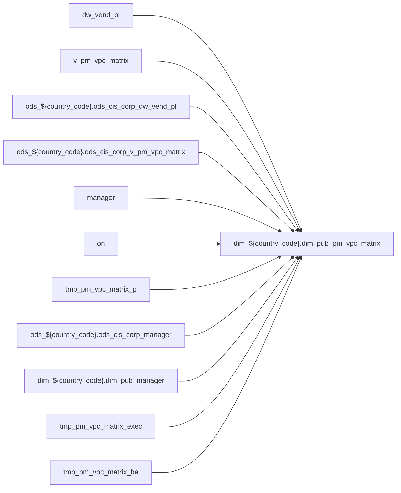

# DIM: `dim_pub_pm_vpc_matrix`

- artifact_type: etl_table
- artifact_id: dim_${country_code}.dim_pub_pm_vpc_matrix
- domain: pos
- one_line_purpose: ETL script `source/contracts/pos/bitbucket-etl/dim_pub_pm_vpc_matrix/dim_pub_pm_vpc_matrix.sql` loads `dim_${country_code}.dim_pub_pm_vpc_matrix` (layer `DIM`). Purpose inferred from SQL only.
- layer_type: DIM
- source_kind: etl_sql
- evidence_source: source/contracts/pos/bitbucket-etl/dim_pub_pm_vpc_matrix/dim_pub_pm_vpc_matrix.sql
- bitbucket_etl_bundle: source/contracts/pos/bitbucket-etl/dim_pub_pm_vpc_matrix/

---

## L1 Data Foundation

### Identity and physical mapping
- **Table:** `dim_${country_code}.dim_pub_pm_vpc_matrix`
- **Layer type:** DIM
- **Canonical / derived:** Derived / ETL-loaded (see L3)
- **Owner team:** Not documented in repository

### Grain, scope, exclusions
- **Grain:** Not documented in repository (see SELECT/GROUP BY in `source/contracts/pos/bitbucket-etl/dim_pub_pm_vpc_matrix/dim_pub_pm_vpc_matrix.sql`)
- **Partition:** `See L4 / ETL partition clause`
- **Exclusions:** See L3 Key filters

### Cross-engine presence
| Engine | Present | Canonical FQN | Notes |
|--------|---------|---------------|-------|
| Hive | yes | `dim_${country_code}.dim_pub_pm_vpc_matrix` | ETL target |
| Vertica | Not documented in repository | — | Confirm via hive2vertica flow |

### Physical schema reference

Pointer block only - full column catalog lives in WKB L1 storage JSON.

| Field | Value |
|-------|-------|
| **Authoritative catalog** | WKB L1 storage seed (not duplicated in this file) |
| **entity_id** | `dim_${country_code}.dim_pub_pm_vpc_matrix` |
| **l1_catalog_seed** | `target/storage/wkb/snapshots/_snapshot_id_template/l1_catalog/{engine}_{schema}_{table}.json` |
| **column_count** | pending (run ddl_seed_writer) |
| **partition_keys** | `See L4 / ETL partition clause` |
| **ddl_source** | pending Bitbucket DDL / Vertica metadata ingest |
| **retrieval** | `python -m tools.wkb.indexing.run_query --query "pos dim_pub_pm_vpc_matrix schema" --intent find_table_schema` |

### Lineage

- **Primary load:** `source/contracts/pos/bitbucket-etl/dim_pub_pm_vpc_matrix/dim_pub_pm_vpc_matrix.sql`
- **upstream:** `dw_vend_pl` — FROM/JOIN — `source/contracts/pos/bitbucket-etl/dim_pub_pm_vpc_matrix/dim_pub_pm_vpc_matrix.sql`
- **upstream:** `v_pm_vpc_matrix` — FROM/JOIN — `source/contracts/pos/bitbucket-etl/dim_pub_pm_vpc_matrix/dim_pub_pm_vpc_matrix.sql`
- **upstream:** `ods_${country_code}.ods_cis_corp_dw_vend_pl` — FROM/JOIN — `source/contracts/pos/bitbucket-etl/dim_pub_pm_vpc_matrix/dim_pub_pm_vpc_matrix.sql`
- **upstream:** `ods_${country_code}.ods_cis_corp_v_pm_vpc_matrix` — FROM/JOIN — `source/contracts/pos/bitbucket-etl/dim_pub_pm_vpc_matrix/dim_pub_pm_vpc_matrix.sql`
- **upstream:** `manager` — FROM/JOIN — `source/contracts/pos/bitbucket-etl/dim_pub_pm_vpc_matrix/dim_pub_pm_vpc_matrix.sql`
- **upstream:** `on` — FROM/JOIN — `source/contracts/pos/bitbucket-etl/dim_pub_pm_vpc_matrix/dim_pub_pm_vpc_matrix.sql`
- **upstream:** `tmp_pm_vpc_matrix_p` — FROM/JOIN — `source/contracts/pos/bitbucket-etl/dim_pub_pm_vpc_matrix/dim_pub_pm_vpc_matrix.sql`
- **upstream:** `ods_${country_code}.ods_cis_corp_manager` — FROM/JOIN — `source/contracts/pos/bitbucket-etl/dim_pub_pm_vpc_matrix/dim_pub_pm_vpc_matrix.sql`
- **upstream:** `dim_${country_code}.dim_pub_manager` — FROM/JOIN — `source/contracts/pos/bitbucket-etl/dim_pub_pm_vpc_matrix/dim_pub_pm_vpc_matrix.sql`
- **upstream:** `tmp_pm_vpc_matrix_exec` — FROM/JOIN — `source/contracts/pos/bitbucket-etl/dim_pub_pm_vpc_matrix/dim_pub_pm_vpc_matrix.sql`
- **upstream:** `tmp_pm_vpc_matrix_ba` — FROM/JOIN — `source/contracts/pos/bitbucket-etl/dim_pub_pm_vpc_matrix/dim_pub_pm_vpc_matrix.sql`
- **downstream:** see L6 Downstream consumers
### Freshness and load path
| Item | Value |
|------|-------|
| Load pattern | See L3 INSERT / OVERWRITE in evidence script |
| Schedule | Not documented in repository |
| Parameters | Parsed from ETL literals / `${...}` in `source/contracts/pos/bitbucket-etl/dim_pub_pm_vpc_matrix/dim_pub_pm_vpc_matrix.sql` |

## L2 Declarative Knowledge

### Business purpose
ETL script `source/contracts/pos/bitbucket-etl/dim_pub_pm_vpc_matrix/dim_pub_pm_vpc_matrix.sql` loads `dim_${country_code}.dim_pub_pm_vpc_matrix` (layer `DIM`). Purpose inferred from SQL only.

### Audience and use cases
| Audience | How they benefit |
|----------|-----------------|
| Data / BI consumers | Use target table produced by this ETL |
| Data Engineering | Maintain load logic in evidence script |

### Fact key resolution
- Keys follow target INSERT column list / GROUP BY in evidence SQL.

### Time field semantics
- Partition / date fields: `See L4 / ETL partition clause`

### Metrics served
- See L3 column derivations for measure expressions when present.

### Metric serving map
N/A — not a multi-period wide serving table (or not documented).

### etl_metrics
No calculable business metrics registered in metric-index for this create run.

## L3 Procedural Knowledge

### Query and routing rules
- Prefer querying the target `dim_${country_code}.dim_pub_pm_vpc_matrix` after successful ETL load.

### Dimension join patterns
- See Relationship map and Base tables register.

### Key filters and ETL business logic

| Predicate | Kind | Evidence |
|-----------|------|----------|
| `pm_id is not null ; ---2.pm_role = EXEC: extract managerid from manager join on VP role data drop view if exists tmp_pm_vpc_matrix_exec; create temporary view tmp_pm_vpc_matrix_exec as select vend_...` | Business | `source/contracts/pos/bitbucket-etl/dim_pub_pm_vpc_matrix/dim_pub_pm_vpc_matrix.sql` |

### Standard time-filter SQL
```sql
-- See partition / date predicates in source/contracts/pos/bitbucket-etl/dim_pub_pm_vpc_matrix/dim_pub_pm_vpc_matrix.sql
```

### End-to-end flow



### Base tables register

| Object | Role |
|--------|------|
| `dw_vend_pl` | source / temp (from ETL FROM/JOIN) |
| `v_pm_vpc_matrix` | source / temp (from ETL FROM/JOIN) |
| `ods_${country_code}.ods_cis_corp_dw_vend_pl` | source / temp (from ETL FROM/JOIN) |
| `ods_${country_code}.ods_cis_corp_v_pm_vpc_matrix` | source / temp (from ETL FROM/JOIN) |
| `manager` | source / temp (from ETL FROM/JOIN) |
| `on` | source / temp (from ETL FROM/JOIN) |
| `tmp_pm_vpc_matrix_p` | source / temp (from ETL FROM/JOIN) |
| `ods_${country_code}.ods_cis_corp_manager` | source / temp (from ETL FROM/JOIN) |
| `dim_${country_code}.dim_pub_manager` | source / temp (from ETL FROM/JOIN) |
| `tmp_pm_vpc_matrix_exec` | source / temp (from ETL FROM/JOIN) |
| `tmp_pm_vpc_matrix_ba` | source / temp (from ETL FROM/JOIN) |

### Step-by-step logic
1. Read sources listed in Base tables register (`source/contracts/pos/bitbucket-etl/dim_pub_pm_vpc_matrix/dim_pub_pm_vpc_matrix.sql`).
2. Apply filters documented under Key filters.
3. INSERT OVERWRITE / write target `dim_${country_code}.dim_pub_pm_vpc_matrix`.

### Relationship map (embedded)

| from_fqn | to_fqn | cardinality | join_keys | provenance |
|----------|--------|-------------|-----------|------------|
| `ods_${country_code}.ods_cis_corp_dw_vend_pl` | `ods_${country_code}.ods_cis_corp_v_pm_vpc_matrix` | many:1 (LEFT) | `vpl.vend_no` = `vpl_pm.vend_no`; `vpl.vpl_no` = `vpl_pm.vpl_no` | etl_sql (`source/contracts/pos/bitbucket-etl/dim_pub_pm_vpc_matrix/dim_pub_pm_vpc_matrix.sql:18`) |
| `ods_${country_code}.ods_cis_corp_dw_vend_pl` | `ods_${country_code}.ods_cis_corp_v_pm_vpc_matrix` | many:1 (LEFT) | `vpl.vend_no` = `vend_pm.vend_no`; `vpl_pm.pm_role` = `vend_pm.pm_role` | etl_sql (`source/contracts/pos/bitbucket-etl/dim_pub_pm_vpc_matrix/dim_pub_pm_vpc_matrix.sql:22`) |
| `ods_${country_code}.ods_cis_corp_dw_vend_pl` | `on` | many:1 | — | etl_sql (`source/contracts/pos/bitbucket-etl/dim_pub_pm_vpc_matrix/dim_pub_pm_vpc_matrix.sql:30`) |
| `ods_${country_code}.ods_cis_corp_dw_vend_pl` | `ods_${country_code}.ods_cis_corp_manager` | many:1 (LEFT) | — | etl_sql (`source/contracts/pos/bitbucket-etl/dim_pub_pm_vpc_matrix/dim_pub_pm_vpc_matrix.sql:40`) |
| `t` | `dim_${country_code}.dim_pub_manager` | many:1 (LEFT) | `t.pm_id` = `m.userid` | etl_sql (`source/contracts/pos/bitbucket-etl/dim_pub_pm_vpc_matrix/dim_pub_pm_vpc_matrix.sql:41`) |
| `t` | `ods_${country_code}.ods_cis_corp_v_pm_vpc_matrix` | many:1 | `t.vend_no` = `vpl_pm.vend_no`; `t.vpl_no` = `vpl_pm.vpl_no` | etl_sql (`source/contracts/pos/bitbucket-etl/dim_pub_pm_vpc_matrix/dim_pub_pm_vpc_matrix.sql:58`) |

### Special logic (embedded)

`source/ref/pos/special_logic.txt` exists but no rule naming this FQN/stem (`dim_${country_code}.dim_pub_pm_vpc_matrix`).

Not documented in repository


### Column / field derivations (from ETL SQL)

| target_column | expression_sql | upstream_columns | upstream_tables | transform_kind | evidence |
|---------------|----------------|------------------|-----------------|----------------|----------|
| `vend_no` | `vend_no` | `vend_no` | `tmp_pm_vpc_matrix_p`, `tmp_pm_vpc_matrix_exec`, `tmp_pm_vpc_matrix_ba` | passthrough | `source/contracts/pos/bitbucket-etl/dim_pub_pm_vpc_matrix/dim_pub_pm_vpc_matrix.sql:9` |
| `vpl_no` | `vpl_no` | `vpl_no` | `tmp_pm_vpc_matrix_p`, `tmp_pm_vpc_matrix_exec`, `tmp_pm_vpc_matrix_ba` | passthrough | `source/contracts/pos/bitbucket-etl/dim_pub_pm_vpc_matrix/dim_pub_pm_vpc_matrix.sql:4` |
| `pm_id` | `pm_id` | `pm_id` | `tmp_pm_vpc_matrix_p`, `tmp_pm_vpc_matrix_exec`, `tmp_pm_vpc_matrix_ba` | passthrough | `source/contracts/pos/bitbucket-etl/dim_pub_pm_vpc_matrix/dim_pub_pm_vpc_matrix.sql:9` |
| `pm_role` | `pm_role` | `pm_role` | `tmp_pm_vpc_matrix_p`, `tmp_pm_vpc_matrix_exec`, `tmp_pm_vpc_matrix_ba` | passthrough | `source/contracts/pos/bitbucket-etl/dim_pub_pm_vpc_matrix/dim_pub_pm_vpc_matrix.sql:9` |
| `primary_flag` | `primary_flag` | `primary_flag` | `tmp_pm_vpc_matrix_p`, `tmp_pm_vpc_matrix_exec`, `tmp_pm_vpc_matrix_ba` | passthrough | `source/contracts/pos/bitbucket-etl/dim_pub_pm_vpc_matrix/dim_pub_pm_vpc_matrix.sql:2` |
| `is_primary` | `'Y'` | `Y` | `tmp_pm_vpc_matrix_p`, `tmp_pm_vpc_matrix_exec`, `tmp_pm_vpc_matrix_ba` | literal | `source/contracts/pos/bitbucket-etl/dim_pub_pm_vpc_matrix/dim_pub_pm_vpc_matrix.sql:4` |
| `is_backup` | `'N'` | `N` | `tmp_pm_vpc_matrix_p`, `tmp_pm_vpc_matrix_exec`, `tmp_pm_vpc_matrix_ba` | literal | `source/contracts/pos/bitbucket-etl/dim_pub_pm_vpc_matrix/dim_pub_pm_vpc_matrix.sql:4` |
| `etl_timestamp` | `from_utc_timestamp(current_timestamp(),'America/Los_Angeles')` | `from_utc_timestamp`, `current_timestamp`, `America`, `Los_Angeles` | `tmp_pm_vpc_matrix_p`, `tmp_pm_vpc_matrix_exec`, `tmp_pm_vpc_matrix_ba` | arithmetic | `source/contracts/pos/bitbucket-etl/dim_pub_pm_vpc_matrix/dim_pub_pm_vpc_matrix.sql:69` |

### Sentinel and code values
Not documented in repository beyond CASE/exp_code predicates in ETL SQL.

## L4 Validation

### Resolved partition value
- Partition expression from ETL: `See L4 / ETL partition clause`
- Runtime values: Not documented in repository (resolve via Azkaban params when flow evidence exists).

### Data quality checks
Not documented in repository

### Validation SQL
N/A — Vertica MCP not executed during documentation (Vertica no-run policy).

### Caveats for interpretation
- Generated from ETL SQL evidence only; business definitions may need `source/ref` enrichment.

### Conflicts and open questions
None identified in repository

## L5 Runtime View

### Query path and engine preference
| Path | Engine | Evidence |
|------|--------|----------|
| ETL load | Hive/Spark | `source/contracts/pos/bitbucket-etl/dim_pub_pm_vpc_matrix/dim_pub_pm_vpc_matrix.sql` |
| Serving | Vertica (when synced) | Not documented in repository |

### Access constraints
Not documented in repository

### Query risk profile
- Scan risk depends on partition pruning; always filter partition keys when present.

## L6 Access and Consumption

### Primary consumers and use cases
Not documented in repository

### Representative query patterns
Not documented in repository

### Dependencies and notes

#### Upstream objects (verified)
| Object | Usage | Evidence |
|--------|-------|----------|
| `dw_vend_pl` | FROM/JOIN | `source/contracts/pos/bitbucket-etl/dim_pub_pm_vpc_matrix/dim_pub_pm_vpc_matrix.sql` |
| `v_pm_vpc_matrix` | FROM/JOIN | `source/contracts/pos/bitbucket-etl/dim_pub_pm_vpc_matrix/dim_pub_pm_vpc_matrix.sql` |
| `ods_${country_code}.ods_cis_corp_dw_vend_pl` | FROM/JOIN | `source/contracts/pos/bitbucket-etl/dim_pub_pm_vpc_matrix/dim_pub_pm_vpc_matrix.sql` |
| `ods_${country_code}.ods_cis_corp_v_pm_vpc_matrix` | FROM/JOIN | `source/contracts/pos/bitbucket-etl/dim_pub_pm_vpc_matrix/dim_pub_pm_vpc_matrix.sql` |
| `manager` | FROM/JOIN | `source/contracts/pos/bitbucket-etl/dim_pub_pm_vpc_matrix/dim_pub_pm_vpc_matrix.sql` |
| `on` | FROM/JOIN | `source/contracts/pos/bitbucket-etl/dim_pub_pm_vpc_matrix/dim_pub_pm_vpc_matrix.sql` |
| `tmp_pm_vpc_matrix_p` | FROM/JOIN | `source/contracts/pos/bitbucket-etl/dim_pub_pm_vpc_matrix/dim_pub_pm_vpc_matrix.sql` |
| `ods_${country_code}.ods_cis_corp_manager` | FROM/JOIN | `source/contracts/pos/bitbucket-etl/dim_pub_pm_vpc_matrix/dim_pub_pm_vpc_matrix.sql` |
| `dim_${country_code}.dim_pub_manager` | FROM/JOIN | `source/contracts/pos/bitbucket-etl/dim_pub_pm_vpc_matrix/dim_pub_pm_vpc_matrix.sql` |
| `tmp_pm_vpc_matrix_exec` | FROM/JOIN | `source/contracts/pos/bitbucket-etl/dim_pub_pm_vpc_matrix/dim_pub_pm_vpc_matrix.sql` |
| `tmp_pm_vpc_matrix_ba` | FROM/JOIN | `source/contracts/pos/bitbucket-etl/dim_pub_pm_vpc_matrix/dim_pub_pm_vpc_matrix.sql` |

#### Downstream consumers (verified)

| Object / script | Evidence |
|-----------------|----------|
| KB / contract ref: `source/contracts/pos/bitbucket-etl/MANIFEST.md` | `source/contracts/pos/bitbucket-etl/MANIFEST.md:84` |
| KB / contract ref: `source/contracts/pos/tables/dim_pub_pm_vpc_matrix.md` | `source/contracts/pos/tables/dim_pub_pm_vpc_matrix.md:5` |
| ETL/script ref: `source/contracts/rds/vertica_pos/etl/pos_scm_reference_hierarchy_rds_17482.sql` | `source/contracts/rds/vertica_pos/etl/pos_scm_reference_hierarchy_rds_17482.sql:20` |
| ETL/script ref: `source/contracts/rds/vertica_pos/etl/pos_scm_reference_hierarchy_rds_8329.sql` | `source/contracts/rds/vertica_pos/etl/pos_scm_reference_hierarchy_rds_8329.sql:20` |
| FLOW ref: `source/etl/flows/public_order_scripts/public_vpl_dimension/public_vpl_dimension_br.flow` | `source/etl/flows/public_order_scripts/public_vpl_dimension/public_vpl_dimension_br.flow:119` |
| FLOW ref: `source/etl/flows/public_order_scripts/public_vpl_dimension/public_vpl_dimension_ca.flow` | `source/etl/flows/public_order_scripts/public_vpl_dimension/public_vpl_dimension_ca.flow:108` |
| FLOW ref: `source/etl/flows/public_order_scripts/public_vpl_dimension/public_vpl_dimension_hycn.flow` | `source/etl/flows/public_order_scripts/public_vpl_dimension/public_vpl_dimension_hycn.flow:95` |
| FLOW ref: `source/etl/flows/public_order_scripts/public_vpl_dimension/public_vpl_dimension_hyuk.flow` | `source/etl/flows/public_order_scripts/public_vpl_dimension/public_vpl_dimension_hyuk.flow:101` |
| FLOW ref: `source/etl/flows/public_order_scripts/public_vpl_dimension/public_vpl_dimension_hyus.flow` | `source/etl/flows/public_order_scripts/public_vpl_dimension/public_vpl_dimension_hyus.flow:100` |
| FLOW ref: `source/etl/flows/public_order_scripts/public_vpl_dimension/public_vpl_dimension_hyww.flow` | `source/etl/flows/public_order_scripts/public_vpl_dimension/public_vpl_dimension_hyww.flow:110` |
| FLOW ref: `source/etl/flows/public_order_scripts/public_vpl_dimension/public_vpl_dimension_us.flow` | `source/etl/flows/public_order_scripts/public_vpl_dimension/public_vpl_dimension_us.flow:126` |
| FLOW ref: `source/etl/flows/public_order_scripts/public_vpl_dimension/public_vpl_dimension_wcla.flow` | `source/etl/flows/public_order_scripts/public_vpl_dimension/public_vpl_dimension_wcla.flow:129` |
| ETL/script ref: `source/etl/sql/vendor/public_order_scripts/public_vpl_dimension/script/dim_pub_pm_vpc_matrix.sql` | `source/etl/sql/vendor/public_order_scripts/public_vpl_dimension/script/dim_pub_pm_vpc_matrix.sql:2` |
| KB / contract ref: `target/knowledgebase/RDS/vertica_pos/pos_scm_reference_hierarchy_rds_17482.md` | `target/knowledgebase/RDS/vertica_pos/pos_scm_reference_hierarchy_rds_17482.md:53` |
| KB / contract ref: `target/knowledgebase/RDS/vertica_pos/pos_scm_reference_hierarchy_rds_8329.md` | `target/knowledgebase/RDS/vertica_pos/pos_scm_reference_hierarchy_rds_8329.md:53` |
| KB / contract ref: `target/knowledgebase/pos/readme.md` | `target/knowledgebase/pos/readme.md:101` |
| KB / contract ref: `target/knowledgebase/vendor/dim_pub_pm_vpc_matrix.md` | `target/knowledgebase/vendor/dim_pub_pm_vpc_matrix.md:1` |

#### Operational detail (verified)
- Partition clause: `See L4 / ETL partition clause`

#### Not documented in repository
- Schedule, owner, SLA
