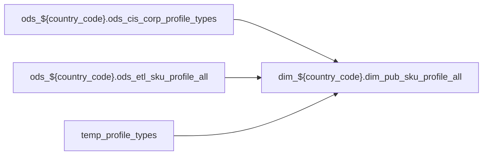

# DIM: `dim_pub_sku_profile_all`

- artifact_type: etl_table
- artifact_id: dim_${country_code}.dim_pub_sku_profile_all
- domain: pos
- one_line_purpose: ETL script `source/contracts/pos/bitbucket-etl/dim_pub_sku_profile_all/dim_pub_sku_profile_all.sql` loads `dim_${country_code}.dim_pub_sku_profile_all` (layer `DIM`). Purpose inferred from SQL only.
- layer_type: DIM
- source_kind: etl_sql
- evidence_source: source/contracts/pos/bitbucket-etl/dim_pub_sku_profile_all/dim_pub_sku_profile_all.sql
- bitbucket_etl_bundle: source/contracts/pos/bitbucket-etl/dim_pub_sku_profile_all/

---

## L1 Data Foundation

### Identity and physical mapping
- **Table:** `dim_${country_code}.dim_pub_sku_profile_all`
- **Layer type:** DIM
- **Canonical / derived:** Derived / ETL-loaded (see L3)
- **Owner team:** Not documented in repository

### Grain, scope, exclusions
- **Grain:** Not documented in repository (see SELECT/GROUP BY in `source/contracts/pos/bitbucket-etl/dim_pub_sku_profile_all/dim_pub_sku_profile_all.sql`)
- **Partition:** `See L4 / ETL partition clause`
- **Exclusions:** See L3 Key filters

### Cross-engine presence
| Engine | Present | Canonical FQN | Notes |
|--------|---------|---------------|-------|
| Hive | yes | `dim_${country_code}.dim_pub_sku_profile_all` | ETL target |
| Vertica | Not documented in repository | — | Confirm via hive2vertica flow |

### Physical schema reference

Pointer block only - full column catalog lives in WKB L1 storage JSON.

| Field | Value |
|-------|-------|
| **Authoritative catalog** | WKB L1 storage seed (not duplicated in this file) |
| **entity_id** | `dim_${country_code}.dim_pub_sku_profile_all` |
| **l1_catalog_seed** | `target/storage/wkb/snapshots/_snapshot_id_template/l1_catalog/{engine}_{schema}_{table}.json` |
| **column_count** | pending (run ddl_seed_writer) |
| **partition_keys** | `See L4 / ETL partition clause` |
| **ddl_source** | pending Bitbucket DDL / Vertica metadata ingest |
| **retrieval** | `python -m tools.wkb.indexing.run_query --query "pos dim_pub_sku_profile_all schema" --intent find_table_schema` |

### Lineage

- **Primary load:** `source/contracts/pos/bitbucket-etl/dim_pub_sku_profile_all/dim_pub_sku_profile_all.sql`
- **upstream:** `ods_${country_code}.ods_cis_corp_profile_types` — FROM/JOIN — `source/contracts/pos/bitbucket-etl/dim_pub_sku_profile_all/dim_pub_sku_profile_all.sql`
- **upstream:** `ods_${country_code}.ods_etl_sku_profile_all` — FROM/JOIN — `source/contracts/pos/bitbucket-etl/dim_pub_sku_profile_all/dim_pub_sku_profile_all.sql`
- **upstream:** `temp_profile_types` — FROM/JOIN — `source/contracts/pos/bitbucket-etl/dim_pub_sku_profile_all/dim_pub_sku_profile_all.sql`
- **downstream:** see L6 Downstream consumers
### Freshness and load path
| Item | Value |
|------|-------|
| Load pattern | See L3 INSERT / OVERWRITE in evidence script |
| Schedule | Not documented in repository |
| Parameters | Parsed from ETL literals / `${...}` in `source/contracts/pos/bitbucket-etl/dim_pub_sku_profile_all/dim_pub_sku_profile_all.sql` |

## L2 Declarative Knowledge

### Business purpose
ETL script `source/contracts/pos/bitbucket-etl/dim_pub_sku_profile_all/dim_pub_sku_profile_all.sql` loads `dim_${country_code}.dim_pub_sku_profile_all` (layer `DIM`). Purpose inferred from SQL only.

### Audience and use cases
| Audience | How they benefit |
|----------|-----------------|
| Data / BI consumers | Use target table produced by this ETL |
| Data Engineering | Maintain load logic in evidence script |

### Fact key resolution
- Keys follow target INSERT column list / GROUP BY in evidence SQL.

### Time field semantics
- Partition / date fields: `See L4 / ETL partition clause`

### Metrics served
- See L3 column derivations for measure expressions when present.

### Metric serving map
N/A — not a multi-period wide serving table (or not documented).

### etl_metrics
No calculable business metrics registered in metric-index for this create run.

## L3 Procedural Knowledge

### Query and routing rules
- Prefer querying the target `dim_${country_code}.dim_pub_sku_profile_all` after successful ETL load.

### Dimension join patterns
- See Relationship map and Base tables register.

### Key filters and ETL business logic

| Predicate | Kind | Evidence |
|-----------|------|----------|
| `profile_segment = 'SKU' AND display_flag IN ('X', 'Y') AND active = 'Y' ) c WHERE c.rn = 1; INSERT OVERWRITE TABLE dim_${country_code}.dim_pub_sku_profile_all SELECT a.sku_no ,a.profile_type ,a.pro...` | Business | `source/contracts/pos/bitbucket-etl/dim_pub_sku_profile_all/dim_pub_sku_profile_all.sql` |

### Standard time-filter SQL
```sql
-- See partition / date predicates in source/contracts/pos/bitbucket-etl/dim_pub_sku_profile_all/dim_pub_sku_profile_all.sql
```

### End-to-end flow



### Base tables register

| Object | Role |
|--------|------|
| `ods_${country_code}.ods_cis_corp_profile_types` | source / temp (from ETL FROM/JOIN) |
| `ods_${country_code}.ods_etl_sku_profile_all` | source / temp (from ETL FROM/JOIN) |
| `temp_profile_types` | source / temp (from ETL FROM/JOIN) |

### Step-by-step logic
1. Read sources listed in Base tables register (`source/contracts/pos/bitbucket-etl/dim_pub_sku_profile_all/dim_pub_sku_profile_all.sql`).
2. Apply filters documented under Key filters.
3. INSERT OVERWRITE / write target `dim_${country_code}.dim_pub_sku_profile_all`.

### Relationship map (embedded)

| from_fqn | to_fqn | cardinality | join_keys | provenance |
|----------|--------|-------------|-----------|------------|
| `ods_${country_code}.ods_etl_sku_profile_all` | `temp_profile_types` | many:1 (LEFT) | `a.profile_type` = `b.profile_type`; `a.profile_cat` = `b.profile_cat` | etl_sql (`source/contracts/pos/bitbucket-etl/dim_pub_sku_profile_all/dim_pub_sku_profile_all.sql:52`) |

### Special logic (embedded)

`source/ref/pos/special_logic.txt` exists but no rule naming this FQN/stem (`dim_${country_code}.dim_pub_sku_profile_all`).

Not documented in repository


### Column / field derivations (from ETL SQL)

| target_column | expression_sql | upstream_columns | upstream_tables | transform_kind | evidence |
|---------------|----------------|------------------|-----------------|----------------|----------|
| `sku_no` | `a.sku_no` | `sku_no` | `ods_${country_code}.ods_etl_sku_profile_all`, `temp_profile_types` | passthrough | `source/contracts/pos/bitbucket-etl/dim_pub_sku_profile_all/dim_pub_sku_profile_all.sql:25` |
| `profile_type` | `a.profile_type` | `profile_type` | `ods_${country_code}.ods_etl_sku_profile_all`, `temp_profile_types` | passthrough | `source/contracts/pos/bitbucket-etl/dim_pub_sku_profile_all/dim_pub_sku_profile_all.sql:26` |
| `profile_cat` | `a.profile_cat` | `profile_cat` | `ods_${country_code}.ods_etl_sku_profile_all`, `temp_profile_types` | passthrough | `source/contracts/pos/bitbucket-etl/dim_pub_sku_profile_all/dim_pub_sku_profile_all.sql:27` |
| `profile_datatype` | `b.profile_datatype` | `profile_datatype` | `ods_${country_code}.ods_etl_sku_profile_all`, `temp_profile_types` | passthrough | `source/contracts/pos/bitbucket-etl/dim_pub_sku_profile_all/dim_pub_sku_profile_all.sql:28` |
| `profile_desc` | `b.profile_desc` | `profile_desc` | `ods_${country_code}.ods_etl_sku_profile_all`, `temp_profile_types` | passthrough | `source/contracts/pos/bitbucket-etl/dim_pub_sku_profile_all/dim_pub_sku_profile_all.sql:29` |
| `profile_value` | `CASE WHEN b.profile_datatype = 'C' THEN COALESCE(a.profile_c, '') WHEN b.profile_datatype = 'A' THEN COALESCE(a.profi...` | `profile_datatype`, `C`, `profile_c`, `A`, `I`, `profile_i`, `F`, `profile_f`, `D`, `profile_d` | `ods_${country_code}.ods_etl_sku_profile_all`, `temp_profile_types` | case | `source/contracts/pos/bitbucket-etl/dim_pub_sku_profile_all/dim_pub_sku_profile_all.sql:24` |
| `u_version` | `a.u_version` | `u_version` | `ods_${country_code}.ods_etl_sku_profile_all`, `temp_profile_types` | passthrough | `source/contracts/pos/bitbucket-etl/dim_pub_sku_profile_all/dim_pub_sku_profile_all.sql:42` |
| `profile_c` | `a.profile_c` | `profile_c` | `ods_${country_code}.ods_etl_sku_profile_all`, `temp_profile_types` | passthrough | `source/contracts/pos/bitbucket-etl/dim_pub_sku_profile_all/dim_pub_sku_profile_all.sql:27` |
| `profile_i` | `a.profile_i` | `profile_i` | `ods_${country_code}.ods_etl_sku_profile_all`, `temp_profile_types` | passthrough | `source/contracts/pos/bitbucket-etl/dim_pub_sku_profile_all/dim_pub_sku_profile_all.sql:36` |
| `profile_f` | `a.profile_f` | `profile_f` | `ods_${country_code}.ods_etl_sku_profile_all`, `temp_profile_types` | passthrough | `source/contracts/pos/bitbucket-etl/dim_pub_sku_profile_all/dim_pub_sku_profile_all.sql:38` |
| `profile_d` | `a.profile_d` | `profile_d` | `ods_${country_code}.ods_etl_sku_profile_all`, `temp_profile_types` | passthrough | `source/contracts/pos/bitbucket-etl/dim_pub_sku_profile_all/dim_pub_sku_profile_all.sql:40` |
| `active` | `a.active` | `active` | `ods_${country_code}.ods_etl_sku_profile_all`, `temp_profile_types` | passthrough | `source/contracts/pos/bitbucket-etl/dim_pub_sku_profile_all/dim_pub_sku_profile_all.sql:47` |
| `entry_datetime` | `a.entry_datetime` | `entry_datetime` | `ods_${country_code}.ods_etl_sku_profile_all`, `temp_profile_types` | passthrough | `source/contracts/pos/bitbucket-etl/dim_pub_sku_profile_all/dim_pub_sku_profile_all.sql:48` |
| `entry_id` | `a.entry_id` | `entry_id` | `ods_${country_code}.ods_etl_sku_profile_all`, `temp_profile_types` | passthrough | `source/contracts/pos/bitbucket-etl/dim_pub_sku_profile_all/dim_pub_sku_profile_all.sql:49` |
| `data_source` | `a.data_source` | `data_source` | `ods_${country_code}.ods_etl_sku_profile_all`, `temp_profile_types` | passthrough | `source/contracts/pos/bitbucket-etl/dim_pub_sku_profile_all/dim_pub_sku_profile_all.sql:50` |

### Sentinel and code values
Not documented in repository beyond CASE/exp_code predicates in ETL SQL.

## L4 Validation

### Resolved partition value
- Partition expression from ETL: `See L4 / ETL partition clause`
- Runtime values: Not documented in repository (resolve via Azkaban params when flow evidence exists).

### Data quality checks
Not documented in repository

### Validation SQL
N/A — Vertica MCP not executed during documentation (Vertica no-run policy).

### Caveats for interpretation
- Generated from ETL SQL evidence only; business definitions may need `source/ref` enrichment.

### Conflicts and open questions
None identified in repository

## L5 Runtime View

### Query path and engine preference
| Path | Engine | Evidence |
|------|--------|----------|
| ETL load | Hive/Spark | `source/contracts/pos/bitbucket-etl/dim_pub_sku_profile_all/dim_pub_sku_profile_all.sql` |
| Serving | Vertica (when synced) | Not documented in repository |

### Access constraints
Not documented in repository

### Query risk profile
- Scan risk depends on partition pruning; always filter partition keys when present.

## L6 Access and Consumption

### Primary consumers and use cases
Not documented in repository

### Representative query patterns
Not documented in repository

### Dependencies and notes

#### Upstream objects (verified)
| Object | Usage | Evidence |
|--------|-------|----------|
| `ods_${country_code}.ods_cis_corp_profile_types` | FROM/JOIN | `source/contracts/pos/bitbucket-etl/dim_pub_sku_profile_all/dim_pub_sku_profile_all.sql` |
| `ods_${country_code}.ods_etl_sku_profile_all` | FROM/JOIN | `source/contracts/pos/bitbucket-etl/dim_pub_sku_profile_all/dim_pub_sku_profile_all.sql` |
| `temp_profile_types` | FROM/JOIN | `source/contracts/pos/bitbucket-etl/dim_pub_sku_profile_all/dim_pub_sku_profile_all.sql` |

#### Downstream consumers (verified)

| Object / script | Evidence |
|-----------------|----------|
| KB / contract ref: `source/contracts/pos/bitbucket-etl/MANIFEST.md` | `source/contracts/pos/bitbucket-etl/MANIFEST.md:91` |
| KB / contract ref: `source/contracts/pos/tables/dim_pub_sku_profile_all.md` | `source/contracts/pos/tables/dim_pub_sku_profile_all.md:5` |
| FLOW ref: `source/etl/flows/public_order_scripts/public_part_dimension/public_part_dimension_br.flow` | `source/etl/flows/public_order_scripts/public_part_dimension/public_part_dimension_br.flow:372` |
| FLOW ref: `source/etl/flows/public_order_scripts/public_part_dimension/public_part_dimension_ca.flow` | `source/etl/flows/public_order_scripts/public_part_dimension/public_part_dimension_ca.flow:376` |
| FLOW ref: `source/etl/flows/public_order_scripts/public_part_dimension/public_part_dimension_hycn.flow` | `source/etl/flows/public_order_scripts/public_part_dimension/public_part_dimension_hycn.flow:287` |
| FLOW ref: `source/etl/flows/public_order_scripts/public_part_dimension/public_part_dimension_hyuk.flow` | `source/etl/flows/public_order_scripts/public_part_dimension/public_part_dimension_hyuk.flow:289` |
| FLOW ref: `source/etl/flows/public_order_scripts/public_part_dimension/public_part_dimension_hyus.flow` | `source/etl/flows/public_order_scripts/public_part_dimension/public_part_dimension_hyus.flow:288` |
| FLOW ref: `source/etl/flows/public_order_scripts/public_part_dimension/public_part_dimension_hyww.flow` | `source/etl/flows/public_order_scripts/public_part_dimension/public_part_dimension_hyww.flow:290` |
| FLOW ref: `source/etl/flows/public_order_scripts/public_part_dimension/public_part_dimension_us.flow` | `source/etl/flows/public_order_scripts/public_part_dimension/public_part_dimension_us.flow:377` |
| FLOW ref: `source/etl/flows/public_order_scripts/public_part_dimension/public_part_dimension_wcla.flow` | `source/etl/flows/public_order_scripts/public_part_dimension/public_part_dimension_wcla.flow:382` |
| ETL/script ref: `source/etl/sql/part_sku/public_order_scripts/public_part_dimension/script/dim_pub_sku_profile_all.sql` | `source/etl/sql/part_sku/public_order_scripts/public_part_dimension/script/dim_pub_sku_profile_all.sql:23` |
| KB / contract ref: `target/knowledgebase/part_sku/dim_pub_sku_profile_all.md` | `target/knowledgebase/part_sku/dim_pub_sku_profile_all.md:1` |
| KB / contract ref: `target/knowledgebase/pos/readme.md` | `target/knowledgebase/pos/readme.md:103` |

#### Operational detail (verified)
- Partition clause: `See L4 / ETL partition clause`

#### Not documented in repository
- Schedule, owner, SLA
