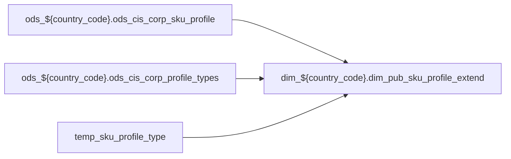

# DIM: `dim_pub_sku_profile_extend`

- artifact_type: etl_table
- artifact_id: dim_${country_code}.dim_pub_sku_profile_extend
- domain: pos
- one_line_purpose: ETL script `source/contracts/pos/bitbucket-etl/dim_pub_sku_profile_extend/dim_pub_sku_profile_extend.sql` loads `dim_${country_code}.dim_pub_sku_profile_extend` (layer `DIM`). Purpose inferred from SQL only.
- layer_type: DIM
- source_kind: etl_sql
- evidence_source: source/contracts/pos/bitbucket-etl/dim_pub_sku_profile_extend/dim_pub_sku_profile_extend.sql
- bitbucket_etl_bundle: source/contracts/pos/bitbucket-etl/dim_pub_sku_profile_extend/

---

## L1 Data Foundation

### Identity and physical mapping
- **Table:** `dim_${country_code}.dim_pub_sku_profile_extend`
- **Layer type:** DIM
- **Canonical / derived:** Derived / ETL-loaded (see L3)
- **Owner team:** Not documented in repository

### Grain, scope, exclusions
- **Grain:** Not documented in repository (see SELECT/GROUP BY in `source/contracts/pos/bitbucket-etl/dim_pub_sku_profile_extend/dim_pub_sku_profile_extend.sql`)
- **Partition:** `See L4 / ETL partition clause`
- **Exclusions:** See L3 Key filters

### Cross-engine presence
| Engine | Present | Canonical FQN | Notes |
|--------|---------|---------------|-------|
| Hive | yes | `dim_${country_code}.dim_pub_sku_profile_extend` | ETL target |
| Vertica | Not documented in repository | — | Confirm via hive2vertica flow |

### Physical schema reference

Pointer block only - full column catalog lives in WKB L1 storage JSON.

| Field | Value |
|-------|-------|
| **Authoritative catalog** | WKB L1 storage seed (not duplicated in this file) |
| **entity_id** | `dim_${country_code}.dim_pub_sku_profile_extend` |
| **l1_catalog_seed** | `target/storage/wkb/snapshots/_snapshot_id_template/l1_catalog/{engine}_{schema}_{table}.json` |
| **column_count** | pending (run ddl_seed_writer) |
| **partition_keys** | `See L4 / ETL partition clause` |
| **ddl_source** | pending Bitbucket DDL / Vertica metadata ingest |
| **retrieval** | `python -m tools.wkb.indexing.run_query --query "pos dim_pub_sku_profile_extend schema" --intent find_table_schema` |

### Lineage

- **Primary load:** `source/contracts/pos/bitbucket-etl/dim_pub_sku_profile_extend/dim_pub_sku_profile_extend.sql`
- **upstream:** `ods_${country_code}.ods_cis_corp_sku_profile` — FROM/JOIN — `source/contracts/pos/bitbucket-etl/dim_pub_sku_profile_extend/dim_pub_sku_profile_extend.sql`
- **upstream:** `ods_${country_code}.ods_cis_corp_profile_types` — FROM/JOIN — `source/contracts/pos/bitbucket-etl/dim_pub_sku_profile_extend/dim_pub_sku_profile_extend.sql`
- **upstream:** `temp_sku_profile_type` — FROM/JOIN — `source/contracts/pos/bitbucket-etl/dim_pub_sku_profile_extend/dim_pub_sku_profile_extend.sql`
- **downstream:** see L6 Downstream consumers
### Freshness and load path
| Item | Value |
|------|-------|
| Load pattern | See L3 INSERT / OVERWRITE in evidence script |
| Schedule | Not documented in repository |
| Parameters | Parsed from ETL literals / `${...}` in `source/contracts/pos/bitbucket-etl/dim_pub_sku_profile_extend/dim_pub_sku_profile_extend.sql` |

## L2 Declarative Knowledge

### Business purpose
ETL script `source/contracts/pos/bitbucket-etl/dim_pub_sku_profile_extend/dim_pub_sku_profile_extend.sql` loads `dim_${country_code}.dim_pub_sku_profile_extend` (layer `DIM`). Purpose inferred from SQL only.

### Audience and use cases
| Audience | How they benefit |
|----------|-----------------|
| Data / BI consumers | Use target table produced by this ETL |
| Data Engineering | Maintain load logic in evidence script |

### Fact key resolution
- Keys follow target INSERT column list / GROUP BY in evidence SQL.

### Time field semantics
- Partition / date fields: `See L4 / ETL partition clause`

### Metrics served
- See L3 column derivations for measure expressions when present.

### Metric serving map
N/A — not a multi-period wide serving table (or not documented).

### etl_metrics
No calculable business metrics registered in metric-index for this create run.

## L3 Procedural Knowledge

### Query and routing rules
- Prefer querying the target `dim_${country_code}.dim_pub_sku_profile_extend` after successful ETL load.

### Dimension join patterns
- See Relationship map and Base tables register.

### Key filters and ETL business logic

| Predicate | Kind | Evidence |
|-----------|------|----------|
| `sp.profile_type in ('GAME_PKG','GAME_PLAT','SHEETPRICE','MAP','MAP_EXPIRE','WHLS_INDEX') and pt.profile_datatype in ('C','I','F','D') union all select sp.sku_no, sp.profile_type, CASE WHEN sp.profi...` | Business | `source/contracts/pos/bitbucket-etl/dim_pub_sku_profile_extend/dim_pub_sku_profile_extend.sql` |

### Standard time-filter SQL
```sql
-- See partition / date predicates in source/contracts/pos/bitbucket-etl/dim_pub_sku_profile_extend/dim_pub_sku_profile_extend.sql
```

### End-to-end flow



### Base tables register

| Object | Role |
|--------|------|
| `ods_${country_code}.ods_cis_corp_sku_profile` | source / temp (from ETL FROM/JOIN) |
| `ods_${country_code}.ods_cis_corp_profile_types` | source / temp (from ETL FROM/JOIN) |
| `temp_sku_profile_type` | source / temp (from ETL FROM/JOIN) |

### Step-by-step logic
1. Read sources listed in Base tables register (`source/contracts/pos/bitbucket-etl/dim_pub_sku_profile_extend/dim_pub_sku_profile_extend.sql`).
2. Apply filters documented under Key filters.
3. INSERT OVERWRITE / write target `dim_${country_code}.dim_pub_sku_profile_extend`.

### Relationship map (embedded)

| from_fqn | to_fqn | cardinality | join_keys | provenance |
|----------|--------|-------------|-----------|------------|
| `ods_${country_code}.ods_cis_corp_sku_profile` | `ods_${country_code}.ods_cis_corp_profile_types` | many:1 | `sp.profile_type` = `pt.profile_type` | etl_sql (`source/contracts/pos/bitbucket-etl/dim_pub_sku_profile_extend/dim_pub_sku_profile_extend.sql:17`) |

### Special logic (embedded)

`source/ref/pos/special_logic.txt` exists but no rule naming this FQN/stem (`dim_${country_code}.dim_pub_sku_profile_extend`).

Not documented in repository


### Column / field derivations (from ETL SQL)

| target_column | expression_sql | upstream_columns | upstream_tables | transform_kind | evidence |
|---------------|----------------|------------------|-----------------|----------------|----------|
| `sku_no` | `spt.sku_no` | `sku_no` | `temp_sku_profile_type` | passthrough | `source/contracts/pos/bitbucket-etl/dim_pub_sku_profile_extend/dim_pub_sku_profile_extend.sql:37` |
| `game_pkg` | `max(case when spt.profile_type = 'GAME_PKG' then profile_data else '' end)` | `profile_type`, `GAME_PKG`, `profile_data` | `temp_sku_profile_type` | case | `source/contracts/pos/bitbucket-etl/dim_pub_sku_profile_extend/dim_pub_sku_profile_extend.sql:38` |
| `game_plat` | `max(case when spt.profile_type = 'GAME_PLAT' then profile_data else '' end)` | `profile_type`, `GAME_PLAT`, `profile_data` | `temp_sku_profile_type` | case | `source/contracts/pos/bitbucket-etl/dim_pub_sku_profile_extend/dim_pub_sku_profile_extend.sql:38` |
| `sheetprice` | `max(case when spt.profile_type = 'SHEETPRICE' then profile_data else ''end)` | `profile_type`, `SHEETPRICE`, `profile_data` | `temp_sku_profile_type` | case | `source/contracts/pos/bitbucket-etl/dim_pub_sku_profile_extend/dim_pub_sku_profile_extend.sql:42` |
| `min_adv_price` | `max(case when spt.profile_type = 'MAP' then profile_data else null end)` | `profile_type`, `MAP`, `profile_data` | `temp_sku_profile_type` | case | `source/contracts/pos/bitbucket-etl/dim_pub_sku_profile_extend/dim_pub_sku_profile_extend.sql:36` |
| `map_expire` | `max(case when spt.profile_type = 'MAP_EXPIRE' then profile_data else null end)` | `profile_type`, `MAP_EXPIRE`, `profile_data` | `temp_sku_profile_type` | case | `source/contracts/pos/bitbucket-etl/dim_pub_sku_profile_extend/dim_pub_sku_profile_extend.sql:46` |
| `whls_index` | `max(case when spt.profile_type = 'WHLS_INDEX' then profile_data else null end)` | `profile_type`, `WHLS_INDEX`, `profile_data` | `temp_sku_profile_type` | case | `source/contracts/pos/bitbucket-etl/dim_pub_sku_profile_extend/dim_pub_sku_profile_extend.sql:48` |
| `etl_timestamp` | `from_utc_timestamp(current_timestamp(), 'America/Los_Angeles')` | `from_utc_timestamp`, `current_timestamp`, `America`, `Los_Angeles` | `temp_sku_profile_type` | arithmetic | `source/contracts/pos/bitbucket-etl/dim_pub_sku_profile_extend/dim_pub_sku_profile_extend.sql:50` |
| `ibmsw_vppg` | `max(case when spt.profile_type = 'IBMSW_VPPG' then profile_data else null end)` | `profile_type`, `IBMSW_VPPG`, `profile_data` | `temp_sku_profile_type` | case | `source/contracts/pos/bitbucket-etl/dim_pub_sku_profile_extend/dim_pub_sku_profile_extend.sql:51` |
| `cop_cost` | `max(case when spt.profile_type = 'COP_COST' then cast(profile_data as decimal(20,8)) else null end)` | `profile_type`, `COP_COST`, `profile_data` | `temp_sku_profile_type` | case | `source/contracts/pos/bitbucket-etl/dim_pub_sku_profile_extend/dim_pub_sku_profile_extend.sql:53` |

### Sentinel and code values
Not documented in repository beyond CASE/exp_code predicates in ETL SQL.

## L4 Validation

### Resolved partition value
- Partition expression from ETL: `See L4 / ETL partition clause`
- Runtime values: Not documented in repository (resolve via Azkaban params when flow evidence exists).

### Data quality checks
Not documented in repository

### Validation SQL
N/A — Vertica MCP not executed during documentation (Vertica no-run policy).

### Caveats for interpretation
- Generated from ETL SQL evidence only; business definitions may need `source/ref` enrichment.

### Conflicts and open questions
None identified in repository

## L5 Runtime View

### Query path and engine preference
| Path | Engine | Evidence |
|------|--------|----------|
| ETL load | Hive/Spark | `source/contracts/pos/bitbucket-etl/dim_pub_sku_profile_extend/dim_pub_sku_profile_extend.sql` |
| Serving | Vertica (when synced) | Not documented in repository |

### Access constraints
Not documented in repository

### Query risk profile
- Scan risk depends on partition pruning; always filter partition keys when present.

## L6 Access and Consumption

### Primary consumers and use cases
Not documented in repository

### Representative query patterns
Not documented in repository

### Dependencies and notes

#### Upstream objects (verified)
| Object | Usage | Evidence |
|--------|-------|----------|
| `ods_${country_code}.ods_cis_corp_sku_profile` | FROM/JOIN | `source/contracts/pos/bitbucket-etl/dim_pub_sku_profile_extend/dim_pub_sku_profile_extend.sql` |
| `ods_${country_code}.ods_cis_corp_profile_types` | FROM/JOIN | `source/contracts/pos/bitbucket-etl/dim_pub_sku_profile_extend/dim_pub_sku_profile_extend.sql` |
| `temp_sku_profile_type` | FROM/JOIN | `source/contracts/pos/bitbucket-etl/dim_pub_sku_profile_extend/dim_pub_sku_profile_extend.sql` |

#### Downstream consumers (verified)

| Object / script | Evidence |
|-----------------|----------|
| KB / contract ref: `source/contracts/pos/bitbucket-etl/MANIFEST.md` | `source/contracts/pos/bitbucket-etl/MANIFEST.md:93` |
| KB / contract ref: `source/contracts/pos/tables/dim_pub_sku_profile_extend.md` | `source/contracts/pos/tables/dim_pub_sku_profile_extend.md:5` |
| ETL/script ref: `source/contracts/rds/vertica_pos/etl/pos_scm_reference_hierarchy_rds_17482.sql` | `source/contracts/rds/vertica_pos/etl/pos_scm_reference_hierarchy_rds_17482.sql:227` |
| ETL/script ref: `source/contracts/rds/vertica_pos/etl/pos_scm_reference_hierarchy_rds_8329.sql` | `source/contracts/rds/vertica_pos/etl/pos_scm_reference_hierarchy_rds_8329.sql:227` |
| FLOW ref: `source/etl/flows/public_order_scripts/public_part_dimension/public_part_dimension_br.flow` | `source/etl/flows/public_order_scripts/public_part_dimension/public_part_dimension_br.flow:348` |
| FLOW ref: `source/etl/flows/public_order_scripts/public_part_dimension/public_part_dimension_ca.flow` | `source/etl/flows/public_order_scripts/public_part_dimension/public_part_dimension_ca.flow:352` |
| FLOW ref: `source/etl/flows/public_order_scripts/public_part_dimension/public_part_dimension_hycn.flow` | `source/etl/flows/public_order_scripts/public_part_dimension/public_part_dimension_hycn.flow:68` |
| FLOW ref: `source/etl/flows/public_order_scripts/public_part_dimension/public_part_dimension_hyuk.flow` | `source/etl/flows/public_order_scripts/public_part_dimension/public_part_dimension_hyuk.flow:62` |
| FLOW ref: `source/etl/flows/public_order_scripts/public_part_dimension/public_part_dimension_hyus.flow` | `source/etl/flows/public_order_scripts/public_part_dimension/public_part_dimension_hyus.flow:69` |
| FLOW ref: `source/etl/flows/public_order_scripts/public_part_dimension/public_part_dimension_hyww.flow` | `source/etl/flows/public_order_scripts/public_part_dimension/public_part_dimension_hyww.flow:62` |
| FLOW ref: `source/etl/flows/public_order_scripts/public_part_dimension/public_part_dimension_us.flow` | `source/etl/flows/public_order_scripts/public_part_dimension/public_part_dimension_us.flow:351` |
| FLOW ref: `source/etl/flows/public_order_scripts/public_part_dimension/public_part_dimension_wcla.flow` | `source/etl/flows/public_order_scripts/public_part_dimension/public_part_dimension_wcla.flow:358` |
| ETL/script ref: `source/etl/sql/part_sku/public_order_scripts/public_part_dimension/script/dim_pub_sku_profile_extend.sql` | `source/etl/sql/part_sku/public_order_scripts/public_part_dimension/script/dim_pub_sku_profile_extend.sql:35` |
| KB / contract ref: `target/knowledgebase/RDS/vertica_pos/pos_scm_reference_hierarchy_rds_17482.md` | `target/knowledgebase/RDS/vertica_pos/pos_scm_reference_hierarchy_rds_17482.md:173` |
| KB / contract ref: `target/knowledgebase/RDS/vertica_pos/pos_scm_reference_hierarchy_rds_8329.md` | `target/knowledgebase/RDS/vertica_pos/pos_scm_reference_hierarchy_rds_8329.md:173` |
| KB / contract ref: `target/knowledgebase/part_sku/dim_pub_sku_profile_extend.md` | `target/knowledgebase/part_sku/dim_pub_sku_profile_extend.md:1` |
| KB / contract ref: `target/knowledgebase/pos/readme.md` | `target/knowledgebase/pos/readme.md:104` |

#### Operational detail (verified)
- Partition clause: `See L4 / ETL partition clause`

#### Not documented in repository
- Schedule, owner, SLA
