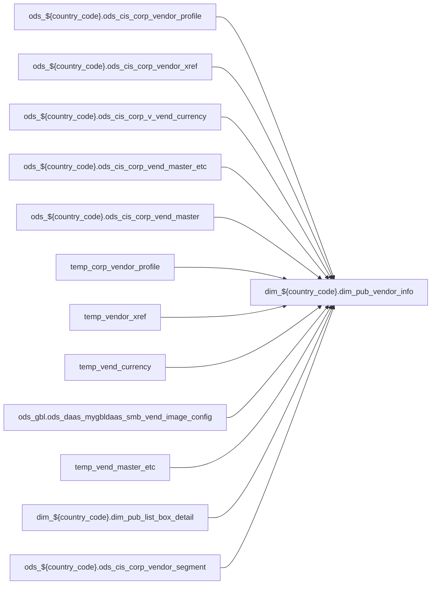

# DIM: `dim_pub_vendor_info`

- artifact_type: etl_table
- artifact_id: dim_${country_code}.dim_pub_vendor_info
- domain: pos
- one_line_purpose: ETL script `source/contracts/pos/bitbucket-etl/dim_pub_vendor_info/dim_pub_vendor_info.sql` loads `dim_${country_code}.dim_pub_vendor_info` (layer `DIM`). Purpose inferred from SQL only.
- layer_type: DIM
- source_kind: etl_sql
- evidence_source: source/contracts/pos/bitbucket-etl/dim_pub_vendor_info/dim_pub_vendor_info.sql
- bitbucket_etl_bundle: source/contracts/pos/bitbucket-etl/dim_pub_vendor_info/

---

## L1 Data Foundation

### Identity and physical mapping
- **Table:** `dim_${country_code}.dim_pub_vendor_info`
- **Layer type:** DIM
- **Canonical / derived:** Derived / ETL-loaded (see L3)
- **Owner team:** Not documented in repository

### Grain, scope, exclusions
- **Grain:** Not documented in repository (see SELECT/GROUP BY in `source/contracts/pos/bitbucket-etl/dim_pub_vendor_info/dim_pub_vendor_info.sql`)
- **Partition:** `See L4 / ETL partition clause`
- **Exclusions:** See L3 Key filters

### Cross-engine presence
| Engine | Present | Canonical FQN | Notes |
|--------|---------|---------------|-------|
| Hive | yes | `dim_${country_code}.dim_pub_vendor_info` | ETL target |
| Vertica | Not documented in repository | — | Confirm via hive2vertica flow |

### Physical schema reference

Pointer block only - full column catalog lives in WKB L1 storage JSON.

| Field | Value |
|-------|-------|
| **Authoritative catalog** | WKB L1 storage seed (not duplicated in this file) |
| **entity_id** | `dim_${country_code}.dim_pub_vendor_info` |
| **l1_catalog_seed** | `target/storage/wkb/snapshots/_snapshot_id_template/l1_catalog/{engine}_{schema}_{table}.json` |
| **column_count** | pending (run ddl_seed_writer) |
| **partition_keys** | `See L4 / ETL partition clause` |
| **ddl_source** | pending Bitbucket DDL / Vertica metadata ingest |
| **retrieval** | `python -m tools.wkb.indexing.run_query --query "pos dim_pub_vendor_info schema" --intent find_table_schema` |

### Lineage

- **Primary load:** `source/contracts/pos/bitbucket-etl/dim_pub_vendor_info/dim_pub_vendor_info.sql`
- **upstream:** `ods_${country_code}.ods_cis_corp_vendor_profile` — FROM/JOIN — `source/contracts/pos/bitbucket-etl/dim_pub_vendor_info/dim_pub_vendor_info.sql`
- **upstream:** `ods_${country_code}.ods_cis_corp_vendor_xref` — FROM/JOIN — `source/contracts/pos/bitbucket-etl/dim_pub_vendor_info/dim_pub_vendor_info.sql`
- **upstream:** `ods_${country_code}.ods_cis_corp_v_vend_currency` — FROM/JOIN — `source/contracts/pos/bitbucket-etl/dim_pub_vendor_info/dim_pub_vendor_info.sql`
- **upstream:** `ods_${country_code}.ods_cis_corp_vend_master_etc` — FROM/JOIN — `source/contracts/pos/bitbucket-etl/dim_pub_vendor_info/dim_pub_vendor_info.sql`
- **upstream:** `ods_${country_code}.ods_cis_corp_vend_master` — FROM/JOIN — `source/contracts/pos/bitbucket-etl/dim_pub_vendor_info/dim_pub_vendor_info.sql`
- **upstream:** `temp_corp_vendor_profile` — FROM/JOIN — `source/contracts/pos/bitbucket-etl/dim_pub_vendor_info/dim_pub_vendor_info.sql`
- **upstream:** `temp_vendor_xref` — FROM/JOIN — `source/contracts/pos/bitbucket-etl/dim_pub_vendor_info/dim_pub_vendor_info.sql`
- **upstream:** `temp_vend_currency` — FROM/JOIN — `source/contracts/pos/bitbucket-etl/dim_pub_vendor_info/dim_pub_vendor_info.sql`
- **upstream:** `ods_gbl.ods_daas_mygbldaas_smb_vend_image_config` — FROM/JOIN — `source/contracts/pos/bitbucket-etl/dim_pub_vendor_info/dim_pub_vendor_info.sql`
- **upstream:** `temp_vend_master_etc` — FROM/JOIN — `source/contracts/pos/bitbucket-etl/dim_pub_vendor_info/dim_pub_vendor_info.sql`
- **upstream:** `dim_${country_code}.dim_pub_list_box_detail` — FROM/JOIN — `source/contracts/pos/bitbucket-etl/dim_pub_vendor_info/dim_pub_vendor_info.sql`
- **upstream:** `ods_${country_code}.ods_cis_corp_vendor_segment` — FROM/JOIN — `source/contracts/pos/bitbucket-etl/dim_pub_vendor_info/dim_pub_vendor_info.sql`
- **upstream:** `ods_${country_code}.ods_cis_corp_v_vend_etc` — FROM/JOIN — `source/contracts/pos/bitbucket-etl/dim_pub_vendor_info/dim_pub_vendor_info.sql`
- **downstream:** see L6 Downstream consumers
### Freshness and load path
| Item | Value |
|------|-------|
| Load pattern | See L3 INSERT / OVERWRITE in evidence script |
| Schedule | Not documented in repository |
| Parameters | Parsed from ETL literals / `${...}` in `source/contracts/pos/bitbucket-etl/dim_pub_vendor_info/dim_pub_vendor_info.sql` |

## L2 Declarative Knowledge

### Business purpose
ETL script `source/contracts/pos/bitbucket-etl/dim_pub_vendor_info/dim_pub_vendor_info.sql` loads `dim_${country_code}.dim_pub_vendor_info` (layer `DIM`). Purpose inferred from SQL only.

### Audience and use cases
| Audience | How they benefit |
|----------|-----------------|
| Data / BI consumers | Use target table produced by this ETL |
| Data Engineering | Maintain load logic in evidence script |

### Fact key resolution
- Keys follow target INSERT column list / GROUP BY in evidence SQL.

### Time field semantics
- Partition / date fields: `See L4 / ETL partition clause`

### Metrics served
- See L3 column derivations for measure expressions when present.

### Metric serving map
N/A — not a multi-period wide serving table (or not documented).

### etl_metrics
No calculable business metrics registered in metric-index for this create run.

## L3 Procedural Knowledge

### Query and routing rules
- Prefer querying the target `dim_${country_code}.dim_pub_vendor_info` after successful ETL load.

### Dimension join patterns
- See Relationship map and Base tables register.

### Key filters and ETL business logic

| Predicate | Kind | Evidence |
|-----------|------|----------|
| `profile_type in ('UNI_VEND','PAS CODE','SEG','OLD_COMP','N_COMP_BRP','MKNAME')` | Business | `source/contracts/pos/bitbucket-etl/dim_pub_vendor_info/dim_pub_vendor_info.sql` |
| `x.xref_type in ('SRef','DIVS') and x.active = 'Y' and x.xref_no<>0)t where t.rn=1; create or replace TEMPORARY view temp_vend_currency as select vend_no, max(vend_currency) as vend_currency from od...` | Business | `source/contracts/pos/bitbucket-etl/dim_pub_vendor_info/dim_pub_vendor_info.sql` |
| `active = 'Y') svic on vm.vend_no=svic.vend_no left join temp_vend_master_etc vme on vm.vend_no = vme.vend_no left join temp_vendor_xref vx3 on vm.vend_no = vx3.vend_no and vx3.xref_type='DIVS' left...` | Business | `source/contracts/pos/bitbucket-etl/dim_pub_vendor_info/dim_pub_vendor_info.sql` |

### Standard time-filter SQL
```sql
-- See partition / date predicates in source/contracts/pos/bitbucket-etl/dim_pub_vendor_info/dim_pub_vendor_info.sql
```

### End-to-end flow



### Base tables register

| Object | Role |
|--------|------|
| `ods_${country_code}.ods_cis_corp_vendor_profile` | source / temp (from ETL FROM/JOIN) |
| `ods_${country_code}.ods_cis_corp_vendor_xref` | source / temp (from ETL FROM/JOIN) |
| `ods_${country_code}.ods_cis_corp_v_vend_currency` | source / temp (from ETL FROM/JOIN) |
| `ods_${country_code}.ods_cis_corp_vend_master_etc` | source / temp (from ETL FROM/JOIN) |
| `ods_${country_code}.ods_cis_corp_vend_master` | source / temp (from ETL FROM/JOIN) |
| `temp_corp_vendor_profile` | source / temp (from ETL FROM/JOIN) |
| `temp_vendor_xref` | source / temp (from ETL FROM/JOIN) |
| `temp_vend_currency` | source / temp (from ETL FROM/JOIN) |
| `ods_gbl.ods_daas_mygbldaas_smb_vend_image_config` | source / temp (from ETL FROM/JOIN) |
| `temp_vend_master_etc` | source / temp (from ETL FROM/JOIN) |
| `dim_${country_code}.dim_pub_list_box_detail` | source / temp (from ETL FROM/JOIN) |
| `ods_${country_code}.ods_cis_corp_vendor_segment` | source / temp (from ETL FROM/JOIN) |
| `ods_${country_code}.ods_cis_corp_v_vend_etc` | source / temp (from ETL FROM/JOIN) |

### Step-by-step logic
1. Read sources listed in Base tables register (`source/contracts/pos/bitbucket-etl/dim_pub_vendor_info/dim_pub_vendor_info.sql`).
2. Apply filters documented under Key filters.
3. INSERT OVERWRITE / write target `dim_${country_code}.dim_pub_vendor_info`.

### Relationship map (embedded)

| from_fqn | to_fqn | cardinality | join_keys | provenance |
|----------|--------|-------------|-----------|------------|
| `ods_${country_code}.ods_cis_corp_vend_master` | `temp_corp_vendor_profile` | many:1 (LEFT) | `vm.vend_no` = `vp.vend_no` | etl_sql (`source/contracts/pos/bitbucket-etl/dim_pub_vendor_info/dim_pub_vendor_info.sql:133`) |
| `ods_${country_code}.ods_cis_corp_vend_master` | `temp_vendor_xref` | many:1 (LEFT) | `vm.vend_no` = `vx.vend_no`; `vm.company_no` = `vx.company_no` | etl_sql (`source/contracts/pos/bitbucket-etl/dim_pub_vendor_info/dim_pub_vendor_info.sql:136`) |
| `ods_${country_code}.ods_cis_corp_vend_master` | `temp_vend_currency` | many:1 (LEFT) | `vm.vend_no` = `vc.vend_no` | etl_sql (`source/contracts/pos/bitbucket-etl/dim_pub_vendor_info/dim_pub_vendor_info.sql:141`) |
| `ods_${country_code}.ods_cis_corp_vend_master` | `ods_${country_code}.ods_cis_corp_vendor_profile` | many:1 (LEFT) | `vm.vend_no` = `vp2.vend_no` | etl_sql (`source/contracts/pos/bitbucket-etl/dim_pub_vendor_info/dim_pub_vendor_info.sql:144`) |
| `ods_${country_code}.ods_cis_corp_vend_master` | `ods_${country_code}.ods_cis_corp_vendor_xref` | many:1 (LEFT) | `vm.vend_no` = `vx2.vend_no`; `vm.company_no` = `vx2.company_no` | etl_sql (`source/contracts/pos/bitbucket-etl/dim_pub_vendor_info/dim_pub_vendor_info.sql:149`) |
| `ods_${country_code}.ods_cis_corp_vendor_xref` | `ods_${country_code}.ods_cis_corp_vend_master` | many:1 (LEFT) | `vm2.vend_no` = `vx2.xref_no` | etl_sql (`source/contracts/pos/bitbucket-etl/dim_pub_vendor_info/dim_pub_vendor_info.sql:155`) |
| `temp_vendor_xref` | `ods_${country_code}.ods_cis_corp_vend_master` | many:1 (LEFT) | `vx.vend_no` = `vm3.vend_no` | etl_sql (`source/contracts/pos/bitbucket-etl/dim_pub_vendor_info/dim_pub_vendor_info.sql:158`) |
| `ods_${country_code}.ods_cis_corp_vend_master` | `temp_vend_master_etc` | many:1 (LEFT) | `vm.vend_no` = `vme.vend_no` | etl_sql (`source/contracts/pos/bitbucket-etl/dim_pub_vendor_info/dim_pub_vendor_info.sql:162`) |
| `ods_${country_code}.ods_cis_corp_vend_master` | `temp_vendor_xref` | many:1 (LEFT) | `vm.vend_no` = `vx3.vend_no` | etl_sql (`source/contracts/pos/bitbucket-etl/dim_pub_vendor_info/dim_pub_vendor_info.sql:165`) |
| `ods_${country_code}.ods_cis_corp_vendor_profile` | `dim_${country_code}.dim_pub_list_box_detail` | many:1 (LEFT) | lbd.code_value = cast(vx3.xref_no as string) and lbd.list_box_code='DIVS' and activeflag='Y' | etl_sql (`source/contracts/pos/bitbucket-etl/dim_pub_vendor_info/dim_pub_vendor_info.sql:169`) |
| `temp_vend_master_etc` | `ods_${country_code}.ods_cis_corp_vendor_segment` | many:1 (LEFT) | `vme.seg_code` = `vseg.seg_code` | etl_sql (`source/contracts/pos/bitbucket-etl/dim_pub_vendor_info/dim_pub_vendor_info.sql:174`) |
| `ods_${country_code}.ods_cis_corp_vend_master` | `ods_${country_code}.ods_cis_corp_v_vend_etc` | many:1 (LEFT) | `vm.vend_no` = `vetc.vend_no` | etl_sql (`source/contracts/pos/bitbucket-etl/dim_pub_vendor_info/dim_pub_vendor_info.sql:176`) |

### Special logic (embedded)

`source/ref/pos/special_logic.txt` exists but no rule naming this FQN/stem (`dim_${country_code}.dim_pub_vendor_info`).

Not documented in repository


### Column / field derivations (from ETL SQL)

| target_column | expression_sql | upstream_columns | upstream_tables | transform_kind | evidence |
|---------------|----------------|------------------|-----------------|----------------|----------|
| `vend_no` | `vm.vend_no` | `vend_no` | `ods_${country_code}.ods_cis_corp_vend_master`, `temp_corp_vendor_profile`, `temp_vendor_xref`, `temp_vend_currency`, `ods_${country_code}.ods_cis_corp_vendor_profile`, `ods_${country_code}.ods_cis_corp_vendor_xref`, `ods_gbl.ods_daas_mygbldaas_smb_vend_image_config`, `temp_vend_master_etc`, `dim_${country_code}.dim_pub_list_box_detail`, `ods_${country_code}.ods_cis_corp_vendor_segment`, `ods_${country_code}.ods_cis_corp_v_vend_etc` | passthrough | `source/contracts/pos/bitbucket-etl/dim_pub_vendor_info/dim_pub_vendor_info.sql:79` |
| `vend_name` | `vm.vend_name` | `vend_name` | `ods_${country_code}.ods_cis_corp_vend_master`, `temp_corp_vendor_profile`, `temp_vendor_xref`, `temp_vend_currency`, `ods_${country_code}.ods_cis_corp_vendor_profile`, `ods_${country_code}.ods_cis_corp_vendor_xref`, `ods_gbl.ods_daas_mygbldaas_smb_vend_image_config`, `temp_vend_master_etc`, `dim_${country_code}.dim_pub_list_box_detail`, `ods_${country_code}.ods_cis_corp_vendor_segment`, `ods_${country_code}.ods_cis_corp_v_vend_etc` | passthrough | `source/contracts/pos/bitbucket-etl/dim_pub_vendor_info/dim_pub_vendor_info.sql:80` |
| `primary_loc` | `vm.primary_loc` | `primary_loc` | `ods_${country_code}.ods_cis_corp_vend_master`, `temp_corp_vendor_profile`, `temp_vendor_xref`, `temp_vend_currency`, `ods_${country_code}.ods_cis_corp_vendor_profile`, `ods_${country_code}.ods_cis_corp_vendor_xref`, `ods_gbl.ods_daas_mygbldaas_smb_vend_image_config`, `temp_vend_master_etc`, `dim_${country_code}.dim_pub_list_box_detail`, `ods_${country_code}.ods_cis_corp_vendor_segment`, `ods_${country_code}.ods_cis_corp_v_vend_etc` | passthrough | `source/contracts/pos/bitbucket-etl/dim_pub_vendor_info/dim_pub_vendor_info.sql:81` |
| `pay_to_loc` | `vm.pay_to_loc` | `pay_to_loc` | `ods_${country_code}.ods_cis_corp_vend_master`, `temp_corp_vendor_profile`, `temp_vendor_xref`, `temp_vend_currency`, `ods_${country_code}.ods_cis_corp_vendor_profile`, `ods_${country_code}.ods_cis_corp_vendor_xref`, `ods_gbl.ods_daas_mygbldaas_smb_vend_image_config`, `temp_vend_master_etc`, `dim_${country_code}.dim_pub_list_box_detail`, `ods_${country_code}.ods_cis_corp_vendor_segment`, `ods_${country_code}.ods_cis_corp_v_vend_etc` | passthrough | `source/contracts/pos/bitbucket-etl/dim_pub_vendor_info/dim_pub_vendor_info.sql:82` |
| `purchase_loc` | `vm.purchase_loc` | `purchase_loc` | `ods_${country_code}.ods_cis_corp_vend_master`, `temp_corp_vendor_profile`, `temp_vendor_xref`, `temp_vend_currency`, `ods_${country_code}.ods_cis_corp_vendor_profile`, `ods_${country_code}.ods_cis_corp_vendor_xref`, `ods_gbl.ods_daas_mygbldaas_smb_vend_image_config`, `temp_vend_master_etc`, `dim_${country_code}.dim_pub_list_box_detail`, `ods_${country_code}.ods_cis_corp_vendor_segment`, `ods_${country_code}.ods_cis_corp_v_vend_etc` | passthrough | `source/contracts/pos/bitbucket-etl/dim_pub_vendor_info/dim_pub_vendor_info.sql:83` |
| `entry_datetime` | `vm.entry_datetime` | `entry_datetime` | `ods_${country_code}.ods_cis_corp_vend_master`, `temp_corp_vendor_profile`, `temp_vendor_xref`, `temp_vend_currency`, `ods_${country_code}.ods_cis_corp_vendor_profile`, `ods_${country_code}.ods_cis_corp_vendor_xref`, `ods_gbl.ods_daas_mygbldaas_smb_vend_image_config`, `temp_vend_master_etc`, `dim_${country_code}.dim_pub_list_box_detail`, `ods_${country_code}.ods_cis_corp_vendor_segment`, `ods_${country_code}.ods_cis_corp_v_vend_etc` | passthrough | `source/contracts/pos/bitbucket-etl/dim_pub_vendor_info/dim_pub_vendor_info.sql:84` |
| `entry_id` | `vm.entry_id` | `entry_id` | `ods_${country_code}.ods_cis_corp_vend_master`, `temp_corp_vendor_profile`, `temp_vendor_xref`, `temp_vend_currency`, `ods_${country_code}.ods_cis_corp_vendor_profile`, `ods_${country_code}.ods_cis_corp_vendor_xref`, `ods_gbl.ods_daas_mygbldaas_smb_vend_image_config`, `temp_vend_master_etc`, `dim_${country_code}.dim_pub_list_box_detail`, `ods_${country_code}.ods_cis_corp_vendor_segment`, `ods_${country_code}.ods_cis_corp_v_vend_etc` | passthrough | `source/contracts/pos/bitbucket-etl/dim_pub_vendor_info/dim_pub_vendor_info.sql:85` |
| `discontinued` | `vm.discontinued` | `discontinued` | `ods_${country_code}.ods_cis_corp_vend_master`, `temp_corp_vendor_profile`, `temp_vendor_xref`, `temp_vend_currency`, `ods_${country_code}.ods_cis_corp_vendor_profile`, `ods_${country_code}.ods_cis_corp_vendor_xref`, `ods_gbl.ods_daas_mygbldaas_smb_vend_image_config`, `temp_vend_master_etc`, `dim_${country_code}.dim_pub_list_box_detail`, `ods_${country_code}.ods_cis_corp_vendor_segment`, `ods_${country_code}.ods_cis_corp_v_vend_etc` | passthrough | `source/contracts/pos/bitbucket-etl/dim_pub_vendor_info/dim_pub_vendor_info.sql:86` |
| `restricted` | `vm.restricted` | `restricted` | `ods_${country_code}.ods_cis_corp_vend_master`, `temp_corp_vendor_profile`, `temp_vendor_xref`, `temp_vend_currency`, `ods_${country_code}.ods_cis_corp_vendor_profile`, `ods_${country_code}.ods_cis_corp_vendor_xref`, `ods_gbl.ods_daas_mygbldaas_smb_vend_image_config`, `temp_vend_master_etc`, `dim_${country_code}.dim_pub_list_box_detail`, `ods_${country_code}.ods_cis_corp_vendor_segment`, `ods_${country_code}.ods_cis_corp_v_vend_etc` | passthrough | `source/contracts/pos/bitbucket-etl/dim_pub_vendor_info/dim_pub_vendor_info.sql:87` |
| `vend_type` | `vm.vend_type` | `vend_type` | `ods_${country_code}.ods_cis_corp_vend_master`, `temp_corp_vendor_profile`, `temp_vendor_xref`, `temp_vend_currency`, `ods_${country_code}.ods_cis_corp_vendor_profile`, `ods_${country_code}.ods_cis_corp_vendor_xref`, `ods_gbl.ods_daas_mygbldaas_smb_vend_image_config`, `temp_vend_master_etc`, `dim_${country_code}.dim_pub_list_box_detail`, `ods_${country_code}.ods_cis_corp_vendor_segment`, `ods_${country_code}.ods_cis_corp_v_vend_etc` | passthrough | `source/contracts/pos/bitbucket-etl/dim_pub_vendor_info/dim_pub_vendor_info.sql:88` |
| `buyer_no` | `vm.buyer_no` | `buyer_no` | `ods_${country_code}.ods_cis_corp_vend_master`, `temp_corp_vendor_profile`, `temp_vendor_xref`, `temp_vend_currency`, `ods_${country_code}.ods_cis_corp_vendor_profile`, `ods_${country_code}.ods_cis_corp_vendor_xref`, `ods_gbl.ods_daas_mygbldaas_smb_vend_image_config`, `temp_vend_master_etc`, `dim_${country_code}.dim_pub_list_box_detail`, `ods_${country_code}.ods_cis_corp_vendor_segment`, `ods_${country_code}.ods_cis_corp_v_vend_etc` | passthrough | `source/contracts/pos/bitbucket-etl/dim_pub_vendor_info/dim_pub_vendor_info.sql:89` |
| `rma_rep` | `vm.rma_rep` | `rma_rep` | `ods_${country_code}.ods_cis_corp_vend_master`, `temp_corp_vendor_profile`, `temp_vendor_xref`, `temp_vend_currency`, `ods_${country_code}.ods_cis_corp_vendor_profile`, `ods_${country_code}.ods_cis_corp_vendor_xref`, `ods_gbl.ods_daas_mygbldaas_smb_vend_image_config`, `temp_vend_master_etc`, `dim_${country_code}.dim_pub_list_box_detail`, `ods_${country_code}.ods_cis_corp_vendor_segment`, `ods_${country_code}.ods_cis_corp_v_vend_etc` | passthrough | `source/contracts/pos/bitbucket-etl/dim_pub_vendor_info/dim_pub_vendor_info.sql:90` |
| `ap_clerk` | `vm.ap_clerk` | `ap_clerk` | `ods_${country_code}.ods_cis_corp_vend_master`, `temp_corp_vendor_profile`, `temp_vendor_xref`, `temp_vend_currency`, `ods_${country_code}.ods_cis_corp_vendor_profile`, `ods_${country_code}.ods_cis_corp_vendor_xref`, `ods_gbl.ods_daas_mygbldaas_smb_vend_image_config`, `temp_vend_master_etc`, `dim_${country_code}.dim_pub_list_box_detail`, `ods_${country_code}.ods_cis_corp_vendor_segment`, `ods_${country_code}.ods_cis_corp_v_vend_etc` | passthrough | `source/contracts/pos/bitbucket-etl/dim_pub_vendor_info/dim_pub_vendor_info.sql:91` |
| `tolerance` | `vm.tolerance` | `tolerance` | `ods_${country_code}.ods_cis_corp_vend_master`, `temp_corp_vendor_profile`, `temp_vendor_xref`, `temp_vend_currency`, `ods_${country_code}.ods_cis_corp_vendor_profile`, `ods_${country_code}.ods_cis_corp_vendor_xref`, `ods_gbl.ods_daas_mygbldaas_smb_vend_image_config`, `temp_vend_master_etc`, `dim_${country_code}.dim_pub_list_box_detail`, `ods_${country_code}.ods_cis_corp_vendor_segment`, `ods_${country_code}.ods_cis_corp_v_vend_etc` | passthrough | `source/contracts/pos/bitbucket-etl/dim_pub_vendor_info/dim_pub_vendor_info.sql:92` |
| `po_type` | `vm.po_type` | `po_type` | `ods_${country_code}.ods_cis_corp_vend_master`, `temp_corp_vendor_profile`, `temp_vendor_xref`, `temp_vend_currency`, `ods_${country_code}.ods_cis_corp_vendor_profile`, `ods_${country_code}.ods_cis_corp_vendor_xref`, `ods_gbl.ods_daas_mygbldaas_smb_vend_image_config`, `temp_vend_master_etc`, `dim_${country_code}.dim_pub_list_box_detail`, `ods_${country_code}.ods_cis_corp_vendor_segment`, `ods_${country_code}.ods_cis_corp_v_vend_etc` | passthrough | `source/contracts/pos/bitbucket-etl/dim_pub_vendor_info/dim_pub_vendor_info.sql:93` |
| `vend_pay_frt` | `vm.vend_pay_frt` | `vend_pay_frt` | `ods_${country_code}.ods_cis_corp_vend_master`, `temp_corp_vendor_profile`, `temp_vendor_xref`, `temp_vend_currency`, `ods_${country_code}.ods_cis_corp_vendor_profile`, `ods_${country_code}.ods_cis_corp_vendor_xref`, `ods_gbl.ods_daas_mygbldaas_smb_vend_image_config`, `temp_vend_master_etc`, `dim_${country_code}.dim_pub_list_box_detail`, `ods_${country_code}.ods_cis_corp_vendor_segment`, `ods_${country_code}.ods_cis_corp_v_vend_etc` | passthrough | `source/contracts/pos/bitbucket-etl/dim_pub_vendor_info/dim_pub_vendor_info.sql:94` |
| `fob` | `vm.fob` | `fob` | `ods_${country_code}.ods_cis_corp_vend_master`, `temp_corp_vendor_profile`, `temp_vendor_xref`, `temp_vend_currency`, `ods_${country_code}.ods_cis_corp_vendor_profile`, `ods_${country_code}.ods_cis_corp_vendor_xref`, `ods_gbl.ods_daas_mygbldaas_smb_vend_image_config`, `temp_vend_master_etc`, `dim_${country_code}.dim_pub_list_box_detail`, `ods_${country_code}.ods_cis_corp_vendor_segment`, `ods_${country_code}.ods_cis_corp_v_vend_etc` | passthrough | `source/contracts/pos/bitbucket-etl/dim_pub_vendor_info/dim_pub_vendor_info.sql:95` |
| `stock_rotation` | `vm.stock_rotation` | `stock_rotation` | `ods_${country_code}.ods_cis_corp_vend_master`, `temp_corp_vendor_profile`, `temp_vendor_xref`, `temp_vend_currency`, `ods_${country_code}.ods_cis_corp_vendor_profile`, `ods_${country_code}.ods_cis_corp_vendor_xref`, `ods_gbl.ods_daas_mygbldaas_smb_vend_image_config`, `temp_vend_master_etc`, `dim_${country_code}.dim_pub_list_box_detail`, `ods_${country_code}.ods_cis_corp_vendor_segment`, `ods_${country_code}.ods_cis_corp_v_vend_etc` | passthrough | `source/contracts/pos/bitbucket-etl/dim_pub_vendor_info/dim_pub_vendor_info.sql:96` |
| `restock_fee` | `vm.restock_fee` | `restock_fee` | `ods_${country_code}.ods_cis_corp_vend_master`, `temp_corp_vendor_profile`, `temp_vendor_xref`, `temp_vend_currency`, `ods_${country_code}.ods_cis_corp_vendor_profile`, `ods_${country_code}.ods_cis_corp_vendor_xref`, `ods_gbl.ods_daas_mygbldaas_smb_vend_image_config`, `temp_vend_master_etc`, `dim_${country_code}.dim_pub_list_box_detail`, `ods_${country_code}.ods_cis_corp_vendor_segment`, `ods_${country_code}.ods_cis_corp_v_vend_etc` | passthrough | `source/contracts/pos/bitbucket-etl/dim_pub_vendor_info/dim_pub_vendor_info.sql:97` |
| `ship_method` | `vm.ship_method` | `ship_method` | `ods_${country_code}.ods_cis_corp_vend_master`, `temp_corp_vendor_profile`, `temp_vendor_xref`, `temp_vend_currency`, `ods_${country_code}.ods_cis_corp_vendor_profile`, `ods_${country_code}.ods_cis_corp_vendor_xref`, `ods_gbl.ods_daas_mygbldaas_smb_vend_image_config`, `temp_vend_master_etc`, `dim_${country_code}.dim_pub_list_box_detail`, `ods_${country_code}.ods_cis_corp_vendor_segment`, `ods_${country_code}.ods_cis_corp_v_vend_etc` | passthrough | `source/contracts/pos/bitbucket-etl/dim_pub_vendor_info/dim_pub_vendor_info.sql:98` |
| `freight` | `vm.freight` | `freight` | `ods_${country_code}.ods_cis_corp_vend_master`, `temp_corp_vendor_profile`, `temp_vendor_xref`, `temp_vend_currency`, `ods_${country_code}.ods_cis_corp_vendor_profile`, `ods_${country_code}.ods_cis_corp_vendor_xref`, `ods_gbl.ods_daas_mygbldaas_smb_vend_image_config`, `temp_vend_master_etc`, `dim_${country_code}.dim_pub_list_box_detail`, `ods_${country_code}.ods_cis_corp_vendor_segment`, `ods_${country_code}.ods_cis_corp_v_vend_etc` | passthrough | `source/contracts/pos/bitbucket-etl/dim_pub_vendor_info/dim_pub_vendor_info.sql:99` |
| `vend_category` | `vm.vend_category` | `vend_category` | `ods_${country_code}.ods_cis_corp_vend_master`, `temp_corp_vendor_profile`, `temp_vendor_xref`, `temp_vend_currency`, `ods_${country_code}.ods_cis_corp_vendor_profile`, `ods_${country_code}.ods_cis_corp_vendor_xref`, `ods_gbl.ods_daas_mygbldaas_smb_vend_image_config`, `temp_vend_master_etc`, `dim_${country_code}.dim_pub_list_box_detail`, `ods_${country_code}.ods_cis_corp_vendor_segment`, `ods_${country_code}.ods_cis_corp_v_vend_etc` | passthrough | `source/contracts/pos/bitbucket-etl/dim_pub_vendor_info/dim_pub_vendor_info.sql:100` |
| `ap_hold_flag` | `vm.ap_hold_flag` | `ap_hold_flag` | `ods_${country_code}.ods_cis_corp_vend_master`, `temp_corp_vendor_profile`, `temp_vendor_xref`, `temp_vend_currency`, `ods_${country_code}.ods_cis_corp_vendor_profile`, `ods_${country_code}.ods_cis_corp_vendor_xref`, `ods_gbl.ods_daas_mygbldaas_smb_vend_image_config`, `temp_vend_master_etc`, `dim_${country_code}.dim_pub_list_box_detail`, `ods_${country_code}.ods_cis_corp_vendor_segment`, `ods_${country_code}.ods_cis_corp_v_vend_etc` | passthrough | `source/contracts/pos/bitbucket-etl/dim_pub_vendor_info/dim_pub_vendor_info.sql:101` |
| `company_no` | `vm.company_no` | `company_no` | `ods_${country_code}.ods_cis_corp_vend_master`, `temp_corp_vendor_profile`, `temp_vendor_xref`, `temp_vend_currency`, `ods_${country_code}.ods_cis_corp_vendor_profile`, `ods_${country_code}.ods_cis_corp_vendor_xref`, `ods_gbl.ods_daas_mygbldaas_smb_vend_image_config`, `temp_vend_master_etc`, `dim_${country_code}.dim_pub_list_box_detail`, `ods_${country_code}.ods_cis_corp_vendor_segment`, `ods_${country_code}.ods_cis_corp_v_vend_etc` | passthrough | `source/contracts/pos/bitbucket-etl/dim_pub_vendor_info/dim_pub_vendor_info.sql:102` |
| `universal_vend_no` | `vp.universal_vend_no` | `universal_vend_no` | `ods_${country_code}.ods_cis_corp_vend_master`, `temp_corp_vendor_profile`, `temp_vendor_xref`, `temp_vend_currency`, `ods_${country_code}.ods_cis_corp_vendor_profile`, `ods_${country_code}.ods_cis_corp_vendor_xref`, `ods_gbl.ods_daas_mygbldaas_smb_vend_image_config`, `temp_vend_master_etc`, `dim_${country_code}.dim_pub_list_box_detail`, `ods_${country_code}.ods_cis_corp_vendor_segment`, `ods_${country_code}.ods_cis_corp_v_vend_etc` | passthrough | `source/contracts/pos/bitbucket-etl/dim_pub_vendor_info/dim_pub_vendor_info.sql:103` |
| `universal_vend_name` | `vp.universal_vend_name` | `universal_vend_name` | `ods_${country_code}.ods_cis_corp_vend_master`, `temp_corp_vendor_profile`, `temp_vendor_xref`, `temp_vend_currency`, `ods_${country_code}.ods_cis_corp_vendor_profile`, `ods_${country_code}.ods_cis_corp_vendor_xref`, `ods_gbl.ods_daas_mygbldaas_smb_vend_image_config`, `temp_vend_master_etc`, `dim_${country_code}.dim_pub_list_box_detail`, `ods_${country_code}.ods_cis_corp_vendor_segment`, `ods_${country_code}.ods_cis_corp_v_vend_etc` | passthrough | `source/contracts/pos/bitbucket-etl/dim_pub_vendor_info/dim_pub_vendor_info.sql:104` |
| `master_vend_flag` | `case when vx.xref_no = vm.vend_no and vx.vend_no is not null then 'Y' else 'N' end` | `xref_no`, `vend_no`, `Y`, `N` | `ods_${country_code}.ods_cis_corp_vend_master`, `temp_corp_vendor_profile`, `temp_vendor_xref`, `temp_vend_currency`, `ods_${country_code}.ods_cis_corp_vendor_profile`, `ods_${country_code}.ods_cis_corp_vendor_xref`, `ods_gbl.ods_daas_mygbldaas_smb_vend_image_config`, `temp_vend_master_etc`, `dim_${country_code}.dim_pub_list_box_detail`, `ods_${country_code}.ods_cis_corp_vendor_segment`, `ods_${country_code}.ods_cis_corp_v_vend_etc` | case | `source/contracts/pos/bitbucket-etl/dim_pub_vendor_info/dim_pub_vendor_info.sql:72` |
| `master_vend_no` | `vx.xref_no` | `xref_no` | `ods_${country_code}.ods_cis_corp_vend_master`, `temp_corp_vendor_profile`, `temp_vendor_xref`, `temp_vend_currency`, `ods_${country_code}.ods_cis_corp_vendor_profile`, `ods_${country_code}.ods_cis_corp_vendor_xref`, `ods_gbl.ods_daas_mygbldaas_smb_vend_image_config`, `temp_vend_master_etc`, `dim_${country_code}.dim_pub_list_box_detail`, `ods_${country_code}.ods_cis_corp_vendor_segment`, `ods_${country_code}.ods_cis_corp_v_vend_etc` | rename | `source/contracts/pos/bitbucket-etl/dim_pub_vendor_info/dim_pub_vendor_info.sql:106` |
| `vend_company` | `vp.vend_company` | `vend_company` | `ods_${country_code}.ods_cis_corp_vend_master`, `temp_corp_vendor_profile`, `temp_vendor_xref`, `temp_vend_currency`, `ods_${country_code}.ods_cis_corp_vendor_profile`, `ods_${country_code}.ods_cis_corp_vendor_xref`, `ods_gbl.ods_daas_mygbldaas_smb_vend_image_config`, `temp_vend_master_etc`, `dim_${country_code}.dim_pub_list_box_detail`, `ods_${country_code}.ods_cis_corp_vendor_segment`, `ods_${country_code}.ods_cis_corp_v_vend_etc` | passthrough | `source/contracts/pos/bitbucket-etl/dim_pub_vendor_info/dim_pub_vendor_info.sql:110` |
| `vend_currency` | `vc.vend_currency` | `vend_currency` | `ods_${country_code}.ods_cis_corp_vend_master`, `temp_corp_vendor_profile`, `temp_vendor_xref`, `temp_vend_currency`, `ods_${country_code}.ods_cis_corp_vendor_profile`, `ods_${country_code}.ods_cis_corp_vendor_xref`, `ods_gbl.ods_daas_mygbldaas_smb_vend_image_config`, `temp_vend_master_etc`, `dim_${country_code}.dim_pub_list_box_detail`, `ods_${country_code}.ods_cis_corp_vendor_segment`, `ods_${country_code}.ods_cis_corp_v_vend_etc` | passthrough | `source/contracts/pos/bitbucket-etl/dim_pub_vendor_info/dim_pub_vendor_info.sql:111` |
| `vend_segment` | `vp.vend_segment` | `vend_segment` | `ods_${country_code}.ods_cis_corp_vend_master`, `temp_corp_vendor_profile`, `temp_vendor_xref`, `temp_vend_currency`, `ods_${country_code}.ods_cis_corp_vendor_profile`, `ods_${country_code}.ods_cis_corp_vendor_xref`, `ods_gbl.ods_daas_mygbldaas_smb_vend_image_config`, `temp_vend_master_etc`, `dim_${country_code}.dim_pub_list_box_detail`, `ods_${country_code}.ods_cis_corp_vendor_segment`, `ods_${country_code}.ods_cis_corp_v_vend_etc` | passthrough | `source/contracts/pos/bitbucket-etl/dim_pub_vendor_info/dim_pub_vendor_info.sql:112` |
| `pas_code` | `vp.pas_code` | `pas_code` | `ods_${country_code}.ods_cis_corp_vend_master`, `temp_corp_vendor_profile`, `temp_vendor_xref`, `temp_vend_currency`, `ods_${country_code}.ods_cis_corp_vendor_profile`, `ods_${country_code}.ods_cis_corp_vendor_xref`, `ods_gbl.ods_daas_mygbldaas_smb_vend_image_config`, `temp_vend_master_etc`, `dim_${country_code}.dim_pub_list_box_detail`, `ods_${country_code}.ods_cis_corp_vendor_segment`, `ods_${country_code}.ods_cis_corp_v_vend_etc` | passthrough | `source/contracts/pos/bitbucket-etl/dim_pub_vendor_info/dim_pub_vendor_info.sql:113` |
| `etl_timestamp` | `from_utc_timestamp(current_timestamp(),'America/Los_Angeles')` | `from_utc_timestamp`, `current_timestamp`, `America`, `Los_Angeles` | `ods_${country_code}.ods_cis_corp_vend_master`, `temp_corp_vendor_profile`, `temp_vendor_xref`, `temp_vend_currency`, `ods_${country_code}.ods_cis_corp_vendor_profile`, `ods_${country_code}.ods_cis_corp_vendor_xref`, `ods_gbl.ods_daas_mygbldaas_smb_vend_image_config`, `temp_vend_master_etc`, `dim_${country_code}.dim_pub_list_box_detail`, `ods_${country_code}.ods_cis_corp_vendor_segment`, `ods_${country_code}.ods_cis_corp_v_vend_etc` | arithmetic | `source/contracts/pos/bitbucket-etl/dim_pub_vendor_info/dim_pub_vendor_info.sql:114` |
| `vend_consign_flag` | `nvl(vp2.profile_c,'N')` | `profile_c`, `N` | `ods_${country_code}.ods_cis_corp_vend_master`, `temp_corp_vendor_profile`, `temp_vendor_xref`, `temp_vend_currency`, `ods_${country_code}.ods_cis_corp_vendor_profile`, `ods_${country_code}.ods_cis_corp_vendor_xref`, `ods_gbl.ods_daas_mygbldaas_smb_vend_image_config`, `temp_vend_master_etc`, `dim_${country_code}.dim_pub_list_box_detail`, `ods_${country_code}.ods_cis_corp_vendor_segment`, `ods_${country_code}.ods_cis_corp_v_vend_etc` | coalesce | `source/contracts/pos/bitbucket-etl/dim_pub_vendor_info/dim_pub_vendor_info.sql:115` |
| `pur_vend_no` | `vx2.xref_no pur_vend_no` | `xref_no`, `pur_vend_no` | `ods_${country_code}.ods_cis_corp_vend_master`, `temp_corp_vendor_profile`, `temp_vendor_xref`, `temp_vend_currency`, `ods_${country_code}.ods_cis_corp_vendor_profile`, `ods_${country_code}.ods_cis_corp_vendor_xref`, `ods_gbl.ods_daas_mygbldaas_smb_vend_image_config`, `temp_vend_master_etc`, `dim_${country_code}.dim_pub_list_box_detail`, `ods_${country_code}.ods_cis_corp_vendor_segment`, `ods_${country_code}.ods_cis_corp_v_vend_etc` | partial | `source/contracts/pos/bitbucket-etl/dim_pub_vendor_info/dim_pub_vendor_info.sql:116` |
| `pur_vend_name` | `vm2.vend_name pur_vend_name` | `vend_name`, `pur_vend_name` | `ods_${country_code}.ods_cis_corp_vend_master`, `temp_corp_vendor_profile`, `temp_vendor_xref`, `temp_vend_currency`, `ods_${country_code}.ods_cis_corp_vendor_profile`, `ods_${country_code}.ods_cis_corp_vendor_xref`, `ods_gbl.ods_daas_mygbldaas_smb_vend_image_config`, `temp_vend_master_etc`, `dim_${country_code}.dim_pub_list_box_detail`, `ods_${country_code}.ods_cis_corp_vendor_segment`, `ods_${country_code}.ods_cis_corp_v_vend_etc` | partial | `source/contracts/pos/bitbucket-etl/dim_pub_vendor_info/dim_pub_vendor_info.sql:117` |
| `master_vend_name` | `vm3.vend_name` | `vend_name` | `ods_${country_code}.ods_cis_corp_vend_master`, `temp_corp_vendor_profile`, `temp_vendor_xref`, `temp_vend_currency`, `ods_${country_code}.ods_cis_corp_vendor_profile`, `ods_${country_code}.ods_cis_corp_vendor_xref`, `ods_gbl.ods_daas_mygbldaas_smb_vend_image_config`, `temp_vend_master_etc`, `dim_${country_code}.dim_pub_list_box_detail`, `ods_${country_code}.ods_cis_corp_vendor_segment`, `ods_${country_code}.ods_cis_corp_v_vend_etc` | rename | `source/contracts/pos/bitbucket-etl/dim_pub_vendor_info/dim_pub_vendor_info.sql:118` |
| `smb_vend_image_flag` | `case when svic.vend_no is not null then 'Y' else 'N' end` | `vend_no`, `Y`, `N` | `ods_${country_code}.ods_cis_corp_vend_master`, `temp_corp_vendor_profile`, `temp_vendor_xref`, `temp_vend_currency`, `ods_${country_code}.ods_cis_corp_vendor_profile`, `ods_${country_code}.ods_cis_corp_vendor_xref`, `ods_gbl.ods_daas_mygbldaas_smb_vend_image_config`, `temp_vend_master_etc`, `dim_${country_code}.dim_pub_list_box_detail`, `ods_${country_code}.ods_cis_corp_vendor_segment`, `ods_${country_code}.ods_cis_corp_v_vend_etc` | case | `source/contracts/pos/bitbucket-etl/dim_pub_vendor_info/dim_pub_vendor_info.sql:119` |
| `n_comp_brp_flag` | `case when vp.n_comp_brp_flag is not null then 1 else 0 end` | `n_comp_brp_flag` | `ods_${country_code}.ods_cis_corp_vend_master`, `temp_corp_vendor_profile`, `temp_vendor_xref`, `temp_vend_currency`, `ods_${country_code}.ods_cis_corp_vendor_profile`, `ods_${country_code}.ods_cis_corp_vendor_xref`, `ods_gbl.ods_daas_mygbldaas_smb_vend_image_config`, `temp_vend_master_etc`, `dim_${country_code}.dim_pub_list_box_detail`, `ods_${country_code}.ods_cis_corp_vendor_segment`, `ods_${country_code}.ods_cis_corp_v_vend_etc` | case | `source/contracts/pos/bitbucket-etl/dim_pub_vendor_info/dim_pub_vendor_info.sql:120` |
| `vend_seg_code` | `vp.vend_seg_code` | `vend_seg_code` | `ods_${country_code}.ods_cis_corp_vend_master`, `temp_corp_vendor_profile`, `temp_vendor_xref`, `temp_vend_currency`, `ods_${country_code}.ods_cis_corp_vendor_profile`, `ods_${country_code}.ods_cis_corp_vendor_xref`, `ods_gbl.ods_daas_mygbldaas_smb_vend_image_config`, `temp_vend_master_etc`, `dim_${country_code}.dim_pub_list_box_detail`, `ods_${country_code}.ods_cis_corp_vendor_segment`, `ods_${country_code}.ods_cis_corp_v_vend_etc` | passthrough | `source/contracts/pos/bitbucket-etl/dim_pub_vendor_info/dim_pub_vendor_info.sql:121` |
| `prefix` | `vme.prefix` | `prefix` | `ods_${country_code}.ods_cis_corp_vend_master`, `temp_corp_vendor_profile`, `temp_vendor_xref`, `temp_vend_currency`, `ods_${country_code}.ods_cis_corp_vendor_profile`, `ods_${country_code}.ods_cis_corp_vendor_xref`, `ods_gbl.ods_daas_mygbldaas_smb_vend_image_config`, `temp_vend_master_etc`, `dim_${country_code}.dim_pub_list_box_detail`, `ods_${country_code}.ods_cis_corp_vendor_segment`, `ods_${country_code}.ods_cis_corp_v_vend_etc` | passthrough | `source/contracts/pos/bitbucket-etl/dim_pub_vendor_info/dim_pub_vendor_info.sql:68` |
| `diversity_status` | `vx3.xref_no` | `xref_no` | `ods_${country_code}.ods_cis_corp_vend_master`, `temp_corp_vendor_profile`, `temp_vendor_xref`, `temp_vend_currency`, `ods_${country_code}.ods_cis_corp_vendor_profile`, `ods_${country_code}.ods_cis_corp_vendor_xref`, `ods_gbl.ods_daas_mygbldaas_smb_vend_image_config`, `temp_vend_master_etc`, `dim_${country_code}.dim_pub_list_box_detail`, `ods_${country_code}.ods_cis_corp_vendor_segment`, `ods_${country_code}.ods_cis_corp_v_vend_etc` | rename | `source/contracts/pos/bitbucket-etl/dim_pub_vendor_info/dim_pub_vendor_info.sql:123` |
| `diversity_status_desc` | `lbd.code_desc` | `code_desc` | `ods_${country_code}.ods_cis_corp_vend_master`, `temp_corp_vendor_profile`, `temp_vendor_xref`, `temp_vend_currency`, `ods_${country_code}.ods_cis_corp_vendor_profile`, `ods_${country_code}.ods_cis_corp_vendor_xref`, `ods_gbl.ods_daas_mygbldaas_smb_vend_image_config`, `temp_vend_master_etc`, `dim_${country_code}.dim_pub_list_box_detail`, `ods_${country_code}.ods_cis_corp_vendor_segment`, `ods_${country_code}.ods_cis_corp_v_vend_etc` | rename | `source/contracts/pos/bitbucket-etl/dim_pub_vendor_info/dim_pub_vendor_info.sql:124` |
| `vend_seg_name` | `vseg.seg_name` | `seg_name` | `ods_${country_code}.ods_cis_corp_vend_master`, `temp_corp_vendor_profile`, `temp_vendor_xref`, `temp_vend_currency`, `ods_${country_code}.ods_cis_corp_vendor_profile`, `ods_${country_code}.ods_cis_corp_vendor_xref`, `ods_gbl.ods_daas_mygbldaas_smb_vend_image_config`, `temp_vend_master_etc`, `dim_${country_code}.dim_pub_list_box_detail`, `ods_${country_code}.ods_cis_corp_vendor_segment`, `ods_${country_code}.ods_cis_corp_v_vend_etc` | rename | `source/contracts/pos/bitbucket-etl/dim_pub_vendor_info/dim_pub_vendor_info.sql:125` |
| `cis_mk_name` | `vp.cis_mk_name` | `cis_mk_name` | `ods_${country_code}.ods_cis_corp_vend_master`, `temp_corp_vendor_profile`, `temp_vendor_xref`, `temp_vend_currency`, `ods_${country_code}.ods_cis_corp_vendor_profile`, `ods_${country_code}.ods_cis_corp_vendor_xref`, `ods_gbl.ods_daas_mygbldaas_smb_vend_image_config`, `temp_vend_master_etc`, `dim_${country_code}.dim_pub_list_box_detail`, `ods_${country_code}.ods_cis_corp_vendor_segment`, `ods_${country_code}.ods_cis_corp_v_vend_etc` | passthrough | `source/contracts/pos/bitbucket-etl/dim_pub_vendor_info/dim_pub_vendor_info.sql:126` |
| `vend_rank` | `vp.vend_rank` | `vend_rank` | `ods_${country_code}.ods_cis_corp_vend_master`, `temp_corp_vendor_profile`, `temp_vendor_xref`, `temp_vend_currency`, `ods_${country_code}.ods_cis_corp_vendor_profile`, `ods_${country_code}.ods_cis_corp_vendor_xref`, `ods_gbl.ods_daas_mygbldaas_smb_vend_image_config`, `temp_vend_master_etc`, `dim_${country_code}.dim_pub_list_box_detail`, `ods_${country_code}.ods_cis_corp_vendor_segment`, `ods_${country_code}.ods_cis_corp_v_vend_etc` | passthrough | `source/contracts/pos/bitbucket-etl/dim_pub_vendor_info/dim_pub_vendor_info.sql:127` |
| `vend_pay_frt_amt` | `vme.vend_pay_frt_amt` | `vend_pay_frt_amt` | `ods_${country_code}.ods_cis_corp_vend_master`, `temp_corp_vendor_profile`, `temp_vendor_xref`, `temp_vend_currency`, `ods_${country_code}.ods_cis_corp_vendor_profile`, `ods_${country_code}.ods_cis_corp_vendor_xref`, `ods_gbl.ods_daas_mygbldaas_smb_vend_image_config`, `temp_vend_master_etc`, `dim_${country_code}.dim_pub_list_box_detail`, `ods_${country_code}.ods_cis_corp_vendor_segment`, `ods_${country_code}.ods_cis_corp_v_vend_etc` | passthrough | `source/contracts/pos/bitbucket-etl/dim_pub_vendor_info/dim_pub_vendor_info.sql:69` |
| `discont_pur` | `vme.discont_pur` | `discont_pur` | `ods_${country_code}.ods_cis_corp_vend_master`, `temp_corp_vendor_profile`, `temp_vendor_xref`, `temp_vend_currency`, `ods_${country_code}.ods_cis_corp_vendor_profile`, `ods_${country_code}.ods_cis_corp_vendor_xref`, `ods_gbl.ods_daas_mygbldaas_smb_vend_image_config`, `temp_vend_master_etc`, `dim_${country_code}.dim_pub_list_box_detail`, `ods_${country_code}.ods_cis_corp_vendor_segment`, `ods_${country_code}.ods_cis_corp_v_vend_etc` | passthrough | `source/contracts/pos/bitbucket-etl/dim_pub_vendor_info/dim_pub_vendor_info.sql:70` |
| `vend_terms` | `vetc.vend_terms` | `vend_terms` | `ods_${country_code}.ods_cis_corp_vend_master`, `temp_corp_vendor_profile`, `temp_vendor_xref`, `temp_vend_currency`, `ods_${country_code}.ods_cis_corp_vendor_profile`, `ods_${country_code}.ods_cis_corp_vendor_xref`, `ods_gbl.ods_daas_mygbldaas_smb_vend_image_config`, `temp_vend_master_etc`, `dim_${country_code}.dim_pub_list_box_detail`, `ods_${country_code}.ods_cis_corp_vendor_segment`, `ods_${country_code}.ods_cis_corp_v_vend_etc` | passthrough | `source/contracts/pos/bitbucket-etl/dim_pub_vendor_info/dim_pub_vendor_info.sql:130` |

### Sentinel and code values
Not documented in repository beyond CASE/exp_code predicates in ETL SQL.

## L4 Validation

### Resolved partition value
- Partition expression from ETL: `See L4 / ETL partition clause`
- Runtime values: Not documented in repository (resolve via Azkaban params when flow evidence exists).

### Data quality checks
Not documented in repository

### Validation SQL
N/A — Vertica MCP not executed during documentation (Vertica no-run policy).

### Caveats for interpretation
- Generated from ETL SQL evidence only; business definitions may need `source/ref` enrichment.

### Conflicts and open questions
None identified in repository

## L5 Runtime View

### Query path and engine preference
| Path | Engine | Evidence |
|------|--------|----------|
| ETL load | Hive/Spark | `source/contracts/pos/bitbucket-etl/dim_pub_vendor_info/dim_pub_vendor_info.sql` |
| Serving | Vertica (when synced) | Not documented in repository |

### Access constraints
Not documented in repository

### Query risk profile
- Scan risk depends on partition pruning; always filter partition keys when present.

## L6 Access and Consumption

### Primary consumers and use cases
Not documented in repository

### Representative query patterns
Not documented in repository

### Dependencies and notes

#### Upstream objects (verified)
| Object | Usage | Evidence |
|--------|-------|----------|
| `ods_${country_code}.ods_cis_corp_vendor_profile` | FROM/JOIN | `source/contracts/pos/bitbucket-etl/dim_pub_vendor_info/dim_pub_vendor_info.sql` |
| `ods_${country_code}.ods_cis_corp_vendor_xref` | FROM/JOIN | `source/contracts/pos/bitbucket-etl/dim_pub_vendor_info/dim_pub_vendor_info.sql` |
| `ods_${country_code}.ods_cis_corp_v_vend_currency` | FROM/JOIN | `source/contracts/pos/bitbucket-etl/dim_pub_vendor_info/dim_pub_vendor_info.sql` |
| `ods_${country_code}.ods_cis_corp_vend_master_etc` | FROM/JOIN | `source/contracts/pos/bitbucket-etl/dim_pub_vendor_info/dim_pub_vendor_info.sql` |
| `ods_${country_code}.ods_cis_corp_vend_master` | FROM/JOIN | `source/contracts/pos/bitbucket-etl/dim_pub_vendor_info/dim_pub_vendor_info.sql` |
| `temp_corp_vendor_profile` | FROM/JOIN | `source/contracts/pos/bitbucket-etl/dim_pub_vendor_info/dim_pub_vendor_info.sql` |
| `temp_vendor_xref` | FROM/JOIN | `source/contracts/pos/bitbucket-etl/dim_pub_vendor_info/dim_pub_vendor_info.sql` |
| `temp_vend_currency` | FROM/JOIN | `source/contracts/pos/bitbucket-etl/dim_pub_vendor_info/dim_pub_vendor_info.sql` |
| `ods_gbl.ods_daas_mygbldaas_smb_vend_image_config` | FROM/JOIN | `source/contracts/pos/bitbucket-etl/dim_pub_vendor_info/dim_pub_vendor_info.sql` |
| `temp_vend_master_etc` | FROM/JOIN | `source/contracts/pos/bitbucket-etl/dim_pub_vendor_info/dim_pub_vendor_info.sql` |
| `dim_${country_code}.dim_pub_list_box_detail` | FROM/JOIN | `source/contracts/pos/bitbucket-etl/dim_pub_vendor_info/dim_pub_vendor_info.sql` |
| `ods_${country_code}.ods_cis_corp_vendor_segment` | FROM/JOIN | `source/contracts/pos/bitbucket-etl/dim_pub_vendor_info/dim_pub_vendor_info.sql` |
| `ods_${country_code}.ods_cis_corp_v_vend_etc` | FROM/JOIN | `source/contracts/pos/bitbucket-etl/dim_pub_vendor_info/dim_pub_vendor_info.sql` |

#### Downstream consumers (verified)

| Object / script | Evidence |
|-----------------|----------|
| ETL/script ref: `source/contracts/b-report-us/bitbicket_etl/dws_disty_brpt_pl_extend_1d/Common/python/dws_disty_brpt_pl_extend_1d.py` | `source/contracts/b-report-us/bitbicket_etl/dws_disty_brpt_pl_extend_1d/Common/python/dws_disty_brpt_pl_extend_1d.py:16` |
| ETL/script ref: `source/contracts/b-report-us/bitbicket_etl/dws_disty_brpt_pl_extend_mtd/Common/python/dws_disty_brpt_pl_extend_mtd.py` | `source/contracts/b-report-us/bitbicket_etl/dws_disty_brpt_pl_extend_mtd/Common/python/dws_disty_brpt_pl_extend_mtd.py:32` |
| KB / contract ref: `source/contracts/b-report-us/bitbicket_etl/readme.md` | `source/contracts/b-report-us/bitbicket_etl/readme.md:40` |
| KB / contract ref: `source/contracts/b-report-us/domain-knowledge.md` | `source/contracts/b-report-us/domain-knowledge.md:18` |
| KB / contract ref: `source/contracts/b-report-us/eval/golden_cases.md` | `source/contracts/b-report-us/eval/golden_cases.md:407` |
| KB / contract ref: `source/contracts/b-report-us/golden-questions.md` | `source/contracts/b-report-us/golden-questions.md:94` |
| KB / contract ref: `source/contracts/b-report-us/metric-index.md` | `source/contracts/b-report-us/metric-index.md:196` |
| KB / contract ref: `source/contracts/b-report-us/tables/dim_pub_part_info.md` | `source/contracts/b-report-us/tables/dim_pub_part_info.md:57` |
| KB / contract ref: `source/contracts/b-report-us/tables/dim_pub_vendor_info.md` | `source/contracts/b-report-us/tables/dim_pub_vendor_info.md:1` |
| KB / contract ref: `source/contracts/b-report-us/tables/dim_pub_vendor_segment.md` | `source/contracts/b-report-us/tables/dim_pub_vendor_segment.md:40` |
| KB / contract ref: `source/contracts/b-report-us/tables/dim_pub_vpl_hierarchy_info.md` | `source/contracts/b-report-us/tables/dim_pub_vpl_hierarchy_info.md:42` |
| KB / contract ref: `source/contracts/b-report-us/tables/dim_pub_vpl_info.md` | `source/contracts/b-report-us/tables/dim_pub_vpl_info.md:43` |
| KB / contract ref: `source/contracts/b-report-us/tables/dm_disty_brpt_bd_rep_1d.md` | `source/contracts/b-report-us/tables/dm_disty_brpt_bd_rep_1d.md:203` |
| KB / contract ref: `source/contracts/b-report-us/tables/dm_disty_brpt_bd_rep_comb_mtd.md` | `source/contracts/b-report-us/tables/dm_disty_brpt_bd_rep_comb_mtd.md:299` |
| KB / contract ref: `source/contracts/b-report-us/tables/dm_disty_brpt_bd_rep_mtd.md` | `source/contracts/b-report-us/tables/dm_disty_brpt_bd_rep_mtd.md:224` |
| KB / contract ref: `source/contracts/b-report-us/tables/dm_disty_brpt_bd_rep_wtd.md` | `source/contracts/b-report-us/tables/dm_disty_brpt_bd_rep_wtd.md:205` |
| KB / contract ref: `source/contracts/b-report-us/tables/dm_disty_brpt_buyer_1d.md` | `source/contracts/b-report-us/tables/dm_disty_brpt_buyer_1d.md:214` |
| KB / contract ref: `source/contracts/b-report-us/tables/dm_disty_brpt_buyer_comb_mtd.md` | `source/contracts/b-report-us/tables/dm_disty_brpt_buyer_comb_mtd.md:301` |
| KB / contract ref: `source/contracts/b-report-us/tables/dm_disty_brpt_buyer_mtd.md` | `source/contracts/b-report-us/tables/dm_disty_brpt_buyer_mtd.md:228` |
| KB / contract ref: `source/contracts/b-report-us/tables/dm_disty_brpt_buyer_wtd.md` | `source/contracts/b-report-us/tables/dm_disty_brpt_buyer_wtd.md:216` |
| KB / contract ref: `source/contracts/b-report-us/tables/dm_disty_brpt_pm_1d.md` | `source/contracts/b-report-us/tables/dm_disty_brpt_pm_1d.md:215` |
| KB / contract ref: `source/contracts/b-report-us/tables/dm_disty_brpt_pm_comb_mtd.md` | `source/contracts/b-report-us/tables/dm_disty_brpt_pm_comb_mtd.md:311` |
| KB / contract ref: `source/contracts/b-report-us/tables/dm_disty_brpt_pm_mtd.md` | `source/contracts/b-report-us/tables/dm_disty_brpt_pm_mtd.md:104` |
| KB / contract ref: `source/contracts/b-report-us/tables/dm_disty_brpt_pm_wtd.md` | `source/contracts/b-report-us/tables/dm_disty_brpt_pm_wtd.md:217` |
| KB / contract ref: `source/contracts/b-report-us/tables/dm_disty_brpt_sales_1d.md` | `source/contracts/b-report-us/tables/dm_disty_brpt_sales_1d.md:207` |
| KB / contract ref: `source/contracts/b-report-us/tables/dm_disty_brpt_sales_comb_mtd.md` | `source/contracts/b-report-us/tables/dm_disty_brpt_sales_comb_mtd.md:309` |
| KB / contract ref: `source/contracts/b-report-us/tables/dm_disty_brpt_sales_mtd.md` | `source/contracts/b-report-us/tables/dm_disty_brpt_sales_mtd.md:236` |
| KB / contract ref: `source/contracts/b-report-us/tables/dm_disty_brpt_sales_wtd.md` | `source/contracts/b-report-us/tables/dm_disty_brpt_sales_wtd.md:209` |
| KB / contract ref: `source/contracts/b-report-us/tables/dwd_disty_brpt_orders_pl_di.md` | `source/contracts/b-report-us/tables/dwd_disty_brpt_orders_pl_di.md:55` |
| KB / contract ref: `source/contracts/b-report-us/tables/dwd_disty_brpt_orders_pl_etl_mi.md` | `source/contracts/b-report-us/tables/dwd_disty_brpt_orders_pl_etl_mi.md:252` |
| KB / contract ref: `source/contracts/b-report-us/tables/dws_disty_brpt_bd_1d.md` | `source/contracts/b-report-us/tables/dws_disty_brpt_bd_1d.md:74` |
| KB / contract ref: `source/contracts/b-report-us/tables/dws_disty_brpt_bd_cust_1d.md` | `source/contracts/b-report-us/tables/dws_disty_brpt_bd_cust_1d.md:213` |
| KB / contract ref: `source/contracts/b-report-us/tables/dws_disty_brpt_bd_cust_comb_mtd.md` | `source/contracts/b-report-us/tables/dws_disty_brpt_bd_cust_comb_mtd.md:245` |
| KB / contract ref: `source/contracts/b-report-us/tables/dws_disty_brpt_bd_cust_mtd.md` | `source/contracts/b-report-us/tables/dws_disty_brpt_bd_cust_mtd.md:224` |
| KB / contract ref: `source/contracts/b-report-us/tables/dws_disty_brpt_bd_cust_wtd.md` | `source/contracts/b-report-us/tables/dws_disty_brpt_bd_cust_wtd.md:215` |
| KB / contract ref: `source/contracts/b-report-us/tables/dws_disty_brpt_bd_mtd.md` | `source/contracts/b-report-us/tables/dws_disty_brpt_bd_mtd.md:75` |
| KB / contract ref: `source/contracts/b-report-us/tables/dws_disty_brpt_bd_part_1d.md` | `source/contracts/b-report-us/tables/dws_disty_brpt_bd_part_1d.md:52` |
| KB / contract ref: `source/contracts/b-report-us/tables/dws_disty_brpt_bd_part_comb_mtd.md` | `source/contracts/b-report-us/tables/dws_disty_brpt_bd_part_comb_mtd.md:53` |
| KB / contract ref: `source/contracts/b-report-us/tables/dws_disty_brpt_bd_part_mtd.md` | `source/contracts/b-report-us/tables/dws_disty_brpt_bd_part_mtd.md:53` |
| KB / contract ref: `source/contracts/b-report-us/tables/dws_disty_brpt_bd_part_wtd.md` | `source/contracts/b-report-us/tables/dws_disty_brpt_bd_part_wtd.md:54` |

#### Operational detail (verified)
- Partition clause: `See L4 / ETL partition clause`

#### Not documented in repository
- Schedule, owner, SLA
