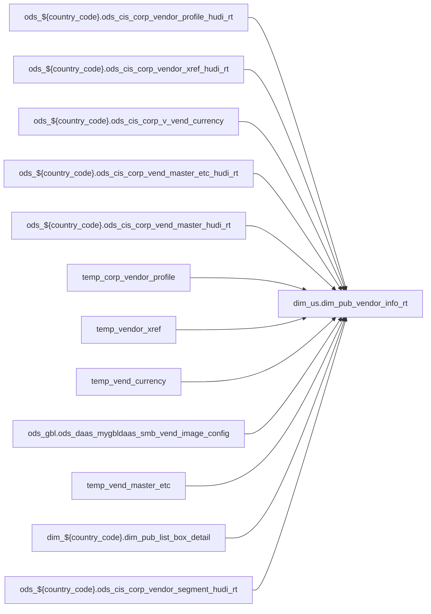

# DIM: Shared dimension for POS attribute enrichment (`dim_us.dim_pub_vendor_info_rt`)

- artifact_type: etl_table
- artifact_id: dim_us.dim_pub_vendor_info_rt
- domain: pos
- one_line_purpose: POS-domain table with load SQL under bitbucket-etl (see L3); prior contract narrative preserved below when present.
- layer_type: DIM
- source_kind: etl_sql
- evidence_source: source/contracts/pos/bitbucket-etl/dim_pub_vendor_info_rt/dim_pub_vendor_info_rt.sql
- bitbucket_etl_bundle: source/contracts/pos/bitbucket-etl/dim_pub_vendor_info_rt/
- related_etl_scripts:
- None

---

## L1 Data Foundation

### Identity and physical mapping
- **Table:** `dim_us.dim_pub_vendor_info_rt`
- **Layer type:** DIM
- **Canonical / derived:** Derived / ETL-loaded (see L3 from bitbucket-etl)
- **Owner team:** Not documented in repository

### Grain, scope, exclusions
- See preserved **Grain and keys** section below when present (POS contract narrative retained).
- Otherwise infer from SELECT / GROUP BY / INSERT column list in `source/contracts/pos/bitbucket-etl/dim_pub_vendor_info_rt/dim_pub_vendor_info_rt.sql`.

### Cross-engine presence
| Engine | Present | Notes |
|--------|---------|-------|
| Hive | yes | ETL load target |
| Vertica | yes when POS contract documents Vertica sync | See preserved Business query tables |

### Physical schema reference

| Field | Value |
|-------|-------|
| **entity_id** | `dim_us.dim_pub_vendor_info_rt` |
| **l1_catalog_seed** | `target/storage/wkb/snapshots/_snapshot_id_template/l1_catalog/{engine}_{schema}_{table}.json` |
| **column_count** | pending (run ddl_seed_writer) |
| **partition_keys** | See preserved Grain / L4 / ETL PARTITION clause |
| **ddl_source** | pending |
| **retrieval** | `python -m tools.wkb.indexing.run_query --query "pos dim_pub_vendor_info_rt schema" --intent find_table_schema` |

### Lineage

- **Primary load:** `source/contracts/pos/bitbucket-etl/dim_pub_vendor_info_rt/dim_pub_vendor_info_rt.sql`
- **upstream:** `ods_${country_code}.ods_cis_corp_vendor_profile_hudi_rt` — FROM/JOIN — `source/contracts/pos/bitbucket-etl/dim_pub_vendor_info_rt/dim_pub_vendor_info_rt.sql`
- **upstream:** `ods_${country_code}.ods_cis_corp_vendor_xref_hudi_rt` — FROM/JOIN — `source/contracts/pos/bitbucket-etl/dim_pub_vendor_info_rt/dim_pub_vendor_info_rt.sql`
- **upstream:** `ods_${country_code}.ods_cis_corp_v_vend_currency` — FROM/JOIN — `source/contracts/pos/bitbucket-etl/dim_pub_vendor_info_rt/dim_pub_vendor_info_rt.sql`
- **upstream:** `ods_${country_code}.ods_cis_corp_vend_master_etc_hudi_rt` — FROM/JOIN — `source/contracts/pos/bitbucket-etl/dim_pub_vendor_info_rt/dim_pub_vendor_info_rt.sql`
- **upstream:** `ods_${country_code}.ods_cis_corp_vend_master_hudi_rt` — FROM/JOIN — `source/contracts/pos/bitbucket-etl/dim_pub_vendor_info_rt/dim_pub_vendor_info_rt.sql`
- **upstream:** `temp_corp_vendor_profile` — FROM/JOIN — `source/contracts/pos/bitbucket-etl/dim_pub_vendor_info_rt/dim_pub_vendor_info_rt.sql`
- **upstream:** `temp_vendor_xref` — FROM/JOIN — `source/contracts/pos/bitbucket-etl/dim_pub_vendor_info_rt/dim_pub_vendor_info_rt.sql`
- **upstream:** `temp_vend_currency` — FROM/JOIN — `source/contracts/pos/bitbucket-etl/dim_pub_vendor_info_rt/dim_pub_vendor_info_rt.sql`
- **upstream:** `ods_gbl.ods_daas_mygbldaas_smb_vend_image_config` — FROM/JOIN — `source/contracts/pos/bitbucket-etl/dim_pub_vendor_info_rt/dim_pub_vendor_info_rt.sql`
- **upstream:** `temp_vend_master_etc` — FROM/JOIN — `source/contracts/pos/bitbucket-etl/dim_pub_vendor_info_rt/dim_pub_vendor_info_rt.sql`
- **upstream:** `dim_${country_code}.dim_pub_list_box_detail` — FROM/JOIN — `source/contracts/pos/bitbucket-etl/dim_pub_vendor_info_rt/dim_pub_vendor_info_rt.sql`
- **upstream:** `ods_${country_code}.ods_cis_corp_vendor_segment_hudi_rt` — FROM/JOIN — `source/contracts/pos/bitbucket-etl/dim_pub_vendor_info_rt/dim_pub_vendor_info_rt.sql`
- **downstream:** see L6 Downstream consumers
### Freshness and load path
- Parameters / date window: see ETL `${literal_*}` / `${date_flag}` / `${start_date}` in evidence script.
- Schedule: Not documented in repository

## L2 Declarative Knowledge

### Business purpose
See preserved **Business purpose** below when present (POS contract catalog + linked ETL).

### Audience and use cases
See preserved **Who it helps** section when present.

### Fact key resolution
See preserved **Grain and keys** when present.

### Time field semantics
- Prefer partition / `date_flag` filters documented in preserved sections and L3 Key filters from ETL.

### Metrics served
See preserved Metrics / column groups when present; otherwise L3 column derivations.

### Metric serving map
N/A unless multi-period wide table (see preserved content).

### etl_metrics
No new metric-index formulas appended in this bitbucket-etl upgrade pass.

## L3 Procedural Knowledge

### Query and routing rules
- Reporting: Vertica `dim_us.dim_pub_vendor_info_rt` when synced (see preserved Business query tables).
- Load logic: bitbucket-etl evidence `source/contracts/pos/bitbucket-etl/dim_pub_vendor_info_rt/dim_pub_vendor_info_rt.sql`.

### Dimension join patterns
See Relationship map (ETL JOIN edges) and preserved contract join notes.

### Key filters and ETL business logic

| Predicate | Kind | Evidence |
|-----------|------|----------|
| `profile_type in ('UNI_VEND','PAS CODE','SEG','OLD_COMP','N_COMP_BRP','MKNAME')` | Business | `source/contracts/pos/bitbucket-etl/dim_pub_vendor_info_rt/dim_pub_vendor_info_rt.sql` |
| `x.xref_type in ('SRef','DIVS') and x.active = 'Y' and x.xref_no<>0)t where t.rn=1; create or replace TEMPORARY view temp_vend_currency as select vend_no, max(vend_currency) as vend_currency from od...` | Business | `source/contracts/pos/bitbucket-etl/dim_pub_vendor_info_rt/dim_pub_vendor_info_rt.sql` |
| `active = 'Y') svic on vm.vend_no=svic.vend_no left join temp_vend_master_etc vme on vm.vend_no = vme.vend_no left join temp_vendor_xref vx3 on vm.vend_no = vx3.vend_no and vx3.xref_type='DIVS' left...` | Business | `source/contracts/pos/bitbucket-etl/dim_pub_vendor_info_rt/dim_pub_vendor_info_rt.sql` |

### Standard time-filter SQL
```sql
-- Prefer date_flag / literal_start_date / literal_end_date as used in source/contracts/pos/bitbucket-etl/dim_pub_vendor_info_rt/dim_pub_vendor_info_rt.sql
```

### End-to-end flow


### Base tables register
| Object | Role |
|--------|------|
| `ods_${country_code}.ods_cis_corp_vendor_profile_hudi_rt` | source / temp (FROM/JOIN) |
| `ods_${country_code}.ods_cis_corp_vendor_xref_hudi_rt` | source / temp (FROM/JOIN) |
| `ods_${country_code}.ods_cis_corp_v_vend_currency` | source / temp (FROM/JOIN) |
| `ods_${country_code}.ods_cis_corp_vend_master_etc_hudi_rt` | source / temp (FROM/JOIN) |
| `ods_${country_code}.ods_cis_corp_vend_master_hudi_rt` | source / temp (FROM/JOIN) |
| `temp_corp_vendor_profile` | source / temp (FROM/JOIN) |
| `temp_vendor_xref` | source / temp (FROM/JOIN) |
| `temp_vend_currency` | source / temp (FROM/JOIN) |
| `ods_gbl.ods_daas_mygbldaas_smb_vend_image_config` | source / temp (FROM/JOIN) |
| `temp_vend_master_etc` | source / temp (FROM/JOIN) |
| `dim_${country_code}.dim_pub_list_box_detail` | source / temp (FROM/JOIN) |
| `ods_${country_code}.ods_cis_corp_vendor_segment_hudi_rt` | source / temp (FROM/JOIN) |

### Step-by-step logic
1. Execute load SQL / python in `source/contracts/pos/bitbucket-etl/dim_pub_vendor_info_rt/`.
2. Apply date / business filters from ETL (Key filters).
3. Write target `dim_us.dim_pub_vendor_info_rt` (see INSERT/OVERWRITE in evidence).

### Relationship map (embedded)

| from_fqn | to_fqn | cardinality | join_keys | provenance |
|----------|--------|-------------|-----------|------------|
| `ods_${country_code}.ods_cis_corp_vend_master_hudi_rt` | `temp_corp_vendor_profile` | many:1 (LEFT) | `vm.vend_no` = `vp.vend_no` | etl_sql (`source/contracts/pos/bitbucket-etl/dim_pub_vendor_info_rt/dim_pub_vendor_info_rt.sql:128`) |
| `ods_${country_code}.ods_cis_corp_vend_master_hudi_rt` | `temp_vendor_xref` | many:1 (LEFT) | `vm.vend_no` = `vx.vend_no`; `vm.company_no` = `vx.company_no` | etl_sql (`source/contracts/pos/bitbucket-etl/dim_pub_vendor_info_rt/dim_pub_vendor_info_rt.sql:131`) |
| `ods_${country_code}.ods_cis_corp_vend_master_hudi_rt` | `temp_vend_currency` | many:1 (LEFT) | `vm.vend_no` = `vc.vend_no` | etl_sql (`source/contracts/pos/bitbucket-etl/dim_pub_vendor_info_rt/dim_pub_vendor_info_rt.sql:136`) |
| `ods_${country_code}.ods_cis_corp_vend_master_hudi_rt` | `ods_${country_code}.ods_cis_corp_vendor_profile_hudi_rt` | many:1 (LEFT) | `vm.vend_no` = `vp2.vend_no` | etl_sql (`source/contracts/pos/bitbucket-etl/dim_pub_vendor_info_rt/dim_pub_vendor_info_rt.sql:139`) |
| `ods_${country_code}.ods_cis_corp_vend_master_hudi_rt` | `ods_${country_code}.ods_cis_corp_vendor_xref_hudi_rt` | many:1 (LEFT) | `vm.vend_no` = `vx2.vend_no` | etl_sql (`source/contracts/pos/bitbucket-etl/dim_pub_vendor_info_rt/dim_pub_vendor_info_rt.sql:144`) |
| `ods_${country_code}.ods_cis_corp_vendor_xref_hudi_rt` | `ods_${country_code}.ods_cis_corp_vend_master_hudi_rt` | many:1 (LEFT) | `vm2.vend_no` = `vx2.xref_no` | etl_sql (`source/contracts/pos/bitbucket-etl/dim_pub_vendor_info_rt/dim_pub_vendor_info_rt.sql:149`) |
| `temp_vendor_xref` | `ods_${country_code}.ods_cis_corp_vend_master_hudi_rt` | many:1 (LEFT) | `vx.vend_no` = `vm3.vend_no` | etl_sql (`source/contracts/pos/bitbucket-etl/dim_pub_vendor_info_rt/dim_pub_vendor_info_rt.sql:152`) |
| `ods_${country_code}.ods_cis_corp_vend_master_hudi_rt` | `temp_vend_master_etc` | many:1 (LEFT) | `vm.vend_no` = `vme.vend_no` | etl_sql (`source/contracts/pos/bitbucket-etl/dim_pub_vendor_info_rt/dim_pub_vendor_info_rt.sql:156`) |
| `ods_${country_code}.ods_cis_corp_vend_master_hudi_rt` | `temp_vendor_xref` | many:1 (LEFT) | `vm.vend_no` = `vx3.vend_no` | etl_sql (`source/contracts/pos/bitbucket-etl/dim_pub_vendor_info_rt/dim_pub_vendor_info_rt.sql:159`) |
| `ods_${country_code}.ods_cis_corp_vendor_profile_hudi_rt` | `dim_${country_code}.dim_pub_list_box_detail` | many:1 (LEFT) | lbd.code_value = cast(vx3.xref_no as string) and lbd.list_box_code='DIVS' and activeflag='Y' | etl_sql (`source/contracts/pos/bitbucket-etl/dim_pub_vendor_info_rt/dim_pub_vendor_info_rt.sql:163`) |
| `temp_vend_master_etc` | `ods_${country_code}.ods_cis_corp_vendor_segment_hudi_rt` | many:1 (LEFT) | `vme.seg_code` = `vseg.seg_code` | etl_sql (`source/contracts/pos/bitbucket-etl/dim_pub_vendor_info_rt/dim_pub_vendor_info_rt.sql:168`) |

### Special logic (embedded)

`source/ref/pos/special_logic.txt` exists but no rule naming this FQN/stem (`dim_us.dim_pub_vendor_info_rt`).

Not documented in repository


### Column / field derivations (from ETL SQL)

| target_column | expression_sql | upstream_columns | upstream_tables | transform_kind | evidence |
|---------------|----------------|------------------|-----------------|----------------|----------|
| `vend_no` | `vm.vend_no` | `vend_no` | `ods_${country_code}.ods_cis_corp_vend_master_hudi_rt`, `temp_corp_vendor_profile`, `temp_vendor_xref`, `temp_vend_currency`, `ods_${country_code}.ods_cis_corp_vendor_profile_hudi_rt`, `ods_${country_code}.ods_cis_corp_vendor_xref_hudi_rt`, `ods_gbl.ods_daas_mygbldaas_smb_vend_image_config`, `temp_vend_master_etc`, `dim_${country_code}.dim_pub_list_box_detail`, `ods_${country_code}.ods_cis_corp_vendor_segment_hudi_rt` | passthrough | `source/contracts/pos/bitbucket-etl/dim_pub_vendor_info_rt/dim_pub_vendor_info_rt.sql:76` |
| `vend_name` | `vm.vend_name` | `vend_name` | `ods_${country_code}.ods_cis_corp_vend_master_hudi_rt`, `temp_corp_vendor_profile`, `temp_vendor_xref`, `temp_vend_currency`, `ods_${country_code}.ods_cis_corp_vendor_profile_hudi_rt`, `ods_${country_code}.ods_cis_corp_vendor_xref_hudi_rt`, `ods_gbl.ods_daas_mygbldaas_smb_vend_image_config`, `temp_vend_master_etc`, `dim_${country_code}.dim_pub_list_box_detail`, `ods_${country_code}.ods_cis_corp_vendor_segment_hudi_rt` | passthrough | `source/contracts/pos/bitbucket-etl/dim_pub_vendor_info_rt/dim_pub_vendor_info_rt.sql:77` |
| `primary_loc` | `vm.primary_loc` | `primary_loc` | `ods_${country_code}.ods_cis_corp_vend_master_hudi_rt`, `temp_corp_vendor_profile`, `temp_vendor_xref`, `temp_vend_currency`, `ods_${country_code}.ods_cis_corp_vendor_profile_hudi_rt`, `ods_${country_code}.ods_cis_corp_vendor_xref_hudi_rt`, `ods_gbl.ods_daas_mygbldaas_smb_vend_image_config`, `temp_vend_master_etc`, `dim_${country_code}.dim_pub_list_box_detail`, `ods_${country_code}.ods_cis_corp_vendor_segment_hudi_rt` | passthrough | `source/contracts/pos/bitbucket-etl/dim_pub_vendor_info_rt/dim_pub_vendor_info_rt.sql:78` |
| `pay_to_loc` | `vm.pay_to_loc` | `pay_to_loc` | `ods_${country_code}.ods_cis_corp_vend_master_hudi_rt`, `temp_corp_vendor_profile`, `temp_vendor_xref`, `temp_vend_currency`, `ods_${country_code}.ods_cis_corp_vendor_profile_hudi_rt`, `ods_${country_code}.ods_cis_corp_vendor_xref_hudi_rt`, `ods_gbl.ods_daas_mygbldaas_smb_vend_image_config`, `temp_vend_master_etc`, `dim_${country_code}.dim_pub_list_box_detail`, `ods_${country_code}.ods_cis_corp_vendor_segment_hudi_rt` | passthrough | `source/contracts/pos/bitbucket-etl/dim_pub_vendor_info_rt/dim_pub_vendor_info_rt.sql:79` |
| `purchase_loc` | `vm.purchase_loc` | `purchase_loc` | `ods_${country_code}.ods_cis_corp_vend_master_hudi_rt`, `temp_corp_vendor_profile`, `temp_vendor_xref`, `temp_vend_currency`, `ods_${country_code}.ods_cis_corp_vendor_profile_hudi_rt`, `ods_${country_code}.ods_cis_corp_vendor_xref_hudi_rt`, `ods_gbl.ods_daas_mygbldaas_smb_vend_image_config`, `temp_vend_master_etc`, `dim_${country_code}.dim_pub_list_box_detail`, `ods_${country_code}.ods_cis_corp_vendor_segment_hudi_rt` | passthrough | `source/contracts/pos/bitbucket-etl/dim_pub_vendor_info_rt/dim_pub_vendor_info_rt.sql:80` |
| `entry_datetime` | `vm.entry_datetime` | `entry_datetime` | `ods_${country_code}.ods_cis_corp_vend_master_hudi_rt`, `temp_corp_vendor_profile`, `temp_vendor_xref`, `temp_vend_currency`, `ods_${country_code}.ods_cis_corp_vendor_profile_hudi_rt`, `ods_${country_code}.ods_cis_corp_vendor_xref_hudi_rt`, `ods_gbl.ods_daas_mygbldaas_smb_vend_image_config`, `temp_vend_master_etc`, `dim_${country_code}.dim_pub_list_box_detail`, `ods_${country_code}.ods_cis_corp_vendor_segment_hudi_rt` | passthrough | `source/contracts/pos/bitbucket-etl/dim_pub_vendor_info_rt/dim_pub_vendor_info_rt.sql:81` |
| `entry_id` | `vm.entry_id` | `entry_id` | `ods_${country_code}.ods_cis_corp_vend_master_hudi_rt`, `temp_corp_vendor_profile`, `temp_vendor_xref`, `temp_vend_currency`, `ods_${country_code}.ods_cis_corp_vendor_profile_hudi_rt`, `ods_${country_code}.ods_cis_corp_vendor_xref_hudi_rt`, `ods_gbl.ods_daas_mygbldaas_smb_vend_image_config`, `temp_vend_master_etc`, `dim_${country_code}.dim_pub_list_box_detail`, `ods_${country_code}.ods_cis_corp_vendor_segment_hudi_rt` | passthrough | `source/contracts/pos/bitbucket-etl/dim_pub_vendor_info_rt/dim_pub_vendor_info_rt.sql:82` |
| `discontinued` | `vm.discontinued` | `discontinued` | `ods_${country_code}.ods_cis_corp_vend_master_hudi_rt`, `temp_corp_vendor_profile`, `temp_vendor_xref`, `temp_vend_currency`, `ods_${country_code}.ods_cis_corp_vendor_profile_hudi_rt`, `ods_${country_code}.ods_cis_corp_vendor_xref_hudi_rt`, `ods_gbl.ods_daas_mygbldaas_smb_vend_image_config`, `temp_vend_master_etc`, `dim_${country_code}.dim_pub_list_box_detail`, `ods_${country_code}.ods_cis_corp_vendor_segment_hudi_rt` | passthrough | `source/contracts/pos/bitbucket-etl/dim_pub_vendor_info_rt/dim_pub_vendor_info_rt.sql:83` |
| `restricted` | `vm.restricted` | `restricted` | `ods_${country_code}.ods_cis_corp_vend_master_hudi_rt`, `temp_corp_vendor_profile`, `temp_vendor_xref`, `temp_vend_currency`, `ods_${country_code}.ods_cis_corp_vendor_profile_hudi_rt`, `ods_${country_code}.ods_cis_corp_vendor_xref_hudi_rt`, `ods_gbl.ods_daas_mygbldaas_smb_vend_image_config`, `temp_vend_master_etc`, `dim_${country_code}.dim_pub_list_box_detail`, `ods_${country_code}.ods_cis_corp_vendor_segment_hudi_rt` | passthrough | `source/contracts/pos/bitbucket-etl/dim_pub_vendor_info_rt/dim_pub_vendor_info_rt.sql:84` |
| `vend_type` | `vm.vend_type` | `vend_type` | `ods_${country_code}.ods_cis_corp_vend_master_hudi_rt`, `temp_corp_vendor_profile`, `temp_vendor_xref`, `temp_vend_currency`, `ods_${country_code}.ods_cis_corp_vendor_profile_hudi_rt`, `ods_${country_code}.ods_cis_corp_vendor_xref_hudi_rt`, `ods_gbl.ods_daas_mygbldaas_smb_vend_image_config`, `temp_vend_master_etc`, `dim_${country_code}.dim_pub_list_box_detail`, `ods_${country_code}.ods_cis_corp_vendor_segment_hudi_rt` | passthrough | `source/contracts/pos/bitbucket-etl/dim_pub_vendor_info_rt/dim_pub_vendor_info_rt.sql:85` |
| `buyer_no` | `vm.buyer_no` | `buyer_no` | `ods_${country_code}.ods_cis_corp_vend_master_hudi_rt`, `temp_corp_vendor_profile`, `temp_vendor_xref`, `temp_vend_currency`, `ods_${country_code}.ods_cis_corp_vendor_profile_hudi_rt`, `ods_${country_code}.ods_cis_corp_vendor_xref_hudi_rt`, `ods_gbl.ods_daas_mygbldaas_smb_vend_image_config`, `temp_vend_master_etc`, `dim_${country_code}.dim_pub_list_box_detail`, `ods_${country_code}.ods_cis_corp_vendor_segment_hudi_rt` | passthrough | `source/contracts/pos/bitbucket-etl/dim_pub_vendor_info_rt/dim_pub_vendor_info_rt.sql:86` |
| `rma_rep` | `vm.rma_rep` | `rma_rep` | `ods_${country_code}.ods_cis_corp_vend_master_hudi_rt`, `temp_corp_vendor_profile`, `temp_vendor_xref`, `temp_vend_currency`, `ods_${country_code}.ods_cis_corp_vendor_profile_hudi_rt`, `ods_${country_code}.ods_cis_corp_vendor_xref_hudi_rt`, `ods_gbl.ods_daas_mygbldaas_smb_vend_image_config`, `temp_vend_master_etc`, `dim_${country_code}.dim_pub_list_box_detail`, `ods_${country_code}.ods_cis_corp_vendor_segment_hudi_rt` | passthrough | `source/contracts/pos/bitbucket-etl/dim_pub_vendor_info_rt/dim_pub_vendor_info_rt.sql:87` |
| `ap_clerk` | `vm.ap_clerk` | `ap_clerk` | `ods_${country_code}.ods_cis_corp_vend_master_hudi_rt`, `temp_corp_vendor_profile`, `temp_vendor_xref`, `temp_vend_currency`, `ods_${country_code}.ods_cis_corp_vendor_profile_hudi_rt`, `ods_${country_code}.ods_cis_corp_vendor_xref_hudi_rt`, `ods_gbl.ods_daas_mygbldaas_smb_vend_image_config`, `temp_vend_master_etc`, `dim_${country_code}.dim_pub_list_box_detail`, `ods_${country_code}.ods_cis_corp_vendor_segment_hudi_rt` | passthrough | `source/contracts/pos/bitbucket-etl/dim_pub_vendor_info_rt/dim_pub_vendor_info_rt.sql:88` |
| `tolerance` | `vm.tolerance` | `tolerance` | `ods_${country_code}.ods_cis_corp_vend_master_hudi_rt`, `temp_corp_vendor_profile`, `temp_vendor_xref`, `temp_vend_currency`, `ods_${country_code}.ods_cis_corp_vendor_profile_hudi_rt`, `ods_${country_code}.ods_cis_corp_vendor_xref_hudi_rt`, `ods_gbl.ods_daas_mygbldaas_smb_vend_image_config`, `temp_vend_master_etc`, `dim_${country_code}.dim_pub_list_box_detail`, `ods_${country_code}.ods_cis_corp_vendor_segment_hudi_rt` | passthrough | `source/contracts/pos/bitbucket-etl/dim_pub_vendor_info_rt/dim_pub_vendor_info_rt.sql:89` |
| `po_type` | `vm.po_type` | `po_type` | `ods_${country_code}.ods_cis_corp_vend_master_hudi_rt`, `temp_corp_vendor_profile`, `temp_vendor_xref`, `temp_vend_currency`, `ods_${country_code}.ods_cis_corp_vendor_profile_hudi_rt`, `ods_${country_code}.ods_cis_corp_vendor_xref_hudi_rt`, `ods_gbl.ods_daas_mygbldaas_smb_vend_image_config`, `temp_vend_master_etc`, `dim_${country_code}.dim_pub_list_box_detail`, `ods_${country_code}.ods_cis_corp_vendor_segment_hudi_rt` | passthrough | `source/contracts/pos/bitbucket-etl/dim_pub_vendor_info_rt/dim_pub_vendor_info_rt.sql:90` |
| `vend_pay_frt` | `vm.vend_pay_frt` | `vend_pay_frt` | `ods_${country_code}.ods_cis_corp_vend_master_hudi_rt`, `temp_corp_vendor_profile`, `temp_vendor_xref`, `temp_vend_currency`, `ods_${country_code}.ods_cis_corp_vendor_profile_hudi_rt`, `ods_${country_code}.ods_cis_corp_vendor_xref_hudi_rt`, `ods_gbl.ods_daas_mygbldaas_smb_vend_image_config`, `temp_vend_master_etc`, `dim_${country_code}.dim_pub_list_box_detail`, `ods_${country_code}.ods_cis_corp_vendor_segment_hudi_rt` | passthrough | `source/contracts/pos/bitbucket-etl/dim_pub_vendor_info_rt/dim_pub_vendor_info_rt.sql:91` |
| `fob` | `vm.fob` | `fob` | `ods_${country_code}.ods_cis_corp_vend_master_hudi_rt`, `temp_corp_vendor_profile`, `temp_vendor_xref`, `temp_vend_currency`, `ods_${country_code}.ods_cis_corp_vendor_profile_hudi_rt`, `ods_${country_code}.ods_cis_corp_vendor_xref_hudi_rt`, `ods_gbl.ods_daas_mygbldaas_smb_vend_image_config`, `temp_vend_master_etc`, `dim_${country_code}.dim_pub_list_box_detail`, `ods_${country_code}.ods_cis_corp_vendor_segment_hudi_rt` | passthrough | `source/contracts/pos/bitbucket-etl/dim_pub_vendor_info_rt/dim_pub_vendor_info_rt.sql:92` |
| `stock_rotation` | `vm.stock_rotation` | `stock_rotation` | `ods_${country_code}.ods_cis_corp_vend_master_hudi_rt`, `temp_corp_vendor_profile`, `temp_vendor_xref`, `temp_vend_currency`, `ods_${country_code}.ods_cis_corp_vendor_profile_hudi_rt`, `ods_${country_code}.ods_cis_corp_vendor_xref_hudi_rt`, `ods_gbl.ods_daas_mygbldaas_smb_vend_image_config`, `temp_vend_master_etc`, `dim_${country_code}.dim_pub_list_box_detail`, `ods_${country_code}.ods_cis_corp_vendor_segment_hudi_rt` | passthrough | `source/contracts/pos/bitbucket-etl/dim_pub_vendor_info_rt/dim_pub_vendor_info_rt.sql:93` |
| `restock_fee` | `vm.restock_fee` | `restock_fee` | `ods_${country_code}.ods_cis_corp_vend_master_hudi_rt`, `temp_corp_vendor_profile`, `temp_vendor_xref`, `temp_vend_currency`, `ods_${country_code}.ods_cis_corp_vendor_profile_hudi_rt`, `ods_${country_code}.ods_cis_corp_vendor_xref_hudi_rt`, `ods_gbl.ods_daas_mygbldaas_smb_vend_image_config`, `temp_vend_master_etc`, `dim_${country_code}.dim_pub_list_box_detail`, `ods_${country_code}.ods_cis_corp_vendor_segment_hudi_rt` | passthrough | `source/contracts/pos/bitbucket-etl/dim_pub_vendor_info_rt/dim_pub_vendor_info_rt.sql:94` |
| `ship_method` | `vm.ship_method` | `ship_method` | `ods_${country_code}.ods_cis_corp_vend_master_hudi_rt`, `temp_corp_vendor_profile`, `temp_vendor_xref`, `temp_vend_currency`, `ods_${country_code}.ods_cis_corp_vendor_profile_hudi_rt`, `ods_${country_code}.ods_cis_corp_vendor_xref_hudi_rt`, `ods_gbl.ods_daas_mygbldaas_smb_vend_image_config`, `temp_vend_master_etc`, `dim_${country_code}.dim_pub_list_box_detail`, `ods_${country_code}.ods_cis_corp_vendor_segment_hudi_rt` | passthrough | `source/contracts/pos/bitbucket-etl/dim_pub_vendor_info_rt/dim_pub_vendor_info_rt.sql:95` |
| `freight` | `vm.freight` | `freight` | `ods_${country_code}.ods_cis_corp_vend_master_hudi_rt`, `temp_corp_vendor_profile`, `temp_vendor_xref`, `temp_vend_currency`, `ods_${country_code}.ods_cis_corp_vendor_profile_hudi_rt`, `ods_${country_code}.ods_cis_corp_vendor_xref_hudi_rt`, `ods_gbl.ods_daas_mygbldaas_smb_vend_image_config`, `temp_vend_master_etc`, `dim_${country_code}.dim_pub_list_box_detail`, `ods_${country_code}.ods_cis_corp_vendor_segment_hudi_rt` | passthrough | `source/contracts/pos/bitbucket-etl/dim_pub_vendor_info_rt/dim_pub_vendor_info_rt.sql:96` |
| `vend_category` | `vm.vend_category` | `vend_category` | `ods_${country_code}.ods_cis_corp_vend_master_hudi_rt`, `temp_corp_vendor_profile`, `temp_vendor_xref`, `temp_vend_currency`, `ods_${country_code}.ods_cis_corp_vendor_profile_hudi_rt`, `ods_${country_code}.ods_cis_corp_vendor_xref_hudi_rt`, `ods_gbl.ods_daas_mygbldaas_smb_vend_image_config`, `temp_vend_master_etc`, `dim_${country_code}.dim_pub_list_box_detail`, `ods_${country_code}.ods_cis_corp_vendor_segment_hudi_rt` | passthrough | `source/contracts/pos/bitbucket-etl/dim_pub_vendor_info_rt/dim_pub_vendor_info_rt.sql:97` |
| `ap_hold_flag` | `vm.ap_hold_flag` | `ap_hold_flag` | `ods_${country_code}.ods_cis_corp_vend_master_hudi_rt`, `temp_corp_vendor_profile`, `temp_vendor_xref`, `temp_vend_currency`, `ods_${country_code}.ods_cis_corp_vendor_profile_hudi_rt`, `ods_${country_code}.ods_cis_corp_vendor_xref_hudi_rt`, `ods_gbl.ods_daas_mygbldaas_smb_vend_image_config`, `temp_vend_master_etc`, `dim_${country_code}.dim_pub_list_box_detail`, `ods_${country_code}.ods_cis_corp_vendor_segment_hudi_rt` | passthrough | `source/contracts/pos/bitbucket-etl/dim_pub_vendor_info_rt/dim_pub_vendor_info_rt.sql:98` |
| `company_no` | `vm.company_no` | `company_no` | `ods_${country_code}.ods_cis_corp_vend_master_hudi_rt`, `temp_corp_vendor_profile`, `temp_vendor_xref`, `temp_vend_currency`, `ods_${country_code}.ods_cis_corp_vendor_profile_hudi_rt`, `ods_${country_code}.ods_cis_corp_vendor_xref_hudi_rt`, `ods_gbl.ods_daas_mygbldaas_smb_vend_image_config`, `temp_vend_master_etc`, `dim_${country_code}.dim_pub_list_box_detail`, `ods_${country_code}.ods_cis_corp_vendor_segment_hudi_rt` | passthrough | `source/contracts/pos/bitbucket-etl/dim_pub_vendor_info_rt/dim_pub_vendor_info_rt.sql:99` |
| `universal_vend_no` | `vp.universal_vend_no` | `universal_vend_no` | `ods_${country_code}.ods_cis_corp_vend_master_hudi_rt`, `temp_corp_vendor_profile`, `temp_vendor_xref`, `temp_vend_currency`, `ods_${country_code}.ods_cis_corp_vendor_profile_hudi_rt`, `ods_${country_code}.ods_cis_corp_vendor_xref_hudi_rt`, `ods_gbl.ods_daas_mygbldaas_smb_vend_image_config`, `temp_vend_master_etc`, `dim_${country_code}.dim_pub_list_box_detail`, `ods_${country_code}.ods_cis_corp_vendor_segment_hudi_rt` | passthrough | `source/contracts/pos/bitbucket-etl/dim_pub_vendor_info_rt/dim_pub_vendor_info_rt.sql:100` |
| `universal_vend_name` | `vp.universal_vend_name` | `universal_vend_name` | `ods_${country_code}.ods_cis_corp_vend_master_hudi_rt`, `temp_corp_vendor_profile`, `temp_vendor_xref`, `temp_vend_currency`, `ods_${country_code}.ods_cis_corp_vendor_profile_hudi_rt`, `ods_${country_code}.ods_cis_corp_vendor_xref_hudi_rt`, `ods_gbl.ods_daas_mygbldaas_smb_vend_image_config`, `temp_vend_master_etc`, `dim_${country_code}.dim_pub_list_box_detail`, `ods_${country_code}.ods_cis_corp_vendor_segment_hudi_rt` | passthrough | `source/contracts/pos/bitbucket-etl/dim_pub_vendor_info_rt/dim_pub_vendor_info_rt.sql:101` |
| `master_vend_flag` | `case when vx.xref_no = vm.vend_no and vx.vend_no is not null then 'Y' else 'N' end` | `xref_no`, `vend_no`, `Y`, `N` | `ods_${country_code}.ods_cis_corp_vend_master_hudi_rt`, `temp_corp_vendor_profile`, `temp_vendor_xref`, `temp_vend_currency`, `ods_${country_code}.ods_cis_corp_vendor_profile_hudi_rt`, `ods_${country_code}.ods_cis_corp_vendor_xref_hudi_rt`, `ods_gbl.ods_daas_mygbldaas_smb_vend_image_config`, `temp_vend_master_etc`, `dim_${country_code}.dim_pub_list_box_detail`, `ods_${country_code}.ods_cis_corp_vendor_segment_hudi_rt` | case | `source/contracts/pos/bitbucket-etl/dim_pub_vendor_info_rt/dim_pub_vendor_info_rt.sql:70` |
| `master_vend_no` | `vx.xref_no` | `xref_no` | `ods_${country_code}.ods_cis_corp_vend_master_hudi_rt`, `temp_corp_vendor_profile`, `temp_vendor_xref`, `temp_vend_currency`, `ods_${country_code}.ods_cis_corp_vendor_profile_hudi_rt`, `ods_${country_code}.ods_cis_corp_vendor_xref_hudi_rt`, `ods_gbl.ods_daas_mygbldaas_smb_vend_image_config`, `temp_vend_master_etc`, `dim_${country_code}.dim_pub_list_box_detail`, `ods_${country_code}.ods_cis_corp_vendor_segment_hudi_rt` | rename | `source/contracts/pos/bitbucket-etl/dim_pub_vendor_info_rt/dim_pub_vendor_info_rt.sql:103` |
| `vend_company` | `vp.vend_company` | `vend_company` | `ods_${country_code}.ods_cis_corp_vend_master_hudi_rt`, `temp_corp_vendor_profile`, `temp_vendor_xref`, `temp_vend_currency`, `ods_${country_code}.ods_cis_corp_vendor_profile_hudi_rt`, `ods_${country_code}.ods_cis_corp_vendor_xref_hudi_rt`, `ods_gbl.ods_daas_mygbldaas_smb_vend_image_config`, `temp_vend_master_etc`, `dim_${country_code}.dim_pub_list_box_detail`, `ods_${country_code}.ods_cis_corp_vendor_segment_hudi_rt` | passthrough | `source/contracts/pos/bitbucket-etl/dim_pub_vendor_info_rt/dim_pub_vendor_info_rt.sql:107` |
| `vend_currency` | `vc.vend_currency` | `vend_currency` | `ods_${country_code}.ods_cis_corp_vend_master_hudi_rt`, `temp_corp_vendor_profile`, `temp_vendor_xref`, `temp_vend_currency`, `ods_${country_code}.ods_cis_corp_vendor_profile_hudi_rt`, `ods_${country_code}.ods_cis_corp_vendor_xref_hudi_rt`, `ods_gbl.ods_daas_mygbldaas_smb_vend_image_config`, `temp_vend_master_etc`, `dim_${country_code}.dim_pub_list_box_detail`, `ods_${country_code}.ods_cis_corp_vendor_segment_hudi_rt` | passthrough | `source/contracts/pos/bitbucket-etl/dim_pub_vendor_info_rt/dim_pub_vendor_info_rt.sql:108` |
| `vend_segment` | `vp.vend_segment` | `vend_segment` | `ods_${country_code}.ods_cis_corp_vend_master_hudi_rt`, `temp_corp_vendor_profile`, `temp_vendor_xref`, `temp_vend_currency`, `ods_${country_code}.ods_cis_corp_vendor_profile_hudi_rt`, `ods_${country_code}.ods_cis_corp_vendor_xref_hudi_rt`, `ods_gbl.ods_daas_mygbldaas_smb_vend_image_config`, `temp_vend_master_etc`, `dim_${country_code}.dim_pub_list_box_detail`, `ods_${country_code}.ods_cis_corp_vendor_segment_hudi_rt` | passthrough | `source/contracts/pos/bitbucket-etl/dim_pub_vendor_info_rt/dim_pub_vendor_info_rt.sql:109` |
| `pas_code` | `vp.pas_code` | `pas_code` | `ods_${country_code}.ods_cis_corp_vend_master_hudi_rt`, `temp_corp_vendor_profile`, `temp_vendor_xref`, `temp_vend_currency`, `ods_${country_code}.ods_cis_corp_vendor_profile_hudi_rt`, `ods_${country_code}.ods_cis_corp_vendor_xref_hudi_rt`, `ods_gbl.ods_daas_mygbldaas_smb_vend_image_config`, `temp_vend_master_etc`, `dim_${country_code}.dim_pub_list_box_detail`, `ods_${country_code}.ods_cis_corp_vendor_segment_hudi_rt` | passthrough | `source/contracts/pos/bitbucket-etl/dim_pub_vendor_info_rt/dim_pub_vendor_info_rt.sql:110` |
| `etl_timestamp` | `from_utc_timestamp(current_timestamp(),'America/Los_Angeles')` | `from_utc_timestamp`, `current_timestamp`, `America`, `Los_Angeles` | `ods_${country_code}.ods_cis_corp_vend_master_hudi_rt`, `temp_corp_vendor_profile`, `temp_vendor_xref`, `temp_vend_currency`, `ods_${country_code}.ods_cis_corp_vendor_profile_hudi_rt`, `ods_${country_code}.ods_cis_corp_vendor_xref_hudi_rt`, `ods_gbl.ods_daas_mygbldaas_smb_vend_image_config`, `temp_vend_master_etc`, `dim_${country_code}.dim_pub_list_box_detail`, `ods_${country_code}.ods_cis_corp_vendor_segment_hudi_rt` | arithmetic | `source/contracts/pos/bitbucket-etl/dim_pub_vendor_info_rt/dim_pub_vendor_info_rt.sql:111` |
| `vend_consign_flag` | `nvl(vp2.profile_c,'N')` | `profile_c`, `N` | `ods_${country_code}.ods_cis_corp_vend_master_hudi_rt`, `temp_corp_vendor_profile`, `temp_vendor_xref`, `temp_vend_currency`, `ods_${country_code}.ods_cis_corp_vendor_profile_hudi_rt`, `ods_${country_code}.ods_cis_corp_vendor_xref_hudi_rt`, `ods_gbl.ods_daas_mygbldaas_smb_vend_image_config`, `temp_vend_master_etc`, `dim_${country_code}.dim_pub_list_box_detail`, `ods_${country_code}.ods_cis_corp_vendor_segment_hudi_rt` | coalesce | `source/contracts/pos/bitbucket-etl/dim_pub_vendor_info_rt/dim_pub_vendor_info_rt.sql:112` |
| `pur_vend_no` | `vx2.xref_no pur_vend_no` | `xref_no`, `pur_vend_no` | `ods_${country_code}.ods_cis_corp_vend_master_hudi_rt`, `temp_corp_vendor_profile`, `temp_vendor_xref`, `temp_vend_currency`, `ods_${country_code}.ods_cis_corp_vendor_profile_hudi_rt`, `ods_${country_code}.ods_cis_corp_vendor_xref_hudi_rt`, `ods_gbl.ods_daas_mygbldaas_smb_vend_image_config`, `temp_vend_master_etc`, `dim_${country_code}.dim_pub_list_box_detail`, `ods_${country_code}.ods_cis_corp_vendor_segment_hudi_rt` | partial | `source/contracts/pos/bitbucket-etl/dim_pub_vendor_info_rt/dim_pub_vendor_info_rt.sql:113` |
| `pur_vend_name` | `vm2.vend_name pur_vend_name` | `vend_name`, `pur_vend_name` | `ods_${country_code}.ods_cis_corp_vend_master_hudi_rt`, `temp_corp_vendor_profile`, `temp_vendor_xref`, `temp_vend_currency`, `ods_${country_code}.ods_cis_corp_vendor_profile_hudi_rt`, `ods_${country_code}.ods_cis_corp_vendor_xref_hudi_rt`, `ods_gbl.ods_daas_mygbldaas_smb_vend_image_config`, `temp_vend_master_etc`, `dim_${country_code}.dim_pub_list_box_detail`, `ods_${country_code}.ods_cis_corp_vendor_segment_hudi_rt` | partial | `source/contracts/pos/bitbucket-etl/dim_pub_vendor_info_rt/dim_pub_vendor_info_rt.sql:114` |
| `master_vend_name` | `vm3.vend_name` | `vend_name` | `ods_${country_code}.ods_cis_corp_vend_master_hudi_rt`, `temp_corp_vendor_profile`, `temp_vendor_xref`, `temp_vend_currency`, `ods_${country_code}.ods_cis_corp_vendor_profile_hudi_rt`, `ods_${country_code}.ods_cis_corp_vendor_xref_hudi_rt`, `ods_gbl.ods_daas_mygbldaas_smb_vend_image_config`, `temp_vend_master_etc`, `dim_${country_code}.dim_pub_list_box_detail`, `ods_${country_code}.ods_cis_corp_vendor_segment_hudi_rt` | rename | `source/contracts/pos/bitbucket-etl/dim_pub_vendor_info_rt/dim_pub_vendor_info_rt.sql:115` |
| `smb_vend_image_flag` | `case when svic.vend_no is not null then 'Y' else 'N' end` | `vend_no`, `Y`, `N` | `ods_${country_code}.ods_cis_corp_vend_master_hudi_rt`, `temp_corp_vendor_profile`, `temp_vendor_xref`, `temp_vend_currency`, `ods_${country_code}.ods_cis_corp_vendor_profile_hudi_rt`, `ods_${country_code}.ods_cis_corp_vendor_xref_hudi_rt`, `ods_gbl.ods_daas_mygbldaas_smb_vend_image_config`, `temp_vend_master_etc`, `dim_${country_code}.dim_pub_list_box_detail`, `ods_${country_code}.ods_cis_corp_vendor_segment_hudi_rt` | case | `source/contracts/pos/bitbucket-etl/dim_pub_vendor_info_rt/dim_pub_vendor_info_rt.sql:116` |
| `n_comp_brp_flag` | `case when vp.n_comp_brp_flag is not null then 1 else 0 end` | `n_comp_brp_flag` | `ods_${country_code}.ods_cis_corp_vend_master_hudi_rt`, `temp_corp_vendor_profile`, `temp_vendor_xref`, `temp_vend_currency`, `ods_${country_code}.ods_cis_corp_vendor_profile_hudi_rt`, `ods_${country_code}.ods_cis_corp_vendor_xref_hudi_rt`, `ods_gbl.ods_daas_mygbldaas_smb_vend_image_config`, `temp_vend_master_etc`, `dim_${country_code}.dim_pub_list_box_detail`, `ods_${country_code}.ods_cis_corp_vendor_segment_hudi_rt` | case | `source/contracts/pos/bitbucket-etl/dim_pub_vendor_info_rt/dim_pub_vendor_info_rt.sql:117` |
| `vend_seg_code` | `vp.vend_seg_code` | `vend_seg_code` | `ods_${country_code}.ods_cis_corp_vend_master_hudi_rt`, `temp_corp_vendor_profile`, `temp_vendor_xref`, `temp_vend_currency`, `ods_${country_code}.ods_cis_corp_vendor_profile_hudi_rt`, `ods_${country_code}.ods_cis_corp_vendor_xref_hudi_rt`, `ods_gbl.ods_daas_mygbldaas_smb_vend_image_config`, `temp_vend_master_etc`, `dim_${country_code}.dim_pub_list_box_detail`, `ods_${country_code}.ods_cis_corp_vendor_segment_hudi_rt` | passthrough | `source/contracts/pos/bitbucket-etl/dim_pub_vendor_info_rt/dim_pub_vendor_info_rt.sql:118` |
| `prefix` | `vme.prefix` | `prefix` | `ods_${country_code}.ods_cis_corp_vend_master_hudi_rt`, `temp_corp_vendor_profile`, `temp_vendor_xref`, `temp_vend_currency`, `ods_${country_code}.ods_cis_corp_vendor_profile_hudi_rt`, `ods_${country_code}.ods_cis_corp_vendor_xref_hudi_rt`, `ods_gbl.ods_daas_mygbldaas_smb_vend_image_config`, `temp_vend_master_etc`, `dim_${country_code}.dim_pub_list_box_detail`, `ods_${country_code}.ods_cis_corp_vendor_segment_hudi_rt` | passthrough | `source/contracts/pos/bitbucket-etl/dim_pub_vendor_info_rt/dim_pub_vendor_info_rt.sql:68` |
| `diversity_status` | `vx3.xref_no` | `xref_no` | `ods_${country_code}.ods_cis_corp_vend_master_hudi_rt`, `temp_corp_vendor_profile`, `temp_vendor_xref`, `temp_vend_currency`, `ods_${country_code}.ods_cis_corp_vendor_profile_hudi_rt`, `ods_${country_code}.ods_cis_corp_vendor_xref_hudi_rt`, `ods_gbl.ods_daas_mygbldaas_smb_vend_image_config`, `temp_vend_master_etc`, `dim_${country_code}.dim_pub_list_box_detail`, `ods_${country_code}.ods_cis_corp_vendor_segment_hudi_rt` | rename | `source/contracts/pos/bitbucket-etl/dim_pub_vendor_info_rt/dim_pub_vendor_info_rt.sql:120` |
| `diversity_status_desc` | `lbd.code_desc` | `code_desc` | `ods_${country_code}.ods_cis_corp_vend_master_hudi_rt`, `temp_corp_vendor_profile`, `temp_vendor_xref`, `temp_vend_currency`, `ods_${country_code}.ods_cis_corp_vendor_profile_hudi_rt`, `ods_${country_code}.ods_cis_corp_vendor_xref_hudi_rt`, `ods_gbl.ods_daas_mygbldaas_smb_vend_image_config`, `temp_vend_master_etc`, `dim_${country_code}.dim_pub_list_box_detail`, `ods_${country_code}.ods_cis_corp_vendor_segment_hudi_rt` | rename | `source/contracts/pos/bitbucket-etl/dim_pub_vendor_info_rt/dim_pub_vendor_info_rt.sql:121` |
| `vend_seg_name` | `vseg.seg_name` | `seg_name` | `ods_${country_code}.ods_cis_corp_vend_master_hudi_rt`, `temp_corp_vendor_profile`, `temp_vendor_xref`, `temp_vend_currency`, `ods_${country_code}.ods_cis_corp_vendor_profile_hudi_rt`, `ods_${country_code}.ods_cis_corp_vendor_xref_hudi_rt`, `ods_gbl.ods_daas_mygbldaas_smb_vend_image_config`, `temp_vend_master_etc`, `dim_${country_code}.dim_pub_list_box_detail`, `ods_${country_code}.ods_cis_corp_vendor_segment_hudi_rt` | rename | `source/contracts/pos/bitbucket-etl/dim_pub_vendor_info_rt/dim_pub_vendor_info_rt.sql:122` |
| `cis_mk_name` | `vp.cis_mk_name` | `cis_mk_name` | `ods_${country_code}.ods_cis_corp_vend_master_hudi_rt`, `temp_corp_vendor_profile`, `temp_vendor_xref`, `temp_vend_currency`, `ods_${country_code}.ods_cis_corp_vendor_profile_hudi_rt`, `ods_${country_code}.ods_cis_corp_vendor_xref_hudi_rt`, `ods_gbl.ods_daas_mygbldaas_smb_vend_image_config`, `temp_vend_master_etc`, `dim_${country_code}.dim_pub_list_box_detail`, `ods_${country_code}.ods_cis_corp_vendor_segment_hudi_rt` | passthrough | `source/contracts/pos/bitbucket-etl/dim_pub_vendor_info_rt/dim_pub_vendor_info_rt.sql:123` |
| `vend_rank` | `vp.vend_rank` | `vend_rank` | `ods_${country_code}.ods_cis_corp_vend_master_hudi_rt`, `temp_corp_vendor_profile`, `temp_vendor_xref`, `temp_vend_currency`, `ods_${country_code}.ods_cis_corp_vendor_profile_hudi_rt`, `ods_${country_code}.ods_cis_corp_vendor_xref_hudi_rt`, `ods_gbl.ods_daas_mygbldaas_smb_vend_image_config`, `temp_vend_master_etc`, `dim_${country_code}.dim_pub_list_box_detail`, `ods_${country_code}.ods_cis_corp_vendor_segment_hudi_rt` | passthrough | `source/contracts/pos/bitbucket-etl/dim_pub_vendor_info_rt/dim_pub_vendor_info_rt.sql:124` |
| `vend_pay_frt_amt` | `vme.vend_pay_frt_amt` | `vend_pay_frt_amt` | `ods_${country_code}.ods_cis_corp_vend_master_hudi_rt`, `temp_corp_vendor_profile`, `temp_vendor_xref`, `temp_vend_currency`, `ods_${country_code}.ods_cis_corp_vendor_profile_hudi_rt`, `ods_${country_code}.ods_cis_corp_vendor_xref_hudi_rt`, `ods_gbl.ods_daas_mygbldaas_smb_vend_image_config`, `temp_vend_master_etc`, `dim_${country_code}.dim_pub_list_box_detail`, `ods_${country_code}.ods_cis_corp_vendor_segment_hudi_rt` | passthrough | `source/contracts/pos/bitbucket-etl/dim_pub_vendor_info_rt/dim_pub_vendor_info_rt.sql:69` |

### Sentinel and code values
See preserved content and ETL CASE expressions in column derivations.

## L4 Validation

### Resolved partition value
- Partition / date parameters from ETL literals — concrete calendar values Not documented in repository (resolve via Azkaban when flow evidence exists).

### Data quality checks
See preserved Validation SQL when present.

### Validation SQL
Prefer preserved Vertica validation bundle when present; MCP business SQL not re-run during documentation.

### Caveats for interpretation
- Document upgraded additively from POS **contract** MD + **bitbucket-etl** SQL. Prior contract text is under **Preserved pre-L1-L6 content** when present.

### Conflicts and open questions
- Companion loader scripts may also appear under other domain KB folders; see `target/knowledgebase/pos/readme.md` cross-links.

## L5 Runtime View

### Query path and engine preference
| Path | Engine | Evidence |
|------|--------|----------|
| Load | Hive/Spark | `source/contracts/pos/bitbucket-etl/dim_pub_vendor_info_rt/dim_pub_vendor_info_rt.sql` |
| Report | Vertica | preserved POS contract when present |

### Access constraints
Not documented in repository

### Query risk profile
- Always filter `date_flag` / documented partition keys before wide scans.

## L6 Access and Consumption

### Primary consumers and use cases
See preserved audience / POS report consumers when present.

### Representative query patterns
See preserved Validation SQL / contract examples when present.

### Dependencies and notes

#### Upstream objects (verified)
| Object | Usage | Evidence |
|--------|-------|----------|
| `ods_${country_code}.ods_cis_corp_vendor_profile_hudi_rt` | FROM/JOIN | `source/contracts/pos/bitbucket-etl/dim_pub_vendor_info_rt/dim_pub_vendor_info_rt.sql` |
| `ods_${country_code}.ods_cis_corp_vendor_xref_hudi_rt` | FROM/JOIN | `source/contracts/pos/bitbucket-etl/dim_pub_vendor_info_rt/dim_pub_vendor_info_rt.sql` |
| `ods_${country_code}.ods_cis_corp_v_vend_currency` | FROM/JOIN | `source/contracts/pos/bitbucket-etl/dim_pub_vendor_info_rt/dim_pub_vendor_info_rt.sql` |
| `ods_${country_code}.ods_cis_corp_vend_master_etc_hudi_rt` | FROM/JOIN | `source/contracts/pos/bitbucket-etl/dim_pub_vendor_info_rt/dim_pub_vendor_info_rt.sql` |
| `ods_${country_code}.ods_cis_corp_vend_master_hudi_rt` | FROM/JOIN | `source/contracts/pos/bitbucket-etl/dim_pub_vendor_info_rt/dim_pub_vendor_info_rt.sql` |
| `temp_corp_vendor_profile` | FROM/JOIN | `source/contracts/pos/bitbucket-etl/dim_pub_vendor_info_rt/dim_pub_vendor_info_rt.sql` |
| `temp_vendor_xref` | FROM/JOIN | `source/contracts/pos/bitbucket-etl/dim_pub_vendor_info_rt/dim_pub_vendor_info_rt.sql` |
| `temp_vend_currency` | FROM/JOIN | `source/contracts/pos/bitbucket-etl/dim_pub_vendor_info_rt/dim_pub_vendor_info_rt.sql` |
| `ods_gbl.ods_daas_mygbldaas_smb_vend_image_config` | FROM/JOIN | `source/contracts/pos/bitbucket-etl/dim_pub_vendor_info_rt/dim_pub_vendor_info_rt.sql` |
| `temp_vend_master_etc` | FROM/JOIN | `source/contracts/pos/bitbucket-etl/dim_pub_vendor_info_rt/dim_pub_vendor_info_rt.sql` |
| `dim_${country_code}.dim_pub_list_box_detail` | FROM/JOIN | `source/contracts/pos/bitbucket-etl/dim_pub_vendor_info_rt/dim_pub_vendor_info_rt.sql` |
| `ods_${country_code}.ods_cis_corp_vendor_segment_hudi_rt` | FROM/JOIN | `source/contracts/pos/bitbucket-etl/dim_pub_vendor_info_rt/dim_pub_vendor_info_rt.sql` |

#### Downstream consumers (verified)

| Object / script | Evidence |
|-----------------|----------|
| POS / RDS reports (contract) | preserved sections when present |
| Related loaders | see related_etl_scripts header |
| KB / contract ref: `source/contracts/pos/bitbucket-etl/MANIFEST.md` | `source/contracts/pos/bitbucket-etl/MANIFEST.md:103` |
| ETL/script ref: `source/contracts/pos/bitbucket-etl/dim_pub_vendor_info/dim_pub_vendor_info_rt.sql` | `source/contracts/pos/bitbucket-etl/dim_pub_vendor_info/dim_pub_vendor_info_rt.sql:74` |
| KB / contract ref: `source/contracts/pos/tables/dim_pub_vendor_info_rt.md` | `source/contracts/pos/tables/dim_pub_vendor_info_rt.md:5` |
| ETL/script ref: `source/contracts/rds/vertica_inventory/etl/inv_aging_qty_runrate_rio_alloc_rds_18605.sql` | `source/contracts/rds/vertica_inventory/etl/inv_aging_qty_runrate_rio_alloc_rds_18605.sql:17` |
| ETL/script ref: `source/contracts/rds/vertica_inventory/etl/inv_aging_qty_runrate_so_alloc_rds_17343.sql` | `source/contracts/rds/vertica_inventory/etl/inv_aging_qty_runrate_so_alloc_rds_17343.sql:20` |
| ETL/script ref: `source/contracts/rds/vertica_inventory/etl/inv_aging_qty_runrate_so_alloc_rds_17345.sql` | `source/contracts/rds/vertica_inventory/etl/inv_aging_qty_runrate_so_alloc_rds_17345.sql:17` |
| ETL/script ref: `source/contracts/rds/vertica_inventory/etl/inv_aging_qty_vendor_filter_rds_17484.sql` | `source/contracts/rds/vertica_inventory/etl/inv_aging_qty_vendor_filter_rds_17484.sql:13` |
| FLOW ref: `source/etl/flows/public_order_scripts/public_vendor_dimension/public_vendor_dimension_br_hourly.flow` | `source/etl/flows/public_order_scripts/public_vendor_dimension/public_vendor_dimension_br_hourly.flow:12` |
| FLOW ref: `source/etl/flows/public_order_scripts/public_vendor_dimension/public_vendor_dimension_ca_hourly.flow` | `source/etl/flows/public_order_scripts/public_vendor_dimension/public_vendor_dimension_ca_hourly.flow:12` |
| FLOW ref: `source/etl/flows/public_order_scripts/public_vendor_dimension/public_vendor_dimension_hycn_hourly.flow` | `source/etl/flows/public_order_scripts/public_vendor_dimension/public_vendor_dimension_hycn_hourly.flow:12` |
| FLOW ref: `source/etl/flows/public_order_scripts/public_vendor_dimension/public_vendor_dimension_hyuk_hourly.flow` | `source/etl/flows/public_order_scripts/public_vendor_dimension/public_vendor_dimension_hyuk_hourly.flow:12` |
| FLOW ref: `source/etl/flows/public_order_scripts/public_vendor_dimension/public_vendor_dimension_hyus_hourly.flow` | `source/etl/flows/public_order_scripts/public_vendor_dimension/public_vendor_dimension_hyus_hourly.flow:12` |
| FLOW ref: `source/etl/flows/public_order_scripts/public_vendor_dimension/public_vendor_dimension_hyww_hourly.flow` | `source/etl/flows/public_order_scripts/public_vendor_dimension/public_vendor_dimension_hyww_hourly.flow:12` |
| FLOW ref: `source/etl/flows/public_order_scripts/public_vendor_dimension/public_vendor_dimension_us_hourly.flow` | `source/etl/flows/public_order_scripts/public_vendor_dimension/public_vendor_dimension_us_hourly.flow:12` |
| FLOW ref: `source/etl/flows/public_order_scripts/public_vendor_dimension/public_vendor_dimension_wcla_hourly.flow` | `source/etl/flows/public_order_scripts/public_vendor_dimension/public_vendor_dimension_wcla_hourly.flow:12` |
| KB / contract ref: `target/knowledgebase/RDS/vertica_inventory/inv_aging_qty_runrate_rio_alloc_rds_18605.md` | `target/knowledgebase/RDS/vertica_inventory/inv_aging_qty_runrate_rio_alloc_rds_18605.md:52` |
| KB / contract ref: `target/knowledgebase/RDS/vertica_inventory/inv_aging_qty_runrate_so_alloc_rds_17343.md` | `target/knowledgebase/RDS/vertica_inventory/inv_aging_qty_runrate_so_alloc_rds_17343.md:52` |
| KB / contract ref: `target/knowledgebase/RDS/vertica_inventory/inv_aging_qty_runrate_so_alloc_rds_17345.md` | `target/knowledgebase/RDS/vertica_inventory/inv_aging_qty_runrate_so_alloc_rds_17345.md:52` |
| KB / contract ref: `target/knowledgebase/RDS/vertica_inventory/inv_aging_qty_vendor_filter_rds_17484.md` | `target/knowledgebase/RDS/vertica_inventory/inv_aging_qty_vendor_filter_rds_17484.md:52` |
| KB / contract ref: `target/knowledgebase/pos/readme.md` | `target/knowledgebase/pos/readme.md:42` |

#### Operational detail (verified)
- Bundle: `source/contracts/pos/bitbucket-etl/dim_pub_vendor_info_rt/`
- Manifest: `source/contracts/pos/bitbucket-etl/MANIFEST.md`

#### Not documented in repository
- Schedule, owner, SLA

---

## Preserved pre-L1-L6 content

> Retained verbatim from the prior POS contract knowledgebase document (nothing removed). ETL load evidence above supplements this catalog narrative.


**Domain:** pos  
**Source contract:** `C:\Users\T154858D.TDSNX\Desktop\git_repo_v1\data_analysis_agent_brpt\knowledge\POS\tables\dim_pub_vendor_info_rt.md`  
**Knowledgebase path:** `target/knowledgebase/pos/dim_pub_vendor_info_rt.md`

## Business purpose

Shared dimension for POS attribute enrichment

This document is derived from the POS table contract catalog. ETL script lineage for load jobs is **not documented in this repository** unless listed under verified dependencies below.

---

## What the process does (high level)

| Stage | Business meaning |
|-------|------------------|
| **Catalog object** | `dim_us.dim_pub_vendor_info_rt` — DIM layer table used in US POS reporting (`US POS baseline`). |
| **Consumption** | Queried from Vertica for POS/RDS reports, exports, and enrichment joins. |

**Parameters:** Country schema pattern `dim_us` (US baseline documented as `dw_us` / `dim_us`).

---

## Who it helps and how

| Audience | How they benefit |
|----------|-----------------|
| **POS / RDS reporting** | Vertica RDS POS custom reports (499 scripts scanned: US 367, CA 124, MX 7, BR 1) |
| **Sales analytics** | Order, customer, product, and margin attributes at documented grain. |
| **Data engineering** | Stable table contract for joins to POS hub and downstream exports. |

---

## Business query tables (Vertica)

| Role | Hive object | Vertica object | Sync mode | Evidence | MCP verified |
|------|-------------|----------------|-----------|----------|--------------|
| **Query for reporting** | `dim_us.dim_pub_vendor_info_rt` | `dim_us.dim_pub_vendor_info_rt` | overwrite / incremental | POS contract `dim_pub_vendor_info_rt.md:L1` | yes (POS contract v2 — Vertica verified in source catalog) |
| **Hive alternative** | `dim_us.dim_pub_vendor_info_rt` | same as reporting table | - | POS contract cross-engine note | - |
| **ETL internal** | n/a | n/a | - | ETL not in wiki repo | - |

Business users should query **`dim_us.dim_pub_vendor_info_rt`** in Vertica for POS-domain reporting aligned to this contract.

---

## Grain and keys

- **Grain:** See natural key columns from POS contract column catalog.
- **Partition:** None explicit — full-table dimension or non-partitioned object per POS contract.
- **Natural key:** `vend_no`, `entry_id`, `buyer_no`, `universal_vend_no`, `master_vend_no`, `pur_vend_no`
- **Exclusions (reporting):** None documented in POS contract.

---

## Validation SQL (Vertica)

```sql
-- 1) Row count by partition
SELECT date_flag, COUNT(*) AS row_cnt
FROM dim_us.dim_pub_vendor_info_rt
WHERE date_flag = '${partition_value}'
GROUP BY date_flag;

-- 2) Metric sum by business dimension (top N)
SELECT vend_no, COUNT(*) AS row_cnt
FROM dim_us.dim_pub_vendor_info_rt
WHERE date_flag = '${partition_value}'
GROUP BY vend_no
ORDER BY COUNT(*) DESC
LIMIT 20;

-- 3) Grain duplicate check
SELECT vend_no, entry_id, buyer_no, date_flag, COUNT(*) AS cnt
FROM dim_us.dim_pub_vendor_info_rt
WHERE date_flag = '${partition_value}'
GROUP BY vend_no, entry_id, buyer_no, date_flag
HAVING COUNT(*) > 1;
```

Replace `${partition_value}` with the resolved business date or period from the report scope.

---

## Data you can fetch and use downstream

### Core measures

- `vend_pay_frt_amt` — vend pay frt amt

### Dimension and key columns

- `vend_no` — vend no
- `vend_name` — vend name
- `primary_loc` — primary loc
- `pay_to_loc` — pay to loc
- `purchase_loc` — purchase loc
- `entry_datetime` — entry datetime
- `entry_id` — entry id
- `discontinued` — discontinued
- `restricted` — restricted
- `vend_type` — vend type
- `buyer_no` — buyer no
- `rma_rep` — rma rep
- `ap_clerk` — ap clerk
- `tolerance` — tolerance
- `po_type` — po type
- `vend_pay_frt` — vend pay frt
- `fob` — fob
- `stock_rotation` — stock rotation
- `restock_fee` — restock fee
- `ship_method` — ship method
- `freight` — freight
- `vend_category` — vend category
- `ap_hold_flag` — ap hold flag
- `company_no` — company no
- `universal_vend_no` — universal vend no
- `universal_vend_name` — universal vend name
- `master_vend_flag` — master vend flag
- `master_vend_no` — master vend no
- `vend_company` — vend company
- `vend_currency` — vend currency

---

## Metrics business users typically care about

When exposing this table to the business, lead with measure and key columns from the POS contract catalog (see **Data you can fetch** above).

---

## End-to-end flow (summary)

**Target table:** `dim_us.dim_pub_vendor_info_rt`  
**Load pattern:** Not documented in repository

1. Upstream: Curated DWD/DIM/ODS load jobs in disty common pipeline
2. Table available in Hive and Vertica for POS consumption.
3. Downstream: Vertica RDS POS report scripts (`rds_*_rtv`), ad-hoc POS exports


---

## Base tables register

| Object | Role in this job |
|--------|-----------------|
| `dim_us.dim_pub_vendor_info_rt` | Primary catalog table documented from POS contract |

---

## Step-by-step logic

Not applicable — this Knowledgebase entry is a **table catalog** converted from POS contract v2. ETL step-by-step logic is not present in this wiki repository.

**Standard POS filters (from contract L3):**

- Standard POS filters inherited from domain-knowledge.md when joining to hub.

---

## Caveats for interpretation

- Derived from POS contract v2; ETL SQL and Azkaban flow names are not verified in this repository unless cited below.
- US schema `dim_us` documented as baseline; CA/MX/BR use same table names with regional scope.
- - Verify grain keys (`order_no`, `order_type`, `order_line_no`) not null for fact joins when applicable.
- For one-to-many partners (SPA/SCM, serial), validate row counts before joining to hub.
- Hub: `extend_net_price` should align with `(unit_net_price * ship_qty)` within rounding tolerance when both populated.
- Validate join cardinality to POS hub before production report use.

---

## Dependencies and notes (verified only)

### Upstream objects (verified)

| Object | Usage | Evidence |
|--------|-------|----------|
| POS contract source | Table metadata, grain, columns | `C:\Users\T154858D.TDSNX\Desktop\git_repo_v1\data_analysis_agent_brpt\knowledge\POS\tables\dim_pub_vendor_info_rt.md` |

### Downstream consumers (verified)

| Object / script | Evidence |
|-----------------|----------|
| POS RDS / export consumers | `dim_pub_vendor_info_rt.md:L6` — Vertica RDS POS report scripts (`rds_*_rtv`), ad-hoc POS exports |

### Operational detail (verified)

- Freshness: Not documented in repository
- Column count: 47 (POS contract catalog)

### Not documented in repository

- ETL SQL load script and Azkaban `.flow` for this table
- hive2vertica sync job file:line evidence
- Schedule, owner, SLA

### Related scripts (verified)

None identified in repository.

---

*Document generated from POS contract `C:\Users\T154858D.TDSNX\Desktop\git_repo_v1\data_analysis_agent_brpt\knowledge\POS\tables\dim_pub_vendor_info_rt.md`.*