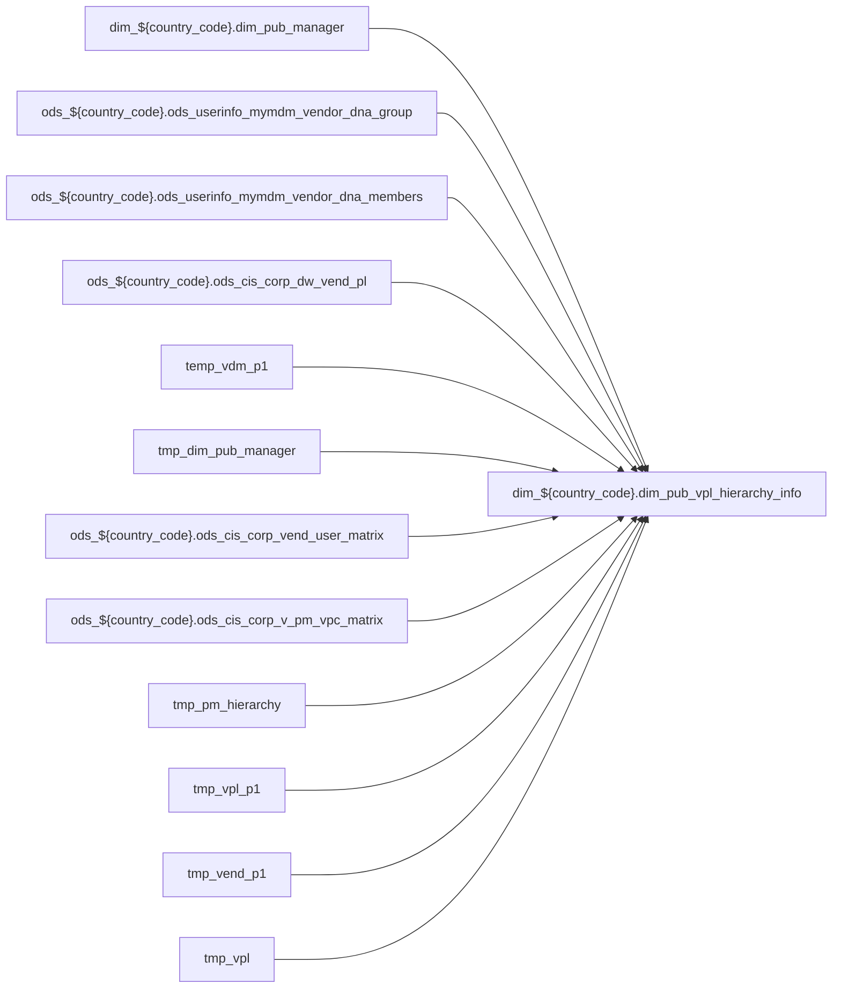

# DIM: `dim_pub_vpl_hierarchy_info`

- artifact_type: etl_table
- artifact_id: dim_${country_code}.dim_pub_vpl_hierarchy_info
- domain: pos
- one_line_purpose: ETL script `source/contracts/pos/bitbucket-etl/dim_pub_vpl_hierarchy_info/dim_pub_vpl_hierarchy_info.sql` loads `dim_${country_code}.dim_pub_vpl_hierarchy_info` (layer `DIM`). Purpose inferred from SQL only.
- layer_type: DIM
- source_kind: etl_sql
- evidence_source: source/contracts/pos/bitbucket-etl/dim_pub_vpl_hierarchy_info/dim_pub_vpl_hierarchy_info.sql
- bitbucket_etl_bundle: source/contracts/pos/bitbucket-etl/dim_pub_vpl_hierarchy_info/

---

## L1 Data Foundation

### Identity and physical mapping
- **Table:** `dim_${country_code}.dim_pub_vpl_hierarchy_info`
- **Layer type:** DIM
- **Canonical / derived:** Derived / ETL-loaded (see L3)
- **Owner team:** Not documented in repository

### Grain, scope, exclusions
- **Grain:** Not documented in repository (see SELECT/GROUP BY in `source/contracts/pos/bitbucket-etl/dim_pub_vpl_hierarchy_info/dim_pub_vpl_hierarchy_info.sql`)
- **Partition:** `See L4 / ETL partition clause`
- **Exclusions:** See L3 Key filters

### Cross-engine presence
| Engine | Present | Canonical FQN | Notes |
|--------|---------|---------------|-------|
| Hive | yes | `dim_${country_code}.dim_pub_vpl_hierarchy_info` | ETL target |
| Vertica | Not documented in repository | — | Confirm via hive2vertica flow |

### Physical schema reference

Pointer block only - full column catalog lives in WKB L1 storage JSON.

| Field | Value |
|-------|-------|
| **Authoritative catalog** | WKB L1 storage seed (not duplicated in this file) |
| **entity_id** | `dim_${country_code}.dim_pub_vpl_hierarchy_info` |
| **l1_catalog_seed** | `target/storage/wkb/snapshots/_snapshot_id_template/l1_catalog/{engine}_{schema}_{table}.json` |
| **column_count** | pending (run ddl_seed_writer) |
| **partition_keys** | `See L4 / ETL partition clause` |
| **ddl_source** | pending Bitbucket DDL / Vertica metadata ingest |
| **retrieval** | `python -m tools.wkb.indexing.run_query --query "pos dim_pub_vpl_hierarchy_info schema" --intent find_table_schema` |

### Lineage

- **Primary load:** `source/contracts/pos/bitbucket-etl/dim_pub_vpl_hierarchy_info/dim_pub_vpl_hierarchy_info.sql`
- **upstream:** `dim_${country_code}.dim_pub_manager` — FROM/JOIN — `source/contracts/pos/bitbucket-etl/dim_pub_vpl_hierarchy_info/dim_pub_vpl_hierarchy_info.sql`
- **upstream:** `ods_${country_code}.ods_userinfo_mymdm_vendor_dna_group` — FROM/JOIN — `source/contracts/pos/bitbucket-etl/dim_pub_vpl_hierarchy_info/dim_pub_vpl_hierarchy_info.sql`
- **upstream:** `ods_${country_code}.ods_userinfo_mymdm_vendor_dna_members` — FROM/JOIN — `source/contracts/pos/bitbucket-etl/dim_pub_vpl_hierarchy_info/dim_pub_vpl_hierarchy_info.sql`
- **upstream:** `ods_${country_code}.ods_cis_corp_dw_vend_pl` — FROM/JOIN — `source/contracts/pos/bitbucket-etl/dim_pub_vpl_hierarchy_info/dim_pub_vpl_hierarchy_info.sql`
- **upstream:** `temp_vdm_p1` — FROM/JOIN — `source/contracts/pos/bitbucket-etl/dim_pub_vpl_hierarchy_info/dim_pub_vpl_hierarchy_info.sql`
- **upstream:** `tmp_dim_pub_manager` — FROM/JOIN — `source/contracts/pos/bitbucket-etl/dim_pub_vpl_hierarchy_info/dim_pub_vpl_hierarchy_info.sql`
- **upstream:** `ods_${country_code}.ods_cis_corp_vend_user_matrix` — FROM/JOIN — `source/contracts/pos/bitbucket-etl/dim_pub_vpl_hierarchy_info/dim_pub_vpl_hierarchy_info.sql`
- **upstream:** `ods_${country_code}.ods_cis_corp_v_pm_vpc_matrix` — FROM/JOIN — `source/contracts/pos/bitbucket-etl/dim_pub_vpl_hierarchy_info/dim_pub_vpl_hierarchy_info.sql`
- **upstream:** `tmp_pm_hierarchy` — FROM/JOIN — `source/contracts/pos/bitbucket-etl/dim_pub_vpl_hierarchy_info/dim_pub_vpl_hierarchy_info.sql`
- **upstream:** `tmp_vpl_p1` — FROM/JOIN — `source/contracts/pos/bitbucket-etl/dim_pub_vpl_hierarchy_info/dim_pub_vpl_hierarchy_info.sql`
- **upstream:** `tmp_vend_p1` — FROM/JOIN — `source/contracts/pos/bitbucket-etl/dim_pub_vpl_hierarchy_info/dim_pub_vpl_hierarchy_info.sql`
- **upstream:** `tmp_vpl` — FROM/JOIN — `source/contracts/pos/bitbucket-etl/dim_pub_vpl_hierarchy_info/dim_pub_vpl_hierarchy_info.sql`
- **upstream:** `tmp_vend` — FROM/JOIN — `source/contracts/pos/bitbucket-etl/dim_pub_vpl_hierarchy_info/dim_pub_vpl_hierarchy_info.sql`
- **upstream:** `tmp_pm` — FROM/JOIN — `source/contracts/pos/bitbucket-etl/dim_pub_vpl_hierarchy_info/dim_pub_vpl_hierarchy_info.sql`
- **downstream:** see L6 Downstream consumers
### Freshness and load path
| Item | Value |
|------|-------|
| Load pattern | See L3 INSERT / OVERWRITE in evidence script |
| Schedule | Not documented in repository |
| Parameters | Parsed from ETL literals / `${...}` in `source/contracts/pos/bitbucket-etl/dim_pub_vpl_hierarchy_info/dim_pub_vpl_hierarchy_info.sql` |

## L2 Declarative Knowledge

### Business purpose
ETL script `source/contracts/pos/bitbucket-etl/dim_pub_vpl_hierarchy_info/dim_pub_vpl_hierarchy_info.sql` loads `dim_${country_code}.dim_pub_vpl_hierarchy_info` (layer `DIM`). Purpose inferred from SQL only.

### Audience and use cases
| Audience | How they benefit |
|----------|-----------------|
| Data / BI consumers | Use target table produced by this ETL |
| Data Engineering | Maintain load logic in evidence script |

### Fact key resolution
- Keys follow target INSERT column list / GROUP BY in evidence SQL.

### Time field semantics
- Partition / date fields: `See L4 / ETL partition clause`

### Metrics served
- See L3 column derivations for measure expressions when present.

### Metric serving map
N/A — not a multi-period wide serving table (or not documented).

### etl_metrics
No calculable business metrics registered in metric-index for this create run.

## L3 Procedural Knowledge

### Query and routing rules
- Prefer querying the target `dim_${country_code}.dim_pub_vpl_hierarchy_info` after successful ETL load.

### Dimension join patterns
- See Relationship map and Base tables register.

### Key filters and ETL business logic

| Predicate | Kind | Evidence |
|-----------|------|----------|
| `vdm.primary_flag='Y'` | Business | `source/contracts/pos/bitbucket-etl/dim_pub_vpl_hierarchy_info/dim_pub_vpl_hierarchy_info.sql` |

### Standard time-filter SQL
```sql
-- See partition / date predicates in source/contracts/pos/bitbucket-etl/dim_pub_vpl_hierarchy_info/dim_pub_vpl_hierarchy_info.sql
```

### End-to-end flow



### Base tables register

| Object | Role |
|--------|------|
| `dim_${country_code}.dim_pub_manager` | source / temp (from ETL FROM/JOIN) |
| `ods_${country_code}.ods_userinfo_mymdm_vendor_dna_group` | source / temp (from ETL FROM/JOIN) |
| `ods_${country_code}.ods_userinfo_mymdm_vendor_dna_members` | source / temp (from ETL FROM/JOIN) |
| `ods_${country_code}.ods_cis_corp_dw_vend_pl` | source / temp (from ETL FROM/JOIN) |
| `temp_vdm_p1` | source / temp (from ETL FROM/JOIN) |
| `tmp_dim_pub_manager` | source / temp (from ETL FROM/JOIN) |
| `ods_${country_code}.ods_cis_corp_vend_user_matrix` | source / temp (from ETL FROM/JOIN) |
| `ods_${country_code}.ods_cis_corp_v_pm_vpc_matrix` | source / temp (from ETL FROM/JOIN) |
| `tmp_pm_hierarchy` | source / temp (from ETL FROM/JOIN) |
| `tmp_vpl_p1` | source / temp (from ETL FROM/JOIN) |
| `tmp_vend_p1` | source / temp (from ETL FROM/JOIN) |
| `tmp_vpl` | source / temp (from ETL FROM/JOIN) |
| `tmp_vend` | source / temp (from ETL FROM/JOIN) |
| `tmp_pm` | source / temp (from ETL FROM/JOIN) |

### Step-by-step logic
1. Read sources listed in Base tables register (`source/contracts/pos/bitbucket-etl/dim_pub_vpl_hierarchy_info/dim_pub_vpl_hierarchy_info.sql`).
2. Apply filters documented under Key filters.
3. INSERT OVERWRITE / write target `dim_${country_code}.dim_pub_vpl_hierarchy_info`.

### Relationship map (embedded)

| from_fqn | to_fqn | cardinality | join_keys | provenance |
|----------|--------|-------------|-----------|------------|
| `ods_${country_code}.ods_userinfo_mymdm_vendor_dna_group` | `ods_${country_code}.ods_userinfo_mymdm_vendor_dna_members` | many:1 (LEFT) | `vdg.group_no` = `vdm.group_no` | etl_sql (`source/contracts/pos/bitbucket-etl/dim_pub_vpl_hierarchy_info/dim_pub_vpl_hierarchy_info.sql:37`) |
| `ods_${country_code}.ods_cis_corp_dw_vend_pl` | `temp_vdm_p1` | many:1 | `b.vend_no` = `vp.vend_no`; `b.vpl_no` = `vp.vpl_no` | etl_sql (`source/contracts/pos/bitbucket-etl/dim_pub_vpl_hierarchy_info/dim_pub_vpl_hierarchy_info.sql:65`) |
| `temp_vdm_p1` | `tmp_dim_pub_manager` | many:1 (LEFT) | `f.userid` = `vp.director_id` | etl_sql (`source/contracts/pos/bitbucket-etl/dim_pub_vpl_hierarchy_info/dim_pub_vpl_hierarchy_info.sql:69`) |
| `temp_vdm_p1` | `tmp_dim_pub_manager` | many:1 (LEFT) | `f1.userid` = `vp.manager_id` | etl_sql (`source/contracts/pos/bitbucket-etl/dim_pub_vpl_hierarchy_info/dim_pub_vpl_hierarchy_info.sql:70`) |
| `temp_vdm_p1` | `tmp_dim_pub_manager` | many:1 (LEFT) | `f2.userid` = `vp.primary_id` | etl_sql (`source/contracts/pos/bitbucket-etl/dim_pub_vpl_hierarchy_info/dim_pub_vpl_hierarchy_info.sql:71`) |
| `temp_vdm_p1` | `tmp_dim_pub_manager` | many:1 (LEFT) | `f3.userid` = `vp.backup_id` | etl_sql (`source/contracts/pos/bitbucket-etl/dim_pub_vpl_hierarchy_info/dim_pub_vpl_hierarchy_info.sql:72`) |
| `temp_vdm_p1` | `tmp_dim_pub_manager` | many:1 (LEFT) | `f4.userid` = `vp.vp_id` | etl_sql (`source/contracts/pos/bitbucket-etl/dim_pub_vpl_hierarchy_info/dim_pub_vpl_hierarchy_info.sql:73`) |
| `ods_${country_code}.ods_cis_corp_dw_vend_pl` | `temp_vdm_p1` | many:1 | `b.vend_no` = `vp.vend_no` | etl_sql (`source/contracts/pos/bitbucket-etl/dim_pub_vpl_hierarchy_info/dim_pub_vpl_hierarchy_info.sql:96`) |
| `ods_${country_code}.ods_cis_corp_dw_vend_pl` | `ods_${country_code}.ods_cis_corp_vend_user_matrix` | many:1 | `b.vend_no` = `vu.vend_no`; `b.vpl_no` = `vu.vpl_no` | etl_sql (`source/contracts/pos/bitbucket-etl/dim_pub_vpl_hierarchy_info/dim_pub_vpl_hierarchy_info.sql:126`) |
| `tmp_pm_hierarchy` | `tmp_dim_pub_manager` | many:1 (LEFT) | `f.userid` = `vu.other_id` | etl_sql (`source/contracts/pos/bitbucket-etl/dim_pub_vpl_hierarchy_info/dim_pub_vpl_hierarchy_info.sql:129`) |
| `tmp_pm_hierarchy` | `tmp_dim_pub_manager` | many:1 (LEFT) | `f1.userid` = `vu.manager_id` | etl_sql (`source/contracts/pos/bitbucket-etl/dim_pub_vpl_hierarchy_info/dim_pub_vpl_hierarchy_info.sql:130`) |
| `tmp_pm_hierarchy` | `tmp_dim_pub_manager` | many:1 (LEFT) | `f2.userid` = `vu.primary_id` | etl_sql (`source/contracts/pos/bitbucket-etl/dim_pub_vpl_hierarchy_info/dim_pub_vpl_hierarchy_info.sql:131`) |
| `tmp_pm_hierarchy` | `tmp_dim_pub_manager` | many:1 (LEFT) | `f3.userid` = `vu.backup_id` | etl_sql (`source/contracts/pos/bitbucket-etl/dim_pub_vpl_hierarchy_info/dim_pub_vpl_hierarchy_info.sql:132`) |
| `ods_${country_code}.ods_cis_corp_dw_vend_pl` | `ods_${country_code}.ods_cis_corp_vend_user_matrix` | many:1 | `b.vend_no` = `vu.vend_no` | etl_sql (`source/contracts/pos/bitbucket-etl/dim_pub_vpl_hierarchy_info/dim_pub_vpl_hierarchy_info.sql:154`) |
| `ods_${country_code}.ods_cis_corp_dw_vend_pl` | `tmp_pm_hierarchy` | many:1 | `b.vend_no` = `vu.vend_no`; `b.vpl_no` = `vu.vpl_no` | etl_sql (`source/contracts/pos/bitbucket-etl/dim_pub_vpl_hierarchy_info/dim_pub_vpl_hierarchy_info.sql:214`) |
| `tmp_pm_hierarchy` | `tmp_dim_pub_manager` | many:1 (LEFT) | `f.userid` = `vu.pm_director_id` | etl_sql (`source/contracts/pos/bitbucket-etl/dim_pub_vpl_hierarchy_info/dim_pub_vpl_hierarchy_info.sql:215`) |
| `tmp_pm_hierarchy` | `tmp_dim_pub_manager` | many:1 (LEFT) | `f1.userid` = `vu.pm_manager_id` | etl_sql (`source/contracts/pos/bitbucket-etl/dim_pub_vpl_hierarchy_info/dim_pub_vpl_hierarchy_info.sql:216`) |
| `tmp_pm_hierarchy` | `tmp_dim_pub_manager` | many:1 (LEFT) | `f2.userid` = `vu.pm_id` | etl_sql (`source/contracts/pos/bitbucket-etl/dim_pub_vpl_hierarchy_info/dim_pub_vpl_hierarchy_info.sql:217`) |
| `tmp_pm_hierarchy` | `tmp_dim_pub_manager` | many:1 (LEFT) | `f3.userid` = `vu.pm_primary_backup_id` | etl_sql (`source/contracts/pos/bitbucket-etl/dim_pub_vpl_hierarchy_info/dim_pub_vpl_hierarchy_info.sql:218`) |
| `tmp_pm_hierarchy` | `tmp_dim_pub_manager` | many:1 (LEFT) | `f4.userid` = `vu.pm_vp_id`; `vpl.vpl_no` = `vpl_pm.vpl_no` | etl_sql (`source/contracts/pos/bitbucket-etl/dim_pub_vpl_hierarchy_info/dim_pub_vpl_hierarchy_info.sql:219`) |
| `ods_${country_code}.ods_cis_corp_dw_vend_pl` | `tmp_pm_hierarchy` | many:1 | `b.vend_no` = `vu.vend_no` | etl_sql (`source/contracts/pos/bitbucket-etl/dim_pub_vpl_hierarchy_info/dim_pub_vpl_hierarchy_info.sql:240`) |
| `tmp_pm_hierarchy` | `tmp_dim_pub_manager` | many:1 (LEFT) | `f4.userid` = `vu.pm_vp_id`; `vpl.vpl_no` = `vend_pm.vpl_no` | etl_sql (`source/contracts/pos/bitbucket-etl/dim_pub_vpl_hierarchy_info/dim_pub_vpl_hierarchy_info.sql:245`) |
| `ods_${country_code}.ods_cis_corp_dw_vend_pl` | `tmp_vpl_p1` | many:1 (LEFT) | `vpl.vend_no` = `vpl_buyer.vend_no`; `vpl.vpl_no` = `vpl_buyer.vpl_no` | etl_sql (`source/contracts/pos/bitbucket-etl/dim_pub_vpl_hierarchy_info/dim_pub_vpl_hierarchy_info.sql:364`) |
| `ods_${country_code}.ods_cis_corp_dw_vend_pl` | `tmp_vend_p1` | many:1 (LEFT) | `vpl.vend_no` = `vend_buyer.vend_no`; `vpl.vpl_no` = `vend_buyer.vpl_no` | etl_sql (`source/contracts/pos/bitbucket-etl/dim_pub_vpl_hierarchy_info/dim_pub_vpl_hierarchy_info.sql:365`) |
| `ods_${country_code}.ods_cis_corp_dw_vend_pl` | `tmp_vpl_p1` | many:1 (LEFT) | `vpl.vend_no` = `vpl_bjbr.vend_no`; `vpl.vpl_no` = `vpl_bjbr.vpl_no` | etl_sql (`source/contracts/pos/bitbucket-etl/dim_pub_vpl_hierarchy_info/dim_pub_vpl_hierarchy_info.sql:366`) |
| `ods_${country_code}.ods_cis_corp_dw_vend_pl` | `tmp_vend_p1` | many:1 (LEFT) | `vpl.vend_no` = `vend_bjbr.vend_no`; `vpl.vpl_no` = `vend_bjbr.vpl_no` | etl_sql (`source/contracts/pos/bitbucket-etl/dim_pub_vpl_hierarchy_info/dim_pub_vpl_hierarchy_info.sql:367`) |
| `ods_${country_code}.ods_cis_corp_dw_vend_pl` | `tmp_vpl_p1` | many:1 (LEFT) | `vpl.vend_no` = `vpl_bjbn.vend_no`; `vpl.vpl_no` = `vpl_bjbn.vpl_no` | etl_sql (`source/contracts/pos/bitbucket-etl/dim_pub_vpl_hierarchy_info/dim_pub_vpl_hierarchy_info.sql:368`) |
| `ods_${country_code}.ods_cis_corp_dw_vend_pl` | `tmp_vend_p1` | many:1 (LEFT) | `vpl.vend_no` = `vend_bjbn.vend_no`; `vpl.vpl_no` = `vend_bjbn.vpl_no` | etl_sql (`source/contracts/pos/bitbucket-etl/dim_pub_vpl_hierarchy_info/dim_pub_vpl_hierarchy_info.sql:369`) |
| `ods_${country_code}.ods_cis_corp_dw_vend_pl` | `tmp_vpl` | many:1 (LEFT) | `vpl.vend_no` = `vpl_vcm.vend_no`; `vpl.vpl_no` = `vpl_vcm.vpl_no` | etl_sql (`source/contracts/pos/bitbucket-etl/dim_pub_vpl_hierarchy_info/dim_pub_vpl_hierarchy_info.sql:370`) |
| `ods_${country_code}.ods_cis_corp_dw_vend_pl` | `tmp_vend` | many:1 (LEFT) | `vpl.vend_no` = `vend_vcm.vend_no`; `vpl.vpl_no` = `vend_vcm.vpl_no` | etl_sql (`source/contracts/pos/bitbucket-etl/dim_pub_vpl_hierarchy_info/dim_pub_vpl_hierarchy_info.sql:371`) |
| `ods_${country_code}.ods_cis_corp_dw_vend_pl` | `tmp_vpl` | many:1 (LEFT) | `vpl.vend_no` = `vpl_marketing.vend_no`; `vpl.vpl_no` = `vpl_marketing.vpl_no` | etl_sql (`source/contracts/pos/bitbucket-etl/dim_pub_vpl_hierarchy_info/dim_pub_vpl_hierarchy_info.sql:372`) |
| `ods_${country_code}.ods_cis_corp_dw_vend_pl` | `tmp_vend` | many:1 (LEFT) | `vpl.vend_no` = `vend_marketing.vend_no`; `vpl.vpl_no` = `vend_marketing.vpl_no` | etl_sql (`source/contracts/pos/bitbucket-etl/dim_pub_vpl_hierarchy_info/dim_pub_vpl_hierarchy_info.sql:373`) |
| `ods_${country_code}.ods_cis_corp_dw_vend_pl` | `tmp_pm` | many:1 (LEFT) | `vpl.vend_no` = `pm.vend_no`; `vpl.vpl_no` = `pm.vpl_no` | etl_sql (`source/contracts/pos/bitbucket-etl/dim_pub_vpl_hierarchy_info/dim_pub_vpl_hierarchy_info.sql:374`) |
| `ods_${country_code}.ods_cis_corp_dw_vend_pl` | `tmp_vpl_p1` | many:1 (LEFT) | `vpl.vend_no` = `vpl_pana.vend_no`; `vpl.vpl_no` = `vpl_pana.vpl_no` | etl_sql (`source/contracts/pos/bitbucket-etl/dim_pub_vpl_hierarchy_info/dim_pub_vpl_hierarchy_info.sql:375`) |
| `ods_${country_code}.ods_cis_corp_dw_vend_pl` | `tmp_vend_p1` | many:1 (LEFT) | `vpl.vend_no` = `vend_pana.vend_no`; `vpl.vpl_no` = `vend_pana.vpl_no` | etl_sql (`source/contracts/pos/bitbucket-etl/dim_pub_vpl_hierarchy_info/dim_pub_vpl_hierarchy_info.sql:376`) |

### Special logic (embedded)

`source/ref/pos/special_logic.txt` exists but no rule naming this FQN/stem (`dim_${country_code}.dim_pub_vpl_hierarchy_info`).

Not documented in repository


### Column / field derivations (from ETL SQL)

| target_column | expression_sql | upstream_columns | upstream_tables | transform_kind | evidence |
|---------------|----------------|------------------|-----------------|----------------|----------|
| `vend_no` | `vpl.vend_no` | `vend_no` | `ods_${country_code}.ods_cis_corp_dw_vend_pl`, `tmp_vpl_p1`, `tmp_vend_p1`, `tmp_vpl`, `tmp_vend`, `tmp_pm` | passthrough | `source/contracts/pos/bitbucket-etl/dim_pub_vpl_hierarchy_info/dim_pub_vpl_hierarchy_info.sql:175` |
| `vpl_no` | `vpl.vpl_no` | `vpl_no` | `ods_${country_code}.ods_cis_corp_dw_vend_pl`, `tmp_vpl_p1`, `tmp_vend_p1`, `tmp_vpl`, `tmp_vend`, `tmp_pm` | passthrough | `source/contracts/pos/bitbucket-etl/dim_pub_vpl_hierarchy_info/dim_pub_vpl_hierarchy_info.sql:176` |
| `buyer_vp_id` | `nvl(vpl_buyer.vp_id, vend_buyer.vp_id)` | `vp_id` | `ods_${country_code}.ods_cis_corp_dw_vend_pl`, `tmp_vpl_p1`, `tmp_vend_p1`, `tmp_vpl`, `tmp_vend`, `tmp_pm` | coalesce | `source/contracts/pos/bitbucket-etl/dim_pub_vpl_hierarchy_info/dim_pub_vpl_hierarchy_info.sql:252` |
| `buyer_vp_name` | `if(vpl_buyer.vp_id is null, vend_buyer.vp_name, vpl_buyer.vp_name)` | `vp_id`, `vp_name` | `ods_${country_code}.ods_cis_corp_dw_vend_pl`, `tmp_vpl_p1`, `tmp_vend_p1`, `tmp_vpl`, `tmp_vend`, `tmp_pm` | udf | `source/contracts/pos/bitbucket-etl/dim_pub_vpl_hierarchy_info/dim_pub_vpl_hierarchy_info.sql:253` |
| `buyer_vp_email` | `if(vpl_buyer.vp_id is null, vend_buyer.vp_email, vpl_buyer.vp_email)` | `vp_id`, `vp_email` | `ods_${country_code}.ods_cis_corp_dw_vend_pl`, `tmp_vpl_p1`, `tmp_vend_p1`, `tmp_vpl`, `tmp_vend`, `tmp_pm` | udf | `source/contracts/pos/bitbucket-etl/dim_pub_vpl_hierarchy_info/dim_pub_vpl_hierarchy_info.sql:253` |
| `buyer_director_id` | `nvl(vpl_buyer.director_id, vend_buyer.director_id)` | `director_id` | `ods_${country_code}.ods_cis_corp_dw_vend_pl`, `tmp_vpl_p1`, `tmp_vend_p1`, `tmp_vpl`, `tmp_vend`, `tmp_pm` | coalesce | `source/contracts/pos/bitbucket-etl/dim_pub_vpl_hierarchy_info/dim_pub_vpl_hierarchy_info.sql:255` |
| `buyer_director_name` | `if(vpl_buyer.director_id is null, vend_buyer.director_name, vpl_buyer.director_name)` | `director_id`, `director_name` | `ods_${country_code}.ods_cis_corp_dw_vend_pl`, `tmp_vpl_p1`, `tmp_vend_p1`, `tmp_vpl`, `tmp_vend`, `tmp_pm` | udf | `source/contracts/pos/bitbucket-etl/dim_pub_vpl_hierarchy_info/dim_pub_vpl_hierarchy_info.sql:256` |
| `buyer_director_email` | `if(vpl_buyer.director_id is null, vend_buyer.director_email, vpl_buyer.director_email)` | `director_id`, `director_email` | `ods_${country_code}.ods_cis_corp_dw_vend_pl`, `tmp_vpl_p1`, `tmp_vend_p1`, `tmp_vpl`, `tmp_vend`, `tmp_pm` | udf | `source/contracts/pos/bitbucket-etl/dim_pub_vpl_hierarchy_info/dim_pub_vpl_hierarchy_info.sql:256` |
| `buyer_manager_id` | `nvl(vpl_buyer.manager_id, vend_buyer.manager_id)` | `manager_id` | `ods_${country_code}.ods_cis_corp_dw_vend_pl`, `tmp_vpl_p1`, `tmp_vend_p1`, `tmp_vpl`, `tmp_vend`, `tmp_pm` | coalesce | `source/contracts/pos/bitbucket-etl/dim_pub_vpl_hierarchy_info/dim_pub_vpl_hierarchy_info.sql:258` |
| `buyer_manager_name` | `if(vpl_buyer.manager_id is null, vend_buyer.manager_name, vpl_buyer.manager_name)` | `manager_id`, `manager_name` | `ods_${country_code}.ods_cis_corp_dw_vend_pl`, `tmp_vpl_p1`, `tmp_vend_p1`, `tmp_vpl`, `tmp_vend`, `tmp_pm` | udf | `source/contracts/pos/bitbucket-etl/dim_pub_vpl_hierarchy_info/dim_pub_vpl_hierarchy_info.sql:259` |
| `buyer_manager_email` | `if(vpl_buyer.manager_id is null, vend_buyer.manager_email, vpl_buyer.manager_email)` | `manager_id`, `manager_email` | `ods_${country_code}.ods_cis_corp_dw_vend_pl`, `tmp_vpl_p1`, `tmp_vend_p1`, `tmp_vpl`, `tmp_vend`, `tmp_pm` | udf | `source/contracts/pos/bitbucket-etl/dim_pub_vpl_hierarchy_info/dim_pub_vpl_hierarchy_info.sql:259` |
| `buyer_id` | `nvl(vpl_buyer.id, vend_buyer.id)` | `id` | `ods_${country_code}.ods_cis_corp_dw_vend_pl`, `tmp_vpl_p1`, `tmp_vend_p1`, `tmp_vpl`, `tmp_vend`, `tmp_pm` | coalesce | `source/contracts/pos/bitbucket-etl/dim_pub_vpl_hierarchy_info/dim_pub_vpl_hierarchy_info.sql:261` |
| `buyer_name` | `if(vpl_buyer.id is null, vend_buyer.name, vpl_buyer.name)` | `id`, `name` | `ods_${country_code}.ods_cis_corp_dw_vend_pl`, `tmp_vpl_p1`, `tmp_vend_p1`, `tmp_vpl`, `tmp_vend`, `tmp_pm` | udf | `source/contracts/pos/bitbucket-etl/dim_pub_vpl_hierarchy_info/dim_pub_vpl_hierarchy_info.sql:262` |
| `buyer_email` | `if(vpl_buyer.id is null, vend_buyer.email, vpl_buyer.email)` | `id`, `email` | `ods_${country_code}.ods_cis_corp_dw_vend_pl`, `tmp_vpl_p1`, `tmp_vend_p1`, `tmp_vpl`, `tmp_vend`, `tmp_pm` | udf | `source/contracts/pos/bitbucket-etl/dim_pub_vpl_hierarchy_info/dim_pub_vpl_hierarchy_info.sql:263` |
| `buyer_primary_backup_id` | `nvl(vpl_buyer.primary_backup_id, vend_buyer.primary_backup_id)` | `primary_backup_id` | `ods_${country_code}.ods_cis_corp_dw_vend_pl`, `tmp_vpl_p1`, `tmp_vend_p1`, `tmp_vpl`, `tmp_vend`, `tmp_pm` | coalesce | `source/contracts/pos/bitbucket-etl/dim_pub_vpl_hierarchy_info/dim_pub_vpl_hierarchy_info.sql:264` |
| `buyer_primary_backup_name` | `if(vpl_buyer.primary_backup_id is null, vend_buyer.primary_backup_name, vpl_buyer.primary_backup_name)` | `primary_backup_id`, `primary_backup_name` | `ods_${country_code}.ods_cis_corp_dw_vend_pl`, `tmp_vpl_p1`, `tmp_vend_p1`, `tmp_vpl`, `tmp_vend`, `tmp_pm` | udf | `source/contracts/pos/bitbucket-etl/dim_pub_vpl_hierarchy_info/dim_pub_vpl_hierarchy_info.sql:265` |
| `buyer_primary_backup_email` | `if(vpl_buyer.primary_backup_id is null, vend_buyer.primary_backup_email, vpl_buyer.primary_backup_email)` | `primary_backup_id`, `primary_backup_email` | `ods_${country_code}.ods_cis_corp_dw_vend_pl`, `tmp_vpl_p1`, `tmp_vend_p1`, `tmp_vpl`, `tmp_vend`, `tmp_pm` | udf | `source/contracts/pos/bitbucket-etl/dim_pub_vpl_hierarchy_info/dim_pub_vpl_hierarchy_info.sql:265` |
| `bjbr_vp_id` | `nvl(vpl_bjbr.vp_id, vend_bjbr.vp_id)` | `vp_id` | `ods_${country_code}.ods_cis_corp_dw_vend_pl`, `tmp_vpl_p1`, `tmp_vend_p1`, `tmp_vpl`, `tmp_vend`, `tmp_pm` | coalesce | `source/contracts/pos/bitbucket-etl/dim_pub_vpl_hierarchy_info/dim_pub_vpl_hierarchy_info.sql:268` |
| `bjbr_vp_name` | `if(vpl_bjbr.vp_id is null, vend_bjbr.vp_name, vpl_bjbr.vp_name)` | `vp_id`, `vp_name` | `ods_${country_code}.ods_cis_corp_dw_vend_pl`, `tmp_vpl_p1`, `tmp_vend_p1`, `tmp_vpl`, `tmp_vend`, `tmp_pm` | udf | `source/contracts/pos/bitbucket-etl/dim_pub_vpl_hierarchy_info/dim_pub_vpl_hierarchy_info.sql:269` |
| `bjbr_vp_email` | `if(vpl_bjbr.vp_id is null, vend_bjbr.vp_email, vpl_bjbr.vp_email)` | `vp_id`, `vp_email` | `ods_${country_code}.ods_cis_corp_dw_vend_pl`, `tmp_vpl_p1`, `tmp_vend_p1`, `tmp_vpl`, `tmp_vend`, `tmp_pm` | udf | `source/contracts/pos/bitbucket-etl/dim_pub_vpl_hierarchy_info/dim_pub_vpl_hierarchy_info.sql:269` |
| `bjbr_director_id` | `nvl(vpl_bjbr.director_id, vend_bjbr.director_id)` | `director_id` | `ods_${country_code}.ods_cis_corp_dw_vend_pl`, `tmp_vpl_p1`, `tmp_vend_p1`, `tmp_vpl`, `tmp_vend`, `tmp_pm` | coalesce | `source/contracts/pos/bitbucket-etl/dim_pub_vpl_hierarchy_info/dim_pub_vpl_hierarchy_info.sql:271` |
| `bjbr_director_name` | `if(vpl_bjbr.director_id is null, vend_bjbr.director_name, vpl_bjbr.director_name)` | `director_id`, `director_name` | `ods_${country_code}.ods_cis_corp_dw_vend_pl`, `tmp_vpl_p1`, `tmp_vend_p1`, `tmp_vpl`, `tmp_vend`, `tmp_pm` | udf | `source/contracts/pos/bitbucket-etl/dim_pub_vpl_hierarchy_info/dim_pub_vpl_hierarchy_info.sql:272` |
| `bjbr_director_email` | `if(vpl_bjbr.director_id is null, vend_bjbr.director_email, vpl_bjbr.director_email)` | `director_id`, `director_email` | `ods_${country_code}.ods_cis_corp_dw_vend_pl`, `tmp_vpl_p1`, `tmp_vend_p1`, `tmp_vpl`, `tmp_vend`, `tmp_pm` | udf | `source/contracts/pos/bitbucket-etl/dim_pub_vpl_hierarchy_info/dim_pub_vpl_hierarchy_info.sql:272` |
| `bjbr_manager_id` | `nvl(vpl_bjbr.manager_id, vend_bjbr.manager_id)` | `manager_id` | `ods_${country_code}.ods_cis_corp_dw_vend_pl`, `tmp_vpl_p1`, `tmp_vend_p1`, `tmp_vpl`, `tmp_vend`, `tmp_pm` | coalesce | `source/contracts/pos/bitbucket-etl/dim_pub_vpl_hierarchy_info/dim_pub_vpl_hierarchy_info.sql:274` |
| `bjbr_manager_name` | `if(vpl_bjbr.manager_id is null, vend_bjbr.manager_name, vpl_bjbr.manager_name)` | `manager_id`, `manager_name` | `ods_${country_code}.ods_cis_corp_dw_vend_pl`, `tmp_vpl_p1`, `tmp_vend_p1`, `tmp_vpl`, `tmp_vend`, `tmp_pm` | udf | `source/contracts/pos/bitbucket-etl/dim_pub_vpl_hierarchy_info/dim_pub_vpl_hierarchy_info.sql:275` |
| `bjbr_manager_email` | `if(vpl_bjbr.manager_id is null, vend_bjbr.manager_email, vpl_bjbr.manager_email)` | `manager_id`, `manager_email` | `ods_${country_code}.ods_cis_corp_dw_vend_pl`, `tmp_vpl_p1`, `tmp_vend_p1`, `tmp_vpl`, `tmp_vend`, `tmp_pm` | udf | `source/contracts/pos/bitbucket-etl/dim_pub_vpl_hierarchy_info/dim_pub_vpl_hierarchy_info.sql:275` |
| `bjbr_id` | `nvl(vpl_bjbr.id, vend_bjbr.id)` | `id` | `ods_${country_code}.ods_cis_corp_dw_vend_pl`, `tmp_vpl_p1`, `tmp_vend_p1`, `tmp_vpl`, `tmp_vend`, `tmp_pm` | coalesce | `source/contracts/pos/bitbucket-etl/dim_pub_vpl_hierarchy_info/dim_pub_vpl_hierarchy_info.sql:277` |
| `bjbr_name` | `if(vpl_bjbr.id is null, vend_bjbr.name, vpl_bjbr.name)` | `id`, `name` | `ods_${country_code}.ods_cis_corp_dw_vend_pl`, `tmp_vpl_p1`, `tmp_vend_p1`, `tmp_vpl`, `tmp_vend`, `tmp_pm` | udf | `source/contracts/pos/bitbucket-etl/dim_pub_vpl_hierarchy_info/dim_pub_vpl_hierarchy_info.sql:278` |
| `bjbr_email` | `if(vpl_bjbr.id is null, vend_bjbr.email, vpl_bjbr.email)` | `id`, `email` | `ods_${country_code}.ods_cis_corp_dw_vend_pl`, `tmp_vpl_p1`, `tmp_vend_p1`, `tmp_vpl`, `tmp_vend`, `tmp_pm` | udf | `source/contracts/pos/bitbucket-etl/dim_pub_vpl_hierarchy_info/dim_pub_vpl_hierarchy_info.sql:279` |
| `bjbr_primary_backup_id` | `nvl(vpl_bjbr.primary_backup_id, vend_bjbr.primary_backup_id)` | `primary_backup_id` | `ods_${country_code}.ods_cis_corp_dw_vend_pl`, `tmp_vpl_p1`, `tmp_vend_p1`, `tmp_vpl`, `tmp_vend`, `tmp_pm` | coalesce | `source/contracts/pos/bitbucket-etl/dim_pub_vpl_hierarchy_info/dim_pub_vpl_hierarchy_info.sql:280` |
| `bjbr_primary_backup_name` | `if(vpl_bjbr.primary_backup_id is null, vend_bjbr.primary_backup_name, vpl_bjbr.primary_backup_name)` | `primary_backup_id`, `primary_backup_name` | `ods_${country_code}.ods_cis_corp_dw_vend_pl`, `tmp_vpl_p1`, `tmp_vend_p1`, `tmp_vpl`, `tmp_vend`, `tmp_pm` | udf | `source/contracts/pos/bitbucket-etl/dim_pub_vpl_hierarchy_info/dim_pub_vpl_hierarchy_info.sql:281` |
| `bjbr_primary_backup_email` | `if(vpl_bjbr.primary_backup_id is null, vend_bjbr.primary_backup_email, vpl_bjbr.primary_backup_email)` | `primary_backup_id`, `primary_backup_email` | `ods_${country_code}.ods_cis_corp_dw_vend_pl`, `tmp_vpl_p1`, `tmp_vend_p1`, `tmp_vpl`, `tmp_vend`, `tmp_pm` | udf | `source/contracts/pos/bitbucket-etl/dim_pub_vpl_hierarchy_info/dim_pub_vpl_hierarchy_info.sql:281` |
| `bjbn_vp_id` | `nvl(vpl_bjbn.vp_id, vend_bjbn.vp_id)` | `vp_id` | `ods_${country_code}.ods_cis_corp_dw_vend_pl`, `tmp_vpl_p1`, `tmp_vend_p1`, `tmp_vpl`, `tmp_vend`, `tmp_pm` | coalesce | `source/contracts/pos/bitbucket-etl/dim_pub_vpl_hierarchy_info/dim_pub_vpl_hierarchy_info.sql:284` |
| `bjbn_vp_name` | `if(vpl_bjbn.vp_id is null, vend_bjbn.vp_name, vpl_bjbn.vp_name)` | `vp_id`, `vp_name` | `ods_${country_code}.ods_cis_corp_dw_vend_pl`, `tmp_vpl_p1`, `tmp_vend_p1`, `tmp_vpl`, `tmp_vend`, `tmp_pm` | udf | `source/contracts/pos/bitbucket-etl/dim_pub_vpl_hierarchy_info/dim_pub_vpl_hierarchy_info.sql:285` |
| `bjbn_vp_email` | `if(vpl_bjbn.vp_id is null, vend_bjbn.vp_email, vpl_bjbn.vp_email)` | `vp_id`, `vp_email` | `ods_${country_code}.ods_cis_corp_dw_vend_pl`, `tmp_vpl_p1`, `tmp_vend_p1`, `tmp_vpl`, `tmp_vend`, `tmp_pm` | udf | `source/contracts/pos/bitbucket-etl/dim_pub_vpl_hierarchy_info/dim_pub_vpl_hierarchy_info.sql:285` |
| `bjbn_director_id` | `nvl(vpl_bjbn.director_id, vend_bjbn.director_id)` | `director_id` | `ods_${country_code}.ods_cis_corp_dw_vend_pl`, `tmp_vpl_p1`, `tmp_vend_p1`, `tmp_vpl`, `tmp_vend`, `tmp_pm` | coalesce | `source/contracts/pos/bitbucket-etl/dim_pub_vpl_hierarchy_info/dim_pub_vpl_hierarchy_info.sql:287` |
| `bjbn_director_name` | `if(vpl_bjbn.director_id is null, vend_bjbn.director_name, vpl_bjbn.director_name)` | `director_id`, `director_name` | `ods_${country_code}.ods_cis_corp_dw_vend_pl`, `tmp_vpl_p1`, `tmp_vend_p1`, `tmp_vpl`, `tmp_vend`, `tmp_pm` | udf | `source/contracts/pos/bitbucket-etl/dim_pub_vpl_hierarchy_info/dim_pub_vpl_hierarchy_info.sql:288` |
| `bjbn_director_email` | `if(vpl_bjbn.director_id is null, vend_bjbn.director_email, vpl_bjbn.director_email)` | `director_id`, `director_email` | `ods_${country_code}.ods_cis_corp_dw_vend_pl`, `tmp_vpl_p1`, `tmp_vend_p1`, `tmp_vpl`, `tmp_vend`, `tmp_pm` | udf | `source/contracts/pos/bitbucket-etl/dim_pub_vpl_hierarchy_info/dim_pub_vpl_hierarchy_info.sql:288` |
| `bjbn_manager_id` | `nvl(vpl_bjbn.manager_id, vend_bjbn.manager_id)` | `manager_id` | `ods_${country_code}.ods_cis_corp_dw_vend_pl`, `tmp_vpl_p1`, `tmp_vend_p1`, `tmp_vpl`, `tmp_vend`, `tmp_pm` | coalesce | `source/contracts/pos/bitbucket-etl/dim_pub_vpl_hierarchy_info/dim_pub_vpl_hierarchy_info.sql:290` |
| `bjbn_manager_name` | `if(vpl_bjbn.manager_id is null, vend_bjbn.manager_name, vpl_bjbn.manager_name)` | `manager_id`, `manager_name` | `ods_${country_code}.ods_cis_corp_dw_vend_pl`, `tmp_vpl_p1`, `tmp_vend_p1`, `tmp_vpl`, `tmp_vend`, `tmp_pm` | udf | `source/contracts/pos/bitbucket-etl/dim_pub_vpl_hierarchy_info/dim_pub_vpl_hierarchy_info.sql:291` |
| `bjbn_manager_email` | `if(vpl_bjbn.manager_id is null, vend_bjbn.manager_email, vpl_bjbn.manager_email)` | `manager_id`, `manager_email` | `ods_${country_code}.ods_cis_corp_dw_vend_pl`, `tmp_vpl_p1`, `tmp_vend_p1`, `tmp_vpl`, `tmp_vend`, `tmp_pm` | udf | `source/contracts/pos/bitbucket-etl/dim_pub_vpl_hierarchy_info/dim_pub_vpl_hierarchy_info.sql:291` |
| `bjbn_id` | `nvl(vpl_bjbn.id, vend_bjbn.id)` | `id` | `ods_${country_code}.ods_cis_corp_dw_vend_pl`, `tmp_vpl_p1`, `tmp_vend_p1`, `tmp_vpl`, `tmp_vend`, `tmp_pm` | coalesce | `source/contracts/pos/bitbucket-etl/dim_pub_vpl_hierarchy_info/dim_pub_vpl_hierarchy_info.sql:293` |
| `bjbn_name` | `if(vpl_bjbn.id is null, vend_bjbn.name, vpl_bjbn.name)` | `id`, `name` | `ods_${country_code}.ods_cis_corp_dw_vend_pl`, `tmp_vpl_p1`, `tmp_vend_p1`, `tmp_vpl`, `tmp_vend`, `tmp_pm` | udf | `source/contracts/pos/bitbucket-etl/dim_pub_vpl_hierarchy_info/dim_pub_vpl_hierarchy_info.sql:294` |
| `bjbn_email` | `if(vpl_bjbn.id is null, vend_bjbn.email, vpl_bjbn.email)` | `id`, `email` | `ods_${country_code}.ods_cis_corp_dw_vend_pl`, `tmp_vpl_p1`, `tmp_vend_p1`, `tmp_vpl`, `tmp_vend`, `tmp_pm` | udf | `source/contracts/pos/bitbucket-etl/dim_pub_vpl_hierarchy_info/dim_pub_vpl_hierarchy_info.sql:295` |
| `bjbn_primary_backup_id` | `nvl(vpl_bjbn.primary_backup_id, vend_bjbn.primary_backup_id)` | `primary_backup_id` | `ods_${country_code}.ods_cis_corp_dw_vend_pl`, `tmp_vpl_p1`, `tmp_vend_p1`, `tmp_vpl`, `tmp_vend`, `tmp_pm` | coalesce | `source/contracts/pos/bitbucket-etl/dim_pub_vpl_hierarchy_info/dim_pub_vpl_hierarchy_info.sql:296` |
| `bjbn_primary_backup_name` | `if(vpl_bjbn.primary_backup_id is null, vend_bjbn.primary_backup_name, vpl_bjbn.primary_backup_name)` | `primary_backup_id`, `primary_backup_name` | `ods_${country_code}.ods_cis_corp_dw_vend_pl`, `tmp_vpl_p1`, `tmp_vend_p1`, `tmp_vpl`, `tmp_vend`, `tmp_pm` | udf | `source/contracts/pos/bitbucket-etl/dim_pub_vpl_hierarchy_info/dim_pub_vpl_hierarchy_info.sql:297` |
| `bjbn_primary_backup_email` | `if(vpl_bjbn.primary_backup_id is null, vend_bjbn.primary_backup_email, vpl_bjbn.primary_backup_email)` | `primary_backup_id`, `primary_backup_email` | `ods_${country_code}.ods_cis_corp_dw_vend_pl`, `tmp_vpl_p1`, `tmp_vend_p1`, `tmp_vpl`, `tmp_vend`, `tmp_pm` | udf | `source/contracts/pos/bitbucket-etl/dim_pub_vpl_hierarchy_info/dim_pub_vpl_hierarchy_info.sql:297` |
| `vcm_vp_id` | `nvl(vpl_vcm.vp_id, vend_vcm.vp_id)` | `vp_id` | `ods_${country_code}.ods_cis_corp_dw_vend_pl`, `tmp_vpl_p1`, `tmp_vend_p1`, `tmp_vpl`, `tmp_vend`, `tmp_pm` | coalesce | `source/contracts/pos/bitbucket-etl/dim_pub_vpl_hierarchy_info/dim_pub_vpl_hierarchy_info.sql:300` |
| `vcm_vp_name` | `if(vpl_vcm.vp_id is null, vend_vcm.vp_name, vpl_vcm.vp_name)` | `vp_id`, `vp_name` | `ods_${country_code}.ods_cis_corp_dw_vend_pl`, `tmp_vpl_p1`, `tmp_vend_p1`, `tmp_vpl`, `tmp_vend`, `tmp_pm` | udf | `source/contracts/pos/bitbucket-etl/dim_pub_vpl_hierarchy_info/dim_pub_vpl_hierarchy_info.sql:301` |
| `vcm_vp_email` | `if(vpl_vcm.vp_id is null, vend_vcm.vp_email, vpl_vcm.vp_email)` | `vp_id`, `vp_email` | `ods_${country_code}.ods_cis_corp_dw_vend_pl`, `tmp_vpl_p1`, `tmp_vend_p1`, `tmp_vpl`, `tmp_vend`, `tmp_pm` | udf | `source/contracts/pos/bitbucket-etl/dim_pub_vpl_hierarchy_info/dim_pub_vpl_hierarchy_info.sql:302` |
| `vcm_director_id` | `nvl(vpl_vcm.director_id, vend_vcm.director_id)` | `director_id` | `ods_${country_code}.ods_cis_corp_dw_vend_pl`, `tmp_vpl_p1`, `tmp_vend_p1`, `tmp_vpl`, `tmp_vend`, `tmp_pm` | coalesce | `source/contracts/pos/bitbucket-etl/dim_pub_vpl_hierarchy_info/dim_pub_vpl_hierarchy_info.sql:303` |
| `vcm_director_name` | `if(vpl_vcm.director_id is null, vend_vcm.director_name, vpl_vcm.director_name)` | `director_id`, `director_name` | `ods_${country_code}.ods_cis_corp_dw_vend_pl`, `tmp_vpl_p1`, `tmp_vend_p1`, `tmp_vpl`, `tmp_vend`, `tmp_pm` | udf | `source/contracts/pos/bitbucket-etl/dim_pub_vpl_hierarchy_info/dim_pub_vpl_hierarchy_info.sql:304` |
| `vcm_director_email` | `if(vpl_vcm.director_id is null, vend_vcm.director_email, vpl_vcm.director_email)` | `director_id`, `director_email` | `ods_${country_code}.ods_cis_corp_dw_vend_pl`, `tmp_vpl_p1`, `tmp_vend_p1`, `tmp_vpl`, `tmp_vend`, `tmp_pm` | udf | `source/contracts/pos/bitbucket-etl/dim_pub_vpl_hierarchy_info/dim_pub_vpl_hierarchy_info.sql:304` |
| `vcm_manager_id` | `nvl(vpl_vcm.manager_id, vend_vcm.manager_id)` | `manager_id` | `ods_${country_code}.ods_cis_corp_dw_vend_pl`, `tmp_vpl_p1`, `tmp_vend_p1`, `tmp_vpl`, `tmp_vend`, `tmp_pm` | coalesce | `source/contracts/pos/bitbucket-etl/dim_pub_vpl_hierarchy_info/dim_pub_vpl_hierarchy_info.sql:306` |
| `vcm_manager_name` | `if(vpl_vcm.manager_id is null, vend_vcm.manager_name, vpl_vcm.manager_name)` | `manager_id`, `manager_name` | `ods_${country_code}.ods_cis_corp_dw_vend_pl`, `tmp_vpl_p1`, `tmp_vend_p1`, `tmp_vpl`, `tmp_vend`, `tmp_pm` | udf | `source/contracts/pos/bitbucket-etl/dim_pub_vpl_hierarchy_info/dim_pub_vpl_hierarchy_info.sql:307` |
| `vcm_manager_email` | `if(vpl_vcm.manager_id is null, vend_vcm.manager_email, vpl_vcm.manager_email)` | `manager_id`, `manager_email` | `ods_${country_code}.ods_cis_corp_dw_vend_pl`, `tmp_vpl_p1`, `tmp_vend_p1`, `tmp_vpl`, `tmp_vend`, `tmp_pm` | udf | `source/contracts/pos/bitbucket-etl/dim_pub_vpl_hierarchy_info/dim_pub_vpl_hierarchy_info.sql:307` |
| `vcm_id` | `nvl(vpl_vcm.id, vend_vcm.id)` | `id` | `ods_${country_code}.ods_cis_corp_dw_vend_pl`, `tmp_vpl_p1`, `tmp_vend_p1`, `tmp_vpl`, `tmp_vend`, `tmp_pm` | coalesce | `source/contracts/pos/bitbucket-etl/dim_pub_vpl_hierarchy_info/dim_pub_vpl_hierarchy_info.sql:309` |
| `vcm_name` | `if(vpl_vcm.id is null, vend_vcm.name, vpl_vcm.name)` | `id`, `name` | `ods_${country_code}.ods_cis_corp_dw_vend_pl`, `tmp_vpl_p1`, `tmp_vend_p1`, `tmp_vpl`, `tmp_vend`, `tmp_pm` | udf | `source/contracts/pos/bitbucket-etl/dim_pub_vpl_hierarchy_info/dim_pub_vpl_hierarchy_info.sql:310` |
| `vcm_email` | `if(vpl_vcm.id is null, vend_vcm.email, vpl_vcm.email)` | `id`, `email` | `ods_${country_code}.ods_cis_corp_dw_vend_pl`, `tmp_vpl_p1`, `tmp_vend_p1`, `tmp_vpl`, `tmp_vend`, `tmp_pm` | udf | `source/contracts/pos/bitbucket-etl/dim_pub_vpl_hierarchy_info/dim_pub_vpl_hierarchy_info.sql:311` |
| `vcm_primary_backup_id` | `nvl(vpl_vcm.primary_backup_id, vend_vcm.primary_backup_id)` | `primary_backup_id` | `ods_${country_code}.ods_cis_corp_dw_vend_pl`, `tmp_vpl_p1`, `tmp_vend_p1`, `tmp_vpl`, `tmp_vend`, `tmp_pm` | coalesce | `source/contracts/pos/bitbucket-etl/dim_pub_vpl_hierarchy_info/dim_pub_vpl_hierarchy_info.sql:312` |
| `vcm_primary_backup_name` | `if(vpl_vcm.primary_backup_id is null, vend_vcm.primary_backup_name, vpl_vcm.primary_backup_name)` | `primary_backup_id`, `primary_backup_name` | `ods_${country_code}.ods_cis_corp_dw_vend_pl`, `tmp_vpl_p1`, `tmp_vend_p1`, `tmp_vpl`, `tmp_vend`, `tmp_pm` | udf | `source/contracts/pos/bitbucket-etl/dim_pub_vpl_hierarchy_info/dim_pub_vpl_hierarchy_info.sql:313` |
| `vcm_primary_backup_email` | `if(vpl_vcm.primary_backup_id is null, vend_vcm.primary_backup_email, vpl_vcm.primary_backup_email)` | `primary_backup_id`, `primary_backup_email` | `ods_${country_code}.ods_cis_corp_dw_vend_pl`, `tmp_vpl_p1`, `tmp_vend_p1`, `tmp_vpl`, `tmp_vend`, `tmp_pm` | udf | `source/contracts/pos/bitbucket-etl/dim_pub_vpl_hierarchy_info/dim_pub_vpl_hierarchy_info.sql:313` |
| `marketing_vp_id` | `nvl(vpl_marketing.vp_id, vend_marketing.vp_id)` | `vp_id` | `ods_${country_code}.ods_cis_corp_dw_vend_pl`, `tmp_vpl_p1`, `tmp_vend_p1`, `tmp_vpl`, `tmp_vend`, `tmp_pm` | coalesce | `source/contracts/pos/bitbucket-etl/dim_pub_vpl_hierarchy_info/dim_pub_vpl_hierarchy_info.sql:316` |
| `marketing_vp_name` | `if(vpl_marketing.vp_id is null, vend_marketing.vp_name, vpl_marketing.vp_name)` | `vp_id`, `vp_name` | `ods_${country_code}.ods_cis_corp_dw_vend_pl`, `tmp_vpl_p1`, `tmp_vend_p1`, `tmp_vpl`, `tmp_vend`, `tmp_pm` | udf | `source/contracts/pos/bitbucket-etl/dim_pub_vpl_hierarchy_info/dim_pub_vpl_hierarchy_info.sql:317` |
| `marketing_vp_email` | `if(vpl_marketing.vp_id is null, vend_marketing.vp_email, vpl_marketing.vp_email)` | `vp_id`, `vp_email` | `ods_${country_code}.ods_cis_corp_dw_vend_pl`, `tmp_vpl_p1`, `tmp_vend_p1`, `tmp_vpl`, `tmp_vend`, `tmp_pm` | udf | `source/contracts/pos/bitbucket-etl/dim_pub_vpl_hierarchy_info/dim_pub_vpl_hierarchy_info.sql:317` |
| `marketing_director_id` | `nvl(vpl_marketing.director_id, vend_marketing.director_id)` | `director_id` | `ods_${country_code}.ods_cis_corp_dw_vend_pl`, `tmp_vpl_p1`, `tmp_vend_p1`, `tmp_vpl`, `tmp_vend`, `tmp_pm` | coalesce | `source/contracts/pos/bitbucket-etl/dim_pub_vpl_hierarchy_info/dim_pub_vpl_hierarchy_info.sql:319` |
| `marketing_director_name` | `if(vpl_marketing.director_id is null, vend_marketing.director_name, vpl_marketing.director_name)` | `director_id`, `director_name` | `ods_${country_code}.ods_cis_corp_dw_vend_pl`, `tmp_vpl_p1`, `tmp_vend_p1`, `tmp_vpl`, `tmp_vend`, `tmp_pm` | udf | `source/contracts/pos/bitbucket-etl/dim_pub_vpl_hierarchy_info/dim_pub_vpl_hierarchy_info.sql:320` |
| `marketing_director_email` | `if(vpl_marketing.director_id is null, vend_marketing.director_email, vpl_marketing.director_email)` | `director_id`, `director_email` | `ods_${country_code}.ods_cis_corp_dw_vend_pl`, `tmp_vpl_p1`, `tmp_vend_p1`, `tmp_vpl`, `tmp_vend`, `tmp_pm` | udf | `source/contracts/pos/bitbucket-etl/dim_pub_vpl_hierarchy_info/dim_pub_vpl_hierarchy_info.sql:320` |
| `marketing_manager_id` | `nvl(vpl_marketing.manager_id, vend_marketing.manager_id)` | `manager_id` | `ods_${country_code}.ods_cis_corp_dw_vend_pl`, `tmp_vpl_p1`, `tmp_vend_p1`, `tmp_vpl`, `tmp_vend`, `tmp_pm` | coalesce | `source/contracts/pos/bitbucket-etl/dim_pub_vpl_hierarchy_info/dim_pub_vpl_hierarchy_info.sql:322` |
| `marketing_manager_name` | `if(vpl_marketing.manager_id is null, vend_marketing.manager_name, vpl_marketing.manager_name)` | `manager_id`, `manager_name` | `ods_${country_code}.ods_cis_corp_dw_vend_pl`, `tmp_vpl_p1`, `tmp_vend_p1`, `tmp_vpl`, `tmp_vend`, `tmp_pm` | udf | `source/contracts/pos/bitbucket-etl/dim_pub_vpl_hierarchy_info/dim_pub_vpl_hierarchy_info.sql:323` |
| `marketing_manager_email` | `if(vpl_marketing.manager_id is null, vend_marketing.manager_email, vpl_marketing.manager_email)` | `manager_id`, `manager_email` | `ods_${country_code}.ods_cis_corp_dw_vend_pl`, `tmp_vpl_p1`, `tmp_vend_p1`, `tmp_vpl`, `tmp_vend`, `tmp_pm` | udf | `source/contracts/pos/bitbucket-etl/dim_pub_vpl_hierarchy_info/dim_pub_vpl_hierarchy_info.sql:323` |
| `marketing_id` | `nvl(vpl_marketing.id, vend_marketing.id)` | `id` | `ods_${country_code}.ods_cis_corp_dw_vend_pl`, `tmp_vpl_p1`, `tmp_vend_p1`, `tmp_vpl`, `tmp_vend`, `tmp_pm` | coalesce | `source/contracts/pos/bitbucket-etl/dim_pub_vpl_hierarchy_info/dim_pub_vpl_hierarchy_info.sql:325` |
| `marketing_name` | `if(vpl_marketing.id is null, vend_marketing.name, vpl_marketing.name)` | `id`, `name` | `ods_${country_code}.ods_cis_corp_dw_vend_pl`, `tmp_vpl_p1`, `tmp_vend_p1`, `tmp_vpl`, `tmp_vend`, `tmp_pm` | udf | `source/contracts/pos/bitbucket-etl/dim_pub_vpl_hierarchy_info/dim_pub_vpl_hierarchy_info.sql:326` |
| `marketing_email` | `if(vpl_marketing.id is null, vend_marketing.email, vpl_marketing.email)` | `id`, `email` | `ods_${country_code}.ods_cis_corp_dw_vend_pl`, `tmp_vpl_p1`, `tmp_vend_p1`, `tmp_vpl`, `tmp_vend`, `tmp_pm` | udf | `source/contracts/pos/bitbucket-etl/dim_pub_vpl_hierarchy_info/dim_pub_vpl_hierarchy_info.sql:326` |
| `marketing_primary_backup_id` | `nvl(vpl_marketing.primary_backup_id, vend_marketing.primary_backup_id)` | `primary_backup_id` | `ods_${country_code}.ods_cis_corp_dw_vend_pl`, `tmp_vpl_p1`, `tmp_vend_p1`, `tmp_vpl`, `tmp_vend`, `tmp_pm` | coalesce | `source/contracts/pos/bitbucket-etl/dim_pub_vpl_hierarchy_info/dim_pub_vpl_hierarchy_info.sql:328` |
| `marketing_primary_backup_name` | `if(vpl_marketing.primary_backup_id is null, vend_marketing.primary_backup_name, vpl_marketing.primary_backup_name)` | `primary_backup_id`, `primary_backup_name` | `ods_${country_code}.ods_cis_corp_dw_vend_pl`, `tmp_vpl_p1`, `tmp_vend_p1`, `tmp_vpl`, `tmp_vend`, `tmp_pm` | udf | `source/contracts/pos/bitbucket-etl/dim_pub_vpl_hierarchy_info/dim_pub_vpl_hierarchy_info.sql:329` |
| `marketing_primary_backup_email` | `if(vpl_marketing.primary_backup_id is null, vend_marketing.primary_backup_email, vpl_marketing.primary_backup_email)` | `primary_backup_id`, `primary_backup_email` | `ods_${country_code}.ods_cis_corp_dw_vend_pl`, `tmp_vpl_p1`, `tmp_vend_p1`, `tmp_vpl`, `tmp_vend`, `tmp_pm` | udf | `source/contracts/pos/bitbucket-etl/dim_pub_vpl_hierarchy_info/dim_pub_vpl_hierarchy_info.sql:329` |
| `pm_vp_id` | `pm.pm_vp_id` | `pm_vp_id` | `ods_${country_code}.ods_cis_corp_dw_vend_pl`, `tmp_vpl_p1`, `tmp_vend_p1`, `tmp_vpl`, `tmp_vend`, `tmp_pm` | passthrough | `source/contracts/pos/bitbucket-etl/dim_pub_vpl_hierarchy_info/dim_pub_vpl_hierarchy_info.sql:177` |
| `pm_vp_name` | `pm.pm_vp_name` | `pm_vp_name` | `ods_${country_code}.ods_cis_corp_dw_vend_pl`, `tmp_vpl_p1`, `tmp_vend_p1`, `tmp_vpl`, `tmp_vend`, `tmp_pm` | passthrough | `source/contracts/pos/bitbucket-etl/dim_pub_vpl_hierarchy_info/dim_pub_vpl_hierarchy_info.sql:178` |
| `pm_vp_email` | `pm.pm_vp_email` | `pm_vp_email` | `ods_${country_code}.ods_cis_corp_dw_vend_pl`, `tmp_vpl_p1`, `tmp_vend_p1`, `tmp_vpl`, `tmp_vend`, `tmp_pm` | passthrough | `source/contracts/pos/bitbucket-etl/dim_pub_vpl_hierarchy_info/dim_pub_vpl_hierarchy_info.sql:179` |

_Additional 27 columns parsed; see `python -m tools.ingest.sql_column_derivation` for full list._


### Sentinel and code values
Not documented in repository beyond CASE/exp_code predicates in ETL SQL.

## L4 Validation

### Resolved partition value
- Partition expression from ETL: `See L4 / ETL partition clause`
- Runtime values: Not documented in repository (resolve via Azkaban params when flow evidence exists).

### Data quality checks
Not documented in repository

### Validation SQL
N/A — Vertica MCP not executed during documentation (Vertica no-run policy).

### Caveats for interpretation
- Generated from ETL SQL evidence only; business definitions may need `source/ref` enrichment.

### Conflicts and open questions
None identified in repository

## L5 Runtime View

### Query path and engine preference
| Path | Engine | Evidence |
|------|--------|----------|
| ETL load | Hive/Spark | `source/contracts/pos/bitbucket-etl/dim_pub_vpl_hierarchy_info/dim_pub_vpl_hierarchy_info.sql` |
| Serving | Vertica (when synced) | Not documented in repository |

### Access constraints
Not documented in repository

### Query risk profile
- Scan risk depends on partition pruning; always filter partition keys when present.

## L6 Access and Consumption

### Primary consumers and use cases
Not documented in repository

### Representative query patterns
Not documented in repository

### Dependencies and notes

#### Upstream objects (verified)
| Object | Usage | Evidence |
|--------|-------|----------|
| `dim_${country_code}.dim_pub_manager` | FROM/JOIN | `source/contracts/pos/bitbucket-etl/dim_pub_vpl_hierarchy_info/dim_pub_vpl_hierarchy_info.sql` |
| `ods_${country_code}.ods_userinfo_mymdm_vendor_dna_group` | FROM/JOIN | `source/contracts/pos/bitbucket-etl/dim_pub_vpl_hierarchy_info/dim_pub_vpl_hierarchy_info.sql` |
| `ods_${country_code}.ods_userinfo_mymdm_vendor_dna_members` | FROM/JOIN | `source/contracts/pos/bitbucket-etl/dim_pub_vpl_hierarchy_info/dim_pub_vpl_hierarchy_info.sql` |
| `ods_${country_code}.ods_cis_corp_dw_vend_pl` | FROM/JOIN | `source/contracts/pos/bitbucket-etl/dim_pub_vpl_hierarchy_info/dim_pub_vpl_hierarchy_info.sql` |
| `temp_vdm_p1` | FROM/JOIN | `source/contracts/pos/bitbucket-etl/dim_pub_vpl_hierarchy_info/dim_pub_vpl_hierarchy_info.sql` |
| `tmp_dim_pub_manager` | FROM/JOIN | `source/contracts/pos/bitbucket-etl/dim_pub_vpl_hierarchy_info/dim_pub_vpl_hierarchy_info.sql` |
| `ods_${country_code}.ods_cis_corp_vend_user_matrix` | FROM/JOIN | `source/contracts/pos/bitbucket-etl/dim_pub_vpl_hierarchy_info/dim_pub_vpl_hierarchy_info.sql` |
| `ods_${country_code}.ods_cis_corp_v_pm_vpc_matrix` | FROM/JOIN | `source/contracts/pos/bitbucket-etl/dim_pub_vpl_hierarchy_info/dim_pub_vpl_hierarchy_info.sql` |
| `tmp_pm_hierarchy` | FROM/JOIN | `source/contracts/pos/bitbucket-etl/dim_pub_vpl_hierarchy_info/dim_pub_vpl_hierarchy_info.sql` |
| `tmp_vpl_p1` | FROM/JOIN | `source/contracts/pos/bitbucket-etl/dim_pub_vpl_hierarchy_info/dim_pub_vpl_hierarchy_info.sql` |
| `tmp_vend_p1` | FROM/JOIN | `source/contracts/pos/bitbucket-etl/dim_pub_vpl_hierarchy_info/dim_pub_vpl_hierarchy_info.sql` |
| `tmp_vpl` | FROM/JOIN | `source/contracts/pos/bitbucket-etl/dim_pub_vpl_hierarchy_info/dim_pub_vpl_hierarchy_info.sql` |
| `tmp_vend` | FROM/JOIN | `source/contracts/pos/bitbucket-etl/dim_pub_vpl_hierarchy_info/dim_pub_vpl_hierarchy_info.sql` |
| `tmp_pm` | FROM/JOIN | `source/contracts/pos/bitbucket-etl/dim_pub_vpl_hierarchy_info/dim_pub_vpl_hierarchy_info.sql` |

#### Downstream consumers (verified)

| Object / script | Evidence |
|-----------------|----------|
| ETL/script ref: `source/contracts/b-report-us/bitbicket_etl/dws_disty_brpt_pl_extend_1d/Common/python/dws_disty_brpt_pl_extend_1d.py` | `source/contracts/b-report-us/bitbicket_etl/dws_disty_brpt_pl_extend_1d/Common/python/dws_disty_brpt_pl_extend_1d.py:13` |
| ETL/script ref: `source/contracts/b-report-us/bitbicket_etl/dws_disty_brpt_pl_extend_mtd/Common/python/dws_disty_brpt_pl_extend_mtd.py` | `source/contracts/b-report-us/bitbicket_etl/dws_disty_brpt_pl_extend_mtd/Common/python/dws_disty_brpt_pl_extend_mtd.py:29` |
| KB / contract ref: `source/contracts/b-report-us/bitbicket_etl/readme.md` | `source/contracts/b-report-us/bitbicket_etl/readme.md:42` |
| KB / contract ref: `source/contracts/b-report-us/domain-knowledge.md` | `source/contracts/b-report-us/domain-knowledge.md:31` |
| KB / contract ref: `source/contracts/b-report-us/eval/golden_cases.md` | `source/contracts/b-report-us/eval/golden_cases.md:359` |
| KB / contract ref: `source/contracts/b-report-us/golden-questions.md` | `source/contracts/b-report-us/golden-questions.md:296` |
| KB / contract ref: `source/contracts/b-report-us/metric-index.md` | `source/contracts/b-report-us/metric-index.md:204` |
| KB / contract ref: `source/contracts/b-report-us/tables/dim_pub_vpl_hierarchy_info.md` | `source/contracts/b-report-us/tables/dim_pub_vpl_hierarchy_info.md:1` |
| KB / contract ref: `source/contracts/b-report-us/tables/dim_pub_vpl_info.md` | `source/contracts/b-report-us/tables/dim_pub_vpl_info.md:186` |
| KB / contract ref: `source/contracts/b-report-us/tables/dm_disty_brpt_bd_rep_1d.md` | `source/contracts/b-report-us/tables/dm_disty_brpt_bd_rep_1d.md:206` |
| KB / contract ref: `source/contracts/b-report-us/tables/dm_disty_brpt_bd_rep_comb_mtd.md` | `source/contracts/b-report-us/tables/dm_disty_brpt_bd_rep_comb_mtd.md:302` |
| KB / contract ref: `source/contracts/b-report-us/tables/dm_disty_brpt_bd_rep_mtd.md` | `source/contracts/b-report-us/tables/dm_disty_brpt_bd_rep_mtd.md:227` |
| KB / contract ref: `source/contracts/b-report-us/tables/dm_disty_brpt_bd_rep_wtd.md` | `source/contracts/b-report-us/tables/dm_disty_brpt_bd_rep_wtd.md:208` |
| KB / contract ref: `source/contracts/b-report-us/tables/dm_disty_brpt_buyer_1d.md` | `source/contracts/b-report-us/tables/dm_disty_brpt_buyer_1d.md:40` |
| KB / contract ref: `source/contracts/b-report-us/tables/dm_disty_brpt_buyer_comb_mtd.md` | `source/contracts/b-report-us/tables/dm_disty_brpt_buyer_comb_mtd.md:41` |
| KB / contract ref: `source/contracts/b-report-us/tables/dm_disty_brpt_buyer_mtd.md` | `source/contracts/b-report-us/tables/dm_disty_brpt_buyer_mtd.md:41` |
| KB / contract ref: `source/contracts/b-report-us/tables/dm_disty_brpt_buyer_wtd.md` | `source/contracts/b-report-us/tables/dm_disty_brpt_buyer_wtd.md:42` |
| KB / contract ref: `source/contracts/b-report-us/tables/dm_disty_brpt_pm_1d.md` | `source/contracts/b-report-us/tables/dm_disty_brpt_pm_1d.md:40` |
| KB / contract ref: `source/contracts/b-report-us/tables/dm_disty_brpt_pm_comb_mtd.md` | `source/contracts/b-report-us/tables/dm_disty_brpt_pm_comb_mtd.md:41` |
| KB / contract ref: `source/contracts/b-report-us/tables/dm_disty_brpt_pm_mtd.md` | `source/contracts/b-report-us/tables/dm_disty_brpt_pm_mtd.md:107` |
| KB / contract ref: `source/contracts/b-report-us/tables/dm_disty_brpt_pm_wtd.md` | `source/contracts/b-report-us/tables/dm_disty_brpt_pm_wtd.md:42` |
| KB / contract ref: `source/contracts/b-report-us/tables/dm_disty_brpt_sales_1d.md` | `source/contracts/b-report-us/tables/dm_disty_brpt_sales_1d.md:210` |
| KB / contract ref: `source/contracts/b-report-us/tables/dm_disty_brpt_sales_comb_mtd.md` | `source/contracts/b-report-us/tables/dm_disty_brpt_sales_comb_mtd.md:312` |
| KB / contract ref: `source/contracts/b-report-us/tables/dm_disty_brpt_sales_mtd.md` | `source/contracts/b-report-us/tables/dm_disty_brpt_sales_mtd.md:239` |
| KB / contract ref: `source/contracts/b-report-us/tables/dm_disty_brpt_sales_wtd.md` | `source/contracts/b-report-us/tables/dm_disty_brpt_sales_wtd.md:212` |
| KB / contract ref: `source/contracts/b-report-us/tables/dwd_disty_brpt_orders_pl_di.md` | `source/contracts/b-report-us/tables/dwd_disty_brpt_orders_pl_di.md:236` |
| KB / contract ref: `source/contracts/b-report-us/tables/dws_disty_brpt_bd_1d.md` | `source/contracts/b-report-us/tables/dws_disty_brpt_bd_1d.md:237` |
| KB / contract ref: `source/contracts/b-report-us/tables/dws_disty_brpt_bd_cust_1d.md` | `source/contracts/b-report-us/tables/dws_disty_brpt_bd_cust_1d.md:216` |
| KB / contract ref: `source/contracts/b-report-us/tables/dws_disty_brpt_bd_cust_comb_mtd.md` | `source/contracts/b-report-us/tables/dws_disty_brpt_bd_cust_comb_mtd.md:248` |
| KB / contract ref: `source/contracts/b-report-us/tables/dws_disty_brpt_bd_cust_mtd.md` | `source/contracts/b-report-us/tables/dws_disty_brpt_bd_cust_mtd.md:227` |
| KB / contract ref: `source/contracts/b-report-us/tables/dws_disty_brpt_bd_cust_wtd.md` | `source/contracts/b-report-us/tables/dws_disty_brpt_bd_cust_wtd.md:218` |
| KB / contract ref: `source/contracts/b-report-us/tables/dws_disty_brpt_bd_mtd.md` | `source/contracts/b-report-us/tables/dws_disty_brpt_bd_mtd.md:251` |
| KB / contract ref: `source/contracts/b-report-us/tables/dws_disty_brpt_bd_part_1d.md` | `source/contracts/b-report-us/tables/dws_disty_brpt_bd_part_1d.md:215` |
| KB / contract ref: `source/contracts/b-report-us/tables/dws_disty_brpt_bd_part_comb_mtd.md` | `source/contracts/b-report-us/tables/dws_disty_brpt_bd_part_comb_mtd.md:247` |
| KB / contract ref: `source/contracts/b-report-us/tables/dws_disty_brpt_bd_part_mtd.md` | `source/contracts/b-report-us/tables/dws_disty_brpt_bd_part_mtd.md:226` |
| KB / contract ref: `source/contracts/b-report-us/tables/dws_disty_brpt_bd_part_wtd.md` | `source/contracts/b-report-us/tables/dws_disty_brpt_bd_part_wtd.md:217` |
| KB / contract ref: `source/contracts/b-report-us/tables/dws_disty_brpt_bd_proj_task_1d.md` | `source/contracts/b-report-us/tables/dws_disty_brpt_bd_proj_task_1d.md:212` |
| KB / contract ref: `source/contracts/b-report-us/tables/dws_disty_brpt_bd_proj_task_comb_mtd.md` | `source/contracts/b-report-us/tables/dws_disty_brpt_bd_proj_task_comb_mtd.md:308` |
| KB / contract ref: `source/contracts/b-report-us/tables/dws_disty_brpt_bd_proj_task_mtd.md` | `source/contracts/b-report-us/tables/dws_disty_brpt_bd_proj_task_mtd.md:233` |
| KB / contract ref: `source/contracts/b-report-us/tables/dws_disty_brpt_bd_proj_task_wtd.md` | `source/contracts/b-report-us/tables/dws_disty_brpt_bd_proj_task_wtd.md:214` |

#### Operational detail (verified)
- Partition clause: `See L4 / ETL partition clause`

#### Not documented in repository
- Schedule, owner, SLA
