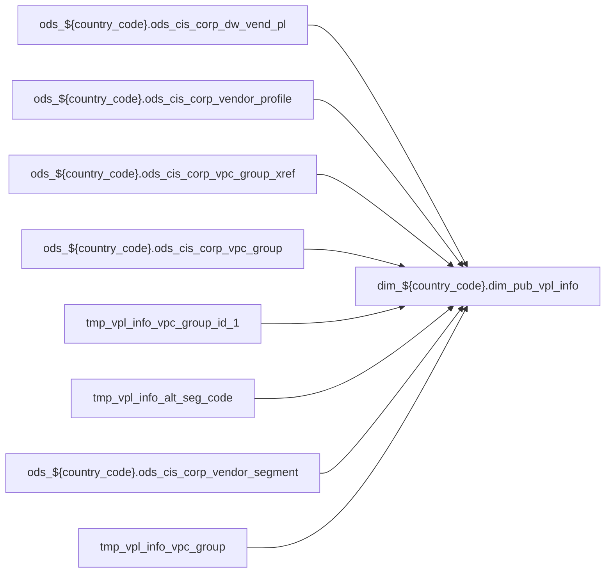

# DIM: `dim_pub_vpl_info`

- artifact_type: etl_table
- artifact_id: dim_${country_code}.dim_pub_vpl_info
- domain: pos
- one_line_purpose: ETL script `source/contracts/pos/bitbucket-etl/dim_pub_vpl_info/dim_pub_vpl_info.sql` loads `dim_${country_code}.dim_pub_vpl_info` (layer `DIM`). Purpose inferred from SQL only.
- layer_type: DIM
- source_kind: etl_sql
- evidence_source: source/contracts/pos/bitbucket-etl/dim_pub_vpl_info/dim_pub_vpl_info.sql
- bitbucket_etl_bundle: source/contracts/pos/bitbucket-etl/dim_pub_vpl_info/

---

## L1 Data Foundation

### Identity and physical mapping
- **Table:** `dim_${country_code}.dim_pub_vpl_info`
- **Layer type:** DIM
- **Canonical / derived:** Derived / ETL-loaded (see L3)
- **Owner team:** Not documented in repository

### Grain, scope, exclusions
- **Grain:** Not documented in repository (see SELECT/GROUP BY in `source/contracts/pos/bitbucket-etl/dim_pub_vpl_info/dim_pub_vpl_info.sql`)
- **Partition:** `See L4 / ETL partition clause`
- **Exclusions:** See L3 Key filters

### Cross-engine presence
| Engine | Present | Canonical FQN | Notes |
|--------|---------|---------------|-------|
| Hive | yes | `dim_${country_code}.dim_pub_vpl_info` | ETL target |
| Vertica | Not documented in repository | — | Confirm via hive2vertica flow |

### Physical schema reference

Pointer block only - full column catalog lives in WKB L1 storage JSON.

| Field | Value |
|-------|-------|
| **Authoritative catalog** | WKB L1 storage seed (not duplicated in this file) |
| **entity_id** | `dim_${country_code}.dim_pub_vpl_info` |
| **l1_catalog_seed** | `target/storage/wkb/snapshots/_snapshot_id_template/l1_catalog/{engine}_{schema}_{table}.json` |
| **column_count** | pending (run ddl_seed_writer) |
| **partition_keys** | `See L4 / ETL partition clause` |
| **ddl_source** | pending Bitbucket DDL / Vertica metadata ingest |
| **retrieval** | `python -m tools.wkb.indexing.run_query --query "pos dim_pub_vpl_info schema" --intent find_table_schema` |

### Lineage

- **Primary load:** `source/contracts/pos/bitbucket-etl/dim_pub_vpl_info/dim_pub_vpl_info.sql`
- **upstream:** `ods_${country_code}.ods_cis_corp_dw_vend_pl` — FROM/JOIN — `source/contracts/pos/bitbucket-etl/dim_pub_vpl_info/dim_pub_vpl_info.sql`
- **upstream:** `ods_${country_code}.ods_cis_corp_vendor_profile` — FROM/JOIN — `source/contracts/pos/bitbucket-etl/dim_pub_vpl_info/dim_pub_vpl_info.sql`
- **upstream:** `ods_${country_code}.ods_cis_corp_vpc_group_xref` — FROM/JOIN — `source/contracts/pos/bitbucket-etl/dim_pub_vpl_info/dim_pub_vpl_info.sql`
- **upstream:** `ods_${country_code}.ods_cis_corp_vpc_group` — FROM/JOIN — `source/contracts/pos/bitbucket-etl/dim_pub_vpl_info/dim_pub_vpl_info.sql`
- **upstream:** `tmp_vpl_info_vpc_group_id_1` — FROM/JOIN — `source/contracts/pos/bitbucket-etl/dim_pub_vpl_info/dim_pub_vpl_info.sql`
- **upstream:** `tmp_vpl_info_alt_seg_code` — FROM/JOIN — `source/contracts/pos/bitbucket-etl/dim_pub_vpl_info/dim_pub_vpl_info.sql`
- **upstream:** `ods_${country_code}.ods_cis_corp_vendor_segment` — FROM/JOIN — `source/contracts/pos/bitbucket-etl/dim_pub_vpl_info/dim_pub_vpl_info.sql`
- **upstream:** `tmp_vpl_info_vpc_group` — FROM/JOIN — `source/contracts/pos/bitbucket-etl/dim_pub_vpl_info/dim_pub_vpl_info.sql`
- **downstream:** see L6 Downstream consumers
### Freshness and load path
| Item | Value |
|------|-------|
| Load pattern | See L3 INSERT / OVERWRITE in evidence script |
| Schedule | Not documented in repository |
| Parameters | Parsed from ETL literals / `${...}` in `source/contracts/pos/bitbucket-etl/dim_pub_vpl_info/dim_pub_vpl_info.sql` |

## L2 Declarative Knowledge

### Business purpose
ETL script `source/contracts/pos/bitbucket-etl/dim_pub_vpl_info/dim_pub_vpl_info.sql` loads `dim_${country_code}.dim_pub_vpl_info` (layer `DIM`). Purpose inferred from SQL only.

### Audience and use cases
| Audience | How they benefit |
|----------|-----------------|
| Data / BI consumers | Use target table produced by this ETL |
| Data Engineering | Maintain load logic in evidence script |

### Fact key resolution
- Keys follow target INSERT column list / GROUP BY in evidence SQL.

### Time field semantics
- Partition / date fields: `See L4 / ETL partition clause`

### Metrics served
- See L3 column derivations for measure expressions when present.

### Metric serving map
N/A — not a multi-period wide serving table (or not documented).

### etl_metrics
No calculable business metrics registered in metric-index for this create run.

## L3 Procedural Knowledge

### Query and routing rules
- Prefer querying the target `dim_${country_code}.dim_pub_vpl_info` after successful ETL load.

### Dimension join patterns
- See Relationship map and Base tables register.

### Key filters and ETL business logic

| Predicate | Kind | Evidence |
|-----------|------|----------|
| `profile_type = 'SEG' and active = 'Y') vp on p.vend_no=vp.vend_no; create or replace temporary view tmp_vpl_info_vpc_group_id_1 as select vgx.vpl_no, vg.vpc_group_id, vg.vpc_group_desc from ods_${c...` | Business | `source/contracts/pos/bitbucket-etl/dim_pub_vpl_info/dim_pub_vpl_info.sql` |
| `t.rno = 1; insert overwrite table dim_${country_code}.dim_pub_vpl_info select p.vpl_no, p.vend_no, p.vpl_code, p.vpl_desc, p.entry_datetime, p.entry_id, p.bid_factor, p.retail_factor, p.tax_code, p...` | Business | `source/contracts/pos/bitbucket-etl/dim_pub_vpl_info/dim_pub_vpl_info.sql` |

### Standard time-filter SQL
```sql
-- See partition / date predicates in source/contracts/pos/bitbucket-etl/dim_pub_vpl_info/dim_pub_vpl_info.sql
```

### End-to-end flow



### Base tables register

| Object | Role |
|--------|------|
| `ods_${country_code}.ods_cis_corp_dw_vend_pl` | source / temp (from ETL FROM/JOIN) |
| `ods_${country_code}.ods_cis_corp_vendor_profile` | source / temp (from ETL FROM/JOIN) |
| `ods_${country_code}.ods_cis_corp_vpc_group_xref` | source / temp (from ETL FROM/JOIN) |
| `ods_${country_code}.ods_cis_corp_vpc_group` | source / temp (from ETL FROM/JOIN) |
| `tmp_vpl_info_vpc_group_id_1` | source / temp (from ETL FROM/JOIN) |
| `tmp_vpl_info_alt_seg_code` | source / temp (from ETL FROM/JOIN) |
| `ods_${country_code}.ods_cis_corp_vendor_segment` | source / temp (from ETL FROM/JOIN) |
| `tmp_vpl_info_vpc_group` | source / temp (from ETL FROM/JOIN) |

### Step-by-step logic
1. Read sources listed in Base tables register (`source/contracts/pos/bitbucket-etl/dim_pub_vpl_info/dim_pub_vpl_info.sql`).
2. Apply filters documented under Key filters.
3. INSERT OVERWRITE / write target `dim_${country_code}.dim_pub_vpl_info`.

### Relationship map (embedded)

| from_fqn | to_fqn | cardinality | join_keys | provenance |
|----------|--------|-------------|-----------|------------|
| `ods_${country_code}.ods_cis_corp_dw_vend_pl` | `ods_${country_code}.ods_cis_corp_dw_vend_pl` | many:1 (LEFT) | `p.alt_vpl_no` = `table_alt.vpl_no` | etl_sql (`source/contracts/pos/bitbucket-etl/dim_pub_vpl_info/dim_pub_vpl_info.sql:9`) |
| `ods_${country_code}.ods_cis_corp_vpc_group_xref` | `ods_${country_code}.ods_cis_corp_vpc_group` | many:1 | `vgx.vpc_group_id` = `vg.vpc_group_id` | etl_sql (`source/contracts/pos/bitbucket-etl/dim_pub_vpl_info/dim_pub_vpl_info.sql:28`) |
| `ods_${country_code}.ods_cis_corp_dw_vend_pl` | `tmp_vpl_info_alt_seg_code` | many:1 (LEFT) | `p.vpl_no` = `vp.vpl_no` | etl_sql (`source/contracts/pos/bitbucket-etl/dim_pub_vpl_info/dim_pub_vpl_info.sql:81`) |
| `tmp_vpl_info_alt_seg_code` | `ods_${country_code}.ods_cis_corp_vendor_segment` | many:1 (LEFT) | `seg.seg_code` = `vp.alt_seg_code` | etl_sql (`source/contracts/pos/bitbucket-etl/dim_pub_vpl_info/dim_pub_vpl_info.sql:83`) |
| `ods_${country_code}.ods_cis_corp_dw_vend_pl` | `tmp_vpl_info_vpc_group` | many:1 (LEFT) | `p.vpl_no` = `vg.vpl_no` | etl_sql (`source/contracts/pos/bitbucket-etl/dim_pub_vpl_info/dim_pub_vpl_info.sql:86`) |

### Special logic (embedded)

`source/ref/pos/special_logic.txt` exists but no rule naming this FQN/stem (`dim_${country_code}.dim_pub_vpl_info`).

Not documented in repository


### Column / field derivations (from ETL SQL)

| target_column | expression_sql | upstream_columns | upstream_tables | transform_kind | evidence |
|---------------|----------------|------------------|-----------------|----------------|----------|
| `vpl_no` | `p.vpl_no` | `vpl_no` | `ods_${country_code}.ods_cis_corp_dw_vend_pl`, `tmp_vpl_info_alt_seg_code`, `ods_${country_code}.ods_cis_corp_vendor_segment`, `tmp_vpl_info_vpc_group` | passthrough | `source/contracts/pos/bitbucket-etl/dim_pub_vpl_info/dim_pub_vpl_info.sql:3` |
| `vend_no` | `p.vend_no` | `vend_no` | `ods_${country_code}.ods_cis_corp_dw_vend_pl`, `tmp_vpl_info_alt_seg_code`, `ods_${country_code}.ods_cis_corp_vendor_segment`, `tmp_vpl_info_vpc_group` | passthrough | `source/contracts/pos/bitbucket-etl/dim_pub_vpl_info/dim_pub_vpl_info.sql:15` |
| `vpl_code` | `p.vpl_code` | `vpl_code` | `ods_${country_code}.ods_cis_corp_dw_vend_pl`, `tmp_vpl_info_alt_seg_code`, `ods_${country_code}.ods_cis_corp_vendor_segment`, `tmp_vpl_info_vpc_group` | passthrough | `source/contracts/pos/bitbucket-etl/dim_pub_vpl_info/dim_pub_vpl_info.sql:59` |
| `vpl_desc` | `p.vpl_desc` | `vpl_desc` | `ods_${country_code}.ods_cis_corp_dw_vend_pl`, `tmp_vpl_info_alt_seg_code`, `ods_${country_code}.ods_cis_corp_vendor_segment`, `tmp_vpl_info_vpc_group` | passthrough | `source/contracts/pos/bitbucket-etl/dim_pub_vpl_info/dim_pub_vpl_info.sql:60` |
| `entry_datetime` | `p.entry_datetime` | `entry_datetime` | `ods_${country_code}.ods_cis_corp_dw_vend_pl`, `tmp_vpl_info_alt_seg_code`, `ods_${country_code}.ods_cis_corp_vendor_segment`, `tmp_vpl_info_vpc_group` | passthrough | `source/contracts/pos/bitbucket-etl/dim_pub_vpl_info/dim_pub_vpl_info.sql:61` |
| `entry_id` | `p.entry_id` | `entry_id` | `ods_${country_code}.ods_cis_corp_dw_vend_pl`, `tmp_vpl_info_alt_seg_code`, `ods_${country_code}.ods_cis_corp_vendor_segment`, `tmp_vpl_info_vpc_group` | passthrough | `source/contracts/pos/bitbucket-etl/dim_pub_vpl_info/dim_pub_vpl_info.sql:62` |
| `bid_factor` | `p.bid_factor` | `bid_factor` | `ods_${country_code}.ods_cis_corp_dw_vend_pl`, `tmp_vpl_info_alt_seg_code`, `ods_${country_code}.ods_cis_corp_vendor_segment`, `tmp_vpl_info_vpc_group` | passthrough | `source/contracts/pos/bitbucket-etl/dim_pub_vpl_info/dim_pub_vpl_info.sql:63` |
| `retail_factor` | `p.retail_factor` | `retail_factor` | `ods_${country_code}.ods_cis_corp_dw_vend_pl`, `tmp_vpl_info_alt_seg_code`, `ods_${country_code}.ods_cis_corp_vendor_segment`, `tmp_vpl_info_vpc_group` | passthrough | `source/contracts/pos/bitbucket-etl/dim_pub_vpl_info/dim_pub_vpl_info.sql:64` |
| `tax_code` | `p.tax_code` | `tax_code` | `ods_${country_code}.ods_cis_corp_dw_vend_pl`, `tmp_vpl_info_alt_seg_code`, `ods_${country_code}.ods_cis_corp_vendor_segment`, `tmp_vpl_info_vpc_group` | passthrough | `source/contracts/pos/bitbucket-etl/dim_pub_vpl_info/dim_pub_vpl_info.sql:65` |
| `alt_vend_no` | `p.alt_vend_no` | `alt_vend_no` | `ods_${country_code}.ods_cis_corp_dw_vend_pl`, `tmp_vpl_info_alt_seg_code`, `ods_${country_code}.ods_cis_corp_vendor_segment`, `tmp_vpl_info_vpc_group` | passthrough | `source/contracts/pos/bitbucket-etl/dim_pub_vpl_info/dim_pub_vpl_info.sql:66` |
| `alt_vpl_no` | `p.alt_vpl_no` | `alt_vpl_no` | `ods_${country_code}.ods_cis_corp_dw_vend_pl`, `tmp_vpl_info_alt_seg_code`, `ods_${country_code}.ods_cis_corp_vendor_segment`, `tmp_vpl_info_vpc_group` | passthrough | `source/contracts/pos/bitbucket-etl/dim_pub_vpl_info/dim_pub_vpl_info.sql:10` |
| `call_price` | `p.call_price` | `call_price` | `ods_${country_code}.ods_cis_corp_dw_vend_pl`, `tmp_vpl_info_alt_seg_code`, `ods_${country_code}.ods_cis_corp_vendor_segment`, `tmp_vpl_info_vpc_group` | passthrough | `source/contracts/pos/bitbucket-etl/dim_pub_vpl_info/dim_pub_vpl_info.sql:68` |
| `prod_type` | `p.prod_type` | `prod_type` | `ods_${country_code}.ods_cis_corp_dw_vend_pl`, `tmp_vpl_info_alt_seg_code`, `ods_${country_code}.ods_cis_corp_vendor_segment`, `tmp_vpl_info_vpc_group` | passthrough | `source/contracts/pos/bitbucket-etl/dim_pub_vpl_info/dim_pub_vpl_info.sql:69` |
| `alt_seg_code` | `vp.alt_seg_code` | `alt_seg_code` | `ods_${country_code}.ods_cis_corp_dw_vend_pl`, `tmp_vpl_info_alt_seg_code`, `ods_${country_code}.ods_cis_corp_vendor_segment`, `tmp_vpl_info_vpc_group` | passthrough | `source/contracts/pos/bitbucket-etl/dim_pub_vpl_info/dim_pub_vpl_info.sql:70` |
| `active` | `p.active` | `active` | `ods_${country_code}.ods_cis_corp_dw_vend_pl`, `tmp_vpl_info_alt_seg_code`, `ods_${country_code}.ods_cis_corp_vendor_segment`, `tmp_vpl_info_vpc_group` | passthrough | `source/contracts/pos/bitbucket-etl/dim_pub_vpl_info/dim_pub_vpl_info.sql:71` |
| `ec_flag` | `p.ec_flag` | `ec_flag` | `ods_${country_code}.ods_cis_corp_dw_vend_pl`, `tmp_vpl_info_alt_seg_code`, `ods_${country_code}.ods_cis_corp_vendor_segment`, `tmp_vpl_info_vpc_group` | passthrough | `source/contracts/pos/bitbucket-etl/dim_pub_vpl_info/dim_pub_vpl_info.sql:72` |
| `dsv_type` | `p.dsv_type` | `dsv_type` | `ods_${country_code}.ods_cis_corp_dw_vend_pl`, `tmp_vpl_info_alt_seg_code`, `ods_${country_code}.ods_cis_corp_vendor_segment`, `tmp_vpl_info_vpc_group` | passthrough | `source/contracts/pos/bitbucket-etl/dim_pub_vpl_info/dim_pub_vpl_info.sql:73` |
| `dsv_min_amt` | `p.dsv_min_amt` | `dsv_min_amt` | `ods_${country_code}.ods_cis_corp_dw_vend_pl`, `tmp_vpl_info_alt_seg_code`, `ods_${country_code}.ods_cis_corp_vendor_segment`, `tmp_vpl_info_vpc_group` | passthrough | `source/contracts/pos/bitbucket-etl/dim_pub_vpl_info/dim_pub_vpl_info.sql:74` |
| `alt_seg_name` | `seg.seg_name alt_seg_name` | `seg_name`, `alt_seg_name` | `ods_${country_code}.ods_cis_corp_dw_vend_pl`, `tmp_vpl_info_alt_seg_code`, `ods_${country_code}.ods_cis_corp_vendor_segment`, `tmp_vpl_info_vpc_group` | partial | `source/contracts/pos/bitbucket-etl/dim_pub_vpl_info/dim_pub_vpl_info.sql:75` |
| `vpc_group_id` | `vg.vpc_group_id` | `vpc_group_id` | `ods_${country_code}.ods_cis_corp_dw_vend_pl`, `tmp_vpl_info_alt_seg_code`, `ods_${country_code}.ods_cis_corp_vendor_segment`, `tmp_vpl_info_vpc_group` | passthrough | `source/contracts/pos/bitbucket-etl/dim_pub_vpl_info/dim_pub_vpl_info.sql:23` |
| `etl_timestamp` | `from_utc_timestamp(current_timestamp(),'America/Los_Angeles')` | `from_utc_timestamp`, `current_timestamp`, `America`, `Los_Angeles` | `ods_${country_code}.ods_cis_corp_dw_vend_pl`, `tmp_vpl_info_alt_seg_code`, `ods_${country_code}.ods_cis_corp_vendor_segment`, `tmp_vpl_info_vpc_group` | arithmetic | `source/contracts/pos/bitbucket-etl/dim_pub_vpl_info/dim_pub_vpl_info.sql:77` |
| `vpc_group_desc` | `vg.vpc_group_desc` | `vpc_group_desc` | `ods_${country_code}.ods_cis_corp_dw_vend_pl`, `tmp_vpl_info_alt_seg_code`, `ods_${country_code}.ods_cis_corp_vendor_segment`, `tmp_vpl_info_vpc_group` | passthrough | `source/contracts/pos/bitbucket-etl/dim_pub_vpl_info/dim_pub_vpl_info.sql:24` |

### Sentinel and code values
Not documented in repository beyond CASE/exp_code predicates in ETL SQL.

## L4 Validation

### Resolved partition value
- Partition expression from ETL: `See L4 / ETL partition clause`
- Runtime values: Not documented in repository (resolve via Azkaban params when flow evidence exists).

### Data quality checks
Not documented in repository

### Validation SQL
N/A — Vertica MCP not executed during documentation (Vertica no-run policy).

### Caveats for interpretation
- Generated from ETL SQL evidence only; business definitions may need `source/ref` enrichment.

### Conflicts and open questions
None identified in repository

## L5 Runtime View

### Query path and engine preference
| Path | Engine | Evidence |
|------|--------|----------|
| ETL load | Hive/Spark | `source/contracts/pos/bitbucket-etl/dim_pub_vpl_info/dim_pub_vpl_info.sql` |
| Serving | Vertica (when synced) | Not documented in repository |

### Access constraints
Not documented in repository

### Query risk profile
- Scan risk depends on partition pruning; always filter partition keys when present.

## L6 Access and Consumption

### Primary consumers and use cases
Not documented in repository

### Representative query patterns
Not documented in repository

### Dependencies and notes

#### Upstream objects (verified)
| Object | Usage | Evidence |
|--------|-------|----------|
| `ods_${country_code}.ods_cis_corp_dw_vend_pl` | FROM/JOIN | `source/contracts/pos/bitbucket-etl/dim_pub_vpl_info/dim_pub_vpl_info.sql` |
| `ods_${country_code}.ods_cis_corp_vendor_profile` | FROM/JOIN | `source/contracts/pos/bitbucket-etl/dim_pub_vpl_info/dim_pub_vpl_info.sql` |
| `ods_${country_code}.ods_cis_corp_vpc_group_xref` | FROM/JOIN | `source/contracts/pos/bitbucket-etl/dim_pub_vpl_info/dim_pub_vpl_info.sql` |
| `ods_${country_code}.ods_cis_corp_vpc_group` | FROM/JOIN | `source/contracts/pos/bitbucket-etl/dim_pub_vpl_info/dim_pub_vpl_info.sql` |
| `tmp_vpl_info_vpc_group_id_1` | FROM/JOIN | `source/contracts/pos/bitbucket-etl/dim_pub_vpl_info/dim_pub_vpl_info.sql` |
| `tmp_vpl_info_alt_seg_code` | FROM/JOIN | `source/contracts/pos/bitbucket-etl/dim_pub_vpl_info/dim_pub_vpl_info.sql` |
| `ods_${country_code}.ods_cis_corp_vendor_segment` | FROM/JOIN | `source/contracts/pos/bitbucket-etl/dim_pub_vpl_info/dim_pub_vpl_info.sql` |
| `tmp_vpl_info_vpc_group` | FROM/JOIN | `source/contracts/pos/bitbucket-etl/dim_pub_vpl_info/dim_pub_vpl_info.sql` |

#### Downstream consumers (verified)

| Object / script | Evidence |
|-----------------|----------|
| ETL/script ref: `source/contracts/b-report-us/bitbicket_etl/dws_disty_brpt_pl_extend_1d/Common/python/dws_disty_brpt_pl_extend_1d.py` | `source/contracts/b-report-us/bitbicket_etl/dws_disty_brpt_pl_extend_1d/Common/python/dws_disty_brpt_pl_extend_1d.py:8` |
| ETL/script ref: `source/contracts/b-report-us/bitbicket_etl/dws_disty_brpt_pl_extend_mtd/Common/python/dws_disty_brpt_pl_extend_mtd.py` | `source/contracts/b-report-us/bitbicket_etl/dws_disty_brpt_pl_extend_mtd/Common/python/dws_disty_brpt_pl_extend_mtd.py:24` |
| KB / contract ref: `source/contracts/b-report-us/bitbicket_etl/readme.md` | `source/contracts/b-report-us/bitbicket_etl/readme.md:43` |
| KB / contract ref: `source/contracts/b-report-us/domain-knowledge.md` | `source/contracts/b-report-us/domain-knowledge.md:29` |
| KB / contract ref: `source/contracts/b-report-us/eval/golden_cases.md` | `source/contracts/b-report-us/eval/golden_cases.md:358` |
| KB / contract ref: `source/contracts/b-report-us/golden-questions.md` | `source/contracts/b-report-us/golden-questions.md:80` |
| KB / contract ref: `source/contracts/b-report-us/metric-index.md` | `source/contracts/b-report-us/metric-index.md:206` |
| KB / contract ref: `source/contracts/b-report-us/tables/dim_pub_part_info.md` | `source/contracts/b-report-us/tables/dim_pub_part_info.md:63` |
| KB / contract ref: `source/contracts/b-report-us/tables/dim_pub_vpl_hierarchy_info.md` | `source/contracts/b-report-us/tables/dim_pub_vpl_hierarchy_info.md:43` |
| KB / contract ref: `source/contracts/b-report-us/tables/dim_pub_vpl_info.md` | `source/contracts/b-report-us/tables/dim_pub_vpl_info.md:1` |
| KB / contract ref: `source/contracts/b-report-us/tables/dm_disty_brpt_bd_rep_1d.md` | `source/contracts/b-report-us/tables/dm_disty_brpt_bd_rep_1d.md:205` |
| KB / contract ref: `source/contracts/b-report-us/tables/dm_disty_brpt_bd_rep_comb_mtd.md` | `source/contracts/b-report-us/tables/dm_disty_brpt_bd_rep_comb_mtd.md:301` |
| KB / contract ref: `source/contracts/b-report-us/tables/dm_disty_brpt_bd_rep_mtd.md` | `source/contracts/b-report-us/tables/dm_disty_brpt_bd_rep_mtd.md:226` |
| KB / contract ref: `source/contracts/b-report-us/tables/dm_disty_brpt_bd_rep_wtd.md` | `source/contracts/b-report-us/tables/dm_disty_brpt_bd_rep_wtd.md:207` |
| KB / contract ref: `source/contracts/b-report-us/tables/dm_disty_brpt_buyer_1d.md` | `source/contracts/b-report-us/tables/dm_disty_brpt_buyer_1d.md:216` |
| KB / contract ref: `source/contracts/b-report-us/tables/dm_disty_brpt_buyer_comb_mtd.md` | `source/contracts/b-report-us/tables/dm_disty_brpt_buyer_comb_mtd.md:303` |
| KB / contract ref: `source/contracts/b-report-us/tables/dm_disty_brpt_buyer_mtd.md` | `source/contracts/b-report-us/tables/dm_disty_brpt_buyer_mtd.md:230` |
| KB / contract ref: `source/contracts/b-report-us/tables/dm_disty_brpt_buyer_wtd.md` | `source/contracts/b-report-us/tables/dm_disty_brpt_buyer_wtd.md:218` |
| KB / contract ref: `source/contracts/b-report-us/tables/dm_disty_brpt_pm_1d.md` | `source/contracts/b-report-us/tables/dm_disty_brpt_pm_1d.md:217` |
| KB / contract ref: `source/contracts/b-report-us/tables/dm_disty_brpt_pm_comb_mtd.md` | `source/contracts/b-report-us/tables/dm_disty_brpt_pm_comb_mtd.md:313` |
| KB / contract ref: `source/contracts/b-report-us/tables/dm_disty_brpt_pm_mtd.md` | `source/contracts/b-report-us/tables/dm_disty_brpt_pm_mtd.md:106` |
| KB / contract ref: `source/contracts/b-report-us/tables/dm_disty_brpt_pm_wtd.md` | `source/contracts/b-report-us/tables/dm_disty_brpt_pm_wtd.md:219` |
| KB / contract ref: `source/contracts/b-report-us/tables/dm_disty_brpt_sales_1d.md` | `source/contracts/b-report-us/tables/dm_disty_brpt_sales_1d.md:209` |
| KB / contract ref: `source/contracts/b-report-us/tables/dm_disty_brpt_sales_comb_mtd.md` | `source/contracts/b-report-us/tables/dm_disty_brpt_sales_comb_mtd.md:311` |
| KB / contract ref: `source/contracts/b-report-us/tables/dm_disty_brpt_sales_mtd.md` | `source/contracts/b-report-us/tables/dm_disty_brpt_sales_mtd.md:238` |
| KB / contract ref: `source/contracts/b-report-us/tables/dm_disty_brpt_sales_wtd.md` | `source/contracts/b-report-us/tables/dm_disty_brpt_sales_wtd.md:211` |
| KB / contract ref: `source/contracts/b-report-us/tables/dwd_disty_brpt_orders_pl_di.md` | `source/contracts/b-report-us/tables/dwd_disty_brpt_orders_pl_di.md:54` |
| KB / contract ref: `source/contracts/b-report-us/tables/dwd_disty_brpt_orders_pl_etl_mi.md` | `source/contracts/b-report-us/tables/dwd_disty_brpt_orders_pl_etl_mi.md:266` |
| KB / contract ref: `source/contracts/b-report-us/tables/dws_disty_brpt_bd_1d.md` | `source/contracts/b-report-us/tables/dws_disty_brpt_bd_1d.md:70` |
| KB / contract ref: `source/contracts/b-report-us/tables/dws_disty_brpt_bd_cust_1d.md` | `source/contracts/b-report-us/tables/dws_disty_brpt_bd_cust_1d.md:215` |
| KB / contract ref: `source/contracts/b-report-us/tables/dws_disty_brpt_bd_cust_comb_mtd.md` | `source/contracts/b-report-us/tables/dws_disty_brpt_bd_cust_comb_mtd.md:247` |
| KB / contract ref: `source/contracts/b-report-us/tables/dws_disty_brpt_bd_cust_mtd.md` | `source/contracts/b-report-us/tables/dws_disty_brpt_bd_cust_mtd.md:226` |
| KB / contract ref: `source/contracts/b-report-us/tables/dws_disty_brpt_bd_cust_wtd.md` | `source/contracts/b-report-us/tables/dws_disty_brpt_bd_cust_wtd.md:217` |
| KB / contract ref: `source/contracts/b-report-us/tables/dws_disty_brpt_bd_mtd.md` | `source/contracts/b-report-us/tables/dws_disty_brpt_bd_mtd.md:71` |
| KB / contract ref: `source/contracts/b-report-us/tables/dws_disty_brpt_bd_part_1d.md` | `source/contracts/b-report-us/tables/dws_disty_brpt_bd_part_1d.md:48` |
| KB / contract ref: `source/contracts/b-report-us/tables/dws_disty_brpt_bd_part_comb_mtd.md` | `source/contracts/b-report-us/tables/dws_disty_brpt_bd_part_comb_mtd.md:49` |
| KB / contract ref: `source/contracts/b-report-us/tables/dws_disty_brpt_bd_part_mtd.md` | `source/contracts/b-report-us/tables/dws_disty_brpt_bd_part_mtd.md:49` |
| KB / contract ref: `source/contracts/b-report-us/tables/dws_disty_brpt_bd_part_wtd.md` | `source/contracts/b-report-us/tables/dws_disty_brpt_bd_part_wtd.md:50` |
| KB / contract ref: `source/contracts/b-report-us/tables/dws_disty_brpt_bd_proj_task_1d.md` | `source/contracts/b-report-us/tables/dws_disty_brpt_bd_proj_task_1d.md:211` |
| KB / contract ref: `source/contracts/b-report-us/tables/dws_disty_brpt_bd_proj_task_comb_mtd.md` | `source/contracts/b-report-us/tables/dws_disty_brpt_bd_proj_task_comb_mtd.md:307` |

#### Operational detail (verified)
- Partition clause: `See L4 / ETL partition clause`

#### Not documented in repository
- Schedule, owner, SLA
