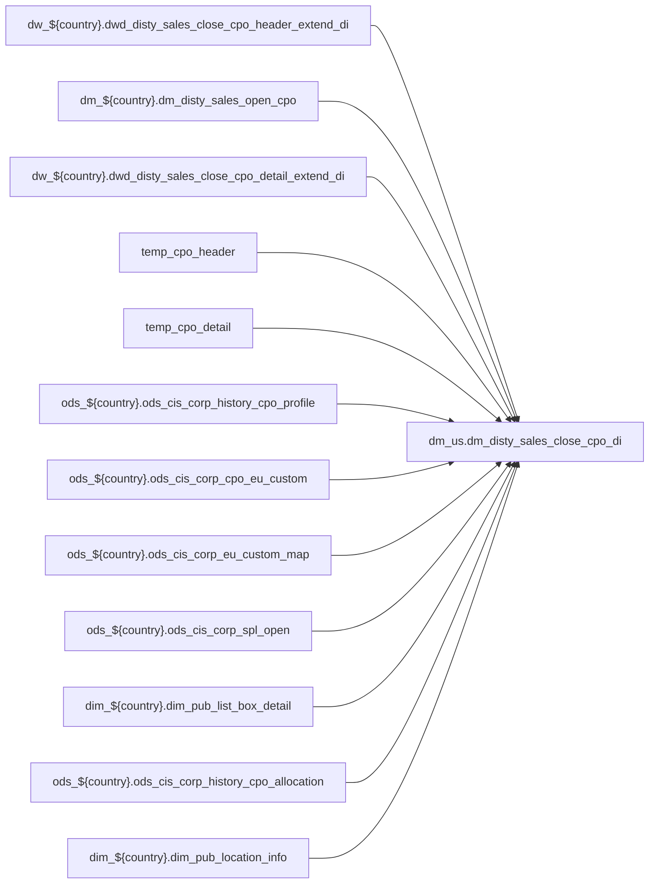

# FACT: Supplemental fact/context table used by select POS reports (`dm_us.dm_disty_sales_close_cpo_di`)

- artifact_type: etl_table
- artifact_id: dm_us.dm_disty_sales_close_cpo_di
- domain: pos
- one_line_purpose: POS-domain table with load SQL under bitbucket-etl (see L3); prior contract narrative preserved below when present.
- layer_type: DM
- source_kind: etl_sql
- evidence_source: source/contracts/pos/bitbucket-etl/dm_disty_sales_close_cpo_di/loading_close_cpo.sql
- bitbucket_etl_bundle: source/contracts/pos/bitbucket-etl/dm_disty_sales_close_cpo_di/
- related_etl_scripts:
- `source/contracts/pos/bitbucket-etl/dm_disty_sales_close_cpo_di/dwd_disty_sales_close_cpo_detail_extend_di.sql`
- `source/contracts/pos/bitbucket-etl/dm_disty_sales_close_cpo_di/dwd_disty_sales_close_cpo_header_extend_di.sql`
- `source/contracts/pos/bitbucket-etl/dm_disty_sales_close_cpo_di/fix_duplicate_close_cpo_detail_di_vertica.sql`
- `source/contracts/pos/bitbucket-etl/dm_disty_sales_close_cpo_di/fix_duplicate_close_cpo_header_di_vertica.sql`
- `source/contracts/pos/bitbucket-etl/dm_disty_sales_close_cpo_di/fix_duplicate_close_cpo_hive.sql`
- `source/contracts/pos/bitbucket-etl/dm_disty_sales_close_cpo_di/fix_dwd_disty_sales_close_cpo_detail_extend_di.sql`
- `source/contracts/pos/bitbucket-etl/dm_disty_sales_close_cpo_di/fix_dwd_disty_sales_close_cpo_header_extend_di.sql`

---

## L1 Data Foundation

### Identity and physical mapping
- **Table:** `dm_us.dm_disty_sales_close_cpo_di`
- **Layer type:** DM
- **Canonical / derived:** Derived / ETL-loaded (see L3 from bitbucket-etl)
- **Owner team:** Not documented in repository

### Grain, scope, exclusions
- See preserved **Grain and keys** section below when present (POS contract narrative retained).
- Otherwise infer from SELECT / GROUP BY / INSERT column list in `source/contracts/pos/bitbucket-etl/dm_disty_sales_close_cpo_di/loading_close_cpo.sql`.

### Cross-engine presence
| Engine | Present | Notes |
|--------|---------|-------|
| Hive | yes | ETL load target |
| Vertica | yes when POS contract documents Vertica sync | See preserved Business query tables |

### Physical schema reference

| Field | Value |
|-------|-------|
| **entity_id** | `dm_us.dm_disty_sales_close_cpo_di` |
| **l1_catalog_seed** | `target/storage/wkb/snapshots/_snapshot_id_template/l1_catalog/{engine}_{schema}_{table}.json` |
| **column_count** | pending (run ddl_seed_writer) |
| **partition_keys** | See preserved Grain / L4 / ETL PARTITION clause |
| **ddl_source** | pending |
| **retrieval** | `python -m tools.wkb.indexing.run_query --query "pos dm_disty_sales_close_cpo_di schema" --intent find_table_schema` |

### Lineage

- **Primary load:** `source/contracts/pos/bitbucket-etl/dm_disty_sales_close_cpo_di/loading_close_cpo.sql`
- **upstream:** `dw_${country}.dwd_disty_sales_close_cpo_header_extend_di` — FROM/JOIN — `source/contracts/pos/bitbucket-etl/dm_disty_sales_close_cpo_di/loading_close_cpo.sql`
- **upstream:** `dm_${country}.dm_disty_sales_open_cpo` — FROM/JOIN — `source/contracts/pos/bitbucket-etl/dm_disty_sales_close_cpo_di/loading_close_cpo.sql`
- **upstream:** `dw_${country}.dwd_disty_sales_close_cpo_detail_extend_di` — FROM/JOIN — `source/contracts/pos/bitbucket-etl/dm_disty_sales_close_cpo_di/loading_close_cpo.sql`
- **upstream:** `temp_cpo_header` — FROM/JOIN — `source/contracts/pos/bitbucket-etl/dm_disty_sales_close_cpo_di/loading_close_cpo.sql`
- **upstream:** `temp_cpo_detail` — FROM/JOIN — `source/contracts/pos/bitbucket-etl/dm_disty_sales_close_cpo_di/loading_close_cpo.sql`
- **upstream:** `ods_${country}.ods_cis_corp_history_cpo_profile` — FROM/JOIN — `source/contracts/pos/bitbucket-etl/dm_disty_sales_close_cpo_di/loading_close_cpo.sql`
- **upstream:** `ods_${country}.ods_cis_corp_cpo_eu_custom` — FROM/JOIN — `source/contracts/pos/bitbucket-etl/dm_disty_sales_close_cpo_di/loading_close_cpo.sql`
- **upstream:** `ods_${country}.ods_cis_corp_eu_custom_map` — FROM/JOIN — `source/contracts/pos/bitbucket-etl/dm_disty_sales_close_cpo_di/loading_close_cpo.sql`
- **upstream:** `ods_${country}.ods_cis_corp_spl_open` — FROM/JOIN — `source/contracts/pos/bitbucket-etl/dm_disty_sales_close_cpo_di/loading_close_cpo.sql`
- **upstream:** `dim_${country}.dim_pub_list_box_detail` — FROM/JOIN — `source/contracts/pos/bitbucket-etl/dm_disty_sales_close_cpo_di/loading_close_cpo.sql`
- **upstream:** `ods_${country}.ods_cis_corp_history_cpo_allocation` — FROM/JOIN — `source/contracts/pos/bitbucket-etl/dm_disty_sales_close_cpo_di/loading_close_cpo.sql`
- **upstream:** `dim_${country}.dim_pub_location_info` — FROM/JOIN — `source/contracts/pos/bitbucket-etl/dm_disty_sales_close_cpo_di/loading_close_cpo.sql`
- **upstream:** `temp_cpo` — FROM/JOIN — `source/contracts/pos/bitbucket-etl/dm_disty_sales_close_cpo_di/loading_close_cpo.sql`
- **upstream:** `ods_${country}.ods_cis_corp_history_cpo_exp` — FROM/JOIN — `source/contracts/pos/bitbucket-etl/dm_disty_sales_close_cpo_di/loading_close_cpo.sql`
- **upstream:** `ods_${country}.ods_cis_corp_list_box_detail` — FROM/JOIN — `source/contracts/pos/bitbucket-etl/dm_disty_sales_close_cpo_di/loading_close_cpo.sql`
- **upstream:** `ods_${country}.ods_cis_corp_history_cpo_comments` — FROM/JOIN — `source/contracts/pos/bitbucket-etl/dm_disty_sales_close_cpo_di/loading_close_cpo.sql`
- **upstream:** `temp_cpo_profile_1` — FROM/JOIN — `source/contracts/pos/bitbucket-etl/dm_disty_sales_close_cpo_di/loading_close_cpo.sql`
- **upstream:** `temp_cpo_profile_2` — FROM/JOIN — `source/contracts/pos/bitbucket-etl/dm_disty_sales_close_cpo_di/loading_close_cpo.sql`
- **upstream:** `temp_cpo_profile_3` — FROM/JOIN — `source/contracts/pos/bitbucket-etl/dm_disty_sales_close_cpo_di/loading_close_cpo.sql`
- **upstream:** `temp_cpo_profile_4` — FROM/JOIN — `source/contracts/pos/bitbucket-etl/dm_disty_sales_close_cpo_di/loading_close_cpo.sql`
- **downstream:** see L6 Downstream consumers
### Freshness and load path
- Parameters / date window: see ETL `${literal_*}` / `${date_flag}` / `${start_date}` in evidence script.
- Schedule: Not documented in repository

## L2 Declarative Knowledge

### Business purpose
See preserved **Business purpose** below when present (POS contract catalog + linked ETL).

### Audience and use cases
See preserved **Who it helps** section when present.

### Fact key resolution
See preserved **Grain and keys** when present.

### Time field semantics
- Prefer partition / `date_flag` filters documented in preserved sections and L3 Key filters from ETL.

### Metrics served
See preserved Metrics / column groups when present; otherwise L3 column derivations.

### Metric serving map
N/A unless multi-period wide table (see preserved content).

### etl_metrics
No new metric-index formulas appended in this bitbucket-etl upgrade pass.

## L3 Procedural Knowledge

### Query and routing rules
- Reporting: Vertica `dm_us.dm_disty_sales_close_cpo_di` when synced (see preserved Business query tables).
- Load logic: bitbucket-etl evidence `source/contracts/pos/bitbucket-etl/dm_disty_sales_close_cpo_di/loading_close_cpo.sql`.

### Dimension join patterns
See Relationship map (ETL JOIN edges) and preserved contract join notes.

### Key filters and ETL business logic

| Predicate | Kind | Evidence |
|-----------|------|----------|
| `a.date_flag >= '${start_date}' and a.date_flag <= '${end_date}' and not exists (select 1 from dm_${country}.dm_disty_sales_open_cpo c where a.cpo_id = c.cpo_id) ; drop table if exists temp_cpo_deta...` | Technical (load only) / Business | `source/contracts/pos/bitbucket-etl/dm_disty_sales_close_cpo_di/loading_close_cpo.sql` |
| `b.profile_cat='SHIP' and b.profile_type='WAREHOUSE' and b.active ='Y'` | Business | `source/contracts/pos/bitbucket-etl/dm_disty_sales_close_cpo_di/loading_close_cpo.sql` |
| `b.profile_cat='SHIP' and b.profile_type='EXPSHIPDAY' and b.active ='Y'` | Business | `source/contracts/pos/bitbucket-etl/dm_disty_sales_close_cpo_di/loading_close_cpo.sql` |
| `b.profile_cat='SHIP' and b.profile_type='EXPDELDAY' and b.active ='Y'` | Business | `source/contracts/pos/bitbucket-etl/dm_disty_sales_close_cpo_di/loading_close_cpo.sql` |
| `b.profile_cat='CPOH' and b.profile_type='EMAILDOWN' and b.active ='Y'` | Business | `source/contracts/pos/bitbucket-etl/dm_disty_sales_close_cpo_di/loading_close_cpo.sql` |

### Standard time-filter SQL
```sql
-- Prefer date_flag / literal_start_date / literal_end_date as used in source/contracts/pos/bitbucket-etl/dm_disty_sales_close_cpo_di/loading_close_cpo.sql
```

### End-to-end flow


### Base tables register
| Object | Role |
|--------|------|
| `dw_${country}.dwd_disty_sales_close_cpo_header_extend_di` | source / temp (FROM/JOIN) |
| `dm_${country}.dm_disty_sales_open_cpo` | source / temp (FROM/JOIN) |
| `dw_${country}.dwd_disty_sales_close_cpo_detail_extend_di` | source / temp (FROM/JOIN) |
| `temp_cpo_header` | source / temp (FROM/JOIN) |
| `temp_cpo_detail` | source / temp (FROM/JOIN) |
| `ods_${country}.ods_cis_corp_history_cpo_profile` | source / temp (FROM/JOIN) |
| `ods_${country}.ods_cis_corp_cpo_eu_custom` | source / temp (FROM/JOIN) |
| `ods_${country}.ods_cis_corp_eu_custom_map` | source / temp (FROM/JOIN) |
| `ods_${country}.ods_cis_corp_spl_open` | source / temp (FROM/JOIN) |
| `dim_${country}.dim_pub_list_box_detail` | source / temp (FROM/JOIN) |
| `ods_${country}.ods_cis_corp_history_cpo_allocation` | source / temp (FROM/JOIN) |
| `dim_${country}.dim_pub_location_info` | source / temp (FROM/JOIN) |
| `temp_cpo` | source / temp (FROM/JOIN) |
| `ods_${country}.ods_cis_corp_history_cpo_exp` | source / temp (FROM/JOIN) |
| `ods_${country}.ods_cis_corp_list_box_detail` | source / temp (FROM/JOIN) |
| `ods_${country}.ods_cis_corp_history_cpo_comments` | source / temp (FROM/JOIN) |
| `temp_cpo_profile_1` | source / temp (FROM/JOIN) |
| `temp_cpo_profile_2` | source / temp (FROM/JOIN) |
| `temp_cpo_profile_3` | source / temp (FROM/JOIN) |
| `temp_cpo_profile_4` | source / temp (FROM/JOIN) |
| `temp_cpo_eu_custom_1` | source / temp (FROM/JOIN) |
| `temp_cpo_eu_custom_2` | source / temp (FROM/JOIN) |
| `temp_cpo_eu_custom_3` | source / temp (FROM/JOIN) |
| `temp_cpo_eu_custom_4` | source / temp (FROM/JOIN) |
| `temp_cpo_eu_custom_5` | source / temp (FROM/JOIN) |

### Step-by-step logic
1. Execute load SQL / python in `source/contracts/pos/bitbucket-etl/dm_disty_sales_close_cpo_di/`.
2. Apply date / business filters from ETL (Key filters).
3. Write target `dm_us.dm_disty_sales_close_cpo_di` (see INSERT/OVERWRITE in evidence).

### Relationship map (embedded)

| from_fqn | to_fqn | cardinality | join_keys | provenance |
|----------|--------|-------------|-----------|------------|
| `dw_${country}.dwd_disty_sales_close_cpo_detail_extend_di` | `temp_cpo_detail` | many:1 | `a.cpo_id` = `b.cpo_id`; `a.date_flag` = `b.date_flag` | etl_sql (`source/contracts/pos/bitbucket-etl/dm_disty_sales_close_cpo_di/loading_close_cpo.sql:129`) |
| `dw_${country}.dwd_disty_sales_close_cpo_detail_extend_di` | `ods_${country}.ods_cis_corp_history_cpo_profile` | many:1 | `a.cpo_id` = `b.cpo_id` | etl_sql (`source/contracts/pos/bitbucket-etl/dm_disty_sales_close_cpo_di/loading_close_cpo.sql:139`) |
| `dw_${country}.dwd_disty_sales_close_cpo_detail_extend_di` | `ods_${country}.ods_cis_corp_cpo_eu_custom` | many:1 | `a.cpo_id` = `b.cpo_id` | etl_sql (`source/contracts/pos/bitbucket-etl/dm_disty_sales_close_cpo_di/loading_close_cpo.sql:189`) |
| `dw_${country}.dwd_disty_sales_close_cpo_header_extend_di` | `ods_${country}.ods_cis_corp_eu_custom_map` | many:1 | `c.eu_map_id` = `b.eu_map_id`; `c.eu_map_line_no` = `b.eu_map_line_no` | etl_sql (`source/contracts/pos/bitbucket-etl/dm_disty_sales_close_cpo_di/loading_close_cpo.sql:191`) |
| `ddscu` | `ods_${country}.ods_cis_corp_spl_open` | many:1 (LEFT) | `ddscu.cpo_id` = `occso.int_ref_no` | etl_sql (`source/contracts/pos/bitbucket-etl/dm_disty_sales_close_cpo_di/loading_close_cpo.sql:280`) |
| `ddscu` | `ods_${country}.ods_cis_corp_history_cpo_profile` | many:1 (LEFT) | `occcp.cpo_id` = `ddscu.cpo_id` | etl_sql (`source/contracts/pos/bitbucket-etl/dm_disty_sales_close_cpo_di/loading_close_cpo.sql:282`) |
| `ods_${country}.ods_cis_corp_history_cpo_profile` | `dim_${country}.dim_pub_list_box_detail` | many:1 (LEFT) | `occcp.profile_c` = `dplbd.code_value` | etl_sql (`source/contracts/pos/bitbucket-etl/dm_disty_sales_close_cpo_di/loading_close_cpo.sql:287`) |
| `dw_${country}.dwd_disty_sales_close_cpo_detail_extend_di` | `ods_${country}.ods_cis_corp_history_cpo_allocation` | many:1 | `a.cpo_id` = `ca.cpo_id` | etl_sql (`source/contracts/pos/bitbucket-etl/dm_disty_sales_close_cpo_di/loading_close_cpo.sql:318`) |
| `dw_${country}.dwd_disty_sales_close_cpo_header_extend_di` | `dim_${country}.dim_pub_location_info` | many:1 (LEFT) | (case when ca.loc_no = 98100 then 98 else ca.loc_no end) = loc.loc_no | etl_sql (`source/contracts/pos/bitbucket-etl/dm_disty_sales_close_cpo_di/loading_close_cpo.sql:320`) |
| `dw_${country}.dwd_disty_sales_close_cpo_detail_extend_di` | `ods_${country}.ods_cis_corp_history_cpo_exp` | many:1 | `a.cpo_id` = `b.cpo_id`; `a.cpo_line_seq` = `b.cpo_line_seq` | etl_sql (`source/contracts/pos/bitbucket-etl/dm_disty_sales_close_cpo_di/loading_close_cpo.sql:327`) |
| `temp_cpo_profile_1` | `ods_${country}.ods_cis_corp_list_box_detail` | many:1 | `b.cpo_exp_code` = `c.code_value` | etl_sql (`source/contracts/pos/bitbucket-etl/dm_disty_sales_close_cpo_di/loading_close_cpo.sql:330`) |
| `dw_${country}.dwd_disty_sales_close_cpo_detail_extend_di` | `ods_${country}.ods_cis_corp_history_cpo_comments` | many:1 | `a.cpo_id` = `b.cpo_id` | etl_sql (`source/contracts/pos/bitbucket-etl/dm_disty_sales_close_cpo_di/loading_close_cpo.sql:341`) |
| `dw_${country}.dwd_disty_sales_close_cpo_detail_extend_di` | `temp_cpo_profile_1` | many:1 (LEFT) | `a.cpo_id` = `b.cpo_id` | etl_sql (`source/contracts/pos/bitbucket-etl/dm_disty_sales_close_cpo_di/loading_close_cpo.sql:476`) |
| `dw_${country}.dwd_disty_sales_close_cpo_detail_extend_di` | `temp_cpo_profile_2` | many:1 (LEFT) | `a.cpo_id` = `c.cpo_id` | etl_sql (`source/contracts/pos/bitbucket-etl/dm_disty_sales_close_cpo_di/loading_close_cpo.sql:477`) |
| `dw_${country}.dwd_disty_sales_close_cpo_detail_extend_di` | `temp_cpo_profile_3` | many:1 (LEFT) | `a.cpo_id` = `d.cpo_id` | etl_sql (`source/contracts/pos/bitbucket-etl/dm_disty_sales_close_cpo_di/loading_close_cpo.sql:478`) |
| `dw_${country}.dwd_disty_sales_close_cpo_detail_extend_di` | `temp_cpo_profile_4` | many:1 (LEFT) | `a.cpo_id` = `e.cpo_id` | etl_sql (`source/contracts/pos/bitbucket-etl/dm_disty_sales_close_cpo_di/loading_close_cpo.sql:479`) |
| `dw_${country}.dwd_disty_sales_close_cpo_detail_extend_di` | `temp_cpo_eu_custom_1` | many:1 (LEFT) | `a.cpo_id` = `eu1.cpo_id` | etl_sql (`source/contracts/pos/bitbucket-etl/dm_disty_sales_close_cpo_di/loading_close_cpo.sql:480`) |
| `dw_${country}.dwd_disty_sales_close_cpo_detail_extend_di` | `temp_cpo_eu_custom_2` | many:1 (LEFT) | `a.cpo_id` = `eu2.cpo_id` | etl_sql (`source/contracts/pos/bitbucket-etl/dm_disty_sales_close_cpo_di/loading_close_cpo.sql:481`) |
| `dw_${country}.dwd_disty_sales_close_cpo_detail_extend_di` | `temp_cpo_eu_custom_3` | many:1 (LEFT) | `a.cpo_id` = `eu3.cpo_id` | etl_sql (`source/contracts/pos/bitbucket-etl/dm_disty_sales_close_cpo_di/loading_close_cpo.sql:482`) |
| `dw_${country}.dwd_disty_sales_close_cpo_detail_extend_di` | `temp_cpo_eu_custom_4` | many:1 (LEFT) | `a.cpo_id` = `eu4.cpo_id` | etl_sql (`source/contracts/pos/bitbucket-etl/dm_disty_sales_close_cpo_di/loading_close_cpo.sql:483`) |
| `dw_${country}.dwd_disty_sales_close_cpo_detail_extend_di` | `temp_cpo_eu_custom_5` | many:1 (LEFT) | `a.cpo_id` = `eu5.cpo_id` | etl_sql (`source/contracts/pos/bitbucket-etl/dm_disty_sales_close_cpo_di/loading_close_cpo.sql:484`) |
| `dw_${country}.dwd_disty_sales_close_cpo_detail_extend_di` | `temp_cpo_eu_custom_6` | many:1 (LEFT) | `a.cpo_id` = `eu6.cpo_id` | etl_sql (`source/contracts/pos/bitbucket-etl/dm_disty_sales_close_cpo_di/loading_close_cpo.sql:485`) |
| `dw_${country}.dwd_disty_sales_close_cpo_detail_extend_di` | `temp_cpo_eu_custom_7` | many:1 (LEFT) | `a.cpo_id` = `eu7.cpo_id` | etl_sql (`source/contracts/pos/bitbucket-etl/dm_disty_sales_close_cpo_di/loading_close_cpo.sql:486`) |
| `dw_${country}.dwd_disty_sales_close_cpo_detail_extend_di` | `temp_cpo_eu_custom_8` | many:1 (LEFT) | `a.cpo_id` = `eu8.cpo_id` | etl_sql (`source/contracts/pos/bitbucket-etl/dm_disty_sales_close_cpo_di/loading_close_cpo.sql:487`) |
| `dw_${country}.dwd_disty_sales_close_cpo_detail_extend_di` | `temp_cpo_eu_custom_9` | many:1 (LEFT) | `a.cpo_id` = `eu9.cpo_id` | etl_sql (`source/contracts/pos/bitbucket-etl/dm_disty_sales_close_cpo_di/loading_close_cpo.sql:488`) |
| `dw_${country}.dwd_disty_sales_close_cpo_detail_extend_di` | `temp_cpo_profile_5` | many:1 (LEFT) | `a.cpo_id` = `f.cpo_id` | etl_sql (`source/contracts/pos/bitbucket-etl/dm_disty_sales_close_cpo_di/loading_close_cpo.sql:489`) |
| `dw_${country}.dwd_disty_sales_close_cpo_detail_extend_di` | `temp_cpo_profile_6` | many:1 (LEFT) | `a.cpo_id` = `g.cpo_id` | etl_sql (`source/contracts/pos/bitbucket-etl/dm_disty_sales_close_cpo_di/loading_close_cpo.sql:490`) |
| `dw_${country}.dwd_disty_sales_close_cpo_detail_extend_di` | `temp_cpo_ec` | many:1 (LEFT) | `ec.cpo_id` = `a.cpo_id` | etl_sql (`source/contracts/pos/bitbucket-etl/dm_disty_sales_close_cpo_di/loading_close_cpo.sql:491`) |
| `dw_${country}.dwd_disty_sales_close_cpo_detail_extend_di` | `temp_cpo_tax` | many:1 (LEFT) | `a.cpo_id` = `tax.cpo_id`; `a.cpo_line_seq` = `tax.cpo_line_seq` | etl_sql (`source/contracts/pos/bitbucket-etl/dm_disty_sales_close_cpo_di/loading_close_cpo.sql:492`) |
| `dw_${country}.dwd_disty_sales_close_cpo_detail_extend_di` | `temp_cpo_allocation` | many:1 (LEFT) | `a.cpo_id` = `alloc.cpo_id`; `a.cpo_line_seq` = `alloc.cpo_line_seq` | etl_sql (`source/contracts/pos/bitbucket-etl/dm_disty_sales_close_cpo_di/loading_close_cpo.sql:493`) |

### Special logic (embedded)

`source/ref/pos/special_logic.txt` exists but no rule naming this FQN/stem (`dm_us.dm_disty_sales_close_cpo_di`).

Not documented in repository


### Column / field derivations (from ETL SQL)

| target_column | expression_sql | upstream_columns | upstream_tables | transform_kind | evidence |
|---------------|----------------|------------------|-----------------|----------------|----------|
| `cpo_id` | `a.cpo_id` | `cpo_id` | `temp_cpo`, `temp_cpo_profile_1`, `temp_cpo_profile_2`, `temp_cpo_profile_3`, `temp_cpo_profile_4`, `temp_cpo_eu_custom_1`, `temp_cpo_eu_custom_2`, `temp_cpo_eu_custom_3`, `temp_cpo_eu_custom_4`, `temp_cpo_eu_custom_5`, `temp_cpo_eu_custom_6`, `temp_cpo_eu_custom_7` | passthrough | `source/contracts/pos/bitbucket-etl/dm_disty_sales_close_cpo_di/loading_close_cpo.sql:11` |
| `cpo_no` | `a.cpo_no` | `cpo_no` | `temp_cpo`, `temp_cpo_profile_1`, `temp_cpo_profile_2`, `temp_cpo_profile_3`, `temp_cpo_profile_4`, `temp_cpo_eu_custom_1`, `temp_cpo_eu_custom_2`, `temp_cpo_eu_custom_3`, `temp_cpo_eu_custom_4`, `temp_cpo_eu_custom_5`, `temp_cpo_eu_custom_6`, `temp_cpo_eu_custom_7` | passthrough | `source/contracts/pos/bitbucket-etl/dm_disty_sales_close_cpo_di/loading_close_cpo.sql:26` |
| `cpo_cust_no` | `a.cpo_cust_no` | `cpo_cust_no` | `temp_cpo`, `temp_cpo_profile_1`, `temp_cpo_profile_2`, `temp_cpo_profile_3`, `temp_cpo_profile_4`, `temp_cpo_eu_custom_1`, `temp_cpo_eu_custom_2`, `temp_cpo_eu_custom_3`, `temp_cpo_eu_custom_4`, `temp_cpo_eu_custom_5`, `temp_cpo_eu_custom_6`, `temp_cpo_eu_custom_7` | passthrough | `source/contracts/pos/bitbucket-etl/dm_disty_sales_close_cpo_di/loading_close_cpo.sql:27` |
| `cpo_cust_name` | `a.cpo_cust_name` | `cpo_cust_name` | `temp_cpo`, `temp_cpo_profile_1`, `temp_cpo_profile_2`, `temp_cpo_profile_3`, `temp_cpo_profile_4`, `temp_cpo_eu_custom_1`, `temp_cpo_eu_custom_2`, `temp_cpo_eu_custom_3`, `temp_cpo_eu_custom_4`, `temp_cpo_eu_custom_5`, `temp_cpo_eu_custom_6`, `temp_cpo_eu_custom_7` | passthrough | `source/contracts/pos/bitbucket-etl/dm_disty_sales_close_cpo_di/loading_close_cpo.sql:28` |
| `cpo_sales_terr` | `a.cpo_sales_terr` | `cpo_sales_terr` | `temp_cpo`, `temp_cpo_profile_1`, `temp_cpo_profile_2`, `temp_cpo_profile_3`, `temp_cpo_profile_4`, `temp_cpo_eu_custom_1`, `temp_cpo_eu_custom_2`, `temp_cpo_eu_custom_3`, `temp_cpo_eu_custom_4`, `temp_cpo_eu_custom_5`, `temp_cpo_eu_custom_6`, `temp_cpo_eu_custom_7` | passthrough | `source/contracts/pos/bitbucket-etl/dm_disty_sales_close_cpo_di/loading_close_cpo.sql:29` |
| `cpo_entry_id` | `a.cpo_entry_id` | `cpo_entry_id` | `temp_cpo`, `temp_cpo_profile_1`, `temp_cpo_profile_2`, `temp_cpo_profile_3`, `temp_cpo_profile_4`, `temp_cpo_eu_custom_1`, `temp_cpo_eu_custom_2`, `temp_cpo_eu_custom_3`, `temp_cpo_eu_custom_4`, `temp_cpo_eu_custom_5`, `temp_cpo_eu_custom_6`, `temp_cpo_eu_custom_7` | passthrough | `source/contracts/pos/bitbucket-etl/dm_disty_sales_close_cpo_di/loading_close_cpo.sql:30` |
| `cpo_entry_name` | `a.cpo_entry_name` | `cpo_entry_name` | `temp_cpo`, `temp_cpo_profile_1`, `temp_cpo_profile_2`, `temp_cpo_profile_3`, `temp_cpo_profile_4`, `temp_cpo_eu_custom_1`, `temp_cpo_eu_custom_2`, `temp_cpo_eu_custom_3`, `temp_cpo_eu_custom_4`, `temp_cpo_eu_custom_5`, `temp_cpo_eu_custom_6`, `temp_cpo_eu_custom_7` | passthrough | `source/contracts/pos/bitbucket-etl/dm_disty_sales_close_cpo_di/loading_close_cpo.sql:31` |
| `cpo_entry_datetime` | `a.cpo_entry_datetime` | `cpo_entry_datetime` | `temp_cpo`, `temp_cpo_profile_1`, `temp_cpo_profile_2`, `temp_cpo_profile_3`, `temp_cpo_profile_4`, `temp_cpo_eu_custom_1`, `temp_cpo_eu_custom_2`, `temp_cpo_eu_custom_3`, `temp_cpo_eu_custom_4`, `temp_cpo_eu_custom_5`, `temp_cpo_eu_custom_6`, `temp_cpo_eu_custom_7` | passthrough | `source/contracts/pos/bitbucket-etl/dm_disty_sales_close_cpo_di/loading_close_cpo.sql:32` |
| `cpo_from_ref_type` | `a.cpo_from_ref_type` | `cpo_from_ref_type` | `temp_cpo`, `temp_cpo_profile_1`, `temp_cpo_profile_2`, `temp_cpo_profile_3`, `temp_cpo_profile_4`, `temp_cpo_eu_custom_1`, `temp_cpo_eu_custom_2`, `temp_cpo_eu_custom_3`, `temp_cpo_eu_custom_4`, `temp_cpo_eu_custom_5`, `temp_cpo_eu_custom_6`, `temp_cpo_eu_custom_7` | passthrough | `source/contracts/pos/bitbucket-etl/dm_disty_sales_close_cpo_di/loading_close_cpo.sql:33` |
| `cpo_from_ref_type_desc` | `a.cpo_from_ref_type_desc` | `cpo_from_ref_type_desc` | `temp_cpo`, `temp_cpo_profile_1`, `temp_cpo_profile_2`, `temp_cpo_profile_3`, `temp_cpo_profile_4`, `temp_cpo_eu_custom_1`, `temp_cpo_eu_custom_2`, `temp_cpo_eu_custom_3`, `temp_cpo_eu_custom_4`, `temp_cpo_eu_custom_5`, `temp_cpo_eu_custom_6`, `temp_cpo_eu_custom_7` | passthrough | `source/contracts/pos/bitbucket-etl/dm_disty_sales_close_cpo_di/loading_close_cpo.sql:34` |
| `system_type` | `a.system_type` | `system_type` | `temp_cpo`, `temp_cpo_profile_1`, `temp_cpo_profile_2`, `temp_cpo_profile_3`, `temp_cpo_profile_4`, `temp_cpo_eu_custom_1`, `temp_cpo_eu_custom_2`, `temp_cpo_eu_custom_3`, `temp_cpo_eu_custom_4`, `temp_cpo_eu_custom_5`, `temp_cpo_eu_custom_6`, `temp_cpo_eu_custom_7` | passthrough | `source/contracts/pos/bitbucket-etl/dm_disty_sales_close_cpo_di/loading_close_cpo.sql:35` |
| `cpo_pay_meth` | `a.cpo_pay_meth` | `cpo_pay_meth` | `temp_cpo`, `temp_cpo_profile_1`, `temp_cpo_profile_2`, `temp_cpo_profile_3`, `temp_cpo_profile_4`, `temp_cpo_eu_custom_1`, `temp_cpo_eu_custom_2`, `temp_cpo_eu_custom_3`, `temp_cpo_eu_custom_4`, `temp_cpo_eu_custom_5`, `temp_cpo_eu_custom_6`, `temp_cpo_eu_custom_7` | passthrough | `source/contracts/pos/bitbucket-etl/dm_disty_sales_close_cpo_di/loading_close_cpo.sql:36` |
| `cpo_total_taxable` | `a.cpo_total_taxable` | `cpo_total_taxable` | `temp_cpo`, `temp_cpo_profile_1`, `temp_cpo_profile_2`, `temp_cpo_profile_3`, `temp_cpo_profile_4`, `temp_cpo_eu_custom_1`, `temp_cpo_eu_custom_2`, `temp_cpo_eu_custom_3`, `temp_cpo_eu_custom_4`, `temp_cpo_eu_custom_5`, `temp_cpo_eu_custom_6`, `temp_cpo_eu_custom_7` | passthrough | `source/contracts/pos/bitbucket-etl/dm_disty_sales_close_cpo_di/loading_close_cpo.sql:37` |
| `cpo_total_notax` | `a.cpo_total_notax` | `cpo_total_notax` | `temp_cpo`, `temp_cpo_profile_1`, `temp_cpo_profile_2`, `temp_cpo_profile_3`, `temp_cpo_profile_4`, `temp_cpo_eu_custom_1`, `temp_cpo_eu_custom_2`, `temp_cpo_eu_custom_3`, `temp_cpo_eu_custom_4`, `temp_cpo_eu_custom_5`, `temp_cpo_eu_custom_6`, `temp_cpo_eu_custom_7` | passthrough | `source/contracts/pos/bitbucket-etl/dm_disty_sales_close_cpo_di/loading_close_cpo.sql:38` |
| `cpo_sales_tax` | `a.cpo_sales_tax` | `cpo_sales_tax` | `temp_cpo`, `temp_cpo_profile_1`, `temp_cpo_profile_2`, `temp_cpo_profile_3`, `temp_cpo_profile_4`, `temp_cpo_eu_custom_1`, `temp_cpo_eu_custom_2`, `temp_cpo_eu_custom_3`, `temp_cpo_eu_custom_4`, `temp_cpo_eu_custom_5`, `temp_cpo_eu_custom_6`, `temp_cpo_eu_custom_7` | passthrough | `source/contracts/pos/bitbucket-etl/dm_disty_sales_close_cpo_di/loading_close_cpo.sql:39` |
| `cpo_freight` | `a.cpo_freight` | `cpo_freight` | `temp_cpo`, `temp_cpo_profile_1`, `temp_cpo_profile_2`, `temp_cpo_profile_3`, `temp_cpo_profile_4`, `temp_cpo_eu_custom_1`, `temp_cpo_eu_custom_2`, `temp_cpo_eu_custom_3`, `temp_cpo_eu_custom_4`, `temp_cpo_eu_custom_5`, `temp_cpo_eu_custom_6`, `temp_cpo_eu_custom_7` | passthrough | `source/contracts/pos/bitbucket-etl/dm_disty_sales_close_cpo_di/loading_close_cpo.sql:40` |
| `cpo_other` | `a.cpo_other` | `cpo_other` | `temp_cpo`, `temp_cpo_profile_1`, `temp_cpo_profile_2`, `temp_cpo_profile_3`, `temp_cpo_profile_4`, `temp_cpo_eu_custom_1`, `temp_cpo_eu_custom_2`, `temp_cpo_eu_custom_3`, `temp_cpo_eu_custom_4`, `temp_cpo_eu_custom_5`, `temp_cpo_eu_custom_6`, `temp_cpo_eu_custom_7` | passthrough | `source/contracts/pos/bitbucket-etl/dm_disty_sales_close_cpo_di/loading_close_cpo.sql:41` |
| `cpo_so_total` | `a.cpo_so_total` | `cpo_so_total` | `temp_cpo`, `temp_cpo_profile_1`, `temp_cpo_profile_2`, `temp_cpo_profile_3`, `temp_cpo_profile_4`, `temp_cpo_eu_custom_1`, `temp_cpo_eu_custom_2`, `temp_cpo_eu_custom_3`, `temp_cpo_eu_custom_4`, `temp_cpo_eu_custom_5`, `temp_cpo_eu_custom_6`, `temp_cpo_eu_custom_7` | passthrough | `source/contracts/pos/bitbucket-etl/dm_disty_sales_close_cpo_di/loading_close_cpo.sql:42` |
| `cpo_bo_total` | `a.cpo_bo_total` | `cpo_bo_total` | `temp_cpo`, `temp_cpo_profile_1`, `temp_cpo_profile_2`, `temp_cpo_profile_3`, `temp_cpo_profile_4`, `temp_cpo_eu_custom_1`, `temp_cpo_eu_custom_2`, `temp_cpo_eu_custom_3`, `temp_cpo_eu_custom_4`, `temp_cpo_eu_custom_5`, `temp_cpo_eu_custom_6`, `temp_cpo_eu_custom_7` | passthrough | `source/contracts/pos/bitbucket-etl/dm_disty_sales_close_cpo_di/loading_close_cpo.sql:43` |
| `po_total` | `a.po_total` | `po_total` | `temp_cpo`, `temp_cpo_profile_1`, `temp_cpo_profile_2`, `temp_cpo_profile_3`, `temp_cpo_profile_4`, `temp_cpo_eu_custom_1`, `temp_cpo_eu_custom_2`, `temp_cpo_eu_custom_3`, `temp_cpo_eu_custom_4`, `temp_cpo_eu_custom_5`, `temp_cpo_eu_custom_6`, `temp_cpo_eu_custom_7` | passthrough | `source/contracts/pos/bitbucket-etl/dm_disty_sales_close_cpo_di/loading_close_cpo.sql:44` |
| `cpo_ship_method` | `a.cpo_ship_method` | `cpo_ship_method` | `temp_cpo`, `temp_cpo_profile_1`, `temp_cpo_profile_2`, `temp_cpo_profile_3`, `temp_cpo_profile_4`, `temp_cpo_eu_custom_1`, `temp_cpo_eu_custom_2`, `temp_cpo_eu_custom_3`, `temp_cpo_eu_custom_4`, `temp_cpo_eu_custom_5`, `temp_cpo_eu_custom_6`, `temp_cpo_eu_custom_7` | passthrough | `source/contracts/pos/bitbucket-etl/dm_disty_sales_close_cpo_di/loading_close_cpo.sql:45` |
| `cpo_ship_loc_type` | `a.cpo_ship_loc_type` | `cpo_ship_loc_type` | `temp_cpo`, `temp_cpo_profile_1`, `temp_cpo_profile_2`, `temp_cpo_profile_3`, `temp_cpo_profile_4`, `temp_cpo_eu_custom_1`, `temp_cpo_eu_custom_2`, `temp_cpo_eu_custom_3`, `temp_cpo_eu_custom_4`, `temp_cpo_eu_custom_5`, `temp_cpo_eu_custom_6`, `temp_cpo_eu_custom_7` | passthrough | `source/contracts/pos/bitbucket-etl/dm_disty_sales_close_cpo_di/loading_close_cpo.sql:46` |
| `end_user_po_no` | `a.end_user_po_no` | `end_user_po_no` | `temp_cpo`, `temp_cpo_profile_1`, `temp_cpo_profile_2`, `temp_cpo_profile_3`, `temp_cpo_profile_4`, `temp_cpo_eu_custom_1`, `temp_cpo_eu_custom_2`, `temp_cpo_eu_custom_3`, `temp_cpo_eu_custom_4`, `temp_cpo_eu_custom_5`, `temp_cpo_eu_custom_6`, `temp_cpo_eu_custom_7` | passthrough | `source/contracts/pos/bitbucket-etl/dm_disty_sales_close_cpo_di/loading_close_cpo.sql:47` |
| `special_handle` | `a.special_handle` | `special_handle` | `temp_cpo`, `temp_cpo_profile_1`, `temp_cpo_profile_2`, `temp_cpo_profile_3`, `temp_cpo_profile_4`, `temp_cpo_eu_custom_1`, `temp_cpo_eu_custom_2`, `temp_cpo_eu_custom_3`, `temp_cpo_eu_custom_4`, `temp_cpo_eu_custom_5`, `temp_cpo_eu_custom_6`, `temp_cpo_eu_custom_7` | passthrough | `source/contracts/pos/bitbucket-etl/dm_disty_sales_close_cpo_di/loading_close_cpo.sql:48` |
| `ship_to_name` | `a.ship_to_name` | `ship_to_name` | `temp_cpo`, `temp_cpo_profile_1`, `temp_cpo_profile_2`, `temp_cpo_profile_3`, `temp_cpo_profile_4`, `temp_cpo_eu_custom_1`, `temp_cpo_eu_custom_2`, `temp_cpo_eu_custom_3`, `temp_cpo_eu_custom_4`, `temp_cpo_eu_custom_5`, `temp_cpo_eu_custom_6`, `temp_cpo_eu_custom_7` | passthrough | `source/contracts/pos/bitbucket-etl/dm_disty_sales_close_cpo_di/loading_close_cpo.sql:49` |
| `ship_to_addr1` | `a.ship_to_addr1` | `ship_to_addr1` | `temp_cpo`, `temp_cpo_profile_1`, `temp_cpo_profile_2`, `temp_cpo_profile_3`, `temp_cpo_profile_4`, `temp_cpo_eu_custom_1`, `temp_cpo_eu_custom_2`, `temp_cpo_eu_custom_3`, `temp_cpo_eu_custom_4`, `temp_cpo_eu_custom_5`, `temp_cpo_eu_custom_6`, `temp_cpo_eu_custom_7` | passthrough | `source/contracts/pos/bitbucket-etl/dm_disty_sales_close_cpo_di/loading_close_cpo.sql:50` |
| `ship_to_addr2` | `a.ship_to_addr2` | `ship_to_addr2` | `temp_cpo`, `temp_cpo_profile_1`, `temp_cpo_profile_2`, `temp_cpo_profile_3`, `temp_cpo_profile_4`, `temp_cpo_eu_custom_1`, `temp_cpo_eu_custom_2`, `temp_cpo_eu_custom_3`, `temp_cpo_eu_custom_4`, `temp_cpo_eu_custom_5`, `temp_cpo_eu_custom_6`, `temp_cpo_eu_custom_7` | passthrough | `source/contracts/pos/bitbucket-etl/dm_disty_sales_close_cpo_di/loading_close_cpo.sql:51` |
| `ship_to_zipcode` | `a.ship_to_zipcode` | `ship_to_zipcode` | `temp_cpo`, `temp_cpo_profile_1`, `temp_cpo_profile_2`, `temp_cpo_profile_3`, `temp_cpo_profile_4`, `temp_cpo_eu_custom_1`, `temp_cpo_eu_custom_2`, `temp_cpo_eu_custom_3`, `temp_cpo_eu_custom_4`, `temp_cpo_eu_custom_5`, `temp_cpo_eu_custom_6`, `temp_cpo_eu_custom_7` | passthrough | `source/contracts/pos/bitbucket-etl/dm_disty_sales_close_cpo_di/loading_close_cpo.sql:52` |
| `ship_to_country` | `a.ship_to_country` | `ship_to_country` | `temp_cpo`, `temp_cpo_profile_1`, `temp_cpo_profile_2`, `temp_cpo_profile_3`, `temp_cpo_profile_4`, `temp_cpo_eu_custom_1`, `temp_cpo_eu_custom_2`, `temp_cpo_eu_custom_3`, `temp_cpo_eu_custom_4`, `temp_cpo_eu_custom_5`, `temp_cpo_eu_custom_6`, `temp_cpo_eu_custom_7` | passthrough | `source/contracts/pos/bitbucket-etl/dm_disty_sales_close_cpo_di/loading_close_cpo.sql:53` |
| `ship_to_city` | `a.ship_to_city` | `ship_to_city` | `temp_cpo`, `temp_cpo_profile_1`, `temp_cpo_profile_2`, `temp_cpo_profile_3`, `temp_cpo_profile_4`, `temp_cpo_eu_custom_1`, `temp_cpo_eu_custom_2`, `temp_cpo_eu_custom_3`, `temp_cpo_eu_custom_4`, `temp_cpo_eu_custom_5`, `temp_cpo_eu_custom_6`, `temp_cpo_eu_custom_7` | passthrough | `source/contracts/pos/bitbucket-etl/dm_disty_sales_close_cpo_di/loading_close_cpo.sql:54` |
| `ship_to_state` | `a.ship_to_state` | `ship_to_state` | `temp_cpo`, `temp_cpo_profile_1`, `temp_cpo_profile_2`, `temp_cpo_profile_3`, `temp_cpo_profile_4`, `temp_cpo_eu_custom_1`, `temp_cpo_eu_custom_2`, `temp_cpo_eu_custom_3`, `temp_cpo_eu_custom_4`, `temp_cpo_eu_custom_5`, `temp_cpo_eu_custom_6`, `temp_cpo_eu_custom_7` | passthrough | `source/contracts/pos/bitbucket-etl/dm_disty_sales_close_cpo_di/loading_close_cpo.sql:55` |
| `ship_to_contact` | `a.ship_to_contact` | `ship_to_contact` | `temp_cpo`, `temp_cpo_profile_1`, `temp_cpo_profile_2`, `temp_cpo_profile_3`, `temp_cpo_profile_4`, `temp_cpo_eu_custom_1`, `temp_cpo_eu_custom_2`, `temp_cpo_eu_custom_3`, `temp_cpo_eu_custom_4`, `temp_cpo_eu_custom_5`, `temp_cpo_eu_custom_6`, `temp_cpo_eu_custom_7` | passthrough | `source/contracts/pos/bitbucket-etl/dm_disty_sales_close_cpo_di/loading_close_cpo.sql:56` |
| `ship_to_phone_no` | `a.ship_to_phone_no` | `ship_to_phone_no` | `temp_cpo`, `temp_cpo_profile_1`, `temp_cpo_profile_2`, `temp_cpo_profile_3`, `temp_cpo_profile_4`, `temp_cpo_eu_custom_1`, `temp_cpo_eu_custom_2`, `temp_cpo_eu_custom_3`, `temp_cpo_eu_custom_4`, `temp_cpo_eu_custom_5`, `temp_cpo_eu_custom_6`, `temp_cpo_eu_custom_7` | passthrough | `source/contracts/pos/bitbucket-etl/dm_disty_sales_close_cpo_di/loading_close_cpo.sql:57` |
| `frt_pay_type` | `a.frt_pay_type` | `frt_pay_type` | `temp_cpo`, `temp_cpo_profile_1`, `temp_cpo_profile_2`, `temp_cpo_profile_3`, `temp_cpo_profile_4`, `temp_cpo_eu_custom_1`, `temp_cpo_eu_custom_2`, `temp_cpo_eu_custom_3`, `temp_cpo_eu_custom_4`, `temp_cpo_eu_custom_5`, `temp_cpo_eu_custom_6`, `temp_cpo_eu_custom_7` | passthrough | `source/contracts/pos/bitbucket-etl/dm_disty_sales_close_cpo_di/loading_close_cpo.sql:58` |
| `convert_datetime` | `a.convert_datetime` | `convert_datetime` | `temp_cpo`, `temp_cpo_profile_1`, `temp_cpo_profile_2`, `temp_cpo_profile_3`, `temp_cpo_profile_4`, `temp_cpo_eu_custom_1`, `temp_cpo_eu_custom_2`, `temp_cpo_eu_custom_3`, `temp_cpo_eu_custom_4`, `temp_cpo_eu_custom_5`, `temp_cpo_eu_custom_6`, `temp_cpo_eu_custom_7` | passthrough | `source/contracts/pos/bitbucket-etl/dm_disty_sales_close_cpo_di/loading_close_cpo.sql:59` |
| `convert_user` | `a.convert_user` | `convert_user` | `temp_cpo`, `temp_cpo_profile_1`, `temp_cpo_profile_2`, `temp_cpo_profile_3`, `temp_cpo_profile_4`, `temp_cpo_eu_custom_1`, `temp_cpo_eu_custom_2`, `temp_cpo_eu_custom_3`, `temp_cpo_eu_custom_4`, `temp_cpo_eu_custom_5`, `temp_cpo_eu_custom_6`, `temp_cpo_eu_custom_7` | passthrough | `source/contracts/pos/bitbucket-etl/dm_disty_sales_close_cpo_di/loading_close_cpo.sql:60` |
| `convert_user_name` | `a.convert_user_name` | `convert_user_name` | `temp_cpo`, `temp_cpo_profile_1`, `temp_cpo_profile_2`, `temp_cpo_profile_3`, `temp_cpo_profile_4`, `temp_cpo_eu_custom_1`, `temp_cpo_eu_custom_2`, `temp_cpo_eu_custom_3`, `temp_cpo_eu_custom_4`, `temp_cpo_eu_custom_5`, `temp_cpo_eu_custom_6`, `temp_cpo_eu_custom_7` | passthrough | `source/contracts/pos/bitbucket-etl/dm_disty_sales_close_cpo_di/loading_close_cpo.sql:61` |
| `sales_model` | `a.sales_model` | `sales_model` | `temp_cpo`, `temp_cpo_profile_1`, `temp_cpo_profile_2`, `temp_cpo_profile_3`, `temp_cpo_profile_4`, `temp_cpo_eu_custom_1`, `temp_cpo_eu_custom_2`, `temp_cpo_eu_custom_3`, `temp_cpo_eu_custom_4`, `temp_cpo_eu_custom_5`, `temp_cpo_eu_custom_6`, `temp_cpo_eu_custom_7` | passthrough | `source/contracts/pos/bitbucket-etl/dm_disty_sales_close_cpo_di/loading_close_cpo.sql:62` |
| `reseller_cust_no` | `a.reseller_cust_no` | `reseller_cust_no` | `temp_cpo`, `temp_cpo_profile_1`, `temp_cpo_profile_2`, `temp_cpo_profile_3`, `temp_cpo_profile_4`, `temp_cpo_eu_custom_1`, `temp_cpo_eu_custom_2`, `temp_cpo_eu_custom_3`, `temp_cpo_eu_custom_4`, `temp_cpo_eu_custom_5`, `temp_cpo_eu_custom_6`, `temp_cpo_eu_custom_7` | passthrough | `source/contracts/pos/bitbucket-etl/dm_disty_sales_close_cpo_di/loading_close_cpo.sql:63` |
| `shopping_mode` | `a.shopping_mode` | `shopping_mode` | `temp_cpo`, `temp_cpo_profile_1`, `temp_cpo_profile_2`, `temp_cpo_profile_3`, `temp_cpo_profile_4`, `temp_cpo_eu_custom_1`, `temp_cpo_eu_custom_2`, `temp_cpo_eu_custom_3`, `temp_cpo_eu_custom_4`, `temp_cpo_eu_custom_5`, `temp_cpo_eu_custom_6`, `temp_cpo_eu_custom_7` | passthrough | `source/contracts/pos/bitbucket-etl/dm_disty_sales_close_cpo_di/loading_close_cpo.sql:64` |
| `end_user_no` | `a.end_user_no` | `end_user_no` | `temp_cpo`, `temp_cpo_profile_1`, `temp_cpo_profile_2`, `temp_cpo_profile_3`, `temp_cpo_profile_4`, `temp_cpo_eu_custom_1`, `temp_cpo_eu_custom_2`, `temp_cpo_eu_custom_3`, `temp_cpo_eu_custom_4`, `temp_cpo_eu_custom_5`, `temp_cpo_eu_custom_6`, `temp_cpo_eu_custom_7` | passthrough | `source/contracts/pos/bitbucket-etl/dm_disty_sales_close_cpo_di/loading_close_cpo.sql:65` |
| `cpo_swl_flag` | `a.cpo_swl_flag` | `cpo_swl_flag` | `temp_cpo`, `temp_cpo_profile_1`, `temp_cpo_profile_2`, `temp_cpo_profile_3`, `temp_cpo_profile_4`, `temp_cpo_eu_custom_1`, `temp_cpo_eu_custom_2`, `temp_cpo_eu_custom_3`, `temp_cpo_eu_custom_4`, `temp_cpo_eu_custom_5`, `temp_cpo_eu_custom_6`, `temp_cpo_eu_custom_7` | passthrough | `source/contracts/pos/bitbucket-etl/dm_disty_sales_close_cpo_di/loading_close_cpo.sql:66` |
| `cpo_spa_type` | `a.cpo_spa_type` | `cpo_spa_type` | `temp_cpo`, `temp_cpo_profile_1`, `temp_cpo_profile_2`, `temp_cpo_profile_3`, `temp_cpo_profile_4`, `temp_cpo_eu_custom_1`, `temp_cpo_eu_custom_2`, `temp_cpo_eu_custom_3`, `temp_cpo_eu_custom_4`, `temp_cpo_eu_custom_5`, `temp_cpo_eu_custom_6`, `temp_cpo_eu_custom_7` | passthrough | `source/contracts/pos/bitbucket-etl/dm_disty_sales_close_cpo_di/loading_close_cpo.sql:67` |
| `cpo_change_id` | `a.cpo_change_id` | `cpo_change_id` | `temp_cpo`, `temp_cpo_profile_1`, `temp_cpo_profile_2`, `temp_cpo_profile_3`, `temp_cpo_profile_4`, `temp_cpo_eu_custom_1`, `temp_cpo_eu_custom_2`, `temp_cpo_eu_custom_3`, `temp_cpo_eu_custom_4`, `temp_cpo_eu_custom_5`, `temp_cpo_eu_custom_6`, `temp_cpo_eu_custom_7` | passthrough | `source/contracts/pos/bitbucket-etl/dm_disty_sales_close_cpo_di/loading_close_cpo.sql:68` |
| `cpo_change_name` | `a.cpo_change_name` | `cpo_change_name` | `temp_cpo`, `temp_cpo_profile_1`, `temp_cpo_profile_2`, `temp_cpo_profile_3`, `temp_cpo_profile_4`, `temp_cpo_eu_custom_1`, `temp_cpo_eu_custom_2`, `temp_cpo_eu_custom_3`, `temp_cpo_eu_custom_4`, `temp_cpo_eu_custom_5`, `temp_cpo_eu_custom_6`, `temp_cpo_eu_custom_7` | passthrough | `source/contracts/pos/bitbucket-etl/dm_disty_sales_close_cpo_di/loading_close_cpo.sql:69` |
| `cpo_change_date` | `a.cpo_change_date` | `cpo_change_date` | `temp_cpo`, `temp_cpo_profile_1`, `temp_cpo_profile_2`, `temp_cpo_profile_3`, `temp_cpo_profile_4`, `temp_cpo_eu_custom_1`, `temp_cpo_eu_custom_2`, `temp_cpo_eu_custom_3`, `temp_cpo_eu_custom_4`, `temp_cpo_eu_custom_5`, `temp_cpo_eu_custom_6`, `temp_cpo_eu_custom_7` | passthrough | `source/contracts/pos/bitbucket-etl/dm_disty_sales_close_cpo_di/loading_close_cpo.sql:70` |
| `cpo_delete_id` | `a.cpo_delete_id` | `cpo_delete_id` | `temp_cpo`, `temp_cpo_profile_1`, `temp_cpo_profile_2`, `temp_cpo_profile_3`, `temp_cpo_profile_4`, `temp_cpo_eu_custom_1`, `temp_cpo_eu_custom_2`, `temp_cpo_eu_custom_3`, `temp_cpo_eu_custom_4`, `temp_cpo_eu_custom_5`, `temp_cpo_eu_custom_6`, `temp_cpo_eu_custom_7` | passthrough | `source/contracts/pos/bitbucket-etl/dm_disty_sales_close_cpo_di/loading_close_cpo.sql:71` |
| `cpo_delete_name` | `a.cpo_delete_name` | `cpo_delete_name` | `temp_cpo`, `temp_cpo_profile_1`, `temp_cpo_profile_2`, `temp_cpo_profile_3`, `temp_cpo_profile_4`, `temp_cpo_eu_custom_1`, `temp_cpo_eu_custom_2`, `temp_cpo_eu_custom_3`, `temp_cpo_eu_custom_4`, `temp_cpo_eu_custom_5`, `temp_cpo_eu_custom_6`, `temp_cpo_eu_custom_7` | passthrough | `source/contracts/pos/bitbucket-etl/dm_disty_sales_close_cpo_di/loading_close_cpo.sql:72` |
| `cpo_delete_datetime` | `a.cpo_delete_datetime` | `cpo_delete_datetime` | `temp_cpo`, `temp_cpo_profile_1`, `temp_cpo_profile_2`, `temp_cpo_profile_3`, `temp_cpo_profile_4`, `temp_cpo_eu_custom_1`, `temp_cpo_eu_custom_2`, `temp_cpo_eu_custom_3`, `temp_cpo_eu_custom_4`, `temp_cpo_eu_custom_5`, `temp_cpo_eu_custom_6`, `temp_cpo_eu_custom_7` | passthrough | `source/contracts/pos/bitbucket-etl/dm_disty_sales_close_cpo_di/loading_close_cpo.sql:73` |
| `cpo_status` | `a.cpo_status` | `cpo_status` | `temp_cpo`, `temp_cpo_profile_1`, `temp_cpo_profile_2`, `temp_cpo_profile_3`, `temp_cpo_profile_4`, `temp_cpo_eu_custom_1`, `temp_cpo_eu_custom_2`, `temp_cpo_eu_custom_3`, `temp_cpo_eu_custom_4`, `temp_cpo_eu_custom_5`, `temp_cpo_eu_custom_6`, `temp_cpo_eu_custom_7` | passthrough | `source/contracts/pos/bitbucket-etl/dm_disty_sales_close_cpo_di/loading_close_cpo.sql:74` |
| `company_no` | `a.company_no` | `company_no` | `temp_cpo`, `temp_cpo_profile_1`, `temp_cpo_profile_2`, `temp_cpo_profile_3`, `temp_cpo_profile_4`, `temp_cpo_eu_custom_1`, `temp_cpo_eu_custom_2`, `temp_cpo_eu_custom_3`, `temp_cpo_eu_custom_4`, `temp_cpo_eu_custom_5`, `temp_cpo_eu_custom_6`, `temp_cpo_eu_custom_7` | passthrough | `source/contracts/pos/bitbucket-etl/dm_disty_sales_close_cpo_di/loading_close_cpo.sql:75` |
| `opportunity_id` | `a.opportunity_id` | `opportunity_id` | `temp_cpo`, `temp_cpo_profile_1`, `temp_cpo_profile_2`, `temp_cpo_profile_3`, `temp_cpo_profile_4`, `temp_cpo_eu_custom_1`, `temp_cpo_eu_custom_2`, `temp_cpo_eu_custom_3`, `temp_cpo_eu_custom_4`, `temp_cpo_eu_custom_5`, `temp_cpo_eu_custom_6`, `temp_cpo_eu_custom_7` | passthrough | `source/contracts/pos/bitbucket-etl/dm_disty_sales_close_cpo_di/loading_close_cpo.sql:76` |
| `probability` | `a.probability` | `probability` | `temp_cpo`, `temp_cpo_profile_1`, `temp_cpo_profile_2`, `temp_cpo_profile_3`, `temp_cpo_profile_4`, `temp_cpo_eu_custom_1`, `temp_cpo_eu_custom_2`, `temp_cpo_eu_custom_3`, `temp_cpo_eu_custom_4`, `temp_cpo_eu_custom_5`, `temp_cpo_eu_custom_6`, `temp_cpo_eu_custom_7` | passthrough | `source/contracts/pos/bitbucket-etl/dm_disty_sales_close_cpo_di/loading_close_cpo.sql:77` |
| `cpo_comment` | `a.cpo_comment` | `cpo_comment` | `temp_cpo`, `temp_cpo_profile_1`, `temp_cpo_profile_2`, `temp_cpo_profile_3`, `temp_cpo_profile_4`, `temp_cpo_eu_custom_1`, `temp_cpo_eu_custom_2`, `temp_cpo_eu_custom_3`, `temp_cpo_eu_custom_4`, `temp_cpo_eu_custom_5`, `temp_cpo_eu_custom_6`, `temp_cpo_eu_custom_7` | passthrough | `source/contracts/pos/bitbucket-etl/dm_disty_sales_close_cpo_di/loading_close_cpo.sql:78` |
| `cpo_delete_reason` | `a.cpo_delete_reason` | `cpo_delete_reason` | `temp_cpo`, `temp_cpo_profile_1`, `temp_cpo_profile_2`, `temp_cpo_profile_3`, `temp_cpo_profile_4`, `temp_cpo_eu_custom_1`, `temp_cpo_eu_custom_2`, `temp_cpo_eu_custom_3`, `temp_cpo_eu_custom_4`, `temp_cpo_eu_custom_5`, `temp_cpo_eu_custom_6`, `temp_cpo_eu_custom_7` | passthrough | `source/contracts/pos/bitbucket-etl/dm_disty_sales_close_cpo_di/loading_close_cpo.sql:79` |
| `eu_company_name` | `a.eu_company_name` | `eu_company_name` | `temp_cpo`, `temp_cpo_profile_1`, `temp_cpo_profile_2`, `temp_cpo_profile_3`, `temp_cpo_profile_4`, `temp_cpo_eu_custom_1`, `temp_cpo_eu_custom_2`, `temp_cpo_eu_custom_3`, `temp_cpo_eu_custom_4`, `temp_cpo_eu_custom_5`, `temp_cpo_eu_custom_6`, `temp_cpo_eu_custom_7` | passthrough | `source/contracts/pos/bitbucket-etl/dm_disty_sales_close_cpo_di/loading_close_cpo.sql:80` |
| `eu_loc_name` | `a.eu_loc_name` | `eu_loc_name` | `temp_cpo`, `temp_cpo_profile_1`, `temp_cpo_profile_2`, `temp_cpo_profile_3`, `temp_cpo_profile_4`, `temp_cpo_eu_custom_1`, `temp_cpo_eu_custom_2`, `temp_cpo_eu_custom_3`, `temp_cpo_eu_custom_4`, `temp_cpo_eu_custom_5`, `temp_cpo_eu_custom_6`, `temp_cpo_eu_custom_7` | passthrough | `source/contracts/pos/bitbucket-etl/dm_disty_sales_close_cpo_di/loading_close_cpo.sql:81` |
| `eu_loc_address1` | `a.eu_loc_address1` | `eu_loc_address1` | `temp_cpo`, `temp_cpo_profile_1`, `temp_cpo_profile_2`, `temp_cpo_profile_3`, `temp_cpo_profile_4`, `temp_cpo_eu_custom_1`, `temp_cpo_eu_custom_2`, `temp_cpo_eu_custom_3`, `temp_cpo_eu_custom_4`, `temp_cpo_eu_custom_5`, `temp_cpo_eu_custom_6`, `temp_cpo_eu_custom_7` | passthrough | `source/contracts/pos/bitbucket-etl/dm_disty_sales_close_cpo_di/loading_close_cpo.sql:82` |
| `eu_loc_address2` | `a.eu_loc_address2` | `eu_loc_address2` | `temp_cpo`, `temp_cpo_profile_1`, `temp_cpo_profile_2`, `temp_cpo_profile_3`, `temp_cpo_profile_4`, `temp_cpo_eu_custom_1`, `temp_cpo_eu_custom_2`, `temp_cpo_eu_custom_3`, `temp_cpo_eu_custom_4`, `temp_cpo_eu_custom_5`, `temp_cpo_eu_custom_6`, `temp_cpo_eu_custom_7` | passthrough | `source/contracts/pos/bitbucket-etl/dm_disty_sales_close_cpo_di/loading_close_cpo.sql:83` |
| `eu_loc_city` | `a.eu_loc_city` | `eu_loc_city` | `temp_cpo`, `temp_cpo_profile_1`, `temp_cpo_profile_2`, `temp_cpo_profile_3`, `temp_cpo_profile_4`, `temp_cpo_eu_custom_1`, `temp_cpo_eu_custom_2`, `temp_cpo_eu_custom_3`, `temp_cpo_eu_custom_4`, `temp_cpo_eu_custom_5`, `temp_cpo_eu_custom_6`, `temp_cpo_eu_custom_7` | passthrough | `source/contracts/pos/bitbucket-etl/dm_disty_sales_close_cpo_di/loading_close_cpo.sql:84` |
| `eu_loc_contact` | `a.eu_loc_contact` | `eu_loc_contact` | `temp_cpo`, `temp_cpo_profile_1`, `temp_cpo_profile_2`, `temp_cpo_profile_3`, `temp_cpo_profile_4`, `temp_cpo_eu_custom_1`, `temp_cpo_eu_custom_2`, `temp_cpo_eu_custom_3`, `temp_cpo_eu_custom_4`, `temp_cpo_eu_custom_5`, `temp_cpo_eu_custom_6`, `temp_cpo_eu_custom_7` | passthrough | `source/contracts/pos/bitbucket-etl/dm_disty_sales_close_cpo_di/loading_close_cpo.sql:85` |
| `eu_loc_country` | `a.eu_loc_country` | `eu_loc_country` | `temp_cpo`, `temp_cpo_profile_1`, `temp_cpo_profile_2`, `temp_cpo_profile_3`, `temp_cpo_profile_4`, `temp_cpo_eu_custom_1`, `temp_cpo_eu_custom_2`, `temp_cpo_eu_custom_3`, `temp_cpo_eu_custom_4`, `temp_cpo_eu_custom_5`, `temp_cpo_eu_custom_6`, `temp_cpo_eu_custom_7` | passthrough | `source/contracts/pos/bitbucket-etl/dm_disty_sales_close_cpo_di/loading_close_cpo.sql:86` |
| `eu_contact_email` | `a.eu_contact_email` | `eu_contact_email` | `temp_cpo`, `temp_cpo_profile_1`, `temp_cpo_profile_2`, `temp_cpo_profile_3`, `temp_cpo_profile_4`, `temp_cpo_eu_custom_1`, `temp_cpo_eu_custom_2`, `temp_cpo_eu_custom_3`, `temp_cpo_eu_custom_4`, `temp_cpo_eu_custom_5`, `temp_cpo_eu_custom_6`, `temp_cpo_eu_custom_7` | passthrough | `source/contracts/pos/bitbucket-etl/dm_disty_sales_close_cpo_di/loading_close_cpo.sql:87` |
| `eu_contact_phone` | `a.eu_contact_phone` | `eu_contact_phone` | `temp_cpo`, `temp_cpo_profile_1`, `temp_cpo_profile_2`, `temp_cpo_profile_3`, `temp_cpo_profile_4`, `temp_cpo_eu_custom_1`, `temp_cpo_eu_custom_2`, `temp_cpo_eu_custom_3`, `temp_cpo_eu_custom_4`, `temp_cpo_eu_custom_5`, `temp_cpo_eu_custom_6`, `temp_cpo_eu_custom_7` | passthrough | `source/contracts/pos/bitbucket-etl/dm_disty_sales_close_cpo_di/loading_close_cpo.sql:88` |
| `eu_loc_state` | `a.eu_loc_state` | `eu_loc_state` | `temp_cpo`, `temp_cpo_profile_1`, `temp_cpo_profile_2`, `temp_cpo_profile_3`, `temp_cpo_profile_4`, `temp_cpo_eu_custom_1`, `temp_cpo_eu_custom_2`, `temp_cpo_eu_custom_3`, `temp_cpo_eu_custom_4`, `temp_cpo_eu_custom_5`, `temp_cpo_eu_custom_6`, `temp_cpo_eu_custom_7` | passthrough | `source/contracts/pos/bitbucket-etl/dm_disty_sales_close_cpo_di/loading_close_cpo.sql:89` |
| `eu_zipcode` | `a.eu_zipcode` | `eu_zipcode` | `temp_cpo`, `temp_cpo_profile_1`, `temp_cpo_profile_2`, `temp_cpo_profile_3`, `temp_cpo_profile_4`, `temp_cpo_eu_custom_1`, `temp_cpo_eu_custom_2`, `temp_cpo_eu_custom_3`, `temp_cpo_eu_custom_4`, `temp_cpo_eu_custom_5`, `temp_cpo_eu_custom_6`, `temp_cpo_eu_custom_7` | passthrough | `source/contracts/pos/bitbucket-etl/dm_disty_sales_close_cpo_di/loading_close_cpo.sql:90` |
| `cpo_line_seq` | `a.cpo_line_seq` | `cpo_line_seq` | `temp_cpo`, `temp_cpo_profile_1`, `temp_cpo_profile_2`, `temp_cpo_profile_3`, `temp_cpo_profile_4`, `temp_cpo_eu_custom_1`, `temp_cpo_eu_custom_2`, `temp_cpo_eu_custom_3`, `temp_cpo_eu_custom_4`, `temp_cpo_eu_custom_5`, `temp_cpo_eu_custom_6`, `temp_cpo_eu_custom_7` | passthrough | `source/contracts/pos/bitbucket-etl/dm_disty_sales_close_cpo_di/loading_close_cpo.sql:315` |
| `cpo_line_no` | `a.cpo_line_no` | `cpo_line_no` | `temp_cpo`, `temp_cpo_profile_1`, `temp_cpo_profile_2`, `temp_cpo_profile_3`, `temp_cpo_profile_4`, `temp_cpo_eu_custom_1`, `temp_cpo_eu_custom_2`, `temp_cpo_eu_custom_3`, `temp_cpo_eu_custom_4`, `temp_cpo_eu_custom_5`, `temp_cpo_eu_custom_6`, `temp_cpo_eu_custom_7` | passthrough | `source/contracts/pos/bitbucket-etl/dm_disty_sales_close_cpo_di/loading_close_cpo.sql:418` |
| `cpo_line_status` | `a.cpo_line_status` | `cpo_line_status` | `temp_cpo`, `temp_cpo_profile_1`, `temp_cpo_profile_2`, `temp_cpo_profile_3`, `temp_cpo_profile_4`, `temp_cpo_eu_custom_1`, `temp_cpo_eu_custom_2`, `temp_cpo_eu_custom_3`, `temp_cpo_eu_custom_4`, `temp_cpo_eu_custom_5`, `temp_cpo_eu_custom_6`, `temp_cpo_eu_custom_7` | passthrough | `source/contracts/pos/bitbucket-etl/dm_disty_sales_close_cpo_di/loading_close_cpo.sql:419` |
| `cpo_sku_no` | `a.cpo_sku_no` | `cpo_sku_no` | `temp_cpo`, `temp_cpo_profile_1`, `temp_cpo_profile_2`, `temp_cpo_profile_3`, `temp_cpo_profile_4`, `temp_cpo_eu_custom_1`, `temp_cpo_eu_custom_2`, `temp_cpo_eu_custom_3`, `temp_cpo_eu_custom_4`, `temp_cpo_eu_custom_5`, `temp_cpo_eu_custom_6`, `temp_cpo_eu_custom_7` | passthrough | `source/contracts/pos/bitbucket-etl/dm_disty_sales_close_cpo_di/loading_close_cpo.sql:420` |
| `cpo_sku_inv_type` | `a.cpo_sku_inv_type` | `cpo_sku_inv_type` | `temp_cpo`, `temp_cpo_profile_1`, `temp_cpo_profile_2`, `temp_cpo_profile_3`, `temp_cpo_profile_4`, `temp_cpo_eu_custom_1`, `temp_cpo_eu_custom_2`, `temp_cpo_eu_custom_3`, `temp_cpo_eu_custom_4`, `temp_cpo_eu_custom_5`, `temp_cpo_eu_custom_6`, `temp_cpo_eu_custom_7` | passthrough | `source/contracts/pos/bitbucket-etl/dm_disty_sales_close_cpo_di/loading_close_cpo.sql:421` |
| `cpo_line_qty` | `a.cpo_line_qty` | `cpo_line_qty` | `temp_cpo`, `temp_cpo_profile_1`, `temp_cpo_profile_2`, `temp_cpo_profile_3`, `temp_cpo_profile_4`, `temp_cpo_eu_custom_1`, `temp_cpo_eu_custom_2`, `temp_cpo_eu_custom_3`, `temp_cpo_eu_custom_4`, `temp_cpo_eu_custom_5`, `temp_cpo_eu_custom_6`, `temp_cpo_eu_custom_7` | passthrough | `source/contracts/pos/bitbucket-etl/dm_disty_sales_close_cpo_di/loading_close_cpo.sql:422` |
| `cpo_allocated_qty` | `a.cpo_allocated_qty` | `cpo_allocated_qty` | `temp_cpo`, `temp_cpo_profile_1`, `temp_cpo_profile_2`, `temp_cpo_profile_3`, `temp_cpo_profile_4`, `temp_cpo_eu_custom_1`, `temp_cpo_eu_custom_2`, `temp_cpo_eu_custom_3`, `temp_cpo_eu_custom_4`, `temp_cpo_eu_custom_5`, `temp_cpo_eu_custom_6`, `temp_cpo_eu_custom_7` | passthrough | `source/contracts/pos/bitbucket-etl/dm_disty_sales_close_cpo_di/loading_close_cpo.sql:423` |
| `cpo_bo_qty` | `a.cpo_bo_qty` | `cpo_bo_qty` | `temp_cpo`, `temp_cpo_profile_1`, `temp_cpo_profile_2`, `temp_cpo_profile_3`, `temp_cpo_profile_4`, `temp_cpo_eu_custom_1`, `temp_cpo_eu_custom_2`, `temp_cpo_eu_custom_3`, `temp_cpo_eu_custom_4`, `temp_cpo_eu_custom_5`, `temp_cpo_eu_custom_6`, `temp_cpo_eu_custom_7` | passthrough | `source/contracts/pos/bitbucket-etl/dm_disty_sales_close_cpo_di/loading_close_cpo.sql:424` |
| `cpo_so_qty` | `a.cpo_so_qty` | `cpo_so_qty` | `temp_cpo`, `temp_cpo_profile_1`, `temp_cpo_profile_2`, `temp_cpo_profile_3`, `temp_cpo_profile_4`, `temp_cpo_eu_custom_1`, `temp_cpo_eu_custom_2`, `temp_cpo_eu_custom_3`, `temp_cpo_eu_custom_4`, `temp_cpo_eu_custom_5`, `temp_cpo_eu_custom_6`, `temp_cpo_eu_custom_7` | passthrough | `source/contracts/pos/bitbucket-etl/dm_disty_sales_close_cpo_di/loading_close_cpo.sql:425` |
| `cpo_del_qty` | `a.cpo_del_qty` | `cpo_del_qty` | `temp_cpo`, `temp_cpo_profile_1`, `temp_cpo_profile_2`, `temp_cpo_profile_3`, `temp_cpo_profile_4`, `temp_cpo_eu_custom_1`, `temp_cpo_eu_custom_2`, `temp_cpo_eu_custom_3`, `temp_cpo_eu_custom_4`, `temp_cpo_eu_custom_5`, `temp_cpo_eu_custom_6`, `temp_cpo_eu_custom_7` | passthrough | `source/contracts/pos/bitbucket-etl/dm_disty_sales_close_cpo_di/loading_close_cpo.sql:426` |
| `cpo_ship_qty` | `a.cpo_ship_qty` | `cpo_ship_qty` | `temp_cpo`, `temp_cpo_profile_1`, `temp_cpo_profile_2`, `temp_cpo_profile_3`, `temp_cpo_profile_4`, `temp_cpo_eu_custom_1`, `temp_cpo_eu_custom_2`, `temp_cpo_eu_custom_3`, `temp_cpo_eu_custom_4`, `temp_cpo_eu_custom_5`, `temp_cpo_eu_custom_6`, `temp_cpo_eu_custom_7` | passthrough | `source/contracts/pos/bitbucket-etl/dm_disty_sales_close_cpo_di/loading_close_cpo.sql:427` |
| `cpo_price` | `a.cpo_price` | `cpo_price` | `temp_cpo`, `temp_cpo_profile_1`, `temp_cpo_profile_2`, `temp_cpo_profile_3`, `temp_cpo_profile_4`, `temp_cpo_eu_custom_1`, `temp_cpo_eu_custom_2`, `temp_cpo_eu_custom_3`, `temp_cpo_eu_custom_4`, `temp_cpo_eu_custom_5`, `temp_cpo_eu_custom_6`, `temp_cpo_eu_custom_7` | passthrough | `source/contracts/pos/bitbucket-etl/dm_disty_sales_close_cpo_di/loading_close_cpo.sql:428` |
| `cpo_grid_price` | `a.cpo_grid_price` | `cpo_grid_price` | `temp_cpo`, `temp_cpo_profile_1`, `temp_cpo_profile_2`, `temp_cpo_profile_3`, `temp_cpo_profile_4`, `temp_cpo_eu_custom_1`, `temp_cpo_eu_custom_2`, `temp_cpo_eu_custom_3`, `temp_cpo_eu_custom_4`, `temp_cpo_eu_custom_5`, `temp_cpo_eu_custom_6`, `temp_cpo_eu_custom_7` | passthrough | `source/contracts/pos/bitbucket-etl/dm_disty_sales_close_cpo_di/loading_close_cpo.sql:429` |
| `cpo_unit_price` | `a.cpo_unit_price` | `cpo_unit_price` | `temp_cpo`, `temp_cpo_profile_1`, `temp_cpo_profile_2`, `temp_cpo_profile_3`, `temp_cpo_profile_4`, `temp_cpo_eu_custom_1`, `temp_cpo_eu_custom_2`, `temp_cpo_eu_custom_3`, `temp_cpo_eu_custom_4`, `temp_cpo_eu_custom_5`, `temp_cpo_eu_custom_6`, `temp_cpo_eu_custom_7` | passthrough | `source/contracts/pos/bitbucket-etl/dm_disty_sales_close_cpo_di/loading_close_cpo.sql:430` |

_Additional 43 columns parsed; see `python -m tools.ingest.sql_column_derivation` for full list._


### Sentinel and code values
See preserved content and ETL CASE expressions in column derivations.

## L4 Validation

### Resolved partition value
- Partition / date parameters from ETL literals — concrete calendar values Not documented in repository (resolve via Azkaban when flow evidence exists).

### Data quality checks
See preserved Validation SQL when present.

### Validation SQL
Prefer preserved Vertica validation bundle when present; MCP business SQL not re-run during documentation.

### Caveats for interpretation
- Document upgraded additively from POS **contract** MD + **bitbucket-etl** SQL. Prior contract text is under **Preserved pre-L1-L6 content** when present.

### Conflicts and open questions
- Companion loader scripts may also appear under other domain KB folders; see `target/knowledgebase/pos/readme.md` cross-links.

## L5 Runtime View

### Query path and engine preference
| Path | Engine | Evidence |
|------|--------|----------|
| Load | Hive/Spark | `source/contracts/pos/bitbucket-etl/dm_disty_sales_close_cpo_di/loading_close_cpo.sql` |
| Report | Vertica | preserved POS contract when present |

### Access constraints
Not documented in repository

### Query risk profile
- Always filter `date_flag` / documented partition keys before wide scans.

## L6 Access and Consumption

### Primary consumers and use cases
See preserved audience / POS report consumers when present.

### Representative query patterns
See preserved Validation SQL / contract examples when present.

### Dependencies and notes

#### Upstream objects (verified)
| Object | Usage | Evidence |
|--------|-------|----------|
| `dw_${country}.dwd_disty_sales_close_cpo_header_extend_di` | FROM/JOIN | `source/contracts/pos/bitbucket-etl/dm_disty_sales_close_cpo_di/loading_close_cpo.sql` |
| `dm_${country}.dm_disty_sales_open_cpo` | FROM/JOIN | `source/contracts/pos/bitbucket-etl/dm_disty_sales_close_cpo_di/loading_close_cpo.sql` |
| `dw_${country}.dwd_disty_sales_close_cpo_detail_extend_di` | FROM/JOIN | `source/contracts/pos/bitbucket-etl/dm_disty_sales_close_cpo_di/loading_close_cpo.sql` |
| `temp_cpo_header` | FROM/JOIN | `source/contracts/pos/bitbucket-etl/dm_disty_sales_close_cpo_di/loading_close_cpo.sql` |
| `temp_cpo_detail` | FROM/JOIN | `source/contracts/pos/bitbucket-etl/dm_disty_sales_close_cpo_di/loading_close_cpo.sql` |
| `ods_${country}.ods_cis_corp_history_cpo_profile` | FROM/JOIN | `source/contracts/pos/bitbucket-etl/dm_disty_sales_close_cpo_di/loading_close_cpo.sql` |
| `ods_${country}.ods_cis_corp_cpo_eu_custom` | FROM/JOIN | `source/contracts/pos/bitbucket-etl/dm_disty_sales_close_cpo_di/loading_close_cpo.sql` |
| `ods_${country}.ods_cis_corp_eu_custom_map` | FROM/JOIN | `source/contracts/pos/bitbucket-etl/dm_disty_sales_close_cpo_di/loading_close_cpo.sql` |
| `ods_${country}.ods_cis_corp_spl_open` | FROM/JOIN | `source/contracts/pos/bitbucket-etl/dm_disty_sales_close_cpo_di/loading_close_cpo.sql` |
| `dim_${country}.dim_pub_list_box_detail` | FROM/JOIN | `source/contracts/pos/bitbucket-etl/dm_disty_sales_close_cpo_di/loading_close_cpo.sql` |
| `ods_${country}.ods_cis_corp_history_cpo_allocation` | FROM/JOIN | `source/contracts/pos/bitbucket-etl/dm_disty_sales_close_cpo_di/loading_close_cpo.sql` |
| `dim_${country}.dim_pub_location_info` | FROM/JOIN | `source/contracts/pos/bitbucket-etl/dm_disty_sales_close_cpo_di/loading_close_cpo.sql` |
| `temp_cpo` | FROM/JOIN | `source/contracts/pos/bitbucket-etl/dm_disty_sales_close_cpo_di/loading_close_cpo.sql` |
| `ods_${country}.ods_cis_corp_history_cpo_exp` | FROM/JOIN | `source/contracts/pos/bitbucket-etl/dm_disty_sales_close_cpo_di/loading_close_cpo.sql` |
| `ods_${country}.ods_cis_corp_list_box_detail` | FROM/JOIN | `source/contracts/pos/bitbucket-etl/dm_disty_sales_close_cpo_di/loading_close_cpo.sql` |
| `ods_${country}.ods_cis_corp_history_cpo_comments` | FROM/JOIN | `source/contracts/pos/bitbucket-etl/dm_disty_sales_close_cpo_di/loading_close_cpo.sql` |
| `temp_cpo_profile_1` | FROM/JOIN | `source/contracts/pos/bitbucket-etl/dm_disty_sales_close_cpo_di/loading_close_cpo.sql` |
| `temp_cpo_profile_2` | FROM/JOIN | `source/contracts/pos/bitbucket-etl/dm_disty_sales_close_cpo_di/loading_close_cpo.sql` |
| `temp_cpo_profile_3` | FROM/JOIN | `source/contracts/pos/bitbucket-etl/dm_disty_sales_close_cpo_di/loading_close_cpo.sql` |
| `temp_cpo_profile_4` | FROM/JOIN | `source/contracts/pos/bitbucket-etl/dm_disty_sales_close_cpo_di/loading_close_cpo.sql` |
| `temp_cpo_eu_custom_1` | FROM/JOIN | `source/contracts/pos/bitbucket-etl/dm_disty_sales_close_cpo_di/loading_close_cpo.sql` |
| `temp_cpo_eu_custom_2` | FROM/JOIN | `source/contracts/pos/bitbucket-etl/dm_disty_sales_close_cpo_di/loading_close_cpo.sql` |
| `temp_cpo_eu_custom_3` | FROM/JOIN | `source/contracts/pos/bitbucket-etl/dm_disty_sales_close_cpo_di/loading_close_cpo.sql` |
| `temp_cpo_eu_custom_4` | FROM/JOIN | `source/contracts/pos/bitbucket-etl/dm_disty_sales_close_cpo_di/loading_close_cpo.sql` |
| `temp_cpo_eu_custom_5` | FROM/JOIN | `source/contracts/pos/bitbucket-etl/dm_disty_sales_close_cpo_di/loading_close_cpo.sql` |

#### Downstream consumers (verified)

| Object / script | Evidence |
|-----------------|----------|
| POS / RDS reports (contract) | preserved sections when present |
| Related loaders | see related_etl_scripts header |
| KB / contract ref: `source/contracts/pos/bitbucket-etl/MANIFEST.md` | `source/contracts/pos/bitbucket-etl/MANIFEST.md:121` |
| KB / contract ref: `source/contracts/pos/tables/dm_disty_sales_close_cpo_di.md` | `source/contracts/pos/tables/dm_disty_sales_close_cpo_di.md:5` |
| KB / contract ref: `source/contracts/rds/domain-knowledge.md` | `source/contracts/rds/domain-knowledge.md:109` |
| ETL/script ref: `source/contracts/rds/vertica_cpo/etl/cpo_deleted_cancelled_comments_rds_9874.sql` | `source/contracts/rds/vertica_cpo/etl/cpo_deleted_cancelled_comments_rds_9874.sql:12` |
| ETL/script ref: `source/contracts/rds/vertica_cpo/etl/cpo_open_emailquote_cart_inventory_rds_14943.sql` | `source/contracts/rds/vertica_cpo/etl/cpo_open_emailquote_cart_inventory_rds_14943.sql:337` |
| ETL/script ref: `source/contracts/rds/vertica_cpo/etl/cpo_order_eu_custom_bom_vpo_rds_14893.sql` | `source/contracts/rds/vertica_cpo/etl/cpo_order_eu_custom_bom_vpo_rds_14893.sql:17` |
| ETL/script ref: `source/contracts/rds/vertica_cpo/etl/cpo_order_profile_expected_dates_rds_9676.sql` | `source/contracts/rds/vertica_cpo/etl/cpo_order_profile_expected_dates_rds_9676.sql:102` |
| ETL/script ref: `source/contracts/rds/vertica_cpo/etl/cpo_pos_open_close_vendor_quote_rds_18556.sql` | `source/contracts/rds/vertica_cpo/etl/cpo_pos_open_close_vendor_quote_rds_18556.sql:119` |
| KB / contract ref: `target/knowledgebase/RDS/vertica_cpo/cpo_deleted_cancelled_comments_rds_9874.md` | `target/knowledgebase/RDS/vertica_cpo/cpo_deleted_cancelled_comments_rds_9874.md:51` |
| KB / contract ref: `target/knowledgebase/RDS/vertica_cpo/cpo_open_emailquote_cart_inventory_rds_14943.md` | `target/knowledgebase/RDS/vertica_cpo/cpo_open_emailquote_cart_inventory_rds_14943.md:182` |
| KB / contract ref: `target/knowledgebase/RDS/vertica_cpo/cpo_order_eu_custom_bom_vpo_rds_14893.md` | `target/knowledgebase/RDS/vertica_cpo/cpo_order_eu_custom_bom_vpo_rds_14893.md:53` |
| KB / contract ref: `target/knowledgebase/RDS/vertica_cpo/cpo_order_profile_expected_dates_rds_9676.md` | `target/knowledgebase/RDS/vertica_cpo/cpo_order_profile_expected_dates_rds_9676.md:59` |
| KB / contract ref: `target/knowledgebase/RDS/vertica_cpo/cpo_pos_open_close_vendor_quote_rds_18556.md` | `target/knowledgebase/RDS/vertica_cpo/cpo_pos_open_close_vendor_quote_rds_18556.md:60` |
| KB / contract ref: `target/knowledgebase/pos/readme.md` | `target/knowledgebase/pos/readme.md:48` |

#### Operational detail (verified)
- Bundle: `source/contracts/pos/bitbucket-etl/dm_disty_sales_close_cpo_di/`
- Manifest: `source/contracts/pos/bitbucket-etl/MANIFEST.md`

#### Not documented in repository
- Schedule, owner, SLA

---

## Preserved pre-L1-L6 content

> Retained verbatim from the prior POS contract knowledgebase document (nothing removed). ETL load evidence above supplements this catalog narrative.


**Domain:** pos  
**Source contract:** `C:\Users\T154858D.TDSNX\Desktop\git_repo_v1\data_analysis_agent_brpt\knowledge\POS\tables\dm_disty_sales_close_cpo_di.md`  
**Knowledgebase path:** `target/knowledgebase/pos/dm_disty_sales_close_cpo_di.md`

## Business purpose

Supplemental fact/context table used by select POS reports

This document is derived from the POS table contract catalog. ETL script lineage for load jobs is **not documented in this repository** unless listed under verified dependencies below.

---

## What the process does (high level)

| Stage | Business meaning |
|-------|------------------|
| **Catalog object** | `dm_us.dm_disty_sales_close_cpo_di` — FACT layer table used in US POS reporting (`US POS baseline`). |
| **Consumption** | Queried from Vertica for POS/RDS reports, exports, and enrichment joins. |

**Parameters:** Country schema pattern `dm_us` (US baseline documented as `dw_us` / `dim_us`).

---

## Who it helps and how

| Audience | How they benefit |
|----------|-----------------|
| **POS / RDS reporting** | Vertica RDS POS custom reports (499 scripts scanned: US 367, CA 124, MX 7, BR 1) |
| **Sales analytics** | Order, customer, product, and margin attributes at documented grain. |
| **Data engineering** | Stable table contract for joins to POS hub and downstream exports. |

---

## Business query tables (Vertica)

| Role | Hive object | Vertica object | Sync mode | Evidence | MCP verified |
|------|-------------|----------------|-----------|----------|--------------|
| **Query for reporting** | `dm_us.dm_disty_sales_close_cpo_di` | `dm_us.dm_disty_sales_close_cpo_di` | overwrite / incremental | POS contract `dm_disty_sales_close_cpo_di.md:L1` | yes (POS contract v2 — Vertica verified in source catalog) |
| **Hive alternative** | `dm_us.dm_disty_sales_close_cpo_di` | same as reporting table | - | POS contract cross-engine note | - |
| **ETL internal** | n/a | n/a | - | ETL not in wiki repo | - |

Business users should query **`dm_us.dm_disty_sales_close_cpo_di`** in Vertica for POS-domain reporting aligned to this contract.

---

## Grain and keys

- **Grain:** See natural key columns from POS contract column catalog.
- **Partition:** `date_flag` — daily business date filter for POS reporting (per POS contract).
- **Natural key:** `cpo_id`, `cpo_no`, `cpo_cust_no`, `cpo_entry_id`, `end_user_po_no`, `ship_to_phone_no`
- **Exclusions (reporting):** None documented in POS contract.

---

## Validation SQL (Vertica)

```sql
-- 1) Row count by partition
SELECT date_flag, COUNT(*) AS row_cnt
FROM dm_us.dm_disty_sales_close_cpo_di
WHERE date_flag = '${partition_value}'
GROUP BY date_flag;

-- 2) Metric sum by business dimension (top N)
SELECT cpo_id, COUNT(*) AS row_cnt
FROM dm_us.dm_disty_sales_close_cpo_di
WHERE date_flag = '${partition_value}'
GROUP BY cpo_id
ORDER BY COUNT(*) DESC
LIMIT 20;

-- 3) Grain duplicate check
SELECT cpo_id, cpo_no, cpo_cust_no, date_flag, COUNT(*) AS cnt
FROM dm_us.dm_disty_sales_close_cpo_di
WHERE date_flag = '${partition_value}'
GROUP BY cpo_id, cpo_no, cpo_cust_no, date_flag
HAVING COUNT(*) > 1;
```

Replace `${partition_value}` with the resolved business date or period from the report scope.

---

## Data you can fetch and use downstream

### Core measures

- `cpo_total_taxable` — cpo total taxable
- `cpo_total_notax` — cpo total notax
- `cpo_sales_tax` — cpo sales tax
- `cpo_freight` — cpo freight
- `cpo_other` — cpo other
- `cpo_so_total` — cpo so total
- `cpo_bo_total` — cpo bo total
- `po_total` — po total
- `probability` — probability
- `cpo_line_qty` — cpo line qty
- `cpo_allocated_qty` — cpo allocated qty
- `cpo_bo_qty` — cpo bo qty
- `cpo_so_qty` — cpo so qty
- `cpo_del_qty` — cpo del qty
- `cpo_ship_qty` — cpo ship qty
- `cpo_price` — cpo price
- `cpo_grid_price` — cpo grid price
- `cpo_unit_price` — cpo unit price
- `cpo_unit_cost` — cpo unit cost
- `cpo_extended_price` — cpo extended price
- `cpo_extended_cost` — cpo extended cost
- `cpo_gm_percent` — cpo gm percent
- `cpo_price_flag` — cpo price flag
- `cpo_grid_adj` — cpo grid adj
- `cis_unit_cost` — cis unit cost
- ... and 2 additional measure columns (see column register)

### Dimension and key columns

- `cpo_id` — cpo id
- `cpo_no` — cpo no
- `cpo_cust_no` — cpo cust no
- `cpo_cust_name` — cpo cust name
- `cpo_sales_terr` — cpo sales terr
- `cpo_entry_id` — cpo entry id
- `cpo_entry_name` — cpo entry name
- `cpo_entry_datetime` — cpo entry datetime
- `cpo_from_ref_type` — cpo from ref type
- `cpo_from_ref_type_desc` — cpo from ref type desc
- `system_type` — system type
- `cpo_pay_meth` — cpo pay meth
- `cpo_ship_method` — cpo ship method
- `cpo_ship_loc_type` — cpo ship loc type
- `end_user_po_no` — end user po no
- `special_handle` — special handle
- `ship_to_name` — ship to name
- `ship_to_addr1` — ship to addr1
- `ship_to_addr2` — ship to addr2
- `ship_to_zipcode` — ship to zipcode
- `ship_to_country` — ship to country
- `ship_to_city` — ship to city
- `ship_to_state` — ship to state
- `ship_to_contact` — ship to contact
- `ship_to_phone_no` — ship to phone no
- `frt_pay_type` — frt pay type
- `convert_datetime` — convert datetime
- `convert_user` — convert user
- `convert_user_name` — convert user name
- `sales_model` — sales model

---

## Metrics business users typically care about

When exposing this table to the business, lead with measure and key columns from the POS contract catalog (see **Data you can fetch** above).

---

## End-to-end flow (summary)

**Target table:** `dm_us.dm_disty_sales_close_cpo_di`  
**Load pattern:** Not documented in repository

1. Upstream: Curated DWD/DIM/ODS load jobs in disty common pipeline
2. Table available in Hive and Vertica for POS consumption.
3. Downstream: Vertica RDS POS report scripts (`rds_*_rtv`), ad-hoc POS exports


---

## Base tables register

| Object | Role in this job |
|--------|-----------------|
| `dm_us.dm_disty_sales_close_cpo_di` | Primary catalog table documented from POS contract |

---

## Step-by-step logic

Not applicable — this Knowledgebase entry is a **table catalog** converted from POS contract v2. ETL step-by-step logic is not present in this wiki repository.

**Standard POS filters (from contract L3):**

- Standard POS filters inherited from domain-knowledge.md when joining to hub.

---

## Caveats for interpretation

- Derived from POS contract v2; ETL SQL and Azkaban flow names are not verified in this repository unless cited below.
- US schema `dm_us` documented as baseline; CA/MX/BR use same table names with regional scope.
- - Verify grain keys (`order_no`, `order_type`, `order_line_no`) not null for fact joins when applicable.
- For one-to-many partners (SPA/SCM, serial), validate row counts before joining to hub.
- Hub: `extend_net_price` should align with `(unit_net_price * ship_qty)` within rounding tolerance when both populated.
- Validate join cardinality to POS hub before production report use.

---

## Dependencies and notes (verified only)

### Upstream objects (verified)

| Object | Usage | Evidence |
|--------|-------|----------|
| POS contract source | Table metadata, grain, columns | `C:\Users\T154858D.TDSNX\Desktop\git_repo_v1\data_analysis_agent_brpt\knowledge\POS\tables\dm_disty_sales_close_cpo_di.md` |

### Downstream consumers (verified)

| Object / script | Evidence |
|-----------------|----------|
| POS RDS / export consumers | `dm_disty_sales_close_cpo_di.md:L6` — Vertica RDS POS report scripts (`rds_*_rtv`), ad-hoc POS exports |

### Operational detail (verified)

- Freshness: Not documented in repository
- Column count: 123 (POS contract catalog)

### Not documented in repository

- ETL SQL load script and Azkaban `.flow` for this table
- hive2vertica sync job file:line evidence
- Schedule, owner, SLA

### Related scripts (verified)

None identified in repository.

---

*Document generated from POS contract `C:\Users\T154858D.TDSNX\Desktop\git_repo_v1\data_analysis_agent_brpt\knowledge\POS\tables\dm_disty_sales_close_cpo_di.md`.*