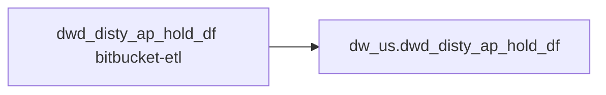

# FACT: Supplemental fact/context table used by select POS reports (`dw_us.dwd_disty_ap_hold_df`)

- artifact_type: etl_table
- artifact_id: dw_us.dwd_disty_ap_hold_df
- domain: pos
- one_line_purpose: POS-domain fact table with load SQL now available under bitbucket-etl (see L3); prior contract narrative preserved below.
- layer_type: DWD
- source_kind: etl_sql
- evidence_source: source/contracts/pos/bitbucket-etl/dwd_disty_ap_hold_df/dwd_disty_ap_hold_df.sql
- bitbucket_etl_bundle: source/contracts/pos/bitbucket-etl/dwd_disty_ap_hold_df/
- related_etl_scripts:
- `source/contracts/pos/bitbucket-etl/dwd_disty_ap_hold_df/load_ap_hold.py`

---

## L1 Data Foundation

### Identity and physical mapping
- **Table:** `dw_us.dwd_disty_ap_hold_df`
- **Layer type:** DWD
- **Canonical / derived:** Derived / ETL-loaded (see L3 from bitbucket-etl)
- **Owner team:** Not documented in repository

### Grain, scope, exclusions
- See preserved **Grain and keys** section below (POS contract narrative retained).

### Cross-engine presence
| Engine | Present | Notes |
|--------|---------|-------|
| Hive | yes | ETL load target |
| Vertica | yes (per preserved POS contract) | Reporting path in preserved Business query tables |

### Physical schema reference

| Field | Value |
|-------|-------|
| **entity_id** | `dw_us.dwd_disty_ap_hold_df` |
| **l1_catalog_seed** | `target/storage/wkb/snapshots/_snapshot_id_template/l1_catalog/{engine}_{schema}_{table}.json` |
| **column_count** | pending (run ddl_seed_writer) |
| **partition_keys** | See preserved Grain (`date_flag` when documented) |
| **ddl_source** | pending |
| **retrieval** | `python -m tools.wkb.indexing.run_query --query "pos dwd_disty_ap_hold_df schema" --intent find_table_schema` |

### Lineage

- **Primary load:** `source/contracts/pos/bitbucket-etl/dwd_disty_ap_hold_df/dwd_disty_ap_hold_df.sql`
- **upstream:** `${literal_source_db}.ods_dw_prod_dws_history_ap_hold` — FROM/JOIN — `source/contracts/pos/bitbucket-etl/dwd_disty_ap_hold_df/dwd_disty_ap_hold_df.sql`
- **downstream:** see L6 Downstream consumers
### Freshness and load path
- Parameters / date window: see ETL `${literal_*}` / `${date_flag}` in evidence script.
- Schedule: Not documented in repository

## L2 Declarative Knowledge

### Business purpose
See preserved **Business purpose** below (POS contract catalog + now linked ETL).

### Audience and use cases
See preserved **Who it helps** section.

### Fact key resolution
See preserved **Grain and keys**.

### Time field semantics
- Prefer partition / `date_flag` filters documented in preserved sections and L3 Key filters from ETL.

### Metrics served
See preserved Metrics / column groups when present.

### Metric serving map
N/A unless multi-period wide table (see preserved content).

### etl_metrics
No new metric-index formulas appended in this bitbucket-etl upgrade pass.

## L3 Procedural Knowledge

### Query and routing rules
- Reporting: Vertica `dw_us.dwd_disty_ap_hold_df` (see preserved Business query tables).
- Load logic: bitbucket-etl evidence `source/contracts/pos/bitbucket-etl/dwd_disty_ap_hold_df/dwd_disty_ap_hold_df.sql`.

### Dimension join patterns
See Relationship map (ETL JOIN edges) and preserved contract join notes.

### Key filters and ETL business logic
ETL WHERE / JOIN predicates are summarized via Relationship map provenance and Column derivations; full narrative retained in preserved sections.

### Standard time-filter SQL
```sql
-- Prefer date_flag / literal_start_date / literal_end_date as used in source/contracts/pos/bitbucket-etl/dwd_disty_ap_hold_df/dwd_disty_ap_hold_df.sql
```

### End-to-end flow


### Base tables register
| Object | Role |
|--------|------|
| See Relationship map + preserved lineage | ETL sources / temps |

### Step-by-step logic
1. Execute load SQL / python in `source/contracts/pos/bitbucket-etl/dwd_disty_ap_hold_df/`.
2. Apply date / business filters from ETL.
3. Write target `dw_us.dwd_disty_ap_hold_df` (see INSERT/OVERWRITE in evidence).

### Relationship map (embedded)

| from_fqn | to_fqn | cardinality | join_keys | provenance |
|----------|--------|-------------|-----------|------------|
| — | — | — | — | No JOIN edges parsed from ETL (`source/contracts/pos/bitbucket-etl/dwd_disty_ap_hold_df/dwd_disty_ap_hold_df.sql`); see Base tables register / step-by-step |

### Special logic (embedded)

`source/ref/pos/special_logic.txt` exists but no rule naming this FQN/stem (`dw_us.dwd_disty_ap_hold_df`).

Not documented in repository


### Column / field derivations (from ETL SQL)

| target_column | expression_sql | upstream_columns | upstream_tables | transform_kind | evidence |
|---------------|----------------|------------------|-----------------|----------------|----------|
| `rec_no` | `a.rec_no` | `rec_no` | `${literal_source_db}.ods_dw_prod_dws_history_ap_hold` | passthrough | `source/contracts/pos/bitbucket-etl/dwd_disty_ap_hold_df/dwd_disty_ap_hold_df.sql:3` |
| `rec_line_no` | `a.rec_line_no` | `rec_line_no` | `${literal_source_db}.ods_dw_prod_dws_history_ap_hold` | passthrough | `source/contracts/pos/bitbucket-etl/dwd_disty_ap_hold_df/dwd_disty_ap_hold_df.sql:4` |
| `u_version` | `u_version` | `u_version` | `${literal_source_db}.ods_dw_prod_dws_history_ap_hold` | passthrough | `source/contracts/pos/bitbucket-etl/dwd_disty_ap_hold_df/dwd_disty_ap_hold_df.sql:5` |
| `rec_type` | `a.rec_type` | `rec_type` | `${literal_source_db}.ods_dw_prod_dws_history_ap_hold` | passthrough | `source/contracts/pos/bitbucket-etl/dwd_disty_ap_hold_df/dwd_disty_ap_hold_df.sql:6` |
| `rec_loc` | `a.rec_loc` | `rec_loc` | `${literal_source_db}.ods_dw_prod_dws_history_ap_hold` | passthrough | `source/contracts/pos/bitbucket-etl/dwd_disty_ap_hold_df/dwd_disty_ap_hold_df.sql:7` |
| `sku_no` | `a.sku_no` | `sku_no` | `${literal_source_db}.ods_dw_prod_dws_history_ap_hold` | passthrough | `source/contracts/pos/bitbucket-etl/dwd_disty_ap_hold_df/dwd_disty_ap_hold_df.sql:8` |
| `vend_no` | `a.vend_no` | `vend_no` | `${literal_source_db}.ods_dw_prod_dws_history_ap_hold` | passthrough | `source/contracts/pos/bitbucket-etl/dwd_disty_ap_hold_df/dwd_disty_ap_hold_df.sql:9` |
| `vend_loc_no` | `a.vend_loc_no` | `vend_loc_no` | `${literal_source_db}.ods_dw_prod_dws_history_ap_hold` | passthrough | `source/contracts/pos/bitbucket-etl/dwd_disty_ap_hold_df/dwd_disty_ap_hold_df.sql:10` |
| `part_no` | `a.part_no` | `part_no` | `${literal_source_db}.ods_dw_prod_dws_history_ap_hold` | passthrough | `source/contracts/pos/bitbucket-etl/dwd_disty_ap_hold_df/dwd_disty_ap_hold_df.sql:11` |
| `order_type` | `a.order_type` | `order_type` | `${literal_source_db}.ods_dw_prod_dws_history_ap_hold` | passthrough | `source/contracts/pos/bitbucket-etl/dwd_disty_ap_hold_df/dwd_disty_ap_hold_df.sql:12` |
| `order_no` | `a.order_no` | `order_no` | `${literal_source_db}.ods_dw_prod_dws_history_ap_hold` | passthrough | `source/contracts/pos/bitbucket-etl/dwd_disty_ap_hold_df/dwd_disty_ap_hold_df.sql:13` |
| `order_line_no` | `a.order_line_no` | `order_line_no` | `${literal_source_db}.ods_dw_prod_dws_history_ap_hold` | passthrough | `source/contracts/pos/bitbucket-etl/dwd_disty_ap_hold_df/dwd_disty_ap_hold_df.sql:14` |
| `order_exp_line_no` | `a.order_exp_line_no` | `order_exp_line_no` | `${literal_source_db}.ods_dw_prod_dws_history_ap_hold` | passthrough | `source/contracts/pos/bitbucket-etl/dwd_disty_ap_hold_df/dwd_disty_ap_hold_df.sql:15` |
| `inventory_cost` | `a.inventory_cost` | `inventory_cost` | `${literal_source_db}.ods_dw_prod_dws_history_ap_hold` | passthrough | `source/contracts/pos/bitbucket-etl/dwd_disty_ap_hold_df/dwd_disty_ap_hold_df.sql:16` |
| `invoice_cost` | `a.invoice_cost` | `invoice_cost` | `${literal_source_db}.ods_dw_prod_dws_history_ap_hold` | passthrough | `source/contracts/pos/bitbucket-etl/dwd_disty_ap_hold_df/dwd_disty_ap_hold_df.sql:17` |
| `po_cost` | `a.po_cost` | `po_cost` | `${literal_source_db}.ods_dw_prod_dws_history_ap_hold` | passthrough | `source/contracts/pos/bitbucket-etl/dwd_disty_ap_hold_df/dwd_disty_ap_hold_df.sql:18` |
| `rec_qty` | `a.rec_qty` | `rec_qty` | `${literal_source_db}.ods_dw_prod_dws_history_ap_hold` | passthrough | `source/contracts/pos/bitbucket-etl/dwd_disty_ap_hold_df/dwd_disty_ap_hold_df.sql:19` |
| `rec_datetime` | `a.rec_datetime` | `rec_datetime` | `${literal_source_db}.ods_dw_prod_dws_history_ap_hold` | passthrough | `source/contracts/pos/bitbucket-etl/dwd_disty_ap_hold_df/dwd_disty_ap_hold_df.sql:20` |
| `doc_date` | `doc_date` | `doc_date` | `${literal_source_db}.ods_dw_prod_dws_history_ap_hold` | passthrough | `source/contracts/pos/bitbucket-etl/dwd_disty_ap_hold_df/dwd_disty_ap_hold_df.sql:21` |
| `doc_no` | `doc_no` | `doc_no` | `${literal_source_db}.ods_dw_prod_dws_history_ap_hold` | passthrough | `source/contracts/pos/bitbucket-etl/dwd_disty_ap_hold_df/dwd_disty_ap_hold_df.sql:22` |
| `entry_datetime` | `a.entry_datetime` | `entry_datetime` | `${literal_source_db}.ods_dw_prod_dws_history_ap_hold` | passthrough | `source/contracts/pos/bitbucket-etl/dwd_disty_ap_hold_df/dwd_disty_ap_hold_df.sql:23` |
| `entry_id` | `a.entry_id` | `entry_id` | `${literal_source_db}.ods_dw_prod_dws_history_ap_hold` | passthrough | `source/contracts/pos/bitbucket-etl/dwd_disty_ap_hold_df/dwd_disty_ap_hold_df.sql:24` |
| `hold` | `a.hold` | `hold` | `${literal_source_db}.ods_dw_prod_dws_history_ap_hold` | passthrough | `source/contracts/pos/bitbucket-etl/dwd_disty_ap_hold_df/dwd_disty_ap_hold_df.sql:25` |
| `accept` | `accept` | `accept` | `${literal_source_db}.ods_dw_prod_dws_history_ap_hold` | passthrough | `source/contracts/pos/bitbucket-etl/dwd_disty_ap_hold_df/dwd_disty_ap_hold_df.sql:26` |
| `packing_list_no` | `a.packing_list_no` | `packing_list_no` | `${literal_source_db}.ods_dw_prod_dws_history_ap_hold` | passthrough | `source/contracts/pos/bitbucket-etl/dwd_disty_ap_hold_df/dwd_disty_ap_hold_df.sql:27` |
| `rec_close_date` | `rec_close_date` | `rec_close_date` | `${literal_source_db}.ods_dw_prod_dws_history_ap_hold` | passthrough | `source/contracts/pos/bitbucket-etl/dwd_disty_ap_hold_df/dwd_disty_ap_hold_df.sql:28` |
| `ext_cost` | `a.ext_cost` | `ext_cost` | `${literal_source_db}.ods_dw_prod_dws_history_ap_hold` | passthrough | `source/contracts/pos/bitbucket-etl/dwd_disty_ap_hold_df/dwd_disty_ap_hold_df.sql:29` |
| `gl_acct_no` | `a.gl_acct_no` | `gl_acct_no` | `${literal_source_db}.ods_dw_prod_dws_history_ap_hold` | passthrough | `source/contracts/pos/bitbucket-etl/dwd_disty_ap_hold_df/dwd_disty_ap_hold_df.sql:30` |
| `usd_po_cost` | `a.usd_po_cost` | `usd_po_cost` | `${literal_source_db}.ods_dw_prod_dws_history_ap_hold` | passthrough | `source/contracts/pos/bitbucket-etl/dwd_disty_ap_hold_df/dwd_disty_ap_hold_df.sql:31` |
| `usd_ext_cost` | `a.usd_ext_cost` | `usd_ext_cost` | `${literal_source_db}.ods_dw_prod_dws_history_ap_hold` | passthrough | `source/contracts/pos/bitbucket-etl/dwd_disty_ap_hold_df/dwd_disty_ap_hold_df.sql:32` |
| `snap_date` | `snap_date` | `snap_date` | `${literal_source_db}.ods_dw_prod_dws_history_ap_hold` | passthrough | `source/contracts/pos/bitbucket-etl/dwd_disty_ap_hold_df/dwd_disty_ap_hold_df.sql:33` |
| `date_flag` | `date_format(date_flag,'yyyy-MM-dd')` | `date_flag`, `yyyy`, `MM`, `dd` | `${literal_source_db}.ods_dw_prod_dws_history_ap_hold` | arithmetic | `source/contracts/pos/bitbucket-etl/dwd_disty_ap_hold_df/dwd_disty_ap_hold_df.sql:34` |
| `company_no` | `company_no` | `company_no` | `${literal_source_db}.ods_dw_prod_dws_history_ap_hold` | passthrough | `source/contracts/pos/bitbucket-etl/dwd_disty_ap_hold_df/dwd_disty_ap_hold_df.sql:1` |

### Sentinel and code values
See preserved content and ETL CASE expressions in column derivations.

## L4 Validation

### Resolved partition value
- Partition / date parameters from ETL literals — concrete calendar values Not documented in repository (resolve via Azkaban when flow evidence exists).

### Data quality checks
See preserved Validation SQL when present.

### Validation SQL
Prefer preserved Vertica validation bundle when present; MCP business SQL not re-run during documentation.

### Caveats for interpretation
- Document upgraded additively from POS **contract** MD + **bitbucket-etl** SQL. Prior contract text is under **Preserved pre-L1-L6 content**.

### Conflicts and open questions
- Companion loader scripts may also be documented under `ap/` / `ar/` / `inventory/` domains (same stems); see `target/knowledgebase/pos/readme.md` cross-links.

## L5 Runtime View

### Query path and engine preference
| Path | Engine | Evidence |
|------|--------|----------|
| Load | Hive/Spark | `source/contracts/pos/bitbucket-etl/dwd_disty_ap_hold_df/dwd_disty_ap_hold_df.sql` |
| Report | Vertica | preserved POS contract |

### Access constraints
Not documented in repository

### Query risk profile
- Always filter `date_flag` / documented partition keys before wide scans.

## L6 Access and Consumption

### Primary consumers and use cases
See preserved audience / POS report consumers.

### Representative query patterns
See preserved Validation SQL / contract examples.

### Dependencies and notes

#### Upstream objects (verified)
| Object | Usage | Evidence |
|--------|-------|----------|
| ETL FROM/JOIN objects | load | `source/contracts/pos/bitbucket-etl/dwd_disty_ap_hold_df/dwd_disty_ap_hold_df.sql` (see Relationship map) |

#### Downstream consumers (verified)

| Object / script | Evidence |
|-----------------|----------|
| POS / RDS reports (contract) | preserved sections |
| Related loaders | see related_etl_scripts header |
| KB / contract ref: `source/contracts/pos/bitbucket-etl/MANIFEST.md` | `source/contracts/pos/bitbucket-etl/MANIFEST.md:141` |
| KB / contract ref: `source/contracts/pos/tables/dwd_disty_ap_hold_df.md` | `source/contracts/pos/tables/dwd_disty_ap_hold_df.md:5` |
| ETL/script ref: `source/contracts/rds/vertica_inventory/etl/inv_ap_hold_availability_rds_19106.sql` | `source/contracts/rds/vertica_inventory/etl/inv_ap_hold_availability_rds_19106.sql:9` |
| ETL/script ref: `source/contracts/rds/vertica_vpo/etl/vpo_pos_doc_fallback_cedm_serial_rds_610.sql` | `source/contracts/rds/vertica_vpo/etl/vpo_pos_doc_fallback_cedm_serial_rds_610.sql:195` |
| FLOW ref: `source/etl/flows/data_service/ap/ap_aging_load_br.flow` | `source/etl/flows/data_service/ap/ap_aging_load_br.flow:243` |
| FLOW ref: `source/etl/flows/data_service/ap/ap_aging_load_ca.flow` | `source/etl/flows/data_service/ap/ap_aging_load_ca.flow:243` |
| FLOW ref: `source/etl/flows/data_service/ap/ap_aging_load_us.flow` | `source/etl/flows/data_service/ap/ap_aging_load_us.flow:244` |
| FLOW ref: `source/etl/flows/data_service/ap/ap_aging_load_wcla.flow` | `source/etl/flows/data_service/ap/ap_aging_load_wcla.flow:247` |
| FLOW ref: `source/etl/flows/data_service/ap/ap_data_initialization_us.flow` | `source/etl/flows/data_service/ap/ap_data_initialization_us.flow:34` |
| ETL/script ref: `source/etl/sql/ap/data_service/ap/python/load_ap_hold.py` | `source/etl/sql/ap/data_service/ap/python/load_ap_hold.py:141` |
| ETL/script ref: `source/etl/sql/ap/data_service/ap/python/load_ap_vdah_lines.py` | `source/etl/sql/ap/data_service/ap/python/load_ap_vdah_lines.py:65` |
| KB / contract ref: `target/knowledgebase/RDS/vertica_inventory/inv_ap_hold_availability_rds_19106.md` | `target/knowledgebase/RDS/vertica_inventory/inv_ap_hold_availability_rds_19106.md:51` |
| KB / contract ref: `target/knowledgebase/RDS/vertica_vpo/vpo_pos_doc_fallback_cedm_serial_rds_610.md` | `target/knowledgebase/RDS/vertica_vpo/vpo_pos_doc_fallback_cedm_serial_rds_610.md:170` |
| KB / contract ref: `target/knowledgebase/ap/load_ap_hold.md` | `target/knowledgebase/ap/load_ap_hold.md:4` |
| KB / contract ref: `target/knowledgebase/ap/load_ap_vdah_lines.md` | `target/knowledgebase/ap/load_ap_vdah_lines.md:52` |
| KB / contract ref: `target/knowledgebase/pos/readme.md` | `target/knowledgebase/pos/readme.md:52` |

#### Operational detail (verified)
- Bundle: `source/contracts/pos/bitbucket-etl/dwd_disty_ap_hold_df/`
- Manifest: `source/contracts/pos/bitbucket-etl/MANIFEST.md`

#### Not documented in repository
- Schedule, owner, SLA

---

## Preserved pre-L1-L6 content

> Retained verbatim from the prior POS contract knowledgebase document (nothing removed). ETL load evidence above supplements this catalog narrative.


**Domain:** pos  
**Source contract:** `C:\Users\T154858D.TDSNX\Desktop\git_repo_v1\data_analysis_agent_brpt\knowledge\POS\tables\dwd_disty_ap_hold_df.md`  
**Knowledgebase path:** `target/knowledgebase/pos/dwd_disty_ap_hold_df.md`

## Business purpose

Supplemental fact/context table used by select POS reports

This document is derived from the POS table contract catalog. ETL script lineage for load jobs is **not documented in this repository** unless listed under verified dependencies below.

---

## What the process does (high level)

| Stage | Business meaning |
|-------|------------------|
| **Catalog object** | `dw_us.dwd_disty_ap_hold_df` — FACT layer table used in US POS reporting (`US POS baseline`). |
| **Consumption** | Queried from Vertica for POS/RDS reports, exports, and enrichment joins. |

**Parameters:** Country schema pattern `dw_us` (US baseline documented as `dw_us` / `dim_us`).

---

## Who it helps and how

| Audience | How they benefit |
|----------|-----------------|
| **POS / RDS reporting** | Vertica RDS POS custom reports (499 scripts scanned: US 367, CA 124, MX 7, BR 1) |
| **Sales analytics** | Order, customer, product, and margin attributes at documented grain. |
| **Data engineering** | Stable table contract for joins to POS hub and downstream exports. |

---

## Business query tables (Vertica)

| Role | Hive object | Vertica object | Sync mode | Evidence | MCP verified |
|------|-------------|----------------|-----------|----------|--------------|
| **Query for reporting** | `dw_us.dwd_disty_ap_hold_df` | `dw_us.dwd_disty_ap_hold_df` | overwrite / incremental | POS contract `dwd_disty_ap_hold_df.md:L1` | yes (POS contract v2 — Vertica verified in source catalog) |
| **Hive alternative** | `dw_us.dwd_disty_ap_hold_df` | same as reporting table | - | POS contract cross-engine note | - |
| **ETL internal** | n/a | n/a | - | ETL not in wiki repo | - |

Business users should query **`dw_us.dwd_disty_ap_hold_df`** in Vertica for POS-domain reporting aligned to this contract.

---

## Grain and keys

- **Grain:** See natural key columns from POS contract column catalog.
- **Partition:** `date_flag` — daily business date filter for POS reporting (per POS contract).
- **Natural key:** `rec_no`, `rec_line_no`, `sku_no`, `vend_no`, `vend_loc_no`, `part_no`
- **Exclusions (reporting):** None documented in POS contract.

---

## Validation SQL (Vertica)

```sql
-- 1) Row count by partition
SELECT date_flag, COUNT(*) AS row_cnt
FROM dw_us.dwd_disty_ap_hold_df
WHERE date_flag = '${partition_value}'
GROUP BY date_flag;

-- 2) Metric sum by business dimension (top N)
SELECT rec_no, COUNT(*) AS row_cnt
FROM dw_us.dwd_disty_ap_hold_df
WHERE date_flag = '${partition_value}'
GROUP BY rec_no
ORDER BY COUNT(*) DESC
LIMIT 20;

-- 3) Grain duplicate check
SELECT rec_no, rec_line_no, sku_no, date_flag, COUNT(*) AS cnt
FROM dw_us.dwd_disty_ap_hold_df
WHERE date_flag = '${partition_value}'
GROUP BY rec_no, rec_line_no, sku_no, date_flag
HAVING COUNT(*) > 1;
```

Replace `${partition_value}` with the resolved business date or period from the report scope.

---

## Data you can fetch and use downstream

### Core measures

- `inventory_cost` — inventory cost
- `invoice_cost` — invoice cost
- `po_cost` — po cost
- `rec_qty` — rec qty
- `ext_cost` — ext cost
- `usd_po_cost` — usd po cost
- `usd_ext_cost` — usd ext cost

### Dimension and key columns

- `rec_no` — rec no
- `rec_line_no` — rec line no
- `u_version` — u version
- `rec_type` — rec type
- `rec_loc` — rec loc
- `sku_no` — sku no
- `vend_no` — vend no
- `vend_loc_no` — vend loc no
- `part_no` — part no
- `order_type` — order type
- `order_no` — order no
- `order_line_no` — order line no
- `order_exp_line_no` — order exp line no
- `rec_datetime` — rec datetime
- `doc_date` — doc date
- `doc_no` — doc no
- `entry_datetime` — entry datetime
- `entry_id` — entry id
- `hold` — hold
- `accept` — accept
- `packing_list_no` — packing list no
- `rec_close_date` — rec close date
- `gl_acct_no` — gl acct no
- `snap_date` — snap date
- `date_flag` — date flag
- `company_no` — company no

---

## Metrics business users typically care about

When exposing this table to the business, lead with measure and key columns from the POS contract catalog (see **Data you can fetch** above).

---

## End-to-end flow (summary)

**Target table:** `dw_us.dwd_disty_ap_hold_df`  
**Load pattern:** Not documented in repository

1. Upstream: Curated DWD/DIM/ODS load jobs in disty common pipeline
2. Table available in Hive and Vertica for POS consumption.
3. Downstream: Vertica RDS POS report scripts (`rds_*_rtv`), ad-hoc POS exports


---

## Base tables register

| Object | Role in this job |
|--------|-----------------|
| `dw_us.dwd_disty_ap_hold_df` | Primary catalog table documented from POS contract |

---

## Step-by-step logic

Not applicable — this Knowledgebase entry is a **table catalog** converted from POS contract v2. ETL step-by-step logic is not present in this wiki repository.

**Standard POS filters (from contract L3):**

- Standard POS filters inherited from domain-knowledge.md when joining to hub.

---

## Caveats for interpretation

- Derived from POS contract v2; ETL SQL and Azkaban flow names are not verified in this repository unless cited below.
- US schema `dw_us` documented as baseline; CA/MX/BR use same table names with regional scope.
- - Verify grain keys (`order_no`, `order_type`, `order_line_no`) not null for fact joins when applicable.
- For one-to-many partners (SPA/SCM, serial), validate row counts before joining to hub.
- Hub: `extend_net_price` should align with `(unit_net_price * ship_qty)` within rounding tolerance when both populated.
- Validate join cardinality to POS hub before production report use.

---

## Dependencies and notes (verified only)

### Upstream objects (verified)

| Object | Usage | Evidence |
|--------|-------|----------|
| POS contract source | Table metadata, grain, columns | `C:\Users\T154858D.TDSNX\Desktop\git_repo_v1\data_analysis_agent_brpt\knowledge\POS\tables\dwd_disty_ap_hold_df.md` |

### Downstream consumers (verified)

| Object / script | Evidence |
|-----------------|----------|
| POS RDS / export consumers | `dwd_disty_ap_hold_df.md:L6` — Vertica RDS POS report scripts (`rds_*_rtv`), ad-hoc POS exports |

### Operational detail (verified)

- Freshness: Not documented in repository
- Column count: 33 (POS contract catalog)

### Not documented in repository

- ETL SQL load script and Azkaban `.flow` for this table
- hive2vertica sync job file:line evidence
- Schedule, owner, SLA

### Related scripts (verified)

None identified in repository.

---

*Document generated from POS contract `C:\Users\T154858D.TDSNX\Desktop\git_repo_v1\data_analysis_agent_brpt\knowledge\POS\tables\dwd_disty_ap_hold_df.md`.*