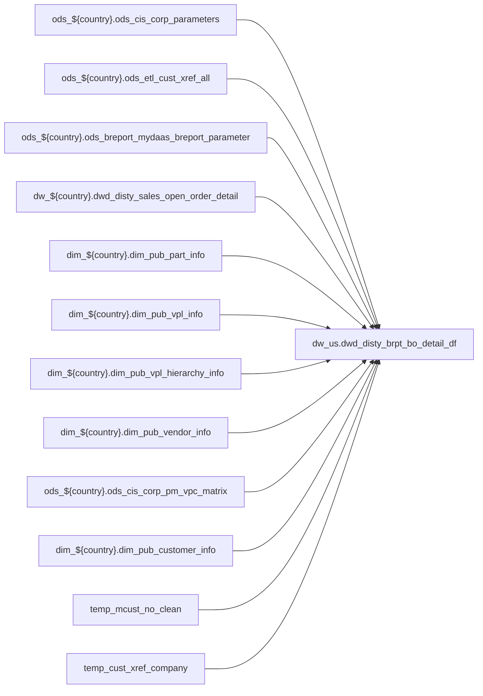

# FACT: Supplemental fact/context table used by select POS reports (`dw_us.dwd_disty_brpt_bo_detail_df`)

- artifact_type: etl_table
- artifact_id: dw_us.dwd_disty_brpt_bo_detail_df
- domain: pos
- one_line_purpose: POS-domain table with load SQL under bitbucket-etl (see L3); prior contract narrative preserved below when present.
- layer_type: DWD
- source_kind: etl_sql
- evidence_source: source/contracts/pos/bitbucket-etl/dwd_disty_brpt_bo_detail_df/dwd_disty_brpt_bo_detail_df.py
- bitbucket_etl_bundle: source/contracts/pos/bitbucket-etl/dwd_disty_brpt_bo_detail_df/
- related_etl_scripts:
- None

---

## L1 Data Foundation

### Identity and physical mapping
- **Table:** `dw_us.dwd_disty_brpt_bo_detail_df`
- **Layer type:** DWD
- **Canonical / derived:** Derived / ETL-loaded (see L3 from bitbucket-etl)
- **Owner team:** Not documented in repository

### Grain, scope, exclusions
- See preserved **Grain and keys** section below when present (POS contract narrative retained).
- Otherwise infer from SELECT / GROUP BY / INSERT column list in `source/contracts/pos/bitbucket-etl/dwd_disty_brpt_bo_detail_df/dwd_disty_brpt_bo_detail_df.py`.

### Cross-engine presence
| Engine | Present | Notes |
|--------|---------|-------|
| Hive | yes | ETL load target |
| Vertica | yes when POS contract documents Vertica sync | See preserved Business query tables |

### Physical schema reference

| Field | Value |
|-------|-------|
| **entity_id** | `dw_us.dwd_disty_brpt_bo_detail_df` |
| **l1_catalog_seed** | `target/storage/wkb/snapshots/_snapshot_id_template/l1_catalog/{engine}_{schema}_{table}.json` |
| **column_count** | pending (run ddl_seed_writer) |
| **partition_keys** | See preserved Grain / L4 / ETL PARTITION clause |
| **ddl_source** | pending |
| **retrieval** | `python -m tools.wkb.indexing.run_query --query "pos dwd_disty_brpt_bo_detail_df schema" --intent find_table_schema` |

### Lineage

- **Primary load:** `source/contracts/pos/bitbucket-etl/dwd_disty_brpt_bo_detail_df/dwd_disty_brpt_bo_detail_df.py`
- **upstream:** `ods_${country}.ods_cis_corp_parameters` — FROM/JOIN — `source/contracts/pos/bitbucket-etl/dwd_disty_brpt_bo_detail_df/dwd_disty_brpt_bo_detail_df.py`
- **upstream:** `ods_${country}.ods_etl_cust_xref_all` — FROM/JOIN — `source/contracts/pos/bitbucket-etl/dwd_disty_brpt_bo_detail_df/dwd_disty_brpt_bo_detail_df.py`
- **upstream:** `ods_${country}.ods_breport_mydaas_breport_parameter` — FROM/JOIN — `source/contracts/pos/bitbucket-etl/dwd_disty_brpt_bo_detail_df/dwd_disty_brpt_bo_detail_df.py`
- **upstream:** `dw_${country}.dwd_disty_sales_open_order_detail` — FROM/JOIN — `source/contracts/pos/bitbucket-etl/dwd_disty_brpt_bo_detail_df/dwd_disty_brpt_bo_detail_df.py`
- **upstream:** `dim_${country}.dim_pub_part_info` — FROM/JOIN — `source/contracts/pos/bitbucket-etl/dwd_disty_brpt_bo_detail_df/dwd_disty_brpt_bo_detail_df.py`
- **upstream:** `dim_${country}.dim_pub_vpl_info` — FROM/JOIN — `source/contracts/pos/bitbucket-etl/dwd_disty_brpt_bo_detail_df/dwd_disty_brpt_bo_detail_df.py`
- **upstream:** `dim_${country}.dim_pub_vpl_hierarchy_info` — FROM/JOIN — `source/contracts/pos/bitbucket-etl/dwd_disty_brpt_bo_detail_df/dwd_disty_brpt_bo_detail_df.py`
- **upstream:** `dim_${country}.dim_pub_vendor_info` — FROM/JOIN — `source/contracts/pos/bitbucket-etl/dwd_disty_brpt_bo_detail_df/dwd_disty_brpt_bo_detail_df.py`
- **upstream:** `ods_${country}.ods_cis_corp_pm_vpc_matrix` — FROM/JOIN — `source/contracts/pos/bitbucket-etl/dwd_disty_brpt_bo_detail_df/dwd_disty_brpt_bo_detail_df.py`
- **upstream:** `dim_${country}.dim_pub_customer_info` — FROM/JOIN — `source/contracts/pos/bitbucket-etl/dwd_disty_brpt_bo_detail_df/dwd_disty_brpt_bo_detail_df.py`
- **upstream:** `temp_mcust_no_clean` — FROM/JOIN — `source/contracts/pos/bitbucket-etl/dwd_disty_brpt_bo_detail_df/dwd_disty_brpt_bo_detail_df.py`
- **upstream:** `temp_cust_xref_company` — FROM/JOIN — `source/contracts/pos/bitbucket-etl/dwd_disty_brpt_bo_detail_df/dwd_disty_brpt_bo_detail_df.py`
- **upstream:** `ods_${country}.ods_cis_corp_cust_type` — FROM/JOIN — `source/contracts/pos/bitbucket-etl/dwd_disty_brpt_bo_detail_df/dwd_disty_brpt_bo_detail_df.py`
- **upstream:** `ods_${country}.ods_cis_corp_pl_code` — FROM/JOIN — `source/contracts/pos/bitbucket-etl/dwd_disty_brpt_bo_detail_df/dwd_disty_brpt_bo_detail_df.py`
- **upstream:** `ods_${country}.ods_cis_corp_order_eu_common` — FROM/JOIN — `source/contracts/pos/bitbucket-etl/dwd_disty_brpt_bo_detail_df/dwd_disty_brpt_bo_detail_df.py`
- **upstream:** `ods_${country}.ods_cis_corp_order_soldto` — FROM/JOIN — `source/contracts/pos/bitbucket-etl/dwd_disty_brpt_bo_detail_df/dwd_disty_brpt_bo_detail_df.py`
- **upstream:** `ods_${country}.ods_cis_corp_order_profile` — FROM/JOIN — `source/contracts/pos/bitbucket-etl/dwd_disty_brpt_bo_detail_df/dwd_disty_brpt_bo_detail_df.py`
- **upstream:** `table_dwd` — FROM/JOIN — `source/contracts/pos/bitbucket-etl/dwd_disty_brpt_bo_detail_df/dwd_disty_brpt_bo_detail_df.py`
- **upstream:** `ods_${country}.ods_cis_corp_order_detail` — FROM/JOIN — `source/contracts/pos/bitbucket-etl/dwd_disty_brpt_bo_detail_df/dwd_disty_brpt_bo_detail_df.py`
- **upstream:** `table_integrate` — FROM/JOIN — `source/contracts/pos/bitbucket-etl/dwd_disty_brpt_bo_detail_df/dwd_disty_brpt_bo_detail_df.py`
- **downstream:** see L6 Downstream consumers
### Freshness and load path
- Parameters / date window: see ETL `${literal_*}` / `${date_flag}` / `${start_date}` in evidence script.
- Schedule: Not documented in repository

## L2 Declarative Knowledge

### Business purpose
See preserved **Business purpose** below when present (POS contract catalog + linked ETL).

### Audience and use cases
See preserved **Who it helps** section when present.

### Fact key resolution
See preserved **Grain and keys** when present.

### Time field semantics
- Prefer partition / `date_flag` filters documented in preserved sections and L3 Key filters from ETL.

### Metrics served
See preserved Metrics / column groups when present; otherwise L3 column derivations.

### Metric serving map
N/A unless multi-period wide table (see preserved content).

### etl_metrics
No new metric-index formulas appended in this bitbucket-etl upgrade pass.

## L3 Procedural Knowledge

### Query and routing rules
- Reporting: Vertica `dw_us.dwd_disty_brpt_bo_detail_df` when synced (see preserved Business query tables).
- Load logic: bitbucket-etl evidence `source/contracts/pos/bitbucket-etl/dwd_disty_brpt_bo_detail_df/dwd_disty_brpt_bo_detail_df.py`.

### Dimension join patterns
See Relationship map (ETL JOIN edges) and preserved contract join notes.

### Key filters and ETL business logic

| Predicate | Kind | Evidence |
|-----------|------|----------|
| `parameter_name = 'COMPANY_NO' and parameter_value = 1 limit 1 ) as company_no from (select * from ods_${country}.ods_etl_cust_xref_all where xref_type = 'AGENT_NO' and nvl(active,'Y') = 'Y' ) as cx...` | Business | `source/contracts/pos/bitbucket-etl/dwd_disty_brpt_bo_detail_df/dwd_disty_brpt_bo_detail_df.py` |
| `cx.xref_type = 'MASTER_SUB' and nvl(cx.active,'Y') = 'Y') t where t.r_no=1; with table_dwd as ( select table_dwd.order_no, table_dwd.order_type, table_dwd.order_line_no, table_dwd.from_loc_no as lo...` | Business | `source/contracts/pos/bitbucket-etl/dwd_disty_brpt_bo_detail_df/dwd_disty_brpt_bo_detail_df.py` |
| `param_type='Consolidated_report' and param_cat='Consolidated Mcust' and param_sub_cat='Consolidated Mcust' and profile_i <> cast(profile_f as int)) as dbp on table_customer.mcust_no = dbp.icode lef...` | Business | `source/contracts/pos/bitbucket-etl/dwd_disty_brpt_bo_detail_df/dwd_disty_brpt_bo_detail_df.py` |
| `(profile_type = 'EXPSHIPDAY' and profile_cat = 'SHIP' and order_line_no is null) or (profile_type = 'BIZ_SLN' and active = 'Y') or (profile_type = 'RESERVEVPO' and profile_cat = 'ORDR' and active =...` | Business | `source/contracts/pos/bitbucket-etl/dwd_disty_brpt_bo_detail_df/dwd_disty_brpt_bo_detail_df.py` |
| `profile_type = 'EXPSHIPDAY' and profile_cat = 'SHIP' and order_line_no is not null) as table_order_profile2 --unique id:order_no+order_type+order_line_no on table_dwd.order_no = table_order_profile...` | Business | `source/contracts/pos/bitbucket-etl/dwd_disty_brpt_bo_detail_df/dwd_disty_brpt_bo_detail_df.py` |

### Standard time-filter SQL
```sql
-- Prefer date_flag / literal_start_date / literal_end_date as used in source/contracts/pos/bitbucket-etl/dwd_disty_brpt_bo_detail_df/dwd_disty_brpt_bo_detail_df.py
```

### End-to-end flow


### Base tables register
| Object | Role |
|--------|------|
| `ods_${country}.ods_cis_corp_parameters` | source / temp (FROM/JOIN) |
| `ods_${country}.ods_etl_cust_xref_all` | source / temp (FROM/JOIN) |
| `ods_${country}.ods_breport_mydaas_breport_parameter` | source / temp (FROM/JOIN) |
| `dw_${country}.dwd_disty_sales_open_order_detail` | source / temp (FROM/JOIN) |
| `dim_${country}.dim_pub_part_info` | source / temp (FROM/JOIN) |
| `dim_${country}.dim_pub_vpl_info` | source / temp (FROM/JOIN) |
| `dim_${country}.dim_pub_vpl_hierarchy_info` | source / temp (FROM/JOIN) |
| `dim_${country}.dim_pub_vendor_info` | source / temp (FROM/JOIN) |
| `ods_${country}.ods_cis_corp_pm_vpc_matrix` | source / temp (FROM/JOIN) |
| `dim_${country}.dim_pub_customer_info` | source / temp (FROM/JOIN) |
| `temp_mcust_no_clean` | source / temp (FROM/JOIN) |
| `temp_cust_xref_company` | source / temp (FROM/JOIN) |
| `ods_${country}.ods_cis_corp_cust_type` | source / temp (FROM/JOIN) |
| `ods_${country}.ods_cis_corp_pl_code` | source / temp (FROM/JOIN) |
| `ods_${country}.ods_cis_corp_order_eu_common` | source / temp (FROM/JOIN) |
| `ods_${country}.ods_cis_corp_order_soldto` | source / temp (FROM/JOIN) |
| `ods_${country}.ods_cis_corp_order_profile` | source / temp (FROM/JOIN) |
| `table_dwd` | source / temp (FROM/JOIN) |
| `ods_${country}.ods_cis_corp_order_detail` | source / temp (FROM/JOIN) |
| `table_integrate` | source / temp (FROM/JOIN) |

### Step-by-step logic
1. Execute load SQL / python in `source/contracts/pos/bitbucket-etl/dwd_disty_brpt_bo_detail_df/`.
2. Apply date / business filters from ETL (Key filters).
3. Write target `dw_us.dwd_disty_brpt_bo_detail_df` (see INSERT/OVERWRITE in evidence).

### Relationship map (embedded)

| from_fqn | to_fqn | cardinality | join_keys | provenance |
|----------|--------|-------------|-----------|------------|
| `ods_${country}.ods_cis_corp_parameters` | `dim_${country}.dim_pub_part_info` | many:1 (LEFT) | — | etl_sql (`source/contracts/pos/bitbucket-etl/dwd_disty_brpt_bo_detail_df/dwd_disty_brpt_bo_detail_df.py:93`) |
| `dim_${country}.dim_pub_part_info` | `dim_${country}.dim_pub_vpl_info` | many:1 (LEFT) | `table_part.vpl_no` = `table_part_vpl.vpl_no` | etl_sql (`source/contracts/pos/bitbucket-etl/dwd_disty_brpt_bo_detail_df/dwd_disty_brpt_bo_detail_df.py:96`) |
| `ods_${country}.ods_cis_corp_parameters` | `dim_${country}.dim_pub_vpl_info` | many:1 (LEFT) | nvl(table_part_vpl.alt_vpl_no,table_part.vpl_no) = table_vpc.vpl_no | etl_sql (`source/contracts/pos/bitbucket-etl/dwd_disty_brpt_bo_detail_df/dwd_disty_brpt_bo_detail_df.py:99`) |
| `ods_${country}.ods_cis_corp_parameters` | `dim_${country}.dim_pub_vpl_hierarchy_info` | many:1 (LEFT) | — | etl_sql (`source/contracts/pos/bitbucket-etl/dwd_disty_brpt_bo_detail_df/dwd_disty_brpt_bo_detail_df.py:102`) |
| `ods_${country}.ods_cis_corp_parameters` | `dim_${country}.dim_pub_vendor_info` | many:1 (LEFT) | — | etl_sql (`source/contracts/pos/bitbucket-etl/dwd_disty_brpt_bo_detail_df/dwd_disty_brpt_bo_detail_df.py:105`) |
| `ods_${country}.ods_cis_corp_parameters` | `dim_${country}.dim_pub_customer_info` | many:1 (LEFT) | — | etl_sql (`source/contracts/pos/bitbucket-etl/dwd_disty_brpt_bo_detail_df/dwd_disty_brpt_bo_detail_df.py:121`) |
| `table_dwd` | `temp_mcust_no_clean` | many:1 (LEFT) | `table_dwd.cust_no` = `cx.cust_no` | etl_sql (`source/contracts/pos/bitbucket-etl/dwd_disty_brpt_bo_detail_df/dwd_disty_brpt_bo_detail_df.py:124`) |
| `ods_${country}.ods_cis_corp_parameters` | `ods_${country}.ods_cis_corp_cust_type` | many:1 (LEFT) | — | etl_sql (`source/contracts/pos/bitbucket-etl/dwd_disty_brpt_bo_detail_df/dwd_disty_brpt_bo_detail_df.py:137`) |
| `ods_${country}.ods_cis_corp_parameters` | `ods_${country}.ods_cis_corp_order_eu_common` | many:1 (LEFT) | — | etl_sql (`source/contracts/pos/bitbucket-etl/dwd_disty_brpt_bo_detail_df/dwd_disty_brpt_bo_detail_df.py:147`) |

### Special logic (embedded)

`source/ref/pos/special_logic.txt` exists but no rule naming this FQN/stem (`dw_us.dwd_disty_brpt_bo_detail_df`).

Not documented in repository


### Column / field derivations (from ETL SQL)

| target_column | expression_sql | upstream_columns | upstream_tables | transform_kind | evidence |
|---------------|----------------|------------------|-----------------|----------------|----------|
| `order_no` | `table_dwd.order_no` | `order_no` | `table_dwd`, `ods_${country}.ods_cis_corp_order_detail`, `ods_${country}.ods_cis_corp_order_profile`, `table_integrate` | passthrough | `source/contracts/pos/bitbucket-etl/dwd_disty_brpt_bo_detail_df/dwd_disty_brpt_bo_detail_df.py:70` |
| `order_type` | `table_dwd.order_type` | `order_type` | `table_dwd`, `ods_${country}.ods_cis_corp_order_detail`, `ods_${country}.ods_cis_corp_order_profile`, `table_integrate` | passthrough | `source/contracts/pos/bitbucket-etl/dwd_disty_brpt_bo_detail_df/dwd_disty_brpt_bo_detail_df.py:71` |
| `order_line_no` | `table_dwd.order_line_no` | `order_line_no` | `table_dwd`, `ods_${country}.ods_cis_corp_order_detail`, `ods_${country}.ods_cis_corp_order_profile`, `table_integrate` | passthrough | `source/contracts/pos/bitbucket-etl/dwd_disty_brpt_bo_detail_df/dwd_disty_brpt_bo_detail_df.py:72` |
| `loc_no` | `table_dwd.from_loc_no` | `from_loc_no` | `table_dwd`, `ods_${country}.ods_cis_corp_order_detail`, `ods_${country}.ods_cis_corp_order_profile`, `table_integrate` | rename | `source/contracts/pos/bitbucket-etl/dwd_disty_brpt_bo_detail_df/dwd_disty_brpt_bo_detail_df.py:74` |
| `3` | `nvl(table_dwd.cust_no,-3)` | `cust_no` | `table_dwd`, `ods_${country}.ods_cis_corp_order_detail`, `ods_${country}.ods_cis_corp_order_profile`, `table_integrate` | coalesce | `source/contracts/pos/bitbucket-etl/dwd_disty_brpt_bo_detail_df/dwd_disty_brpt_bo_detail_df.py:206` |
| `3` | `nvl(table_dwd.mcust_no,-3)` | `mcust_no` | `table_dwd`, `ods_${country}.ods_cis_corp_order_detail`, `ods_${country}.ods_cis_corp_order_profile`, `table_integrate` | coalesce | `source/contracts/pos/bitbucket-etl/dwd_disty_brpt_bo_detail_df/dwd_disty_brpt_bo_detail_df.py:207` |
| `3` | `nvl(table_dwd.cust_terr,-3)` | `cust_terr` | `table_dwd`, `ods_${country}.ods_cis_corp_order_detail`, `ods_${country}.ods_cis_corp_order_profile`, `table_integrate` | coalesce | `source/contracts/pos/bitbucket-etl/dwd_disty_brpt_bo_detail_df/dwd_disty_brpt_bo_detail_df.py:208` |
| `3` | `nvl(table_dwd.cust_type,-3)` | `cust_type` | `table_dwd`, `ods_${country}.ods_cis_corp_order_detail`, `ods_${country}.ods_cis_corp_order_profile`, `table_integrate` | coalesce | `source/contracts/pos/bitbucket-etl/dwd_disty_brpt_bo_detail_df/dwd_disty_brpt_bo_detail_df.py:209` |
| `3` | `nvl(table_dwd.division,-3)` | `division` | `table_dwd`, `ods_${country}.ods_cis_corp_order_detail`, `ods_${country}.ods_cis_corp_order_profile`, `table_integrate` | coalesce | `source/contracts/pos/bitbucket-etl/dwd_disty_brpt_bo_detail_df/dwd_disty_brpt_bo_detail_df.py:210` |
| `3` | `nvl(table_dwd.sku_no,-3)` | `sku_no` | `table_dwd`, `ods_${country}.ods_cis_corp_order_detail`, `ods_${country}.ods_cis_corp_order_profile`, `table_integrate` | coalesce | `source/contracts/pos/bitbucket-etl/dwd_disty_brpt_bo_detail_df/dwd_disty_brpt_bo_detail_df.py:212` |
| `3` | `nvl(table_dwd.vpl_no,-3)` | `vpl_no` | `table_dwd`, `ods_${country}.ods_cis_corp_order_detail`, `ods_${country}.ods_cis_corp_order_profile`, `table_integrate` | coalesce | `source/contracts/pos/bitbucket-etl/dwd_disty_brpt_bo_detail_df/dwd_disty_brpt_bo_detail_df.py:213` |
| `3` | `nvl(table_dwd.vpc_group_id,-3)` | `vpc_group_id` | `table_dwd`, `ods_${country}.ods_cis_corp_order_detail`, `ods_${country}.ods_cis_corp_order_profile`, `table_integrate` | coalesce | `source/contracts/pos/bitbucket-etl/dwd_disty_brpt_bo_detail_df/dwd_disty_brpt_bo_detail_df.py:214` |
| `3` | `nvl(table_dwd.vend_no,-3)` | `vend_no` | `table_dwd`, `ods_${country}.ods_cis_corp_order_detail`, `ods_${country}.ods_cis_corp_order_profile`, `table_integrate` | coalesce | `source/contracts/pos/bitbucket-etl/dwd_disty_brpt_bo_detail_df/dwd_disty_brpt_bo_detail_df.py:216` |
| `3` | `nvl(table_dwd.master_vend_no,-3)` | `master_vend_no` | `table_dwd`, `ods_${country}.ods_cis_corp_order_detail`, `ods_${country}.ods_cis_corp_order_profile`, `table_integrate` | coalesce | `source/contracts/pos/bitbucket-etl/dwd_disty_brpt_bo_detail_df/dwd_disty_brpt_bo_detail_df.py:217` |
| `3` | `nvl(table_dwd.group_id,-3)` | `group_id` | `table_dwd`, `ods_${country}.ods_cis_corp_order_detail`, `ods_${country}.ods_cis_corp_order_profile`, `table_integrate` | coalesce | `source/contracts/pos/bitbucket-etl/dwd_disty_brpt_bo_detail_df/dwd_disty_brpt_bo_detail_df.py:218` |
| `seg_code` | `if(table_dim2.ccode is null,'OTH', coalesce(nullif(table_part_vpl.alt_seg_code,''), nullif(table_vpc.alt_seg_code,'')...` | `ccode`, `OTH`, `nullif`, `alt_seg_code`, `vend_seg_code` | `table_dwd`, `ods_${country}.ods_cis_corp_order_detail`, `ods_${country}.ods_cis_corp_order_profile`, `table_integrate` | coalesce | `source/contracts/pos/bitbucket-etl/dwd_disty_brpt_bo_detail_df/dwd_disty_brpt_bo_detail_df.py:145` |
| `company_no` | `table_dwd.company_no` | `company_no` | `table_dwd`, `ods_${country}.ods_cis_corp_order_detail`, `ods_${country}.ods_cis_corp_order_profile`, `table_integrate` | passthrough | `source/contracts/pos/bitbucket-etl/dwd_disty_brpt_bo_detail_df/dwd_disty_brpt_bo_detail_df.py:115` |
| `terms` | `table_dwd.terms_no` | `terms_no` | `table_dwd`, `ods_${country}.ods_cis_corp_order_detail`, `ods_${country}.ods_cis_corp_order_profile`, `table_integrate` | rename | `source/contracts/pos/bitbucket-etl/dwd_disty_brpt_bo_detail_df/dwd_disty_brpt_bo_detail_df.py:91` |
| `gv_user_type` | `table_order.eu_type` | `eu_type` | `table_dwd`, `ods_${country}.ods_cis_corp_order_detail`, `ods_${country}.ods_cis_corp_order_profile`, `table_integrate` | rename | `source/contracts/pos/bitbucket-etl/dwd_disty_brpt_bo_detail_df/dwd_disty_brpt_bo_detail_df.py:92` |
| `3` | `nvl(table_dwd.pm_id,-3)` | `pm_id` | `table_dwd`, `ods_${country}.ods_cis_corp_order_detail`, `ods_${country}.ods_cis_corp_order_profile`, `table_integrate` | coalesce | `source/contracts/pos/bitbucket-etl/dwd_disty_brpt_bo_detail_df/dwd_disty_brpt_bo_detail_df.py:225` |
| `3` | `nvl(table_dwd.pm_mgr_id,-3)` | `pm_mgr_id` | `table_dwd`, `ods_${country}.ods_cis_corp_order_detail`, `ods_${country}.ods_cis_corp_order_profile`, `table_integrate` | coalesce | `source/contracts/pos/bitbucket-etl/dwd_disty_brpt_bo_detail_df/dwd_disty_brpt_bo_detail_df.py:226` |
| `3` | `nvl(table_dwd.pm_dir_id,-3)` | `pm_dir_id` | `table_dwd`, `ods_${country}.ods_cis_corp_order_detail`, `ods_${country}.ods_cis_corp_order_profile`, `table_integrate` | coalesce | `source/contracts/pos/bitbucket-etl/dwd_disty_brpt_bo_detail_df/dwd_disty_brpt_bo_detail_df.py:227` |
| `3` | `nvl(table_dwd.pm_vp_id,-3)` | `pm_vp_id` | `table_dwd`, `ods_${country}.ods_cis_corp_order_detail`, `ods_${country}.ods_cis_corp_order_profile`, `table_integrate` | coalesce | `source/contracts/pos/bitbucket-etl/dwd_disty_brpt_bo_detail_df/dwd_disty_brpt_bo_detail_df.py:228` |
| `0` | `nvl(table_dwd.unit_price,0)` | `unit_price` | `table_dwd`, `ods_${country}.ods_cis_corp_order_detail`, `ods_${country}.ods_cis_corp_order_profile`, `table_integrate` | coalesce | `source/contracts/pos/bitbucket-etl/dwd_disty_brpt_bo_detail_df/dwd_disty_brpt_bo_detail_df.py:230` |
| `0` | `nvl(table_dwd.unit_cost,0)` | `unit_cost` | `table_dwd`, `ods_${country}.ods_cis_corp_order_detail`, `ods_${country}.ods_cis_corp_order_profile`, `table_integrate` | coalesce | `source/contracts/pos/bitbucket-etl/dwd_disty_brpt_bo_detail_df/dwd_disty_brpt_bo_detail_df.py:231` |
| `0` | `nvl(table_dwd.order_qty,0)` | `order_qty` | `table_dwd`, `ods_${country}.ods_cis_corp_order_detail`, `ods_${country}.ods_cis_corp_order_profile`, `table_integrate` | coalesce | `source/contracts/pos/bitbucket-etl/dwd_disty_brpt_bo_detail_df/dwd_disty_brpt_bo_detail_df.py:232` |
| `exp_ship_date` | `nvl(table_order_profile2.exp_ship_date,table_order_profile1.exp_ship_date)` | `exp_ship_date` | `table_dwd`, `ods_${country}.ods_cis_corp_order_detail`, `ods_${country}.ods_cis_corp_order_profile`, `table_integrate` | coalesce | `source/contracts/pos/bitbucket-etl/dwd_disty_brpt_bo_detail_df/dwd_disty_brpt_bo_detail_df.py:234` |
| `expected_date` | `table_order_detail.expected_date` | `expected_date` | `table_dwd`, `ods_${country}.ods_cis_corp_order_detail`, `ods_${country}.ods_cis_corp_order_profile`, `table_integrate` | passthrough | `source/contracts/pos/bitbucket-etl/dwd_disty_brpt_bo_detail_df/dwd_disty_brpt_bo_detail_df.py:235` |
| `order_entry_datetime` | `table_dwd.order_date` | `order_date` | `table_dwd`, `ods_${country}.ods_cis_corp_order_detail`, `ods_${country}.ods_cis_corp_order_profile`, `table_integrate` | rename | `source/contracts/pos/bitbucket-etl/dwd_disty_brpt_bo_detail_df/dwd_disty_brpt_bo_detail_df.py:114` |
| `etl_timestamp` | `'${etl_timestamp}'` | `etl_timestamp` | `table_dwd`, `ods_${country}.ods_cis_corp_order_detail`, `ods_${country}.ods_cis_corp_order_profile`, `table_integrate` | literal | `source/contracts/pos/bitbucket-etl/dwd_disty_brpt_bo_detail_df/dwd_disty_brpt_bo_detail_df.py:237` |
| `0` | `nvl(table_dwd.u_sum_expense,0)` | `u_sum_expense` | `table_dwd`, `ods_${country}.ods_cis_corp_order_detail`, `ods_${country}.ods_cis_corp_order_profile`, `table_integrate` | coalesce | `source/contracts/pos/bitbucket-etl/dwd_disty_brpt_bo_detail_df/dwd_disty_brpt_bo_detail_df.py:239` |
| `integrated_order_flag` | `case when table_inte.order_no is not null and table_inte.order_type is not null then 'Y' else 'N' end` | `order_no`, `order_type`, `Y`, `N` | `table_dwd`, `ods_${country}.ods_cis_corp_order_detail`, `ods_${country}.ods_cis_corp_order_profile`, `table_integrate` | case | `source/contracts/pos/bitbucket-etl/dwd_disty_brpt_bo_detail_df/dwd_disty_brpt_bo_detail_df.py:240` |
| `biz_solution_flag` | `table_order_profile1.biz_solution_flag` | `biz_solution_flag` | `table_dwd`, `ods_${country}.ods_cis_corp_order_detail`, `ods_${country}.ods_cis_corp_order_profile`, `table_integrate` | passthrough | `source/contracts/pos/bitbucket-etl/dwd_disty_brpt_bo_detail_df/dwd_disty_brpt_bo_detail_df.py:244` |
| `reserve_vpo_flag` | `case when table_order_profile1.reserve_vpo_flag = 'Y' then 'Y' else 'N' end` | `reserve_vpo_flag`, `Y`, `N` | `table_dwd`, `ods_${country}.ods_cis_corp_order_detail`, `ods_${country}.ods_cis_corp_order_profile`, `table_integrate` | case | `source/contracts/pos/bitbucket-etl/dwd_disty_brpt_bo_detail_df/dwd_disty_brpt_bo_detail_df.py:245` |
| `3` | `nvl(table_dwd.buyer_id,-3)` | `buyer_id` | `table_dwd`, `ods_${country}.ods_cis_corp_order_detail`, `ods_${country}.ods_cis_corp_order_profile`, `table_integrate` | coalesce | `source/contracts/pos/bitbucket-etl/dwd_disty_brpt_bo_detail_df/dwd_disty_brpt_bo_detail_df.py:249` |
| `3` | `nvl(table_dwd.buyer_mgr_id,-3)` | `buyer_mgr_id` | `table_dwd`, `ods_${country}.ods_cis_corp_order_detail`, `ods_${country}.ods_cis_corp_order_profile`, `table_integrate` | coalesce | `source/contracts/pos/bitbucket-etl/dwd_disty_brpt_bo_detail_df/dwd_disty_brpt_bo_detail_df.py:250` |
| `3` | `nvl(table_dwd.buyer_dir_id,-3)` | `buyer_dir_id` | `table_dwd`, `ods_${country}.ods_cis_corp_order_detail`, `ods_${country}.ods_cis_corp_order_profile`, `table_integrate` | coalesce | `source/contracts/pos/bitbucket-etl/dwd_disty_brpt_bo_detail_df/dwd_disty_brpt_bo_detail_df.py:251` |
| `3` | `nvl(table_dwd.buyer_vp_id,-3)` | `buyer_vp_id` | `table_dwd`, `ods_${country}.ods_cis_corp_order_detail`, `ods_${country}.ods_cis_corp_order_profile`, `table_integrate` | coalesce | `source/contracts/pos/bitbucket-etl/dwd_disty_brpt_bo_detail_df/dwd_disty_brpt_bo_detail_df.py:252` |

### Sentinel and code values
See preserved content and ETL CASE expressions in column derivations.

## L4 Validation

### Resolved partition value
- Partition / date parameters from ETL literals — concrete calendar values Not documented in repository (resolve via Azkaban when flow evidence exists).

### Data quality checks
See preserved Validation SQL when present.

### Validation SQL
Prefer preserved Vertica validation bundle when present; MCP business SQL not re-run during documentation.

### Caveats for interpretation
- Document upgraded additively from POS **contract** MD + **bitbucket-etl** SQL. Prior contract text is under **Preserved pre-L1-L6 content** when present.

### Conflicts and open questions
- Companion loader scripts may also appear under other domain KB folders; see `target/knowledgebase/pos/readme.md` cross-links.

## L5 Runtime View

### Query path and engine preference
| Path | Engine | Evidence |
|------|--------|----------|
| Load | Hive/Spark | `source/contracts/pos/bitbucket-etl/dwd_disty_brpt_bo_detail_df/dwd_disty_brpt_bo_detail_df.py` |
| Report | Vertica | preserved POS contract when present |

### Access constraints
Not documented in repository

### Query risk profile
- Always filter `date_flag` / documented partition keys before wide scans.

## L6 Access and Consumption

### Primary consumers and use cases
See preserved audience / POS report consumers when present.

### Representative query patterns
See preserved Validation SQL / contract examples when present.

### Dependencies and notes

#### Upstream objects (verified)
| Object | Usage | Evidence |
|--------|-------|----------|
| `ods_${country}.ods_cis_corp_parameters` | FROM/JOIN | `source/contracts/pos/bitbucket-etl/dwd_disty_brpt_bo_detail_df/dwd_disty_brpt_bo_detail_df.py` |
| `ods_${country}.ods_etl_cust_xref_all` | FROM/JOIN | `source/contracts/pos/bitbucket-etl/dwd_disty_brpt_bo_detail_df/dwd_disty_brpt_bo_detail_df.py` |
| `ods_${country}.ods_breport_mydaas_breport_parameter` | FROM/JOIN | `source/contracts/pos/bitbucket-etl/dwd_disty_brpt_bo_detail_df/dwd_disty_brpt_bo_detail_df.py` |
| `dw_${country}.dwd_disty_sales_open_order_detail` | FROM/JOIN | `source/contracts/pos/bitbucket-etl/dwd_disty_brpt_bo_detail_df/dwd_disty_brpt_bo_detail_df.py` |
| `dim_${country}.dim_pub_part_info` | FROM/JOIN | `source/contracts/pos/bitbucket-etl/dwd_disty_brpt_bo_detail_df/dwd_disty_brpt_bo_detail_df.py` |
| `dim_${country}.dim_pub_vpl_info` | FROM/JOIN | `source/contracts/pos/bitbucket-etl/dwd_disty_brpt_bo_detail_df/dwd_disty_brpt_bo_detail_df.py` |
| `dim_${country}.dim_pub_vpl_hierarchy_info` | FROM/JOIN | `source/contracts/pos/bitbucket-etl/dwd_disty_brpt_bo_detail_df/dwd_disty_brpt_bo_detail_df.py` |
| `dim_${country}.dim_pub_vendor_info` | FROM/JOIN | `source/contracts/pos/bitbucket-etl/dwd_disty_brpt_bo_detail_df/dwd_disty_brpt_bo_detail_df.py` |
| `ods_${country}.ods_cis_corp_pm_vpc_matrix` | FROM/JOIN | `source/contracts/pos/bitbucket-etl/dwd_disty_brpt_bo_detail_df/dwd_disty_brpt_bo_detail_df.py` |
| `dim_${country}.dim_pub_customer_info` | FROM/JOIN | `source/contracts/pos/bitbucket-etl/dwd_disty_brpt_bo_detail_df/dwd_disty_brpt_bo_detail_df.py` |
| `temp_mcust_no_clean` | FROM/JOIN | `source/contracts/pos/bitbucket-etl/dwd_disty_brpt_bo_detail_df/dwd_disty_brpt_bo_detail_df.py` |
| `temp_cust_xref_company` | FROM/JOIN | `source/contracts/pos/bitbucket-etl/dwd_disty_brpt_bo_detail_df/dwd_disty_brpt_bo_detail_df.py` |
| `ods_${country}.ods_cis_corp_cust_type` | FROM/JOIN | `source/contracts/pos/bitbucket-etl/dwd_disty_brpt_bo_detail_df/dwd_disty_brpt_bo_detail_df.py` |
| `ods_${country}.ods_cis_corp_pl_code` | FROM/JOIN | `source/contracts/pos/bitbucket-etl/dwd_disty_brpt_bo_detail_df/dwd_disty_brpt_bo_detail_df.py` |
| `ods_${country}.ods_cis_corp_order_eu_common` | FROM/JOIN | `source/contracts/pos/bitbucket-etl/dwd_disty_brpt_bo_detail_df/dwd_disty_brpt_bo_detail_df.py` |
| `ods_${country}.ods_cis_corp_order_soldto` | FROM/JOIN | `source/contracts/pos/bitbucket-etl/dwd_disty_brpt_bo_detail_df/dwd_disty_brpt_bo_detail_df.py` |
| `ods_${country}.ods_cis_corp_order_profile` | FROM/JOIN | `source/contracts/pos/bitbucket-etl/dwd_disty_brpt_bo_detail_df/dwd_disty_brpt_bo_detail_df.py` |
| `table_dwd` | FROM/JOIN | `source/contracts/pos/bitbucket-etl/dwd_disty_brpt_bo_detail_df/dwd_disty_brpt_bo_detail_df.py` |
| `ods_${country}.ods_cis_corp_order_detail` | FROM/JOIN | `source/contracts/pos/bitbucket-etl/dwd_disty_brpt_bo_detail_df/dwd_disty_brpt_bo_detail_df.py` |
| `table_integrate` | FROM/JOIN | `source/contracts/pos/bitbucket-etl/dwd_disty_brpt_bo_detail_df/dwd_disty_brpt_bo_detail_df.py` |

#### Downstream consumers (verified)

| Object / script | Evidence |
|-----------------|----------|
| POS / RDS reports (contract) | preserved sections when present |
| Related loaders | see related_etl_scripts header |
| KB / contract ref: `source/contracts/pos/bitbucket-etl/MANIFEST.md` | `source/contracts/pos/bitbucket-etl/MANIFEST.md:151` |
| KB / contract ref: `source/contracts/pos/golden-questions.md` | `source/contracts/pos/golden-questions.md:38` |
| KB / contract ref: `source/contracts/pos/tables/dwd_disty_brpt_bo_detail_df.md` | `source/contracts/pos/tables/dwd_disty_brpt_bo_detail_df.md:5` |
| ETL/script ref: `source/contracts/rds/starrocks_inventory/etl/inv_multisheet_dos_bo_rds_14059.sql` | `source/contracts/rds/starrocks_inventory/etl/inv_multisheet_dos_bo_rds_14059.sql:200` |
| ETL/script ref: `source/contracts/rds/starrocks_inventory/etl/inv_ship_bo_detail_serial_tracking_rds_6525.sql` | `source/contracts/rds/starrocks_inventory/etl/inv_ship_bo_detail_serial_tracking_rds_6525.sql:69` |
| ETL/script ref: `source/contracts/rds/starrocks_open_so_bo/etl/open_so_bo_brpt_snapshot_profile_rds_8700.sql` | `source/contracts/rds/starrocks_open_so_bo/etl/open_so_bo_brpt_snapshot_profile_rds_8700.sql:42` |
| ETL/script ref: `source/contracts/rds/starrocks_pos/etl/pos_ship_bo_inventory_tracking_7522.sql` | `source/contracts/rds/starrocks_pos/etl/pos_ship_bo_inventory_tracking_7522.sql:66` |
| ETL/script ref: `source/contracts/rds/vertica_open_so_bo/etl/open_so_bo_union_brpt_scm_spa_rds_17956.sql` | `source/contracts/rds/vertica_open_so_bo/etl/open_so_bo_union_brpt_scm_spa_rds_17956.sql:20` |
| ETL/script ref: `source/contracts/rds/vertica_pos/etl/pos_bo_shipping_multisheet_rds_9127.sql` | `source/contracts/rds/vertica_pos/etl/pos_bo_shipping_multisheet_rds_9127.sql:40` |
| KB / contract ref: `target/knowledgebase/RDS/starrocks_inventory/inv_multisheet_dos_bo_rds_14059.md` | `target/knowledgebase/RDS/starrocks_inventory/inv_multisheet_dos_bo_rds_14059.md:56` |
| KB / contract ref: `target/knowledgebase/RDS/starrocks_inventory/inv_ship_bo_detail_serial_tracking_rds_6525.md` | `target/knowledgebase/RDS/starrocks_inventory/inv_ship_bo_detail_serial_tracking_rds_6525.md:52` |
| KB / contract ref: `target/knowledgebase/RDS/starrocks_open_so_bo/open_so_bo_brpt_snapshot_profile_rds_8700.md` | `target/knowledgebase/RDS/starrocks_open_so_bo/open_so_bo_brpt_snapshot_profile_rds_8700.md:52` |
| KB / contract ref: `target/knowledgebase/RDS/starrocks_pos/pos_ship_bo_inventory_tracking_7522.md` | `target/knowledgebase/RDS/starrocks_pos/pos_ship_bo_inventory_tracking_7522.md:52` |
| KB / contract ref: `target/knowledgebase/RDS/vertica_open_so_bo/open_so_bo_union_brpt_scm_spa_rds_17956.md` | `target/knowledgebase/RDS/vertica_open_so_bo/open_so_bo_union_brpt_scm_spa_rds_17956.md:52` |
| KB / contract ref: `target/knowledgebase/RDS/vertica_pos/pos_bo_shipping_multisheet_rds_9127.md` | `target/knowledgebase/RDS/vertica_pos/pos_bo_shipping_multisheet_rds_9127.md:52` |
| KB / contract ref: `target/knowledgebase/pos/readme.md` | `target/knowledgebase/pos/readme.md:56` |

#### Operational detail (verified)
- Bundle: `source/contracts/pos/bitbucket-etl/dwd_disty_brpt_bo_detail_df/`
- Manifest: `source/contracts/pos/bitbucket-etl/MANIFEST.md`

#### Not documented in repository
- Schedule, owner, SLA

---

## Preserved pre-L1-L6 content

> Retained verbatim from the prior POS contract knowledgebase document (nothing removed). ETL load evidence above supplements this catalog narrative.


**Domain:** pos  
**Source contract:** `C:\Users\T154858D.TDSNX\Desktop\git_repo_v1\data_analysis_agent_brpt\knowledge\POS\tables\dwd_disty_brpt_bo_detail_df.md`  
**Knowledgebase path:** `target/knowledgebase/pos/dwd_disty_brpt_bo_detail_df.md`

## Business purpose

Supplemental fact/context table used by select POS reports

This document is derived from the POS table contract catalog. ETL script lineage for load jobs is **not documented in this repository** unless listed under verified dependencies below.

---

## What the process does (high level)

| Stage | Business meaning |
|-------|------------------|
| **Catalog object** | `dw_us.dwd_disty_brpt_bo_detail_df` — FACT layer table used in US POS reporting (`US POS baseline`). |
| **Consumption** | Queried from Vertica for POS/RDS reports, exports, and enrichment joins. |

**Parameters:** Country schema pattern `dw_us` (US baseline documented as `dw_us` / `dim_us`).

---

## Who it helps and how

| Audience | How they benefit |
|----------|-----------------|
| **POS / RDS reporting** | Vertica RDS POS custom reports (499 scripts scanned: US 367, CA 124, MX 7, BR 1) |
| **Sales analytics** | Order, customer, product, and margin attributes at documented grain. |
| **Data engineering** | Stable table contract for joins to POS hub and downstream exports. |

---

## Business query tables (Vertica)

| Role | Hive object | Vertica object | Sync mode | Evidence | MCP verified |
|------|-------------|----------------|-----------|----------|--------------|
| **Query for reporting** | `dw_us.dwd_disty_brpt_bo_detail_df` | `dw_us.dwd_disty_brpt_bo_detail_df` | overwrite / incremental | POS contract `dwd_disty_brpt_bo_detail_df.md:L1` | yes (POS contract v2 — Vertica verified in source catalog) |
| **Hive alternative** | `dw_us.dwd_disty_brpt_bo_detail_df` | same as reporting table | - | POS contract cross-engine note | - |
| **ETL internal** | n/a | n/a | - | ETL not in wiki repo | - |

Business users should query **`dw_us.dwd_disty_brpt_bo_detail_df`** in Vertica for POS-domain reporting aligned to this contract.

---

## Grain and keys

- **Grain:** See natural key columns from POS contract column catalog.
- **Partition:** `date_flag` — daily business date filter for POS reporting (per POS contract).
- **Natural key:** `order_no`, `order_type`, `order_line_no`, `loc_no`, `cust_no`, `mcust_no`
- **Exclusions (reporting):** None documented in POS contract.

---

## Validation SQL (Vertica)

```sql
-- 1) Row count by partition
SELECT date_flag, COUNT(*) AS row_cnt
FROM dw_us.dwd_disty_brpt_bo_detail_df
WHERE date_flag = '${partition_value}'
GROUP BY date_flag;

-- 2) Metric sum by business dimension (top N)
SELECT order_no, COUNT(*) AS row_cnt
FROM dw_us.dwd_disty_brpt_bo_detail_df
WHERE date_flag = '${partition_value}'
GROUP BY order_no
ORDER BY COUNT(*) DESC
LIMIT 20;

-- 3) Grain duplicate check
SELECT order_no, order_type, order_line_no, date_flag, COUNT(*) AS cnt
FROM dw_us.dwd_disty_brpt_bo_detail_df
WHERE date_flag = '${partition_value}'
GROUP BY order_no, order_type, order_line_no, date_flag
HAVING COUNT(*) > 1;
```

Replace `${partition_value}` with the resolved business date or period from the report scope.

---

## Data you can fetch and use downstream

### Core measures

- `unit_price` — unit price
- `unit_cost` — unit cost
- `order_qty` — order qty
- `u_sum_expense` — u sum expense

### Dimension and key columns

- `order_no` — order no
- `order_type` — order type
- `order_line_no` — order line no
- `loc_no` — loc no
- `cust_no` — cust no
- `mcust_no` — mcust no
- `cust_terr` — cust terr
- `cust_type` — cust type
- `division` — division
- `sku_no` — sku no
- `vpl_no` — vpl no
- `vpc_group_id` — vpc group id
- `vend_no` — vend no
- `master_vend_no` — master vend no
- `group_id` — group id
- `seg_code` — seg code
- `company_no` — company no
- `terms` — terms
- `gv_user_type` — gv user type
- `pm_id` — pm id
- `pm_mgr_id` — pm mgr id
- `pm_dir_id` — pm dir id
- `pm_vp_id` — pm vp id
- `exp_ship_date` — exp ship date
- `expected_date` — expected date
- `order_entry_datetime` — order entry datetime
- `etl_timestamp` — etl timestamp
- `integrated_order_flag` — integrated order flag
- `date_flag` — date flag
- `biz_solution_flag` — biz solution flag

---

## Metrics business users typically care about

When exposing this table to the business, lead with measure and key columns from the POS contract catalog (see **Data you can fetch** above).

---

## End-to-end flow (summary)

**Target table:** `dw_us.dwd_disty_brpt_bo_detail_df`  
**Load pattern:** Not documented in repository

1. Upstream: Curated DWD/DIM/ODS load jobs in disty common pipeline
2. Table available in Hive and Vertica for POS consumption.
3. Downstream: Vertica RDS POS report scripts (`rds_*_rtv`), ad-hoc POS exports


---

## Base tables register

| Object | Role in this job |
|--------|-----------------|
| `dw_us.dwd_disty_brpt_bo_detail_df` | Primary catalog table documented from POS contract |

---

## Step-by-step logic

Not applicable — this Knowledgebase entry is a **table catalog** converted from POS contract v2. ETL step-by-step logic is not present in this wiki repository.

**Standard POS filters (from contract L3):**

- Standard POS filters inherited from domain-knowledge.md when joining to hub.

---

## Caveats for interpretation

- Derived from POS contract v2; ETL SQL and Azkaban flow names are not verified in this repository unless cited below.
- US schema `dw_us` documented as baseline; CA/MX/BR use same table names with regional scope.
- - Verify grain keys (`order_no`, `order_type`, `order_line_no`) not null for fact joins when applicable.
- For one-to-many partners (SPA/SCM, serial), validate row counts before joining to hub.
- Hub: `extend_net_price` should align with `(unit_net_price * ship_qty)` within rounding tolerance when both populated.
- Validate join cardinality to POS hub before production report use.

---

## Dependencies and notes (verified only)

### Upstream objects (verified)

| Object | Usage | Evidence |
|--------|-------|----------|
| POS contract source | Table metadata, grain, columns | `C:\Users\T154858D.TDSNX\Desktop\git_repo_v1\data_analysis_agent_brpt\knowledge\POS\tables\dwd_disty_brpt_bo_detail_df.md` |

### Downstream consumers (verified)

| Object / script | Evidence |
|-----------------|----------|
| POS RDS / export consumers | `dwd_disty_brpt_bo_detail_df.md:L6` — Vertica RDS POS report scripts (`rds_*_rtv`), ad-hoc POS exports |

### Operational detail (verified)

- Freshness: Not documented in repository
- Column count: 39 (POS contract catalog)

### Not documented in repository

- ETL SQL load script and Azkaban `.flow` for this table
- hive2vertica sync job file:line evidence
- Schedule, owner, SLA

### Related scripts (verified)

None identified in repository.

---

*Document generated from POS contract `C:\Users\T154858D.TDSNX\Desktop\git_repo_v1\data_analysis_agent_brpt\knowledge\POS\tables\dwd_disty_brpt_bo_detail_df.md`.*