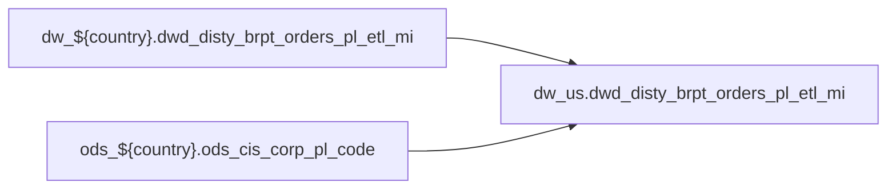

# FACT: Supplemental fact/context table used by select POS reports (`dw_us.dwd_disty_brpt_orders_pl_etl_mi`)

- artifact_type: etl_table
- artifact_id: dw_us.dwd_disty_brpt_orders_pl_etl_mi
- domain: pos
- one_line_purpose: POS-domain table with load SQL under bitbucket-etl (see L3); prior contract narrative preserved below when present.
- layer_type: DWD
- source_kind: etl_sql
- evidence_source: source/contracts/pos/bitbucket-etl/dwd_disty_brpt_orders_pl_etl_mi/dwd_disty_brpt_orders_pl_etl_mi.py
- bitbucket_etl_bundle: source/contracts/pos/bitbucket-etl/dwd_disty_brpt_orders_pl_etl_mi/
- related_etl_scripts:
- `source/contracts/pos/bitbucket-etl/dwd_disty_brpt_orders_pl_etl_mi/generate_te_dwd_disty_brpt_orders_pl_etl_mi.sql`

---

## L1 Data Foundation

### Identity and physical mapping
- **Table:** `dw_us.dwd_disty_brpt_orders_pl_etl_mi`
- **Layer type:** DWD
- **Canonical / derived:** Derived / ETL-loaded (see L3 from bitbucket-etl)
- **Owner team:** Not documented in repository

### Grain, scope, exclusions
- See preserved **Grain and keys** section below when present (POS contract narrative retained).
- Otherwise infer from SELECT / GROUP BY / INSERT column list in `source/contracts/pos/bitbucket-etl/dwd_disty_brpt_orders_pl_etl_mi/dwd_disty_brpt_orders_pl_etl_mi.py`.

### Cross-engine presence
| Engine | Present | Notes |
|--------|---------|-------|
| Hive | yes | ETL load target |
| Vertica | yes when POS contract documents Vertica sync | See preserved Business query tables |

### Physical schema reference

| Field | Value |
|-------|-------|
| **entity_id** | `dw_us.dwd_disty_brpt_orders_pl_etl_mi` |
| **l1_catalog_seed** | `target/storage/wkb/snapshots/_snapshot_id_template/l1_catalog/{engine}_{schema}_{table}.json` |
| **column_count** | pending (run ddl_seed_writer) |
| **partition_keys** | See preserved Grain / L4 / ETL PARTITION clause |
| **ddl_source** | pending |
| **retrieval** | `python -m tools.wkb.indexing.run_query --query "pos dwd_disty_brpt_orders_pl_etl_mi schema" --intent find_table_schema` |

### Lineage

- **Primary load:** `source/contracts/pos/bitbucket-etl/dwd_disty_brpt_orders_pl_etl_mi/dwd_disty_brpt_orders_pl_etl_mi.py`
- **upstream:** `dw_${country}.dwd_disty_brpt_orders_pl_etl_mi` — FROM/JOIN — `source/contracts/pos/bitbucket-etl/dwd_disty_brpt_orders_pl_etl_mi/dwd_disty_brpt_orders_pl_etl_mi.py`
- **upstream:** `ods_${country}.ods_cis_corp_pl_code` — FROM/JOIN — `source/contracts/pos/bitbucket-etl/dwd_disty_brpt_orders_pl_etl_mi/dwd_disty_brpt_orders_pl_etl_mi.py`
- **downstream:** see L6 Downstream consumers
### Freshness and load path
- Parameters / date window: see ETL `${literal_*}` / `${date_flag}` / `${start_date}` in evidence script.
- Schedule: Not documented in repository

## L2 Declarative Knowledge

### Business purpose
See preserved **Business purpose** below when present (POS contract catalog + linked ETL).

### Audience and use cases
See preserved **Who it helps** section when present.

### Fact key resolution
See preserved **Grain and keys** when present.

### Time field semantics
- Prefer partition / `date_flag` filters documented in preserved sections and L3 Key filters from ETL.

### Metrics served
See preserved Metrics / column groups when present; otherwise L3 column derivations.

### Metric serving map
N/A unless multi-period wide table (see preserved content).

### etl_metrics
No new metric-index formulas appended in this bitbucket-etl upgrade pass.

## L3 Procedural Knowledge

### Query and routing rules
- Reporting: Vertica `dw_us.dwd_disty_brpt_orders_pl_etl_mi` when synced (see preserved Business query tables).
- Load logic: bitbucket-etl evidence `source/contracts/pos/bitbucket-etl/dwd_disty_brpt_orders_pl_etl_mi/dwd_disty_brpt_orders_pl_etl_mi.py`.

### Dimension join patterns
See Relationship map (ETL JOIN edges) and preserved contract join notes.

### Key filters and ETL business logic

| Predicate | Kind | Evidence |
|-----------|------|----------|
| `dt_month = '${dt_month}') as a left join (Select max(mcode) as mcode, max(icode2) as icode2 from ods_${country}.ods_cis_corp_pl_code where code_type = 'CFNR' and ccode = 'NGM' and '${date_flag}' be...` | Technical (load only) / Business | `source/contracts/pos/bitbucket-etl/dwd_disty_brpt_orders_pl_etl_mi/dwd_disty_brpt_orders_pl_etl_mi.py` |

### Standard time-filter SQL
```sql
-- Prefer date_flag / literal_start_date / literal_end_date as used in source/contracts/pos/bitbucket-etl/dwd_disty_brpt_orders_pl_etl_mi/dwd_disty_brpt_orders_pl_etl_mi.py
```

### End-to-end flow


### Base tables register
| Object | Role |
|--------|------|
| `dw_${country}.dwd_disty_brpt_orders_pl_etl_mi` | source / temp (FROM/JOIN) |
| `ods_${country}.ods_cis_corp_pl_code` | source / temp (FROM/JOIN) |

### Step-by-step logic
1. Execute load SQL / python in `source/contracts/pos/bitbucket-etl/dwd_disty_brpt_orders_pl_etl_mi/`.
2. Apply date / business filters from ETL (Key filters).
3. Write target `dw_us.dwd_disty_brpt_orders_pl_etl_mi` (see INSERT/OVERWRITE in evidence).

### Relationship map (embedded)

| from_fqn | to_fqn | cardinality | join_keys | provenance |
|----------|--------|-------------|-----------|------------|
| — | — | — | — | No JOIN edges parsed from ETL (`source/contracts/pos/bitbucket-etl/dwd_disty_brpt_orders_pl_etl_mi/dwd_disty_brpt_orders_pl_etl_mi.py`); see Base tables register / step-by-step |

### Special logic (embedded)

Provenance: `source/ref/pos/special_logic.txt`

#### Applicable rule excerpt 1

```
# POS special logic reference

# Scope
# - Derived from existing Vertica POS rds_xxx_rtv.sp scripts.
# - POS scripts were identified by dw_*/dwd_disty_common_pos_di usage.
# - Vertica scripts were identified by rdsetl.rds_tmp output usage.
# - Scan result used for this file: 499 scripts; regions: BR=1, CA=124, MX=7, US=367.
# - Use xx as the region placeholder, matching table list.txt and table relationship.txt.

# 1. Order line type is not always a simple Comp exclusion
# Default POS reports normally exclude component lines:
#   order_line_type <> 'Comp'
#
# Historical exception patterns:
# - Some vendor/customer sales reports include order_line_type IN ('Comp', 'Single').
# - Some kit-level reports include order_line_type IN ('Comp', 'Kit', 'Single').
# - Component inclusion is usually intentional when the report needs kit components, bundle economics, or vendor/manufacturer line detail.
#
# Rule:
# - Default to excluding Comp unless the request mentions kit components, component detail, bundle detail, or the historical report pattern explicitly includes Comp.
# - Never include Kit, Single, and Comp together unless the report grain and business request require all sold and com...
```

### Column / field derivations (from ETL SQL)

| target_column | expression_sql | upstream_columns | upstream_tables | transform_kind | evidence |
|---------------|----------------|------------------|-----------------|----------------|----------|
| `date_flag` | `date_flag` | `date_flag` | `dw_${country}.dwd_disty_brpt_orders_pl_etl_mi`, `ods_${country}.ods_cis_corp_pl_code` | passthrough | `source/contracts/pos/bitbucket-etl/dwd_disty_brpt_orders_pl_etl_mi/dwd_disty_brpt_orders_pl_etl_mi.py:11` |
| `virtual_type` | `virtual_type` | `virtual_type` | `dw_${country}.dwd_disty_brpt_orders_pl_etl_mi`, `ods_${country}.ods_cis_corp_pl_code` | passthrough | `source/contracts/pos/bitbucket-etl/dwd_disty_brpt_orders_pl_etl_mi/dwd_disty_brpt_orders_pl_etl_mi.py:12` |
| `order_type` | `order_type` | `order_type` | `dw_${country}.dwd_disty_brpt_orders_pl_etl_mi`, `ods_${country}.ods_cis_corp_pl_code` | passthrough | `source/contracts/pos/bitbucket-etl/dwd_disty_brpt_orders_pl_etl_mi/dwd_disty_brpt_orders_pl_etl_mi.py:13` |
| `order_no` | `order_no` | `order_no` | `dw_${country}.dwd_disty_brpt_orders_pl_etl_mi`, `ods_${country}.ods_cis_corp_pl_code` | passthrough | `source/contracts/pos/bitbucket-etl/dwd_disty_brpt_orders_pl_etl_mi/dwd_disty_brpt_orders_pl_etl_mi.py:14` |
| `order_line_no` | `order_line_no` | `order_line_no` | `dw_${country}.dwd_disty_brpt_orders_pl_etl_mi`, `ods_${country}.ods_cis_corp_pl_code` | passthrough | `source/contracts/pos/bitbucket-etl/dwd_disty_brpt_orders_pl_etl_mi/dwd_disty_brpt_orders_pl_etl_mi.py:15` |
| `cust_no` | `cust_no` | `cust_no` | `dw_${country}.dwd_disty_brpt_orders_pl_etl_mi`, `ods_${country}.ods_cis_corp_pl_code` | passthrough | `source/contracts/pos/bitbucket-etl/dwd_disty_brpt_orders_pl_etl_mi/dwd_disty_brpt_orders_pl_etl_mi.py:16` |
| `mcust_no` | `mcust_no` | `mcust_no` | `dw_${country}.dwd_disty_brpt_orders_pl_etl_mi`, `ods_${country}.ods_cis_corp_pl_code` | passthrough | `source/contracts/pos/bitbucket-etl/dwd_disty_brpt_orders_pl_etl_mi/dwd_disty_brpt_orders_pl_etl_mi.py:17` |
| `cust_terr` | `cust_terr` | `cust_terr` | `dw_${country}.dwd_disty_brpt_orders_pl_etl_mi`, `ods_${country}.ods_cis_corp_pl_code` | passthrough | `source/contracts/pos/bitbucket-etl/dwd_disty_brpt_orders_pl_etl_mi/dwd_disty_brpt_orders_pl_etl_mi.py:18` |
| `cust_type` | `cust_type` | `cust_type` | `dw_${country}.dwd_disty_brpt_orders_pl_etl_mi`, `ods_${country}.ods_cis_corp_pl_code` | passthrough | `source/contracts/pos/bitbucket-etl/dwd_disty_brpt_orders_pl_etl_mi/dwd_disty_brpt_orders_pl_etl_mi.py:19` |
| `sales_rep` | `sales_rep` | `sales_rep` | `dw_${country}.dwd_disty_brpt_orders_pl_etl_mi`, `ods_${country}.ods_cis_corp_pl_code` | passthrough | `source/contracts/pos/bitbucket-etl/dwd_disty_brpt_orders_pl_etl_mi/dwd_disty_brpt_orders_pl_etl_mi.py:20` |
| `from_loc_no` | `from_loc_no` | `from_loc_no` | `dw_${country}.dwd_disty_brpt_orders_pl_etl_mi`, `ods_${country}.ods_cis_corp_pl_code` | passthrough | `source/contracts/pos/bitbucket-etl/dwd_disty_brpt_orders_pl_etl_mi/dwd_disty_brpt_orders_pl_etl_mi.py:21` |
| `terms` | `terms` | `terms` | `dw_${country}.dwd_disty_brpt_orders_pl_etl_mi`, `ods_${country}.ods_cis_corp_pl_code` | passthrough | `source/contracts/pos/bitbucket-etl/dwd_disty_brpt_orders_pl_etl_mi/dwd_disty_brpt_orders_pl_etl_mi.py:22` |
| `gv_user_type` | `gv_user_type` | `gv_user_type` | `dw_${country}.dwd_disty_brpt_orders_pl_etl_mi`, `ods_${country}.ods_cis_corp_pl_code` | passthrough | `source/contracts/pos/bitbucket-etl/dwd_disty_brpt_orders_pl_etl_mi/dwd_disty_brpt_orders_pl_etl_mi.py:23` |
| `sku_no` | `sku_no` | `sku_no` | `dw_${country}.dwd_disty_brpt_orders_pl_etl_mi`, `ods_${country}.ods_cis_corp_pl_code` | passthrough | `source/contracts/pos/bitbucket-etl/dwd_disty_brpt_orders_pl_etl_mi/dwd_disty_brpt_orders_pl_etl_mi.py:24` |
| `prod_code` | `prod_code` | `prod_code` | `dw_${country}.dwd_disty_brpt_orders_pl_etl_mi`, `ods_${country}.ods_cis_corp_pl_code` | passthrough | `source/contracts/pos/bitbucket-etl/dwd_disty_brpt_orders_pl_etl_mi/dwd_disty_brpt_orders_pl_etl_mi.py:25` |
| `vpl_no` | `vpl_no` | `vpl_no` | `dw_${country}.dwd_disty_brpt_orders_pl_etl_mi`, `ods_${country}.ods_cis_corp_pl_code` | passthrough | `source/contracts/pos/bitbucket-etl/dwd_disty_brpt_orders_pl_etl_mi/dwd_disty_brpt_orders_pl_etl_mi.py:26` |
| `vend_no` | `vend_no` | `vend_no` | `dw_${country}.dwd_disty_brpt_orders_pl_etl_mi`, `ods_${country}.ods_cis_corp_pl_code` | passthrough | `source/contracts/pos/bitbucket-etl/dwd_disty_brpt_orders_pl_etl_mi/dwd_disty_brpt_orders_pl_etl_mi.py:27` |
| `inv_type` | `inv_type` | `inv_type` | `dw_${country}.dwd_disty_brpt_orders_pl_etl_mi`, `ods_${country}.ods_cis_corp_pl_code` | passthrough | `source/contracts/pos/bitbucket-etl/dwd_disty_brpt_orders_pl_etl_mi/dwd_disty_brpt_orders_pl_etl_mi.py:28` |
| `base_cost` | `base_cost` | `base_cost` | `dw_${country}.dwd_disty_brpt_orders_pl_etl_mi`, `ods_${country}.ods_cis_corp_pl_code` | passthrough | `source/contracts/pos/bitbucket-etl/dwd_disty_brpt_orders_pl_etl_mi/dwd_disty_brpt_orders_pl_etl_mi.py:29` |
| `sales_cost` | `sales_cost` | `sales_cost` | `dw_${country}.dwd_disty_brpt_orders_pl_etl_mi`, `ods_${country}.ods_cis_corp_pl_code` | passthrough | `source/contracts/pos/bitbucket-etl/dwd_disty_brpt_orders_pl_etl_mi/dwd_disty_brpt_orders_pl_etl_mi.py:30` |
| `ship_qty` | `ship_qty` | `ship_qty` | `dw_${country}.dwd_disty_brpt_orders_pl_etl_mi`, `ods_${country}.ods_cis_corp_pl_code` | passthrough | `source/contracts/pos/bitbucket-etl/dwd_disty_brpt_orders_pl_etl_mi/dwd_disty_brpt_orders_pl_etl_mi.py:31` |
| `u_price` | `u_price` | `u_price` | `dw_${country}.dwd_disty_brpt_orders_pl_etl_mi`, `ods_${country}.ods_cis_corp_pl_code` | passthrough | `source/contracts/pos/bitbucket-etl/dwd_disty_brpt_orders_pl_etl_mi/dwd_disty_brpt_orders_pl_etl_mi.py:32` |
| `u_cost` | `u_cost` | `u_cost` | `dw_${country}.dwd_disty_brpt_orders_pl_etl_mi`, `ods_${country}.ods_cis_corp_pl_code` | passthrough | `source/contracts/pos/bitbucket-etl/dwd_disty_brpt_orders_pl_etl_mi/dwd_disty_brpt_orders_pl_etl_mi.py:33` |
| `u_sum_expense` | `u_sum_expense` | `u_sum_expense` | `dw_${country}.dwd_disty_brpt_orders_pl_etl_mi`, `ods_${country}.ods_cis_corp_pl_code` | passthrough | `source/contracts/pos/bitbucket-etl/dwd_disty_brpt_orders_pl_etl_mi/dwd_disty_brpt_orders_pl_etl_mi.py:34` |
| `l_weight` | `l_weight` | `l_weight` | `dw_${country}.dwd_disty_brpt_orders_pl_etl_mi`, `ods_${country}.ods_cis_corp_pl_code` | passthrough | `source/contracts/pos/bitbucket-etl/dwd_disty_brpt_orders_pl_etl_mi/dwd_disty_brpt_orders_pl_etl_mi.py:35` |
| `sales_total` | `sales_total` | `sales_total` | `dw_${country}.dwd_disty_brpt_orders_pl_etl_mi`, `ods_${country}.ods_cis_corp_pl_code` | passthrough | `source/contracts/pos/bitbucket-etl/dwd_disty_brpt_orders_pl_etl_mi/dwd_disty_brpt_orders_pl_etl_mi.py:36` |
| `cust_program_id` | `cust_program_id` | `cust_program_id` | `dw_${country}.dwd_disty_brpt_orders_pl_etl_mi`, `ods_${country}.ods_cis_corp_pl_code` | passthrough | `source/contracts/pos/bitbucket-etl/dwd_disty_brpt_orders_pl_etl_mi/dwd_disty_brpt_orders_pl_etl_mi.py:37` |
| `ap_finance` | `ap_finance` | `ap_finance` | `dw_${country}.dwd_disty_brpt_orders_pl_etl_mi`, `ods_${country}.ods_cis_corp_pl_code` | passthrough | `source/contracts/pos/bitbucket-etl/dwd_disty_brpt_orders_pl_etl_mi/dwd_disty_brpt_orders_pl_etl_mi.py:38` |
| `inv_cost` | `inv_cost` | `inv_cost` | `dw_${country}.dwd_disty_brpt_orders_pl_etl_mi`, `ods_${country}.ods_cis_corp_pl_code` | passthrough | `source/contracts/pos/bitbucket-etl/dwd_disty_brpt_orders_pl_etl_mi/dwd_disty_brpt_orders_pl_etl_mi.py:39` |
| `inv_reserve` | `inv_reserve` | `inv_reserve` | `dw_${country}.dwd_disty_brpt_orders_pl_etl_mi`, `ods_${country}.ods_cis_corp_pl_code` | passthrough | `source/contracts/pos/bitbucket-etl/dwd_disty_brpt_orders_pl_etl_mi/dwd_disty_brpt_orders_pl_etl_mi.py:40` |
| `cr_risk_cterm` | `cr_risk_cterm` | `cr_risk_cterm` | `dw_${country}.dwd_disty_brpt_orders_pl_etl_mi`, `ods_${country}.ods_cis_corp_pl_code` | passthrough | `source/contracts/pos/bitbucket-etl/dwd_disty_brpt_orders_pl_etl_mi/dwd_disty_brpt_orders_pl_etl_mi.py:41` |
| `flr_synnex` | `flr_synnex` | `flr_synnex` | `dw_${country}.dwd_disty_brpt_orders_pl_etl_mi`, `ods_${country}.ods_cis_corp_pl_code` | passthrough | `source/contracts/pos/bitbucket-etl/dwd_disty_brpt_orders_pl_etl_mi/dwd_disty_brpt_orders_pl_etl_mi.py:42` |
| `direct_credit` | `direct_credit` | `direct_credit` | `dw_${country}.dwd_disty_brpt_orders_pl_etl_mi`, `ods_${country}.ods_cis_corp_pl_code` | passthrough | `source/contracts/pos/bitbucket-etl/dwd_disty_brpt_orders_pl_etl_mi/dwd_disty_brpt_orders_pl_etl_mi.py:43` |
| `csgn_edi_fee` | `csgn_edi_fee` | `csgn_edi_fee` | `dw_${country}.dwd_disty_brpt_orders_pl_etl_mi`, `ods_${country}.ods_cis_corp_pl_code` | passthrough | `source/contracts/pos/bitbucket-etl/dwd_disty_brpt_orders_pl_etl_mi/dwd_disty_brpt_orders_pl_etl_mi.py:44` |
| `corporate` | `corporate` | `corporate` | `dw_${country}.dwd_disty_brpt_orders_pl_etl_mi`, `ods_${country}.ods_cis_corp_pl_code` | passthrough | `source/contracts/pos/bitbucket-etl/dwd_disty_brpt_orders_pl_etl_mi/dwd_disty_brpt_orders_pl_etl_mi.py:45` |
| `sfs` | `sfs` | `sfs` | `dw_${country}.dwd_disty_brpt_orders_pl_etl_mi`, `ods_${country}.ods_cis_corp_pl_code` | passthrough | `source/contracts/pos/bitbucket-etl/dwd_disty_brpt_orders_pl_etl_mi/dwd_disty_brpt_orders_pl_etl_mi.py:46` |
| `scm_risk` | `scm_risk` | `scm_risk` | `dw_${country}.dwd_disty_brpt_orders_pl_etl_mi`, `ods_${country}.ods_cis_corp_pl_code` | passthrough | `source/contracts/pos/bitbucket-etl/dwd_disty_brpt_orders_pl_etl_mi/dwd_disty_brpt_orders_pl_etl_mi.py:47` |
| `flr_vendor` | `flr_vendor` | `flr_vendor` | `dw_${country}.dwd_disty_brpt_orders_pl_etl_mi`, `ods_${country}.ods_cis_corp_pl_code` | passthrough | `source/contracts/pos/bitbucket-etl/dwd_disty_brpt_orders_pl_etl_mi/dwd_disty_brpt_orders_pl_etl_mi.py:48` |
| `cust_finance_sales` | `cust_finance_sales` | `cust_finance_sales` | `dw_${country}.dwd_disty_brpt_orders_pl_etl_mi`, `ods_${country}.ods_cis_corp_pl_code` | passthrough | `source/contracts/pos/bitbucket-etl/dwd_disty_brpt_orders_pl_etl_mi/dwd_disty_brpt_orders_pl_etl_mi.py:49` |
| `cust_pmt_disc` | `cust_pmt_disc` | `cust_pmt_disc` | `dw_${country}.dwd_disty_brpt_orders_pl_etl_mi`, `ods_${country}.ods_cis_corp_pl_code` | passthrough | `source/contracts/pos/bitbucket-etl/dwd_disty_brpt_orders_pl_etl_mi/dwd_disty_brpt_orders_pl_etl_mi.py:50` |
| `cvr_rm` | `cvr_rm` | `cvr_rm` | `dw_${country}.dwd_disty_brpt_orders_pl_etl_mi`, `ods_${country}.ods_cis_corp_pl_code` | passthrough | `source/contracts/pos/bitbucket-etl/dwd_disty_brpt_orders_pl_etl_mi/dwd_disty_brpt_orders_pl_etl_mi.py:51` |
| `ar_fin_recovery` | `ar_fin_recovery` | `ar_fin_recovery` | `dw_${country}.dwd_disty_brpt_orders_pl_etl_mi`, `ods_${country}.ods_cis_corp_pl_code` | passthrough | `source/contracts/pos/bitbucket-etl/dwd_disty_brpt_orders_pl_etl_mi/dwd_disty_brpt_orders_pl_etl_mi.py:52` |
| `mfg_oh` | `mfg_oh` | `mfg_oh` | `dw_${country}.dwd_disty_brpt_orders_pl_etl_mi`, `ods_${country}.ods_cis_corp_pl_code` | passthrough | `source/contracts/pos/bitbucket-etl/dwd_disty_brpt_orders_pl_etl_mi/dwd_disty_brpt_orders_pl_etl_mi.py:53` |
| `cust_finance` | `cust_finance` | `cust_finance` | `dw_${country}.dwd_disty_brpt_orders_pl_etl_mi`, `ods_${country}.ods_cis_corp_pl_code` | passthrough | `source/contracts/pos/bitbucket-etl/dwd_disty_brpt_orders_pl_etl_mi/dwd_disty_brpt_orders_pl_etl_mi.py:49` |
| `rma` | `rma` | `rma` | `dw_${country}.dwd_disty_brpt_orders_pl_etl_mi`, `ods_${country}.ods_cis_corp_pl_code` | passthrough | `source/contracts/pos/bitbucket-etl/dwd_disty_brpt_orders_pl_etl_mi/dwd_disty_brpt_orders_pl_etl_mi.py:55` |
| `hc_sales` | `hc_sales` | `hc_sales` | `dw_${country}.dwd_disty_brpt_orders_pl_etl_mi`, `ods_${country}.ods_cis_corp_pl_code` | passthrough | `source/contracts/pos/bitbucket-etl/dwd_disty_brpt_orders_pl_etl_mi/dwd_disty_brpt_orders_pl_etl_mi.py:56` |
| `order_overhead` | `order_overhead` | `order_overhead` | `dw_${country}.dwd_disty_brpt_orders_pl_etl_mi`, `ods_${country}.ods_cis_corp_pl_code` | passthrough | `source/contracts/pos/bitbucket-etl/dwd_disty_brpt_orders_pl_etl_mi/dwd_disty_brpt_orders_pl_etl_mi.py:57` |
| `margin_share` | `margin_share` | `margin_share` | `dw_${country}.dwd_disty_brpt_orders_pl_etl_mi`, `ods_${country}.ods_cis_corp_pl_code` | passthrough | `source/contracts/pos/bitbucket-etl/dwd_disty_brpt_orders_pl_etl_mi/dwd_disty_brpt_orders_pl_etl_mi.py:58` |
| `ap_adj` | `ap_adj` | `ap_adj` | `dw_${country}.dwd_disty_brpt_orders_pl_etl_mi`, `ods_${country}.ods_cis_corp_pl_code` | passthrough | `source/contracts/pos/bitbucket-etl/dwd_disty_brpt_orders_pl_etl_mi/dwd_disty_brpt_orders_pl_etl_mi.py:59` |
| `pdt` | `pdt` | `pdt` | `dw_${country}.dwd_disty_brpt_orders_pl_etl_mi`, `ods_${country}.ods_cis_corp_pl_code` | passthrough | `source/contracts/pos/bitbucket-etl/dwd_disty_brpt_orders_pl_etl_mi/dwd_disty_brpt_orders_pl_etl_mi.py:60` |
| `scm_cost` | `scm_cost` | `scm_cost` | `dw_${country}.dwd_disty_brpt_orders_pl_etl_mi`, `ods_${country}.ods_cis_corp_pl_code` | passthrough | `source/contracts/pos/bitbucket-etl/dwd_disty_brpt_orders_pl_etl_mi/dwd_disty_brpt_orders_pl_etl_mi.py:61` |
| `infrastructure` | `infrastructure` | `infrastructure` | `dw_${country}.dwd_disty_brpt_orders_pl_etl_mi`, `ods_${country}.ods_cis_corp_pl_code` | passthrough | `source/contracts/pos/bitbucket-etl/dwd_disty_brpt_orders_pl_etl_mi/dwd_disty_brpt_orders_pl_etl_mi.py:62` |
| `marketing` | `marketing` | `marketing` | `dw_${country}.dwd_disty_brpt_orders_pl_etl_mi`, `ods_${country}.ods_cis_corp_pl_code` | passthrough | `source/contracts/pos/bitbucket-etl/dwd_disty_brpt_orders_pl_etl_mi/dwd_disty_brpt_orders_pl_etl_mi.py:63` |
| `coop` | `coop` | `coop` | `dw_${country}.dwd_disty_brpt_orders_pl_etl_mi`, `ods_${country}.ods_cis_corp_pl_code` | passthrough | `source/contracts/pos/bitbucket-etl/dwd_disty_brpt_orders_pl_etl_mi/dwd_disty_brpt_orders_pl_etl_mi.py:64` |
| `one_time_btl` | `one_time_btl` | `one_time_btl` | `dw_${country}.dwd_disty_brpt_orders_pl_etl_mi`, `ods_${country}.ods_cis_corp_pl_code` | passthrough | `source/contracts/pos/bitbucket-etl/dwd_disty_brpt_orders_pl_etl_mi/dwd_disty_brpt_orders_pl_etl_mi.py:65` |
| `hbtl` | `hbtl` | `hbtl` | `dw_${country}.dwd_disty_brpt_orders_pl_etl_mi`, `ods_${country}.ods_cis_corp_pl_code` | passthrough | `source/contracts/pos/bitbucket-etl/dwd_disty_brpt_orders_pl_etl_mi/dwd_disty_brpt_orders_pl_etl_mi.py:66` |
| `scm_profit_adj` | `scm_profit_adj` | `scm_profit_adj` | `dw_${country}.dwd_disty_brpt_orders_pl_etl_mi`, `ods_${country}.ods_cis_corp_pl_code` | passthrough | `source/contracts/pos/bitbucket-etl/dwd_disty_brpt_orders_pl_etl_mi/dwd_disty_brpt_orders_pl_etl_mi.py:67` |
| `hc_pm` | `hc_pm` | `hc_pm` | `dw_${country}.dwd_disty_brpt_orders_pl_etl_mi`, `ods_${country}.ods_cis_corp_pl_code` | passthrough | `source/contracts/pos/bitbucket-etl/dwd_disty_brpt_orders_pl_etl_mi/dwd_disty_brpt_orders_pl_etl_mi.py:68` |
| `hc_bd` | `hc_bd` | `hc_bd` | `dw_${country}.dwd_disty_brpt_orders_pl_etl_mi`, `ods_${country}.ods_cis_corp_pl_code` | passthrough | `source/contracts/pos/bitbucket-etl/dwd_disty_brpt_orders_pl_etl_mi/dwd_disty_brpt_orders_pl_etl_mi.py:69` |
| `btl` | `btl` | `btl` | `dw_${country}.dwd_disty_brpt_orders_pl_etl_mi`, `ods_${country}.ods_cis_corp_pl_code` | passthrough | `source/contracts/pos/bitbucket-etl/dwd_disty_brpt_orders_pl_etl_mi/dwd_disty_brpt_orders_pl_etl_mi.py:65` |
| `btl_sales` | `btl_sales` | `btl_sales` | `dw_${country}.dwd_disty_brpt_orders_pl_etl_mi`, `ods_${country}.ods_cis_corp_pl_code` | passthrough | `source/contracts/pos/bitbucket-etl/dwd_disty_brpt_orders_pl_etl_mi/dwd_disty_brpt_orders_pl_etl_mi.py:71` |
| `btl_backout` | `btl_backout` | `btl_backout` | `dw_${country}.dwd_disty_brpt_orders_pl_etl_mi`, `ods_${country}.ods_cis_corp_pl_code` | passthrough | `source/contracts/pos/bitbucket-etl/dwd_disty_brpt_orders_pl_etl_mi/dwd_disty_brpt_orders_pl_etl_mi.py:72` |
| `cust_rebate` | `cust_rebate` | `cust_rebate` | `dw_${country}.dwd_disty_brpt_orders_pl_etl_mi`, `ods_${country}.ods_cis_corp_pl_code` | passthrough | `source/contracts/pos/bitbucket-etl/dwd_disty_brpt_orders_pl_etl_mi/dwd_disty_brpt_orders_pl_etl_mi.py:73` |
| `mof` | `mof` | `mof` | `dw_${country}.dwd_disty_brpt_orders_pl_etl_mi`, `ods_${country}.ods_cis_corp_pl_code` | passthrough | `source/contracts/pos/bitbucket-etl/dwd_disty_brpt_orders_pl_etl_mi/dwd_disty_brpt_orders_pl_etl_mi.py:74` |
| `frt_out_load` | `frt_out_load` | `frt_out_load` | `dw_${country}.dwd_disty_brpt_orders_pl_etl_mi`, `ods_${country}.ods_cis_corp_pl_code` | passthrough | `source/contracts/pos/bitbucket-etl/dwd_disty_brpt_orders_pl_etl_mi/dwd_disty_brpt_orders_pl_etl_mi.py:75` |
| `frt_out_exp` | `frt_out_exp` | `frt_out_exp` | `dw_${country}.dwd_disty_brpt_orders_pl_etl_mi`, `ods_${country}.ods_cis_corp_pl_code` | passthrough | `source/contracts/pos/bitbucket-etl/dwd_disty_brpt_orders_pl_etl_mi/dwd_disty_brpt_orders_pl_etl_mi.py:76` |
| `whoh_pack` | `whoh_pack` | `whoh_pack` | `dw_${country}.dwd_disty_brpt_orders_pl_etl_mi`, `ods_${country}.ods_cis_corp_pl_code` | passthrough | `source/contracts/pos/bitbucket-etl/dwd_disty_brpt_orders_pl_etl_mi/dwd_disty_brpt_orders_pl_etl_mi.py:77` |
| `frt_ob_recovery` | `frt_ob_recovery` | `frt_ob_recovery` | `dw_${country}.dwd_disty_brpt_orders_pl_etl_mi`, `ods_${country}.ods_cis_corp_pl_code` | passthrough | `source/contracts/pos/bitbucket-etl/dwd_disty_brpt_orders_pl_etl_mi/dwd_disty_brpt_orders_pl_etl_mi.py:78` |
| `frt_ib_recovery` | `frt_ib_recovery` | `frt_ib_recovery` | `dw_${country}.dwd_disty_brpt_orders_pl_etl_mi`, `ods_${country}.ods_cis_corp_pl_code` | passthrough | `source/contracts/pos/bitbucket-etl/dwd_disty_brpt_orders_pl_etl_mi/dwd_disty_brpt_orders_pl_etl_mi.py:79` |
| `others` | `others` | `others` | `dw_${country}.dwd_disty_brpt_orders_pl_etl_mi`, `ods_${country}.ods_cis_corp_pl_code` | passthrough | `source/contracts/pos/bitbucket-etl/dwd_disty_brpt_orders_pl_etl_mi/dwd_disty_brpt_orders_pl_etl_mi.py:80` |
| `others_sales` | `others_sales` | `others_sales` | `dw_${country}.dwd_disty_brpt_orders_pl_etl_mi`, `ods_${country}.ods_cis_corp_pl_code` | passthrough | `source/contracts/pos/bitbucket-etl/dwd_disty_brpt_orders_pl_etl_mi/dwd_disty_brpt_orders_pl_etl_mi.py:81` |
| `scm_disc` | `scm_disc` | `scm_disc` | `dw_${country}.dwd_disty_brpt_orders_pl_etl_mi`, `ods_${country}.ods_cis_corp_pl_code` | passthrough | `source/contracts/pos/bitbucket-etl/dwd_disty_brpt_orders_pl_etl_mi/dwd_disty_brpt_orders_pl_etl_mi.py:82` |
| `scm_ndisc` | `scm_ndisc` | `scm_ndisc` | `dw_${country}.dwd_disty_brpt_orders_pl_etl_mi`, `ods_${country}.ods_cis_corp_pl_code` | passthrough | `source/contracts/pos/bitbucket-etl/dwd_disty_brpt_orders_pl_etl_mi/dwd_disty_brpt_orders_pl_etl_mi.py:83` |
| `frt_in` | `frt_in` | `frt_in` | `dw_${country}.dwd_disty_brpt_orders_pl_etl_mi`, `ods_${country}.ods_cis_corp_pl_code` | passthrough | `source/contracts/pos/bitbucket-etl/dwd_disty_brpt_orders_pl_etl_mi/dwd_disty_brpt_orders_pl_etl_mi.py:84` |
| `trans_btl` | `trans_btl` | `trans_btl` | `dw_${country}.dwd_disty_brpt_orders_pl_etl_mi`, `ods_${country}.ods_cis_corp_pl_code` | passthrough | `source/contracts/pos/bitbucket-etl/dwd_disty_brpt_orders_pl_etl_mi/dwd_disty_brpt_orders_pl_etl_mi.py:85` |
| `trans_btl_sales` | `trans_btl_sales` | `trans_btl_sales` | `dw_${country}.dwd_disty_brpt_orders_pl_etl_mi`, `ods_${country}.ods_cis_corp_pl_code` | passthrough | `source/contracts/pos/bitbucket-etl/dwd_disty_brpt_orders_pl_etl_mi/dwd_disty_brpt_orders_pl_etl_mi.py:86` |
| `ngm_amt` | `ngm_amt` | `ngm_amt` | `dw_${country}.dwd_disty_brpt_orders_pl_etl_mi`, `ods_${country}.ods_cis_corp_pl_code` | passthrough | `source/contracts/pos/bitbucket-etl/dwd_disty_brpt_orders_pl_etl_mi/dwd_disty_brpt_orders_pl_etl_mi.py:87` |
| `oplgm_amt` | `oplgm_amt` | `oplgm_amt` | `dw_${country}.dwd_disty_brpt_orders_pl_etl_mi`, `ods_${country}.ods_cis_corp_pl_code` | passthrough | `source/contracts/pos/bitbucket-etl/dwd_disty_brpt_orders_pl_etl_mi/dwd_disty_brpt_orders_pl_etl_mi.py:88` |
| `ap_finance_calcproc` | `ap_finance_calcproc` | `ap_finance_calcproc` | `dw_${country}.dwd_disty_brpt_orders_pl_etl_mi`, `ods_${country}.ods_cis_corp_pl_code` | passthrough | `source/contracts/pos/bitbucket-etl/dwd_disty_brpt_orders_pl_etl_mi/dwd_disty_brpt_orders_pl_etl_mi.py:89` |
| `inv_cost_calcproc` | `inv_cost_calcproc` | `inv_cost_calcproc` | `dw_${country}.dwd_disty_brpt_orders_pl_etl_mi`, `ods_${country}.ods_cis_corp_pl_code` | passthrough | `source/contracts/pos/bitbucket-etl/dwd_disty_brpt_orders_pl_etl_mi/dwd_disty_brpt_orders_pl_etl_mi.py:90` |

_Additional 91 columns parsed; see `python -m tools.ingest.sql_column_derivation` for full list._


### Sentinel and code values
See preserved content and ETL CASE expressions in column derivations.

## L4 Validation

### Resolved partition value
- Partition / date parameters from ETL literals — concrete calendar values Not documented in repository (resolve via Azkaban when flow evidence exists).

### Data quality checks
See preserved Validation SQL when present.

### Validation SQL
Prefer preserved Vertica validation bundle when present; MCP business SQL not re-run during documentation.

### Caveats for interpretation
- Document upgraded additively from POS **contract** MD + **bitbucket-etl** SQL. Prior contract text is under **Preserved pre-L1-L6 content** when present.

### Conflicts and open questions
- Companion loader scripts may also appear under other domain KB folders; see `target/knowledgebase/pos/readme.md` cross-links.

## L5 Runtime View

### Query path and engine preference
| Path | Engine | Evidence |
|------|--------|----------|
| Load | Hive/Spark | `source/contracts/pos/bitbucket-etl/dwd_disty_brpt_orders_pl_etl_mi/dwd_disty_brpt_orders_pl_etl_mi.py` |
| Report | Vertica | preserved POS contract when present |

### Access constraints
Not documented in repository

### Query risk profile
- Always filter `date_flag` / documented partition keys before wide scans.

## L6 Access and Consumption

### Primary consumers and use cases
See preserved audience / POS report consumers when present.

### Representative query patterns
See preserved Validation SQL / contract examples when present.

### Dependencies and notes

#### Upstream objects (verified)
| Object | Usage | Evidence |
|--------|-------|----------|
| `dw_${country}.dwd_disty_brpt_orders_pl_etl_mi` | FROM/JOIN | `source/contracts/pos/bitbucket-etl/dwd_disty_brpt_orders_pl_etl_mi/dwd_disty_brpt_orders_pl_etl_mi.py` |
| `ods_${country}.ods_cis_corp_pl_code` | FROM/JOIN | `source/contracts/pos/bitbucket-etl/dwd_disty_brpt_orders_pl_etl_mi/dwd_disty_brpt_orders_pl_etl_mi.py` |

#### Downstream consumers (verified)

| Object / script | Evidence |
|-----------------|----------|
| POS / RDS reports (contract) | preserved sections when present |
| Related loaders | see related_etl_scripts header |
| KB / contract ref: `source/contracts/b-report-us/README.md` | `source/contracts/b-report-us/README.md:27` |
| ETL/script ref: `source/contracts/b-report-us/bitbicket_etl/dwd_disty_brpt_orders_pl_etl_mi/z_reload_data/dwd_disty_brpt_orders_pl_etl_mi.py` | `source/contracts/b-report-us/bitbicket_etl/dwd_disty_brpt_orders_pl_etl_mi/z_reload_data/dwd_disty_brpt_orders_pl_etl_mi.py:9` |
| KB / contract ref: `source/contracts/b-report-us/bitbicket_etl/readme.md` | `source/contracts/b-report-us/bitbicket_etl/readme.md:4` |
| KB / contract ref: `source/contracts/b-report-us/domain-knowledge.md` | `source/contracts/b-report-us/domain-knowledge.md:22` |
| KB / contract ref: `source/contracts/b-report-us/eval/golden_cases.md` | `source/contracts/b-report-us/eval/golden_cases.md:22` |
| KB / contract ref: `source/contracts/b-report-us/golden-questions.md` | `source/contracts/b-report-us/golden-questions.md:52` |
| KB / contract ref: `source/contracts/b-report-us/metric-index.md` | `source/contracts/b-report-us/metric-index.md:24` |
| KB / contract ref: `source/contracts/b-report-us/order-type-pnl-adjustments.md` | `source/contracts/b-report-us/order-type-pnl-adjustments.md:8` |
| KB / contract ref: `source/contracts/b-report-us/tables/dim_disty_bd_project_user.md` | `source/contracts/b-report-us/tables/dim_disty_bd_project_user.md:129` |
| KB / contract ref: `source/contracts/b-report-us/tables/dim_pub_customer_info.md` | `source/contracts/b-report-us/tables/dim_pub_customer_info.md:167` |
| KB / contract ref: `source/contracts/b-report-us/tables/dim_pub_order_type.md` | `source/contracts/b-report-us/tables/dim_pub_order_type.md:73` |
| KB / contract ref: `source/contracts/b-report-us/tables/dim_pub_part_info.md` | `source/contracts/b-report-us/tables/dim_pub_part_info.md:347` |
| KB / contract ref: `source/contracts/b-report-us/tables/dim_pub_sales_cust_type.md` | `source/contracts/b-report-us/tables/dim_pub_sales_cust_type.md:124` |
| KB / contract ref: `source/contracts/b-report-us/tables/dim_pub_sales_division.md` | `source/contracts/b-report-us/tables/dim_pub_sales_division.md:117` |
| KB / contract ref: `source/contracts/b-report-us/tables/dim_pub_sales_hierarchy_primary_role_by_terr_view.md` | `source/contracts/b-report-us/tables/dim_pub_sales_hierarchy_primary_role_by_terr_view.md:154` |
| KB / contract ref: `source/contracts/b-report-us/tables/dim_pub_sales_territory.md` | `source/contracts/b-report-us/tables/dim_pub_sales_territory.md:223` |
| KB / contract ref: `source/contracts/b-report-us/tables/dim_pub_vendor_info.md` | `source/contracts/b-report-us/tables/dim_pub_vendor_info.md:109` |
| KB / contract ref: `source/contracts/b-report-us/tables/dim_pub_vendor_segment.md` | `source/contracts/b-report-us/tables/dim_pub_vendor_segment.md:131` |
| KB / contract ref: `source/contracts/b-report-us/tables/dim_pub_vpl_hierarchy_info.md` | `source/contracts/b-report-us/tables/dim_pub_vpl_hierarchy_info.md:296` |
| KB / contract ref: `source/contracts/b-report-us/tables/dim_pub_vpl_info.md` | `source/contracts/b-report-us/tables/dim_pub_vpl_info.md:212` |
| KB / contract ref: `source/contracts/b-report-us/tables/dm_disty_brpt_bd_rep_1d.md` | `source/contracts/b-report-us/tables/dm_disty_brpt_bd_rep_1d.md:232` |
| KB / contract ref: `source/contracts/b-report-us/tables/dm_disty_brpt_bd_rep_comb_mtd.md` | `source/contracts/b-report-us/tables/dm_disty_brpt_bd_rep_comb_mtd.md:370` |
| KB / contract ref: `source/contracts/b-report-us/tables/dm_disty_brpt_bd_rep_mtd.md` | `source/contracts/b-report-us/tables/dm_disty_brpt_bd_rep_mtd.md:253` |
| KB / contract ref: `source/contracts/b-report-us/tables/dm_disty_brpt_bd_rep_wtd.md` | `source/contracts/b-report-us/tables/dm_disty_brpt_bd_rep_wtd.md:234` |
| KB / contract ref: `source/contracts/b-report-us/tables/dm_disty_brpt_buyer_1d.md` | `source/contracts/b-report-us/tables/dm_disty_brpt_buyer_1d.md:243` |
| KB / contract ref: `source/contracts/b-report-us/tables/dm_disty_brpt_buyer_comb_mtd.md` | `source/contracts/b-report-us/tables/dm_disty_brpt_buyer_comb_mtd.md:372` |
| KB / contract ref: `source/contracts/b-report-us/tables/dm_disty_brpt_buyer_mtd.md` | `source/contracts/b-report-us/tables/dm_disty_brpt_buyer_mtd.md:257` |
| KB / contract ref: `source/contracts/b-report-us/tables/dm_disty_brpt_buyer_wtd.md` | `source/contracts/b-report-us/tables/dm_disty_brpt_buyer_wtd.md:245` |
| KB / contract ref: `source/contracts/b-report-us/tables/dm_disty_brpt_pm_1d.md` | `source/contracts/b-report-us/tables/dm_disty_brpt_pm_1d.md:244` |
| KB / contract ref: `source/contracts/b-report-us/tables/dm_disty_brpt_pm_comb_mtd.md` | `source/contracts/b-report-us/tables/dm_disty_brpt_pm_comb_mtd.md:382` |
| KB / contract ref: `source/contracts/b-report-us/tables/dm_disty_brpt_pm_mtd.md` | `source/contracts/b-report-us/tables/dm_disty_brpt_pm_mtd.md:133` |
| KB / contract ref: `source/contracts/b-report-us/tables/dm_disty_brpt_pm_wtd.md` | `source/contracts/b-report-us/tables/dm_disty_brpt_pm_wtd.md:246` |
| KB / contract ref: `source/contracts/b-report-us/tables/dm_disty_brpt_sales_1d.md` | `source/contracts/b-report-us/tables/dm_disty_brpt_sales_1d.md:236` |
| KB / contract ref: `source/contracts/b-report-us/tables/dm_disty_brpt_sales_comb_mtd.md` | `source/contracts/b-report-us/tables/dm_disty_brpt_sales_comb_mtd.md:380` |
| KB / contract ref: `source/contracts/b-report-us/tables/dm_disty_brpt_sales_mtd.md` | `source/contracts/b-report-us/tables/dm_disty_brpt_sales_mtd.md:265` |
| KB / contract ref: `source/contracts/b-report-us/tables/dm_disty_brpt_sales_wtd.md` | `source/contracts/b-report-us/tables/dm_disty_brpt_sales_wtd.md:238` |
| KB / contract ref: `source/contracts/b-report-us/tables/dwd_disty_brpt_orders_pl_di.md` | `source/contracts/b-report-us/tables/dwd_disty_brpt_orders_pl_di.md:189` |
| KB / contract ref: `source/contracts/b-report-us/tables/dwd_disty_brpt_orders_pl_etl_mi.md` | `source/contracts/b-report-us/tables/dwd_disty_brpt_orders_pl_etl_mi.md:1` |
| KB / contract ref: `source/contracts/b-report-us/tables/dws_disty_brpt_bd_1d.md` | `source/contracts/b-report-us/tables/dws_disty_brpt_bd_1d.md:263` |
| KB / contract ref: `source/contracts/b-report-us/tables/dws_disty_brpt_bd_cust_1d.md` | `source/contracts/b-report-us/tables/dws_disty_brpt_bd_cust_1d.md:242` |

#### Operational detail (verified)
- Bundle: `source/contracts/pos/bitbucket-etl/dwd_disty_brpt_orders_pl_etl_mi/`
- Manifest: `source/contracts/pos/bitbucket-etl/MANIFEST.md`

#### Not documented in repository
- Schedule, owner, SLA

---

## Preserved pre-L1-L6 content

> Retained verbatim from the prior POS contract knowledgebase document (nothing removed). ETL load evidence above supplements this catalog narrative.


**Domain:** pos  
**Source contract:** `C:\Users\T154858D.TDSNX\Desktop\git_repo_v1\data_analysis_agent_brpt\knowledge\POS\tables\dwd_disty_brpt_orders_pl_etl_mi.md`  
**Knowledgebase path:** `target/knowledgebase/pos/dwd_disty_brpt_orders_pl_etl_mi.md`

## Business purpose

Supplemental fact/context table used by select POS reports

This document is derived from the POS table contract catalog. ETL script lineage for load jobs is **not documented in this repository** unless listed under verified dependencies below.

---

## What the process does (high level)

| Stage | Business meaning |
|-------|------------------|
| **Catalog object** | `dw_us.dwd_disty_brpt_orders_pl_etl_mi` — FACT layer table used in US POS reporting (`US POS baseline`). |
| **Consumption** | Queried from Vertica for POS/RDS reports, exports, and enrichment joins. |

**Parameters:** Country schema pattern `dw_us` (US baseline documented as `dw_us` / `dim_us`).

---

## Who it helps and how

| Audience | How they benefit |
|----------|-----------------|
| **POS / RDS reporting** | Vertica RDS POS custom reports (499 scripts scanned: US 367, CA 124, MX 7, BR 1) |
| **Sales analytics** | Order, customer, product, and margin attributes at documented grain. |
| **Data engineering** | Stable table contract for joins to POS hub and downstream exports. |

---

## Business query tables (Vertica)

| Role | Hive object | Vertica object | Sync mode | Evidence | MCP verified |
|------|-------------|----------------|-----------|----------|--------------|
| **Query for reporting** | `dw_us.dwd_disty_brpt_orders_pl_etl_mi` | `dw_us.dwd_disty_brpt_orders_pl_etl_mi` | overwrite / incremental | POS contract `dwd_disty_brpt_orders_pl_etl_mi.md:L1` | yes (POS contract v2 — Vertica verified in source catalog) |
| **Hive alternative** | `dw_us.dwd_disty_brpt_orders_pl_etl_mi` | same as reporting table | - | POS contract cross-engine note | - |
| **ETL internal** | n/a | n/a | - | ETL not in wiki repo | - |

Business users should query **`dw_us.dwd_disty_brpt_orders_pl_etl_mi`** in Vertica for POS-domain reporting aligned to this contract.

---

## Grain and keys

- **Grain:** See natural key columns from POS contract column catalog.
- **Partition:** `date_flag` — daily business date filter for POS reporting (per POS contract).
- **Natural key:** `order_type`, `order_no`, `order_line_no`, `cust_no`, `mcust_no`, `from_loc_no`
- **Exclusions (reporting):** None documented in POS contract.

---

## Validation SQL (Vertica)

```sql
-- 1) Row count by partition
SELECT date_flag, COUNT(*) AS row_cnt
FROM dw_us.dwd_disty_brpt_orders_pl_etl_mi
WHERE date_flag = '${partition_value}'
GROUP BY date_flag;

-- 2) Metric sum by business dimension (top N)
SELECT order_type, COUNT(*) AS row_cnt
FROM dw_us.dwd_disty_brpt_orders_pl_etl_mi
WHERE date_flag = '${partition_value}'
GROUP BY order_type
ORDER BY COUNT(*) DESC
LIMIT 20;

-- 3) Grain duplicate check
SELECT order_type, order_no, order_line_no, date_flag, COUNT(*) AS cnt
FROM dw_us.dwd_disty_brpt_orders_pl_etl_mi
WHERE date_flag = '${partition_value}'
GROUP BY order_type, order_no, order_line_no, date_flag
HAVING COUNT(*) > 1;
```

Replace `${partition_value}` with the resolved business date or period from the report scope.

---

## Data you can fetch and use downstream

### Core measures

- `base_cost` — base cost
- `sales_cost` — sales cost
- `ship_qty` — ship qty
- `u_price` — u price
- `u_cost` — u cost
- `u_sum_expense` — u sum expense
- `l_weight` — l weight
- `sales_total` — sales total
- `ap_finance` — ap finance
- `inv_cost` — inv cost
- `inv_reserve` — inv reserve
- `cr_risk_cterm` — cr risk cterm
- `flr_synnex` — flr synnex
- `direct_credit` — direct credit
- `csgn_edi_fee` — csgn edi fee
- `corporate` — corporate
- `sfs` — sfs
- `scm_risk` — scm risk
- `flr_vendor` — flr vendor
- `cust_finance_sales` — cust finance sales
- `cust_pmt_disc` — cust pmt disc
- `cvr_rm` — cvr rm
- `ar_fin_recovery` — ar fin recovery
- `mfg_oh` — mfg oh
- `cust_finance` — cust finance
- ... and 54 additional measure columns (see column register)

### Dimension and key columns

- `date_flag` — date flag
- `virtual_type` — virtual type
- `order_type` — order type
- `order_no` — order no
- `order_line_no` — order line no
- `cust_no` — cust no
- `mcust_no` — mcust no
- `cust_terr` — cust terr
- `cust_type` — cust type
- `sales_rep` — sales rep
- `from_loc_no` — from loc no
- `terms` — terms
- `gv_user_type` — gv user type
- `sku_no` — sku no
- `prod_code` — prod code
- `vpl_no` — vpl no
- `vend_no` — vend no
- `inv_type` — inv type
- `cust_program_id` — cust program id
- `ap_finance_calcproc` — ap finance calcproc
- `inv_reserve_calcproc` — inv reserve calcproc
- `cr_risk_cterm_calcproc` — cr risk cterm calcproc
- `flr_synnex_calcproc` — flr synnex calcproc
- `direct_credit_calcproc` — direct credit calcproc
- `csgn_edi_fee_calcproc` — csgn edi fee calcproc
- `corporate_calcproc` — corporate calcproc
- `sfs_calcproc` — sfs calcproc
- `scm_risk_calcproc` — scm risk calcproc
- `flr_vendor_calcproc` — flr vendor calcproc
- `cust_finance_sales_calcproc` — cust finance sales calcproc

---

## Metrics business users typically care about

When exposing this table to the business, lead with measure and key columns from the POS contract catalog (see **Data you can fetch** above).

---

## End-to-end flow (summary)

**Target table:** `dw_us.dwd_disty_brpt_orders_pl_etl_mi`  
**Load pattern:** Not documented in repository

1. Upstream: Curated DWD/DIM/ODS load jobs in disty common pipeline
2. Table available in Hive and Vertica for POS consumption.
3. Downstream: Vertica RDS POS report scripts (`rds_*_rtv`), ad-hoc POS exports


---

## Base tables register

| Object | Role in this job |
|--------|-----------------|
| `dw_us.dwd_disty_brpt_orders_pl_etl_mi` | Primary catalog table documented from POS contract |

---

## Step-by-step logic

Not applicable — this Knowledgebase entry is a **table catalog** converted from POS contract v2. ETL step-by-step logic is not present in this wiki repository.

**Standard POS filters (from contract L3):**

- Standard POS filters inherited from domain-knowledge.md when joining to hub.

---

## Caveats for interpretation

- Derived from POS contract v2; ETL SQL and Azkaban flow names are not verified in this repository unless cited below.
- US schema `dw_us` documented as baseline; CA/MX/BR use same table names with regional scope.
- - Verify grain keys (`order_no`, `order_type`, `order_line_no`) not null for fact joins when applicable.
- For one-to-many partners (SPA/SCM, serial), validate row counts before joining to hub.
- Hub: `extend_net_price` should align with `(unit_net_price * ship_qty)` within rounding tolerance when both populated.
- Validate join cardinality to POS hub before production report use.

---

## Dependencies and notes (verified only)

### Upstream objects (verified)

| Object | Usage | Evidence |
|--------|-------|----------|
| POS contract source | Table metadata, grain, columns | `C:\Users\T154858D.TDSNX\Desktop\git_repo_v1\data_analysis_agent_brpt\knowledge\POS\tables\dwd_disty_brpt_orders_pl_etl_mi.md` |

### Downstream consumers (verified)

| Object / script | Evidence |
|-----------------|----------|
| POS RDS / export consumers | `dwd_disty_brpt_orders_pl_etl_mi.md:L6` — Vertica RDS POS report scripts (`rds_*_rtv`), ad-hoc POS exports |

### Operational detail (verified)

- Freshness: Not documented in repository
- Column count: 172 (POS contract catalog)

### Not documented in repository

- ETL SQL load script and Azkaban `.flow` for this table
- hive2vertica sync job file:line evidence
- Schedule, owner, SLA

### Related scripts (verified)

None identified in repository.

---

*Document generated from POS contract `C:\Users\T154858D.TDSNX\Desktop\git_repo_v1\data_analysis_agent_brpt\knowledge\POS\tables\dwd_disty_brpt_orders_pl_etl_mi.md`.*