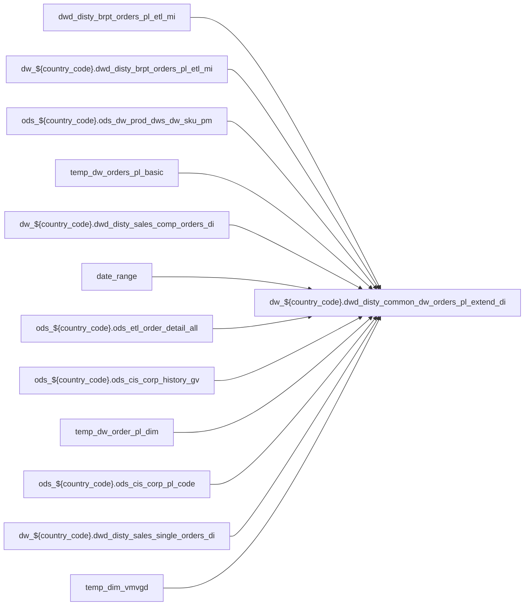

# DWD: `dwd_disty_common_dw_orders_pl_extend_di`

- artifact_type: etl_table
- artifact_id: dw_${country_code}.dwd_disty_common_dw_orders_pl_extend_di
- domain: pos
- one_line_purpose: ETL script `source/contracts/pos/bitbucket-etl/dwd_disty_common_dw_orders_pl_extend_di/dwd_disty_common_dw_orders_pl_extend_di.sql` loads `dw_${country_code}.dwd_disty_common_dw_orders_pl_extend_di` (layer `DWD`). Purpose inferred from SQL only.
- layer_type: DWD
- source_kind: etl_sql
- evidence_source: source/contracts/pos/bitbucket-etl/dwd_disty_common_dw_orders_pl_extend_di/dwd_disty_common_dw_orders_pl_extend_di.sql
- bitbucket_etl_bundle: source/contracts/pos/bitbucket-etl/dwd_disty_common_dw_orders_pl_extend_di/

---

## L1 Data Foundation

### Identity and physical mapping
- **Table:** `dw_${country_code}.dwd_disty_common_dw_orders_pl_extend_di`
- **Layer type:** DWD
- **Canonical / derived:** Derived / ETL-loaded (see L3)
- **Owner team:** Not documented in repository

### Grain, scope, exclusions
- **Grain:** Not documented in repository (see SELECT/GROUP BY in `source/contracts/pos/bitbucket-etl/dwd_disty_common_dw_orders_pl_extend_di/dwd_disty_common_dw_orders_pl_extend_di.sql`)
- **Partition:** `date_flag`
- **Exclusions:** See L3 Key filters

### Cross-engine presence
| Engine | Present | Canonical FQN | Notes |
|--------|---------|---------------|-------|
| Hive | yes | `dw_${country_code}.dwd_disty_common_dw_orders_pl_extend_di` | ETL target |
| Vertica | Not documented in repository | — | Confirm via hive2vertica flow |

### Physical schema reference

Pointer block only - full column catalog lives in WKB L1 storage JSON.

| Field | Value |
|-------|-------|
| **Authoritative catalog** | WKB L1 storage seed (not duplicated in this file) |
| **entity_id** | `dw_${country_code}.dwd_disty_common_dw_orders_pl_extend_di` |
| **l1_catalog_seed** | `target/storage/wkb/snapshots/_snapshot_id_template/l1_catalog/{engine}_{schema}_{table}.json` |
| **column_count** | pending (run ddl_seed_writer) |
| **partition_keys** | `date_flag` |
| **ddl_source** | pending Bitbucket DDL / Vertica metadata ingest |
| **retrieval** | `python -m tools.wkb.indexing.run_query --query "pos dwd_disty_common_dw_orders_pl_extend_di schema" --intent find_table_schema` |

### Lineage

- **Primary load:** `source/contracts/pos/bitbucket-etl/dwd_disty_common_dw_orders_pl_extend_di/dwd_disty_common_dw_orders_pl_extend_di.sql`
- **upstream:** `dwd_disty_brpt_orders_pl_etl_mi` — FROM/JOIN — `source/contracts/pos/bitbucket-etl/dwd_disty_common_dw_orders_pl_extend_di/dwd_disty_common_dw_orders_pl_extend_di.sql`
- **upstream:** `dw_${country_code}.dwd_disty_brpt_orders_pl_etl_mi` — FROM/JOIN — `source/contracts/pos/bitbucket-etl/dwd_disty_common_dw_orders_pl_extend_di/dwd_disty_common_dw_orders_pl_extend_di.sql`
- **upstream:** `ods_${country_code}.ods_dw_prod_dws_dw_sku_pm` — FROM/JOIN — `source/contracts/pos/bitbucket-etl/dwd_disty_common_dw_orders_pl_extend_di/dwd_disty_common_dw_orders_pl_extend_di.sql`
- **upstream:** `temp_dw_orders_pl_basic` — FROM/JOIN — `source/contracts/pos/bitbucket-etl/dwd_disty_common_dw_orders_pl_extend_di/dwd_disty_common_dw_orders_pl_extend_di.sql`
- **upstream:** `dw_${country_code}.dwd_disty_sales_comp_orders_di` — FROM/JOIN — `source/contracts/pos/bitbucket-etl/dwd_disty_common_dw_orders_pl_extend_di/dwd_disty_common_dw_orders_pl_extend_di.sql`
- **upstream:** `date_range` — FROM/JOIN — `source/contracts/pos/bitbucket-etl/dwd_disty_common_dw_orders_pl_extend_di/dwd_disty_common_dw_orders_pl_extend_di.sql`
- **upstream:** `ods_${country_code}.ods_etl_order_detail_all` — FROM/JOIN — `source/contracts/pos/bitbucket-etl/dwd_disty_common_dw_orders_pl_extend_di/dwd_disty_common_dw_orders_pl_extend_di.sql`
- **upstream:** `ods_${country_code}.ods_cis_corp_history_gv` — FROM/JOIN — `source/contracts/pos/bitbucket-etl/dwd_disty_common_dw_orders_pl_extend_di/dwd_disty_common_dw_orders_pl_extend_di.sql`
- **upstream:** `temp_dw_order_pl_dim` — FROM/JOIN — `source/contracts/pos/bitbucket-etl/dwd_disty_common_dw_orders_pl_extend_di/dwd_disty_common_dw_orders_pl_extend_di.sql`
- **upstream:** `ods_${country_code}.ods_cis_corp_pl_code` — FROM/JOIN — `source/contracts/pos/bitbucket-etl/dwd_disty_common_dw_orders_pl_extend_di/dwd_disty_common_dw_orders_pl_extend_di.sql`
- **upstream:** `dw_${country_code}.dwd_disty_sales_single_orders_di` — FROM/JOIN — `source/contracts/pos/bitbucket-etl/dwd_disty_common_dw_orders_pl_extend_di/dwd_disty_common_dw_orders_pl_extend_di.sql`
- **upstream:** `temp_dim_vmvgd` — FROM/JOIN — `source/contracts/pos/bitbucket-etl/dwd_disty_common_dw_orders_pl_extend_di/dwd_disty_common_dw_orders_pl_extend_di.sql`
- **upstream:** `temp_code_ngm` — FROM/JOIN — `source/contracts/pos/bitbucket-etl/dwd_disty_common_dw_orders_pl_extend_di/dwd_disty_common_dw_orders_pl_extend_di.sql`
- **upstream:** `ods_${country_code}.ods_cis_corp_history_soldto` — FROM/JOIN — `source/contracts/pos/bitbucket-etl/dwd_disty_common_dw_orders_pl_extend_di/dwd_disty_common_dw_orders_pl_extend_di.sql`
- **upstream:** `ods_${country_code}.ods_etl_order_header_all` — FROM/JOIN — `source/contracts/pos/bitbucket-etl/dwd_disty_common_dw_orders_pl_extend_di/dwd_disty_common_dw_orders_pl_extend_di.sql`
- **upstream:** `tmp_gv_user_type` — FROM/JOIN — `source/contracts/pos/bitbucket-etl/dwd_disty_common_dw_orders_pl_extend_di/dwd_disty_common_dw_orders_pl_extend_di.sql`
- **downstream:** see L6 Downstream consumers
### Freshness and load path
| Item | Value |
|------|-------|
| Load pattern | See L3 INSERT / OVERWRITE in evidence script |
| Schedule | Not documented in repository |
| Parameters | Parsed from ETL literals / `${...}` in `source/contracts/pos/bitbucket-etl/dwd_disty_common_dw_orders_pl_extend_di/dwd_disty_common_dw_orders_pl_extend_di.sql` |

## L2 Declarative Knowledge

### Business purpose
ETL script `source/contracts/pos/bitbucket-etl/dwd_disty_common_dw_orders_pl_extend_di/dwd_disty_common_dw_orders_pl_extend_di.sql` loads `dw_${country_code}.dwd_disty_common_dw_orders_pl_extend_di` (layer `DWD`). Purpose inferred from SQL only.

### Audience and use cases
| Audience | How they benefit |
|----------|-----------------|
| Data / BI consumers | Use target table produced by this ETL |
| Data Engineering | Maintain load logic in evidence script |

### Fact key resolution
- Keys follow target INSERT column list / GROUP BY in evidence SQL.

### Time field semantics
- Partition / date fields: `date_flag`

### Metrics served
- See L3 column derivations for measure expressions when present.

### Metric serving map
N/A — not a multi-period wide serving table (or not documented).

### etl_metrics
No calculable business metrics registered in metric-index for this create run.

## L3 Procedural Knowledge

### Query and routing rules
- Prefer querying the target `dw_${country_code}.dwd_disty_common_dw_orders_pl_extend_di` after successful ETL load.

### Dimension join patterns
- See Relationship map and Base tables register.

### Key filters and ETL business logic

| Predicate | Kind | Evidence |
|-----------|------|----------|
| `dt_month >= DATE_FORMAT('${start_date}','yyyy-MM') and dt_month <= DATE_FORMAT('${end_date}','yyyy-MM') and to_date(date_flag) >= date_sub('${start_date}',dayofmonth('${start_date}')-1) and to_date...` | Technical (load only) / Business | `source/contracts/pos/bitbucket-etl/dwd_disty_common_dw_orders_pl_extend_di/dwd_disty_common_dw_orders_pl_extend_di.sql` |
| `dwo.terr_status = 'n'` | Business | `source/contracts/pos/bitbucket-etl/dwd_disty_common_dw_orders_pl_extend_di/dwd_disty_common_dw_orders_pl_extend_di.sql` |
| `code_type IN ('CFNR', 'CRCR') AND ccode = 'NGM'; -- 7 Consolidate all fields and then insert overwrite target table insert overwrite table dw_${country_code}.dwd_disty_common_dw_orders_pl_extend_di...` | Business | `source/contracts/pos/bitbucket-etl/dwd_disty_common_dw_orders_pl_extend_di/dwd_disty_common_dw_orders_pl_extend_di.sql` |

### Standard time-filter SQL
```sql
-- See partition / date predicates in source/contracts/pos/bitbucket-etl/dwd_disty_common_dw_orders_pl_extend_di/dwd_disty_common_dw_orders_pl_extend_di.sql
```

### End-to-end flow



### Base tables register

| Object | Role |
|--------|------|
| `dwd_disty_brpt_orders_pl_etl_mi` | source / temp (from ETL FROM/JOIN) |
| `dw_${country_code}.dwd_disty_brpt_orders_pl_etl_mi` | source / temp (from ETL FROM/JOIN) |
| `ods_${country_code}.ods_dw_prod_dws_dw_sku_pm` | source / temp (from ETL FROM/JOIN) |
| `temp_dw_orders_pl_basic` | source / temp (from ETL FROM/JOIN) |
| `dw_${country_code}.dwd_disty_sales_comp_orders_di` | source / temp (from ETL FROM/JOIN) |
| `date_range` | source / temp (from ETL FROM/JOIN) |
| `ods_${country_code}.ods_etl_order_detail_all` | source / temp (from ETL FROM/JOIN) |
| `ods_${country_code}.ods_cis_corp_history_gv` | source / temp (from ETL FROM/JOIN) |
| `temp_dw_order_pl_dim` | source / temp (from ETL FROM/JOIN) |
| `ods_${country_code}.ods_cis_corp_pl_code` | source / temp (from ETL FROM/JOIN) |
| `dw_${country_code}.dwd_disty_sales_single_orders_di` | source / temp (from ETL FROM/JOIN) |
| `temp_dim_vmvgd` | source / temp (from ETL FROM/JOIN) |
| `temp_code_ngm` | source / temp (from ETL FROM/JOIN) |
| `ods_${country_code}.ods_cis_corp_history_soldto` | source / temp (from ETL FROM/JOIN) |
| `ods_${country_code}.ods_etl_order_header_all` | source / temp (from ETL FROM/JOIN) |
| `tmp_gv_user_type` | source / temp (from ETL FROM/JOIN) |

### Step-by-step logic
1. Read sources listed in Base tables register (`source/contracts/pos/bitbucket-etl/dwd_disty_common_dw_orders_pl_extend_di/dwd_disty_common_dw_orders_pl_extend_di.sql`).
2. Apply filters documented under Key filters.
3. INSERT OVERWRITE / write target `dw_${country_code}.dwd_disty_common_dw_orders_pl_extend_di`.

### Relationship map (embedded)

| from_fqn | to_fqn | cardinality | join_keys | provenance |
|----------|--------|-------------|-----------|------------|
| `ods_${country_code}.ods_dw_prod_dws_dw_sku_pm` | `temp_dw_orders_pl_basic` | many:1 | `dsp.sku_no` = `src.sku_no` | etl_sql (`source/contracts/pos/bitbucket-etl/dwd_disty_common_dw_orders_pl_extend_di/dwd_disty_common_dw_orders_pl_extend_di.sql:143`) |
| `twop` | `dw_${country_code}.dwd_disty_sales_comp_orders_di` | many:1 (LEFT) | `twop.order_no` = `cp.order_no`; `twop.order_type` = `cp.order_type`; `twop.order_line_no` = `cp.order_line_no`; `twop.date_flag` = `cp.date_flag` | etl_sql (`source/contracts/pos/bitbucket-etl/dwd_disty_common_dw_orders_pl_extend_di/dwd_disty_common_dw_orders_pl_extend_di.sql:168`) |
| `dw_${country_code}.dwd_disty_brpt_orders_pl_etl_mi` | `date_range` | many:1 (LEFT) | cp.date_flag >= dr.min_date and cp.date_flag<= dr.max_date | etl_sql (`source/contracts/pos/bitbucket-etl/dwd_disty_common_dw_orders_pl_extend_di/dwd_disty_common_dw_orders_pl_extend_di.sql:174`) |
| `dw_${country_code}.dwd_disty_sales_comp_orders_di` | `ods_${country_code}.ods_etl_order_detail_all` | many:1 (LEFT) | `cp.order_no` = `hd.order_no`; `cp.order_type` = `hd.order_type`; `cp.kit_line_no` = `hd.order_line_no` | etl_sql (`source/contracts/pos/bitbucket-etl/dwd_disty_common_dw_orders_pl_extend_di/dwd_disty_common_dw_orders_pl_extend_di.sql:177`) |
| `twop` | `ods_${country_code}.ods_cis_corp_history_gv` | many:1 (LEFT) | `twop.order_type` = `hg.order_type`; `twop.order_no` = `hg.order_no` | etl_sql (`source/contracts/pos/bitbucket-etl/dwd_disty_common_dw_orders_pl_extend_di/dwd_disty_common_dw_orders_pl_extend_di.sql:181`) |
| `twop` | `ods_${country_code}.ods_dw_prod_dws_dw_sku_pm` | many:1 (LEFT) | `twop.sku_no` = `dsp.sku_no`; `twop.vend_no` = `dsp.ori_vend_no` | etl_sql (`source/contracts/pos/bitbucket-etl/dwd_disty_common_dw_orders_pl_extend_di/dwd_disty_common_dw_orders_pl_extend_di.sql:185`) |
| `twop` | `temp_dw_order_pl_dim` | many:1 (LEFT) | `twop.sku_no` = `dsp2.sku_no` | etl_sql (`source/contracts/pos/bitbucket-etl/dwd_disty_common_dw_orders_pl_extend_di/dwd_disty_common_dw_orders_pl_extend_di.sql:191`) |
| `dw_${country_code}.dwd_disty_brpt_orders_pl_etl_mi` | `ods_${country_code}.ods_cis_corp_pl_code` | many:1 (LEFT) | coalesce(dsp.seg_code,dsp2.seg_code,twop.dim_seg_code) = pc.ccode and pc.code_type = 'VSEG'; --5 get gv_user_type CREATE TEMPORARY table tmp_gv_user_type AS | etl_sql (`source/contracts/pos/bitbucket-etl/dwd_disty_common_dw_orders_pl_extend_di/dwd_disty_common_dw_orders_pl_extend_di.sql:195`) |
| `dw_${country_code}.dwd_disty_brpt_orders_pl_etl_mi` | `date_range` | many:1 | TO_DATE(dwo.date_flag) >= dr.min_date AND TO_DATE(dwo.date_flag) <= dr.max_date | etl_sql (`source/contracts/pos/bitbucket-etl/dwd_disty_common_dw_orders_pl_extend_di/dwd_disty_common_dw_orders_pl_extend_di.sql:208`) |
| `dw_${country_code}.dwd_disty_brpt_orders_pl_etl_mi` | `temp_code_ngm` | many:1 (LEFT) | tdvp.date_flag between nvl(p.start_date,tdvp.date_flag) and nvl(p.end_date,tdvp.date_flag) AND p.code_type = 'CFNR' | etl_sql (`source/contracts/pos/bitbucket-etl/dwd_disty_common_dw_orders_pl_extend_di/dwd_disty_common_dw_orders_pl_extend_di.sql:359`) |
| `dw_${country_code}.dwd_disty_brpt_orders_pl_etl_mi` | `temp_code_ngm` | many:1 (LEFT) | tdvp.date_flag between nvl(q.start_date,tdvp.date_flag) and nvl(q.end_date,tdvp.date_flag) AND q.code_type = 'CRCR' | etl_sql (`source/contracts/pos/bitbucket-etl/dwd_disty_common_dw_orders_pl_extend_di/dwd_disty_common_dw_orders_pl_extend_di.sql:362`) |
| `tdvp` | `ods_${country_code}.ods_cis_corp_history_soldto` | many:1 (LEFT) | `tdvp.order_no` = `s.order_no`; `tdvp.order_type` = `s.order_type` | etl_sql (`source/contracts/pos/bitbucket-etl/dwd_disty_common_dw_orders_pl_extend_di/dwd_disty_common_dw_orders_pl_extend_di.sql:365`) |
| `tdvp` | `ods_${country_code}.ods_etl_order_header_all` | many:1 (LEFT) | `tdvp.order_no` = `oh.order_no`; `tdvp.order_type` = `oh.order_type` | etl_sql (`source/contracts/pos/bitbucket-etl/dwd_disty_common_dw_orders_pl_extend_di/dwd_disty_common_dw_orders_pl_extend_di.sql:367`) |
| `tdvp` | `tmp_gv_user_type` | many:1 (LEFT) | `tdvp.order_no` = `gv.order_no`; `tdvp.order_type` = `gv.order_type`; `tdvp.date_flag` = `gv.date_flag` | etl_sql (`source/contracts/pos/bitbucket-etl/dwd_disty_common_dw_orders_pl_extend_di/dwd_disty_common_dw_orders_pl_extend_di.sql:369`) |

### Special logic (embedded)

`source/ref/pos/special_logic.txt` exists but no rule naming this FQN/stem (`dw_${country_code}.dwd_disty_common_dw_orders_pl_extend_di`).

Not documented in repository


### Column / field derivations (from ETL SQL)

| target_column | expression_sql | upstream_columns | upstream_tables | transform_kind | evidence |
|---------------|----------------|------------------|-----------------|----------------|----------|
| `order_type` | `tdvp.order_type` | `order_type` | `temp_dim_vmvgd`, `temp_code_ngm`, `ods_${country_code}.ods_cis_corp_history_soldto`, `ods_${country_code}.ods_etl_order_header_all`, `tmp_gv_user_type` | passthrough | `source/contracts/pos/bitbucket-etl/dwd_disty_common_dw_orders_pl_extend_di/dwd_disty_common_dw_orders_pl_extend_di.sql:228` |
| `order_no` | `tdvp.order_no` | `order_no` | `temp_dim_vmvgd`, `temp_code_ngm`, `ods_${country_code}.ods_cis_corp_history_soldto`, `ods_${country_code}.ods_etl_order_header_all`, `tmp_gv_user_type` | passthrough | `source/contracts/pos/bitbucket-etl/dwd_disty_common_dw_orders_pl_extend_di/dwd_disty_common_dw_orders_pl_extend_di.sql:229` |
| `order_line_no` | `tdvp.order_line_no` | `order_line_no` | `temp_dim_vmvgd`, `temp_code_ngm`, `ods_${country_code}.ods_cis_corp_history_soldto`, `ods_${country_code}.ods_etl_order_header_all`, `tmp_gv_user_type` | passthrough | `source/contracts/pos/bitbucket-etl/dwd_disty_common_dw_orders_pl_extend_di/dwd_disty_common_dw_orders_pl_extend_di.sql:230` |
| `cust_no` | `tdvp.cust_no` | `cust_no` | `temp_dim_vmvgd`, `temp_code_ngm`, `ods_${country_code}.ods_cis_corp_history_soldto`, `ods_${country_code}.ods_etl_order_header_all`, `tmp_gv_user_type` | passthrough | `source/contracts/pos/bitbucket-etl/dwd_disty_common_dw_orders_pl_extend_di/dwd_disty_common_dw_orders_pl_extend_di.sql:231` |
| `mcust_no` | `tdvp.mcust_no` | `mcust_no` | `temp_dim_vmvgd`, `temp_code_ngm`, `ods_${country_code}.ods_cis_corp_history_soldto`, `ods_${country_code}.ods_etl_order_header_all`, `tmp_gv_user_type` | passthrough | `source/contracts/pos/bitbucket-etl/dwd_disty_common_dw_orders_pl_extend_di/dwd_disty_common_dw_orders_pl_extend_di.sql:232` |
| `cust_terr` | `tdvp.cust_terr` | `cust_terr` | `temp_dim_vmvgd`, `temp_code_ngm`, `ods_${country_code}.ods_cis_corp_history_soldto`, `ods_${country_code}.ods_etl_order_header_all`, `tmp_gv_user_type` | passthrough | `source/contracts/pos/bitbucket-etl/dwd_disty_common_dw_orders_pl_extend_di/dwd_disty_common_dw_orders_pl_extend_di.sql:233` |
| `sales_rep` | `tdvp.sales_rep` | `sales_rep` | `temp_dim_vmvgd`, `temp_code_ngm`, `ods_${country_code}.ods_cis_corp_history_soldto`, `ods_${country_code}.ods_etl_order_header_all`, `tmp_gv_user_type` | passthrough | `source/contracts/pos/bitbucket-etl/dwd_disty_common_dw_orders_pl_extend_di/dwd_disty_common_dw_orders_pl_extend_di.sql:234` |
| `sku_no` | `tdvp.sku_no` | `sku_no` | `temp_dim_vmvgd`, `temp_code_ngm`, `ods_${country_code}.ods_cis_corp_history_soldto`, `ods_${country_code}.ods_etl_order_header_all`, `tmp_gv_user_type` | passthrough | `source/contracts/pos/bitbucket-etl/dwd_disty_common_dw_orders_pl_extend_di/dwd_disty_common_dw_orders_pl_extend_di.sql:235` |
| `prod_code` | `tdvp.prod_code` | `prod_code` | `temp_dim_vmvgd`, `temp_code_ngm`, `ods_${country_code}.ods_cis_corp_history_soldto`, `ods_${country_code}.ods_etl_order_header_all`, `tmp_gv_user_type` | passthrough | `source/contracts/pos/bitbucket-etl/dwd_disty_common_dw_orders_pl_extend_di/dwd_disty_common_dw_orders_pl_extend_di.sql:236` |
| `vend_no` | `tdvp.vend_no` | `vend_no` | `temp_dim_vmvgd`, `temp_code_ngm`, `ods_${country_code}.ods_cis_corp_history_soldto`, `ods_${country_code}.ods_etl_order_header_all`, `tmp_gv_user_type` | passthrough | `source/contracts/pos/bitbucket-etl/dwd_disty_common_dw_orders_pl_extend_di/dwd_disty_common_dw_orders_pl_extend_di.sql:237` |
| `from_loc_no` | `tdvp.from_loc_no` | `from_loc_no` | `temp_dim_vmvgd`, `temp_code_ngm`, `ods_${country_code}.ods_cis_corp_history_soldto`, `ods_${country_code}.ods_etl_order_header_all`, `tmp_gv_user_type` | passthrough | `source/contracts/pos/bitbucket-etl/dwd_disty_common_dw_orders_pl_extend_di/dwd_disty_common_dw_orders_pl_extend_di.sql:238` |
| `inv_type` | `tdvp.inv_type` | `inv_type` | `temp_dim_vmvgd`, `temp_code_ngm`, `ods_${country_code}.ods_cis_corp_history_soldto`, `ods_${country_code}.ods_etl_order_header_all`, `tmp_gv_user_type` | passthrough | `source/contracts/pos/bitbucket-etl/dwd_disty_common_dw_orders_pl_extend_di/dwd_disty_common_dw_orders_pl_extend_di.sql:239` |
| `ship_qty` | `tdvp.ship_qty` | `ship_qty` | `temp_dim_vmvgd`, `temp_code_ngm`, `ods_${country_code}.ods_cis_corp_history_soldto`, `ods_${country_code}.ods_etl_order_header_all`, `tmp_gv_user_type` | passthrough | `source/contracts/pos/bitbucket-etl/dwd_disty_common_dw_orders_pl_extend_di/dwd_disty_common_dw_orders_pl_extend_di.sql:240` |
| `u_price` | `tdvp.u_price` | `u_price` | `temp_dim_vmvgd`, `temp_code_ngm`, `ods_${country_code}.ods_cis_corp_history_soldto`, `ods_${country_code}.ods_etl_order_header_all`, `tmp_gv_user_type` | passthrough | `source/contracts/pos/bitbucket-etl/dwd_disty_common_dw_orders_pl_extend_di/dwd_disty_common_dw_orders_pl_extend_di.sql:241` |
| `u_cost` | `tdvp.u_cost` | `u_cost` | `temp_dim_vmvgd`, `temp_code_ngm`, `ods_${country_code}.ods_cis_corp_history_soldto`, `ods_${country_code}.ods_etl_order_header_all`, `tmp_gv_user_type` | passthrough | `source/contracts/pos/bitbucket-etl/dwd_disty_common_dw_orders_pl_extend_di/dwd_disty_common_dw_orders_pl_extend_di.sql:242` |
| `u_sum_expense` | `tdvp.u_sum_expense` | `u_sum_expense` | `temp_dim_vmvgd`, `temp_code_ngm`, `ods_${country_code}.ods_cis_corp_history_soldto`, `ods_${country_code}.ods_etl_order_header_all`, `tmp_gv_user_type` | passthrough | `source/contracts/pos/bitbucket-etl/dwd_disty_common_dw_orders_pl_extend_di/dwd_disty_common_dw_orders_pl_extend_di.sql:243` |
| `l_weight` | `tdvp.l_weight` | `l_weight` | `temp_dim_vmvgd`, `temp_code_ngm`, `ods_${country_code}.ods_cis_corp_history_soldto`, `ods_${country_code}.ods_etl_order_header_all`, `tmp_gv_user_type` | passthrough | `source/contracts/pos/bitbucket-etl/dwd_disty_common_dw_orders_pl_extend_di/dwd_disty_common_dw_orders_pl_extend_di.sql:244` |
| `terms` | `tdvp.terms` | `terms` | `temp_dim_vmvgd`, `temp_code_ngm`, `ods_${country_code}.ods_cis_corp_history_soldto`, `ods_${country_code}.ods_etl_order_header_all`, `tmp_gv_user_type` | passthrough | `source/contracts/pos/bitbucket-etl/dwd_disty_common_dw_orders_pl_extend_di/dwd_disty_common_dw_orders_pl_extend_di.sql:245` |
| `cust_segment` | `tdvp.cust_segment` | `cust_segment` | `temp_dim_vmvgd`, `temp_code_ngm`, `ods_${country_code}.ods_cis_corp_history_soldto`, `ods_${country_code}.ods_etl_order_header_all`, `tmp_gv_user_type` | passthrough | `source/contracts/pos/bitbucket-etl/dwd_disty_common_dw_orders_pl_extend_di/dwd_disty_common_dw_orders_pl_extend_di.sql:246` |
| `cust_exclude` | `tdvp.cust_exclude` | `cust_exclude` | `temp_dim_vmvgd`, `temp_code_ngm`, `ods_${country_code}.ods_cis_corp_history_soldto`, `ods_${country_code}.ods_etl_order_header_all`, `tmp_gv_user_type` | passthrough | `source/contracts/pos/bitbucket-etl/dwd_disty_common_dw_orders_pl_extend_di/dwd_disty_common_dw_orders_pl_extend_di.sql:247` |
| `part_segment` | `tdvp.part_segment` | `part_segment` | `temp_dim_vmvgd`, `temp_code_ngm`, `ods_${country_code}.ods_cis_corp_history_soldto`, `ods_${country_code}.ods_etl_order_header_all`, `tmp_gv_user_type` | passthrough | `source/contracts/pos/bitbucket-etl/dwd_disty_common_dw_orders_pl_extend_di/dwd_disty_common_dw_orders_pl_extend_di.sql:248` |
| `btl` | `tdvp.btl` | `btl` | `temp_dim_vmvgd`, `temp_code_ngm`, `ods_${country_code}.ods_cis_corp_history_soldto`, `ods_${country_code}.ods_etl_order_header_all`, `tmp_gv_user_type` | passthrough | `source/contracts/pos/bitbucket-etl/dwd_disty_common_dw_orders_pl_extend_di/dwd_disty_common_dw_orders_pl_extend_di.sql:249` |
| `btl_sales` | `tdvp.btl_sales` | `btl_sales` | `temp_dim_vmvgd`, `temp_code_ngm`, `ods_${country_code}.ods_cis_corp_history_soldto`, `ods_${country_code}.ods_etl_order_header_all`, `tmp_gv_user_type` | passthrough | `source/contracts/pos/bitbucket-etl/dwd_disty_common_dw_orders_pl_extend_di/dwd_disty_common_dw_orders_pl_extend_di.sql:250` |
| `scm_disc` | `tdvp.scm_disc` | `scm_disc` | `temp_dim_vmvgd`, `temp_code_ngm`, `ods_${country_code}.ods_cis_corp_history_soldto`, `ods_${country_code}.ods_etl_order_header_all`, `tmp_gv_user_type` | passthrough | `source/contracts/pos/bitbucket-etl/dwd_disty_common_dw_orders_pl_extend_di/dwd_disty_common_dw_orders_pl_extend_di.sql:251` |
| `scm_ndisc` | `tdvp.scm_ndisc` | `scm_ndisc` | `temp_dim_vmvgd`, `temp_code_ngm`, `ods_${country_code}.ods_cis_corp_history_soldto`, `ods_${country_code}.ods_etl_order_header_all`, `tmp_gv_user_type` | passthrough | `source/contracts/pos/bitbucket-etl/dwd_disty_common_dw_orders_pl_extend_di/dwd_disty_common_dw_orders_pl_extend_di.sql:252` |
| `mof` | `tdvp.mof` | `mof` | `temp_dim_vmvgd`, `temp_code_ngm`, `ods_${country_code}.ods_cis_corp_history_soldto`, `ods_${country_code}.ods_etl_order_header_all`, `tmp_gv_user_type` | passthrough | `source/contracts/pos/bitbucket-etl/dwd_disty_common_dw_orders_pl_extend_di/dwd_disty_common_dw_orders_pl_extend_di.sql:253` |
| `pdt` | `tdvp.pdt` | `pdt` | `temp_dim_vmvgd`, `temp_code_ngm`, `ods_${country_code}.ods_cis_corp_history_soldto`, `ods_${country_code}.ods_etl_order_header_all`, `tmp_gv_user_type` | passthrough | `source/contracts/pos/bitbucket-etl/dwd_disty_common_dw_orders_pl_extend_di/dwd_disty_common_dw_orders_pl_extend_di.sql:254` |
| `pdt_sales` | `tdvp.pdt_sales` | `pdt_sales` | `temp_dim_vmvgd`, `temp_code_ngm`, `ods_${country_code}.ods_cis_corp_history_soldto`, `ods_${country_code}.ods_etl_order_header_all`, `tmp_gv_user_type` | passthrough | `source/contracts/pos/bitbucket-etl/dwd_disty_common_dw_orders_pl_extend_di/dwd_disty_common_dw_orders_pl_extend_di.sql:255` |
| `frt_in` | `tdvp.frt_in` | `frt_in` | `temp_dim_vmvgd`, `temp_code_ngm`, `ods_${country_code}.ods_cis_corp_history_soldto`, `ods_${country_code}.ods_etl_order_header_all`, `tmp_gv_user_type` | passthrough | `source/contracts/pos/bitbucket-etl/dwd_disty_common_dw_orders_pl_extend_di/dwd_disty_common_dw_orders_pl_extend_di.sql:256` |
| `cust_rebate` | `tdvp.cust_rebate` | `cust_rebate` | `temp_dim_vmvgd`, `temp_code_ngm`, `ods_${country_code}.ods_cis_corp_history_soldto`, `ods_${country_code}.ods_etl_order_header_all`, `tmp_gv_user_type` | passthrough | `source/contracts/pos/bitbucket-etl/dwd_disty_common_dw_orders_pl_extend_di/dwd_disty_common_dw_orders_pl_extend_di.sql:257` |
| `btl_backout` | `tdvp.btl_backout` | `btl_backout` | `temp_dim_vmvgd`, `temp_code_ngm`, `ods_${country_code}.ods_cis_corp_history_soldto`, `ods_${country_code}.ods_etl_order_header_all`, `tmp_gv_user_type` | passthrough | `source/contracts/pos/bitbucket-etl/dwd_disty_common_dw_orders_pl_extend_di/dwd_disty_common_dw_orders_pl_extend_di.sql:258` |
| `frt_out_load` | `tdvp.frt_out_load` | `frt_out_load` | `temp_dim_vmvgd`, `temp_code_ngm`, `ods_${country_code}.ods_cis_corp_history_soldto`, `ods_${country_code}.ods_etl_order_header_all`, `tmp_gv_user_type` | passthrough | `source/contracts/pos/bitbucket-etl/dwd_disty_common_dw_orders_pl_extend_di/dwd_disty_common_dw_orders_pl_extend_di.sql:259` |
| `frt_out_exp` | `tdvp.frt_out_exp` | `frt_out_exp` | `temp_dim_vmvgd`, `temp_code_ngm`, `ods_${country_code}.ods_cis_corp_history_soldto`, `ods_${country_code}.ods_etl_order_header_all`, `tmp_gv_user_type` | passthrough | `source/contracts/pos/bitbucket-etl/dwd_disty_common_dw_orders_pl_extend_di/dwd_disty_common_dw_orders_pl_extend_di.sql:260` |
| `whoh_pack` | `tdvp.whoh_pack` | `whoh_pack` | `temp_dim_vmvgd`, `temp_code_ngm`, `ods_${country_code}.ods_cis_corp_history_soldto`, `ods_${country_code}.ods_etl_order_header_all`, `tmp_gv_user_type` | passthrough | `source/contracts/pos/bitbucket-etl/dwd_disty_common_dw_orders_pl_extend_di/dwd_disty_common_dw_orders_pl_extend_di.sql:261` |
| `inv_cost` | `tdvp.inv_cost` | `inv_cost` | `temp_dim_vmvgd`, `temp_code_ngm`, `ods_${country_code}.ods_cis_corp_history_soldto`, `ods_${country_code}.ods_etl_order_header_all`, `tmp_gv_user_type` | passthrough | `source/contracts/pos/bitbucket-etl/dwd_disty_common_dw_orders_pl_extend_di/dwd_disty_common_dw_orders_pl_extend_di.sql:262` |
| `inv_reserve` | `tdvp.inv_reserve` | `inv_reserve` | `temp_dim_vmvgd`, `temp_code_ngm`, `ods_${country_code}.ods_cis_corp_history_soldto`, `ods_${country_code}.ods_etl_order_header_all`, `tmp_gv_user_type` | passthrough | `source/contracts/pos/bitbucket-etl/dwd_disty_common_dw_orders_pl_extend_di/dwd_disty_common_dw_orders_pl_extend_di.sql:263` |
| `ap_finance` | `tdvp.ap_finance` | `ap_finance` | `temp_dim_vmvgd`, `temp_code_ngm`, `ods_${country_code}.ods_cis_corp_history_soldto`, `ods_${country_code}.ods_etl_order_header_all`, `tmp_gv_user_type` | passthrough | `source/contracts/pos/bitbucket-etl/dwd_disty_common_dw_orders_pl_extend_di/dwd_disty_common_dw_orders_pl_extend_di.sql:264` |
| `cust_pmt_disc` | `tdvp.cust_pmt_disc` | `cust_pmt_disc` | `temp_dim_vmvgd`, `temp_code_ngm`, `ods_${country_code}.ods_cis_corp_history_soldto`, `ods_${country_code}.ods_etl_order_header_all`, `tmp_gv_user_type` | passthrough | `source/contracts/pos/bitbucket-etl/dwd_disty_common_dw_orders_pl_extend_di/dwd_disty_common_dw_orders_pl_extend_di.sql:265` |
| `cust_finance` | `tdvp.cust_finance` | `cust_finance` | `temp_dim_vmvgd`, `temp_code_ngm`, `ods_${country_code}.ods_cis_corp_history_soldto`, `ods_${country_code}.ods_etl_order_header_all`, `tmp_gv_user_type` | passthrough | `source/contracts/pos/bitbucket-etl/dwd_disty_common_dw_orders_pl_extend_di/dwd_disty_common_dw_orders_pl_extend_di.sql:266` |
| `cr_risk_cterm` | `tdvp.cr_risk_cterm` | `cr_risk_cterm` | `temp_dim_vmvgd`, `temp_code_ngm`, `ods_${country_code}.ods_cis_corp_history_soldto`, `ods_${country_code}.ods_etl_order_header_all`, `tmp_gv_user_type` | passthrough | `source/contracts/pos/bitbucket-etl/dwd_disty_common_dw_orders_pl_extend_di/dwd_disty_common_dw_orders_pl_extend_di.sql:267` |
| `flr_synnex` | `tdvp.flr_synnex` | `flr_synnex` | `temp_dim_vmvgd`, `temp_code_ngm`, `ods_${country_code}.ods_cis_corp_history_soldto`, `ods_${country_code}.ods_etl_order_header_all`, `tmp_gv_user_type` | passthrough | `source/contracts/pos/bitbucket-etl/dwd_disty_common_dw_orders_pl_extend_di/dwd_disty_common_dw_orders_pl_extend_di.sql:268` |
| `scm_cost` | `tdvp.scm_cost` | `scm_cost` | `temp_dim_vmvgd`, `temp_code_ngm`, `ods_${country_code}.ods_cis_corp_history_soldto`, `ods_${country_code}.ods_etl_order_header_all`, `tmp_gv_user_type` | passthrough | `source/contracts/pos/bitbucket-etl/dwd_disty_common_dw_orders_pl_extend_di/dwd_disty_common_dw_orders_pl_extend_di.sql:269` |
| `scm_risk` | `tdvp.scm_risk` | `scm_risk` | `temp_dim_vmvgd`, `temp_code_ngm`, `ods_${country_code}.ods_cis_corp_history_soldto`, `ods_${country_code}.ods_etl_order_header_all`, `tmp_gv_user_type` | passthrough | `source/contracts/pos/bitbucket-etl/dwd_disty_common_dw_orders_pl_extend_di/dwd_disty_common_dw_orders_pl_extend_di.sql:270` |
| `rma` | `tdvp.rma` | `rma` | `temp_dim_vmvgd`, `temp_code_ngm`, `ods_${country_code}.ods_cis_corp_history_soldto`, `ods_${country_code}.ods_etl_order_header_all`, `tmp_gv_user_type` | passthrough | `source/contracts/pos/bitbucket-etl/dwd_disty_common_dw_orders_pl_extend_di/dwd_disty_common_dw_orders_pl_extend_di.sql:271` |
| `infrastructure` | `tdvp.infrastructure` | `infrastructure` | `temp_dim_vmvgd`, `temp_code_ngm`, `ods_${country_code}.ods_cis_corp_history_soldto`, `ods_${country_code}.ods_etl_order_header_all`, `tmp_gv_user_type` | passthrough | `source/contracts/pos/bitbucket-etl/dwd_disty_common_dw_orders_pl_extend_di/dwd_disty_common_dw_orders_pl_extend_di.sql:272` |
| `cust_type` | `tdvp.cust_type` | `cust_type` | `temp_dim_vmvgd`, `temp_code_ngm`, `ods_${country_code}.ods_cis_corp_history_soldto`, `ods_${country_code}.ods_etl_order_header_all`, `tmp_gv_user_type` | passthrough | `source/contracts/pos/bitbucket-etl/dwd_disty_common_dw_orders_pl_extend_di/dwd_disty_common_dw_orders_pl_extend_di.sql:273` |
| `one_time_btl` | `tdvp.one_time_btl` | `one_time_btl` | `temp_dim_vmvgd`, `temp_code_ngm`, `ods_${country_code}.ods_cis_corp_history_soldto`, `ods_${country_code}.ods_etl_order_header_all`, `tmp_gv_user_type` | passthrough | `source/contracts/pos/bitbucket-etl/dwd_disty_common_dw_orders_pl_extend_di/dwd_disty_common_dw_orders_pl_extend_di.sql:274` |
| `direct_credit` | `tdvp.direct_credit` | `direct_credit` | `temp_dim_vmvgd`, `temp_code_ngm`, `ods_${country_code}.ods_cis_corp_history_soldto`, `ods_${country_code}.ods_etl_order_header_all`, `tmp_gv_user_type` | passthrough | `source/contracts/pos/bitbucket-etl/dwd_disty_common_dw_orders_pl_extend_di/dwd_disty_common_dw_orders_pl_extend_di.sql:275` |
| `marketing` | `tdvp.marketing` | `marketing` | `temp_dim_vmvgd`, `temp_code_ngm`, `ods_${country_code}.ods_cis_corp_history_soldto`, `ods_${country_code}.ods_etl_order_header_all`, `tmp_gv_user_type` | passthrough | `source/contracts/pos/bitbucket-etl/dwd_disty_common_dw_orders_pl_extend_di/dwd_disty_common_dw_orders_pl_extend_di.sql:276` |
| `flr_vendor` | `tdvp.flr_vendor` | `flr_vendor` | `temp_dim_vmvgd`, `temp_code_ngm`, `ods_${country_code}.ods_cis_corp_history_soldto`, `ods_${country_code}.ods_etl_order_header_all`, `tmp_gv_user_type` | passthrough | `source/contracts/pos/bitbucket-etl/dwd_disty_common_dw_orders_pl_extend_di/dwd_disty_common_dw_orders_pl_extend_di.sql:277` |
| `hc_pm` | `tdvp.hc_pm` | `hc_pm` | `temp_dim_vmvgd`, `temp_code_ngm`, `ods_${country_code}.ods_cis_corp_history_soldto`, `ods_${country_code}.ods_etl_order_header_all`, `tmp_gv_user_type` | passthrough | `source/contracts/pos/bitbucket-etl/dwd_disty_common_dw_orders_pl_extend_di/dwd_disty_common_dw_orders_pl_extend_di.sql:278` |
| `hc_sales` | `tdvp.hc_sales` | `hc_sales` | `temp_dim_vmvgd`, `temp_code_ngm`, `ods_${country_code}.ods_cis_corp_history_soldto`, `ods_${country_code}.ods_etl_order_header_all`, `tmp_gv_user_type` | passthrough | `source/contracts/pos/bitbucket-etl/dwd_disty_common_dw_orders_pl_extend_di/dwd_disty_common_dw_orders_pl_extend_di.sql:279` |
| `frt_ob_recovery` | `tdvp.frt_ob_recovery` | `frt_ob_recovery` | `temp_dim_vmvgd`, `temp_code_ngm`, `ods_${country_code}.ods_cis_corp_history_soldto`, `ods_${country_code}.ods_etl_order_header_all`, `tmp_gv_user_type` | passthrough | `source/contracts/pos/bitbucket-etl/dwd_disty_common_dw_orders_pl_extend_di/dwd_disty_common_dw_orders_pl_extend_di.sql:280` |
| `frt_ib_recovery` | `tdvp.frt_ib_recovery` | `frt_ib_recovery` | `temp_dim_vmvgd`, `temp_code_ngm`, `ods_${country_code}.ods_cis_corp_history_soldto`, `ods_${country_code}.ods_etl_order_header_all`, `tmp_gv_user_type` | passthrough | `source/contracts/pos/bitbucket-etl/dwd_disty_common_dw_orders_pl_extend_di/dwd_disty_common_dw_orders_pl_extend_di.sql:281` |
| `csgn_edi_fee` | `tdvp.csgn_edi_fee` | `csgn_edi_fee` | `temp_dim_vmvgd`, `temp_code_ngm`, `ods_${country_code}.ods_cis_corp_history_soldto`, `ods_${country_code}.ods_etl_order_header_all`, `tmp_gv_user_type` | passthrough | `source/contracts/pos/bitbucket-etl/dwd_disty_common_dw_orders_pl_extend_di/dwd_disty_common_dw_orders_pl_extend_di.sql:282` |
| `cvr_rm` | `tdvp.cvr_rm` | `cvr_rm` | `temp_dim_vmvgd`, `temp_code_ngm`, `ods_${country_code}.ods_cis_corp_history_soldto`, `ods_${country_code}.ods_etl_order_header_all`, `tmp_gv_user_type` | passthrough | `source/contracts/pos/bitbucket-etl/dwd_disty_common_dw_orders_pl_extend_di/dwd_disty_common_dw_orders_pl_extend_di.sql:283` |
| `ar_fin_recovery` | `tdvp.ar_fin_recovery` | `ar_fin_recovery` | `temp_dim_vmvgd`, `temp_code_ngm`, `ods_${country_code}.ods_cis_corp_history_soldto`, `ods_${country_code}.ods_etl_order_header_all`, `tmp_gv_user_type` | passthrough | `source/contracts/pos/bitbucket-etl/dwd_disty_common_dw_orders_pl_extend_di/dwd_disty_common_dw_orders_pl_extend_di.sql:284` |
| `infra_funding` | `tdvp.infra_funding` | `infra_funding` | `temp_dim_vmvgd`, `temp_code_ngm`, `ods_${country_code}.ods_cis_corp_history_soldto`, `ods_${country_code}.ods_etl_order_header_all`, `tmp_gv_user_type` | passthrough | `source/contracts/pos/bitbucket-etl/dwd_disty_common_dw_orders_pl_extend_di/dwd_disty_common_dw_orders_pl_extend_di.sql:285` |
| `margin_share` | `tdvp.margin_share` | `margin_share` | `temp_dim_vmvgd`, `temp_code_ngm`, `ods_${country_code}.ods_cis_corp_history_soldto`, `ods_${country_code}.ods_etl_order_header_all`, `tmp_gv_user_type` | passthrough | `source/contracts/pos/bitbucket-etl/dwd_disty_common_dw_orders_pl_extend_di/dwd_disty_common_dw_orders_pl_extend_di.sql:286` |
| `pm_code` | `tdvp.pm_code` | `pm_code` | `temp_dim_vmvgd`, `temp_code_ngm`, `ods_${country_code}.ods_cis_corp_history_soldto`, `ods_${country_code}.ods_etl_order_header_all`, `tmp_gv_user_type` | passthrough | `source/contracts/pos/bitbucket-etl/dwd_disty_common_dw_orders_pl_extend_di/dwd_disty_common_dw_orders_pl_extend_di.sql:287` |
| `others` | `tdvp.`others`` | `tdvp`, `others` | `temp_dim_vmvgd`, `temp_code_ngm`, `ods_${country_code}.ods_cis_corp_history_soldto`, `ods_${country_code}.ods_etl_order_header_all`, `tmp_gv_user_type` | rename | `source/contracts/pos/bitbucket-etl/dwd_disty_common_dw_orders_pl_extend_di/dwd_disty_common_dw_orders_pl_extend_di.sql:288` |
| `others_reason_no` | `tdvp.others_reason_no` | `others_reason_no` | `temp_dim_vmvgd`, `temp_code_ngm`, `ods_${country_code}.ods_cis_corp_history_soldto`, `ods_${country_code}.ods_etl_order_header_all`, `tmp_gv_user_type` | passthrough | `source/contracts/pos/bitbucket-etl/dwd_disty_common_dw_orders_pl_extend_di/dwd_disty_common_dw_orders_pl_extend_di.sql:289` |
| `oplgm_amt` | `tdvp.oplgm_amt` | `oplgm_amt` | `temp_dim_vmvgd`, `temp_code_ngm`, `ods_${country_code}.ods_cis_corp_history_soldto`, `ods_${country_code}.ods_etl_order_header_all`, `tmp_gv_user_type` | passthrough | `source/contracts/pos/bitbucket-etl/dwd_disty_common_dw_orders_pl_extend_di/dwd_disty_common_dw_orders_pl_extend_di.sql:290` |
| `ngm_amt` | `tdvp.ngm_amt` | `ngm_amt` | `temp_dim_vmvgd`, `temp_code_ngm`, `ods_${country_code}.ods_cis_corp_history_soldto`, `ods_${country_code}.ods_etl_order_header_all`, `tmp_gv_user_type` | passthrough | `source/contracts/pos/bitbucket-etl/dwd_disty_common_dw_orders_pl_extend_di/dwd_disty_common_dw_orders_pl_extend_di.sql:291` |
| `csc_amt` | `tdvp.csc_amt` | `csc_amt` | `temp_dim_vmvgd`, `temp_code_ngm`, `ods_${country_code}.ods_cis_corp_history_soldto`, `ods_${country_code}.ods_etl_order_header_all`, `tmp_gv_user_type` | passthrough | `source/contracts/pos/bitbucket-etl/dwd_disty_common_dw_orders_pl_extend_di/dwd_disty_common_dw_orders_pl_extend_di.sql:292` |
| `ppc_amt` | `tdvp.ppc_amt` | `ppc_amt` | `temp_dim_vmvgd`, `temp_code_ngm`, `ods_${country_code}.ods_cis_corp_history_soldto`, `ods_${country_code}.ods_etl_order_header_all`, `tmp_gv_user_type` | passthrough | `source/contracts/pos/bitbucket-etl/dwd_disty_common_dw_orders_pl_extend_di/dwd_disty_common_dw_orders_pl_extend_di.sql:293` |
| `gv_user_type` | `NVL(gv.gv_user_type,tdvp.gv_user_type)` | `gv_user_type` | `temp_dim_vmvgd`, `temp_code_ngm`, `ods_${country_code}.ods_cis_corp_history_soldto`, `ods_${country_code}.ods_etl_order_header_all`, `tmp_gv_user_type` | coalesce | `source/contracts/pos/bitbucket-etl/dwd_disty_common_dw_orders_pl_extend_di/dwd_disty_common_dw_orders_pl_extend_di.sql:294` |
| `sales_cost` | `tdvp.sales_cost` | `sales_cost` | `temp_dim_vmvgd`, `temp_code_ngm`, `ods_${country_code}.ods_cis_corp_history_soldto`, `ods_${country_code}.ods_etl_order_header_all`, `tmp_gv_user_type` | passthrough | `source/contracts/pos/bitbucket-etl/dwd_disty_common_dw_orders_pl_extend_di/dwd_disty_common_dw_orders_pl_extend_di.sql:295` |
| `hbtl` | `tdvp.hbtl` | `hbtl` | `temp_dim_vmvgd`, `temp_code_ngm`, `ods_${country_code}.ods_cis_corp_history_soldto`, `ods_${country_code}.ods_etl_order_header_all`, `tmp_gv_user_type` | passthrough | `source/contracts/pos/bitbucket-etl/dwd_disty_common_dw_orders_pl_extend_di/dwd_disty_common_dw_orders_pl_extend_di.sql:296` |
| `hc_bd` | `tdvp.hc_bd` | `hc_bd` | `temp_dim_vmvgd`, `temp_code_ngm`, `ods_${country_code}.ods_cis_corp_history_soldto`, `ods_${country_code}.ods_etl_order_header_all`, `tmp_gv_user_type` | passthrough | `source/contracts/pos/bitbucket-etl/dwd_disty_common_dw_orders_pl_extend_di/dwd_disty_common_dw_orders_pl_extend_di.sql:297` |
| `ap_adj` | `tdvp.ap_adj` | `ap_adj` | `temp_dim_vmvgd`, `temp_code_ngm`, `ods_${country_code}.ods_cis_corp_history_soldto`, `ods_${country_code}.ods_etl_order_header_all`, `tmp_gv_user_type` | passthrough | `source/contracts/pos/bitbucket-etl/dwd_disty_common_dw_orders_pl_extend_di/dwd_disty_common_dw_orders_pl_extend_di.sql:298` |
| `scm_profit_adj` | `tdvp.scm_profit_adj` | `scm_profit_adj` | `temp_dim_vmvgd`, `temp_code_ngm`, `ods_${country_code}.ods_cis_corp_history_soldto`, `ods_${country_code}.ods_etl_order_header_all`, `tmp_gv_user_type` | passthrough | `source/contracts/pos/bitbucket-etl/dwd_disty_common_dw_orders_pl_extend_di/dwd_disty_common_dw_orders_pl_extend_di.sql:299` |
| `corporate` | `tdvp.corporate` | `corporate` | `temp_dim_vmvgd`, `temp_code_ngm`, `ods_${country_code}.ods_cis_corp_history_soldto`, `ods_${country_code}.ods_etl_order_header_all`, `tmp_gv_user_type` | passthrough | `source/contracts/pos/bitbucket-etl/dwd_disty_common_dw_orders_pl_extend_di/dwd_disty_common_dw_orders_pl_extend_di.sql:300` |
| `coop` | `tdvp.coop` | `coop` | `temp_dim_vmvgd`, `temp_code_ngm`, `ods_${country_code}.ods_cis_corp_history_soldto`, `ods_${country_code}.ods_etl_order_header_all`, `tmp_gv_user_type` | passthrough | `source/contracts/pos/bitbucket-etl/dwd_disty_common_dw_orders_pl_extend_di/dwd_disty_common_dw_orders_pl_extend_di.sql:301` |
| `order_overhead` | `tdvp.order_overhead` | `order_overhead` | `temp_dim_vmvgd`, `temp_code_ngm`, `ods_${country_code}.ods_cis_corp_history_soldto`, `ods_${country_code}.ods_etl_order_header_all`, `tmp_gv_user_type` | passthrough | `source/contracts/pos/bitbucket-etl/dwd_disty_common_dw_orders_pl_extend_di/dwd_disty_common_dw_orders_pl_extend_di.sql:302` |
| `sfs` | `tdvp.sfs` | `sfs` | `temp_dim_vmvgd`, `temp_code_ngm`, `ods_${country_code}.ods_cis_corp_history_soldto`, `ods_${country_code}.ods_etl_order_header_all`, `tmp_gv_user_type` | passthrough | `source/contracts/pos/bitbucket-etl/dwd_disty_common_dw_orders_pl_extend_di/dwd_disty_common_dw_orders_pl_extend_di.sql:303` |
| `others_sales` | `tdvp.others_sales` | `others_sales` | `temp_dim_vmvgd`, `temp_code_ngm`, `ods_${country_code}.ods_cis_corp_history_soldto`, `ods_${country_code}.ods_etl_order_header_all`, `tmp_gv_user_type` | passthrough | `source/contracts/pos/bitbucket-etl/dwd_disty_common_dw_orders_pl_extend_di/dwd_disty_common_dw_orders_pl_extend_di.sql:304` |
| `extra_u_exp` | `tdvp.extra_u_exp` | `extra_u_exp` | `temp_dim_vmvgd`, `temp_code_ngm`, `ods_${country_code}.ods_cis_corp_history_soldto`, `ods_${country_code}.ods_etl_order_header_all`, `tmp_gv_user_type` | passthrough | `source/contracts/pos/bitbucket-etl/dwd_disty_common_dw_orders_pl_extend_di/dwd_disty_common_dw_orders_pl_extend_di.sql:305` |
| `base_cost` | `tdvp.base_cost` | `base_cost` | `temp_dim_vmvgd`, `temp_code_ngm`, `ods_${country_code}.ods_cis_corp_history_soldto`, `ods_${country_code}.ods_etl_order_header_all`, `tmp_gv_user_type` | passthrough | `source/contracts/pos/bitbucket-etl/dwd_disty_common_dw_orders_pl_extend_di/dwd_disty_common_dw_orders_pl_extend_di.sql:306` |
| `cust_finance_sales` | `tdvp.cust_finance_sales` | `cust_finance_sales` | `temp_dim_vmvgd`, `temp_code_ngm`, `ods_${country_code}.ods_cis_corp_history_soldto`, `ods_${country_code}.ods_etl_order_header_all`, `tmp_gv_user_type` | passthrough | `source/contracts/pos/bitbucket-etl/dwd_disty_common_dw_orders_pl_extend_di/dwd_disty_common_dw_orders_pl_extend_di.sql:307` |

_Additional 47 columns parsed; see `python -m tools.ingest.sql_column_derivation` for full list._


### Sentinel and code values
Not documented in repository beyond CASE/exp_code predicates in ETL SQL.

## L4 Validation

### Resolved partition value
- Partition expression from ETL: `date_flag`
- Runtime values: Not documented in repository (resolve via Azkaban params when flow evidence exists).

### Data quality checks
Not documented in repository

### Validation SQL
N/A — Vertica MCP not executed during documentation (Vertica no-run policy).

### Caveats for interpretation
- Generated from ETL SQL evidence only; business definitions may need `source/ref` enrichment.

### Conflicts and open questions
None identified in repository

## L5 Runtime View

### Query path and engine preference
| Path | Engine | Evidence |
|------|--------|----------|
| ETL load | Hive/Spark | `source/contracts/pos/bitbucket-etl/dwd_disty_common_dw_orders_pl_extend_di/dwd_disty_common_dw_orders_pl_extend_di.sql` |
| Serving | Vertica (when synced) | Not documented in repository |

### Access constraints
Not documented in repository

### Query risk profile
- Scan risk depends on partition pruning; always filter partition keys when present.

## L6 Access and Consumption

### Primary consumers and use cases
Not documented in repository

### Representative query patterns
Not documented in repository

### Dependencies and notes

#### Upstream objects (verified)
| Object | Usage | Evidence |
|--------|-------|----------|
| `dwd_disty_brpt_orders_pl_etl_mi` | FROM/JOIN | `source/contracts/pos/bitbucket-etl/dwd_disty_common_dw_orders_pl_extend_di/dwd_disty_common_dw_orders_pl_extend_di.sql` |
| `dw_${country_code}.dwd_disty_brpt_orders_pl_etl_mi` | FROM/JOIN | `source/contracts/pos/bitbucket-etl/dwd_disty_common_dw_orders_pl_extend_di/dwd_disty_common_dw_orders_pl_extend_di.sql` |
| `ods_${country_code}.ods_dw_prod_dws_dw_sku_pm` | FROM/JOIN | `source/contracts/pos/bitbucket-etl/dwd_disty_common_dw_orders_pl_extend_di/dwd_disty_common_dw_orders_pl_extend_di.sql` |
| `temp_dw_orders_pl_basic` | FROM/JOIN | `source/contracts/pos/bitbucket-etl/dwd_disty_common_dw_orders_pl_extend_di/dwd_disty_common_dw_orders_pl_extend_di.sql` |
| `dw_${country_code}.dwd_disty_sales_comp_orders_di` | FROM/JOIN | `source/contracts/pos/bitbucket-etl/dwd_disty_common_dw_orders_pl_extend_di/dwd_disty_common_dw_orders_pl_extend_di.sql` |
| `date_range` | FROM/JOIN | `source/contracts/pos/bitbucket-etl/dwd_disty_common_dw_orders_pl_extend_di/dwd_disty_common_dw_orders_pl_extend_di.sql` |
| `ods_${country_code}.ods_etl_order_detail_all` | FROM/JOIN | `source/contracts/pos/bitbucket-etl/dwd_disty_common_dw_orders_pl_extend_di/dwd_disty_common_dw_orders_pl_extend_di.sql` |
| `ods_${country_code}.ods_cis_corp_history_gv` | FROM/JOIN | `source/contracts/pos/bitbucket-etl/dwd_disty_common_dw_orders_pl_extend_di/dwd_disty_common_dw_orders_pl_extend_di.sql` |
| `temp_dw_order_pl_dim` | FROM/JOIN | `source/contracts/pos/bitbucket-etl/dwd_disty_common_dw_orders_pl_extend_di/dwd_disty_common_dw_orders_pl_extend_di.sql` |
| `ods_${country_code}.ods_cis_corp_pl_code` | FROM/JOIN | `source/contracts/pos/bitbucket-etl/dwd_disty_common_dw_orders_pl_extend_di/dwd_disty_common_dw_orders_pl_extend_di.sql` |
| `dw_${country_code}.dwd_disty_sales_single_orders_di` | FROM/JOIN | `source/contracts/pos/bitbucket-etl/dwd_disty_common_dw_orders_pl_extend_di/dwd_disty_common_dw_orders_pl_extend_di.sql` |
| `temp_dim_vmvgd` | FROM/JOIN | `source/contracts/pos/bitbucket-etl/dwd_disty_common_dw_orders_pl_extend_di/dwd_disty_common_dw_orders_pl_extend_di.sql` |
| `temp_code_ngm` | FROM/JOIN | `source/contracts/pos/bitbucket-etl/dwd_disty_common_dw_orders_pl_extend_di/dwd_disty_common_dw_orders_pl_extend_di.sql` |
| `ods_${country_code}.ods_cis_corp_history_soldto` | FROM/JOIN | `source/contracts/pos/bitbucket-etl/dwd_disty_common_dw_orders_pl_extend_di/dwd_disty_common_dw_orders_pl_extend_di.sql` |
| `ods_${country_code}.ods_etl_order_header_all` | FROM/JOIN | `source/contracts/pos/bitbucket-etl/dwd_disty_common_dw_orders_pl_extend_di/dwd_disty_common_dw_orders_pl_extend_di.sql` |
| `tmp_gv_user_type` | FROM/JOIN | `source/contracts/pos/bitbucket-etl/dwd_disty_common_dw_orders_pl_extend_di/dwd_disty_common_dw_orders_pl_extend_di.sql` |

#### Downstream consumers (verified)

| Object / script | Evidence |
|-----------------|----------|
| ETL/script ref: `source/contracts/b-report-us/bitbicket_etl/dws_disty_brpt_pl_extend_1d/Common/python/dws_disty_brpt_pl_extend_1d.py` | `source/contracts/b-report-us/bitbicket_etl/dws_disty_brpt_pl_extend_1d/Common/python/dws_disty_brpt_pl_extend_1d.py:169` |
| KB / contract ref: `source/contracts/order/domain-knowledge.md` | `source/contracts/order/domain-knowledge.md:13` |
| KB / contract ref: `source/contracts/pos/bitbucket-etl/MANIFEST.md` | `source/contracts/pos/bitbucket-etl/MANIFEST.md:156` |
| ETL/script ref: `source/contracts/pos/bitbucket-etl/dwd_disty_common_pos_di/loading_pos_data_hyve.sql` | `source/contracts/pos/bitbucket-etl/dwd_disty_common_pos_di/loading_pos_data_hyve.sql:464` |
| KB / contract ref: `source/contracts/pos/tables/dwd_disty_common_dw_orders_pl_extend_di.md` | `source/contracts/pos/tables/dwd_disty_common_dw_orders_pl_extend_di.md:5` |
| KB / contract ref: `source/contracts/rds/domain-knowledge.md` | `source/contracts/rds/domain-knowledge.md:93` |
| ETL/script ref: `source/contracts/rds/starrocks_pos/etl/pos_spa_rebate_btl_17797.sql` | `source/contracts/rds/starrocks_pos/etl/pos_spa_rebate_btl_17797.sql:19` |
| ETL/script ref: `source/contracts/rds/vertica_b_report/etl/b_report_acq_cloud_legacy_invoice_rds_1241.sql` | `source/contracts/rds/vertica_b_report/etl/b_report_acq_cloud_legacy_invoice_rds_1241.sql:146` |
| ETL/script ref: `source/contracts/rds/vertica_b_report/etl/b_report_ai_recommendation_attribution_rds_8328.sql` | `source/contracts/rds/vertica_b_report/etl/b_report_ai_recommendation_attribution_rds_8328.sql:36` |
| ETL/script ref: `source/contracts/rds/vertica_b_report/etl/b_report_qtd_new_hw_product_rds_9196.sql` | `source/contracts/rds/vertica_b_report/etl/b_report_qtd_new_hw_product_rds_9196.sql:57` |
| ETL/script ref: `source/contracts/rds/vertica_b_report/etl/b_report_vpc_vpl_pl_profit_rds_802.sql` | `source/contracts/rds/vertica_b_report/etl/b_report_vpc_vpl_pl_profit_rds_802.sql:405` |
| ETL/script ref: `source/contracts/rds/vertica_cpo/etl/cpo_order_profile_expected_dates_rds_9676.sql` | `source/contracts/rds/vertica_cpo/etl/cpo_order_profile_expected_dates_rds_9676.sql:30` |
| FLOW ref: `source/etl/flows/public_order_scripts/public_order_dw/level2/public_order_dw_br_level2.flow` | `source/etl/flows/public_order_scripts/public_order_dw/level2/public_order_dw_br_level2.flow:164` |
| FLOW ref: `source/etl/flows/public_order_scripts/public_order_dw/level2/public_order_dw_ca_level2.flow` | `source/etl/flows/public_order_scripts/public_order_dw/level2/public_order_dw_ca_level2.flow:163` |
| FLOW ref: `source/etl/flows/public_order_scripts/public_order_dw/level2/public_order_dw_hycn_level2.flow` | `source/etl/flows/public_order_scripts/public_order_dw/level2/public_order_dw_hycn_level2.flow:173` |
| FLOW ref: `source/etl/flows/public_order_scripts/public_order_dw/level2/public_order_dw_hyuk_level2.flow` | `source/etl/flows/public_order_scripts/public_order_dw/level2/public_order_dw_hyuk_level2.flow:171` |
| FLOW ref: `source/etl/flows/public_order_scripts/public_order_dw/level2/public_order_dw_hyus_level2.flow` | `source/etl/flows/public_order_scripts/public_order_dw/level2/public_order_dw_hyus_level2.flow:171` |
| FLOW ref: `source/etl/flows/public_order_scripts/public_order_dw/level2/public_order_dw_hyww_level2.flow` | `source/etl/flows/public_order_scripts/public_order_dw/level2/public_order_dw_hyww_level2.flow:174` |
| FLOW ref: `source/etl/flows/public_order_scripts/public_order_dw/level2/public_order_dw_us_level2.flow` | `source/etl/flows/public_order_scripts/public_order_dw/level2/public_order_dw_us_level2.flow:163` |
| FLOW ref: `source/etl/flows/public_order_scripts/public_order_dw/level2/public_order_dw_wcla_level2.flow` | `source/etl/flows/public_order_scripts/public_order_dw/level2/public_order_dw_wcla_level2.flow:156` |
| FLOW ref: `source/etl/flows/public_order_scripts/public_order_dw/level3/init/public_order_dw_br_level3_init.flow` | `source/etl/flows/public_order_scripts/public_order_dw/level3/init/public_order_dw_br_level3_init.flow:18` |
| FLOW ref: `source/etl/flows/public_order_scripts/public_order_dw/level3/init/public_order_dw_ca_level3_init.flow` | `source/etl/flows/public_order_scripts/public_order_dw/level3/init/public_order_dw_ca_level3_init.flow:18` |
| FLOW ref: `source/etl/flows/public_order_scripts/public_order_dw/level3/init/public_order_dw_us_level3_init.flow` | `source/etl/flows/public_order_scripts/public_order_dw/level3/init/public_order_dw_us_level3_init.flow:18` |
| FLOW ref: `source/etl/flows/public_order_scripts/public_order_dw/level3/init/public_order_dw_wcla_level3_init.flow` | `source/etl/flows/public_order_scripts/public_order_dw/level3/init/public_order_dw_wcla_level3_init.flow:18` |
| FLOW ref: `source/etl/flows/public_order_scripts/public_order_dw/level3/public_order_dw_br_level3.flow` | `source/etl/flows/public_order_scripts/public_order_dw/level3/public_order_dw_br_level3.flow:17` |
| FLOW ref: `source/etl/flows/public_order_scripts/public_order_dw/level3/public_order_dw_ca_level3.flow` | `source/etl/flows/public_order_scripts/public_order_dw/level3/public_order_dw_ca_level3.flow:17` |
| FLOW ref: `source/etl/flows/public_order_scripts/public_order_dw/level3/public_order_dw_hycn_level3.flow` | `source/etl/flows/public_order_scripts/public_order_dw/level3/public_order_dw_hycn_level3.flow:15` |
| FLOW ref: `source/etl/flows/public_order_scripts/public_order_dw/level3/public_order_dw_hyuk_level3.flow` | `source/etl/flows/public_order_scripts/public_order_dw/level3/public_order_dw_hyuk_level3.flow:16` |
| FLOW ref: `source/etl/flows/public_order_scripts/public_order_dw/level3/public_order_dw_hyus_level3.flow` | `source/etl/flows/public_order_scripts/public_order_dw/level3/public_order_dw_hyus_level3.flow:15` |
| FLOW ref: `source/etl/flows/public_order_scripts/public_order_dw/level3/public_order_dw_hyww_level3.flow` | `source/etl/flows/public_order_scripts/public_order_dw/level3/public_order_dw_hyww_level3.flow:15` |
| FLOW ref: `source/etl/flows/public_order_scripts/public_order_dw/level3/public_order_dw_us_level3.flow` | `source/etl/flows/public_order_scripts/public_order_dw/level3/public_order_dw_us_level3.flow:17` |
| FLOW ref: `source/etl/flows/public_order_scripts/public_order_dw/level3/public_order_dw_wcla_level3.flow` | `source/etl/flows/public_order_scripts/public_order_dw/level3/public_order_dw_wcla_level3.flow:15` |
| FLOW ref: `source/etl/flows/public_order_scripts/public_order_dw/public_order_dw_br.flow` | `source/etl/flows/public_order_scripts/public_order_dw/public_order_dw_br.flow:24` |
| FLOW ref: `source/etl/flows/public_order_scripts/public_order_dw/public_order_dw_br_init.flow` | `source/etl/flows/public_order_scripts/public_order_dw/public_order_dw_br_init.flow:25` |
| FLOW ref: `source/etl/flows/public_order_scripts/public_order_dw/public_order_dw_br_m_00.flow` | `source/etl/flows/public_order_scripts/public_order_dw/public_order_dw_br_m_00.flow:30` |
| FLOW ref: `source/etl/flows/public_order_scripts/public_order_dw/public_order_dw_ca.flow` | `source/etl/flows/public_order_scripts/public_order_dw/public_order_dw_ca.flow:22` |
| FLOW ref: `source/etl/flows/public_order_scripts/public_order_dw/public_order_dw_ca_init.flow` | `source/etl/flows/public_order_scripts/public_order_dw/public_order_dw_ca_init.flow:33` |
| FLOW ref: `source/etl/flows/public_order_scripts/public_order_dw/public_order_dw_ca_m_00.flow` | `source/etl/flows/public_order_scripts/public_order_dw/public_order_dw_ca_m_00.flow:30` |
| FLOW ref: `source/etl/flows/public_order_scripts/public_order_dw/public_order_dw_hycn.flow` | `source/etl/flows/public_order_scripts/public_order_dw/public_order_dw_hycn.flow:22` |
| FLOW ref: `source/etl/flows/public_order_scripts/public_order_dw/public_order_dw_hycn_init.flow` | `source/etl/flows/public_order_scripts/public_order_dw/public_order_dw_hycn_init.flow:23` |

#### Operational detail (verified)
- Partition clause: `date_flag`

#### Not documented in repository
- Schedule, owner, SLA
