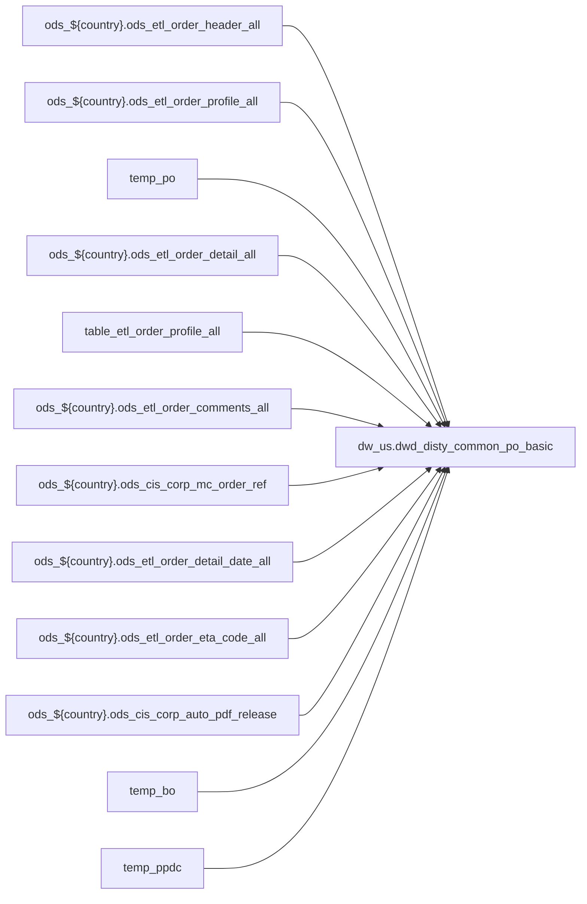

# FACT: Supplemental fact/context table used by select POS reports (`dw_us.dwd_disty_common_po_basic`)

- artifact_type: etl_table
- artifact_id: dw_us.dwd_disty_common_po_basic
- domain: pos
- one_line_purpose: POS-domain table with load SQL under bitbucket-etl (see L3); prior contract narrative preserved below when present.
- layer_type: DWD
- source_kind: etl_sql
- evidence_source: source/contracts/pos/bitbucket-etl/dwd_disty_common_po_basic/loading_po_basic.sql
- bitbucket_etl_bundle: source/contracts/pos/bitbucket-etl/dwd_disty_common_po_basic/
- related_etl_scripts:
- `source/contracts/pos/bitbucket-etl/dwd_disty_common_po_basic/get_date_flag.sql`

---

## L1 Data Foundation

### Identity and physical mapping
- **Table:** `dw_us.dwd_disty_common_po_basic`
- **Layer type:** DWD
- **Canonical / derived:** Derived / ETL-loaded (see L3 from bitbucket-etl)
- **Owner team:** Not documented in repository

### Grain, scope, exclusions
- See preserved **Grain and keys** section below when present (POS contract narrative retained).
- Otherwise infer from SELECT / GROUP BY / INSERT column list in `source/contracts/pos/bitbucket-etl/dwd_disty_common_po_basic/loading_po_basic.sql`.

### Cross-engine presence
| Engine | Present | Notes |
|--------|---------|-------|
| Hive | yes | ETL load target |
| Vertica | yes when POS contract documents Vertica sync | See preserved Business query tables |

### Physical schema reference

| Field | Value |
|-------|-------|
| **entity_id** | `dw_us.dwd_disty_common_po_basic` |
| **l1_catalog_seed** | `target/storage/wkb/snapshots/_snapshot_id_template/l1_catalog/{engine}_{schema}_{table}.json` |
| **column_count** | pending (run ddl_seed_writer) |
| **partition_keys** | See preserved Grain / L4 / ETL PARTITION clause |
| **ddl_source** | pending |
| **retrieval** | `python -m tools.wkb.indexing.run_query --query "pos dwd_disty_common_po_basic schema" --intent find_table_schema` |

### Lineage

- **Primary load:** `source/contracts/pos/bitbucket-etl/dwd_disty_common_po_basic/loading_po_basic.sql`
- **upstream:** `ods_${country}.ods_etl_order_header_all` — FROM/JOIN — `source/contracts/pos/bitbucket-etl/dwd_disty_common_po_basic/loading_po_basic.sql`
- **upstream:** `ods_${country}.ods_etl_order_profile_all` — FROM/JOIN — `source/contracts/pos/bitbucket-etl/dwd_disty_common_po_basic/loading_po_basic.sql`
- **upstream:** `temp_po` — FROM/JOIN — `source/contracts/pos/bitbucket-etl/dwd_disty_common_po_basic/loading_po_basic.sql`
- **upstream:** `ods_${country}.ods_etl_order_detail_all` — FROM/JOIN — `source/contracts/pos/bitbucket-etl/dwd_disty_common_po_basic/loading_po_basic.sql`
- **upstream:** `table_etl_order_profile_all` — FROM/JOIN — `source/contracts/pos/bitbucket-etl/dwd_disty_common_po_basic/loading_po_basic.sql`
- **upstream:** `ods_${country}.ods_etl_order_comments_all` — FROM/JOIN — `source/contracts/pos/bitbucket-etl/dwd_disty_common_po_basic/loading_po_basic.sql`
- **upstream:** `ods_${country}.ods_cis_corp_mc_order_ref` — FROM/JOIN — `source/contracts/pos/bitbucket-etl/dwd_disty_common_po_basic/loading_po_basic.sql`
- **upstream:** `ods_${country}.ods_etl_order_detail_date_all` — FROM/JOIN — `source/contracts/pos/bitbucket-etl/dwd_disty_common_po_basic/loading_po_basic.sql`
- **upstream:** `ods_${country}.ods_etl_order_eta_code_all` — FROM/JOIN — `source/contracts/pos/bitbucket-etl/dwd_disty_common_po_basic/loading_po_basic.sql`
- **upstream:** `ods_${country}.ods_cis_corp_auto_pdf_release` — FROM/JOIN — `source/contracts/pos/bitbucket-etl/dwd_disty_common_po_basic/loading_po_basic.sql`
- **upstream:** `temp_bo` — FROM/JOIN — `source/contracts/pos/bitbucket-etl/dwd_disty_common_po_basic/loading_po_basic.sql`
- **upstream:** `temp_ppdc` — FROM/JOIN — `source/contracts/pos/bitbucket-etl/dwd_disty_common_po_basic/loading_po_basic.sql`
- **upstream:** `ods_${country}.ods_cis_corp_ppdc_code` — FROM/JOIN — `source/contracts/pos/bitbucket-etl/dwd_disty_common_po_basic/loading_po_basic.sql`
- **upstream:** `temp_b2b` — FROM/JOIN — `source/contracts/pos/bitbucket-etl/dwd_disty_common_po_basic/loading_po_basic.sql`
- **upstream:** `temp_po_comment` — FROM/JOIN — `source/contracts/pos/bitbucket-etl/dwd_disty_common_po_basic/loading_po_basic.sql`
- **upstream:** `temp_aamount` — FROM/JOIN — `source/contracts/pos/bitbucket-etl/dwd_disty_common_po_basic/loading_po_basic.sql`
- **upstream:** `temp_currency_type` — FROM/JOIN — `source/contracts/pos/bitbucket-etl/dwd_disty_common_po_basic/loading_po_basic.sql`
- **upstream:** `temp_pay_method` — FROM/JOIN — `source/contracts/pos/bitbucket-etl/dwd_disty_common_po_basic/loading_po_basic.sql`
- **upstream:** `temp_confirmation` — FROM/JOIN — `source/contracts/pos/bitbucket-etl/dwd_disty_common_po_basic/loading_po_basic.sql`
- **upstream:** `temp_po_2` — FROM/JOIN — `source/contracts/pos/bitbucket-etl/dwd_disty_common_po_basic/loading_po_basic.sql`
- **downstream:** see L6 Downstream consumers
### Freshness and load path
- Parameters / date window: see ETL `${literal_*}` / `${date_flag}` / `${start_date}` in evidence script.
- Schedule: Not documented in repository

## L2 Declarative Knowledge

### Business purpose
See preserved **Business purpose** below when present (POS contract catalog + linked ETL).

### Audience and use cases
See preserved **Who it helps** section when present.

### Fact key resolution
See preserved **Grain and keys** when present.

### Time field semantics
- Prefer partition / `date_flag` filters documented in preserved sections and L3 Key filters from ETL.

### Metrics served
See preserved Metrics / column groups when present; otherwise L3 column derivations.

### Metric serving map
N/A unless multi-period wide table (see preserved content).

### etl_metrics
No new metric-index formulas appended in this bitbucket-etl upgrade pass.

## L3 Procedural Knowledge

### Query and routing rules
- Reporting: Vertica `dw_us.dwd_disty_common_po_basic` when synced (see preserved Business query tables).
- Load logic: bitbucket-etl evidence `source/contracts/pos/bitbucket-etl/dwd_disty_common_po_basic/loading_po_basic.sql`.

### Dimension join patterns
See Relationship map (ETL JOIN edges) and preserved contract join notes.

### Key filters and ETL business logic

| Predicate | Kind | Evidence |
|-----------|------|----------|
| `a.order_type in (2,87) and a.entry_datetime >= '${start_date}' ; create temporary table table_etl_order_profile_all as select * from ods_${country}.ods_etl_order_profile_all where (profile_type = '...` | Technical (load only) / Business | `source/contracts/pos/bitbucket-etl/dwd_disty_common_po_basic/loading_po_basic.sql` |
| `profile_type ='PROG_TYPE' and profile_cat = 'RIO' and active = 'Y'` | Business | `source/contracts/pos/bitbucket-etl/dwd_disty_common_po_basic/loading_po_basic.sql` |

### Standard time-filter SQL
```sql
-- Prefer date_flag / literal_start_date / literal_end_date as used in source/contracts/pos/bitbucket-etl/dwd_disty_common_po_basic/loading_po_basic.sql
```

### End-to-end flow


### Base tables register
| Object | Role |
|--------|------|
| `ods_${country}.ods_etl_order_header_all` | source / temp (FROM/JOIN) |
| `ods_${country}.ods_etl_order_profile_all` | source / temp (FROM/JOIN) |
| `temp_po` | source / temp (FROM/JOIN) |
| `ods_${country}.ods_etl_order_detail_all` | source / temp (FROM/JOIN) |
| `table_etl_order_profile_all` | source / temp (FROM/JOIN) |
| `ods_${country}.ods_etl_order_comments_all` | source / temp (FROM/JOIN) |
| `ods_${country}.ods_cis_corp_mc_order_ref` | source / temp (FROM/JOIN) |
| `ods_${country}.ods_etl_order_detail_date_all` | source / temp (FROM/JOIN) |
| `ods_${country}.ods_etl_order_eta_code_all` | source / temp (FROM/JOIN) |
| `ods_${country}.ods_cis_corp_auto_pdf_release` | source / temp (FROM/JOIN) |
| `temp_bo` | source / temp (FROM/JOIN) |
| `temp_ppdc` | source / temp (FROM/JOIN) |
| `ods_${country}.ods_cis_corp_ppdc_code` | source / temp (FROM/JOIN) |
| `temp_b2b` | source / temp (FROM/JOIN) |
| `temp_po_comment` | source / temp (FROM/JOIN) |
| `temp_aamount` | source / temp (FROM/JOIN) |
| `temp_currency_type` | source / temp (FROM/JOIN) |
| `temp_pay_method` | source / temp (FROM/JOIN) |
| `temp_confirmation` | source / temp (FROM/JOIN) |
| `temp_po_2` | source / temp (FROM/JOIN) |
| `ods_${country}.ods_cis_corp_ap_hold` | source / temp (FROM/JOIN) |
| `temp_doc` | source / temp (FROM/JOIN) |
| `ods_${country}.ods_cis_corp_vend_doc` | source / temp (FROM/JOIN) |
| `dim_${country}.dim_pub_part_info` | source / temp (FROM/JOIN) |
| `dim_${country}.dim_pub_location_info` | source / temp (FROM/JOIN) |

### Step-by-step logic
1. Execute load SQL / python in `source/contracts/pos/bitbucket-etl/dwd_disty_common_po_basic/`.
2. Apply date / business filters from ETL (Key filters).
3. Write target `dw_us.dwd_disty_common_po_basic` (see INSERT/OVERWRITE in evidence).

### Relationship map (embedded)

| from_fqn | to_fqn | cardinality | join_keys | provenance |
|----------|--------|-------------|-----------|------------|
| `ods_${country}.ods_etl_order_header_all` | `ods_${country}.ods_etl_order_detail_all` | many:1 | `a.order_no` = `b.order_no`; `a.order_type` = `b.order_type` | etl_sql (`source/contracts/pos/bitbucket-etl/dwd_disty_common_po_basic/loading_po_basic.sql:69`) |
| `dim_${country}.dim_pub_part_info` | `table_etl_order_profile_all` | many:1 | `b.order_no` = `c.order_no`; `b.order_type` = `c.order_type`; `b.order_line_no` = `c.order_line_no` | etl_sql (`source/contracts/pos/bitbucket-etl/dwd_disty_common_po_basic/loading_po_basic.sql:72`) |
| `ods_${country}.ods_etl_order_header_all` | `table_etl_order_profile_all` | many:1 | `a.order_no` = `b.order_no`; `a.order_type` = `b.order_type` | etl_sql (`source/contracts/pos/bitbucket-etl/dwd_disty_common_po_basic/loading_po_basic.sql:89`) |
| `ods_${country}.ods_etl_order_header_all` | `ods_${country}.ods_etl_order_comments_all` | many:1 | `a.order_no` = `b.order_no`; `a.order_type` = `b.order_type` | etl_sql (`source/contracts/pos/bitbucket-etl/dwd_disty_common_po_basic/loading_po_basic.sql:176`) |
| `dim_${country}.dim_pub_part_info` | `ods_${country}.ods_cis_corp_mc_order_ref` | many:1 | `b.order_no` = `c.int_ref_no`; `b.order_type` = `c.int_ref_type`; `b.order_line_no` = `c.int_ref_line_no` | etl_sql (`source/contracts/pos/bitbucket-etl/dwd_disty_common_po_basic/loading_po_basic.sql:198`) |
| `dim_${country}.dim_pub_part_info` | `ods_${country}.ods_etl_order_detail_date_all` | many:1 (LEFT) | `b.order_no` = `c.order_no`; `b.order_type` = `c.order_type`; `b.order_line_no` = `c.order_line_no` | etl_sql (`source/contracts/pos/bitbucket-etl/dwd_disty_common_po_basic/loading_po_basic.sql:284`) |
| `dim_${country}.dim_pub_part_info` | `ods_${country}.ods_etl_order_eta_code_all` | many:1 (LEFT) | `b.order_no` = `d.order_no`; `b.order_type` = `d.order_type`; `b.order_line_no` = `d.order_line_no` | etl_sql (`source/contracts/pos/bitbucket-etl/dwd_disty_common_po_basic/loading_po_basic.sql:288`) |
| `ods_${country}.ods_etl_order_header_all` | `ods_${country}.ods_cis_corp_auto_pdf_release` | many:1 (LEFT) | `e.order_no` = `a.order_no`; `e.order_type` = `a.order_type` | etl_sql (`source/contracts/pos/bitbucket-etl/dwd_disty_common_po_basic/loading_po_basic.sql:292`) |
| `ods_${country}.ods_etl_order_header_all` | `temp_bo` | many:1 (LEFT) | `f.order_no` = `b.order_no`; `f.order_type` = `b.order_type`; `f.order_line_no` = `b.order_line_no` | etl_sql (`source/contracts/pos/bitbucket-etl/dwd_disty_common_po_basic/loading_po_basic.sql:295`) |
| `dim_${country}.dim_pub_part_info` | `temp_ppdc` | many:1 (LEFT) | `b.order_no` = `pp.order_no`; `b.order_type` = `pp.order_type`; `b.order_line_no` = `pp.order_line_no` | etl_sql (`source/contracts/pos/bitbucket-etl/dwd_disty_common_po_basic/loading_po_basic.sql:299`) |
| `temp_ppdc` | `ods_${country}.ods_cis_corp_ppdc_code` | many:1 (LEFT) | `pp2.ppdc_code` = `pp.ppdc_code` | etl_sql (`source/contracts/pos/bitbucket-etl/dwd_disty_common_po_basic/loading_po_basic.sql:303`) |
| `ods_${country}.ods_etl_order_header_all` | `temp_b2b` | many:1 (LEFT) | `a.order_no` = `b2b.order_no`; `a.order_type` = `b2b.order_type` | etl_sql (`source/contracts/pos/bitbucket-etl/dwd_disty_common_po_basic/loading_po_basic.sql:305`) |
| `ods_${country}.ods_etl_order_header_all` | `temp_po_comment` | many:1 (LEFT) | `a.order_no` = `pc.order_no`; `a.order_type` = `pc.order_type` | etl_sql (`source/contracts/pos/bitbucket-etl/dwd_disty_common_po_basic/loading_po_basic.sql:308`) |
| `ods_${country}.ods_etl_order_header_all` | `temp_aamount` | many:1 (LEFT) | `a.order_no` = `pc2.order_no`; `a.order_type` = `pc2.order_type` | etl_sql (`source/contracts/pos/bitbucket-etl/dwd_disty_common_po_basic/loading_po_basic.sql:311`) |
| `ods_${country}.ods_etl_order_header_all` | `temp_currency_type` | many:1 (LEFT) | `a.order_no` = `pc3.order_no`; `a.order_type` = `pc3.order_type` | etl_sql (`source/contracts/pos/bitbucket-etl/dwd_disty_common_po_basic/loading_po_basic.sql:314`) |
| `ods_${country}.ods_etl_order_header_all` | `temp_pay_method` | many:1 (LEFT) | `a.order_no` = `pc4.order_no`; `a.order_type` = `pc4.order_type` | etl_sql (`source/contracts/pos/bitbucket-etl/dwd_disty_common_po_basic/loading_po_basic.sql:317`) |
| `ods_${country}.ods_etl_order_header_all` | `temp_confirmation` | many:1 (LEFT) | `a.order_no` = `pc5.order_no`; `a.order_type` = `pc5.order_type` | etl_sql (`source/contracts/pos/bitbucket-etl/dwd_disty_common_po_basic/loading_po_basic.sql:320`) |
| `ods_${country}.ods_etl_order_header_all` | `ods_${country}.ods_cis_corp_ap_hold` | many:1 | `b.order_no` = `a.order_no`; `b.order_type` = `a.order_type`; `b.order_line_no` = `a.order_line_no` | etl_sql (`source/contracts/pos/bitbucket-etl/dwd_disty_common_po_basic/loading_po_basic.sql:328`) |
| `ods_${country}.ods_etl_order_header_all` | `ods_${country}.ods_cis_corp_vend_doc` | many:1 (LEFT) | `a.doc_no` = `b.doc_no` | etl_sql (`source/contracts/pos/bitbucket-etl/dwd_disty_common_po_basic/loading_po_basic.sql:336`) |
| `ods_${country}.ods_etl_order_header_all` | `dim_${country}.dim_pub_part_info` | many:1 | `a.sku_no` = `b.sku_no` | etl_sql (`source/contracts/pos/bitbucket-etl/dwd_disty_common_po_basic/loading_po_basic.sql:443`) |
| `ods_${country}.ods_etl_order_header_all` | `dim_${country}.dim_pub_location_info` | many:1 (LEFT) | `a.to_loc_no` = `c.loc_no` | etl_sql (`source/contracts/pos/bitbucket-etl/dwd_disty_common_po_basic/loading_po_basic.sql:445`) |
| `ods_${country}.ods_etl_order_header_all` | `dim_${country}.dim_pub_customer_info` | many:1 (LEFT) | `a.cust_no` = `d.cust_no` | etl_sql (`source/contracts/pos/bitbucket-etl/dwd_disty_common_po_basic/loading_po_basic.sql:447`) |
| `ods_${country}.ods_etl_order_header_all` | `dim_${country}.dim_pub_manager` | many:1 (LEFT) | `a.entry_id` = `e.userid` | etl_sql (`source/contracts/pos/bitbucket-etl/dwd_disty_common_po_basic/loading_po_basic.sql:449`) |
| `ods_${country}.ods_etl_order_header_all` | `dim_${country}.dim_pub_manager` | many:1 (LEFT) | `a.delete_id` = `e2.userid` | etl_sql (`source/contracts/pos/bitbucket-etl/dwd_disty_common_po_basic/loading_po_basic.sql:451`) |
| `ods_${country}.ods_etl_order_header_all` | `temp_vend_doc` | many:1 (LEFT) | `a.order_no` = `f.order_no`; `a.order_line_no` = `f.order_line_no`; `a.order_type` = `f.order_type` | etl_sql (`source/contracts/pos/bitbucket-etl/dwd_disty_common_po_basic/loading_po_basic.sql:453`) |
| `ods_${country}.ods_etl_order_header_all` | `temp_profile_type` | many:1 (LEFT) | `a.order_no` = `pt.order_no`; `a.order_type` = `pt.order_type` | etl_sql (`source/contracts/pos/bitbucket-etl/dwd_disty_common_po_basic/loading_po_basic.sql:457`) |

### Special logic (embedded)

`source/ref/pos/special_logic.txt` exists but no rule naming this FQN/stem (`dw_us.dwd_disty_common_po_basic`).

Not documented in repository


### Column / field derivations (from ETL SQL)

| target_column | expression_sql | upstream_columns | upstream_tables | transform_kind | evidence |
|---------------|----------------|------------------|-----------------|----------------|----------|
| `order_no` | `a.order_no` | `order_no` | `temp_po_2`, `dim_${country}.dim_pub_part_info`, `dim_${country}.dim_pub_location_info`, `dim_${country}.dim_pub_customer_info`, `dim_${country}.dim_pub_manager`, `temp_vend_doc`, `temp_profile_type` | passthrough | `source/contracts/pos/bitbucket-etl/dwd_disty_common_po_basic/loading_po_basic.sql:4` |
| `order_type` | `a.order_type` | `order_type` | `temp_po_2`, `dim_${country}.dim_pub_part_info`, `dim_${country}.dim_pub_location_info`, `dim_${country}.dim_pub_customer_info`, `dim_${country}.dim_pub_manager`, `temp_vend_doc`, `temp_profile_type` | passthrough | `source/contracts/pos/bitbucket-etl/dwd_disty_common_po_basic/loading_po_basic.sql:5` |
| `order_line_no` | `a.order_line_no` | `order_line_no` | `temp_po_2`, `dim_${country}.dim_pub_part_info`, `dim_${country}.dim_pub_location_info`, `dim_${country}.dim_pub_customer_info`, `dim_${country}.dim_pub_manager`, `temp_vend_doc`, `temp_profile_type` | passthrough | `source/contracts/pos/bitbucket-etl/dwd_disty_common_po_basic/loading_po_basic.sql:326` |
| `from_loc_no` | `a.from_loc_no` | `from_loc_no` | `temp_po_2`, `dim_${country}.dim_pub_part_info`, `dim_${country}.dim_pub_location_info`, `dim_${country}.dim_pub_customer_info`, `dim_${country}.dim_pub_manager`, `temp_vend_doc`, `temp_profile_type` | passthrough | `source/contracts/pos/bitbucket-etl/dwd_disty_common_po_basic/loading_po_basic.sql:6` |
| `to_loc_no` | `a.to_loc_no` | `to_loc_no` | `temp_po_2`, `dim_${country}.dim_pub_part_info`, `dim_${country}.dim_pub_location_info`, `dim_${country}.dim_pub_customer_info`, `dim_${country}.dim_pub_manager`, `temp_vend_doc`, `temp_profile_type` | passthrough | `source/contracts/pos/bitbucket-etl/dwd_disty_common_po_basic/loading_po_basic.sql:7` |
| `to_loc_char` | `c.loc_char` | `loc_char` | `temp_po_2`, `dim_${country}.dim_pub_part_info`, `dim_${country}.dim_pub_location_info`, `dim_${country}.dim_pub_customer_info`, `dim_${country}.dim_pub_manager`, `temp_vend_doc`, `temp_profile_type` | rename | `source/contracts/pos/bitbucket-etl/dwd_disty_common_po_basic/loading_po_basic.sql:358` |
| `to_inv_type` | `a.to_inv_type` | `to_inv_type` | `temp_po_2`, `dim_${country}.dim_pub_part_info`, `dim_${country}.dim_pub_location_info`, `dim_${country}.dim_pub_customer_info`, `dim_${country}.dim_pub_manager`, `temp_vend_doc`, `temp_profile_type` | passthrough | `source/contracts/pos/bitbucket-etl/dwd_disty_common_po_basic/loading_po_basic.sql:8` |
| `sku_no` | `a.sku_no` | `sku_no` | `temp_po_2`, `dim_${country}.dim_pub_part_info`, `dim_${country}.dim_pub_location_info`, `dim_${country}.dim_pub_customer_info`, `dim_${country}.dim_pub_manager`, `temp_vend_doc`, `temp_profile_type` | passthrough | `source/contracts/pos/bitbucket-etl/dwd_disty_common_po_basic/loading_po_basic.sql:360` |
| `part_no` | `b.part_no` | `part_no` | `temp_po_2`, `dim_${country}.dim_pub_part_info`, `dim_${country}.dim_pub_location_info`, `dim_${country}.dim_pub_customer_info`, `dim_${country}.dim_pub_manager`, `temp_vend_doc`, `temp_profile_type` | passthrough | `source/contracts/pos/bitbucket-etl/dwd_disty_common_po_basic/loading_po_basic.sql:361` |
| `mfg_partno` | `b.mfg_partno` | `mfg_partno` | `temp_po_2`, `dim_${country}.dim_pub_part_info`, `dim_${country}.dim_pub_location_info`, `dim_${country}.dim_pub_customer_info`, `dim_${country}.dim_pub_manager`, `temp_vend_doc`, `temp_profile_type` | passthrough | `source/contracts/pos/bitbucket-etl/dwd_disty_common_po_basic/loading_po_basic.sql:362` |
| `short_desc` | `b.short_desc` | `short_desc` | `temp_po_2`, `dim_${country}.dim_pub_part_info`, `dim_${country}.dim_pub_location_info`, `dim_${country}.dim_pub_customer_info`, `dim_${country}.dim_pub_manager`, `temp_vend_doc`, `temp_profile_type` | passthrough | `source/contracts/pos/bitbucket-etl/dwd_disty_common_po_basic/loading_po_basic.sql:363` |
| `prod_code` | `b.prod_code` | `prod_code` | `temp_po_2`, `dim_${country}.dim_pub_part_info`, `dim_${country}.dim_pub_location_info`, `dim_${country}.dim_pub_customer_info`, `dim_${country}.dim_pub_manager`, `temp_vend_doc`, `temp_profile_type` | passthrough | `source/contracts/pos/bitbucket-etl/dwd_disty_common_po_basic/loading_po_basic.sql:364` |
| `vpl_no` | `b.vpl_no` | `vpl_no` | `temp_po_2`, `dim_${country}.dim_pub_part_info`, `dim_${country}.dim_pub_location_info`, `dim_${country}.dim_pub_customer_info`, `dim_${country}.dim_pub_manager`, `temp_vend_doc`, `temp_profile_type` | passthrough | `source/contracts/pos/bitbucket-etl/dwd_disty_common_po_basic/loading_po_basic.sql:365` |
| `vpl_code` | `b.vpl_code` | `vpl_code` | `temp_po_2`, `dim_${country}.dim_pub_part_info`, `dim_${country}.dim_pub_location_info`, `dim_${country}.dim_pub_customer_info`, `dim_${country}.dim_pub_manager`, `temp_vend_doc`, `temp_profile_type` | passthrough | `source/contracts/pos/bitbucket-etl/dwd_disty_common_po_basic/loading_po_basic.sql:366` |
| `vend_no` | `a.vend_no` | `vend_no` | `temp_po_2`, `dim_${country}.dim_pub_part_info`, `dim_${country}.dim_pub_location_info`, `dim_${country}.dim_pub_customer_info`, `dim_${country}.dim_pub_manager`, `temp_vend_doc`, `temp_profile_type` | passthrough | `source/contracts/pos/bitbucket-etl/dwd_disty_common_po_basic/loading_po_basic.sql:367` |
| `vend_name` | `b.vend_name` | `vend_name` | `temp_po_2`, `dim_${country}.dim_pub_part_info`, `dim_${country}.dim_pub_location_info`, `dim_${country}.dim_pub_customer_info`, `dim_${country}.dim_pub_manager`, `temp_vend_doc`, `temp_profile_type` | passthrough | `source/contracts/pos/bitbucket-etl/dwd_disty_common_po_basic/loading_po_basic.sql:368` |
| `vend_segment` | `b.vend_segment` | `vend_segment` | `temp_po_2`, `dim_${country}.dim_pub_part_info`, `dim_${country}.dim_pub_location_info`, `dim_${country}.dim_pub_customer_info`, `dim_${country}.dim_pub_manager`, `temp_vend_doc`, `temp_profile_type` | passthrough | `source/contracts/pos/bitbucket-etl/dwd_disty_common_po_basic/loading_po_basic.sql:369` |
| `vend_currency` | `b.vend_currency` | `vend_currency` | `temp_po_2`, `dim_${country}.dim_pub_part_info`, `dim_${country}.dim_pub_location_info`, `dim_${country}.dim_pub_customer_info`, `dim_${country}.dim_pub_manager`, `temp_vend_doc`, `temp_profile_type` | passthrough | `source/contracts/pos/bitbucket-etl/dwd_disty_common_po_basic/loading_po_basic.sql:370` |
| `universal_vend_no` | `b.universal_vend_no` | `universal_vend_no` | `temp_po_2`, `dim_${country}.dim_pub_part_info`, `dim_${country}.dim_pub_location_info`, `dim_${country}.dim_pub_customer_info`, `dim_${country}.dim_pub_manager`, `temp_vend_doc`, `temp_profile_type` | passthrough | `source/contracts/pos/bitbucket-etl/dwd_disty_common_po_basic/loading_po_basic.sql:371` |
| `universal_vend_name` | `b.universal_vend_name` | `universal_vend_name` | `temp_po_2`, `dim_${country}.dim_pub_part_info`, `dim_${country}.dim_pub_location_info`, `dim_${country}.dim_pub_customer_info`, `dim_${country}.dim_pub_manager`, `temp_vend_doc`, `temp_profile_type` | passthrough | `source/contracts/pos/bitbucket-etl/dwd_disty_common_po_basic/loading_po_basic.sql:372` |
| `order_qty` | `a.order_qty` | `order_qty` | `temp_po_2`, `dim_${country}.dim_pub_part_info`, `dim_${country}.dim_pub_location_info`, `dim_${country}.dim_pub_customer_info`, `dim_${country}.dim_pub_manager`, `temp_vend_doc`, `temp_profile_type` | passthrough | `source/contracts/pos/bitbucket-etl/dwd_disty_common_po_basic/loading_po_basic.sql:373` |
| `rec_qty` | `a.rec_qty` | `rec_qty` | `temp_po_2`, `dim_${country}.dim_pub_part_info`, `dim_${country}.dim_pub_location_info`, `dim_${country}.dim_pub_customer_info`, `dim_${country}.dim_pub_manager`, `temp_vend_doc`, `temp_profile_type` | passthrough | `source/contracts/pos/bitbucket-etl/dwd_disty_common_po_basic/loading_po_basic.sql:374` |
| `open_qty` | `a.open_qty` | `open_qty` | `temp_po_2`, `dim_${country}.dim_pub_part_info`, `dim_${country}.dim_pub_location_info`, `dim_${country}.dim_pub_customer_info`, `dim_${country}.dim_pub_manager`, `temp_vend_doc`, `temp_profile_type` | passthrough | `source/contracts/pos/bitbucket-etl/dwd_disty_common_po_basic/loading_po_basic.sql:375` |
| `unit_cost` | `a.unit_cost` | `unit_cost` | `temp_po_2`, `dim_${country}.dim_pub_part_info`, `dim_${country}.dim_pub_location_info`, `dim_${country}.dim_pub_customer_info`, `dim_${country}.dim_pub_manager`, `temp_vend_doc`, `temp_profile_type` | passthrough | `source/contracts/pos/bitbucket-etl/dwd_disty_common_po_basic/loading_po_basic.sql:376` |
| `unit_price` | `a.unit_price` | `unit_price` | `temp_po_2`, `dim_${country}.dim_pub_part_info`, `dim_${country}.dim_pub_location_info`, `dim_${country}.dim_pub_customer_info`, `dim_${country}.dim_pub_manager`, `temp_vend_doc`, `temp_profile_type` | passthrough | `source/contracts/pos/bitbucket-etl/dwd_disty_common_po_basic/loading_po_basic.sql:377` |
| `foreign_cost` | `a.foreign_cost` | `foreign_cost` | `temp_po_2`, `dim_${country}.dim_pub_part_info`, `dim_${country}.dim_pub_location_info`, `dim_${country}.dim_pub_customer_info`, `dim_${country}.dim_pub_manager`, `temp_vend_doc`, `temp_profile_type` | passthrough | `source/contracts/pos/bitbucket-etl/dwd_disty_common_po_basic/loading_po_basic.sql:378` |
| `foreign_price` | `a.foreign_price` | `foreign_price` | `temp_po_2`, `dim_${country}.dim_pub_part_info`, `dim_${country}.dim_pub_location_info`, `dim_${country}.dim_pub_customer_info`, `dim_${country}.dim_pub_manager`, `temp_vend_doc`, `temp_profile_type` | passthrough | `source/contracts/pos/bitbucket-etl/dwd_disty_common_po_basic/loading_po_basic.sql:379` |
| `fx_rate` | `a.fx_rate` | `fx_rate` | `temp_po_2`, `dim_${country}.dim_pub_part_info`, `dim_${country}.dim_pub_location_info`, `dim_${country}.dim_pub_customer_info`, `dim_${country}.dim_pub_manager`, `temp_vend_doc`, `temp_profile_type` | passthrough | `source/contracts/pos/bitbucket-etl/dwd_disty_common_po_basic/loading_po_basic.sql:380` |
| `po_cost` | `b.po_cost` | `po_cost` | `temp_po_2`, `dim_${country}.dim_pub_part_info`, `dim_${country}.dim_pub_location_info`, `dim_${country}.dim_pub_customer_info`, `dim_${country}.dim_pub_manager`, `temp_vend_doc`, `temp_profile_type` | passthrough | `source/contracts/pos/bitbucket-etl/dwd_disty_common_po_basic/loading_po_basic.sql:381` |
| `ave_cost` | `b.ave_cost` | `ave_cost` | `temp_po_2`, `dim_${country}.dim_pub_part_info`, `dim_${country}.dim_pub_location_info`, `dim_${country}.dim_pub_customer_info`, `dim_${country}.dim_pub_manager`, `temp_vend_doc`, `temp_profile_type` | passthrough | `source/contracts/pos/bitbucket-etl/dwd_disty_common_po_basic/loading_po_basic.sql:382` |
| `entry_datetime` | `a.entry_datetime` | `entry_datetime` | `temp_po_2`, `dim_${country}.dim_pub_part_info`, `dim_${country}.dim_pub_location_info`, `dim_${country}.dim_pub_customer_info`, `dim_${country}.dim_pub_manager`, `temp_vend_doc`, `temp_profile_type` | passthrough | `source/contracts/pos/bitbucket-etl/dwd_disty_common_po_basic/loading_po_basic.sql:11` |
| `issue_date` | `a.issue_date` | `issue_date` | `temp_po_2`, `dim_${country}.dim_pub_part_info`, `dim_${country}.dim_pub_location_info`, `dim_${country}.dim_pub_customer_info`, `dim_${country}.dim_pub_manager`, `temp_vend_doc`, `temp_profile_type` | passthrough | `source/contracts/pos/bitbucket-etl/dwd_disty_common_po_basic/loading_po_basic.sql:12` |
| `credit_rel_date` | `a.credit_rel_date` | `credit_rel_date` | `temp_po_2`, `dim_${country}.dim_pub_part_info`, `dim_${country}.dim_pub_location_info`, `dim_${country}.dim_pub_customer_info`, `dim_${country}.dim_pub_manager`, `temp_vend_doc`, `temp_profile_type` | passthrough | `source/contracts/pos/bitbucket-etl/dwd_disty_common_po_basic/loading_po_basic.sql:13` |
| `sales_rel_date` | `a.sales_rel_date` | `sales_rel_date` | `temp_po_2`, `dim_${country}.dim_pub_part_info`, `dim_${country}.dim_pub_location_info`, `dim_${country}.dim_pub_customer_info`, `dim_${country}.dim_pub_manager`, `temp_vend_doc`, `temp_profile_type` | passthrough | `source/contracts/pos/bitbucket-etl/dwd_disty_common_po_basic/loading_po_basic.sql:14` |
| `expected_date` | `a.expected_date` | `expected_date` | `temp_po_2`, `dim_${country}.dim_pub_part_info`, `dim_${country}.dim_pub_location_info`, `dim_${country}.dim_pub_customer_info`, `dim_${country}.dim_pub_manager`, `temp_vend_doc`, `temp_profile_type` | passthrough | `source/contracts/pos/bitbucket-etl/dwd_disty_common_po_basic/loading_po_basic.sql:15` |
| `receiving_date` | `a.receiving_date` | `receiving_date` | `temp_po_2`, `dim_${country}.dim_pub_part_info`, `dim_${country}.dim_pub_location_info`, `dim_${country}.dim_pub_customer_info`, `dim_${country}.dim_pub_manager`, `temp_vend_doc`, `temp_profile_type` | passthrough | `source/contracts/pos/bitbucket-etl/dwd_disty_common_po_basic/loading_po_basic.sql:16` |
| `printed_date` | `a.printed_date` | `printed_date` | `temp_po_2`, `dim_${country}.dim_pub_part_info`, `dim_${country}.dim_pub_location_info`, `dim_${country}.dim_pub_customer_info`, `dim_${country}.dim_pub_manager`, `temp_vend_doc`, `temp_profile_type` | passthrough | `source/contracts/pos/bitbucket-etl/dwd_disty_common_po_basic/loading_po_basic.sql:17` |
| `closed_date` | `a.closed_date` | `closed_date` | `temp_po_2`, `dim_${country}.dim_pub_part_info`, `dim_${country}.dim_pub_location_info`, `dim_${country}.dim_pub_customer_info`, `dim_${country}.dim_pub_manager`, `temp_vend_doc`, `temp_profile_type` | passthrough | `source/contracts/pos/bitbucket-etl/dwd_disty_common_po_basic/loading_po_basic.sql:18` |
| `delete_date` | `a.delete_date` | `delete_date` | `temp_po_2`, `dim_${country}.dim_pub_part_info`, `dim_${country}.dim_pub_location_info`, `dim_${country}.dim_pub_customer_info`, `dim_${country}.dim_pub_manager`, `temp_vend_doc`, `temp_profile_type` | passthrough | `source/contracts/pos/bitbucket-etl/dwd_disty_common_po_basic/loading_po_basic.sql:19` |
| `line_expected_date` | `a.line_expected_date` | `line_expected_date` | `temp_po_2`, `dim_${country}.dim_pub_part_info`, `dim_${country}.dim_pub_location_info`, `dim_${country}.dim_pub_customer_info`, `dim_${country}.dim_pub_manager`, `temp_vend_doc`, `temp_profile_type` | passthrough | `source/contracts/pos/bitbucket-etl/dwd_disty_common_po_basic/loading_po_basic.sql:392` |
| `eta_code` | `a.eta_code` | `eta_code` | `temp_po_2`, `dim_${country}.dim_pub_part_info`, `dim_${country}.dim_pub_location_info`, `dim_${country}.dim_pub_customer_info`, `dim_${country}.dim_pub_manager`, `temp_vend_doc`, `temp_profile_type` | passthrough | `source/contracts/pos/bitbucket-etl/dwd_disty_common_po_basic/loading_po_basic.sql:393` |
| `request_eta_date` | `a.request_eta_date` | `request_eta_date` | `temp_po_2`, `dim_${country}.dim_pub_part_info`, `dim_${country}.dim_pub_location_info`, `dim_${country}.dim_pub_customer_info`, `dim_${country}.dim_pub_manager`, `temp_vend_doc`, `temp_profile_type` | passthrough | `source/contracts/pos/bitbucket-etl/dwd_disty_common_po_basic/loading_po_basic.sql:394` |
| `line_rec_date` | `a.line_rec_date` | `line_rec_date` | `temp_po_2`, `dim_${country}.dim_pub_part_info`, `dim_${country}.dim_pub_location_info`, `dim_${country}.dim_pub_customer_info`, `dim_${country}.dim_pub_manager`, `temp_vend_doc`, `temp_profile_type` | passthrough | `source/contracts/pos/bitbucket-etl/dwd_disty_common_po_basic/loading_po_basic.sql:395` |
| `po_ship_date` | `a.po_ship_date` | `po_ship_date` | `temp_po_2`, `dim_${country}.dim_pub_part_info`, `dim_${country}.dim_pub_location_info`, `dim_${country}.dim_pub_customer_info`, `dim_${country}.dim_pub_manager`, `temp_vend_doc`, `temp_profile_type` | passthrough | `source/contracts/pos/bitbucket-etl/dwd_disty_common_po_basic/loading_po_basic.sql:396` |
| `line_delete_date` | `a.line_delete_date` | `line_delete_date` | `temp_po_2`, `dim_${country}.dim_pub_part_info`, `dim_${country}.dim_pub_location_info`, `dim_${country}.dim_pub_customer_info`, `dim_${country}.dim_pub_manager`, `temp_vend_doc`, `temp_profile_type` | passthrough | `source/contracts/pos/bitbucket-etl/dwd_disty_common_po_basic/loading_po_basic.sql:397` |
| `pdf_release_date` | `a.pdf_release_date` | `pdf_release_date` | `temp_po_2`, `dim_${country}.dim_pub_part_info`, `dim_${country}.dim_pub_location_info`, `dim_${country}.dim_pub_customer_info`, `dim_${country}.dim_pub_manager`, `temp_vend_doc`, `temp_profile_type` | passthrough | `source/contracts/pos/bitbucket-etl/dwd_disty_common_po_basic/loading_po_basic.sql:398` |
| `pdf_send_date` | `a.pdf_send_date` | `pdf_send_date` | `temp_po_2`, `dim_${country}.dim_pub_part_info`, `dim_${country}.dim_pub_location_info`, `dim_${country}.dim_pub_customer_info`, `dim_${country}.dim_pub_manager`, `temp_vend_doc`, `temp_profile_type` | passthrough | `source/contracts/pos/bitbucket-etl/dwd_disty_common_po_basic/loading_po_basic.sql:399` |
| `ext_ref` | `a.ext_ref` | `ext_ref` | `temp_po_2`, `dim_${country}.dim_pub_part_info`, `dim_${country}.dim_pub_location_info`, `dim_${country}.dim_pub_customer_info`, `dim_${country}.dim_pub_manager`, `temp_vend_doc`, `temp_profile_type` | passthrough | `source/contracts/pos/bitbucket-etl/dwd_disty_common_po_basic/loading_po_basic.sql:20` |
| `mso_no` | `a.mso_no` | `mso_no` | `temp_po_2`, `dim_${country}.dim_pub_part_info`, `dim_${country}.dim_pub_location_info`, `dim_${country}.dim_pub_customer_info`, `dim_${country}.dim_pub_manager`, `temp_vend_doc`, `temp_profile_type` | passthrough | `source/contracts/pos/bitbucket-etl/dwd_disty_common_po_basic/loading_po_basic.sql:401` |
| `mso_line_no` | `a.mso_line_no` | `mso_line_no` | `temp_po_2`, `dim_${country}.dim_pub_part_info`, `dim_${country}.dim_pub_location_info`, `dim_${country}.dim_pub_customer_info`, `dim_${country}.dim_pub_manager`, `temp_vend_doc`, `temp_profile_type` | passthrough | `source/contracts/pos/bitbucket-etl/dwd_disty_common_po_basic/loading_po_basic.sql:402` |
| `bo_no` | `a.bo_no` | `bo_no` | `temp_po_2`, `dim_${country}.dim_pub_part_info`, `dim_${country}.dim_pub_location_info`, `dim_${country}.dim_pub_customer_info`, `dim_${country}.dim_pub_manager`, `temp_vend_doc`, `temp_profile_type` | passthrough | `source/contracts/pos/bitbucket-etl/dwd_disty_common_po_basic/loading_po_basic.sql:403` |
| `cust_no` | `a.cust_no` | `cust_no` | `temp_po_2`, `dim_${country}.dim_pub_part_info`, `dim_${country}.dim_pub_location_info`, `dim_${country}.dim_pub_customer_info`, `dim_${country}.dim_pub_manager`, `temp_vend_doc`, `temp_profile_type` | passthrough | `source/contracts/pos/bitbucket-etl/dwd_disty_common_po_basic/loading_po_basic.sql:404` |
| `cust_name` | `d.cust_name` | `cust_name` | `temp_po_2`, `dim_${country}.dim_pub_part_info`, `dim_${country}.dim_pub_location_info`, `dim_${country}.dim_pub_customer_info`, `dim_${country}.dim_pub_manager`, `temp_vend_doc`, `temp_profile_type` | passthrough | `source/contracts/pos/bitbucket-etl/dwd_disty_common_po_basic/loading_po_basic.sql:405` |
| `ship_method` | `a.ship_method` | `ship_method` | `temp_po_2`, `dim_${country}.dim_pub_part_info`, `dim_${country}.dim_pub_location_info`, `dim_${country}.dim_pub_customer_info`, `dim_${country}.dim_pub_manager`, `temp_vend_doc`, `temp_profile_type` | passthrough | `source/contracts/pos/bitbucket-etl/dwd_disty_common_po_basic/loading_po_basic.sql:24` |
| `freight` | `a.freight` | `freight` | `temp_po_2`, `dim_${country}.dim_pub_part_info`, `dim_${country}.dim_pub_location_info`, `dim_${country}.dim_pub_customer_info`, `dim_${country}.dim_pub_manager`, `temp_vend_doc`, `temp_profile_type` | passthrough | `source/contracts/pos/bitbucket-etl/dwd_disty_common_po_basic/loading_po_basic.sql:25` |
| `terms_no` | `a.terms_no` | `terms_no` | `temp_po_2`, `dim_${country}.dim_pub_part_info`, `dim_${country}.dim_pub_location_info`, `dim_${country}.dim_pub_customer_info`, `dim_${country}.dim_pub_manager`, `temp_vend_doc`, `temp_profile_type` | passthrough | `source/contracts/pos/bitbucket-etl/dwd_disty_common_po_basic/loading_po_basic.sql:26` |
| `entry_id` | `a.entry_id` | `entry_id` | `temp_po_2`, `dim_${country}.dim_pub_part_info`, `dim_${country}.dim_pub_location_info`, `dim_${country}.dim_pub_customer_info`, `dim_${country}.dim_pub_manager`, `temp_vend_doc`, `temp_profile_type` | passthrough | `source/contracts/pos/bitbucket-etl/dwd_disty_common_po_basic/loading_po_basic.sql:27` |
| `entry_name` | `concat(if(e.firstname is null, '', e.firstname), ' ', if(e.lastname is null, '', e.lastname))` | `firstname`, `lastname` | `temp_po_2`, `dim_${country}.dim_pub_part_info`, `dim_${country}.dim_pub_location_info`, `dim_${country}.dim_pub_customer_info`, `dim_${country}.dim_pub_manager`, `temp_vend_doc`, `temp_profile_type` | udf | `source/contracts/pos/bitbucket-etl/dwd_disty_common_po_basic/loading_po_basic.sql:410` |
| `delete_id` | `a.delete_id` | `delete_id` | `temp_po_2`, `dim_${country}.dim_pub_part_info`, `dim_${country}.dim_pub_location_info`, `dim_${country}.dim_pub_customer_info`, `dim_${country}.dim_pub_manager`, `temp_vend_doc`, `temp_profile_type` | passthrough | `source/contracts/pos/bitbucket-etl/dwd_disty_common_po_basic/loading_po_basic.sql:28` |
| `delete_name` | `concat(if(e2.firstname is null, '', e2.firstname), ' ', if(e2.lastname is null, '', e2.lastname))` | `firstname`, `lastname` | `temp_po_2`, `dim_${country}.dim_pub_part_info`, `dim_${country}.dim_pub_location_info`, `dim_${country}.dim_pub_customer_info`, `dim_${country}.dim_pub_manager`, `temp_vend_doc`, `temp_profile_type` | udf | `source/contracts/pos/bitbucket-etl/dwd_disty_common_po_basic/loading_po_basic.sql:412` |
| `ppdc_code` | `a.ppdc_code` | `ppdc_code` | `temp_po_2`, `dim_${country}.dim_pub_part_info`, `dim_${country}.dim_pub_location_info`, `dim_${country}.dim_pub_customer_info`, `dim_${country}.dim_pub_manager`, `temp_vend_doc`, `temp_profile_type` | passthrough | `source/contracts/pos/bitbucket-etl/dwd_disty_common_po_basic/loading_po_basic.sql:413` |
| `ppdc_desc` | `a.ppdc_desc` | `ppdc_desc` | `temp_po_2`, `dim_${country}.dim_pub_part_info`, `dim_${country}.dim_pub_location_info`, `dim_${country}.dim_pub_customer_info`, `dim_${country}.dim_pub_manager`, `temp_vend_doc`, `temp_profile_type` | passthrough | `source/contracts/pos/bitbucket-etl/dwd_disty_common_po_basic/loading_po_basic.sql:414` |
| `back2back_flag` | `a.back2back_flag` | `back2back_flag` | `temp_po_2`, `dim_${country}.dim_pub_part_info`, `dim_${country}.dim_pub_location_info`, `dim_${country}.dim_pub_customer_info`, `dim_${country}.dim_pub_manager`, `temp_vend_doc`, `temp_profile_type` | passthrough | `source/contracts/pos/bitbucket-etl/dwd_disty_common_po_basic/loading_po_basic.sql:415` |
| `internal_comments` | `a.internal_comments` | `internal_comments` | `temp_po_2`, `dim_${country}.dim_pub_part_info`, `dim_${country}.dim_pub_location_info`, `dim_${country}.dim_pub_customer_info`, `dim_${country}.dim_pub_manager`, `temp_vend_doc`, `temp_profile_type` | passthrough | `source/contracts/pos/bitbucket-etl/dwd_disty_common_po_basic/loading_po_basic.sql:416` |
| `vpl_desc` | `b.vpl_desc` | `vpl_desc` | `temp_po_2`, `dim_${country}.dim_pub_part_info`, `dim_${country}.dim_pub_location_info`, `dim_${country}.dim_pub_customer_info`, `dim_${country}.dim_pub_manager`, `temp_vend_doc`, `temp_profile_type` | passthrough | `source/contracts/pos/bitbucket-etl/dwd_disty_common_po_basic/loading_po_basic.sql:417` |
| `total_cost` | `a.total_cost` | `total_cost` | `temp_po_2`, `dim_${country}.dim_pub_part_info`, `dim_${country}.dim_pub_location_info`, `dim_${country}.dim_pub_customer_info`, `dim_${country}.dim_pub_manager`, `temp_vend_doc`, `temp_profile_type` | passthrough | `source/contracts/pos/bitbucket-etl/dwd_disty_common_po_basic/loading_po_basic.sql:10` |
| `a_amount` | `a.a_amount` | `a_amount` | `temp_po_2`, `dim_${country}.dim_pub_part_info`, `dim_${country}.dim_pub_location_info`, `dim_${country}.dim_pub_customer_info`, `dim_${country}.dim_pub_manager`, `temp_vend_doc`, `temp_profile_type` | passthrough | `source/contracts/pos/bitbucket-etl/dwd_disty_common_po_basic/loading_po_basic.sql:419` |
| `currency_type` | `a.currency_type` | `currency_type` | `temp_po_2`, `dim_${country}.dim_pub_part_info`, `dim_${country}.dim_pub_location_info`, `dim_${country}.dim_pub_customer_info`, `dim_${country}.dim_pub_manager`, `temp_vend_doc`, `temp_profile_type` | passthrough | `source/contracts/pos/bitbucket-etl/dwd_disty_common_po_basic/loading_po_basic.sql:420` |
| `pay_method` | `a.pay_method` | `pay_method` | `temp_po_2`, `dim_${country}.dim_pub_part_info`, `dim_${country}.dim_pub_location_info`, `dim_${country}.dim_pub_customer_info`, `dim_${country}.dim_pub_manager`, `temp_vend_doc`, `temp_profile_type` | passthrough | `source/contracts/pos/bitbucket-etl/dwd_disty_common_po_basic/loading_po_basic.sql:421` |
| `po_confirmation` | `a.po_confirmation` | `po_confirmation` | `temp_po_2`, `dim_${country}.dim_pub_part_info`, `dim_${country}.dim_pub_location_info`, `dim_${country}.dim_pub_customer_info`, `dim_${country}.dim_pub_manager`, `temp_vend_doc`, `temp_profile_type` | passthrough | `source/contracts/pos/bitbucket-etl/dwd_disty_common_po_basic/loading_po_basic.sql:422` |
| `inv_type` | `a.inv_type` | `inv_type` | `temp_po_2`, `dim_${country}.dim_pub_part_info`, `dim_${country}.dim_pub_location_info`, `dim_${country}.dim_pub_customer_info`, `dim_${country}.dim_pub_manager`, `temp_vend_doc`, `temp_profile_type` | passthrough | `source/contracts/pos/bitbucket-etl/dwd_disty_common_po_basic/loading_po_basic.sql:423` |
| `ship_to_name` | `a.ship_to_name` | `ship_to_name` | `temp_po_2`, `dim_${country}.dim_pub_part_info`, `dim_${country}.dim_pub_location_info`, `dim_${country}.dim_pub_customer_info`, `dim_${country}.dim_pub_manager`, `temp_vend_doc`, `temp_profile_type` | passthrough | `source/contracts/pos/bitbucket-etl/dwd_disty_common_po_basic/loading_po_basic.sql:29` |
| `ship_to_addr` | `a.ship_to_addr` | `ship_to_addr` | `temp_po_2`, `dim_${country}.dim_pub_part_info`, `dim_${country}.dim_pub_location_info`, `dim_${country}.dim_pub_customer_info`, `dim_${country}.dim_pub_manager`, `temp_vend_doc`, `temp_profile_type` | passthrough | `source/contracts/pos/bitbucket-etl/dwd_disty_common_po_basic/loading_po_basic.sql:30` |
| `ship_to_po_box` | `a.ship_to_po_box` | `ship_to_po_box` | `temp_po_2`, `dim_${country}.dim_pub_part_info`, `dim_${country}.dim_pub_location_info`, `dim_${country}.dim_pub_customer_info`, `dim_${country}.dim_pub_manager`, `temp_vend_doc`, `temp_profile_type` | passthrough | `source/contracts/pos/bitbucket-etl/dwd_disty_common_po_basic/loading_po_basic.sql:31` |
| `ship_to_city` | `a.ship_to_city` | `ship_to_city` | `temp_po_2`, `dim_${country}.dim_pub_part_info`, `dim_${country}.dim_pub_location_info`, `dim_${country}.dim_pub_customer_info`, `dim_${country}.dim_pub_manager`, `temp_vend_doc`, `temp_profile_type` | passthrough | `source/contracts/pos/bitbucket-etl/dwd_disty_common_po_basic/loading_po_basic.sql:32` |
| `ship_to_state` | `a.ship_to_state` | `ship_to_state` | `temp_po_2`, `dim_${country}.dim_pub_part_info`, `dim_${country}.dim_pub_location_info`, `dim_${country}.dim_pub_customer_info`, `dim_${country}.dim_pub_manager`, `temp_vend_doc`, `temp_profile_type` | passthrough | `source/contracts/pos/bitbucket-etl/dwd_disty_common_po_basic/loading_po_basic.sql:33` |
| `ship_to_country` | `a.ship_to_country` | `ship_to_country` | `temp_po_2`, `dim_${country}.dim_pub_part_info`, `dim_${country}.dim_pub_location_info`, `dim_${country}.dim_pub_customer_info`, `dim_${country}.dim_pub_manager`, `temp_vend_doc`, `temp_profile_type` | passthrough | `source/contracts/pos/bitbucket-etl/dwd_disty_common_po_basic/loading_po_basic.sql:34` |
| `ship_to_zip` | `a.ship_to_zip` | `ship_to_zip` | `temp_po_2`, `dim_${country}.dim_pub_part_info`, `dim_${country}.dim_pub_location_info`, `dim_${country}.dim_pub_customer_info`, `dim_${country}.dim_pub_manager`, `temp_vend_doc`, `temp_profile_type` | passthrough | `source/contracts/pos/bitbucket-etl/dwd_disty_common_po_basic/loading_po_basic.sql:35` |
| `schedule_date` | `a.schedule_date` | `schedule_date` | `temp_po_2`, `dim_${country}.dim_pub_part_info`, `dim_${country}.dim_pub_location_info`, `dim_${country}.dim_pub_customer_info`, `dim_${country}.dim_pub_manager`, `temp_vend_doc`, `temp_profile_type` | passthrough | `source/contracts/pos/bitbucket-etl/dwd_disty_common_po_basic/loading_po_basic.sql:36` |
| `pick_date` | `a.pick_date` | `pick_date` | `temp_po_2`, `dim_${country}.dim_pub_part_info`, `dim_${country}.dim_pub_location_info`, `dim_${country}.dim_pub_customer_info`, `dim_${country}.dim_pub_manager`, `temp_vend_doc`, `temp_profile_type` | passthrough | `source/contracts/pos/bitbucket-etl/dwd_disty_common_po_basic/loading_po_basic.sql:37` |

_Additional 9 columns parsed; see `python -m tools.ingest.sql_column_derivation` for full list._


### Sentinel and code values
See preserved content and ETL CASE expressions in column derivations.

## L4 Validation

### Resolved partition value
- Partition / date parameters from ETL literals — concrete calendar values Not documented in repository (resolve via Azkaban when flow evidence exists).

### Data quality checks
See preserved Validation SQL when present.

### Validation SQL
Prefer preserved Vertica validation bundle when present; MCP business SQL not re-run during documentation.

### Caveats for interpretation
- Document upgraded additively from POS **contract** MD + **bitbucket-etl** SQL. Prior contract text is under **Preserved pre-L1-L6 content** when present.

### Conflicts and open questions
- Companion loader scripts may also appear under other domain KB folders; see `target/knowledgebase/pos/readme.md` cross-links.

## L5 Runtime View

### Query path and engine preference
| Path | Engine | Evidence |
|------|--------|----------|
| Load | Hive/Spark | `source/contracts/pos/bitbucket-etl/dwd_disty_common_po_basic/loading_po_basic.sql` |
| Report | Vertica | preserved POS contract when present |

### Access constraints
Not documented in repository

### Query risk profile
- Always filter `date_flag` / documented partition keys before wide scans.

## L6 Access and Consumption

### Primary consumers and use cases
See preserved audience / POS report consumers when present.

### Representative query patterns
See preserved Validation SQL / contract examples when present.

### Dependencies and notes

#### Upstream objects (verified)
| Object | Usage | Evidence |
|--------|-------|----------|
| `ods_${country}.ods_etl_order_header_all` | FROM/JOIN | `source/contracts/pos/bitbucket-etl/dwd_disty_common_po_basic/loading_po_basic.sql` |
| `ods_${country}.ods_etl_order_profile_all` | FROM/JOIN | `source/contracts/pos/bitbucket-etl/dwd_disty_common_po_basic/loading_po_basic.sql` |
| `temp_po` | FROM/JOIN | `source/contracts/pos/bitbucket-etl/dwd_disty_common_po_basic/loading_po_basic.sql` |
| `ods_${country}.ods_etl_order_detail_all` | FROM/JOIN | `source/contracts/pos/bitbucket-etl/dwd_disty_common_po_basic/loading_po_basic.sql` |
| `table_etl_order_profile_all` | FROM/JOIN | `source/contracts/pos/bitbucket-etl/dwd_disty_common_po_basic/loading_po_basic.sql` |
| `ods_${country}.ods_etl_order_comments_all` | FROM/JOIN | `source/contracts/pos/bitbucket-etl/dwd_disty_common_po_basic/loading_po_basic.sql` |
| `ods_${country}.ods_cis_corp_mc_order_ref` | FROM/JOIN | `source/contracts/pos/bitbucket-etl/dwd_disty_common_po_basic/loading_po_basic.sql` |
| `ods_${country}.ods_etl_order_detail_date_all` | FROM/JOIN | `source/contracts/pos/bitbucket-etl/dwd_disty_common_po_basic/loading_po_basic.sql` |
| `ods_${country}.ods_etl_order_eta_code_all` | FROM/JOIN | `source/contracts/pos/bitbucket-etl/dwd_disty_common_po_basic/loading_po_basic.sql` |
| `ods_${country}.ods_cis_corp_auto_pdf_release` | FROM/JOIN | `source/contracts/pos/bitbucket-etl/dwd_disty_common_po_basic/loading_po_basic.sql` |
| `temp_bo` | FROM/JOIN | `source/contracts/pos/bitbucket-etl/dwd_disty_common_po_basic/loading_po_basic.sql` |
| `temp_ppdc` | FROM/JOIN | `source/contracts/pos/bitbucket-etl/dwd_disty_common_po_basic/loading_po_basic.sql` |
| `ods_${country}.ods_cis_corp_ppdc_code` | FROM/JOIN | `source/contracts/pos/bitbucket-etl/dwd_disty_common_po_basic/loading_po_basic.sql` |
| `temp_b2b` | FROM/JOIN | `source/contracts/pos/bitbucket-etl/dwd_disty_common_po_basic/loading_po_basic.sql` |
| `temp_po_comment` | FROM/JOIN | `source/contracts/pos/bitbucket-etl/dwd_disty_common_po_basic/loading_po_basic.sql` |
| `temp_aamount` | FROM/JOIN | `source/contracts/pos/bitbucket-etl/dwd_disty_common_po_basic/loading_po_basic.sql` |
| `temp_currency_type` | FROM/JOIN | `source/contracts/pos/bitbucket-etl/dwd_disty_common_po_basic/loading_po_basic.sql` |
| `temp_pay_method` | FROM/JOIN | `source/contracts/pos/bitbucket-etl/dwd_disty_common_po_basic/loading_po_basic.sql` |
| `temp_confirmation` | FROM/JOIN | `source/contracts/pos/bitbucket-etl/dwd_disty_common_po_basic/loading_po_basic.sql` |
| `temp_po_2` | FROM/JOIN | `source/contracts/pos/bitbucket-etl/dwd_disty_common_po_basic/loading_po_basic.sql` |
| `ods_${country}.ods_cis_corp_ap_hold` | FROM/JOIN | `source/contracts/pos/bitbucket-etl/dwd_disty_common_po_basic/loading_po_basic.sql` |
| `temp_doc` | FROM/JOIN | `source/contracts/pos/bitbucket-etl/dwd_disty_common_po_basic/loading_po_basic.sql` |
| `ods_${country}.ods_cis_corp_vend_doc` | FROM/JOIN | `source/contracts/pos/bitbucket-etl/dwd_disty_common_po_basic/loading_po_basic.sql` |
| `dim_${country}.dim_pub_part_info` | FROM/JOIN | `source/contracts/pos/bitbucket-etl/dwd_disty_common_po_basic/loading_po_basic.sql` |
| `dim_${country}.dim_pub_location_info` | FROM/JOIN | `source/contracts/pos/bitbucket-etl/dwd_disty_common_po_basic/loading_po_basic.sql` |

#### Downstream consumers (verified)

| Object / script | Evidence |
|-----------------|----------|
| POS / RDS reports (contract) | preserved sections when present |
| Related loaders | see related_etl_scripts header |
| KB / contract ref: `source/contracts/pos/bitbucket-etl/MANIFEST.md` | `source/contracts/pos/bitbucket-etl/MANIFEST.md:168` |
| KB / contract ref: `source/contracts/pos/tables/dwd_disty_common_po_basic.md` | `source/contracts/pos/tables/dwd_disty_common_po_basic.md:5` |
| ETL/script ref: `source/contracts/rds/vertica_vpo/etl/vpo_ap_balance_open_po_rds_16242.sql` | `source/contracts/rds/vertica_vpo/etl/vpo_ap_balance_open_po_rds_16242.sql:101` |
| ETL/script ref: `source/contracts/rds/vertica_vpo/etl/vpo_inventory_open_dropship_pos_qty_rds_18517.sql` | `source/contracts/rds/vertica_vpo/etl/vpo_inventory_open_dropship_pos_qty_rds_18517.sql:104` |
| ETL/script ref: `source/contracts/rds/vertica_vpo/etl/vpo_open_po_scm_spa_ref_rds_17736.sql` | `source/contracts/rds/vertica_vpo/etl/vpo_open_po_scm_spa_ref_rds_17736.sql:17` |
| ETL/script ref: `source/contracts/rds/vertica_vpo/etl/vpo_open_po_status_customer_part_carton_rds_16874.sql` | `source/contracts/rds/vertica_vpo/etl/vpo_open_po_status_customer_part_carton_rds_16874.sql:50` |
| ETL/script ref: `source/contracts/rds/vertica_vpo/etl/vpo_pos_doc_fallback_cedm_serial_rds_610.sql` | `source/contracts/rds/vertica_vpo/etl/vpo_pos_doc_fallback_cedm_serial_rds_610.sql:185` |
| ETL/script ref: `source/contracts/rds/vertica_vpo/etl/vpo_recent_closed_po_prodcode_rds_9751.sql` | `source/contracts/rds/vertica_vpo/etl/vpo_recent_closed_po_prodcode_rds_9751.sql:21` |
| KB / contract ref: `source/contracts/rds/vertica_vpo/examples-index.md` | `source/contracts/rds/vertica_vpo/examples-index.md:15` |
| KB / contract ref: `target/knowledgebase/RDS/vertica_vpo/vpo_ap_balance_open_po_rds_16242.md` | `target/knowledgebase/RDS/vertica_vpo/vpo_ap_balance_open_po_rds_16242.md:53` |
| KB / contract ref: `target/knowledgebase/RDS/vertica_vpo/vpo_inventory_open_dropship_pos_qty_rds_18517.md` | `target/knowledgebase/RDS/vertica_vpo/vpo_inventory_open_dropship_pos_qty_rds_18517.md:54` |
| KB / contract ref: `target/knowledgebase/RDS/vertica_vpo/vpo_open_po_scm_spa_ref_rds_17736.md` | `target/knowledgebase/RDS/vertica_vpo/vpo_open_po_scm_spa_ref_rds_17736.md:51` |
| KB / contract ref: `target/knowledgebase/RDS/vertica_vpo/vpo_open_po_status_customer_part_carton_rds_16874.md` | `target/knowledgebase/RDS/vertica_vpo/vpo_open_po_status_customer_part_carton_rds_16874.md:51` |
| KB / contract ref: `target/knowledgebase/RDS/vertica_vpo/vpo_pos_doc_fallback_cedm_serial_rds_610.md` | `target/knowledgebase/RDS/vertica_vpo/vpo_pos_doc_fallback_cedm_serial_rds_610.md:59` |
| KB / contract ref: `target/knowledgebase/RDS/vertica_vpo/vpo_recent_closed_po_prodcode_rds_9751.md` | `target/knowledgebase/RDS/vertica_vpo/vpo_recent_closed_po_prodcode_rds_9751.md:51` |
| KB / contract ref: `target/knowledgebase/pos/readme.md` | `target/knowledgebase/pos/readme.md:59` |

#### Operational detail (verified)
- Bundle: `source/contracts/pos/bitbucket-etl/dwd_disty_common_po_basic/`
- Manifest: `source/contracts/pos/bitbucket-etl/MANIFEST.md`

#### Not documented in repository
- Schedule, owner, SLA

---

## Preserved pre-L1-L6 content

> Retained verbatim from the prior POS contract knowledgebase document (nothing removed). ETL load evidence above supplements this catalog narrative.


**Domain:** pos  
**Source contract:** `C:\Users\T154858D.TDSNX\Desktop\git_repo_v1\data_analysis_agent_brpt\knowledge\POS\tables\dwd_disty_common_po_basic.md`  
**Knowledgebase path:** `target/knowledgebase/pos/dwd_disty_common_po_basic.md`

## Business purpose

Supplemental fact/context table used by select POS reports

This document is derived from the POS table contract catalog. ETL script lineage for load jobs is **not documented in this repository** unless listed under verified dependencies below.

---

## What the process does (high level)

| Stage | Business meaning |
|-------|------------------|
| **Catalog object** | `dw_us.dwd_disty_common_po_basic` — FACT layer table used in US POS reporting (`US POS baseline`). |
| **Consumption** | Queried from Vertica for POS/RDS reports, exports, and enrichment joins. |

**Parameters:** Country schema pattern `dw_us` (US baseline documented as `dw_us` / `dim_us`).

---

## Who it helps and how

| Audience | How they benefit |
|----------|-----------------|
| **POS / RDS reporting** | Vertica RDS POS custom reports (499 scripts scanned: US 367, CA 124, MX 7, BR 1) |
| **Sales analytics** | Order, customer, product, and margin attributes at documented grain. |
| **Data engineering** | Stable table contract for joins to POS hub and downstream exports. |

---

## Business query tables (Vertica)

| Role | Hive object | Vertica object | Sync mode | Evidence | MCP verified |
|------|-------------|----------------|-----------|----------|--------------|
| **Query for reporting** | `dw_us.dwd_disty_common_po_basic` | `dw_us.dwd_disty_common_po_basic` | overwrite / incremental | POS contract `dwd_disty_common_po_basic.md:L1` | yes (POS contract v2 — Vertica verified in source catalog) |
| **Hive alternative** | `dw_us.dwd_disty_common_po_basic` | same as reporting table | - | POS contract cross-engine note | - |
| **ETL internal** | n/a | n/a | - | ETL not in wiki repo | - |

Business users should query **`dw_us.dwd_disty_common_po_basic`** in Vertica for POS-domain reporting aligned to this contract.

---

## Grain and keys

- **Grain:** See natural key columns from POS contract column catalog.
- **Partition:** None explicit — full-table dimension or non-partitioned object per POS contract.
- **Natural key:** `order_no`, `order_type`, `order_line_no`, `from_loc_no`, `to_loc_no`, `sku_no`
- **Exclusions (reporting):** None documented in POS contract.

---

## Validation SQL (Vertica)

```sql
-- 1) Row count by partition
SELECT date_flag, COUNT(*) AS row_cnt
FROM dw_us.dwd_disty_common_po_basic
WHERE date_flag = '${partition_value}'
GROUP BY date_flag;

-- 2) Metric sum by business dimension (top N)
SELECT order_no, COUNT(*) AS row_cnt
FROM dw_us.dwd_disty_common_po_basic
WHERE date_flag = '${partition_value}'
GROUP BY order_no
ORDER BY COUNT(*) DESC
LIMIT 20;

-- 3) Grain duplicate check
SELECT order_no, order_type, order_line_no, date_flag, COUNT(*) AS cnt
FROM dw_us.dwd_disty_common_po_basic
WHERE date_flag = '${partition_value}'
GROUP BY order_no, order_type, order_line_no, date_flag
HAVING COUNT(*) > 1;
```

Replace `${partition_value}` with the resolved business date or period from the report scope.

---

## Data you can fetch and use downstream

### Core measures

- `order_qty` — order qty
- `rec_qty` — rec qty
- `open_qty` — open qty
- `unit_cost` — unit cost
- `unit_price` — unit price
- `foreign_cost` — foreign cost
- `foreign_price` — foreign price
- `fx_rate` — fx rate
- `po_cost` — po cost
- `ave_cost` — ave cost
- `total_cost` — total cost
- `a_amount` — a amount
- `total_order` — total order
- `head_exp_total` — head exp total

### Dimension and key columns

- `order_no` — order no
- `order_type` — order type
- `order_line_no` — order line no
- `from_loc_no` — from loc no
- `to_loc_no` — to loc no
- `to_loc_char` — to loc char
- `to_inv_type` — to inv type
- `sku_no` — sku no
- `part_no` — part no
- `mfg_partno` — mfg partno
- `short_desc` — short desc
- `prod_code` — prod code
- `vpl_no` — vpl no
- `vpl_code` — vpl code
- `vend_no` — vend no
- `vend_name` — vend name
- `vend_segment` — vend segment
- `vend_currency` — vend currency
- `universal_vend_no` — universal vend no
- `universal_vend_name` — universal vend name
- `entry_datetime` — entry datetime
- `issue_date` — issue date
- `credit_rel_date` — credit rel date
- `sales_rel_date` — sales rel date
- `expected_date` — expected date
- `receiving_date` — receiving date
- `printed_date` — printed date
- `closed_date` — closed date
- `delete_date` — delete date
- `line_expected_date` — line expected date

---

## Metrics business users typically care about

When exposing this table to the business, lead with measure and key columns from the POS contract catalog (see **Data you can fetch** above).

---

## End-to-end flow (summary)

**Target table:** `dw_us.dwd_disty_common_po_basic`  
**Load pattern:** Not documented in repository

1. Upstream: Curated DWD/DIM/ODS load jobs in disty common pipeline
2. Table available in Hive and Vertica for POS consumption.
3. Downstream: Vertica RDS POS report scripts (`rds_*_rtv`), ad-hoc POS exports


---

## Base tables register

| Object | Role in this job |
|--------|-----------------|
| `dw_us.dwd_disty_common_po_basic` | Primary catalog table documented from POS contract |

---

## Step-by-step logic

Not applicable — this Knowledgebase entry is a **table catalog** converted from POS contract v2. ETL step-by-step logic is not present in this wiki repository.

**Standard POS filters (from contract L3):**

- Standard POS filters inherited from domain-knowledge.md when joining to hub.

---

## Caveats for interpretation

- Derived from POS contract v2; ETL SQL and Azkaban flow names are not verified in this repository unless cited below.
- US schema `dw_us` documented as baseline; CA/MX/BR use same table names with regional scope.
- - Verify grain keys (`order_no`, `order_type`, `order_line_no`) not null for fact joins when applicable.
- For one-to-many partners (SPA/SCM, serial), validate row counts before joining to hub.
- Hub: `extend_net_price` should align with `(unit_net_price * ship_qty)` within rounding tolerance when both populated.
- Validate join cardinality to POS hub before production report use.

---

## Dependencies and notes (verified only)

### Upstream objects (verified)

| Object | Usage | Evidence |
|--------|-------|----------|
| POS contract source | Table metadata, grain, columns | `C:\Users\T154858D.TDSNX\Desktop\git_repo_v1\data_analysis_agent_brpt\knowledge\POS\tables\dwd_disty_common_po_basic.md` |

### Downstream consumers (verified)

| Object / script | Evidence |
|-----------------|----------|
| POS RDS / export consumers | `dwd_disty_common_po_basic.md:L6` — Vertica RDS POS report scripts (`rds_*_rtv`), ad-hoc POS exports |

### Operational detail (verified)

- Freshness: Not documented in repository
- Column count: 89 (POS contract catalog)

### Not documented in repository

- ETL SQL load script and Azkaban `.flow` for this table
- hive2vertica sync job file:line evidence
- Schedule, owner, SLA

### Related scripts (verified)

None identified in repository.

---

*Document generated from POS contract `C:\Users\T154858D.TDSNX\Desktop\git_repo_v1\data_analysis_agent_brpt\knowledge\POS\tables\dwd_disty_common_po_basic.md`.*