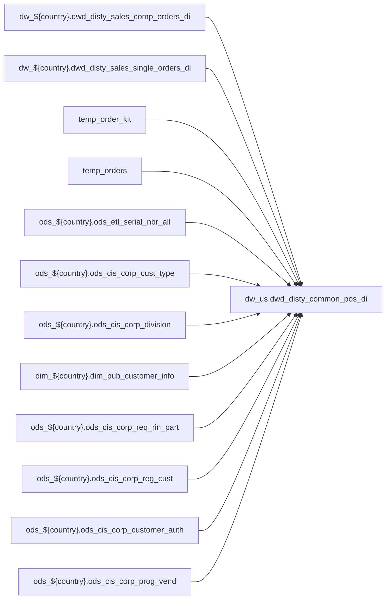

# DWD: US shipped POS order-line fact (`dw_us.dwd_disty_common_pos_di`)

- artifact_type: etl_table
- artifact_id: dw_us.dwd_disty_common_pos_di
- domain: pos
- one_line_purpose: POS-domain table with load SQL under bitbucket-etl (see L3); prior contract narrative preserved below when present.
- layer_type: DWD
- source_kind: etl_sql
- evidence_source: source/contracts/pos/bitbucket-etl/dwd_disty_common_pos_di/loading_pos_data.sql
- bitbucket_etl_bundle: source/contracts/pos/bitbucket-etl/dwd_disty_common_pos_di/
- related_etl_scripts:
- `source/contracts/pos/bitbucket-etl/dwd_disty_common_pos_di/duplicate_pos_di_check.sql`
- `source/contracts/pos/bitbucket-etl/dwd_disty_common_pos_di/get_date_flag.sql`
- `source/contracts/pos/bitbucket-etl/dwd_disty_common_pos_di/loading_pos_data_hyve.sql`
- `source/contracts/pos/bitbucket-etl/dwd_disty_common_pos_di/z_pos_reload_get_parameter.py`
- `source/contracts/pos/bitbucket-etl/dwd_disty_common_pos_di/z_pos_reload_his_data.py`
- `source/contracts/pos/bitbucket-etl/dwd_disty_common_pos_di/z_pos_reload_ngm_tgm_opl.py`

---

## L1 Data Foundation

### Identity and physical mapping
- **Table:** `dw_us.dwd_disty_common_pos_di`
- **Layer type:** DWD
- **Canonical / derived:** Derived / ETL-loaded (see L3 from bitbucket-etl)
- **Owner team:** Not documented in repository

### Grain, scope, exclusions
- See preserved **Grain and keys** section below when present (POS contract narrative retained).
- Otherwise infer from SELECT / GROUP BY / INSERT column list in `source/contracts/pos/bitbucket-etl/dwd_disty_common_pos_di/loading_pos_data.sql`.

### Cross-engine presence
| Engine | Present | Notes |
|--------|---------|-------|
| Hive | yes | ETL load target |
| Vertica | yes when POS contract documents Vertica sync | See preserved Business query tables |

### Physical schema reference

| Field | Value |
|-------|-------|
| **entity_id** | `dw_us.dwd_disty_common_pos_di` |
| **l1_catalog_seed** | `target/storage/wkb/snapshots/_snapshot_id_template/l1_catalog/{engine}_{schema}_{table}.json` |
| **column_count** | pending (run ddl_seed_writer) |
| **partition_keys** | See preserved Grain / L4 / ETL PARTITION clause |
| **ddl_source** | pending |
| **retrieval** | `python -m tools.wkb.indexing.run_query --query "pos dwd_disty_common_pos_di schema" --intent find_table_schema` |

### Lineage

- **Primary load:** `source/contracts/pos/bitbucket-etl/dwd_disty_common_pos_di/loading_pos_data.sql`
- **upstream:** `dw_${country}.dwd_disty_sales_comp_orders_di` — FROM/JOIN — `source/contracts/pos/bitbucket-etl/dwd_disty_common_pos_di/loading_pos_data.sql`
- **upstream:** `dw_${country}.dwd_disty_sales_single_orders_di` — FROM/JOIN — `source/contracts/pos/bitbucket-etl/dwd_disty_common_pos_di/loading_pos_data.sql`
- **upstream:** `temp_order_kit` — FROM/JOIN — `source/contracts/pos/bitbucket-etl/dwd_disty_common_pos_di/loading_pos_data.sql`
- **upstream:** `temp_orders` — FROM/JOIN — `source/contracts/pos/bitbucket-etl/dwd_disty_common_pos_di/loading_pos_data.sql`
- **upstream:** `ods_${country}.ods_etl_serial_nbr_all` — FROM/JOIN — `source/contracts/pos/bitbucket-etl/dwd_disty_common_pos_di/loading_pos_data.sql`
- **upstream:** `ods_${country}.ods_cis_corp_cust_type` — FROM/JOIN — `source/contracts/pos/bitbucket-etl/dwd_disty_common_pos_di/loading_pos_data.sql`
- **upstream:** `ods_${country}.ods_cis_corp_division` — FROM/JOIN — `source/contracts/pos/bitbucket-etl/dwd_disty_common_pos_di/loading_pos_data.sql`
- **upstream:** `dim_${country}.dim_pub_customer_info` — FROM/JOIN — `source/contracts/pos/bitbucket-etl/dwd_disty_common_pos_di/loading_pos_data.sql`
- **upstream:** `ods_${country}.ods_cis_corp_req_rin_part` — FROM/JOIN — `source/contracts/pos/bitbucket-etl/dwd_disty_common_pos_di/loading_pos_data.sql`
- **upstream:** `ods_${country}.ods_cis_corp_reg_cust` — FROM/JOIN — `source/contracts/pos/bitbucket-etl/dwd_disty_common_pos_di/loading_pos_data.sql`
- **upstream:** `ods_${country}.ods_cis_corp_customer_auth` — FROM/JOIN — `source/contracts/pos/bitbucket-etl/dwd_disty_common_pos_di/loading_pos_data.sql`
- **upstream:** `ods_${country}.ods_cis_corp_prog_vend` — FROM/JOIN — `source/contracts/pos/bitbucket-etl/dwd_disty_common_pos_di/loading_pos_data.sql`
- **upstream:** `dw_${country}.dwd_pub_common_history_header_extend_df` — FROM/JOIN — `source/contracts/pos/bitbucket-etl/dwd_disty_common_pos_di/loading_pos_data.sql`
- **upstream:** `ods_${country}.ods_cis_corp_from_ref_type` — FROM/JOIN — `source/contracts/pos/bitbucket-etl/dwd_disty_common_pos_di/loading_pos_data.sql`
- **upstream:** `temp_order_2` — FROM/JOIN — `source/contracts/pos/bitbucket-etl/dwd_disty_common_pos_di/loading_pos_data.sql`
- **upstream:** `ods_${country}.ods_etl_order_detail_all` — FROM/JOIN — `source/contracts/pos/bitbucket-etl/dwd_disty_common_pos_di/loading_pos_data.sql`
- **upstream:** `dw_${country}.dwd_pub_shipped_order_detail_di` — FROM/JOIN — `source/contracts/pos/bitbucket-etl/dwd_disty_common_pos_di/loading_pos_data.sql`
- **upstream:** `temp_detail_extend` — FROM/JOIN — `source/contracts/pos/bitbucket-etl/dwd_disty_common_pos_di/loading_pos_data.sql`
- **upstream:** `t_po` — FROM/JOIN — `source/contracts/pos/bitbucket-etl/dwd_disty_common_pos_di/loading_pos_data.sql`
- **upstream:** `po_header` — FROM/JOIN — `source/contracts/pos/bitbucket-etl/dwd_disty_common_pos_di/loading_pos_data.sql`
- **downstream:** see L6 Downstream consumers
### Freshness and load path
- Parameters / date window: see ETL `${literal_*}` / `${date_flag}` / `${start_date}` in evidence script.
- Schedule: Not documented in repository

## L2 Declarative Knowledge

### Business purpose
See preserved **Business purpose** below when present (POS contract catalog + linked ETL).

### Audience and use cases
See preserved **Who it helps** section when present.

### Fact key resolution
See preserved **Grain and keys** when present.

### Time field semantics
- Prefer partition / `date_flag` filters documented in preserved sections and L3 Key filters from ETL.

### Metrics served
See preserved Metrics / column groups when present; otherwise L3 column derivations.

### Metric serving map
N/A unless multi-period wide table (see preserved content).

### etl_metrics
No new metric-index formulas appended in this bitbucket-etl upgrade pass.

## L3 Procedural Knowledge

### Query and routing rules
- Reporting: Vertica `dw_us.dwd_disty_common_pos_di` when synced (see preserved Business query tables).
- Load logic: bitbucket-etl evidence `source/contracts/pos/bitbucket-etl/dwd_disty_common_pos_di/loading_pos_data.sql`.

### Dimension join patterns
See Relationship map (ETL JOIN edges) and preserved contract join notes.

### Key filters and ETL business logic

| Predicate | Kind | Evidence |
|-----------|------|----------|
| `a.date_flag >= '${start_date}' and a.date_flag <= '${end_date}' and a.terr_status='n'` | Technical (load only) / Business | `source/contracts/pos/bitbucket-etl/dwd_disty_common_pos_di/loading_pos_data.sql` |
| `a.date_flag >= '${start_date}' and a.date_flag <= '${end_date}' and a.terr_status='n' union all select a.date_flag,a.order_no, a.order_type,a.order_line_no, a.kit_line_no, 'Comp' as order_line_type...` | Technical (load only) / Business | `source/contracts/pos/bitbucket-etl/dwd_disty_common_pos_di/loading_pos_data.sql` |
| `c.hold_flag = 'N' and d.validate = 'Y'` | Business | `source/contracts/pos/bitbucket-etl/dwd_disty_common_pos_di/loading_pos_data.sql` |
| `c.hold_flag = 'N' --and d.validate = 'Y' --` | Business | `source/contracts/pos/bitbucket-etl/dwd_disty_common_pos_di/loading_pos_data.sql` |
| `date_flag= '${last_date}') b left join ods_${country}.ods_cis_corp_from_ref_type f on b.from_ref_type = f.from_ref_type join temp_order_2 od on b.order_no = od.order_no and b.order_type = od.order_...` | Technical (load only) / Business | `source/contracts/pos/bitbucket-etl/dwd_disty_common_pos_di/loading_pos_data.sql` |

### Standard time-filter SQL
```sql
-- Prefer date_flag / literal_start_date / literal_end_date as used in source/contracts/pos/bitbucket-etl/dwd_disty_common_pos_di/loading_pos_data.sql
```

### End-to-end flow


### Base tables register
| Object | Role |
|--------|------|
| `dw_${country}.dwd_disty_sales_comp_orders_di` | source / temp (FROM/JOIN) |
| `dw_${country}.dwd_disty_sales_single_orders_di` | source / temp (FROM/JOIN) |
| `temp_order_kit` | source / temp (FROM/JOIN) |
| `temp_orders` | source / temp (FROM/JOIN) |
| `ods_${country}.ods_etl_serial_nbr_all` | source / temp (FROM/JOIN) |
| `ods_${country}.ods_cis_corp_cust_type` | source / temp (FROM/JOIN) |
| `ods_${country}.ods_cis_corp_division` | source / temp (FROM/JOIN) |
| `dim_${country}.dim_pub_customer_info` | source / temp (FROM/JOIN) |
| `ods_${country}.ods_cis_corp_req_rin_part` | source / temp (FROM/JOIN) |
| `ods_${country}.ods_cis_corp_reg_cust` | source / temp (FROM/JOIN) |
| `ods_${country}.ods_cis_corp_customer_auth` | source / temp (FROM/JOIN) |
| `ods_${country}.ods_cis_corp_prog_vend` | source / temp (FROM/JOIN) |
| `dw_${country}.dwd_pub_common_history_header_extend_df` | source / temp (FROM/JOIN) |
| `ods_${country}.ods_cis_corp_from_ref_type` | source / temp (FROM/JOIN) |
| `temp_order_2` | source / temp (FROM/JOIN) |
| `ods_${country}.ods_etl_order_detail_all` | source / temp (FROM/JOIN) |
| `dw_${country}.dwd_pub_shipped_order_detail_di` | source / temp (FROM/JOIN) |
| `temp_detail_extend` | source / temp (FROM/JOIN) |
| `t_po` | source / temp (FROM/JOIN) |
| `po_header` | source / temp (FROM/JOIN) |
| `t_sso` | source / temp (FROM/JOIN) |
| `temp_po_mso` | source / temp (FROM/JOIN) |
| `temp_cpo` | source / temp (FROM/JOIN) |
| `dim_${country}.dim_pub_sales_hierarchy_by_terr_user_role` | source / temp (FROM/JOIN) |
| `dw_${country}.dwd_pub_shipped_order_profile_di` | source / temp (FROM/JOIN) |

### Step-by-step logic
1. Execute load SQL / python in `source/contracts/pos/bitbucket-etl/dwd_disty_common_pos_di/`.
2. Apply date / business filters from ETL (Key filters).
3. Write target `dw_us.dwd_disty_common_pos_di` (see INSERT/OVERWRITE in evidence).

### Relationship map (embedded)

| from_fqn | to_fqn | cardinality | join_keys | provenance |
|----------|--------|-------------|-----------|------------|
| `ods_${country}.ods_etl_order_profile_all` | `temp_order_kit` | many:1 (LEFT) | `b2.order_no` = `a.order_no`; `b2.order_type` = `a.order_type`; `b2.kit_line_no` = `a.order_line_no` | etl_sql (`source/contracts/pos/bitbucket-etl/dwd_disty_common_pos_di/loading_pos_data.sql:57`) |
| `ods_${country}.ods_etl_order_profile_all` | `ods_${country}.ods_etl_serial_nbr_all` | many:1 | `a.order_no` = `b.order_no`; `a.order_type` = `b.order_type`; `a.order_line_no` = `b.order_line_no` | etl_sql (`source/contracts/pos/bitbucket-etl/dwd_disty_common_pos_di/loading_pos_data.sql:121`) |
| `ods_${country}.ods_etl_order_profile_all` | `dim_${country}.dim_pub_customer_info` | many:1 | `e.cust_no` = `a.cust_no` | etl_sql (`source/contracts/pos/bitbucket-etl/dwd_disty_common_pos_di/loading_pos_data.sql:144`) |
| `dw_${country}.dwd_disty_sales_comp_orders_di` | `ods_${country}.ods_cis_corp_req_rin_part` | many:1 | `p.sku_no` = `a.sku_no` | etl_sql (`source/contracts/pos/bitbucket-etl/dwd_disty_common_pos_di/loading_pos_data.sql:145`) |
| `ods_${country}.ods_cis_corp_prog_vend` | `ods_${country}.ods_cis_corp_reg_cust` | many:1 | `p.program_id` = `c.program_id` | etl_sql (`source/contracts/pos/bitbucket-etl/dwd_disty_common_pos_di/loading_pos_data.sql:146`) |
| `dw_${country}.dwd_disty_sales_comp_orders_di` | `ods_${country}.ods_cis_corp_customer_auth` | many:1 | `d.program_id` = `c.program_id` | etl_sql (`source/contracts/pos/bitbucket-etl/dwd_disty_common_pos_di/loading_pos_data.sql:147`) |
| `ods_${country}.ods_etl_order_profile_all` | `ods_${country}.ods_cis_corp_prog_vend` | many:1 | `p.vend_no` = `a.vend_no` | etl_sql (`source/contracts/pos/bitbucket-etl/dwd_disty_common_pos_di/loading_pos_data.sql:160`) |
| `temp_cpo_1` | `ods_${country}.ods_cis_corp_from_ref_type` | many:1 (LEFT) | `b.from_ref_type` = `f.from_ref_type` | etl_sql (`source/contracts/pos/bitbucket-etl/dwd_disty_common_pos_di/loading_pos_data.sql:240`) |
| `temp_cpo_1` | `temp_order_2` | many:1 | `b.order_no` = `od.order_no`; `b.order_type` = `od.order_type` | etl_sql (`source/contracts/pos/bitbucket-etl/dwd_disty_common_pos_di/loading_pos_data.sql:242`) |
| `so` | `t_po` | many:1 | `so.int_ref_no` = `po.synnex_po_no`; `so.int_ref_line_no` = `po.synnex_po_line_no`; `so.int_ref_type` = `po.synnex_po_type` | etl_sql (`source/contracts/pos/bitbucket-etl/dwd_disty_common_pos_di/loading_pos_data.sql:289`) |
| `so` | `po_header` | many:1 | `so.int_ref_no` = `po.synnex_po_no`; `so.int_ref_type` = `po.synnex_po_type` | etl_sql (`source/contracts/pos/bitbucket-etl/dwd_disty_common_pos_di/loading_pos_data.sql:301`) |
| `t` | `temp_detail_extend` | many:1 (LEFT) | `t.mso_no` = `t2.order_no`; `t.mso_line_no` = `t2.order_line_no` | etl_sql (`source/contracts/pos/bitbucket-etl/dwd_disty_common_pos_di/loading_pos_data.sql:309`) |
| `ods_${country}.ods_etl_order_profile_all` | `temp_cpo` | many:1 (LEFT) | `a.order_no` = `b.order_no`; `a.order_type` = `b.order_type` | etl_sql (`source/contracts/pos/bitbucket-etl/dwd_disty_common_pos_di/loading_pos_data.sql:340`) |
| `dw_${country}.dwd_disty_sales_comp_orders_di` | `temp_detail_extend` | many:1 | `b3.int_ref_type` = `a.order_type`; `b3.int_ref_no` = `a.order_no`; `b3.int_ref_line_no` = `a.order_line_no` | etl_sql (`source/contracts/pos/bitbucket-etl/dwd_disty_common_pos_di/loading_pos_data.sql:349`) |
| `ods_${country}.ods_etl_order_profile_all` | `temp_header_extend` | many:1 | `a.profile_i` = `b.int_ref_no` | etl_sql (`source/contracts/pos/bitbucket-etl/dwd_disty_common_pos_di/loading_pos_data.sql:418`) |
| `ods_${country}.ods_etl_order_profile_all` | `ods_${country}.ods_cis_corp_history_comments` | many:1 | `a.order_no` = `b.order_no`; `a.order_type` = `b.order_type` | etl_sql (`source/contracts/pos/bitbucket-etl/dwd_disty_common_pos_di/loading_pos_data.sql:432`) |
| `ods_${country}.ods_etl_order_profile_all` | `temp_header_extend` | many:1 (LEFT) | `a.order_no` = `b.order_no`; `a.order_type` = `b.order_type` | etl_sql (`source/contracts/pos/bitbucket-etl/dwd_disty_common_pos_di/loading_pos_data.sql:636`) |
| `ods_${country}.ods_etl_order_profile_all` | `temp_order_detail` | many:1 (LEFT) | `b1.order_no` = `a.order_no`; `b1.order_type` = `a.order_type`; `b1.order_line_no` = `a.order_line_no` | etl_sql (`source/contracts/pos/bitbucket-etl/dwd_disty_common_pos_di/loading_pos_data.sql:638`) |
| `ods_${country}.ods_etl_order_profile_all` | `temp_csgn_po` | many:1 (LEFT) | `b3.order_type` = `a.order_type`; `b3.order_no` = `a.order_no`; `b3.order_line_no` = `a.order_line_no` | etl_sql (`source/contracts/pos/bitbucket-etl/dwd_disty_common_pos_di/loading_pos_data.sql:640`) |
| `ods_${country}.ods_etl_order_profile_all` | `temp_mso_line` | many:1 (LEFT) | `b4.order_no` = `a.order_no`; `b4.order_type` = `a.order_type`; `b4.order_line_no` = `a.order_line_no` | etl_sql (`source/contracts/pos/bitbucket-etl/dwd_disty_common_pos_di/loading_pos_data.sql:641`) |
| `dw_${country}.dwd_disty_sales_comp_orders_di` | `dim_${country}.dim_pub_part_info` | many:1 (LEFT) | `c.sku_no` = `a.sku_no` | etl_sql (`source/contracts/pos/bitbucket-etl/dwd_disty_common_pos_di/loading_pos_data.sql:643`) |
| `dw_${country}.dwd_disty_sales_comp_orders_di` | `temp_sales_rep` | many:1 (LEFT) | `d.sales_terr` = `a.cust_terr` | etl_sql (`source/contracts/pos/bitbucket-etl/dwd_disty_common_pos_di/loading_pos_data.sql:644`) |
| `temp_eu_data_2` | `dim_${country}.dim_pub_manager` | many:1 (LEFT) | `d1.userid` = `d.user_id` | etl_sql (`source/contracts/pos/bitbucket-etl/dwd_disty_common_pos_di/loading_pos_data.sql:645`) |
| `dim_${country}.dim_pub_manager` | `dim_${country}.dim_pub_location_info` | many:1 (LEFT) | `d2.loc_no` = `d1.user_loc` | etl_sql (`source/contracts/pos/bitbucket-etl/dwd_disty_common_pos_di/loading_pos_data.sql:646`) |
| `ods_${country}.ods_etl_order_profile_all` | `dim_${country}.dim_pub_order_type` | many:1 (LEFT) | `g.order_type` = `a.order_type` | etl_sql (`source/contracts/pos/bitbucket-etl/dwd_disty_common_pos_di/loading_pos_data.sql:648`) |
| `temp_cpo_1` | `dim_${country}.dim_pub_manager` | many:1 (LEFT) | `g1.userid` = `b.entry_id` | etl_sql (`source/contracts/pos/bitbucket-etl/dwd_disty_common_pos_di/loading_pos_data.sql:649`) |
| `ods_${country}.ods_etl_order_profile_all` | `dim_${country}.dim_pub_gv_user_type` | many:1 (LEFT) | `h.gv_user_type` = `a.gv_user_type` | etl_sql (`source/contracts/pos/bitbucket-etl/dwd_disty_common_pos_di/loading_pos_data.sql:650`) |
| `ods_${country}.ods_etl_order_profile_all` | `temp_order_pl` | many:1 (LEFT) | `pl.order_no` = `a.order_no`; `pl.order_type` = `a.order_type`; `pl.order_line_no` = `a.order_line_no`; `pl.date_flag` = `a.date_flag` | etl_sql (`source/contracts/pos/bitbucket-etl/dwd_disty_common_pos_di/loading_pos_data.sql:651`) |
| `ods_${country}.ods_etl_order_profile_all` | `temp_auth_info` | many:1 (LEFT) | `au.sku_no` = `a.sku_no`; `au.cust_no` = `a.cust_no` | etl_sql (`source/contracts/pos/bitbucket-etl/dwd_disty_common_pos_di/loading_pos_data.sql:653`) |
| `ods_${country}.ods_etl_order_profile_all` | `temp_auth_info_vend` | many:1 (LEFT) | `au1.sku_no` = `a.sku_no`; `au1.cust_no` = `a.cust_no` | etl_sql (`source/contracts/pos/bitbucket-etl/dwd_disty_common_pos_di/loading_pos_data.sql:654`) |
| `ods_${country}.ods_etl_order_profile_all` | `temp_order_serial` | many:1 (LEFT) | `se.order_no` = `a.order_no`; `se.order_type` = `a.order_type`; `se.order_line_no` = `a.order_line_no` | etl_sql (`source/contracts/pos/bitbucket-etl/dwd_disty_common_pos_di/loading_pos_data.sql:655`) |
| `ods_${country}.ods_etl_order_profile_all` | `dim_${country}.dim_pub_location_info` | many:1 (LEFT) | `loc.loc_no` = `a.from_loc_no` | etl_sql (`source/contracts/pos/bitbucket-etl/dwd_disty_common_pos_di/loading_pos_data.sql:656`) |
| `ods_${country}.ods_etl_order_profile_all` | `temp_cust_type` | many:1 (LEFT) | `ter.cust_type` = `a.cust_type` | etl_sql (`source/contracts/pos/bitbucket-etl/dwd_disty_common_pos_di/loading_pos_data.sql:657`) |
| `temp_cust_type` | `temp_division` | many:1 (LEFT) | `ter2.division` = `ter.division` | etl_sql (`source/contracts/pos/bitbucket-etl/dwd_disty_common_pos_di/loading_pos_data.sql:658`) |
| `ods_${country}.ods_etl_order_profile_all` | `temp_spec_cost` | many:1 (LEFT) | `a.order_no` = `sc.order_no`; `a.order_type` = `sc.order_type`; `a.order_line_no` = `sc.order_line_no` | etl_sql (`source/contracts/pos/bitbucket-etl/dwd_disty_common_pos_di/loading_pos_data.sql:659`) |
| `ods_${country}.ods_etl_order_profile_all` | `temp_syn_po_price` | many:1 (LEFT) | `a.order_no` = `spp.order_no`; `a.order_type` = `spp.order_type`; `a.order_line_no` = `spp.order_line_no` | etl_sql (`source/contracts/pos/bitbucket-etl/dwd_disty_common_pos_di/loading_pos_data.sql:660`) |
| `ods_${country}.ods_etl_order_profile_all` | `temp_ot125_mpo` | many:1 (LEFT) | `a.order_no` = `mpo.order_no`; `a.order_type` = `mpo.order_type` | etl_sql (`source/contracts/pos/bitbucket-etl/dwd_disty_common_pos_di/loading_pos_data.sql:661`) |
| `ods_${country}.ods_etl_order_profile_all` | `temp_order_ec` | many:1 (LEFT) | `a.order_no` = `ec.order_no`; `a.order_type` = `ec.order_type` | etl_sql (`source/contracts/pos/bitbucket-etl/dwd_disty_common_pos_di/loading_pos_data.sql:662`) |
| `ods_${country}.ods_etl_order_profile_all` | `ods_${country}.ods_cis_corp_history_cpo_header` | many:1 | `a.cpo_id` = `b.cpo_id` | etl_sql (`source/contracts/pos/bitbucket-etl/dwd_disty_common_pos_di/loading_pos_data.sql:670`) |
| `ods_${country}.ods_etl_order_profile_all` | `ods_${country}.ods_cis_corp_cpo_header` | many:1 | `a.cpo_id` = `b.cpo_id` | etl_sql (`source/contracts/pos/bitbucket-etl/dwd_disty_common_pos_di/loading_pos_data.sql:676`) |
| `ods_${country}.ods_cis_corp_cpo_profile` | `temp_final_1` | many:1 | `cp.cpo_id` = `b.cpo_id` | etl_sql (`source/contracts/pos/bitbucket-etl/dwd_disty_common_pos_di/loading_pos_data.sql:690`) |
| `th` | `dw_${country}.dwd_stellr_billing_history_di` | many:1 | `st.order_no` = `th.order_no`; `st.order_type` = `th.order_type` | etl_sql (`source/contracts/pos/bitbucket-etl/dwd_disty_common_pos_di/loading_pos_data.sql:727`) |
| `ods_${country}.ods_etl_order_profile_all` | `dw_${country}.dwd_stellr_subscription_contract_rtv2_df` | many:1 (LEFT) | `a.contract_no` = `b.contract_no`; `a.contract_type` = `b.contract_type` | etl_sql (`source/contracts/pos/bitbucket-etl/dwd_disty_common_pos_di/loading_pos_data.sql:735`) |
| `ods_${country}.ods_etl_order_profile_all` | `ods_${country}.ods_cis_corp_history_header` | many:1 | `a.order_no` = `hh.order_no`; `a.order_type` = `hh.order_type` | etl_sql (`source/contracts/pos/bitbucket-etl/dwd_disty_common_pos_di/loading_pos_data.sql:753`) |
| `ods_${country}.ods_cis_corp_history_header` | `ods_${country}.ods_cis_corp_contacts` | many:1 | `hh.to_contact_no` = `c.contact_no` | etl_sql (`source/contracts/pos/bitbucket-etl/dwd_disty_common_pos_di/loading_pos_data.sql:756`) |
| `ods_${country}.ods_etl_order_profile_all` | `ods_${country}.ods_cis_corp_addr_xref` | many:1 | `a.bill_to_cust` = `ax.xref_no` | etl_sql (`source/contracts/pos/bitbucket-etl/dwd_disty_common_pos_di/loading_pos_data.sql:776`) |
| `ods_${country}.ods_cis_corp_addr_xref` | `ods_${country}.ods_cis_corp_contact_xref` | many:1 | `cx.xref_no` = `ax.addr_no` | etl_sql (`source/contracts/pos/bitbucket-etl/dwd_disty_common_pos_di/loading_pos_data.sql:779`) |
| `ods_${country}.ods_cis_corp_contact_xref` | `ods_${country}.ods_cis_corp_contacts` | many:1 | `cc.contact_no` = `cx.contact_no` | etl_sql (`source/contracts/pos/bitbucket-etl/dwd_disty_common_pos_di/loading_pos_data.sql:781`) |
| `ods_${country}.ods_cis_corp_addr_xref` | `ods_${country}.ods_cis_corp_addr_profile` | many:1 (LEFT) | `pc.addr_no` = `ax.addr_no` | etl_sql (`source/contracts/pos/bitbucket-etl/dwd_disty_common_pos_di/loading_pos_data.sql:797`) |
| `ods_${country}.ods_cis_corp_addr_profile` | `ods_${country}.ods_cis_corp_contact_xref` | many:1 (LEFT) | `cx_primary.xref_no` = `pc.addr_no`; `cx_primary.xref_seq` = `pc.profile_i` | etl_sql (`source/contracts/pos/bitbucket-etl/dwd_disty_common_pos_di/loading_pos_data.sql:802`) |
| `dw_${country}.dwd_disty_sales_comp_orders_di` | `t_min_contact` | many:1 (LEFT) | `cx_fallback.addr_no` = `ax.addr_no` | etl_sql (`source/contracts/pos/bitbucket-etl/dwd_disty_common_pos_di/loading_pos_data.sql:808`) |
| `dw_${country}.dwd_disty_sales_comp_orders_di` | `ods_${country}.ods_cis_corp_contacts` | many:1 (LEFT) | c.contact_no = COALESCE(cx_primary.contact_no, cx_fallback.contact_no) AND c.delete_datetime IS NULL | etl_sql (`source/contracts/pos/bitbucket-etl/dwd_disty_common_pos_di/loading_pos_data.sql:810`) |
| `ods_${country}.ods_etl_order_profile_all` | `temp_cpo_1` | many:1 (LEFT) | `a.cpo_id` = `b.cpo_id` | etl_sql (`source/contracts/pos/bitbucket-etl/dwd_disty_common_pos_di/loading_pos_data.sql:984`) |
| `ods_${country}.ods_etl_order_profile_all` | `temp_cpo_2` | many:1 (LEFT) | `a.cpo_id` = `c.cpo_id` | etl_sql (`source/contracts/pos/bitbucket-etl/dwd_disty_common_pos_di/loading_pos_data.sql:986`) |
| `ods_${country}.ods_etl_order_profile_all` | `temp_eu_data_2` | many:1 (LEFT) | `a.order_no` = `d.order_no`; `a.order_type` = `d.order_type`; `a.order_line_no` = `d.order_line_no`; `a.date_flag` = `d.date_flag` | etl_sql (`source/contracts/pos/bitbucket-etl/dwd_disty_common_pos_di/loading_pos_data.sql:988`) |
| `ods_${country}.ods_etl_order_profile_all` | `temp_bill_contact_info_a` | many:1 (LEFT) | `a.order_no` = `ba.order_no`; `a.order_type` = `ba.order_type` | etl_sql (`source/contracts/pos/bitbucket-etl/dwd_disty_common_pos_di/loading_pos_data.sql:993`) |
| `ods_${country}.ods_etl_order_profile_all` | `temp_bill_contact_info_b` | many:1 (LEFT) | `a.bill_to_cust` = `bb.cust_no` | etl_sql (`source/contracts/pos/bitbucket-etl/dwd_disty_common_pos_di/loading_pos_data.sql:996`) |

### Special logic (embedded)

Provenance: `source/ref/pos/special_logic.txt`

#### Applicable rule excerpt 1

```
# POS special logic reference

# Scope
# - Derived from existing Vertica POS rds_xxx_rtv.sp scripts.
# - POS scripts were identified by dw_*/dwd_disty_common_pos_di usage.
# - Vertica scripts were identified by rdsetl.rds_tmp output usage.
# - Scan result used for this file: 499 scripts; regions: BR=1, CA=124, MX=7, US=367.
# - Use xx as the region placeholder, matching table list.txt and table relationship.txt.

# 1. Order line type is not always a simple Comp exclusion
# Default POS reports normally exclude component lines:
#   order_line_type <> 'Comp'
#
# Historical exception patterns:
# - Some vendor/customer sales reports include order_line_type IN ('Comp', 'Single').
# - Some kit-level reports include order_line_type IN ('Comp', 'Kit', 'Single').
# - Component inclusion is usually intentional when the report needs kit components, bundle economics, or vendor/manufacturer line detail.
#
# Rule:
# - Default to excluding Comp unless the request mentions kit components, component detail, bundle detail, or the historical report pattern explicitly includes Comp.
# - Never include Kit, Single, and Comp together unless the report grain and business request require all sold and com...
```

### Column / field derivations (from ETL SQL)

| target_column | expression_sql | upstream_columns | upstream_tables | transform_kind | evidence |
|---------------|----------------|------------------|-----------------|----------------|----------|
| `order_no` | `a.order_no` | `order_no` | `temp_final_1`, `temp_cpo_1`, `temp_cpo_2`, `temp_eu_data_2`, `temp_bill_contact_info_a`, `temp_bill_contact_info_b` | passthrough | `source/contracts/pos/bitbucket-etl/dwd_disty_common_pos_di/loading_pos_data.sql:14` |
| `order_type` | `a.order_type` | `order_type` | `temp_final_1`, `temp_cpo_1`, `temp_cpo_2`, `temp_eu_data_2`, `temp_bill_contact_info_a`, `temp_bill_contact_info_b` | passthrough | `source/contracts/pos/bitbucket-etl/dwd_disty_common_pos_di/loading_pos_data.sql:14` |
| `order_line_no` | `a.order_line_no` | `order_line_no` | `temp_final_1`, `temp_cpo_1`, `temp_cpo_2`, `temp_eu_data_2`, `temp_bill_contact_info_a`, `temp_bill_contact_info_b` | passthrough | `source/contracts/pos/bitbucket-etl/dwd_disty_common_pos_di/loading_pos_data.sql:14` |
| `kit_line_no` | `a.kit_line_no` | `kit_line_no` | `temp_final_1`, `temp_cpo_1`, `temp_cpo_2`, `temp_eu_data_2`, `temp_bill_contact_info_a`, `temp_bill_contact_info_b` | passthrough | `source/contracts/pos/bitbucket-etl/dwd_disty_common_pos_di/loading_pos_data.sql:64` |
| `order_line_type` | `a.order_line_type` | `order_line_type` | `temp_final_1`, `temp_cpo_1`, `temp_cpo_2`, `temp_eu_data_2`, `temp_bill_contact_info_a`, `temp_bill_contact_info_b` | passthrough | `source/contracts/pos/bitbucket-etl/dwd_disty_common_pos_di/loading_pos_data.sql:462` |
| `synnex_po_no` | `a.synnex_po_no` | `synnex_po_no` | `temp_final_1`, `temp_cpo_1`, `temp_cpo_2`, `temp_eu_data_2`, `temp_bill_contact_info_a`, `temp_bill_contact_info_b` | passthrough | `source/contracts/pos/bitbucket-etl/dwd_disty_common_pos_di/loading_pos_data.sql:333` |
| `mso_no` | `a.mso_no` | `mso_no` | `temp_final_1`, `temp_cpo_1`, `temp_cpo_2`, `temp_eu_data_2`, `temp_bill_contact_info_a`, `temp_bill_contact_info_b` | passthrough | `source/contracts/pos/bitbucket-etl/dwd_disty_common_pos_di/loading_pos_data.sql:335` |
| `cpo_no` | `a.cpo_no` | `cpo_no` | `temp_final_1`, `temp_cpo_1`, `temp_cpo_2`, `temp_eu_data_2`, `temp_bill_contact_info_a`, `temp_bill_contact_info_b` | passthrough | `source/contracts/pos/bitbucket-etl/dwd_disty_common_pos_di/loading_pos_data.sql:826` |
| `from_loc_no` | `a.from_loc_no` | `from_loc_no` | `temp_final_1`, `temp_cpo_1`, `temp_cpo_2`, `temp_eu_data_2`, `temp_bill_contact_info_a`, `temp_bill_contact_info_b` | passthrough | `source/contracts/pos/bitbucket-etl/dwd_disty_common_pos_di/loading_pos_data.sql:17` |
| `from_loc_char` | `a.from_loc_char` | `from_loc_char` | `temp_final_1`, `temp_cpo_1`, `temp_cpo_2`, `temp_eu_data_2`, `temp_bill_contact_info_a`, `temp_bill_contact_info_b` | passthrough | `source/contracts/pos/bitbucket-etl/dwd_disty_common_pos_di/loading_pos_data.sql:828` |
| `inv_type` | `a.inv_type` | `inv_type` | `temp_final_1`, `temp_cpo_1`, `temp_cpo_2`, `temp_eu_data_2`, `temp_bill_contact_info_a`, `temp_bill_contact_info_b` | passthrough | `source/contracts/pos/bitbucket-etl/dwd_disty_common_pos_di/loading_pos_data.sql:18` |
| `ship_method` | `a.ship_method` | `ship_method` | `temp_final_1`, `temp_cpo_1`, `temp_cpo_2`, `temp_eu_data_2`, `temp_bill_contact_info_a`, `temp_bill_contact_info_b` | passthrough | `source/contracts/pos/bitbucket-etl/dwd_disty_common_pos_di/loading_pos_data.sql:19` |
| `sku_no` | `a.sku_no` | `sku_no` | `temp_final_1`, `temp_cpo_1`, `temp_cpo_2`, `temp_eu_data_2`, `temp_bill_contact_info_a`, `temp_bill_contact_info_b` | passthrough | `source/contracts/pos/bitbucket-etl/dwd_disty_common_pos_di/loading_pos_data.sql:20` |
| `ship_date` | `a.ship_date` | `ship_date` | `temp_final_1`, `temp_cpo_1`, `temp_cpo_2`, `temp_eu_data_2`, `temp_bill_contact_info_a`, `temp_bill_contact_info_b` | passthrough | `source/contracts/pos/bitbucket-etl/dwd_disty_common_pos_di/loading_pos_data.sql:22` |
| `ship_qty` | `a.ship_qty` | `ship_qty` | `temp_final_1`, `temp_cpo_1`, `temp_cpo_2`, `temp_eu_data_2`, `temp_bill_contact_info_a`, `temp_bill_contact_info_b` | passthrough | `source/contracts/pos/bitbucket-etl/dwd_disty_common_pos_di/loading_pos_data.sql:23` |
| `unit_cost` | `a.unit_cost` | `unit_cost` | `temp_final_1`, `temp_cpo_1`, `temp_cpo_2`, `temp_eu_data_2`, `temp_bill_contact_info_a`, `temp_bill_contact_info_b` | passthrough | `source/contracts/pos/bitbucket-etl/dwd_disty_common_pos_di/loading_pos_data.sql:834` |
| `extend_cost` | `a.extend_cost` | `extend_cost` | `temp_final_1`, `temp_cpo_1`, `temp_cpo_2`, `temp_eu_data_2`, `temp_bill_contact_info_a`, `temp_bill_contact_info_b` | passthrough | `source/contracts/pos/bitbucket-etl/dwd_disty_common_pos_di/loading_pos_data.sql:25` |
| `base_cost` | `a.base_cost` | `base_cost` | `temp_final_1`, `temp_cpo_1`, `temp_cpo_2`, `temp_eu_data_2`, `temp_bill_contact_info_a`, `temp_bill_contact_info_b` | passthrough | `source/contracts/pos/bitbucket-etl/dwd_disty_common_pos_di/loading_pos_data.sql:26` |
| `extend_base_cost` | `a.extend_base_cost` | `extend_base_cost` | `temp_final_1`, `temp_cpo_1`, `temp_cpo_2`, `temp_eu_data_2`, `temp_bill_contact_info_a`, `temp_bill_contact_info_b` | passthrough | `source/contracts/pos/bitbucket-etl/dwd_disty_common_pos_di/loading_pos_data.sql:27` |
| `unit_price` | `a.unit_price` | `unit_price` | `temp_final_1`, `temp_cpo_1`, `temp_cpo_2`, `temp_eu_data_2`, `temp_bill_contact_info_a`, `temp_bill_contact_info_b` | passthrough | `source/contracts/pos/bitbucket-etl/dwd_disty_common_pos_di/loading_pos_data.sql:838` |
| `extend_price` | `a.extend_price` | `extend_price` | `temp_final_1`, `temp_cpo_1`, `temp_cpo_2`, `temp_eu_data_2`, `temp_bill_contact_info_a`, `temp_bill_contact_info_b` | passthrough | `source/contracts/pos/bitbucket-etl/dwd_disty_common_pos_di/loading_pos_data.sql:30` |
| `unit_sum_exp` | `a.unit_sum_exp` | `unit_sum_exp` | `temp_final_1`, `temp_cpo_1`, `temp_cpo_2`, `temp_eu_data_2`, `temp_bill_contact_info_a`, `temp_bill_contact_info_b` | passthrough | `source/contracts/pos/bitbucket-etl/dwd_disty_common_pos_di/loading_pos_data.sql:840` |
| `extend_sum_exp` | `a.extend_sum_exp` | `extend_sum_exp` | `temp_final_1`, `temp_cpo_1`, `temp_cpo_2`, `temp_eu_data_2`, `temp_bill_contact_info_a`, `temp_bill_contact_info_b` | passthrough | `source/contracts/pos/bitbucket-etl/dwd_disty_common_pos_di/loading_pos_data.sql:841` |
| `unit_net_price` | `a.unit_net_price` | `unit_net_price` | `temp_final_1`, `temp_cpo_1`, `temp_cpo_2`, `temp_eu_data_2`, `temp_bill_contact_info_a`, `temp_bill_contact_info_b` | passthrough | `source/contracts/pos/bitbucket-etl/dwd_disty_common_pos_di/loading_pos_data.sql:33` |
| `extend_net_price` | `a.extend_net_price` | `extend_net_price` | `temp_final_1`, `temp_cpo_1`, `temp_cpo_2`, `temp_eu_data_2`, `temp_bill_contact_info_a`, `temp_bill_contact_info_b` | passthrough | `source/contracts/pos/bitbucket-etl/dwd_disty_common_pos_di/loading_pos_data.sql:34` |
| `base_cost_shipment` | `a.base_cost_shipment` | `base_cost_shipment` | `temp_final_1`, `temp_cpo_1`, `temp_cpo_2`, `temp_eu_data_2`, `temp_bill_contact_info_a`, `temp_bill_contact_info_b` | passthrough | `source/contracts/pos/bitbucket-etl/dwd_disty_common_pos_di/loading_pos_data.sql:483` |
| `extend_base_cost_shipment` | `a.extend_base_cost_shipment` | `extend_base_cost_shipment` | `temp_final_1`, `temp_cpo_1`, `temp_cpo_2`, `temp_eu_data_2`, `temp_bill_contact_info_a`, `temp_bill_contact_info_b` | passthrough | `source/contracts/pos/bitbucket-etl/dwd_disty_common_pos_di/loading_pos_data.sql:484` |
| `base_cost_vpo` | `a.base_cost_vpo` | `base_cost_vpo` | `temp_final_1`, `temp_cpo_1`, `temp_cpo_2`, `temp_eu_data_2`, `temp_bill_contact_info_a`, `temp_bill_contact_info_b` | passthrough | `source/contracts/pos/bitbucket-etl/dwd_disty_common_pos_di/loading_pos_data.sql:485` |
| `extend_base_cost_vpo` | `a.extend_base_cost_vpo` | `extend_base_cost_vpo` | `temp_final_1`, `temp_cpo_1`, `temp_cpo_2`, `temp_eu_data_2`, `temp_bill_contact_info_a`, `temp_bill_contact_info_b` | passthrough | `source/contracts/pos/bitbucket-etl/dwd_disty_common_pos_di/loading_pos_data.sql:486` |
| `retail_price` | `a.retail_price` | `retail_price` | `temp_final_1`, `temp_cpo_1`, `temp_cpo_2`, `temp_eu_data_2`, `temp_bill_contact_info_a`, `temp_bill_contact_info_b` | passthrough | `source/contracts/pos/bitbucket-etl/dwd_disty_common_pos_di/loading_pos_data.sql:47` |
| `std_whls_price` | `a.std_whls_price` | `std_whls_price` | `temp_final_1`, `temp_cpo_1`, `temp_cpo_2`, `temp_eu_data_2`, `temp_bill_contact_info_a`, `temp_bill_contact_info_b` | passthrough | `source/contracts/pos/bitbucket-etl/dwd_disty_common_pos_di/loading_pos_data.sql:48` |
| `gm_amt` | `a.gm_amt` | `gm_amt` | `temp_final_1`, `temp_cpo_1`, `temp_cpo_2`, `temp_eu_data_2`, `temp_bill_contact_info_a`, `temp_bill_contact_info_b` | passthrough | `source/contracts/pos/bitbucket-etl/dwd_disty_common_pos_di/loading_pos_data.sql:489` |
| `ngm_amt` | `a.ngm_amt` | `ngm_amt` | `temp_final_1`, `temp_cpo_1`, `temp_cpo_2`, `temp_eu_data_2`, `temp_bill_contact_info_a`, `temp_bill_contact_info_b` | passthrough | `source/contracts/pos/bitbucket-etl/dwd_disty_common_pos_di/loading_pos_data.sql:851` |
| `oplgm_amt` | `a.oplgm_amt` | `oplgm_amt` | `temp_final_1`, `temp_cpo_1`, `temp_cpo_2`, `temp_eu_data_2`, `temp_bill_contact_info_a`, `temp_bill_contact_info_b` | passthrough | `source/contracts/pos/bitbucket-etl/dwd_disty_common_pos_di/loading_pos_data.sql:852` |
| `mfg_partno` | `a.mfg_partno` | `mfg_partno` | `temp_final_1`, `temp_cpo_1`, `temp_cpo_2`, `temp_eu_data_2`, `temp_bill_contact_info_a`, `temp_bill_contact_info_b` | passthrough | `source/contracts/pos/bitbucket-etl/dwd_disty_common_pos_di/loading_pos_data.sql:853` |
| `part_no` | `a.part_no` | `part_no` | `temp_final_1`, `temp_cpo_1`, `temp_cpo_2`, `temp_eu_data_2`, `temp_bill_contact_info_a`, `temp_bill_contact_info_b` | passthrough | `source/contracts/pos/bitbucket-etl/dwd_disty_common_pos_di/loading_pos_data.sql:854` |
| `short_desc` | `a.short_desc` | `short_desc` | `temp_final_1`, `temp_cpo_1`, `temp_cpo_2`, `temp_eu_data_2`, `temp_bill_contact_info_a`, `temp_bill_contact_info_b` | passthrough | `source/contracts/pos/bitbucket-etl/dwd_disty_common_pos_di/loading_pos_data.sql:855` |
| `prod_code` | `a.prod_code` | `prod_code` | `temp_final_1`, `temp_cpo_1`, `temp_cpo_2`, `temp_eu_data_2`, `temp_bill_contact_info_a`, `temp_bill_contact_info_b` | passthrough | `source/contracts/pos/bitbucket-etl/dwd_disty_common_pos_di/loading_pos_data.sql:856` |
| `prod_type` | `a.prod_type` | `prod_type` | `temp_final_1`, `temp_cpo_1`, `temp_cpo_2`, `temp_eu_data_2`, `temp_bill_contact_info_a`, `temp_bill_contact_info_b` | passthrough | `source/contracts/pos/bitbucket-etl/dwd_disty_common_pos_di/loading_pos_data.sql:857` |
| `vpl_no` | `a.vpl_no` | `vpl_no` | `temp_final_1`, `temp_cpo_1`, `temp_cpo_2`, `temp_eu_data_2`, `temp_bill_contact_info_a`, `temp_bill_contact_info_b` | passthrough | `source/contracts/pos/bitbucket-etl/dwd_disty_common_pos_di/loading_pos_data.sql:858` |
| `vpl_code` | `a.vpl_code` | `vpl_code` | `temp_final_1`, `temp_cpo_1`, `temp_cpo_2`, `temp_eu_data_2`, `temp_bill_contact_info_a`, `temp_bill_contact_info_b` | passthrough | `source/contracts/pos/bitbucket-etl/dwd_disty_common_pos_di/loading_pos_data.sql:859` |
| `vpl_desc` | `a.vpl_desc` | `vpl_desc` | `temp_final_1`, `temp_cpo_1`, `temp_cpo_2`, `temp_eu_data_2`, `temp_bill_contact_info_a`, `temp_bill_contact_info_b` | passthrough | `source/contracts/pos/bitbucket-etl/dwd_disty_common_pos_di/loading_pos_data.sql:860` |
| `vend_no` | `a.vend_no` | `vend_no` | `temp_final_1`, `temp_cpo_1`, `temp_cpo_2`, `temp_eu_data_2`, `temp_bill_contact_info_a`, `temp_bill_contact_info_b` | passthrough | `source/contracts/pos/bitbucket-etl/dwd_disty_common_pos_di/loading_pos_data.sql:21` |
| `vend_name` | `a.vend_name` | `vend_name` | `temp_final_1`, `temp_cpo_1`, `temp_cpo_2`, `temp_eu_data_2`, `temp_bill_contact_info_a`, `temp_bill_contact_info_b` | passthrough | `source/contracts/pos/bitbucket-etl/dwd_disty_common_pos_di/loading_pos_data.sql:862` |
| `vend_currency` | `a.vend_currency` | `vend_currency` | `temp_final_1`, `temp_cpo_1`, `temp_cpo_2`, `temp_eu_data_2`, `temp_bill_contact_info_a`, `temp_bill_contact_info_b` | passthrough | `source/contracts/pos/bitbucket-etl/dwd_disty_common_pos_di/loading_pos_data.sql:863` |
| `vend_segment` | `a.vend_segment` | `vend_segment` | `temp_final_1`, `temp_cpo_1`, `temp_cpo_2`, `temp_eu_data_2`, `temp_bill_contact_info_a`, `temp_bill_contact_info_b` | passthrough | `source/contracts/pos/bitbucket-etl/dwd_disty_common_pos_di/loading_pos_data.sql:864` |
| `universal_vend_no` | `a.universal_vend_no` | `universal_vend_no` | `temp_final_1`, `temp_cpo_1`, `temp_cpo_2`, `temp_eu_data_2`, `temp_bill_contact_info_a`, `temp_bill_contact_info_b` | passthrough | `source/contracts/pos/bitbucket-etl/dwd_disty_common_pos_di/loading_pos_data.sql:865` |
| `universal_vend_name` | `a.universal_vend_name` | `universal_vend_name` | `temp_final_1`, `temp_cpo_1`, `temp_cpo_2`, `temp_eu_data_2`, `temp_bill_contact_info_a`, `temp_bill_contact_info_b` | passthrough | `source/contracts/pos/bitbucket-etl/dwd_disty_common_pos_di/loading_pos_data.sql:866` |
| `upc_code` | `a.upc_code` | `upc_code` | `temp_final_1`, `temp_cpo_1`, `temp_cpo_2`, `temp_eu_data_2`, `temp_bill_contact_info_a`, `temp_bill_contact_info_b` | passthrough | `source/contracts/pos/bitbucket-etl/dwd_disty_common_pos_di/loading_pos_data.sql:867` |
| `base_cost_pocv` | `a.base_cost_pocv` | `base_cost_pocv` | `temp_final_1`, `temp_cpo_1`, `temp_cpo_2`, `temp_eu_data_2`, `temp_bill_contact_info_a`, `temp_bill_contact_info_b` | passthrough | `source/contracts/pos/bitbucket-etl/dwd_disty_common_pos_di/loading_pos_data.sql:868` |
| `extend_cost_pocv` | `a.extend_cost_pocv` | `extend_cost_pocv` | `temp_final_1`, `temp_cpo_1`, `temp_cpo_2`, `temp_eu_data_2`, `temp_bill_contact_info_a`, `temp_bill_contact_info_b` | passthrough | `source/contracts/pos/bitbucket-etl/dwd_disty_common_pos_di/loading_pos_data.sql:869` |
| `alt_vpl_code` | `a.alt_vpl_code` | `alt_vpl_code` | `temp_final_1`, `temp_cpo_1`, `temp_cpo_2`, `temp_eu_data_2`, `temp_bill_contact_info_a`, `temp_bill_contact_info_b` | passthrough | `source/contracts/pos/bitbucket-etl/dwd_disty_common_pos_di/loading_pos_data.sql:870` |
| `bill_to_cust` | `a.bill_to_cust` | `bill_to_cust` | `temp_final_1`, `temp_cpo_1`, `temp_cpo_2`, `temp_eu_data_2`, `temp_bill_contact_info_a`, `temp_bill_contact_info_b` | passthrough | `source/contracts/pos/bitbucket-etl/dwd_disty_common_pos_di/loading_pos_data.sql:777` |
| `bill_to_cust_name` | `a.bill_to_cust_name` | `bill_to_cust_name` | `temp_final_1`, `temp_cpo_1`, `temp_cpo_2`, `temp_eu_data_2`, `temp_bill_contact_info_a`, `temp_bill_contact_info_b` | passthrough | `source/contracts/pos/bitbucket-etl/dwd_disty_common_pos_di/loading_pos_data.sql:872` |
| `sales_terr` | `a.sales_terr` | `sales_terr` | `temp_final_1`, `temp_cpo_1`, `temp_cpo_2`, `temp_eu_data_2`, `temp_bill_contact_info_a`, `temp_bill_contact_info_b` | passthrough | `source/contracts/pos/bitbucket-etl/dwd_disty_common_pos_di/loading_pos_data.sql:873` |
| `terr_name` | `a.terr_name` | `terr_name` | `temp_final_1`, `temp_cpo_1`, `temp_cpo_2`, `temp_eu_data_2`, `temp_bill_contact_info_a`, `temp_bill_contact_info_b` | passthrough | `source/contracts/pos/bitbucket-etl/dwd_disty_common_pos_di/loading_pos_data.sql:874` |
| `cust_type` | `a.cust_type` | `cust_type` | `temp_final_1`, `temp_cpo_1`, `temp_cpo_2`, `temp_eu_data_2`, `temp_bill_contact_info_a`, `temp_bill_contact_info_b` | passthrough | `source/contracts/pos/bitbucket-etl/dwd_disty_common_pos_di/loading_pos_data.sql:53` |
| `cust_type_desc` | `a.cust_type_desc` | `cust_type_desc` | `temp_final_1`, `temp_cpo_1`, `temp_cpo_2`, `temp_eu_data_2`, `temp_bill_contact_info_a`, `temp_bill_contact_info_b` | passthrough | `source/contracts/pos/bitbucket-etl/dwd_disty_common_pos_di/loading_pos_data.sql:876` |
| `division` | `a.division` | `division` | `temp_final_1`, `temp_cpo_1`, `temp_cpo_2`, `temp_eu_data_2`, `temp_bill_contact_info_a`, `temp_bill_contact_info_b` | passthrough | `source/contracts/pos/bitbucket-etl/dwd_disty_common_pos_di/loading_pos_data.sql:877` |
| `division_desc` | `a.division_desc` | `division_desc` | `temp_final_1`, `temp_cpo_1`, `temp_cpo_2`, `temp_eu_data_2`, `temp_bill_contact_info_a`, `temp_bill_contact_info_b` | passthrough | `source/contracts/pos/bitbucket-etl/dwd_disty_common_pos_di/loading_pos_data.sql:878` |
| `sales_rep_id` | `a.sales_rep_id` | `sales_rep_id` | `temp_final_1`, `temp_cpo_1`, `temp_cpo_2`, `temp_eu_data_2`, `temp_bill_contact_info_a`, `temp_bill_contact_info_b` | passthrough | `source/contracts/pos/bitbucket-etl/dwd_disty_common_pos_di/loading_pos_data.sql:879` |
| `sales_rep_name` | `a.sales_rep_name` | `sales_rep_name` | `temp_final_1`, `temp_cpo_1`, `temp_cpo_2`, `temp_eu_data_2`, `temp_bill_contact_info_a`, `temp_bill_contact_info_b` | passthrough | `source/contracts/pos/bitbucket-etl/dwd_disty_common_pos_di/loading_pos_data.sql:880` |
| `sales_rep_location` | `a.sales_rep_location` | `sales_rep_location` | `temp_final_1`, `temp_cpo_1`, `temp_cpo_2`, `temp_eu_data_2`, `temp_bill_contact_info_a`, `temp_bill_contact_info_b` | passthrough | `source/contracts/pos/bitbucket-etl/dwd_disty_common_pos_di/loading_pos_data.sql:881` |
| `mcust_no` | `a.mcust_no` | `mcust_no` | `temp_final_1`, `temp_cpo_1`, `temp_cpo_2`, `temp_eu_data_2`, `temp_bill_contact_info_a`, `temp_bill_contact_info_b` | passthrough | `source/contracts/pos/bitbucket-etl/dwd_disty_common_pos_di/loading_pos_data.sql:882` |
| `mcust_name` | `a.mcust_name` | `mcust_name` | `temp_final_1`, `temp_cpo_1`, `temp_cpo_2`, `temp_eu_data_2`, `temp_bill_contact_info_a`, `temp_bill_contact_info_b` | passthrough | `source/contracts/pos/bitbucket-etl/dwd_disty_common_pos_di/loading_pos_data.sql:883` |
| `sold_to_cust_no` | `a.sold_to_cust_no` | `sold_to_cust_no` | `temp_final_1`, `temp_cpo_1`, `temp_cpo_2`, `temp_eu_data_2`, `temp_bill_contact_info_a`, `temp_bill_contact_info_b` | passthrough | `source/contracts/pos/bitbucket-etl/dwd_disty_common_pos_di/loading_pos_data.sql:884` |
| `sold_to_cust_name` | `a.sold_to_cust_name` | `sold_to_cust_name` | `temp_final_1`, `temp_cpo_1`, `temp_cpo_2`, `temp_eu_data_2`, `temp_bill_contact_info_a`, `temp_bill_contact_info_b` | passthrough | `source/contracts/pos/bitbucket-etl/dwd_disty_common_pos_di/loading_pos_data.sql:885` |
| `sold_to_street_address` | `a.sold_to_street_address` | `sold_to_street_address` | `temp_final_1`, `temp_cpo_1`, `temp_cpo_2`, `temp_eu_data_2`, `temp_bill_contact_info_a`, `temp_bill_contact_info_b` | passthrough | `source/contracts/pos/bitbucket-etl/dwd_disty_common_pos_di/loading_pos_data.sql:886` |
| `outside_sales_rep` | `a.outside_sales_rep` | `outside_sales_rep` | `temp_final_1`, `temp_cpo_1`, `temp_cpo_2`, `temp_eu_data_2`, `temp_bill_contact_info_a`, `temp_bill_contact_info_b` | passthrough | `source/contracts/pos/bitbucket-etl/dwd_disty_common_pos_di/loading_pos_data.sql:887` |
| `outside_sales_rep_name` | `a.outside_sales_rep_name` | `outside_sales_rep_name` | `temp_final_1`, `temp_cpo_1`, `temp_cpo_2`, `temp_eu_data_2`, `temp_bill_contact_info_a`, `temp_bill_contact_info_b` | passthrough | `source/contracts/pos/bitbucket-etl/dwd_disty_common_pos_di/loading_pos_data.sql:888` |
| `bill_to_cust_addr` | `a.bill_to_cust_addr` | `bill_to_cust_addr` | `temp_final_1`, `temp_cpo_1`, `temp_cpo_2`, `temp_eu_data_2`, `temp_bill_contact_info_a`, `temp_bill_contact_info_b` | passthrough | `source/contracts/pos/bitbucket-etl/dwd_disty_common_pos_di/loading_pos_data.sql:889` |
| `bill_to_cust_zip` | `a.bill_to_cust_zip` | `bill_to_cust_zip` | `temp_final_1`, `temp_cpo_1`, `temp_cpo_2`, `temp_eu_data_2`, `temp_bill_contact_info_a`, `temp_bill_contact_info_b` | passthrough | `source/contracts/pos/bitbucket-etl/dwd_disty_common_pos_di/loading_pos_data.sql:890` |
| `bill_to_cust_city` | `a.bill_to_cust_city` | `bill_to_cust_city` | `temp_final_1`, `temp_cpo_1`, `temp_cpo_2`, `temp_eu_data_2`, `temp_bill_contact_info_a`, `temp_bill_contact_info_b` | passthrough | `source/contracts/pos/bitbucket-etl/dwd_disty_common_pos_di/loading_pos_data.sql:891` |
| `bill_to_cust_state` | `a.bill_to_cust_state` | `bill_to_cust_state` | `temp_final_1`, `temp_cpo_1`, `temp_cpo_2`, `temp_eu_data_2`, `temp_bill_contact_info_a`, `temp_bill_contact_info_b` | passthrough | `source/contracts/pos/bitbucket-etl/dwd_disty_common_pos_di/loading_pos_data.sql:892` |
| `bill_to_cust_country` | `a.bill_to_cust_country` | `bill_to_cust_country` | `temp_final_1`, `temp_cpo_1`, `temp_cpo_2`, `temp_eu_data_2`, `temp_bill_contact_info_a`, `temp_bill_contact_info_b` | passthrough | `source/contracts/pos/bitbucket-etl/dwd_disty_common_pos_di/loading_pos_data.sql:893` |
| `bill_to_contact_name` | `nvl(ba.bill_to_contact_name,nvl(bb.bill_to_contact_name,a.bill_to_contact_name))` | `bill_to_contact_name` | `temp_final_1`, `temp_cpo_1`, `temp_cpo_2`, `temp_eu_data_2`, `temp_bill_contact_info_a`, `temp_bill_contact_info_b` | coalesce | `source/contracts/pos/bitbucket-etl/dwd_disty_common_pos_di/loading_pos_data.sql:894` |
| `bill_to_contact_email` | `nvl(ba.bill_to_contact_email,nvl(bb.bill_to_contact_email,a.bill_to_contact_email))` | `bill_to_contact_email` | `temp_final_1`, `temp_cpo_1`, `temp_cpo_2`, `temp_eu_data_2`, `temp_bill_contact_info_a`, `temp_bill_contact_info_b` | coalesce | `source/contracts/pos/bitbucket-etl/dwd_disty_common_pos_di/loading_pos_data.sql:895` |
| `bill_to_contact_phone` | `nvl(ba.bill_to_contact_phone,nvl(bb.bill_to_contact_phone,a.bill_to_contact_phone))` | `bill_to_contact_phone` | `temp_final_1`, `temp_cpo_1`, `temp_cpo_2`, `temp_eu_data_2`, `temp_bill_contact_info_a`, `temp_bill_contact_info_b` | coalesce | `source/contracts/pos/bitbucket-etl/dwd_disty_common_pos_di/loading_pos_data.sql:896` |
| `terms` | `a.terms` | `terms` | `temp_final_1`, `temp_cpo_1`, `temp_cpo_2`, `temp_eu_data_2`, `temp_bill_contact_info_a`, `temp_bill_contact_info_b` | passthrough | `source/contracts/pos/bitbucket-etl/dwd_disty_common_pos_di/loading_pos_data.sql:54` |
| `int_ref_no` | `a.int_ref_no` | `int_ref_no` | `temp_final_1`, `temp_cpo_1`, `temp_cpo_2`, `temp_eu_data_2`, `temp_bill_contact_info_a`, `temp_bill_contact_info_b` | passthrough | `source/contracts/pos/bitbucket-etl/dwd_disty_common_pos_di/loading_pos_data.sql:898` |

_Additional 84 columns parsed; see `python -m tools.ingest.sql_column_derivation` for full list._


### Sentinel and code values
See preserved content and ETL CASE expressions in column derivations.

## L4 Validation

### Resolved partition value
- Partition / date parameters from ETL literals — concrete calendar values Not documented in repository (resolve via Azkaban when flow evidence exists).

### Data quality checks
See preserved Validation SQL when present.

### Validation SQL
Prefer preserved Vertica validation bundle when present; MCP business SQL not re-run during documentation.

### Caveats for interpretation
- Document upgraded additively from POS **contract** MD + **bitbucket-etl** SQL. Prior contract text is under **Preserved pre-L1-L6 content** when present.

### Conflicts and open questions
- Companion loader scripts may also appear under other domain KB folders; see `target/knowledgebase/pos/readme.md` cross-links.

## L5 Runtime View

### Query path and engine preference
| Path | Engine | Evidence |
|------|--------|----------|
| Load | Hive/Spark | `source/contracts/pos/bitbucket-etl/dwd_disty_common_pos_di/loading_pos_data.sql` |
| Report | Vertica | preserved POS contract when present |

### Access constraints
Not documented in repository

### Query risk profile
- Always filter `date_flag` / documented partition keys before wide scans.

## L6 Access and Consumption

### Primary consumers and use cases
See preserved audience / POS report consumers when present.

### Representative query patterns
See preserved Validation SQL / contract examples when present.

### Dependencies and notes

#### Upstream objects (verified)
| Object | Usage | Evidence |
|--------|-------|----------|
| `dw_${country}.dwd_disty_sales_comp_orders_di` | FROM/JOIN | `source/contracts/pos/bitbucket-etl/dwd_disty_common_pos_di/loading_pos_data.sql` |
| `dw_${country}.dwd_disty_sales_single_orders_di` | FROM/JOIN | `source/contracts/pos/bitbucket-etl/dwd_disty_common_pos_di/loading_pos_data.sql` |
| `temp_order_kit` | FROM/JOIN | `source/contracts/pos/bitbucket-etl/dwd_disty_common_pos_di/loading_pos_data.sql` |
| `temp_orders` | FROM/JOIN | `source/contracts/pos/bitbucket-etl/dwd_disty_common_pos_di/loading_pos_data.sql` |
| `ods_${country}.ods_etl_serial_nbr_all` | FROM/JOIN | `source/contracts/pos/bitbucket-etl/dwd_disty_common_pos_di/loading_pos_data.sql` |
| `ods_${country}.ods_cis_corp_cust_type` | FROM/JOIN | `source/contracts/pos/bitbucket-etl/dwd_disty_common_pos_di/loading_pos_data.sql` |
| `ods_${country}.ods_cis_corp_division` | FROM/JOIN | `source/contracts/pos/bitbucket-etl/dwd_disty_common_pos_di/loading_pos_data.sql` |
| `dim_${country}.dim_pub_customer_info` | FROM/JOIN | `source/contracts/pos/bitbucket-etl/dwd_disty_common_pos_di/loading_pos_data.sql` |
| `ods_${country}.ods_cis_corp_req_rin_part` | FROM/JOIN | `source/contracts/pos/bitbucket-etl/dwd_disty_common_pos_di/loading_pos_data.sql` |
| `ods_${country}.ods_cis_corp_reg_cust` | FROM/JOIN | `source/contracts/pos/bitbucket-etl/dwd_disty_common_pos_di/loading_pos_data.sql` |
| `ods_${country}.ods_cis_corp_customer_auth` | FROM/JOIN | `source/contracts/pos/bitbucket-etl/dwd_disty_common_pos_di/loading_pos_data.sql` |
| `ods_${country}.ods_cis_corp_prog_vend` | FROM/JOIN | `source/contracts/pos/bitbucket-etl/dwd_disty_common_pos_di/loading_pos_data.sql` |
| `dw_${country}.dwd_pub_common_history_header_extend_df` | FROM/JOIN | `source/contracts/pos/bitbucket-etl/dwd_disty_common_pos_di/loading_pos_data.sql` |
| `ods_${country}.ods_cis_corp_from_ref_type` | FROM/JOIN | `source/contracts/pos/bitbucket-etl/dwd_disty_common_pos_di/loading_pos_data.sql` |
| `temp_order_2` | FROM/JOIN | `source/contracts/pos/bitbucket-etl/dwd_disty_common_pos_di/loading_pos_data.sql` |
| `ods_${country}.ods_etl_order_detail_all` | FROM/JOIN | `source/contracts/pos/bitbucket-etl/dwd_disty_common_pos_di/loading_pos_data.sql` |
| `dw_${country}.dwd_pub_shipped_order_detail_di` | FROM/JOIN | `source/contracts/pos/bitbucket-etl/dwd_disty_common_pos_di/loading_pos_data.sql` |
| `temp_detail_extend` | FROM/JOIN | `source/contracts/pos/bitbucket-etl/dwd_disty_common_pos_di/loading_pos_data.sql` |
| `t_po` | FROM/JOIN | `source/contracts/pos/bitbucket-etl/dwd_disty_common_pos_di/loading_pos_data.sql` |
| `po_header` | FROM/JOIN | `source/contracts/pos/bitbucket-etl/dwd_disty_common_pos_di/loading_pos_data.sql` |
| `t_sso` | FROM/JOIN | `source/contracts/pos/bitbucket-etl/dwd_disty_common_pos_di/loading_pos_data.sql` |
| `temp_po_mso` | FROM/JOIN | `source/contracts/pos/bitbucket-etl/dwd_disty_common_pos_di/loading_pos_data.sql` |
| `temp_cpo` | FROM/JOIN | `source/contracts/pos/bitbucket-etl/dwd_disty_common_pos_di/loading_pos_data.sql` |
| `dim_${country}.dim_pub_sales_hierarchy_by_terr_user_role` | FROM/JOIN | `source/contracts/pos/bitbucket-etl/dwd_disty_common_pos_di/loading_pos_data.sql` |
| `dw_${country}.dwd_pub_shipped_order_profile_di` | FROM/JOIN | `source/contracts/pos/bitbucket-etl/dwd_disty_common_pos_di/loading_pos_data.sql` |

#### Downstream consumers (verified)

| Object / script | Evidence |
|-----------------|----------|
| POS / RDS reports (contract) | preserved sections when present |
| Related loaders | see related_etl_scripts header |
| KB / contract ref: `source/contracts/b-report-us/README.md` | `source/contracts/b-report-us/README.md:28` |
| KB / contract ref: `source/contracts/pos/bitbucket-etl/MANIFEST.md` | `source/contracts/pos/bitbucket-etl/MANIFEST.md:171` |
| KB / contract ref: `source/contracts/pos/domain-knowledge.md` | `source/contracts/pos/domain-knowledge.md:15` |
| KB / contract ref: `source/contracts/pos/golden-questions.md` | `source/contracts/pos/golden-questions.md:14` |
| KB / contract ref: `source/contracts/pos/metric-index.md` | `source/contracts/pos/metric-index.md:26` |
| KB / contract ref: `source/contracts/pos/tables/dm_disty_pos_order_kit_di.md` | `source/contracts/pos/tables/dm_disty_pos_order_kit_di.md:107` |
| KB / contract ref: `source/contracts/pos/tables/dm_disty_sales_open_cpo.md` | `source/contracts/pos/tables/dm_disty_sales_open_cpo.md:210` |
| KB / contract ref: `source/contracts/pos/tables/dwd_disty_common_cpo_header.md` | `source/contracts/pos/tables/dwd_disty_common_cpo_header.md:152` |
| KB / contract ref: `source/contracts/pos/tables/dwd_disty_common_dw_orders_pl_extend_di.md` | `source/contracts/pos/tables/dwd_disty_common_dw_orders_pl_extend_di.md:244` |
| KB / contract ref: `source/contracts/pos/tables/dwd_disty_common_order_serial_no_di.md` | `source/contracts/pos/tables/dwd_disty_common_order_serial_no_di.md:94` |
| KB / contract ref: `source/contracts/pos/tables/dwd_disty_common_pos_di.md` | `source/contracts/pos/tables/dwd_disty_common_pos_di.md:5` |
| KB / contract ref: `source/contracts/pos/tables/dwd_disty_sales_eu_custom_di.md` | `source/contracts/pos/tables/dwd_disty_sales_eu_custom_di.md:103` |
| KB / contract ref: `source/contracts/pos/tables/dwd_disty_sales_open_order_detail.md` | `source/contracts/pos/tables/dwd_disty_sales_open_order_detail.md:238` |
| KB / contract ref: `source/contracts/pos/tables/dwd_disty_sales_order_soldto_di.md` | `source/contracts/pos/tables/dwd_disty_sales_order_soldto_di.md:105` |
| KB / contract ref: `source/contracts/pos/tables/dwd_disty_scm_pm_claim.md` | `source/contracts/pos/tables/dwd_disty_scm_pm_claim.md:143` |
| KB / contract ref: `source/contracts/pos/tables/dwd_disty_scm_shipped_order_spa_di.md` | `source/contracts/pos/tables/dwd_disty_scm_shipped_order_spa_di.md:115` |
| KB / contract ref: `source/contracts/pos/tables/dwd_disty_tm_order_frt_detail_di.md` | `source/contracts/pos/tables/dwd_disty_tm_order_frt_detail_di.md:136` |
| KB / contract ref: `source/contracts/pos/tables/dwd_pub_common_history_detail_date.md` | `source/contracts/pos/tables/dwd_pub_common_history_detail_date.md:105` |
| KB / contract ref: `source/contracts/pos/tables/dwd_pub_common_history_header_extend.md` | `source/contracts/pos/tables/dwd_pub_common_history_header_extend.md:237` |
| KB / contract ref: `source/contracts/pos/tables/dwd_pub_common_order_header_extend.md` | `source/contracts/pos/tables/dwd_pub_common_order_header_extend.md:237` |
| KB / contract ref: `source/contracts/pos/tables/dwd_pub_common_shipped_order_scm_spa_detail_di.md` | `source/contracts/pos/tables/dwd_pub_common_shipped_order_scm_spa_detail_di.md:101` |
| KB / contract ref: `source/contracts/rds/domain-knowledge.md` | `source/contracts/rds/domain-knowledge.md:61` |
| ETL/script ref: `source/contracts/rds/vertica_ar/etl/ar_discount_payment_timing_rds_19383.sql` | `source/contracts/rds/vertica_ar/etl/ar_discount_payment_timing_rds_19383.sql:112` |
| ETL/script ref: `source/contracts/rds/vertica_ar/etl/ar_open_aging_customer_activity_credit_limit_rds_11417.sql` | `source/contracts/rds/vertica_ar/etl/ar_open_aging_customer_activity_credit_limit_rds_11417.sql:31` |
| ETL/script ref: `source/contracts/rds/vertica_ar/etl/ar_pos_rma_credit_reason_trace_rds_5576.sql` | `source/contracts/rds/vertica_ar/etl/ar_pos_rma_credit_reason_trace_rds_5576.sql:26` |
| ETL/script ref: `source/contracts/rds/vertica_cpo/etl/cpo_order_profile_expected_dates_rds_9676.sql` | `source/contracts/rds/vertica_cpo/etl/cpo_order_profile_expected_dates_rds_9676.sql:230` |
| ETL/script ref: `source/contracts/rds/vertica_cpo/etl/cpo_pos_open_close_vendor_quote_rds_18556.sql` | `source/contracts/rds/vertica_cpo/etl/cpo_pos_open_close_vendor_quote_rds_18556.sql:17` |
| ETL/script ref: `source/contracts/rds/vertica_inventory/etl/inv_rollover_witypestu_stock_rotation_rds_11722.sql` | `source/contracts/rds/vertica_inventory/etl/inv_rollover_witypestu_stock_rotation_rds_11722.sql:331` |
| ETL/script ref: `source/contracts/rds/vertica_open_so_bo/etl/open_so_bo_eta_sapid_shipped_open_rds_17695.sql` | `source/contracts/rds/vertica_open_so_bo/etl/open_so_bo_eta_sapid_shipped_open_rds_17695.sql:63` |
| ETL/script ref: `source/contracts/rds/vertica_open_so_bo/etl/open_so_bo_open_pos_status_rds_18245.sql` | `source/contracts/rds/vertica_open_so_bo/etl/open_so_bo_open_pos_status_rds_18245.sql:31` |
| ETL/script ref: `source/contracts/rds/vertica_pos/etl/pos_bo_shipping_multisheet_rds_9127.sql` | `source/contracts/rds/vertica_pos/etl/pos_bo_shipping_multisheet_rds_9127.sql:122` |
| ETL/script ref: `source/contracts/rds/vertica_pos/etl/pos_rma_original_order_rds_5569.sql` | `source/contracts/rds/vertica_pos/etl/pos_rma_original_order_rds_5569.sql:29` |
| ETL/script ref: `source/contracts/rds/vertica_pos/etl/pos_sales_credit_protection_rds_7720.sql` | `source/contracts/rds/vertica_pos/etl/pos_sales_credit_protection_rds_7720.sql:17` |
| ETL/script ref: `source/contracts/rds/vertica_pos/etl/pos_scm_reference_hierarchy_rds_17482.sql` | `source/contracts/rds/vertica_pos/etl/pos_scm_reference_hierarchy_rds_17482.sql:58` |
| ETL/script ref: `source/contracts/rds/vertica_pos/etl/pos_scm_reference_hierarchy_rds_8329.sql` | `source/contracts/rds/vertica_pos/etl/pos_scm_reference_hierarchy_rds_8329.sql:58` |
| ETL/script ref: `source/contracts/rds/vertica_pos/etl/pos_serial_authorization_rds_5378.sql` | `source/contracts/rds/vertica_pos/etl/pos_serial_authorization_rds_5378.sql:32` |
| ETL/script ref: `source/contracts/rds/vertica_pos/etl/pos_spa_horizontal_rds_16358.sql` | `source/contracts/rds/vertica_pos/etl/pos_spa_horizontal_rds_16358.sql:62` |
| ETL/script ref: `source/contracts/rds/vertica_pos/etl/pos_spa_scm_claim_rds_5380.sql` | `source/contracts/rds/vertica_pos/etl/pos_spa_scm_claim_rds_5380.sql:31` |
| ETL/script ref: `source/contracts/rds/vertica_pos/etl/pos_spa_scm_horizontal_rds_18213.sql` | `source/contracts/rds/vertica_pos/etl/pos_spa_scm_horizontal_rds_18213.sql:43` |
| ETL/script ref: `source/contracts/rds/vertica_pos/etl/pos_vendor_mso_po_rds_17785.sql` | `source/contracts/rds/vertica_pos/etl/pos_vendor_mso_po_rds_17785.sql:54` |

#### Operational detail (verified)
- Bundle: `source/contracts/pos/bitbucket-etl/dwd_disty_common_pos_di/`
- Manifest: `source/contracts/pos/bitbucket-etl/MANIFEST.md`

#### Not documented in repository
- Schedule, owner, SLA

---

## Preserved pre-L1-L6 content

> Retained verbatim from the prior POS contract knowledgebase document (nothing removed). ETL load evidence above supplements this catalog narrative.


**Domain:** pos  
**Source contract:** `C:\Users\T154858D.TDSNX\Desktop\git_repo_v1\data_analysis_agent_brpt\knowledge\POS\tables\dwd_disty_common_pos_di.md`  
**Knowledgebase path:** `target/knowledgebase/pos/dwd_disty_common_pos_di.md`

## Business purpose

US shipped POS order-line fact; driving table for Vertica RDS POS reports

This document is derived from the POS table contract catalog. ETL script lineage for load jobs is **not documented in this repository** unless listed under verified dependencies below.

---

## What the process does (high level)

| Stage | Business meaning |
|-------|------------------|
| **Catalog object** | `dw_us.dwd_disty_common_pos_di` — DWD layer table used in US POS reporting (`US POS baseline`). |
| **Consumption** | Queried from Vertica for POS/RDS reports, exports, and enrichment joins. |

**Parameters:** Country schema pattern `dw_us` (US baseline documented as `dw_us` / `dim_us`).

---

## Who it helps and how

| Audience | How they benefit |
|----------|-----------------|
| **POS / RDS reporting** | Vertica RDS POS custom reports (499 scripts scanned: US 367, CA 124, MX 7, BR 1) |
| **Sales analytics** | Order, customer, product, and margin attributes at documented grain. |
| **Data engineering** | Stable table contract for joins to POS hub and downstream exports. |

---

## Business query tables (Vertica)

| Role | Hive object | Vertica object | Sync mode | Evidence | MCP verified |
|------|-------------|----------------|-----------|----------|--------------|
| **Query for reporting** | `dw_us.dwd_disty_common_pos_di` | `dw_us.dwd_disty_common_pos_di` | overwrite / incremental | POS contract `dwd_disty_common_pos_di.md:L1` | yes (POS contract v2 — Vertica verified in source catalog) |
| **Hive alternative** | `dw_us.dwd_disty_common_pos_di` | same as reporting table | - | POS contract cross-engine note | - |
| **ETL internal** | n/a | n/a | - | ETL not in wiki repo | - |

Business users should query **`dw_us.dwd_disty_common_pos_di`** in Vertica for POS-domain reporting aligned to this contract.

---

## Grain and keys

- **Grain:** See natural key columns from POS contract column catalog.
- **Partition:** `date_flag` — daily business date filter for POS reporting (per POS contract).
- **Natural key:** `order_no`, `order_type`, `order_line_no`, `kit_line_no`, `synnex_po_no`, `mso_no`
- **Exclusions (reporting):** None documented in POS contract.

---

## Validation SQL (Vertica)

```sql
-- 1) Row count by partition
SELECT date_flag, COUNT(*) AS row_cnt
FROM dw_us.dwd_disty_common_pos_di
WHERE date_flag = '${partition_value}'
GROUP BY date_flag;

-- 2) Metric sum by business dimension (top N)
SELECT order_no, COUNT(*) AS row_cnt
FROM dw_us.dwd_disty_common_pos_di
WHERE date_flag = '${partition_value}'
GROUP BY order_no
ORDER BY COUNT(*) DESC
LIMIT 20;

-- 3) Grain duplicate check
SELECT order_no, order_type, order_line_no, date_flag, COUNT(*) AS cnt
FROM dw_us.dwd_disty_common_pos_di
WHERE date_flag = '${partition_value}'
GROUP BY order_no, order_type, order_line_no, date_flag
HAVING COUNT(*) > 1;
```

Replace `${partition_value}` with the resolved business date or period from the report scope.

---

## Data you can fetch and use downstream

### Core measures

- `ship_qty` — ship qty
- `unit_cost` — unit cost
- `extend_cost` — extend cost
- `base_cost` — base cost
- `extend_base_cost` — extend base cost
- `unit_price` — unit price
- `extend_price` — extend price
- `unit_sum_exp` — unit sum exp
- `extend_sum_exp` — extend sum exp
- `unit_net_price` — unit net price
- `extend_net_price` — extend net price
- `base_cost_shipment` — base cost shipment
- `extend_base_cost_shipment` — extend base cost shipment
- `base_cost_vpo` — base cost vpo
- `extend_base_cost_vpo` — extend base cost vpo
- `retail_price` — retail price
- `std_whls_price` — std whls price
- `gm_amt` — gm amt
- `ngm_amt` — ngm amt
- `oplgm_amt` — oplgm amt
- `base_cost_pocv` — base cost pocv
- `extend_cost_pocv` — extend cost pocv
- `order_qty` — order qty
- `tgm_amt` — tgm amt
- `spec_cost` — spec cost
- ... and 2 additional measure columns (see column register)

### Dimension and key columns

- `order_no` — order no
- `order_type` — order type
- `order_line_no` — order line no
- `kit_line_no` — kit line no
- `order_line_type` — order line type
- `synnex_po_no` — synnex po no
- `mso_no` — mso no
- `cpo_no` — cpo no
- `from_loc_no` — from loc no
- `from_loc_char` — from loc char
- `inv_type` — inv type
- `ship_method` — ship method
- `sku_no` — sku no
- `ship_date` — ship date
- `mfg_partno` — mfg partno
- `part_no` — part no
- `part_desc` — part desc
- `prod_code` — prod code
- `prod_type` — prod type
- `vpl_no` — vpl no
- `vpl_code` — vpl code
- `vpl_desc` — vpl desc
- `vend_no` — vend no
- `vend_name` — vend name
- `vend_currency` — vend currency
- `vend_segment` — vend segment
- `universal_vend_no` — universal vend no
- `universal_vend_name` — universal vend name
- `upc_code` — upc code
- `master_vpl_code` — master vpl code

---

## Metrics business users typically care about

### Metrics served

| Category | Column | Logical metric | Business reading |
|----------|--------|----------------|------------------|
| Governed metric | `base_cost` | `base_cost` | base_cost at unspecified grain |
| Governed metric | `extend_base_cost` | `extend_base_cost` | extend_base_cost at unspecified grain |
| P&L adjustment / measure | `extend_cost` | `extend_cost` | extend_cost at unspecified grain |
| Governed metric | `extend_net_price` | `extend_net_price` | extend_net_price at unspecified grain |
| P&L adjustment / measure | `extend_price` | `extend_price` | extend_price at unspecified grain |
| P&L adjustment / measure | `gm_amt` | `gm_amt` | gm_amt at unspecified grain |
| P&L adjustment / measure | `ngm_amt` | `ngm_amt` | ngm_amt at unspecified grain |
| P&L adjustment / measure | `oplgm_amt` | `oplgm_amt` | oplgm_amt at unspecified grain |
| P&L adjustment / measure | `oplgm_plus_amt` | `oplgm_plus_amt` | oplgm_plus_amt at unspecified grain |
| P&L adjustment / measure | `order_qty` | `order_qty` | order_qty at unspecified grain |
| P&L adjustment / measure | `retail_price` | `retail_price` | retail_price at unspecified grain |
| Governed metric | `ship_qty` | `ship_qty` | ship_qty at unspecified grain |
| P&L adjustment / measure | `spec_cost` | `spec_cost` | spec_cost at unspecified grain |
| P&L adjustment / measure | `std_whls_price` | `std_whls_price` | std_whls_price at unspecified grain |
| P&L adjustment / measure | `syn_po_price` | `syn_po_price` | syn_po_price at unspecified grain |
| P&L adjustment / measure | `tgm_amt` | `tgm_amt` | tgm_amt at unspecified grain |
| P&L adjustment / measure | `unit_cost` | `unit_cost` | unit_cost at unspecified grain |
| Governed metric | `unit_net_price` | `unit_net_price` | unit_net_price at unspecified grain |
| P&L adjustment / measure | `unit_price` | `unit_price` | unit_price at unspecified grain |

### Metric serving map

**Formula authority:** [`source/contracts/pos/metric-index.md`](../../source/contracts/pos/metric-index.md)

| Logical metric | Period scope | Physical column | Formula reference |
|----------------|--------------|-----------------|-------------------|
| `base_cost` | unspecified | `base_cost` | `source/contracts/pos/metric-index.md#base_cost` |
| `extend_base_cost` | unspecified | `extend_base_cost` | `source/contracts/pos/metric-index.md#extend_base_cost` |
| `extend_cost` | unspecified | `extend_cost` | Not in metric-index.md |
| `extend_net_price` | unspecified | `extend_net_price` | `source/contracts/pos/metric-index.md#extend_net_price` |
| `extend_price` | unspecified | `extend_price` | Not in metric-index.md |
| `gm_amt` | unspecified | `gm_amt` | Not in metric-index.md |
| `ngm_amt` | unspecified | `ngm_amt` | Not in metric-index.md |
| `oplgm_amt` | unspecified | `oplgm_amt` | Not in metric-index.md |
| `oplgm_plus_amt` | unspecified | `oplgm_plus_amt` | Not in metric-index.md |
| `order_qty` | unspecified | `order_qty` | Not in metric-index.md |
| `retail_price` | unspecified | `retail_price` | Not in metric-index.md |
| `ship_qty` | unspecified | `ship_qty` | `source/contracts/pos/metric-index.md#ship_qty` |
| `spec_cost` | unspecified | `spec_cost` | Not in metric-index.md |
| `std_whls_price` | unspecified | `std_whls_price` | Not in metric-index.md |
| `syn_po_price` | unspecified | `syn_po_price` | Not in metric-index.md |
| `tgm_amt` | unspecified | `tgm_amt` | Not in metric-index.md |
| `unit_cost` | unspecified | `unit_cost` | Not in metric-index.md |
| `unit_net_price` | unspecified | `unit_net_price` | `source/contracts/pos/metric-index.md#unit_net_price` |
| `unit_price` | unspecified | `unit_price` | Not in metric-index.md |

### etl_metrics

Formulas below are sourced from [`source/contracts/pos/metric-index.md`](../../source/contracts/pos/metric-index.md) for logical metrics present on this table.
Index formulas are canonical: this enricher copies them into KB and never overwrites `final_effective_formula_sql` in the metric-index.

#### `base_cost`
- **Source:** [metric-index.md](../../source/contracts/pos/metric-index.md#base_cost)
- **Business definition:** Per-unit base cost on POS line.
```sql
base_cost
```

#### `extend_base_cost`
- **Source:** [metric-index.md](../../source/contracts/pos/metric-index.md#extend_base_cost)
- **Business definition:** Extended base cost for POS line.
```sql
extend_base_cost
```

#### `extend_net_price`
- **Source:** [metric-index.md](../../source/contracts/pos/metric-index.md#extend_net_price)
- **Business definition:** Extended net selling price for a shipped POS order line — standard POS revenue metric.
```sql
extend_net_price
```

#### `ship_qty`
- **Source:** [metric-index.md](../../source/contracts/pos/metric-index.md#ship_qty)
- **Business definition:** Quantity shipped on POS order line.
```sql
ship_qty
```

#### `unit_net_price`
- **Source:** [metric-index.md](../../source/contracts/pos/metric-index.md#unit_net_price)
- **Business definition:** Per-unit net selling price on POS line.
```sql
unit_net_price
```

---

## End-to-end flow (summary)

**Target table:** `dw_us.dwd_disty_common_pos_di`  
**Load pattern:** Not documented in repository

1. Upstream: Shipped order history and order detail sources via daily disty common POS ETL; enriches with customer, product, vendor, and territory attributes at load time
2. Table available in Hive and Vertica for POS consumption.
3. Downstream: Vertica RDS POS report scripts (`rds_*_rtv`), vendor/customer POS exports, SPA/SCM claim reports, serial/RMA tracing reports


---

## Base tables register

| Object | Role in this job |
|--------|-----------------|
| `dw_us.dwd_disty_common_pos_di` | Primary catalog table documented from POS contract |

---

## Step-by-step logic

Not applicable — this Knowledgebase entry is a **table catalog** converted from POS contract v2. ETL step-by-step logic is not present in this wiki repository.

**Standard POS filters (from contract L3):**

- Standard POS filters inherited from domain-knowledge.md when joining to hub.

---

## Caveats for interpretation

- Derived from POS contract v2; ETL SQL and Azkaban flow names are not verified in this repository unless cited below.
- US schema `dw_us` documented as baseline; CA/MX/BR use same table names with regional scope.
- - Verify grain keys (`order_no`, `order_type`, `order_line_no`) not null for fact joins when applicable.
- For one-to-many partners (SPA/SCM, serial), validate row counts before joining to hub.
- Hub: `extend_net_price` should align with `(unit_net_price * ship_qty)` within rounding tolerance when both populated.
- Confirm exact Azkaban flow name for daily POS hub load when reconciling SLA (next step: BAF schedule lookup).
- `unit_sum_exp` aggregation chain from SPA detail at ETL time vs report-time recalculation — confirm with report owner when amounts disagree.

---

## Dependencies and notes (verified only)

### Upstream objects (verified)

| Object | Usage | Evidence |
|--------|-------|----------|
| POS contract source | Table metadata, grain, columns | `C:\Users\T154858D.TDSNX\Desktop\git_repo_v1\data_analysis_agent_brpt\knowledge\POS\tables\dwd_disty_common_pos_di.md` |

### Downstream consumers (verified)

| Object / script | Evidence |
|-----------------|----------|
| POS RDS / export consumers | `dwd_disty_common_pos_di.md:L6` — Vertica RDS POS report scripts (`rds_*_rtv`), vendor/customer POS exports, SPA/SCM claim reports, serial/RMA tracing reports |

### Operational detail (verified)

- Freshness: Not documented in repository
- Column count: 164 (POS contract catalog)

### Not documented in repository

- ETL SQL load script and Azkaban `.flow` for this table
- hive2vertica sync job file:line evidence
- Schedule, owner, SLA

### Related scripts (verified)

None identified in repository.

---

*Document generated from POS contract `C:\Users\T154858D.TDSNX\Desktop\git_repo_v1\data_analysis_agent_brpt\knowledge\POS\tables\dwd_disty_common_pos_di.md`.*