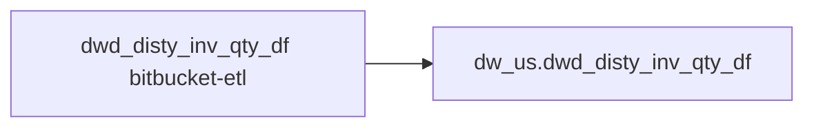

# FACT: Supplemental fact/context table used by select POS reports (`dw_us.dwd_disty_inv_qty_df`)

- artifact_type: etl_table
- artifact_id: dw_us.dwd_disty_inv_qty_df
- domain: pos
- one_line_purpose: POS-domain fact table with load SQL now available under bitbucket-etl (see L3); prior contract narrative preserved below.
- layer_type: DWD
- source_kind: etl_sql
- evidence_source: source/contracts/pos/bitbucket-etl/dwd_disty_inv_qty_df/dwd_disty_inv_qty_df.sql
- bitbucket_etl_bundle: source/contracts/pos/bitbucket-etl/dwd_disty_inv_qty_df/
- related_etl_scripts:
- `source/contracts/pos/bitbucket-etl/dwd_disty_inv_qty_df/load_dw_inv_qty.py`
- `source/contracts/pos/bitbucket-etl/dwd_disty_inv_qty_df/load_disty_inv_qty_df_change.py`

---

## L1 Data Foundation

### Identity and physical mapping
- **Table:** `dw_us.dwd_disty_inv_qty_df`
- **Layer type:** DWD
- **Canonical / derived:** Derived / ETL-loaded (see L3 from bitbucket-etl)
- **Owner team:** Not documented in repository

### Grain, scope, exclusions
- See preserved **Grain and keys** section below (POS contract narrative retained).

### Cross-engine presence
| Engine | Present | Notes |
|--------|---------|-------|
| Hive | yes | ETL load target |
| Vertica | yes (per preserved POS contract) | Reporting path in preserved Business query tables |

### Physical schema reference

| Field | Value |
|-------|-------|
| **entity_id** | `dw_us.dwd_disty_inv_qty_df` |
| **l1_catalog_seed** | `target/storage/wkb/snapshots/_snapshot_id_template/l1_catalog/{engine}_{schema}_{table}.json` |
| **column_count** | pending (run ddl_seed_writer) |
| **partition_keys** | See preserved Grain (`date_flag` when documented) |
| **ddl_source** | pending |
| **retrieval** | `python -m tools.wkb.indexing.run_query --query "pos dwd_disty_inv_qty_df schema" --intent find_table_schema` |

### Lineage

- **Primary load:** `source/contracts/pos/bitbucket-etl/dwd_disty_inv_qty_df/dwd_disty_inv_qty_df.sql`
- **upstream:** `${literal_source_db}.ods_dw_prod_dws_dw_inv_qty` — FROM/JOIN — `source/contracts/pos/bitbucket-etl/dwd_disty_inv_qty_df/dwd_disty_inv_qty_df.sql`
- **upstream:** `temp_inv_final_1` — FROM/JOIN — `source/contracts/pos/bitbucket-etl/dwd_disty_inv_qty_df/dwd_disty_inv_qty_df.sql`
- **upstream:** `table_multi_cost_all` — FROM/JOIN — `source/contracts/pos/bitbucket-etl/dwd_disty_inv_qty_df/dwd_disty_inv_qty_df.sql`
- **upstream:** `table_inv_qty` — FROM/JOIN — `source/contracts/pos/bitbucket-etl/dwd_disty_inv_qty_df/dwd_disty_inv_qty_df.sql`
- **upstream:** `table_one_cost_1` — FROM/JOIN — `source/contracts/pos/bitbucket-etl/dwd_disty_inv_qty_df/dwd_disty_inv_qty_df.sql`
- **upstream:** `table_one_cost_2` — FROM/JOIN — `source/contracts/pos/bitbucket-etl/dwd_disty_inv_qty_df/dwd_disty_inv_qty_df.sql`
- **upstream:** `table_one_cost_3` — FROM/JOIN — `source/contracts/pos/bitbucket-etl/dwd_disty_inv_qty_df/dwd_disty_inv_qty_df.sql`
- **upstream:** `table_one_cost_4` — FROM/JOIN — `source/contracts/pos/bitbucket-etl/dwd_disty_inv_qty_df/dwd_disty_inv_qty_df.sql`
- **upstream:** `table_multi_cost_1` — FROM/JOIN — `source/contracts/pos/bitbucket-etl/dwd_disty_inv_qty_df/dwd_disty_inv_qty_df.sql`
- **upstream:** `table_update_1` — FROM/JOIN — `source/contracts/pos/bitbucket-etl/dwd_disty_inv_qty_df/dwd_disty_inv_qty_df.sql`
- **upstream:** `table_multi_cost_2` — FROM/JOIN — `source/contracts/pos/bitbucket-etl/dwd_disty_inv_qty_df/dwd_disty_inv_qty_df.sql`
- **upstream:** `table_update_2` — FROM/JOIN — `source/contracts/pos/bitbucket-etl/dwd_disty_inv_qty_df/dwd_disty_inv_qty_df.sql`
- **upstream:** `table_multi_cost_3` — FROM/JOIN — `source/contracts/pos/bitbucket-etl/dwd_disty_inv_qty_df/dwd_disty_inv_qty_df.sql`
- **upstream:** `table_update_3` — FROM/JOIN — `source/contracts/pos/bitbucket-etl/dwd_disty_inv_qty_df/dwd_disty_inv_qty_df.sql`
- **upstream:** `table_multi_cost_4` — FROM/JOIN — `source/contracts/pos/bitbucket-etl/dwd_disty_inv_qty_df/dwd_disty_inv_qty_df.sql`
- **upstream:** `table_update_4` — FROM/JOIN — `source/contracts/pos/bitbucket-etl/dwd_disty_inv_qty_df/dwd_disty_inv_qty_df.sql`
- **upstream:** `dim_${literal_country}.dim_pub_sku_cost_view` — FROM/JOIN — `source/contracts/pos/bitbucket-etl/dwd_disty_inv_qty_df/dwd_disty_inv_qty_df.sql`
- **upstream:** `table_inv_qty_2` — FROM/JOIN — `source/contracts/pos/bitbucket-etl/dwd_disty_inv_qty_df/dwd_disty_inv_qty_df.sql`
- **downstream:** see L6 Downstream consumers
### Freshness and load path
- Parameters / date window: see ETL `${literal_*}` / `${date_flag}` in evidence script.
- Schedule: Not documented in repository

## L2 Declarative Knowledge

### Business purpose
See preserved **Business purpose** below (POS contract catalog + now linked ETL).

### Audience and use cases
See preserved **Who it helps** section.

### Fact key resolution
See preserved **Grain and keys**.

### Time field semantics
- Prefer partition / `date_flag` filters documented in preserved sections and L3 Key filters from ETL.

### Metrics served
See preserved Metrics / column groups when present.

### Metric serving map
N/A unless multi-period wide table (see preserved content).

### etl_metrics
No new metric-index formulas appended in this bitbucket-etl upgrade pass.

## L3 Procedural Knowledge

### Query and routing rules
- Reporting: Vertica `dw_us.dwd_disty_inv_qty_df` (see preserved Business query tables).
- Load logic: bitbucket-etl evidence `source/contracts/pos/bitbucket-etl/dwd_disty_inv_qty_df/dwd_disty_inv_qty_df.sql`.

### Dimension join patterns
See Relationship map (ETL JOIN edges) and preserved contract join notes.

### Key filters and ETL business logic
ETL WHERE / JOIN predicates are summarized via Relationship map provenance and Column derivations; full narrative retained in preserved sections.

### Standard time-filter SQL
```sql
-- Prefer date_flag / literal_start_date / literal_end_date as used in source/contracts/pos/bitbucket-etl/dwd_disty_inv_qty_df/dwd_disty_inv_qty_df.sql
```

### End-to-end flow


### Base tables register
| Object | Role |
|--------|------|
| See Relationship map + preserved lineage | ETL sources / temps |

### Step-by-step logic
1. Execute load SQL / python in `source/contracts/pos/bitbucket-etl/dwd_disty_inv_qty_df/`.
2. Apply date / business filters from ETL.
3. Write target `dw_us.dwd_disty_inv_qty_df` (see INSERT/OVERWRITE in evidence).

### Relationship map (embedded)

| from_fqn | to_fqn | cardinality | join_keys | provenance |
|----------|--------|-------------|-----------|------------|
| `a` | `table_multi_cost_all` | many:1 | `a.sku_no` = `b.sku_no`; `a.inv_type` = `b.inv_type`; `a.company_no` = `b.company_no`; `a.date_flag` = `b.date_flag` | etl_sql (`source/contracts/pos/bitbucket-etl/dwd_disty_inv_qty_df/dwd_disty_inv_qty_df.sql:55`) |
| `${literal_source_db}.ods_dw_prod_dws_dw_inv_qty` | `table_one_cost_1` | many:1 | — | etl_sql (`source/contracts/pos/bitbucket-etl/dwd_disty_inv_qty_df/dwd_disty_inv_qty_df.sql:170`) |
| `${literal_source_db}.ods_dw_prod_dws_dw_inv_qty` | `table_one_cost_2` | many:1 | — | etl_sql (`source/contracts/pos/bitbucket-etl/dwd_disty_inv_qty_df/dwd_disty_inv_qty_df.sql:189`) |
| `${literal_source_db}.ods_dw_prod_dws_dw_inv_qty` | `table_one_cost_3` | many:1 | — | etl_sql (`source/contracts/pos/bitbucket-etl/dwd_disty_inv_qty_df/dwd_disty_inv_qty_df.sql:208`) |
| `${literal_source_db}.ods_dw_prod_dws_dw_inv_qty` | `table_one_cost_4` | many:1 | — | etl_sql (`source/contracts/pos/bitbucket-etl/dwd_disty_inv_qty_df/dwd_disty_inv_qty_df.sql:227`) |
| `${literal_source_db}.ods_dw_prod_dws_dw_inv_qty` | `table_multi_cost_1` | many:1 (LEFT) | — | etl_sql (`source/contracts/pos/bitbucket-etl/dwd_disty_inv_qty_df/dwd_disty_inv_qty_df.sql:278`) |
| `${literal_source_db}.ods_dw_prod_dws_dw_inv_qty` | `table_update_1` | many:1 (LEFT) | — | etl_sql (`source/contracts/pos/bitbucket-etl/dwd_disty_inv_qty_df/dwd_disty_inv_qty_df.sql:284`) |
| `${literal_source_db}.ods_dw_prod_dws_dw_inv_qty` | `table_multi_cost_2` | many:1 (LEFT) | — | etl_sql (`source/contracts/pos/bitbucket-etl/dwd_disty_inv_qty_df/dwd_disty_inv_qty_df.sql:290`) |
| `${literal_source_db}.ods_dw_prod_dws_dw_inv_qty` | `table_update_2` | many:1 (LEFT) | — | etl_sql (`source/contracts/pos/bitbucket-etl/dwd_disty_inv_qty_df/dwd_disty_inv_qty_df.sql:296`) |
| `${literal_source_db}.ods_dw_prod_dws_dw_inv_qty` | `table_multi_cost_3` | many:1 (LEFT) | — | etl_sql (`source/contracts/pos/bitbucket-etl/dwd_disty_inv_qty_df/dwd_disty_inv_qty_df.sql:302`) |
| `${literal_source_db}.ods_dw_prod_dws_dw_inv_qty` | `table_update_3` | many:1 (LEFT) | — | etl_sql (`source/contracts/pos/bitbucket-etl/dwd_disty_inv_qty_df/dwd_disty_inv_qty_df.sql:308`) |
| `${literal_source_db}.ods_dw_prod_dws_dw_inv_qty` | `table_multi_cost_4` | many:1 (LEFT) | — | etl_sql (`source/contracts/pos/bitbucket-etl/dwd_disty_inv_qty_df/dwd_disty_inv_qty_df.sql:314`) |
| `${literal_source_db}.ods_dw_prod_dws_dw_inv_qty` | `table_update_4` | many:1 (LEFT) | — | etl_sql (`source/contracts/pos/bitbucket-etl/dwd_disty_inv_qty_df/dwd_disty_inv_qty_df.sql:320`) |
| `a` | `table_inv_qty_2` | many:1 (LEFT) | `a.date_flag` = `b.date_flag`; `a.sku_no` = `b.sku_no`; `a.loc_no` = `b.loc_no`; `a.inv_type` = `b.inv_type` | etl_sql (`source/contracts/pos/bitbucket-etl/dwd_disty_inv_qty_df/dwd_disty_inv_qty_df.sql:384`) |

### Special logic (embedded)

`source/ref/pos/special_logic.txt` exists but no rule naming this FQN/stem (`dw_us.dwd_disty_inv_qty_df`).

Not documented in repository


### Column / field derivations (from ETL SQL)

| target_column | expression_sql | upstream_columns | upstream_tables | transform_kind | evidence |
|---------------|----------------|------------------|-----------------|----------------|----------|
| `loc_no` | `a.loc_no` | `loc_no` | `temp_inv_final_1`, `table_inv_qty_2` | passthrough | `source/contracts/pos/bitbucket-etl/dwd_disty_inv_qty_df/dwd_disty_inv_qty_df.sql:242` |
| `inv_type` | `a.inv_type` | `inv_type` | `temp_inv_final_1`, `table_inv_qty_2` | passthrough | `source/contracts/pos/bitbucket-etl/dwd_disty_inv_qty_df/dwd_disty_inv_qty_df.sql:57` |
| `sku_no` | `a.sku_no` | `sku_no` | `temp_inv_final_1`, `table_inv_qty_2` | passthrough | `source/contracts/pos/bitbucket-etl/dwd_disty_inv_qty_df/dwd_disty_inv_qty_df.sql:56` |
| `u_version` | `a.u_version` | `u_version` | `temp_inv_final_1`, `table_inv_qty_2` | passthrough | `source/contracts/pos/bitbucket-etl/dwd_disty_inv_qty_df/dwd_disty_inv_qty_df.sql:345` |
| `ave_cost` | `a.ave_cost` | `ave_cost` | `temp_inv_final_1`, `table_inv_qty_2` | passthrough | `source/contracts/pos/bitbucket-etl/dwd_disty_inv_qty_df/dwd_disty_inv_qty_df.sql:251` |
| `std_cost` | `a.std_cost` | `std_cost` | `temp_inv_final_1`, `table_inv_qty_2` | passthrough | `source/contracts/pos/bitbucket-etl/dwd_disty_inv_qty_df/dwd_disty_inv_qty_df.sql:347` |
| `on_hand_qty` | `a.on_hand_qty` | `on_hand_qty` | `temp_inv_final_1`, `table_inv_qty_2` | passthrough | `source/contracts/pos/bitbucket-etl/dwd_disty_inv_qty_df/dwd_disty_inv_qty_df.sql:348` |
| `bo_qty` | `a.bo_qty` | `bo_qty` | `temp_inv_final_1`, `table_inv_qty_2` | passthrough | `source/contracts/pos/bitbucket-etl/dwd_disty_inv_qty_df/dwd_disty_inv_qty_df.sql:349` |
| `on_order_qty` | `a.on_order_qty` | `on_order_qty` | `temp_inv_final_1`, `table_inv_qty_2` | passthrough | `source/contracts/pos/bitbucket-etl/dwd_disty_inv_qty_df/dwd_disty_inv_qty_df.sql:350` |
| `alloc_qty` | `a.alloc_qty` | `alloc_qty` | `temp_inv_final_1`, `table_inv_qty_2` | passthrough | `source/contracts/pos/bitbucket-etl/dwd_disty_inv_qty_df/dwd_disty_inv_qty_df.sql:351` |
| `intran_out` | `a.intran_out` | `intran_out` | `temp_inv_final_1`, `table_inv_qty_2` | passthrough | `source/contracts/pos/bitbucket-etl/dwd_disty_inv_qty_df/dwd_disty_inv_qty_df.sql:352` |
| `intran_in` | `a.intran_in` | `intran_in` | `temp_inv_final_1`, `table_inv_qty_2` | passthrough | `source/contracts/pos/bitbucket-etl/dwd_disty_inv_qty_df/dwd_disty_inv_qty_df.sql:353` |
| `entry_datetime` | `a.entry_datetime` | `entry_datetime` | `temp_inv_final_1`, `table_inv_qty_2` | passthrough | `source/contracts/pos/bitbucket-etl/dwd_disty_inv_qty_df/dwd_disty_inv_qty_df.sql:354` |
| `entry_id` | `a.entry_id` | `entry_id` | `temp_inv_final_1`, `table_inv_qty_2` | passthrough | `source/contracts/pos/bitbucket-etl/dwd_disty_inv_qty_df/dwd_disty_inv_qty_df.sql:355` |
| `wip_qty` | `a.wip_qty` | `wip_qty` | `temp_inv_final_1`, `table_inv_qty_2` | passthrough | `source/contracts/pos/bitbucket-etl/dwd_disty_inv_qty_df/dwd_disty_inv_qty_df.sql:356` |
| `it_ave_cost` | `a.it_ave_cost` | `it_ave_cost` | `temp_inv_final_1`, `table_inv_qty_2` | passthrough | `source/contracts/pos/bitbucket-etl/dwd_disty_inv_qty_df/dwd_disty_inv_qty_df.sql:357` |
| `base_cost` | `a.base_cost` | `base_cost` | `temp_inv_final_1`, `table_inv_qty_2` | passthrough | `source/contracts/pos/bitbucket-etl/dwd_disty_inv_qty_df/dwd_disty_inv_qty_df.sql:259` |
| `ave_cost_fx` | `a.ave_cost_fx` | `ave_cost_fx` | `temp_inv_final_1`, `table_inv_qty_2` | passthrough | `source/contracts/pos/bitbucket-etl/dwd_disty_inv_qty_df/dwd_disty_inv_qty_df.sql:267` |
| `base_cost_fx` | `a.base_cost_fx` | `base_cost_fx` | `temp_inv_final_1`, `table_inv_qty_2` | passthrough | `source/contracts/pos/bitbucket-etl/dwd_disty_inv_qty_df/dwd_disty_inv_qty_df.sql:275` |
| `rio_qty` | `a.rio_qty` | `rio_qty` | `temp_inv_final_1`, `table_inv_qty_2` | passthrough | `source/contracts/pos/bitbucket-etl/dwd_disty_inv_qty_df/dwd_disty_inv_qty_df.sql:361` |
| `kwo_comp_rio_qty` | `a.kwo_comp_rio_qty` | `kwo_comp_rio_qty` | `temp_inv_final_1`, `table_inv_qty_2` | passthrough | `source/contracts/pos/bitbucket-etl/dwd_disty_inv_qty_df/dwd_disty_inv_qty_df.sql:362` |
| `kwo_oh_qty` | `a.kwo_oh_qty` | `kwo_oh_qty` | `temp_inv_final_1`, `table_inv_qty_2` | passthrough | `source/contracts/pos/bitbucket-etl/dwd_disty_inv_qty_df/dwd_disty_inv_qty_df.sql:363` |
| `kwo_bo_qty` | `a.kwo_bo_qty` | `kwo_bo_qty` | `temp_inv_final_1`, `table_inv_qty_2` | passthrough | `source/contracts/pos/bitbucket-etl/dwd_disty_inv_qty_df/dwd_disty_inv_qty_df.sql:364` |
| `ave_cost_2` | `case when b.sku_no is not null and b.loc_no is not null and b.inv_type is not null and b.company_no is not null and b...` | `sku_no`, `loc_no`, `inv_type`, `company_no`, `date_flag`, `ave_cost_2`, `ave_cost` | `temp_inv_final_1`, `table_inv_qty_2` | case | `source/contracts/pos/bitbucket-etl/dwd_disty_inv_qty_df/dwd_disty_inv_qty_df.sql:365` |
| `base_cost_2` | `case when b.sku_no is not null and b.loc_no is not null and b.inv_type is not null and b.company_no is not null and b...` | `sku_no`, `loc_no`, `inv_type`, `company_no`, `date_flag`, `base_cost_2`, `base_cost` | `temp_inv_final_1`, `table_inv_qty_2` | case | `source/contracts/pos/bitbucket-etl/dwd_disty_inv_qty_df/dwd_disty_inv_qty_df.sql:365` |
| `ave_cost_fx_2` | `case when b.sku_no is not null and b.loc_no is not null and b.inv_type is not null and b.company_no is not null and b...` | `sku_no`, `loc_no`, `inv_type`, `company_no`, `date_flag`, `ave_cost_fx_2`, `ave_cost_fx` | `temp_inv_final_1`, `table_inv_qty_2` | case | `source/contracts/pos/bitbucket-etl/dwd_disty_inv_qty_df/dwd_disty_inv_qty_df.sql:365` |
| `base_cost_fx_2` | `case when b.sku_no is not null and b.loc_no is not null and b.inv_type is not null and b.company_no is not null and b...` | `sku_no`, `loc_no`, `inv_type`, `company_no`, `date_flag`, `base_cost_fx_2`, `base_cost_fx` | `temp_inv_final_1`, `table_inv_qty_2` | case | `source/contracts/pos/bitbucket-etl/dwd_disty_inv_qty_df/dwd_disty_inv_qty_df.sql:365` |
| `date_flag` | `a.date_flag` | `date_flag` | `temp_inv_final_1`, `table_inv_qty_2` | passthrough | `source/contracts/pos/bitbucket-etl/dwd_disty_inv_qty_df/dwd_disty_inv_qty_df.sql:59` |
| `company_no` | `a.company_no` | `company_no` | `temp_inv_final_1`, `table_inv_qty_2` | passthrough | `source/contracts/pos/bitbucket-etl/dwd_disty_inv_qty_df/dwd_disty_inv_qty_df.sql:58` |

### Sentinel and code values
See preserved content and ETL CASE expressions in column derivations.

## L4 Validation

### Resolved partition value
- Partition / date parameters from ETL literals — concrete calendar values Not documented in repository (resolve via Azkaban when flow evidence exists).

### Data quality checks
See preserved Validation SQL when present.

### Validation SQL
Prefer preserved Vertica validation bundle when present; MCP business SQL not re-run during documentation.

### Caveats for interpretation
- Document upgraded additively from POS **contract** MD + **bitbucket-etl** SQL. Prior contract text is under **Preserved pre-L1-L6 content**.

### Conflicts and open questions
- Companion loader scripts may also be documented under `ap/` / `ar/` / `inventory/` domains (same stems); see `target/knowledgebase/pos/readme.md` cross-links.

## L5 Runtime View

### Query path and engine preference
| Path | Engine | Evidence |
|------|--------|----------|
| Load | Hive/Spark | `source/contracts/pos/bitbucket-etl/dwd_disty_inv_qty_df/dwd_disty_inv_qty_df.sql` |
| Report | Vertica | preserved POS contract |

### Access constraints
Not documented in repository

### Query risk profile
- Always filter `date_flag` / documented partition keys before wide scans.

## L6 Access and Consumption

### Primary consumers and use cases
See preserved audience / POS report consumers.

### Representative query patterns
See preserved Validation SQL / contract examples.

### Dependencies and notes

#### Upstream objects (verified)
| Object | Usage | Evidence |
|--------|-------|----------|
| ETL FROM/JOIN objects | load | `source/contracts/pos/bitbucket-etl/dwd_disty_inv_qty_df/dwd_disty_inv_qty_df.sql` (see Relationship map) |

#### Downstream consumers (verified)

| Object / script | Evidence |
|-----------------|----------|
| POS / RDS reports (contract) | preserved sections |
| Related loaders | see related_etl_scripts header |
| KB / contract ref: `source/contracts/b-report-us/A PL_ITEM_LOGIC 1.md` | `source/contracts/b-report-us/A PL_ITEM_LOGIC 1.md:792` |
| ETL/script ref: `source/contracts/b-report-us/bitbicket_etl/dws_disty_brpt_part_1d/Product/sql/dws_disty_brpt_part_1d.py` | `source/contracts/b-report-us/bitbicket_etl/dws_disty_brpt_part_1d/Product/sql/dws_disty_brpt_part_1d.py:10` |
| ETL/script ref: `source/contracts/b-report-us/bitbicket_etl/dws_disty_brpt_part_mtd/Product/python/dws_disty_brpt_part_mtd.py` | `source/contracts/b-report-us/bitbicket_etl/dws_disty_brpt_part_mtd/Product/python/dws_disty_brpt_part_mtd.py:18` |
| KB / contract ref: `source/contracts/pos/bitbucket-etl/MANIFEST.md` | `source/contracts/pos/bitbucket-etl/MANIFEST.md:184` |
| KB / contract ref: `source/contracts/pos/tables/dwd_disty_inv_qty_df.md` | `source/contracts/pos/tables/dwd_disty_inv_qty_df.md:5` |
| ETL/script ref: `source/contracts/rds/starrocks_inventory/etl/inv_consignment_address_default_wh_rds_7026.sql` | `source/contracts/rds/starrocks_inventory/etl/inv_consignment_address_default_wh_rds_7026.sql:293` |
| ETL/script ref: `source/contracts/rds/starrocks_inventory/etl/inv_multisheet_dos_bo_rds_14059.sql` | `source/contracts/rds/starrocks_inventory/etl/inv_multisheet_dos_bo_rds_14059.sql:77` |
| ETL/script ref: `source/contracts/rds/starrocks_inventory/etl/inv_qty_aging_runrate_rio_location_rds_5501.sql` | `source/contracts/rds/starrocks_inventory/etl/inv_qty_aging_runrate_rio_location_rds_5501.sql:119` |
| ETL/script ref: `source/contracts/rds/starrocks_open_so_bo/etl/open_so_bo_brpt_snapshot_profile_rds_8700.sql` | `source/contracts/rds/starrocks_open_so_bo/etl/open_so_bo_brpt_snapshot_profile_rds_8700.sql:98` |
| ETL/script ref: `source/contracts/rds/starrocks_open_so_bo/etl/open_so_bo_customer_sku_serial_inventory_rds_14053.sql` | `source/contracts/rds/starrocks_open_so_bo/etl/open_so_bo_customer_sku_serial_inventory_rds_14053.sql:147` |
| ETL/script ref: `source/contracts/rds/starrocks_open_so_bo/etl/open_so_bo_pm_queue_ship_complete_rds_19137.sql` | `source/contracts/rds/starrocks_open_so_bo/etl/open_so_bo_pm_queue_ship_complete_rds_19137.sql:132` |
| ETL/script ref: `source/contracts/rds/vertica_b_report/etl/b_report_lightweight_orders_inventory_rio_rds_7500.sql` | `source/contracts/rds/vertica_b_report/etl/b_report_lightweight_orders_inventory_rio_rds_7500.sql:190` |
| ETL/script ref: `source/contracts/rds/vertica_inventory/etl/inv_aging_qty_runrate_rio_alloc_rds_18605.sql` | `source/contracts/rds/vertica_inventory/etl/inv_aging_qty_runrate_rio_alloc_rds_18605.sql:148` |
| ETL/script ref: `source/contracts/rds/vertica_inventory/etl/inv_aging_qty_runrate_so_alloc_rds_17343.sql` | `source/contracts/rds/vertica_inventory/etl/inv_aging_qty_runrate_so_alloc_rds_17343.sql:132` |
| ETL/script ref: `source/contracts/rds/vertica_inventory/etl/inv_aging_qty_runrate_so_alloc_rds_17345.sql` | `source/contracts/rds/vertica_inventory/etl/inv_aging_qty_runrate_so_alloc_rds_17345.sql:143` |
| ETL/script ref: `source/contracts/rds/vertica_inventory/etl/inv_aging_qty_vendor_filter_rds_17484.sql` | `source/contracts/rds/vertica_inventory/etl/inv_aging_qty_vendor_filter_rds_17484.sql:111` |
| ETL/script ref: `source/contracts/rds/vertica_inventory/etl/inv_ap_hold_availability_rds_19106.sql` | `source/contracts/rds/vertica_inventory/etl/inv_ap_hold_availability_rds_19106.sql:12` |
| ETL/script ref: `source/contracts/rds/vertica_inventory/etl/inv_qty_aging_runrate_rio_alloc_customer_rds_us13208.sql` | `source/contracts/rds/vertica_inventory/etl/inv_qty_aging_runrate_rio_alloc_customer_rds_us13208.sql:86` |
| ETL/script ref: `source/contracts/rds/vertica_inventory/etl/inv_rio_cws_location_rds_6800.sql` | `source/contracts/rds/vertica_inventory/etl/inv_rio_cws_location_rds_6800.sql:6` |
| ETL/script ref: `source/contracts/rds/vertica_inventory/etl/inv_rollover_true_aging_rds_10968.sql` | `source/contracts/rds/vertica_inventory/etl/inv_rollover_true_aging_rds_10968.sql:494` |
| ETL/script ref: `source/contracts/rds/vertica_inventory/etl/inv_rollover_witypestu_stock_rotation_rds_11722.sql` | `source/contracts/rds/vertica_inventory/etl/inv_rollover_witypestu_stock_rotation_rds_11722.sql:94` |
| ETL/script ref: `source/contracts/rds/vertica_inventory/etl/inv_upc_part_aging_qty_rds_19269.sql` | `source/contracts/rds/vertica_inventory/etl/inv_upc_part_aging_qty_rds_19269.sql:32` |
| ETL/script ref: `source/contracts/rds/vertica_open_so_bo/etl/open_so_bo_inventory_rio_runrate_rds_7500.sql` | `source/contracts/rds/vertica_open_so_bo/etl/open_so_bo_inventory_rio_runrate_rds_7500.sql:190` |
| ETL/script ref: `source/contracts/rds/vertica_vpo/etl/vpo_inventory_open_dropship_pos_qty_rds_18517.sql` | `source/contracts/rds/vertica_vpo/etl/vpo_inventory_open_dropship_pos_qty_rds_18517.sql:55` |
| FLOW ref: `source/etl/flows/data_service/inventory/inv_aging_data_initialization_us.flow` | `source/etl/flows/data_service/inventory/inv_aging_data_initialization_us.flow:48` |
| FLOW ref: `source/etl/flows/data_service/inventory/inv_aging_load_br.flow` | `source/etl/flows/data_service/inventory/inv_aging_load_br.flow:269` |
| FLOW ref: `source/etl/flows/data_service/inventory/inv_aging_load_ca.flow` | `source/etl/flows/data_service/inventory/inv_aging_load_ca.flow:270` |
| FLOW ref: `source/etl/flows/data_service/inventory/inv_aging_load_us.flow` | `source/etl/flows/data_service/inventory/inv_aging_load_us.flow:269` |
| FLOW ref: `source/etl/flows/data_service/inventory/inv_aging_load_wcla.flow` | `source/etl/flows/data_service/inventory/inv_aging_load_wcla.flow:270` |
| FLOW ref: `source/etl/flows/data_service/inventory/inv_qty_df_modify_br.flow` | `source/etl/flows/data_service/inventory/inv_qty_df_modify_br.flow:43` |
| FLOW ref: `source/etl/flows/data_service/inventory/inv_qty_df_modify_ca.flow` | `source/etl/flows/data_service/inventory/inv_qty_df_modify_ca.flow:43` |
| FLOW ref: `source/etl/flows/data_service/inventory/inv_qty_df_modify_us.flow` | `source/etl/flows/data_service/inventory/inv_qty_df_modify_us.flow:43` |
| FLOW ref: `source/etl/flows/data_service/inventory/inv_qty_df_modify_wcla.flow` | `source/etl/flows/data_service/inventory/inv_qty_df_modify_wcla.flow:43` |
| FLOW ref: `source/etl/flows/data_service/inventory_switch/inv_aging_switch_br.flow` | `source/etl/flows/data_service/inventory_switch/inv_aging_switch_br.flow:133` |
| FLOW ref: `source/etl/flows/data_service/inventory_switch/inv_aging_switch_ca.flow` | `source/etl/flows/data_service/inventory_switch/inv_aging_switch_ca.flow:133` |
| FLOW ref: `source/etl/flows/data_service/inventory_switch/inv_aging_switch_us.flow` | `source/etl/flows/data_service/inventory_switch/inv_aging_switch_us.flow:133` |
| FLOW ref: `source/etl/flows/data_service/inventory_switch/inv_aging_switch_wcla.flow` | `source/etl/flows/data_service/inventory_switch/inv_aging_switch_wcla.flow:133` |
| ETL/script ref: `source/etl/sql/ap/data_service/ap/python/load_ap_vdah_lines.py` | `source/etl/sql/ap/data_service/ap/python/load_ap_vdah_lines.py:196` |
| ETL/script ref: `source/etl/sql/inventory/data_service/inventory/inventory_switch/python/switch_dw_inv_qty.py` | `source/etl/sql/inventory/data_service/inventory/inventory_switch/python/switch_dw_inv_qty.py:31` |
| ETL/script ref: `source/etl/sql/inventory/data_service/inventory/python/load_disty_inv_qty_df_change.py` | `source/etl/sql/inventory/data_service/inventory/python/load_disty_inv_qty_df_change.py:16` |

#### Operational detail (verified)
- Bundle: `source/contracts/pos/bitbucket-etl/dwd_disty_inv_qty_df/`
- Manifest: `source/contracts/pos/bitbucket-etl/MANIFEST.md`

#### Not documented in repository
- Schedule, owner, SLA

---

## Preserved pre-L1-L6 content

> Retained verbatim from the prior POS contract knowledgebase document (nothing removed). ETL load evidence above supplements this catalog narrative.


**Domain:** pos  
**Source contract:** `C:\Users\T154858D.TDSNX\Desktop\git_repo_v1\data_analysis_agent_brpt\knowledge\POS\tables\dwd_disty_inv_qty_df.md`  
**Knowledgebase path:** `target/knowledgebase/pos/dwd_disty_inv_qty_df.md`

## Business purpose

Supplemental fact/context table used by select POS reports

This document is derived from the POS table contract catalog. ETL script lineage for load jobs is **not documented in this repository** unless listed under verified dependencies below.

---

## What the process does (high level)

| Stage | Business meaning |
|-------|------------------|
| **Catalog object** | `dw_us.dwd_disty_inv_qty_df` — FACT layer table used in US POS reporting (`US POS baseline`). |
| **Consumption** | Queried from Vertica for POS/RDS reports, exports, and enrichment joins. |

**Parameters:** Country schema pattern `dw_us` (US baseline documented as `dw_us` / `dim_us`).

---

## Who it helps and how

| Audience | How they benefit |
|----------|-----------------|
| **POS / RDS reporting** | Vertica RDS POS custom reports (499 scripts scanned: US 367, CA 124, MX 7, BR 1) |
| **Sales analytics** | Order, customer, product, and margin attributes at documented grain. |
| **Data engineering** | Stable table contract for joins to POS hub and downstream exports. |

---

## Business query tables (Vertica)

| Role | Hive object | Vertica object | Sync mode | Evidence | MCP verified |
|------|-------------|----------------|-----------|----------|--------------|
| **Query for reporting** | `dw_us.dwd_disty_inv_qty_df` | `dw_us.dwd_disty_inv_qty_df` | overwrite / incremental | POS contract `dwd_disty_inv_qty_df.md:L1` | yes (POS contract v2 — Vertica verified in source catalog) |
| **Hive alternative** | `dw_us.dwd_disty_inv_qty_df` | same as reporting table | - | POS contract cross-engine note | - |
| **ETL internal** | n/a | n/a | - | ETL not in wiki repo | - |

Business users should query **`dw_us.dwd_disty_inv_qty_df`** in Vertica for POS-domain reporting aligned to this contract.

---

## Grain and keys

- **Grain:** See natural key columns from POS contract column catalog.
- **Partition:** `date_flag` — daily business date filter for POS reporting (per POS contract).
- **Natural key:** `loc_no`, `sku_no`, `entry_id`
- **Exclusions (reporting):** None documented in POS contract.

---

## Validation SQL (Vertica)

```sql
-- 1) Row count by partition
SELECT date_flag, COUNT(*) AS row_cnt
FROM dw_us.dwd_disty_inv_qty_df
WHERE date_flag = '${partition_value}'
GROUP BY date_flag;

-- 2) Metric sum by business dimension (top N)
SELECT loc_no, COUNT(*) AS row_cnt
FROM dw_us.dwd_disty_inv_qty_df
WHERE date_flag = '${partition_value}'
GROUP BY loc_no
ORDER BY COUNT(*) DESC
LIMIT 20;

-- 3) Grain duplicate check
SELECT loc_no, sku_no, entry_id, date_flag, COUNT(*) AS cnt
FROM dw_us.dwd_disty_inv_qty_df
WHERE date_flag = '${partition_value}'
GROUP BY loc_no, sku_no, entry_id, date_flag
HAVING COUNT(*) > 1;
```

Replace `${partition_value}` with the resolved business date or period from the report scope.

---

## Data you can fetch and use downstream

### Core measures

- `ave_cost` — ave cost
- `std_cost` — std cost
- `on_hand_qty` — on hand qty
- `bo_qty` — bo qty
- `on_order_qty` — on order qty
- `alloc_qty` — alloc qty
- `wip_qty` — wip qty
- `it_ave_cost` — it ave cost
- `base_cost` — base cost
- `ave_cost_fx` — ave cost fx
- `base_cost_fx` — base cost fx
- `rio_qty` — rio qty
- `kwo_comp_rio_qty` — kwo comp rio qty
- `kwo_oh_qty` — kwo oh qty
- `kwo_bo_qty` — kwo bo qty
- `ave_cost_2` — ave cost 2
- `base_cost_2` — base cost 2
- `ave_cost_fx_2` — ave cost fx 2
- `base_cost_fx_2` — base cost fx 2

### Dimension and key columns

- `loc_no` — loc no
- `inv_type` — inv type
- `sku_no` — sku no
- `u_version` — u version
- `intran_out` — intran out
- `intran_in` — intran in
- `entry_datetime` — entry datetime
- `entry_id` — entry id
- `date_flag` — date flag
- `company_no` — company no

---

## Metrics business users typically care about

When exposing this table to the business, lead with measure and key columns from the POS contract catalog (see **Data you can fetch** above).

---

## End-to-end flow (summary)

**Target table:** `dw_us.dwd_disty_inv_qty_df`  
**Load pattern:** Not documented in repository

1. Upstream: Curated DWD/DIM/ODS load jobs in disty common pipeline
2. Table available in Hive and Vertica for POS consumption.
3. Downstream: Vertica RDS POS report scripts (`rds_*_rtv`), ad-hoc POS exports


---

## Base tables register

| Object | Role in this job |
|--------|-----------------|
| `dw_us.dwd_disty_inv_qty_df` | Primary catalog table documented from POS contract |

---

## Step-by-step logic

Not applicable — this Knowledgebase entry is a **table catalog** converted from POS contract v2. ETL step-by-step logic is not present in this wiki repository.

**Standard POS filters (from contract L3):**

- Standard POS filters inherited from domain-knowledge.md when joining to hub.

---

## Caveats for interpretation

- Derived from POS contract v2; ETL SQL and Azkaban flow names are not verified in this repository unless cited below.
- US schema `dw_us` documented as baseline; CA/MX/BR use same table names with regional scope.
- - Verify grain keys (`order_no`, `order_type`, `order_line_no`) not null for fact joins when applicable.
- For one-to-many partners (SPA/SCM, serial), validate row counts before joining to hub.
- Hub: `extend_net_price` should align with `(unit_net_price * ship_qty)` within rounding tolerance when both populated.
- Validate join cardinality to POS hub before production report use.

---

## Dependencies and notes (verified only)

### Upstream objects (verified)

| Object | Usage | Evidence |
|--------|-------|----------|
| POS contract source | Table metadata, grain, columns | `C:\Users\T154858D.TDSNX\Desktop\git_repo_v1\data_analysis_agent_brpt\knowledge\POS\tables\dwd_disty_inv_qty_df.md` |

### Downstream consumers (verified)

| Object / script | Evidence |
|-----------------|----------|
| POS RDS / export consumers | `dwd_disty_inv_qty_df.md:L6` — Vertica RDS POS report scripts (`rds_*_rtv`), ad-hoc POS exports |

### Operational detail (verified)

- Freshness: Not documented in repository
- Column count: 29 (POS contract catalog)

### Not documented in repository

- ETL SQL load script and Azkaban `.flow` for this table
- hive2vertica sync job file:line evidence
- Schedule, owner, SLA

### Related scripts (verified)

None identified in repository.

---

*Document generated from POS contract `C:\Users\T154858D.TDSNX\Desktop\git_repo_v1\data_analysis_agent_brpt\knowledge\POS\tables\dwd_disty_inv_qty_df.md`.*