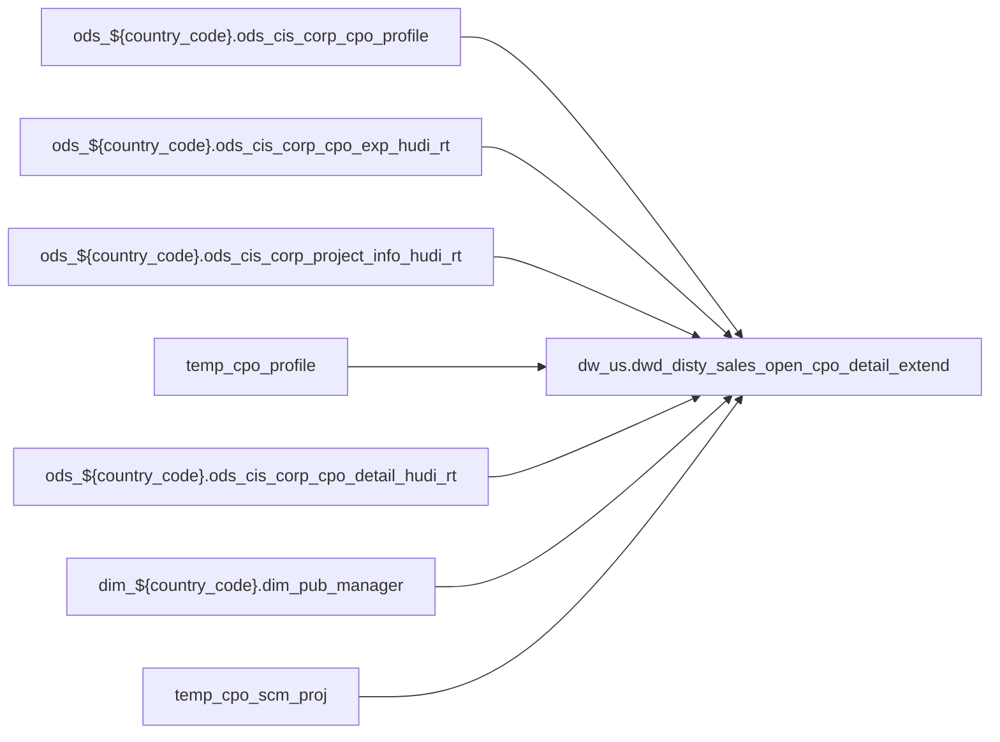

# FACT: Supplemental fact/context table used by select POS reports (`dw_us.dwd_disty_sales_open_cpo_detail_extend`)

- artifact_type: etl_table
- artifact_id: dw_us.dwd_disty_sales_open_cpo_detail_extend
- domain: pos
- one_line_purpose: POS-domain table with load SQL under bitbucket-etl (see L3); prior contract narrative preserved below when present.
- layer_type: DWD
- source_kind: etl_sql
- evidence_source: source/contracts/pos/bitbucket-etl/dwd_disty_sales_open_cpo_detail_extend/dwd_disty_sales_open_cpo_detail_extend_rt.sql
- bitbucket_etl_bundle: source/contracts/pos/bitbucket-etl/dwd_disty_sales_open_cpo_detail_extend/
- related_etl_scripts:
- `source/contracts/pos/bitbucket-etl/dwd_disty_sales_open_cpo_detail_extend/dwd_disty_sales_open_cpo_detail_extend_df.sql`

---

## L1 Data Foundation

### Identity and physical mapping
- **Table:** `dw_us.dwd_disty_sales_open_cpo_detail_extend`
- **Layer type:** DWD
- **Canonical / derived:** Derived / ETL-loaded (see L3 from bitbucket-etl)
- **Owner team:** Not documented in repository

### Grain, scope, exclusions
- See preserved **Grain and keys** section below when present (POS contract narrative retained).
- Otherwise infer from SELECT / GROUP BY / INSERT column list in `source/contracts/pos/bitbucket-etl/dwd_disty_sales_open_cpo_detail_extend/dwd_disty_sales_open_cpo_detail_extend_rt.sql`.

### Cross-engine presence
| Engine | Present | Notes |
|--------|---------|-------|
| Hive | yes | ETL load target |
| Vertica | yes when POS contract documents Vertica sync | See preserved Business query tables |

### Physical schema reference

| Field | Value |
|-------|-------|
| **entity_id** | `dw_us.dwd_disty_sales_open_cpo_detail_extend` |
| **l1_catalog_seed** | `target/storage/wkb/snapshots/_snapshot_id_template/l1_catalog/{engine}_{schema}_{table}.json` |
| **column_count** | pending (run ddl_seed_writer) |
| **partition_keys** | See preserved Grain / L4 / ETL PARTITION clause |
| **ddl_source** | pending |
| **retrieval** | `python -m tools.wkb.indexing.run_query --query "pos dwd_disty_sales_open_cpo_detail_extend schema" --intent find_table_schema` |

### Lineage

- **Primary load:** `source/contracts/pos/bitbucket-etl/dwd_disty_sales_open_cpo_detail_extend/dwd_disty_sales_open_cpo_detail_extend_rt.sql`
- **upstream:** `ods_${country_code}.ods_cis_corp_cpo_profile` — FROM/JOIN — `source/contracts/pos/bitbucket-etl/dwd_disty_sales_open_cpo_detail_extend/dwd_disty_sales_open_cpo_detail_extend_rt.sql`
- **upstream:** `ods_${country_code}.ods_cis_corp_cpo_exp_hudi_rt` — FROM/JOIN — `source/contracts/pos/bitbucket-etl/dwd_disty_sales_open_cpo_detail_extend/dwd_disty_sales_open_cpo_detail_extend_rt.sql`
- **upstream:** `ods_${country_code}.ods_cis_corp_project_info_hudi_rt` — FROM/JOIN — `source/contracts/pos/bitbucket-etl/dwd_disty_sales_open_cpo_detail_extend/dwd_disty_sales_open_cpo_detail_extend_rt.sql`
- **upstream:** `temp_cpo_profile` — FROM/JOIN — `source/contracts/pos/bitbucket-etl/dwd_disty_sales_open_cpo_detail_extend/dwd_disty_sales_open_cpo_detail_extend_rt.sql`
- **upstream:** `ods_${country_code}.ods_cis_corp_cpo_detail_hudi_rt` — FROM/JOIN — `source/contracts/pos/bitbucket-etl/dwd_disty_sales_open_cpo_detail_extend/dwd_disty_sales_open_cpo_detail_extend_rt.sql`
- **upstream:** `dim_${country_code}.dim_pub_manager` — FROM/JOIN — `source/contracts/pos/bitbucket-etl/dwd_disty_sales_open_cpo_detail_extend/dwd_disty_sales_open_cpo_detail_extend_rt.sql`
- **upstream:** `temp_cpo_scm_proj` — FROM/JOIN — `source/contracts/pos/bitbucket-etl/dwd_disty_sales_open_cpo_detail_extend/dwd_disty_sales_open_cpo_detail_extend_rt.sql`
- **downstream:** see L6 Downstream consumers
### Freshness and load path
- Parameters / date window: see ETL `${literal_*}` / `${date_flag}` / `${start_date}` in evidence script.
- Schedule: Not documented in repository

## L2 Declarative Knowledge

### Business purpose
See preserved **Business purpose** below when present (POS contract catalog + linked ETL).

### Audience and use cases
See preserved **Who it helps** section when present.

### Fact key resolution
See preserved **Grain and keys** when present.

### Time field semantics
- Prefer partition / `date_flag` filters documented in preserved sections and L3 Key filters from ETL.

### Metrics served
See preserved Metrics / column groups when present; otherwise L3 column derivations.

### Metric serving map
N/A unless multi-period wide table (see preserved content).

### etl_metrics
No new metric-index formulas appended in this bitbucket-etl upgrade pass.

## L3 Procedural Knowledge

### Query and routing rules
- Reporting: Vertica `dw_us.dwd_disty_sales_open_cpo_detail_extend` when synced (see preserved Business query tables).
- Load logic: bitbucket-etl evidence `source/contracts/pos/bitbucket-etl/dwd_disty_sales_open_cpo_detail_extend/dwd_disty_sales_open_cpo_detail_extend_rt.sql`.

### Dimension join patterns
See Relationship map (ETL JOIN edges) and preserved contract join notes.

### Key filters and ETL business logic

| Predicate | Kind | Evidence |
|-----------|------|----------|
| `profile_type in ('SPAREF','CUSTPART#','CUSTPOCOST','COMPPOCOST','CUSTMSRP','COMPMSRP','CONTRNO','QUOTREQID')` | Business | `source/contracts/pos/bitbucket-etl/dwd_disty_sales_open_cpo_detail_extend/dwd_disty_sales_open_cpo_detail_extend_rt.sql` |
| `nvl(ce.cpo_line_seq, 0) != 0 AND ce.cpo_delete_date IS NULL` | Business | `source/contracts/pos/bitbucket-etl/dwd_disty_sales_open_cpo_detail_extend/dwd_disty_sales_open_cpo_detail_extend_rt.sql` |

### Standard time-filter SQL
```sql
-- Prefer date_flag / literal_start_date / literal_end_date as used in source/contracts/pos/bitbucket-etl/dwd_disty_sales_open_cpo_detail_extend/dwd_disty_sales_open_cpo_detail_extend_rt.sql
```

### End-to-end flow


### Base tables register
| Object | Role |
|--------|------|
| `ods_${country_code}.ods_cis_corp_cpo_profile` | source / temp (FROM/JOIN) |
| `ods_${country_code}.ods_cis_corp_cpo_exp_hudi_rt` | source / temp (FROM/JOIN) |
| `ods_${country_code}.ods_cis_corp_project_info_hudi_rt` | source / temp (FROM/JOIN) |
| `temp_cpo_profile` | source / temp (FROM/JOIN) |
| `ods_${country_code}.ods_cis_corp_cpo_detail_hudi_rt` | source / temp (FROM/JOIN) |
| `dim_${country_code}.dim_pub_manager` | source / temp (FROM/JOIN) |
| `temp_cpo_scm_proj` | source / temp (FROM/JOIN) |

### Step-by-step logic
1. Execute load SQL / python in `source/contracts/pos/bitbucket-etl/dwd_disty_sales_open_cpo_detail_extend/`.
2. Apply date / business filters from ETL (Key filters).
3. Write target `dw_us.dwd_disty_sales_open_cpo_detail_extend` (see INSERT/OVERWRITE in evidence).

### Relationship map (embedded)

| from_fqn | to_fqn | cardinality | join_keys | provenance |
|----------|--------|-------------|-----------|------------|
| `ods_${country_code}.ods_cis_corp_cpo_exp_hudi_rt` | `ods_${country_code}.ods_cis_corp_project_info_hudi_rt` | many:1 (LEFT) | `ce.cpo_scm_no` = `pinfo.proj_no` | etl_sql (`source/contracts/pos/bitbucket-etl/dwd_disty_sales_open_cpo_detail_extend/dwd_disty_sales_open_cpo_detail_extend_rt.sql:32`) |
| `ods_${country_code}.ods_cis_corp_cpo_exp_hudi_rt` | `temp_cpo_profile` | many:1 (LEFT) | `ce.cpo_id` = `cp.cpo_id`; `ce.cpo_line_seq` = `cp.cpo_line_seq` | etl_sql (`source/contracts/pos/bitbucket-etl/dwd_disty_sales_open_cpo_detail_extend/dwd_disty_sales_open_cpo_detail_extend_rt.sql:34`) |
| `ods_${country_code}.ods_cis_corp_cpo_detail_hudi_rt` | `dim_${country_code}.dim_pub_manager` | many:1 (LEFT) | `cd.cpo_delete_id` = `pm.userid` | etl_sql (`source/contracts/pos/bitbucket-etl/dwd_disty_sales_open_cpo_detail_extend/dwd_disty_sales_open_cpo_detail_extend_rt.sql:84`) |
| `ods_${country_code}.ods_cis_corp_cpo_detail_hudi_rt` | `temp_cpo_profile` | many:1 (LEFT) | `cd.cpo_id` = `cp.cpo_id`; `cd.cpo_line_seq` = `cp.cpo_line_seq` | etl_sql (`source/contracts/pos/bitbucket-etl/dwd_disty_sales_open_cpo_detail_extend/dwd_disty_sales_open_cpo_detail_extend_rt.sql:87`) |
| `ods_${country_code}.ods_cis_corp_cpo_detail_hudi_rt` | `temp_cpo_scm_proj` | many:1 (LEFT) | `cd.cpo_id` = `csp.cpo_id`; `cd.cpo_line_seq` = `csp.cpo_line_seq` | etl_sql (`source/contracts/pos/bitbucket-etl/dwd_disty_sales_open_cpo_detail_extend/dwd_disty_sales_open_cpo_detail_extend_rt.sql:91`) |

### Special logic (embedded)

`source/ref/pos/special_logic.txt` exists but no rule naming this FQN/stem (`dw_us.dwd_disty_sales_open_cpo_detail_extend`).

Not documented in repository


### Column / field derivations (from ETL SQL)

| target_column | expression_sql | upstream_columns | upstream_tables | transform_kind | evidence |
|---------------|----------------|------------------|-----------------|----------------|----------|
| `cpo_id` | `cd.cpo_id` | `cpo_id` | `ods_${country_code}.ods_cis_corp_cpo_detail_hudi_rt`, `dim_${country_code}.dim_pub_manager`, `temp_cpo_profile`, `temp_cpo_scm_proj` | passthrough | `source/contracts/pos/bitbucket-etl/dwd_disty_sales_open_cpo_detail_extend/dwd_disty_sales_open_cpo_detail_extend_rt.sql:43` |
| `cpo_line_seq` | `cd.cpo_line_seq` | `cpo_line_seq` | `ods_${country_code}.ods_cis_corp_cpo_detail_hudi_rt`, `dim_${country_code}.dim_pub_manager`, `temp_cpo_profile`, `temp_cpo_scm_proj` | passthrough | `source/contracts/pos/bitbucket-etl/dwd_disty_sales_open_cpo_detail_extend/dwd_disty_sales_open_cpo_detail_extend_rt.sql:44` |
| `cpo_line_no` | `cd.cpo_line_no` | `cpo_line_no` | `ods_${country_code}.ods_cis_corp_cpo_detail_hudi_rt`, `dim_${country_code}.dim_pub_manager`, `temp_cpo_profile`, `temp_cpo_scm_proj` | passthrough | `source/contracts/pos/bitbucket-etl/dwd_disty_sales_open_cpo_detail_extend/dwd_disty_sales_open_cpo_detail_extend_rt.sql:45` |
| `cpo_line_status` | `cd.cpo_line_status` | `cpo_line_status` | `ods_${country_code}.ods_cis_corp_cpo_detail_hudi_rt`, `dim_${country_code}.dim_pub_manager`, `temp_cpo_profile`, `temp_cpo_scm_proj` | passthrough | `source/contracts/pos/bitbucket-etl/dwd_disty_sales_open_cpo_detail_extend/dwd_disty_sales_open_cpo_detail_extend_rt.sql:46` |
| `cpo_sku_no` | `cd.cpo_sku_no` | `cpo_sku_no` | `ods_${country_code}.ods_cis_corp_cpo_detail_hudi_rt`, `dim_${country_code}.dim_pub_manager`, `temp_cpo_profile`, `temp_cpo_scm_proj` | passthrough | `source/contracts/pos/bitbucket-etl/dwd_disty_sales_open_cpo_detail_extend/dwd_disty_sales_open_cpo_detail_extend_rt.sql:47` |
| `cpo_sku_inv_type` | `cd.cpo_sku_inv_type` | `cpo_sku_inv_type` | `ods_${country_code}.ods_cis_corp_cpo_detail_hudi_rt`, `dim_${country_code}.dim_pub_manager`, `temp_cpo_profile`, `temp_cpo_scm_proj` | passthrough | `source/contracts/pos/bitbucket-etl/dwd_disty_sales_open_cpo_detail_extend/dwd_disty_sales_open_cpo_detail_extend_rt.sql:48` |
| `cpo_line_qty` | `cd.cpo_line_qty` | `cpo_line_qty` | `ods_${country_code}.ods_cis_corp_cpo_detail_hudi_rt`, `dim_${country_code}.dim_pub_manager`, `temp_cpo_profile`, `temp_cpo_scm_proj` | passthrough | `source/contracts/pos/bitbucket-etl/dwd_disty_sales_open_cpo_detail_extend/dwd_disty_sales_open_cpo_detail_extend_rt.sql:49` |
| `cpo_allocated_qty` | `cd.cpo_allocated_qty` | `cpo_allocated_qty` | `ods_${country_code}.ods_cis_corp_cpo_detail_hudi_rt`, `dim_${country_code}.dim_pub_manager`, `temp_cpo_profile`, `temp_cpo_scm_proj` | passthrough | `source/contracts/pos/bitbucket-etl/dwd_disty_sales_open_cpo_detail_extend/dwd_disty_sales_open_cpo_detail_extend_rt.sql:50` |
| `cpo_bo_qty` | `cd.cpo_bo_qty` | `cpo_bo_qty` | `ods_${country_code}.ods_cis_corp_cpo_detail_hudi_rt`, `dim_${country_code}.dim_pub_manager`, `temp_cpo_profile`, `temp_cpo_scm_proj` | passthrough | `source/contracts/pos/bitbucket-etl/dwd_disty_sales_open_cpo_detail_extend/dwd_disty_sales_open_cpo_detail_extend_rt.sql:51` |
| `cpo_so_qty` | `cd.cpo_so_qty` | `cpo_so_qty` | `ods_${country_code}.ods_cis_corp_cpo_detail_hudi_rt`, `dim_${country_code}.dim_pub_manager`, `temp_cpo_profile`, `temp_cpo_scm_proj` | passthrough | `source/contracts/pos/bitbucket-etl/dwd_disty_sales_open_cpo_detail_extend/dwd_disty_sales_open_cpo_detail_extend_rt.sql:52` |
| `cpo_del_qty` | `cd.cpo_del_qty` | `cpo_del_qty` | `ods_${country_code}.ods_cis_corp_cpo_detail_hudi_rt`, `dim_${country_code}.dim_pub_manager`, `temp_cpo_profile`, `temp_cpo_scm_proj` | passthrough | `source/contracts/pos/bitbucket-etl/dwd_disty_sales_open_cpo_detail_extend/dwd_disty_sales_open_cpo_detail_extend_rt.sql:53` |
| `cpo_ship_qty` | `cd.cpo_ship_qty` | `cpo_ship_qty` | `ods_${country_code}.ods_cis_corp_cpo_detail_hudi_rt`, `dim_${country_code}.dim_pub_manager`, `temp_cpo_profile`, `temp_cpo_scm_proj` | passthrough | `source/contracts/pos/bitbucket-etl/dwd_disty_sales_open_cpo_detail_extend/dwd_disty_sales_open_cpo_detail_extend_rt.sql:54` |
| `cpo_price` | `cd.cpo_price` | `cpo_price` | `ods_${country_code}.ods_cis_corp_cpo_detail_hudi_rt`, `dim_${country_code}.dim_pub_manager`, `temp_cpo_profile`, `temp_cpo_scm_proj` | passthrough | `source/contracts/pos/bitbucket-etl/dwd_disty_sales_open_cpo_detail_extend/dwd_disty_sales_open_cpo_detail_extend_rt.sql:55` |
| `cpo_grid_price` | `cd.cpo_grid_price` | `cpo_grid_price` | `ods_${country_code}.ods_cis_corp_cpo_detail_hudi_rt`, `dim_${country_code}.dim_pub_manager`, `temp_cpo_profile`, `temp_cpo_scm_proj` | passthrough | `source/contracts/pos/bitbucket-etl/dwd_disty_sales_open_cpo_detail_extend/dwd_disty_sales_open_cpo_detail_extend_rt.sql:56` |
| `cpo_unit_price` | `cd.cpo_unit_price` | `cpo_unit_price` | `ods_${country_code}.ods_cis_corp_cpo_detail_hudi_rt`, `dim_${country_code}.dim_pub_manager`, `temp_cpo_profile`, `temp_cpo_scm_proj` | passthrough | `source/contracts/pos/bitbucket-etl/dwd_disty_sales_open_cpo_detail_extend/dwd_disty_sales_open_cpo_detail_extend_rt.sql:57` |
| `cpo_unit_cost` | `cd.cpo_unit_cost` | `cpo_unit_cost` | `ods_${country_code}.ods_cis_corp_cpo_detail_hudi_rt`, `dim_${country_code}.dim_pub_manager`, `temp_cpo_profile`, `temp_cpo_scm_proj` | passthrough | `source/contracts/pos/bitbucket-etl/dwd_disty_sales_open_cpo_detail_extend/dwd_disty_sales_open_cpo_detail_extend_rt.sql:58` |
| `cpo_extended_price` | `cd.cpo_line_qty *cd.cpo_unit_price` | `cpo_line_qty`, `cpo_unit_price` | `ods_${country_code}.ods_cis_corp_cpo_detail_hudi_rt`, `dim_${country_code}.dim_pub_manager`, `temp_cpo_profile`, `temp_cpo_scm_proj` | arithmetic | `source/contracts/pos/bitbucket-etl/dwd_disty_sales_open_cpo_detail_extend/dwd_disty_sales_open_cpo_detail_extend_rt.sql:59` |
| `cpo_extended_cost` | `cd.cpo_line_qty * cd.cpo_unit_cost` | `cpo_line_qty`, `cpo_unit_cost` | `ods_${country_code}.ods_cis_corp_cpo_detail_hudi_rt`, `dim_${country_code}.dim_pub_manager`, `temp_cpo_profile`, `temp_cpo_scm_proj` | arithmetic | `source/contracts/pos/bitbucket-etl/dwd_disty_sales_open_cpo_detail_extend/dwd_disty_sales_open_cpo_detail_extend_rt.sql:60` |
| `cpo_gm_percent` | `nvl(cd.cpo_unit_price - cd.cpo_unit_cost,0)/ nvl(cd.cpo_unit_price,0)` | `cpo_unit_price`, `cpo_unit_cost` | `ods_${country_code}.ods_cis_corp_cpo_detail_hudi_rt`, `dim_${country_code}.dim_pub_manager`, `temp_cpo_profile`, `temp_cpo_scm_proj` | coalesce | `source/contracts/pos/bitbucket-etl/dwd_disty_sales_open_cpo_detail_extend/dwd_disty_sales_open_cpo_detail_extend_rt.sql:61` |
| `cpo_price_flag` | `cd.cpo_price_flag` | `cpo_price_flag` | `ods_${country_code}.ods_cis_corp_cpo_detail_hudi_rt`, `dim_${country_code}.dim_pub_manager`, `temp_cpo_profile`, `temp_cpo_scm_proj` | passthrough | `source/contracts/pos/bitbucket-etl/dwd_disty_sales_open_cpo_detail_extend/dwd_disty_sales_open_cpo_detail_extend_rt.sql:62` |
| `cpo_line_delete_id` | `cd.cpo_delete_id` | `cpo_delete_id` | `ods_${country_code}.ods_cis_corp_cpo_detail_hudi_rt`, `dim_${country_code}.dim_pub_manager`, `temp_cpo_profile`, `temp_cpo_scm_proj` | rename | `source/contracts/pos/bitbucket-etl/dwd_disty_sales_open_cpo_detail_extend/dwd_disty_sales_open_cpo_detail_extend_rt.sql:63` |
| `cpo_line_delete_name` | `pm.name` | `name` | `ods_${country_code}.ods_cis_corp_cpo_detail_hudi_rt`, `dim_${country_code}.dim_pub_manager`, `temp_cpo_profile`, `temp_cpo_scm_proj` | rename | `source/contracts/pos/bitbucket-etl/dwd_disty_sales_open_cpo_detail_extend/dwd_disty_sales_open_cpo_detail_extend_rt.sql:64` |
| `cpo_delete_datetime` | `cd.cpo_delete_datetime` | `cpo_delete_datetime` | `ods_${country_code}.ods_cis_corp_cpo_detail_hudi_rt`, `dim_${country_code}.dim_pub_manager`, `temp_cpo_profile`, `temp_cpo_scm_proj` | passthrough | `source/contracts/pos/bitbucket-etl/dwd_disty_sales_open_cpo_detail_extend/dwd_disty_sales_open_cpo_detail_extend_rt.sql:65` |
| `cpo_grid_adj` | `cd.cpo_grid_adj` | `cpo_grid_adj` | `ods_${country_code}.ods_cis_corp_cpo_detail_hudi_rt`, `dim_${country_code}.dim_pub_manager`, `temp_cpo_profile`, `temp_cpo_scm_proj` | passthrough | `source/contracts/pos/bitbucket-etl/dwd_disty_sales_open_cpo_detail_extend/dwd_disty_sales_open_cpo_detail_extend_rt.sql:66` |
| `swl_prog_id` | `cd.swl_prog_id` | `swl_prog_id` | `ods_${country_code}.ods_cis_corp_cpo_detail_hudi_rt`, `dim_${country_code}.dim_pub_manager`, `temp_cpo_profile`, `temp_cpo_scm_proj` | passthrough | `source/contracts/pos/bitbucket-etl/dwd_disty_sales_open_cpo_detail_extend/dwd_disty_sales_open_cpo_detail_extend_rt.sql:67` |
| `cis_unit_cost` | `cd.cis_unit_cost` | `cis_unit_cost` | `ods_${country_code}.ods_cis_corp_cpo_detail_hudi_rt`, `dim_${country_code}.dim_pub_manager`, `temp_cpo_profile`, `temp_cpo_scm_proj` | passthrough | `source/contracts/pos/bitbucket-etl/dwd_disty_sales_open_cpo_detail_extend/dwd_disty_sales_open_cpo_detail_extend_rt.sql:68` |
| `cust_part_no` | `cp.cust_part_no` | `cust_part_no` | `ods_${country_code}.ods_cis_corp_cpo_detail_hudi_rt`, `dim_${country_code}.dim_pub_manager`, `temp_cpo_profile`, `temp_cpo_scm_proj` | passthrough | `source/contracts/pos/bitbucket-etl/dwd_disty_sales_open_cpo_detail_extend/dwd_disty_sales_open_cpo_detail_extend_rt.sql:69` |
| `scm_no` | `csp.scm_no` | `scm_no` | `ods_${country_code}.ods_cis_corp_cpo_detail_hudi_rt`, `dim_${country_code}.dim_pub_manager`, `temp_cpo_profile`, `temp_cpo_scm_proj` | passthrough | `source/contracts/pos/bitbucket-etl/dwd_disty_sales_open_cpo_detail_extend/dwd_disty_sales_open_cpo_detail_extend_rt.sql:70` |
| `scm_desc` | `csp.scm_desc` | `scm_desc` | `ods_${country_code}.ods_cis_corp_cpo_detail_hudi_rt`, `dim_${country_code}.dim_pub_manager`, `temp_cpo_profile`, `temp_cpo_scm_proj` | passthrough | `source/contracts/pos/bitbucket-etl/dwd_disty_sales_open_cpo_detail_extend/dwd_disty_sales_open_cpo_detail_extend_rt.sql:71` |
| `spa_no` | `csp.spa_no` | `spa_no` | `ods_${country_code}.ods_cis_corp_cpo_detail_hudi_rt`, `dim_${country_code}.dim_pub_manager`, `temp_cpo_profile`, `temp_cpo_scm_proj` | passthrough | `source/contracts/pos/bitbucket-etl/dwd_disty_sales_open_cpo_detail_extend/dwd_disty_sales_open_cpo_detail_extend_rt.sql:72` |
| `spa_ref_no` | `csp.spa_ref_no` | `spa_ref_no` | `ods_${country_code}.ods_cis_corp_cpo_detail_hudi_rt`, `dim_${country_code}.dim_pub_manager`, `temp_cpo_profile`, `temp_cpo_scm_proj` | passthrough | `source/contracts/pos/bitbucket-etl/dwd_disty_sales_open_cpo_detail_extend/dwd_disty_sales_open_cpo_detail_extend_rt.sql:73` |
| `cpo_extended_exp` | `csp.cpo_extended_exp` | `cpo_extended_exp` | `ods_${country_code}.ods_cis_corp_cpo_detail_hudi_rt`, `dim_${country_code}.dim_pub_manager`, `temp_cpo_profile`, `temp_cpo_scm_proj` | passthrough | `source/contracts/pos/bitbucket-etl/dwd_disty_sales_open_cpo_detail_extend/dwd_disty_sales_open_cpo_detail_extend_rt.sql:74` |
| `spa_type` | `csp.spa_type` | `spa_type` | `ods_${country_code}.ods_cis_corp_cpo_detail_hudi_rt`, `dim_${country_code}.dim_pub_manager`, `temp_cpo_profile`, `temp_cpo_scm_proj` | passthrough | `source/contracts/pos/bitbucket-etl/dwd_disty_sales_open_cpo_detail_extend/dwd_disty_sales_open_cpo_detail_extend_rt.sql:75` |
| `etl_timestamp` | `from_utc_timestamp(current_timestamp(),'America/Los_Angeles')` | `from_utc_timestamp`, `current_timestamp`, `America`, `Los_Angeles` | `ods_${country_code}.ods_cis_corp_cpo_detail_hudi_rt`, `dim_${country_code}.dim_pub_manager`, `temp_cpo_profile`, `temp_cpo_scm_proj` | arithmetic | `source/contracts/pos/bitbucket-etl/dwd_disty_sales_open_cpo_detail_extend/dwd_disty_sales_open_cpo_detail_extend_rt.sql:76` |
| `cpo_change_id` | `cd.cpo_change_id` | `cpo_change_id` | `ods_${country_code}.ods_cis_corp_cpo_detail_hudi_rt`, `dim_${country_code}.dim_pub_manager`, `temp_cpo_profile`, `temp_cpo_scm_proj` | passthrough | `source/contracts/pos/bitbucket-etl/dwd_disty_sales_open_cpo_detail_extend/dwd_disty_sales_open_cpo_detail_extend_rt.sql:77` |
| `cpo_change_date` | `cd.cpo_change_date` | `cpo_change_date` | `ods_${country_code}.ods_cis_corp_cpo_detail_hudi_rt`, `dim_${country_code}.dim_pub_manager`, `temp_cpo_profile`, `temp_cpo_scm_proj` | passthrough | `source/contracts/pos/bitbucket-etl/dwd_disty_sales_open_cpo_detail_extend/dwd_disty_sales_open_cpo_detail_extend_rt.sql:78` |
| `cpo_entry_datetime` | `cd.cpo_entry_datetime` | `cpo_entry_datetime` | `ods_${country_code}.ods_cis_corp_cpo_detail_hudi_rt`, `dim_${country_code}.dim_pub_manager`, `temp_cpo_profile`, `temp_cpo_scm_proj` | passthrough | `source/contracts/pos/bitbucket-etl/dwd_disty_sales_open_cpo_detail_extend/dwd_disty_sales_open_cpo_detail_extend_rt.sql:79` |
| `contract_no` | `cp.contract_no` | `contract_no` | `ods_${country_code}.ods_cis_corp_cpo_detail_hudi_rt`, `dim_${country_code}.dim_pub_manager`, `temp_cpo_profile`, `temp_cpo_scm_proj` | passthrough | `source/contracts/pos/bitbucket-etl/dwd_disty_sales_open_cpo_detail_extend/dwd_disty_sales_open_cpo_detail_extend_rt.sql:80` |
| `wf_request_id` | `cp.wf_request_id` | `wf_request_id` | `ods_${country_code}.ods_cis_corp_cpo_detail_hudi_rt`, `dim_${country_code}.dim_pub_manager`, `temp_cpo_profile`, `temp_cpo_scm_proj` | passthrough | `source/contracts/pos/bitbucket-etl/dwd_disty_sales_open_cpo_detail_extend/dwd_disty_sales_open_cpo_detail_extend_rt.sql:81` |

### Sentinel and code values
See preserved content and ETL CASE expressions in column derivations.

## L4 Validation

### Resolved partition value
- Partition / date parameters from ETL literals — concrete calendar values Not documented in repository (resolve via Azkaban when flow evidence exists).

### Data quality checks
See preserved Validation SQL when present.

### Validation SQL
Prefer preserved Vertica validation bundle when present; MCP business SQL not re-run during documentation.

### Caveats for interpretation
- Document upgraded additively from POS **contract** MD + **bitbucket-etl** SQL. Prior contract text is under **Preserved pre-L1-L6 content** when present.

### Conflicts and open questions
- Companion loader scripts may also appear under other domain KB folders; see `target/knowledgebase/pos/readme.md` cross-links.

## L5 Runtime View

### Query path and engine preference
| Path | Engine | Evidence |
|------|--------|----------|
| Load | Hive/Spark | `source/contracts/pos/bitbucket-etl/dwd_disty_sales_open_cpo_detail_extend/dwd_disty_sales_open_cpo_detail_extend_rt.sql` |
| Report | Vertica | preserved POS contract when present |

### Access constraints
Not documented in repository

### Query risk profile
- Always filter `date_flag` / documented partition keys before wide scans.

## L6 Access and Consumption

### Primary consumers and use cases
See preserved audience / POS report consumers when present.

### Representative query patterns
See preserved Validation SQL / contract examples when present.

### Dependencies and notes

#### Upstream objects (verified)
| Object | Usage | Evidence |
|--------|-------|----------|
| `ods_${country_code}.ods_cis_corp_cpo_profile` | FROM/JOIN | `source/contracts/pos/bitbucket-etl/dwd_disty_sales_open_cpo_detail_extend/dwd_disty_sales_open_cpo_detail_extend_rt.sql` |
| `ods_${country_code}.ods_cis_corp_cpo_exp_hudi_rt` | FROM/JOIN | `source/contracts/pos/bitbucket-etl/dwd_disty_sales_open_cpo_detail_extend/dwd_disty_sales_open_cpo_detail_extend_rt.sql` |
| `ods_${country_code}.ods_cis_corp_project_info_hudi_rt` | FROM/JOIN | `source/contracts/pos/bitbucket-etl/dwd_disty_sales_open_cpo_detail_extend/dwd_disty_sales_open_cpo_detail_extend_rt.sql` |
| `temp_cpo_profile` | FROM/JOIN | `source/contracts/pos/bitbucket-etl/dwd_disty_sales_open_cpo_detail_extend/dwd_disty_sales_open_cpo_detail_extend_rt.sql` |
| `ods_${country_code}.ods_cis_corp_cpo_detail_hudi_rt` | FROM/JOIN | `source/contracts/pos/bitbucket-etl/dwd_disty_sales_open_cpo_detail_extend/dwd_disty_sales_open_cpo_detail_extend_rt.sql` |
| `dim_${country_code}.dim_pub_manager` | FROM/JOIN | `source/contracts/pos/bitbucket-etl/dwd_disty_sales_open_cpo_detail_extend/dwd_disty_sales_open_cpo_detail_extend_rt.sql` |
| `temp_cpo_scm_proj` | FROM/JOIN | `source/contracts/pos/bitbucket-etl/dwd_disty_sales_open_cpo_detail_extend/dwd_disty_sales_open_cpo_detail_extend_rt.sql` |

#### Downstream consumers (verified)

| Object / script | Evidence |
|-----------------|----------|
| POS / RDS reports (contract) | preserved sections when present |
| Related loaders | see related_etl_scripts header |
| KB / contract ref: `source/contracts/pos/bitbucket-etl/MANIFEST.md` | `source/contracts/pos/bitbucket-etl/MANIFEST.md:131` |
| KB / contract ref: `source/contracts/pos/tables/dwd_disty_sales_open_cpo_detail_extend.md` | `source/contracts/pos/tables/dwd_disty_sales_open_cpo_detail_extend.md:5` |
| ETL/script ref: `source/contracts/rds/vertica_b_report/etl/b_report_acq_cloud_legacy_invoice_rds_1241.sql` | `source/contracts/rds/vertica_b_report/etl/b_report_acq_cloud_legacy_invoice_rds_1241.sql:45` |
| FLOW ref: `source/etl/flows/public_order_scripts/public_cpo_dw/public_cpo_dw_br.flow` | `source/etl/flows/public_order_scripts/public_cpo_dw/public_cpo_dw_br.flow:191` |
| FLOW ref: `source/etl/flows/public_order_scripts/public_cpo_dw/public_cpo_dw_ca.flow` | `source/etl/flows/public_order_scripts/public_cpo_dw/public_cpo_dw_ca.flow:191` |
| FLOW ref: `source/etl/flows/public_order_scripts/public_cpo_dw/public_cpo_dw_hycn.flow` | `source/etl/flows/public_order_scripts/public_cpo_dw/public_cpo_dw_hycn.flow:20` |
| FLOW ref: `source/etl/flows/public_order_scripts/public_cpo_dw/public_cpo_dw_hyuk.flow` | `source/etl/flows/public_order_scripts/public_cpo_dw/public_cpo_dw_hyuk.flow:192` |
| FLOW ref: `source/etl/flows/public_order_scripts/public_cpo_dw/public_cpo_dw_hyus.flow` | `source/etl/flows/public_order_scripts/public_cpo_dw/public_cpo_dw_hyus.flow:192` |
| FLOW ref: `source/etl/flows/public_order_scripts/public_cpo_dw/public_cpo_dw_hyww.flow` | `source/etl/flows/public_order_scripts/public_cpo_dw/public_cpo_dw_hyww.flow:192` |
| FLOW ref: `source/etl/flows/public_order_scripts/public_cpo_dw/public_cpo_dw_us.flow` | `source/etl/flows/public_order_scripts/public_cpo_dw/public_cpo_dw_us.flow:191` |
| FLOW ref: `source/etl/flows/public_order_scripts/public_cpo_dw/public_cpo_dw_wcla.flow` | `source/etl/flows/public_order_scripts/public_cpo_dw/public_cpo_dw_wcla.flow:191` |
| KB / contract ref: `target/knowledgebase/RDS/vertica_b_report/b_report_acq_cloud_legacy_invoice_rds_1241.md` | `target/knowledgebase/RDS/vertica_b_report/b_report_acq_cloud_legacy_invoice_rds_1241.md:55` |
| KB / contract ref: `target/knowledgebase/pos/readme.md` | `target/knowledgebase/pos/readme.md:69` |

#### Operational detail (verified)
- Bundle: `source/contracts/pos/bitbucket-etl/dwd_disty_sales_open_cpo_detail_extend/`
- Manifest: `source/contracts/pos/bitbucket-etl/MANIFEST.md`

#### Not documented in repository
- Schedule, owner, SLA

---

## Preserved pre-L1-L6 content

> Retained verbatim from the prior POS contract knowledgebase document (nothing removed). ETL load evidence above supplements this catalog narrative.


**Domain:** pos  
**Source contract:** `C:\Users\T154858D.TDSNX\Desktop\git_repo_v1\data_analysis_agent_brpt\knowledge\POS\tables\dwd_disty_sales_open_cpo_detail_extend.md`  
**Knowledgebase path:** `target/knowledgebase/pos/dwd_disty_sales_open_cpo_detail_extend.md`

## Business purpose

Supplemental fact/context table used by select POS reports

This document is derived from the POS table contract catalog. ETL script lineage for load jobs is **not documented in this repository** unless listed under verified dependencies below.

---

## What the process does (high level)

| Stage | Business meaning |
|-------|------------------|
| **Catalog object** | `dw_us.dwd_disty_sales_open_cpo_detail_extend` — FACT layer table used in US POS reporting (`US POS baseline`). |
| **Consumption** | Queried from Vertica for POS/RDS reports, exports, and enrichment joins. |

**Parameters:** Country schema pattern `dw_us` (US baseline documented as `dw_us` / `dim_us`).

---

## Who it helps and how

| Audience | How they benefit |
|----------|-----------------|
| **POS / RDS reporting** | Vertica RDS POS custom reports (499 scripts scanned: US 367, CA 124, MX 7, BR 1) |
| **Sales analytics** | Order, customer, product, and margin attributes at documented grain. |
| **Data engineering** | Stable table contract for joins to POS hub and downstream exports. |

---

## Business query tables (Vertica)

| Role | Hive object | Vertica object | Sync mode | Evidence | MCP verified |
|------|-------------|----------------|-----------|----------|--------------|
| **Query for reporting** | `dw_us.dwd_disty_sales_open_cpo_detail_extend` | `dw_us.dwd_disty_sales_open_cpo_detail_extend` | overwrite / incremental | POS contract `dwd_disty_sales_open_cpo_detail_extend.md:L1` | yes (POS contract v2 — Vertica verified in source catalog) |
| **Hive alternative** | `dw_us.dwd_disty_sales_open_cpo_detail_extend` | same as reporting table | - | POS contract cross-engine note | - |
| **ETL internal** | n/a | n/a | - | ETL not in wiki repo | - |

Business users should query **`dw_us.dwd_disty_sales_open_cpo_detail_extend`** in Vertica for POS-domain reporting aligned to this contract.

---

## Grain and keys

- **Grain:** See natural key columns from POS contract column catalog.
- **Partition:** `date_flag` — daily business date filter for POS reporting (per POS contract).
- **Natural key:** `cpo_id`, `cpo_line_no`, `cpo_sku_no`, `cpo_line_delete_id`, `swl_prog_id`, `cust_part_no`
- **Exclusions (reporting):** None documented in POS contract.

---

## Validation SQL (Vertica)

```sql
-- 1) Row count by partition
SELECT date_flag, COUNT(*) AS row_cnt
FROM dw_us.dwd_disty_sales_open_cpo_detail_extend
WHERE date_flag = '${partition_value}'
GROUP BY date_flag;

-- 2) Metric sum by business dimension (top N)
SELECT cpo_id, COUNT(*) AS row_cnt
FROM dw_us.dwd_disty_sales_open_cpo_detail_extend
WHERE date_flag = '${partition_value}'
GROUP BY cpo_id
ORDER BY COUNT(*) DESC
LIMIT 20;

-- 3) Grain duplicate check
SELECT cpo_id, cpo_line_no, cpo_sku_no, date_flag, COUNT(*) AS cnt
FROM dw_us.dwd_disty_sales_open_cpo_detail_extend
WHERE date_flag = '${partition_value}'
GROUP BY cpo_id, cpo_line_no, cpo_sku_no, date_flag
HAVING COUNT(*) > 1;
```

Replace `${partition_value}` with the resolved business date or period from the report scope.

---

## Data you can fetch and use downstream

### Core measures

- `cpo_line_qty` — cpo line qty
- `cpo_allocated_qty` — cpo allocated qty
- `cpo_bo_qty` — cpo bo qty
- `cpo_so_qty` — cpo so qty
- `cpo_del_qty` — cpo del qty
- `cpo_ship_qty` — cpo ship qty
- `cpo_price` — cpo price
- `cpo_grid_price` — cpo grid price
- `cpo_unit_price` — cpo unit price
- `cpo_unit_cost` — cpo unit cost
- `cpo_extended_price` — cpo extended price
- `cpo_extended_cost` — cpo extended cost
- `cpo_gm_percent` — cpo gm percent
- `cpo_price_flag` — cpo price flag
- `cpo_grid_adj` — cpo grid adj
- `cis_unit_cost` — cis unit cost
- `cpo_extended_exp` — cpo extended exp
- `adj_amount` — adj amount
- `so_unit_price` — so unit price
- `gm` — gm
- `gm_net` — gm net
- `list_points` — list points
- `off_retail` — off retail
- `rebate_total` — rebate total
- `so_net_price` — so net price
- ... and 2 additional measure columns (see column register)

### Dimension and key columns

- `cpo_id` — cpo id
- `cpo_line_seq` — cpo line seq
- `cpo_line_no` — cpo line no
- `cpo_line_status` — cpo line status
- `cpo_sku_no` — cpo sku no
- `cpo_sku_inv_type` — cpo sku inv type
- `cpo_line_delete_id` — cpo line delete id
- `cpo_line_delete_name` — cpo line delete name
- `cpo_line_delete_datetime` — cpo line delete datetime
- `swl_prog_id` — swl prog id
- `cust_part_no` — cust part no
- `scm_no` — scm no
- `scm_desc` — scm desc
- `spa_no` — spa no
- `spa_ref_no` — spa ref no
- `spa_type` — spa type
- `etl_timestamp` — etl timestamp
- `cpo_change_id` — cpo change id
- `cpo_change_date` — cpo change date
- `cpo_entry_datetime` — cpo entry datetime
- `date_flag` — date flag
- `vrf` — vrf
- `contract_no` — contract no
- `wf_request_id` — wf request id

---

## Metrics business users typically care about

When exposing this table to the business, lead with measure and key columns from the POS contract catalog (see **Data you can fetch** above).

---

## End-to-end flow (summary)

**Target table:** `dw_us.dwd_disty_sales_open_cpo_detail_extend`  
**Load pattern:** Not documented in repository

1. Upstream: Curated DWD/DIM/ODS load jobs in disty common pipeline
2. Table available in Hive and Vertica for POS consumption.
3. Downstream: Vertica RDS POS report scripts (`rds_*_rtv`), ad-hoc POS exports


---

## Base tables register

| Object | Role in this job |
|--------|-----------------|
| `dw_us.dwd_disty_sales_open_cpo_detail_extend` | Primary catalog table documented from POS contract |

---

## Step-by-step logic

Not applicable — this Knowledgebase entry is a **table catalog** converted from POS contract v2. ETL step-by-step logic is not present in this wiki repository.

**Standard POS filters (from contract L3):**

- Standard POS filters inherited from domain-knowledge.md when joining to hub.

---

## Caveats for interpretation

- Derived from POS contract v2; ETL SQL and Azkaban flow names are not verified in this repository unless cited below.
- US schema `dw_us` documented as baseline; CA/MX/BR use same table names with regional scope.
- - Verify grain keys (`order_no`, `order_type`, `order_line_no`) not null for fact joins when applicable.
- For one-to-many partners (SPA/SCM, serial), validate row counts before joining to hub.
- Hub: `extend_net_price` should align with `(unit_net_price * ship_qty)` within rounding tolerance when both populated.
- Validate join cardinality to POS hub before production report use.

---

## Dependencies and notes (verified only)

### Upstream objects (verified)

| Object | Usage | Evidence |
|--------|-------|----------|
| POS contract source | Table metadata, grain, columns | `C:\Users\T154858D.TDSNX\Desktop\git_repo_v1\data_analysis_agent_brpt\knowledge\POS\tables\dwd_disty_sales_open_cpo_detail_extend.md` |

### Downstream consumers (verified)

| Object / script | Evidence |
|-----------------|----------|
| POS RDS / export consumers | `dwd_disty_sales_open_cpo_detail_extend.md:L6` — Vertica RDS POS report scripts (`rds_*_rtv`), ad-hoc POS exports |

### Operational detail (verified)

- Freshness: Not documented in repository
- Column count: 51 (POS contract catalog)

### Not documented in repository

- ETL SQL load script and Azkaban `.flow` for this table
- hive2vertica sync job file:line evidence
- Schedule, owner, SLA

### Related scripts (verified)

None identified in repository.

---

*Document generated from POS contract `C:\Users\T154858D.TDSNX\Desktop\git_repo_v1\data_analysis_agent_brpt\knowledge\POS\tables\dwd_disty_sales_open_cpo_detail_extend.md`.*