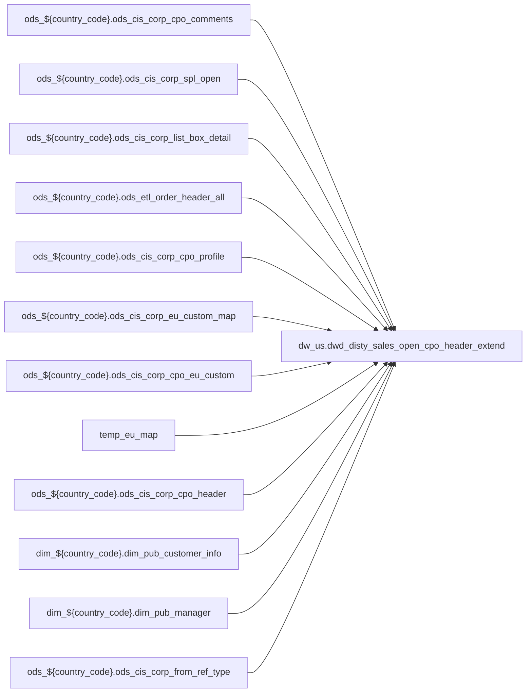

# FACT: Supplemental fact/context table used by select POS reports (`dw_us.dwd_disty_sales_open_cpo_header_extend`)

- artifact_type: etl_table
- artifact_id: dw_us.dwd_disty_sales_open_cpo_header_extend
- domain: pos
- one_line_purpose: POS-domain table with load SQL under bitbucket-etl (see L3); prior contract narrative preserved below when present.
- layer_type: DWD
- source_kind: etl_sql
- evidence_source: source/contracts/pos/bitbucket-etl/dwd_disty_sales_open_cpo_header_extend/dwd_disty_sales_open_cpo_header_extend_df.sql
- bitbucket_etl_bundle: source/contracts/pos/bitbucket-etl/dwd_disty_sales_open_cpo_header_extend/
- related_etl_scripts:
- `source/contracts/pos/bitbucket-etl/dwd_disty_sales_open_cpo_header_extend/dwd_disty_sales_open_cpo_header_extend_rt.sql`

---

## L1 Data Foundation

### Identity and physical mapping
- **Table:** `dw_us.dwd_disty_sales_open_cpo_header_extend`
- **Layer type:** DWD
- **Canonical / derived:** Derived / ETL-loaded (see L3 from bitbucket-etl)
- **Owner team:** Not documented in repository

### Grain, scope, exclusions
- See preserved **Grain and keys** section below when present (POS contract narrative retained).
- Otherwise infer from SELECT / GROUP BY / INSERT column list in `source/contracts/pos/bitbucket-etl/dwd_disty_sales_open_cpo_header_extend/dwd_disty_sales_open_cpo_header_extend_df.sql`.

### Cross-engine presence
| Engine | Present | Notes |
|--------|---------|-------|
| Hive | yes | ETL load target |
| Vertica | yes when POS contract documents Vertica sync | See preserved Business query tables |

### Physical schema reference

| Field | Value |
|-------|-------|
| **entity_id** | `dw_us.dwd_disty_sales_open_cpo_header_extend` |
| **l1_catalog_seed** | `target/storage/wkb/snapshots/_snapshot_id_template/l1_catalog/{engine}_{schema}_{table}.json` |
| **column_count** | pending (run ddl_seed_writer) |
| **partition_keys** | See preserved Grain / L4 / ETL PARTITION clause |
| **ddl_source** | pending |
| **retrieval** | `python -m tools.wkb.indexing.run_query --query "pos dwd_disty_sales_open_cpo_header_extend schema" --intent find_table_schema` |

### Lineage

- **Primary load:** `source/contracts/pos/bitbucket-etl/dwd_disty_sales_open_cpo_header_extend/dwd_disty_sales_open_cpo_header_extend_df.sql`
- **upstream:** `ods_${country_code}.ods_cis_corp_cpo_comments` — FROM/JOIN — `source/contracts/pos/bitbucket-etl/dwd_disty_sales_open_cpo_header_extend/dwd_disty_sales_open_cpo_header_extend_df.sql`
- **upstream:** `ods_${country_code}.ods_cis_corp_spl_open` — FROM/JOIN — `source/contracts/pos/bitbucket-etl/dwd_disty_sales_open_cpo_header_extend/dwd_disty_sales_open_cpo_header_extend_df.sql`
- **upstream:** `ods_${country_code}.ods_cis_corp_list_box_detail` — FROM/JOIN — `source/contracts/pos/bitbucket-etl/dwd_disty_sales_open_cpo_header_extend/dwd_disty_sales_open_cpo_header_extend_df.sql`
- **upstream:** `ods_${country_code}.ods_etl_order_header_all` — FROM/JOIN — `source/contracts/pos/bitbucket-etl/dwd_disty_sales_open_cpo_header_extend/dwd_disty_sales_open_cpo_header_extend_df.sql`
- **upstream:** `ods_${country_code}.ods_cis_corp_cpo_profile` — FROM/JOIN — `source/contracts/pos/bitbucket-etl/dwd_disty_sales_open_cpo_header_extend/dwd_disty_sales_open_cpo_header_extend_df.sql`
- **upstream:** `ods_${country_code}.ods_cis_corp_eu_custom_map` — FROM/JOIN — `source/contracts/pos/bitbucket-etl/dwd_disty_sales_open_cpo_header_extend/dwd_disty_sales_open_cpo_header_extend_df.sql`
- **upstream:** `ods_${country_code}.ods_cis_corp_cpo_eu_custom` — FROM/JOIN — `source/contracts/pos/bitbucket-etl/dwd_disty_sales_open_cpo_header_extend/dwd_disty_sales_open_cpo_header_extend_df.sql`
- **upstream:** `temp_eu_map` — FROM/JOIN — `source/contracts/pos/bitbucket-etl/dwd_disty_sales_open_cpo_header_extend/dwd_disty_sales_open_cpo_header_extend_df.sql`
- **upstream:** `ods_${country_code}.ods_cis_corp_cpo_header` — FROM/JOIN — `source/contracts/pos/bitbucket-etl/dwd_disty_sales_open_cpo_header_extend/dwd_disty_sales_open_cpo_header_extend_df.sql`
- **upstream:** `dim_${country_code}.dim_pub_customer_info` — FROM/JOIN — `source/contracts/pos/bitbucket-etl/dwd_disty_sales_open_cpo_header_extend/dwd_disty_sales_open_cpo_header_extend_df.sql`
- **upstream:** `dim_${country_code}.dim_pub_manager` — FROM/JOIN — `source/contracts/pos/bitbucket-etl/dwd_disty_sales_open_cpo_header_extend/dwd_disty_sales_open_cpo_header_extend_df.sql`
- **upstream:** `ods_${country_code}.ods_cis_corp_from_ref_type` — FROM/JOIN — `source/contracts/pos/bitbucket-etl/dwd_disty_sales_open_cpo_header_extend/dwd_disty_sales_open_cpo_header_extend_df.sql`
- **upstream:** `temp_cpo_comments` — FROM/JOIN — `source/contracts/pos/bitbucket-etl/dwd_disty_sales_open_cpo_header_extend/dwd_disty_sales_open_cpo_header_extend_df.sql`
- **upstream:** `ods_${country_code}.ods_cis_corp_cpo_eu_common` — FROM/JOIN — `source/contracts/pos/bitbucket-etl/dwd_disty_sales_open_cpo_header_extend/dwd_disty_sales_open_cpo_header_extend_df.sql`
- **upstream:** `temp_spl_open` — FROM/JOIN — `source/contracts/pos/bitbucket-etl/dwd_disty_sales_open_cpo_header_extend/dwd_disty_sales_open_cpo_header_extend_df.sql`
- **upstream:** `ods_${country_code}.ods_cis_corp_territory` — FROM/JOIN — `source/contracts/pos/bitbucket-etl/dwd_disty_sales_open_cpo_header_extend/dwd_disty_sales_open_cpo_header_extend_df.sql`
- **upstream:** `tmp_so_bo` — FROM/JOIN — `source/contracts/pos/bitbucket-etl/dwd_disty_sales_open_cpo_header_extend/dwd_disty_sales_open_cpo_header_extend_df.sql`
- **upstream:** `temp_cpo_profile` — FROM/JOIN — `source/contracts/pos/bitbucket-etl/dwd_disty_sales_open_cpo_header_extend/dwd_disty_sales_open_cpo_header_extend_df.sql`
- **upstream:** `temp_ea_proposal` — FROM/JOIN — `source/contracts/pos/bitbucket-etl/dwd_disty_sales_open_cpo_header_extend/dwd_disty_sales_open_cpo_header_extend_df.sql`
- **downstream:** see L6 Downstream consumers
### Freshness and load path
- Parameters / date window: see ETL `${literal_*}` / `${date_flag}` / `${start_date}` in evidence script.
- Schedule: Not documented in repository

## L2 Declarative Knowledge

### Business purpose
See preserved **Business purpose** below when present (POS contract catalog + linked ETL).

### Audience and use cases
See preserved **Who it helps** section when present.

### Fact key resolution
See preserved **Grain and keys** when present.

### Time field semantics
- Prefer partition / `date_flag` filters documented in preserved sections and L3 Key filters from ETL.

### Metrics served
See preserved Metrics / column groups when present; otherwise L3 column derivations.

### Metric serving map
N/A unless multi-period wide table (see preserved content).

### etl_metrics
No new metric-index formulas appended in this bitbucket-etl upgrade pass.

## L3 Procedural Knowledge

### Query and routing rules
- Reporting: Vertica `dw_us.dwd_disty_sales_open_cpo_header_extend` when synced (see preserved Business query tables).
- Load logic: bitbucket-etl evidence `source/contracts/pos/bitbucket-etl/dwd_disty_sales_open_cpo_header_extend/dwd_disty_sales_open_cpo_header_extend_df.sql`.

### Dimension join patterns
See Relationship map (ETL JOIN edges) and preserved contract join notes.

### Key filters and ETL business logic

| Predicate | Kind | Evidence |
|-----------|------|----------|
| `t.rn=1; --5 get so、 bo create or replace TEMPORARY view tmp_so_bo as select t.cpo_id, max(t.so) as so, max(t.bo) as bo from ( select int_ref_no as cpo_id, case when order_type = 1 then concat_ws(',...` | Business | `source/contracts/pos/bitbucket-etl/dwd_disty_sales_open_cpo_header_extend/dwd_disty_sales_open_cpo_header_extend_df.sql` |
| `cp.profile_type in ('CONTRNO','QUOTREQID')` | Business | `source/contracts/pos/bitbucket-etl/dwd_disty_sales_open_cpo_header_extend/dwd_disty_sales_open_cpo_header_extend_df.sql` |
| `map_data_desc='EAPI'; create or replace TEMPORARY view temp_ea_proposal as select cpo_id, data_c as ea_proposal_id from ods_${country_code}.ods_cis_corp_cpo_eu_custom ec join temp_eu_map em on ec.e...` | Business | `source/contracts/pos/bitbucket-etl/dwd_disty_sales_open_cpo_header_extend/dwd_disty_sales_open_cpo_header_extend_df.sql` |

### Standard time-filter SQL
```sql
-- Prefer date_flag / literal_start_date / literal_end_date as used in source/contracts/pos/bitbucket-etl/dwd_disty_sales_open_cpo_header_extend/dwd_disty_sales_open_cpo_header_extend_df.sql
```

### End-to-end flow


### Base tables register
| Object | Role |
|--------|------|
| `ods_${country_code}.ods_cis_corp_cpo_comments` | source / temp (FROM/JOIN) |
| `ods_${country_code}.ods_cis_corp_spl_open` | source / temp (FROM/JOIN) |
| `ods_${country_code}.ods_cis_corp_list_box_detail` | source / temp (FROM/JOIN) |
| `ods_${country_code}.ods_etl_order_header_all` | source / temp (FROM/JOIN) |
| `ods_${country_code}.ods_cis_corp_cpo_profile` | source / temp (FROM/JOIN) |
| `ods_${country_code}.ods_cis_corp_eu_custom_map` | source / temp (FROM/JOIN) |
| `ods_${country_code}.ods_cis_corp_cpo_eu_custom` | source / temp (FROM/JOIN) |
| `temp_eu_map` | source / temp (FROM/JOIN) |
| `ods_${country_code}.ods_cis_corp_cpo_header` | source / temp (FROM/JOIN) |
| `dim_${country_code}.dim_pub_customer_info` | source / temp (FROM/JOIN) |
| `dim_${country_code}.dim_pub_manager` | source / temp (FROM/JOIN) |
| `ods_${country_code}.ods_cis_corp_from_ref_type` | source / temp (FROM/JOIN) |
| `temp_cpo_comments` | source / temp (FROM/JOIN) |
| `ods_${country_code}.ods_cis_corp_cpo_eu_common` | source / temp (FROM/JOIN) |
| `temp_spl_open` | source / temp (FROM/JOIN) |
| `ods_${country_code}.ods_cis_corp_territory` | source / temp (FROM/JOIN) |
| `tmp_so_bo` | source / temp (FROM/JOIN) |
| `temp_cpo_profile` | source / temp (FROM/JOIN) |
| `temp_ea_proposal` | source / temp (FROM/JOIN) |

### Step-by-step logic
1. Execute load SQL / python in `source/contracts/pos/bitbucket-etl/dwd_disty_sales_open_cpo_header_extend/`.
2. Apply date / business filters from ETL (Key filters).
3. Write target `dw_us.dwd_disty_sales_open_cpo_header_extend` (see INSERT/OVERWRITE in evidence).

### Relationship map (embedded)

| from_fqn | to_fqn | cardinality | join_keys | provenance |
|----------|--------|-------------|-----------|------------|
| `ods_${country_code}.ods_cis_corp_spl_open` | `ods_${country_code}.ods_cis_corp_list_box_detail` | many:1 (LEFT) | `so.reason_code` = `lbd.code_value` | etl_sql (`source/contracts/pos/bitbucket-etl/dwd_disty_sales_open_cpo_header_extend/dwd_disty_sales_open_cpo_header_extend_df.sql:56`) |
| `ods_${country_code}.ods_cis_corp_cpo_eu_custom` | `temp_eu_map` | many:1 | `ec.eu_map_id` = `em.eu_map_id`; `ec.eu_map_line_no` = `em.eu_map_line_no` | etl_sql (`source/contracts/pos/bitbucket-etl/dwd_disty_sales_open_cpo_header_extend/dwd_disty_sales_open_cpo_header_extend_df.sql:119`) |
| `ods_${country_code}.ods_cis_corp_cpo_header` | `dim_${country_code}.dim_pub_customer_info` | many:1 (LEFT) | `ch.cpo_cust_no` = `pci.cust_no` | etl_sql (`source/contracts/pos/bitbucket-etl/dwd_disty_sales_open_cpo_header_extend/dwd_disty_sales_open_cpo_header_extend_df.sql:217`) |
| `ods_${country_code}.ods_cis_corp_cpo_header` | `dim_${country_code}.dim_pub_manager` | many:1 (LEFT) | `ch.cpo_entry_id` = `pm.userid` | etl_sql (`source/contracts/pos/bitbucket-etl/dwd_disty_sales_open_cpo_header_extend/dwd_disty_sales_open_cpo_header_extend_df.sql:219`) |
| `ods_${country_code}.ods_cis_corp_cpo_header` | `ods_${country_code}.ods_cis_corp_from_ref_type` | many:1 (LEFT) | `ch.cpo_from_ref_type` = `frt.from_ref_type` | etl_sql (`source/contracts/pos/bitbucket-etl/dwd_disty_sales_open_cpo_header_extend/dwd_disty_sales_open_cpo_header_extend_df.sql:221`) |
| `ods_${country_code}.ods_cis_corp_cpo_header` | `dim_${country_code}.dim_pub_manager` | many:1 (LEFT) | `ch.convert_user` = `pm1.userid` | etl_sql (`source/contracts/pos/bitbucket-etl/dwd_disty_sales_open_cpo_header_extend/dwd_disty_sales_open_cpo_header_extend_df.sql:223`) |
| `ods_${country_code}.ods_cis_corp_cpo_header` | `dim_${country_code}.dim_pub_manager` | many:1 (LEFT) | `ch.cpo_change_id` = `pm2.userid` | etl_sql (`source/contracts/pos/bitbucket-etl/dwd_disty_sales_open_cpo_header_extend/dwd_disty_sales_open_cpo_header_extend_df.sql:225`) |
| `ods_${country_code}.ods_cis_corp_cpo_header` | `dim_${country_code}.dim_pub_manager` | many:1 (LEFT) | `ch.cpo_delete_id` = `pm3.userid` | etl_sql (`source/contracts/pos/bitbucket-etl/dwd_disty_sales_open_cpo_header_extend/dwd_disty_sales_open_cpo_header_extend_df.sql:227`) |
| `ods_${country_code}.ods_cis_corp_cpo_header` | `temp_cpo_comments` | many:1 (LEFT) | `ch.cpo_id` = `tcc.cpo_id` | etl_sql (`source/contracts/pos/bitbucket-etl/dwd_disty_sales_open_cpo_header_extend/dwd_disty_sales_open_cpo_header_extend_df.sql:229`) |
| `ods_${country_code}.ods_cis_corp_cpo_header` | `ods_${country_code}.ods_cis_corp_cpo_eu_common` | many:1 (LEFT) | `ch.cpo_id` = `cec.cpo_id` | etl_sql (`source/contracts/pos/bitbucket-etl/dwd_disty_sales_open_cpo_header_extend/dwd_disty_sales_open_cpo_header_extend_df.sql:231`) |
| `ods_${country_code}.ods_cis_corp_cpo_header` | `temp_spl_open` | many:1 (LEFT) | `ch.cpo_id` = `tso.int_ref_no` | etl_sql (`source/contracts/pos/bitbucket-etl/dwd_disty_sales_open_cpo_header_extend/dwd_disty_sales_open_cpo_header_extend_df.sql:234`) |
| `ods_${country_code}.ods_cis_corp_cpo_header` | `ods_${country_code}.ods_cis_corp_territory` | many:1 (LEFT) | `ch.cpo_sales_terr` = `ter.sales_terr` | etl_sql (`source/contracts/pos/bitbucket-etl/dwd_disty_sales_open_cpo_header_extend/dwd_disty_sales_open_cpo_header_extend_df.sql:236`) |
| `ods_${country_code}.ods_cis_corp_cpo_header` | `tmp_so_bo` | many:1 (LEFT) | `ch.cpo_id` = `tsb.cpo_id` | etl_sql (`source/contracts/pos/bitbucket-etl/dwd_disty_sales_open_cpo_header_extend/dwd_disty_sales_open_cpo_header_extend_df.sql:238`) |
| `ods_${country_code}.ods_cis_corp_cpo_header` | `temp_cpo_profile` | many:1 (LEFT) | `ch.cpo_id` = `cp.cpo_id` | etl_sql (`source/contracts/pos/bitbucket-etl/dwd_disty_sales_open_cpo_header_extend/dwd_disty_sales_open_cpo_header_extend_df.sql:240`) |
| `ods_${country_code}.ods_cis_corp_cpo_header` | `temp_ea_proposal` | many:1 (LEFT) | `ch.cpo_id` = `ep.cpo_id` | etl_sql (`source/contracts/pos/bitbucket-etl/dwd_disty_sales_open_cpo_header_extend/dwd_disty_sales_open_cpo_header_extend_df.sql:242`) |

### Special logic (embedded)

`source/ref/pos/special_logic.txt` exists but no rule naming this FQN/stem (`dw_us.dwd_disty_sales_open_cpo_header_extend`).

Not documented in repository


### Column / field derivations (from ETL SQL)

| target_column | expression_sql | upstream_columns | upstream_tables | transform_kind | evidence |
|---------------|----------------|------------------|-----------------|----------------|----------|
| `cpo_id` | `ch.cpo_id` | `cpo_id` | `ods_${country_code}.ods_cis_corp_cpo_header`, `dim_${country_code}.dim_pub_customer_info`, `dim_${country_code}.dim_pub_manager`, `ods_${country_code}.ods_cis_corp_from_ref_type`, `temp_cpo_comments`, `ods_${country_code}.ods_cis_corp_cpo_eu_common`, `temp_spl_open`, `ods_${country_code}.ods_cis_corp_territory`, `tmp_so_bo`, `temp_cpo_profile`, `temp_ea_proposal` | passthrough | `source/contracts/pos/bitbucket-etl/dwd_disty_sales_open_cpo_header_extend/dwd_disty_sales_open_cpo_header_extend_df.sql:128` |
| `cpo_no` | `ch.cpo_no` | `cpo_no` | `ods_${country_code}.ods_cis_corp_cpo_header`, `dim_${country_code}.dim_pub_customer_info`, `dim_${country_code}.dim_pub_manager`, `ods_${country_code}.ods_cis_corp_from_ref_type`, `temp_cpo_comments`, `ods_${country_code}.ods_cis_corp_cpo_eu_common`, `temp_spl_open`, `ods_${country_code}.ods_cis_corp_territory`, `tmp_so_bo`, `temp_cpo_profile`, `temp_ea_proposal` | passthrough | `source/contracts/pos/bitbucket-etl/dwd_disty_sales_open_cpo_header_extend/dwd_disty_sales_open_cpo_header_extend_df.sql:129` |
| `cpo_cust_no` | `ch.cpo_cust_no` | `cpo_cust_no` | `ods_${country_code}.ods_cis_corp_cpo_header`, `dim_${country_code}.dim_pub_customer_info`, `dim_${country_code}.dim_pub_manager`, `ods_${country_code}.ods_cis_corp_from_ref_type`, `temp_cpo_comments`, `ods_${country_code}.ods_cis_corp_cpo_eu_common`, `temp_spl_open`, `ods_${country_code}.ods_cis_corp_territory`, `tmp_so_bo`, `temp_cpo_profile`, `temp_ea_proposal` | passthrough | `source/contracts/pos/bitbucket-etl/dwd_disty_sales_open_cpo_header_extend/dwd_disty_sales_open_cpo_header_extend_df.sql:130` |
| `cpo_cust_name` | `pci.cust_name cpo_cust_name` | `cust_name`, `cpo_cust_name` | `ods_${country_code}.ods_cis_corp_cpo_header`, `dim_${country_code}.dim_pub_customer_info`, `dim_${country_code}.dim_pub_manager`, `ods_${country_code}.ods_cis_corp_from_ref_type`, `temp_cpo_comments`, `ods_${country_code}.ods_cis_corp_cpo_eu_common`, `temp_spl_open`, `ods_${country_code}.ods_cis_corp_territory`, `tmp_so_bo`, `temp_cpo_profile`, `temp_ea_proposal` | partial | `source/contracts/pos/bitbucket-etl/dwd_disty_sales_open_cpo_header_extend/dwd_disty_sales_open_cpo_header_extend_df.sql:131` |
| `cpo_sales_terr` | `ch.cpo_sales_terr` | `cpo_sales_terr` | `ods_${country_code}.ods_cis_corp_cpo_header`, `dim_${country_code}.dim_pub_customer_info`, `dim_${country_code}.dim_pub_manager`, `ods_${country_code}.ods_cis_corp_from_ref_type`, `temp_cpo_comments`, `ods_${country_code}.ods_cis_corp_cpo_eu_common`, `temp_spl_open`, `ods_${country_code}.ods_cis_corp_territory`, `tmp_so_bo`, `temp_cpo_profile`, `temp_ea_proposal` | passthrough | `source/contracts/pos/bitbucket-etl/dwd_disty_sales_open_cpo_header_extend/dwd_disty_sales_open_cpo_header_extend_df.sql:132` |
| `cpo_entry_id` | `ch.cpo_entry_id` | `cpo_entry_id` | `ods_${country_code}.ods_cis_corp_cpo_header`, `dim_${country_code}.dim_pub_customer_info`, `dim_${country_code}.dim_pub_manager`, `ods_${country_code}.ods_cis_corp_from_ref_type`, `temp_cpo_comments`, `ods_${country_code}.ods_cis_corp_cpo_eu_common`, `temp_spl_open`, `ods_${country_code}.ods_cis_corp_territory`, `tmp_so_bo`, `temp_cpo_profile`, `temp_ea_proposal` | passthrough | `source/contracts/pos/bitbucket-etl/dwd_disty_sales_open_cpo_header_extend/dwd_disty_sales_open_cpo_header_extend_df.sql:133` |
| `cpo_entry_name` | `pm.name` | `name` | `ods_${country_code}.ods_cis_corp_cpo_header`, `dim_${country_code}.dim_pub_customer_info`, `dim_${country_code}.dim_pub_manager`, `ods_${country_code}.ods_cis_corp_from_ref_type`, `temp_cpo_comments`, `ods_${country_code}.ods_cis_corp_cpo_eu_common`, `temp_spl_open`, `ods_${country_code}.ods_cis_corp_territory`, `tmp_so_bo`, `temp_cpo_profile`, `temp_ea_proposal` | rename | `source/contracts/pos/bitbucket-etl/dwd_disty_sales_open_cpo_header_extend/dwd_disty_sales_open_cpo_header_extend_df.sql:134` |
| `cpo_entry_datetime` | `ch.cpo_entry_datetime` | `cpo_entry_datetime` | `ods_${country_code}.ods_cis_corp_cpo_header`, `dim_${country_code}.dim_pub_customer_info`, `dim_${country_code}.dim_pub_manager`, `ods_${country_code}.ods_cis_corp_from_ref_type`, `temp_cpo_comments`, `ods_${country_code}.ods_cis_corp_cpo_eu_common`, `temp_spl_open`, `ods_${country_code}.ods_cis_corp_territory`, `tmp_so_bo`, `temp_cpo_profile`, `temp_ea_proposal` | passthrough | `source/contracts/pos/bitbucket-etl/dwd_disty_sales_open_cpo_header_extend/dwd_disty_sales_open_cpo_header_extend_df.sql:135` |
| `cpo_from_ref_type` | `ch.cpo_from_ref_type` | `cpo_from_ref_type` | `ods_${country_code}.ods_cis_corp_cpo_header`, `dim_${country_code}.dim_pub_customer_info`, `dim_${country_code}.dim_pub_manager`, `ods_${country_code}.ods_cis_corp_from_ref_type`, `temp_cpo_comments`, `ods_${country_code}.ods_cis_corp_cpo_eu_common`, `temp_spl_open`, `ods_${country_code}.ods_cis_corp_territory`, `tmp_so_bo`, `temp_cpo_profile`, `temp_ea_proposal` | passthrough | `source/contracts/pos/bitbucket-etl/dwd_disty_sales_open_cpo_header_extend/dwd_disty_sales_open_cpo_header_extend_df.sql:136` |
| `cpo_from_ref_type_desc` | `frt.from_ref_type_desc` | `from_ref_type_desc` | `ods_${country_code}.ods_cis_corp_cpo_header`, `dim_${country_code}.dim_pub_customer_info`, `dim_${country_code}.dim_pub_manager`, `ods_${country_code}.ods_cis_corp_from_ref_type`, `temp_cpo_comments`, `ods_${country_code}.ods_cis_corp_cpo_eu_common`, `temp_spl_open`, `ods_${country_code}.ods_cis_corp_territory`, `tmp_so_bo`, `temp_cpo_profile`, `temp_ea_proposal` | rename | `source/contracts/pos/bitbucket-etl/dwd_disty_sales_open_cpo_header_extend/dwd_disty_sales_open_cpo_header_extend_df.sql:137` |
| `system_type` | `frt.system_type` | `system_type` | `ods_${country_code}.ods_cis_corp_cpo_header`, `dim_${country_code}.dim_pub_customer_info`, `dim_${country_code}.dim_pub_manager`, `ods_${country_code}.ods_cis_corp_from_ref_type`, `temp_cpo_comments`, `ods_${country_code}.ods_cis_corp_cpo_eu_common`, `temp_spl_open`, `ods_${country_code}.ods_cis_corp_territory`, `tmp_so_bo`, `temp_cpo_profile`, `temp_ea_proposal` | passthrough | `source/contracts/pos/bitbucket-etl/dwd_disty_sales_open_cpo_header_extend/dwd_disty_sales_open_cpo_header_extend_df.sql:138` |
| `cpo_pay_meth` | `ch.cpo_pay_meth` | `cpo_pay_meth` | `ods_${country_code}.ods_cis_corp_cpo_header`, `dim_${country_code}.dim_pub_customer_info`, `dim_${country_code}.dim_pub_manager`, `ods_${country_code}.ods_cis_corp_from_ref_type`, `temp_cpo_comments`, `ods_${country_code}.ods_cis_corp_cpo_eu_common`, `temp_spl_open`, `ods_${country_code}.ods_cis_corp_territory`, `tmp_so_bo`, `temp_cpo_profile`, `temp_ea_proposal` | passthrough | `source/contracts/pos/bitbucket-etl/dwd_disty_sales_open_cpo_header_extend/dwd_disty_sales_open_cpo_header_extend_df.sql:139` |
| `cpo_total_taxable` | `ch.cpo_total_taxable` | `cpo_total_taxable` | `ods_${country_code}.ods_cis_corp_cpo_header`, `dim_${country_code}.dim_pub_customer_info`, `dim_${country_code}.dim_pub_manager`, `ods_${country_code}.ods_cis_corp_from_ref_type`, `temp_cpo_comments`, `ods_${country_code}.ods_cis_corp_cpo_eu_common`, `temp_spl_open`, `ods_${country_code}.ods_cis_corp_territory`, `tmp_so_bo`, `temp_cpo_profile`, `temp_ea_proposal` | passthrough | `source/contracts/pos/bitbucket-etl/dwd_disty_sales_open_cpo_header_extend/dwd_disty_sales_open_cpo_header_extend_df.sql:140` |
| `cpo_total_notax` | `ch.cpo_total_notax` | `cpo_total_notax` | `ods_${country_code}.ods_cis_corp_cpo_header`, `dim_${country_code}.dim_pub_customer_info`, `dim_${country_code}.dim_pub_manager`, `ods_${country_code}.ods_cis_corp_from_ref_type`, `temp_cpo_comments`, `ods_${country_code}.ods_cis_corp_cpo_eu_common`, `temp_spl_open`, `ods_${country_code}.ods_cis_corp_territory`, `tmp_so_bo`, `temp_cpo_profile`, `temp_ea_proposal` | passthrough | `source/contracts/pos/bitbucket-etl/dwd_disty_sales_open_cpo_header_extend/dwd_disty_sales_open_cpo_header_extend_df.sql:141` |
| `cpo_sales_tax` | `ch.cpo_sales_tax` | `cpo_sales_tax` | `ods_${country_code}.ods_cis_corp_cpo_header`, `dim_${country_code}.dim_pub_customer_info`, `dim_${country_code}.dim_pub_manager`, `ods_${country_code}.ods_cis_corp_from_ref_type`, `temp_cpo_comments`, `ods_${country_code}.ods_cis_corp_cpo_eu_common`, `temp_spl_open`, `ods_${country_code}.ods_cis_corp_territory`, `tmp_so_bo`, `temp_cpo_profile`, `temp_ea_proposal` | passthrough | `source/contracts/pos/bitbucket-etl/dwd_disty_sales_open_cpo_header_extend/dwd_disty_sales_open_cpo_header_extend_df.sql:142` |
| `cpo_freight` | `ch.cpo_freight` | `cpo_freight` | `ods_${country_code}.ods_cis_corp_cpo_header`, `dim_${country_code}.dim_pub_customer_info`, `dim_${country_code}.dim_pub_manager`, `ods_${country_code}.ods_cis_corp_from_ref_type`, `temp_cpo_comments`, `ods_${country_code}.ods_cis_corp_cpo_eu_common`, `temp_spl_open`, `ods_${country_code}.ods_cis_corp_territory`, `tmp_so_bo`, `temp_cpo_profile`, `temp_ea_proposal` | passthrough | `source/contracts/pos/bitbucket-etl/dwd_disty_sales_open_cpo_header_extend/dwd_disty_sales_open_cpo_header_extend_df.sql:143` |
| `cpo_other` | `ch.cpo_other` | `cpo_other` | `ods_${country_code}.ods_cis_corp_cpo_header`, `dim_${country_code}.dim_pub_customer_info`, `dim_${country_code}.dim_pub_manager`, `ods_${country_code}.ods_cis_corp_from_ref_type`, `temp_cpo_comments`, `ods_${country_code}.ods_cis_corp_cpo_eu_common`, `temp_spl_open`, `ods_${country_code}.ods_cis_corp_territory`, `tmp_so_bo`, `temp_cpo_profile`, `temp_ea_proposal` | passthrough | `source/contracts/pos/bitbucket-etl/dwd_disty_sales_open_cpo_header_extend/dwd_disty_sales_open_cpo_header_extend_df.sql:144` |
| `cpo_so_total` | `ch.cpo_so_total` | `cpo_so_total` | `ods_${country_code}.ods_cis_corp_cpo_header`, `dim_${country_code}.dim_pub_customer_info`, `dim_${country_code}.dim_pub_manager`, `ods_${country_code}.ods_cis_corp_from_ref_type`, `temp_cpo_comments`, `ods_${country_code}.ods_cis_corp_cpo_eu_common`, `temp_spl_open`, `ods_${country_code}.ods_cis_corp_territory`, `tmp_so_bo`, `temp_cpo_profile`, `temp_ea_proposal` | passthrough | `source/contracts/pos/bitbucket-etl/dwd_disty_sales_open_cpo_header_extend/dwd_disty_sales_open_cpo_header_extend_df.sql:145` |
| `cpo_bo_total` | `ch.cpo_bo_total` | `cpo_bo_total` | `ods_${country_code}.ods_cis_corp_cpo_header`, `dim_${country_code}.dim_pub_customer_info`, `dim_${country_code}.dim_pub_manager`, `ods_${country_code}.ods_cis_corp_from_ref_type`, `temp_cpo_comments`, `ods_${country_code}.ods_cis_corp_cpo_eu_common`, `temp_spl_open`, `ods_${country_code}.ods_cis_corp_territory`, `tmp_so_bo`, `temp_cpo_profile`, `temp_ea_proposal` | passthrough | `source/contracts/pos/bitbucket-etl/dwd_disty_sales_open_cpo_header_extend/dwd_disty_sales_open_cpo_header_extend_df.sql:146` |
| `po_total` | `ch.po_total` | `po_total` | `ods_${country_code}.ods_cis_corp_cpo_header`, `dim_${country_code}.dim_pub_customer_info`, `dim_${country_code}.dim_pub_manager`, `ods_${country_code}.ods_cis_corp_from_ref_type`, `temp_cpo_comments`, `ods_${country_code}.ods_cis_corp_cpo_eu_common`, `temp_spl_open`, `ods_${country_code}.ods_cis_corp_territory`, `tmp_so_bo`, `temp_cpo_profile`, `temp_ea_proposal` | passthrough | `source/contracts/pos/bitbucket-etl/dwd_disty_sales_open_cpo_header_extend/dwd_disty_sales_open_cpo_header_extend_df.sql:147` |
| `cpo_ship_method` | `ch.cpo_ship_method` | `cpo_ship_method` | `ods_${country_code}.ods_cis_corp_cpo_header`, `dim_${country_code}.dim_pub_customer_info`, `dim_${country_code}.dim_pub_manager`, `ods_${country_code}.ods_cis_corp_from_ref_type`, `temp_cpo_comments`, `ods_${country_code}.ods_cis_corp_cpo_eu_common`, `temp_spl_open`, `ods_${country_code}.ods_cis_corp_territory`, `tmp_so_bo`, `temp_cpo_profile`, `temp_ea_proposal` | passthrough | `source/contracts/pos/bitbucket-etl/dwd_disty_sales_open_cpo_header_extend/dwd_disty_sales_open_cpo_header_extend_df.sql:148` |
| `cpo_ship_loc_type` | `ch.cpo_ship_loc_type` | `cpo_ship_loc_type` | `ods_${country_code}.ods_cis_corp_cpo_header`, `dim_${country_code}.dim_pub_customer_info`, `dim_${country_code}.dim_pub_manager`, `ods_${country_code}.ods_cis_corp_from_ref_type`, `temp_cpo_comments`, `ods_${country_code}.ods_cis_corp_cpo_eu_common`, `temp_spl_open`, `ods_${country_code}.ods_cis_corp_territory`, `tmp_so_bo`, `temp_cpo_profile`, `temp_ea_proposal` | passthrough | `source/contracts/pos/bitbucket-etl/dwd_disty_sales_open_cpo_header_extend/dwd_disty_sales_open_cpo_header_extend_df.sql:149` |
| `end_user_po_no` | `ch.end_user_po_no` | `end_user_po_no` | `ods_${country_code}.ods_cis_corp_cpo_header`, `dim_${country_code}.dim_pub_customer_info`, `dim_${country_code}.dim_pub_manager`, `ods_${country_code}.ods_cis_corp_from_ref_type`, `temp_cpo_comments`, `ods_${country_code}.ods_cis_corp_cpo_eu_common`, `temp_spl_open`, `ods_${country_code}.ods_cis_corp_territory`, `tmp_so_bo`, `temp_cpo_profile`, `temp_ea_proposal` | passthrough | `source/contracts/pos/bitbucket-etl/dwd_disty_sales_open_cpo_header_extend/dwd_disty_sales_open_cpo_header_extend_df.sql:150` |
| `special_handle` | `ch.special_handle` | `special_handle` | `ods_${country_code}.ods_cis_corp_cpo_header`, `dim_${country_code}.dim_pub_customer_info`, `dim_${country_code}.dim_pub_manager`, `ods_${country_code}.ods_cis_corp_from_ref_type`, `temp_cpo_comments`, `ods_${country_code}.ods_cis_corp_cpo_eu_common`, `temp_spl_open`, `ods_${country_code}.ods_cis_corp_territory`, `tmp_so_bo`, `temp_cpo_profile`, `temp_ea_proposal` | passthrough | `source/contracts/pos/bitbucket-etl/dwd_disty_sales_open_cpo_header_extend/dwd_disty_sales_open_cpo_header_extend_df.sql:151` |
| `ship_name1` | `ch.ship_name1` | `ship_name1` | `ods_${country_code}.ods_cis_corp_cpo_header`, `dim_${country_code}.dim_pub_customer_info`, `dim_${country_code}.dim_pub_manager`, `ods_${country_code}.ods_cis_corp_from_ref_type`, `temp_cpo_comments`, `ods_${country_code}.ods_cis_corp_cpo_eu_common`, `temp_spl_open`, `ods_${country_code}.ods_cis_corp_territory`, `tmp_so_bo`, `temp_cpo_profile`, `temp_ea_proposal` | passthrough | `source/contracts/pos/bitbucket-etl/dwd_disty_sales_open_cpo_header_extend/dwd_disty_sales_open_cpo_header_extend_df.sql:152` |
| `ship_addr1` | `ch.ship_addr1` | `ship_addr1` | `ods_${country_code}.ods_cis_corp_cpo_header`, `dim_${country_code}.dim_pub_customer_info`, `dim_${country_code}.dim_pub_manager`, `ods_${country_code}.ods_cis_corp_from_ref_type`, `temp_cpo_comments`, `ods_${country_code}.ods_cis_corp_cpo_eu_common`, `temp_spl_open`, `ods_${country_code}.ods_cis_corp_territory`, `tmp_so_bo`, `temp_cpo_profile`, `temp_ea_proposal` | passthrough | `source/contracts/pos/bitbucket-etl/dwd_disty_sales_open_cpo_header_extend/dwd_disty_sales_open_cpo_header_extend_df.sql:153` |
| `ship_addr2` | `ch.ship_addr2` | `ship_addr2` | `ods_${country_code}.ods_cis_corp_cpo_header`, `dim_${country_code}.dim_pub_customer_info`, `dim_${country_code}.dim_pub_manager`, `ods_${country_code}.ods_cis_corp_from_ref_type`, `temp_cpo_comments`, `ods_${country_code}.ods_cis_corp_cpo_eu_common`, `temp_spl_open`, `ods_${country_code}.ods_cis_corp_territory`, `tmp_so_bo`, `temp_cpo_profile`, `temp_ea_proposal` | passthrough | `source/contracts/pos/bitbucket-etl/dwd_disty_sales_open_cpo_header_extend/dwd_disty_sales_open_cpo_header_extend_df.sql:154` |
| `ship_zipcode` | `ch.ship_zipcode` | `ship_zipcode` | `ods_${country_code}.ods_cis_corp_cpo_header`, `dim_${country_code}.dim_pub_customer_info`, `dim_${country_code}.dim_pub_manager`, `ods_${country_code}.ods_cis_corp_from_ref_type`, `temp_cpo_comments`, `ods_${country_code}.ods_cis_corp_cpo_eu_common`, `temp_spl_open`, `ods_${country_code}.ods_cis_corp_territory`, `tmp_so_bo`, `temp_cpo_profile`, `temp_ea_proposal` | passthrough | `source/contracts/pos/bitbucket-etl/dwd_disty_sales_open_cpo_header_extend/dwd_disty_sales_open_cpo_header_extend_df.sql:155` |
| `ship_country` | `ch.ship_country` | `ship_country` | `ods_${country_code}.ods_cis_corp_cpo_header`, `dim_${country_code}.dim_pub_customer_info`, `dim_${country_code}.dim_pub_manager`, `ods_${country_code}.ods_cis_corp_from_ref_type`, `temp_cpo_comments`, `ods_${country_code}.ods_cis_corp_cpo_eu_common`, `temp_spl_open`, `ods_${country_code}.ods_cis_corp_territory`, `tmp_so_bo`, `temp_cpo_profile`, `temp_ea_proposal` | passthrough | `source/contracts/pos/bitbucket-etl/dwd_disty_sales_open_cpo_header_extend/dwd_disty_sales_open_cpo_header_extend_df.sql:156` |
| `ship_city` | `ch.ship_city` | `ship_city` | `ods_${country_code}.ods_cis_corp_cpo_header`, `dim_${country_code}.dim_pub_customer_info`, `dim_${country_code}.dim_pub_manager`, `ods_${country_code}.ods_cis_corp_from_ref_type`, `temp_cpo_comments`, `ods_${country_code}.ods_cis_corp_cpo_eu_common`, `temp_spl_open`, `ods_${country_code}.ods_cis_corp_territory`, `tmp_so_bo`, `temp_cpo_profile`, `temp_ea_proposal` | passthrough | `source/contracts/pos/bitbucket-etl/dwd_disty_sales_open_cpo_header_extend/dwd_disty_sales_open_cpo_header_extend_df.sql:157` |
| `ship_state` | `ch.ship_state` | `ship_state` | `ods_${country_code}.ods_cis_corp_cpo_header`, `dim_${country_code}.dim_pub_customer_info`, `dim_${country_code}.dim_pub_manager`, `ods_${country_code}.ods_cis_corp_from_ref_type`, `temp_cpo_comments`, `ods_${country_code}.ods_cis_corp_cpo_eu_common`, `temp_spl_open`, `ods_${country_code}.ods_cis_corp_territory`, `tmp_so_bo`, `temp_cpo_profile`, `temp_ea_proposal` | passthrough | `source/contracts/pos/bitbucket-etl/dwd_disty_sales_open_cpo_header_extend/dwd_disty_sales_open_cpo_header_extend_df.sql:158` |
| `ship_contact` | `ch.ship_contact` | `ship_contact` | `ods_${country_code}.ods_cis_corp_cpo_header`, `dim_${country_code}.dim_pub_customer_info`, `dim_${country_code}.dim_pub_manager`, `ods_${country_code}.ods_cis_corp_from_ref_type`, `temp_cpo_comments`, `ods_${country_code}.ods_cis_corp_cpo_eu_common`, `temp_spl_open`, `ods_${country_code}.ods_cis_corp_territory`, `tmp_so_bo`, `temp_cpo_profile`, `temp_ea_proposal` | passthrough | `source/contracts/pos/bitbucket-etl/dwd_disty_sales_open_cpo_header_extend/dwd_disty_sales_open_cpo_header_extend_df.sql:159` |
| `ship_phone` | `ch.ship_phone` | `ship_phone` | `ods_${country_code}.ods_cis_corp_cpo_header`, `dim_${country_code}.dim_pub_customer_info`, `dim_${country_code}.dim_pub_manager`, `ods_${country_code}.ods_cis_corp_from_ref_type`, `temp_cpo_comments`, `ods_${country_code}.ods_cis_corp_cpo_eu_common`, `temp_spl_open`, `ods_${country_code}.ods_cis_corp_territory`, `tmp_so_bo`, `temp_cpo_profile`, `temp_ea_proposal` | passthrough | `source/contracts/pos/bitbucket-etl/dwd_disty_sales_open_cpo_header_extend/dwd_disty_sales_open_cpo_header_extend_df.sql:160` |
| `frt_pay_type` | `ch.frt_pay_type` | `frt_pay_type` | `ods_${country_code}.ods_cis_corp_cpo_header`, `dim_${country_code}.dim_pub_customer_info`, `dim_${country_code}.dim_pub_manager`, `ods_${country_code}.ods_cis_corp_from_ref_type`, `temp_cpo_comments`, `ods_${country_code}.ods_cis_corp_cpo_eu_common`, `temp_spl_open`, `ods_${country_code}.ods_cis_corp_territory`, `tmp_so_bo`, `temp_cpo_profile`, `temp_ea_proposal` | passthrough | `source/contracts/pos/bitbucket-etl/dwd_disty_sales_open_cpo_header_extend/dwd_disty_sales_open_cpo_header_extend_df.sql:161` |
| `convert_datetime` | `ch.convert_datetime` | `convert_datetime` | `ods_${country_code}.ods_cis_corp_cpo_header`, `dim_${country_code}.dim_pub_customer_info`, `dim_${country_code}.dim_pub_manager`, `ods_${country_code}.ods_cis_corp_from_ref_type`, `temp_cpo_comments`, `ods_${country_code}.ods_cis_corp_cpo_eu_common`, `temp_spl_open`, `ods_${country_code}.ods_cis_corp_territory`, `tmp_so_bo`, `temp_cpo_profile`, `temp_ea_proposal` | passthrough | `source/contracts/pos/bitbucket-etl/dwd_disty_sales_open_cpo_header_extend/dwd_disty_sales_open_cpo_header_extend_df.sql:162` |
| `convert_user` | `ch.convert_user` | `convert_user` | `ods_${country_code}.ods_cis_corp_cpo_header`, `dim_${country_code}.dim_pub_customer_info`, `dim_${country_code}.dim_pub_manager`, `ods_${country_code}.ods_cis_corp_from_ref_type`, `temp_cpo_comments`, `ods_${country_code}.ods_cis_corp_cpo_eu_common`, `temp_spl_open`, `ods_${country_code}.ods_cis_corp_territory`, `tmp_so_bo`, `temp_cpo_profile`, `temp_ea_proposal` | passthrough | `source/contracts/pos/bitbucket-etl/dwd_disty_sales_open_cpo_header_extend/dwd_disty_sales_open_cpo_header_extend_df.sql:163` |
| `convert_user_name` | `pm1.name` | `name` | `ods_${country_code}.ods_cis_corp_cpo_header`, `dim_${country_code}.dim_pub_customer_info`, `dim_${country_code}.dim_pub_manager`, `ods_${country_code}.ods_cis_corp_from_ref_type`, `temp_cpo_comments`, `ods_${country_code}.ods_cis_corp_cpo_eu_common`, `temp_spl_open`, `ods_${country_code}.ods_cis_corp_territory`, `tmp_so_bo`, `temp_cpo_profile`, `temp_ea_proposal` | rename | `source/contracts/pos/bitbucket-etl/dwd_disty_sales_open_cpo_header_extend/dwd_disty_sales_open_cpo_header_extend_df.sql:164` |
| `sales_model` | `ch.sales_model` | `sales_model` | `ods_${country_code}.ods_cis_corp_cpo_header`, `dim_${country_code}.dim_pub_customer_info`, `dim_${country_code}.dim_pub_manager`, `ods_${country_code}.ods_cis_corp_from_ref_type`, `temp_cpo_comments`, `ods_${country_code}.ods_cis_corp_cpo_eu_common`, `temp_spl_open`, `ods_${country_code}.ods_cis_corp_territory`, `tmp_so_bo`, `temp_cpo_profile`, `temp_ea_proposal` | passthrough | `source/contracts/pos/bitbucket-etl/dwd_disty_sales_open_cpo_header_extend/dwd_disty_sales_open_cpo_header_extend_df.sql:165` |
| `reseller_cust_no` | `ch.reseller_cust_no` | `reseller_cust_no` | `ods_${country_code}.ods_cis_corp_cpo_header`, `dim_${country_code}.dim_pub_customer_info`, `dim_${country_code}.dim_pub_manager`, `ods_${country_code}.ods_cis_corp_from_ref_type`, `temp_cpo_comments`, `ods_${country_code}.ods_cis_corp_cpo_eu_common`, `temp_spl_open`, `ods_${country_code}.ods_cis_corp_territory`, `tmp_so_bo`, `temp_cpo_profile`, `temp_ea_proposal` | passthrough | `source/contracts/pos/bitbucket-etl/dwd_disty_sales_open_cpo_header_extend/dwd_disty_sales_open_cpo_header_extend_df.sql:166` |
| `shopping_mode` | `ch.shopping_mode` | `shopping_mode` | `ods_${country_code}.ods_cis_corp_cpo_header`, `dim_${country_code}.dim_pub_customer_info`, `dim_${country_code}.dim_pub_manager`, `ods_${country_code}.ods_cis_corp_from_ref_type`, `temp_cpo_comments`, `ods_${country_code}.ods_cis_corp_cpo_eu_common`, `temp_spl_open`, `ods_${country_code}.ods_cis_corp_territory`, `tmp_so_bo`, `temp_cpo_profile`, `temp_ea_proposal` | passthrough | `source/contracts/pos/bitbucket-etl/dwd_disty_sales_open_cpo_header_extend/dwd_disty_sales_open_cpo_header_extend_df.sql:167` |
| `end_user_no` | `ch.end_user_no` | `end_user_no` | `ods_${country_code}.ods_cis_corp_cpo_header`, `dim_${country_code}.dim_pub_customer_info`, `dim_${country_code}.dim_pub_manager`, `ods_${country_code}.ods_cis_corp_from_ref_type`, `temp_cpo_comments`, `ods_${country_code}.ods_cis_corp_cpo_eu_common`, `temp_spl_open`, `ods_${country_code}.ods_cis_corp_territory`, `tmp_so_bo`, `temp_cpo_profile`, `temp_ea_proposal` | passthrough | `source/contracts/pos/bitbucket-etl/dwd_disty_sales_open_cpo_header_extend/dwd_disty_sales_open_cpo_header_extend_df.sql:168` |
| `cpo_swl_flag` | `ch.cpo_swl_flag` | `cpo_swl_flag` | `ods_${country_code}.ods_cis_corp_cpo_header`, `dim_${country_code}.dim_pub_customer_info`, `dim_${country_code}.dim_pub_manager`, `ods_${country_code}.ods_cis_corp_from_ref_type`, `temp_cpo_comments`, `ods_${country_code}.ods_cis_corp_cpo_eu_common`, `temp_spl_open`, `ods_${country_code}.ods_cis_corp_territory`, `tmp_so_bo`, `temp_cpo_profile`, `temp_ea_proposal` | passthrough | `source/contracts/pos/bitbucket-etl/dwd_disty_sales_open_cpo_header_extend/dwd_disty_sales_open_cpo_header_extend_df.sql:169` |
| `cpo_spa_type` | `ch.cpo_spa_type` | `cpo_spa_type` | `ods_${country_code}.ods_cis_corp_cpo_header`, `dim_${country_code}.dim_pub_customer_info`, `dim_${country_code}.dim_pub_manager`, `ods_${country_code}.ods_cis_corp_from_ref_type`, `temp_cpo_comments`, `ods_${country_code}.ods_cis_corp_cpo_eu_common`, `temp_spl_open`, `ods_${country_code}.ods_cis_corp_territory`, `tmp_so_bo`, `temp_cpo_profile`, `temp_ea_proposal` | passthrough | `source/contracts/pos/bitbucket-etl/dwd_disty_sales_open_cpo_header_extend/dwd_disty_sales_open_cpo_header_extend_df.sql:170` |
| `cpo_change_id` | `ch.cpo_change_id` | `cpo_change_id` | `ods_${country_code}.ods_cis_corp_cpo_header`, `dim_${country_code}.dim_pub_customer_info`, `dim_${country_code}.dim_pub_manager`, `ods_${country_code}.ods_cis_corp_from_ref_type`, `temp_cpo_comments`, `ods_${country_code}.ods_cis_corp_cpo_eu_common`, `temp_spl_open`, `ods_${country_code}.ods_cis_corp_territory`, `tmp_so_bo`, `temp_cpo_profile`, `temp_ea_proposal` | passthrough | `source/contracts/pos/bitbucket-etl/dwd_disty_sales_open_cpo_header_extend/dwd_disty_sales_open_cpo_header_extend_df.sql:171` |
| `cpo_change_name` | `pm2.name` | `name` | `ods_${country_code}.ods_cis_corp_cpo_header`, `dim_${country_code}.dim_pub_customer_info`, `dim_${country_code}.dim_pub_manager`, `ods_${country_code}.ods_cis_corp_from_ref_type`, `temp_cpo_comments`, `ods_${country_code}.ods_cis_corp_cpo_eu_common`, `temp_spl_open`, `ods_${country_code}.ods_cis_corp_territory`, `tmp_so_bo`, `temp_cpo_profile`, `temp_ea_proposal` | rename | `source/contracts/pos/bitbucket-etl/dwd_disty_sales_open_cpo_header_extend/dwd_disty_sales_open_cpo_header_extend_df.sql:172` |
| `cpo_change_date` | `ch.cpo_change_date` | `cpo_change_date` | `ods_${country_code}.ods_cis_corp_cpo_header`, `dim_${country_code}.dim_pub_customer_info`, `dim_${country_code}.dim_pub_manager`, `ods_${country_code}.ods_cis_corp_from_ref_type`, `temp_cpo_comments`, `ods_${country_code}.ods_cis_corp_cpo_eu_common`, `temp_spl_open`, `ods_${country_code}.ods_cis_corp_territory`, `tmp_so_bo`, `temp_cpo_profile`, `temp_ea_proposal` | passthrough | `source/contracts/pos/bitbucket-etl/dwd_disty_sales_open_cpo_header_extend/dwd_disty_sales_open_cpo_header_extend_df.sql:173` |
| `cpo_delete_id` | `ch.cpo_delete_id` | `cpo_delete_id` | `ods_${country_code}.ods_cis_corp_cpo_header`, `dim_${country_code}.dim_pub_customer_info`, `dim_${country_code}.dim_pub_manager`, `ods_${country_code}.ods_cis_corp_from_ref_type`, `temp_cpo_comments`, `ods_${country_code}.ods_cis_corp_cpo_eu_common`, `temp_spl_open`, `ods_${country_code}.ods_cis_corp_territory`, `tmp_so_bo`, `temp_cpo_profile`, `temp_ea_proposal` | passthrough | `source/contracts/pos/bitbucket-etl/dwd_disty_sales_open_cpo_header_extend/dwd_disty_sales_open_cpo_header_extend_df.sql:174` |
| `cpo_delete_name` | `pm3.name` | `name` | `ods_${country_code}.ods_cis_corp_cpo_header`, `dim_${country_code}.dim_pub_customer_info`, `dim_${country_code}.dim_pub_manager`, `ods_${country_code}.ods_cis_corp_from_ref_type`, `temp_cpo_comments`, `ods_${country_code}.ods_cis_corp_cpo_eu_common`, `temp_spl_open`, `ods_${country_code}.ods_cis_corp_territory`, `tmp_so_bo`, `temp_cpo_profile`, `temp_ea_proposal` | rename | `source/contracts/pos/bitbucket-etl/dwd_disty_sales_open_cpo_header_extend/dwd_disty_sales_open_cpo_header_extend_df.sql:175` |
| `cpo_delete_datetime` | `ch.cpo_delete_datetime` | `cpo_delete_datetime` | `ods_${country_code}.ods_cis_corp_cpo_header`, `dim_${country_code}.dim_pub_customer_info`, `dim_${country_code}.dim_pub_manager`, `ods_${country_code}.ods_cis_corp_from_ref_type`, `temp_cpo_comments`, `ods_${country_code}.ods_cis_corp_cpo_eu_common`, `temp_spl_open`, `ods_${country_code}.ods_cis_corp_territory`, `tmp_so_bo`, `temp_cpo_profile`, `temp_ea_proposal` | passthrough | `source/contracts/pos/bitbucket-etl/dwd_disty_sales_open_cpo_header_extend/dwd_disty_sales_open_cpo_header_extend_df.sql:176` |
| `cpo_status` | `ch.cpo_status` | `cpo_status` | `ods_${country_code}.ods_cis_corp_cpo_header`, `dim_${country_code}.dim_pub_customer_info`, `dim_${country_code}.dim_pub_manager`, `ods_${country_code}.ods_cis_corp_from_ref_type`, `temp_cpo_comments`, `ods_${country_code}.ods_cis_corp_cpo_eu_common`, `temp_spl_open`, `ods_${country_code}.ods_cis_corp_territory`, `tmp_so_bo`, `temp_cpo_profile`, `temp_ea_proposal` | passthrough | `source/contracts/pos/bitbucket-etl/dwd_disty_sales_open_cpo_header_extend/dwd_disty_sales_open_cpo_header_extend_df.sql:177` |
| `company_no` | `ch.company_no` | `company_no` | `ods_${country_code}.ods_cis_corp_cpo_header`, `dim_${country_code}.dim_pub_customer_info`, `dim_${country_code}.dim_pub_manager`, `ods_${country_code}.ods_cis_corp_from_ref_type`, `temp_cpo_comments`, `ods_${country_code}.ods_cis_corp_cpo_eu_common`, `temp_spl_open`, `ods_${country_code}.ods_cis_corp_territory`, `tmp_so_bo`, `temp_cpo_profile`, `temp_ea_proposal` | passthrough | `source/contracts/pos/bitbucket-etl/dwd_disty_sales_open_cpo_header_extend/dwd_disty_sales_open_cpo_header_extend_df.sql:178` |
| `opportunity_id` | `tso.opportunity_id` | `opportunity_id` | `ods_${country_code}.ods_cis_corp_cpo_header`, `dim_${country_code}.dim_pub_customer_info`, `dim_${country_code}.dim_pub_manager`, `ods_${country_code}.ods_cis_corp_from_ref_type`, `temp_cpo_comments`, `ods_${country_code}.ods_cis_corp_cpo_eu_common`, `temp_spl_open`, `ods_${country_code}.ods_cis_corp_territory`, `tmp_so_bo`, `temp_cpo_profile`, `temp_ea_proposal` | passthrough | `source/contracts/pos/bitbucket-etl/dwd_disty_sales_open_cpo_header_extend/dwd_disty_sales_open_cpo_header_extend_df.sql:179` |
| `probability` | `tso.probability` | `probability` | `ods_${country_code}.ods_cis_corp_cpo_header`, `dim_${country_code}.dim_pub_customer_info`, `dim_${country_code}.dim_pub_manager`, `ods_${country_code}.ods_cis_corp_from_ref_type`, `temp_cpo_comments`, `ods_${country_code}.ods_cis_corp_cpo_eu_common`, `temp_spl_open`, `ods_${country_code}.ods_cis_corp_territory`, `tmp_so_bo`, `temp_cpo_profile`, `temp_ea_proposal` | passthrough | `source/contracts/pos/bitbucket-etl/dwd_disty_sales_open_cpo_header_extend/dwd_disty_sales_open_cpo_header_extend_df.sql:180` |
| `cpo_comment` | `tcc.cpo_comment` | `cpo_comment` | `ods_${country_code}.ods_cis_corp_cpo_header`, `dim_${country_code}.dim_pub_customer_info`, `dim_${country_code}.dim_pub_manager`, `ods_${country_code}.ods_cis_corp_from_ref_type`, `temp_cpo_comments`, `ods_${country_code}.ods_cis_corp_cpo_eu_common`, `temp_spl_open`, `ods_${country_code}.ods_cis_corp_territory`, `tmp_so_bo`, `temp_cpo_profile`, `temp_ea_proposal` | passthrough | `source/contracts/pos/bitbucket-etl/dwd_disty_sales_open_cpo_header_extend/dwd_disty_sales_open_cpo_header_extend_df.sql:181` |
| `cpo_delete_reason` | `tcc.cpo_delete_reason` | `cpo_delete_reason` | `ods_${country_code}.ods_cis_corp_cpo_header`, `dim_${country_code}.dim_pub_customer_info`, `dim_${country_code}.dim_pub_manager`, `ods_${country_code}.ods_cis_corp_from_ref_type`, `temp_cpo_comments`, `ods_${country_code}.ods_cis_corp_cpo_eu_common`, `temp_spl_open`, `ods_${country_code}.ods_cis_corp_territory`, `tmp_so_bo`, `temp_cpo_profile`, `temp_ea_proposal` | passthrough | `source/contracts/pos/bitbucket-etl/dwd_disty_sales_open_cpo_header_extend/dwd_disty_sales_open_cpo_header_extend_df.sql:182` |
| `eu_company_name` | `cec.eu_company_name` | `eu_company_name` | `ods_${country_code}.ods_cis_corp_cpo_header`, `dim_${country_code}.dim_pub_customer_info`, `dim_${country_code}.dim_pub_manager`, `ods_${country_code}.ods_cis_corp_from_ref_type`, `temp_cpo_comments`, `ods_${country_code}.ods_cis_corp_cpo_eu_common`, `temp_spl_open`, `ods_${country_code}.ods_cis_corp_territory`, `tmp_so_bo`, `temp_cpo_profile`, `temp_ea_proposal` | passthrough | `source/contracts/pos/bitbucket-etl/dwd_disty_sales_open_cpo_header_extend/dwd_disty_sales_open_cpo_header_extend_df.sql:183` |
| `eu_loc_name` | `cec.eu_loc_name` | `eu_loc_name` | `ods_${country_code}.ods_cis_corp_cpo_header`, `dim_${country_code}.dim_pub_customer_info`, `dim_${country_code}.dim_pub_manager`, `ods_${country_code}.ods_cis_corp_from_ref_type`, `temp_cpo_comments`, `ods_${country_code}.ods_cis_corp_cpo_eu_common`, `temp_spl_open`, `ods_${country_code}.ods_cis_corp_territory`, `tmp_so_bo`, `temp_cpo_profile`, `temp_ea_proposal` | passthrough | `source/contracts/pos/bitbucket-etl/dwd_disty_sales_open_cpo_header_extend/dwd_disty_sales_open_cpo_header_extend_df.sql:184` |
| `eu_loc_address1` | `cec.eu_loc_address1` | `eu_loc_address1` | `ods_${country_code}.ods_cis_corp_cpo_header`, `dim_${country_code}.dim_pub_customer_info`, `dim_${country_code}.dim_pub_manager`, `ods_${country_code}.ods_cis_corp_from_ref_type`, `temp_cpo_comments`, `ods_${country_code}.ods_cis_corp_cpo_eu_common`, `temp_spl_open`, `ods_${country_code}.ods_cis_corp_territory`, `tmp_so_bo`, `temp_cpo_profile`, `temp_ea_proposal` | passthrough | `source/contracts/pos/bitbucket-etl/dwd_disty_sales_open_cpo_header_extend/dwd_disty_sales_open_cpo_header_extend_df.sql:185` |
| `eu_loc_address2` | `cec.eu_loc_address2` | `eu_loc_address2` | `ods_${country_code}.ods_cis_corp_cpo_header`, `dim_${country_code}.dim_pub_customer_info`, `dim_${country_code}.dim_pub_manager`, `ods_${country_code}.ods_cis_corp_from_ref_type`, `temp_cpo_comments`, `ods_${country_code}.ods_cis_corp_cpo_eu_common`, `temp_spl_open`, `ods_${country_code}.ods_cis_corp_territory`, `tmp_so_bo`, `temp_cpo_profile`, `temp_ea_proposal` | passthrough | `source/contracts/pos/bitbucket-etl/dwd_disty_sales_open_cpo_header_extend/dwd_disty_sales_open_cpo_header_extend_df.sql:186` |
| `eu_loc_city` | `cec.eu_loc_city` | `eu_loc_city` | `ods_${country_code}.ods_cis_corp_cpo_header`, `dim_${country_code}.dim_pub_customer_info`, `dim_${country_code}.dim_pub_manager`, `ods_${country_code}.ods_cis_corp_from_ref_type`, `temp_cpo_comments`, `ods_${country_code}.ods_cis_corp_cpo_eu_common`, `temp_spl_open`, `ods_${country_code}.ods_cis_corp_territory`, `tmp_so_bo`, `temp_cpo_profile`, `temp_ea_proposal` | passthrough | `source/contracts/pos/bitbucket-etl/dwd_disty_sales_open_cpo_header_extend/dwd_disty_sales_open_cpo_header_extend_df.sql:187` |
| `eu_loc_contact` | `cec.eu_loc_contact` | `eu_loc_contact` | `ods_${country_code}.ods_cis_corp_cpo_header`, `dim_${country_code}.dim_pub_customer_info`, `dim_${country_code}.dim_pub_manager`, `ods_${country_code}.ods_cis_corp_from_ref_type`, `temp_cpo_comments`, `ods_${country_code}.ods_cis_corp_cpo_eu_common`, `temp_spl_open`, `ods_${country_code}.ods_cis_corp_territory`, `tmp_so_bo`, `temp_cpo_profile`, `temp_ea_proposal` | passthrough | `source/contracts/pos/bitbucket-etl/dwd_disty_sales_open_cpo_header_extend/dwd_disty_sales_open_cpo_header_extend_df.sql:188` |
| `eu_loc_country` | `cec.eu_loc_country` | `eu_loc_country` | `ods_${country_code}.ods_cis_corp_cpo_header`, `dim_${country_code}.dim_pub_customer_info`, `dim_${country_code}.dim_pub_manager`, `ods_${country_code}.ods_cis_corp_from_ref_type`, `temp_cpo_comments`, `ods_${country_code}.ods_cis_corp_cpo_eu_common`, `temp_spl_open`, `ods_${country_code}.ods_cis_corp_territory`, `tmp_so_bo`, `temp_cpo_profile`, `temp_ea_proposal` | passthrough | `source/contracts/pos/bitbucket-etl/dwd_disty_sales_open_cpo_header_extend/dwd_disty_sales_open_cpo_header_extend_df.sql:189` |
| `eu_contact_email` | `cec.eu_contact_email` | `eu_contact_email` | `ods_${country_code}.ods_cis_corp_cpo_header`, `dim_${country_code}.dim_pub_customer_info`, `dim_${country_code}.dim_pub_manager`, `ods_${country_code}.ods_cis_corp_from_ref_type`, `temp_cpo_comments`, `ods_${country_code}.ods_cis_corp_cpo_eu_common`, `temp_spl_open`, `ods_${country_code}.ods_cis_corp_territory`, `tmp_so_bo`, `temp_cpo_profile`, `temp_ea_proposal` | passthrough | `source/contracts/pos/bitbucket-etl/dwd_disty_sales_open_cpo_header_extend/dwd_disty_sales_open_cpo_header_extend_df.sql:190` |
| `eu_contact_phone` | `cec.eu_contact_phone` | `eu_contact_phone` | `ods_${country_code}.ods_cis_corp_cpo_header`, `dim_${country_code}.dim_pub_customer_info`, `dim_${country_code}.dim_pub_manager`, `ods_${country_code}.ods_cis_corp_from_ref_type`, `temp_cpo_comments`, `ods_${country_code}.ods_cis_corp_cpo_eu_common`, `temp_spl_open`, `ods_${country_code}.ods_cis_corp_territory`, `tmp_so_bo`, `temp_cpo_profile`, `temp_ea_proposal` | passthrough | `source/contracts/pos/bitbucket-etl/dwd_disty_sales_open_cpo_header_extend/dwd_disty_sales_open_cpo_header_extend_df.sql:191` |
| `eu_loc_state` | `cec.eu_loc_state` | `eu_loc_state` | `ods_${country_code}.ods_cis_corp_cpo_header`, `dim_${country_code}.dim_pub_customer_info`, `dim_${country_code}.dim_pub_manager`, `ods_${country_code}.ods_cis_corp_from_ref_type`, `temp_cpo_comments`, `ods_${country_code}.ods_cis_corp_cpo_eu_common`, `temp_spl_open`, `ods_${country_code}.ods_cis_corp_territory`, `tmp_so_bo`, `temp_cpo_profile`, `temp_ea_proposal` | passthrough | `source/contracts/pos/bitbucket-etl/dwd_disty_sales_open_cpo_header_extend/dwd_disty_sales_open_cpo_header_extend_df.sql:192` |
| `eu_zipcode` | `cec.eu_zipcode` | `eu_zipcode` | `ods_${country_code}.ods_cis_corp_cpo_header`, `dim_${country_code}.dim_pub_customer_info`, `dim_${country_code}.dim_pub_manager`, `ods_${country_code}.ods_cis_corp_from_ref_type`, `temp_cpo_comments`, `ods_${country_code}.ods_cis_corp_cpo_eu_common`, `temp_spl_open`, `ods_${country_code}.ods_cis_corp_territory`, `tmp_so_bo`, `temp_cpo_profile`, `temp_ea_proposal` | passthrough | `source/contracts/pos/bitbucket-etl/dwd_disty_sales_open_cpo_header_extend/dwd_disty_sales_open_cpo_header_extend_df.sql:193` |
| `etl_timestamp` | `from_utc_timestamp(current_timestamp(),'America/Los_Angeles')` | `from_utc_timestamp`, `current_timestamp`, `America`, `Los_Angeles` | `ods_${country_code}.ods_cis_corp_cpo_header`, `dim_${country_code}.dim_pub_customer_info`, `dim_${country_code}.dim_pub_manager`, `ods_${country_code}.ods_cis_corp_from_ref_type`, `temp_cpo_comments`, `ods_${country_code}.ods_cis_corp_cpo_eu_common`, `temp_spl_open`, `ods_${country_code}.ods_cis_corp_territory`, `tmp_so_bo`, `temp_cpo_profile`, `temp_ea_proposal` | arithmetic | `source/contracts/pos/bitbucket-etl/dwd_disty_sales_open_cpo_header_extend/dwd_disty_sales_open_cpo_header_extend_df.sql:194` |
| `close_date` | `tso.close_date` | `close_date` | `ods_${country_code}.ods_cis_corp_cpo_header`, `dim_${country_code}.dim_pub_customer_info`, `dim_${country_code}.dim_pub_manager`, `ods_${country_code}.ods_cis_corp_from_ref_type`, `temp_cpo_comments`, `ods_${country_code}.ods_cis_corp_cpo_eu_common`, `temp_spl_open`, `ods_${country_code}.ods_cis_corp_territory`, `tmp_so_bo`, `temp_cpo_profile`, `temp_ea_proposal` | passthrough | `source/contracts/pos/bitbucket-etl/dwd_disty_sales_open_cpo_header_extend/dwd_disty_sales_open_cpo_header_extend_df.sql:195` |
| `budgetary` | `tso.budgetary` | `budgetary` | `ods_${country_code}.ods_cis_corp_cpo_header`, `dim_${country_code}.dim_pub_customer_info`, `dim_${country_code}.dim_pub_manager`, `ods_${country_code}.ods_cis_corp_from_ref_type`, `temp_cpo_comments`, `ods_${country_code}.ods_cis_corp_cpo_eu_common`, `temp_spl_open`, `ods_${country_code}.ods_cis_corp_territory`, `tmp_so_bo`, `temp_cpo_profile`, `temp_ea_proposal` | passthrough | `source/contracts/pos/bitbucket-etl/dwd_disty_sales_open_cpo_header_extend/dwd_disty_sales_open_cpo_header_extend_df.sql:196` |
| `hide_flag` | `tso.hide_flag` | `hide_flag` | `ods_${country_code}.ods_cis_corp_cpo_header`, `dim_${country_code}.dim_pub_customer_info`, `dim_${country_code}.dim_pub_manager`, `ods_${country_code}.ods_cis_corp_from_ref_type`, `temp_cpo_comments`, `ods_${country_code}.ods_cis_corp_cpo_eu_common`, `temp_spl_open`, `ods_${country_code}.ods_cis_corp_territory`, `tmp_so_bo`, `temp_cpo_profile`, `temp_ea_proposal` | passthrough | `source/contracts/pos/bitbucket-etl/dwd_disty_sales_open_cpo_header_extend/dwd_disty_sales_open_cpo_header_extend_df.sql:197` |
| `primary_flag` | `tso.primary_flag` | `primary_flag` | `ods_${country_code}.ods_cis_corp_cpo_header`, `dim_${country_code}.dim_pub_customer_info`, `dim_${country_code}.dim_pub_manager`, `ods_${country_code}.ods_cis_corp_from_ref_type`, `temp_cpo_comments`, `ods_${country_code}.ods_cis_corp_cpo_eu_common`, `temp_spl_open`, `ods_${country_code}.ods_cis_corp_territory`, `tmp_so_bo`, `temp_cpo_profile`, `temp_ea_proposal` | passthrough | `source/contracts/pos/bitbucket-etl/dwd_disty_sales_open_cpo_header_extend/dwd_disty_sales_open_cpo_header_extend_df.sql:198` |
| `reason_code` | `tso.reason_code` | `reason_code` | `ods_${country_code}.ods_cis_corp_cpo_header`, `dim_${country_code}.dim_pub_customer_info`, `dim_${country_code}.dim_pub_manager`, `ods_${country_code}.ods_cis_corp_from_ref_type`, `temp_cpo_comments`, `ods_${country_code}.ods_cis_corp_cpo_eu_common`, `temp_spl_open`, `ods_${country_code}.ods_cis_corp_territory`, `tmp_so_bo`, `temp_cpo_profile`, `temp_ea_proposal` | passthrough | `source/contracts/pos/bitbucket-etl/dwd_disty_sales_open_cpo_header_extend/dwd_disty_sales_open_cpo_header_extend_df.sql:199` |
| `reason_code_other` | `tso.reason_code_other` | `reason_code_other` | `ods_${country_code}.ods_cis_corp_cpo_header`, `dim_${country_code}.dim_pub_customer_info`, `dim_${country_code}.dim_pub_manager`, `ods_${country_code}.ods_cis_corp_from_ref_type`, `temp_cpo_comments`, `ods_${country_code}.ods_cis_corp_cpo_eu_common`, `temp_spl_open`, `ods_${country_code}.ods_cis_corp_territory`, `tmp_so_bo`, `temp_cpo_profile`, `temp_ea_proposal` | passthrough | `source/contracts/pos/bitbucket-etl/dwd_disty_sales_open_cpo_header_extend/dwd_disty_sales_open_cpo_header_extend_df.sql:200` |
| `last_update_comb` | `greatest(ch.cpo_entry_datetime,ch.cpo_change_date,tso.last_update_comb,cec.entry_datetime)` | `cpo_entry_datetime`, `cpo_change_date`, `last_update_comb`, `entry_datetime` | `ods_${country_code}.ods_cis_corp_cpo_header`, `dim_${country_code}.dim_pub_customer_info`, `dim_${country_code}.dim_pub_manager`, `ods_${country_code}.ods_cis_corp_from_ref_type`, `temp_cpo_comments`, `ods_${country_code}.ods_cis_corp_cpo_eu_common`, `temp_spl_open`, `ods_${country_code}.ods_cis_corp_territory`, `tmp_so_bo`, `temp_cpo_profile`, `temp_ea_proposal` | udf | `source/contracts/pos/bitbucket-etl/dwd_disty_sales_open_cpo_header_extend/dwd_disty_sales_open_cpo_header_extend_df.sql:201` |
| `ec_comment` | `tcc.ec_comment` | `ec_comment` | `ods_${country_code}.ods_cis_corp_cpo_header`, `dim_${country_code}.dim_pub_customer_info`, `dim_${country_code}.dim_pub_manager`, `ods_${country_code}.ods_cis_corp_from_ref_type`, `temp_cpo_comments`, `ods_${country_code}.ods_cis_corp_cpo_eu_common`, `temp_spl_open`, `ods_${country_code}.ods_cis_corp_territory`, `tmp_so_bo`, `temp_cpo_profile`, `temp_ea_proposal` | passthrough | `source/contracts/pos/bitbucket-etl/dwd_disty_sales_open_cpo_header_extend/dwd_disty_sales_open_cpo_header_extend_df.sql:202` |
| `cpo_terr_name` | `ter.terr_name` | `terr_name` | `ods_${country_code}.ods_cis_corp_cpo_header`, `dim_${country_code}.dim_pub_customer_info`, `dim_${country_code}.dim_pub_manager`, `ods_${country_code}.ods_cis_corp_from_ref_type`, `temp_cpo_comments`, `ods_${country_code}.ods_cis_corp_cpo_eu_common`, `temp_spl_open`, `ods_${country_code}.ods_cis_corp_territory`, `tmp_so_bo`, `temp_cpo_profile`, `temp_ea_proposal` | rename | `source/contracts/pos/bitbucket-etl/dwd_disty_sales_open_cpo_header_extend/dwd_disty_sales_open_cpo_header_extend_df.sql:203` |
| `res_contact` | `cec.res_contact` | `res_contact` | `ods_${country_code}.ods_cis_corp_cpo_header`, `dim_${country_code}.dim_pub_customer_info`, `dim_${country_code}.dim_pub_manager`, `ods_${country_code}.ods_cis_corp_from_ref_type`, `temp_cpo_comments`, `ods_${country_code}.ods_cis_corp_cpo_eu_common`, `temp_spl_open`, `ods_${country_code}.ods_cis_corp_territory`, `tmp_so_bo`, `temp_cpo_profile`, `temp_ea_proposal` | passthrough | `source/contracts/pos/bitbucket-etl/dwd_disty_sales_open_cpo_header_extend/dwd_disty_sales_open_cpo_header_extend_df.sql:204` |
| `res_contact_email` | `cec.res_contact_email` | `res_contact_email` | `ods_${country_code}.ods_cis_corp_cpo_header`, `dim_${country_code}.dim_pub_customer_info`, `dim_${country_code}.dim_pub_manager`, `ods_${country_code}.ods_cis_corp_from_ref_type`, `temp_cpo_comments`, `ods_${country_code}.ods_cis_corp_cpo_eu_common`, `temp_spl_open`, `ods_${country_code}.ods_cis_corp_territory`, `tmp_so_bo`, `temp_cpo_profile`, `temp_ea_proposal` | passthrough | `source/contracts/pos/bitbucket-etl/dwd_disty_sales_open_cpo_header_extend/dwd_disty_sales_open_cpo_header_extend_df.sql:205` |
| `res_contact_phone` | `cec.res_contact_phone` | `res_contact_phone` | `ods_${country_code}.ods_cis_corp_cpo_header`, `dim_${country_code}.dim_pub_customer_info`, `dim_${country_code}.dim_pub_manager`, `ods_${country_code}.ods_cis_corp_from_ref_type`, `temp_cpo_comments`, `ods_${country_code}.ods_cis_corp_cpo_eu_common`, `temp_spl_open`, `ods_${country_code}.ods_cis_corp_territory`, `tmp_so_bo`, `temp_cpo_profile`, `temp_ea_proposal` | passthrough | `source/contracts/pos/bitbucket-etl/dwd_disty_sales_open_cpo_header_extend/dwd_disty_sales_open_cpo_header_extend_df.sql:206` |
| `so` | `tsb.so` | `so` | `ods_${country_code}.ods_cis_corp_cpo_header`, `dim_${country_code}.dim_pub_customer_info`, `dim_${country_code}.dim_pub_manager`, `ods_${country_code}.ods_cis_corp_from_ref_type`, `temp_cpo_comments`, `ods_${country_code}.ods_cis_corp_cpo_eu_common`, `temp_spl_open`, `ods_${country_code}.ods_cis_corp_territory`, `tmp_so_bo`, `temp_cpo_profile`, `temp_ea_proposal` | passthrough | `source/contracts/pos/bitbucket-etl/dwd_disty_sales_open_cpo_header_extend/dwd_disty_sales_open_cpo_header_extend_df.sql:207` |

_Additional 7 columns parsed; see `python -m tools.ingest.sql_column_derivation` for full list._


### Sentinel and code values
See preserved content and ETL CASE expressions in column derivations.

## L4 Validation

### Resolved partition value
- Partition / date parameters from ETL literals — concrete calendar values Not documented in repository (resolve via Azkaban when flow evidence exists).

### Data quality checks
See preserved Validation SQL when present.

### Validation SQL
Prefer preserved Vertica validation bundle when present; MCP business SQL not re-run during documentation.

### Caveats for interpretation
- Document upgraded additively from POS **contract** MD + **bitbucket-etl** SQL. Prior contract text is under **Preserved pre-L1-L6 content** when present.

### Conflicts and open questions
- Companion loader scripts may also appear under other domain KB folders; see `target/knowledgebase/pos/readme.md` cross-links.

## L5 Runtime View

### Query path and engine preference
| Path | Engine | Evidence |
|------|--------|----------|
| Load | Hive/Spark | `source/contracts/pos/bitbucket-etl/dwd_disty_sales_open_cpo_header_extend/dwd_disty_sales_open_cpo_header_extend_df.sql` |
| Report | Vertica | preserved POS contract when present |

### Access constraints
Not documented in repository

### Query risk profile
- Always filter `date_flag` / documented partition keys before wide scans.

## L6 Access and Consumption

### Primary consumers and use cases
See preserved audience / POS report consumers when present.

### Representative query patterns
See preserved Validation SQL / contract examples when present.

### Dependencies and notes

#### Upstream objects (verified)
| Object | Usage | Evidence |
|--------|-------|----------|
| `ods_${country_code}.ods_cis_corp_cpo_comments` | FROM/JOIN | `source/contracts/pos/bitbucket-etl/dwd_disty_sales_open_cpo_header_extend/dwd_disty_sales_open_cpo_header_extend_df.sql` |
| `ods_${country_code}.ods_cis_corp_spl_open` | FROM/JOIN | `source/contracts/pos/bitbucket-etl/dwd_disty_sales_open_cpo_header_extend/dwd_disty_sales_open_cpo_header_extend_df.sql` |
| `ods_${country_code}.ods_cis_corp_list_box_detail` | FROM/JOIN | `source/contracts/pos/bitbucket-etl/dwd_disty_sales_open_cpo_header_extend/dwd_disty_sales_open_cpo_header_extend_df.sql` |
| `ods_${country_code}.ods_etl_order_header_all` | FROM/JOIN | `source/contracts/pos/bitbucket-etl/dwd_disty_sales_open_cpo_header_extend/dwd_disty_sales_open_cpo_header_extend_df.sql` |
| `ods_${country_code}.ods_cis_corp_cpo_profile` | FROM/JOIN | `source/contracts/pos/bitbucket-etl/dwd_disty_sales_open_cpo_header_extend/dwd_disty_sales_open_cpo_header_extend_df.sql` |
| `ods_${country_code}.ods_cis_corp_eu_custom_map` | FROM/JOIN | `source/contracts/pos/bitbucket-etl/dwd_disty_sales_open_cpo_header_extend/dwd_disty_sales_open_cpo_header_extend_df.sql` |
| `ods_${country_code}.ods_cis_corp_cpo_eu_custom` | FROM/JOIN | `source/contracts/pos/bitbucket-etl/dwd_disty_sales_open_cpo_header_extend/dwd_disty_sales_open_cpo_header_extend_df.sql` |
| `temp_eu_map` | FROM/JOIN | `source/contracts/pos/bitbucket-etl/dwd_disty_sales_open_cpo_header_extend/dwd_disty_sales_open_cpo_header_extend_df.sql` |
| `ods_${country_code}.ods_cis_corp_cpo_header` | FROM/JOIN | `source/contracts/pos/bitbucket-etl/dwd_disty_sales_open_cpo_header_extend/dwd_disty_sales_open_cpo_header_extend_df.sql` |
| `dim_${country_code}.dim_pub_customer_info` | FROM/JOIN | `source/contracts/pos/bitbucket-etl/dwd_disty_sales_open_cpo_header_extend/dwd_disty_sales_open_cpo_header_extend_df.sql` |
| `dim_${country_code}.dim_pub_manager` | FROM/JOIN | `source/contracts/pos/bitbucket-etl/dwd_disty_sales_open_cpo_header_extend/dwd_disty_sales_open_cpo_header_extend_df.sql` |
| `ods_${country_code}.ods_cis_corp_from_ref_type` | FROM/JOIN | `source/contracts/pos/bitbucket-etl/dwd_disty_sales_open_cpo_header_extend/dwd_disty_sales_open_cpo_header_extend_df.sql` |
| `temp_cpo_comments` | FROM/JOIN | `source/contracts/pos/bitbucket-etl/dwd_disty_sales_open_cpo_header_extend/dwd_disty_sales_open_cpo_header_extend_df.sql` |
| `ods_${country_code}.ods_cis_corp_cpo_eu_common` | FROM/JOIN | `source/contracts/pos/bitbucket-etl/dwd_disty_sales_open_cpo_header_extend/dwd_disty_sales_open_cpo_header_extend_df.sql` |
| `temp_spl_open` | FROM/JOIN | `source/contracts/pos/bitbucket-etl/dwd_disty_sales_open_cpo_header_extend/dwd_disty_sales_open_cpo_header_extend_df.sql` |
| `ods_${country_code}.ods_cis_corp_territory` | FROM/JOIN | `source/contracts/pos/bitbucket-etl/dwd_disty_sales_open_cpo_header_extend/dwd_disty_sales_open_cpo_header_extend_df.sql` |
| `tmp_so_bo` | FROM/JOIN | `source/contracts/pos/bitbucket-etl/dwd_disty_sales_open_cpo_header_extend/dwd_disty_sales_open_cpo_header_extend_df.sql` |
| `temp_cpo_profile` | FROM/JOIN | `source/contracts/pos/bitbucket-etl/dwd_disty_sales_open_cpo_header_extend/dwd_disty_sales_open_cpo_header_extend_df.sql` |
| `temp_ea_proposal` | FROM/JOIN | `source/contracts/pos/bitbucket-etl/dwd_disty_sales_open_cpo_header_extend/dwd_disty_sales_open_cpo_header_extend_df.sql` |

#### Downstream consumers (verified)

| Object / script | Evidence |
|-----------------|----------|
| POS / RDS reports (contract) | preserved sections when present |
| Related loaders | see related_etl_scripts header |
| KB / contract ref: `source/contracts/pos/bitbucket-etl/MANIFEST.md` | `source/contracts/pos/bitbucket-etl/MANIFEST.md:133` |
| KB / contract ref: `source/contracts/pos/tables/dwd_disty_sales_open_cpo_header_extend.md` | `source/contracts/pos/tables/dwd_disty_sales_open_cpo_header_extend.md:5` |
| FLOW ref: `source/etl/flows/public_order_scripts/public_cpo_dw/public_cpo_dw_br.flow` | `source/etl/flows/public_order_scripts/public_cpo_dw/public_cpo_dw_br.flow:170` |
| FLOW ref: `source/etl/flows/public_order_scripts/public_cpo_dw/public_cpo_dw_ca.flow` | `source/etl/flows/public_order_scripts/public_cpo_dw/public_cpo_dw_ca.flow:170` |
| FLOW ref: `source/etl/flows/public_order_scripts/public_cpo_dw/public_cpo_dw_hycn.flow` | `source/etl/flows/public_order_scripts/public_cpo_dw/public_cpo_dw_hycn.flow:20` |
| FLOW ref: `source/etl/flows/public_order_scripts/public_cpo_dw/public_cpo_dw_hyuk.flow` | `source/etl/flows/public_order_scripts/public_cpo_dw/public_cpo_dw_hyuk.flow:171` |
| FLOW ref: `source/etl/flows/public_order_scripts/public_cpo_dw/public_cpo_dw_hyus.flow` | `source/etl/flows/public_order_scripts/public_cpo_dw/public_cpo_dw_hyus.flow:171` |
| FLOW ref: `source/etl/flows/public_order_scripts/public_cpo_dw/public_cpo_dw_hyww.flow` | `source/etl/flows/public_order_scripts/public_cpo_dw/public_cpo_dw_hyww.flow:171` |
| FLOW ref: `source/etl/flows/public_order_scripts/public_cpo_dw/public_cpo_dw_us.flow` | `source/etl/flows/public_order_scripts/public_cpo_dw/public_cpo_dw_us.flow:170` |
| FLOW ref: `source/etl/flows/public_order_scripts/public_cpo_dw/public_cpo_dw_wcla.flow` | `source/etl/flows/public_order_scripts/public_cpo_dw/public_cpo_dw_wcla.flow:170` |
| KB / contract ref: `target/knowledgebase/pos/readme.md` | `target/knowledgebase/pos/readme.md:70` |

#### Operational detail (verified)
- Bundle: `source/contracts/pos/bitbucket-etl/dwd_disty_sales_open_cpo_header_extend/`
- Manifest: `source/contracts/pos/bitbucket-etl/MANIFEST.md`

#### Not documented in repository
- Schedule, owner, SLA

---

## Preserved pre-L1-L6 content

> Retained verbatim from the prior POS contract knowledgebase document (nothing removed). ETL load evidence above supplements this catalog narrative.


**Domain:** pos  
**Source contract:** `C:\Users\T154858D.TDSNX\Desktop\git_repo_v1\data_analysis_agent_brpt\knowledge\POS\tables\dwd_disty_sales_open_cpo_header_extend.md`  
**Knowledgebase path:** `target/knowledgebase/pos/dwd_disty_sales_open_cpo_header_extend.md`

## Business purpose

Supplemental fact/context table used by select POS reports

This document is derived from the POS table contract catalog. ETL script lineage for load jobs is **not documented in this repository** unless listed under verified dependencies below.

---

## What the process does (high level)

| Stage | Business meaning |
|-------|------------------|
| **Catalog object** | `dw_us.dwd_disty_sales_open_cpo_header_extend` — FACT layer table used in US POS reporting (`US POS baseline`). |
| **Consumption** | Queried from Vertica for POS/RDS reports, exports, and enrichment joins. |

**Parameters:** Country schema pattern `dw_us` (US baseline documented as `dw_us` / `dim_us`).

---

## Who it helps and how

| Audience | How they benefit |
|----------|-----------------|
| **POS / RDS reporting** | Vertica RDS POS custom reports (499 scripts scanned: US 367, CA 124, MX 7, BR 1) |
| **Sales analytics** | Order, customer, product, and margin attributes at documented grain. |
| **Data engineering** | Stable table contract for joins to POS hub and downstream exports. |

---

## Business query tables (Vertica)

| Role | Hive object | Vertica object | Sync mode | Evidence | MCP verified |
|------|-------------|----------------|-----------|----------|--------------|
| **Query for reporting** | `dw_us.dwd_disty_sales_open_cpo_header_extend` | `dw_us.dwd_disty_sales_open_cpo_header_extend` | overwrite / incremental | POS contract `dwd_disty_sales_open_cpo_header_extend.md:L1` | yes (POS contract v2 — Vertica verified in source catalog) |
| **Hive alternative** | `dw_us.dwd_disty_sales_open_cpo_header_extend` | same as reporting table | - | POS contract cross-engine note | - |
| **ETL internal** | n/a | n/a | - | ETL not in wiki repo | - |

Business users should query **`dw_us.dwd_disty_sales_open_cpo_header_extend`** in Vertica for POS-domain reporting aligned to this contract.

---

## Grain and keys

- **Grain:** See natural key columns from POS contract column catalog.
- **Partition:** `date_flag` — daily business date filter for POS reporting (per POS contract).
- **Natural key:** `cpo_id`, `cpo_no`, `cpo_cust_no`, `cpo_entry_id`, `end_user_po_no`, `ship_to_phone_no`
- **Exclusions (reporting):** None documented in POS contract.

---

## Validation SQL (Vertica)

```sql
-- 1) Row count by partition
SELECT date_flag, COUNT(*) AS row_cnt
FROM dw_us.dwd_disty_sales_open_cpo_header_extend
WHERE date_flag = '${partition_value}'
GROUP BY date_flag;

-- 2) Metric sum by business dimension (top N)
SELECT cpo_id, COUNT(*) AS row_cnt
FROM dw_us.dwd_disty_sales_open_cpo_header_extend
WHERE date_flag = '${partition_value}'
GROUP BY cpo_id
ORDER BY COUNT(*) DESC
LIMIT 20;

-- 3) Grain duplicate check
SELECT cpo_id, cpo_no, cpo_cust_no, date_flag, COUNT(*) AS cnt
FROM dw_us.dwd_disty_sales_open_cpo_header_extend
WHERE date_flag = '${partition_value}'
GROUP BY cpo_id, cpo_no, cpo_cust_no, date_flag
HAVING COUNT(*) > 1;
```

Replace `${partition_value}` with the resolved business date or period from the report scope.

---

## Data you can fetch and use downstream

### Core measures

- `cpo_total_taxable` — cpo total taxable
- `cpo_total_notax` — cpo total notax
- `cpo_sales_tax` — cpo sales tax
- `cpo_freight` — cpo freight
- `cpo_other` — cpo other
- `cpo_so_total` — cpo so total
- `cpo_bo_total` — cpo bo total
- `po_total` — po total
- `probability` — probability

### Dimension and key columns

- `cpo_id` — cpo id
- `cpo_no` — cpo no
- `cpo_cust_no` — cpo cust no
- `cpo_cust_name` — cpo cust name
- `cpo_sales_terr` — cpo sales terr
- `cpo_entry_id` — cpo entry id
- `cpo_entry_name` — cpo entry name
- `cpo_entry_datetime` — cpo entry datetime
- `cpo_from_ref_type` — cpo from ref type
- `cpo_from_ref_type_desc` — cpo from ref type desc
- `system_type` — system type
- `cpo_pay_meth` — cpo pay meth
- `cpo_ship_method` — cpo ship method
- `cpo_ship_loc_type` — cpo ship loc type
- `end_user_po_no` — end user po no
- `special_handle` — special handle
- `ship_to_name` — ship to name
- `ship_to_addr1` — ship to addr1
- `ship_to_addr2` — ship to addr2
- `ship_to_zipcode` — ship to zipcode
- `ship_to_country` — ship to country
- `ship_to_city` — ship to city
- `ship_to_state` — ship to state
- `ship_to_contact` — ship to contact
- `ship_to_phone_no` — ship to phone no
- `frt_pay_type` — frt pay type
- `convert_datetime` — convert datetime
- `convert_user` — convert user
- `convert_user_name` — convert user name
- `sales_model` — sales model

---

## Metrics business users typically care about

When exposing this table to the business, lead with measure and key columns from the POS contract catalog (see **Data you can fetch** above).

---

## End-to-end flow (summary)

**Target table:** `dw_us.dwd_disty_sales_open_cpo_header_extend`  
**Load pattern:** Not documented in repository

1. Upstream: Curated DWD/DIM/ODS load jobs in disty common pipeline
2. Table available in Hive and Vertica for POS consumption.
3. Downstream: Vertica RDS POS report scripts (`rds_*_rtv`), ad-hoc POS exports


---

## Base tables register

| Object | Role in this job |
|--------|-----------------|
| `dw_us.dwd_disty_sales_open_cpo_header_extend` | Primary catalog table documented from POS contract |

---

## Step-by-step logic

Not applicable — this Knowledgebase entry is a **table catalog** converted from POS contract v2. ETL step-by-step logic is not present in this wiki repository.

**Standard POS filters (from contract L3):**

- Standard POS filters inherited from domain-knowledge.md when joining to hub.

---

## Caveats for interpretation

- Derived from POS contract v2; ETL SQL and Azkaban flow names are not verified in this repository unless cited below.
- US schema `dw_us` documented as baseline; CA/MX/BR use same table names with regional scope.
- - Verify grain keys (`order_no`, `order_type`, `order_line_no`) not null for fact joins when applicable.
- For one-to-many partners (SPA/SCM, serial), validate row counts before joining to hub.
- Hub: `extend_net_price` should align with `(unit_net_price * ship_qty)` within rounding tolerance when both populated.
- Validate join cardinality to POS hub before production report use.

---

## Dependencies and notes (verified only)

### Upstream objects (verified)

| Object | Usage | Evidence |
|--------|-------|----------|
| POS contract source | Table metadata, grain, columns | `C:\Users\T154858D.TDSNX\Desktop\git_repo_v1\data_analysis_agent_brpt\knowledge\POS\tables\dwd_disty_sales_open_cpo_header_extend.md` |

### Downstream consumers (verified)

| Object / script | Evidence |
|-----------------|----------|
| POS RDS / export consumers | `dwd_disty_sales_open_cpo_header_extend.md:L6` — Vertica RDS POS report scripts (`rds_*_rtv`), ad-hoc POS exports |

### Operational detail (verified)

- Freshness: Not documented in repository
- Column count: 88 (POS contract catalog)

### Not documented in repository

- ETL SQL load script and Azkaban `.flow` for this table
- hive2vertica sync job file:line evidence
- Schedule, owner, SLA

### Related scripts (verified)

None identified in repository.

---

*Document generated from POS contract `C:\Users\T154858D.TDSNX\Desktop\git_repo_v1\data_analysis_agent_brpt\knowledge\POS\tables\dwd_disty_sales_open_cpo_header_extend.md`.*