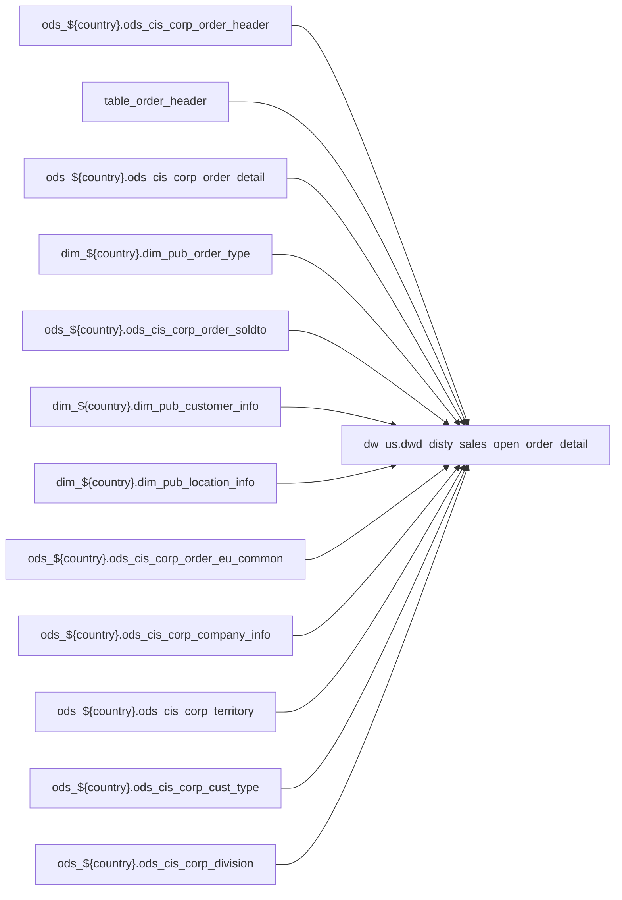

# PRIMARY: POS enrichment partner table joined from hub (`dw_us.dwd_disty_sales_open_order_detail`)

- artifact_type: etl_table
- artifact_id: dw_us.dwd_disty_sales_open_order_detail
- domain: pos
- one_line_purpose: POS-domain table with load SQL under bitbucket-etl (see L3); prior contract narrative preserved below when present.
- layer_type: DWD
- source_kind: etl_sql
- evidence_source: source/contracts/pos/bitbucket-etl/dwd_disty_sales_open_order_detail/loading_open_orders_data.sql
- bitbucket_etl_bundle: source/contracts/pos/bitbucket-etl/dwd_disty_sales_open_order_detail/
- related_etl_scripts:
- None

---

## L1 Data Foundation

### Identity and physical mapping
- **Table:** `dw_us.dwd_disty_sales_open_order_detail`
- **Layer type:** DWD
- **Canonical / derived:** Derived / ETL-loaded (see L3 from bitbucket-etl)
- **Owner team:** Not documented in repository

### Grain, scope, exclusions
- See preserved **Grain and keys** section below when present (POS contract narrative retained).
- Otherwise infer from SELECT / GROUP BY / INSERT column list in `source/contracts/pos/bitbucket-etl/dwd_disty_sales_open_order_detail/loading_open_orders_data.sql`.

### Cross-engine presence
| Engine | Present | Notes |
|--------|---------|-------|
| Hive | yes | ETL load target |
| Vertica | yes when POS contract documents Vertica sync | See preserved Business query tables |

### Physical schema reference

| Field | Value |
|-------|-------|
| **entity_id** | `dw_us.dwd_disty_sales_open_order_detail` |
| **l1_catalog_seed** | `target/storage/wkb/snapshots/_snapshot_id_template/l1_catalog/{engine}_{schema}_{table}.json` |
| **column_count** | pending (run ddl_seed_writer) |
| **partition_keys** | See preserved Grain / L4 / ETL PARTITION clause |
| **ddl_source** | pending |
| **retrieval** | `python -m tools.wkb.indexing.run_query --query "pos dwd_disty_sales_open_order_detail schema" --intent find_table_schema` |

### Lineage

- **Primary load:** `source/contracts/pos/bitbucket-etl/dwd_disty_sales_open_order_detail/loading_open_orders_data.sql`
- **upstream:** `ods_${country}.ods_cis_corp_order_header` — FROM/JOIN — `source/contracts/pos/bitbucket-etl/dwd_disty_sales_open_order_detail/loading_open_orders_data.sql`
- **upstream:** `table_order_header` — FROM/JOIN — `source/contracts/pos/bitbucket-etl/dwd_disty_sales_open_order_detail/loading_open_orders_data.sql`
- **upstream:** `ods_${country}.ods_cis_corp_order_detail` — FROM/JOIN — `source/contracts/pos/bitbucket-etl/dwd_disty_sales_open_order_detail/loading_open_orders_data.sql`
- **upstream:** `dim_${country}.dim_pub_order_type` — FROM/JOIN — `source/contracts/pos/bitbucket-etl/dwd_disty_sales_open_order_detail/loading_open_orders_data.sql`
- **upstream:** `ods_${country}.ods_cis_corp_order_soldto` — FROM/JOIN — `source/contracts/pos/bitbucket-etl/dwd_disty_sales_open_order_detail/loading_open_orders_data.sql`
- **upstream:** `dim_${country}.dim_pub_customer_info` — FROM/JOIN — `source/contracts/pos/bitbucket-etl/dwd_disty_sales_open_order_detail/loading_open_orders_data.sql`
- **upstream:** `dim_${country}.dim_pub_location_info` — FROM/JOIN — `source/contracts/pos/bitbucket-etl/dwd_disty_sales_open_order_detail/loading_open_orders_data.sql`
- **upstream:** `ods_${country}.ods_cis_corp_order_eu_common` — FROM/JOIN — `source/contracts/pos/bitbucket-etl/dwd_disty_sales_open_order_detail/loading_open_orders_data.sql`
- **upstream:** `ods_${country}.ods_cis_corp_company_info` — FROM/JOIN — `source/contracts/pos/bitbucket-etl/dwd_disty_sales_open_order_detail/loading_open_orders_data.sql`
- **upstream:** `ods_${country}.ods_cis_corp_territory` — FROM/JOIN — `source/contracts/pos/bitbucket-etl/dwd_disty_sales_open_order_detail/loading_open_orders_data.sql`
- **upstream:** `ods_${country}.ods_cis_corp_cust_type` — FROM/JOIN — `source/contracts/pos/bitbucket-etl/dwd_disty_sales_open_order_detail/loading_open_orders_data.sql`
- **upstream:** `ods_${country}.ods_cis_corp_division` — FROM/JOIN — `source/contracts/pos/bitbucket-etl/dwd_disty_sales_open_order_detail/loading_open_orders_data.sql`
- **upstream:** `temp_order_info` — FROM/JOIN — `source/contracts/pos/bitbucket-etl/dwd_disty_sales_open_order_detail/loading_open_orders_data.sql`
- **upstream:** `dim_${country}.dim_pub_part_info` — FROM/JOIN — `source/contracts/pos/bitbucket-etl/dwd_disty_sales_open_order_detail/loading_open_orders_data.sql`
- **upstream:** `temp_terr` — FROM/JOIN — `source/contracts/pos/bitbucket-etl/dwd_disty_sales_open_order_detail/loading_open_orders_data.sql`
- **upstream:** `dim_${country}.dim_pub_sales_hierarchy_by_terr_user_role` — FROM/JOIN — `source/contracts/pos/bitbucket-etl/dwd_disty_sales_open_order_detail/loading_open_orders_data.sql`
- **upstream:** `dim_${country}.dim_pub_manager` — FROM/JOIN — `source/contracts/pos/bitbucket-etl/dwd_disty_sales_open_order_detail/loading_open_orders_data.sql`
- **upstream:** `ods_${country}.ods_cis_corp_mc_order_ref` — FROM/JOIN — `source/contracts/pos/bitbucket-etl/dwd_disty_sales_open_order_detail/loading_open_orders_data.sql`
- **upstream:** `ods_${country}.ods_cis_corp_cpo_header` — FROM/JOIN — `source/contracts/pos/bitbucket-etl/dwd_disty_sales_open_order_detail/loading_open_orders_data.sql`
- **upstream:** `ods_${country}.ods_cis_corp_cpo_detail` — FROM/JOIN — `source/contracts/pos/bitbucket-etl/dwd_disty_sales_open_order_detail/loading_open_orders_data.sql`
- **downstream:** see L6 Downstream consumers
### Freshness and load path
- Parameters / date window: see ETL `${literal_*}` / `${date_flag}` / `${start_date}` in evidence script.
- Schedule: Not documented in repository

## L2 Declarative Knowledge

### Business purpose
See preserved **Business purpose** below when present (POS contract catalog + linked ETL).

### Audience and use cases
See preserved **Who it helps** section when present.

### Fact key resolution
See preserved **Grain and keys** when present.

### Time field semantics
- Prefer partition / `date_flag` filters documented in preserved sections and L3 Key filters from ETL.

### Metrics served
See preserved Metrics / column groups when present; otherwise L3 column derivations.

### Metric serving map
N/A unless multi-period wide table (see preserved content).

### etl_metrics
No new metric-index formulas appended in this bitbucket-etl upgrade pass.

## L3 Procedural Knowledge

### Query and routing rules
- Reporting: Vertica `dw_us.dwd_disty_sales_open_order_detail` when synced (see preserved Business query tables).
- Load logic: bitbucket-etl evidence `source/contracts/pos/bitbucket-etl/dwd_disty_sales_open_order_detail/loading_open_orders_data.sql`.

### Dimension join patterns
See Relationship map (ETL JOIN edges) and preserved contract join notes.

### Key filters and ETL business logic

| Predicate | Kind | Evidence |
|-----------|------|----------|
| `order_type in (1, 2, 8); drop table if exists temp_order_info; CREATE TEMPORARY TABLE temp_order_info AS select a.order_no, a.order_type, ot.order_type_descr, b.order_line_no, b.kit_line_no, a.entr...` | Business | `source/contracts/pos/bitbucket-etl/dwd_disty_sales_open_order_detail/loading_open_orders_data.sql` |
| `a.order_type = 1 and a.from_loc_no = 98) t where t.rn = 1; --for BO, to get vpo CREATE OR REPLACE TEMPORARY VIEW temp_vpo_info_2 AS select order_no, order_type, order_line_no, vpo_no from (select a...` | Business | `source/contracts/pos/bitbucket-etl/dwd_disty_sales_open_order_detail/loading_open_orders_data.sql` |
| `a.order_type in (1,8) and b.int_ref_type = 2) t where t.rn = 1; drop table if exists temp_cpo_info; CREATE TEMPORARY TABLE temp_cpo_info AS select a.order_no, a.order_type, a.order_line_no, d.cpo_i...` | Business | `source/contracts/pos/bitbucket-etl/dwd_disty_sales_open_order_detail/loading_open_orders_data.sql` |
| `t.rn = 1; CREATE OR REPLACE TEMPORARY VIEW temp_auth_info AS select a.sku_no,a.cust_no, min(c.auth_no) as auth_no from temp_order_info a inner join dim_${country}.dim_pub_customer_info e on a.cust_...` | Business | `source/contracts/pos/bitbucket-etl/dwd_disty_sales_open_order_detail/loading_open_orders_data.sql` |
| `t.rn = 1; CREATE OR REPLACE TEMPORARY VIEW temp_quote_expire AS select order_no, order_type, data_d as quote_expire_date from ( select a.order_no, a.order_type, b.data_d, row_number() over(partitio...` | Business | `source/contracts/pos/bitbucket-etl/dwd_disty_sales_open_order_detail/loading_open_orders_data.sql` |

### Standard time-filter SQL
```sql
-- Prefer date_flag / literal_start_date / literal_end_date as used in source/contracts/pos/bitbucket-etl/dwd_disty_sales_open_order_detail/loading_open_orders_data.sql
```

### End-to-end flow


### Base tables register
| Object | Role |
|--------|------|
| `ods_${country}.ods_cis_corp_order_header` | source / temp (FROM/JOIN) |
| `table_order_header` | source / temp (FROM/JOIN) |
| `ods_${country}.ods_cis_corp_order_detail` | source / temp (FROM/JOIN) |
| `dim_${country}.dim_pub_order_type` | source / temp (FROM/JOIN) |
| `ods_${country}.ods_cis_corp_order_soldto` | source / temp (FROM/JOIN) |
| `dim_${country}.dim_pub_customer_info` | source / temp (FROM/JOIN) |
| `dim_${country}.dim_pub_location_info` | source / temp (FROM/JOIN) |
| `ods_${country}.ods_cis_corp_order_eu_common` | source / temp (FROM/JOIN) |
| `ods_${country}.ods_cis_corp_company_info` | source / temp (FROM/JOIN) |
| `ods_${country}.ods_cis_corp_territory` | source / temp (FROM/JOIN) |
| `ods_${country}.ods_cis_corp_cust_type` | source / temp (FROM/JOIN) |
| `ods_${country}.ods_cis_corp_division` | source / temp (FROM/JOIN) |
| `temp_order_info` | source / temp (FROM/JOIN) |
| `dim_${country}.dim_pub_part_info` | source / temp (FROM/JOIN) |
| `temp_terr` | source / temp (FROM/JOIN) |
| `dim_${country}.dim_pub_sales_hierarchy_by_terr_user_role` | source / temp (FROM/JOIN) |
| `dim_${country}.dim_pub_manager` | source / temp (FROM/JOIN) |
| `ods_${country}.ods_cis_corp_mc_order_ref` | source / temp (FROM/JOIN) |
| `ods_${country}.ods_cis_corp_cpo_header` | source / temp (FROM/JOIN) |
| `ods_${country}.ods_cis_corp_cpo_detail` | source / temp (FROM/JOIN) |
| `ods_${country}.ods_cis_corp_history_cpo_header` | source / temp (FROM/JOIN) |
| `ods_${country}.ods_cis_corp_history_cpo_detail` | source / temp (FROM/JOIN) |
| `temp_cpo_info` | source / temp (FROM/JOIN) |
| `ods_${country}.ods_cis_corp_order_exp` | source / temp (FROM/JOIN) |
| `temp_part_info` | source / temp (FROM/JOIN) |

### Step-by-step logic
1. Execute load SQL / python in `source/contracts/pos/bitbucket-etl/dwd_disty_sales_open_order_detail/`.
2. Apply date / business filters from ETL (Key filters).
3. Write target `dw_us.dwd_disty_sales_open_order_detail` (see INSERT/OVERWRITE in evidence).

### Relationship map (embedded)

| from_fqn | to_fqn | cardinality | join_keys | provenance |
|----------|--------|-------------|-----------|------------|
| `ods_${country}.ods_etl_carton_header_all` | `ods_${country}.ods_cis_corp_order_detail` | many:1 | `a.order_no` = `b.order_no`; `a.order_type` = `b.order_type` | etl_sql (`source/contracts/pos/bitbucket-etl/dwd_disty_sales_open_order_detail/loading_open_orders_data.sql:83`) |
| `ods_${country}.ods_etl_carton_header_all` | `dim_${country}.dim_pub_order_type` | many:1 (LEFT) | `a.order_type` = `ot.order_type` | etl_sql (`source/contracts/pos/bitbucket-etl/dwd_disty_sales_open_order_detail/loading_open_orders_data.sql:86`) |
| `ods_${country}.ods_etl_carton_header_all` | `ods_${country}.ods_cis_corp_order_soldto` | many:1 (LEFT) | `a.order_no` = `d.order_no`; `a.order_type` = `d.order_type` | etl_sql (`source/contracts/pos/bitbucket-etl/dwd_disty_sales_open_order_detail/loading_open_orders_data.sql:88`) |
| `ods_${country}.ods_cis_corp_order_header` | `dim_${country}.dim_pub_customer_info` | many:1 (LEFT) | `f.cust_no` = `d.to_acct_no` | etl_sql (`source/contracts/pos/bitbucket-etl/dwd_disty_sales_open_order_detail/loading_open_orders_data.sql:91`) |
| `ods_${country}.ods_etl_carton_header_all` | `dim_${country}.dim_pub_location_info` | many:1 (LEFT) | `loc.loc_no` = `a.from_loc_no` | etl_sql (`source/contracts/pos/bitbucket-etl/dwd_disty_sales_open_order_detail/loading_open_orders_data.sql:93`) |
| `ods_${country}.ods_etl_carton_header_all` | `ods_${country}.ods_cis_corp_order_eu_common` | many:1 (LEFT) | `a.order_no` = `h.order_no`; `a.order_type` = `h.order_type` | etl_sql (`source/contracts/pos/bitbucket-etl/dwd_disty_sales_open_order_detail/loading_open_orders_data.sql:95`) |
| `ods_${country}.ods_etl_carton_header_all` | `ods_${country}.ods_cis_corp_company_info` | many:1 (LEFT) | `com.company_no` = `a.company_no` | etl_sql (`source/contracts/pos/bitbucket-etl/dwd_disty_sales_open_order_detail/loading_open_orders_data.sql:99`) |
| `ods_${country}.ods_etl_carton_header_all` | `ods_${country}.ods_cis_corp_cust_type` | many:1 | `a.cust_type` = `b.cust_type` | etl_sql (`source/contracts/pos/bitbucket-etl/dwd_disty_sales_open_order_detail/loading_open_orders_data.sql:108`) |
| `temp_req_delivery_date` | `ods_${country}.ods_cis_corp_division` | many:1 | `b.division` = `c.division` | etl_sql (`source/contracts/pos/bitbucket-etl/dwd_disty_sales_open_order_detail/loading_open_orders_data.sql:109`) |
| `ods_${country}.ods_etl_carton_header_all` | `dim_${country}.dim_pub_part_info` | many:1 (LEFT) | `a.sku_no` = `b.sku_no` | etl_sql (`source/contracts/pos/bitbucket-etl/dwd_disty_sales_open_order_detail/loading_open_orders_data.sql:159`) |
| `ods_${country}.ods_cis_corp_order_header` | `dim_${country}.dim_pub_customer_info` | many:1 (LEFT) | `c.cust_no` = `a.cust_no` | etl_sql (`source/contracts/pos/bitbucket-etl/dwd_disty_sales_open_order_detail/loading_open_orders_data.sql:161`) |
| `ods_${country}.ods_cis_corp_order_header` | `temp_terr` | many:1 (LEFT) | nvl(a.sales_terr,c.sales_terr) = c1.sales_terr | etl_sql (`source/contracts/pos/bitbucket-etl/dwd_disty_sales_open_order_detail/loading_open_orders_data.sql:163`) |
| `ods_${country}.ods_cis_corp_order_header` | `dim_${country}.dim_pub_sales_hierarchy_by_terr_user_role` | many:1 (LEFT) | nvl(a.sales_terr,c.sales_terr) = d.sales_terr and d.user_role ='Rep' and d.is_primary = 'Y' and d.user_end_date is null | etl_sql (`source/contracts/pos/bitbucket-etl/dwd_disty_sales_open_order_detail/loading_open_orders_data.sql:165`) |
| `temp_eta` | `dim_${country}.dim_pub_manager` | many:1 (LEFT) | `pm.userid` = `d.user_id` | etl_sql (`source/contracts/pos/bitbucket-etl/dwd_disty_sales_open_order_detail/loading_open_orders_data.sql:170`) |
| `dim_${country}.dim_pub_manager` | `dim_${country}.dim_pub_location_info` | many:1 (LEFT) | `pli.loc_no` = `pm.user_loc` | etl_sql (`source/contracts/pos/bitbucket-etl/dwd_disty_sales_open_order_detail/loading_open_orders_data.sql:172`) |
| `ods_${country}.ods_etl_carton_header_all` | `table_order_header` | many:1 | `a.int_ref_no` = `b.order_no`; `a.int_ref_type` = `b.order_type` | etl_sql (`source/contracts/pos/bitbucket-etl/dwd_disty_sales_open_order_detail/loading_open_orders_data.sql:182`) |
| `temp_req_delivery_date` | `table_order_header` | many:1 | `b.int_ref_no` = `c.order_no`; `b.int_ref_type` = `c.order_type` | etl_sql (`source/contracts/pos/bitbucket-etl/dwd_disty_sales_open_order_detail/loading_open_orders_data.sql:186`) |
| `ods_${country}.ods_etl_carton_header_all` | `table_order_header` | many:1 | `a.order_no` = `b.int_ref_no`; `a.order_type` = `b.int_ref_type` | etl_sql (`source/contracts/pos/bitbucket-etl/dwd_disty_sales_open_order_detail/loading_open_orders_data.sql:203`) |
| `ods_${country}.ods_etl_carton_header_all` | `ods_${country}.ods_cis_corp_mc_order_ref` | many:1 | `a.order_no` = `b.order_no`; `a.order_line_no` = `b.order_line_no` | etl_sql (`source/contracts/pos/bitbucket-etl/dwd_disty_sales_open_order_detail/loading_open_orders_data.sql:225`) |
| `ods_${country}.ods_etl_carton_header_all` | `ods_${country}.ods_cis_corp_cpo_header` | many:1 | `a.int_ref_no` = `d.cpo_id` | etl_sql (`source/contracts/pos/bitbucket-etl/dwd_disty_sales_open_order_detail/loading_open_orders_data.sql:249`) |
| `temp_eta` | `ods_${country}.ods_cis_corp_cpo_detail` | many:1 (LEFT) | `d.cpo_id` = `e.cpo_id`; `a.int_ref_line_no` = `e.cpo_line_seq` | etl_sql (`source/contracts/pos/bitbucket-etl/dwd_disty_sales_open_order_detail/loading_open_orders_data.sql:251`) |
| `ods_${country}.ods_etl_carton_header_all` | `ods_${country}.ods_cis_corp_history_cpo_header` | many:1 | `a.int_ref_no` = `d.cpo_id` | etl_sql (`source/contracts/pos/bitbucket-etl/dwd_disty_sales_open_order_detail/loading_open_orders_data.sql:267`) |
| `temp_eta` | `ods_${country}.ods_cis_corp_history_cpo_detail` | many:1 (LEFT) | `d.cpo_id` = `e.cpo_id`; `a.int_ref_line_no` = `e.cpo_line_seq` | etl_sql (`source/contracts/pos/bitbucket-etl/dwd_disty_sales_open_order_detail/loading_open_orders_data.sql:269`) |
| `ods_${country}.ods_etl_carton_header_all` | `ods_${country}.ods_cis_corp_order_exp` | many:1 | `a.order_no` = `b.order_no`; `a.order_type` = `b.order_type`; `a.order_line_no` = `b.order_line_no` | etl_sql (`source/contracts/pos/bitbucket-etl/dwd_disty_sales_open_order_detail/loading_open_orders_data.sql:285`) |
| `ods_${country}.ods_etl_carton_header_all` | `temp_part_info` | many:1 (LEFT) | `a.order_no` = `b.order_no`; `a.order_type` = `b.order_type`; `a.order_line_no` = `b.order_line_no` | etl_sql (`source/contracts/pos/bitbucket-etl/dwd_disty_sales_open_order_detail/loading_open_orders_data.sql:411`) |
| `ods_${country}.ods_etl_carton_header_all` | `temp_vpo_info` | many:1 (LEFT) | `a.order_no` = `vpo.order_no`; `a.order_type` = `vpo.order_type` | etl_sql (`source/contracts/pos/bitbucket-etl/dwd_disty_sales_open_order_detail/loading_open_orders_data.sql:415`) |
| `ods_${country}.ods_etl_carton_header_all` | `temp_vpo_info_2` | many:1 (LEFT) | `a.order_no` = `vpo2.order_no`; `a.order_type` = `vpo2.order_type`; `a.order_line_no` = `vpo2.order_line_no` | etl_sql (`source/contracts/pos/bitbucket-etl/dwd_disty_sales_open_order_detail/loading_open_orders_data.sql:418`) |
| `ods_${country}.ods_etl_carton_header_all` | `temp_sso_info` | many:1 (LEFT) | `a.order_no` = `sso.order_no`; `a.order_type` = `sso.order_type` | etl_sql (`source/contracts/pos/bitbucket-etl/dwd_disty_sales_open_order_detail/loading_open_orders_data.sql:422`) |
| `ods_${country}.ods_etl_carton_header_all` | `temp_cpo_info` | many:1 (LEFT) | `a.order_no` = `ci.order_no`; `a.order_type` = `ci.order_type`; `a.order_line_no` = `ci.order_line_no` | etl_sql (`source/contracts/pos/bitbucket-etl/dwd_disty_sales_open_order_detail/loading_open_orders_data.sql:425`) |
| `ods_${country}.ods_etl_carton_header_all` | `temp_unit_sum_expense` | many:1 (LEFT) | `a.order_no` = `ue.order_no`; `a.order_type` = `ue.order_type`; `a.order_line_no` = `ue.order_line_no` | etl_sql (`source/contracts/pos/bitbucket-etl/dwd_disty_sales_open_order_detail/loading_open_orders_data.sql:429`) |
| `ods_${country}.ods_etl_carton_header_all` | `ods_${country}.ods_cis_corp_order_profile` | many:1 | `a.order_no` = `b.order_no`; `a.order_type` = `b.order_type` | etl_sql (`source/contracts/pos/bitbucket-etl/dwd_disty_sales_open_order_detail/loading_open_orders_data.sql:440`) |
| `ods_${country}.ods_etl_carton_header_all` | `dm_${country}.dm_pur_unieta_boso_detail_rt` | many:1 | `a.order_no` = `b.order_no`; `a.order_type` = `b.order_type`; `a.order_line_no` = `b.order_line_no` | etl_sql (`source/contracts/pos/bitbucket-etl/dwd_disty_sales_open_order_detail/loading_open_orders_data.sql:455`) |
| `ods_${country}.ods_etl_carton_header_all` | `dm_${country}.dm_pur_unieta_boso_detail_rt` | many:1 | `a.order_no` = `b.order_no`; `a.order_type` = `b.order_type`; `a.order_line_no` = `b.order_line_no`; `a.min_eta` = `b.eta` | etl_sql (`source/contracts/pos/bitbucket-etl/dwd_disty_sales_open_order_detail/loading_open_orders_data.sql:468`) |
| `ods_${country}.ods_etl_carton_header_all` | `ods_${country}.ods_cis_corp_cust_part_no` | many:1 | `a.sku_no` = `b.synnex_sku_no`; `a.cust_no` = `b.cust_no` | etl_sql (`source/contracts/pos/bitbucket-etl/dwd_disty_sales_open_order_detail/loading_open_orders_data.sql:481`) |
| `ods_${country}.ods_etl_carton_header_all` | `ods_${country}.ods_etl_order_profile_all` | many:1 | `a.order_no` = `b.order_no`; `a.order_type` = `b.order_type` | etl_sql (`source/contracts/pos/bitbucket-etl/dwd_disty_sales_open_order_detail/loading_open_orders_data.sql:505`) |
| `ods_${country}.ods_etl_carton_header_all` | `ods_${country}.ods_etl_eu_custom_all` | many:1 | `a.order_no` = `b.order_no`; `a.order_type` = `b.order_type`; `a.order_line_no` = `b.order_line_no` | etl_sql (`source/contracts/pos/bitbucket-etl/dwd_disty_sales_open_order_detail/loading_open_orders_data.sql:526`) |
| `temp_req_delivery_date` | `ods_${country}.ods_cis_corp_eu_custom_map` | many:1 | `b.eu_map_id` = `c.eu_map_id`; `b.eu_map_line_no` = `c.eu_map_line_no` | etl_sql (`source/contracts/pos/bitbucket-etl/dwd_disty_sales_open_order_detail/loading_open_orders_data.sql:530`) |
| `ods_${country}.ods_etl_carton_header_all` | `dim_${country}.dim_pub_customer_info` | many:1 | `a.cust_no` = `e.cust_no` | etl_sql (`source/contracts/pos/bitbucket-etl/dwd_disty_sales_open_order_detail/loading_open_orders_data.sql:540`) |
| `ods_${country}.ods_etl_carton_header_all` | `ods_${country}.ods_cis_corp_req_rin_part` | many:1 | `a.sku_no` = `p.sku_no` | etl_sql (`source/contracts/pos/bitbucket-etl/dwd_disty_sales_open_order_detail/loading_open_orders_data.sql:542`) |
| `ods_${country}.ods_cis_corp_req_rin_part` | `ods_${country}.ods_cis_corp_reg_cust` | many:1 | `p.program_id` = `c.program_id` | etl_sql (`source/contracts/pos/bitbucket-etl/dwd_disty_sales_open_order_detail/loading_open_orders_data.sql:544`) |
| `ods_${country}.ods_cis_corp_order_header` | `ods_${country}.ods_cis_corp_customer_auth` | many:1 | `d.program_id` = `c.program_id` | etl_sql (`source/contracts/pos/bitbucket-etl/dwd_disty_sales_open_order_detail/loading_open_orders_data.sql:547`) |
| `ods_${country}.ods_etl_carton_header_all` | `ods_${country}.ods_etl_eu_custom_all` | many:1 | `a.order_no` = `b.order_no`; `a.order_type` = `b.order_type` | etl_sql (`source/contracts/pos/bitbucket-etl/dwd_disty_sales_open_order_detail/loading_open_orders_data.sql:565`) |
| `ods_${country}.ods_etl_carton_header_all` | `ods_${country}.ods_etl_order_profile_all` | many:1 | `a.order_no` = `op.order_no`; `a.order_type` = `op.order_type` | etl_sql (`source/contracts/pos/bitbucket-etl/dwd_disty_sales_open_order_detail/loading_open_orders_data.sql:605`) |
| `ods_${country}.ods_cis_corp_order_header` | `ods_${country}.ods_cis_corp_reason_code_all` | many:1 (LEFT) | r.reason_code = cast(op.profile_i as string) | etl_sql (`source/contracts/pos/bitbucket-etl/dwd_disty_sales_open_order_detail/loading_open_orders_data.sql:610`) |
| `ods_${country}.ods_etl_order_profile_all` | `ods_${country}.ods_cis_corp_manager` | many:1 (LEFT) | `op.entry_id` = `m.userid` | etl_sql (`source/contracts/pos/bitbucket-etl/dwd_disty_sales_open_order_detail/loading_open_orders_data.sql:612`) |
| `ods_${country}.ods_etl_carton_header_all` | `ods_${country}.ods_cis_corp_order_comments` | many:1 | `a.order_no` = `b.order_no`; `a.order_type` = `b.order_type` | etl_sql (`source/contracts/pos/bitbucket-etl/dwd_disty_sales_open_order_detail/loading_open_orders_data.sql:629`) |
| `ods_${country}.ods_etl_carton_header_all` | `tmp_extended_exp_taxc` | many:1 (LEFT) | `a.order_type` = `b.order_type`; `a.order_no` = `b.order_no` | etl_sql (`source/contracts/pos/bitbucket-etl/dwd_disty_sales_open_order_detail/loading_open_orders_data.sql:690`) |
| `ods_${country}.ods_etl_carton_header_all` | `tmp_etl_carton_header_all` | many:1 (LEFT) | `a.order_type` = `c.order_type`; `a.order_no` = `c.order_no` | etl_sql (`source/contracts/pos/bitbucket-etl/dwd_disty_sales_open_order_detail/loading_open_orders_data.sql:693`) |
| `ods_${country}.ods_etl_carton_header_all` | `temp_req_delivery_date` | many:1 (LEFT) | `a.order_no` = `b.order_no`; `a.order_type` = `b.order_type` | etl_sql (`source/contracts/pos/bitbucket-etl/dwd_disty_sales_open_order_detail/loading_open_orders_data.sql:841`) |
| `ods_${country}.ods_etl_carton_header_all` | `ods_${country}.ods_cis_corp_from_ref_type` | many:1 (LEFT) | `a.from_ref_type` = `c.from_ref_type` | etl_sql (`source/contracts/pos/bitbucket-etl/dwd_disty_sales_open_order_detail/loading_open_orders_data.sql:844`) |
| `ods_${country}.ods_etl_carton_header_all` | `temp_eta` | many:1 (LEFT) | `a.order_no` = `d.order_no`; `a.order_type` = `d.order_type`; `a.order_line_no` = `d.order_line_no` | etl_sql (`source/contracts/pos/bitbucket-etl/dwd_disty_sales_open_order_detail/loading_open_orders_data.sql:846`) |
| `ods_${country}.ods_etl_carton_header_all` | `temp_cust_part_no` | many:1 (LEFT) | `a.sku_no` = `e.sku_no`; `a.cust_no` = `e.cust_no` | etl_sql (`source/contracts/pos/bitbucket-etl/dwd_disty_sales_open_order_detail/loading_open_orders_data.sql:850`) |
| `ods_${country}.ods_etl_carton_header_all` | `temp_vend_so` | many:1 (LEFT) | `a.order_no` = `f.order_no`; `a.order_type` = `f.order_type` | etl_sql (`source/contracts/pos/bitbucket-etl/dwd_disty_sales_open_order_detail/loading_open_orders_data.sql:853`) |
| `ods_${country}.ods_etl_carton_header_all` | `temp_deal` | many:1 (LEFT) | `a.order_no` = `g.order_no`; `a.order_type` = `g.order_type` | etl_sql (`source/contracts/pos/bitbucket-etl/dwd_disty_sales_open_order_detail/loading_open_orders_data.sql:856`) |
| `ods_${country}.ods_etl_carton_header_all` | `temp_magickey` | many:1 (LEFT) | `a.order_no` = `h.order_no`; `a.order_line_no` = `h.order_line_no`; `a.order_type` = `h.order_type` | etl_sql (`source/contracts/pos/bitbucket-etl/dwd_disty_sales_open_order_detail/loading_open_orders_data.sql:859`) |
| `ods_${country}.ods_etl_carton_header_all` | `temp_pp_expire` | many:1 (LEFT) | `a.order_no` = `i.order_no`; `a.order_type` = `i.order_type` | etl_sql (`source/contracts/pos/bitbucket-etl/dwd_disty_sales_open_order_detail/loading_open_orders_data.sql:863`) |
| `ods_${country}.ods_etl_carton_header_all` | `temp_quote_expire` | many:1 (LEFT) | `a.order_no` = `j.order_no`; `a.order_type` = `j.order_type` | etl_sql (`source/contracts/pos/bitbucket-etl/dwd_disty_sales_open_order_detail/loading_open_orders_data.sql:866`) |
| `ods_${country}.ods_etl_carton_header_all` | `temp_requeue` | many:1 (LEFT) | `a.order_no` = `k.order_no`; `a.order_type` = `k.order_type` | etl_sql (`source/contracts/pos/bitbucket-etl/dwd_disty_sales_open_order_detail/loading_open_orders_data.sql:869`) |
| `ods_${country}.ods_etl_carton_header_all` | `temp_auth_info` | many:1 (LEFT) | `a.cust_no` = `l.cust_no`; `a.sku_no` = `l.sku_no` | etl_sql (`source/contracts/pos/bitbucket-etl/dwd_disty_sales_open_order_detail/loading_open_orders_data.sql:872`) |
| `ods_${country}.ods_etl_carton_header_all` | `temp_requested_ship_date` | many:1 (LEFT) | `a.order_no` = `m.order_no`; `a.order_type` = `m.order_type` | etl_sql (`source/contracts/pos/bitbucket-etl/dwd_disty_sales_open_order_detail/loading_open_orders_data.sql:875`) |
| `ods_${country}.ods_etl_carton_header_all` | `temp_order_comments` | many:1 (LEFT) | `a.order_no` = `n.order_no`; `a.order_type` = `n.order_type` | etl_sql (`source/contracts/pos/bitbucket-etl/dwd_disty_sales_open_order_detail/loading_open_orders_data.sql:878`) |
| `temp_magickey` | `tmp_ext_exp_track_no` | many:1 (LEFT) | `h.order_type` = `exp.order_type`; `h.order_no` = `exp.order_no` | etl_sql (`source/contracts/pos/bitbucket-etl/dwd_disty_sales_open_order_detail/loading_open_orders_data.sql:881`) |

### Special logic (embedded)

`source/ref/pos/special_logic.txt` exists but no rule naming this FQN/stem (`dw_us.dwd_disty_sales_open_order_detail`).

Not documented in repository


### Column / field derivations (from ETL SQL)

| target_column | expression_sql | upstream_columns | upstream_tables | transform_kind | evidence |
|---------------|----------------|------------------|-----------------|----------------|----------|
| `order_no` | `a.order_no` | `order_no` | `temp_order_info`, `ods_${country}.ods_cis_corp_history_cpo_header`, `ods_${country}.ods_cis_corp_history_cpo_detail`, `temp_cpo_info`, `ods_${country}.ods_cis_corp_order_exp`, `temp_part_info`, `temp_vpo_info`, `temp_vpo_info_2`, `temp_sso_info`, `temp_unit_sum_expense`, `ods_${country}.ods_cis_corp_order_profile`, `dm_${country}.dm_pur_unieta_boso_detail_rt` | passthrough | `source/contracts/pos/bitbucket-etl/dwd_disty_sales_open_order_detail/loading_open_orders_data.sql:9` |
| `order_type` | `a.order_type` | `order_type` | `temp_order_info`, `ods_${country}.ods_cis_corp_history_cpo_header`, `ods_${country}.ods_cis_corp_history_cpo_detail`, `temp_cpo_info`, `ods_${country}.ods_cis_corp_order_exp`, `temp_part_info`, `temp_vpo_info`, `temp_vpo_info_2`, `temp_sso_info`, `temp_unit_sum_expense`, `ods_${country}.ods_cis_corp_order_profile`, `dm_${country}.dm_pur_unieta_boso_detail_rt` | passthrough | `source/contracts/pos/bitbucket-etl/dwd_disty_sales_open_order_detail/loading_open_orders_data.sql:10` |
| `order_line_no` | `a.order_line_no` | `order_line_no` | `temp_order_info`, `ods_${country}.ods_cis_corp_history_cpo_header`, `ods_${country}.ods_cis_corp_history_cpo_detail`, `temp_cpo_info`, `ods_${country}.ods_cis_corp_order_exp`, `temp_part_info`, `temp_vpo_info`, `temp_vpo_info_2`, `temp_sso_info`, `temp_unit_sum_expense`, `ods_${country}.ods_cis_corp_order_profile`, `dm_${country}.dm_pur_unieta_boso_detail_rt` | passthrough | `source/contracts/pos/bitbucket-etl/dwd_disty_sales_open_order_detail/loading_open_orders_data.sql:115` |
| `cpo_id` | `d.cpo_id` | `cpo_id` | `temp_order_info`, `ods_${country}.ods_cis_corp_history_cpo_header`, `ods_${country}.ods_cis_corp_history_cpo_detail`, `temp_cpo_info`, `ods_${country}.ods_cis_corp_order_exp`, `temp_part_info`, `temp_vpo_info`, `temp_vpo_info_2`, `temp_sso_info`, `temp_unit_sum_expense`, `ods_${country}.ods_cis_corp_order_profile`, `dm_${country}.dm_pur_unieta_boso_detail_rt` | passthrough | `source/contracts/pos/bitbucket-etl/dwd_disty_sales_open_order_detail/loading_open_orders_data.sql:241` |
| `cpo_no` | `d.cpo_no` | `cpo_no` | `temp_order_info`, `ods_${country}.ods_cis_corp_history_cpo_header`, `ods_${country}.ods_cis_corp_history_cpo_detail`, `temp_cpo_info`, `ods_${country}.ods_cis_corp_order_exp`, `temp_part_info`, `temp_vpo_info`, `temp_vpo_info_2`, `temp_sso_info`, `temp_unit_sum_expense`, `ods_${country}.ods_cis_corp_order_profile`, `dm_${country}.dm_pur_unieta_boso_detail_rt` | passthrough | `source/contracts/pos/bitbucket-etl/dwd_disty_sales_open_order_detail/loading_open_orders_data.sql:242` |
| `cpo_status` | `d.cpo_status` | `cpo_status` | `temp_order_info`, `ods_${country}.ods_cis_corp_history_cpo_header`, `ods_${country}.ods_cis_corp_history_cpo_detail`, `temp_cpo_info`, `ods_${country}.ods_cis_corp_order_exp`, `temp_part_info`, `temp_vpo_info`, `temp_vpo_info_2`, `temp_sso_info`, `temp_unit_sum_expense`, `ods_${country}.ods_cis_corp_order_profile`, `dm_${country}.dm_pur_unieta_boso_detail_rt` | passthrough | `source/contracts/pos/bitbucket-etl/dwd_disty_sales_open_order_detail/loading_open_orders_data.sql:243` |
| `cpo_line_status` | `e.cpo_line_status` | `cpo_line_status` | `temp_order_info`, `ods_${country}.ods_cis_corp_history_cpo_header`, `ods_${country}.ods_cis_corp_history_cpo_detail`, `temp_cpo_info`, `ods_${country}.ods_cis_corp_order_exp`, `temp_part_info`, `temp_vpo_info`, `temp_vpo_info_2`, `temp_sso_info`, `temp_unit_sum_expense`, `ods_${country}.ods_cis_corp_order_profile`, `dm_${country}.dm_pur_unieta_boso_detail_rt` | passthrough | `source/contracts/pos/bitbucket-etl/dwd_disty_sales_open_order_detail/loading_open_orders_data.sql:244` |
| `cpo_line_seq` | `e.cpo_line_seq` | `cpo_line_seq` | `temp_order_info`, `ods_${country}.ods_cis_corp_history_cpo_header`, `ods_${country}.ods_cis_corp_history_cpo_detail`, `temp_cpo_info`, `ods_${country}.ods_cis_corp_order_exp`, `temp_part_info`, `temp_vpo_info`, `temp_vpo_info_2`, `temp_sso_info`, `temp_unit_sum_expense`, `ods_${country}.ods_cis_corp_order_profile`, `dm_${country}.dm_pur_unieta_boso_detail_rt` | passthrough | `source/contracts/pos/bitbucket-etl/dwd_disty_sales_open_order_detail/loading_open_orders_data.sql:245` |
| `cpo_entry_id` | `d.cpo_entry_id` | `cpo_entry_id` | `temp_order_info`, `ods_${country}.ods_cis_corp_history_cpo_header`, `ods_${country}.ods_cis_corp_history_cpo_detail`, `temp_cpo_info`, `ods_${country}.ods_cis_corp_order_exp`, `temp_part_info`, `temp_vpo_info`, `temp_vpo_info_2`, `temp_sso_info`, `temp_unit_sum_expense`, `ods_${country}.ods_cis_corp_order_profile`, `dm_${country}.dm_pur_unieta_boso_detail_rt` | passthrough | `source/contracts/pos/bitbucket-etl/dwd_disty_sales_open_order_detail/loading_open_orders_data.sql:246` |
| `cpo_entry_datetime` | `d.cpo_entry_datetime` | `cpo_entry_datetime` | `temp_order_info`, `ods_${country}.ods_cis_corp_history_cpo_header`, `ods_${country}.ods_cis_corp_history_cpo_detail`, `temp_cpo_info`, `ods_${country}.ods_cis_corp_order_exp`, `temp_part_info`, `temp_vpo_info`, `temp_vpo_info_2`, `temp_sso_info`, `temp_unit_sum_expense`, `ods_${country}.ods_cis_corp_order_profile`, `dm_${country}.dm_pur_unieta_boso_detail_rt` | passthrough | `source/contracts/pos/bitbucket-etl/dwd_disty_sales_open_order_detail/loading_open_orders_data.sql:247` |

### Sentinel and code values
See preserved content and ETL CASE expressions in column derivations.

## L4 Validation

### Resolved partition value
- Partition / date parameters from ETL literals — concrete calendar values Not documented in repository (resolve via Azkaban when flow evidence exists).

### Data quality checks
See preserved Validation SQL when present.

### Validation SQL
Prefer preserved Vertica validation bundle when present; MCP business SQL not re-run during documentation.

### Caveats for interpretation
- Document upgraded additively from POS **contract** MD + **bitbucket-etl** SQL. Prior contract text is under **Preserved pre-L1-L6 content** when present.

### Conflicts and open questions
- Companion loader scripts may also appear under other domain KB folders; see `target/knowledgebase/pos/readme.md` cross-links.

## L5 Runtime View

### Query path and engine preference
| Path | Engine | Evidence |
|------|--------|----------|
| Load | Hive/Spark | `source/contracts/pos/bitbucket-etl/dwd_disty_sales_open_order_detail/loading_open_orders_data.sql` |
| Report | Vertica | preserved POS contract when present |

### Access constraints
Not documented in repository

### Query risk profile
- Always filter `date_flag` / documented partition keys before wide scans.

## L6 Access and Consumption

### Primary consumers and use cases
See preserved audience / POS report consumers when present.

### Representative query patterns
See preserved Validation SQL / contract examples when present.

### Dependencies and notes

#### Upstream objects (verified)
| Object | Usage | Evidence |
|--------|-------|----------|
| `ods_${country}.ods_cis_corp_order_header` | FROM/JOIN | `source/contracts/pos/bitbucket-etl/dwd_disty_sales_open_order_detail/loading_open_orders_data.sql` |
| `table_order_header` | FROM/JOIN | `source/contracts/pos/bitbucket-etl/dwd_disty_sales_open_order_detail/loading_open_orders_data.sql` |
| `ods_${country}.ods_cis_corp_order_detail` | FROM/JOIN | `source/contracts/pos/bitbucket-etl/dwd_disty_sales_open_order_detail/loading_open_orders_data.sql` |
| `dim_${country}.dim_pub_order_type` | FROM/JOIN | `source/contracts/pos/bitbucket-etl/dwd_disty_sales_open_order_detail/loading_open_orders_data.sql` |
| `ods_${country}.ods_cis_corp_order_soldto` | FROM/JOIN | `source/contracts/pos/bitbucket-etl/dwd_disty_sales_open_order_detail/loading_open_orders_data.sql` |
| `dim_${country}.dim_pub_customer_info` | FROM/JOIN | `source/contracts/pos/bitbucket-etl/dwd_disty_sales_open_order_detail/loading_open_orders_data.sql` |
| `dim_${country}.dim_pub_location_info` | FROM/JOIN | `source/contracts/pos/bitbucket-etl/dwd_disty_sales_open_order_detail/loading_open_orders_data.sql` |
| `ods_${country}.ods_cis_corp_order_eu_common` | FROM/JOIN | `source/contracts/pos/bitbucket-etl/dwd_disty_sales_open_order_detail/loading_open_orders_data.sql` |
| `ods_${country}.ods_cis_corp_company_info` | FROM/JOIN | `source/contracts/pos/bitbucket-etl/dwd_disty_sales_open_order_detail/loading_open_orders_data.sql` |
| `ods_${country}.ods_cis_corp_territory` | FROM/JOIN | `source/contracts/pos/bitbucket-etl/dwd_disty_sales_open_order_detail/loading_open_orders_data.sql` |
| `ods_${country}.ods_cis_corp_cust_type` | FROM/JOIN | `source/contracts/pos/bitbucket-etl/dwd_disty_sales_open_order_detail/loading_open_orders_data.sql` |
| `ods_${country}.ods_cis_corp_division` | FROM/JOIN | `source/contracts/pos/bitbucket-etl/dwd_disty_sales_open_order_detail/loading_open_orders_data.sql` |
| `temp_order_info` | FROM/JOIN | `source/contracts/pos/bitbucket-etl/dwd_disty_sales_open_order_detail/loading_open_orders_data.sql` |
| `dim_${country}.dim_pub_part_info` | FROM/JOIN | `source/contracts/pos/bitbucket-etl/dwd_disty_sales_open_order_detail/loading_open_orders_data.sql` |
| `temp_terr` | FROM/JOIN | `source/contracts/pos/bitbucket-etl/dwd_disty_sales_open_order_detail/loading_open_orders_data.sql` |
| `dim_${country}.dim_pub_sales_hierarchy_by_terr_user_role` | FROM/JOIN | `source/contracts/pos/bitbucket-etl/dwd_disty_sales_open_order_detail/loading_open_orders_data.sql` |
| `dim_${country}.dim_pub_manager` | FROM/JOIN | `source/contracts/pos/bitbucket-etl/dwd_disty_sales_open_order_detail/loading_open_orders_data.sql` |
| `ods_${country}.ods_cis_corp_mc_order_ref` | FROM/JOIN | `source/contracts/pos/bitbucket-etl/dwd_disty_sales_open_order_detail/loading_open_orders_data.sql` |
| `ods_${country}.ods_cis_corp_cpo_header` | FROM/JOIN | `source/contracts/pos/bitbucket-etl/dwd_disty_sales_open_order_detail/loading_open_orders_data.sql` |
| `ods_${country}.ods_cis_corp_cpo_detail` | FROM/JOIN | `source/contracts/pos/bitbucket-etl/dwd_disty_sales_open_order_detail/loading_open_orders_data.sql` |
| `ods_${country}.ods_cis_corp_history_cpo_header` | FROM/JOIN | `source/contracts/pos/bitbucket-etl/dwd_disty_sales_open_order_detail/loading_open_orders_data.sql` |
| `ods_${country}.ods_cis_corp_history_cpo_detail` | FROM/JOIN | `source/contracts/pos/bitbucket-etl/dwd_disty_sales_open_order_detail/loading_open_orders_data.sql` |
| `temp_cpo_info` | FROM/JOIN | `source/contracts/pos/bitbucket-etl/dwd_disty_sales_open_order_detail/loading_open_orders_data.sql` |
| `ods_${country}.ods_cis_corp_order_exp` | FROM/JOIN | `source/contracts/pos/bitbucket-etl/dwd_disty_sales_open_order_detail/loading_open_orders_data.sql` |
| `temp_part_info` | FROM/JOIN | `source/contracts/pos/bitbucket-etl/dwd_disty_sales_open_order_detail/loading_open_orders_data.sql` |

#### Downstream consumers (verified)

| Object / script | Evidence |
|-----------------|----------|
| POS / RDS reports (contract) | preserved sections when present |
| Related loaders | see related_etl_scripts header |
| KB / contract ref: `source/contracts/pos/bitbucket-etl/MANIFEST.md` | `source/contracts/pos/bitbucket-etl/MANIFEST.md:200` |
| ETL/script ref: `source/contracts/pos/bitbucket-etl/dwd_disty_brpt_bo_detail_df/dwd_disty_brpt_bo_detail_df.py` | `source/contracts/pos/bitbucket-etl/dwd_disty_brpt_bo_detail_df/dwd_disty_brpt_bo_detail_df.py:12` |
| KB / contract ref: `source/contracts/pos/golden-questions.md` | `source/contracts/pos/golden-questions.md:38` |
| KB / contract ref: `source/contracts/pos/tables/dwd_disty_sales_open_order_detail.md` | `source/contracts/pos/tables/dwd_disty_sales_open_order_detail.md:5` |
| KB / contract ref: `source/contracts/rds/domain-knowledge.md` | `source/contracts/rds/domain-knowledge.md:123` |
| ETL/script ref: `source/contracts/rds/vertica_b_report/etl/b_report_lightweight_orders_inventory_rio_rds_7500.sql` | `source/contracts/rds/vertica_b_report/etl/b_report_lightweight_orders_inventory_rio_rds_7500.sql:156` |
| ETL/script ref: `source/contracts/rds/vertica_inventory/etl/inv_aging_qty_runrate_so_alloc_rds_17345.sql` | `source/contracts/rds/vertica_inventory/etl/inv_aging_qty_runrate_so_alloc_rds_17345.sql:80` |
| ETL/script ref: `source/contracts/rds/vertica_inventory/etl/inv_rollover_witypestu_stock_rotation_rds_11722.sql` | `source/contracts/rds/vertica_inventory/etl/inv_rollover_witypestu_stock_rotation_rds_11722.sql:427` |
| ETL/script ref: `source/contracts/rds/vertica_open_so_bo/etl/open_so_bo_cpo_vendor_quote_eu_custom_rds_19082.sql` | `source/contracts/rds/vertica_open_so_bo/etl/open_so_bo_cpo_vendor_quote_eu_custom_rds_19082.sql:13` |
| ETL/script ref: `source/contracts/rds/vertica_open_so_bo/etl/open_so_bo_eta_sapid_shipped_open_rds_17695.sql` | `source/contracts/rds/vertica_open_so_bo/etl/open_so_bo_eta_sapid_shipped_open_rds_17695.sql:20` |
| ETL/script ref: `source/contracts/rds/vertica_open_so_bo/etl/open_so_bo_inventory_rio_runrate_rds_7500.sql` | `source/contracts/rds/vertica_open_so_bo/etl/open_so_bo_inventory_rio_runrate_rds_7500.sql:156` |
| ETL/script ref: `source/contracts/rds/vertica_open_so_bo/etl/open_so_bo_open_pos_status_rds_18245.sql` | `source/contracts/rds/vertica_open_so_bo/etl/open_so_bo_open_pos_status_rds_18245.sql:69` |
| ETL/script ref: `source/contracts/rds/vertica_open_so_bo/etl/open_so_bo_request_dates_freight_pm_rds_19390.sql` | `source/contracts/rds/vertica_open_so_bo/etl/open_so_bo_request_dates_freight_pm_rds_19390.sql:45` |
| ETL/script ref: `source/contracts/rds/vertica_open_so_bo/etl/open_so_bo_scm_spa_two_sheet_rds_8311.sql` | `source/contracts/rds/vertica_open_so_bo/etl/open_so_bo_scm_spa_two_sheet_rds_8311.sql:27` |
| ETL/script ref: `source/contracts/rds/vertica_open_so_bo/etl/open_so_bo_union_brpt_scm_spa_rds_17956.sql` | `source/contracts/rds/vertica_open_so_bo/etl/open_so_bo_union_brpt_scm_spa_rds_17956.sql:19` |
| KB / contract ref: `source/contracts/rds/vertica_open_so_bo/examples-index.md` | `source/contracts/rds/vertica_open_so_bo/examples-index.md:15` |
| ETL/script ref: `source/contracts/rds/vertica_pos/etl/pos_bo_shipping_multisheet_rds_9127.sql` | `source/contracts/rds/vertica_pos/etl/pos_bo_shipping_multisheet_rds_9127.sql:39` |
| ETL/script ref: `source/contracts/rds/vertica_rma/etl/rma_detail_shipment_status_multisheet_rds_16483.sql` | `source/contracts/rds/vertica_rma/etl/rma_detail_shipment_status_multisheet_rds_16483.sql:37` |
| ETL/script ref: `source/contracts/rds/vertica_vpo/etl/vpo_pos_doc_fallback_cedm_serial_rds_610.sql` | `source/contracts/rds/vertica_vpo/etl/vpo_pos_doc_fallback_cedm_serial_rds_610.sql:172` |
| KB / contract ref: `target/knowledgebase/RDS/vertica_b_report/b_report_lightweight_orders_inventory_rio_rds_7500.md` | `target/knowledgebase/RDS/vertica_b_report/b_report_lightweight_orders_inventory_rio_rds_7500.md:56` |
| KB / contract ref: `target/knowledgebase/RDS/vertica_inventory/inv_aging_qty_runrate_so_alloc_rds_17345.md` | `target/knowledgebase/RDS/vertica_inventory/inv_aging_qty_runrate_so_alloc_rds_17345.md:55` |
| KB / contract ref: `target/knowledgebase/RDS/vertica_inventory/inv_rollover_witypestu_stock_rotation_rds_11722.md` | `target/knowledgebase/RDS/vertica_inventory/inv_rollover_witypestu_stock_rotation_rds_11722.md:59` |
| KB / contract ref: `target/knowledgebase/RDS/vertica_open_so_bo/open_so_bo_cpo_vendor_quote_eu_custom_rds_19082.md` | `target/knowledgebase/RDS/vertica_open_so_bo/open_so_bo_cpo_vendor_quote_eu_custom_rds_19082.md:51` |
| KB / contract ref: `target/knowledgebase/RDS/vertica_open_so_bo/open_so_bo_eta_sapid_shipped_open_rds_17695.md` | `target/knowledgebase/RDS/vertica_open_so_bo/open_so_bo_eta_sapid_shipped_open_rds_17695.md:51` |
| KB / contract ref: `target/knowledgebase/RDS/vertica_open_so_bo/open_so_bo_inventory_rio_runrate_rds_7500.md` | `target/knowledgebase/RDS/vertica_open_so_bo/open_so_bo_inventory_rio_runrate_rds_7500.md:56` |
| KB / contract ref: `target/knowledgebase/RDS/vertica_open_so_bo/open_so_bo_open_pos_status_rds_18245.md` | `target/knowledgebase/RDS/vertica_open_so_bo/open_so_bo_open_pos_status_rds_18245.md:53` |
| KB / contract ref: `target/knowledgebase/RDS/vertica_open_so_bo/open_so_bo_request_dates_freight_pm_rds_19390.md` | `target/knowledgebase/RDS/vertica_open_so_bo/open_so_bo_request_dates_freight_pm_rds_19390.md:51` |
| KB / contract ref: `target/knowledgebase/RDS/vertica_open_so_bo/open_so_bo_scm_spa_two_sheet_rds_8311.md` | `target/knowledgebase/RDS/vertica_open_so_bo/open_so_bo_scm_spa_two_sheet_rds_8311.md:51` |
| KB / contract ref: `target/knowledgebase/RDS/vertica_open_so_bo/open_so_bo_union_brpt_scm_spa_rds_17956.md` | `target/knowledgebase/RDS/vertica_open_so_bo/open_so_bo_union_brpt_scm_spa_rds_17956.md:51` |
| KB / contract ref: `target/knowledgebase/RDS/vertica_pos/pos_bo_shipping_multisheet_rds_9127.md` | `target/knowledgebase/RDS/vertica_pos/pos_bo_shipping_multisheet_rds_9127.md:51` |
| KB / contract ref: `target/knowledgebase/RDS/vertica_rma/rma_detail_shipment_status_multisheet_rds_16483.md` | `target/knowledgebase/RDS/vertica_rma/rma_detail_shipment_status_multisheet_rds_16483.md:52` |
| KB / contract ref: `target/knowledgebase/RDS/vertica_vpo/vpo_pos_doc_fallback_cedm_serial_rds_610.md` | `target/knowledgebase/RDS/vertica_vpo/vpo_pos_doc_fallback_cedm_serial_rds_610.md:57` |
| KB / contract ref: `target/knowledgebase/pos/dwd_disty_brpt_bo_detail_df.md` | `target/knowledgebase/pos/dwd_disty_brpt_bo_detail_df.md:51` |
| KB / contract ref: `target/knowledgebase/pos/readme.md` | `target/knowledgebase/pos/readme.md:71` |

#### Operational detail (verified)
- Bundle: `source/contracts/pos/bitbucket-etl/dwd_disty_sales_open_order_detail/`
- Manifest: `source/contracts/pos/bitbucket-etl/MANIFEST.md`

#### Not documented in repository
- Schedule, owner, SLA

---

## Preserved pre-L1-L6 content

> Retained verbatim from the prior POS contract knowledgebase document (nothing removed). ETL load evidence above supplements this catalog narrative.


**Domain:** pos  
**Source contract:** `C:\Users\T154858D.TDSNX\Desktop\git_repo_v1\data_analysis_agent_brpt\knowledge\POS\tables\dwd_disty_sales_open_order_detail.md`  
**Knowledgebase path:** `target/knowledgebase/pos/dwd_disty_sales_open_order_detail.md`

## Business purpose

POS enrichment partner table joined from hub

This document is derived from the POS table contract catalog. ETL script lineage for load jobs is **not documented in this repository** unless listed under verified dependencies below.

---

## What the process does (high level)

| Stage | Business meaning |
|-------|------------------|
| **Catalog object** | `dw_us.dwd_disty_sales_open_order_detail` — PRIMARY layer table used in US POS reporting (`US POS baseline`). |
| **Consumption** | Queried from Vertica for POS/RDS reports, exports, and enrichment joins. |

**Parameters:** Country schema pattern `dw_us` (US baseline documented as `dw_us` / `dim_us`).

---

## Who it helps and how

| Audience | How they benefit |
|----------|-----------------|
| **POS / RDS reporting** | Vertica RDS POS custom reports (499 scripts scanned: US 367, CA 124, MX 7, BR 1) |
| **Sales analytics** | Order, customer, product, and margin attributes at documented grain. |
| **Data engineering** | Stable table contract for joins to POS hub and downstream exports. |

---

## Business query tables (Vertica)

| Role | Hive object | Vertica object | Sync mode | Evidence | MCP verified |
|------|-------------|----------------|-----------|----------|--------------|
| **Query for reporting** | `dw_us.dwd_disty_sales_open_order_detail` | `dw_us.dwd_disty_sales_open_order_detail` | overwrite / incremental | POS contract `dwd_disty_sales_open_order_detail.md:L1` | yes (POS contract v2 — Vertica verified in source catalog) |
| **Hive alternative** | `dw_us.dwd_disty_sales_open_order_detail` | same as reporting table | - | POS contract cross-engine note | - |
| **ETL internal** | n/a | n/a | - | ETL not in wiki repo | - |

Business users should query **`dw_us.dwd_disty_sales_open_order_detail`** in Vertica for POS-domain reporting aligned to this contract.

---

## Grain and keys

- **Grain:** See natural key columns from POS contract column catalog.
- **Partition:** None explicit — full-table dimension or non-partitioned object per POS contract.
- **Natural key:** `order_no`, `order_type`, `order_line_no`, `sku_no`, `cpo_id`, `cpo_no`
- **Exclusions (reporting):** None documented in POS contract.

---

## Validation SQL (Vertica)

```sql
-- 1) Row count by partition
SELECT date_flag, COUNT(*) AS row_cnt
FROM dw_us.dwd_disty_sales_open_order_detail
WHERE date_flag = '${partition_value}'
GROUP BY date_flag;

-- 2) Metric sum by business dimension (top N)
SELECT order_no, COUNT(*) AS row_cnt
FROM dw_us.dwd_disty_sales_open_order_detail
WHERE date_flag = '${partition_value}'
GROUP BY order_no
ORDER BY COUNT(*) DESC
LIMIT 20;

-- 3) Grain duplicate check
SELECT order_no, order_type, order_line_no, date_flag, COUNT(*) AS cnt
FROM dw_us.dwd_disty_sales_open_order_detail
WHERE date_flag = '${partition_value}'
GROUP BY order_no, order_type, order_line_no, date_flag
HAVING COUNT(*) > 1;
```

Replace `${partition_value}` with the resolved business date or period from the report scope.

---

## Data you can fetch and use downstream

### Core measures

- `order_qty` — order qty
- `ship_qty` — ship qty
- `open_qty` — open qty
- `unit_price` — unit price
- `unit_sum_expense` — unit sum expense
- `extend_net_price` — extend net price
- `unit_cost` — unit cost
- `extend_cost` — extend cost
- `base_cost` — base cost
- `extend_base_cost` — extend base cost
- `retail_price` — retail price
- `std_whls_price` — std whls price
- `total_order` — total order
- `total_cost` — total cost
- `sales_total` — sales total
- `frt` — frt
- `fds` — fds
- `fadd` — fadd
- `mof` — mof
- `cod` — cod
- `tax` — tax
- `taxc_all` — taxc all

### Dimension and key columns

- `order_no` — order no
- `order_type` — order type
- `order_type_desc` — order type desc
- `order_line_no` — order line no
- `order_line_type` — order line type
- `order_date` — order date
- `sku_no` — sku no
- `cpo_id` — cpo id
- `cpo_no` — cpo no
- `cpo_status` — cpo status
- `cpo_line_status` — cpo line status
- `cpo_line_no` — cpo line no
- `vpl_no` — vpl no
- `vpl_code` — vpl code
- `vpl_desc` — vpl desc
- `vend_no` — vend no
- `vend_name` — vend name
- `vend_segment` — vend segment
- `universal_vend_no` — universal vend no
- `universal_vend_name` — universal vend name
- `mfg_partno` — mfg partno
- `part_no` — part no
- `part_desc` — part desc
- `prod_code` — prod code
- `prod_type` — prod type
- `cust_no` — cust no
- `cust_name` — cust name
- `cust_type` — cust type
- `cust_type_desc` — cust type desc
- `master_cust_no` — master cust no

---

## Metrics business users typically care about

When exposing this table to the business, lead with measure and key columns from the POS contract catalog (see **Data you can fetch** above).

---

## End-to-end flow (summary)

**Target table:** `dw_us.dwd_disty_sales_open_order_detail`  
**Load pattern:** Not documented in repository

1. Upstream: Curated DWD/DIM/ODS load jobs in disty common pipeline
2. Table available in Hive and Vertica for POS consumption.
3. Downstream: Vertica RDS POS report scripts (`rds_*_rtv`), ad-hoc POS exports


---

## Base tables register

| Object | Role in this job |
|--------|-----------------|
| `dw_us.dwd_disty_sales_open_order_detail` | Primary catalog table documented from POS contract |

---

## Step-by-step logic

Not applicable — this Knowledgebase entry is a **table catalog** converted from POS contract v2. ETL step-by-step logic is not present in this wiki repository.

**Standard POS filters (from contract L3):**

- Standard POS filters inherited from domain-knowledge.md when joining to hub.

---

## Caveats for interpretation

- Derived from POS contract v2; ETL SQL and Azkaban flow names are not verified in this repository unless cited below.
- US schema `dw_us` documented as baseline; CA/MX/BR use same table names with regional scope.
- - Verify grain keys (`order_no`, `order_type`, `order_line_no`) not null for fact joins when applicable.
- For one-to-many partners (SPA/SCM, serial), validate row counts before joining to hub.
- Hub: `extend_net_price` should align with `(unit_net_price * ship_qty)` within rounding tolerance when both populated.
- Validate join cardinality to POS hub before production report use.

---

## Dependencies and notes (verified only)

### Upstream objects (verified)

| Object | Usage | Evidence |
|--------|-------|----------|
| POS contract source | Table metadata, grain, columns | `C:\Users\T154858D.TDSNX\Desktop\git_repo_v1\data_analysis_agent_brpt\knowledge\POS\tables\dwd_disty_sales_open_order_detail.md` |

### Downstream consumers (verified)

| Object / script | Evidence |
|-----------------|----------|
| POS RDS / export consumers | `dwd_disty_sales_open_order_detail.md:L6` — Vertica RDS POS report scripts (`rds_*_rtv`), ad-hoc POS exports |

### Operational detail (verified)

- Freshness: Not documented in repository
- Column count: 142 (POS contract catalog)

### Not documented in repository

- ETL SQL load script and Azkaban `.flow` for this table
- hive2vertica sync job file:line evidence
- Schedule, owner, SLA

### Related scripts (verified)

None identified in repository.

---

*Document generated from POS contract `C:\Users\T154858D.TDSNX\Desktop\git_repo_v1\data_analysis_agent_brpt\knowledge\POS\tables\dwd_disty_sales_open_order_detail.md`.*