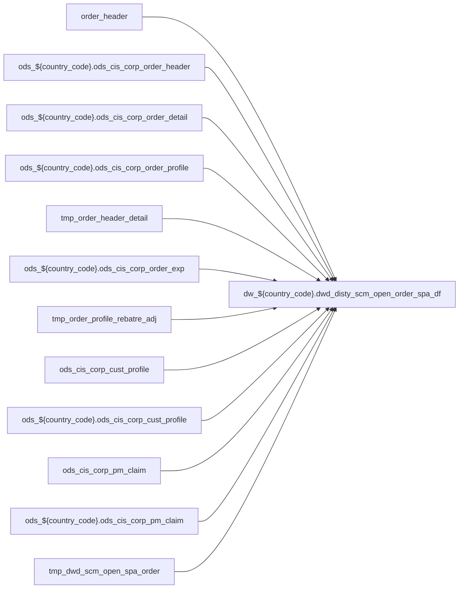

# DWD: `dwd_disty_scm_open_order_spa_df`

- artifact_type: etl_table
- artifact_id: dw_${country_code}.dwd_disty_scm_open_order_spa_df
- domain: pos
- one_line_purpose: ETL script `source/contracts/pos/bitbucket-etl/dwd_disty_scm_open_order_spa_df/dwd_disty_scm_open_order_spa_df.sql` loads `dw_${country_code}.dwd_disty_scm_open_order_spa_df` (layer `DWD`). Purpose inferred from SQL only.
- layer_type: DWD
- source_kind: etl_sql
- evidence_source: source/contracts/pos/bitbucket-etl/dwd_disty_scm_open_order_spa_df/dwd_disty_scm_open_order_spa_df.sql
- bitbucket_etl_bundle: source/contracts/pos/bitbucket-etl/dwd_disty_scm_open_order_spa_df/

---

## L1 Data Foundation

### Identity and physical mapping
- **Table:** `dw_${country_code}.dwd_disty_scm_open_order_spa_df`
- **Layer type:** DWD
- **Canonical / derived:** Derived / ETL-loaded (see L3)
- **Owner team:** Not documented in repository

### Grain, scope, exclusions
- **Grain:** Not documented in repository (see SELECT/GROUP BY in `source/contracts/pos/bitbucket-etl/dwd_disty_scm_open_order_spa_df/dwd_disty_scm_open_order_spa_df.sql`)
- **Partition:** `date_flag='${date_flag}'`
- **Exclusions:** See L3 Key filters

### Cross-engine presence
| Engine | Present | Canonical FQN | Notes |
|--------|---------|---------------|-------|
| Hive | yes | `dw_${country_code}.dwd_disty_scm_open_order_spa_df` | ETL target |
| Vertica | Not documented in repository | — | Confirm via hive2vertica flow |

### Physical schema reference

Pointer block only - full column catalog lives in WKB L1 storage JSON.

| Field | Value |
|-------|-------|
| **Authoritative catalog** | WKB L1 storage seed (not duplicated in this file) |
| **entity_id** | `dw_${country_code}.dwd_disty_scm_open_order_spa_df` |
| **l1_catalog_seed** | `target/storage/wkb/snapshots/_snapshot_id_template/l1_catalog/{engine}_{schema}_{table}.json` |
| **column_count** | pending (run ddl_seed_writer) |
| **partition_keys** | `date_flag='${date_flag}'` |
| **ddl_source** | pending Bitbucket DDL / Vertica metadata ingest |
| **retrieval** | `python -m tools.wkb.indexing.run_query --query "pos dwd_disty_scm_open_order_spa_df schema" --intent find_table_schema` |

### Lineage

- **Primary load:** `source/contracts/pos/bitbucket-etl/dwd_disty_scm_open_order_spa_df/dwd_disty_scm_open_order_spa_df.sql`
- **upstream:** `order_header` — FROM/JOIN — `source/contracts/pos/bitbucket-etl/dwd_disty_scm_open_order_spa_df/dwd_disty_scm_open_order_spa_df.sql`
- **upstream:** `ods_${country_code}.ods_cis_corp_order_header` — FROM/JOIN — `source/contracts/pos/bitbucket-etl/dwd_disty_scm_open_order_spa_df/dwd_disty_scm_open_order_spa_df.sql`
- **upstream:** `ods_${country_code}.ods_cis_corp_order_detail` — FROM/JOIN — `source/contracts/pos/bitbucket-etl/dwd_disty_scm_open_order_spa_df/dwd_disty_scm_open_order_spa_df.sql`
- **upstream:** `ods_${country_code}.ods_cis_corp_order_profile` — FROM/JOIN — `source/contracts/pos/bitbucket-etl/dwd_disty_scm_open_order_spa_df/dwd_disty_scm_open_order_spa_df.sql`
- **upstream:** `tmp_order_header_detail` — FROM/JOIN — `source/contracts/pos/bitbucket-etl/dwd_disty_scm_open_order_spa_df/dwd_disty_scm_open_order_spa_df.sql`
- **upstream:** `ods_${country_code}.ods_cis_corp_order_exp` — FROM/JOIN — `source/contracts/pos/bitbucket-etl/dwd_disty_scm_open_order_spa_df/dwd_disty_scm_open_order_spa_df.sql`
- **upstream:** `tmp_order_profile_rebatre_adj` — FROM/JOIN — `source/contracts/pos/bitbucket-etl/dwd_disty_scm_open_order_spa_df/dwd_disty_scm_open_order_spa_df.sql`
- **upstream:** `ods_cis_corp_cust_profile` — FROM/JOIN — `source/contracts/pos/bitbucket-etl/dwd_disty_scm_open_order_spa_df/dwd_disty_scm_open_order_spa_df.sql`
- **upstream:** `ods_${country_code}.ods_cis_corp_cust_profile` — FROM/JOIN — `source/contracts/pos/bitbucket-etl/dwd_disty_scm_open_order_spa_df/dwd_disty_scm_open_order_spa_df.sql`
- **upstream:** `ods_cis_corp_pm_claim` — FROM/JOIN — `source/contracts/pos/bitbucket-etl/dwd_disty_scm_open_order_spa_df/dwd_disty_scm_open_order_spa_df.sql`
- **upstream:** `ods_${country_code}.ods_cis_corp_pm_claim` — FROM/JOIN — `source/contracts/pos/bitbucket-etl/dwd_disty_scm_open_order_spa_df/dwd_disty_scm_open_order_spa_df.sql`
- **upstream:** `tmp_dwd_scm_open_spa_order` — FROM/JOIN — `source/contracts/pos/bitbucket-etl/dwd_disty_scm_open_order_spa_df/dwd_disty_scm_open_order_spa_df.sql`
- **upstream:** `ods_${country_code}.ods_cis_corp_spa_detail` — FROM/JOIN — `source/contracts/pos/bitbucket-etl/dwd_disty_scm_open_order_spa_df/dwd_disty_scm_open_order_spa_df.sql`
- **upstream:** `ods_${country_code}.ods_cis_corp_spa_header` — FROM/JOIN — `source/contracts/pos/bitbucket-etl/dwd_disty_scm_open_order_spa_df/dwd_disty_scm_open_order_spa_df.sql`
- **upstream:** `temp_cust_profile` — FROM/JOIN — `source/contracts/pos/bitbucket-etl/dwd_disty_scm_open_order_spa_df/dwd_disty_scm_open_order_spa_df.sql`
- **upstream:** `ods_${country_code}.ods_etl_spa_cust_all` — FROM/JOIN — `source/contracts/pos/bitbucket-etl/dwd_disty_scm_open_order_spa_df/dwd_disty_scm_open_order_spa_df.sql`
- **upstream:** `temp_pm_claim` — FROM/JOIN — `source/contracts/pos/bitbucket-etl/dwd_disty_scm_open_order_spa_df/dwd_disty_scm_open_order_spa_df.sql`
- **downstream:** see L6 Downstream consumers
### Freshness and load path
| Item | Value |
|------|-------|
| Load pattern | See L3 INSERT / OVERWRITE in evidence script |
| Schedule | Not documented in repository |
| Parameters | Parsed from ETL literals / `${...}` in `source/contracts/pos/bitbucket-etl/dwd_disty_scm_open_order_spa_df/dwd_disty_scm_open_order_spa_df.sql` |

## L2 Declarative Knowledge

### Business purpose
ETL script `source/contracts/pos/bitbucket-etl/dwd_disty_scm_open_order_spa_df/dwd_disty_scm_open_order_spa_df.sql` loads `dw_${country_code}.dwd_disty_scm_open_order_spa_df` (layer `DWD`). Purpose inferred from SQL only.

### Audience and use cases
| Audience | How they benefit |
|----------|-----------------|
| Data / BI consumers | Use target table produced by this ETL |
| Data Engineering | Maintain load logic in evidence script |

### Fact key resolution
- Keys follow target INSERT column list / GROUP BY in evidence SQL.

### Time field semantics
- Partition / date fields: `date_flag='${date_flag}'`

### Metrics served
- See L3 column derivations for measure expressions when present.

### Metric serving map
N/A — not a multi-period wide serving table (or not documented).

### etl_metrics
No calculable business metrics registered in metric-index for this create run.

## L3 Procedural Knowledge

### Query and routing rules
- Prefer querying the target `dw_${country_code}.dwd_disty_scm_open_order_spa_df` after successful ETL load.

### Dimension join patterns
- See Relationship map and Base tables register.

### Key filters and ETL business logic

| Predicate | Kind | Evidence |
|-----------|------|----------|
| `oh.ship_date is null; --2 temp table for order_profile and profile_type=REBATE_ADJ create temporary table tmp_order_profile_rebatre_adj as select op.order_no, op.order_type, op.order_line_no, op.pr...` | Business | `source/contracts/pos/bitbucket-etl/dwd_disty_scm_open_order_spa_df/dwd_disty_scm_open_order_spa_df.sql` |

### Standard time-filter SQL
```sql
-- See partition / date predicates in source/contracts/pos/bitbucket-etl/dwd_disty_scm_open_order_spa_df/dwd_disty_scm_open_order_spa_df.sql
```

### End-to-end flow



### Base tables register

| Object | Role |
|--------|------|
| `order_header` | source / temp (from ETL FROM/JOIN) |
| `ods_${country_code}.ods_cis_corp_order_header` | source / temp (from ETL FROM/JOIN) |
| `ods_${country_code}.ods_cis_corp_order_detail` | source / temp (from ETL FROM/JOIN) |
| `ods_${country_code}.ods_cis_corp_order_profile` | source / temp (from ETL FROM/JOIN) |
| `tmp_order_header_detail` | source / temp (from ETL FROM/JOIN) |
| `ods_${country_code}.ods_cis_corp_order_exp` | source / temp (from ETL FROM/JOIN) |
| `tmp_order_profile_rebatre_adj` | source / temp (from ETL FROM/JOIN) |
| `ods_cis_corp_cust_profile` | source / temp (from ETL FROM/JOIN) |
| `ods_${country_code}.ods_cis_corp_cust_profile` | source / temp (from ETL FROM/JOIN) |
| `ods_cis_corp_pm_claim` | source / temp (from ETL FROM/JOIN) |
| `ods_${country_code}.ods_cis_corp_pm_claim` | source / temp (from ETL FROM/JOIN) |
| `tmp_dwd_scm_open_spa_order` | source / temp (from ETL FROM/JOIN) |
| `ods_${country_code}.ods_cis_corp_spa_detail` | source / temp (from ETL FROM/JOIN) |
| `ods_${country_code}.ods_cis_corp_spa_header` | source / temp (from ETL FROM/JOIN) |
| `temp_cust_profile` | source / temp (from ETL FROM/JOIN) |
| `ods_${country_code}.ods_etl_spa_cust_all` | source / temp (from ETL FROM/JOIN) |
| `temp_pm_claim` | source / temp (from ETL FROM/JOIN) |

### Step-by-step logic
1. Read sources listed in Base tables register (`source/contracts/pos/bitbucket-etl/dwd_disty_scm_open_order_spa_df/dwd_disty_scm_open_order_spa_df.sql`).
2. Apply filters documented under Key filters.
3. INSERT OVERWRITE / write target `dw_${country_code}.dwd_disty_scm_open_order_spa_df`.

### Relationship map (embedded)

| from_fqn | to_fqn | cardinality | join_keys | provenance |
|----------|--------|-------------|-----------|------------|
| `ods_${country_code}.ods_cis_corp_order_header` | `ods_${country_code}.ods_cis_corp_order_detail` | many:1 | `oh.order_no` = `od.order_no`; `oh.order_type` = `od.order_type` | etl_sql (`source/contracts/pos/bitbucket-etl/dwd_disty_scm_open_order_spa_df/dwd_disty_scm_open_order_spa_df.sql:16`) |
| `hd` | `ods_${country_code}.ods_cis_corp_order_exp` | many:1 (LEFT) | `he.order_type` = `hd.order_type`; `he.order_no` = `hd.order_no`; `he.order_line_no` = `hd.order_line_no` | etl_sql (`source/contracts/pos/bitbucket-etl/dwd_disty_scm_open_order_spa_df/dwd_disty_scm_open_order_spa_df.sql:61`) |
| `ods_${country_code}.ods_cis_corp_order_exp` | `tmp_order_profile_rebatre_adj` | many:1 (LEFT) | `he.order_no` = `op.order_no`; `he.order_type` = `op.order_type`; `he.order_line_no` = `op.order_line_no`; `he.order_expense_line_no` = `op.profile_no` | etl_sql (`source/contracts/pos/bitbucket-etl/dwd_disty_scm_open_order_spa_df/dwd_disty_scm_open_order_spa_df.sql:66`) |
| `so` | `ods_${country_code}.ods_cis_corp_spa_detail` | many:1 (LEFT) | `so.spa_no` = `sd.spa_no`; `so.sku_no_exp` = `sd.sku_no` | etl_sql (`source/contracts/pos/bitbucket-etl/dwd_disty_scm_open_order_spa_df/dwd_disty_scm_open_order_spa_df.sql:125`) |
| `so` | `ods_${country_code}.ods_cis_corp_spa_header` | many:1 (LEFT) | `so.spa_no` = `sh.spa_no` | etl_sql (`source/contracts/pos/bitbucket-etl/dwd_disty_scm_open_order_spa_df/dwd_disty_scm_open_order_spa_df.sql:128`) |
| `so` | `temp_cust_profile` | many:1 (LEFT) | `so.cust_no` = `cp.cust_no` | etl_sql (`source/contracts/pos/bitbucket-etl/dwd_disty_scm_open_order_spa_df/dwd_disty_scm_open_order_spa_df.sql:131`) |
| `so` | `ods_${country_code}.ods_etl_spa_cust_all` | many:1 (LEFT) | `sc.cust_no` = `so.cust_no`; `sc.spa_no` = `sh.spa_no` | etl_sql (`source/contracts/pos/bitbucket-etl/dwd_disty_scm_open_order_spa_df/dwd_disty_scm_open_order_spa_df.sql:133`) |
| `so` | `temp_pm_claim` | many:1 (LEFT) | `so.scm_no` = `tpc.project_no` | etl_sql (`source/contracts/pos/bitbucket-etl/dwd_disty_scm_open_order_spa_df/dwd_disty_scm_open_order_spa_df.sql:136`) |

### Special logic (embedded)

`source/ref/pos/special_logic.txt` exists but no rule naming this FQN/stem (`dw_${country_code}.dwd_disty_scm_open_order_spa_df`).

Not documented in repository


### Column / field derivations (from ETL SQL)

| target_column | expression_sql | upstream_columns | upstream_tables | transform_kind | evidence |
|---------------|----------------|------------------|-----------------|----------------|----------|
| `order_type` | `so.order_type` | `order_type` | `tmp_dwd_scm_open_spa_order`, `ods_${country_code}.ods_cis_corp_spa_detail`, `ods_${country_code}.ods_cis_corp_spa_header`, `temp_cust_profile`, `ods_${country_code}.ods_etl_spa_cust_all`, `temp_pm_claim` | passthrough | `source/contracts/pos/bitbucket-etl/dwd_disty_scm_open_order_spa_df/dwd_disty_scm_open_order_spa_df.sql:96` |
| `order_no` | `so.order_no` | `order_no` | `tmp_dwd_scm_open_spa_order`, `ods_${country_code}.ods_cis_corp_spa_detail`, `ods_${country_code}.ods_cis_corp_spa_header`, `temp_cust_profile`, `ods_${country_code}.ods_etl_spa_cust_all`, `temp_pm_claim` | passthrough | `source/contracts/pos/bitbucket-etl/dwd_disty_scm_open_order_spa_df/dwd_disty_scm_open_order_spa_df.sql:97` |
| `order_line_no` | `so.order_line_no` | `order_line_no` | `tmp_dwd_scm_open_spa_order`, `ods_${country_code}.ods_cis_corp_spa_detail`, `ods_${country_code}.ods_cis_corp_spa_header`, `temp_cust_profile`, `ods_${country_code}.ods_etl_spa_cust_all`, `temp_pm_claim` | passthrough | `source/contracts/pos/bitbucket-etl/dwd_disty_scm_open_order_spa_df/dwd_disty_scm_open_order_spa_df.sql:98` |
| `spa_no` | `so.spa_no` | `spa_no` | `tmp_dwd_scm_open_spa_order`, `ods_${country_code}.ods_cis_corp_spa_detail`, `ods_${country_code}.ods_cis_corp_spa_header`, `temp_cust_profile`, `ods_${country_code}.ods_etl_spa_cust_all`, `temp_pm_claim` | passthrough | `source/contracts/pos/bitbucket-etl/dwd_disty_scm_open_order_spa_df/dwd_disty_scm_open_order_spa_df.sql:99` |
| `spa_ref_no` | `so.spa_ref_no` | `spa_ref_no` | `tmp_dwd_scm_open_spa_order`, `ods_${country_code}.ods_cis_corp_spa_detail`, `ods_${country_code}.ods_cis_corp_spa_header`, `temp_cust_profile`, `ods_${country_code}.ods_etl_spa_cust_all`, `temp_pm_claim` | passthrough | `source/contracts/pos/bitbucket-etl/dwd_disty_scm_open_order_spa_df/dwd_disty_scm_open_order_spa_df.sql:100` |
| `scm_no` | `so.scm_no` | `scm_no` | `tmp_dwd_scm_open_spa_order`, `ods_${country_code}.ods_cis_corp_spa_detail`, `ods_${country_code}.ods_cis_corp_spa_header`, `temp_cust_profile`, `ods_${country_code}.ods_etl_spa_cust_all`, `temp_pm_claim` | passthrough | `source/contracts/pos/bitbucket-etl/dwd_disty_scm_open_order_spa_df/dwd_disty_scm_open_order_spa_df.sql:101` |
| `cust_no` | `so.cust_no` | `cust_no` | `tmp_dwd_scm_open_spa_order`, `ods_${country_code}.ods_cis_corp_spa_detail`, `ods_${country_code}.ods_cis_corp_spa_header`, `temp_cust_profile`, `ods_${country_code}.ods_etl_spa_cust_all`, `temp_pm_claim` | passthrough | `source/contracts/pos/bitbucket-etl/dwd_disty_scm_open_order_spa_df/dwd_disty_scm_open_order_spa_df.sql:102` |
| `sku_no` | `so.sku_no` | `sku_no` | `tmp_dwd_scm_open_spa_order`, `ods_${country_code}.ods_cis_corp_spa_detail`, `ods_${country_code}.ods_cis_corp_spa_header`, `temp_cust_profile`, `ods_${country_code}.ods_etl_spa_cust_all`, `temp_pm_claim` | passthrough | `source/contracts/pos/bitbucket-etl/dwd_disty_scm_open_order_spa_df/dwd_disty_scm_open_order_spa_df.sql:103` |
| `sku_no_exp` | `so.sku_no_exp` | `sku_no_exp` | `tmp_dwd_scm_open_spa_order`, `ods_${country_code}.ods_cis_corp_spa_detail`, `ods_${country_code}.ods_cis_corp_spa_header`, `temp_cust_profile`, `ods_${country_code}.ods_etl_spa_cust_all`, `temp_pm_claim` | passthrough | `source/contracts/pos/bitbucket-etl/dwd_disty_scm_open_order_spa_df/dwd_disty_scm_open_order_spa_df.sql:104` |
| `order_qty` | `so.order_qty` | `order_qty` | `tmp_dwd_scm_open_spa_order`, `ods_${country_code}.ods_cis_corp_spa_detail`, `ods_${country_code}.ods_cis_corp_spa_header`, `temp_cust_profile`, `ods_${country_code}.ods_etl_spa_cust_all`, `temp_pm_claim` | passthrough | `source/contracts/pos/bitbucket-etl/dwd_disty_scm_open_order_spa_df/dwd_disty_scm_open_order_spa_df.sql:105` |
| `sales_adj_amt` | `so.sales_adj_amt` | `sales_adj_amt` | `tmp_dwd_scm_open_spa_order`, `ods_${country_code}.ods_cis_corp_spa_detail`, `ods_${country_code}.ods_cis_corp_spa_header`, `temp_cust_profile`, `ods_${country_code}.ods_etl_spa_cust_all`, `temp_pm_claim` | passthrough | `source/contracts/pos/bitbucket-etl/dwd_disty_scm_open_order_spa_df/dwd_disty_scm_open_order_spa_df.sql:106` |
| `unit_exp` | `so.unit_exp` | `unit_exp` | `tmp_dwd_scm_open_spa_order`, `ods_${country_code}.ods_cis_corp_spa_detail`, `ods_${country_code}.ods_cis_corp_spa_header`, `temp_cust_profile`, `ods_${country_code}.ods_etl_spa_cust_all`, `temp_pm_claim` | passthrough | `source/contracts/pos/bitbucket-etl/dwd_disty_scm_open_order_spa_df/dwd_disty_scm_open_order_spa_df.sql:107` |
| `extended_exp` | `so.extended_exp` | `extended_exp` | `tmp_dwd_scm_open_spa_order`, `ods_${country_code}.ods_cis_corp_spa_detail`, `ods_${country_code}.ods_cis_corp_spa_header`, `temp_cust_profile`, `ods_${country_code}.ods_etl_spa_cust_all`, `temp_pm_claim` | passthrough | `source/contracts/pos/bitbucket-etl/dwd_disty_scm_open_order_spa_df/dwd_disty_scm_open_order_spa_df.sql:108` |
| `exp_code` | `so.exp_code` | `exp_code` | `tmp_dwd_scm_open_spa_order`, `ods_${country_code}.ods_cis_corp_spa_detail`, `ods_${country_code}.ods_cis_corp_spa_header`, `temp_cust_profile`, `ods_${country_code}.ods_etl_spa_cust_all`, `temp_pm_claim` | passthrough | `source/contracts/pos/bitbucket-etl/dwd_disty_scm_open_order_spa_df/dwd_disty_scm_open_order_spa_df.sql:109` |
| `spa_type` | `sh.spa_type` | `spa_type` | `tmp_dwd_scm_open_spa_order`, `ods_${country_code}.ods_cis_corp_spa_detail`, `ods_${country_code}.ods_cis_corp_spa_header`, `temp_cust_profile`, `ods_${country_code}.ods_etl_spa_cust_all`, `temp_pm_claim` | passthrough | `source/contracts/pos/bitbucket-etl/dwd_disty_scm_open_order_spa_df/dwd_disty_scm_open_order_spa_df.sql:110` |
| `spa_desc` | `sh.spa_desc` | `spa_desc` | `tmp_dwd_scm_open_spa_order`, `ods_${country_code}.ods_cis_corp_spa_detail`, `ods_${country_code}.ods_cis_corp_spa_header`, `temp_cust_profile`, `ods_${country_code}.ods_etl_spa_cust_all`, `temp_pm_claim` | passthrough | `source/contracts/pos/bitbucket-etl/dwd_disty_scm_open_order_spa_df/dwd_disty_scm_open_order_spa_df.sql:111` |
| `claim_type` | `tpc.claim_type` | `claim_type` | `tmp_dwd_scm_open_spa_order`, `ods_${country_code}.ods_cis_corp_spa_detail`, `ods_${country_code}.ods_cis_corp_spa_header`, `temp_cust_profile`, `ods_${country_code}.ods_etl_spa_cust_all`, `temp_pm_claim` | passthrough | `source/contracts/pos/bitbucket-etl/dwd_disty_scm_open_order_spa_df/dwd_disty_scm_open_order_spa_df.sql:112` |
| `approved_cost` | `sd.approved_cost` | `approved_cost` | `tmp_dwd_scm_open_spa_order`, `ods_${country_code}.ods_cis_corp_spa_detail`, `ods_${country_code}.ods_cis_corp_spa_header`, `temp_cust_profile`, `ods_${country_code}.ods_etl_spa_cust_all`, `temp_pm_claim` | passthrough | `source/contracts/pos/bitbucket-etl/dwd_disty_scm_open_order_spa_df/dwd_disty_scm_open_order_spa_df.sql:113` |
| `rebate_amt` | `sd.rebate_amt` | `rebate_amt` | `tmp_dwd_scm_open_spa_order`, `ods_${country_code}.ods_cis_corp_spa_detail`, `ods_${country_code}.ods_cis_corp_spa_header`, `temp_cust_profile`, `ods_${country_code}.ods_etl_spa_cust_all`, `temp_pm_claim` | passthrough | `source/contracts/pos/bitbucket-etl/dwd_disty_scm_open_order_spa_df/dwd_disty_scm_open_order_spa_df.sql:114` |
| `spa_keep` | `sc.spa_keep` | `spa_keep` | `tmp_dwd_scm_open_spa_order`, `ods_${country_code}.ods_cis_corp_spa_detail`, `ods_${country_code}.ods_cis_corp_spa_header`, `temp_cust_profile`, `ods_${country_code}.ods_etl_spa_cust_all`, `temp_pm_claim` | passthrough | `source/contracts/pos/bitbucket-etl/dwd_disty_scm_open_order_spa_df/dwd_disty_scm_open_order_spa_df.sql:115` |
| `customer_spa_keep` | `cp.profile_f` | `profile_f` | `tmp_dwd_scm_open_spa_order`, `ods_${country_code}.ods_cis_corp_spa_detail`, `ods_${country_code}.ods_cis_corp_spa_header`, `temp_cust_profile`, `ods_${country_code}.ods_etl_spa_cust_all`, `temp_pm_claim` | rename | `source/contracts/pos/bitbucket-etl/dwd_disty_scm_open_order_spa_df/dwd_disty_scm_open_order_spa_df.sql:116` |
| `vendor_appr_ref_no` | `case when tpc.claim_type = 37 then tpc.pri_approv_ref_no else null end` | `claim_type`, `pri_approv_ref_no` | `tmp_dwd_scm_open_spa_order`, `ods_${country_code}.ods_cis_corp_spa_detail`, `ods_${country_code}.ods_cis_corp_spa_header`, `temp_cust_profile`, `ods_${country_code}.ods_etl_spa_cust_all`, `temp_pm_claim` | case | `source/contracts/pos/bitbucket-etl/dwd_disty_scm_open_order_spa_df/dwd_disty_scm_open_order_spa_df.sql:87` |
| `invoice_date` | `so.invoice_date` | `invoice_date` | `tmp_dwd_scm_open_spa_order`, `ods_${country_code}.ods_cis_corp_spa_detail`, `ods_${country_code}.ods_cis_corp_spa_header`, `temp_cust_profile`, `ods_${country_code}.ods_etl_spa_cust_all`, `temp_pm_claim` | passthrough | `source/contracts/pos/bitbucket-etl/dwd_disty_scm_open_order_spa_df/dwd_disty_scm_open_order_spa_df.sql:121` |
| `order_entry_date` | `so.order_entry_date` | `order_entry_date` | `tmp_dwd_scm_open_spa_order`, `ods_${country_code}.ods_cis_corp_spa_detail`, `ods_${country_code}.ods_cis_corp_spa_header`, `temp_cust_profile`, `ods_${country_code}.ods_etl_spa_cust_all`, `temp_pm_claim` | passthrough | `source/contracts/pos/bitbucket-etl/dwd_disty_scm_open_order_spa_df/dwd_disty_scm_open_order_spa_df.sql:122` |
| `etl_timestamp` | `from_utc_timestamp(current_timestamp(),'America/Los_Angeles')` | `from_utc_timestamp`, `current_timestamp`, `America`, `Los_Angeles` | `tmp_dwd_scm_open_spa_order`, `ods_${country_code}.ods_cis_corp_spa_detail`, `ods_${country_code}.ods_cis_corp_spa_header`, `temp_cust_profile`, `ods_${country_code}.ods_etl_spa_cust_all`, `temp_pm_claim` | arithmetic | `source/contracts/pos/bitbucket-etl/dwd_disty_scm_open_order_spa_df/dwd_disty_scm_open_order_spa_df.sql:123` |

### Sentinel and code values
Not documented in repository beyond CASE/exp_code predicates in ETL SQL.

## L4 Validation

### Resolved partition value
- Partition expression from ETL: `date_flag='${date_flag}'`
- Runtime values: Not documented in repository (resolve via Azkaban params when flow evidence exists).

### Data quality checks
Not documented in repository

### Validation SQL
N/A — Vertica MCP not executed during documentation (Vertica no-run policy).

### Caveats for interpretation
- Generated from ETL SQL evidence only; business definitions may need `source/ref` enrichment.

### Conflicts and open questions
None identified in repository

## L5 Runtime View

### Query path and engine preference
| Path | Engine | Evidence |
|------|--------|----------|
| ETL load | Hive/Spark | `source/contracts/pos/bitbucket-etl/dwd_disty_scm_open_order_spa_df/dwd_disty_scm_open_order_spa_df.sql` |
| Serving | Vertica (when synced) | Not documented in repository |

### Access constraints
Not documented in repository

### Query risk profile
- Scan risk depends on partition pruning; always filter partition keys when present.

## L6 Access and Consumption

### Primary consumers and use cases
Not documented in repository

### Representative query patterns
Not documented in repository

### Dependencies and notes

#### Upstream objects (verified)
| Object | Usage | Evidence |
|--------|-------|----------|
| `order_header` | FROM/JOIN | `source/contracts/pos/bitbucket-etl/dwd_disty_scm_open_order_spa_df/dwd_disty_scm_open_order_spa_df.sql` |
| `ods_${country_code}.ods_cis_corp_order_header` | FROM/JOIN | `source/contracts/pos/bitbucket-etl/dwd_disty_scm_open_order_spa_df/dwd_disty_scm_open_order_spa_df.sql` |
| `ods_${country_code}.ods_cis_corp_order_detail` | FROM/JOIN | `source/contracts/pos/bitbucket-etl/dwd_disty_scm_open_order_spa_df/dwd_disty_scm_open_order_spa_df.sql` |
| `ods_${country_code}.ods_cis_corp_order_profile` | FROM/JOIN | `source/contracts/pos/bitbucket-etl/dwd_disty_scm_open_order_spa_df/dwd_disty_scm_open_order_spa_df.sql` |
| `tmp_order_header_detail` | FROM/JOIN | `source/contracts/pos/bitbucket-etl/dwd_disty_scm_open_order_spa_df/dwd_disty_scm_open_order_spa_df.sql` |
| `ods_${country_code}.ods_cis_corp_order_exp` | FROM/JOIN | `source/contracts/pos/bitbucket-etl/dwd_disty_scm_open_order_spa_df/dwd_disty_scm_open_order_spa_df.sql` |
| `tmp_order_profile_rebatre_adj` | FROM/JOIN | `source/contracts/pos/bitbucket-etl/dwd_disty_scm_open_order_spa_df/dwd_disty_scm_open_order_spa_df.sql` |
| `ods_cis_corp_cust_profile` | FROM/JOIN | `source/contracts/pos/bitbucket-etl/dwd_disty_scm_open_order_spa_df/dwd_disty_scm_open_order_spa_df.sql` |
| `ods_${country_code}.ods_cis_corp_cust_profile` | FROM/JOIN | `source/contracts/pos/bitbucket-etl/dwd_disty_scm_open_order_spa_df/dwd_disty_scm_open_order_spa_df.sql` |
| `ods_cis_corp_pm_claim` | FROM/JOIN | `source/contracts/pos/bitbucket-etl/dwd_disty_scm_open_order_spa_df/dwd_disty_scm_open_order_spa_df.sql` |
| `ods_${country_code}.ods_cis_corp_pm_claim` | FROM/JOIN | `source/contracts/pos/bitbucket-etl/dwd_disty_scm_open_order_spa_df/dwd_disty_scm_open_order_spa_df.sql` |
| `tmp_dwd_scm_open_spa_order` | FROM/JOIN | `source/contracts/pos/bitbucket-etl/dwd_disty_scm_open_order_spa_df/dwd_disty_scm_open_order_spa_df.sql` |
| `ods_${country_code}.ods_cis_corp_spa_detail` | FROM/JOIN | `source/contracts/pos/bitbucket-etl/dwd_disty_scm_open_order_spa_df/dwd_disty_scm_open_order_spa_df.sql` |
| `ods_${country_code}.ods_cis_corp_spa_header` | FROM/JOIN | `source/contracts/pos/bitbucket-etl/dwd_disty_scm_open_order_spa_df/dwd_disty_scm_open_order_spa_df.sql` |
| `temp_cust_profile` | FROM/JOIN | `source/contracts/pos/bitbucket-etl/dwd_disty_scm_open_order_spa_df/dwd_disty_scm_open_order_spa_df.sql` |
| `ods_${country_code}.ods_etl_spa_cust_all` | FROM/JOIN | `source/contracts/pos/bitbucket-etl/dwd_disty_scm_open_order_spa_df/dwd_disty_scm_open_order_spa_df.sql` |
| `temp_pm_claim` | FROM/JOIN | `source/contracts/pos/bitbucket-etl/dwd_disty_scm_open_order_spa_df/dwd_disty_scm_open_order_spa_df.sql` |

#### Downstream consumers (verified)

| Object / script | Evidence |
|-----------------|----------|
| KB / contract ref: `source/contracts/pos/bitbucket-etl/MANIFEST.md` | `source/contracts/pos/bitbucket-etl/MANIFEST.md:204` |
| KB / contract ref: `source/contracts/pos/tables/dwd_disty_scm_open_order_spa_df.md` | `source/contracts/pos/tables/dwd_disty_scm_open_order_spa_df.md:5` |
| ETL/script ref: `source/contracts/rds/vertica_open_so_bo/etl/open_so_bo_scm_spa_two_sheet_rds_8311.sql` | `source/contracts/rds/vertica_open_so_bo/etl/open_so_bo_scm_spa_two_sheet_rds_8311.sql:30` |
| ETL/script ref: `source/contracts/rds/vertica_open_so_bo/etl/open_so_bo_union_brpt_scm_spa_rds_17956.sql` | `source/contracts/rds/vertica_open_so_bo/etl/open_so_bo_union_brpt_scm_spa_rds_17956.sql:29` |
| KB / contract ref: `source/contracts/rds/vertica_open_so_bo/examples-index.md` | `source/contracts/rds/vertica_open_so_bo/examples-index.md:19` |
| ETL/script ref: `source/contracts/rds/vertica_pos/etl/pos_bo_shipping_multisheet_rds_9127.sql` | `source/contracts/rds/vertica_pos/etl/pos_bo_shipping_multisheet_rds_9127.sql:50` |
| FLOW ref: `source/etl/flows/public_order_scripts/public_order_dw/level1/public_order_dw_br_level1.flow` | `source/etl/flows/public_order_scripts/public_order_dw/level1/public_order_dw_br_level1.flow:299` |
| FLOW ref: `source/etl/flows/public_order_scripts/public_order_dw/level1/public_order_dw_ca_level1.flow` | `source/etl/flows/public_order_scripts/public_order_dw/level1/public_order_dw_ca_level1.flow:292` |
| FLOW ref: `source/etl/flows/public_order_scripts/public_order_dw/level1/public_order_dw_hycn_level1.flow` | `source/etl/flows/public_order_scripts/public_order_dw/level1/public_order_dw_hycn_level1.flow:278` |
| FLOW ref: `source/etl/flows/public_order_scripts/public_order_dw/level1/public_order_dw_hyuk_level1.flow` | `source/etl/flows/public_order_scripts/public_order_dw/level1/public_order_dw_hyuk_level1.flow:278` |
| FLOW ref: `source/etl/flows/public_order_scripts/public_order_dw/level1/public_order_dw_hyus_level1.flow` | `source/etl/flows/public_order_scripts/public_order_dw/level1/public_order_dw_hyus_level1.flow:286` |
| FLOW ref: `source/etl/flows/public_order_scripts/public_order_dw/level1/public_order_dw_hyww_level1.flow` | `source/etl/flows/public_order_scripts/public_order_dw/level1/public_order_dw_hyww_level1.flow:278` |
| FLOW ref: `source/etl/flows/public_order_scripts/public_order_dw/level1/public_order_dw_us_level1.flow` | `source/etl/flows/public_order_scripts/public_order_dw/level1/public_order_dw_us_level1.flow:306` |
| FLOW ref: `source/etl/flows/public_order_scripts/public_order_dw/level1/public_order_dw_wcla_level1.flow` | `source/etl/flows/public_order_scripts/public_order_dw/level1/public_order_dw_wcla_level1.flow:287` |
| FLOW ref: `source/etl/flows/public_order_scripts/public_order_dw/public_order_dw_br.flow` | `source/etl/flows/public_order_scripts/public_order_dw/public_order_dw_br.flow:83` |
| FLOW ref: `source/etl/flows/public_order_scripts/public_order_dw/public_order_dw_ca.flow` | `source/etl/flows/public_order_scripts/public_order_dw/public_order_dw_ca.flow:81` |
| FLOW ref: `source/etl/flows/public_order_scripts/public_order_dw/public_order_dw_hycn.flow` | `source/etl/flows/public_order_scripts/public_order_dw/public_order_dw_hycn.flow:81` |
| FLOW ref: `source/etl/flows/public_order_scripts/public_order_dw/public_order_dw_hyuk.flow` | `source/etl/flows/public_order_scripts/public_order_dw/public_order_dw_hyuk.flow:81` |
| FLOW ref: `source/etl/flows/public_order_scripts/public_order_dw/public_order_dw_hyus.flow` | `source/etl/flows/public_order_scripts/public_order_dw/public_order_dw_hyus.flow:81` |
| FLOW ref: `source/etl/flows/public_order_scripts/public_order_dw/public_order_dw_hyww.flow` | `source/etl/flows/public_order_scripts/public_order_dw/public_order_dw_hyww.flow:82` |
| FLOW ref: `source/etl/flows/public_order_scripts/public_order_dw/public_order_dw_us.flow` | `source/etl/flows/public_order_scripts/public_order_dw/public_order_dw_us.flow:81` |
| FLOW ref: `source/etl/flows/public_order_scripts/public_order_dw/public_order_dw_wcla.flow` | `source/etl/flows/public_order_scripts/public_order_dw/public_order_dw_wcla.flow:81` |
| ETL/script ref: `source/etl/sql/order/public_order_scripts/public_order_dw/script/dwd_disty_scm_open_order_spa_df.sql` | `source/etl/sql/order/public_order_scripts/public_order_dw/script/dwd_disty_scm_open_order_spa_df.sql:94` |
| KB / contract ref: `target/knowledgebase/RDS/vertica_open_so_bo/open_so_bo_scm_spa_two_sheet_rds_8311.md` | `target/knowledgebase/RDS/vertica_open_so_bo/open_so_bo_scm_spa_two_sheet_rds_8311.md:53` |
| KB / contract ref: `target/knowledgebase/RDS/vertica_open_so_bo/open_so_bo_union_brpt_scm_spa_rds_17956.md` | `target/knowledgebase/RDS/vertica_open_so_bo/open_so_bo_union_brpt_scm_spa_rds_17956.md:54` |
| KB / contract ref: `target/knowledgebase/RDS/vertica_pos/pos_bo_shipping_multisheet_rds_9127.md` | `target/knowledgebase/RDS/vertica_pos/pos_bo_shipping_multisheet_rds_9127.md:54` |
| KB / contract ref: `target/knowledgebase/order/dwd_disty_scm_open_order_spa_df.md` | `target/knowledgebase/order/dwd_disty_scm_open_order_spa_df.md:1` |
| KB / contract ref: `target/knowledgebase/order/dwd_disty_scm_shipped_order_spa_di.md` | `target/knowledgebase/order/dwd_disty_scm_shipped_order_spa_di.md:6` |
| KB / contract ref: `target/knowledgebase/pos/readme.md` | `target/knowledgebase/pos/readme.md:111` |

#### Operational detail (verified)
- Partition clause: `date_flag='${date_flag}'`

#### Not documented in repository
- Schedule, owner, SLA
