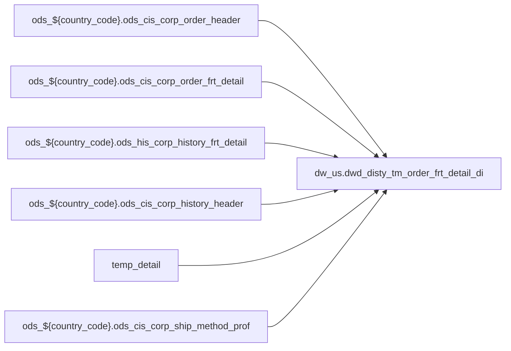

# PRIMARY: POS enrichment partner table joined from hub (`dw_us.dwd_disty_tm_order_frt_detail_di`)

- artifact_type: etl_table
- artifact_id: dw_us.dwd_disty_tm_order_frt_detail_di
- domain: pos
- one_line_purpose: POS-domain table with load SQL under bitbucket-etl (see L3); prior contract narrative preserved below when present.
- layer_type: DWD
- source_kind: etl_sql
- evidence_source: source/contracts/pos/bitbucket-etl/dwd_disty_tm_order_frt_detail_di/dwd_disty_tm_order_frt_detail_di.sql
- bitbucket_etl_bundle: source/contracts/pos/bitbucket-etl/dwd_disty_tm_order_frt_detail_di/
- related_etl_scripts:
- None

---

## L1 Data Foundation

### Identity and physical mapping
- **Table:** `dw_us.dwd_disty_tm_order_frt_detail_di`
- **Layer type:** DWD
- **Canonical / derived:** Derived / ETL-loaded (see L3 from bitbucket-etl)
- **Owner team:** Not documented in repository

### Grain, scope, exclusions
- See preserved **Grain and keys** section below when present (POS contract narrative retained).
- Otherwise infer from SELECT / GROUP BY / INSERT column list in `source/contracts/pos/bitbucket-etl/dwd_disty_tm_order_frt_detail_di/dwd_disty_tm_order_frt_detail_di.sql`.

### Cross-engine presence
| Engine | Present | Notes |
|--------|---------|-------|
| Hive | yes | ETL load target |
| Vertica | yes when POS contract documents Vertica sync | See preserved Business query tables |

### Physical schema reference

| Field | Value |
|-------|-------|
| **entity_id** | `dw_us.dwd_disty_tm_order_frt_detail_di` |
| **l1_catalog_seed** | `target/storage/wkb/snapshots/_snapshot_id_template/l1_catalog/{engine}_{schema}_{table}.json` |
| **column_count** | pending (run ddl_seed_writer) |
| **partition_keys** | See preserved Grain / L4 / ETL PARTITION clause |
| **ddl_source** | pending |
| **retrieval** | `python -m tools.wkb.indexing.run_query --query "pos dwd_disty_tm_order_frt_detail_di schema" --intent find_table_schema` |

### Lineage

- **Primary load:** `source/contracts/pos/bitbucket-etl/dwd_disty_tm_order_frt_detail_di/dwd_disty_tm_order_frt_detail_di.sql`
- **upstream:** `ods_${country_code}.ods_cis_corp_order_header` — FROM/JOIN — `source/contracts/pos/bitbucket-etl/dwd_disty_tm_order_frt_detail_di/dwd_disty_tm_order_frt_detail_di.sql`
- **upstream:** `ods_${country_code}.ods_cis_corp_order_frt_detail` — FROM/JOIN — `source/contracts/pos/bitbucket-etl/dwd_disty_tm_order_frt_detail_di/dwd_disty_tm_order_frt_detail_di.sql`
- **upstream:** `ods_${country_code}.ods_his_corp_history_frt_detail` — FROM/JOIN — `source/contracts/pos/bitbucket-etl/dwd_disty_tm_order_frt_detail_di/dwd_disty_tm_order_frt_detail_di.sql`
- **upstream:** `ods_${country_code}.ods_cis_corp_history_header` — FROM/JOIN — `source/contracts/pos/bitbucket-etl/dwd_disty_tm_order_frt_detail_di/dwd_disty_tm_order_frt_detail_di.sql`
- **upstream:** `temp_detail` — FROM/JOIN — `source/contracts/pos/bitbucket-etl/dwd_disty_tm_order_frt_detail_di/dwd_disty_tm_order_frt_detail_di.sql`
- **upstream:** `ods_${country_code}.ods_cis_corp_ship_method_prof` — FROM/JOIN — `source/contracts/pos/bitbucket-etl/dwd_disty_tm_order_frt_detail_di/dwd_disty_tm_order_frt_detail_di.sql`
- **downstream:** see L6 Downstream consumers
### Freshness and load path
- Parameters / date window: see ETL `${literal_*}` / `${date_flag}` / `${start_date}` in evidence script.
- Schedule: Not documented in repository

## L2 Declarative Knowledge

### Business purpose
See preserved **Business purpose** below when present (POS contract catalog + linked ETL).

### Audience and use cases
See preserved **Who it helps** section when present.

### Fact key resolution
See preserved **Grain and keys** when present.

### Time field semantics
- Prefer partition / `date_flag` filters documented in preserved sections and L3 Key filters from ETL.

### Metrics served
See preserved Metrics / column groups when present; otherwise L3 column derivations.

### Metric serving map
N/A unless multi-period wide table (see preserved content).

### etl_metrics
No new metric-index formulas appended in this bitbucket-etl upgrade pass.

## L3 Procedural Knowledge

### Query and routing rules
- Reporting: Vertica `dw_us.dwd_disty_tm_order_frt_detail_di` when synced (see preserved Business query tables).
- Load logic: bitbucket-etl evidence `source/contracts/pos/bitbucket-etl/dwd_disty_tm_order_frt_detail_di/dwd_disty_tm_order_frt_detail_di.sql`.

### Dimension join patterns
See Relationship map (ETL JOIN edges) and preserved contract join notes.

### Key filters and ETL business logic

| Predicate | Kind | Evidence |
|-----------|------|----------|
| `h.entry_datetime >= date_sub('${sync_day}', '${sync_interval}') and h.entry_datetime < '${sync_day}' and h.ship_date is not null union select distinct fd.header_oid, h.order_type,h.order_no,h.ship_...` | Business | `source/contracts/pos/bitbucket-etl/dwd_disty_tm_order_frt_detail_di/dwd_disty_tm_order_frt_detail_di.sql` |

### Standard time-filter SQL
```sql
-- Prefer date_flag / literal_start_date / literal_end_date as used in source/contracts/pos/bitbucket-etl/dwd_disty_tm_order_frt_detail_di/dwd_disty_tm_order_frt_detail_di.sql
```

### End-to-end flow


### Base tables register
| Object | Role |
|--------|------|
| `ods_${country_code}.ods_cis_corp_order_header` | source / temp (FROM/JOIN) |
| `ods_${country_code}.ods_cis_corp_order_frt_detail` | source / temp (FROM/JOIN) |
| `ods_${country_code}.ods_his_corp_history_frt_detail` | source / temp (FROM/JOIN) |
| `ods_${country_code}.ods_cis_corp_history_header` | source / temp (FROM/JOIN) |
| `temp_detail` | source / temp (FROM/JOIN) |
| `ods_${country_code}.ods_cis_corp_ship_method_prof` | source / temp (FROM/JOIN) |

### Step-by-step logic
1. Execute load SQL / python in `source/contracts/pos/bitbucket-etl/dwd_disty_tm_order_frt_detail_di/`.
2. Apply date / business filters from ETL (Key filters).
3. Write target `dw_us.dwd_disty_tm_order_frt_detail_di` (see INSERT/OVERWRITE in evidence).

### Relationship map (embedded)

| from_fqn | to_fqn | cardinality | join_keys | provenance |
|----------|--------|-------------|-----------|------------|
| `ods_${country_code}.ods_cis_corp_history_header` | `ods_${country_code}.ods_cis_corp_order_frt_detail` | many:1 | `h.order_no` = `fd.order_no`; `h.order_type` = `fd.order_type` | etl_sql (`source/contracts/pos/bitbucket-etl/dwd_disty_tm_order_frt_detail_di/dwd_disty_tm_order_frt_detail_di.sql:10`) |
| `ods_${country_code}.ods_cis_corp_history_header` | `ods_${country_code}.ods_his_corp_history_frt_detail` | many:1 | `h.order_no` = `fd.order_no`; `h.order_type` = `fd.order_type` | etl_sql (`source/contracts/pos/bitbucket-etl/dwd_disty_tm_order_frt_detail_di/dwd_disty_tm_order_frt_detail_di.sql:25`) |
| `o` | `ods_${country_code}.ods_cis_corp_ship_method_prof` | many:1 (LEFT) | `o.ship_method` = `s.ship_method` | etl_sql (`source/contracts/pos/bitbucket-etl/dwd_disty_tm_order_frt_detail_di/dwd_disty_tm_order_frt_detail_di.sql:71`) |

### Special logic (embedded)

`source/ref/pos/special_logic.txt` exists but no rule naming this FQN/stem (`dw_us.dwd_disty_tm_order_frt_detail_di`).

Not documented in repository


### Column / field derivations (from ETL SQL)

| target_column | expression_sql | upstream_columns | upstream_tables | transform_kind | evidence |
|---------------|----------------|------------------|-----------------|----------------|----------|
| `header_oid` | `o.header_oid` | `header_oid` | `temp_detail`, `ods_${country_code}.ods_cis_corp_ship_method_prof` | passthrough | `source/contracts/pos/bitbucket-etl/dwd_disty_tm_order_frt_detail_di/dwd_disty_tm_order_frt_detail_di.sql:64` |
| `order_type` | `o.order_type` | `order_type` | `temp_detail`, `ods_${country_code}.ods_cis_corp_ship_method_prof` | passthrough | `source/contracts/pos/bitbucket-etl/dwd_disty_tm_order_frt_detail_di/dwd_disty_tm_order_frt_detail_di.sql:64` |
| `order_no` | `o.order_no` | `order_no` | `temp_detail`, `ods_${country_code}.ods_cis_corp_ship_method_prof` | passthrough | `source/contracts/pos/bitbucket-etl/dwd_disty_tm_order_frt_detail_di/dwd_disty_tm_order_frt_detail_di.sql:64` |
| `ship_method` | `o.ship_method` | `ship_method` | `temp_detail`, `ods_${country_code}.ods_cis_corp_ship_method_prof` | passthrough | `source/contracts/pos/bitbucket-etl/dwd_disty_tm_order_frt_detail_di/dwd_disty_tm_order_frt_detail_di.sql:64` |
| `u_version` | `o.u_version` | `u_version` | `temp_detail`, `ods_${country_code}.ods_cis_corp_ship_method_prof` | passthrough | `source/contracts/pos/bitbucket-etl/dwd_disty_tm_order_frt_detail_di/dwd_disty_tm_order_frt_detail_di.sql:64` |
| `actual_frt` | `o.actual_frt` | `actual_frt` | `temp_detail`, `ods_${country_code}.ods_cis_corp_ship_method_prof` | passthrough | `source/contracts/pos/bitbucket-etl/dwd_disty_tm_order_frt_detail_di/dwd_disty_tm_order_frt_detail_di.sql:64` |
| `customer_frt` | `o.customer_frt` | `customer_frt` | `temp_detail`, `ods_${country_code}.ods_cis_corp_ship_method_prof` | passthrough | `source/contracts/pos/bitbucket-etl/dwd_disty_tm_order_frt_detail_di/dwd_disty_tm_order_frt_detail_di.sql:64` |
| `as_weight` | `o.as_weight` | `as_weight` | `temp_detail`, `ods_${country_code}.ods_cis_corp_ship_method_prof` | passthrough | `source/contracts/pos/bitbucket-etl/dwd_disty_tm_order_frt_detail_di/dwd_disty_tm_order_frt_detail_di.sql:64` |
| `service_days` | `o.service_days` | `service_days` | `temp_detail`, `ods_${country_code}.ods_cis_corp_ship_method_prof` | passthrough | `source/contracts/pos/bitbucket-etl/dwd_disty_tm_order_frt_detail_di/dwd_disty_tm_order_frt_detail_di.sql:65` |
| `eta_date` | `o.eta_date` | `eta_date` | `temp_detail`, `ods_${country_code}.ods_cis_corp_ship_method_prof` | passthrough | `source/contracts/pos/bitbucket-etl/dwd_disty_tm_order_frt_detail_di/dwd_disty_tm_order_frt_detail_di.sql:65` |
| `expect_ship_date` | `o.expect_ship_date` | `expect_ship_date` | `temp_detail`, `ods_${country_code}.ods_cis_corp_ship_method_prof` | passthrough | `source/contracts/pos/bitbucket-etl/dwd_disty_tm_order_frt_detail_di/dwd_disty_tm_order_frt_detail_di.sql:65` |
| `am_pm` | `o.am_pm` | `am_pm` | `temp_detail`, `ods_${country_code}.ods_cis_corp_ship_method_prof` | passthrough | `source/contracts/pos/bitbucket-etl/dwd_disty_tm_order_frt_detail_di/dwd_disty_tm_order_frt_detail_di.sql:65` |
| `insurance` | `o.insurance` | `insurance` | `temp_detail`, `ods_${country_code}.ods_cis_corp_ship_method_prof` | passthrough | `source/contracts/pos/bitbucket-etl/dwd_disty_tm_order_frt_detail_di/dwd_disty_tm_order_frt_detail_di.sql:65` |
| `cartons` | `o.cartons` | `cartons` | `temp_detail`, `ods_${country_code}.ods_cis_corp_ship_method_prof` | passthrough | `source/contracts/pos/bitbucket-etl/dwd_disty_tm_order_frt_detail_di/dwd_disty_tm_order_frt_detail_di.sql:65` |
| `cod_chg` | `o.cod_chg` | `cod_chg` | `temp_detail`, `ods_${country_code}.ods_cis_corp_ship_method_prof` | passthrough | `source/contracts/pos/bitbucket-etl/dwd_disty_tm_order_frt_detail_di/dwd_disty_tm_order_frt_detail_di.sql:65` |
| `hide_flag` | `o.hide_flag` | `hide_flag` | `temp_detail`, `ods_${country_code}.ods_cis_corp_ship_method_prof` | passthrough | `source/contracts/pos/bitbucket-etl/dwd_disty_tm_order_frt_detail_di/dwd_disty_tm_order_frt_detail_di.sql:65` |
| `inside_chg` | `o.inside_chg` | `inside_chg` | `temp_detail`, `ods_${country_code}.ods_cis_corp_ship_method_prof` | passthrough | `source/contracts/pos/bitbucket-etl/dwd_disty_tm_order_frt_detail_di/dwd_disty_tm_order_frt_detail_di.sql:65` |
| `pallet_chg` | `o.pallet_chg` | `pallet_chg` | `temp_detail`, `ods_${country_code}.ods_cis_corp_ship_method_prof` | passthrough | `source/contracts/pos/bitbucket-etl/dwd_disty_tm_order_frt_detail_di/dwd_disty_tm_order_frt_detail_di.sql:66` |
| `oad_chg` | `o.oad_chg` | `oad_chg` | `temp_detail`, `ods_${country_code}.ods_cis_corp_ship_method_prof` | passthrough | `source/contracts/pos/bitbucket-etl/dwd_disty_tm_order_frt_detail_di/dwd_disty_tm_order_frt_detail_di.sql:66` |
| `low_wgt_rate` | `o.low_wgt_rate` | `low_wgt_rate` | `temp_detail`, `ods_${country_code}.ods_cis_corp_ship_method_prof` | passthrough | `source/contracts/pos/bitbucket-etl/dwd_disty_tm_order_frt_detail_di/dwd_disty_tm_order_frt_detail_di.sql:66` |
| `high_wgt_rate` | `o.high_wgt_rate` | `high_wgt_rate` | `temp_detail`, `ods_${country_code}.ods_cis_corp_ship_method_prof` | passthrough | `source/contracts/pos/bitbucket-etl/dwd_disty_tm_order_frt_detail_di/dwd_disty_tm_order_frt_detail_di.sql:66` |
| `min_charge` | `o.min_charge` | `min_charge` | `temp_detail`, `ods_${country_code}.ods_cis_corp_ship_method_prof` | passthrough | `source/contracts/pos/bitbucket-etl/dwd_disty_tm_order_frt_detail_di/dwd_disty_tm_order_frt_detail_di.sql:66` |
| `asr_chg` | `o.asr_chg` | `asr_chg` | `temp_detail`, `ods_${country_code}.ods_cis_corp_ship_method_prof` | passthrough | `source/contracts/pos/bitbucket-etl/dwd_disty_tm_order_frt_detail_di/dwd_disty_tm_order_frt_detail_di.sql:66` |
| `over_size_chg` | `o.over_size_chg` | `over_size_chg` | `temp_detail`, `ods_${country_code}.ods_cis_corp_ship_method_prof` | passthrough | `source/contracts/pos/bitbucket-etl/dwd_disty_tm_order_frt_detail_di/dwd_disty_tm_order_frt_detail_di.sql:66` |
| `fadd` | `o.fadd` | `fadd` | `temp_detail`, `ods_${country_code}.ods_cis_corp_ship_method_prof` | passthrough | `source/contracts/pos/bitbucket-etl/dwd_disty_tm_order_frt_detail_di/dwd_disty_tm_order_frt_detail_di.sql:66` |
| `fds` | `o.fds` | `fds` | `temp_detail`, `ods_${country_code}.ods_cis_corp_ship_method_prof` | passthrough | `source/contracts/pos/bitbucket-etl/dwd_disty_tm_order_frt_detail_di/dwd_disty_tm_order_frt_detail_di.sql:66` |
| `res_chg` | `o.res_chg` | `res_chg` | `temp_detail`, `ods_${country_code}.ods_cis_corp_ship_method_prof` | passthrough | `source/contracts/pos/bitbucket-etl/dwd_disty_tm_order_frt_detail_di/dwd_disty_tm_order_frt_detail_di.sql:66` |
| `fuel_chg` | `o.fuel_chg` | `fuel_chg` | `temp_detail`, `ods_${country_code}.ods_cis_corp_ship_method_prof` | passthrough | `source/contracts/pos/bitbucket-etl/dwd_disty_tm_order_frt_detail_di/dwd_disty_tm_order_frt_detail_di.sql:67` |
| `dsr_chg` | `o.dsr_chg` | `dsr_chg` | `temp_detail`, `ods_${country_code}.ods_cis_corp_ship_method_prof` | passthrough | `source/contracts/pos/bitbucket-etl/dwd_disty_tm_order_frt_detail_di/dwd_disty_tm_order_frt_detail_di.sql:67` |
| `h_version` | `o.h_version` | `h_version` | `temp_detail`, `ods_${country_code}.ods_cis_corp_ship_method_prof` | passthrough | `source/contracts/pos/bitbucket-etl/dwd_disty_tm_order_frt_detail_di/dwd_disty_tm_order_frt_detail_di.sql:67` |
| `disc_ins` | `o.disc_ins` | `disc_ins` | `temp_detail`, `ods_${country_code}.ods_cis_corp_ship_method_prof` | passthrough | `source/contracts/pos/bitbucket-etl/dwd_disty_tm_order_frt_detail_di/dwd_disty_tm_order_frt_detail_di.sql:67` |
| `disc_cost_bump` | `o.disc_cost_bump` | `disc_cost_bump` | `temp_detail`, `ods_${country_code}.ods_cis_corp_ship_method_prof` | passthrough | `source/contracts/pos/bitbucket-etl/dwd_disty_tm_order_frt_detail_di/dwd_disty_tm_order_frt_detail_di.sql:67` |
| `cost_bump_amt` | `o.cost_bump_amt` | `cost_bump_amt` | `temp_detail`, `ods_${country_code}.ods_cis_corp_ship_method_prof` | passthrough | `source/contracts/pos/bitbucket-etl/dwd_disty_tm_order_frt_detail_di/dwd_disty_tm_order_frt_detail_di.sql:67` |
| `appt_chg` | `o.appt_chg` | `appt_chg` | `temp_detail`, `ods_${country_code}.ods_cis_corp_ship_method_prof` | passthrough | `source/contracts/pos/bitbucket-etl/dwd_disty_tm_order_frt_detail_di/dwd_disty_tm_order_frt_detail_di.sql:67` |
| `man_chg` | `o.man_chg` | `man_chg` | `temp_detail`, `ods_${country_code}.ods_cis_corp_ship_method_prof` | passthrough | `source/contracts/pos/bitbucket-etl/dwd_disty_tm_order_frt_detail_di/dwd_disty_tm_order_frt_detail_di.sql:67` |
| `after_hrs_chg` | `o.after_hrs_chg` | `after_hrs_chg` | `temp_detail`, `ods_${country_code}.ods_cis_corp_ship_method_prof` | passthrough | `source/contracts/pos/bitbucket-etl/dwd_disty_tm_order_frt_detail_di/dwd_disty_tm_order_frt_detail_di.sql:67` |
| `govt_school_fee_chg` | `o.govt_school_fee_chg` | `govt_school_fee_chg` | `temp_detail`, `ods_${country_code}.ods_cis_corp_ship_method_prof` | passthrough | `source/contracts/pos/bitbucket-etl/dwd_disty_tm_order_frt_detail_di/dwd_disty_tm_order_frt_detail_di.sql:68` |
| `mcp_chg` | `o.mcp_chg` | `mcp_chg` | `temp_detail`, `ods_${country_code}.ods_cis_corp_ship_method_prof` | passthrough | `source/contracts/pos/bitbucket-etl/dwd_disty_tm_order_frt_detail_di/dwd_disty_tm_order_frt_detail_di.sql:68` |
| `mfc_chg` | `o.mfc_chg` | `mfc_chg` | `temp_detail`, `ods_${country_code}.ods_cis_corp_ship_method_prof` | passthrough | `source/contracts/pos/bitbucket-etl/dwd_disty_tm_order_frt_detail_di/dwd_disty_tm_order_frt_detail_di.sql:68` |
| `lac_amt` | `o.lac_amt` | `lac_amt` | `temp_detail`, `ods_${country_code}.ods_cis_corp_ship_method_prof` | passthrough | `source/contracts/pos/bitbucket-etl/dwd_disty_tm_order_frt_detail_di/dwd_disty_tm_order_frt_detail_di.sql:68` |
| `ship_date` | `o.ship_date` | `ship_date` | `temp_detail`, `ods_${country_code}.ods_cis_corp_ship_method_prof` | passthrough | `source/contracts/pos/bitbucket-etl/dwd_disty_tm_order_frt_detail_di/dwd_disty_tm_order_frt_detail_di.sql:68` |
| `scac` | `s.scac` | `scac` | `temp_detail`, `ods_${country_code}.ods_cis_corp_ship_method_prof` | passthrough | `source/contracts/pos/bitbucket-etl/dwd_disty_tm_order_frt_detail_di/dwd_disty_tm_order_frt_detail_di.sql:68` |
| `carrier_name` | `s.carrier_name` | `carrier_name` | `temp_detail`, `ods_${country_code}.ods_cis_corp_ship_method_prof` | passthrough | `source/contracts/pos/bitbucket-etl/dwd_disty_tm_order_frt_detail_di/dwd_disty_tm_order_frt_detail_di.sql:68` |
| `edi_carrier_code` | `s.edi_carrier_code` | `edi_carrier_code` | `temp_detail`, `ods_${country_code}.ods_cis_corp_ship_method_prof` | passthrough | `source/contracts/pos/bitbucket-etl/dwd_disty_tm_order_frt_detail_di/dwd_disty_tm_order_frt_detail_di.sql:68` |
| `vend_no` | `s.vend_no` | `vend_no` | `temp_detail`, `ods_${country_code}.ods_cis_corp_ship_method_prof` | passthrough | `source/contracts/pos/bitbucket-etl/dwd_disty_tm_order_frt_detail_di/dwd_disty_tm_order_frt_detail_di.sql:68` |
| `official_carrier_name` | `s.official_carrier_name` | `official_carrier_name` | `temp_detail`, `ods_${country_code}.ods_cis_corp_ship_method_prof` | passthrough | `source/contracts/pos/bitbucket-etl/dwd_disty_tm_order_frt_detail_di/dwd_disty_tm_order_frt_detail_di.sql:69` |
| `mode_of_transport` | `s.mode_of_transport` | `mode_of_transport` | `temp_detail`, `ods_${country_code}.ods_cis_corp_ship_method_prof` | passthrough | `source/contracts/pos/bitbucket-etl/dwd_disty_tm_order_frt_detail_di/dwd_disty_tm_order_frt_detail_di.sql:69` |
| `entry_datetime` | `o.entry_datetime` | `entry_datetime` | `temp_detail`, `ods_${country_code}.ods_cis_corp_ship_method_prof` | passthrough | `source/contracts/pos/bitbucket-etl/dwd_disty_tm_order_frt_detail_di/dwd_disty_tm_order_frt_detail_di.sql:69` |
| `date_flag` | `o.date_flag` | `date_flag` | `temp_detail`, `ods_${country_code}.ods_cis_corp_ship_method_prof` | passthrough | `source/contracts/pos/bitbucket-etl/dwd_disty_tm_order_frt_detail_di/dwd_disty_tm_order_frt_detail_di.sql:69` |

### Sentinel and code values
See preserved content and ETL CASE expressions in column derivations.

## L4 Validation

### Resolved partition value
- Partition / date parameters from ETL literals — concrete calendar values Not documented in repository (resolve via Azkaban when flow evidence exists).

### Data quality checks
See preserved Validation SQL when present.

### Validation SQL
Prefer preserved Vertica validation bundle when present; MCP business SQL not re-run during documentation.

### Caveats for interpretation
- Document upgraded additively from POS **contract** MD + **bitbucket-etl** SQL. Prior contract text is under **Preserved pre-L1-L6 content** when present.

### Conflicts and open questions
- Companion loader scripts may also appear under other domain KB folders; see `target/knowledgebase/pos/readme.md` cross-links.

## L5 Runtime View

### Query path and engine preference
| Path | Engine | Evidence |
|------|--------|----------|
| Load | Hive/Spark | `source/contracts/pos/bitbucket-etl/dwd_disty_tm_order_frt_detail_di/dwd_disty_tm_order_frt_detail_di.sql` |
| Report | Vertica | preserved POS contract when present |

### Access constraints
Not documented in repository

### Query risk profile
- Always filter `date_flag` / documented partition keys before wide scans.

## L6 Access and Consumption

### Primary consumers and use cases
See preserved audience / POS report consumers when present.

### Representative query patterns
See preserved Validation SQL / contract examples when present.

### Dependencies and notes

#### Upstream objects (verified)
| Object | Usage | Evidence |
|--------|-------|----------|
| `ods_${country_code}.ods_cis_corp_order_header` | FROM/JOIN | `source/contracts/pos/bitbucket-etl/dwd_disty_tm_order_frt_detail_di/dwd_disty_tm_order_frt_detail_di.sql` |
| `ods_${country_code}.ods_cis_corp_order_frt_detail` | FROM/JOIN | `source/contracts/pos/bitbucket-etl/dwd_disty_tm_order_frt_detail_di/dwd_disty_tm_order_frt_detail_di.sql` |
| `ods_${country_code}.ods_his_corp_history_frt_detail` | FROM/JOIN | `source/contracts/pos/bitbucket-etl/dwd_disty_tm_order_frt_detail_di/dwd_disty_tm_order_frt_detail_di.sql` |
| `ods_${country_code}.ods_cis_corp_history_header` | FROM/JOIN | `source/contracts/pos/bitbucket-etl/dwd_disty_tm_order_frt_detail_di/dwd_disty_tm_order_frt_detail_di.sql` |
| `temp_detail` | FROM/JOIN | `source/contracts/pos/bitbucket-etl/dwd_disty_tm_order_frt_detail_di/dwd_disty_tm_order_frt_detail_di.sql` |
| `ods_${country_code}.ods_cis_corp_ship_method_prof` | FROM/JOIN | `source/contracts/pos/bitbucket-etl/dwd_disty_tm_order_frt_detail_di/dwd_disty_tm_order_frt_detail_di.sql` |

#### Downstream consumers (verified)

| Object / script | Evidence |
|-----------------|----------|
| POS / RDS reports (contract) | preserved sections when present |
| Related loaders | see related_etl_scripts header |
| KB / contract ref: `source/contracts/pos/bitbucket-etl/MANIFEST.md` | `source/contracts/pos/bitbucket-etl/MANIFEST.md:210` |
| KB / contract ref: `source/contracts/pos/tables/dwd_disty_tm_order_frt_detail_di.md` | `source/contracts/pos/tables/dwd_disty_tm_order_frt_detail_di.md:5` |
| KB / contract ref: `target/knowledgebase/pos/readme.md` | `target/knowledgebase/pos/readme.md:74` |

#### Operational detail (verified)
- Bundle: `source/contracts/pos/bitbucket-etl/dwd_disty_tm_order_frt_detail_di/`
- Manifest: `source/contracts/pos/bitbucket-etl/MANIFEST.md`

#### Not documented in repository
- Schedule, owner, SLA

---

## Preserved pre-L1-L6 content

> Retained verbatim from the prior POS contract knowledgebase document (nothing removed). ETL load evidence above supplements this catalog narrative.


**Domain:** pos  
**Source contract:** `C:\Users\T154858D.TDSNX\Desktop\git_repo_v1\data_analysis_agent_brpt\knowledge\POS\tables\dwd_disty_tm_order_frt_detail_di.md`  
**Knowledgebase path:** `target/knowledgebase/pos/dwd_disty_tm_order_frt_detail_di.md`

## Business purpose

POS enrichment partner table joined from hub

This document is derived from the POS table contract catalog. ETL script lineage for load jobs is **not documented in this repository** unless listed under verified dependencies below.

---

## What the process does (high level)

| Stage | Business meaning |
|-------|------------------|
| **Catalog object** | `dw_us.dwd_disty_tm_order_frt_detail_di` — PRIMARY layer table used in US POS reporting (`US POS baseline`). |
| **Consumption** | Queried from Vertica for POS/RDS reports, exports, and enrichment joins. |

**Parameters:** Country schema pattern `dw_us` (US baseline documented as `dw_us` / `dim_us`).

---

## Who it helps and how

| Audience | How they benefit |
|----------|-----------------|
| **POS / RDS reporting** | Vertica RDS POS custom reports (499 scripts scanned: US 367, CA 124, MX 7, BR 1) |
| **Sales analytics** | Order, customer, product, and margin attributes at documented grain. |
| **Data engineering** | Stable table contract for joins to POS hub and downstream exports. |

---

## Business query tables (Vertica)

| Role | Hive object | Vertica object | Sync mode | Evidence | MCP verified |
|------|-------------|----------------|-----------|----------|--------------|
| **Query for reporting** | `dw_us.dwd_disty_tm_order_frt_detail_di` | `dw_us.dwd_disty_tm_order_frt_detail_di` | overwrite / incremental | POS contract `dwd_disty_tm_order_frt_detail_di.md:L1` | yes (POS contract v2 — Vertica verified in source catalog) |
| **Hive alternative** | `dw_us.dwd_disty_tm_order_frt_detail_di` | same as reporting table | - | POS contract cross-engine note | - |
| **ETL internal** | n/a | n/a | - | ETL not in wiki repo | - |

Business users should query **`dw_us.dwd_disty_tm_order_frt_detail_di`** in Vertica for POS-domain reporting aligned to this contract.

---

## Grain and keys

- **Grain:** See natural key columns from POS contract column catalog.
- **Partition:** `date_flag` — daily business date filter for POS reporting (per POS contract).
- **Natural key:** `order_type`, `order_no`, `vend_no`
- **Exclusions (reporting):** None documented in POS contract.

---

## Validation SQL (Vertica)

```sql
-- 1) Row count by partition
SELECT date_flag, COUNT(*) AS row_cnt
FROM dw_us.dwd_disty_tm_order_frt_detail_di
WHERE date_flag = '${partition_value}'
GROUP BY date_flag;

-- 2) Metric sum by business dimension (top N)
SELECT order_type, COUNT(*) AS row_cnt
FROM dw_us.dwd_disty_tm_order_frt_detail_di
WHERE date_flag = '${partition_value}'
GROUP BY order_type
ORDER BY COUNT(*) DESC
LIMIT 20;

-- 3) Grain duplicate check
SELECT order_type, order_no, vend_no, date_flag, COUNT(*) AS cnt
FROM dw_us.dwd_disty_tm_order_frt_detail_di
WHERE date_flag = '${partition_value}'
GROUP BY order_type, order_no, vend_no, date_flag
HAVING COUNT(*) > 1;
```

Replace `${partition_value}` with the resolved business date or period from the report scope.

---

## Data you can fetch and use downstream

### Core measures

- `actual_frt` — actual frt
- `customer_frt` — customer frt
- `as_weight` — as weight
- `insurance` — insurance
- `cod_chg` — cod chg
- `inside_chg` — inside chg
- `pallet_chg` — pallet chg
- `oad_chg` — oad chg
- `low_wgt_rate` — low wgt rate
- `high_wgt_rate` — high wgt rate
- `min_charge` — min charge
- `asr_chg` — asr chg
- `over_size_chg` — over size chg
- `fadd` — fadd
- `fds` — fds
- `res_chg` — res chg
- `fuel_chg` — fuel chg
- `dsr_chg` — dsr chg
- `disc_ins` — disc ins
- `disc_cost_bump` — disc cost bump
- `cost_bump_amt` — cost bump amt
- `appt_chg` — appt chg
- `man_chg` — man chg
- `after_hrs_chg` — after hrs chg
- `govt_school_fee_chg` — govt school fee chg
- ... and 3 additional measure columns (see column register)

### Dimension and key columns

- `header_oid` — header oid
- `order_type` — order type
- `order_no` — order no
- `ship_method` — ship method
- `u_version` — u version
- `service_days` — service days
- `eta_date` — eta date
- `expect_ship_date` — expect ship date
- `am_pm` — am pm
- `cartons` — cartons
- `hide_flag` — hide flag
- `h_version` — h version
- `ship_date` — ship date
- `scac` — scac
- `carrier_name` — carrier name
- `edi_carrier_code` — edi carrier code
- `vend_no` — vend no
- `official_carrier_name` — official carrier name
- `mode_of_transport` — mode of transport
- `entry_datetime` — entry datetime
- `date_flag` — date flag

---

## Metrics business users typically care about

When exposing this table to the business, lead with measure and key columns from the POS contract catalog (see **Data you can fetch** above).

---

## End-to-end flow (summary)

**Target table:** `dw_us.dwd_disty_tm_order_frt_detail_di`  
**Load pattern:** Not documented in repository

1. Upstream: Curated DWD/DIM/ODS load jobs in disty common pipeline
2. Table available in Hive and Vertica for POS consumption.
3. Downstream: Vertica RDS POS report scripts (`rds_*_rtv`), ad-hoc POS exports


---

## Base tables register

| Object | Role in this job |
|--------|-----------------|
| `dw_us.dwd_disty_tm_order_frt_detail_di` | Primary catalog table documented from POS contract |

---

## Step-by-step logic

Not applicable — this Knowledgebase entry is a **table catalog** converted from POS contract v2. ETL step-by-step logic is not present in this wiki repository.

**Standard POS filters (from contract L3):**

- Standard POS filters inherited from domain-knowledge.md when joining to hub.

---

## Caveats for interpretation

- Derived from POS contract v2; ETL SQL and Azkaban flow names are not verified in this repository unless cited below.
- US schema `dw_us` documented as baseline; CA/MX/BR use same table names with regional scope.
- - Verify grain keys (`order_no`, `order_type`, `order_line_no`) not null for fact joins when applicable.
- For one-to-many partners (SPA/SCM, serial), validate row counts before joining to hub.
- Hub: `extend_net_price` should align with `(unit_net_price * ship_qty)` within rounding tolerance when both populated.
- Validate join cardinality to POS hub before production report use.

---

## Dependencies and notes (verified only)

### Upstream objects (verified)

| Object | Usage | Evidence |
|--------|-------|----------|
| POS contract source | Table metadata, grain, columns | `C:\Users\T154858D.TDSNX\Desktop\git_repo_v1\data_analysis_agent_brpt\knowledge\POS\tables\dwd_disty_tm_order_frt_detail_di.md` |

### Downstream consumers (verified)

| Object / script | Evidence |
|-----------------|----------|
| POS RDS / export consumers | `dwd_disty_tm_order_frt_detail_di.md:L6` — Vertica RDS POS report scripts (`rds_*_rtv`), ad-hoc POS exports |

### Operational detail (verified)

- Freshness: Not documented in repository
- Column count: 49 (POS contract catalog)

### Not documented in repository

- ETL SQL load script and Azkaban `.flow` for this table
- hive2vertica sync job file:line evidence
- Schedule, owner, SLA

### Related scripts (verified)

None identified in repository.

---

*Document generated from POS contract `C:\Users\T154858D.TDSNX\Desktop\git_repo_v1\data_analysis_agent_brpt\knowledge\POS\tables\dwd_disty_tm_order_frt_detail_di.md`.*